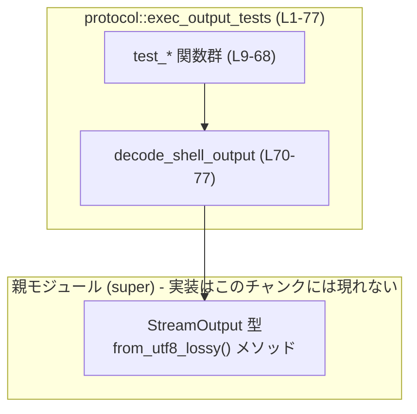
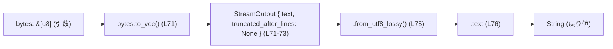
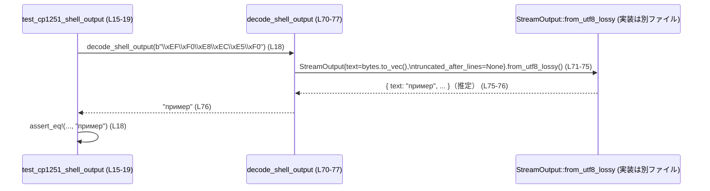

# protocol/src/exec_output_tests.rs コード解説

## 0. ざっくり一言

Windows / WSL 上のシェル出力に対して、`StreamOutput::from_utf8_lossy` が各種レガシー文字コード（CP1251, CP866, Windows-1252, Latin-1）や不正バイト列を期待どおりにデコードできているかを検証する **統合テスト** モジュールです（`protocol/src/exec_output_tests.rs:L1-4`）。

---

## 1. このモジュールの役割

### 1.1 概要

- このモジュールは、VSCode のシェルプレビューや Windows のコンソールが出力する **非 UTF-8 のバイト列** に対し、`StreamOutput::from_utf8_lossy` が適切に文字列へ変換できるかを検証します（`L1-4`）。
- UTF-8 だけでなく、CP1251/CP866/Windows-1252/Latin-1 などのレガシーコードページを扱う「スマートデコード」が、従来の `String::from_utf8_lossy` よりも良い結果を返すことを確認します（`L17-18,23-24,29-33,38-48,53-60`）。
- 検出に失敗した場合でも、最低限 `String::from_utf8_lossy` と同じく **置換文字 `U+FFFD` を含む結果** を返すことを保証します（`L63-67`）。

### 1.2 アーキテクチャ内での位置づけ

- このモジュールはテスト専用であり、実際のデコード処理は親モジュールの `StreamOutput` 型とその `from_utf8_lossy` メソッドに委ねています（`L6, L70-76`）。
- すべてのテストは共通のヘルパー `decode_shell_output` を通じて `StreamOutput` を利用します（`L70-76`）。



- `StreamOutput` の具体的な定義や `from_utf8_lossy` の実装は、このチャンクには登場しないため詳細は不明です（`L6, L71-76`）。

### 1.3 設計上のポイント

- **共通ヘルパー関数の利用**  
  すべてのテストが `decode_shell_output` を経由して `StreamOutput` を利用しており、テストごとの差分は入力バイト列と期待文字列だけになります（`L12,18,24,31,39,54,60,67,70-76`）。
- **複数のコードページとケースを網羅**  
  - 純粋な UTF-8（`L9-13`）
  - CP1251 / CP866（キリル文字）（`L15-25`）
  - Windows-1252 のスマートデコード（カギ括弧/ダッシュ）（`L27-34,36-48`）
  - ASCII と Latin-1 の混在、および純粋な Latin-1（`L51-61`）
  - デコード不能な不正バイト列（`L63-67`）
- **回帰テストの明示**  
  コメントで「Regression guard」と書かれており（`L38`）、過去に `String::from_utf8_lossy` だけでは置換文字に落ちてしまっていたケースを防ぐ目的であることが明示されています。
- **エラー処理／安全性**  
  このモジュール内には `unsafe` ブロックは存在せず、テスト失敗はすべて `assert_eq!` / `assert!` によるパニックとして扱われます（`L7, L12,18,24,30-33,40-43,45-48,54,60,67`）。

---

## 2. 主要な機能一覧

### 2.1 コンポーネント（関数）インベントリー

| 名前 | 種別 | 役割 / 用途 | 定義位置 |
|------|------|------------|----------|
| `test_utf8_shell_output` | 関数（テスト） | UTF-8 入力が検出器を通っても変更されないことを検証します。 | `protocol/src/exec_output_tests.rs:L9-13` |
| `test_cp1251_shell_output` | 関数（テスト） | CP1251 でエンコードされたキリル文字バイト列が正しく「пример」にデコードされることを検証します。 | `L15-19` |
| `test_cp866_shell_output` | 関数（テスト） | CP866 のキリル文字バイト列が正しく「пример」にデコードされることを検証します。 | `L21-25` |
| `test_windows_1252_smart_decoding` | 関数（テスト） | Windows-1252 のスマートクォート・ダッシュが適切な Unicode 文字に変換されることを検証します。 | `L27-34` |
| `test_smart_decoding_improves_over_lossy_utf8` | 関数（テスト） | `String::from_utf8_lossy` は置換文字を出すが、スマートデコードは正しい記号を維持することを比較検証します。 | `L36-49` |
| `test_mixed_ascii_and_legacy_encoding` | 関数（テスト） | ASCII のステータスメッセージと Latin-1 のアクセント付き文字が混在するケースを検証します。 | `L51-55` |
| `test_pure_latin1_shell_output` | 関数（テスト） | Latin-1 単独の出力が正しくデコードされることを検証します。 | `L57-61` |
| `test_invalid_bytes_still_fall_back_to_lossy` | 関数（テスト） | 不正なバイト列に対して、`String::from_utf8_lossy` と同じロッシーな結果にフォールバックすることを検証します。 | `L63-67` |
| `decode_shell_output` | 関数（テスト用ヘルパー） | 任意のバイト列を `StreamOutput::from_utf8_lossy` に通し、`String` として返す薄いラッパーです。 | `L70-77` |

---

## 3. 公開 API と詳細解説

このファイルはテストモジュールであり、外部に公開される API（`pub` 関数・型）は定義していません。ここではテストが利用している型と関数の振る舞いを整理します。

### 3.1 型一覧（構造体・列挙体など）

| 名前 | 種別 | 役割 / 用途 | 備考 |
|------|------|-------------|------|
| `StreamOutput` | 構造体（と推定される） | `text` フィールドにバイト列を保持し、`from_utf8_lossy` メソッドを通じてテキストデコードを行うコンテナです。 | `use super::StreamOutput;` で親モジュールからインポートされていますが、定義本体はこのチャンクには現れません（`L6, L70-76`）。 |

> 補足: `StreamOutput { text: bytes.to_vec(), truncated_after_lines: None }` というリテラルから、少なくとも `text` と `truncated_after_lines` というフィールドを持つことが読み取れます（`L71-73`）。それ以上のフィールドや振る舞いは、このチャンクからは分かりません。

### 3.2 重要な関数の詳細

#### `decode_shell_output(bytes: &[u8]) -> String`

**概要**

- 任意のバイト列を `StreamOutput::from_utf8_lossy` に通し、その結果の `text` フィールドを `String` として返すヘルパー関数です（`L70-76`）。
- すべてのテストで共通の「デコードパイプライン」を表現しており、実運用時の挙動を模したものと考えられます。

**引数**

| 引数名 | 型 | 説明 |
|--------|----|------|
| `bytes` | `&[u8]` | シェルからの出力を模した生のバイト列です（`L70`）。 |

**戻り値**

- `String`  
  `StreamOutput::from_utf8_lossy()` が生成したテキスト出力の `text` フィールドの値を返します（`L75-76`）。

**内部処理の流れ（アルゴリズム）**

1. `bytes` を `Vec<u8>` にコピーし、`StreamOutput { text, truncated_after_lines: None }` を生成します（`L71-73`）。
2. そのインスタンスに対して `from_utf8_lossy()` メソッドを呼び出します（`L75`）。
3. 返された値の `text` フィールドを取り出し、それを `String` として返します（`L76`）。



**Examples（使用例）**

テスト内での使用例を簡略化したものです。

```rust
// Windows-1252 のスマートクォートとダッシュを含むバイト列
let bytes = b"\x93\x94 test \x96 dash"; // L31

// スマートデコードされた文字列を取得する
let decoded = decode_shell_output(bytes); // L45

assert_eq!(
    decoded,
    "\u{201C}\u{201D} test \u{2013} dash", // L46
);
```

**Errors / Panics**

- この関数自体は `Result` や `Option` を返さず、直接 `String` を返します（`L70`）。
- `unsafe` は使っておらず、明示的な `panic!` 呼び出しもありません（ファイル全体に存在しません）。
- パニックの可能性があるとすれば、`StreamOutput::from_utf8_lossy` の内部実装に依存しますが、その実装はこのチャンクには現れないため、ここからは判断できません。

**Edge cases（エッジケース）**

- 不正バイト列（例: `b"\xFF\xFE\xFD"`）に対しては、テスト `test_invalid_bytes_still_fall_back_to_lossy` を通じて、`String::from_utf8_lossy` と同じロッシーな結果になることが要求されています（`L63-67`）。  
  これは `decode_shell_output` 経由のパイプラインの挙動として期待される契約です。

**使用上の注意点**

- この関数のデコード品質は `StreamOutput::from_utf8_lossy` に完全に依存しています。新しいコードページをサポートしたい場合は、こちらではなく `StreamOutput` 側の実装変更が必要になります。
- 入力 `bytes` はコピーされて `Vec<u8>` になるため（`L71`）、非常に大きなバッファを頻繁に渡すとメモリ割り当てコストが増えます。テストでは問題になりませんが、本番コードで同様のパターンを使う場合は注意が必要です。

---

#### `test_utf8_shell_output()`

**概要**

- 純粋な UTF-8 文字列（ロシア語の「пример」）が、「検出器をバイパスして変化しない」ことを検証するテストです（コメント `L11`）。

**引数**

- なし（テスト関数なので引数は取りません）。

**戻り値**

- なし（戻り値 `()`）。

**内部処理の流れ**

1. `"пример"` を `&[u8]` に変換するために `.as_bytes()` を呼び（`L12`）、`decode_shell_output` に渡します。
2. `decode_shell_output` の結果が `"пример"` と完全一致することを `assert_eq!` で確認します（`L12`）。

**Examples**

```rust
// UTF-8 文字列を bytes にしてからヘルパーに渡す
let decoded = decode_shell_output("пример".as_bytes()); // L12

assert_eq!(decoded, "пример"); // L12
```

**Errors / Panics**

- アサーションに失敗した場合、このテストはパニックして失敗と判定されます（`L12`）。

**Edge cases**

- UTF-8 以外の入力はここでは扱っていません。
- このテストは「UTF-8 の場合は一切変換されない」という基本契約を示します。

**使用上の注意点**

- `decode_shell_output` を使うコードは、既に UTF-8 であるものを二重に変換しても安全にそのまま返ってくることが期待されます。

---

#### `test_cp1251_shell_output()`

**概要**

- CP1251（Windows-1251）でエンコードされたキリル文字バイト列 `b"\xEF\xF0\xE8\xEC\xE5\xF0"` が、文字列 `"пример"` にデコードされることを検証します（`L17-18`）。

**引数 / 戻り値**

- 引数なし、戻り値なし（テスト関数）。

**内部処理の流れ**

1. CP1251 でエンコードされたバイト列を `decode_shell_output` に渡します（`L18`）。
2. 戻り値が `"пример"` と一致することを `assert_eq!` で確認します（`L18`）。

**Edge cases / 使用上の注意**

- Windows の VSCode シェルでよく見られる CP1251 出力に対して、正しいキリル文字を復元できることを保証するテストです（`L17`）。
- CP1251 以外のキリル系コードページ（例: KOI8-R）はこのファイルではテストされていません。

---

#### `test_cp866_shell_output()`

**概要**

- CP866 でエンコードされたキリル文字バイト列 `b"\xAF\xE0\xA8\xAC\xA5\xE0"` が `"пример"` にデコードされることを検証します（`L23-24`）。

**内部処理の流れ**

1. CP866 バイト列を `decode_shell_output` に渡します（`L24`）。
2. 結果が `"пример"` に一致するかを `assert_eq!` で確認します（`L24`）。

**Edge cases / 使用上の注意**

- コメントに「Native cmd.exe still defaults to CP866」とあるため（`L23`）、Windows の `cmd.exe` の既定コードページへの対応を確認するテストと分かります。
- CP866 と CP1251 の両方をカバーすることで、「どちらのコードページでも Cyrillic を正しく復元する」という契約を暗に表現しています。

---

#### `test_windows_1252_smart_decoding()`

**概要**

- Windows-1252 のバイト列 `b"\x93\x94 test \x96 dash"` をデコードした結果が、カギ括弧とダッシュの Unicode 文字（`“”` と `–`）に変換されることを検証します（`L28-33`）。

**内部処理の流れ**

1. Windows-1252 のスマートクォート / ダッシュを含むバイト列を `decode_shell_output` に渡します（`L31`）。
2. 結果が `"\u{201C}\u{201D} test \u{2013} dash"` と一致するかを `assert_eq!` で確認します（`L30-33`）。

**Edge cases**

- 一般的なロッシー UTF-8 変換では、これらのバイト値はしばしば `"\"'?"` のような別の記号になったり、不正シーケンスとして扱われることがありますが、このテストでは **正しい Unicode の記号に変換されること** を要求しています（コメント `L29`）。

**使用上の注意**

- このテストの存在から、`StreamOutput::from_utf8_lossy` は単純な UTF-8 デコードだけでなく、Windows-1252 特有の記号も認識する「スマートデコード」を実装していることが示唆されます。ただし、そのロジック自体はこのチャンクには現れません。

---

#### `test_smart_decoding_improves_over_lossy_utf8()`

**概要**

- 同じ Windows-1252 バイト列に対して、
  - `String::from_utf8_lossy` は置換文字 `� (U+FFFD)` を含む結果になる一方（`L39-43`）、
  - `decode_shell_output`（＝`StreamOutput::from_utf8_lossy` 経由）は置換文字なしの正しい記号を維持できる  
  ことを比較検証する回帰テストです（`L36-48`）。

**内部処理の流れ**

1. `let bytes = b"\x93\x94 test \x96 dash";` でテスト対象のバイト列を定義します（`L39`）。
2. `String::from_utf8_lossy(bytes)` の結果に置換文字 `U+FFFD` が含まれることを `assert!` で確認します（`L40-43`）。
3. `decode_shell_output(bytes)` の結果が `"\u{201C}\u{201D} test \u{2013} dash"` に一致することを `assert_eq!` で確認します（`L45-47`）。

**Edge cases**

- 「以前は `String::from_utf8_lossy()` だけだと置換文字となっていたが、今はスマートデコードで改善されている」という回帰条件を保証するテストです（コメント `L38`）。

**使用上の注意**

- 「単に `String::from_utf8_lossy` を使う」場合と比較して、`StreamOutput::from_utf8_lossy` を通すことで表示品質が向上することが示されています。  
  シェル出力の表示品質が重要な箇所では、テストと同様のデコードパスを使うべきであることを示す実例になっています。

---

#### `test_invalid_bytes_still_fall_back_to_lossy()`

**概要**

- デコード不能なバイト列 `b"\xFF\xFE\xFD"` に対して、`decode_shell_output` の結果が `String::from_utf8_lossy` と **まったく同じ文字列** になることを保証するテストです（`L63-67`）。

**内部処理の流れ**

1. 不正なバイト列 `bytes` を定義します（`L66`）。
2. `decode_shell_output(bytes)` の結果と `String::from_utf8_lossy(bytes)` の結果が一致するかを `assert_eq!` で確認します（`L67`）。

**Edge cases**

- コメントに「If detection fails, we still want the user to see replacement characters.」とあり（`L65`）、検出に失敗した場合でも、空文字列にしてしまうのではなく、`String::from_utf8_lossy` と同様に置換文字を含んだ結果を表示することが契約として明示されています。

**使用上の注意**

- スマートデコードが「認識できない入力」を与えられた場合のフォールバック挙動を固定化するものです。これにより、未対応のコードページや完全にランダムなバイト列に対しても、ユーザーに何かしらの文字列が返ることが保証されます。

---

### 3.3 その他の関数

補助的なテスト関数を一覧でまとめます。

| 関数名 | 役割（1 行） | 定義位置 |
|--------|--------------|----------|
| `test_mixed_ascii_and_legacy_encoding` | ASCII と Latin-1 の混在（`"Output: caf\xE9"`）が `"Output: café"` にデコードされることを検証します。 | `L51-55` |
| `test_pure_latin1_shell_output` | Latin-1 の `"caf\xE9"` が `"café"` にデコードされることを検証します。 | `L57-61` |

---

## 4. データフロー

ここでは代表的なシナリオとして、`test_cp1251_shell_output` を例に、バイト列がどのように流れていくかを整理します。

1. テスト関数が CP1251 バイト列 `b"\xEF\xF0\xE8\xEC\xE5\xF0"` を生成し、`decode_shell_output` に渡します（`L18`）。
2. `decode_shell_output` はそのバイト列を `StreamOutput { text, truncated_after_lines: None }` に詰め（`L71-73`）、`from_utf8_lossy` を呼び出します（`L75`）。
3. `from_utf8_lossy` は内部でスマートデコードを行い、デコード結果を保持するオブジェクト（少なくとも `text` フィールドを持つ）を返します（`L75-76`から読み取れる挙動）。
4. `decode_shell_output` はその `.text` を `String` として返し（`L76`）、テストが `"пример"` であることを検証します（`L18`）。



> `StreamOutput::from_utf8_lossy` の内部処理は、このチャンクには現れません。そのため、上記の `"пример"` への変換はテストの期待値からの推定であり、実装の詳細（どのようなコードページ判定を行っているか）は不明です。

---

## 5. 使い方（How to Use）

このファイル自体はテストですが、`StreamOutput` ベースのデコードパイプラインの実用的な使い方を示しています。

### 5.1 基本的な使用方法

テストと同じパターンで、任意のバイト列からテキストを得る基本フローは次のとおりです。

```rust
// シェルから取得した標準出力を想定したバイト列
let raw_output: &[u8] = b"\x93\x94 test \x96 dash"; // Windows-1252 の例

// StreamOutput に詰めてからスマートデコードを行う
let decoded = decode_shell_output(raw_output); // exec_output_tests.rs:L70-76 と同じパターン

// デコードされたテキストを利用する
println!("{}", decoded); // => “ ” や – が正しく表示される
```

`decode_shell_output` の中身はテストファイルに定義されているとおり、`StreamOutput { text, truncated_after_lines: None }.from_utf8_lossy().text` というフローです（`L70-76`）。

### 5.2 よくある使用パターン

- **UTF-8 のみの環境でも利用可能**  
  `test_utf8_shell_output` が示すように、入力が UTF-8 であればそのままの文字列として返されます（`L9-13`）。
- **Windows のレガシーコンソール出力の処理**  
  CP1251 / CP866 / Windows-1252 / Latin-1 といった Windows 系コードページを含んだ出力に対して、テストと同じように `decode_shell_output` を通すことで、ユーザーにとって読みやすい Unicode 文字列に変換できます（`L15-25, L27-34, L51-61`）。
- **デコード不能なログの安全な表示**  
  `test_invalid_bytes_still_fall_back_to_lossy` のとおり、検出に失敗しても `String::from_utf8_lossy` と同じ結果になるため（`L63-67`）、最悪でも何かしらの文字列（置換文字を含む）がログに残ります。

### 5.3 よくある間違い

テスト `test_smart_decoding_improves_over_lossy_utf8` が示唆する誤用パターンです（`L36-48`）。

```rust
// 誤り例: String::from_utf8_lossy だけに頼る場合
let bytes = b"\x93\x94 test \x96 dash"; // Windows-1252 のスマートクォート/ダッシュ

let s = String::from_utf8_lossy(bytes); // L40
assert!(s.contains('\u{FFFD}')); // 置換文字が混ざる (L41)

// 正しい（推奨）例: StreamOutput::from_utf8_lossy を経由する
let decoded = decode_shell_output(bytes); // L45
assert_eq!(decoded, "\u{201C}\u{201D} test \u{2013} dash"); // L46
```

- **ポイント**: 単に `String::from_utf8_lossy` を使うと、置換文字 `�` が入り読みにくくなるケースがありますが、`StreamOutput` 経由のスマートデコードでは期待どおりの記号に変換できます。

### 5.4 使用上の注意点（まとめ）

- `decode_shell_output`／`StreamOutput::from_utf8_lossy` は **同期処理** であり、非同期 (`async/await`) やスレッド並行実行はここでは扱っていません。このチャンクには並行性に関するコードは現れません。
- 入力バイト列は `Vec<u8>` にコピーされるため、大量の出力を頻繁に処理する場合はメモリ使用量に注意する必要があります（`L71`）。
- 不正バイト列や未対応コードページに対しても、`String::from_utf8_lossy` と同等のフォールバック結果を返すことがテストで期待されています（`L63-67`）。この挙動を変えると既存のテストが失敗します。

---

## 6. 変更の仕方（How to Modify）

### 6.1 新しい機能（新しいエンコード対応）を追加する場合

1. **デコード実装側の変更**  
   実際のデコードロジックは親モジュールの `StreamOutput::from_utf8_lossy` にあると考えられます（`L6, L70-76`）。新しいコードページをサポートする場合は、まずそちらにロジックを追加する必要があります。  
   ※ ただし、親モジュールのファイル名・構造はこのチャンクには現れないため、具体的な場所は不明です。
2. **テストの追加**  
   このテストファイルに、新しいコードページを想定した `#[test] fn test_...()` を追加します。既存のテストと同様に:
   - 対応するバイト列リテラル `b"..."`
   - 期待する Unicode 文字列
   - `decode_shell_output` を呼び出す `assert_eq!`  
   というパターンで記述できます（`L15-19, L21-25` などを参考）。

### 6.2 既存の機能を変更する場合

- **影響範囲の確認**  
  - `decode_shell_output` のシグネチャや内部構造（`StreamOutput { text, truncated_after_lines: None }.from_utf8_lossy().text`）を変更すると、すべてのテストに影響します（`L70-76`）。
- **契約（前提条件・返り値）の維持**  
  - UTF-8 は変化させない（`L9-13`）。
  - CP1251 / CP866 / Windows-1252 / Latin-1 などの特定ケースでは、コメントと期待値に記載された文字列を返す（`L15-25, L27-34, L51-61`）。
  - 不正バイト列では `String::from_utf8_lossy` と同じ結果を返す（`L63-67`）。  
  これらの契約を破る変更はテストが失敗するため、意図的に挙動を変える場合にはテストの期待値も合わせて更新する必要があります。
- **テストの更新**  
  - エンコード検出ロジックを変更した場合は、回帰テスト（特に `test_smart_decoding_improves_over_lossy_utf8`）がまだ妥当かどうかを確認する必要があります（`L36-48`）。

---

## 7. 関連ファイル

このチャンクから読み取れる、密接に関係するコンポーネントは以下のとおりです。

| パス / シンボル | 役割 / 関係 |
|----------------|------------|
| `super::StreamOutput` | 親モジュールで定義されている型であり、`decode_shell_output` の中でバイト列を保持しつつ `from_utf8_lossy` によるスマートデコードを提供します（`L6, L70-76`）。親モジュールの具体的なファイルパスは、このチャンクには現れません。 |
| `pretty_assertions::assert_eq` | 通常の `assert_eq!` を差し替えるマクロで、テスト失敗時の差分表示を見やすくするために使用されています（`L7, L12,18,24,30-33,45-47,54,60,67`）。 |

> このファイル自身はテスト専用であり、本番コードのエントリポイントや他のサービスモジュールとの直接の依存は、このチャンクからは読み取れません。
