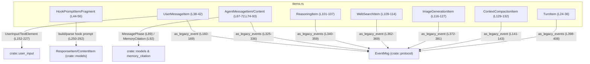
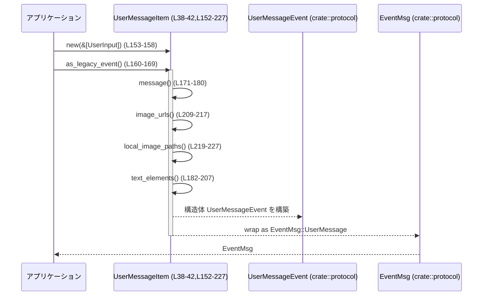
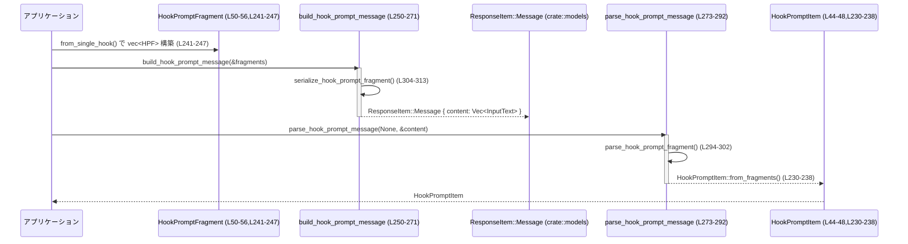

# protocol/src/items.rs

## 0. ざっくり一言

このモジュールは、「1ターン内の各種アイテム」（ユーザー発話、エージェント発話、Web検索結果など）を表現するデータ構造と、それらを既存のレガシーなイベントストリーム `EventMsg` との間で相互変換するロジックをまとめたものです（根拠: `protocol/src/items.rs:L24-L36,L134-L144,L152-L228,L315-L337,L339-L410`）。

---

## 1. このモジュールの役割

### 1.1 概要

- このモジュールは **会話ターンの構造化表現（TurnItem 群）** を定義し（`TurnItem` および関連構造体／列挙体）、  
  それらを JSON/TypeScript スキーマと互換な形でシリアライズ可能にします（根拠: `L24-L36,L38-L132`）。
- さらに、これらの構造化アイテムを **既存のイベント型 `EventMsg` 系** に変換するメソッド群（`as_legacy_event(s)` 系）を提供し、  
  新旧 API 間のブリッジとして機能します（根拠: `L134-L144,L152-L228,L315-L337,L339-L410`）。
- Hook 実行用のプロンプトについては、XML 断片として `ContentItem::InputText` 内に埋め込み、  
  その組み立て／パースを行う関数群を提供します（根拠: `L44-L65,L230-L248,L250-L313`）。

### 1.2 アーキテクチャ内での位置づけ

主な依存関係は以下の通りです。

- `crate::models`:
  - `ContentItem`, `ResponseItem`, `MessagePhase`, `WebSearchAction`（根拠: `L2-L5`）
- `crate::protocol`:
  - `EventMsg` と各種 `*Event` 型（根拠: `L6-L13`）
- `crate::user_input`:
  - `UserInput`, `TextElement`, `ByteRange`（根拠: `L14-L16`）
- `crate::memory_citation::MemoryCitation`（根拠: `L1`）
- 外部クレート:
  - `uuid`, `quick_xml`, `serde`, `schemars`, `ts_rs`（根拠: `L17-L22,L137,L296,L308`）

依存関係の概略図（本ファイル範囲 `L1-L410`）:



### 1.3 設計上のポイント

- **型安全なターン表現**  
  - `TurnItem` は `#[serde(tag = "type")]` / `#[ts(tag = "type")]` により、JSON/TS で判別可能な tagged enum としてシリアライズされます（根拠: `L24-L27`）。
- **レガシー互換レイヤ**  
  - 各アイテム型に `as_legacy_event(s)` を実装し、既存の `EventMsg` ベースの処理系との互換性を保っています（根拠: `L134-L144,L152-L228,L315-L337,L339-L410`）。
- **状態レスなデータ変換**  
  - 全ての処理は `&self` または引数から新しい値を生成する純粋な変換であり、モジュール内に共有可変状態はありません。  
    Rust の所有権／借用ルールに従い、スレッドセーフなデータ構造になっています（`Clone` 派生のみ、`unsafe` なし: 根拠 `L24,L38,L44,L50,L67,L74,L95,L101,L109,L116,L129`）。
- **エラーハンドリング**  
  - XML のパース／シリアライズなど失敗し得る処理は `Option<T>` を返し、`None` で「該当しない／解釈できない」ことを表現します（根拠: `L250-L271,L273-L313`）。
  - ライブラリコード本体には `unwrap`/`expect`/`panic!` は使われず、テスト内に限定されています（根拠: 本体 `L1-L410` に panic 類なし、テスト `L417-L438` にあり）。

---

## 2. 主要な機能一覧

- 会話ターン要素の表現:
  - `TurnItem` によるユーザー発話、エージェント発話、推論ログ、Web 検索、画像生成、コンテキスト圧縮などの表現（`L24-L36`）
- ユーザー入力からレガシーイベントへの変換:
  - `UserMessageItem::as_legacy_event` と補助メソッド群（テキスト連結、画像 URL 抽出、テキスト要素の byte range 再マッピング）（`L152-L227`）
- Hook プロンプトの構築／パース:
  - `HookPromptItem` / `HookPromptFragment` と、XML ベースの build/parse 関数群（`L44-L65,L230-L248,L250-L313`）
- エージェントメッセージのレガシーイベント化:
  - `AgentMessageItem` / `AgentMessageContent` と `as_legacy_events`（`L67-L72,L74-L93,L315-L337`）
- 推論ログのレガシーイベント化:
  - `ReasoningItem::as_legacy_events`（`L101-L107,L339-L359`）
- Web 検索・画像生成・コンテキスト圧縮のレガシーイベント化:
  - `WebSearchItem::as_legacy_event`, `ImageGenerationItem::as_legacy_event`,  
    `ContextCompactionItem::as_legacy_event`（`L109-L114,L362-L369,L116-L127,L372-L381,L129-L132,L134-L144`）
- ターン全体の一括変換:
  - `TurnItem::id`, `TurnItem::as_legacy_events` による集約変換（`L384-L410`）

### 2.1 コンポーネント一覧（型・関数インベントリー）

#### 型（構造体・列挙体）

| 名前 | 種別 | 公開? | 行範囲 | 役割 / 用途 |
|------|------|-------|--------|-------------|
| `TurnItem` | enum | 公開 | `L24-L36` | 1ターン内のアイテム種別（ユーザー発話、エージェント発話、計画、推論、検索、画像生成、コンテキスト圧縮）を表現 |
| `UserMessageItem` | struct | 公開 | `L38-L42` | ユーザー発話の ID と `UserInput` 列を保持 |
| `HookPromptItem` | struct | 公開 | `L44-L48` | Hook プロンプト全体（ID と複数フラグメント） |
| `HookPromptFragment` | struct | 公開 | `L50-L56` | Hook プロンプトのフラグメント（テキストと `hook_run_id`） |
| `HookPromptXml` | struct | 非公開 | `L58-L65` | XML シリアライズ／デシリアライズ用の内部表現 |
| `AgentMessageContent` | enum | 公開 | `L67-L72` | エージェントメッセージの内容種別（現在は Text のみ） |
| `AgentMessageItem` | struct | 公開 | `L74-L93` | エージェント発話の ID・内容・フェーズ・メモリ参照を保持 |
| `PlanItem` | struct | 公開 | `L95-L99` | 計画テキストを保持 |
| `ReasoningItem` | struct | 公開 | `L101-L107` | 推論サマリと raw ログを保持 |
| `WebSearchItem` | struct | 公開 | `L109-L114` | Web 検索の ID・クエリ・アクションを保持 |
| `ImageGenerationItem` | struct | 公開 | `L116-L127` | 画像生成の ID・ステータス・プロンプト・結果・保存パスを保持 |
| `ContextCompactionItem` | struct | 公開 | `L129-L132` | コンテキスト圧縮操作を表す ID を保持 |

#### 主要メソッド・関数

| 名前 | 種別 | 行範囲 | 役割（1 行） |
|------|------|--------|--------------|
| `ContextCompactionItem::new` | メソッド | `L135-L139` | 新しい UUID を持つコンテキスト圧縮アイテムを生成 |
| `ContextCompactionItem::as_legacy_event` | メソッド | `L141-L143` | `EventMsg::ContextCompacted` に変換 |
| `UserMessageItem::new` | メソッド | `L153-L158` | `UserInput` スライスから新規ユーザーメッセージを生成 |
| `UserMessageItem::as_legacy_event` | メソッド | `L160-L169` | レガシーな `UserMessageEvent` に変換 |
| `UserMessageItem::message` | メソッド | `L171-L180` | テキスト入力のみを連結したメッセージ文字列を生成 |
| `UserMessageItem::text_elements` | メソッド | `L182-L207` | 連結メッセージに合わせて `TextElement` の byte range を再マッピング |
| `UserMessageItem::image_urls` | メソッド | `L209-L217` | `UserInput::Image` から URL を抽出 |
| `UserMessageItem::local_image_paths` | メソッド | `L219-L227` | `UserInput::LocalImage` からパスを抽出 |
| `HookPromptItem::from_fragments` | メソッド | `L230-L238` | 任意の ID とフラグメント列から HookPrompt を構築 |
| `HookPromptFragment::from_single_hook` | メソッド | `L241-L247` | 単一 Hook 実行用のフラグメントを生成 |
| `build_hook_prompt_message` | 関数 | `L250-L271` | Hook フラグメント列から `ResponseItem::Message` を構築 |
| `parse_hook_prompt_message` | 関数 | `L273-L292` | `ContentItem` 列から HookPromptItem を復元 |
| `parse_hook_prompt_fragment` | 関数 | `L294-L302` | XML テキストから `HookPromptFragment` をパース |
| `serialize_hook_prompt_fragment` | 関数（非公開） | `L304-L313` | フラグメントを XML 文字列にシリアライズ |
| `AgentMessageItem::new` | メソッド | `L316-L322` | エージェントメッセージの新規生成（UUID 付与） |
| `AgentMessageItem::as_legacy_events` | メソッド | `L325-L336` | `AgentMessageContent` ごとに `AgentMessageEvent` を生成 |
| `ReasoningItem::as_legacy_events` | メソッド | `L340-L359` | 要約および raw 推論ログをイベント列に変換 |
| `WebSearchItem::as_legacy_event` | メソッド | `L362-L369` | Web 検索終了イベントに変換 |
| `ImageGenerationItem::as_legacy_event` | メソッド | `L372-L381` | 画像生成終了イベントに変換 |
| `TurnItem::id` | メソッド | `L385-L396` | 各バリアントの ID を取り出し |
| `TurnItem::as_legacy_events` | メソッド | `L398-L408` | ターンアイテムを 0 個以上の `EventMsg` にまとめて変換 |

---

## 3. 公開 API と詳細解説

### 3.1 型一覧（構造体・列挙体）

公開されている主要な型の概要です。

| 名前 | 種別 | 行範囲 | 役割 / 用途 |
|------|------|--------|-------------|
| `TurnItem` | enum | `L24-L36` | 1ターンの構成要素をバリアントで表現するトップレベル型 |
| `UserMessageItem` | struct | `L38-L42` | ユーザー入力（テキスト・画像など）を保持 |
| `HookPromptItem` | struct | `L44-L48` | Hook プロンプトのメタ表現（複数断片） |
| `HookPromptFragment` | struct | `L50-L56` | Hook プロンプト 1 断片のテキストと hook 実行 ID |
| `AgentMessageContent` | enum | `L67-L72` | エージェントメッセージの中身（現状 Text のみ） |
| `AgentMessageItem` | struct | `L74-L93` | エージェントメッセージ本体とフェーズ情報 |
| `PlanItem` | struct | `L95-L99` | モデルの計画テキスト |
| `ReasoningItem` | struct | `L101-L107` | 推論サマリと raw コンテンツ |
| `WebSearchItem` | struct | `L109-L114` | Web 検索呼び出し情報 |
| `ImageGenerationItem` | struct | `L116-L127` | 画像生成呼び出し情報 |
| `ContextCompactionItem` | struct | `L129-L132` | コンテキスト圧縮操作の識別子 |

### 3.2 関数詳細（重要 7 件）

#### 1. `UserMessageItem::as_legacy_event(&self) -> EventMsg`

**概要**

- 構造化された `UserMessageItem` を、従来の `EventMsg::UserMessage(UserMessageEvent)` 形式に変換します（根拠: `L160-L169`）。
- テキストの連結、画像 URL／ローカル画像パス抽出、テキスト要素の byte range 再マッピングを内部で呼び出します。

**引数**

| 引数名 | 型 | 説明 |
|--------|----|------|
| `&self` | `&UserMessageItem` | 変換対象のユーザーメッセージ |

**戻り値**

- `EventMsg`  
  - `UserMessageEvent` バリアントで、`message`, `images`, `local_images`, `text_elements` を含みます。

**内部処理の流れ**

1. `self.message()` でテキスト入力のみを連結した文字列を生成（`L171-L180`）。
2. `self.image_urls()` で `UserInput::Image` から URL を抽出（`L209-L217`）。
3. `self.local_image_paths()` で `UserInput::LocalImage` から `PathBuf` を抽出（`L219-L227`）。
4. `self.text_elements()` でテキスト要素の byte range を連結メッセージに合わせて再マッピング（`L182-L207`）。
5. これらをフィールドに持つ `UserMessageEvent` を構築し、`EventMsg::UserMessage(...)` として返却（`L163-L168`）。

**Examples（使用例）**

```rust
use crate::user_input::UserInput;
use crate::protocol::EventMsg;
use crate::items::UserMessageItem; // 実際のモジュールパスは crate 構成による

// ユーザーからの単純なテキスト入力を構造化してイベントに変換する例
let inputs = vec![
    UserInput::Text {
        text: "Hello, ".to_string(),
        text_elements: vec![], // 詳細な要素がない場合は空
    },
    UserInput::Text {
        text: "world!".to_string(),
        text_elements: vec![],
    },
];

let item = UserMessageItem::new(&inputs);
let event: EventMsg = item.as_legacy_event();
// event は EventMsg::UserMessage(...) になる
```

**Errors / Panics**

- ライブラリコードとしてはエラーも panic も発生しません。
- 内部で行っている処理は String の連結や `Vec` への `collect` のみであり、OOM 等の一般的なシステムエラー以外は想定されていません。

**Edge cases（エッジケース）**

- `self.content` にテキスト入力が 1 つもない場合  
  - `message()` は空文字列を返します（根拠: `L171-L180`）。
  - `text_elements()` は空ベクタを返します。
- 画像入力が存在しない場合  
  - `images` は `Some(vec![])`（空ベクタを包んだ Some）になります（根拠: `L165,L209-L217`）。
- ローカル画像がない場合  
  - `local_images` は空ベクタになります（根拠: `L166,L219-L227`）。

**使用上の注意点**

- `UserInput` にテキストと画像が混在している場合、`message()` には画像部分は一切現れません（画像は別フィールドで扱われます）。
- `text_elements()` の byte range は `String::len()`（バイト長）を基準に再マッピングされるため、`ByteRange` もバイトオフセットとして解釈されている前提です（根拠: `L184-L196`）。  
  文字数単位のインデックスとは異なることに注意が必要です。

---

#### 2. `UserMessageItem::text_elements(&self) -> Vec<TextElement>`

**概要**

- 複数のテキストチャンクを連結したメッセージに対して、各 `TextElement` の byte range を再計算して返します（根拠: `L182-L207`）。
- 元の `UserInput::Text` ごとに持っている相対的な `byte_range` をグローバルなオフセットに変換します。

**引数**

| 引数名 | 型 | 説明 |
|--------|----|------|
| `&self` | `&UserMessageItem` | テキスト要素を計算する対象 |

**戻り値**

- `Vec<TextElement>`  
  - 各要素は連結済みメッセージ文字列に対する byte range を持ちます。

**内部処理の流れ**

1. `out`（結果格納）と `offset`（現在の累積バイト位置）を初期化（`L183-L184`）。
2. `self.content` を順に走査（`L185`）。
3. `UserInput::Text { text, text_elements }` の場合のみ処理し、それ以外のバリアントは無視（`L186-L190`）。
4. 各 `elem` について、`ByteRange { start: offset + elem.byte_range.start, end: offset + elem.byte_range.end }` を計算（`L193-L196`）。
5. `TextElement::new` に byte_range と `elem.placeholder(text)` で得たプレースホルダ文字列（`Option<String>`）を渡し、`out` に push（`L198-L201`）。
6. チャンクの `text.len()` を offset に加算し、次のチャンクに備える（`L203`）。
7. 全入力を処理したら `out` を返す（`L206`）。

**Examples（使用例）**

```rust
// 仮の TextElement / UserInput を使った例（実際の構造は crate::user_input を参照）
use crate::items::UserMessageItem;
use crate::user_input::{UserInput, TextElement, ByteRange};

let text1 = "Hello";
let text2 = " Rust";
let elem1 = TextElement::new(
    ByteRange { start: 0, end: 5 }, // "Hello"
    Some("GREETING".to_string()),
);
let elem2 = TextElement::new(
    ByteRange { start: 1, end: 5 }, // "Rust" (2つめのチャンク内)
    Some("LANG".to_string()),
);

let inputs = vec![
    UserInput::Text { text: text1.to_string(), text_elements: vec![elem1.clone()] },
    UserInput::Text { text: text2.to_string(), text_elements: vec![elem2.clone()] },
];

let item = UserMessageItem::new(&inputs);
let elements = item.text_elements();

// elements[0].byte_range は start=0, end=5
// elements[1].byte_range は start=6, end=10 （先頭チャンク5バイト + チャンク内 start/end）
```

**Errors / Panics**

- 例外的な入力に対する明示的なエラーや panic はありません。
- `text.len()` は UTF-8 バイト長であり、サロゲート等を意識した特別な処理は行っていません。

**Edge cases（エッジケース）**

- `self.content` にテキスト要素を持たない入力だけが含まれる場合  
  → 空ベクタを返します。
- テキストが空文字列で `text_elements` がある場合  
  - `text.len()` は 0 なので `offset` は増加しません。
  - このようなケースが発生するかどうかは `UserInput` の生成側に依存し、本ファイルからは分かりません。

**使用上の注意点**

- `message()` で連結されたテキストと、`text_elements()` で得られる byte range は対応するよう設計されています。  
  `message()` を変更する場合は必ず `text_elements()` のオフセット計算との整合性を確認する必要があります。
- バイトオフセットを前提としているため、UI 側で「文字インデックス」に変換する場合は UTF-8 デコードを考慮した変換が別途必要です。

---

#### 3. `build_hook_prompt_message(fragments: &[HookPromptFragment]) -> Option<ResponseItem>`

**概要**

- 複数の `HookPromptFragment` から、XML 形式のテキストを `ContentItem::InputText` に詰めた `ResponseItem::Message` を構築します（根拠: `L250-L271`）。
- `hook_run_id` が空のフラグメントや XML シリアライズに失敗したフラグメントはスキップされます。

**引数**

| 引数名 | 型 | 説明 |
|--------|----|------|
| `fragments` | `&[HookPromptFragment]` | Hook プロンプトのフラグメント列 |

**戻り値**

- `Option<ResponseItem>`  
  - 有効なフラグメントが 1 つ以上あれば `Some(ResponseItem::Message { ... })`。  
  - 1 つもなければ `None`。

**内部処理の流れ**

1. `fragments.iter()` でフラグメント列を走査（`L251`）。
2. `fragment.hook_run_id.trim().is_empty()` なものを除外（`L253`）。
3. 各フラグメントを `serialize_hook_prompt_fragment(&fragment.text, &fragment.hook_run_id)` で XML 文字列に変換し、成功したものだけ `ContentItem::InputText { text }` に変換（`L254-L257`）。
4. すべての有効フラグメントから `Vec<ContentItem>` を作成（`L251-L258`）。
5. `content` が空なら `None` を返す（`L260-L262`）。
6. そうでなければ、新しい UUID を ID とし、`role: "user"` を持つ `ResponseItem::Message` を構築して `Some(...)` を返す（`L264-L270`）。

**Examples（使用例）**

```rust
use crate::items::{HookPromptFragment, build_hook_prompt_message};
use crate::models::ResponseItem;

let fragments = vec![
    HookPromptFragment::from_single_hook("Retry with care & joy.", "hook-run-1"),
    HookPromptFragment::from_single_hook("Then summarize cleanly.", "hook-run-2"),
];

let message_opt = build_hook_prompt_message(&fragments);
if let Some(ResponseItem::Message { content, .. }) = message_opt {
    // content は InputText の列で、それぞれが <hook_prompt ...>...</hook_prompt> 形式の XML を含む
}
```

**Errors / Panics**

- XML シリアライズに失敗した場合（`to_xml_string` が Err を返した場合）、そのフラグメントは silently にスキップされます（`serialize_hook_prompt_fragment` 内で `.ok()` を使用: `L308-L312`）。
- ライブラリとしては panic しません。

**Edge cases（エッジケース）**

- 全てのフラグメントの `hook_run_id` が空または空白のみ  
  → `content` は空になり、`None` を返します（`L260-L262`）。
- 一部のフラグメントのみシリアライズに失敗  
  → 失敗した分だけ除外され、残りのフラグメントだけが `content` に含まれます。
- `fragments` 自体が空  
  → `content` は空となり、`None` を返します。

**使用上の注意点**

- 戻り値が `None` の場合、「エラー」ではなく「Hook プロンプトメッセージを構築する条件を満たさなかった」という意味になります。  
  呼び出し側でこの違いを解釈する必要があります。
- 生成される `ResponseItem::Message` の `role` は `"user"` に固定されており、他ロールへの変更はこの関数の修正が必要です（根拠: `L266`）。

---

#### 4. `parse_hook_prompt_message(id: Option<&String>, content: &[ContentItem]) -> Option<HookPromptItem>`

**概要**

- `build_hook_prompt_message` によって埋め込まれた（または互換形式の）`ContentItem::InputText` 列から、`HookPromptItem` を復元します（根拠: `L273-L292`）。
- 全ての `ContentItem` が適切な XML 形式 `hook_prompt` である場合のみ成功します。

**引数**

| 引数名 | 型 | 説明 |
|--------|----|------|
| `id` | `Option<&String>` | 復元する `HookPromptItem` の ID。`None` の場合は新しい UUID を生成 |
| `content` | `&[ContentItem]` | パース対象のコンテンツ列 |

**戻り値**

- `Option<HookPromptItem>`  
  - 成功時はフラグメント列を含む `HookPromptItem`。  
  - `content` が不適切な場合やフラグメントが 0 件の場合は `None`。

**内部処理の流れ**

1. `content.iter()` で要素を走査し、各要素に対して以下を行う（`L277-L285`）:
   - `let ContentItem::InputText { text } = content_item else { return None; }` で、`InputText` 以外が混在していたら即座に `None` を返す。
   - `parse_hook_prompt_fragment(text)` で XML を `HookPromptFragment` にパース（`L283`）。
2. `.collect::<Option<Vec<_>>>()?` により、全ての要素が `Some` であれば `Vec<HookPromptFragment>` に、そうでなければ `None` になる（`L285`）。
3. `fragments` が空なら `None` を返す（`L287-L289`）。
4. `HookPromptItem::from_fragments(id, fragments)` で最終的な `HookPromptItem` を生成し `Some(...)` を返す（`L291`）。

**Examples（使用例）**

```rust
use crate::items::{HookPromptItem, build_hook_prompt_message, parse_hook_prompt_message};
use crate::models::ResponseItem;

// まず HookPromptFragment からメッセージを構築
let original_fragments = vec![
    HookPromptFragment::from_single_hook("Retry with care & joy.", "hook-run-1"),
    HookPromptFragment::from_single_hook("Then summarize cleanly.", "hook-run-2"),
];

let ResponseItem::Message { content, .. } =
    build_hook_prompt_message(&original_fragments).expect("hook prompt") else {
        unreachable!();
    };

// 次にそのメッセージから HookPromptItem を復元
let parsed = parse_hook_prompt_message(None, &content).expect("parsed hook prompt");
// parsed.fragments == original_fragments（テストで検証済み: L417-L431）
```

**Errors / Panics**

- `ContentItem` に `InputText` 以外のバリアントが 1 つでも含まれていると、パースは即座に `None` を返します（`L279-L282`）。
- XML パースに失敗した場合も、`parse_hook_prompt_fragment` が `None` を返し、結果として全体が `None` になります（`L283,L294-L301`）。
- ライブラリコード内で panic は発生しません。

**Edge cases（エッジケース）**

- `content` が空  
  → `fragments` は空ベクタとなり、`fragments.is_empty()` により `None` が返されます。
- 一部の `ContentItem` だけが適切な hook_prompt XML、他は `InputText` だが別形式  
  → `.collect::<Option<Vec<_>>>()` により全体が `None` になります（部分的成功はしません）。

**使用上の注意点**

- 「1 つでも解釈できない要素があると全体を放棄する」という振る舞いになっているため、  
  `content` に Hook プロンプト以外のテキストを混在させないことが前提になります。
- `id` を `Some(&existing_id)` として渡すことで、元の ID を保持したままフラグメントだけを入れ替えることができます。

---

#### 5. `parse_hook_prompt_fragment(text: &str) -> Option<HookPromptFragment>`

**概要**

- 単一の XML 文字列 `<hook_prompt hook_run_id="...">...</hook_prompt>` を `HookPromptFragment` に変換します（根拠: `L294-L302`）。
- Hook ID が空白のみの場合は `None` になります。

**引数**

| 引数名 | 型 | 説明 |
|--------|----|------|
| `text` | `&str` | XML 形式の hook プロンプト文字列 |

**戻り値**

- `Option<HookPromptFragment>`  
  - XML としてパースでき、かつ `hook_run_id` が非空なら `Some`。

**内部処理の流れ**

1. `text.trim()` で前後の空白を除去（`L295`）。
2. `from_xml_str::<HookPromptXml>(trimmed).ok()?` で XML を `HookPromptXml` にパース（`L296`）。
3. `hook_run_id.trim().is_empty()` なら `None` を返す（`L297-L299`）。
4. `HookPromptFragment { text, hook_run_id }` を構築して `Some(...)` を返す（`L301`）。

**Examples（使用例）**

```rust
use crate::items::parse_hook_prompt_fragment;

let xml = r#"<hook_prompt hook_run_id="hook-run-1">Retry with tests.</hook_prompt>"#;
let fragment = parse_hook_prompt_fragment(xml).expect("valid hook prompt");

// fragment.text == "Retry with tests."
// fragment.hook_run_id == "hook-run-1"
```

この挙動はテスト `hook_prompt_parses_legacy_single_hook_run_id` で検証されています（`L433-L446`）。

**Errors / Panics**

- XML の形式が異なる場合、`from_xml_str` が Err を返し、`.ok()?` により `None` を返します。
- panic はしません。

**Edge cases（エッジケース）**

- テキストの前後に空白や改行がある  
  → `trim()` で除去した上でパースされます。
- `<hook_prompt>` タグだが `hook_run_id` 属性が欠けている／空白のみ  
  → `hook_run_id.trim().is_empty()` により `None` になります。

**使用上の注意点**

- この関数は「hook プロンプトとして解釈可能かどうか」を判定する用途に向いており、  
  解釈不能な場合もエラーではなく `None` で返します。  
  厳密なバリデーションとエラー理由が必要な場合は、別途 `Result` 型を返すラッパーを用意する必要があります（このファイルには存在しません）。

---

#### 6. `AgentMessageItem::as_legacy_events(&self) -> Vec<EventMsg>`

**概要**

- `AgentMessageItem` 内の `AgentMessageContent` 列を、それぞれ個別の `EventMsg::AgentMessage` に変換して返します（根拠: `L325-L336`）。
- `phase` や `memory_citation` といったメタ情報もイベントに引き継ぎます。

**引数**

| 引数名 | 型 | 説明 |
|--------|----|------|
| `&self` | `&AgentMessageItem` | 変換対象のエージェントメッセージ |

**戻り値**

- `Vec<EventMsg>`  
  - 各要素は `EventMsg::AgentMessage(AgentMessageEvent)`。

**内部処理の流れ**

1. `self.content.iter()` で `AgentMessageContent` 列を走査（`L326-L327`）。
2. 各要素に対して `match` する。現状は `AgentMessageContent::Text { text }` のみ（`L328-L333`）。
3. それぞれ `AgentMessageEvent { message: text.clone(), phase: self.phase.clone(), memory_citation: self.memory_citation.clone() }` を構築して `EventMsg::AgentMessage(...)` に包む（`L329-L333`）。
4. `.collect()` で `Vec<EventMsg>` にまとめて返す（`L335`）。

**Examples（使用例）**

```rust
use crate::items::{AgentMessageItem, AgentMessageContent};
use crate::protocol::EventMsg;

let contents = vec![
    AgentMessageContent::Text { text: "Thinking...".into() },
    AgentMessageContent::Text { text: "Final answer.".into() },
];

let mut item = AgentMessageItem::new(&contents);
// 必要なら item.phase や item.memory_citation を後から設定することも可能（このファイルには setter はない）

let events: Vec<EventMsg> = item.as_legacy_events();
// events.len() == 2
// 両方の EventMsg::AgentMessage に同じ phase / memory_citation が入る
```

**Errors / Panics**

- エラーや panic は発生しません。

**Edge cases（エッジケース）**

- `self.content` が空  
  → 空ベクタを返します。
- 今後 `AgentMessageContent` に別バリアントが追加された場合  
  → この `match` に分岐を追加する必要があります。現時点では Text のみです（根拠: `L70-L72`）。

**使用上の注意点**

- 各 `EventMsg::AgentMessage` に同じ `phase` / `memory_citation` がコピーされる点に注意が必要です。  
  コンテンツごとに異なるフェーズを表現したい場合は設計変更が必要になります（このファイルでは対応していません）。

---

#### 7. `ReasoningItem::as_legacy_events(&self, show_raw_agent_reasoning: bool) -> Vec<EventMsg>`

**概要**

- `ReasoningItem` に含まれる推論サマリと raw コンテンツを、それぞれ `AgentReasoningEvent` / `AgentReasoningRawContentEvent` として `EventMsg` 列に変換します（根拠: `L339-L359`）。
- `show_raw_agent_reasoning` フラグにより raw コンテンツを出力するかどうかを制御します。

**引数**

| 引数名 | 型 | 説明 |
|--------|----|------|
| `&self` | `&ReasoningItem` | 変換対象の推論データ |
| `show_raw_agent_reasoning` | `bool` | raw コンテンツをイベント化するかどうか |

**戻り値**

- `Vec<EventMsg>`  
  - 要約テキストは `AgentReasoningEvent` に、raw テキストは `AgentReasoningRawContentEvent` になります。

**内部処理の流れ**

1. 空の `Vec<EventMsg>` を用意（`L341`）。
2. `self.summary_text` をループし、各エントリごとに `EventMsg::AgentReasoning(AgentReasoningEvent { text: summary.clone() })` を push（`L342-L346`）。
3. `show_raw_agent_reasoning` が `true` の場合のみ、`self.raw_content` をループして  
   `EventMsg::AgentReasoningRawContent(AgentReasoningRawContentEvent { text: entry.clone() })` を push（`L348-L355`）。
4. 最終的な `events` を返す（`L358`）。

**Examples（使用例）**

```rust
use crate::items::ReasoningItem;
use crate::protocol::EventMsg;

let reasoning = ReasoningItem {
    id: "r1".into(),
    summary_text: vec!["Plan step 1".into(), "Plan step 2".into()],
    raw_content: vec!["full token stream here".into()],
};

let events_summary_only = reasoning.as_legacy_events(false);
// events_summary_only.len() == 2

let events_with_raw = reasoning.as_legacy_events(true);
// events_with_raw.len() == 3
```

**Errors / Panics**

- エラー／panic はありません。

**Edge cases（エッジケース）**

- `summary_text` が空、`raw_content` のみ存在する場合  
  - `show_raw_agent_reasoning == false` だと空ベクタ、`true` だと raw イベントだけが返されます。
- 両方とも空の場合  
  - 常に空ベクタです。

**使用上の注意点**

- `show_raw_agent_reasoning` はイベント生成の段階で適用されるため、  
  `TurnItem::as_legacy_events` から ReasoningItem を処理する場合もこのフラグを渡す必要があります（根拠: `L398-L408`）。

---

### 3.3 その他の関数

| 関数名 | 行範囲 | 役割（1 行） |
|--------|--------|--------------|
| `ContextCompactionItem::new` | `L135-L139` | コンテキスト圧縮アイテムの新規生成（UUID 付与） |
| `ContextCompactionItem::as_legacy_event` | `L141-L143` | 圧縮完了イベント `ContextCompactedEvent` の生成 |
| `UserMessageItem::message` | `L171-L180` | テキスト入力のみを連結したメッセージ文字列生成 |
| `UserMessageItem::image_urls` | `L209-L217` | `UserInput::Image` から URL を抽出 |
| `UserMessageItem::local_image_paths` | `L219-L227` | `UserInput::LocalImage` からパスを抽出 |
| `HookPromptItem::from_fragments` | `L230-L238` | 任意の ID とフラグメント列から HookPrompt を生成 |
| `HookPromptFragment::from_single_hook` | `L241-L247` | 単一 Hook 用のフラグメントを生成するユーティリティ |
| `serialize_hook_prompt_fragment` | `L304-L313` | フラグメントを XML 文字列に変換する内部関数 |
| `AgentMessageItem::new` | `L316-L322` | エージェントメッセージの新規生成（UUID 付与） |
| `WebSearchItem::as_legacy_event` | `L362-L369` | Web 検索の終了イベント `WebSearchEndEvent` を生成 |
| `ImageGenerationItem::as_legacy_event` | `L372-L381` | 画像生成の終了イベント `ImageGenerationEndEvent` を生成 |
| `TurnItem::id` | `L385-L396` | 任意の `TurnItem` から ID を取り出す |
| `TurnItem::as_legacy_events` | `L398-L408` | ターン全体を 0 個以上の `EventMsg` に変換 |

---

## 4. データフロー

ここでは代表的な 2 つの処理シナリオのデータフローを示します。

### 4.1 ユーザー入力 → レガシー `UserMessageEvent`

`UserMessageItem` を経由して `EventMsg::UserMessage` を生成する流れです。



要点:

- テキスト連結とテキスト要素のオフセット変換は `UserMessageItem` の内部責務です（`L171-L207`）。
- 呼び出し側は `UserMessageItem::as_legacy_event` ひとつを呼べば、画像やテキスト要素を含むレガシーイベントを取得できます。

### 4.2 Hook プロンプトのラウンドトリップ

`HookPromptFragment` 列 → `ResponseItem::Message` → `HookPromptItem` の流れです。



このラウンドトリップはテスト `hook_prompt_roundtrips_multiple_fragments` で確認されています（`L417-L431`）。

---

## 5. 使い方（How to Use）

### 5.1 基本的な使用方法

#### ユーザーメッセージからレガシーイベントを生成

```rust
use crate::items::{UserMessageItem, TurnItem};
use crate::user_input::UserInput;
use crate::protocol::EventMsg;

// 1. ユーザー入力を構造化
let inputs = vec![
    UserInput::Text {
        text: "Hello ".to_string(),
        text_elements: vec![],
    },
    UserInput::Image {
        image_url: "https://example.com/image.png".to_string(),
    },
];

let user_item = UserMessageItem::new(&inputs);

// 2. TurnItem に包む（必要に応じて）
let turn = TurnItem::UserMessage(user_item);

// 3. レガシーイベントに変換
let events: Vec<EventMsg> = turn.as_legacy_events(/*show_raw_agent_reasoning*/ false);
// events には EventMsg::UserMessage が 1 つ入る
```

#### エージェントメッセージをイベントストリームに変換

```rust
use crate::items::{AgentMessageItem, AgentMessageContent, TurnItem};
use crate::protocol::EventMsg;

let contents = vec![
    AgentMessageContent::Text { text: "Thinking...".into() },
    AgentMessageContent::Text { text: "Answer.".into() },
];

let agent_item = AgentMessageItem::new(&contents);
let turn = TurnItem::AgentMessage(agent_item);

let events: Vec<EventMsg> = turn.as_legacy_events(false);
// 2 つの EventMsg::AgentMessage が生成される
```

### 5.2 よくある使用パターン

1. **Hook プロンプトの送受信**

   - 送信側: `HookPromptFragment` の列から `ResponseItem::Message` を組み立ててモデルへ送る（`build_hook_prompt_message`）。
   - 受信側: モデルから返ってきた `ResponseItem::Message` を `parse_hook_prompt_message` で解析し、`HookPromptItem` として扱う。

2. **Reasoning の可視化**

   - `TurnItem::Reasoning` バリアントを受け取り、`as_legacy_events(true)` で raw 推論ログまでイベント化し、UI 側でストリーム表示する。

### 5.3 よくある間違い

```rust
// 間違い例: Hook プロンプト以外のテキストも含めて parse_hook_prompt_message を呼ぶ
let content = vec![
    ContentItem::InputText { text: "<hook_prompt ...>".into() },
    ContentItem::InputText { text: "普通のメッセージ".into() },
];
let parsed = parse_hook_prompt_message(None, &content);
// parsed は None になる可能性が高い（どれか 1 つでも Hook と解釈できなければ全体が None: L277-L285）

// 正しい例: Hook 用コンテンツだけを parse に渡す
let hook_content = vec![
    ContentItem::InputText { text: "<hook_prompt ...>".into() },
];
let parsed = parse_hook_prompt_message(None, &hook_content);
// HookPromptItem として復元できる
```

```rust
// 間違い例: TurnItem::Plan をレガシーイベントに変換できると思い込む
let plan_item = PlanItem { id: "p1".into(), text: "Do X then Y".into() };
let turn = TurnItem::Plan(plan_item);
let events = turn.as_legacy_events(false);
// events は常に空 Vec になる（L398-L405）

// 正しい理解: Plan や HookPrompt はレガシー EventMsg 化されない
assert!(events.is_empty());
```

### 5.4 使用上の注意点（まとめ）

- **レガシー互換性の範囲**
  - `TurnItem::HookPrompt` と `TurnItem::Plan` は `as_legacy_events` でイベントを生成しません（`L398-L405`）。  
    これらは新しい turn-item ベースの API でのみ意味を持ちます。
- **Option ベースのエラー表現**
  - Hook 関連関数は不正な入力に対して `None` を返す設計であり、エラー理由は提供しません（`L250-L271,L273-L302`）。
- **スレッド安全性**
  - すべての処理は不変データと所有権移動／複製に基づく純粋な変換であり、このモジュール固有の共有可変状態はありません。  
    複数スレッドで同じ値を読む場合、`Clone` して使用できます（多くの型で `Clone` 派生: `L24,L38,L44,L50,L67,L74,L95,L101,L109,L116,L129`）。
- **テキスト範囲の単位**
  - `text_elements()` は UTF-8 バイトオフセットで計算されていると解釈されます（`String::len()` を使用: `L184-L196`）。  
    UI 側で文字単位のハイライトを行う場合は変換が必要です。

---

## 6. 変更の仕方（How to Modify）

### 6.1 新しい機能を追加する場合

1. **新しいターン種別を追加したい場合**

   - `TurnItem` に新しいバリアント（例: `ToolCall(ToolCallItem)`）を追加します（`L24-L36`）。
   - 対応する構造体 `ToolCallItem` を本ファイル、または適切なモジュールに定義し、`serde` / `TS` / `JsonSchema` 派生を付与します。
   - レガシー互換が必要であれば、`ToolCallItem::as_legacy_event(s)` を定義し、`TurnItem::as_legacy_events` に分岐を追加します（`L398-L408`）。

2. **Hook プロンプトのフォーマットを拡張したい場合**

   - XML 形式の変更が必要な場合は `HookPromptXml` 構造体（`L58-L65`）と  
     `parse_hook_prompt_fragment` / `serialize_hook_prompt_fragment` を合わせて変更する必要があります（`L294-L302,L304-L313`）。
   - ラウンドトリップテスト `hook_prompt_roundtrips_multiple_fragments`（`L417-L431`）を更新し、期待通りに動作することを確認します。

### 6.2 既存の機能を変更する場合

- **影響範囲の確認方法**

  - 型／関数を検索し、`TurnItem::as_legacy_events` から到達するレガシーイベントへの変換パスを確認します（`L384-L410`）。
  - `tests` モジュール（`L412-L448`）で直接参照されていないかを確認します。

- **変更時に注意すべき契約**

  - `UserMessageItem::message` と `UserMessageItem::text_elements` の結果は整合している必要があります（`L171-L180,L182-L207`）。
  - Hook 関連関数は「部分的成功はしない」契約 (`collect::<Option<Vec<_>>>()`) を暗黙に持っています（`L277-L285`）。

- **テスト**

  - Hook プロンプトの round-trip と legacy XML 互換性は既存テストでカバーされています（`L417-L431,L433-L446`）。
  - 仕様変更時は既存テストを更新し、必要に応じて新しいケース（エッジケースなど）を追加することが望ましいです。

---

## 7. 関連ファイル

このモジュールと密接に関係するモジュール／型です（実際のファイルパスはこのチャンクからは不明なものもあります）。

| パス / モジュール | 役割 / 関係 |
|-------------------|------------|
| `crate::protocol` | `EventMsg` および各種 `*Event` 型を定義し、本モジュールの `as_legacy_event(s)` 系の出力先になります（`L6-L13,L141-L143,L160-L169,L325-L336,L339-L381,L384-L410`）。 |
| `crate::models` | `ContentItem`, `ResponseItem`, `MessagePhase`, `WebSearchAction` を提供し、Hook プロンプトやメッセージフェーズ情報の表現に使われます（`L2-L5,L83-L89,L250-L271`）。 |
| `crate::user_input` | `UserInput`, `TextElement`, `ByteRange` を定義し、ユーザー入力およびテキスト要素の範囲指定に利用されます（`L14-L16,L182-L207`）。 |
| `crate::memory_citation` | `MemoryCitation` 型を提供し、エージェントメッセージに紐づくメモリ参照情報として利用されます（`L1,L90-L92,L329-L333`）。 |

---

### 安全性・バグ・セキュリティ観点（まとめ）

- **メモリ安全性**  
  - 本ファイル内には `unsafe` ブロックは存在せず（全行確認）、すべて安全な Rust 構文のみで記述されています。
- **エラー処理**  
  - XML パース／シリアライズの失敗は `Option` によって表現され、panic にはなりません（`L250-L271,L273-L302,L304-L313`）。
- **セキュリティ**  
  - Hook プロンプトで扱う XML は `quick_xml` によるシリアライズ／デシリアライズであり、  
    任意の外部エンティティ参照などの機能は使っていません（コード中にそのような設定は見られません）。  
    ただし、入力文字列をそのまま XML のテキストノードに入れるため、実際の環境での取り扱い（ログ出力等）には通常のサニタイズ方針が必要です。
- **潜在的な注意点**  
  - Hook メッセージのパースでは部分的成功を認めず、「1 つでも不正な要素があると全体が `None`」という仕様のため、  
    将来コンテンツ形式が混在する場合には挙動に注意が必要です（`L277-L285`）。
