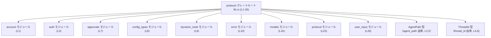

# protocol/src/lib.rs コード解説

## 0. ざっくり一言

`protocol` クレート全体のエントリポイント（クレートルート）であり、複数の機能モジュールを公開し、一部の内部型を再エクスポートするための集約モジュールです（`protocol/src/lib.rs:L1-26`）。

---

## 1. このモジュールの役割

### 1.1 概要

- このファイルは、`protocol` クレートに含まれる機能モジュールを宣言し、外部から利用可能な API の入口を定義する役割を持ちます（`pub mod ...` 行、`protocol/src/lib.rs:L1,3,7-26`）。
- また、内部モジュール `agent_path` と `thread_id` で定義された型を `pub use` により再エクスポートし、クレートのトップレベルから直接利用できるようにしています（`protocol/src/lib.rs:L2,4-6`）。

### 1.2 アーキテクチャ内での位置づけ

このファイルはクレートルートとして、各サブモジュールをまとめて公開するハブのような位置づけです。外部コードは `protocol::auth` や `protocol::AgentPath` といった形でここ経由で型や関数に到達します。

代表的な依存関係（ノード数を絞った例）を Mermaid で示します。



※ 図に含めていないモジュールも、表にて別途列挙しています（2章）。

### 1.3 設計上のポイント

コードから読み取れる設計上の特徴は次の通りです。

- **責務の分割**  
  - 実際のロジックはすべてサブモジュール（`account`, `auth`, `error` など）側に存在し、このファイルは宣言と再エクスポートのみを行います（`protocol/src/lib.rs:L1-26`）。
- **公開範囲の制御**  
  - `agent_path` と `thread_id` は `mod`（非 `pub`）として宣言され、モジュール自体は外部に公開されません（`protocol/src/lib.rs:L2,4`）。
  - その代わり、そこに定義された `AgentPath` と `ThreadId` だけを `pub use` で公開し、API 表面をシンプルに保っています（`protocol/src/lib.rs:L5-6`）。
- **名前空間の整理**  
  - 多数の機能モジュールをクレート直下の名前空間に並べることで、`protocol::models`、`protocol::error` のように分かりやすい参照が可能になっています（`protocol/src/lib.rs:L7-26`）。
- **安全性・エラー・並行性に関する情報**  
  - このファイルには関数や型定義がなく、所有権・並行性・エラー処理などの具体的な実装やポリシーは読み取れません。
  - それらは `error` や `network_policy` などのサブモジュール側に存在すると考えられますが、このチャンクからは詳細不明です（モジュール名のみ、`protocol/src/lib.rs:L10,17`）。

---

## 2. 主要な機能一覧（コンポーネントインベントリー）

この章では、このファイルから見えるコンポーネント（モジュール・再エクスポートされる型）を一覧化します。

### 2.1 モジュール一覧

| 名前 | 種別 | 公開範囲 | 説明（コードから読み取れる範囲） | 根拠 |
|------|------|----------|----------------------------------|------|
| `account` | モジュール | 公開 (`pub mod`) | アカウント関連機能のモジュールである可能性がありますが、詳細な内容はこのチャンクには現れません。 | `protocol/src/lib.rs:L1` |
| `agent_path` | モジュール | 非公開 (`mod`) | 内部モジュール。`AgentPath` 型を提供し、それが再エクスポートされています。モジュール自体は外部に公開されません。 | `protocol/src/lib.rs:L2,5` |
| `auth` | モジュール | 公開 | 認証関連機能のモジュールである可能性がありますが、詳細は不明です。 | `protocol/src/lib.rs:L3` |
| `thread_id` | モジュール | 非公開 | 内部モジュール。`ThreadId` 型を提供し、それが再エクスポートされています。モジュール自体は外部に公開されません。 | `protocol/src/lib.rs:L4,6` |
| `approvals` | モジュール | 公開 | 承認（approval）関連機能のモジュール名ですが、具体的な処理内容は不明です。 | `protocol/src/lib.rs:L7` |
| `config_types` | モジュール | 公開 | 設定値や構成情報の型を扱うモジュールである可能性がありますが、詳細不明です。 | `protocol/src/lib.rs:L8` |
| `dynamic_tools` | モジュール | 公開 | 「ツール」的な機能を動的に扱うモジュール名ですが、中身は不明です。 | `protocol/src/lib.rs:L9` |
| `error` | モジュール | 公開 | エラー型・エラー処理ロジックをまとめるモジュールである可能性がありますが、実装はこのチャンクにはありません。 | `protocol/src/lib.rs:L10` |
| `exec_output` | モジュール | 公開 | 何らかの実行結果（output）を扱うモジュール名ですが、詳細不明です。 | `protocol/src/lib.rs:L11` |
| `items` | モジュール | 公開 | 「項目」「アイテム」を扱うモジュール名ですが、具体的役割は不明です。 | `protocol/src/lib.rs:L12` |
| `mcp` | モジュール | 公開 | 略称であり、何の略かはコードから読み取れません。 | `protocol/src/lib.rs:L13` |
| `memory_citation` | モジュール | 公開 | 「メモリ参照／引用」のような名前ですが、詳細な責務は不明です。 | `protocol/src/lib.rs:L14` |
| `message_history` | モジュール | 公開 | メッセージ履歴を扱うモジュールである可能性がありますが、実装は不明です。 | `protocol/src/lib.rs:L15` |
| `models` | モジュール | 公開 | モデル（データ構造や ML モデル等）を扱うモジュール名ですが、中身は不明です。 | `protocol/src/lib.rs:L16` |
| `network_policy` | モジュール | 公開 | ネットワークポリシーを扱うモジュールである可能性がありますが、詳細不明です。 | `protocol/src/lib.rs:L17` |
| `num_format` | モジュール | 公開 | 数値フォーマット（表示形式）を扱うモジュール名ですが、実装は不明です。 | `protocol/src/lib.rs:L18` |
| `openai_models` | モジュール | 公開 | OpenAI 関連のモデルを扱うモジュール名ですが、具体的な API はこのチャンクにはありません。 | `protocol/src/lib.rs:L19` |
| `parse_command` | モジュール | 公開 | コマンド解析（パース）機能を持つモジュール名ですが、詳細不明です。 | `protocol/src/lib.rs:L20` |
| `permissions` | モジュール | 公開 | 権限管理に関するモジュール名ですが、実装内容は不明です。 | `protocol/src/lib.rs:L21` |
| `plan_tool` | モジュール | 公開 | 「プランニング用ツール」のような名前ですが、詳細は不明です。 | `protocol/src/lib.rs:L22` |
| `protocol` | モジュール | 公開 | クレート名と同名のモジュール。プロトコル定義を扱う可能性がありますが、中身は不明です。 | `protocol/src/lib.rs:L23` |
| `request_permissions` | モジュール | 公開 | 権限要求に関するモジュール名ですが、具体的な実装はこのチャンクにはありません。 | `protocol/src/lib.rs:L24` |
| `request_user_input` | モジュール | 公開 | ユーザー入力要求に関するモジュール名ですが、詳細不明です。 | `protocol/src/lib.rs:L25` |
| `user_input` | モジュール | 公開 | ユーザー入力データを扱うモジュール名ですが、実装は不明です。 | `protocol/src/lib.rs:L26` |

> 備考: 「〜である可能性があります」はモジュール名からの推測であり、実装コードがないため断定はできません。

### 2.2 再エクスポートされる型一覧

| 名前 | 種別 | 公開範囲 | 元モジュール | 説明（このファイルから分かる範囲） | 根拠 |
|------|------|----------|-------------|--------------------------------------|------|
| `AgentPath` | 不明（型であることのみ判明） | 公開（`pub use`） | `agent_path` | `agent_path` モジュール内の `AgentPath` をクレート直下に再エクスポートします。具体的な型の中身（構造体か enum かなど）は、このファイルからは分かりません。 | `protocol/src/lib.rs:L2,5` |
| `ThreadId` | 不明（型であることのみ判明） | 公開（`pub use`） | `thread_id` | `thread_id` モジュール内の `ThreadId` をクレート直下に再エクスポートします。具体的な型定義はこのファイルからは分かりません。 | `protocol/src/lib.rs:L4,6` |

---

## 3. 公開 API と詳細解説

このファイル自体には関数定義が存在しないため（`pub fn` や `fn` の行がない、`protocol/src/lib.rs:L1-26`）、関数単位の API 詳細は解説できません。ここではモジュール公開と型再エクスポートの観点から API を整理します。

### 3.1 型一覧（構造体・列挙体など）

前節 2.2 の表が、このファイルから分かる唯一の型情報です。  
型の種別（構造体、列挙体、新しい型のラッパーなど）は、`mod agent_path;` / `mod thread_id;` のみからは判別できません。

### 3.2 関数詳細

**このファイルには関数定義が存在しません。**

- 検査根拠: `protocol/src/lib.rs:L1-26` に `fn` キーワードを含む行がなく、トレイト実装や impl ブロックも存在しません。
- したがって、「関数詳細（テンプレートに基づく引数・戻り値の説明）」は、このファイル単体では作成できません。

### 3.3 その他の関数

- 同様に、補助的な関数やラッパー関数もこのファイルには定義されていません（`protocol/src/lib.rs:L1-26`）。

---

## 4. データフロー

### 4.1 クレート利用時のデータ・依存の流れ（概念的なシナリオ）

このファイルには実行時処理はありませんが、**型や関数への到達経路** という意味での「流れ」を整理します。

1. 外部クレートが `protocol` を依存関係として追加し、`use protocol::AgentPath;` などで型やモジュールをインポートする。
2. コンパイラは `lib.rs` をクレートルートとして読み込み、`pub use agent_path::AgentPath;` によって `AgentPath` が `protocol` 名前空間直下で公開されていることを解決する（`protocol/src/lib.rs:L2,5`）。
3. 実際の型定義や関数は、`agent_path` や `auth` などの各モジュールファイル側に存在し、それがビルド時にリンクされる。

これを簡略化したシーケンス図で表すと、次のようになります。

```mermaid
sequenceDiagram
    participant App as 外部クレート<br/>（アプリケーション）
    participant Proto as protocol クレート<br/>lib.rs (L1-26)
    participant AgentMod as agent_path モジュール<br/>(定義ファイルは別)
    
    App->>Proto: use protocol::AgentPath; // インポート要求
    Note over Proto: pub use agent_path::AgentPath;<br/>(L5)
    Proto->>AgentMod: AgentPath 型の定義を参照
    AgentMod-->>Proto: AgentPath 型を提供
    Proto-->>App: AgentPath を<br/>protocol::AgentPath として公開
```

> 注意: 上記は**ビルド時の名前解決フロー**を概念的に表した図であり、実行時にこのようなメッセージ交換が行われるわけではありません。

### 4.2 安全性・エラー・並行性の観点

- このファイルには所有権やライフタイム、スレッド、エラー処理を扱うコード（関数・型・trait 実装など）は存在しません。
- 安全性やエラー処理に関する実質的なロジックは、`error`, `network_policy`, `message_history`, `user_input` などのサブモジュールに分散していると考えられますが、ここからは実装の詳細は分かりません（モジュール名のみ、`protocol/src/lib.rs:L10,15,17,26`）。

---

## 5. 使い方（How to Use）

### 5.1 基本的な使用方法（クレートルート経由のアクセス）

このファイルが提供しているのは「モジュール公開」と「型の再エクスポート」です。  
そのため、典型的な利用パターンは次のようになります。

```rust
// Cargo.toml で protocol クレートを依存関係に追加している前提です。

// クレートルートから再エクスポートされた型を利用する例
use protocol::AgentPath;   // lib.rs の `pub use agent_path::AgentPath;` に対応（L5）
use protocol::ThreadId;    // lib.rs の `pub use thread_id::ThreadId;` に対応（L6）

// サブモジュールを直接利用する例
use protocol::auth;        // lib.rs の `pub mod auth;` により公開（L3）
use protocol::error;       // lib.rs の `pub mod error;` により公開（L10)

fn main() {
    // ここで AgentPath や ThreadId のコンストラクタ・メソッドを呼び出すことが想定されますが、
    // 具体的な API は agent_path.rs / thread_id.rs 側の実装に依存し、
    // このファイルからは判別できません。
    
    // 例（仮のコード / コンパイル保証なし）:
    // let path = AgentPath::new("some/path");
    // let thread_id = ThreadId::new();
    // auth::authenticate(...);
}
```

> 上記の `AgentPath::new` や `ThreadId::new` などのメソッド呼び出しは、**存在を仮定した例**であり、このチャンクからは実際のメソッド名や API は分かりません。

### 5.2 よくある使用パターン（推測可能なレベル）

このファイルから確認できる「よくある使用パターン」は、あくまで **名前空間の使い方** に限られます。

- クレート直下のモジュールをそのまま利用するパターン  
  - 例: `use protocol::models;`（`protocol/src/lib.rs:L16`）
- 再エクスポートされた型を利用するパターン  
  - 例: `use protocol::{AgentPath, ThreadId};`（`protocol/src/lib.rs:L5-6`）

具体的な同期/非同期の違いや、設定値の違いによる使い分けは、このファイルからは分かりません。

### 5.3 よくある間違い（この構成から想定しうるもの）

実装から直接読み取れる「誤用」はありませんが、構造上起こりそうな誤解を挙げます。

```rust
// 誤解の例（想定）:
// agent_path モジュールを直接使おうとする
// use protocol::agent_path; // コンパイルエラーになる可能性が高い

// 理由:
// lib.rs では `mod agent_path;` として非公開モジュールにしており（L2）
// `pub use agent_path::AgentPath;` で型のみを公開しているため（L5）
// モジュール名 `agent_path` 自体は外部から見えないと考えられます。

// 正しい例（このファイルから推測できる範囲）:
use protocol::AgentPath; // 再エクスポートされた型を使う（L5）
```

同様に、`thread_id` モジュールもモジュール名ではなく `ThreadId` 型を経由して利用することが想定されます（`protocol/src/lib.rs:L4,6`）。

### 5.4 使用上の注意点（まとめ）

このファイルに限定した注意点は次の通りです。

- **直接参照できないモジュールの存在**  
  - `agent_path` と `thread_id` はモジュールとしては非公開であり、外部から `protocol::agent_path` / `protocol::thread_id` のように参照することはできないと考えられます（`protocol/src/lib.rs:L2,4`）。
  - それらに定義された型を利用するには、`AgentPath` / `ThreadId` のような再エクスポートされたシンボルを用いる必要があります（`protocol/src/lib.rs:L5-6`）。
- **API の詳細は各サブモジュール側に依存**  
  - このファイルだけでは関数・メソッドの仕様、エラー処理、スレッド安全性などは一切分かりません。利用時は各モジュール（例: `protocol::error`, `protocol::models`）の実装・ドキュメントを確認する必要があります。

---

## 6. 変更の仕方（How to Modify）

このファイルはクレートルートであり、**機能追加や API 変更の入口** になりやすい部分です。

### 6.1 新しい機能を追加する場合

新たな機能モジュールや型を追加する一般的な手順は次の通りです。

1. **サブモジュールの実装を追加**  
   - Rust のモジュール規則から、`mod new_feature;` と書く場合、`protocol/src/new_feature.rs` または `protocol/src/new_feature/mod.rs` のいずれかに実装を書くことが必要です（このファイルにはそのパス情報は現れませんが、Rust の仕様として）。
2. **`lib.rs` にモジュール宣言を追加**  
   - 外部から公開したい場合は `pub mod new_feature;` を追加します。  
   - 内部専用にしたい場合は `mod new_feature;` とし、必要な型・関数だけ `pub use new_feature::TypeName;` などで再エクスポートする形式が、このファイルの `agent_path` / `thread_id` と整合的です（`protocol/src/lib.rs:L2,4-6`）。
3. **公開 API を明確化**  
   - どの型・関数を外部に見せるかは、`pub` 修飾子と `pub use` の組み合わせで制御します。
4. **利用側コードの更新**  
   - 既存の利用者が新モジュールを用いる場合、`use protocol::new_feature;` 等ができるようになります。

### 6.2 既存の機能を変更する場合

`lib.rs` を変更する場合の注意点です。

- **モジュール名の変更**  
  - 例: `pub mod auth;` を `pub mod authentication;` に変える場合（`protocol/src/lib.rs:L3`）、
    - 対応するファイル名も変更する必要があります（`auth.rs` → `authentication.rs` など）。
    - 既存の利用コードの `use protocol::auth;` もすべて修正が必要になります。
- **公開/非公開の切り替え**  
  - `mod agent_path;` を `pub mod agent_path;` に変更すると、モジュール名自体が外部から見えるようになります（`protocol/src/lib.rs:L2`）。
  - その場合、`pub use agent_path::AgentPath;` は必須ではなくなりますが、API 互換性のために残しておく選択も考えられます（`protocol/src/lib.rs:L5`）。
- **再エクスポートの削除・変更**  
  - `pub use agent_path::AgentPath;` を削除すると、外部コードから `protocol::AgentPath` が見えなくなり、コンパイルエラーになります（`protocol/src/lib.rs:L5`）。
  - 変更時は、`ripgrep` や `cargo fix` などで使用箇所を検索し、影響範囲を確認する必要があります。

---

## 7. 関連ファイル

このファイルと密接に関係するのは、ここで宣言されている各モジュールの実装ファイルです。

Rust のモジュール規則に基づくと、各 `mod name;` / `pub mod name;` は、以下のいずれかのファイルに対応している可能性があります。

| モジュール名 | 想定されるファイルパス（いずれか） | 役割 / 関係 | 根拠 |
|--------------|------------------------------------|------------|------|
| `account` | `protocol/src/account.rs` または `protocol/src/account/mod.rs` | アカウント関連の実装があると考えられる場所。`lib.rs` から `pub mod account;` で参照されています。 | `protocol/src/lib.rs:L1` |
| `agent_path` | `protocol/src/agent_path.rs` または `protocol/src/agent_path/mod.rs` | `AgentPath` 型の定義が存在する内部モジュールファイル。`mod agent_path;` および `pub use agent_path::AgentPath;` として利用されています。 | `protocol/src/lib.rs:L2,5` |
| `auth` | `protocol/src/auth.rs` または `protocol/src/auth/mod.rs` | 認証関連実装の場所と推定されます。`pub mod auth;` によって公開されています。 | `protocol/src/lib.rs:L3` |
| `thread_id` | `protocol/src/thread_id.rs` または `protocol/src/thread_id/mod.rs` | `ThreadId` 型の定義がある内部モジュール。`mod thread_id;` と `pub use thread_id::ThreadId;` に対応。 | `protocol/src/lib.rs:L4,6` |
| その他のモジュール | `protocol/src/<name>.rs` または `protocol/src/<name>/mod.rs` | `approvals`, `config_types`, `error` など残りのすべてのモジュールについても同様です。 | `protocol/src/lib.rs:L7-26` |

> 上記の具体的なファイル名は Rust の一般的なモジュール解決規則に基づく推定であり、実際の配置（ディレクトリ構成）はこのチャンクからは確定できません。

---

### このファイルに固有の Bugs / Security / Edge Cases について

- **Bugs（バグ）**  
  - 実行時ロジックがないため、典型的なロジックバグ（計算ミス、境界値処理の誤りなど）は存在しません。
  - あり得るバグは「モジュール宣言の不整合（ファイル名との不一致）」や「`pub use` 先のシンボル名変更に追従していない」といったビルド時エラーに限られます。
- **Security（セキュリティ）**  
  - このファイル単体でセキュリティ上の直接のリスクとなるコードは見当たりません（I/O、ネットワークアクセス、認証ロジックなどがないため）。
  - ただし、どのモジュールを公開するか (`pub mod` / `mod` の選択) は、外部から利用可能な API を決めるため、意図しない型や関数を公開するとセキュリティ設計上の問題につながる可能性はあります。
- **Contracts / Edge Cases（契約・エッジケース）**  
  - このファイル自体には前提条件や戻り値を持つ関数がないため、契約条件は「どのモジュール/型が公開されているか」に集約されます。
  - 将来的に `pub mod` / `pub use` の追加・削除を行う場合、既存コードとの互換性（コンパイル可能性）を維持するかどうかが重要な契約事項になります。

以上が、`protocol/src/lib.rs` 単体から読み取れる範囲での解説です。クレートの実際の振る舞いやプロトコル仕様を理解するには、ここで宣言されている各サブモジュールの実装をあわせて確認する必要があります。
