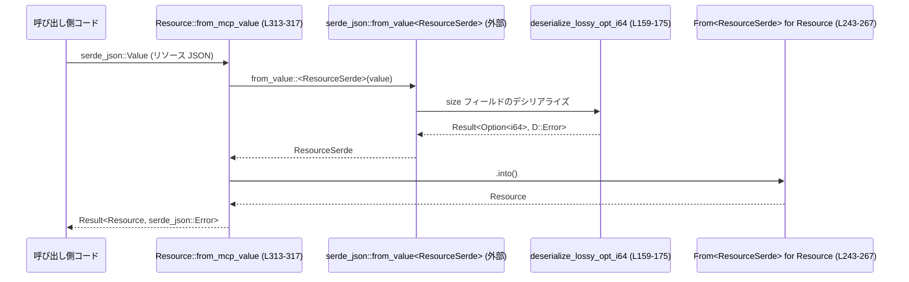

# protocol/src/mcp.rs コード解説

## 0. ざっくり一言

Model Context Protocol (MCP) の値を Codex プロトコル内で扱うための、TS/JSON Schema フレンドリーな型定義と、ワイヤ（生の MCP JSON）からそれらの型への変換ヘルパーを提供するモジュールです（`protocol/src/mcp.rs:L1-5, L153-157`）。

---

## 1. このモジュールの役割

### 1.1 概要

- このモジュールは **MCP サーバーとのやりとりで使われる JSON 形式のデータ** を、  
  **Rust の構造体 + TypeScript 型/JSON Schema** に変換して扱うために存在します。
- MCP のツール定義・リソース定義・リソース内容・ツール呼び出し結果などを表す型を提供し、  
  `serde_json::Value` からの変換関数（`from_mcp_value`）で「ワイヤ形状」の JSON から安全に構造化します（`protocol/src/mcp.rs:L29-53, L55-83, L85-115, L117-135, L137-151, L307-323`）。

### 1.2 アーキテクチャ内での位置づけ

コメントから読み取れる範囲では、このモジュールは「他クレートが MCP JSON をこの型群に変換するためのアダプタ」として設計されています（`protocol/src/mcp.rs:L153-157`）。

```mermaid
graph TD
    subgraph 外部
        W["ワイヤ形状 MCP JSON<br/>(serde_json::Value)"]
        RM["rmcp モデル構造体<br/>(詳細はこのチャンク外)"]
    end

    subgraph protocol::mcp (このファイル)
        T["Tool (L29-53)"]
        R["Resource (L55-83)"]
        RT["ResourceTemplate (L117-135)"]
        RC["ResourceContent (L85-115)"]
        CTR["CallToolResult (L137-151)"]
        RID["RequestId (L11-18)"]
        Tfrom["Tool::from_mcp_value (L307-311)"]
        Rfrom["Resource::from_mcp_value (L313-317)"]
        RTfrom["ResourceTemplate::from_mcp_value (L319-323)"]
    end

    RM -->|serde_json::Value にシリアライズ| W
    W --> Tfrom --> T
    W --> Rfrom --> R
    W --> RTfrom --> RT
```

※ `rmcp` や `mcp-types` の実体パスはこのファイルには現れませんが、コメントから名前だけがわかります（`protocol/src/mcp.rs:L153-157`）。

### 1.3 設計上のポイント

- **TS/JSON Schema フレンドリーな型**
  - すべての公開データ型に `Serialize`, `Deserialize`, `JsonSchema`, `TS` が derive されています（`protocol/src/mcp.rs:L12, L30, L56, L86, L118, L138`）。
  - `#[serde(rename_all = "camelCase")]` や `#[ts(rename_all = "camelCase")]` により、JSON/TS 側のプロパティは camelCase になります。
- **アダプタ層の分離**
  - 実際のワイヤ JSON の形に合わせた内部用構造体 `ToolSerde` / `ResourceSerde` / `ResourceTemplateSerde` と、公開型 `Tool` / `Resource` / `ResourceTemplate` を分離し、`From` 実装でマッピングしています（`protocol/src/mcp.rs:L177-220, L222-267, L270-305`）。
- **ゆるやかな数値変換（lossy）**
  - `Resource::size` は `Option<i64>` ですが、ワイヤ側は `u64` を含む任意の JSON 数値になり得るため、`deserialize_lossy_opt_i64` で「`i64` に入る範囲なら保持し、入らない巨大値は `None`」とする挙動になっています（`protocol/src/mcp.rs:L159-175, L222-233, L332-359`）。
- **状態を持たないデータ構造**
  - すべての公開型はフィールドだけを持つデータコンテナであり、内部に可変状態やスレッド同期を持ちません。
- **エラーハンドリング**
  - `from_mcp_value` 群は `Result<_, serde_json::Error>` を返し、JSON 形状が期待と異なる場合などはデシリアライズエラーとして扱います（`protocol/src/mcp.rs:L307-323`）。
- **並行性**
  - このモジュール自体にはスレッドや非同期処理は登場せず、並行性は扱っていません（`std::thread` や `async` 関連の記述がないため）。

---

## 2. 主要な機能一覧

- MCP リクエスト ID の表現（文字列 or 整数）: `RequestId`（`protocol/src/mcp.rs:L11-18`）
- MCP ツール定義の表現: `Tool`（`protocol/src/mcp.rs:L29-53`）
- MCP リソース定義の表現: `Resource`（`protocol/src/mcp.rs:L55-83`）
- リソース内容（テキスト or バイナリ Blob）の表現: `ResourceContent`（`protocol/src/mcp.rs:L85-115`）
- リソーステンプレート（URI テンプレート付き）の表現: `ResourceTemplate`（`protocol/src/mcp.rs:L117-135`）
- ツール呼び出し結果の表現: `CallToolResult`（`protocol/src/mcp.rs:L137-151`）
- ワイヤ JSON から公開型への変換: `Tool::from_mcp_value` / `Resource::from_mcp_value` / `ResourceTemplate::from_mcp_value`（`protocol/src/mcp.rs:L307-323`）
- `Resource::size` の安全な（ただし場合によっては情報を捨てる）数値変換: `deserialize_lossy_opt_i64` + `ResourceSerde`（`protocol/src/mcp.rs:L159-175, L222-241`）
- `RequestId` の人間可読表示: `impl Display for RequestId`（`protocol/src/mcp.rs:L20-27`）

---

## 3. 公開 API と詳細解説

### 3.1 型一覧

#### 公開型（外部から直接使う想定の型）

| 名前 | 種別 | 役割 / 用途 | 定義位置 |
|------|------|-------------|----------|
| `RequestId` | 列挙体 | MCP リクエスト ID を文字列または整数で表現する。TS 側では `string \| number` 型想定。 | `protocol/src/mcp.rs:L11-18` |
| `Tool` | 構造体 | クライアントが呼び出せる MCP ツールのメタデータ（名前、説明、入出力スキーマなど）を表す。 | `protocol/src/mcp.rs:L29-53` |
| `Resource` | 構造体 | MCP サーバーが読み取り可能な既知のリソースを表す。サイズ、URI、説明などを保持する。 | `protocol/src/mcp.rs:L55-83` |
| `ResourceContent` | 列挙体 | リソースの実際の内容をテキストまたは Blob として表現する。 | `protocol/src/mcp.rs:L85-115` |
| `ResourceTemplate` | 構造体 | サーバー上の利用可能なリソースのテンプレート（URI テンプレートなど）を表す。 | `protocol/src/mcp.rs:L117-135` |
| `CallToolResult` | 構造体 | MCP ツール呼び出しに対するサーバーの応答内容（コンテンツ、構造化コンテンツ、エラーフラグなど）。 | `protocol/src/mcp.rs:L137-151` |

#### 内部アダプタ型（ワイヤ JSON からの変換専用）

| 名前 | 種別 | 役割 / 用途 | 定義位置 |
|------|------|-------------|----------|
| `ToolSerde` | 構造体 | ワイヤ JSON のツール定義を受け取るための内部型。フィールド名の別名など serde 設定込み。 | `protocol/src/mcp.rs:L177-195` |
| `ResourceSerde` | 構造体 | ワイヤ JSON のリソース定義を受け取る内部型。`size` にカスタムデシリアライズを適用。 | `protocol/src/mcp.rs:L222-241` |
| `ResourceTemplateSerde` | 構造体 | ワイヤ JSON のリソーステンプレートを受け取る内部型。`uriTemplate` などの名前を吸収。 | `protocol/src/mcp.rs:L270-284` |

### 関数インベントリー（一覧）

| 関数 / メソッド名 | 概要 | 定義位置 |
|-------------------|------|----------|
| `RequestId::fmt` (`impl Display`) | `RequestId` を文字列としてフォーマットする。 | `protocol/src/mcp.rs:L20-27` |
| `deserialize_lossy_opt_i64` | JSON 数値を `Option<i64>` に変換するヘルパー。`i64` に収まらない `u64` 値は `None` にする。 | `protocol/src/mcp.rs:L159-175` |
| `From<ToolSerde> for Tool::from` | `ToolSerde` から公開型 `Tool` へのフィールドコピー。 | `protocol/src/mcp.rs:L197-220` |
| `From<ResourceSerde> for Resource::from` | `ResourceSerde` から公開型 `Resource` へのフィールドコピー。 | `protocol/src/mcp.rs:L243-267` |
| `From<ResourceTemplateSerde> for ResourceTemplate::from` | `ResourceTemplateSerde` から `ResourceTemplate` へのフィールドコピー。 | `protocol/src/mcp.rs:L286-305` |
| `Tool::from_mcp_value` | `serde_json::Value` から `Tool` への変換（内部で `ToolSerde` を経由）。 | `protocol/src/mcp.rs:L307-311` |
| `Resource::from_mcp_value` | `serde_json::Value` から `Resource` への変換（`ResourceSerde` 経由、size にロジックあり）。 | `protocol/src/mcp.rs:L313-317` |
| `ResourceTemplate::from_mcp_value` | `serde_json::Value` から `ResourceTemplate` への変換。 | `protocol/src/mcp.rs:L319-323` |
| `tests::resource_size_deserializes_without_narrowing` | `Resource::size` のデシリアライズ挙動（巨大 u64 / 負数など）を検証するテスト。 | `protocol/src/mcp.rs:L331-359` |

---

### 3.2 関数詳細（主要 7 件）

#### `RequestId::fmt(&self, f: &mut Formatter<'_>) -> fmt::Result`

**概要**

- `RequestId` を人間に読みやすい文字列表現にフォーマットします（`protocol/src/mcp.rs:L20-27`）。
- 文字列 ID はそのまま、整数 ID は数値として出力されます。

**引数**

| 引数名 | 型 | 説明 |
|--------|----|------|
| `self` | `&RequestId` | フォーマット対象の ID。 |
| `f` | `&mut std::fmt::Formatter<'_>` | フォーマッタ。`println!` などから渡されます。 |

**戻り値**

- `std::fmt::Result`（エラーなしなら `Ok(())`）。フォーマット中の I/O エラーがあれば `Err`。

**内部処理の流れ**

1. `match self` で `String` か `Integer` かを分岐（`protocol/src/mcp.rs:L22-24`）。
2. `String` の場合は `Formatter::write_str` でそのまま文字列を出力。
3. `Integer` の場合は `i64::fmt` を使って数値として出力。

**Examples（使用例）**

```rust
// RequestId を Display で表示する例
use protocol::mcp::RequestId;                              // モジュールパスは仮。実際は crate 名に合わせる

fn print_id(id: RequestId) {                               // RequestId を引数に取る関数
    println!("ID = {}", id);                              // Display 実装により {} で表示可能
}

let id_str = RequestId::String("abc-123".to_string());    // 文字列 ID
let id_int = RequestId::Integer(42);                      // 整数 ID

print_id(id_str);                                         // "ID = abc-123" が出力される
print_id(id_int);                                         // "ID = 42" が出力される
```

**Errors / Panics**

- `fmt` 実装内でパニックは行っておらず、`Formatter` がエラーを返す場合に限り `Err` を返します。
- 通常の `println!` 利用ではほぼエラーは発生しません。

**Edge cases**

- 非常に長い文字列 ID もそのまま出力されます（切り捨てなどはしません）。
- 整数の範囲は `i64` に制限されています（型定義による、`protocol/src/mcp.rs:L17`）。

**使用上の注意点**

- ログ出力などで ID を表示する際に、`{:?}` ではなく `{}` を使うとこの `Display` 実装が使われます。

---

#### `deserialize_lossy_opt_i64<'de, D>(deserializer: D) -> Result<Option<i64>, D::Error>`

**概要**

- JSON 数値を `Option<i64>` にデシリアライズするヘルパー関数です（`protocol/src/mcp.rs:L159-175`）。
- `i64` に収まる値はそのまま `Some(i64)` にし、`i64` に収まらない正の `u64` は `None` にしてしまう「ロスあり」変換です。

**引数**

| 引数名 | 型 | 説明 |
|--------|----|------|
| `deserializer` | `D` (`serde::Deserializer<'de>`) | 対象フィールドのデシリアライザ。`serde` が内部から渡します。 |

**戻り値**

- `Result<Option<i64>, D::Error>`  
  - `Ok(Some(v))`: 適切な数値が得られた場合。  
  - `Ok(None)`: フィールドが欠損しているか、数値が `i64` に収まらない場合。  
  - `Err(e)`: JSON が数値として解釈できないなど、`Option<Number>` のデシリアライズ自体が失敗した場合。

**内部処理の流れ**

1. `Option::<serde_json::Number>::deserialize(deserializer)?` でまず数値を読み込みます（`protocol/src/mcp.rs:L163`）。
2. `Some(number)` の場合:
   - `number.as_i64()` で `i64` として取り出せれば `Some(v)` を返却（`protocol/src/mcp.rs:L165-167`）。
   - そうでなければ `number.as_u64()` を試し、`i64::try_from(v).ok()` で `i64` に収まる範囲であれば `Some(i64)`、収まらなければ `None`（`protocol/src/mcp.rs:L167-169`）。
   - どちらにも当てはまらない場合（浮動小数点など）は `None` を返却（`protocol/src/mcp.rs:L169-170`）。
3. `None` の場合はそのまま `Ok(None)`（フィールド欠損）（`protocol/src/mcp.rs:L173-174`）。

**Examples（使用例）**

`ResourceSerde::size` のデシリアライズで自動的に呼び出されるため、通常は直接呼び出すことはありません（`protocol/src/mcp.rs:L232-233`）。挙動はテストで確認されています（`protocol/src/mcp.rs:L331-359`）。

```rust
// Resource::size の挙動の例
use serde_json::json;
use protocol::mcp::Resource;                              // 実際のパスは crate 名に合わせる

let value = json!({                                      // 大きなサイズを持つ JSON
    "name": "big",
    "uri": "file:///tmp/big",
    "size": 5_000_000_000u64,                            // i64 に収まる u64
});

let resource = Resource::from_mcp_value(value)           // JSON から Resource に変換
    .expect("should deserialize");                       // デシリアライズが成功する前提
assert_eq!(resource.size, Some(5_000_000_000));          // i64 に収まるので Some になる
```

**Errors / Panics**

- この関数自身はパニックを起こしません。
- JSON が数値型でない場合は `Option<Number>` のデシリアライズ時点で `Err(D::Error)` になる可能性があります（詳細は `serde` の実装に依存します）。

**Edge cases**

- `size` が存在しない: `None` になります（`default` + `Option` のため）（`protocol/src/mcp.rs:L232-233`）。
- 非負の `u64` で `i64::MAX` 以下: `Some(i64)` になります。
- `i64::MAX` を超える `u64`: `None` になります（テストで確認、`protocol/src/mcp.rs:L351-358`）。
- 負の整数: `Some(負の値)` になります（`as_i64` が利用される、`protocol/src/mcp.rs:L165-167`）。

**使用上の注意点**

- 非常に大きな `size` が指定された場合、「エラー」ではなく「`None`（サイズ不明）」として扱われます。  
  そのため、サイズが `None` の場合は「未知か、巨大すぎて扱えなかった」の両方の可能性がある前提で処理する必要があります。

---

#### `impl From<ToolSerde> for Tool::from(value: ToolSerde) -> Tool`

**概要**

- ワイヤ JSON を受け取る内部型 `ToolSerde` から、公開型 `Tool` へフィールドをコピーします（`protocol/src/mcp.rs:L197-220`）。

**引数**

| 引数名 | 型 | 説明 |
|--------|----|------|
| `value` | `ToolSerde` | デシリアライズ済みのツール定義。 |

**戻り値**

- `Tool`：公開 API として利用されるツール定義。

**内部処理の流れ**

1. `ToolSerde` をパターンマッチで展開し（`protocol/src/mcp.rs:L199-207`）、各フィールドをローカル変数に取り出します。
2. それらをそのまま `Tool { ... }` のフィールドに代入して返します（`protocol/src/mcp.rs:L209-218`）。

**Examples（使用例）**

通常は `Tool::from_mcp_value` を通じて暗黙に呼び出されるため、直接使うことはありません（`protocol/src/mcp.rs:L307-311`）。

**Errors / Panics**

- この関数自体はどのような入力でもパニックやエラーを起こさず、単にフィールドをコピーするだけです。
- 前提として、`ToolSerde` が既に `serde_json::from_value` により正しく構築されている必要があります。

**Edge cases**

- `title` / `description` / `output_schema` などオプションフィールドは `None` のままコピーされます。
- `input_schema` などは `serde_json::Value` であり、任意の JSON 形状を保持できます（検証は行いません）。

**使用上の注意点**

- ワイヤレベルでのプロパティ名の違い（`inputSchema` vs `input_schema`）は `ToolSerde` 側の `#[serde(rename, alias)]` 設定で吸収されます（`protocol/src/mcp.rs:L185-187`）。`Tool` では camelCase の `input_schema` に統一されている点に注意が必要です。

---

#### `impl From<ResourceSerde> for Resource::from(value: ResourceSerde) -> Resource`

**概要**

- `ResourceSerde` から公開型 `Resource` への変換を行います（`protocol/src/mcp.rs:L243-267`）。
- `size` フィールドに対しては、前述の `deserialize_lossy_opt_i64` を通じた変換結果がそのまま `Resource::size` に入ります。

**引数**

| 引数名 | 型 | 説明 |
|--------|----|------|
| `value` | `ResourceSerde` | ワイヤ JSON をパースした内部用リソース定義。 |

**戻り値**

- `Resource`：公開リソース定義。

**内部処理の流れ**

1. `ResourceSerde` をパターンマッチで展開し、`annotations`, `description`, `mime_type`, `name`, `size`, `title`, `uri`, `icons`, `meta` を取り出します（`protocol/src/mcp.rs:L245-254`）。
2. それらを `Resource` の同名フィールドにそのまま代入して返します（`protocol/src/mcp.rs:L256-265`）。

**Examples（使用例）**

`Resource::from_mcp_value` 経由で暗黙に呼ばれます（`protocol/src/mcp.rs:L313-317`）。

**Errors / Panics**

- この関数自体はエラーになりません。`ResourceSerde` が既に成功裏に構築済みである前提です。

**Edge cases**

- `size` は `Option<i64>` であり、`deserialize_lossy_opt_i64` の結果が反映されます（巨大値は `None`、`i64` に収まる値は `Some`）。

**使用上の注意点**

- JSON フォーマット変更などで `ResourceSerde` を変える場合、この `From` 実装のフィールド対応も合わせて更新する必要があります。

---

#### `impl From<ResourceTemplateSerde> for ResourceTemplate::from(value: ResourceTemplateSerde) -> ResourceTemplate`

**概要**

- `ResourceTemplateSerde` から `ResourceTemplate` への単純なフィールドコピーを行うコンストラクタです（`protocol/src/mcp.rs:L286-305`）。

**引数 / 戻り値**

- `value: ResourceTemplateSerde` を受け取り、同名フィールドを持つ `ResourceTemplate` を返します。

**内部処理の流れ**

- 他の `From` 実装と同様、パターンマッチで取り出して構造体リテラルで返すだけです（`protocol/src/mcp.rs:L288-303`）。

**使用上の注意点**

- JSON 側では `uriTemplate` という camelCase 名を受け取りますが（`protocol/src/mcp.rs:L275-276`）、公開型では `uri_template` フィールド名になっている点に注意が必要です。

---

#### `Tool::from_mcp_value(value: serde_json::Value) -> Result<Tool, serde_json::Error>`

**概要**

- ワイヤから届いた MCP ツール定義 JSON を `Tool` に変換するエントリポイントです（`protocol/src/mcp.rs:L307-311`）。
- JSON の形状違いなどは `serde_json::Error` として返します。

**引数**

| 引数名 | 型 | 説明 |
|--------|----|------|
| `value` | `serde_json::Value` | MCP ツール定義を表す JSON 値。 |

**戻り値**

- `Result<Tool, serde_json::Error>`  
  - `Ok(Tool)`: 正しく変換できた場合。  
  - `Err(e)`: JSON 形状が期待通りでない場合などのデシリアライズエラー。

**内部処理の流れ**

1. `serde_json::from_value::<ToolSerde>(value)?` で JSON を内部型 `ToolSerde` にデシリアライズ（`protocol/src/mcp.rs:L309`）。
2. `into()` で `Tool` に変換（`From<ToolSerde> for Tool` を使用）（`protocol/src/mcp.rs:L309-310`）。
3. `Ok` でラップして返却。

**Examples（使用例）**

```rust
use serde_json::json;
use protocol::mcp::Tool;                                  // 実際のパスは crate 名に合わせる

// ワイヤから受け取った MCP ツール定義 JSON を想定
let value = json!({
    "name": "search",
    "title": "Web Search",
    "description": "Perform a web search",
    "inputSchema": { "type": "object" },                  // camelCase でも OK
    "outputSchema": { "type": "array" },
});

let tool = Tool::from_mcp_value(value)                    // JSON から Tool へ変換
    .expect("valid MCP tool JSON");                       // エラーならここで検知

assert_eq!(tool.name, "search");                          // フィールドへアクセス
```

**Errors / Panics**

- 内部で `serde_json::from_value` を `?` で呼び出しているため、  
  - JSON 形状が `ToolSerde` と合わない場合
  - 型の不一致（文字列であるべきフィールドに数値が入っているなど）  
  では `Err(serde_json::Error)` が返されます。
- パニックはありません。

**Edge cases**

- `inputSchema` と `input_schema` のどちらのキーでも受け付けます（`alias` 設定、`protocol/src/mcp.rs:L185-186`）。
- オプションフィールド（`title`, `description`, `output_schema`, `annotations`, `icons`, `meta`）が欠損していても `Ok(Tool)` になり、そのフィールドは `None` になります。

**使用上の注意点**

- `value` の所有権はこの関数にムーブされます。呼び出し元で再利用したい場合はあらかじめクローンする必要があります。
- JSON スキーマの妥当性（`input_schema` / `output_schema` の中身）は検証しません。必要であれば別途検証ロジックを用意する必要があります。

---

#### `Resource::from_mcp_value(value: serde_json::Value) -> Result<Resource, serde_json::Error>`

**概要**

- MCP リソース定義 JSON を `Resource` に変換するエントリポイントです（`protocol/src/mcp.rs:L313-317`）。
- `size` フィールドには `deserialize_lossy_opt_i64` による特別な変換が適用されます。

**引数 / 戻り値**

- `value: serde_json::Value` → `Result<Resource, serde_json::Error>`。ツールと同様です。

**内部処理の流れ**

1. `serde_json::from_value::<ResourceSerde>(value)?` で `ResourceSerde` にデシリアライズ（`protocol/src/mcp.rs:L315`）。
   - ここで `size` フィールドには `deserialize_lossy_opt_i64` が使用されます（`protocol/src/mcp.rs:L232-233`）。
2. `.into()` で `Resource` に変換して `Ok` で返す（`protocol/src/mcp.rs:L315-316`）。

**Examples（使用例）**

```rust
use serde_json::json;
use protocol::mcp::Resource;

let value = json!({
    "name": "file1",
    "uri": "file:///tmp/file1.txt",
    "size": 18446744073709551615u64,                      // u64::MAX
});

let resource = Resource::from_mcp_value(value)           // JSON から Resource に変換
    .expect("should deserialize");                       // デシリアライズ自体は成功する

assert_eq!(resource.size, None);                         // 大きすぎるので None になる
```

**Errors / Panics**

- `Tool::from_mcp_value` と同様、JSON 形状不一致で `Err(serde_json::Error)` が返ることがあります。
- パニックはありません。

**Edge cases**

テスト `resource_size_deserializes_without_narrowing` により、次が確認されています（`protocol/src/mcp.rs:L331-359`）。

- `size = 5_000_000_000u64`（`i64` に収まる） → `Some(5_000_000_000)`。
- `size = -1` → `Some(-1)`。
- `size = 18446744073709551615u64`（`u64::MAX`） → `None`。

**使用上の注意点**

- サイズが `None` の場合、「サイズ情報が存在しない」か「数値が大きすぎて `i64` に収まらなかった」かの区別はできません。  
  そのため、`None` を「サイズ 0」とみなすような実装は避ける必要があります。

---

#### `ResourceTemplate::from_mcp_value(value: serde_json::Value) -> Result<ResourceTemplate, serde_json::Error>`

**概要**

- MCP のリソーステンプレート JSON を `ResourceTemplate` に変換する関数です（`protocol/src/mcp.rs:L319-323`）。

**引数 / 戻り値**

- `value: serde_json::Value` → `Result<ResourceTemplate, serde_json::Error>`。

**内部処理の流れ**

1. `serde_json::from_value::<ResourceTemplateSerde>(value)?` で内部型へデシリアライズ（`protocol/src/mcp.rs:L321`）。
2. `.into()` で `ResourceTemplate` に変換し `Ok` で返却（`protocol/src/mcp.rs:L321-322`）。

**Examples（使用例）**

```rust
use serde_json::json;
use protocol::mcp::ResourceTemplate;

let value = json!({
    "uriTemplate": "file:///tmp/{name}",                  // camelCase 名
    "name": "tmp-file",
    "title": "Temporary file",
});

let tmpl = ResourceTemplate::from_mcp_value(value)
    .expect("valid MCP resource template");

assert_eq!(tmpl.uri_template, "file:///tmp/{name}");      // snake_case フィールドにマッピング済み
```

**Errors / Panics**

- 他の `from_mcp_value` と同様、デシリアライズ失敗時に `Err(serde_json::Error)` を返します。
- パニックはありません。

**Edge cases**

- `annotations` / `title` / `description` / `mime_type` は欠損していても `None` になります（`protocol/src/mcp.rs:L273-283`）。

**使用上の注意点**

- JSON 側のキーは `uriTemplate` である点に注意が必要です（`alias = "uri_template"` も付いているためどちらも受け付けますが、ワイヤ仕様に従う必要があります）。

---

### 3.3 その他の関数

詳細解説に含めなかった関数やテストを一覧します。

| 関数名 | 役割（1 行） | 定義位置 |
|--------|--------------|----------|
| `tests::resource_size_deserializes_without_narrowing()` | `Resource::size` のデシリアライズが「情報を狭めない（narrowing しない）」ことを検証するテスト。 | `protocol/src/mcp.rs:L331-359` |

---

## 4. データフロー

ここでは、代表的なシナリオとして **MCP リソース JSON から `Resource` への変換** のデータフローを示します。

1. 呼び出し側が MCP から受け取った JSON を `serde_json::Value` として保持する。
2. その `Value` を `Resource::from_mcp_value` に渡す（`protocol/src/mcp.rs:L313-317`）。
3. 内部で `serde_json::from_value::<ResourceSerde>` が走り、フィールド `size` に対して `deserialize_lossy_opt_i64` が自動的に呼ばれる（`protocol/src/mcp.rs:L232-233, L159-175`）。
4. `ResourceSerde` が構築された後、`From<ResourceSerde> for Resource` により公開型 `Resource` に変換される（`protocol/src/mcp.rs:L243-267`）。
5. 最終的な `Resource` が `Result` として呼び出し元に返る。



---

## 5. 使い方（How to Use）

### 5.1 基本的な使用方法

典型的には、MCP サーバーなどから受け取った JSON を `serde_json::Value` に変換し、その値を `from_mcp_value` に渡して公開型に変換します。

```rust
use serde_json::json;
use protocol::mcp::{Tool, Resource};                      // 実際のパスは crate 名に合わせる

// 1. MCP サーバーから受け取った JSON（ここでは手書き）
let tool_json = json!({
    "name": "search",
    "inputSchema": { "type": "object" }
});

let resource_json = json!({
    "name": "file1",
    "uri": "file:///tmp/file1.txt",
    "size": 5_000_000_000u64,
});

// 2. JSON から公開型に変換
let tool = Tool::from_mcp_value(tool_json)                // ToolSerde 経由で Tool になる
    .expect("valid MCP tool JSON");
let resource = Resource::from_mcp_value(resource_json)    // ResourceSerde + lossy size 変換
    .expect("valid MCP resource JSON");

// 3. 通常の構造体として扱う
println!("tool name = {}", tool.name);                    // フィールドへ安全にアクセス
println!("resource uri = {}", resource.uri);
```

### 5.2 よくある使用パターン

1. **ベクタ変換**

   複数の MCP ツール定義をまとめて変換する場合:

   ```rust
   use serde_json::Value;
   use protocol::mcp::Tool;

   fn convert_tools(values: Vec<Value>) -> Result<Vec<Tool>, serde_json::Error> {
       values
           .into_iter()                                   // Value を順に取り出す
           .map(Tool::from_mcp_value)                    // 各要素を Tool に変換
           .collect()                                    // Result<Vec<Tool>, _> にまとめる
   }
   ```

2. **文字列 JSON からの変換**

   ワイヤから文字列として JSON を受け取った場合:

   ```rust
   use protocol::mcp::Resource;

   fn parse_resource_json(s: &str) -> Result<Resource, Box<dyn std::error::Error>> {
       let value: serde_json::Value = serde_json::from_str(s)?;  // 文字列 → Value
       let resource = Resource::from_mcp_value(value)?;           // Value → Resource
       Ok(resource)
   }
   ```

### 5.3 よくある間違い

```rust
use serde_json::json;
use protocol::mcp::Resource;

// 間違い例: size が文字列になっている
let bad_json = json!({
    "name": "file1",
    "uri": "file:///tmp/file1.txt",
    "size": "100",                                      // ❌ 本来は数値
});

// これをそのまま渡すと、ResourceSerde の size フィールドに
// 数値としてデシリアライズできず、serde_json::Error になる可能性があります。
let result = Resource::from_mcp_value(bad_json);

// 正しい例: size を数値として指定する
let good_json = json!({
    "name": "file1",
    "uri": "file:///tmp/file1.txt",
    "size": 100,                                        // ✅ 数値
});

let resource = Resource::from_mcp_value(good_json)
    .expect("valid resource JSON");
```

### 5.4 使用上の注意点（まとめ）

- **前提条件**
  - `from_mcp_value` に渡す `serde_json::Value` は、このモジュールが期待する MCP JSON 仕様に沿っている必要があります。
- **数値のロス**
  - `Resource::size` は非常に大きな `u64` 値を `None` に変換します（`protocol/src/mcp.rs:L159-175, L331-359`）。  
    サイズが `None` の場合の扱いは呼び出し側で慎重に決める必要があります。
- **オプションフィールド**
  - 多くのフィールドはオプションであり、JSON に存在しないときには `None` になります。`unwrap` する前に `is_some` 等で確認するのが安全です。
- **並行性**
  - このモジュール自体はスレッドや非同期処理を行っていません。  
    型が `Send`/`Sync` かどうかはこのファイルだけでは判断できないため、並行環境で共有する場合はコンパイラのエラーやクレート全体のドキュメントを確認する必要があります。

---

## 6. 変更の仕方（How to Modify）

### 6.1 新しい機能を追加する場合

**例: `Tool` に新しいフィールド `category: Option<String>` を追加したい場合**

1. **公開型の追加**
   - `Tool` 構造体にフィールドを追加します（`protocol/src/mcp.rs:L29-53` 付近）。
2. **内部型の追加**
   - `ToolSerde` に対応するフィールドを追加し、必要なら `#[serde(rename = "...", alias = "...")]` を設定します（`protocol/src/mcp.rs:L177-195`）。
3. **`From<ToolSerde> for Tool` の更新**
   - パターンマッチの引数と `Self { ... }` の両方に新フィールドを追加します（`protocol/src/mcp.rs:L197-220`）。
4. **テストの追加**
   - 新フィールドに値が入った JSON を `Tool::from_mcp_value` に渡し、正しく反映されるかを検証するテストを追加するのが望ましいです（テストは `#[cfg(test)] mod tests` 内、`protocol/src/mcp.rs:L325-359` を参考）。

### 6.2 既存の機能を変更する場合

- **JSON フィールド名を変更したい場合**
  - 内部 serde 型（`ToolSerde` や `ResourceSerde`）の `#[serde(rename, alias)]` を更新することで、ワイヤ互換性を保ったまま内部表現を変えることができます（`protocol/src/mcp.rs:L185-187, L229-233, L275-283`）。
- **`size` の挙動を変えたい場合**
  - `deserialize_lossy_opt_i64` のロジックを変更する必要があります（`protocol/src/mcp.rs:L159-175`）。
  - 影響範囲は `ResourceSerde::size`（`protocol/src/mcp.rs:L232-233`）と、`Resource::from_mcp_value` を通じて `Resource` を利用しているすべての箇所になります。
  - 既存テスト `resource_size_deserializes_without_narrowing` も更新が必要です（`protocol/src/mcp.rs:L331-359`）。
- **契約（前提条件・返り値の意味）の保持**
  - `from_mcp_value` の戻り値型（`Result<_, serde_json::Error>`）や `None` の意味（例: `size` が「不明」を表す）を変えると利用側に大きな影響が出ます。  
    変更する場合は、呼び出し元の想定をすべて見直す必要があります。

---

## 7. 関連ファイル

このファイルから直接参照されるのは外部クレート名だけで、具体的なパスは現れていません。

| パス | 役割 / 関係 |
|------|------------|
| （外部クレート）`serde_json` | JSON の `Value` 型やデシリアライズ処理に使用されています（`protocol/src/mcp.rs` 全体で多数）。 |
| （外部クレート）`schemars` | `JsonSchema` derive により JSON Schema の生成を行うために利用されています（`protocol/src/mcp.rs:L6`）。 |
| （外部クレート）`ts-rs` | `TS` derive により TypeScript 型定義の生成を行うために利用されています（`protocol/src/mcp.rs:L9`）。 |
| （外部クレート）`pretty_assertions` | テストで `assert_eq!` の出力を見やすくするために使用されています（`protocol/src/mcp.rs:L327`）。 |
| （外部クレート名のみ）`mcp-types` | コメントで、「このファイルを使うことで `mcp-types` に依存せずに済む」と言及されていますが、実際のパスはこのチャンクには現れません（`protocol/src/mcp.rs:L153-157`）。 |

このモジュールは、MCP と Codex プロトコルの間を橋渡しする「データ変換レイヤ」として機能しており、ワイヤ JSON と内部表現との整合を保つための中心的な位置づけにあります。
