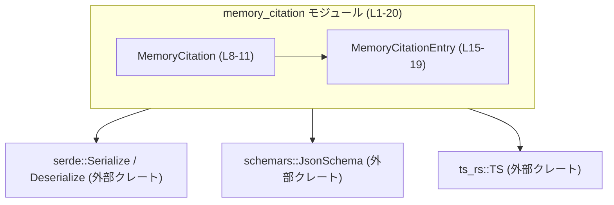
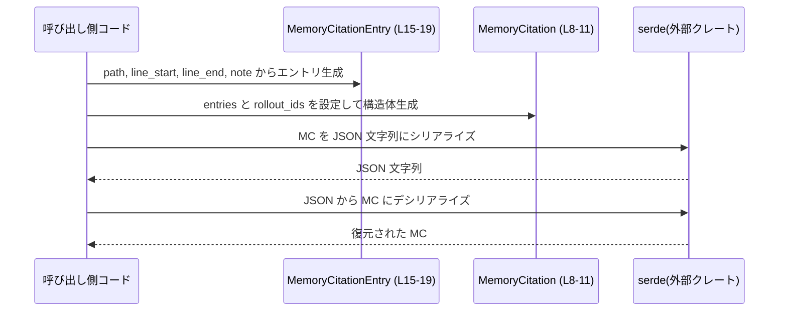

protocol/src/memory_citation.rs

---

## 0. ざっくり一言

`MemoryCitation` と `MemoryCitationEntry` という 2 つの構造体を定義し、「ファイルパス＋行範囲＋メモ」からなる引用情報の集合を、シリアライズ／スキーマ生成／TypeScript 型生成に対応したデータモデルとして表現するモジュールです（根拠: `protocol/src/memory_citation.rs:L6-19`）。

---

## 1. このモジュールの役割

### 1.1 概要

- このモジュールは、コードやテキストの「どのファイルの何行を参照しているか」といったメタデータを表現するためのデータ構造を提供します（命名とフィールド構成からの解釈、根拠: `MemoryCitationEntry` の `path`, `line_start`, `line_end`, `note` フィールド `L15-19`）。
- 構造体は `serde` によるシリアライズ／デシリアライズ、`schemars` による JSON Schema 生成、`ts_rs` による TypeScript 型生成に対応しています（根拠: `derive(... Serialize, Deserialize, JsonSchema, TS)` `L6`, `L13`）。
- ロジックは一切持たず、純粋なデータコンテナとして振る舞います（関数定義が存在しないことから、根拠: `L1-20` に関数がない）。

### 1.2 アーキテクチャ内での位置づけ

- 依存関係は外部クレートと派生マクロ（derive）に限定されています。
  - `serde::{Serialize, Deserialize}` … シリアライズ／デシリアライズ（根拠: `use serde::Deserialize; use serde::Serialize;` `L2-3`）。
  - `schemars::JsonSchema` … JSON Schema 生成用（根拠: `use schemars::JsonSchema;` `L1`）。
  - `ts_rs::TS` … TypeScript 型定義生成用（根拠: `use ts_rs::TS;` `L4`）。
- 内部的には `MemoryCitation` が複数の `MemoryCitationEntry` を所有する一対多の関係です（根拠: `MemoryCitation.entries: Vec<MemoryCitationEntry>` `L8-10`）。

依存関係を簡略図にすると以下のようになります。



### 1.3 設計上のポイント

- **責務の分離**
  - このファイルはデータ構造だけを定義し、処理ロジックは一切持ちません（関数が存在しないことから、根拠: `L1-20`）。
- **シリアライズ指向の設計**
  - `Serialize`, `Deserialize`, `JsonSchema`, `TS` を derive しており、外部とのデータ交換やスキーマ駆動設計を意識した構造になっています（根拠: `L6`, `L13`）。
  - `#[serde(rename_all = "camelCase")]` により、JSON/TS 側では camelCase のフィールド名になります（根拠: `L7`, `L14`）。
- **状態管理／並行性**
  - すべてのフィールドが所有型（`Vec`, `String`, `u32`）であり、内部可変性（`RefCell` 等）はありません（根拠: `L8-11`, `L15-19`）。
  - そのため、Rust の一般的な規則から、この構造体自体は `Send` / `Sync` を自動実装可能な、スレッド間共有しやすい値オブジェクトとして扱えます（この点は Rust の言語仕様に基づく一般的な性質であり、ファイル中に明示的な `Send` / `Sync` の記述はありません）。

---

## 2. 主要な機能一覧

ここでは「機能」を、このモジュールが外部に提供するデータ的な役割として整理します。

- メモリ引用集合の表現: `MemoryCitation` で複数の引用エントリとロールアウト ID 群をまとめて保持する（根拠: `L8-11`）。
- 単一引用エントリの表現: `MemoryCitationEntry` でファイルパス・行範囲・任意メモを表現する（根拠: `L15-19`）。
- JSON/バイナリ等とのシリアライズ: `serde` 対応により JSON 等にシリアライズ／デシリアライズできる（根拠: derive `Serialize`, `Deserialize` `L6`, `L13`）。
- JSON Schema 生成: `JsonSchema` 派生によりスキーマ生成可能（根拠: `L1`, `L6`, `L13`）。
- TypeScript 型生成: `TS` 派生により TypeScript インターフェースを生成可能（根拠: `L4`, `L6`, `L13`）。

---

## 3. 公開 API と詳細解説

### 3.1 型一覧（構造体・列挙体など） — コンポーネントインベントリー

| 名前                  | 種別   | 定義位置                                        | 役割 / 用途 |
|-----------------------|--------|-------------------------------------------------|-------------|
| `MemoryCitation`      | 構造体 | `protocol/src/memory_citation.rs:L8-11`        | 複数の `MemoryCitationEntry` と、関連する `rollout_ids` をまとめて保持するコンテナ。シリアライズ／スキーマ生成／TS 型生成に対応する。 |
| `MemoryCitationEntry` | 構造体 | `protocol/src/memory_citation.rs:L15-19`       | 1 件の引用情報（ファイルパス、開始行、終了行、メモ）を保持するデータ構造。 |

派生トレイトの一覧:

| 型名                  | 派生トレイト                                                | 根拠 |
|-----------------------|-------------------------------------------------------------|------|
| `MemoryCitation`      | `Debug`, `Clone`, `Default`, `Serialize`, `Deserialize`, `PartialEq`, `Eq`, `JsonSchema`, `TS` | `protocol/src/memory_citation.rs:L6` |
| `MemoryCitationEntry` | `Debug`, `Clone`, `Serialize`, `Deserialize`, `PartialEq`, `Eq`, `JsonSchema`, `TS`           | `protocol/src/memory_citation.rs:L13` |

### 3.2 関数詳細

このファイル内には公開関数・メソッド・実装ブロック（`impl`）が定義されていません（根拠: `protocol/src/memory_citation.rs:L1-20` に関数・impl ブロックが存在しない）。

そのため、このセクションで解説すべき個別の処理ロジックはありません。

### 3.3 その他の関数

- 該当なし（このチャンクには関数定義が現れません）。

---

## 4. データフロー

このモジュール単体では処理ロジックを持たないため、典型的なデータの流れとして「構造体の構築 → シリアライズ → 外部へ送信」というシナリオを想定した一般的なフローを示します。

### 4.1 代表的なシナリオの説明

1. 呼び出し側のコードが `MemoryCitationEntry` を 1 件以上生成する（根拠: `entries: Vec<MemoryCitationEntry>` `L8-10`）。
2. それらをベクタとして `MemoryCitation.entries` に格納し、併せて `rollout_ids` に関連する ID 群を設定する（根拠: `L9-10`）。
3. 完成した `MemoryCitation` を `serde`（例: `serde_json`）で JSON にシリアライズし、API レスポンスやログとして外部に出力する。
4. 逆に、外部からの JSON を `MemoryCitation` としてデシリアライズして利用する。

この流れをシーケンス図で表現します。



---

## 5. 使い方（How to Use）

### 5.1 基本的な使用方法

ここでは、`MemoryCitation` / `MemoryCitationEntry` を構築し、`serde_json` でシリアライズ／デシリアライズする最小例を示します。

```rust
use protocol::memory_citation::{MemoryCitation, MemoryCitationEntry}; // このモジュールの2つの構造体をインポートする
use serde_json;                                                       // JSONシリアライズ／デシリアライズ用のクレートを利用する

fn main() -> Result<(), Box<dyn std::error::Error>> {                 // エラーを呼び出し元に返すmain関数を定義する
    // 1. 単一の引用エントリを作成する
    let entry = MemoryCitationEntry {                                 // MemoryCitationEntry構造体のインスタンスを作成する
        path: "src/lib.rs".to_string(),                               // 参照元のファイルパスを設定する
        line_start: 10,                                               // 開始行番号を設定する（u32）
        line_end: 20,                                                 // 終了行番号を設定する（u32）
        note: "重要なロジックの範囲".to_string(),                         // 任意メモを設定する
    };

    // 2. 複数エントリとrollout_idsをまとめてMemoryCitationを作成する
    let citation = MemoryCitation {                                   // MemoryCitation構造体のインスタンスを作成する
        entries: vec![entry],                                         // 先ほど作成したエントリをVecに包んで設定する
        rollout_ids: vec!["rollout-123".to_string()],                 // 関連するロールアウトIDをVec<String>として設定する
    };

    // 3. JSON文字列にシリアライズする
    let json = serde_json::to_string_pretty(&citation)?;              // &citationをJSON文字列に変換し、?でエラーを伝播する
    println!("Serialized JSON:\n{}", json);                           // シリアライズ結果を標準出力に表示する

    // 4. JSON文字列から再度MemoryCitationを復元する
    let restored: MemoryCitation = serde_json::from_str(&json)?;      // JSON文字列からMemoryCitationにデシリアライズする
    assert_eq!(restored.entries.len(), 1);                            // entriesの長さが1であることを検証する
    assert_eq!(restored.rollout_ids.len(), 1);                        // rollout_idsの長さが1であることを検証する

    Ok(())                                                            // 正常終了を示す
}
```

このコードにより、構造体の典型的な生成・シリアライズ・デシリアライズの流れが確認できます。

### 5.2 よくある使用パターン

1. **空の引用集合を扱う**

`MemoryCitation` は `Default` を実装しているので、空の状態を簡単に作成できます（根拠: `derive(... Default, ...)` `L6`）。

```rust
use protocol::memory_citation::MemoryCitation;      // MemoryCitationをインポートする

fn create_empty_citation() -> MemoryCitation {      // 空のMemoryCitationを返す関数を定義する
    MemoryCitation::default()                       // Defaultトレイトを使ってentriesとrollout_idsが空の構造体を作成する
}
```

この場合、`entries` と `rollout_ids` は両方とも空の `Vec` になります（Rust の `Default` 実装規則に基づく）。

1. **複数エントリの追加**

`entries` は `Vec<MemoryCitationEntry>` なので、標準の `Vec` 操作（`push`, `extend` など）でエントリを追加できます（根拠: `entries: Vec<MemoryCitationEntry>` `L9`）。

```rust
use protocol::memory_citation::{MemoryCitation, MemoryCitationEntry}; // 2つの構造体をインポートする

fn add_entry(mut citation: MemoryCitation, new_entry: MemoryCitationEntry) -> MemoryCitation { // 既存のMemoryCitationにエントリを追加して返す
    citation.entries.push(new_entry);                                    // entriesフィールドのVecに新しいエントリを追加する
    citation                                                              // 更新済みのMemoryCitationを返す
}
```

### 5.3 よくある間違い

1. **行番号の整合性を前提にしてしまう**

```rust
// 間違い例: line_start <= line_end であると仮定して処理する
fn span_length(entry: &MemoryCitationEntry) -> u32 {
    entry.line_end - entry.line_start + 1 // ここでunderflowが起こりうる（line_end < line_startのケース）
}
```

`MemoryCitationEntry` 内では `line_start` と `line_end` の関係に制約はありません（根拠: フィールド定義にバリデーションロジックや属性がない `L17-18`）。そのため、`line_end < line_start` のデータが存在する可能性を無視すると、計算時に `u32` のアンダーフローが発生し得ます。

```rust
// 正しい例: line_startとline_endの関係をチェックしてから処理する
fn safe_span_length(entry: &MemoryCitationEntry) -> Option<u32> { // オプションで長さを返す関数を定義する
    if entry.line_end >= entry.line_start {                       // line_endがline_start以上か確認する
        Some(entry.line_end - entry.line_start + 1)               // 範囲の長さを計算してSomeで返す
    } else {
        None                                                      // 不正な範囲の場合はNoneを返す
    }
}
```

1. **空文字列や空ベクタを不正と決めつける**

構造体自体には「空を禁止する」ような制約はありません（根拠: `String` / `Vec` フィールドにバリデーション用属性や型ラッパーがない `L8-11`, `L15-19`）。空であってもコンパイル・シリアライズは可能です。空を禁止したい場合は、呼び出し側で別途検証ロジックを用意する必要があります。

### 5.4 使用上の注意点（まとめ）

- **バリデーションは呼び出し側で行う**
  - 行番号の範囲、パスのフォーマット、`rollout_ids` の形式などの検証はこの構造体では行われません。
- **デフォルト値の扱い**
  - `MemoryCitation` は `Default` を実装しますが、`serde` デシリアライズ時に自動的に Default が使われるかどうかは、このファイルだけでは分かりません（`#[serde(default)]` 属性がないため、根拠: `L7` に default 属性がない）。
- **スレッド安全性**
  - フィールドがすべて所有型であり、内部可変性を持たないため、基本的には `Arc` 等で共有した上で複数スレッドから読み取り専用で使うパターンに適しています（Rust の一般則による）。  
  - ただし、このファイル内に明示的な並行処理コードはありません。

---

## 6. 変更の仕方（How to Modify）

### 6.1 新しい機能を追加する場合

このファイルは純粋なデータ定義のみを含むため、「機能追加」は主にフィールド拡張や新しい構造体追加として現れます。

- **新しい属性フィールドを追加したい場合**
  1. 対象となる構造体（`MemoryCitation` または `MemoryCitationEntry`）にフィールドを追加する（根拠: 現在のフィールド定義 `L8-11`, `L15-19`）。
  2. 必要に応じて、`serde` の属性（`rename`, `default`, `skip_serializing_if` など）を付与する。
  3. TypeScript 側との互換性が重要な場合は、`ts_rs` の生成結果に与える影響も確認する（この点はこのチャンクには現れません）。

- **新しい構造体を追加したい場合**
  1. このファイルに新たな構造体定義を追加し、同様に `Serialize`, `Deserialize`, `JsonSchema`, `TS` を derive する。
  2. 既存の構造体から新しい構造体への参照を追加する場合は、循環参照や複雑なネスト構造にならないよう注意する。

### 6.2 既存の機能を変更する場合

- **フィールド名の変更**
  - Rust 側のフィールド名を変更すると、`serde(rename_all = "camelCase")` の影響で JSON/TS 側のフィールド名も変わる可能性があります（根拠: `#[serde(rename_all = "camelCase")]` `L7`, `L14`）。
  - 既存のクライアントとの互換性に注意が必要です（互換性自体はこのチャンクからは不明）。
- **フィールド型の変更**
  - 例えば `u32` を `u64` に変更する等はシリアライズ形式にも影響します。既存データとの互換性やスキーマのバージョン管理が必要になります。
- **派生トレイトの削除**
  - `Serialize` / `Deserialize` などを除去すると、既存のシリアライズ処理がコンパイルエラーになります。
  - `PartialEq` / `Eq` を除去すると、テストや比較ロジックへの影響が考えられますが、このチャンクにはそれらの使用箇所は現れません。

---

## 7. 関連ファイル

このチャンクには、`MemoryCitation` / `MemoryCitationEntry` を実際に利用しているコードやテストコードは含まれていません。そのため、具体的な関連ファイルのパスは不明です。

| パス | 役割 / 関係 |
|------|------------|
| 不明 | このチャンクには、`MemoryCitation` / `MemoryCitationEntry` の利用箇所は現れません。プロジェクト全体の構成を確認する必要があります。 |

---

## Bugs / Security / Contracts / Edge Cases の補足

### 潜在的なバグ要因

- **行範囲の整合性が保証されない**
  - `line_start` と `line_end` に関する制約がなく、不整合なデータ（`line_end < line_start` など）も構造体としては許容されます（根拠: バリデーションコードや属性が存在しない `L17-18`）。
  - これを前提条件として扱う処理では、明示的なチェックが必要です。

### セキュリティ観点

- このモジュールはデータコンテナであり、入出力の経路（HTTP, ファイル等）はこのチャンクには現れません。
- したがって、直接的なセキュリティリスク（SQLインジェクション等）の有無は、このファイル単体からは判断できません。
- 一般的には、`path` や `note` に外部入力が入ると想定されるため、利用側でパス・文字列のサニタイズが必要になる場合があります（この点は命名からの推測であり、このチャンク単体からは利用形態は不明です）。

### コントラクト / エッジケース

**コントラクト（前提条件）**  
このファイルにはドキュメントコメントや属性による前提条件の明示はありません（根拠: `L1-20`）。  
実質的に以下のような暗黙の前提が想定されますが、いずれもコード上は強制されません。

- `line_start` と `line_end` が同じファイル内の行番号を指すこと。
- `path` が有効なパス形式であること。
- `rollout_ids` の各文字列が何らかのIDとして有効であること。

**エッジケース**

- `entries` が空の `MemoryCitation` … 有効なケースとして扱われる（フィールド型が `Vec` であり、空が禁止されていないため）。
- `rollout_ids` が空 … 同上。
- `note` が空文字列 … 禁止されていないため、問題なくシリアライズ可能。
- 極端な行番号 … `u32` 上限値まで設定可能ですが、その有効性は利用側ロジック次第です。

### テストについて

- このチャンクにはテストコード（`#[test]` 関数やテストモジュール）は含まれていません（根拠: `L1-20` にテスト相当のコードがない）。
- したがって、この構造体に対するユニットテストやスナップショットテストの有無は、リポジトリの他ファイルを確認する必要があります。
