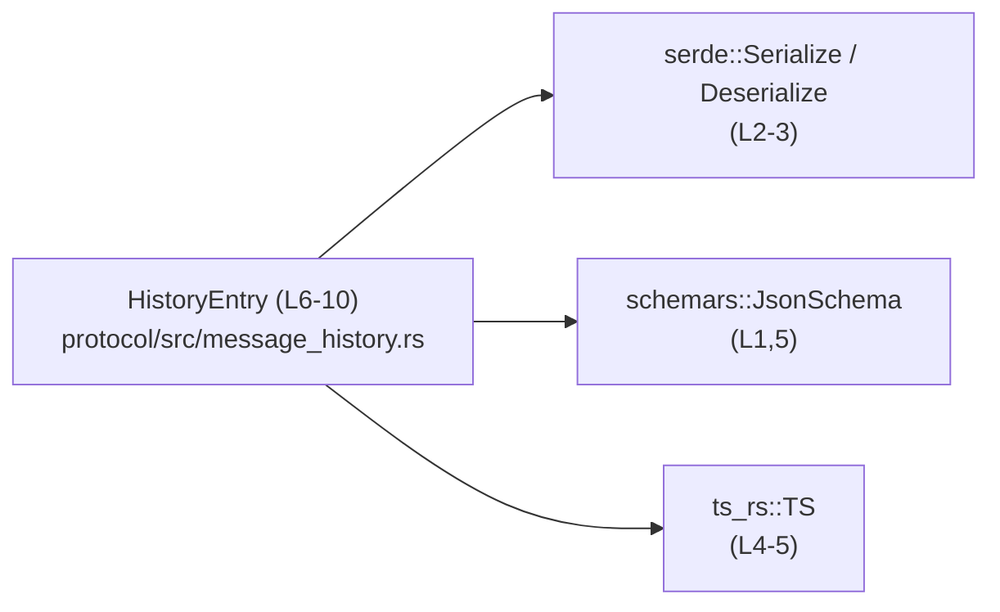
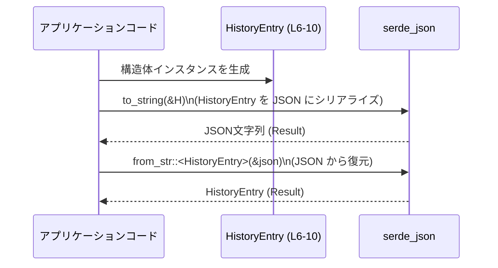

# protocol/src/message_history.rs

## 0. ざっくり一言

会話履歴の 1 メッセージ分を表すデータ構造 `HistoryEntry` を定義し、Serde を用いたシリアライズ／デシリアライズと、JSON Schema・TypeScript 定義生成に対応させるモジュールです（`protocol/src/message_history.rs:L1-10`）。

---

## 1. このモジュールの役割

### 1.1 概要

- このモジュールは、**会話履歴の 1 エントリ（メッセージ）** を表現するための構造体 `HistoryEntry` を提供します（`L6-10`）。
- `HistoryEntry` には、会話を識別する ID、タイムスタンプ、テキスト本文が含まれます（`L7-9`）。
- `Serialize` / `Deserialize` / `JsonSchema` / `TS` などの派生（derive）により、**Rust 内部だけでなく、JSON・TypeScript など他言語とのデータ連携**も意識した設計になっています（`L1-5`）。

### 1.2 アーキテクチャ内での位置づけ

このチャンクから分かるのは、「`HistoryEntry` が外部ライブラリのトレイトに依存している」という点のみです。他の自前モジュール（サービス層や永続化層など）との関係は、このチャンクには現れません。

依存関係（このファイルから確認できる範囲）を簡略図にすると次のようになります。



- `HistoryEntry` は Serde（`Serialize` / `Deserialize`）、Schemars（`JsonSchema`）、ts-rs（`TS`）のトレイトを derive することで、それぞれのライブラリから利用される形になります（`L1-5`）。
- `HistoryEntry` を利用する上位モジュール（API 層やストレージ層など）は、このチャンクには現れないため不明です。

### 1.3 設計上のポイント

コードから読み取れる設計上の特徴は次のとおりです。

- **純粋なデータ構造（DTO 的）**
  - メソッドやロジックは一切持たず、フィールドのみからなる構造体です（`L6-10`）。
- **全フィールドが公開（`pub`）**
  - `conversation_id`, `ts`, `text` のすべてが `pub` であり、モジュール外から直接読み書きできます（`L7-9`）。
- **シリアライズ／スキーマ生成に対応**
  - `Serialize`, `Deserialize`, `JsonSchema`, `TS` を derive しており（`L5`）、
    - Serde 対応フォーマット（JSON, MessagePack など）とのシリアライズ／デシリアライズ
    - JSON Schema の自動生成
    - TypeScript 型定義の自動生成  
    が可能な形になっています（ライブラリの一般的な使い方に基づく）。
- **デバッグとクローン**
  - `Debug`, `Clone` も derive されているため、`{:?}` でのデバッグ出力や値の複製が簡単です（`L5`）。
- **状態や並行性に関する特別な制御はなし**
  - `unsafe` やロックなどの並行制御は使われておらず（`L1-10`）、通常のスレッド安全性はフィールド型（`String`, `u64`）に依存します。

### 1.4 コンポーネント一覧（インベントリー）

このファイル内に現れるコンポーネントの一覧です。

| 名称 | 種別 | 説明 | 定義 / 利用位置 |
|------|------|------|-----------------|
| `HistoryEntry` | 構造体 | 会話履歴の 1 エントリ（会話 ID・タイムスタンプ・テキスト）を保持するデータ構造 | `protocol/src/message_history.rs:L6-10` |
| `JsonSchema` | トレイト（derive 対象） | JSON Schema 自動生成用のトレイト | `L1,5` |
| `Serialize` | トレイト（derive 対象） | シリアライズ（Rust → 外部形式）用のトレイト | `L3,5` |
| `Deserialize` | トレイト（derive 対象） | デシリアライズ（外部形式 → Rust）用のトレイト | `L2,5` |
| `TS` | トレイト（derive 対象） | TypeScript 型定義自動生成用のトレイト | `L4-5` |

---

## 2. 主要な機能一覧

このモジュールが提供する機能（このチャンクから読み取れる範囲）は次のとおりです。

- 会話履歴エントリの表現: `HistoryEntry` 構造体で、会話 ID・タイムスタンプ・テキストを保持する（`L6-10`）。
- Serde によるシリアライズ／デシリアライズ対応: `Serialize`, `Deserialize` を derive している（`L5`）。
- JSON Schema の自動生成対応: `JsonSchema` を derive している（`L1,5`）。
- TypeScript 型定義の自動生成対応: `TS` を derive している（`L4-5`）。
- デバッグ出力と複製: `Debug`, `Clone` を derive しているため、ログ出力やコピーが容易（`L5`）。

---

## 3. 公開 API と詳細解説

### 3.1 型一覧（構造体・列挙体など）

| 名前 | 種別 | 役割 / 用途 | 定義位置 |
|------|------|-------------|----------|
| `HistoryEntry` | 構造体 | 会話履歴の 1 メッセージを表すデータ構造。会話 ID・タイムスタンプ・テキスト本文を保持し、シリアライズやスキーマ生成の対象になる。 | `protocol/src/message_history.rs:L6-10` |

`HistoryEntry` のフィールド一覧（すべて `pub`）:

| フィールド名 | 型 | 説明 | 定義位置 |
|-------------|----|------|----------|
| `conversation_id` | `String` | 会話を一意に識別する ID。実際の形式（UUID など）はこのチャンクからは不明です。 | `L7` |
| `ts` | `u64` | タイムスタンプを表す数値。単位（秒・ミリ秒など）はこのチャンクからは不明ですが、非負整数であることは型から保証されます。 | `L8` |
| `text` | `String` | メッセージ本文のテキスト。文字コードや最大長などの仕様はこのチャンクからは不明です。 | `L9` |

### 3.2 関数詳細（最大 7 件）

このファイルには **関数定義は存在しません**（`L1-10`）。  
代わりに、このモジュールの中心となる構造体 `HistoryEntry` について、関数テンプレートに準じた形で詳細を整理します。

#### 構造体 `HistoryEntry`

**概要**

- 会話履歴の 1 エントリを表す単純なデータ構造です（`L6-10`）。
- すべてのフィールドが公開されているため、モジュール外から直接読み書きすることができます（`L7-9`）。
- Serde / Schemars / ts-rs のトレイトを derive し、シリアライズやスキーマ生成に利用されます（`L1-5`）。

**フィールド**

| フィールド名 | 型 | 説明 |
|-------------|----|------|
| `conversation_id` | `String` | 会話識別子。どの会話に属するメッセージかを特定するために使われます。具体的なルールはこのチャンクからは不明です。 |
| `ts` | `u64` | タイムスタンプ。メッセージ送信時刻などを表すと推測されますが、単位・基準時刻はコードからは判断できません。 |
| `text` | `String` | メッセージ本文。ユーザ発話やシステム応答などのテキストを保持します。 |

**戻り値**

- 構造体であり、関数ではないため戻り値という概念はありません。
- `HistoryEntry` インスタンス自体が、「1 メッセージ分のデータ」をまとめたオブジェクトとして扱われます。

**内部処理の流れ（アルゴリズム）**

- この構造体にはメソッドや内部ロジックは存在せず、単に 3 つのフィールドを保持するだけです（`L6-10`）。
- シリアライズ／デシリアライズなどの処理は、derive された各トレイト（`Serialize`, `Deserialize`, `JsonSchema`, `TS`）を通じてライブラリ側で行われます（`L1-5`）。

**Examples（使用例）**

以下は、同一クレート内の別モジュールから `HistoryEntry` を利用し、JSON にシリアライズ／デシリアライズする例です。  
（クレート名は仮に `crate` を用いています。実際のクレート名はこのチャンクからは分かりません。）

```rust
use crate::message_history::HistoryEntry;                    // HistoryEntry をインポート（同一クレート内のモジュールを想定）
use serde_json;                                              // JSON シリアライズ用

fn main() -> Result<(), Box<dyn std::error::Error>> {        // エラーを返せる main 関数
    // 会話履歴エントリを生成
    let entry = HistoryEntry {
        conversation_id: "conv-123".to_string(),             // 会話 ID を文字列で設定
        ts: 1_726_000_000,                                   // 例として Unix 時刻（秒）風の値をセット（単位は仕様に依存）
        text: "こんにちは".to_string(),                        // メッセージ本文
    };

    // JSON 文字列にシリアライズ（Serialize トレイトに基づく）
    let json = serde_json::to_string(&entry)?;               // 失敗時は Result::Err でエラーが返る
    println!("JSON: {}", json);                              // 結果を出力

    // JSON から HistoryEntry にデシリアライズ（Deserialize トレイトに基づく）
    let parsed: HistoryEntry = serde_json::from_str(&json)?; // JSON フォーマットが不正ならエラー
    assert_eq!(entry.conversation_id, parsed.conversation_id); // 値が一致することを確認

    Ok(())                                                   // 正常終了
}
```

**Errors / Panics（エラー・パニック条件）**

`HistoryEntry` 自体にはエラーやパニックを起こすロジックはありません（`L6-10`）。  
ただし、関連する処理で以下のようなエラーが発生し得ます（いずれもライブラリ側の挙動です）。

- **シリアライズ／デシリアライズ**
  - `serde_json::to_string(&entry)` などは、内部で I/O やフォーマット処理に失敗した場合 `Err` を返します。
  - `serde_json::from_str::<HistoryEntry>(...)` では、JSON 文字列に必要なフィールド（`conversation_id`, `ts`, `text`）が欠けていたり型が合わない場合にエラーになります。  
    これは、`HistoryEntry` に `#[serde(default)]` などが付いていないため、すべてのフィールドが必須になる serde のデフォルト挙動によります（`L7-9`）。

**Edge cases（エッジケース）**

この構造体に関する主なエッジケースは次のとおりです。

- **空文字列**
  - `conversation_id` や `text` が空文字列でも、型としては問題ありません（`String` 型なので任意の文字列を許容）。
  - ただし意味的に許されるかどうかは、上位のビジネスロジックに依存し、このチャンクからは分かりません。
- **極端な `ts` の値**
  - `ts` は `u64` なので、非常に大きな値も表現できます（`L8`）。
  - 0 や最大値（`u64::MAX`）を渡した場合の意味付けは、このチャンクでは定義されていません。
- **欠損フィールドを含む JSON**
  - 上述のとおり、`serde` デフォルトでは欠損フィールドがあるとデシリアライズは失敗します（`L7-9`）。
- **文字コードや長さの制約**
  - `text` は `String` なので UTF-8 文字列を前提としますが、文字数上限などはこのチャンクには現れません。

**使用上の注意点**

- **バリデーションは別レイヤーで必要**
  - `HistoryEntry` にバリデーションロジックは含まれていないため、  
    - `conversation_id` の形式（空でないか、一意性など）
    - `ts` の範囲・単位の妥当性
    - `text` の長さ・禁止文字の有無  
    などは、呼び出し側コードでチェックする必要があります。
- **フィールド公開による直接変更**
  - すべてのフィールドが `pub` なので、どこからでも書き換え可能です（`L7-9`）。  
    不整合を避けるため、利用側での更新ルールを決めておくと安全です。
- **並行性**
  - フィールド型が `String` と `u64` であり、一般的な Rust の標準ライブラリ実装では `Send` / `Sync` を満たしますが、  
    どのようにスレッド間で共有・更新するかは上位設計次第です。  
    共有する場合は、`Arc<HistoryEntry>` や `RwLock<HistoryEntry>` などの並行データ構造を用いるかどうかを検討する必要があります。
- **シリアライズ互換性**
  - `Serialize` / `Deserialize` / `JsonSchema` / `TS` を derive しているため（`L5`）、フィールド名や型を変更すると  
    - JSON 形式
    - JSON Schema
    - TypeScript 型定義  
    の互換性が失われる可能性があります。クライアントとの互換性が重要な場合は特に注意が必要です。

### 3.3 その他の関数

- このファイルには補助関数やラッパー関数は一切定義されていません（`L1-10`）。

---

## 4. データフロー

このチャンクには `HistoryEntry` を実際にどこから呼び出しているかは記述されていません。そのため、ここでは **一般的な利用イメージ** として、「アプリケーションコードが `HistoryEntry` を生成し、Serde を用いて JSON で送受信する」流れを示します。



- 実際にどの層（Web ハンドラ、DB アダプタなど）で `HistoryEntry` が生成・利用されるかは、このチャンクには現れません。
- 上図は、`Serialize` / `Deserialize` トレイトの一般的な使い方に基づく参考図です。

---

## 5. 使い方（How to Use）

### 5.1 基本的な使用方法

`HistoryEntry` を作成し、JSON にシリアライズ／デシリアライズする典型的なコードフローです。

```rust
use crate::message_history::HistoryEntry;                  // 同一クレート内の message_history モジュールからインポート
use serde_json;                                            // Serde の JSON サポートクレートを使用

fn main() -> Result<(), Box<dyn std::error::Error>> {      // エラーを返す main 関数
    // 1. HistoryEntry を生成
    let entry = HistoryEntry {
        conversation_id: "conv-001".to_string(),           // 会話 ID を設定
        ts: 1_726_000_000,                                 // タイムスタンプ（例: Unix 時刻）
        text: "最初のメッセージ".to_string(),               // メッセージ本文
    };

    // 2. JSON 文字列にシリアライズ
    let json = serde_json::to_string_pretty(&entry)?;      // `Serialize` トレイトに基づき JSON に変換
    println!("JSON:\n{}", json);                           // 結果を表示

    // 3. JSON から HistoryEntry にデシリアライズ
    let restored: HistoryEntry = serde_json::from_str(&json)?; // JSON フォーマットが不正なら Err になる
    println!("restored conversation_id = {}", restored.conversation_id);

    Ok(())                                                 // 正常終了
}
```

このコードにより、`HistoryEntry` を介してアプリケーション内と外部（JSON）との間でデータをやり取りできます。

### 5.2 よくある使用パターン（想定）

このチャンクには具体的な呼び出し例は含まれていないため、以下は **一般的に想定されるパターン** です。

1. **API リクエスト／レスポンスのペイロード**
   - REST / gRPC などの API で、会話履歴を送受信する際の DTO として `HistoryEntry` を利用する。
   - サーバ側では JSON で受信したデータを `HistoryEntry` にデシリアライズし、内部で処理後、再び JSON として返す。

2. **ストレージ永続化用のレコード**
   - DB やログファイルに保存する行（レコード）として `HistoryEntry` を利用し、  
     シリアライズされた JSON をそのまま保存する、あるいはフィールドを個別のカラムにマッピングする。

3. **フロントエンドとの型共有**
   - `TS` トレイトの derive により（`L5`）、ts-rs の仕組みを使って TypeScript の型定義を生成し、  
     フロントエンド（TypeScript）側と `HistoryEntry` の構造を共有する。

### 5.3 よくある間違い（起こり得る注意点）

コードから直接読み取れる誤用例はありませんが、構造から起こり得る典型的なミスを挙げます。

```rust
// （誤りの例）ts の単位を途中で変更したのに、既存クライアントに周知していない
let entry = HistoryEntry {
    conversation_id: "conv-001".to_string(),
    ts: 1_726_000_000,          // 以前は「秒」だったのを、コードだけ「ミリ秒」と解釈するように変更した
    text: "メッセージ".to_string(),
};
// ⇒ JSON スキーマや TS 型は同じなのに、意味が変わってしまい、クライアントとの解釈がずれる

// （望ましい例）意味変更時はコメントやバージョニングを行う、あるいはフィールド名自体を変える
let entry = HistoryEntry {
    conversation_id: "conv-001".to_string(),
    ts: 1_726_000_000,          // コメント等で単位を明記し、仕様として共有する
    text: "メッセージ".to_string(),
};
```

- フィールド名や型を変えずに意味だけ変えると、シリアライズ形式は変わらないため、  
  クライアント側からは仕様変更に気付きにくい点に注意が必要です。

### 5.4 使用上の注意点（まとめ）

- `HistoryEntry` 自体はバリデーションやビジネスロジックを持たないため、  
  値の妥当性チェックは上位レイヤーで行う前提の設計になっています（`L6-10`）。
- すべてのフィールドが `pub` であるため（`L7-9`）、  
  - どこからでも値を書き換えられる
  - 不変性を型で保証できない  
  という特性があります。利用側のコーディング規約で補う必要があります。
- Serde・JSON Schema・TypeScript 型定義と連動しているため、フィールド追加・変更時には外部インターフェースへの影響を確認することが重要です（`L1-5`）。

---

## 6. 変更の仕方（How to Modify）

### 6.1 新しい機能を追加する場合

`HistoryEntry` にフィールドを追加する場合の一般的な手順です。

1. **フィールドを追加**
   - `protocol/src/message_history.rs` の `HistoryEntry` に `pub` フィールドを追加します（`L6-10` を編集）。
2. **シリアライズ互換性の検討**
   - 既存 JSON との互換性を維持したい場合は、`Option<T>` と `#[serde(default)]` を組み合わせるなど、  
     serde の属性を併用することが多いです（属性は現在このファイルにはありません）。
3. **スキーマ・TS 型定義の更新**
   - `JsonSchema` / `TS` の derive により、フィールド追加は自動的にスキーマと TypeScript 型にも反映されますが、  
     その結果が既存クライアントに影響しないか確認する必要があります。
4. **関連箇所の更新**
   - 新しいフィールドに値をセットするコード／読み取るコードを、クレート内の利用箇所に追加します。  
     利用箇所はこのチャンクからは分からないため、`rg "HistoryEntry"` や IDE のシンボル検索で探すのが現実的です。

### 6.2 既存の機能を変更する場合

`HistoryEntry` の既存フィールドを変更する際の注意点です。

- **フィールド名を変更する場合**
  - シリアライズされた JSON のキー、JSON Schema、TypeScript 型名が変わるため、  
    外部インターフェースの破壊的変更になります。
- **フィールド型を変更する場合**
  - 例えば `ts: u64` を `String` に変えるなど（`L8` を変更）、JSON の型も変わるため互換性に影響します。
- **意味だけ変更する場合**
  - 「単位を秒→ミリ秒に変える」など、型は同じでも意味が変わる場合は、  
    コメント・ドキュメントやバージョン番号等でクライアントに周知する必要があります。
- **テスト**
  - このファイルにはテストコードは含まれていないため（`L1-10`）、  
    変更時には別ファイル（テストモジュール）で JSON の入出力を確認するテストを用意することが望ましいです。

---

## 7. 関連ファイル

このチャンクには、自前モジュールとの直接の関連は現れませんが、外部クレートとの関係はインポートから分かります。

| パス / クレート | 役割 / 関係 |
|----------------|------------|
| `schemars` クレート (`use schemars::JsonSchema;` `L1`) | `JsonSchema` トレイトを提供し、`HistoryEntry` の JSON Schema 自動生成を可能にする。 |
| `serde` クレート (`use serde::Serialize; use serde::Deserialize;` `L2-3`) | `Serialize` / `Deserialize` トレイトを提供し、`HistoryEntry` のシリアライズ／デシリアライズを可能にする。 |
| `ts-rs` クレート (`use ts_rs::TS;` `L4`) | `TS` トレイトを提供し、`HistoryEntry` の TypeScript 型定義生成を可能にする。 |
| （同一クレート内の他ファイル） | `HistoryEntry` を実際に利用するサービス層・API 層などは、このチャンクには現れず不明です。 |

このファイルは、会話履歴の「データの形」を定義する最小限のモジュールであり、実際のロジックや永続化、API 通信などは別モジュールに委ねられている形になっています。
