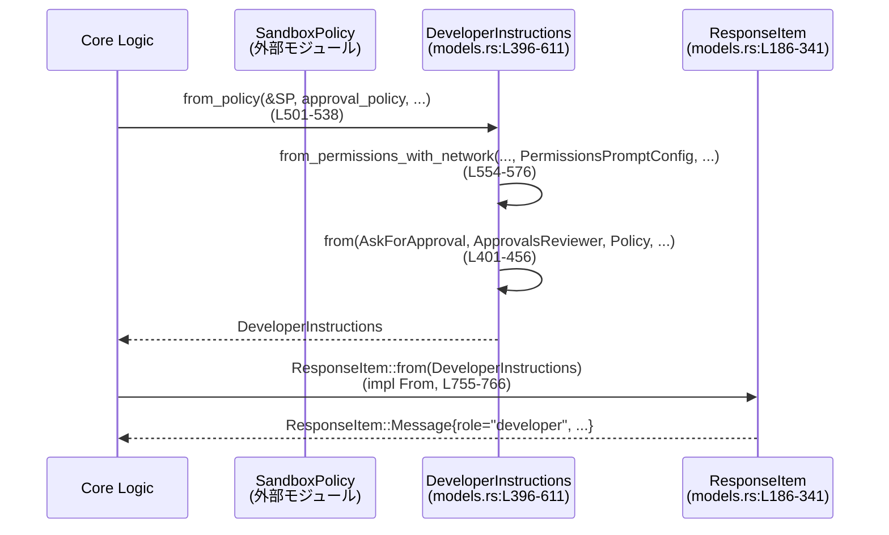
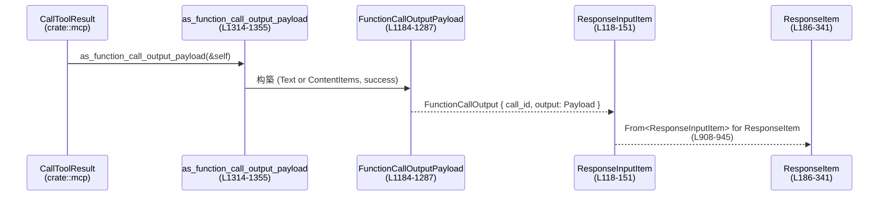
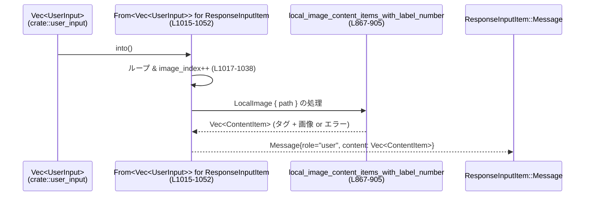

# protocol/src/models.rs

## 0. ざっくり一言

このモジュールは、**Codex のプロトコル層でやり取りされるメッセージ／ツール呼び出し／権限情報のデータモデルと、その変換ロジック**を定義するファイルです（レスポンス API モデル、シェルツールのパラメータ、権限プロンプト文言生成、画像入力のラッピングなど）。

> 行番号について  
> このチャンクには元ファイルの行番号が含まれていないため、**ここではチャンク先頭を `L1` とする相対行番号**で記載します。  
> 表記例: `models.rs:L401-455` は、この回答内で数えた相対行番号です。

---

## 1. このモジュールの役割

### 1.1 概要

このモジュールは **会話エージェントと外部世界とのインターフェース**を型安全に表現するために存在し、主に次の機能を提供します。

- モデル出力・ツール呼び出し・検索結果などの **レスポンス項目 (`ResponseItem`, `ResponseInputItem`) の型定義とシリアライズ設定**（`serde` / `ts-rs` / `schemars`）  
- シェル実行・検索などツール呼び出しの **パラメータ構造体**（`ShellToolCallParams` など）  
- サンドボックス／権限／承認ポリシーから **開発者向け指示文 (`DeveloperInstructions`) を生成するロジック**  
- 画像（URL とローカルファイル）を **モデル入力用の `ContentItem` 列に変換するロジック**  
- MCP ツールやカスタムツールの出力 (`CallToolResult`) から **汎用の `FunctionCallOutputPayload` への変換**  

### 1.2 アーキテクチャ内での位置づけ

主な依存関係を簡略化すると、次のようになります。

```mermaid
graph TD
    subgraph "protocol/src/models.rs"
        RItem["ResponseItem<br/>(L186-341)"]
        RIInput["ResponseInputItem<br/>(L118-151)"]
        Content["ContentItem<br/>(L153-159)"]
        DevInst["DeveloperInstructions<br/>(L360-611)"]
        FPayload["FunctionCallOutputPayload<br/>(L1184-1287)"]
        ShellParams["ShellToolCallParams / ShellCommandToolCallParams<br/>(L1063-1109)"]
        ImgFlow["local_image_content_items_with_label_number<br/>(L867-905)"]
    end

    UserInput["UserInput<br/>(crate::user_input)"] -->|From<Vec<UserInput>>| RIInput
    RIInput -->|"impl From<ResponseInputItem> for ResponseItem"| RItem

    SandboxPolicy["SandboxPolicy<br/>(crate::protocol)"] -->|from_policy(...)| DevInst
    Policy["Policy<br/>(codex_execpolicy)"] --> DevInst

    DevInst -->|"impl From<DeveloperInstructions> for ResponseItem"| RItem

    CallTool["CallToolResult<br/>(crate::mcp)"] -->|as_function_call_output_payload| FPayload
    FPayload -->|"ResponseInputItem::FunctionCallOutput"| RIInput
    RIInput --> RItem

    ImgLib["load_for_prompt_bytes<br/>(codex_utils_image)"] --> ImgFlow
    ImgFlow --> Content
    UserInput -->|LocalImage / Image| ImgFlow
```

- `ResponseItem` は「すでに正規化されたレスポンス」（モデルから UI へ、など）を表します。
- `ResponseInputItem` は「レスポンス API 互換の入力イベント」を表し、`impl From` で `ResponseItem` に変換されます。
- `DeveloperInstructions` はサンドボックス・承認ポリシーなどを文字列プロンプトに変換し、`ResponseItem::Message` として会話に注入できます。
- 画像や MCP ツール出力などの「生データ」は、ここで定義される型／関数を通じて **共通の `ContentItem` / `FunctionCallOutputPayload` 表現**に統合されます。

### 1.3 設計上のポイント

コードから読み取れる設計上の特徴は次のとおりです。

- **強く型付けされたプロトコルモデル**
  - ほぼ全ての公開型が `Serialize` / `Deserialize` / `JsonSchema` / `TS` を derive しており、Rust・JSON・TypeScript・OpenAPI スキーマを一貫して生成できます（例: `ResponseItem` `models.rs:L186-341`）。
- **入出力の分離**
  - `ResponseInputItem`（入力側）と `ResponseItem`（正規化された出力側）を分け、`impl From` で明示的に変換しています（`models.rs:L908-945`）。
- **権限・承認ポリシーをテンプレートベースで生成**
  - サンドボックスモードや `AskForApproval` などから `DeveloperInstructions` のテキストを組み立てるロジックを集中管理しています（`models.rs:L396-611`, `L627-697`）。
  - テンプレート文字列は `LazyLock<Template>` として静的にパースされ、使用時は `render` でプレースホルダを埋めています（`models.rs:L35-46`, `L599-611`）。
- **画像や MCP コンテンツのラッピング**
  - 画像入力・ローカル画像・MCP image/text コンテンツを、モデルが扱える `data:` URL や `ContentItem` に統一する流れを備えています（`models.rs:L867-905`, `L1362-1406`）。
- **エラーハンドリング方針**
  - プロトコルレベルのエラーは多くの場合 **文字列化してコンテンツに埋め込む**（例: `CallToolResult::from_error_text` `models.rs:L1298-1308`、画像読み込み失敗のプレースホルダ `models.rs:L789-799`）。
  - 初期化時のテンプレートパース／レンダリング失敗は `panic!` で即時停止する想定です（`models.rs:L35-46`, `L599-611`）。
- **並行性**
  - `LazyLock<Template>` はスレッドセーフな一度きりの初期化を提供し、マルチスレッド環境でも安全に共有されます。
  - それ以外は主に不変のデータ構造を扱う純粋関数が多く、明示的なスレッド共有状態はありません。

---

## 2. 主要な機能一覧

モジュール全体の主要機能を、役割ベースで列挙します。

- **レスポンス／コンテンツモデル**
  - `ResponseItem`: レスポンス API の出力イベント（メッセージ、ツール呼び出し、Web 検索、画像生成など）を表現。
  - `ResponseInputItem`: レスポンス API 入力イベント（メッセージ、ツール実行結果など）を表現。
  - `ContentItem`: テキスト／画像などのコンテンツ片。
  - `FunctionCallOutputContentItem` / `FunctionCallOutputBody` / `FunctionCallOutputPayload`: ツール呼び出し結果のペイロード表現。
- **権限とサンドボックス**
  - `SandboxPermissions`, `PermissionProfile`, `FileSystemPermissions`, `NetworkPermissions`: シェルツールが要求する一時的な権限セット。
  - `DeveloperInstructions`: `SandboxPolicy` や承認ポリシーから、モデルへのガイダンス文を生成。
  - `format_allow_prefixes`: コマンドプレフィクス許可ルールを人間可読なリストに整形。
- **ツール呼び出しパラメータ**
  - `SearchToolCallParams`: 検索ツール（tool search）のパラメータ。
  - `ShellToolCallParams` / `ShellCommandToolCallParams`: シェル／コンテナ実行ツールのパラメータ。
  - `LocalShellStatus`, `LocalShellAction`, `LocalShellExecAction`: ローカルシェル実行の状態とアクションを表現。
- **Web 検索 / Reasoning**
  - `WebSearchAction`: Web 検索アクションの種類（検索、ページオープン、ページ内検索など）。
  - `ReasoningItemReasoningSummary`, `ReasoningItemContent`: 推論内容の要約や詳細テキスト。
- **画像・マルチモーダルサポート**
  - 画像タグ文字列生成・判定 (`image_open_tag_text`, `local_image_open_tag_text` など)。
  - ローカル画像ファイルを読み込み、データ URL 付き `ContentItem` に変換 (`local_image_content_items_with_label_number`)。
  - MCP image/text コンテンツを `FunctionCallOutputContentItem` に変換 (`convert_mcp_content_to_items`)。
- **ユーティリティ**
  - `function_call_output_content_items_to_text` / `FunctionCallOutputBody::to_text`: マルチモーダル出力をテキストにフォールバック。
  - `impl From<Vec<UserInput>> for ResponseInputItem`: `UserInput` 列をレスポンス API 互換の `ResponseInputItem::Message` に変換。
  - `impl CallToolResult { ... }`: MCP ツール結果を `FunctionCallOutputPayload` に変換。

---

## 3. 公開 API と詳細解説

### 3.1 型一覧（構造体・列挙体など）

#### 権限・サンドボックス関連

| 名前 | 種別 | 行範囲 | 役割 / 用途 |
|------|------|--------|-------------|
| `SandboxPermissions` | enum | `models.rs:L48-81` | シェルツール呼び出しごとのサンドボックス上書き要求（デフォルト利用／完全エスカレーション／追加権限のみ）。 |
| `FileSystemPermissions` | struct | `models.rs:L83-93` | 読み取り・書き込み可能なパスのリスト。`is_empty` で両方 `None` かを判定。 |
| `NetworkPermissions` | struct | `models.rs:L95-104` | ネットワーク利用可否 (`enabled`) をオプションで表現。 |
| `PermissionProfile` | struct | `models.rs:L106-116` | ネットワーク・ファイルシステム権限のまとめ。`is_empty` でどちらも `None` か判定。 |
| `DeveloperInstructions` | struct | `models.rs:L360-611` | サンドボックス・承認ポリシー等から生成される開発者指示文テキスト。多数の `pub fn` で構築パターンを提供。 |
| `BaseInstructions` | struct | `models.rs:L345-358` | スレッド単位のベース指示文。「instructions」フィールドに対応。 |
| `PermissionsPromptConfig<'a>` | struct (非公開) | `models.rs:L388-394` | `DeveloperInstructions::from_permissions_with_network` 内部で使用する承認ポリシー関連設定。 |

#### レスポンス／コンテンツモデル

| 名前 | 種別 | 行範囲 | 役割 / 用途 |
|------|------|--------|-------------|
| `ResponseInputItem` | enum | `models.rs:L118-151` | Responses API 入力の 1 項目（メッセージ、function_call_output、tool_search_output など）。 |
| `ContentItem` | enum | `models.rs:L153-159` | メッセージ内部のコンテンツ要素。入力テキスト・入力画像・出力テキスト。 |
| `ImageDetail` | enum | `models.rs:L161-168` | 画像詳細度（auto/low/high/original）。image 出力側で利用。 |
| `MessagePhase` | enum | `models.rs:L170-184` | メッセージが途中コメントか最終回答かを表すメタデータ。 |
| `ResponseItem` | enum | `models.rs:L186-341` | 正規化されたレスポンス項目。メッセージ、関数呼び出し、ツール検索、Web 検索、画像生成、コンパクション等を含む。 |
| `LocalShellStatus` | enum | `models.rs:L949-955` | ローカルシェル実行の状態（完了／進行中／未完）。 |
| `LocalShellAction` | enum | `models.rs:L957-961` | ローカルシェルアクションの種別。現在は `Exec(LocalShellExecAction)` のみ。 |
| `LocalShellExecAction` | struct | `models.rs:L963-969` | ローカルシェル実行パラメータ（コマンド、タイムアウト、作業ディレクトリ、環境変数、ユーザー）。 |
| `WebSearchAction` | enum | `models.rs:L972-1000` | Web 検索 API が行うアクション（検索、ページを開く、ページ内検索、その他）。 |
| `ReasoningItemReasoningSummary` | enum | `models.rs:L1002-1006` | 推論サマリー用のテキスト型。 |
| `ReasoningItemContent` | enum | `models.rs:L1008-1012` | 推論コンテンツ（内部用推論テキストと公開テキスト）。 |

#### ツール呼び出しパラメータ

| 名前 | 種別 | 行範囲 | 役割 / 用途 |
|------|------|--------|-------------|
| `SearchToolCallParams` | struct | `models.rs:L1054-1059` | tool search の引数。`query` とオプション `limit`。 |
| `ShellToolCallParams` | struct | `models.rs:L1062-1084` | `name` が `container.exec` / `shell` の function_call に対応するパラメータ。コマンド配列、作業ディレクトリ、タイムアウト、権限プロファイルなど。 |
| `ShellCommandToolCallParams` | struct | `models.rs:L1086-1109` | `name` が `shell_command` の function_call に対応するパラメータ。シェル文字列、ログインシェル指定、タイムアウト等。 |

#### ツール出力ペイロード・MCP 連携

| 名前 | 種別 | 行範囲 | 役割 / 用途 |
|------|------|--------|-------------|
| `FunctionCallOutputContentItem` | enum | `models.rs:L1112-1127` | ツール呼び出し結果として Responses API に返せるコンテンツ要素（テキスト・画像）。 |
| `FunctionCallOutputBody` | enum | `models.rs:L1190-1195` | function_call_output.output の本体。テキストかコンテンツ配列。 |
| `FunctionCallOutputPayload` | struct | `models.rs:L1184-1188` | `FunctionCallOutputBody` と、`success` フラグ（内部メタデータ）を保持するペイロード。カスタムシリアライズ／デシリアライズ実装あり。 |
| `CallToolResult` の `impl` | impl block | `models.rs:L1290-1359` | MCP ツール結果から `FunctionCallOutputPayload` へ変換するメソッド群。 |

#### 画像・タグ・定数

| 名前 | 種別 | 行範囲 | 役割 / 用途 |
|------|------|--------|-------------|
| `VIEW_IMAGE_TOOL_NAME` | const &str | `models.rs:L802` | 画像閲覧ツール名 `"view_image"`。 |
| `image_open_tag_text` / `image_close_tag_text` | `pub fn` | `models.rs:L810-816` | グローバルな画像タグ `<image>` / `</image>` のテキストを返す。 |
| `local_image_label_text` | `pub fn` | `models.rs:L818-820` | `[Image #n]` 形式のローカル画像ラベル文字列。 |
| `local_image_open_tag_text` | `pub fn` | `models.rs:L822-825` | `<image name=[Image #n]>` 形式のローカル画像オープンタグ。 |
| `is_local_image_open_tag_text` / `is_local_image_close_tag_text` | `pub fn` | `models.rs:L827-834` | 文字列がローカル画像タグかを判定。 |
| `is_image_open_tag_text` / `is_image_close_tag_text` | `pub fn` | `models.rs:L836-841` | 文字列が `<image>` / `</image>` かを判定。 |
| `local_image_content_items_with_label_number` | `pub fn` | `models.rs:L867-905` | ローカル画像ファイルを読み込み、必要に応じてラベル付きの `ContentItem` 列に変換する。 |

#### 変換用の `From` 実装など

| 名前 | 種別 | 行範囲 | 役割 / 用途 |
|------|------|--------|-------------|
| `impl From<DeveloperInstructions> for ResponseItem` | impl | `models.rs:L755-766` | 開発者指示文を `ResponseItem::Message`（開発者ロール）に変換。 |
| `impl From<SandboxMode> for DeveloperInstructions` | impl | `models.rs:L769-777` | サンドボックスモードから、その説明文だけを含む `DeveloperInstructions` を生成。 |
| `impl From<ResponseInputItem> for ResponseItem` | impl | `models.rs:L908-945` | 入力項目を正規化された `ResponseItem` に変換。 |
| `impl From<Vec<UserInput>> for ResponseInputItem` | impl | `models.rs:L1015-1052` | ユーザー入力列を単一の `ResponseInputItem::Message` に変換し、画像タグやローカル画像処理を行う。 |
| `impl From<DynamicToolCallOutputContentItem> for FunctionCallOutputContentItem` | impl | `models.rs:L1162-1177` | 動的ツール出力型をレスポンス API 互換のコンテンツ型に変換。 |

#### ユーティリティ関数

| 関数名 | 行範囲 | 役割（1 行） |
|--------|--------|--------------|
| `format_allow_prefixes` | `models.rs:L703-739` | コマンドプレフィクス許可ルールを並び替え・制限付きでテキスト化。 |
| `function_call_output_content_items_to_text` | `models.rs:L1141-1159` | コンテンツアイテム列から非空テキストだけを結合して `Option<String>` に変換。 |
| `approved_command_prefixes_text` | `models.rs:L614-617` | `Policy` から取得したプレフィクスリストを整形し、空なら `None`。 |
| `granular_instructions` | `models.rs:L627-697` | granular approval ポリシーに応じたプロンプトテキストを生成。 |
| `convert_mcp_content_to_items` | `models.rs:L1362-1406` | MCP コンテンツ JSON をテキスト／画像コンテンツアイテム列に変換。 |
| `should_serialize_reasoning_content` | `models.rs:L780-787` | 推論コンテンツに `ReasoningText` が含まれるかどうかでシリアライズ可否を判定。 |

### 3.2 関数詳細（重要な 7 件）

#### 1. `DeveloperInstructions::from(...) -> DeveloperInstructions` （権限ポリシーから指示文へ）

`models.rs:L401-456`

```rust
pub fn from(
    approval_policy: AskForApproval,
    approvals_reviewer: ApprovalsReviewer,
    exec_policy: &Policy,
    exec_permission_approvals_enabled: bool,
    request_permissions_tool_enabled: bool,
) -> DeveloperInstructions
```

**概要**

- 承認ポリシー (`AskForApproval`) やレビュワー種別、実行ポリシー (`Policy`) から、**権限リクエストに関する説明テキスト**を組み立て、`DeveloperInstructions` として返します。
- granular ポリシーを含む全パターンに対応し、`request_permissions` ツールなどの存在に応じて説明節を追加します。

**引数**

| 引数名 | 型 | 説明 |
|--------|----|------|
| `approval_policy` | `AskForApproval` | `never` / `unless_trusted` / `on_failure` / `on_request` / `granular` などの承認方針。 |
| `approvals_reviewer` | `ApprovalsReviewer` | 承認を行う主体（ユーザー／Guardian サブエージェント等）。 |
| `exec_policy` | `&Policy` | 既に許可済みのコマンドプレフィクスを含む実行ポリシー。 |
| `exec_permission_approvals_enabled` | `bool` | shell コマンドごとの権限リクエスト（`with_additional_permissions` 等）が有効か。 |
| `request_permissions_tool_enabled` | `bool` | `request_permissions` ツールを利用できるかどうか。 |

**戻り値**

- `DeveloperInstructions`: 組み立て済みの指示文を内包する構造体。`into_text` で文字列として取り出せます。

**内部処理の流れ**

1. `with_request_permissions_tool` クロージャで、「ベーステキスト + `request_permissions` ツールセクション」を簡単に連結できるようにします（`models.rs:L408-414`）。
2. `on_request_instructions` クロージャで `AskForApproval::OnRequest` 時の説明文を構成します。
   - `exec_permission_approvals_enabled` に応じて `APPROVAL_POLICY_ON_REQUEST_RULE(_REQUEST_PERMISSION)` を選択（`L416-420`）。
   - 必要に応じて `request_permissions_tool_prompt_section()` や `approved_command_prefixes_text(exec_policy)` の結果を追加（`L421-429`）。
3. `approval_policy` ごとにマッチし、対応するテンプレート定数・`granular_instructions` を使って `text` を生成（`L432-445`）。
4. `approvals_reviewer` が `GuardianSubagent` かつ `approval_policy != Never` の場合、`GUARDIAN_SUBAGENT_APPROVAL_SUFFIX` を末尾に追記（`L447-453`）。
5. 生成したテキストを `DeveloperInstructions::new(text)` でラップして返します（`L455`）。

**Examples（使用例）**

```rust
use crate::config_types::ApprovalsReviewer;
use crate::protocol::AskForApproval;
use codex_execpolicy::Policy;

// 単純な "unless_trusted" ポリシーの指示文を生成する例
let exec_policy = Policy::empty(); // 許可済みプレフィクスなし

let dev_instructions = DeveloperInstructions::from(
    AskForApproval::UnlessTrusted,      // 信頼されていない場合のみ承認を要求
    ApprovalsReviewer::User,            // ユーザーが承認者
    &exec_policy,
    /*exec_permission_approvals_enabled*/ false,
    /*request_permissions_tool_enabled*/ true,
);

let text = dev_instructions.into_text();
// `approval_policy` が `unless-trusted` であることや request_permissions ツールの使い方を説明するテキストが含まれます。
```

**Errors / Panics**

- この関数自身は `Result` を返さず、`panic!` もしません。
- ただし内部で呼び出す `granular_instructions` や `approved_command_prefixes_text` は `Policy` 依存ですが、ここではエラーを投げず、文字列整形のみを行います。

**Edge cases（エッジケース）**

- `approval_policy == AskForApproval::Never` の場合、Guardian サブエージェント用文言は **付与されません**（`L447-453`）。
- granular 設定の各フラグ組み合わせに応じて、出力セクション数が変化します（`granular_instructions` 参照）。

**使用上の注意点**

- 生成テキストは **人間向けプロンプト**であり、機械解釈を前提とした厳密な仕様表現ではありません。ツール側ロジックと矛盾しないように使用する必要があります。
- `exec_policy` に多量のプレフィクスが登録されている場合、後段の `format_allow_prefixes` により一覧はトリミングされます（詳細は後述）。

---

#### 2. `DeveloperInstructions::from_policy(...) -> Self` （SandboxPolicy + 承認ポリシーから統合指示文）

`models.rs:L501-538`

```rust
pub fn from_policy(
    sandbox_policy: &SandboxPolicy,
    approval_policy: AskForApproval,
    approvals_reviewer: ApprovalsReviewer,
    exec_policy: &Policy,
    cwd: &Path,
    exec_permission_approvals_enabled: bool,
    request_permissions_tool_enabled: bool,
) -> Self
```

**概要**

- サンドボックスポリシー (`SandboxPolicy`)・承認ポリシー・実行ポリシーとカレントディレクトリを入力として、**権限全体に関する統合的な Developer 指示文**を作成します。
- サンドボックスモードの説明、ネットワークアクセス状態、承認ポリシーの説明、`writable_roots` の一覧などをひとつのブロックにまとめます。

**引数**

| 引数名 | 型 | 説明 |
|--------|----|------|
| `sandbox_policy` | `&SandboxPolicy` | ファイルシステム／ネットワークサンドボックス設定。 |
| `approval_policy` | `AskForApproval` | 承認ポリシー。 |
| `approvals_reviewer` | `ApprovalsReviewer` | 承認者（ユーザー／Guardian サブエージェントなど）。 |
| `exec_policy` | `&Policy` | コマンドプレフィクス許可ポリシー。 |
| `cwd` | `&Path` | ワークスペース書き込みモード時のカレントディレクトリ。 |
| `exec_permission_approvals_enabled` | `bool` | コマンドごとのエスカレーション要求が有効か。 |
| `request_permissions_tool_enabled` | `bool` | `request_permissions` ツールが利用可能か。 |

**戻り値**

- `DeveloperInstructions`: `<permissions instructions> ... </permissions instructions>` で囲まれた統合指示文。

**内部処理の流れ**

1. `sandbox_policy.has_full_network_access()` によりネットワークアクセスが有効かを判定し、`NetworkAccess::Enabled/Restricted` を決定（`L510-514`）。
2. `sandbox_policy` のバリアントに応じて `SandboxMode` と `writable_roots` を決定（`L516-523`）。
   - `WorkspaceWrite` の場合は `get_writable_roots_with_cwd(cwd)` で書き込み可能ルートを取得。
3. `DeveloperInstructions::from_permissions_with_network(...)` を呼び出し、モード・ネットワーク状態・承認ポリシーなどをまとめて指示文に変換（`L526-537`）。

**Examples（使用例）**

```rust
use crate::protocol::{SandboxPolicy, AskForApproval};
use crate::config_types::{SandboxMode, ApprovalsReviewer};
use codex_execpolicy::Policy;
use std::path::PathBuf;

let sandbox_policy = SandboxPolicy::WorkspaceWrite {
    writable_roots: vec![],
    read_only_access: Default::default(),
    network_access: true,
    exclude_tmpdir_env_var: false,
    exclude_slash_tmp: false,
};

let exec_policy = Policy::empty();

let instructions = DeveloperInstructions::from_policy(
    &sandbox_policy,
    AskForApproval::UnlessTrusted,
    ApprovalsReviewer::User,
    &exec_policy,
    &PathBuf::from("/workspace"),
    /*exec_permission_approvals_enabled*/ false,
    /*request_permissions_tool_enabled*/ false,
);

let text = instructions.into_text();
// ネットワークが enabled であることや sandbox_mode が workspace-write であることが含まれます。
```

**Errors / Panics**

- この関数自身は panic を発生させません。
- 内部で呼び出す `sandbox_text` がテンプレートの `render` で panic しうる点に注意が必要です（`models.rs:L605-608`）。

**Edge cases**

- `SandboxPolicy::ExternalSandbox` は `SandboxMode::DangerFullAccess` として扱われます（`L519-520`）。
- `SandboxPolicy::WorkspaceWrite` で `writable_roots` が空でも、`cwd` を使ってルートを構成するため、`from_writable_roots` の挙動に依存します。

**使用上の注意点**

- テンプレートファイル（`prompts/permissions/...md`）が正しく存在・パース可能であることが前提です。不整合があるとプロセス起動時に panic します。
- `from_policy` は UI に表示する文言を生成するものであり、**実際の権限チェックは `SandboxPolicy` や実行ポリシー側のロジックに委ねられます**。

---

#### 3. `DeveloperInstructions::from_permissions_with_network(...) -> Self` （内部統合関数）

`models.rs:L554-576` — 非公開ですがコアロジックの中心なので解説します。

```rust
fn from_permissions_with_network(
    sandbox_mode: SandboxMode,
    network_access: NetworkAccess,
    config: PermissionsPromptConfig<'_>,
    writable_roots: Option<Vec<WritableRoot>>,
) -> Self
```

**概要**

- サンドボックスモード・ネットワーク状態・承認ポリシー・書き込みルート一覧を組み合わせて、**統合的な権限説明ブロック**を構成します。
- `<permissions instructions>` タグで囲まれた1つの `DeveloperInstructions` を返します。

**内部処理の流れ**

1. `start_tag = "<permissions instructions>"`, `end_tag = "</permissions instructions>"` を `DeveloperInstructions::new` で構築（`L560-561`）。
2. `sandbox_text(sandbox_mode, network_access)` でサンドボックス・ネットワーク状態の説明文を取得（`L563-566`）。
3. `DeveloperInstructions::from(...)` を呼び出し、承認ポリシーに関する説明文を生成（`L567-573`）。
4. `DeveloperInstructions::from_writable_roots(writable_roots)` で書き込み可能ルートの文章を追加（`L574`）。
5. `concat` を連ねて、`start_tag` + sandbox 説明 + 承認説明 + writable roots + `end_tag` の形で 1 つの `DeveloperInstructions` を返します（`L562-575`）。

**使用上の注意点**

- この関数は、**タグ境界を含めた完全なブロックを返す**ため、呼び出し側でタグを追加する必要はありません。
- 空の `writable_roots` か `None` の場合、ファイルシステムの書き込みルートに関する文言は挿入されません（`from_writable_roots` 参照）。

---

#### 4. `format_allow_prefixes(prefixes: Vec<Vec<String>>) -> Option<String>` （許可コマンドプレフィクスの整形）

`models.rs:L703-739`

**概要**

- `Policy::get_allowed_prefixes()` から得た **コマンドプレフィクスのリスト**を、人間が読みやすい箇条書きテキストに整形します。
- 数と文字数に上限を設け、必要に応じて `[Some commands were truncated]` を付与します。

**引数**

| 引数名 | 型 | 説明 |
|--------|----|------|
| `prefixes` | `Vec<Vec<String>>` | プレフィクスの配列。各要素はトークン（`["git", "pull"]` のような形）。 |

**戻り値**

- `Some(String)`:
  - `- ["cmd", "arg"]` のような行を改行で連結した文字列。上限に達した場合は末尾に `TRUNCATED_MARKER` を付加。
- `None`:
  - 実装上は常に `Some(...)` を返しており、空文字列のケースでも `Some("")` です（`approved_command_prefixes_text` 側で空文字をフィルタしています `L614-617`）。

**内部処理の流れ**

1. `truncated` フラグを `false` で初期化。`prefixes.len() > MAX_RENDERED_PREFIXES` の場合、一旦 `true` に設定（`L704-707`）。
2. `prefixes` を `len` → 文字列結合長 (`prefix_combined_str_len`) → 辞書順 の順でソート（`L709-715`）。
3. 先頭 `MAX_RENDERED_PREFIXES` 件を `render_command_prefix` で整形し、`- [JSON string, ...]` 形式の行を作成して改行結合（`L717-722`）。
4. 文字数（バイト長）を `MAX_ALLOW_PREFIX_TEXT_BYTES` までに制限するため、`char_indices().nth(...)` で境界を取り出し、必要ならトリミングして `truncated = true`（`L724-733`）。
5. `truncated == true` であれば `"{output}{TRUNCATED_MARKER}"` を返し、そうでなければ `output` をそのまま返します（`L735-739`）。

**Examples（使用例）**

```rust
use codex_execpolicy::{Policy, Decision};

// Policy にいくつかの prefix ルールを登録する
let mut policy = Policy::empty();
policy.add_prefix_rule(
    &["git".to_string(), "pull".to_string()],
    Decision::Allow,
).unwrap();

let prefixes = policy.get_allowed_prefixes();
let rendered = format_allow_prefixes(prefixes).unwrap();

// 例:
// - ["git", "pull"]
```

**Errors / Panics**

- `serde_json::to_string` を用いる `render_command_prefix` が `Err` を返す場合でも、`unwrap_or_else` で `Debug` 表現にフォールバックするため、panic は起こりません（`models.rs:L746-752`）。

**Edge cases**

- プレフィクス数が `MAX_RENDERED_PREFIXES` を超える場合、**行数ベースの制限**と**文字数ベースの制限**の両方がかかります。
- 非 ASCII 文字を含む場合、`char_indices().nth(...)` で **UTF-8 の境界を守ってトリムされます**（`L724-733`）。

**使用上の注意点**

- 出力は人間向けテキストであり、ツールで再パースして厳密なルールに戻す用途には適していません。
- 表示 UI 側では、`TRUNCATED_MARKER` を見て「一部省略されている」ことをユーザーに示す必要があります。

---

#### 5. `local_image_content_items_with_label_number(...) -> Vec<ContentItem>`（ローカル画像の読み込みとラッピング）

`models.rs:L867-905`

```rust
pub fn local_image_content_items_with_label_number(
    path: &std::path::Path,
    file_bytes: Vec<u8>,
    label_number: Option<usize>,
    mode: PromptImageMode,
) -> Vec<ContentItem>
```

**概要**

- ローカル画像ファイルのバイト列から `PromptImageMode` に従い画像を読み込み、モデル入力用の `ContentItem::InputImage` と、その前後のラベルタグ（必要なら）を生成します。
- 読み込み・デコード・エンコード・フォーマットが失敗した場合は、**エラーメッセージ付きの `ContentItem::InputText`** を返します。

**引数**

| 引数名 | 型 | 説明 |
|--------|----|------|
| `path` | `&Path` | 画像ファイルパス。エラーメッセージにも利用。 |
| `file_bytes` | `Vec<u8>` | すでに読み込まれたファイルバイト列。 |
| `label_number` | `Option<usize>` | `Some(n)` のとき `[Image #n]` ラベル付きタグで囲む。 |
| `mode` | `PromptImageMode` | 画像をプロンプト用に加工するモード（例: リサイズ）。 |

**戻り値**

- 正常系: 最大 3 要素の `Vec<ContentItem>`  
  - `label_number` が `Some(n)` の場合:  
    1. `InputText` `<image name=[Image #n]>`  
    2. `InputImage` `image_url`（data URL）  
    3. `InputText` `</image>`  
  - `None` の場合: `InputImage` のみ
- エラー系: **1 要素の `InputText`**（説明メッセージ）

**内部処理の流れ**

1. `load_for_prompt_bytes(path, file_bytes, mode)` を呼び出して画像をロード（`L873`）。
2. 成功した場合:
   - 必要なら `local_image_open_tag_text(label_number)` を挿入（`L876-879`）。
   - `image.into_data_url()` により `data:` URL を作成し、`ContentItem::InputImage` に格納（`L881-883`）。
   - `label_number.is_some()` の場合のみ閉じタグ `LOCAL_IMAGE_CLOSE_TAG`（`</image>`）を挿入（`L884-887`）。
3. 失敗した場合 (`Err(err)`):
   - `ImageProcessingError::Read` / `Encode`: `local_image_error_placeholder`（読めない／エンコードできない）を返す（`L892-894`）。
   - `ImageProcessingError::Decode` かつ `err.is_invalid_image() == true`: `invalid_image_error_placeholder`（無効な画像）を返す（`L895-897`）。
   - `ImageProcessingError::Decode`（その他）：`local_image_error_placeholder`（汎用デコードエラー）（`L898-900`）。
   - `ImageProcessingError::UnsupportedImageFormat { mime }`: `unsupported_image_error_placeholder`（MIME タイプを含めたメッセージ）（`L901-903`）。

**Examples（使用例）**

```rust
use std::path::Path;
use codex_utils_image::PromptImageMode;

// ファイルバイトは別途 std::fs::read などで取得しているとする
let path = Path::new("images/example.png");
let file_bytes = std::fs::read(path).expect("image file");

let items = local_image_content_items_with_label_number(
    path,
    file_bytes,
    Some(1),                           // ラベル番号 1
    PromptImageMode::ResizeToFit,      // プロンプト用にリサイズ
);

// items[0]: InputText("<image name=[Image #1]>")
// items[1]: InputImage { image_url: "data:image/...;base64,..." }
// items[2]: InputText("</image>")
```

**Errors / Panics**

- `load_for_prompt_bytes` が返す `ImageProcessingError` をパターンマッチして処理するため、ここでは panic は発生しません。
- バイト列が異常でも、必ず何らかの `ContentItem`（エラーメッセージ）が返ります。

**Edge cases**

- 非画像ファイル（例: JSON ファイル）を渡すと、MIME タイプを検出して `"unsupported image \`application/json\`"` といったメッセージを生成します（テスト `local_image_non_image_adds_placeholder` 参照）。
- サポート外フォーマット（例: SVG）は `"unsupported image \`image/svg+xml\`"` と明示されます。
- `label_number == None` の場合、開閉タグは付かず `InputImage` のみとなります。

**使用上の注意点**

- エラーメッセージには `path.display()` を含めるため、**ローカルパスがモデル／ログに露出する**ことに留意する必要があります。
- ファイルサイズが大きい場合、`file_bytes` や `data:` URL によるメモリ使用量が増えるため、呼び出し頻度や画像サイズに注意する必要があります。

---

#### 6. `impl From<Vec<UserInput>> for ResponseInputItem`（ユーザー入力列→レスポンスメッセージ）

`models.rs:L1015-1052`

**概要**

- `UserInput` の配列（テキスト、リモート画像、ローカル画像、スキル、メンションなど）を、Responses API 互換の `ResponseInputItem::Message` に変換します。
- 画像に対しては `<image>` / `</image>` タグや `<image name=[Image #n]>` タグを付加し、ローカル画像は内部で `local_image_content_items_with_label_number` に委譲します。

**引数 / 戻り値**

- 引数: `items: Vec<UserInput>`（`From` トレイトの引数）
- 戻り値: `ResponseInputItem::Message { role: "user", content: Vec<ContentItem> }`

**内部処理の流れ**

1. `image_index` カウンタを 0 で初期化（`L1017`）。
2. `items.into_iter().flat_map(...)` で各 `UserInput` を `Vec<ContentItem>` に展開し、最終的に `collect::<Vec<ContentItem>>()`（`L1020-1050`）。
3. `UserInput` のバリアントごとに次のように処理（`L1022-1049`）。
   - `Text { text, .. }`: `InputText { text }` のみ。
   - `Image { image_url }`:
     - `image_index += 1`。
     - `<image>` → `InputImage { image_url }` → `</image>` を挿入。
   - `LocalImage { path }`:
     - `image_index += 1`。
     - `std::fs::read(&path)` でバイト列を読み込み、成功時は `local_image_content_items_with_label_number(&path, file_bytes, Some(image_index), PromptImageMode::ResizeToFit)` へ。
     - 失敗時は `local_image_error_placeholder(&path, err)` によるエラーテキスト 1 件。
   - `Skill { .. }` / `Mention { .. }`: レスポンス API のメッセージには含めず、**空ベクタ**を返してスキップ（ツールボディは別レイヤで注入）。

**Examples（使用例）**

```rust
use crate::user_input::UserInput;
use crate::protocol::models::{ResponseInputItem, image_open_tag_text, image_close_tag_text};

let image_url = "data:image/png;base64,abc".to_string();

let input_items = vec![
    UserInput::Text { text: "Hello".into(), meta: None },
    UserInput::Image { image_url: image_url.clone() },
];

let response_input: ResponseInputItem = input_items.into();

if let ResponseInputItem::Message { role, content } = response_input {
    assert_eq!(role, "user");
    // content[0]: InputText("Hello")
    // content[1]: InputText("<image>")
    // content[2]: InputImage { image_url }
    // content[3]: InputText("</image>")
}
```

**Errors / Panics**

- `std::fs::read(&path)` が失敗した場合でも panic はせず、**エラーメッセージ入りの `InputText`** を追加します（`L1038-1046`）。
- ローカル画像の内部デコードエラーも前述の `local_image_content_items_with_label_number` 内でテキスト化されます。

**Edge cases**

- リモート画像とローカル画像が混在する場合でも、`image_index` は通し番号で増加します（テスト `mixed_remote_and_local_images_share_label_sequence` 参照）。
- `UserInput::Skill` / `Mention` は無視されるため、**メッセージ部分だけを純粋に構成できます**。ツールボディは別処理。

**使用上の注意点**

- この変換は **「ユーザー視点のメッセージ」だけにフォーカス**しており、ツール呼び出しパラメータなどは含みません。ツール呼び出しは別のレイヤで扱われます。
- `PromptImageMode::ResizeToFit` が固定で使われている点に注意が必要です（変えたい場合はこの実装の変更が必要になります）。

---

#### 7. `CallToolResult::as_function_call_output_payload(&self) -> FunctionCallOutputPayload`

`models.rs:L1314-1355`

**概要**

- MCP ツール結果 (`CallToolResult`) を、Responses API の `function_call_output.output` に対応する `FunctionCallOutputPayload` に変換します。
- `structured_content` が存在かつ非 `null` の場合はそれを JSON 文字列として `Text` ボディに、そうでなければ `content` 配列を `FunctionCallOutputContentItem` に変換するか、そのまま JSON 文字列にします。

**引数**

| 引数名 | 型 | 説明 |
|--------|----|------|
| `&self` | `&CallToolResult` | MCP ツール結果（content / structured_content / is_error などを含む）。 |

**戻り値**

- `FunctionCallOutputPayload`:
  - `body`: `Text(String)` か `ContentItems(Vec<FunctionCallOutputContentItem>)`。
  - `success`: `Some(self.success())` か `Some(false)`。

**内部処理の流れ**

1. `if let Some(structured_content) = &self.structured_content && !structured_content.is_null()` で structured content の存在を確認（`L1315-1317`）。
   - 存在する場合は `serde_json::to_string(structured_content)` を試み、成功時はそれを `FunctionCallOutputBody::Text` にして `success = Some(self.success())` で返却（`L1318-1323`）。
   - JSON 変換が失敗した場合、エラー文字列を `Text` にして `success = Some(false)` で返却（`L1324-1330`）。
2. structured_content がない場合は `self.content` を JSON 文字列にシリアライズ。
   - 失敗すると、エラー文字列を `Text` として `success = Some(false)` で返却（`L1334-1342`）。
3. `convert_mcp_content_to_items(&self.content)` で MCP コンテンツを `FunctionCallOutputContentItem` 列に変換（`L1344`）。
   - `Some(items)` であれば `FunctionCallOutputBody::ContentItems(items)`。
   - `None` であれば `FunctionCallOutputBody::Text(serialized_content)`。
4. 上記 `body` と `success = Some(self.success())` から `FunctionCallOutputPayload` を組み立てて返却（`L1346-1354`）。

**Examples（使用例）**

```rust
use crate::mcp::CallToolResult;
use crate::protocol::models::{FunctionCallOutputBody, FunctionCallOutputPayload};

// テキストのみの MCP 結果例
let result = CallToolResult {
    content: vec![serde_json::json!({
        "type": "text",
        "text": "hello",
    })],
    structured_content: None,
    is_error: Some(false),
    meta: None,
};

let payload = result.as_function_call_output_payload();
assert_eq!(payload.success, Some(true));

if let Some(items) = payload.content_items() {
    // items[0] は InputText("hello") になる（convert_mcp_content_to_items 内）
}
```

**Errors / Panics**

- `serde_json::to_string` の失敗は `Err(err)` として捕捉され、エラー文字列を `Text` ボディとして `success = Some(false)` に設定し返します（`L1324-1330`, `L1337-1341`）。
- この関数は panic しません。

**Edge cases**

- `structured_content` が `Some(Value::Null)` の場合は「存在しない」と見なされ、`content` 側が使用されます（`L1315-1317`）。
- 画像コンテンツが含まれているかどうかに応じて `convert_mcp_content_to_items` が `Some` / `None` を返します。
  - 少なくとも 1 つの `image` が含まれる場合のみ `ContentItems` 化され、それ以外は JSON テキストとして返されます（`models.rs:L1380-1406`）。

**使用上の注意点**

- `Display` 実装（`models.rs:L1413-1422`）により `FunctionCallOutputPayload` を文字列としてログ出力する際、`ContentItems` は JSON 文字列として出力されます。可読性を考慮する場合は `content_items()` を使って明示的に走査する方がよい場合があります。
- `success` フラグはレスポンス API のワイヤ形式にはシリアライズされず、**内部メタデータ**としてのみ利用されます（`Serialize` 実装 `L1265-1274` 参照）。

---

### 3.3 その他の関数・ヘルパー（抜粋）

| 関数名 | 行範囲 | 役割（1 行） |
|--------|--------|--------------|
| `SandboxPermissions::requires_escalated_permissions` | `models.rs:L64-68` | この値が `RequireEscalated` かどうかを返す。 |
| `SandboxPermissions::requests_sandbox_override` | `models.rs:L70-74` | `UseDefault` 以外かどうかを返し、オーバーライド要求の有無を判定。 |
| `SandboxPermissions::uses_additional_permissions` | `models.rs:L76-80` | `WithAdditionalPermissions` かどうかを返す。 |
| `FileSystemPermissions::is_empty` | `models.rs:L89-93` | `read` / `write` の両方が `None` なら真。 |
| `NetworkPermissions::is_empty` | `models.rs:L100-103` | `enabled` が `None` なら真。 |
| `PermissionProfile::is_empty` | `models.rs:L112-115` | ネットワーク・ファイルシステム権限の両方が `None` なら真。 |
| `granular_prompt_intro_text` | `models.rs:L619-621` | granular 承認ポリシー説明文のヘッダ文字列。 |
| `request_permissions_tool_prompt_section` | `models.rs:L623-625` | `request_permissions` ツールの説明節。 |
| `granular_instructions` | `models.rs:L627-697` | granular 設定からプロンプトテキストを生成し、許可／拒否カテゴリーを整理。 |
| `image_open_tag_text` / `image_close_tag_text` | `models.rs:L810-816` | `<image>` / `</image>` タグ文字列を返す。 |
| `local_image_label_text` / `local_image_open_tag_text` | `models.rs:L818-825` | ローカル画像用ラベルとオープンタグ文字列。 |
| `is_*_tag_text` 系 | `models.rs:L827-841` | 与えられた文字列が特定の画像タグに一致するか判定。 |
| `function_call_output_content_items_to_text` | `models.rs:L1141-1159` | `InputText` のみを抽出して改行連結し、空なら `None`。 |
| `FunctionCallOutputBody::to_text` | `models.rs:L1197-1209` | `Text` はそのまま、`ContentItems` は上記ヘルパーでテキスト化。 |
| `FunctionCallOutputPayload::from_text` / `from_content_items` | `models.rs:L1218-1231` | それぞれテキスト／コンテンツ列からペイロードを構築。 |
| `FunctionCallOutputPayload::text_content( _mut )` | `models.rs:L1233-1245` | `body` が `Text` の場合のみ内容への参照（可変／不変）を返す。 |
| `FunctionCallOutputPayload::content_items( _mut )` | `models.rs:L1247-1259` | `body` が `ContentItems` の場合のみスライス（可変／不変）を返す。 |
| `convert_mcp_content_to_items` | `models.rs:L1362-1406` | MCP content JSON を `FunctionCallOutputContentItem` 列に変換し、画像が含まれない場合は `None` を返す。 |
| `should_serialize_reasoning_content` | `models.rs:L780-787` | `ReasoningText` が含まれている場合はシリアライズしない（Encrypted reasoning 前提）。 |

---

## 4. データフロー

### 4.1 権限／サンドボックス設定 → DeveloperInstructions → ResponseItem

このフローは、**実行環境（サンドボックス・承認ポリシー）をモデルに伝えるための指示文**を生成し、最終的にレスポンス項目として渡す流れです。



要点:

- `SandboxPolicy` と `Policy` などの内部表現から、ユーザーに見える（かつモデルに指示する）テキストへ変換されます。
- `<permissions instructions> ... </permissions instructions>` ブロックとしてひとかたまりのメッセージになり、そのまま履歴に注入できます。

### 4.2 MCP ツール結果 → FunctionCallOutputPayload → ResponseItem::FunctionCallOutput

こちらは MCP ベースのツール結果が Responses API の function_call_output にマップされる流れです。



要点:

- `structured_content` があればその JSON を `Text` として返し、なければ `content` を `ContentItems` 化します。
- 最終的に `ResponseItem::FunctionCallOutput` として UI/コアロジックが消費します。

### 4.3 UserInput（テキスト・画像・ローカル画像）→ ContentItem 列



要点:

- 画像毎に `image_index` が増分され、リモート／ローカル混在でも通し番号が維持されます。
- ローカル画像の読み込み・デコードは `codex_utils_image` に委譲され、エラー時には読みやすいテキストプレースホルダになります。

---

## 5. 使い方（How to Use）

### 5.1 基本的な使用方法（権限指示文をレスポンスに含める）

```rust
use crate::protocol::{SandboxPolicy, AskForApproval};
use crate::config_types::{ApprovalsReviewer, SandboxMode};
use crate::protocol::models::{DeveloperInstructions, ResponseItem};
use codex_execpolicy::Policy;
use std::path::PathBuf;

// 1. 実行環境のポリシーを構成する
let sandbox_policy = SandboxPolicy::WorkspaceWrite {
    writable_roots: vec![],
    read_only_access: Default::default(),
    network_access: true,
    exclude_tmpdir_env_var: false,
    exclude_slash_tmp: false,
};

let exec_policy = Policy::empty();

// 2. DeveloperInstructions を生成する
let dev_instructions = DeveloperInstructions::from_policy(
    &sandbox_policy,
    AskForApproval::OnRequest,
    ApprovalsReviewer::User,
    &exec_policy,
    &PathBuf::from("/workspace"),
    /*exec_permission_approvals_enabled*/ true,
    /*request_permissions_tool_enabled*/ true,
);

// 3. レスポンス項目に変換する（開発者メッセージ）
let response_item: ResponseItem = dev_instructions.into();
// => ResponseItem::Message { role: "developer", content: [InputText { text: ... }], ... }
```

### 5.2 ツール呼び出し・出力の取り扱いパターン

#### (1) シェルツールの引数をパースする

```rust
use crate::protocol::models::ShellToolCallParams;

// OpenAI Responses API から渡された function_call.arguments を ShellToolCallParams にパースする例
let json = r#"{
    "command": ["ls", "-l"],
    "workdir": "/tmp",
    "timeout": 1000,
    "sandbox_permissions": "with_additional_permissions"
}"#;

let params: ShellToolCallParams = serde_json::from_str(json)?;

// params.command == ["ls", "-l"]
// params.timeout_ms == Some(1000)
// params.sandbox_permissions == Some(SandboxPermissions::WithAdditionalPermissions)
```

#### (2) MCP ツール結果を function_call_output に変換する

```rust
use crate::mcp::CallToolResult;
use crate::protocol::models::{FunctionCallOutputPayload, ResponseInputItem, ResponseItem};

// 例: テキストと画像が混在する MCP 結果
let result = CallToolResult {
    content: vec![
        serde_json::json!({"type": "text", "text": "caption"}),
        serde_json::json!({"type": "image", "data": "BASE64", "mimeType": "image/png"}),
    ],
    structured_content: None,
    is_error: Some(false),
    meta: None,
};

// ペイロードへ変換
let payload = result.as_function_call_output_payload();

// レスポンス入力項目にラップ
let input_item = ResponseInputItem::FunctionCallOutput {
    call_id: "call1".into(),
    output: payload,
};

// 最終的な ResponseItem に変換
let response_item: ResponseItem = input_item.into();
```

### 5.3 よくある使用パターン

- **ログ／テレメトリ用にツール出力を文字列として扱う**
  - `FunctionCallOutputPayload::to_string()` または `FunctionCallOutputBody::to_text()` を使い、画像コンテンツを無視したテキストビューを取得します。
- **権限説明のプレフィクスリストだけを独立して使う**
  - `Policy::get_allowed_prefixes()` → `format_allow_prefixes` → テキストを UI（モーダルなど）に表示。

### 5.4 よくある間違いと正しい使い方

```rust
use crate::protocol::models::{
    FunctionCallOutputPayload, FunctionCallOutputBody, ResponseInputItem,
};

// 間違い例: ツール出力を直接 ResponseItem::Message に詰めてしまう
/*
let item = ResponseItem::Message {
    id: None,
    role: "tool".into(),
    content: vec![ContentItem::InputText { text: "raw JSON".into() }],
    end_turn: None,
    phase: None,
};
*/

// 正しい例: function_call_output としてペイロードを使う
let payload = FunctionCallOutputPayload::from_text("{\"result\":42}".into());

let item = ResponseInputItem::FunctionCallOutput {
    call_id: "call-1".into(),
    output: payload,
};
// その後 ResponseItem::from(...) で正規化する
```

### 5.5 使用上の注意点（まとめ）

- **スレッド安全性**
  - `LazyLock<Template>` によりテンプレートはスレッドセーフに初期化されます。共有して使って問題ありません。
- **エラー表示**
  - 画像や MCP ツールのエラーは「ユーザー向け／モデル向けテキスト」として埋め込まれます。**内部情報（パス名など）の露出可否**を設計段階で検討する必要があります。
- **シリアライズ形式**
  - `FunctionCallOutputPayload` は **シリアライズ時に `success` を出さず、`body` のみ**をエンコードします（文字列または配列）。これを前提に API クライアントを実装する必要があります。

---

## 6. 変更の仕方（How to Modify）

### 6.1 新しい機能を追加する場合

#### 例: 新しい `ContentItem` バリアントを追加したい（例: `InputAudio`）

1. **型定義の追加**
   - `ContentItem` enum に新しいバリアントを追加（`models.rs:L153-159`）。
2. **関連パスの拡張**
   - `ResponseItem::Message` のハンドリングや、`function_call_output_content_items_to_text` などで新バリアントをどう扱うか決める（テキスト化するか無視するか）。
3. **ツール出力との対応**
   - MCP や dynamic tools からの変換 (`convert_mcp_content_to_items`, `impl From<DynamicToolCallOutputContentItem>`) を更新し、新バリアントにマッピング。
4. **テストの追加**
   - `#[cfg(test)] mod tests` 内に新バリアントのシリアライズ／デシリアライズ・ラウンドトリップテストを追加。

### 6.2 既存の機能を変更する場合

- **権限ポリシー文言を変えたい**
  - 対応するテンプレートファイル（`prompts/permissions/...md`）を更新し、必要なら `DeveloperInstructions::from` や `granular_instructions` のロジックも調整する。
  - テスト（`granular_policy_*` 系）を確認し、期待文言が変わる場合は更新する。
- **画像処理のモードを変えたい**
  - `ResponseInputItem::from(Vec<UserInput>)` 内の `PromptImageMode::ResizeToFit` を別モードに変更し、その影響を確認する（画像サイズや品質）。
- **MCP コンテンツ仕様が変わる場合**
  - `convert_mcp_content_to_items` 内の `McpContent` enum とマッピングロジックを更新し、新しい `type` に対応する。
  - 既存の挙動（画像が 1 つもないときは `None`）を変える場合は、`as_function_call_output_payload` のロジックにも影響するため、慎重な設計が必要です。

変更時の注意:

- `serde` の `#[serde(tag = "type", rename_all = "snake_case")]` などのアトリビュートはワイヤフォーマット互換性に直結します。既存の `type` 値やフィールド名を変更すると、互換性が失われる可能性があります。
- `tests` モジュールには、シリアライズ互換性を担保する重要なテストが多数含まれているため、変更後は必ずテストを確認・更新する必要があります。

---

## 7. 関連ファイル

| パス | 役割 / 関係 |
|------|------------|
| `protocol/src/config_types.rs` | `SandboxMode`, `ApprovalsReviewer`, `CollaborationMode` など、ここで使用される設定関連型を定義。 |
| `protocol/src/lib.rs`（または `mod.rs`） | `models` モジュールの公開と、他モジュール（`protocol`, `user_input`, `mcp`）との統合ポイント。 |
| `protocol/src/user_input.rs` | `UserInput` 型を定義し、`impl From<Vec<UserInput>> for ResponseInputItem` の入力側となる。 |
| `protocol/src/mcp.rs` | `CallToolResult` 型を定義し、本モジュールの `impl CallToolResult` で拡張される。 |
| `codex_execpolicy` クレート | `Policy` とプレフィクスルール管理を提供し、`format_allow_prefixes` や `approved_command_prefixes_text` から利用される。 |
| `codex_utils_image` クレート | `load_for_prompt_bytes`, `ImageProcessingError`, `PromptImageMode` を提供し、画像入力処理で使われる。 |
| `prompts/permissions/*.md` / `prompts/realtime/*.md` | DeveloperInstructions 用テンプレート文言（`include_str!` 経由）を提供。 |

以上が、`protocol/src/models.rs` の公開 API・コアロジック・データフローを中心とした解説です。
