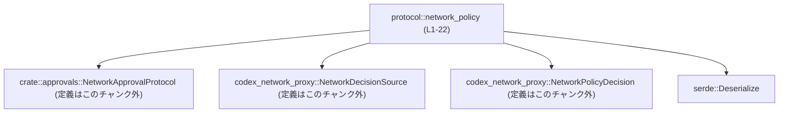
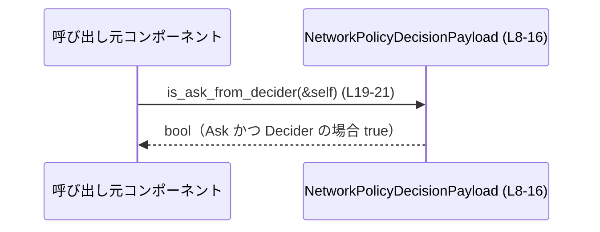

# protocol/src/network_policy.rs

## 0. ざっくり一言

ネットワークポリシー判定の結果を表現するペイロード構造体と、  
そのうち「Ask かつ Decider 由来かどうか」を判定するユーティリティメソッドを提供するモジュールです。

---

## 1. このモジュールの役割

### 1.1 概要

- ネットワークポリシー判定結果を、1つの構造体 `NetworkPolicyDecisionPayload` としてまとめて保持します（`decision`, `source` などのフィールドを持つ）  
  （`protocol/src/network_policy.rs:L8-15`）
- 判定結果が「ユーザーなどに再確認を求める Ask 状態」であり、かつその判定が `Decider` から来ているかどうかを、`is_ask_from_decider` メソッドで簡単にチェックできるようにしています  
 （`protocol/src/network_policy.rs:L19-21`）

### 1.2 アーキテクチャ内での位置づけ

このモジュール自体は小さいですが、他モジュール／クレートとの依存関係は次のようになっています。

- `crate::approvals::NetworkApprovalProtocol` に依存（承認プロトコル種別を表す型と思われるが、このチャンクには定義がない）  
  （`protocol/src/network_policy.rs:L1`）
- `codex_network_proxy` クレートの `NetworkDecisionSource`, `NetworkPolicyDecision` に依存（判定のソースと種別を表す型）  
  （`protocol/src/network_policy.rs:L2-3`）
- シリアライズ／デシリアライズには `serde::Deserialize` を利用  
  （`protocol/src/network_policy.rs:L4, L6-7`）

これを簡略図にすると、次のようになります。



### 1.3 設計上のポイント

- **データ構造中心**  
  - 状態を保持する `NetworkPolicyDecisionPayload` 構造体が中心で、ロジックは 1 メソッドのみというシンプルな構成です  
    （`protocol/src/network_policy.rs:L8-16, L18-21`）
- **シリアライズ対応**  
  - `Deserialize` を derive し、`#[serde(rename_all = "camelCase")]` により、外部フォーマット（例: JSON）とのフィールド名の対応を camelCase で統一しています  
    （`protocol/src/network_policy.rs:L4, L6-7`）
  - `protocol` フィールドに `#[serde(default)]` を付与し、入力データにこのフィールドが存在しない場合でも `None` としてデシリアライズできるようにしています  
    （`protocol/src/network_policy.rs:L11-12`）
- **比較による判定ロジック**  
  - コアロジックは `decision == NetworkPolicyDecision::Ask` と `source == NetworkDecisionSource::Decider` の論理積によるブール判定のみです  
    （`protocol/src/network_policy.rs:L19-21`）
- **状態は不変（イミュータブル）**  
  - メソッドは `&self` を受け取るだけでフィールドの書き換えを行わず、副作用がありません  
    （`protocol/src/network_policy.rs:L19-21`）

---

## 2. 主要な機能一覧

- ネットワークポリシー判定結果のペイロード表現: 判定内容・ソース・プロトコル・ホスト・理由・ポート番号を1つの構造体で保持します  
  （`protocol/src/network_policy.rs:L8-15`）
- Ask/Decider 判定ユーティリティ: 判定が `Ask` で、かつソースが `Decider` であるかどうかをブール値で返すメソッド `is_ask_from_decider` を提供します  
  （`protocol/src/network_policy.rs:L19-21`）

### 2.1 コンポーネント一覧（このチャンク）

このチャンク内で定義されている構造体・メソッドのインベントリーです。

| 名前                           | 種別       | 公開性 | 行範囲  | 役割 / 用途                                                                 | 根拠 |
|--------------------------------|------------|--------|---------|------------------------------------------------------------------------------|------|
| `NetworkPolicyDecisionPayload` | 構造体     | `pub`  | L8-16   | ネットワークポリシー判定の内容を束ねるペイロード構造体                     | `protocol/src/network_policy.rs:L8-16` |
| `is_ask_from_decider`         | メソッド   | `pub`  | L19-21  | `decision` と `source` を比較し、「Ask かつ Decider」かどうかを判定する     | `protocol/src/network_policy.rs:L19-21` |

※ Meta 情報 `exports=2` は上記2つの公開要素に対応していると解釈できます。

---

## 3. 公開 API と詳細解説

### 3.1 型一覧（構造体・列挙体など）

#### `NetworkPolicyDecisionPayload`

**概要**

- ネットワークアクセスなどのポリシー判定結果を表現するペイロード構造体です  
  （`protocol/src/network_policy.rs:L8-15`）
- デシリアライズ可能（`Deserialize`）、デバッグ出力（`Debug`）、クローン（`Clone`）、比較（`PartialEq`, `Eq`）が自動派生されています  
  （`protocol/src/network_policy.rs:L4, L6`）

**derive と属性**

- `#[derive(Debug, Clone, Deserialize, PartialEq, Eq)]`  
  （`protocol/src/network_policy.rs:L6`）
- `#[serde(rename_all = "camelCase")]`  
  - フィールド名を camelCase に変換してシリアライズ／デシリアライズします  
  - この構造体内の全フィールドに適用されます  
  （`protocol/src/network_policy.rs:L7`）

**フィールド一覧**

| フィールド名 | 型                               | 必須 / 任意      | 説明                                                                                               | 根拠 |
|--------------|----------------------------------|------------------|----------------------------------------------------------------------------------------------------|------|
| `decision`   | `NetworkPolicyDecision`         | 必須             | ポリシー判定の内容（Allow/Block/Ask などを表すと推測されるが、型定義はこのチャンクにはない）     | `protocol/src/network_policy.rs:L9` |
| `source`     | `NetworkDecisionSource`         | 必須             | この判定がどのコンポーネントから発生したか（例: Decider など）                                   | `protocol/src/network_policy.rs:L10` |
| `protocol`   | `Option<NetworkApprovalProtocol>` | 任意（欠落可） | 承認フローに用いるプロトコル情報。入力にフィールドがない場合でも `None` としてデシリアライズされる | `protocol/src/network_policy.rs:L11-12` |
| `host`       | `Option<String>`                | 任意             | 対象ホスト名を表す文字列（存在しない場合は `None`）                                              | `protocol/src/network_policy.rs:L13` |
| `reason`     | `Option<String>`                | 任意             | 判定理由などの補足情報（存在しない場合は `None`）                                                | `protocol/src/network_policy.rs:L14` |
| `port`       | `Option<u16>`                   | 任意             | 対象ポート番号（存在しない場合は `None`）                                                        | `protocol/src/network_policy.rs:L15` |

> `protocol` フィールドのみ `#[serde(default)]` が付いているため、入力データに `protocol` フィールドそのものが欠落していてもエラーにならず `None` になります（`protocol/src/network_policy.rs:L11-12`）。

### 3.2 関数詳細

#### `is_ask_from_decider(&self) -> bool`

**概要**

- `NetworkPolicyDecisionPayload` のメソッドです。
- このペイロードの `decision` が `NetworkPolicyDecision::Ask` であり、かつ `source` が `NetworkDecisionSource::Decider` の場合に `true` を返します  
  （`protocol/src/network_policy.rs:L19-21`）。

**シグネチャ**

```rust
impl NetworkPolicyDecisionPayload {
    pub fn is_ask_from_decider(&self) -> bool {
        self.decision == NetworkPolicyDecision::Ask
            && self.source == NetworkDecisionSource::Decider
    }
}
```

**引数**

| 引数名 | 型                              | 説明 |
|--------|---------------------------------|------|
| `self` | `&NetworkPolicyDecisionPayload` | 判定対象のペイロード構造体への参照。所有権は移動せず、読み取り専用です。 |

**戻り値**

- `bool`  
  - `true`: `decision` が `Ask` で、かつ `source` が `Decider` のとき  
  - `false`: 上記以外の組み合わせのとき  
  （`protocol/src/network_policy.rs:L19-21`）

**内部処理の流れ（アルゴリズム）**

1. `self.decision == NetworkPolicyDecision::Ask` を評価して、判定種別が Ask かどうかを確認します。  
   （`protocol/src/network_policy.rs:L20`）
2. `self.source == NetworkDecisionSource::Decider` を評価して、ソースが Decider かどうかを確認します。  
   （`protocol/src/network_policy.rs:L20`）
3. 上記 2 つの比較結果の論理積（`&&`）をとり、その結果を返します。  
   （`protocol/src/network_policy.rs:L20`）

**Examples（使用例）**

> ここでは crate 名を `protocol` と仮定していますが、実際の crate 名はこのチャンクからは分かりません。

```rust
use protocol::network_policy::NetworkPolicyDecisionPayload; // このモジュールの構造体をインポート
use codex_network_proxy::{                                 // 判定内容とソースの型をインポート
    NetworkDecisionSource,
    NetworkPolicyDecision,
};

fn handle_policy_decision(payload: NetworkPolicyDecisionPayload) { // ペイロードを受け取る関数
    // Ask かつ Decider 由来の判定かどうかを確認する
    if payload.is_ask_from_decider() {                     // L19-21 のロジックを利用
        // ここでは「ユーザーに確認が必要なケース」として処理するといった使い方が想定される
        println!("Need user confirmation.");
    } else {
        println!("No confirmation needed.");
    }
}
```

**Errors / Panics**

- このメソッドは単純なフィールド比較のみを行っており、`Result` や `Option` を返さないため、
  - ランタイムエラー (`Err`) を返すことはありません。
  - `panic!` を発生させるようなコードも含まれていません。  
    （`protocol/src/network_policy.rs:L19-21`）

**Edge cases（エッジケース）**

- `decision` が `Ask` だが `source` が `Decider` 以外の場合  
  - 戻り値は `false` になります。  
    （`protocol/src/network_policy.rs:L20` の論理積により）
- `decision` が `Ask` 以外で、`source` が `Decider` の場合  
  - 戻り値は `false` になります。
- `protocol`, `host`, `reason`, `port` が `None` であっても、このメソッドはそれらを参照していないため、戻り値には影響しません。  
  （`protocol/src/network_policy.rs:L19-21`）

**使用上の注意点**

- このメソッドは **「Ask かつ Decider」限定** の判定です。
  - 「Ask であれば何でも true」といった意味ではない点に注意が必要です。  
    （`protocol/src/network_policy.rs:L20`）
- メソッドは `&self` を受け取り、副作用のない読み取り専用処理です。
  - 同じ `NetworkPolicyDecisionPayload` を複数箇所から参照して呼び出しても状態は変化しません。
- スレッド安全性（`Send` / `Sync` 実装の有無）については、このチャンクに出てくる型だけでは判断できません。
  - フィールド型（特に `NetworkDecisionSource`, `NetworkPolicyDecision`, `NetworkApprovalProtocol`）側の実装に依存します。

### 3.3 その他の関数

- このチャンクには `is_ask_from_decider` 以外の関数・メソッド定義はありません。  
  （`protocol/src/network_policy.rs:L18-21`）

---

## 4. データフロー

このモジュール単体で見ると、代表的なデータフローは次のように抽象化できます。

1. どこかの呼び出し元コンポーネントが、何らかのロジックに基づいて `NetworkPolicyDecisionPayload` を構築します。  
   （構築方法はこのチャンクには現れません）
2. 呼び出し元は、特定の処理分岐のために `is_ask_from_decider` を呼び出し、ブール値を取得します。  
   （`protocol/src/network_policy.rs:L19-21`）
3. その結果 (`true` / `false`) に応じて、呼び出し元側で処理を分けます。

これをシーケンス図にすると次のようになります。



> 呼び出し元やペイロードの生成ロジックは、このチャンクには現れないため、図では抽象的に「呼び出し元コンポーネント」として表現しています。

---

## 5. 使い方（How to Use）

### 5.1 基本的な使用方法

`NetworkPolicyDecisionPayload` を構築し、`is_ask_from_decider` で判定を行う基本的な例です。

```rust
use protocol::network_policy::NetworkPolicyDecisionPayload; // 本モジュールの公開構造体
use codex_network_proxy::{                                  // 判定・ソースの列挙体
    NetworkDecisionSource,
    NetworkPolicyDecision,
};

fn example_usage() {
    // ペイロードを直接リテラルで構築する例
    let payload = NetworkPolicyDecisionPayload {
        decision: NetworkPolicyDecision::Ask,      // Ask 判定                       (L9)
        source: NetworkDecisionSource::Decider,    // Decider 由来                    (L10)
        protocol: None,                            // プロトコル情報は無しとする      (L11-12)
        host: Some("example.com".to_string()),     // 対象ホスト                      (L13)
        reason: Some("User confirmation required".to_string()), // 理由              (L14)
        port: Some(443),                           // 対象ポート                      (L15)
    };

    // Ask かつ Decider かどうかをチェックする
    if payload.is_ask_from_decider() {             // L19-21 の判定ロジックを利用
        println!("Handle as 'ask from decider'");
    }
}
```

### 5.2 よくある使用パターン

1. **条件分岐の単純化**

   他の条件と組み合わせて、`if` 文の条件を読みやすくする用途が考えられます。

   ```rust
   fn handle(payload: NetworkPolicyDecisionPayload) {
       if payload.is_ask_from_decider() {
           // Ask & Decider の場合の処理
       } else if payload.decision == NetworkPolicyDecision::Ask {
           // Ask だが Decider 以外からのもの
       } else {
           // それ以外（Allow / Block など）
       }
   }
   ```

2. **match と組み合わせたガード**

   `match` のガード式で利用することもできます。

   ```rust
   fn handle_with_match(payload: NetworkPolicyDecisionPayload) {
       match payload.decision {
           NetworkPolicyDecision::Ask if payload.is_ask_from_decider() => {
               // Ask かつ Decider の場合
           }
           NetworkPolicyDecision::Ask => {
               // Ask だがその他のソース
           }
           _ => {
               // Ask 以外の判定
           }
       }
   }
   ```

### 5.3 よくある間違い（起こりうる誤解）

```rust
// 誤解しやすい例: 「Ask なら true」と思ってしまう
if payload.decision == NetworkPolicyDecision::Ask {
    // ここで is_ask_from_decider() も true だと誤解する可能性がある
}

// 正しい理解: is_ask_from_decider() は Ask かつ Decider のときだけ true
if payload.is_ask_from_decider() {
    // Ask & Decider のときだけここに入る
}
```

- `is_ask_from_decider` は **ソースも判定条件に含める** ため、`decision == Ask` だけでは `true` になりません。  
  （`protocol/src/network_policy.rs:L20`）

### 5.4 使用上の注意点（まとめ）

- `is_ask_from_decider` の「契約」は、「Ask で、かつ Decider 由来であること」を確認することです。
  - これ以外の条件（例えばホスト・ポート・プロトコル）はこのメソッドでは考慮されません。  
    （`protocol/src/network_policy.rs:L19-21`）
- デシリアライズ時に `protocol` が欠落していても `None` になり、エラーにはなりません。
  - 逆に、「必ずプロトコル情報がある」という前提で使う場合には、呼び出し側で `protocol` の `Some` / `None` を確認する必要があります。  
    （`protocol/src/network_policy.rs:L11-12`）
- メソッドは副作用を持たず、`&self` で呼び出せるため、並行に読み取る用途に向いていますが、
  実際にスレッド間で共有できるかはフィールド型のスレッド安全性実装に依存します。

---

## 6. 変更の仕方（How to Modify）

### 6.1 新しい機能を追加する場合

- **別の条件判定メソッドを追加する**
  - 例: 「Ask かつ特定のホスト」のような判定を行いたい場合は、`impl NetworkPolicyDecisionPayload` ブロック内（`protocol/src/network_policy.rs:L18-21`）に新たな `pub fn` を追加するのが自然です。
  - その際、既存の `is_ask_from_decider` と同様に、`&self` を受け取る読み取り専用メソッドとして実装することで、副作用のない API として一貫性を保てます。
- **フィールドの追加**
  - 新しい情報をペイロードに含めたい場合は、`NetworkPolicyDecisionPayload` のフィールド定義（`protocol/src/network_policy.rs:L8-15`）にフィールドを追加します。
  - シリアライズ互換性が重要な場合、`serde` の属性（`default`, `rename`, `skip_serializing_if` 等）の付与を検討する必要がありますが、このチャンクだけからは具体的要件は分かりません。

### 6.2 既存の機能を変更する場合

- **`is_ask_from_decider` の条件を変える場合**
  - 変更により、呼び出し元のロジックが変わる可能性が高いため、呼び出しサイトの網羅的な影響確認が必要です。
  - 例えば「Decider 以外のソースも許容する」などの変更は、メソッド名との乖離を生むため、新メソッド名に切り出す方が契約の明確さを保てます。
- **シリアライズ設定の変更**
  - `#[serde(rename_all = "camelCase")]` を外したり変更した場合、外部フォーマットのフィールド名が変わるため、外部との互換性に影響します。  
    （`protocol/src/network_policy.rs:L7`）
  - `protocol` フィールドから `#[serde(default)]` を外すと、入力から `protocol` が欠けているケースでデシリアライズエラーになる可能性があります。  
    （`protocol/src/network_policy.rs:L11-12`）

---

## 7. 関連ファイル

このモジュールと密接に関係すると思われる型・モジュールです（ただし、具体的なファイルパスや実装はこのチャンクには現れません）。

| パス / クレート                            | 役割 / 関係 |
|--------------------------------------------|------------|
| `crate::approvals`（ファイルパス不明）     | `NetworkApprovalProtocol` 型を提供。`NetworkPolicyDecisionPayload` の `protocol` フィールドで使用されています。<br>（`protocol/src/network_policy.rs:L1, L12`） |
| `codex_network_proxy` クレート             | `NetworkDecisionSource`, `NetworkPolicyDecision` 型を提供。`decision` と `source` フィールド、そして `is_ask_from_decider` の比較ロジックで使用されています。<br>（`protocol/src/network_policy.rs:L2-3, L9-10, L19-21`） |
| `serde` クレート                           | デシリアライズ（`Deserialize`）のために利用されています。<br>（`protocol/src/network_policy.rs:L4, L6-7`） |

---

## Bugs / Security / Contracts / Tests / Performance などの補足

- **Bugs（バグの可能性）**
  - コードは単純なフィールド比較のみであり、このチャンクから疑わしいバグは特に読み取れません。  
    （`protocol/src/network_policy.rs:L19-21`）
- **Security（セキュリティ）**
  - このモジュール自体はデータ構造と単純な判定のみを提供し、I/O や権限操作を行っていません。
  - セキュリティ上の重要性は、どのような判断にこのブール値が使われるか（呼び出し側ロジック）に依存しますが、それはこのチャンクには現れません。
- **Contracts / Edge Cases**
  - 契約: 「Ask かつ Decider のときだけ true」という仕様は、メソッド名と実装が一致しています。  
    （`protocol/src/network_policy.rs:L19-21`）
  - Edge cases は 3.2 で記載した通りです。
- **Tests**
  - このファイル内にテストコード（`#[cfg(test)]` など）は存在しません。  
    （`protocol/src/network_policy.rs:L1-22`）
- **Performance / Scalability**
  - 比較演算と論理積だけの O(1) な処理であり、性能上の懸念はほぼありません。  
    （`protocol/src/network_policy.rs:L19-21`）
- **Observability**
  - ログ出力やメトリクス送信などの観測用コードは含まれていません。
  - 観測性を高める場合は、呼び出し側で判定結果をログ出力するなどの対応が想定されますが、このチャンクでは扱っていません。
