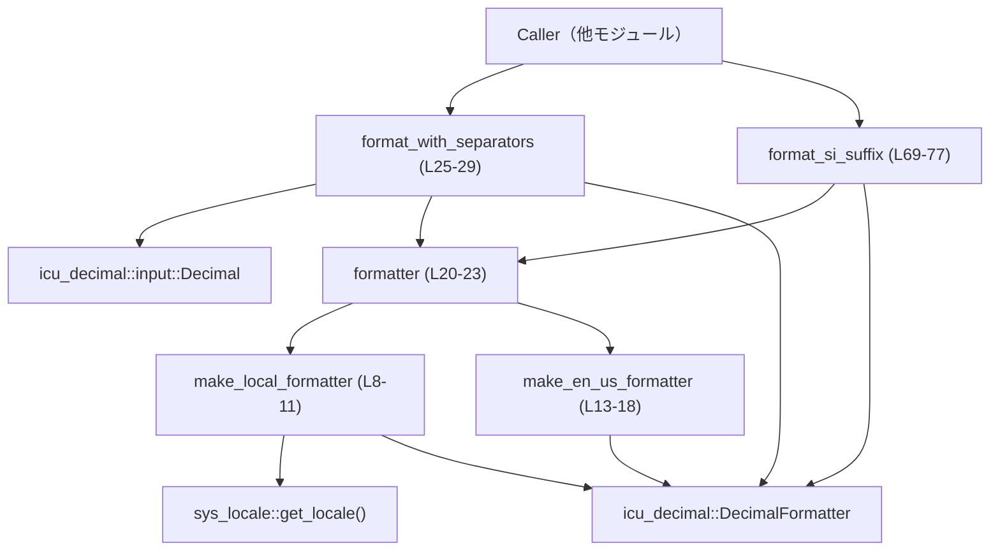
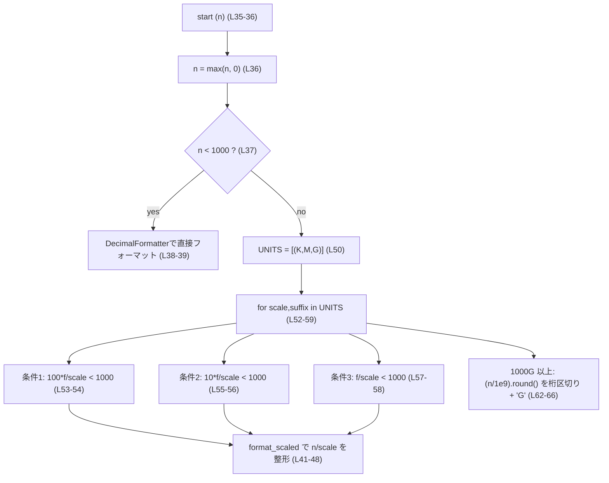
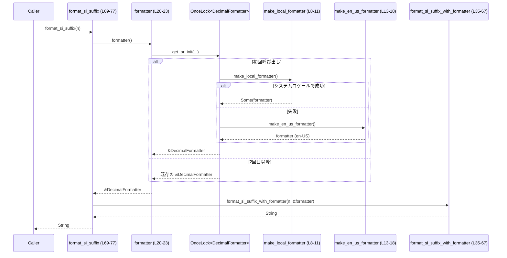

# protocol\src\num_format.rs コード解説

## 0. ざっくり一言

ロケールに応じた桁区切りや、K/M/G などの SI 接頭辞付きで整数を文字列化するためのユーティリティ関数を提供するモジュールです（`num_format.rs:L8-77`）。

---

## 1. このモジュールの役割

### 1.1 概要

- このモジュールは **整数値を人間が読みやすい形で表示する** 問題を解決するために存在し、以下の機能を提供します。
  - システムロケール（もしくは en-US）に基づく桁区切り付きの整形（`format_with_separators`、`num_format.rs:L25-29`）。
  - K/M/G などの SI 接頭辞を用いて 3 桁の有効数字で短縮表示する整形（`format_si_suffix`、`num_format.rs:L69-77`）。

### 1.2 アーキテクチャ内での位置づけ

主な依存関係と呼び出し関係は以下の通りです。

- 外部クレート:
  - `icu_decimal::DecimalFormatter` と `Decimal` によるロケール対応の数値フォーマット（`num_format.rs:L3-5, L27-28, L31-32, L35-48`）。
  - `icu_locale_core::Locale` によるロケールのパース（`num_format.rs:L6, L9, L15`）。
  - `sys_locale::get_locale` によるシステムロケール取得（`num_format.rs:L9`）。
- グローバル状態:
  - `OnceLock<DecimalFormatter>` により、最初の呼び出し時に一度だけフォーマッタを初期化し、以後共有（`num_format.rs:L20-23`）。



この図は、本チャンク（`num_format.rs:L1-77`）内で完結する呼び出し関係を表しています。

### 1.3 設計上のポイント

- **ロケール決定の方針**（`num_format.rs:L8-18, L20-23`）
  - まず `sys_locale::get_locale()` でシステムロケールを取得し（`num_format.rs:L9`）、それが利用できない・不正な場合は en-US にフォールバックします（`make_en_us_formatter`、`num_format.rs:L13-18`）。
- **グローバルフォーマッタの遅延初期化**（`num_format.rs:L20-23`）
  - `OnceLock<DecimalFormatter>` により、スレッドセーフに一度だけフォーマッタを構築し、その参照を共有します。
- **公開 API は最小限**（`num_format.rs:L27-29, L69-77`）
  - 外部に公開されているのは 2 関数のみで、詳細なロケール選択や SI 接頭辞処理は内部関数に隠蔽されています。
- **浮動小数計算＋整数スケールの組み合わせ**（`format_si_suffix_with_formatter`、`num_format.rs:L41-48, L50-66`）
  - 有効数字 3 桁を保つために f64 でスケーリング・丸めを行い、最終的な出力は `Decimal` + `DecimalFormatter` でロケールに従って行います。

---

## 2. 主要な機能一覧

- 桁区切り付き整数フォーマット: システムロケール（なければ en-US）の桁区切りルールで `i64` を文字列化します（`format_with_separators`、`num_format.rs:L25-29`）。
- SI 接頭辞付き短縮フォーマット: K/M/G の接頭辞を使い、3 桁の有効数字で `i64` を短縮表示します（`format_si_suffix`、`num_format.rs:L69-77`）。

### 2.1 コンポーネント一覧（関数・モジュール）

| 名前 | 種別 | 可視性 | 役割 / 用途 | 定義位置 |
|------|------|--------|-------------|----------|
| `make_local_formatter` | 関数 | private | システムロケールから `DecimalFormatter` を生成（失敗時は `None`） | `num_format.rs:L8-11` |
| `make_en_us_formatter` | 関数 | private | ロケール `"en-US"` で `DecimalFormatter` を生成（失敗時は panic） | `num_format.rs:L13-18` |
| `formatter` | 関数 | private | グローバルな `DecimalFormatter` を `OnceLock` で遅延初期化し、`&'static` 参照を返す | `num_format.rs:L20-23` |
| `format_with_separators` | 関数 | **pub** | ロケール対応の桁区切り付きで `i64` を文字列化する公開 API | `num_format.rs:L25-29` |
| `format_with_separators_with_formatter` | 関数 | private | 任意の `DecimalFormatter` を用いた桁区切り付きフォーマット | `num_format.rs:L31-33` |
| `format_si_suffix_with_formatter` | 関数 | private | 任意の `DecimalFormatter` と K/M/G 接頭辞で 3 桁有効数字の短縮表記を行うコアロジック | `num_format.rs:L35-67` |
| `format_si_suffix` | 関数 | **pub** | デフォルトフォーマッタで SI 接頭辞付き短縮表示を行う公開 API | `num_format.rs:L69-77` |
| `tests` モジュール | モジュール | test | SI 接頭辞フォーマットの挙動を en-US 固定で検証 | `num_format.rs:L79-103` |
| `kmg` | テスト関数 | test | 代表的な値に対する K/M/G 表記の期待値を検証 | `num_format.rs:L83-101` |

---

## 3. 公開 API と詳細解説

### 3.1 型一覧（構造体・列挙体など）

このファイル内で新たに定義されている構造体・列挙体・型エイリアスはありません（`num_format.rs:L1-103`）。  
利用している主な外部型は以下です。

| 名前 | 種別 | 役割 / 用途 |
|------|------|-------------|
| `DecimalFormatter` | 外部構造体 | ICU を用いたロケール対応の数値フォーマッタ（`num_format.rs:L3, L10, L16-17, L21-22, L27-28, L31-32, L35-48`） |
| `Decimal` | 外部構造体 | 数値を ICU フォーマッタで扱うための 10 進数表現（`num_format.rs:L4, L27-28, L31-32, L35-48`） |
| `Locale` | 外部構造体 | ロケール文字列を表現し、`DecimalFormatter` 構築に使用（`num_format.rs:L6, L9, L15`） |
| `OnceLock<T>` | 標準ライブラリ構造体 | スレッドセーフな一度きりの初期化に使用（`num_format.rs:L1, L20-23`） |

### 3.2 関数詳細

#### `make_local_formatter() -> Option<DecimalFormatter>`

**概要**

- システムロケールに基づき `DecimalFormatter` を生成し、成功時には `Some(formatter)`、失敗時には `None` を返します（`num_format.rs:L8-11`）。

**引数**

- 引数はありません。

**戻り値**

- `Option<DecimalFormatter>`  
  - `Some(f)`: システムロケールの取得・パース・`DecimalFormatter` 構築のすべてに成功した場合。
  - `None`: いずれかのステップで失敗した場合（`?` と `.ok()?` により `None` にフォールバック）。

**内部処理の流れ**

1. `sys_locale::get_locale()` を呼び出し、OS からロケール文字列（例: `"en-US"`）を取得します（`num_format.rs:L9`）。
2. 取得した文字列を `Locale` に対して `.parse()` し、成功した場合にのみ進みます（`num_format.rs:L9`）。
3. `DecimalFormatter::try_new(loc.into(), DecimalFormatterOptions::default())` でフォーマッタを生成し、`Result` を `.ok()` で `Option` に変換します（`num_format.rs:L10`）。
4. 上記のどこかで失敗した場合は `None` を返します（`?` と `.ok()?` により短絡）。

**Errors / Panics**

- `panic` は発生しません。
- 失敗時はすべて `None` を返すため、呼び出し側でフォールバック戦略が必要になります（`formatter` で対応、`num_format.rs:L20-23`）。

**Edge cases**

- OS がロケールを返さない／未知のロケール文字列を返す場合: `sys_locale::get_locale()` あるいは `.parse()` が失敗し、`None` を返します（`num_format.rs:L9`）。
- ICU のデータが不十分で `DecimalFormatter::try_new` が失敗する場合も `None` になります（`num_format.rs:L10`）。

**使用上の注意点**

- 公開 API ではないため、通常は `formatter()` を介して間接的に利用されます（`num_format.rs:L20-23`）。
- ロケール取得の結果に依存するため、実行環境により挙動が変わる点に注意が必要です。

---

#### `make_en_us_formatter() -> DecimalFormatter`

**概要**

- `"en-US"` ロケールに固定した `DecimalFormatter` を生成します。失敗すると panic します（`num_format.rs:L13-18`）。

**引数**

- なし。

**戻り値**

- `DecimalFormatter`  
  - `"en-US"` のロケールを用いたフォーマッタ。失敗時は戻り値に到達する前に panic します。

**内部処理の流れ**

1. `"en-US".parse()` により `Locale` を生成し、失敗した場合は `expect` により panic します（`num_format.rs:L15`）。
2. `DecimalFormatter::try_new` でフォーマッタ生成を試み、`Result` を `expect` でアンラップします（`num_format.rs:L16-17`）。

**Errors / Panics**

- `Locale` へのパース、または `DecimalFormatter::try_new` が失敗した場合に `expect` により即時 panic します（`num_format.rs:L15-17`）。
- この関数は `formatter()` 内で `unwrap_or_else(make_en_us_formatter)` として使用されるため、**システムロケールが使えない場合のフォールバック時に panic の可能性**があります（`num_format.rs:L22`）。

**Edge cases**

- ICU データから `"en-US"` ロケールが除外されるなど、極端な環境でのみ panic しうる設計です。

**使用上の注意点**

- 公開されていないため、通常は直接呼び出されません。
- ライブラリ全体の信頼性は `"en-US"` が常に有効である前提に依存しています。

---

#### `formatter() -> &'static DecimalFormatter`

**概要**

- グローバルな `DecimalFormatter` を一度だけ初期化し、その不変参照を返します（`num_format.rs:L20-23`）。

**引数**

- なし。

**戻り値**

- `&'static DecimalFormatter`  
  - プロセス終了まで生存するフォーマッタへの共有参照。

**内部処理の流れ**

1. `static FORMATTER: OnceLock<DecimalFormatter> = OnceLock::new();` で静的なロック付きコンテナを定義します（`num_format.rs:L21`）。
2. `FORMATTER.get_or_init(...)` を呼び、未初期化の場合のみクロージャを実行します（`num_format.rs:L22`）。
3. クロージャ内で `make_local_formatter().unwrap_or_else(make_en_us_formatter)` を実行し、ロケール依存フォーマッタを構築します（`num_format.rs:L22`）。

**Errors / Panics**

- `make_local_formatter` が `Some` を返す場合は panic の可能性はありません（`num_format.rs:L8-11, L22`）。
- `make_local_formatter` が `None` を返した場合、`make_en_us_formatter` の `expect` によって panic する可能性があります（`num_format.rs:L13-18, L22`）。
- OnceLock の仕様上、同一スレッド内でクロージャが panic すると、後続の `get_or_init` は再試行されるかどうかは標準仕様に依存しますが、ここでは仕様の詳細はコードからは読み取れません。

**並行性（スレッドセーフ性）**

- `OnceLock` はスレッドセーフな一度きりの初期化を提供する型です（`num_format.rs:L1, L20-22`）。
- `static FORMATTER` を定義できるためには `OnceLock<DecimalFormatter>` が `Sync` である必要があり、結果として `DecimalFormatter` も `Sync` であることが前提になります。これにより、複数スレッドから同時に `formatter()` を呼んでも安全に共有されます。

**Edge cases**

- 最初の呼び出し時に panic が発生すると、そのプロセスで以後フォーマットが利用できなくなる可能性があります。
- 一度決まったロケールはプロセス存続期間中固定です。途中でシステムロケールが変わっても再計算は行われません（`get_or_init` の性質、`num_format.rs:L22`）。

**使用上の注意点**

- この関数は内部使用のみですが、事実上モジュール全体のロケール設定の入り口になっています。
- ロケールを動的に切り替えたい設計には向きません。

---

#### `pub fn format_with_separators(n: i64) -> String`

**概要**

- 与えられた `i64` を、ロケールに応じた桁区切り付き（およびロケール固有の数字表現）で文字列にフォーマットする公開 API です（`num_format.rs:L25-29`）。

**引数**

| 引数名 | 型 | 説明 |
|--------|----|------|
| `n` | `i64` | フォーマット対象の整数値（負の値も可） |

**戻り値**

- `String`  
  - `DecimalFormatter` によって整形された文字列表現。

**内部処理の流れ**

1. `formatter()` を呼び出してグローバル `DecimalFormatter` を取得します（`num_format.rs:L28`）。
2. `Decimal::from(n)` で `n` を ICU の `Decimal` 型に変換します（`num_format.rs:L28`）。
3. `formatter().format(&Decimal::from(n))` によりロケール対応の文字列に変換し、`to_string()` で `String` にします（`num_format.rs:L28`）。

**Examples（使用例）**

基本道具として、ログや UI に桁区切り付きの数値を表示する場面で使用できます。

```rust
// num_format モジュールから公開関数をインポートする
use crate::num_format::format_with_separators;

fn main() {
    let n: i64 = 1_234_567;                           // フォーマットしたい整数値
    let s = format_with_separators(n);                // ロケール対応の桁区切り付き文字列を取得

    // 例: en-US ロケールであれば "1,234,567" のような文字列になる
    println!("formatted: {}", s);
}
```

**Errors / Panics**

- `format_with_separators` 自体は `panic` を起こしません。
- ただし内部で呼ばれる `formatter()` の初回初期化時に `make_en_us_formatter` が panic する可能性があり、その場合この関数の呼び出しも panic します（`num_format.rs:L20-23`）。

**Edge cases**

- `n` が負の値の場合: `Decimal::from(n)` にそのまま渡されるため、通常はマイナス記号付きで表示されると考えられますが、具体的なフォーマットは `Decimal` / `DecimalFormatter` の仕様に依存します（`num_format.rs:L28`）。コード上で負数に特別な処理は行っていません。
- きわめて大きい値（`i64::MAX` など）もそのまま `Decimal::from` に渡されます（`num_format.rs:L28`）。オーバーフローを抑止する処理は記述されていませんが、`i64` の範囲内である限り `Decimal::from` の内部挙動に委ねられます。

**使用上の注意点**

- ロケールはプロセス起動時の環境に依存し、途中で変わっても再反映されません。
- ロケール固定で使いたい場合は、この関数ではなく別の API を設計する必要があります（本ファイルには存在しません）。

---

#### `fn format_with_separators_with_formatter(n: i64, formatter: &DecimalFormatter) -> String`

**概要**

- 任意の `DecimalFormatter` を受け取り、そのロケール設定に従って `i64` を桁区切り付きで文字列化する内部ヘルパーです（`num_format.rs:L31-33`）。

**引数**

| 引数名 | 型 | 説明 |
|--------|----|------|
| `n` | `i64` | フォーマット対象の整数値 |
| `formatter` | `&DecimalFormatter` | 使用する ICU フォーマッタ（ロケールなどを外部で決定済み） |

**戻り値**

- `String`  
  - 与えられた `formatter` に従った文字列表現。

**内部処理の流れ**

1. `Decimal::from(n)` で整数を `Decimal` に変換（`num_format.rs:L32`）。
2. `formatter.format(&Decimal::from(n))` で文字列化し、`to_string()` で `String` を返す（`num_format.rs:L32`）。

**Errors / Panics**

- この関数自体は panic を起こすコードを含んでいません。

**Edge cases / 使用上の注意点**

- API は private であり、テストや内部関数からのみ使用されます（`format_si_suffix_with_formatter` と `tests::kmg`、`num_format.rs:L35-67, L84-86`）。
- すでにロケールを決定済みのフォーマッタを渡せるため、テストなどでロケールを固定したい場合に役立ちます。

---

#### `fn format_si_suffix_with_formatter(n: i64, formatter: &DecimalFormatter) -> String`

**概要**

- 任意の `DecimalFormatter` を用い、与えられた整数 `n` を K/M/G の SI 接頭辞付きで 3 桁の有効数字に丸めて返すコアロジックです（`num_format.rs:L35-67`）。

**引数**

| 引数名 | 型 | 説明 |
|--------|----|------|
| `n` | `i64` | フォーマット対象の整数値（負の値も受け取るが内部で 0 以上に丸める） |
| `formatter` | `&DecimalFormatter` | 数値部分のフォーマットに使用する ICU フォーマッタ |

**戻り値**

- `String`  
  - 例: `"999"`, `"1.20K"`, `"123M"`, `"1,234G"` など（テストより、`num_format.rs:L87-101`）。

**内部処理の流れ**

1. `let n = n.max(0);` で負の入力を 0 に切り上げます（`num_format.rs:L36`）。
2. `if n < 1000 { ... }` の場合、接頭辞なしで通常のフォーマットを行い、その結果を返します（`num_format.rs:L37-39`）。
3. 関数内ローカルのクロージャ `format_scaled` を定義します（`num_format.rs:L41-48`）。
   - `n / scale` を f64 で計算し（`num_format.rs:L43`）、
   - `10^frac_digits` 倍して丸めた整数 `scaled` を作り（`num_format.rs:L44`）、
   - それを `Decimal` に変換してから `multiply_pow10` によって小数点位置を調整し（`num_format.rs:L45-46`）、
   - `formatter.format(&dec)` で文字列化します（`num_format.rs:L47`）。
4. `const UNITS: [(i64, &str); 3] = [(1_000, "K"), (1_000_000, "M"), (1_000_000_000, "G")];` として K/M/G を定義します（`num_format.rs:L50`）。
5. `for &(scale, suffix) in &UNITS { ... }` のループで、K→M→G の順に、  
   - 100 倍した値（2 桁小数）、  
   - 10 倍した値（1 桁小数）、  
   - 1 倍した値（小数なし）、  
   それぞれが 1000 未満になるかをチェックします（`num_format.rs:L52-59`）。
6. 最初に条件を満たしたパターンで `format!("{}{}", format_scaled(...), suffix)` を返します（`num_format.rs:L54, L56, L58`）。
7. いずれの単位でも 1000 未満にならない場合（≒ 1000G 以上）は、  
   - `n` を `1e9` で割って四捨五入した整数を `format_with_separators_with_formatter` でフォーマットし、その後ろに `"G"` を付与した `"xxxxG"` の形式を返します（`num_format.rs:L62-66`）。

**簡易フロー図**



**Errors / Panics**

- この関数自体には `panic` を起こすコードはありません。
- `formatter.format` / `Decimal::from` / `multiply_pow10` が panic するかどうかは外部ライブラリに依存し、このチャンクからは分かりませんが、通常は正常動作すると想定されています（`num_format.rs:L45-47`）。

**Edge cases**

- `n < 0` の場合: `n.max(0)` により 0 として扱われ、結果は `"0"`（テストでは 0 のみ検証、`num_format.rs:L36, L87`）。
- `0 <= n < 1000`: 接頭辞なし、整数のそのままの値（例: `"999"`）を返します（`num_format.rs:L37-39, L87-88`）。
- `999_500` や `999_950_000` のような境界値は四捨五入により次の単位に繰り上がる挙動をします（テスト `kmg` により確認、`num_format.rs:L93, L97`）。
- `1_234_000_000_000` のような 1000G を超える値は `"1,234G"` として出力されます（`num_format.rs:L62-66, L100-101`）。

**使用上の注意点**

- 負の入力は 0 扱いになるため、「負の値も符号付きで縮約表示したい」といった用途にはそのままでは適しません（`num_format.rs:L36`）。
- 浮動小数点（f64）を中間計算に用いているため、非常に大きな値では丸め誤差の可能性は理論上存在しますが、スケールと `i64` 範囲から実務上問題になりにくい設計です（`num_format.rs:L43-44`）。

---

#### `pub fn format_si_suffix(n: i64) -> String`

**概要**

- デフォルトロケールのフォーマッタを用いて、`format_si_suffix_with_formatter` のロジックを適用する公開 API です（`num_format.rs:L69-77`）。

**引数**

| 引数名 | 型 | 説明 |
|--------|----|------|
| `n` | `i64` | 短縮表示したい整数値 |

**戻り値**

- `String`  
  - 例（en-US 想定）: `999 -> "999"`, `1_200 -> "1.20K"`, `123_456_789 -> "123M"`（ドキュメントコメントとテストより、`num_format.rs:L69-74, L87-101`）。

**内部処理の流れ**

1. `formatter()` でグローバルフォーマッタを取得（`num_format.rs:L76`）。
2. `format_si_suffix_with_formatter(n, formatter())` を呼び、結果をそのまま返します（`num_format.rs:L76`）。

**Examples（使用例）**

ログや UI でトークン数やバイト数などを「K/M/G」付きでコンパクトに表示する用途に利用できます。

```rust
use crate::num_format::format_si_suffix;

fn main() {
    let tokens: i64 = 1_234_567;                       // 表示したいトークン数
    let s = format_si_suffix(tokens);                  // SI 接頭辞付きの文字列に整形

    // 例: en-US では "1.23M" になる（テストの期待値と同様の挙動）
    println!("tokens: {}", s);
}
```

**Errors / Panics**

- `format_si_suffix` 自体はエラーを返さず、panic を直接引き起こすコードも含んでいません。
- ただし内部で `formatter()` を使うため、先述の通り en-US フォールバック生成時に panic が起きうる点は `format_with_separators` と同様です（`num_format.rs:L20-23, L69-77`）。

**Edge cases**

- 負の値は内部で 0 として扱われ `"0"` を返します（`format_si_suffix_with_formatter` の仕様、`num_format.rs:L36-39, L87`）。
- 1000G を超える値は `"xxxxG"`（桁区切り付き整数＋`G`）になります（`num_format.rs:L62-66, L100-101`）。

**使用上の注意点**

- 単位は K/M/G のみであり、T（テラ）やそれ以上の接頭辞には対応していません（`num_format.rs:L50, L62-66`）。
- ロケールによって桁区切り記号や小数点記号が変化します（`,` と `.` の入れ替わりなど）。テストでは en-US を前提に検証している点に注意が必要です（`num_format.rs:L83-86`）。

---

#### `#[cfg(test)] fn kmg()`

テスト関数ですが、挙動の契約を知るうえで重要です（`num_format.rs:L83-101`）。

- `make_en_us_formatter()` によりロケールを en-US に固定（`num_format.rs:L85`）。
- `format_si_suffix_with_formatter` をさまざまな値で呼び、以下のような期待値を検証しています（`num_format.rs:L87-101`）。
  - 0 ～ 999 までは接頭辞なし。
  - 1_000 ～ 999_499 までは `K`、999_500 以上は繰り上がって `M`。
  - 同様のロジックが M/G に対しても適用される。
  - 1_234_000_000_000 のような値は `"1,234G"`。

このテストが、`format_si_suffix_with_formatter` の仕様（特に丸めと境界値）を実質的に文書化しています。

---

### 3.3 その他の関数

上で詳細を述べた以外の関数はありません（テスト関数を除く）。

---

## 4. データフロー

ここでは、典型的なシナリオとして「`format_si_suffix` が初めて呼ばれる」場合のデータフローを示します。

1. 呼び出し元コードが `format_si_suffix(n)` を呼ぶ（`num_format.rs:L75-76`）。
2. `format_si_suffix` が `formatter()` を呼び、グローバル `DecimalFormatter` を取得しようとします（`num_format.rs:L76`）。
3. `formatter()` 内の `OnceLock` が未初期化であれば、`make_local_formatter()` を実行します（`num_format.rs:L20-23`）。
4. `make_local_formatter()` がシステムロケールからフォーマッタ構築を試みます（`num_format.rs:L8-11`）。
   - 成功: そのフォーマッタが `OnceLock` に保存され、以後の呼び出しで再利用されます。
   - 失敗: `unwrap_or_else(make_en_us_formatter)` により `make_en_us_formatter()` が呼ばれ、en-US のフォーマッタを構築します（`num_format.rs:L22`）。
5. `format_si_suffix_with_formatter(n, &formatter)` がコアロジックを実行し、文字列結果を返します（`num_format.rs:L35-67`）。



このシーケンス図は、本チャンク `num_format.rs:L8-77` に記述された関数間のデータフローを表します。

---

## 5. 使い方（How to Use）

### 5.1 基本的な使用方法

公開 API は `format_with_separators` と `format_si_suffix` の 2 つです。

```rust
// 同一クレート内から利用する例
use crate::num_format::{format_with_separators, format_si_suffix};

fn main() {
    let n: i64 = 123_456_789;                           // 表示したい整数値

    // ロケールに応じて桁区切り付きでフォーマット
    let s1 = format_with_separators(n);                 // 例: en-US なら "123,456,789"

    // K/M/G 接頭辞付きで短縮表示（3 桁有効数字）
    let s2 = format_si_suffix(n);                       // 例: en-US なら "123M"

    println!("with separators = {}", s1);
    println!("with SI suffix = {}", s2);
}
```

### 5.2 よくある使用パターン

1. **ログやメトリクスの表示**

   - トークン数やリクエスト数、バイト数などを読みやすく表示する用途に向いています。

   ```rust
   use crate::num_format::format_si_suffix;

   fn log_tokens(name: &str, tokens: i64) {
       let human = format_si_suffix(tokens);           // 例: "1.23M"
       eprintln!("{}: {} tokens", name, human);        // ログ出力
   }
   ```

2. **ダッシュボードや UI の表示**

   - 桁区切りだけが必要な場合は `format_with_separators` を利用します。

   ```rust
   use crate::num_format::format_with_separators;

   fn render_count(count: i64) -> String {
       format_with_separators(count)                   // ロケール対応の数値文字列
   }
   ```

### 5.3 よくある間違い

```rust
use crate::num_format::format_si_suffix;

fn example() {
    // 間違い例: 負の値に対して、符号付きの縮約表示を期待する
    let v = -1_000;
    let s = format_si_suffix(v);
    // s は "0" になる（内部で n.max(0) が行われるため、num_format.rs:L36）

    // 正しい理解: 符号付きで扱いたい場合は自前で符号処理をする必要がある
    let v2 = -1_000;
    let sign = if v2 < 0 { "-" } else { "" };
    let abs = v2.abs() as i64;
    let s2 = format_si_suffix(abs);                    // "1.00K" 相当
    let result = format!("{}{}", sign, s2);            // "-1.00K" のような表示
}
```

### 5.4 使用上の注意点（まとめ）

- **ロケール固定**: フォーマッタは最初の呼び出し時に決定され、その後は変わりません（`num_format.rs:L20-23`）。
- **負値の扱い**:
  - `format_with_separators` は負の値をそのまま渡します。
  - `format_si_suffix` は負値を 0 として扱います（`num_format.rs:L36`）。
- **単位の上限**: K/M/G までしか対応していません。それ以上の単位が必要な場合はロジックを拡張する必要があります（`num_format.rs:L50, L62-66`）。
- **panic の可能性**: ICU が `"en-US"` をサポートしていない極端な環境では、初期化時に panic が発生する可能性があります（`make_en_us_formatter`、`num_format.rs:L13-18`）。

---

## 6. 変更の仕方（How to Modify）

### 6.1 新しい機能を追加する場合

1. **新しい SI 単位（例: T, P）を追加したい場合**

   - `UNITS` 定数にスケールと接頭辞を追加します（`num_format.rs:L50`）。

     ```rust
     const UNITS: [(i64, &str); 4] = [
         (1_000, "K"),
         (1_000_000, "M"),
         (1_000_000_000, "G"),
         (1_000_000_000_000, "T"),   // 例: テラを追加
     ];
     ```

   - そのうえで、1000G 以上の特別処理（`num_format.rs:L62-66`）を T に合わせて調整します。

2. **ロケールを呼び出し側で指定可能にする API を追加したい場合**

   - 新たに `pub fn format_with_separators_for_locale(n: i64, loc_str: &str) -> Result<String, Error>` のような関数を追加し、内部で `Locale` と `DecimalFormatter` を都度生成する形が考えられます。
   - 既存の `formatter()` と競合しないように、グローバルフォーマッタではなくローカルインスタンスを使うように設計します。
   - このアイデアはコードには書かれていませんが、現行構造から自然な拡張パターンとして考えられます。

### 6.2 既存の機能を変更する場合

- **`format_si_suffix` の丸めルールを変更したい場合**

  - `format_si_suffix_with_formatter` 内の `format_scaled` クロージャと `if` 条件（`num_format.rs:L41-48, L53-58`）が主な変更ポイントです。
  - `kmg` テスト（`num_format.rs:L83-101`）が期待挙動を固定しているため、丸めルール変更時にはテストの期待値も合わせて見直す必要があります。

- **負の値の扱いを変えたい場合**

  - `let n = n.max(0);` を別のロジック（例えば `abs()` など）に置き換えます（`num_format.rs:L36`）。
  - 変更後は、負の値に対する挙動をカバーする追加テストを用意することが望ましいです。

- **ロケール初期化の戦略を変えたい場合**

  - `formatter()` 内の `make_local_formatter().unwrap_or_else(make_en_us_formatter)` を別の戦略に変更します（`num_format.rs:L22`）。
  - panic を避けたい場合は `expect` を使わず、エラーをロギングしてデフォルトフォーマッタにフォールバックする実装に差し替えるなどが考えられます。

---

## 7. 関連ファイル

このモジュールは単一ファイルで完結しており、同一クレート内の他の具体的なファイル名はこのチャンクからは分かりません。外部クレートとの関係のみ、コードから読み取れます。

| パス / クレート | 役割 / 関係 |
|-----------------|------------|
| `icu_decimal` | `DecimalFormatter` と `Decimal` を提供し、ロケール対応フォーマットの中核を担います（`num_format.rs:L3-5, L27-28, L31-32, L35-48`）。 |
| `icu_locale_core` | ロケール文字列を `Locale` 型にパースするために使用します（`num_format.rs:L6, L9, L15`）。 |
| `sys_locale`（クレート名） | `sys_locale::get_locale()` を通じて OS からシステムロケール文字列を取得します（`num_format.rs:L9`）。 |
| 標準ライブラリ `std::sync::OnceLock` | フォーマッタのスレッドセーフな一度きりの初期化に使用します（`num_format.rs:L1, L20-23`）。 |

このチャンクには、`num_format` モジュールを直接利用する他ファイル（呼び出し元）の情報は出現していないため、それらとの関係は「不明」となります。
