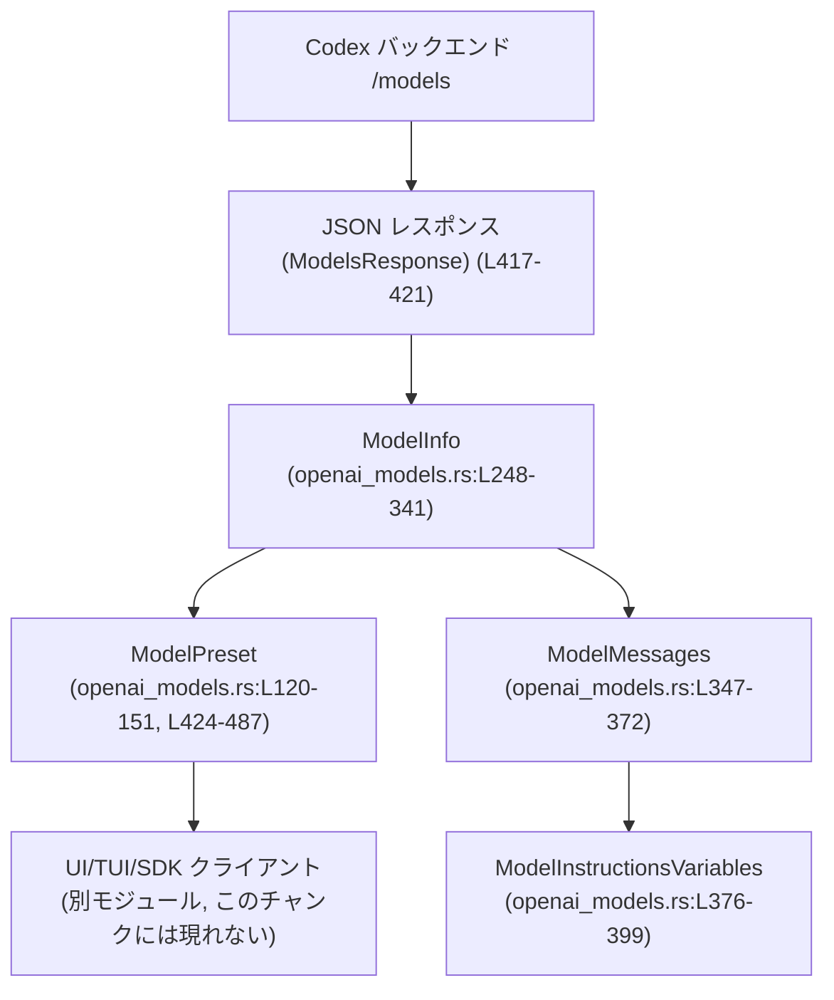
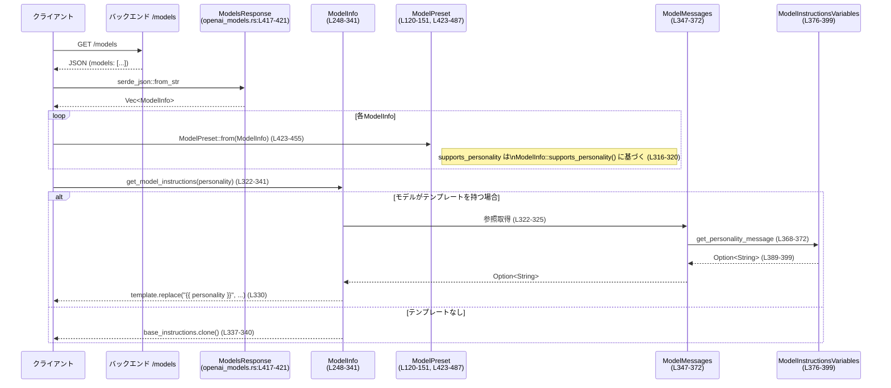

# protocol/src/openai_models.rs

## 0. ざっくり一言

Codexバックエンドが返す `/models` レスポンス用の **モデルメタデータ型** と、UI/クライアント側で使う **プリセット情報（ModelPreset）** を定義し、両者を変換するモジュールです。Reasoningレベル、ツール種別、入力モダリティ、人格設定(personality)などのメタ情報をまとめて扱います。  
（根拠: openai_models.rs:L1-4, L118-152, L246-300, L423-455）

---

## 1. このモジュールの役割

### 1.1 概要

- バックエンド `/models` エンドポイントのレスポンスを受け取るための `ModelInfo` と、それをUI向けの `ModelPreset` に変換するロジックを提供します。（根拠: L246-300, L423-455）
- モデルの reasoning effort、シェルツール種別、Web検索種別、トランケーションポリシー、入力モダリティなど、モデルに紐づく設定を型安全に表現します。（根拠: L24-51, L62-92, L94-111, L154-220, L246-300）
- モデルの人格設定(Personality)に応じたプロンプト文を生成するためのテンプレート機構 (`ModelMessages`, `ModelInstructionsVariables`) を提供します。（根拠: L344-372, L375-400, L322-341）

### 1.2 アーキテクチャ内での位置づけ

主な依存関係は次の通りです。

- 外部ライブラリ: `serde`（シリアライズ）, `schemars`（JSON Schema生成）, `ts_rs`（TypeScript型生成）, `strum`（Enumの列挙/表示）, `tracing`（ログ）。（根拠: L8-16）
- 他モジュール: `crate::config_types::{Personality, ReasoningSummary, Verbosity}` を利用しますが、これらの定義はこのチャンクには現れません。（根拠: L18-20）

Mermaidで大まかな位置づけを示します（この図は openai_models.rs:L246-455 付近の構造を表します）。



### 1.3 設計上のポイント

- **シリアライズ前提の型設計**  
  すべての公開データ構造が `Serialize`/`Deserialize` と `JsonSchema`/`TS` をderiveしており、Rust/TypeScript/JSON Schema間で同一のデータモデルを共有できる設計になっています。（根拠: L26-40, L63-76, L95-101, L103-111, L118-152, L154-164, L167-189, L191-196, L198-206, L208-220, L238-240, L246-300, L344-350, L375-380, L402-406, L417-421）
- **後方互換性のためのデフォルト値**  
  `#[serde(default)]` や `#[serde(default = "...")]` により、新しいフィールドが古いペイロードに含まれなくても動作するようにしています（例: `input_modalities`, `web_search_tool_type`, `availability_nux` など）。（根拠: L86-92, L134-138, L150-151, L252-253, L259-260, L264-265, L267-268, L272-273, L276-279, L283-288, L291-292, L294-297, L298-300）
- **人格設定テンプレートの分離**  
  モデルの人格別メッセージを `ModelMessages` / `ModelInstructionsVariables` に分離し、`ModelInfo::get_model_instructions` がそれを利用して説明文を生成する構造になっています。（根拠: L322-341, L347-372, L376-399）
- **推論レベルマッピングのヘルパ**  
  旧モデル→新モデルの移行時に reasoning effort を近いレベルへマッピングするユーティリティ (`reasoning_effort_mapping_from_presets`, `nearest_effort`) を提供します。（根拠: L490-505, L507-525）
- **安全性**  
  このファイル内には `unsafe` ブロックは存在せず、すべて安全なRustで実装されています。（根拠: 全体に `unsafe` の記述がない）

---

## 2. 主要な機能一覧

- Reasoningレベルの定義と文字列パース: `ReasoningEffort` と `FromStr` 実装。（根拠: L24-51, L53-60）
- 入力モダリティの定義とデフォルト: `InputModality`, `default_input_modalities`。（根拠: L62-84, L86-92）
- モデルアップグレード情報: `ModelUpgrade`, `ModelInfoUpgrade`, `From<&ModelUpgrade>` 実装。（根拠: L103-111, L402-406, L408-414）
- バックエンドモデル情報: `ModelInfo` とそのメソッド（自動コンパクション閾値計算、人格対応フラグ・命令文生成）。（根拠: L246-341, L302-341）
- UI用プリセット情報: `ModelPreset` と `From<ModelInfo>` およびフィルタリング・デフォルト決定ロジック。（根拠: L118-152, L423-455, L458-487）
- モデルメッセージテンプレート: `ModelMessages`, `ModelInstructionsVariables` と関連メソッド。（根拠: L344-372, L375-400）
- トランケーションポリシー: `TruncationMode`, `TruncationPolicyConfig` と `bytes`/`tokens` コンストラクタ。（根拠: L208-235）
- ツール・可視性などのメタデータ: `ModelVisibility`, `ConfigShellToolType`, `ApplyPatchToolType`, `WebSearchToolType`。（根拠: L154-206）
- `/models` レスポンスラッパー: `ModelsResponse`。（根拠: L417-421）

---

## 3. 公開 API と詳細解説

### 3.1 型一覧（構造体・列挙体など）

主要な公開型の一覧です。

| 名前 | 種別 | 役割 / 用途 | 行 |
|------|------|-------------|----|
| `ReasoningEffort` | enum | モデルの reasoning effort レベル（None〜XHigh）を表す。文字列とlowercaseでシリアライズされる。 | openai_models.rs:L24-51 |
| `InputModality` | enum | モデルが受け付ける入力モダリティ（Text/Image）を表す。 | L62-84 |
| `ReasoningEffortPreset` | struct | 個々の reasoning 努力度とUI表示用説明文をペアで保持する。 | L94-101 |
| `ModelUpgrade` | struct | 推奨アップグレード先のモデルIDやreasoningマッピング、マイグレーション用コピーを保持する。 | L103-111 |
| `ModelAvailabilityNux` | struct | モデル解放時に表示するメッセージを保持する。 | L113-116 |
| `ModelPreset` | struct | UIやSDKが利用するモデルプリセット。ID, 表示名, 説明, reasoning設定, personality対応などを含む。 | L118-151 |
| `ModelVisibility` | enum | モデルをリストに表示するか隠すか等の可視性を表す。 | L154-164 |
| `ConfigShellToolType` | enum | モデルが利用可能なシェル実行環境の種別。（Default/Local/UnifiedExec/Disabled/ShellCommand） | L166-189 |
| `ApplyPatchToolType` | enum | apply‑patch ツールの実装スタイル（Freeform/Function）を表す。 | L191-196 |
| `WebSearchToolType` | enum | Web検索ツールの入力モダリティ（Text / TextAndImage）を表す。 | L198-206 |
| `TruncationMode` | enum | トークン数かバイト数どちらを基準にトランケーションするかを表す。 | L208-214 |
| `TruncationPolicyConfig` | struct | トランケーションのモードと閾値を保持する。 | L216-220 |
| `ClientVersion` | tuple struct | クライアントのセマンティックバージョン（major, minor, patch）を整数トリプルで表す。 | L238-240 |
| `ModelInfo` | struct | バックエンド `/models` が返すモデル情報。UI向け変換前の「生の」メタデータ。 | L246-300 |
| `ModelMessages` | struct | モデル用命令文テンプレートと人格別メッセージ変数群へのポインタ。 | L344-350 |
| `ModelInstructionsVariables` | struct | personalityごとの文言（default/friendly/pragmatic）を格納する。 | L375-380 |
| `ModelInfoUpgrade` | struct | `/models` 用に縮約されたアップグレード情報（モデル名とマイグレーションMarkdown）。 | L402-406 |
| `ModelsResponse` | struct | `/models` エンドポイントのレスポンス全体を包むラッパ。`models: Vec<ModelInfo>`。 | L417-421 |

※ `Personality`, `ReasoningSummary`, `Verbosity` は `crate::config_types` からの依存であり、このチャンクには定義が現れません。（根拠: L18-20）

### 3.2 重要な関数・メソッドの詳細

ここでは代表的な7つを取り上げます。

#### `impl FromStr for ReasoningEffort` → `from_str(s: &str) -> Result<ReasoningEffort, String>`

**概要**

文字列（例: `"high"`, `"minimal"`）から `ReasoningEffort` をパースします。未知の文字列はエラー文字列付きで `Err` を返します。（根拠: L53-60）

**引数**

| 引数名 | 型 | 説明 |
|--------|----|------|
| `s` | `&str` | lower-caseのreasoning effort名。 |

**戻り値**

- `Ok(ReasoningEffort)` : `serde_json` の文字列デシリアライズに成功し、対応するバリアントが存在した場合。
- `Err(String)` : 無効な値で、`"invalid reasoning_effort: {s}"` というメッセージを含む。（根拠: L57-58）

**内部処理の流れ**

1. `s.to_string()` から JSON 文字列値 `serde_json::Value::String` を構築する。（L57）
2. それを `serde_json::from_value` で `ReasoningEffort` にデシリアライズする。（L57）
3. 成功すれば `Ok(...)`、失敗すれば `map_err` でエラーメッセージに変換する。（L57-58）

**Examples（使用例）**

```rust
use std::str::FromStr; // FromStr トレイトのインポート
use protocol::openai_models::ReasoningEffort;

// 正常な値
let high = ReasoningEffort::from_str("high")?;  // Ok(ReasoningEffort::High) 相当
assert_eq!(high, ReasoningEffort::High);

// エラーケース
let invalid = ReasoningEffort::from_str("unsupported");
assert!(invalid.is_err());
assert_eq!(
    invalid.unwrap_err(),
    "invalid reasoning_effort: unsupported".to_string()
);
```

（テストで同様のケースを検証: L575-587）

**Errors / Panics**

- エラー: 無効な文字列の場合は `Err("invalid reasoning_effort: {s}")`。（L57-58）
- パニック: 通常の使用ではパニックしません（`serde_json::from_value` は `Result` を返し、`unwrap` などは使っていません）。

**Edge cases（エッジケース）**

- 大文字混じり（例: `"High"`）は `rename_all = "lowercase"` 設定により、デフォルトでは対応していません。呼び出し側でlowercase化してから渡す必要があります。（根拠: L41-42, L57-58）
- 空文字 `""` は `Err("invalid reasoning_effort: ")` になります。

**使用上の注意点**

- フロントエンドや設定ファイルから値を受け取る場合、事前にlowercaseへ正規化してから渡すと安全です。
- エラー文字列はそのままユーザーに見せるかどうかは呼び出し側のポリシー次第です。

---

#### `ModelInfo::auto_compact_token_limit(&self) -> Option<i64>`

**概要**

コンテキストウィンドウ `context_window` と任意の `auto_compact_token_limit` 設定から、実際に使用する自動コンパクション閾値を計算します。`context_window` がある場合は **常にその90%以下** になるようにクランプします。（根拠: L280-288, L303-314）

**引数**

- なし（`&self` のみ）。

**戻り値**

- `Some(limit)`: 有効なコンパクション閾値が計算できた場合。
- `None`: `context_window` も `auto_compact_token_limit` も設定されていない場合。（L303-314）

**内部処理の流れ**

1. `context_window` が `Some(v)` の場合 `context_limit = (v * 9) / 10` を計算。（L304-306）
2. `config_limit = self.auto_compact_token_limit` を取得。（L307）
3. `context_limit` が `Some` なら:
   - `config_limit` が `Some(limit)` の場合は `min(limit, context_limit)` を返す。
   - `None` の場合は `context_limit` を返す。（L308-311）
4. `context_window` が `None` の場合は `config_limit` をそのまま返す。（L312-313）

**Examples（使用例）**

```rust
use protocol::openai_models::{ModelInfo, TruncationPolicyConfig, ConfigShellToolType,
    ModelVisibility, ReasoningEffortPreset, WebSearchToolType};
use protocol::openai_models::default_input_modalities;
use protocol::config_types::{ReasoningSummary, Verbosity}; // 実際のパスはこのチャンクには現れない

// 最小限の ModelInfo（他フィールドは適宜設定）
let mut model = ModelInfo {
    slug: "m".into(),
    display_name: "Model".into(),
    description: None,
    default_reasoning_level: None,
    supported_reasoning_levels: vec![],
    shell_type: ConfigShellToolType::Default,
    visibility: ModelVisibility::List,
    supported_in_api: true,
    priority: 0,
    additional_speed_tiers: vec![],
    availability_nux: None,
    upgrade: None,
    base_instructions: "".into(),
    model_messages: None,
    supports_reasoning_summaries: false,
    default_reasoning_summary: ReasoningSummary::Auto,
    support_verbosity: false,
    default_verbosity: None::<Verbosity>,
    apply_patch_tool_type: None,
    web_search_tool_type: WebSearchToolType::Text,
    truncation_policy: TruncationPolicyConfig::bytes(10_000),
    supports_parallel_tool_calls: false,
    supports_image_detail_original: false,
    context_window: Some(10_000),
    auto_compact_token_limit: None,
    effective_context_window_percent: 95,
    experimental_supported_tools: vec![],
    input_modalities: default_input_modalities(),
    used_fallback_model_metadata: false,
    supports_search_tool: false,
};

assert_eq!(model.auto_compact_token_limit(), Some(9_000)); // 90%
```

（構造体初期化はテスト内の `test_model` も参照: L532-564）

**Errors / Panics**

- 算術演算はすべて `i64` の乗算・除算で、Rustの通常の整数演算です。極端に大きな `context_window` を設定すると、`(context_window * 9)` がオーバーフローしうる点に注意が必要です（デバッグビルドではpanic、リリースビルドではwrap-around）。ただし、そのような極端な値が実際に入るかどうかはこのチャンクには現れません。（根拠: L304-306）

**Edge cases**

- `context_window = None` かつ `auto_compact_token_limit = None` の場合は `None` を返し、コンパクション閾値は未定義のままになります。（L312-313）
- `auto_compact_token_limit` に `context_window` より大きな値を指定しても、90%にクランプされます。（L308-311）

**使用上の注意点**

- クライアントがこの値をそのまま使用する場合、`None` ケースに対して別途デフォルトを決める必要があります。
- コンテキストウィンドウの単位（トークン数）が `TruncationPolicyConfig` のモードと整合しているかは別途考慮が必要ですが、その関連はこのチャンクには現れません。

---

#### `ModelInfo::get_model_instructions(&self, personality: Option<Personality>) -> String`

**概要**

人格設定 (`Personality`) とモデルメッセージテンプレート (`ModelMessages`) に基づいて、モデルに渡す最終的な命令文文字列を生成します。テンプレートがある場合は常にそれを使用し、`{{ personality }}` プレースホルダを人格に応じたメッセージで置き換えます。（根拠: L322-341, L344-372, L375-400）

**引数**

| 引数名 | 型 | 説明 |
|--------|----|------|
| `personality` | `Option<Personality>` | 人格設定。`None` の場合はデフォルト人格扱い。`Personality` の定義は `config_types` モジュールであり、このチャンクには現れません。（根拠: L18, L389-399） |

**戻り値**

- 最終的な命令文文字列。テンプレートがある場合は `{{ personality }}` を置換した結果、テンプレートがなければ `base_instructions`。（根拠: L330-340）

**内部処理の流れ**

1. `self.model_messages` が `Some` であり、かつ `instructions_template` が `Some(template)` ならテンプレート分岐。（L322-325）
   - `model_messages.get_personality_message(personality)` で人格別メッセージ `Option<String>` を取得。（L327-329）
   - `unwrap_or_default()` で `None` の場合は空文字に置換。（L329）
   - `template.replace(PERSONALITY_PLACEHOLDER, personality_message.as_str())` で `{{ personality }}` を置換。（L330）
2. 上記以外で `personality` が `Some` の場合は、`warn!` ログを出しつつ `base_instructions.clone()` を返す。（L331-337）
3. `personality` が `None` でテンプレートもない場合は `base_instructions.clone()` を返す。（L338-340）

**Examples（使用例）**

テストに対応した例です。（根拠: L590-599, L602-651）

```rust
use protocol::openai_models::{ModelInfo, ModelMessages, ModelInstructionsVariables};
use protocol::config_types::Personality; // この定義は別モジュール

let model = ModelInfo {
    // 他フィールドは省略（テストの test_model と同様に初期化）
    base_instructions: "base".to_string(),
    model_messages: Some(ModelMessages {
        instructions_template: Some("Hello {{ personality }}".to_string()),
        instructions_variables: Some(ModelInstructionsVariables {
            personality_default: Some("default".to_string()),
            personality_friendly: Some("friendly".to_string()),
            personality_pragmatic: Some("pragmatic".to_string()),
        }),
    }),
    // ...
    ..unimplemented!()
};

// Friendly 人格の場合
let text = model.get_model_instructions(Some(Personality::Friendly));
assert_eq!(text, "Hello friendly");
```

**Errors / Panics**

- `unwrap_or_default` や `String::replace` を用いており、パニックを起こす可能性は通常ありません。
- `warn!` マクロは `tracing` を用いたログ出力であり、失敗してもアプリケーションの動作には影響しないと想定されます。（根拠: L331-337）

**Edge cases**

テストが詳細なエッジケースをカバーしています。（根拠: L602-651）

- テンプレートあり + personality変数が一部欠けている場合でも、欠けている人格は空文字で置換されます。
  - Friendlyのみ定義されている場合、Pragmatic/Noneは空文字。（L603-635, L615-623）
- `instructions_variables` が `Some` だが全て `None` の場合も、すべて空文字で置換されます。（L628-651）
- テンプレートが `None` で personality が `Some` の場合は、base instructions にフォールバックします。（L654-668）

**使用上の注意点**

- personality変数が完全 (`is_complete() == true`) でなくてもテンプレートが存在すれば使用されるため、「supports_personality フラグ」とは独立して動作します。（根拠: L316-320, L360-366, L322-341）
- personalityを利用しないモデルでも `Personality::None` を渡すと、空文字でプレースホルダが削除されます。（L389-399, L602-651）

---

#### `ModelMessages::get_personality_message(&self, personality: Option<Personality>) -> Option<String>`

**概要**

`ModelMessages` が保持する `ModelInstructionsVariables` から、指定された人格に対応する文言（またはデフォルト文言）を取得します。（根拠: L344-372）

**引数**

| 引数名 | 型 | 説明 |
|--------|----|------|
| `personality` | `Option<Personality>` | 人格設定。`None` の場合はデフォルト人格。 |

**戻り値**

- `Some(String)` : 該当する人格文言が存在する場合。
- `None` : 変数が存在しない、または該当人格の値が `None` の場合。（根拠: L368-372）

**内部処理の流れ**

1. `instructions_variables.as_ref()` で `Option<&ModelInstructionsVariables>` を取得。（L369）
2. `and_then` で `ModelInstructionsVariables::get_personality_message(personality)` を呼び、結果をそのまま返す。（L371-372）

**内部で呼ばれる `ModelInstructionsVariables::get_personality_message`**

```rust
pub fn get_personality_message(
    &self,
    personality: Option<Personality>
) -> Option<String> {
    if let Some(personality) = personality {
        match personality {
            Personality::None => Some(String::new()),
            Personality::Friendly => self.personality_friendly.clone(),
            Personality::Pragmatic => self.personality_pragmatic.clone(),
        }
    } else {
        self.personality_default.clone()
    }
}
```

（根拠: L389-399）

**Examples（使用例）**

テストから抜粋。（根拠: L670-741）

```rust
let vars = ModelInstructionsVariables {
    personality_default: Some("default".into()),
    personality_friendly: Some("friendly".into()),
    personality_pragmatic: Some("pragmatic".into()),
};

assert_eq!(
    vars.get_personality_message(Some(Personality::Friendly)),
    Some("friendly".to_string())
);
assert_eq!(
    vars.get_personality_message(Some(Personality::None)),
    Some(String::new()) // 空文字
);
assert_eq!(
    vars.get_personality_message(None),
    Some("default".to_string())
);
```

**Errors / Panics**

- `clone` や `match` のみで、パニックしません。

**Edge cases**

テストで複数パターンが検証されています。（根拠: L679-741）

- `personality_default` が `None` の場合、`personality = None` で `None` が返ります。
- ある人格だけ `None` の場合、その人格に対する結果は `None` になります。
- `Personality::None` の時は常に `Some(String::new())` を返します。

**使用上の注意点**

- このメソッドは `supports_personality` フラグには依存していないため、不完全な変数セットでも利用できます。
- `None` を結果として返すことがあるため、呼び出し側で `unwrap_or_default` などでフォールバックを用意する必要があります。（`ModelInfo::get_model_instructions` はそうしています: L327-331）

---

#### `impl From<ModelInfo> for ModelPreset` → `fn from(info: ModelInfo) -> ModelPreset`

**概要**

バックエンドが返す `ModelInfo` を、UIやSDKが使用する `ModelPreset` に変換するコンストラクタ的実装です。（根拠: L423-455）

**引数**

| 引数名 | 型 | 説明 |
|--------|----|------|
| `info` | `ModelInfo` | `/models` からデシリアライズされたモデル情報。 |

**戻り値**

- 新規に構築された `ModelPreset`。

**内部処理の流れ**

1. `info.supports_personality()` を呼び出し、人格テンプレートが完全かどうかを見る。（L426, L316-320）
2. `ModelPreset` を次の規則で構築。（L427-454）
   - `id` と `model` に `info.slug` をコピー。（L428-430）
   - `display_name`, `description` をコピーし、`description: None` の場合は空文字に変換。（L431）
   - `default_reasoning_effort`: `default_reasoning_level` がなければ `ReasoningEffort::None`。（L432-435）
   - `supported_reasoning_efforts`: `supported_reasoning_levels` のクローン。（L435）
   - `supports_personality`: ステップ1の結果。（L436）
   - `additional_speed_tiers`, `supported_in_api`, `availability_nux`, `input_modalities` をコピー。（L437, L451-453）
   - `is_default`: 常に `false`（後段のロジックで決定するため）。（L438）
   - `show_in_picker`: `info.visibility == ModelVisibility::List` のとき `true`。（L450）
   - `upgrade`: `info.upgrade` が存在する場合 `ModelUpgrade` を構築。（L439-449）
     - `id = upgrade.model`
     - `reasoning_effort_mapping = reasoning_effort_mapping_from_presets(&info.supported_reasoning_levels)`（L441-443）
     - `migration_config_key = info.slug`
     - `model_link` と `upgrade_copy` は `None`（TODOコメントあり）。（L445-447）
     - `migration_markdown = Some(upgrade.migration_markdown.clone())`（L448）

**Examples（使用例）**

```rust
use protocol::openai_models::{ModelInfo, ModelPreset, ModelsResponse};

// JSONからModelInfoを得た後の変換
let models_response: ModelsResponse = serde_json::from_str(json_str)?;
let presets: Vec<ModelPreset> = models_response
    .models
    .into_iter()
    .map(ModelPreset::from) // From<ModelInfo> 実装の利用
    .collect();
```

（`ModelsResponse` 定義: L417-421）

**Errors / Panics**

- 全てのフィールドコピーは安全です。
- `reasoning_effort_mapping_from_presets` 内部で `ReasoningEffort::iter()` を使用しますが、内部で `unwrap` はしておらず、空の入力に対しても安全です（空なら `None` を返す）。（根拠: L490-505）

**Edge cases**

- `supported_reasoning_levels` が空の場合、`reasoning_effort_mapping` は `None` になります。（L493-495）
- `info.description = None` の場合、プリセット側では空文字が入るため、「説明が必ずString」であることが保証されます。（L431）
- `info.visibility` が `Hide`/`None` の場合、`show_in_picker` は `false` です。（L450）

**使用上の注意点**

- `is_default` は常に `false` で初期化されるため、後で `ModelPreset::mark_default_by_picker_visibility` を必ず呼び出す設計とみなせます。（根拠: L438, L475-487）
- `upgrade.model_link` や `upgrade_copy` はこの時点では常に `None` で、後続処理で埋めることを想定した設計です（TODOコメントあり: L445-446）。

---

#### `ModelPreset::filter_by_auth(models: Vec<ModelPreset>, chatgpt_mode: bool) -> Vec<ModelPreset>`

**概要**

認証モード（ChatGPTモードかAPIモードか）に応じて、表示するモデルプリセットのリストをフィルタリングします。（根拠: L465-473）

**引数**

| 引数名 | 型 | 説明 |
|--------|----|------|
| `models` | `Vec<ModelPreset>` | フィルタリング対象のプリセット一覧。所有権はこの関数に移動します。 |
| `chatgpt_mode` | `bool` | ChatGPTモードの場合は `true`。 |

**戻り値**

- フィルタリング後の `Vec<ModelPreset>`。

**内部処理の流れ**

1. `models.into_iter()` で所有権を受け取りつつイテレート。（L469-470）
2. フィルタ条件: `chatgpt_mode` が `true` なら無条件で通過、`false` の場合は `model.supported_in_api` が `true` のものだけを残す。（L471）
3. `collect()` で `Vec<ModelPreset>` に戻す。（L472-473）

**Examples（使用例）**

```rust
use protocol::openai_models::ModelPreset;

// presets: Vec<ModelPreset> があるとする
let visible_for_api = ModelPreset::filter_by_auth(presets.clone(), /*chatgpt_mode*/ false);
// API対応のみ残る

let visible_for_chatgpt = ModelPreset::filter_by_auth(presets, /*chatgpt_mode*/ true);
// すべてのモデルが残る
```

**Errors / Panics**

- パニックはありません。フィルタ条件もシンプルなboolチェックです。

**Edge cases**

- `models` が空でも正常に空ベクタを返します。
- `chatgpt_mode = true` かつ `supported_in_api = false` のモデルが含まれていても、そのまま返されます。

**使用上の注意点**

- フィルタリングは所有権を消費する形なので、もとのリストを残したい場合は `clone` などで複製してから渡す必要があります。
- APIクライアントUIなどでは `chatgpt_mode = false` で呼び出すことで、APIで利用できないモデルを隠せます。

---

#### `ModelPreset::mark_default_by_picker_visibility(models: &mut [ModelPreset])`

**概要**

モデルプリセットのスライス中から「デフォルトモデル」を1つだけ選び、`is_default` フラグを設定します。pickerに表示される最初のモデルを優先し、表示されるものがなければ最初のモデルをデフォルトにします。（根拠: L475-487）

**引数**

| 引数名 | 型 | 説明 |
|--------|----|------|
| `models` | `&mut [ModelPreset]` | ミュータブルなスライス。要素の `is_default` を直接書き換えます。 |

**戻り値**

- なし。副作用として `models` の各要素の `is_default` を更新します。

**内部処理の流れ**

1. すべてのプリセットの `is_default` を一旦 `false` にリセット。（L479-481）
2. `models.iter_mut().find(|preset| preset.show_in_picker)` で最初に `show_in_picker = true` なモデルを探し、見つかった場合その `is_default` を `true` にする。（L482-483）
3. 見つからない場合は `models.first_mut()` の要素を `true` にする。（L484-486）

**Examples（使用例）**

```rust
let mut presets: Vec<ModelPreset> = /* ... */;

// show_in_picker フラグが設定済みとする
ModelPreset::mark_default_by_picker_visibility(&mut presets);

let default_count = presets.iter().filter(|p| p.is_default).count();
assert_eq!(default_count, 1); // 常に1つだけ
```

**Errors / Panics**

- `models` が空の場合、`first_mut()` は `None` を返し、その場合は何もしません（パニックはありません）。ただしデフォルトが存在しない状態になります。（L484-486）

**Edge cases**

- 複数の `show_in_picker = true` がある場合でも、先頭のものだけがデフォルトになります。（L482-483）
- すべて `show_in_picker = false` かつスライス非空の場合、最初の要素のみがデフォルトになります。（L484-486）

**使用上の注意点**

- `ModelPreset::from(ModelInfo)` では `is_default` が全て `false` に設定されるため、この関数を呼ばない限りデフォルトは選ばれません。（根拠: L438, L475-487）
- デフォルト決定ロジックを変更したい場合（優先度フィールドによる選択など）は、この関数を修正するのが自然です。

---

#### `reasoning_effort_mapping_from_presets(presets: &[ReasoningEffortPreset]) -> Option<HashMap<ReasoningEffort, ReasoningEffort>>`

**概要**

アップグレード先モデルがサポートする reasoning effort のセットから、「全てのcanonical effortを、最も近いサポート済みeffortにマッピングする」テーブルを作成します。空入力の場合は `None` を返します。（根拠: L490-505）

**引数**

| 引数名 | 型 | 説明 |
|--------|----|------|
| `presets` | `&[ReasoningEffortPreset]` | アップグレード先モデルのサポートするeffort一覧。 |

**戻り値**

- `Some(HashMap<ReasoningEffort, ReasoningEffort>)` : 各 `ReasoningEffort` に対して「最も近い」サポート済みeffortを対応付けたマップ。
- `None` : `presets` が空の場合。（L493-495）

**内部処理の流れ**

1. `presets.is_empty()` なら `None` を返す。（L493-495）
2. `supported: Vec<ReasoningEffort>` に `presets` の `effort` フィールドだけを集める。（L498）
3. すべての `ReasoningEffort::iter()` についてループし、`nearest_effort(effort, &supported)` を呼び出す。（L500-502）
4. 結果を `HashMap` に挿入し、最後に `Some(map)` を返す。（L499-504）

**関連ヘルパ**

- `effort_rank(effort: ReasoningEffort) -> i32`: 各effortを0〜5の整数ランクに変換。（L507-515）
- `nearest_effort(target, supported)`: ランク差の絶対値が最小になる `supported` 要素を選ぶ。（L518-525）

**Examples（使用例）**

```rust
use protocol::openai_models::{ReasoningEffort, ReasoningEffortPreset};

let presets = vec![
    ReasoningEffortPreset { effort: ReasoningEffort::Low, description: "Low".into() },
    ReasoningEffortPreset { effort: ReasoningEffort::High, description: "High".into() },
];

let map = reasoning_effort_mapping_from_presets(&presets).unwrap();
assert_eq!(map[&ReasoningEffort::None], ReasoningEffort::Low);    // rank 0 -> Low(2)が最も近い
assert_eq!(map[&ReasoningEffort::Medium], ReasoningEffort::Low);  // rank 3 -> Low(2) or High(4)のいずれか
```

（`nearest_effort` の仕様により、同じ距離の場合にどちらが選ばれるかは `min_by_key` の実装に依存します: L518-524）

**Errors / Panics**

- 空スライスは `None` を返すため、`nearest_effort` 呼び出し時に `supported` が空になることはありません。（L493-495, L498-503）
- `nearest_effort` 内で `unwrap_or(target)` を使っており、万が一空のスライスを渡されてもtarget自身を返すため、パニックはありません。（L524-525）

**Edge cases**

- `presets` に全てのeffortが含まれていなくても、最も近いランクへマッピングされます。
- `presets` に同じeffortが複数回含まれていても、結果は変わりません（単なるベクタです）。

**使用上の注意点**

- `ModelPreset::from` の `upgrade.reasoning_effort_mapping` に直接使用されています。（L439-443）
- 将来 `ReasoningEffort` に新バリアントを追加した際は、`effort_rank` とテストの見直しが必要です。

---

### 3.3 その他の関数

上記以外の補助的な関数・メソッドまとめです。

| 関数名 | 役割（1行） | 行 |
|--------|-------------|----|
| `default_input_modalities() -> Vec<InputModality>` | `input_modalities` フィールドの後方互換デフォルトとして Text+Image を返す。 | L86-92 |
| `TruncationPolicyConfig::bytes(limit: i64)` | バイト数モードのトランケーション設定を構築するconst関数。 | L222-228 |
| `TruncationPolicyConfig::tokens(limit: i64)` | トークン数モードのトランケーション設定を構築するconst関数。 | L230-235 |
| `default_effective_context_window_percent() -> i64` | `effective_context_window_percent` のデフォルト値として95を返すconst関数。 | L242-244 |
| `ModelInfo::supports_personality(&self) -> bool` | `model_messages` が人格テンプレートを完全に備えているか判定する。 | L316-320, L352-366 |
| `ModelMessages::has_personality_placeholder(&self) -> bool` | テンプレート内に `{{ personality }}` プレースホルダが含まれているかを確認する。 | L353-357 |
| `ModelMessages::supports_personality(&self) -> bool` | プレースホルダと人格変数が完全であればtrue。 | L360-366 |
| `ModelInstructionsVariables::is_complete(&self) -> bool` | default/friendly/pragmatic がすべて `Some` かをチェックする。 | L383-387 |
| `impl From<&ModelUpgrade> for ModelInfoUpgrade` | `ModelUpgrade` から `/models` 用の `ModelInfoUpgrade` を構築する。 | L408-414 |

---

## 4. データフロー

### 4.1 `/models` 取得から UI 表示までの流れ

代表的なシナリオは以下の通りです。（openai_models.rs:L246-455 周辺）

1. クライアントがバックエンドに `GET /models` を送信。（このロジックは別モジュールで実装され、このチャンクには現れません）
2. バックエンドは `ModelsResponse` 形式のJSONを返し、その `models` 要素それぞれが `ModelInfo` に対応。（L417-421, L246-300）
3. クライアントは `serde_json` で `ModelsResponse` にデシリアライズ。
4. 各 `ModelInfo` は `ModelPreset::from(ModelInfo)` によりUI向けプリセットへ変換される。（L423-455）
5. プリセットリストは `filter_by_auth` で認証モードごとにフィルタされ、`mark_default_by_picker_visibility` でデフォルトが決まる。（L465-487）
6. UIが `ModelInfo::get_model_instructions(personality)` を使って人格に応じた命令文を作成し、実際のLLM呼び出しに利用。（L322-341）

### 4.2 シーケンス図



---

## 5. 使い方（How to Use）

### 5.1 基本的な使用方法

`/models` レスポンスからプリセットを構築し、デフォルトモデルを決めた上で人格付き命令文を取得する一連の流れの例です。

```rust
use serde_json;
use protocol::openai_models::{
    ModelsResponse, ModelPreset, ModelInfo,
};
use crate::config_types::Personality; // 実際のパスはこのチャンクには現れない

// 1. バックエンドから受け取ったJSON文字列
let json = r#"{
    "models": [
        {
            "slug": "gpt-x",
            "display_name": "GPT-X",
            "description": "Next gen model",
            "supported_reasoning_levels": [],
            "shell_type": "default",
            "visibility": "list",
            "supported_in_api": true,
            "priority": 1,
            "upgrade": null,
            "base_instructions": "You are a helpful assistant.",
            "model_messages": null,
            "supports_reasoning_summaries": false,
            "default_reasoning_summary": "auto",
            "support_verbosity": false,
            "default_verbosity": null,
            "apply_patch_tool_type": null,
            "truncation_policy": { "mode": "tokens", "limit": 16000 },
            "supports_parallel_tool_calls": true,
            "supports_image_detail_original": false,
            "context_window": 16000,
            "auto_compact_token_limit": null,
            "effective_context_window_percent": 95,
            "experimental_supported_tools": [],
            "input_modalities": ["text", "image"],
            "web_search_tool_type": "text",
            "supports_search_tool": false
        }
    ]
}"#;

// 2. JSON -> ModelsResponse -> Vec<ModelInfo>
let models_response: ModelsResponse = serde_json::from_str(json)
    .expect("valid /models response");

// 3. Vec<ModelInfo> -> Vec<ModelPreset>
let mut presets: Vec<ModelPreset> = models_response
    .models
    .into_iter()
    .map(ModelPreset::from)
    .collect();

// 4. 認証モードに応じてフィルタ
let presets = ModelPreset::filter_by_auth(presets, /*chatgpt_mode*/ false);

// 5. デフォルトモデルをマーク
let mut presets = presets; // 可変にする
ModelPreset::mark_default_by_picker_visibility(&mut presets);

// 6. デフォルトモデルから命令文を取得
if let Some(default) = presets.iter().find(|p| p.is_default) {
    // ModelInfo はUI側で保持していると仮定
    // PersonalityはUIの設定から取得
    let personality = Some(Personality::Friendly);
    // 実際には ModelInfo と ModelPreset を紐付ける必要がある
    // ここでは簡略化のため省略
}
```

この例は、構造体のフィールドセットを省略していますが、テストの `model_info_defaults_availability_nux_to_none_when_omitted` が最小限の必須フィールドの例として参考になります。（根拠: L745-781）

### 5.2 よくある使用パターン

1. **fastモード対応モデルの検出**

```rust
use protocol::openai_models::{ModelPreset, SPEED_TIER_FAST};

let presets: Vec<ModelPreset> = /* ... */;
let fast_models: Vec<_> = presets
    .iter()
    .filter(|p| p.supports_fast_mode()) // additional_speed_tiers に "fast" を含むかチェック (L458-463)
    .collect();
```

1. **自動コンパクション閾値の利用**

```rust
use protocol::openai_models::ModelInfo;

fn estimate_input_limit(model: &ModelInfo) -> Option<i64> {
    model.auto_compact_token_limit() // 設定とコンテキストウィンドウから計算 (L303-314)
}
```

1. **人格ごとのメッセージテキストの事前計算**

```rust
use protocol::openai_models::{ModelInfo, ModelMessages, ModelInstructionsVariables};
use crate::config_types::Personality;

fn preview_messages(info: &ModelInfo) {
    for personality in [None, Some(Personality::Friendly), Some(Personality::Pragmatic)] {
        let text = info.get_model_instructions(personality);
        println!("personality={:?}: {}", personality, text);
    }
}
```

### 5.3 よくある間違い

```rust
// 間違い例: supports_personality をテンプレート存在の有無と混同している
fn wrong(info: &ModelInfo) {
    if info.supports_personality() {
        // supports_personality() は ModelMessages が完全かどうかを見ている (L316-320, L360-366)
        // しかし get_model_instructions() はテンプレートさえあれば personality 変数が不完全でも使う (L322-341)
    }
}

// 正しい例: get_model_instructions() を単純に利用し、
// supports_personality() は UI の表示制御などに限定して使う
fn correct(info: &ModelInfo) {
    use crate::config_types::Personality;

    // 常に get_model_instructions で最終命令文を取得
    let text = info.get_model_instructions(Some(Personality::Friendly));
    // supports_personality は「人格設定をUIに見せるか」のフラグとして利用
    let ui_can_choose_personality = info.supports_personality();
}
```

### 5.4 使用上の注意点（まとめ）

- `serde(default)` によって多数のフィールドが省略可能になっているため、JSON側でフィールドを削る場合でもRust側のデフォルトがどう入るかを確認する必要があります。（例: `availability_nux` や `web_search_tool_type` は省略時に `None` / `Text` になります: L259-261, L271-273, L745-781）
- `ModelInfo::get_model_instructions` はテンプレートがある限り personality変数が不完全でも動作し、欠けた人格は空文字になります。この挙動を前提にUIを設計する必要があります。（根拠: L322-341, L602-651）
- `auto_compact_token_limit` 計算では `context_window` を90%に丸めているため、この値を使ってバッファサイズなどを計算する際は、その前提を意識する必要があります。（根拠: L304-311）

---

## 6. 変更の仕方（How to Modify）

### 6.1 新しい機能を追加する場合

1. **新しいツール種別を追加したい場合**

   - シェルツールの場合: `ConfigShellToolType` にバリアントを追加し、`#[serde(rename_all = "snake_case")]` により自動的にJSONとの対応が取れます。（根拠: L181-189）
   - Web検索モードの場合: `WebSearchToolType` にバリアントを追加します。（根拠: L198-206）

2. **ReasoningEffort の拡張**

   - `ReasoningEffort` enum に新バリアントを追加し、`effort_rank` にランク値を追加します。（根拠: L43-51, L507-515）
   - 必要に応じてテスト (`reasoning_effort_from_str_*`) を拡張します。（根拠: L575-587）

3. **人格タイプの拡張**

   - `Personality` enum は別モジュールなのでこのチャンクには現れませんが、バリアントを追加した場合は `ModelInstructionsVariables::get_personality_message` に対応する分岐を追加する必要があります。（根拠: L389-399）
   - テスト `get_personality_message` を更新します。（根拠: L679-741）

4. **新しいモデルメタデータフィールド**

   - バックエンド `/models` にフィールドを追加する場合は `ModelInfo` に対応するフィールドを追加し、必要なら `ModelPreset` へも同様のフィールドを追加します。（根拠: L246-300, L118-151）
   - 既存クライアントとの後方互換性が必要なら `#[serde(default)]` を付けておくと良いです。

### 6.2 既存の機能を変更する場合

- `ModelPreset::mark_default_by_picker_visibility` のロジック変更時の注意:
  - `is_default` の意味（常に1つだけtrueであること）を維持するかどうかを明確にします。（根拠: L479-487）
  - 影響範囲として、UIの「デフォルトモデル選択」機能全体が関係します。

- `auto_compact_token_limit` の定義変更時:
  - `context_window` との関係（現在は90%）を変える場合、コメント（L280-282）も更新する必要があります。
  - これを前提としている他モジュール（コンパクションロジック）があれば同時に修正が必要ですが、このチャンクには現れません。

- 契約・前提条件の維持:
  - `ReasoningEffort::from_str` のエラーメッセージ形式を変えると、テストや呼び出し側のエラーハンドリングが影響を受けます。（根拠: L575-587）
  - `ModelInfo::get_model_instructions` の「テンプレートがあれば必ずテンプレートを使う」というポリシーを変える場合、テスト `get_model_instructions_*` を再確認する必要があります。（根拠: L590-668）

---

## 7. 関連ファイル

このモジュールと密接に関係するコンポーネントです。

| パス / モジュール名 | 役割 / 関係 |
|---------------------|------------|
| `crate::config_types`（具体的なファイルパスはこのチャンクには現れない） | `Personality`, `ReasoningSummary`, `Verbosity` を提供し、モデルの人格設定や要約レベル、冗長さ設定に利用されます。（根拠: L18-20） |
| `serde` / `schemars` / `ts_rs` | このモジュールの全てのモデル型のシリアライズ、JSON Schema生成、TypeScript型生成に使われます。（根拠: L8-16, 各derive） |
| `strum` / `strum_macros` | Enumの `Display` 実装や列挙(`IntoEnumIterator`)に用いられ、`reasoning_effort_mapping_from_presets` で `ReasoningEffort::iter()` を使っています。（根拠: L11-13, L490-505） |
| `tracing` | `ModelInfo::get_model_instructions` 内で、想定外の人格要求に対する警告ログに使用されています。（根拠: L14, L331-337） |
| テストモジュール `openai_models.rs::tests` | `ReasoningEffort` 文字列パース, personalityテンプレート, `ModelInfo` のデフォルトフィールド挙動, `ModelPreset` の変換結果などを検証しています。（根拠: L527-801） |

---

### Bugs / Security / パフォーマンスなどの補足

- **安全性**: このファイルには `unsafe` がなく、エラー処理も基本的に `Result` や `Option` を用いています。`unwrap` は `nearest_effort` 内の `unwrap_or(target)` のみで、空スライスでもパニックしない設計です。（根拠: L518-525）
- **整数オーバーフローの可能性**: `auto_compact_token_limit` 内の `(context_window * 9)` が極端に大きい値でオーバーフローしうる点は留意が必要ですが、そのような値が入るかどうかはこのチャンクには現れません。（根拠: L304-306）
- **シリアライズ上の契約**: `#[serde(rename_all = "...")]` やデフォルト値に依存しているため、JSON側のキー名変更や値の大文字小文字の違いに注意が必要です。（根拠: L41-42, L77-78, L181-182, L191-193, L198-202, L208-211）

以上が `protocol/src/openai_models.rs` の公開APIとコアロジック、およびデータフロー、契約・エッジケース、テストの観点を含んだ解説です。
