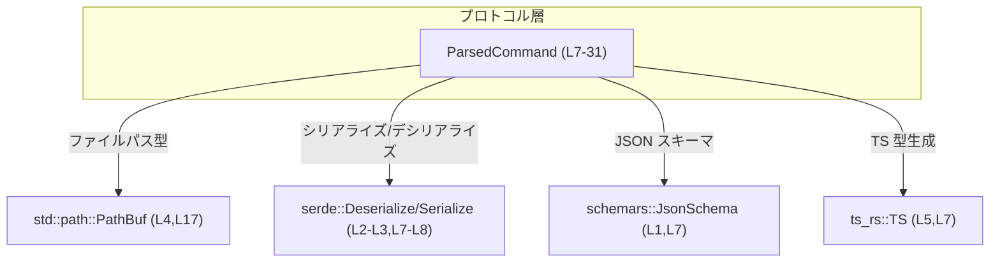
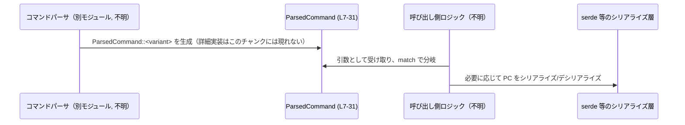

# protocol/src/parse_command.rs コード解説

## 0. ざっくり一言

プロトコルレイヤで扱う「コマンド」を列挙型 `ParsedCommand` として表現し、シリアライズ（serde）, JSON スキーマ（schemars）, TypeScript 型生成（ts_rs）に対応させるためのデータ定義です（根拠: `ParsedCommand` と derive 属性, `parse_command.rs:L7-L31`）。  
実際の「文字列 → ParsedCommand へのパース処理」は、このファイルには含まれていません（根拠: 関数定義が存在しない, `parse_command.rs:L1-L31`）。

---

## 1. このモジュールの役割

### 1.1 概要

- このモジュールは、プロトコル上でやり取りされるコマンドを型安全に扱うために、列挙型 `ParsedCommand` を定義します（`parse_command.rs:L9-L31`）。
- 各バリアントは `Read` / `ListFiles` / `Search` / `Unknown` の 4 種で、コマンド固有のフィールド（`cmd`, `name`, `query`, `path` など）を持ちます（`parse_command.rs:L10-L30`）。
- `Deserialize`, `Serialize`, `JsonSchema`, `TS` を derive することで、シリアライズ／JSON スキーマ生成／TypeScript 型生成に対応するよう設計されています（`parse_command.rs:L7`）。
- serde のタグ付き表現 `#[serde(tag = "type", rename_all = "snake_case")]` により、外部フォーマットでの表現が明示されています（`parse_command.rs:L8`）。

### 1.2 アーキテクチャ内での位置づけ

このチャンクから読み取れる依存関係は、`ParsedCommand` が外部 crate のトレイトを derive している点と、標準ライブラリの `PathBuf` を利用している点のみです（`parse_command.rs:L1-L5,L7-L8,L17`）。  
`ParsedCommand` をどのモジュールが利用しているかは、このチャンクには現れません。



> 注記: 呼び出し側コードやネットワーク I/O など、`ParsedCommand` の利用元はこのチャンクには現れないため、上図には含めていません。

### 1.3 設計上のポイント

- **内部タグ付き列挙（serde）**  
  `#[serde(tag = "type", rename_all = "snake_case")]` により、シリアライズ時に `type` フィールドでバリアント名を区別する内部タグ付き列挙として表現されます（`parse_command.rs:L8-L9`）。  
  例: `Read` → `"type": "read"` という形になることが期待されます（rename_all="snake_case" より推測）。

- **コマンド種別ごとのバリアント分割**  
  - `Read` / `ListFiles` / `Search` / `Unknown` の 4 種類に分けることで、コマンドの種別に応じたフィールドセットを持てるようになっています（`parse_command.rs:L10-L30`）。
  - `Unknown` バリアントにより、パースできない／未対応のコマンドを安全に保持できる設計になっています（`parse_command.rs:L28-L30`）。

- **オプショナルフィールドによる不在値表現**  
  - `ListFiles.path` と `Search.query`, `Search.path` が `Option<String>` になっており、パラメータの省略可能性を型で表現しています（`parse_command.rs:L21,L25-L26`）。

- **所有権ベースのシンプルなデータ構造**  
  すべてのフィールドが所有権を持つ標準型（`String`, `PathBuf`, それらを包む `Option`）で構成されており、参照やライフタイムパラメータは含まれていません（`parse_command.rs:L11-L12,L17,L20-L21,L24-L26,L29`）。  
  Rust の所有権・借用の観点では扱いやすく、スレッド間移動もしやすい構造です（一般的な Rust 型の性質に基づく説明）。

---

## 2. 主要な機能一覧

このファイルは関数ではなく「データ型の定義」を提供します。

- `ParsedCommand` 列挙体:  
  プロトコルのコマンドを `Read` / `ListFiles` / `Search` / `Unknown` の 4 種類に分類し、それぞれに対応するメタデータ（`cmd`, `name`, `query`, `path` など）を保持する（`parse_command.rs:L9-L30`）。
- シリアライズ／スキーマ／TS 型生成対応:  
  `Deserialize`, `Serialize`, `JsonSchema`, `TS` を derive することで、`ParsedCommand` を外部フォーマットと連携しやすい形にしている（`parse_command.rs:L1-L5,L7-L8`）。

---

## 3. 公開 API と詳細解説

### 3.1 型一覧（構造体・列挙体など）

#### 公開列挙体

| 名前 | 種別 | 役割 / 用途 | 定義位置 |
|------|------|-------------|----------|
| `ParsedCommand` | 列挙体 (`enum`) | プロトコルレベルのコマンドを 4 種類のバリアントで表現し、serde/schemars/ts_rs と連携可能なデータモデルを提供する | `parse_command.rs:L7-L31` |

#### `ParsedCommand` のバリアント一覧

| バリアント | フィールド | 説明（コードから読み取れる範囲） | 定義位置 |
|-----------|-----------|----------------------------------|----------|
| `Read` | `cmd: String` | コマンド文字列そのものと思われる（命名からの推測。型は `String`） | `parse_command.rs:L10-L11` |
|  | `name: String` | 読み込み対象の名前（ファイル名など）を表すと解釈できる（命名からの推測） | `parse_command.rs:L10-L12` |
|  | `path: PathBuf` | 読み込まれるファイルへの「ベストエフォートなパス」。可能なら絶対パス。相対の場合は、実行時に使う `cwd` を基準に解決して絶対パスを導くことが意図されています（doc コメントより） | `parse_command.rs:L13-L17` |
| `ListFiles` | `cmd: String` | コマンド文字列。具体的な形式はこのチャンクからは不明 | `parse_command.rs:L19-L20` |
|  | `path: Option<String>` | ファイル一覧を取得するパス。省略可能であり、`None` のときの扱いは呼び出し側に依存（コードからは不明） | `parse_command.rs:L19-L21` |
| `Search` | `cmd: String` | コマンド文字列 | `parse_command.rs:L23-L25` |
|  | `query: Option<String>` | 検索クエリ文字列。省略可能 | `parse_command.rs:L23-L25` |
|  | `path: Option<String>` | 検索対象パス。省略可能 | `parse_command.rs:L23-L26` |
| `Unknown` | `cmd: String` | 未知または未対応のコマンドをそのまま文字列で保持するためのフィールドと解釈できます（命名とバリアント名からの推測） | `parse_command.rs:L28-L30` |

#### derive されているトレイト

| トレイト | 用途（一般的な意味） | 付与対象 | 定義位置 |
|---------|----------------------|----------|----------|
| `Debug` | デバッグ出力用の `fmt::Debug` 実装 | `ParsedCommand` | `parse_command.rs:L7` |
| `Clone` | 値のクローン（深いコピー）を取得可能にする | `ParsedCommand` | `parse_command.rs:L7` |
| `PartialEq`, `Eq` | 等価比較を可能にする | `ParsedCommand` | `parse_command.rs:L7` |
| `Deserialize`, `Serialize` | serde によるシリアライズ／デシリアライズを可能にする | `ParsedCommand` | `parse_command.rs:L2-L3,L7-L8` |
| `JsonSchema` | JSON スキーマ生成（schemars）に利用されるトレイト | `ParsedCommand` | `parse_command.rs:L1,L7` |
| `TS` | TypeScript 型定義生成用と考えられるトレイト（トレイト名・クレート名からの推測。詳細仕様はこのチャンクからは不明） | `ParsedCommand` | `parse_command.rs:L5,L7` |

### 3.2 関数詳細（最大 7 件）

このファイルには、公開・非公開を問わず「関数」や「メソッド」の定義は存在しません（`fn` キーワードが出現しないことから確認, `parse_command.rs:L1-L31`）。  
そのため、本セクションで詳細解説すべき関数はありません。

### 3.3 その他の関数

- なし（関数定義自体が存在しません）。

---

## 4. データフロー

このファイルはデータ型のみを定義しており、具体的な処理フローは書かれていません。  
ただし、`ParsedCommand` の役割から、典型的な利用シナリオは次のように整理できます（呼び出し側の詳細はこのチャンクには現れないことに注意してください）。

1. 何らかのパーサ（別モジュール）が、生の入力（例: テキストコマンドや JSON）から `ParsedCommand` を生成する。
2. 呼び出し側コードが、`match` で `ParsedCommand` の各バリアントに応じた処理を行う。
3. 必要に応じて、`ParsedCommand` をシリアライズして別プロセス／クライアントに送ったり、ログとして記録したりする（serde・schemars・ts_rs の derive を利用）。

これを抽象的なシーケンス図で表すと、次のようになります。



> 注記: `Parser` や `Handler` の具体的な型・関数名・所在ファイルは、このチャンクには現れないため「不明」としています。

---

## 5. 使い方（How to Use）

### 5.1 基本的な使用方法

#### 例1: `ParsedCommand` を生成してパターンマッチする

この例は、`ParsedCommand` と同じモジュール内、または `ParsedCommand` がインポート済みであることを前提としたサンプルです。

```rust
// ParsedCommand を引数に取り、バリアントごとに処理を分ける関数
fn handle_command(cmd: ParsedCommand) {                           // 所有権を受け取る
    match cmd {                                                   // バリアントで分岐
        ParsedCommand::Read { cmd, name, path } => {              // Read バリアント
            // cmd: 元のコマンド文字列（例: "read main.rs" などを想定）
            // name: 対象の名前（例: "main.rs" などを想定）
            // path: 対象ファイルへの PathBuf（絶対/相対は doc コメント参照）
            println!("read: cmd={cmd}, name={name}, path={:?}", path);
        }
        ParsedCommand::ListFiles { cmd, path } => {               // ListFiles バリアント
            match path {                                          // path は Option<String>
                Some(p) => println!("list_files: {cmd} at {p}"),
                None => println!("list_files: {cmd} at default path"),
            }
        }
        ParsedCommand::Search { cmd, query, path } => {           // Search バリアント
            let query_desc = query.as_deref().unwrap_or("<none>");// Option<String> を扱う
            let path_desc  = path.as_deref().unwrap_or("<default>");
            println!(
                "search: cmd={cmd}, query={query_desc}, path={path_desc}"
            );
        }
        ParsedCommand::Unknown { cmd } => {                       // Unknown バリアント
            println!("unknown command: {cmd}");
        }
    }
}
```

このコードでは、`Option<String>` を適切に扱うことで、`None` の場合でも panic せずに処理しています（`as_deref().unwrap_or(...)`）。

### 5.2 よくある使用パターン

1. **コマンド種別ごとの分岐処理**  
   上記のように `match` 式でバリアントごとに分岐し、各コマンドに固有の処理を行うパターンです。  
   - `Unknown` を必ずハンドリングすることで、未対応コマンドにも安全に対応できます（`parse_command.rs:L28-L30`）。

2. **ログ・トレース用途**  
   `Debug` が derive されているため、デバッグログとして簡易に出力できます（`parse_command.rs:L7`）。

   ```rust
   fn log_command(cmd: &ParsedCommand) {                         // 参照で借用する（所有権は移さない）
       println!("parsed command = {:?}", cmd);                   // Debug フォーマットで出力
   }
   ```

3. **シリアライズ（一般的なイメージ）**  
   具体的なフォーマットやライブラリはこのファイルには書かれていませんが、`Serialize`/`Deserialize` を derive しているため、serde 対応ライブラリ（例: `serde_json`）でシリアライズするのが典型的です。

   ```rust
   // 例示用コード: 実際にどのフォーマット/クレートを使うかは、このチャンクからは不明
   fn to_json(cmd: &ParsedCommand) -> Result<String, serde_json::Error> {
       serde_json::to_string(cmd)                                // serde_json を使って JSON 化
   }
   ```

   > 注記: `serde_json` への依存はこのファイルには書かれていないため、この例は「一般的な使い方の一例」として示しています。

### 5.3 よくある間違い

推測される誤用パターンとその修正例を示します。

#### 誤り例1: `Option<String>` を必ず `Some` と仮定してしまう

```rust
fn handle_list_files(cmd: ParsedCommand) {
    if let ParsedCommand::ListFiles { cmd, path } = cmd {
        // NG: path が None の可能性を無視している
        let p = path.unwrap();                          // None の場合に panic する
        println!("list_files: {cmd} at {p}");
    }
}
```

**正しい例**

```rust
fn handle_list_files(cmd: ParsedCommand) {
    if let ParsedCommand::ListFiles { cmd, path } = cmd {
        match path {
            Some(p) => println!("list_files: {cmd} at {p}"),     // Some の場合
            None => println!("list_files: {cmd} at default path"),// None の場合
        }
    }
}
```

#### 誤り例2: `Read.path` を常に絶対パスとみなす

`Read.path` の doc コメントには、相対パスの可能性があることが明記されています（`parse_command.rs:L13-L17`）。

```rust
// NG: path が相対パスである可能性を無視して、そのまま安全でない操作を行う
fn open_file_from_read(cmd: ParsedCommand) {
    if let ParsedCommand::Read { path, .. } = cmd {
        // ここで path をそのまま信頼せず、cwd に対する解決や検証が必要になる
        // （実際の解決処理はこのファイルには定義されていない）
        println!("opening file at {:?}", path);
    }
}
```

**注意点**: 相対パス／シンボリックリンク等を含むパスは、セキュリティ上の観点から検証が必要です。検証ロジックは別モジュール側で実装することになります（このチャンクには現れません）。

### 5.4 使用上の注意点（まとめ）

- **契約（Contract）**
  - `Read.path` は「ベストエフォートなパス」であり、絶対パスとは限らない（doc コメントより, `parse_command.rs:L13-L17`）。呼び出し側で `cwd` に基づく解決が前提です。
  - `ListFiles.path`, `Search.query`, `Search.path` は `Option<String>` のため、`None` を正しく扱う必要があります（`parse_command.rs:L21,L25-L26`）。
  - `Unknown` バリアントは、「パースできなかった／未対応のコマンドをそのまま保持する」ための退避先と解釈できます（`parse_command.rs:L28-L30`）。

- **エッジケース**
  - `cmd` フィールドが空文字列である可能性は型上排除されていません。空コマンドにどう対応するかは呼び出し側の設計に依存します（`parse_command.rs:L11,L20,L24,L29`）。
  - `Read.path` が相対パスの場合の扱い（どの `cwd` を基準に解決するか）は、doc コメントに方針のみが書かれており、具体実装はこのファイルにはありません（`parse_command.rs:L13-L17`）。

- **安全性 / セキュリティ**
  - パス文字列やクエリ文字列は、一般に外部入力に由来する可能性があります。ファイルアクセスや検索処理に利用する際には、ディレクトリトラバーサル等を防ぐための検証が必要です（検証ロジックは別モジュール側で実装）。
  - `Unknown` バリアントに格納された `cmd` もログ出力時などにそのまま表示すると、ログインジェクションのような問題を起こしうるため、エスケープなどの処理が望ましい場合があります。

- **並行性**
  - この型は `String`, `PathBuf`, `Option` のみから構成されており、参照やスレッドアンセーフなグローバル状態を直接は持ちません（`parse_command.rs:L11-L12,L17,L20-L21,L24-L26,L29`）。
  - 一般的な Rust の性質から、所有権をスレッド間で移動して使う分には、データ競合を起こしにくい構造です。内部に `Mutex` や `RefCell` などは含まれません。

- **エラー表現**
  - 型レベルでは例外や `Result` は使われておらず、エラー的な状況は `Unknown` バリアントや `Option` の `None` で表現する設計になっています（`parse_command.rs:L21,L25-L26,L28-L30`）。

---

## 6. 変更の仕方（How to Modify）

### 6.1 新しい機能（新しいコマンド種別）を追加する場合

新しいコマンド種別を追加する場合は、`ParsedCommand` にバリアントを追加する形になります（`parse_command.rs:L9-L31`）。

1. **新バリアントの追加**
   - 例: `Rename`, `Delete` などの新コマンドを追加したい場合、`Unknown` の前後など適切な位置に新しいバリアントを追加します。

     ```rust
     pub enum ParsedCommand {
         // 既存のバリアント...
         Rename {
             cmd: String,
             from: PathBuf,
             to: PathBuf,
         },
         // 既存の Unknown など...
     }
     ```

2. **serde 表現への影響**
   - `#[serde(tag = "type", rename_all = "snake_case")]` により、新しいバリアント名は `snake_case` に変換された文字列で `type` フィールドに出現します（`parse_command.rs:L8-L9`）。
   - 既存のクライアント／サーバが新しい `type` 値に対応していない場合、互換性問題が発生しうる点に注意が必要です。

3. **スキーマ／TS 型生成への影響**
   - `JsonSchema`, `TS` の derive により、スキーマや TypeScript 型にも新バリアントが反映されます（`parse_command.rs:L1,L5,L7`）。
   - これに依存するコード（フロントエンドなど）があれば、併せて対応が必要です（このチャンクからはその存在は不明）。

4. **テスト**
   - このファイルにはテストコードは存在しませんが（`#[cfg(test)]` 等がない, `parse_command.rs:L1-L31`）、追加したバリアントについてシリアライズ／デシリアライズのテストを用意することが望ましいです。

### 6.2 既存の機能（バリアントやフィールド）を変更する場合

1. **バリアント名の変更**
   - `Read` などのバリアント名を変更すると、`rename_all = "snake_case"` により外部フォーマットの `type` 値も変わります（`parse_command.rs:L8-L10,L19,L23,L28`）。
   - これは後方互換性を壊す変更になるため、プロトコルバージョン管理が必要です。

2. **フィールド名・型の変更**
   - `cmd`, `name`, `query`, `path` などのフィールド名や型を変更すると、serde のフィールド名／型も変わります（`parse_command.rs:L11-L12,L17,L20-L21,L24-L26,L29`）。
   - 特に `Option<String>` を `String` に変えるなどの変更は、`null` や欠落フィールドを受け取れなくなるため、既存クライアントとの互換性に注意が必要です。

3. **`Read.path` の意味変更**
   - doc コメントに明記された意味（ベストエフォートなパス、相対パスは `cwd` で解決する）を変更する場合は、このコメントを更新し、実装側も合わせる必要があります（`parse_command.rs:L13-L17`）。
   - セキュリティ（パス検証）や UX（どのパスが解決されるか）への影響が大きいため、慎重に扱うべきポイントです。

4. **観測性（Observability）**
   - `Debug` 由来のログ出力に依存するコードがある場合、バリアントやフィールドの追加・削除によりログフォーマットが変わる点に注意します（`parse_command.rs:L7`）。

---

## 7. 関連ファイル・関連コンポーネント

このチャンクには他ファイルの情報は含まれていないため、厳密な意味での「同リポジトリ内の関連ファイル」は特定できません。  
ここでは、このファイルから直接参照されている外部コンポーネントを列挙します。

| パス / コンポーネント | 役割 / 関係 | 根拠 |
|-----------------------|-------------|------|
| `schemars::JsonSchema` | `ParsedCommand` の JSON スキーマ生成に利用されるトレイト。`JsonSchema` derive により利用されている | `parse_command.rs:L1,L7` |
| `serde::Deserialize`, `serde::Serialize` | `ParsedCommand` のシリアライズ／デシリアライズを可能にするトレイト。derive と属性で利用されている | `parse_command.rs:L2-L3,L7-L8` |
| `std::path::PathBuf` | `Read` バリアントの `path` フィールドで使用されるファイルパス型 | `parse_command.rs:L4,L17` |
| `ts_rs::TS` | TypeScript 型定義生成用と思われるトレイト。`TS` derive により利用されている（用途はトレイト名・crate 名からの推測であり、このチャンクから仕様は断定できません） | `parse_command.rs:L5,L7` |

> 実際に `ParsedCommand` を生成／利用するパーサやハンドラがどのファイルに存在するかは、このチャンクには現れないため「不明」です。
