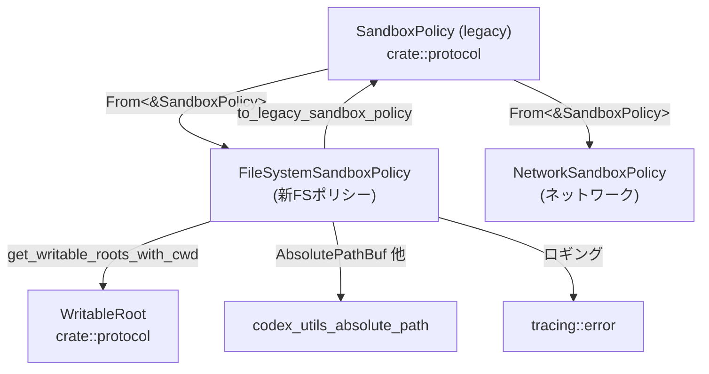
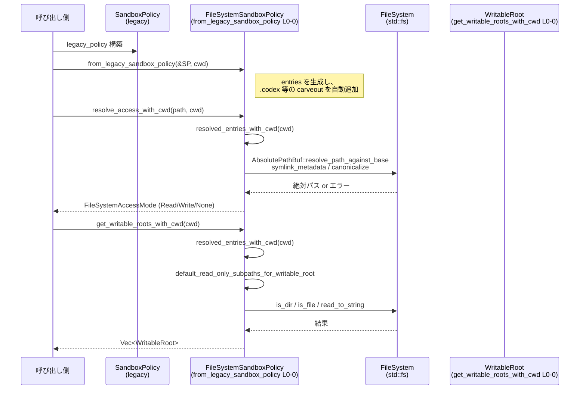

# protocol/src/permissions.rs コード解説

---

## 0. ざっくり一言

このモジュールは、**ファイルシステム／ネットワークのサンドボックス権限モデル**を定義し、  
旧来の `SandboxPolicy` と互換性を保ちながら、**パスベースでのアクセス判定と WritableRoot 計算**を行う実装です。

※ この回答ではソースの行番号が入力に含まれていないため、  
`protocol/src/permissions.rs:L0-0` のように「L0-0」を **「行番号不明」** のプレースホルダとして使います。

---

## 1. このモジュールの役割

### 1.1 概要

- このモジュールは **エージェントのファイルシステム・ネットワーク権限を表現・判定するための型とロジック**を提供します。
- 旧 API である `SandboxPolicy` と新しい `FileSystemSandboxPolicy` / `NetworkSandboxPolicy` の間で、**意味的に等価な変換**を行います。
- 絶対パス・特別パス（`Root` / `Tmpdir` / プロジェクトルートなど）・シンボリックリンクを考慮しつつ、  
  - あるパスが読み取り・書き込み・禁止のどれに該当するか
  - 実行時サンドボックスに渡す `WritableRoot` とその read-only carveout（拒否サブパス）
  を計算します。
- `.git` / `.agents` / `.codex` などのメタデータディレクトリを **デフォルトで read-only に保護**することで、安全性を高めています。

### 1.2 アーキテクチャ内での位置づけ

このモジュール周辺の主な依存関係は次のとおりです。



- 外部からは主に `SandboxPolicy` を通じて利用され、  
  - `From<&SandboxPolicy> for FileSystemSandboxPolicy`
  - `From<&SandboxPolicy> for NetworkSandboxPolicy`  
  により新モデルへ変換されます。
- 実行時にサンドボックスを構成するコードは `FileSystemSandboxPolicy` から `WritableRoot` 群を取得して利用します。
- ファイルシステムパスの正規化や絶対パス化には `codex_utils_absolute_path::AbsolutePathBuf` を使用しています。

### 1.3 設計上のポイント

- **責務の分割**
  - ファイルシステム権限: `FileSystemSandboxPolicy`, `FileSystemAccessMode`, `FileSystemPath`, `FileSystemSpecialPath`
  - ネットワーク権限: `NetworkSandboxPolicy`
  - レガシーポリシーとの相互変換: `From<&SandboxPolicy>` 実装と `to_legacy_sandbox_policy` / `from_legacy_sandbox_policy`
- **状態管理**
  - `FileSystemSandboxPolicy` は単純なデータ構造（kind + entries）で、内部にミューテーション用の共有状態は持ちません。
  - 判定は入力（path, cwd, env）に対する**純粋関数的**処理として実装されています（I/O を伴う部分を除く）。
- **エラーハンドリング**
  - 変換に失敗するケース（例: workspace 外への書き込み要求）は `io::Error` で明示的に返します（`to_legacy_sandbox_policy`）。
  - パス解決に失敗した場合は `Option::None` で表現します（`resolve_*` 群）。
  - Git ポインタファイル解析などは、失敗時に `tracing::error!` でログを残しつつ `None` を返す形です。
- **パニック条件**
  - `absolute_root_path_for_cwd` など一部の内部関数は「絶対パスであること」を前提とし、前提違反時に `panic!` します。  
    利用箇所では `AbsolutePathBuf::from_absolute_path` の `Ok` ケースのみに呼び出すことでこの前提を保っています。
- **シンボリックリンクと正規化**
  - `normalize_effective_absolute_path` で「実際に存在する最も内側の祖先」を canonicalize することで、  
    root-wide エイリアスや symlink を考慮した一意なルート計算を行います。
  - 一方、WritableRoot 配下の carveout パスでは「ユーザーに見える生のパス」を保持し、  
    下流のサンドボックスがシンボリックリンク inode 自体をマスクできるようにしています。
- **並行性**
  - 本体の実装には `unsafe` は使われておらず、共有可変状態もありません（テスト内の `unsafe std::env::set_var` を除く）。
  - `std::fs` や `std::env` を利用する I/O／環境変数読み出しは、Rust 標準ライブラリの範囲でスレッドセーフです（ただしブロッキング I/O）。
  - グローバルな環境変数を書き換えるのはテスト時のみで、本番経路は読み取りのみです。

---

## 2. 主要な機能一覧

- ファイルシステム権限モードの定義: `FileSystemAccessMode` による `read` / `write` / `none` の 3 値モード。
- 特別パスの扱い: `FileSystemSpecialPath` による `Root` / `Minimal` / `CurrentWorkingDirectory` / `ProjectRoots` / `Tmpdir` / `/tmp` / `Unknown` の表現。
- ファイルシステムサンドボックスポリシー:
  - `FileSystemSandboxPolicy` による restricted/unrestricted/external sandbox の表現。
  - パスごとのアクセス解決（`resolve_access_with_cwd` / `can_{read,write}_path_with_cwd`）。
  - 読み取り／書き込みルート・不可読ルートの計算（`get_{readable,writable,unreadable}_roots_with_cwd`）。
- レガシーポリシーとのブリッジ:
  - `From<&SandboxPolicy> for FileSystemSandboxPolicy` / `NetworkSandboxPolicy`.
  - `FileSystemSandboxPolicy::to_legacy_sandbox_policy` / `from_legacy_sandbox_policy`.
- WritableRoot と read-only carveout の計算:
  - `.git` / `.agents` / `.codex` をデフォルトで保護する `default_read_only_subpaths_for_writable_root`。
  - 明示的なエントリの影響を反映して carveout を構成する `get_writable_roots_with_cwd`。
- シンボリックリンク／エイリアス処理:
  - 実効ルートの正規化 `normalize_effective_absolute_path`。
  - エントリの意味を保った重複排除 `dedup_absolute_paths`。
- ネットワークポリシー:
  - `NetworkSandboxPolicy` による `Restricted`/`Enabled` の管理と、`SandboxPolicy` からの変換。

---

## 3. 公開 API と詳細解説

### 3.1 型一覧（構造体・列挙体など）

| 名前 | 種別 | 役割 / 用途 | 定義位置 |
|------|------|-------------|----------|
| `NetworkSandboxPolicy` | enum | ネットワークサンドボックスの方針（`Restricted` / `Enabled`）を表現します。`SandboxPolicy` からの変換と、`is_enabled` 判定を提供します。 | `protocol/src/permissions.rs:L0-0` |
| `FileSystemAccessMode` | enum | ファイルシステムエントリに対するアクセスモード（`Read` / `Write` / `None`）を表現します。`Ord` 実装により「conflict precedence（None > Write > Read）」順で比較されます。 | `protocol/src/permissions.rs:L0-0` |
| `FileSystemSpecialPath` | enum | `Root` / `Minimal` / `CurrentWorkingDirectory` / `ProjectRoots{subpath}` / `Tmpdir` / `SlashTmp` / `Unknown` など、設定ファイルで使われる特殊パスを表現します。 | `protocol/src/permissions.rs:L0-0` |
| `FileSystemSandboxEntry` | struct | 1 つのエントリ（ターゲットパス + `FileSystemAccessMode`）を表します。ポリシーの基本要素です。 | `protocol/src/permissions.rs:L0-0` |
| `FileSystemSandboxKind` | enum | サンドボックスの種類（`Restricted` / `Unrestricted` / `ExternalSandbox`）を表します。 | `protocol/src/permissions.rs:L0-0` |
| `FileSystemSandboxPolicy` | struct | ファイルシステムサンドボックスポリシーの本体。`kind` と `entries` により全体の権限モデルを表現します。`Default` 実装は「Root 読み取りのみ」の restricted ポリシーです。 | `protocol/src/permissions.rs:L0-0` |
| `FileSystemPath` | enum | エントリが指すパスを表現します。`Path{path: AbsolutePathBuf}`（具体パス）と `Special{value: FileSystemSpecialPath}`（特殊パス）を持ちます。 | `protocol/src/permissions.rs:L0-0` |
| `ResolvedFileSystemEntry` | struct (内部) | `FileSystemSandboxEntry` を `cwd` などを使って解決した結果。`AbsolutePathBuf` とアクセスモードを持ちます。 | `protocol/src/permissions.rs:L0-0` |
| `FileSystemSemanticSignature` | struct (内部) | ポリシーの意味的な署名（full-disk access フラグや roots の集合）をまとめた構造体。`needs_direct_runtime_enforcement` の比較に用いられます。 | `protocol/src/permissions.rs:L0-0` |

> ※ すべて `Serialize` / `Deserialize` / `JsonSchema` / `TS` を実装しており、設定ファイルおよび TypeScript 側との連携を想定した設計です。

---

### 3.2 関数詳細（7件）

#### 1. `FileSystemSandboxPolicy::from_legacy_sandbox_policy(sandbox_policy: &SandboxPolicy, cwd: &Path) -> FileSystemSandboxPolicy`

**概要**

- 旧来の `SandboxPolicy` を、現在の `FileSystemSandboxPolicy` に変換します。
- 特に `WorkspaceWrite` ポリシーの semantics を維持しつつ、  
  `.codex` 配下などの「保護すべき read-only パス」を自動追加します。
- `cwd` は workspace ルートの相対／絶対パスとして扱われます。

**引数**

| 引数名 | 型 | 説明 |
|--------|----|------|
| `sandbox_policy` | `&SandboxPolicy` | 旧 API のサンドボックスポリシー（ファイルシステム＋ネットワーク） |
| `cwd` | `&Path` | ワークスペースのカレントディレクトリ。相対パスも許容されます。 |

**戻り値**

- `FileSystemSandboxPolicy`  
  レガシーポリシーと意味的に等価なファイルシステムポリシー。

**内部処理の流れ**

- `Self::from(sandbox_policy)` を呼び出し、まず素直な変換を行います（`From<&SandboxPolicy> for FileSystemSandboxPolicy` の実装を利用）。
- `sandbox_policy` が `WorkspaceWrite` の場合のみ、追加の調整を行います。
  - `sandbox_policy.get_writable_roots_with_cwd(cwd)` を使って、レガシーモデルにおける writable roots を取得。
  - `file_system_policy.entries` から、以下に該当する `Read` エントリを削除:
    - `FileSystemPath::Path { path }` で、
    - その `path` がレガシー writable root 配下で `is_path_writable` なもの。  
      → レガシーでは「単に writable root の一部」だった read-only エントリが、新モデルで「read-only carveout」にならないようにするため。
  - `cwd` および `writable_roots` それぞれに対して:
    - `default_read_only_subpaths_for_writable_root` を呼び出し、`.git` / `.agents` / `.codex` などの保護対象パスを列挙。
    - `append_default_read_only_path_if_no_explicit_rule` で、すでに明示ルールがない場合のみ `Read` エントリとして追加。

**Examples（使用例）**

```rust
use std::path::Path;
use crate::protocol::{SandboxPolicy, ReadOnlyAccess};

// 旧来の WorkspaceWrite ポリシーを FileSystemSandboxPolicy に変換する例
fn build_fs_policy() {
    let legacy = SandboxPolicy::WorkspaceWrite {
        writable_roots: vec![], // ここでは cwd のみ writable とする
        read_only_access: ReadOnlyAccess::Restricted {
            include_platform_defaults: false,
            readable_roots: vec![],
        },
        network_access: false,
        exclude_tmpdir_env_var: true,
        exclude_slash_tmp: true,
    };

    let cwd = Path::new("workspace"); // 相対パスも許容される
    let fs_policy = FileSystemSandboxPolicy::from_legacy_sandbox_policy(&legacy, cwd);

    // .codex 配下が自動的に read-only carveout になる
    assert!(
        !fs_policy.can_write_path_with_cwd(Path::new(".codex/config.toml"), cwd)
    );
}
```

**Errors / Panics**

- この関数自体は `Result` を返さず、パニックもしません。
- 内部で `AbsolutePathBuf::from_absolute_path(cwd)` を使いますが、`Ok` の場合のみ `default_read_only_subpaths_for_writable_root` に渡しており、`Err`（非絶対パス）の場合はそのブランチをスキップします。

**Edge cases（エッジケース）**

- `cwd` が相対パスの場合:
  - `SandboxPolicy::WorkspaceWrite` のテスト `legacy_workspace_write_projection_accepts_relative_cwd` によって、  
    現在の作業ディレクトリを基準に解決されることが確認されています。
- `.codex` に対する明示的なユーザールールが存在する場合:
  - `append_default_read_only_path_if_no_explicit_rule` により、デフォルトの read-only carveout は追加されません（ユーザールール優先）。
- `WritableRoot` が複数ある場合:
  - 各 root ごとに `default_read_only_subpaths_for_writable_root` が適用されます。

**使用上の注意点**

- レガシーと新モデルを混在させる場合、**この関数で変換したポリシーに対して再度 `from_legacy_sandbox_policy` を呼び出す必要はありません**。  
  往復変換は `needs_direct_runtime_enforcement` 内部で自動で行われます。
- `.codex` や `.git` などのメタディレクトリに書き込みを許したい場合は、**明示的な `Write` エントリ**を追加する必要があります。

---

#### 2. `FileSystemSandboxPolicy::to_legacy_sandbox_policy(&self, network_policy: NetworkSandboxPolicy, cwd: &Path) -> io::Result<SandboxPolicy>`

**概要**

- 現行の `FileSystemSandboxPolicy` を、実行時がまだ旧 `SandboxPolicy` を前提としている場合に備えて **レガシーフォーマットへ逆変換**します。
- 読み取り／書き込み権限、`Tmpdir` や `/tmp` の扱い、workspace writable かどうかなどを解析し、  
  適切な `SandboxPolicy::{DangerFullAccess, ExternalSandbox, ReadOnly, WorkspaceWrite}` を構築します。
- 旧モデルで表現できない（例: workspace 外の細かい writable carveout）場合は `Err(InvalidInput)` を返します。

**引数**

| 引数名 | 型 | 説明 |
|--------|----|------|
| `&self` | `&FileSystemSandboxPolicy` | 現行のファイルシステムサンドボックスポリシー |
| `network_policy` | `NetworkSandboxPolicy` | ネットワークサンドボックス方針（Enabled/Restricted） |
| `cwd` | `&Path` | workspace のカレントディレクトリ（絶対／相対） |

**戻り値**

- `io::Result<SandboxPolicy>`  
  - `Ok(SandboxPolicy)` : 意味を保ったレガシーポリシーに変換できた場合。
  - `Err(io::ErrorKind::InvalidInput)` : レガシーモデルでは表現できない書き込み要求が含まれる場合。

**内部処理の流れ**

- `self.kind` に応じて分岐:
  - `ExternalSandbox` → `SandboxPolicy::ExternalSandbox`（ネットワークは `network_policy` から決定）。
  - `Unrestricted` → ネットワーク Enabled なら `DangerFullAccess`、Restricted なら `ExternalSandbox`（ネットワークだけ restricted）。
  - `Restricted` の場合:
    - `cwd_absolute: Option<AbsolutePathBuf>` を取得。
    - 各種フラグ／コレクションを初期化:  
      `include_platform_defaults`, `has_full_disk_{read,write}_access`, `workspace_root_writable`,  
      `writable_roots`, `readable_roots`, `tmpdir_writable`, `slash_tmp_writable`.
    - `self.entries` を走査し、`FileSystemPath` の種別ごとに上記フラグや配列を更新。
      - `Special::Root` → full-disk read / write のフラグに反映。
      - `Special::Minimal` → `include_platform_defaults`。
      - `Special::CurrentWorkingDirectory` / `ProjectRoots` / `Tmpdir` / `SlashTmp` →  
        `resolve_file_system_special_path` で物理パスを求め、readable or writable roots に追加。
    - `has_full_disk_write_access` が true の場合:
      - ネットワーク Enabled → `DangerFullAccess`  
      - ネットワーク Restricted → `ExternalSandbox`（ネットワークのみ restricted）
    - そうでない場合:
      - `ReadOnlyAccess` を構築:
        - full-disk read → `ReadOnlyAccess::FullAccess`
        - それ以外 → `ReadOnlyAccess::Restricted { include_platform_defaults, readable_roots(dedup) }`
      - `workspace_root_writable` が true の場合 → `SandboxPolicy::WorkspaceWrite` を返却:
        - `writable_roots` は dedup 後にセット。
        - `exclude_tmpdir_env_var` は `!tmpdir_writable`。
        - `exclude_slash_tmp` は `!slash_tmp_writable`。
      - workspace root writable ではないが、他に writable root（または tmpdir_writable/slash_tmp_writable）がある場合:
        - レガシーモデルで表現できないため `Err(InvalidInput, "...")`。
      - writable が何もなければ `SandboxPolicy::ReadOnly { access, network_access }` を返却。

**Examples（使用例）**

```rust
use std::path::Path;
use crate::protocol::SandboxPolicy;

// FileSystemSandboxPolicy を旧 SandboxPolicy に変換し、旧ランタイムに渡す例
fn bridge_to_legacy_runtime(fs_policy: &FileSystemSandboxPolicy) -> std::io::Result<SandboxPolicy> {
    let cwd = Path::new("/tmp/workspace");
    let net = NetworkSandboxPolicy::Restricted; // ネットワークは無効

    let legacy = fs_policy.to_legacy_sandbox_policy(net, cwd)?;
    Ok(legacy)
}
```

**Errors / Panics**

- `Err(io::ErrorKind::InvalidInput)` が返る条件:
  - `FileSystemSandboxKind::Restricted` かつ
  - `workspace_root_writable` が false なのに、
    - `writable_roots` が空でない、または
    - `tmpdir_writable` / `slash_tmp_writable` のいずれかが true  
  → 「workspace 外への書き込み要求」は、旧 `SandboxPolicy` では表現できないためです。
- パニック条件はありません（`expect` / `unwrap` は使用していません）。

**Edge cases（エッジケース）**

- `FileSystemSpecialPath::Unknown` は単に無視されます（テスト `unknown_special_paths_are_ignored_by_legacy_bridge` で確認）。
- `CurrentWorkingDirectory` が `Read` のみで書き込み不可の場合は、`workspace_root_writable` は false になり  
  `WorkspaceWrite` ではなく `ReadOnly` として扱われます。
- `Tmpdir` や `/tmp` だけ writable で、workspace が書き込み不可なケースでは `Err(InvalidInput)` になります。

**使用上の注意点**

- この関数を使うコードは、`Err(InvalidInput)` を検知して「新しい `FileSystemSandboxPolicy` を直接 enforced すべき」かどうかを判断できます。実際にそのロジックは `needs_direct_runtime_enforcement` が提供します。
- `cwd` は実際に workspace root として解釈されるため、誤った `cwd` を渡すと workspace writable 判定や roots の計算が狂います。

---

#### 3. `FileSystemSandboxPolicy::resolve_access_with_cwd(&self, path: &Path, cwd: &Path) -> FileSystemAccessMode`

**概要**

- 指定した `path`（相対／絶対）に対する **最終的なアクセスモード（Read / Write / None）** を計算します。
- `cwd` を基準に相対パスを絶対化し、restrict ポリシー内のエントリと照合して、  
  「最も具体的なエントリ」かつ「Conflict precedence に従うアクセスモード」を選びます。

**引数**

| 引数名 | 型 | 説明 |
|--------|----|------|
| `&self` | `&FileSystemSandboxPolicy` | サンドボックスポリシー |
| `path` | `&Path` | 判定対象パス（相対 or 絶対） |
| `cwd` | `&Path` | 相対パス解決に用いるカレントディレクトリ |

**戻り値**

- `FileSystemAccessMode`  
  `Read` / `Write` / `None` のいずれか。

**内部処理の流れ**

- `self.kind` が `Unrestricted` / `ExternalSandbox` の場合:
  - 常に `FileSystemAccessMode::Write` を返す（完全な read/write 権限）。
- `Restricted` の場合:
  - `resolve_candidate_path(path, cwd)` で `AbsolutePathBuf` に変換。
    - 絶対パスなら `AbsolutePathBuf::from_absolute_path`。
    - 相対パスなら `AbsolutePathBuf::resolve_path_against_base(path, cwd)`。
    - 失敗した場合は `None` 扱い→ `FileSystemAccessMode::None` を返す。
  - `self.resolved_entries_with_cwd(cwd)` で、すべてのエントリを `AbsolutePathBuf` に解決。
  - すべてのエントリに対して:
    - 対象パスが `entry.path` の配下にあるか（`starts_with`）を確認。
    - 一致するエントリの中から、`max_by_key(resolved_entry_precedence)` で最も優先度の高いエントリを選択。
      - `resolved_entry_precedence` は `(path のコンポーネント数, access)` をキーにし、
        - よりパスが長い（より具体的）ものが優先。
        - specificity が同じ場合は `FileSystemAccessMode` の `Ord`（None > Write > Read）が優先。
  - マッチしたエントリがなければ `FileSystemAccessMode::None`。

**Examples（使用例）**

```rust
use std::path::Path;
use crate::protocol::permissions::*;

fn demo_resolve_access(policy: &FileSystemSandboxPolicy, cwd: &Path) {
    let path = Path::new("docs/private/secret.txt"); // 相対パス
    let access = policy.resolve_access_with_cwd(path, cwd);

    match access {
        FileSystemAccessMode::Read => println!("読み取りのみ許可"),
        FileSystemAccessMode::Write => println!("読み書き許可"),
        FileSystemAccessMode::None => println!("アクセス禁止"),
    }
}
```

**Errors / Panics**

- `resolve_candidate_path` 内の `AbsolutePathBuf::from_absolute_path` が `Err` の場合は `None` になり、`FileSystemAccessMode::None` を返すだけです。
- パニックは発生しません。

**Edge cases（エッジケース）**

- 同一パスに対して複数のエントリがある場合:
  - もっとも具体的なパス、かつ `FileSystemAccessMode` の順序（None > Write > Read）に従って選択されます。
  - テスト `resolve_access_with_cwd_uses_most_specific_entry` で確認されています。
- `Unrestricted` / `ExternalSandbox` では `path` や `cwd` は無視され、常に `Write` が返されます。
- `cwd` が存在しないディレクトリでも、パス解決は `AbsolutePathBuf::resolve_path_against_base` ベースなので論理パスとしては解決されます。

**使用上の注意点**

- 実際の OS レベルの権限とは独立した論理的ポリシー判定です。  
  OS 側でさらに制限があれば、それに従う必要があります。
- 下流のサンドボックス実装と意味を合わせるため、指定する `cwd` は**実際のワークスペース root**と一致させるべきです。

---

#### 4. `FileSystemSandboxPolicy::get_writable_roots_with_cwd(&self, cwd: &Path) -> Vec<WritableRoot>`

**概要**

- 現在のポリシーに基づいて、**書き込み可能なトップレベルルートと、その配下で read-only にすべき carveout パスの集合**を計算します。
- 下流のサンドボックス（例: bwrap など）が bind-mount などを行うための情報として使用されます。

**引数**

| 引数名 | 型 | 説明 |
|--------|----|------|
| `&self` | `&FileSystemSandboxPolicy` | サンドボックスポリシー |
| `cwd` | `&Path` | カレントディレクトリ（ワークスペースの基準） |

**戻り値**

- `Vec<WritableRoot>`  
  それぞれが `root: AbsolutePathBuf` と `read_only_subpaths: Vec<AbsolutePathBuf>` を持ちます。

**内部処理の流れ（簡略）**

- full-disk write アクセス (`has_full_disk_write_access`) の場合 → 空ベクタを返す（下流が root を自由に扱えるため）。
- そうでない場合:
  - `resolved_entries_with_cwd(cwd)` で全エントリを解決。
  - `writable_entries` として、  
    - `entry.access.can_write()` かつ  
    - `self.can_write_path_with_cwd(entry.path, cwd)` なパスを収集。
  - `dedup_absolute_paths(writable_entries.clone(), true)` で正規化＋重複排除し、最終的な `root` 候補列挙。
  - 各 `root` ごとに:
    - `preserve_raw_carveout_paths` を設定:  
      `root.parent().is_some()` の場合 true（ファイルシステム root ではない）。
    - `raw_writable_roots`: 正規化前の writable_entries のうち、この `root` と同じ実効パスになるものを収集。
    - `protect_missing_dot_codex`:  
      `cwd` がこの root と同じ normalized root なら true → `.codex` を存在しなくても守る。
    - `read_only_subpaths` 初期値:
      - `default_read_only_subpaths_for_writable_root(&root, protect_missing_dot_codex)` の結果から、
      - `has_explicit_resolved_path_entry(resolved_entries, path)` が false のものだけを残す。
    - さらに「書き込み不可エントリによる carveout」を追加:
      - `resolved_entries` から、
        - `!entry.access.can_write()` かつ
        - `!self.can_write_path_with_cwd(entry.path, cwd)` なエントリを対象に、
        - 有効な carveout パスを計算し `read_only_subpaths` に追加。
      - carveout の計算では symlink を考慮しつつ、「writable root 配下の生のパス」を優先的に残すロジックがあります。
    - `read_only_subpaths` を `dedup_absolute_paths(..., false)` で重複排除。
    - `WritableRoot { root, read_only_subpaths }` をベクタに push。

**Examples（使用例）**

```rust
use std::path::Path;
use crate::protocol::permissions::*;
use crate::protocol::WritableRoot;

fn collect_writable_roots(policy: &FileSystemSandboxPolicy, cwd: &Path) -> Vec<WritableRoot> {
    let roots = policy.get_writable_roots_with_cwd(cwd);
    for root in &roots {
        println!("Writable root: {}", root.root.as_path().display());
        for carved in &root.read_only_subpaths {
            println!("  read-only: {}", carved.as_path().display());
        }
    }
    roots
}
```

**Errors / Panics**

- 内部で `normalize_effective_absolute_path` や `default_read_only_subpaths_for_writable_root` が  
  `std::fs` 系の I/O を行い、`canonicalize_preserving_symlinks` を呼び出しますが、  
  これらのエラーはすべて内部で握りつぶされ、元のパスを返すか `None` として無視される設計です。
- パニックは発生しません。

**Edge cases（エッジケース）**

- 書き込み root が filesystem root (`/` など) の場合:
  - `preserve_raw_carveout_paths` は false になり、下流には canonicalized パスのみを渡します。
- symlink を含む writable root の場合:
  - テスト `effective_runtime_roots_preserve_symlinked_paths` などで確認されている通り、  
    root は symlink パスで保持され、carveout も symlink 経由の生パスとして保持されます。
- `.codex` が symlink の場合:
  - テスト `writable_roots_preserve_symlinked_protected_subpaths` で、  
    carveout が symlink の位置に対してのみ追加され、実体側のディレクトリは carveout に含まれないことが確認されています。

**使用上の注意点**

- 戻り値の `WritableRoot` は「実効パス」であり、**実際のサンドボックス実装はこの情報に忠実である必要があります**。  
  特に symlink をマスクしたい場合、`read_only_subpaths` に含まれるパスを正しく deny マウントする必要があります。
- full-disk write の場合に空ベクタが返るのは仕様です。下流コードは「空なら root 全体 writable」という前提で解釈する必要があります。

---

#### 5. `FileSystemSandboxPolicy::needs_direct_runtime_enforcement(&self, network_policy: NetworkSandboxPolicy, cwd: &Path) -> bool`

**概要**

- 現在の `FileSystemSandboxPolicy` が **レガシー `SandboxPolicy` モデルで完全には表現できないかどうか**を判定します。
- true の場合、ランタイムは `SandboxPolicy` ではなく **この FileSystemSandboxPolicy を直接 enforcement する必要がある**と判断できます。

**引数**

| 引数名 | 型 | 説明 |
|--------|----|------|
| `&self` | `&FileSystemSandboxPolicy` | 現行ポリシー |
| `network_policy` | `NetworkSandboxPolicy` | ネットワーク方針 |
| `cwd` | `&Path` | カレントディレクトリ |

**戻り値**

- `bool`  
  - `true`: FileSystemSandboxPolicy を直接 enforcement する必要がある。
  - `false`: レガシーモデルで意味を損なわずに表現できる。

**内部処理の流れ**

- `self.kind` が `Restricted` 以外 (`Unrestricted` / `ExternalSandbox`) の場合 → `false`。
- `Restricted` の場合:
  - `self.to_legacy_sandbox_policy(network_policy, cwd)` を実行。
    - `Err(_)` の場合 → `true`（レガシーモデルで表現不能）。
  - `Ok(legacy_policy)` の場合:
    - `self.semantic_signature(cwd)` と  
      `FileSystemSandboxPolicy::from_legacy_sandbox_policy(&legacy_policy, cwd).semantic_signature(cwd)` を比較。
    - 両者が異なる場合 → `true`。同じなら → `false`。

**Examples（使用例）**

```rust
use std::path::Path;

fn should_runtime_enforce_directly(policy: &FileSystemSandboxPolicy, cwd: &Path) -> bool {
    policy.needs_direct_runtime_enforcement(NetworkSandboxPolicy::Restricted, cwd)
}
```

**Errors / Panics**

- 内部で `to_legacy_sandbox_policy` が `Err` を返した場合、それを `true` として扱うだけで、ここでエラーを投げることはありません。
- パニックは発生しません。

**Edge cases（エッジケース）**

- `WorkspaceWrite` に相当する素直なポリシー:
  - テスト `split_only_nested_carveouts_need_direct_runtime_enforcement` により、  
    `SandboxPolicy::new_workspace_write_policy()` 相当のポリシーでは `false` になることが確認されています。
- `Root` write に対し read-only child carveout があるケース:
  - テスト `root_write_with_read_only_child_is_not_full_disk_write` では、  
    full-disk write ではないため `needs_direct_runtime_enforcement` が `true` になります。

**使用上の注意点**

- ランタイム側のコードは、この関数の結果を見て  
  - `false` → 従来どおり `SandboxPolicy` ベースの enforcement で良い  
  - `true` → 新しい `FileSystemSandboxPolicy` を理解するサンドボックス実装を利用する  
  といった分岐を行うことが想定されています。

---

#### 6. `default_read_only_subpaths_for_writable_root(writable_root: &AbsolutePathBuf, protect_missing_dot_codex: bool) -> Vec<AbsolutePathBuf>`

**概要**

- 与えられた writable root 直下で、デフォルトで **read-only に保護すべきサブパス**（`.git`, `.agents`, `.codex`）を列挙します。
- `.git` が Git ポインタファイルの場合は、実際の `gitdir` も保護対象に含めます。
- `.codex` については、`protect_missing_dot_codex` が true の場合は **ディレクトリが存在しなくても**保護対象に含めます。

**引数**

| 引数名 | 型 | 説明 |
|--------|----|------|
| `writable_root` | `&AbsolutePathBuf` | 書き込み可能なルートパス |
| `protect_missing_dot_codex` | `bool` | `.codex` ディレクトリが存在しない場合でも保護するかどうか |

**戻り値**

- `Vec<AbsolutePathBuf>`  
  デフォルトで read-only にすべきサブパスのリスト（重複は除去済み）。

**内部処理の流れ**

- `writable_root.join(".git")` を `top_level_git` として取得。
  - `is_file` または `is_dir` のいずれかなら:
    - `is_file` かつ `is_git_pointer_file(&top_level_git)` が true で、`resolve_gitdir_from_file` が `Some(gitdir)` を返す場合 → その `gitdir` を `subpaths` に追加。
    - さらに `top_level_git` 自身も `subpaths` に追加。
- `writable_root.join(".agents")` がディレクトリなら `subpaths` に追加。
- `writable_root.join(".codex")` を `top_level_codex` として取得。
  - `protect_missing_dot_codex` が true または `top_level_codex.is_dir()` の場合 → `subpaths` に追加。
- 最後に `dedup_absolute_paths(subpaths, false)` で重複排除。

**Examples（使用例）**

```rust
use codex_utils_absolute_path::AbsolutePathBuf;

fn show_default_protected_paths(root: &AbsolutePathBuf) {
    let protected = default_read_only_subpaths_for_writable_root(root, true);
    for p in &protected {
        println!("Protected: {}", p.as_path().display());
    }
}
```

**Errors / Panics**

- 内部で `std::fs::read_to_string` などの I/O を呼びますが、失敗時には `tracing::error!` を出力して `None` を返すだけです。
- パニックはありません。

**Edge cases（エッジケース）**

- `.git` がポインタファイルでフォーマット不正 or `gitdir` が存在しない場合:
  - ログを出力して無視され、`gitdir` は `subpaths` に含まれません（`.git` 自体は含まれます）。
- `protect_missing_dot_codex` = true かつ `.codex` が存在しない場合:
  - `.codex` ディレクトリが将来作られる可能性を考慮し、あらかじめ carveout に含めます（テスト `writable_roots_proactively_protect_missing_dot_codex` で確認）。

**使用上の注意点**

- この関数単体ではエントリの「明示ルール」を考慮しません。  
  `get_writable_roots_with_cwd` 内で `has_explicit_resolved_path_entry` によって上書きされます。

---

#### 7. `normalize_effective_absolute_path(path: AbsolutePathBuf) -> AbsolutePathBuf`

**概要**

- 与えられた絶対パスについて、「実際に存在する最も内側の祖先」を起点として `canonicalize_preserving_symlinks` を行い、  
  **実効的に同じ場所を指すパスをできるだけ同一化**します。
- これにより、`/var/...` と `/private/var/...` のような root-wide エイリアスや symlink を考慮した dedup が可能になります。

**引数**

| 引数名 | 型 | 説明 |
|--------|----|------|
| `path` | `AbsolutePathBuf` | 正規化対象の絶対パス（所有権を move） |

**戻り値**

- `AbsolutePathBuf`  
  正規化されたパス。正常に正規化できなかった場合は元の `path` をそのまま返します。

**内部処理の流れ**

- `raw_path = path.to_path_buf()` を取得。
- `for ancestor in raw_path.ancestors()` で末端からルートに向かって順に走査:
  - `std::fs::symlink_metadata(ancestor)` が成功しない場合 → 次の ancestor へ。
  - `canonicalize_preserving_symlinks(ancestor)` が `Ok(normalized_ancestor)` でなければ → 次の ancestor。
  - `raw_path.strip_prefix(ancestor)` が `Ok(suffix)` でなければ → 次の ancestor。
  - `normalized_ancestor.join(suffix)` を絶対パスとして `AbsolutePathBuf::from_absolute_path` し、成功すればそれを返す。
- いずれの ancestor に対しても成功しなかった場合 → 元の `path` を返す。

**Examples（使用例）**

```rust
use codex_utils_absolute_path::AbsolutePathBuf;

fn demo_normalize(path: AbsolutePathBuf) -> AbsolutePathBuf {
    normalize_effective_absolute_path(path)
}
```

**Errors / Panics**

- `symlink_metadata` / `canonicalize_preserving_symlinks` / `from_absolute_path` のエラーはすべて無視し、  
  正規化に失敗した場合は元の `path` を返します。
- パニックはありません。

**Edge cases（エッジケース）**

- どの ancestor も存在しない／canonicalize に失敗する場合:
  - 引数のパスがそのまま返されます。
- シンボリックリンクの途中経路:
  - 「最初に成功した ancestor」を基準に canonicalize されるため、  
    `dedup_absolute_paths` と組み合わせて root-wide エイリアスをつぶすのに適しています。

**使用上の注意点**

- 実行時 I/O（`symlink_metadata` / `canonicalize_preserving_symlinks`）が行われるため、大量のパスに対して繰り返し呼び出すと性能に影響があります。  
  ただし本モジュールでは、WritableRoot や roots の dedup 時など、構成フェーズでの呼び出しに限定されています。

---

### 3.3 その他の関数・メソッド一覧

公開 API 以外の補助関数を表にまとめます（テスト関数は省略）。

| 関数名 / メソッド名 | 役割（1 行） | 定義位置 |
|---------------------|-------------|----------|
| `NetworkSandboxPolicy::is_enabled` | ネットワークが有効かどうかを `Enabled` 判定で返す。 | `protocol/src/permissions.rs:L0-0` |
| `FileSystemAccessMode::can_read` | `None` 以外なら読み取り可能とみなすヘルパー。 | `protocol/src/permissions.rs:L0-0` |
| `FileSystemAccessMode::can_write` | `Write` のときにのみ書き込み可能とみなすヘルパー。 | `protocol/src/permissions.rs:L0-0` |
| `FileSystemSpecialPath::project_roots` | `FileSystemSpecialPath::ProjectRoots` コンストラクタ。 | `protocol/src/permissions.rs:L0-0` |
| `FileSystemSpecialPath::unknown` | `FileSystemSpecialPath::Unknown` コンストラクタ（将来拡張のための保存用）。 | `protocol/src/permissions.rs:L0-0` |
| `FileSystemSandboxPolicy::default` | kind=Restricted, Root=Read のデフォルトポリシーを構築。 | `protocol/src/permissions.rs:L0-0` |
| `FileSystemSandboxPolicy::has_root_access` | Restricted ポリシーの entries から `Special::Root` に対するアクセスが存在するかを predicate で判定。 | `protocol/src/permissions.rs:L0-0` |
| `FileSystemSandboxPolicy::has_explicit_deny_entries` | Restricted ポリシー内に `access == None` のエントリが存在するかどうか。 | `protocol/src/permissions.rs:L0-0` |
| `FileSystemSandboxPolicy::has_write_narrowing_entries` | `:root = write` のような広い権限を実質的に狭めるエントリがあるかどうかを判定。 | `protocol/src/permissions.rs:L0-0` |
| `FileSystemSandboxPolicy::has_same_target_write_override` | 同一ターゲットに対してより強い `Write` エントリがあるかどうかを判定。 | `protocol/src/permissions.rs:L0-0` |
| `FileSystemSandboxPolicy::unrestricted` | kind=Unrestricted のポリシーを構築。 | `protocol/src/permissions.rs:L0-0` |
| `FileSystemSandboxPolicy::external_sandbox` | kind=ExternalSandbox のポリシーを構築。 | `protocol/src/permissions.rs:L0-0` |
| `FileSystemSandboxPolicy::restricted` | kind=Restricted, entries=引数 のポリシーを構築。 | `protocol/src/permissions.rs:L0-0` |
| `FileSystemSandboxPolicy::has_full_disk_read_access` | full-disk read access かどうかを判定（Root=read かつ deny entry なし）。 | `protocol/src/permissions.rs:L0-0` |
| `FileSystemSandboxPolicy::has_full_disk_write_access` | full-disk write access かどうかを判定（Root=write かつ write narrowing entry なし）。 | `protocol/src/permissions.rs:L0-0` |
| `FileSystemSandboxPolicy::include_platform_defaults` | デフォルトの readable roots（プラットフォーム依存）を含めるべきか判定。 | `protocol/src/permissions.rs:L0-0` |
| `FileSystemSandboxPolicy::can_read_path_with_cwd` | `resolve_access_with_cwd(...).can_read()` のラッパー。 | `protocol/src/permissions.rs:L0-0` |
| `FileSystemSandboxPolicy::can_write_path_with_cwd` | `resolve_access_with_cwd(...).can_write()` のラッパー。 | `protocol/src/permissions.rs:L0-0` |
| `FileSystemSandboxPolicy::with_additional_readable_roots` | 既存で読み取り不可なパスについて `Read` root を追加した新ポリシーを返す。 | `protocol/src/permissions.rs:L0-0` |
| `FileSystemSandboxPolicy::with_additional_writable_roots` | 既存で書き込み不可なパスについて `Write` root を追加した新ポリシーを返す。 | `protocol/src/permissions.rs:L0-0` |
| `FileSystemSandboxPolicy::get_readable_roots_with_cwd` | full-disk access でない場合の明示的 readable roots を重複排除して返す。 | `protocol/src/permissions.rs:L0-0` |
| `FileSystemSandboxPolicy::get_unreadable_roots_with_cwd` | Restricted ポリシーで deny エントリに応じた unreadable roots を返す。 | `protocol/src/permissions.rs:L0-0` |
| `FileSystemSandboxPolicy::resolved_entries_with_cwd` | `FileSystemSandboxEntry` を `AbsolutePathBuf` に解決した `ResolvedFileSystemEntry` のリストを返す。 | `protocol/src/permissions.rs:L0-0` |
| `FileSystemSandboxPolicy::semantic_signature` | full-disk フラグや roots 群をまとめた `FileSystemSemanticSignature` を構築。 | `protocol/src/permissions.rs:L0-0` |
| `impl From<&SandboxPolicy> for NetworkSandboxPolicy` | `SandboxPolicy::has_full_network_access()` に基づき Enabled/Restricted を決定。 | `protocol/src/permissions.rs:L0-0` |
| `impl From<&SandboxPolicy> for FileSystemSandboxPolicy` | `SandboxPolicy` から素直に FS ポリシーを構築（WorkspaceWrite / ReadOnly / DangerFullAccess / ExternalSandbox）。 | `protocol/src/permissions.rs:L0-0` |
| `resolve_file_system_path` | `FileSystemPath` から `AbsolutePathBuf` に解決（special path は専用関数に委譲）。 | `protocol/src/permissions.rs:L0-0` |
| `resolve_entry_path` | `Special::Root` のみを `cwd` から filesystem root に解決し、それ以外は `resolve_file_system_path`。 | `protocol/src/permissions.rs:L0-0` |
| `resolve_candidate_path` | 任意の `Path` を `cwd` 基準の `AbsolutePathBuf` に変換。 | `protocol/src/permissions.rs:L0-0` |
| `file_system_paths_share_target` | 2 つの `FileSystemPath` が同じターゲットを指すかどうか（shadowing 判定用）。 | `protocol/src/permissions.rs:L0-0` |
| `special_paths_share_target` | `FileSystemSpecialPath` 同士が cwd 非依存に同じ場所を指すかどうかを判定。 | `protocol/src/permissions.rs:L0-0` |
| `special_path_matches_absolute_path` | 一部の special path（Root, SlashTmp）が特定の絶対パスと一致するかどうかを判定。 | `protocol/src/permissions.rs:L0-0` |
| `resolved_entry_precedence` | エントリの優先順位キー（コンポーネント数＋アクセスモード）を計算。 | `protocol/src/permissions.rs:L0-0` |
| `absolute_root_path_for_cwd` | `cwd` を含むファイルシステム root の `AbsolutePathBuf` を返す（前提違反時は panic）。 | `protocol/src/permissions.rs:L0-0` |
| `resolve_file_system_special_path` | `CurrentWorkingDirectory` / `ProjectRoots` / `Tmpdir` / `SlashTmp` などを実パスに解決。 | `protocol/src/permissions.rs:L0-0` |
| `dedup_absolute_paths` | パスリストを（必要に応じて正規化した上で）HashSet ベースで重複排除。 | `protocol/src/permissions.rs:L0-0` |
| `append_path_entry_if_missing` | 同じパス＋同じアクセスモードの `Path` エントリがなければ entries に追加。 | `protocol/src/permissions.rs:L0-0` |
| `append_default_read_only_path_if_no_explicit_rule` | 任意のアクセスモードのエントリが存在しないときだけ `Read` エントリを追加。 | `protocol/src/permissions.rs:L0-0` |
| `has_explicit_resolved_path_entry` | `ResolvedFileSystemEntry` 群に特定のパスが含まれるかを判定。 | `protocol/src/permissions.rs:L0-0` |
| `is_git_pointer_file` | `.git` という名前のファイルかどうかを判定（Git ポインタファイル候補）。 | `protocol/src/permissions.rs:L0-0` |
| `resolve_gitdir_from_file` | Git ポインタファイルから `gitdir: <path>` を解析し、実際の gitdir パスを解決。 | `protocol/src/permissions.rs:L0-0` |

---

## 4. データフロー

### 4.1 代表的な処理シナリオ: パスのアクセス判定と WritableRoot 計算

ここでは、以下の流れを例にしたデータフローを示します。

1. レガシー `SandboxPolicy` から `FileSystemSandboxPolicy` を構築。
2. クライアントコードが特定のパスへのアクセスを問い合わせる。
3. 実行時サンドボックス構成のために `WritableRoot` を計算する。



この図から分かるポイント:

- パス解決や carveout 計算時には `std::fs` の I/O が挟まりますが、失敗時はログ出力＋ graceful degradation（元のパスを使用／carveout 省略）となっています。
- `resolve_access_with_cwd` と `get_writable_roots_with_cwd` は、どちらも `resolved_entries_with_cwd` の結果を基礎として動作します。

---

## 5. 使い方（How to Use）

### 5.1 基本的な使用方法

典型的には、以下のようなフローで利用されます。

1. 旧 `SandboxPolicy` または新規に構築した `FileSystemSandboxPolicy` を用意。
2. 実行時に `cwd`（ワークスペース root）を決定。
3. 必要に応じてパスのアクセスチェック・WritableRoot の取得を行う。

```rust
use std::path::Path;
use codex_utils_absolute_path::AbsolutePathBuf;
use crate::protocol::{
    SandboxPolicy, ReadOnlyAccess, WritableRoot,
};
use crate::protocol::permissions::*;

fn main() -> std::io::Result<()> {
    // 1. レガシー WorkspaceWrite ポリシーを定義する
    let legacy = SandboxPolicy::WorkspaceWrite {
        writable_roots: vec![],
        read_only_access: ReadOnlyAccess::Restricted {
            include_platform_defaults: false,
            readable_roots: vec![],
        },
        network_access: false,
        exclude_tmpdir_env_var: true,
        exclude_slash_tmp: true,
    };

    // 2. cwd を決定する（ここではカレントディレクトリ/relative workspace）
    let cwd = Path::new("workspace");

    // 3. 新しい FileSystemSandboxPolicy に変換する
    let fs_policy = FileSystemSandboxPolicy::from_legacy_sandbox_policy(&legacy, cwd);

    // 4. 任意のパスへのアクセスを判定する
    let config_path = Path::new(".codex/config.toml");
    let access = fs_policy.resolve_access_with_cwd(config_path, cwd);
    println!("config access = {:?}", access);

    // 5. 実行時サンドボックスのために WritableRoot を取得する
    let writable_roots: Vec<WritableRoot> = fs_policy.get_writable_roots_with_cwd(cwd);
    for root in &writable_roots {
        println!("Writable root: {}", root.root.as_path().display());
        for carved in &root.read_only_subpaths {
            println!("  read-only: {}", carved.as_path().display());
        }
    }

    Ok(())
}
```

### 5.2 よくある使用パターン

1. **Read-only エージェント**

   - `SandboxPolicy::ReadOnly` → `FileSystemSandboxPolicy::from` で変換。
   - `get_readable_roots_with_cwd` で参照可能な root を列挙し、下流サンドボックスで bind-mount する。

2. **WorkspaceWrite + 追加 writable root**

   - ベースは `from_legacy_sandbox_policy` で構築。
   - さらに `with_additional_writable_roots` を用いて、tmpdir やログディレクトリなどを追加 writable にする。

   ```rust
   let extra_root: AbsolutePathBuf = /* ... */;

   let fs_policy = FileSystemSandboxPolicy::from_legacy_sandbox_policy(&legacy, cwd)
       .with_additional_writable_roots(cwd, std::slice::from_ref(&extra_root));
   ```

3. **ネットワークポリシーとの組み合わせ**

   - 旧 `SandboxPolicy` のネットワーク部分だけを抽出する場合:

   ```rust
   let net_policy = NetworkSandboxPolicy::from(&legacy);
   if net_policy.is_enabled() {
       // ネットワークを許可する実行時設定を行う
   }
   ```

### 5.3 よくある間違い

```rust
// 間違い例: cwd として実際の workspace root ではないパスを渡している
let cwd = Path::new("/"); // 実際の workspace は /home/user/project だとする
let access = fs_policy.resolve_access_with_cwd(Path::new("docs/readme.md"), cwd);
// → 誤ったルートからの相対解決になり、意図と違う判定になる可能性がある

// 正しい例: 実際の workspace root を cwd として渡す
let cwd = Path::new("/home/user/project");
let access = fs_policy.resolve_access_with_cwd(Path::new("docs/readme.md"), cwd);
```

```rust
// 間違い例: full-disk write だと誤解して WritableRoot を無視する
let writable_roots = fs_policy.get_writable_roots_with_cwd(cwd);
if writable_roots.is_empty() {
    // 「root 全体 writable だ」と誤解して OS レベルで無制限に書き込む
}

// 正しい例: 空のときは has_full_disk_write_access を確認する
if fs_policy.has_full_disk_write_access() {
    // root 全体 writable として扱う
} else {
    let writable_roots = fs_policy.get_writable_roots_with_cwd(cwd);
    // ルート毎に carveout を尊重する
}
```

### 5.4 使用上の注意点（まとめ）

- **前提条件**
  - `cwd` は「ワークスペース root」として解釈されます。実際のプロジェクトルートと一致させる必要があります。
  - `AbsolutePathBuf` に変換する際に、引数のパスは **絶対パスであること**が前提です（内部で `from_absolute_path` が利用されます）。
- **エラーハンドリング**
  - レガシーへの変換に失敗しうる唯一の関数は `to_legacy_sandbox_policy` です。  
    `Err(InvalidInput)` を受け取ったら `needs_direct_runtime_enforcement` 相当の判断が必要です。
  - パス解決やファイルシステムの問い合わせ失敗は、基本的に「権限なし」「carveout なし」として処理され、パニックにはなりません。
- **パニック条件**
  - `absolute_root_path_for_cwd` は `cwd` から filesystem root を求める際に、  
    それが絶対パスでない場合には `panic!` します。呼び出し箇所では `AbsolutePathBuf::from_absolute_path` 成功時にのみ利用しているため、通常の使用では到達しません。
  - `resolve_file_system_special_path` の `SlashTmp` 分岐で `AbsolutePathBuf::from_absolute_path("/tmp")` が `Err` の場合 `expect` で panic しますが、`"/tmp"` が absolute とみなされるプラットフォームを前提としています。
- **並行性**
  - 本体コードには `unsafe` はなく、共有 mutable 状態も持ちません。
  - `std::fs`／`std::env` の呼び出しはスレッドセーフですがブロッキングです。大量のパスに対する一括処理は、構成フェーズ（起動時など）で行うのが自然です。
  - テスト内の `unsafe { std::env::set_var(..) }` は、環境変数操作の競合を避けるために subprocess で実行されるように設計されています。

---

## 6. 変更の仕方（How to Modify）

### 6.1 新しい機能を追加する場合

**例: 新しい special path の追加（`:cache_dir` など）**

1. **列挙体の追加**
   - `FileSystemSpecialPath` に新しい variant を追加します。  
     例: `CacheDir { subpath: Option<PathBuf> }`。
2. **解決ロジックの追加**
   - `resolve_file_system_special_path` に新 variant を扱う `match` 分岐を追加し、  
     環境変数や設定から必要な実パスを解決します。
3. **ターゲット比較の更新**
   - `special_paths_share_target` に新 variant に関する比較ロジックを追加し、  
     同じ場所を指す別名（例: `CurrentWorkingDirectory` と `ProjectRoots{subpath:None}`）がある場合は true を返すようにします。
   - 必要なら `special_path_matches_absolute_path` も更新し、`FileSystemPath::Path` との比較で alias を検出できるようにします。
4. **From/To 変換の更新**
   - `impl From<&SandboxPolicy> for FileSystemSandboxPolicy`  
     および `to_legacy_sandbox_policy` に、必要な場合のみ新 special path を反映する処理を追加します。
5. **テストの追加**
   - 新 special path の解決結果、`get_{readable,writable,unreadable}_roots_with_cwd` への影響、  
     およびレガシーブリッジでの挙動（未知の値扱いにすべきか等）を確認するテストを追加します。

### 6.2 既存の機能を変更する場合

- **影響範囲の確認**
  - 変更対象関数や variant がどこから呼ばれているかを確認するには、`resolved_entries_with_cwd`, `get_writable_roots_with_cwd`, `from_legacy_sandbox_policy`, `to_legacy_sandbox_policy` などの呼び出し関係を追う必要があります。
- **契約（前提条件・返り値の意味）**
  - `has_full_disk_{read,write}_access` のロジックを変更する場合は、
    - `needs_direct_runtime_enforcement`
    - `get_{readable,writable,unreadable}_roots_with_cwd`  
    などの挙動が変わるため、テストを carefully 更新する必要があります。
  - `normalize_effective_absolute_path` の正規化ポリシーを変えると、  
    roots の dedup 結果や symlink の扱いが変わりうるため、symlink 関連テスト（多数存在）をすべて見直す必要があります。
- **関連するテストや使用箇所の再確認**
  - ファイル末尾の `#[cfg(test)] mod tests` には、tmpdir・symlink・.codex など多くのエッジケーステストがあります。  
    挙動を変更した場合は、これらのテストを一括で実行し、必要に応じて期待値をアップデートする必要があります。

---

## 7. 関連ファイル

| パス | 役割 / 関係 |
|------|------------|
| `crate::protocol::SandboxPolicy` | 旧レガシーサンドボックスポリシー。`From<&SandboxPolicy>` と `to_legacy_sandbox_policy` によって本モジュールと相互変換されます。 |
| `crate::protocol::ReadOnlyAccess` | レガシーモデルにおける読み取り権限（Full / Restricted）を表す型。`From<&SandboxPolicy>` / `to_legacy_sandbox_policy` 経由で使用されます。 |
| `crate::protocol::NetworkAccess` | レガシー `SandboxPolicy` におけるネットワーク権限の表現。`NetworkSandboxPolicy` への変換に利用されます。 |
| `crate::protocol::WritableRoot` | 実行時サンドボックス構成に渡す writable root の型。本モジュールの `get_writable_roots_with_cwd` がこの型のベクタを返します。 |
| `codex_utils_absolute_path::AbsolutePathBuf` | 絶対パスを保証するラッパー型。パス解決・正規化・dedup に広く利用されています。 |
| `codex_utils_absolute_path::canonicalize_preserving_symlinks` | シンボリックリンクを preserve しつつ canonicalize するユーティリティ。本モジュールの `normalize_effective_absolute_path` で使用されています。 |

このモジュールは、上記の型・関数と組み合わせることで、**安全かつ柔軟なサンドボックス権限管理**を実現する中心的コンポーネントとして位置づけられています。
