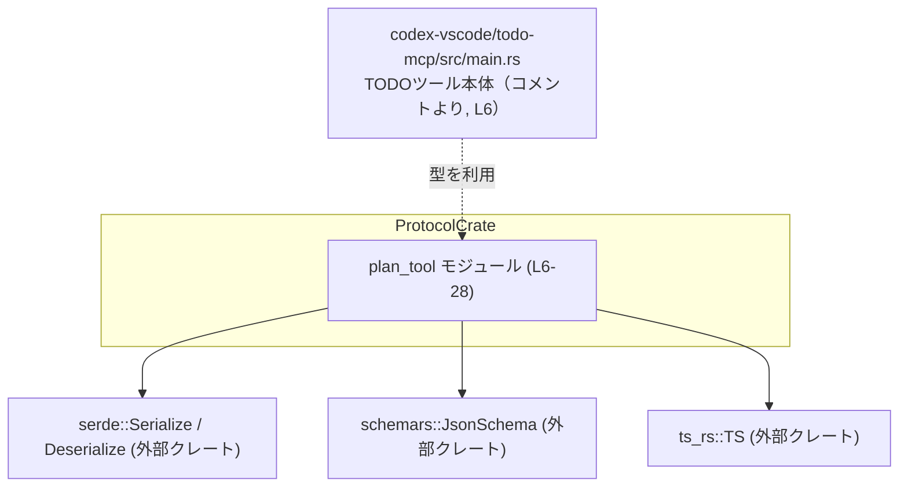
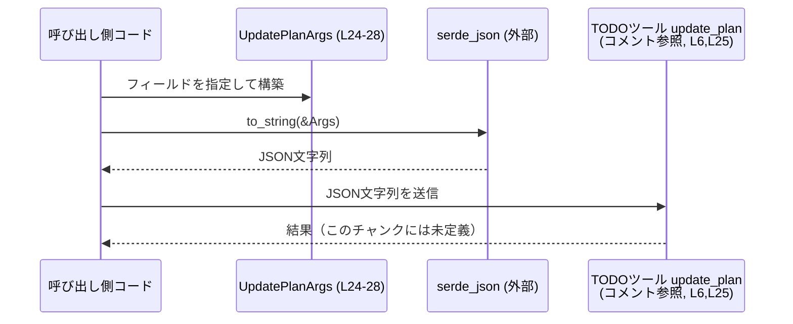

# protocol/src/plan_tool.rs コード解説

---

## 0. ざっくり一言

TODOツールの `update_plan`（チェックリスト）用に、**ステップの状態**と**計画更新リクエストの引数**を表すデータ型を定義したモジュールです（`StepStatus`, `PlanItemArg`, `UpdatePlanArgs`）。  
これらは Serde による JSON シリアライズ／デシリアライズと、JSON Schema／TypeScript 型生成に対応しています（`Serialize`, `Deserialize`, `JsonSchema`, `TS` の derive, `protocol/src/plan_tool.rs:L7,15,22`）。

---

## 1. このモジュールの役割

### 1.1 概要

- このモジュールは、**TODOツールの plan 更新用 API の引数**を表現するために存在し、以下の機能を提供します（`protocol/src/plan_tool.rs:L6,24-28`）。
  - 各ステップの状態を表す列挙体 `StepStatus`（`Pending` / `InProgress` / `Completed`）（`L9-12`）
  - 単一ステップの説明と状態を保持する構造体 `PlanItemArg`（`L17-20`）
  - 複数ステップと任意説明からなる更新リクエスト `UpdatePlanArgs`（`L24-28`）
- これらの型は Serde／schemars／ts-rs と連携し、**Rust ↔ JSON ↔ TypeScript** 間の型整合性を取りやすい形になっています（`L1-4,7,15,22`）。

### 1.2 アーキテクチャ内での位置づけ

このモジュール自身は純粋なデータ定義のみを行い、処理ロジックや I/O は持ちません。  
外部コード（TODOツール本体やクライアントコード）がこれらの型を使い、JSON 経由でやり取りすると考えられます（コメントより、`codex-vscode/todo-mcp/src/main.rs` と整合する型であることが示されています `L6`）。

依存関係の概略を Mermaid 図で表すと、次のようになります。



> 他の自前モジュール（例: `protocol/src/lib.rs` など）はこのチャンクには現れないため、不明です。

### 1.3 設計上のポイント

コードから読み取れる設計上の特徴は次のとおりです。

- **データキャリア専用のモジュール**  
  - 関数やメソッドは定義されておらず、すべてが列挙体・構造体によるデータ定義です（`L9-12,17-20,24-28`）。
- **シリアライズ／スキーマ／TS 型自動生成への対応**  
  - 全ての型で `Debug, Clone, Serialize, Deserialize, JsonSchema, TS` を derive しています（`L7,15,22`）。  
    これにより、デバッグ出力・値のコピー・JSON シリアライズ／デシリアライズ・JSON Schema・TypeScript 型生成に利用できます。
- **JSON 形式の厳格さ**  
  - `StepStatus` は `#[serde(rename_all = "snake_case")]` を指定しており、JSON では `"pending"`, `"in_progress"`, `"completed"` のような snake_case 文字列になります（`L8-12`）。
  - `PlanItemArg` と `UpdatePlanArgs` には `#[serde(deny_unknown_fields)]` が付いており、未知のフィールドを含む JSON はデシリアライズ時にエラーになります（`L16,23`）。
- **引数仕様の明確化**  
  - `UpdatePlanArgs` の doc コメントで、`update_plan` todo/checklist tool 向けの引数であり、「plan モードではない」ことが明示されています（`L25`）。
- **状態管理の表現**  
  - ステップの状態は `StepStatus` 列挙体で型安全に表現され、文字列の打ち間違い等をコンパイル時に防げます（`L9-12`）。

---

## 2. 主要な機能一覧（コンポーネントインベントリー）

このモジュールが提供する主要な「機能」は、すべてデータ型として表現されています。

| コンポーネント | 種別 | 定義位置 | 役割 / 概要 |
|----------------|------|----------|------------|
| `StepStatus` | 列挙体 | `protocol/src/plan_tool.rs:L9-12` | TODO ステップの状態を表す (`Pending` / `InProgress` / `Completed`) |
| `PlanItemArg` | 構造体 | `protocol/src/plan_tool.rs:L17-20` | 単一ステップの説明 (`step`) と状態 (`status`) を保持する引数 |
| `UpdatePlanArgs` | 構造体 | `protocol/src/plan_tool.rs:L24-28` | `update_plan` ツール呼び出し時の引数本体。オプションの説明と複数ステップの配列を持つ |

補足として、全ての型に共通の derive・属性は以下のとおりです（根拠: `L7-8,15-16,22-23`）。

| 対象型 | derive しているトレイト | serde 属性 |
|--------|------------------------|------------|
| `StepStatus` | `Debug, Clone, Serialize, Deserialize, JsonSchema, TS` | `rename_all = "snake_case"` |
| `PlanItemArg` | `Debug, Clone, Serialize, Deserialize, JsonSchema, TS` | `deny_unknown_fields` |
| `UpdatePlanArgs` | `Debug, Clone, Serialize, Deserialize, JsonSchema, TS` | `deny_unknown_fields`, `explanation` に `#[serde(default)]` |

---

## 3. 公開 API と詳細解説

### 3.1 型一覧（構造体・列挙体など）

#### `StepStatus`

| 項目 | 内容 |
|------|------|
| 種別 | 列挙体 |
| 定義位置 | `protocol/src/plan_tool.rs:L9-12` |
| フィールド | バリアントのみ: `Pending`, `InProgress`, `Completed` |
| derive | `Debug, Clone, Serialize, Deserialize, JsonSchema, TS`（`L7`） |
| serde 属性 | `#[serde(rename_all = "snake_case")]`（`L8`） |
| 役割 | ステップの進捗状態を 3 つの状態で表現します。JSON では `"pending"`, `"in_progress"`, `"completed"` という文字列になります。 |

#### `PlanItemArg`

| 項目 | 内容 |
|------|------|
| 種別 | 構造体 |
| 定義位置 | `protocol/src/plan_tool.rs:L17-20` |
| フィールド | `step: String`（ステップ内容）, `status: StepStatus`（状態） |
| derive | `Debug, Clone, Serialize, Deserialize, JsonSchema, TS`（`L15`） |
| serde 属性 | `#[serde(deny_unknown_fields)]`（`L16`） |
| 役割 | TODO プランの 1 ステップ分を表すデータです。JSON からのデシリアライズ時に、`step` と `status` 以外のフィールドがあるとエラーになります。 |

#### `UpdatePlanArgs`

| 項目 | 内容 |
|------|------|
| 種別 | 構造体 |
| 定義位置 | `protocol/src/plan_tool.rs:L24-28` |
| フィールド | `explanation: Option<String>`（任意の説明）, `plan: Vec<PlanItemArg>`（ステップ一覧） |
| derive | `Debug, Clone, Serialize, Deserialize, JsonSchema, TS`（`L22`） |
| serde 属性 | `#[serde(deny_unknown_fields)]`（`L23`）、`explanation` に `#[serde(default)]`（`L26`） |
| 役割 | `update_plan` TODO/checklist ツールに渡す引数本体です（`L25`）。`explanation` が省略された JSON でも、`serde(default)` により `None` としてデシリアライズされます。 |

### 3.2 関数詳細（最大 7 件）

このモジュールには、**明示的に定義された関数やメソッドは存在しません**（`protocol/src/plan_tool.rs:L1-28` に `fn` 定義がないため）。  
そのため、本セクションで詳細解説できる「公開 API 関数」はありません。

実際の処理（シリアライズ／デシリアライズなど）は、外部クレート（`serde`, `serde_json` など）が提供する関数を通じて行われますが、それらはこのファイルには定義されていません。

### 3.3 その他の関数

- 補助関数・ラッパー関数なども、このチャンクには定義されていません（`fn` キーワードが登場しないため）。

---

## 4. データフロー

このモジュールはデータ型だけを定義していますが、derive されているトレイトから、次のような典型的なデータフローで利用できます。

1. 呼び出し側コードが `UpdatePlanArgs` インスタンスを構築する（`L24-28`）。
2. `serde_json::to_string` 等を用いて JSON 文字列にシリアライズする（シリアライズ関数はこのチャンクには現れない）。
3. その JSON を TODO ツールの `update_plan` エンドポイント／ツールに渡す（`L6,25` のコメントから推測される利用形態）。

これをシーケンス図で表すと、次のようになります。



> 注意: `serde_json` や TODOツールとの通信方法（HTTP, IPC など）はこのチャンクには現れないため、不明です。上記は derive から可能な利用パターンの一例として示しています。

---

## 5. 使い方（How to Use）

### 5.1 基本的な使用方法

Rust コードから `UpdatePlanArgs` を構築し、JSON にシリアライズする最小例です。

```rust
use protocol::plan_tool::{StepStatus, PlanItemArg, UpdatePlanArgs}; // このモジュールの型をインポートする
use serde_json;                                                    // JSON シリアライズ用（外部クレート）

fn main() -> Result<(), Box<dyn std::error::Error>> {
    // 1つ目のステップ: まだ未着手
    let step1 = PlanItemArg {                      // PlanItemArg 構造体を作成（L17-20）
        step: "Write documentation".to_string(),   // ステップの説明文
        status: StepStatus::Pending,               // ステータス: Pending（L10）
    };

    // 2つ目のステップ: 進行中
    let step2 = PlanItemArg {
        step: "Implement feature X".to_string(),
        status: StepStatus::InProgress,            // ステータス: InProgress（L11）
    };

    // UpdatePlanArgs 全体を構築
    let args = UpdatePlanArgs {                    // UpdatePlanArgs 構造体を作成（L24-28）
        explanation: Some("Updated based on user feedback".to_string()), // 任意の説明（Option<String>）
        plan: vec![step1, step2],                  // ステップの配列
    };

    // JSON 文字列へシリアライズ（Serialize を derive しているため可能, L7,15,22）
    let json = serde_json::to_string_pretty(&args)?;
    println!("{json}");

    Ok(())
}
```

このコードを実行すると、概ね次のような JSON が出力されます（`StepStatus` が snake_case になる点に注意, `L8`）:

```json
{
  "explanation": "Updated based on user feedback",
  "plan": [
    {
      "step": "Write documentation",
      "status": "pending"
    },
    {
      "step": "Implement feature X",
      "status": "in_progress"
    }
  ]
}
```

### 5.2 よくある使用パターン

#### パターン1: 説明を省略したシンプルな更新

`explanation` には `#[serde(default)]` が付いているため（`L26`）、JSON に `explanation` フィールドがない場合でも `None` として扱われます。

```rust
use protocol::plan_tool::{StepStatus, PlanItemArg, UpdatePlanArgs};

fn simple_plan() -> UpdatePlanArgs {
    let step = PlanItemArg {
        step: "Review code".to_string(),
        status: StepStatus::Completed,     // 完了状態（L12）
    };

    UpdatePlanArgs {
        explanation: None,                 // 説明を付けないケース
        plan: vec![step],                  // 1件のみのステップ
    }
}
```

この `UpdatePlanArgs` を JSON にシリアライズすると、`explanation` は `null` として明示されるか、設定によってはフィールド自体を省略することも可能です（ここでは Serde 側の設定次第であり、このチャンクからは詳細は分かりません）。

#### パターン2: JSON からのデシリアライズ

クライアントから送られた JSON を `UpdatePlanArgs` に変換する例です。

```rust
use protocol::plan_tool::UpdatePlanArgs;
use serde_json;

fn parse_update_plan(json: &str) -> serde_json::Result<UpdatePlanArgs> {
    // deny_unknown_fields により、未知フィールドがあると Err になります（L23）
    serde_json::from_str::<UpdatePlanArgs>(json)
}
```

### 5.3 よくある間違い

#### 間違い1: StepStatus の JSON 値を PascalCase で送る

`StepStatus` には `#[serde(rename_all = "snake_case")]` が指定されています（`L8`）。  
そのため、JSON 側の値は `"Pending"` ではなく `"pending"` でなければなりません。

```jsonc
// 間違い例: PascalCase を使っている
{
  "plan": [
    {
      "step": "Write docs",
      "status": "Pending" // ❌ "pending" ではないためデシリアライズエラー
    }
  ]
}
```

```jsonc
// 正しい例: snake_case を使っている
{
  "plan": [
    {
      "step": "Write docs",
      "status": "pending" // ✅ StepStatus::Pending に対応（L10）
    }
  ]
}
```

#### 間違い2: 未知のフィールドを含む JSON を送る

`PlanItemArg` と `UpdatePlanArgs` は `#[serde(deny_unknown_fields)]` を持つため（`L16,23`）、定義されていないフィールドを含めるとデシリアライズ時にエラーになります。

```jsonc
// 間違い例: 未知のフィールド extra を含んでいる
{
  "explanation": "Test",
  "plan": [
    {
      "step": "Do something",
      "status": "pending",
      "extra": "unexpected" // ❌ PlanItemArg には存在しないフィールド（L17-20）
    }
  ]
}
```

```jsonc
// 正しい例: 定義されたフィールドのみ
{
  "explanation": "Test",
  "plan": [
    {
      "step": "Do something",
      "status": "pending"
    }
  ]
}
```

### 5.4 使用上の注意点（まとめ）

- **前提条件**
  - JSON からデシリアライズする際は、`StepStatus` の文字列が `pending`, `in_progress`, `completed` のいずれかである必要があります（`L8-12`）。
  - `PlanItemArg` と `UpdatePlanArgs` は未知のフィールドを許容しないため、送信する JSON は型定義と完全に一致させる必要があります（`L16,23`）。
- **エラー条件**
  - 未知のフィールドがある、`status` が不正な文字列である、`plan` が配列でない、といった JSON はデシリアライズ時にエラーになります（`deny_unknown_fields`, 列挙体バリアントにより）。
- **並行性**
  - `String`, `Vec`, シンプルな列挙体のみで構成されているため、通常はスレッド間共有も問題ありませんが（標準ライブラリ型の性質による）、このチャンクでは `Send` / `Sync` 境界は明示されていません。具体的な並行実行モデルは利用側コードに依存します。
- **セキュリティ**
  - `step` や `explanation` は任意の文字列を保持できるため、HTML に埋め込むなど表示先のコンテキストでは XSS 等に注意が必要です。  
    このモジュール側では入力検証やサニタイズは行っていません（単なるデータ定義のため）。

---

## 6. 変更の仕方（How to Modify）

### 6.1 新しい機能を追加する場合

新しい情報を plan に紐付けたい場合（例: 締め切り時間 `deadline` など）を想定します。

1. **どの型にフィールドを追加するか決める**
   - 単一ステップに関する情報であれば `PlanItemArg` に追加するのが自然です（`L17-20`）。
   - 全体のプランに関する情報（例: プロジェクト名）なら `UpdatePlanArgs` に追加します（`L24-28`）。

2. **フィールドを追加する**
   - 例: `PlanItemArg` に `pub deadline: Option<String>,` を追加するなど。

3. **serde 属性との整合性を確認**
   - `deny_unknown_fields` が付いているため、フィールドを追加すると **古いクライアントは新フィールドを認識できずエラーになる** 可能性があります。  
     前方互換性が重要な場合は、追加フィールドを `Option` とし、古いクライアント側はスキーマや TS 型の更新を必要とします。

4. **JSON Schema / TS 型生成への影響を確認**
   - `JsonSchema` / `TS` を derive しているため（`L15,22`）、フィールド追加は自動的にスキーマ・TS 型にも反映されます。  
     これにより、フロントエンドや他言語クライアントも更新が必要になります。

5. **呼び出し元コード・テストの更新**
   - 新フィールドをどのように初期化するか、既存テストやサンプル JSON を更新する必要があります。  
   - これらはこのチャンクには含まれていないため、別ファイルを確認する必要があります。

### 6.2 既存の機能を変更する場合

既存フィールドや列挙体バリアントを変更するときの注意点です。

- **影響範囲の確認**
  - `StepStatus` のバリアント名を変更・削除すると、対応する JSON 文字列も変わるため、すべてのクライアントに影響します（`L8-12`）。
  - `PlanItemArg.step` 型を変える（例: `String` → 独自型）と、JSON 形式や TS 型も変わります（`L17-20`）。

- **契約（前提条件・返り値の意味）**
  - このモジュールはデータ定義のみですが、**「status は 3値のいずれか」「plan はステップの配列」**という契約を暗黙に提供しています。  
    これを変える場合は、呼び出し側のロジック（進捗計算など）も必ず確認する必要があります。

- **テスト・スキーマの確認**
  - JSON Schema や TS 型出力を利用するテストや CI がある場合（このチャンクには現れませんが）、それらが失敗しないか確認する必要があります。

---

## 7. 関連ファイル

このモジュールと密接に関係しそうなファイルは、コメントから次のものが挙げられます。

| パス | 役割 / 関係 |
|------|------------|
| `codex-vscode/todo-mcp/src/main.rs` | コメントで「Types for the TODO tool arguments matching codex-vscode/todo-mcp/src/main.rs」とあり、このモジュールの型レイアウトがこのファイルと揃えられていることが示唆されています（`protocol/src/plan_tool.rs:L6`）。 |

> それ以外の関連ファイル（例: `protocol/src/lib.rs` や他のツール関連モジュール）は、このチャンクには現れないため不明です。
