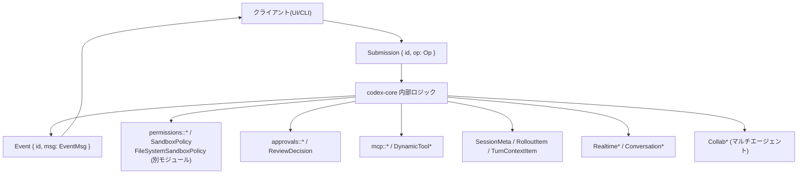
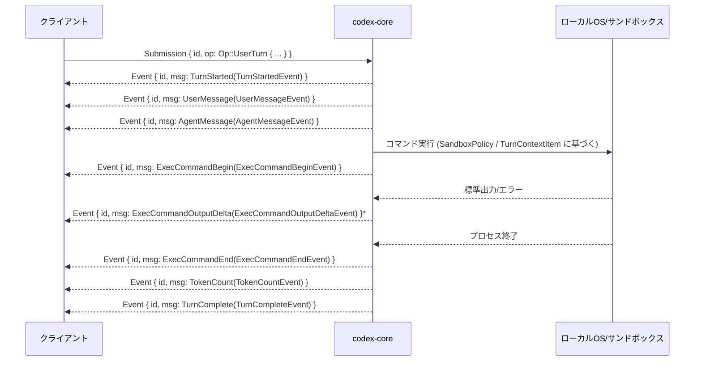
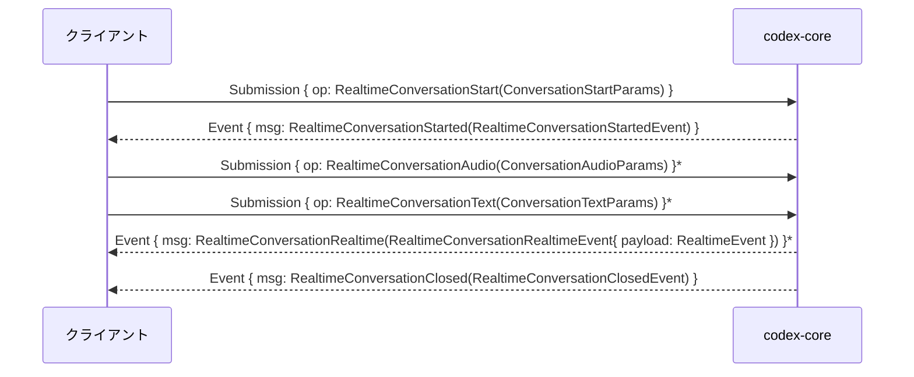

# protocol/src/protocol.rs コード解説

## 0. ざっくり一言

- Codex クライアントとエージェント間の「プロトコル」（送信キュー Submission / 受信キュー Event）の **ワイヤフォーマットを型安全に定義**するモジュールです。
- ユーザー操作、サンドボックス・権限設定、レビュー／ツール呼び出し、リアルタイム会話、マルチエージェント連携など、クライアントから見える Codex のほぼすべての操作・イベントのペイロード型が集約されています。

> 注意: この環境ではソースコードの正確な行番号情報が提供されていないため、ユーザー指定の `ファイル名:L開始-終了` 形式での行番号は記載できません。代わりに、型名・関数名とコメントを根拠として説明します。

---

## 1. このモジュールの役割

### 1.1 概要

- このモジュールは **Codex セッションのプロトコル**を定義し、クライアントとエージェント間でやり取りされるデータ構造を一元的に表現します（`Submission` / `Op` / `Event` / `EventMsg` など）。
- サンドボックスポリシーやファイルシステム権限、レビュー／承認フロー、MCP・動的ツール・スキル、リアルタイム会話、マルチエージェント協調など、**高レベル機能の入出力ペイロード**がここに集約されています。
- ほぼすべての型が `serde` / `schemars::JsonSchema` / `ts_rs::TS` を実装しており、**JSON シリアライズと TypeScript/JSON Schema のコード生成**の基礎になっています。

### 1.2 アーキテクチャ内での位置づけ

このモジュールは「プロトコル定義レイヤ」として、他モジュールと次のような関係を持ちます。



- **このファイル側で定義されるもの**
  - リクエスト: `Submission`, `Op`, `InterAgentCommunication` など
  - レスポンス: `Event`, `EventMsg` とそのペイロード群
  - セッション・履歴: `SessionMeta`, `RolloutItem`, `TurnContextItem`, `InitialHistory`
  - サンドボックス: `SandboxPolicy`, `ReadOnlyAccess`, `WritableRoot`
  - トークン・レート制限: `TokenUsage`, `TokenUsageInfo`, `RateLimitSnapshot` 等
  - レビュー／承認・コラボ関連: `AskForApproval`, `GranularApprovalConfig`, `ReviewDecision`, `Collab*Event` 等
- **他モジュールを再利用／再エクスポート**
  - `pub use crate::approvals::*;`
  - `pub use crate::permissions::*;`
  - `crate::mcp::*`, `crate::dynamic_tools::*`, `crate::items::*`, `crate::user_input::*` など  
    → それらの詳細定義はこのチャンクには現れませんが、プロトコル型の一部として使われています。

### 1.3 設計上のポイント

- **強い型付け + タグ付き enum によるプロトコル表現**
  - 例: `Op` / `EventMsg` いずれも `#[serde(tag = "type", rename_all = "snake_case")]` を持ち、JSON ペイロードの形を明示。
  - バージョン間互換性のための `alias` / `rename` を多用（`TurnStarted` の `task_started` 互換など）。
- **サンドボックス／権限を明示するモデル**
  - `SandboxPolicy`, `ReadOnlyAccess`, `WritableRoot` がローカル実行権限を詳細に表現。
  - 別モジュールの `FileSystemSandboxPolicy` / `NetworkSandboxPolicy` への「ブリッジ」がテストで検証されており、旧実装との意味的互換性を維持しています。
- **エラーハンドリングの方針**
  - 通信レベルのエラーは `ErrorEvent` / `CodexErrorInfo` としてクライアントへ通知。
  - ファイルシステム周りの異常は `tracing::error!` でログ出力し、**安全側に倒したフォールバック**（ルートを無視して続行）を取る実装が多いです。
- **非同期／ストリーミング前提の設計**
  - SQ/EQ パターンで非同期処理を前提としつつ、このモジュール自体は非同期実行を持たず、**純粋なデータモデル層**にとどまります。
  - リアルタイム会話用の `Realtime*` 型やストリーミングイベント (`*DeltaEvent`, `ExecCommandOutputDeltaEvent`) が定義されています。
- **後方互換性を意識したフィールド指定**
  - 多くのフィールドに `#[serde(default)]`, `skip_serializing_if` が付与され、旧ログや旧クライアントとの互換性を保ちつつフィールド追加が可能な設計です。

---

## 2. 主要な機能一覧

このモジュールが提供する主な機能は次の通りです。

- **セッションプロトコル**
  - `Submission` / `Op`: クライアントからエージェントへのリクエスト（送信キューエントリ）。
  - `Event` / `EventMsg`: エージェントからクライアントへのイベント（受信キューエントリ）。
- **リアルタイム会話**
  - `ConversationStartParams`, `ConversationAudioParams`, `ConversationTextParams` と `RealtimeEvent` 群による WebSocket/WebRTC ベースの会話ストリーム。
- **エージェントのサンドボックス / 権限**
  - `AskForApproval`, `GranularApprovalConfig`: コマンド実行時のユーザー承認ポリシー。
  - `SandboxPolicy`, `ReadOnlyAccess`, `WritableRoot`, `NetworkAccess`: ファイルシステム・ネットワーク権限モデル。
- **エラー／ステータス管理**
  - `CodexErrorInfo`, `ErrorEvent`, `StreamErrorEvent`, `AgentStatus` 等による状態・エラーの表現。
- **トークン・レート制限計測**
  - `TokenUsage`, `TokenUsageInfo`, `TokenCountEvent`, `RateLimitSnapshot`, `CreditsSnapshot` など。
- **履歴・セッションメタデータ**
  - `SessionMeta`, `SessionMetaLine`, `RolloutItem`, `RolloutLine`, `InitialHistory`, `TurnContextItem`, `TurnContextNetworkItem`。
- **レビュー・承認・コードパッチ**
  - `ReviewRequest`, `ReviewOutputEvent`, `ReviewFinding` 等のコードレビュー結果。
  - `ExecApproval*`, `PatchApproval`, `FileChange`, `Chunk`, `PatchApplyBeginEvent`, `PatchApplyEndEvent` 等。
- **ツール連携 / スキルシステム**
  - MCP: `McpInvocation`, `McpToolCallBeginEvent`, `McpToolCallEndEvent`, `McpListToolsResponseEvent`, `McpStartup*Event`。
  - 動的ツール: `DynamicToolCallRequest`, `DynamicToolCallResponseEvent`。
  - スキル: `SkillMetadata`, `SkillInterface`, `SkillDependencies`, `SkillsListEntry`, `ListSkillsResponseEvent`。
- **マルチエージェント協調 (Collab)**
  - `CollabAgentSpawn*Event`, `CollabAgentInteraction*Event`, `CollabWaiting*Event`, `CollabClose*Event`, `CollabResume*Event` と補助型。
- **リアルタイム音声 / 音声イベント**
  - `RealtimeVoice`, `RealtimeVoicesList`, `RealtimeAudioFrame`, `RealtimeTranscript*`。
- **その他ユーティリティ**
  - `SessionSource`, `Product`: セッションの起点やプロダクト制限。
  - `TruncationPolicy`: トークン／バイト数ベースのコンテキスト切り詰め。

---

## 3. 公開 API と詳細解説

### 3.1 型一覧（構造体・列挙体など）

> 行番号は不明なため、型名・コメントに基づき要約します。

#### プロトコルのエントリポイント

| 名前 | 種別 | 役割 / 用途 |
|------|------|-------------|
| `Submission` | 構造体 | 送信キューの 1 エントリ。`id` と操作本体 `op: Op`、任意の `trace: W3cTraceContext` を持ちます。 |
| `Op` | enum（非 exhaust） | クライアントがエージェントに依頼できる操作の総称。`UserInput`/`UserTurn`/`RealtimeConversation*`/`Review`/`ListSkills` など非常に多くのバリアントがあります。 |
| `Event` | 構造体 | 受信キューの 1 エントリ。対応する `Submission` の `id` と、`EventMsg` のペイロードを持ちます。 |
| `EventMsg` | enum | エージェントからクライアントへの通知全般。`Error`/`TurnStarted`/`AgentMessage`/`ExecCommandBegin`/`PatchApplyEnd`/`PlanUpdate`/`Collab*` 等、多数のバリアント。 |
| `W3cTraceContext` | 構造体 | W3C Trace Context の `traceparent` / `tracestate` を運ぶためのコンテキストキャリア。非同期ハンドオフ間でトレース ID を伝搬します。 |
| `InterAgentCommunication` | 構造体 | `author` / `recipient` / `other_recipients` と `content` を持つエージェント間通信のペイロード。通常のターンと同じライフサイクルで記録されます。 |

#### サンドボックス／権限関連

| 名前 | 種別 | 役割 / 用途 |
|------|------|-------------|
| `AskForApproval` | enum | コマンド実行時にユーザーへ承認を求める条件を表現（`UnlessTrusted` / `OnRequest` / `Granular` / `Never` など）。 |
| `GranularApprovalConfig` | 構造体 | 承認カテゴリごとの ON/OFF を行う設定（サンドボックス承認、スキル実行、`request_permissions`、MCP elicitation 等）。 |
| `NetworkAccess` | enum | `Restricted`/`Enabled` によるネットワーク許可状態を表現。 |
| `ReadOnlyAccess` | enum | 読み取り専用アクセスのモード。`Restricted { include_platform_defaults, readable_roots }` または `FullAccess`。 |
| `SandboxPolicy` | enum | モデルが実行するシェルコマンドのディスク／ネットワーク権限。`DangerFullAccess`, `ReadOnly`, `ExternalSandbox`, `WorkspaceWrite` を持つ。 |
| `WritableRoot` | 構造体 | 書き込み可能なルートパスと、その下であっても読み取り専用とするサブパス群 (`read_only_subpaths`) のペア。 |
| `FileSystemSandboxPolicy` | 別モジュール | 本モジュールから `FromStr` 実装のみ見えますが、テストからレガシー `SandboxPolicy` との相互変換が行われていることが分かります。 |
| `NetworkSandboxPolicy` | 別モジュール | ネットワークサンドボックスポリシー。こちらも `FromStr` とテスト経由で利用されています。 |

#### セッション・履歴・コンテキスト

| 名前 | 種別 | 役割 / 用途 |
|------|------|-------------|
| `SessionSource` | enum | セッションがどこから起動されたか (`Cli`, `VSCode`, `Exec`, `Mcp`, `Custom`, `SubAgent`) を表します。 |
| `SubAgentSource` | enum | サブエージェントの起源（レビュー、コンパクト、`ThreadSpawn`, `MemoryConsolidation` 等）。 |
| `SessionMeta` | 構造体 | スレッド ID、`cwd`, 起動元、CLI バージョン、`source`, モデル情報、`base_instructions`, `dynamic_tools` など、セッションレベルのメタデータ。 |
| `SessionMetaLine` | 構造体 | `SessionMeta` とオプションの `GitInfo` を 1 行のロールアウトとして保持。 |
| `GitInfo` | 構造体 | `branch` や `commit_hash(GitSha)`,`repository_url` などの Git 情報。 |
| `RolloutItem` | enum | ロールアウトファイル内の 1 エントリ。`SessionMeta`, `ResponseItem`, `Compacted`, `TurnContext`, `EventMsg` のいずれか。 |
| `RolloutLine` | 構造体 | タイムスタンプ + `RolloutItem`。 |
| `InitialHistory` | enum | 新規／クリア済み／復元 (Resumed)／Forked など、スレッド初期状態の履歴の表現とヘルパ。 |
| `ResumedHistory` | 構造体 | 再開された履歴 (`conversation_id`, `history`, `rollout_path`)。 |
| `TurnContextItem` | 構造体 | モデルから見える「ターンコンテキスト」情報（`cwd`, `approval_policy`, `sandbox_policy`, `model`, `summary`, 各種 instructions, `truncation_policy` 等）。 |
| `TurnContextNetworkItem` | 構造体 | ネットワークアクセスの許可／拒否ドメインリスト。 |
| `TruncationPolicy` | enum | `Bytes(limit)` または `Tokens(limit)` のコンテキスト切り詰めポリシー。approx トークン/バイト変換のヘルパを持ちます。 |

#### トークン／レート制限

| 名前 | 種別 | 役割 / 用途 |
|------|------|-------------|
| `TokenUsage` | 構造体 | `input_tokens`, `cached_input_tokens`, `output_tokens`, `reasoning_output_tokens`, `total_tokens` をまとめた使用量情報。 |
| `TokenUsageInfo` | 構造体 | セッション全体の合計 (`total_token_usage`) と直近ターン (`last_token_usage`) + `model_context_window`。 |
| `TokenCountEvent` | 構造体 | `EventMsg::TokenCount` のペイロード。`info` とオプションの `RateLimitSnapshot`。 |
| `RateLimitSnapshot` | 構造体 | レート制限の状態（主／副ウィンドウ、クレジット、プランタイプなど）。 |
| `RateLimitWindow` | 構造体 | レート制限ウィンドウ 1 つの `used_percent`, `window_minutes`, `resets_at`。 |
| `CreditsSnapshot` | 構造体 | クレジット利用状況 (`has_credits`, `unlimited`, `balance`)。 |
| `FinalOutput` | 構造体 | 最終出力に添付されるトークン使用量ラッパ。`Display` 実装で人間向けテキストを整形。 |

#### レビュー／承認／パッチ

| 名前 | 種別 | 役割 / 用途 |
|------|------|-------------|
| `ReviewTarget` | enum | レビュー対象（未コミット変更、ベースブランチとの差分、特定コミット、カスタム指示）。 |
| `ReviewRequest` | 構造体 | `Op::Review` のペイロード。レビュー対象とオプションのヒント。 |
| `ReviewOutputEvent` | 構造体 | レビュー結果（findings 配列、全体評価テキスト、信頼度スコア）。 |
| `ReviewFinding` | 構造体 | 個々のレビュー指摘（タイトル、本文、confidence, priority, `ReviewCodeLocation`）。 |
| `ReviewCodeLocation` | 構造体 | ファイルパスと行範囲 (`ReviewLineRange`)。 |
| `ReviewLineRange` | 構造体 | 開始／終了行番号。 |
| `ReviewDelivery` | enum | レビュー結果をコード中に「インライン」または「別枠」で届けるか。 |
| `ReviewDecision` | enum | 承認リクエストに対するユーザー決定。承認／セッション内承認／ネットワークポリシー更新／拒否／タイムアウト／Abort など。 |
| `FileChange` | enum | パッチ対象ファイルの変更内容（`Add`, `Delete`, `Update{ unified_diff, move_path }`）。 |
| `Chunk` | 構造体 | 差分チャンク（元ファイルの開始行 index, 削除行/挿入行）。 |

#### コマンド実行／ターミナル

| 名前 | 種別 | 役割 / 用途 |
|------|------|-------------|
| `ExecCommandSource` | enum | コマンドの起源（エージェント、ユーザーシェル、UnifiedExec 起動／インタラクション）。 |
| `ExecCommandStatus` | enum | 実行結果ステータス（Completed/Failed/Declined）。 |
| `ExecCommandBeginEvent` | 構造体 | コマンド開始イベント (`call_id`, `process_id`, `turn_id`, `command`, `cwd`, `parsed_cmd`, `source` 等)。 |
| `ExecCommandEndEvent` | 構造体 | コマンド終了イベント（`stdout`/`stderr`/`aggregated_output`/`exit_code`/`duration`/`status` など）。 |
| `ExecOutputStream` | enum | 出力ストリームの種類（Stdout/Stderr）。 |
| `ExecCommandOutputDeltaEvent` | 構造体 | base64 エンコードされた出力チャンク。 |
| `TerminalInteractionEvent` | 構造体 | 統合 Exec セッションに対する `stdin` 入力・`process_id`。 |

#### リアルタイム会話／音声

| 名前 | 種別 | 役割 / 用途 |
|------|------|-------------|
| `ConversationStartParams` | 構造体 | Realtime 会話開始パラメータ（prompt, session_id, transport, voice）。`prompt` は `Option<Option<String>>` で三値を表現。 |
| `ConversationStartTransport` | enum | Realtime 会話のトランスポート（Websocket / WebRTC{ sdp }）。 |
| `RealtimeVoice` | enum | 利用可能な音声スタイル一覧。`wire_name` で API 名文字列に変換。 |
| `RealtimeVoicesList` | 構造体 | v1/v2 の音声リストと各デフォルト。`builtin()` でビルトイン一覧を返す。 |
| `RealtimeAudioFrame` | 構造体 | 音声フレーム（base64 など任意の `data`, `sample_rate`, `num_channels` 等）。 |
| `RealtimeEvent` | enum | Realtime セッション内でのイベント（セッション更新、音声出力、トランスクリプト増分など）。 |
| `RealtimeConversationStartedEvent` ほか | 構造体 | Realtime 会話開始／ストリーム中／終了／SDP 交換などの EventMsg ペイロード。 |

#### マルチエージェント・コラボレーション

| 名前 | 種別 | 役割 / 用途 |
|------|------|-------------|
| `AgentStatus` | enum | エージェントのライフサイクル状態（PendingInit/Running/Interrupted/Completed/Errored/Shutdown/NotFound）。 |
| `CollabAgentSpawnBeginEvent` / `CollabAgentSpawnEndEvent` | 構造体 | 新規エージェント生成開始／終了イベント。 |
| `CollabAgentRef` | 構造体 | 協調対象エージェントの参照（thread_id, agent_nickname, agent_role）。 |
| `CollabAgentStatusEntry` | 構造体 | エージェントごとの最終ステータス。 |
| `CollabAgentInteraction*Event` | 構造体 | エージェント間のやりとり開始／終了と prompts。 |
| `CollabWaiting*Event` | 構造体 | 複数エージェントの完了待ちを表すイベント。 |
| `CollabClose*Event`, `CollabResume*Event` | 構造体 | コラボセッションのクローズ／再開に関するイベント。 |

上記以外にも、多数の `*Event` 型（`TokenCountEvent`, `StreamErrorEvent`, `McpStartup*Event` 等）が `EventMsg` のバリアントごとに 1:1 で定義されています。

---

### 3.2 重要な関数の詳細解説（最大 7 件）

ここでは、特に **安全性・エラー処理・権限制御** に関わる代表的な関数を取り上げます。

---

#### `SandboxPolicy::get_writable_roots_with_cwd(&self, cwd: &Path) -> Vec<WritableRoot>`

**概要**

- 現在のサンドボックスポリシーと作業ディレクトリ `cwd` をもとに、**実際に書き込み可能なルートディレクトリ群**と、その配下で「読み取り専用とすべきサブパス」を計算します。
- パッチ適用やファイル編集ツールが「どこまで書いてよいか」を判断するための中核ロジックです。

**引数**

| 引数名 | 型 | 説明 |
|--------|----|------|
| `self` | `&SandboxPolicy` | 現在のサンドボックスポリシー。 |
| `cwd` | `&Path` | セッションの現在の作業ディレクトリ。できるだけ絶対パスが期待されています。 |

**戻り値**

- `Vec<WritableRoot>`: 各書き込み可能ルートと、その下で読み取り専用にすべきサブパス (`read_only_subpaths`) のリスト。

**内部処理の流れ（アルゴリズム）**

1. `match self` でポリシー種別ごとに分岐。
   - `DangerFullAccess` / `ExternalSandbox` / `ReadOnly` の場合は、**空ベクタ**を返します（この場合は「ファイルシステム全体が書き込み可能／不可能」であり、個別ルートの列挙は不要という扱いです）。
2. `WorkspaceWrite` の場合のみ詳細計算を実施:
   1. `writable_roots` フィールドのクローンからスタート。
   2. `cwd` を `AbsolutePathBuf::from_absolute_path(cwd)` で絶対パスに変換し、成功した場合は書き込み可能ルートに追加。失敗した場合は `tracing::error!` でログを出し、`cwd` は書き込みルートに含めません。
   3. Unix 環境かつ `exclude_slash_tmp == false` のとき、`"/tmp"` ディレクトリが存在すればそれも書き込みルートに追加（`expect("/tmp is absolute")` により `/tmp` が絶対でない場合は panic）。
   4. `exclude_tmpdir_env_var == false` かつ `TMPDIR` 環境変数が定義されていれば、そのパスも絶対化し、成功すれば書き込みルートに追加。失敗時は `error!` ログを出しスキップ。
   5. 最終的な `roots: Vec<AbsolutePathBuf>` に対し、各ルートごとに `default_read_only_subpaths_for_writable_root` を呼び出して「読み取り専用サブパス」を算出し、`WritableRoot { root, read_only_subpaths }` に変換して返します。

**Examples（使用例）**

```rust
use std::path::Path;
use protocol::SandboxPolicy;           // クレート名は仮
use protocol::WritableRoot;

fn list_writable_roots(policy: &SandboxPolicy) {
    let cwd = Path::new("/home/user/project");    // 絶対パスが望ましい
    let roots: Vec<WritableRoot> = policy.get_writable_roots_with_cwd(cwd);

    for root in roots {
        println!("Writable root: {}", root.root.as_path().display());
        for ro in &root.read_only_subpaths {
            println!("  read-only subpath: {}", ro.as_path().display());
        }
    }
}
```

**Errors / Panics**

- `WorkspaceWrite` の場合:
  - `AbsolutePathBuf::from_absolute_path(cwd)` が失敗した場合: panic ではなく `error!` ログを出して `cwd` を WritableRoot へ追加しません。
  - Unix + `exclude_slash_tmp == false` の場合、`AbsolutePathBuf::from_absolute_path("/tmp")` に対する `expect` により、ここが失敗すると panic します。ただし通常の Unix では `/tmp` は有効な絶対パスである想定です。

**Edge cases（エッジケース）**

- `SandboxPolicy::DangerFullAccess` / `ExternalSandbox` / `ReadOnly` の場合、**常に空の Vec を返す**ため、「全て書ける／全く書けない」ポリシーを別レイヤで判定する前提です。
- `cwd` が相対パスや OS 的に不正なパスのときは、`WritableRoot` に含まれず、書き込み許可範囲が意図より狭くなる可能性があります。
- `TMPDIR` が不正なパスだった場合も、ログを出してそのルートを無視します。

**使用上の注意点**

- 呼び出し側は **`has_full_disk_write_access` と組み合わせて解釈**する必要があります。`get_writable_roots_with_cwd` が空でも、ポリシーによっては「すべて書き込み可」を意味します。
- `cwd` はできるだけ `AbsolutePathBuf` へ変換可能な絶対パスになるよう、上位レイヤで正規化してから渡すと安全です。
- `/tmp` や `TMPDIR` を含めたくない場合は `exclude_slash_tmp` / `exclude_tmpdir_env_var` を明示的に `true` にしてポリシーを構築します。

---

#### `default_read_only_subpaths_for_writable_root(writable_root: &AbsolutePathBuf, protect_missing_dot_codex: bool) -> Vec<AbsolutePathBuf>`

**概要**

- 1 つの書き込み可能ルートに対し、**セキュリティ上保護すべきディレクトリ（`.git`, `.agents`, `.codex`）を読み取り専用サブパスとして列挙**します。
- `.git` がファイルの場合は Git の `gitdir` ポインタを解決し、その実際のリポジトリパスも保護対象とします。

**引数**

| 引数名 | 型 | 説明 |
|--------|----|------|
| `writable_root` | `&AbsolutePathBuf` | 書き込み可能ルート。 |
| `protect_missing_dot_codex` | `bool` | ルート直下に `.codex` ディレクトリがまだ存在しなくても保護対象とするかどうか。 |

**戻り値**

- `Vec<AbsolutePathBuf>`: 読み取り専用とすべきサブディレクトリの絶対パス一覧（重複は除去済み）。

**内部処理の流れ**

1. `writable_root.join(".git")` を `top_level_git` として取得。
2. `top_level_git` がファイルかディレクトリかを判定。
   - ファイルで、かつ `is_git_pointer_file(&top_level_git)` が `true` の場合は、`resolve_gitdir_from_file(&top_level_git)` を呼び、その結果の `gitdir` を保護対象に追加。
   - ファイルまたはディレクトリいずれであっても、`.git` 自体を保護対象に追加。
3. `writable_root.join(".agents")` がディレクトリであれば保護対象に追加。
4. `writable_root.join(".codex")` について、`protect_missing_dot_codex == true` またはディレクトリが実在する場合に保護対象に追加。
5. `HashSet` を用いて重複を除去し、結果を返す。

**Examples**

```rust
use codex_utils_absolute_path::AbsolutePathBuf;

fn protect_paths(root: &AbsolutePathBuf) -> Vec<AbsolutePathBuf> {
    // 初回作成前も .codex を保護したい場合
    default_read_only_subpaths_for_writable_root(root, true)
}
```

**Errors / Panics**

- この関数自体は panic しません。
- 内部で呼び出す `resolve_gitdir_from_file` がエラー時に `None` を返し、ログ出力するのみです。

**Edge cases**

- `.git` が存在しないリポジトリルートでは、Git 関連の保護サブパスは追加されません。
- `.codex` ディレクトリが存在しない場合でも、`protect_missing_dot_codex == true` なら保護対象になります（初回作成も保護フローを通すため）。

**使用上の注意点**

- `WritableRoot` の `read_only_subpaths` はこの関数の結果に依存するため、**権限モデルのセキュリティ要件を変更する場合はこの関数の振る舞いも確認**する必要があります。

---

#### `resolve_gitdir_from_file(dot_git: &AbsolutePathBuf) -> Option<AbsolutePathBuf>`

**概要**

- `.git` ファイルに書かれた `gitdir` ポインタを解析し、**実際の Git ディレクトリ（`gitdir`）への絶対パスを解決**します。
- `.git` ファイルの中身が期待通りでない場合や、解決したパスが存在しない場合は `None` を返し、`tracing::error!` で詳細をログ出力します。

**引数**

| 引数名 | 型 | 説明 |
|--------|----|------|
| `dot_git` | `&AbsolutePathBuf` | `.git` ファイルへの絶対パス。 |

**戻り値**

- `Option<AbsolutePathBuf>`: 成功時は `gitdir` の絶対パス。失敗時は `None`。

**内部処理の流れ**

1. `std::fs::read_to_string(dot_git.as_path())` で `.git` ファイルを読み込む。失敗時はエラーログを出し、`None` を返す。
2. 読み込んだ内容を `trim()` し、`split_once(':')` で `gitdir: <path>` 形式を期待してパース。
   - `split_once` が失敗した場合や `gitdir_raw` が空文字の場合はエラーログを出し `None`。
3. `.git` ファイルの親ディレクトリを `base` として取得。なければエラーログを出して `None`。
4. `AbsolutePathBuf::resolve_path_against_base(gitdir_raw, base)` で `gitdir_raw` を絶対パスに解決。
5. 解決したパスが存在しなければエラーログを出し `None`。
6. すべて成功したら `Some(gitdir_path)` を返す。

**Examples**

```rust
use codex_utils_absolute_path::AbsolutePathBuf;

fn gitdir_or_none(dot_git_path: &str) -> Option<AbsolutePathBuf> {
    let dot_git = AbsolutePathBuf::from_absolute_path(dot_git_path).ok()?;
    resolve_gitdir_from_file(&dot_git)
}
```

**Errors / Panics**

- 失敗ケースはいずれも `error!` ログを出した上で `None` を返し、panic はしません。
- 想定外フォーマットの `.git` ファイルに対しても、エラーとして処理されます。

**Edge cases**

- `.git` ファイルが非常に大きい場合でも `read_to_string` で読み込んでしまうため、パフォーマンスに影響する可能性がありますが、通常 `.git` ポインタは小さいテキストです。
- `gitdir` が絶対パスか相対パスかは問いませんが、`resolve_path_against_base` の仕様に依存します（本チャンクからは詳細不明）。

**使用上の注意点**

- `.git` がディレクトリの場合はこの関数は呼ばれず、単にそのディレクトリ自体が読み取り専用サブパスになります。
- 安全側に倒す設計のため、`.git` の形式が正しくないと「保護されない」ではなく「保護しないがログは出す」振る舞いになる点を把握しておく必要があります（この関数の戻り値が `None` でも `.git` 自体は別途保護対象に追加されています）。

---

#### `ReadOnlyAccess::get_readable_roots_with_cwd(&self, cwd: &Path) -> Vec<AbsolutePathBuf>`

**概要**

- 読み取り専用アクセスモードに応じて、**実際に読み取り可能なルートディレクトリ一覧を返す**ヘルパです。
- `SandboxPolicy::get_readable_roots_with_cwd` から再利用されます。

**引数**

| 引数名 | 型 | 説明 |
|--------|----|------|
| `self` | `&ReadOnlyAccess` | 読み取り専用アクセスモード。 |
| `cwd` | `&Path` | 作業ディレクトリ。 |

**戻り値**

- `Vec<AbsolutePathBuf>`: 読み取り可能ルートの絶対パス。`FullAccess` の場合は空ベクタ（「制限なし」を意味）。

**内部処理の流れ**

1. `match self` で分岐。
   - `ReadOnlyAccess::FullAccess` → すぐに `Vec::new()` を返す（呼び出し側は「全ディスク読み取り可」と解釈）。
   - `ReadOnlyAccess::Restricted { readable_roots, .. }` →
     1. `readable_roots.clone()` から `roots` を構築。
     2. `AbsolutePathBuf::from_absolute_path(cwd)` が成功した場合は `cwd` を読み取りルートに追加。失敗時は `error!` ログのみ。
2. `HashSet` で重複パスを除外して返す。

**Examples**

```rust
use std::path::Path;
use protocol::ReadOnlyAccess;
use codex_utils_absolute_path::AbsolutePathBuf;

fn show_read_roots(access: &ReadOnlyAccess, cwd: &Path) {
    for root in access.get_readable_roots_with_cwd(cwd) {
        println!("Readable: {}", root.as_path().display());
    }
}
```

**Errors / Panics**

- `cwd` が不正な場合はログ出力のみでスキップされ、panic はしません。

**Edge cases**

- `FullAccess` モードでは空リストを返すため、「読み取り可能かどうか」は **`has_full_disk_read_access` と組み合わせて見る必要**があります。

**使用上の注意点**

- `readable_roots` に追加したルートが `cwd` の祖先／子孫であっても特別扱いはなく、単純な集合として扱われます。
- 呼び出し側で `HashSet` による重複削除済みである点を前提にして良いです。

---

#### `TokenUsage::percent_of_context_window_remaining(&self, context_window: i64) -> i64`

**概要**

- モデルのコンテキストウィンドウサイズと現在の `TokenUsage` から、**ユーザーがコントロール可能な分として残っている割合 (0–100%)** を概算します。
- システムプロンプトや固定ツール説明など、常に存在するトークン消費を `BASELINE_TOKENS` として控除している点が特徴です。

**引数**

| 引数名 | 型 | 説明 |
|--------|----|------|
| `self` | `&TokenUsage` | 現在までのトークン使用状況。 |
| `context_window` | `i64` | モデルの総コンテキストウィンドウサイズ。 |

**戻り値**

- `i64`: 残り割合（0〜100）。コンテキストウィンドウが小さすぎる場合などには 0 を返します。

**内部処理の流れ**

1. `context_window <= BASELINE_TOKENS`（12000）なら 0 を返す。
2. `effective_window = context_window - BASELINE_TOKENS`（ユーザーが実質的に使える部分）。
3. `used = max(tokens_in_context_window() - BASELINE_TOKENS, 0)` を計算。
4. `remaining = max(effective_window - used, 0)`。
5. `remaining as f64 / effective_window as f64 * 100.0` を 0〜100 に clamp し、四捨五入して返す。

**Examples**

```rust
use protocol::TokenUsage;

fn remaining_ratio(usage: &TokenUsage, ctx: i64) -> i64 {
    usage.percent_of_context_window_remaining(ctx)
}
```

**Errors / Panics**

- 整数オーバーフロー等は `i64` の範囲内で行われる計算のため、通常のモデルサイズであれば問題ありません。
- panic はしません。

**Edge cases**

- `context_window` が `BASELINE_TOKENS` 以下の場合:
  - すでに固定プロンプトだけで窓が埋まっている扱いとなり、0% を返します。
- `tokens_in_context_window()` が `BASELINE_TOKENS` 未満の場合:
  - まだユーザーによる消費がゼロまたは少ないため、100% 近い値を返します。

**使用上の注意点**

- これはあくまで **概算** です。実際のモデル実装とトークナイザに依存するため、UI 表示用の「ガイド」として利用するのが前提です。

---

#### `SessionSource::from_startup_arg(value: &str) -> Result<Self, &'static str>`

**概要**

- CLI などから渡されたセッション起動元文字列を解析し、`SessionSource` enum に変換します。
- 既知の値 (`cli`, `vscode`, `exec`, `mcp`, `unknown`) は専用バリアントに、それ以外は `Custom(normalized)` として扱われます。

**引数**

| 引数名 | 型 | 説明 |
|--------|----|------|
| `value` | `&str` | ユーザーから渡されたセッションソース文字列。 |

**戻り値**

- `Result<SessionSource, &'static str>`: 成功時は `SessionSource`、空文字など不正な場合はエラーメッセージ文字列。

**内部処理の流れ**

1. `let trimmed = value.trim();` で前後空白を削除。
2. `trimmed.is_empty()` なら `Err("session source must not be empty")` を返す。
3. `trimmed.to_ascii_lowercase()` で小文字化した `normalized` を作る。
4. `match normalized.as_str()` で既知値を判定し、それ以外は `SessionSource::Custom(normalized)` を返す。

**Examples**

```rust
use protocol::SessionSource;

fn parse_source(arg: &str) -> SessionSource {
    SessionSource::from_startup_arg(arg).unwrap_or(SessionSource::Unknown)
}

assert_eq!(parse_source("vscode"), SessionSource::VSCode);
assert_eq!(
    parse_source(" Atlas "),
    SessionSource::Custom("atlas".to_string())
);
```

**Errors / Panics**

- `value` が空文字（trim 後）だった場合に `Err` を返しますが、panic はしません。
- 呼び出し側で `unwrap()` すれば panic しうるため、エラーを明示的にハンドリングするのが想定です。

**Edge cases**

- 大文字／小文字・前後空白があっても正規化されます。
- 未知の値は `Custom(..)` になりますが、その後 `restriction_product()` で既知の `Product` へマッピングを試みる設計です。

**使用上の注意点**

- 「空文字は許可しない」契約が既にここで強制されています。起動オプションのバリデーションで使う場合、その制約もユーザーに説明する必要があります。

---

#### `ReviewDecision::to_opaque_string(&self) -> &'static str`

**概要**

- `ReviewDecision` の内容を **PII を含まない「不透明な短い文字列」に変換**します。
- 承認内容（特に `ExecPolicyAmendment` や `NetworkPolicyAmendment` の詳細）をログやテレメトリに載せず、ステータスだけを記録するためのヘルパです。

**引数**

| 引数名 | 型 | 説明 |
|--------|----|------|
| `self` | `&ReviewDecision` | 承認・拒否などの決定内容。 |

**戻り値**

- `&'static str`: `"approved"`, `"approved_with_amendment"`, `"approved_for_session"`, `"approved_with_network_policy_allow"` 等の固定文字列。

**内部処理の流れ**

- `match self` で各バリアントを分類し、詳細フィールド（例: `proposed_execpolicy_amendment` や `network_policy_amendment` の中身）を見ずに定数文字列を返します。
- `NetworkPolicyAmendment` だけは `NetworkPolicyRuleAction::Allow`/`Deny` によって `"approved_with_network_policy_allow"` / `"denied_with_network_policy_deny"` を返しますが、ホスト名などの実データは一切含めません。

**Examples**

```rust
use protocol::{ReviewDecision, NetworkPolicyRuleAction, NetworkPolicyAmendment};

fn log_decision(decision: &ReviewDecision) {
    println!("decision={}", decision.to_opaque_string());
}
```

**Errors / Panics**

- panic はありません。

**Edge cases**

- 新しいバリアントを `ReviewDecision` に追加した場合は、この関数も更新しないと `non_exhaustive` ではないためコンパイルエラーになります（安全側）。

**使用上の注意点**

- ログやメトリクスには **`to_opaque_string` の結果のみ**を使い、決定内容の詳細（ポリシー中のパスやホスト名など）を直接記録しない設計にすることで、プライバシー／セキュリティリスクを抑えられます。

---

#### `CodexErrorInfo::affects_turn_status(&self) -> bool` / `ErrorEvent::affects_turn_status(&self) -> bool`

**概要**

- あるエラーが「ターンを失敗扱いとして履歴にマークすべきか」を判定する関数です。
- `ErrorEvent` 自体は `codex_error_info: Option<CodexErrorInfo>` を持ち、`None` のときは「影響しない」と見なします。

**引数**

| 関数 | 引数 | 説明 |
|------|------|------|
| `CodexErrorInfo::affects_turn_status` | `&self` | エラー種別。 |
| `ErrorEvent::affects_turn_status` | `&self` | エラーイベント。内部で `self.codex_error_info.as_ref().is_none_or(CodexErrorInfo::affects_turn_status)` を呼びます。 |

**戻り値**

- `bool`: `true` ならターンを「失敗」とマークすべき、`false` ならステータスに影響を与えない。

**内部処理の流れ（CodexErrorInfo 版）**

- `match self` で分岐し、`ThreadRollbackFailed` と `ActiveTurnNotSteerable { .. }` のみ `false`、それ以外のほとんどのエラー（ContextWindowExceeded/ServerOverloaded/ResponseStreamDisconnected/...）は `true` を返します。

**Examples**

```rust
use protocol::{ErrorEvent, CodexErrorInfo};

fn should_mark_failed(error: &ErrorEvent) -> bool {
    error.affects_turn_status()
}
```

**Errors / Panics**

- ありません。

**Edge cases**

- `ErrorEvent` の `codex_error_info` が `None` の場合は `true` ではなく `false` を返す実装 (`is_none_or`) です。つまり「他の情報からステータスを判断するか、デフォルトで影響なし」と解釈されます。

**使用上の注意点**

- 履歴リプレイ時に「どのターンをエラーとして扱うか」を再現するための契約なので、この関数の仕様変更は必ずテスト（本ファイル末尾に既にいくつかあります）と合わせて慎重に行う必要があります。

---

### 3.3 その他の関数・トレイト

補助的なもの／単純なラッパーの例を挙げます。

| 関数/メソッド | 役割（1 行） |
|---------------|--------------|
| `RealtimeVoicesList::builtin()` | Realtime 音声の標準リストを返す（テストで固定値として検証済み）。 |
| `InterAgentCommunication::new` | エージェント間通信メッセージを組み立てるコンストラクタ。 |
| `InterAgentCommunication::to_response_input_item` | 自身を JSON 文字列に直列化し、`ResponseInputItem::Message` に変換。シリアライズ失敗時は空文字列でフォールバック。 |
| `InterAgentCommunication::from_message_content` | `ContentItem` 配列から自分自身を JSON デシリアライズする。 |
| `WritableRoot::is_path_writable` | 与えられたパスがルート配下かついずれの `read_only_subpaths` にも属さないかどうかを判定。 |
| `TokenUsageInfo::new_or_append` | 既存の `TokenUsageInfo` に新しい `TokenUsage` を加算しつつ、`model_context_window` を更新するユーティリティ。 |
| `TruncationPolicy::token_budget` / `byte_budget` | バイト数モードとトークン数モードの間の概算変換。 |
| `Mul<f64> for TruncationPolicy` | トークン／バイト予算を倍数でスケーリングする演算子実装。 |
| `HasLegacyEvent::as_legacy_events` 実装群 | 新しいイベント型 (`ItemStartedEvent` など) から旧 UI 向けのレガシー `EventMsg` シーケンスを生成。 |

---

## 4. データフロー

### 4.1 代表シナリオ: 通常ターン + コマンド実行

通常のテキストターンでシェルコマンドが実行されるケースを例に、Submission / Event 間のデータフローを示します。



- コアロジックは `TurnContextItem` に保存された `SandboxPolicy`, `AskForApproval` などの設定をもとに、実際の OS に対してコマンド実行を行います。
- 実行中の標準出力／エラーはバイナリのまま base64 された `ExecCommandOutputDeltaEvent.chunk` としてストリーミングされます。
- コマンドの開始／終了・出力・ステータスはそれぞれ `ExecCommandBeginEvent` / `ExecCommandEndEvent` にまとめられ、`EventMsg` の対応バリアントでクライアントに通知されます。
- これらのイベントは `RolloutItem::EventMsg` として永続化されるため、再開やフォーク時には `InitialHistory` 経由で再構築されます。

### 4.2 Realtime 会話のフロー（概要）

Realtime 会話では、`Op` と `EventMsg` のやり取りが次のようになります。



- `ConversationStartParams.prompt` が `None` / `Some(Some(..))` / `Some(None)` の 3 通りを区別できるよう、`double_option` でシリアライズされています（テストで確認済み）。
- 音声／テキスト入力はそれぞれ専用の `Op` バリアントで送られ、サーバー側では 1 つの Realtime セッションに紐付けて処理します。

---

## 5. 使い方（How to Use）

### 5.1 基本的な使用方法（通常ターン）

**シナリオ:** クライアントから Codex に 1 ターン分の入力を送り、イベントストリームを受け取る。

```rust
use protocol::{
    Submission, Op, AskForApproval, SandboxPolicy,
};
use protocol::UserInput;
use std::path::PathBuf;

// 1. ユーザー入力を組み立てる
let items = vec![
    UserInput::Text {
        text: "プロジェクトのテストを実行してください".to_string(),
        text_elements: Vec::new(),
    },
];

// 2. ターンコンテキストを含んだ Op を作成
let op = Op::UserTurn {
    items,
    cwd: PathBuf::from("/home/user/project"),
    approval_policy: AskForApproval::OnRequest,
    approvals_reviewer: None,
    sandbox_policy: SandboxPolicy::new_workspace_write_policy(),
    model: "gpt-4.1-mini".to_string(),
    effort: None,
    summary: Default::default(),      // ReasoningSummaryConfig
    service_tier: None,
    final_output_json_schema: None,
    collaboration_mode: None,
    personality: None,
};

// 3. Submission に包んで送信する（送信キューなどは別レイヤ）
let submission = Submission {
    id: "turn-1".to_string(),
    op,
    trace: None,
};

// 4. サーバー側からは Event { id, msg: EventMsg } のストリームが返ってくる想定
//   - TurnStarted, UserMessage, AgentMessage, ExecCommand*, TokenCount, TurnComplete など
```

### 5.2 Realtime 会話開始の使用パターン

```rust
use protocol::{Submission, Op, ConversationStartParams, ConversationStartTransport};

// Realtime 会話を開始
let op = Op::RealtimeConversationStart(ConversationStartParams {
    // プロンプトを指定しない (モデルのデフォルト)
    prompt: None,
    session_id: Some("conv_1".to_string()),
    transport: Some(ConversationStartTransport::Websocket),
    voice: None,
});

let submission = Submission {
    id: "rt-1".to_string(),
    op,
    trace: None,
};

// 以降、音声やテキストを RealtimeConversationAudio / Text で送信し、
// EventMsg::RealtimeConversationRealtime をストリームとして受信する。
```

### 5.3 よくある使用パターン

- **UserInput の簡易ラッパとしての `impl From<Vec<UserInput>> for Op`**
  - `Op::from(items)` により、`UserInput` のみを含むレガシーターンを簡単に構築できます（`UserTurn` との違いは cwd や sandbox などのコンテキストを含まない点）。

- **SandboxPolicy のプリセットコンストラクタ**
  - `SandboxPolicy::new_read_only_policy()`  
    → ディスク読み取りのみ、ネットワークなし。
  - `SandboxPolicy::new_workspace_write_policy()`  
    → ディスク読み取りフル、`cwd` と一部 tmp を書き込み可、ネットワークなし。

- **トークン使用量をログ出力する**
  - Model 実行後に `FinalOutput::from(token_usage)` を作り `to_string()` で整形済みテキストを得られます。

### 5.3 よくある間違い

```rust
use protocol::SandboxPolicy;
use std::path::Path;

// NG: 相対パスの cwd をそのまま渡す
let cwd = Path::new("project");                    // 相対パス
let policy = SandboxPolicy::new_workspace_write_policy();
let roots = policy.get_writable_roots_with_cwd(cwd);
// 相対パスは AbsolutePathBuf::from_absolute_path に失敗し、
// ログにエラーが出る & cwd が writable_roots に含まれない可能性がある。

// OK: 事前に絶対パスに解決してから渡す
let abs_cwd = std::env::current_dir()?.join("project"); // 実行ディレクトリからの絶対パス
let roots = policy.get_writable_roots_with_cwd(&abs_cwd);
```

```rust
use protocol::SessionSource;

// NG: from_startup_arg のエラーを無視し unwrap する
let source = SessionSource::from_startup_arg("  ")
    .unwrap();                           // 空文字なので panic

// OK: エラーを Unknown / デフォルトにフォールバック
let source = SessionSource::from_startup_arg("  ")
    .unwrap_or(SessionSource::Unknown);
```

### 5.4 使用上の注意点（まとめ）

- **プロトコルの前提**
  - `Submission.id` と `Event.id` はペアで扱われる設計（同一 ID のイベントが送られてくる前提）。
  - `EventMsg` は JSON の `type` フィールドでタグ付けされるため、新しいバリアントを追加する際は TypeScript/Schema 生成への影響を考慮する必要があります。
- **サンドボックス**
  - `SandboxPolicy` / `ReadOnlyAccess` / `WritableRoot` は権限モデルのコアであり、テストで `FileSystemSandboxPolicy` との互換性が検証されています。意味を変えるような変更は慎重に行う必要があります。
  - `DangerFullAccess` / `ExternalSandbox` は「このレイヤでは制限しない」ことを意味し、実際の制限は外部サンドボックスや他レイヤに委ねられます。
- **JSON シリアライズ**
  - 多くのフィールドが `skip_serializing_if` や `default` を持ちます。  
    → 「フィールドが無い」ことと「明示的に `null` を送る」ことが区別されるケース (`ConversationStartParams.prompt` など) に注意が必要です。
- **バージョン互換性**
  - `alias` / `rename` があるバリアント（`TurnStarted` vs `task_started` など）は、プロトコルバージョンの差分を吸収する役割を持ちます。新規クライアント実装時もこれらを尊重する必要があります。

### 5.5 安全性・エラーハンドリング・並行性の観点

- **安全性（ファイルシステム／ネットワーク）**
  - `.git`, `.agents`, `.codex` といったパスが自動的に `read_only_subpaths` として保護され、権限昇格につながりやすいファイルの書き換えを防ぐ設計になっています。
  - `FileSystemSandboxPolicy` とのブリッジテストにより、「ワークスペース外への書き込み」などがエラーとして検出されることが確認されています。
- **エラーハンドリング**
  - I/O やパス解決の失敗は `Result` + ログ (`tracing::error!`) で扱い、panic は極力避けています。
  - `ErrorEvent` / `CodexErrorInfo` により「UIへ出すべきか」「ターンを失敗とみなすか」を明示的にコントロール。
- **並行性**
  - このモジュールはスレッド・非同期タスクを直接扱わず、**データ構造定義のみに集中**しています。
  - SQ/EQ パターンにより実際には多数のリクエスト／イベントが並行処理されますが、その制御は別モジュール／インフラ側で行う前提です。

---

## 6. 変更の仕方（How to Modify）

### 6.1 新しい機能を追加する場合

**例: 新しい Op / EventMsg バリアントを追加したい場合**

1. **型定義の追加**
   - `Op` に新しいバリアントを追加し、必要なペイロード構造体・enum を同ファイル内に定義します。
   - `#[serde(tag = "type", rename_all = "snake_case")]` のルールに従い、JSON タグ名を決めます。
2. **関連モジュールへの接続**
   - 実際のコアロジック（ツール呼び出し、モデル実行など）は別モジュールに追加し、この型を入口として受け取るようにします。
3. **EventMsg への対応**
   - エージェントからの応答が必要な場合は `EventMsg` に対応するバリアントを追加し、専用ペイロード構造体を定義します。
4. **テストの追加**
   - シリアライズ／デシリアライズの JSON 形状を確認するテストを、本ファイル末尾のテスト群に倣って追加します。
   - 必要であれば `HasLegacyEvent` の実装を更新し、レガシー UI 向けイベントへの変換を追加します。

### 6.2 既存の機能を変更する場合

- **SandboxPolicy / ReadOnlyAccess まわり**
  - `FileSystemSandboxPolicy` と相互変換するテストが多数存在します。意味を変える変更を行う場合は、  
    - 既存テストが何を保証しているかを読み、  
    - 変更後の期待仕様に合わせてテストを更新する必要があります。
- **エラー種別 (`CodexErrorInfo`) を変更する場合**
  - `affects_turn_status` のロジックと、それを検証するテスト（`*_error_affects_turn_status` 系）を必ず更新します。
- **シリアライズ形式の変更**
  - `serde` 属性 (`rename`, `alias`, `default`, `skip_serializing_if`) は既存クライアントとの互換性に直結します。  
    - 既存フィールドの名前変更は `alias` を使って互換期間を設けることが推奨されます（コードからはその方針が読み取れます）。
- **履歴（RolloutItem / InitialHistory）**
  - 新しい `RolloutItem` バリアントを追加する場合、`InitialHistory` のヘルパ（`get_event_msgs`, `get_base_instructions`, `get_dynamic_tools`）への影響を確認する必要があります。

---

## 7. 関連ファイル

このモジュールと密接に関係するファイル・ディレクトリ（本チャンクから参照されているもの）を列挙します。

| パス | 役割 / 関係 |
|------|------------|
| `crate::approvals::*` | 各種承認イベント／ポリシー (`ExecApprovalRequestEvent`, `NetworkPolicy*` など) を定義し、本モジュールで再エクスポートされています。 |
| `crate::permissions::*` | `FileSystemSandboxPolicy`, `FileSystemSandboxEntry`, `NetworkSandboxPolicy` 等。`SandboxPolicy` とのブリッジがテストで検証されています。 |
| `crate::user_input` | `UserInput`, `TextElement` などのユーザー入力表現。`Op::UserInput` や `UserMessageEvent` で使用。 |
| `crate::items` | `TurnItem`, `WebSearchItem`, `ImageGenerationItem`, `UserMessageItem` など。`ItemStartedEvent` / `ItemCompletedEvent` と `HasLegacyEvent` 実装で利用。 |
| `crate::mcp` | MCP ツール・リソース (`McpTool`, `McpResource`, `McpResourceTemplate`, `CallToolResult`) を定義。MCP 関連イベントで利用。 |
| `crate::dynamic_tools` | `DynamicToolSpec`, `DynamicToolCallRequest`, `DynamicToolCallOutputContentItem` など。動的ツール呼び出しのペイロード。 |
| `crate::models` | `BaseInstructions`, `ContentItem`, `ResponseItem`, `MessagePhase`, `WebSearchAction` など。メッセージ内容やレスポンス表現に利用。 |
| `crate::openai_models` | `ReasoningEffortConfig`, `TruncationPolicyConfig` など。`TruncationPolicy` の From 実装や Realtime 系設定で利用。 |
| `crate::message_history::HistoryEntry` | `GetHistoryEntryResponseEvent` の `entry` フィールド型。 |
| `crate::plan_tool::UpdatePlanArgs` | `EventMsg::PlanUpdate` のペイロード。 |
| `crate::account::PlanType` | レート制限スナップショットで使用されるプラン種別。 |
| `codex_utils_absolute_path` | `AbsolutePathBuf` と path 解決ヘルパ。サンドボックスパス計算の中心。 |
| `codex_utils_string` | `approx_tokens_from_byte_count` / `approx_bytes_for_tokens`。`TruncationPolicy` のバイト／トークン変換で使用。 |
| `codex_git_utils::GitSha` | `GitInfo` の commit hash 型。 |

---

## 付録: テストが保証していること（要点）

本ファイル末尾の `#[cfg(test)] mod tests` には多数のユニットテストが含まれ、主要な契約が検証されています。代表的なものをまとめます。

- **SessionSource / Product**
  - 既知の文字列マッピング (`vscode` → VSCode, `app-server` → Mcp)。
  - `Custom` ソース名から `Product` へのマッピング (`chatgpt`, `ATLAS`, `codex`)。
  - SubAgent の `restriction_product()` が `None` になること。
- **SandboxPolicy / FileSystemSandboxPolicy の互換性**
  - `ExternalSandbox` のフラグ (`has_full_disk_write_access`, `has_full_network_access`)。
  - `ReadOnly` の network フラグ。
  - `WorkspaceWrite` と `ReadOnlyAccess::Restricted` の組合せで、WritableRoots が ReadableRoots に含まれること。
  - FileSystemSandboxPolicy からの変換で Root を指定したケースにおける full access 判定。
  - Root + carve-out（特定ディレクトリを `None` にする）構成の意味と、その `get_unreadable_roots_with_cwd` / `get_writable_roots_with_cwd` の挙動。
  - レガシー `SandboxPolicy` → FileSystemSandboxPolicy → レガシー への往復変換で、セマンティクスが変わらないこと。
- **HasLegacyEvent / ItemStartedEvent など**
  - WebSearch や ImageGeneration の ItemStarted/Completed から、正しい `WebSearchBegin` / `ImageGenerationBegin/End` イベントが生成されること。
- **ErrorEvent / CodexErrorInfo**
  - `ThreadRollbackFailed` や `ActiveTurnNotSteerable` は `affects_turn_status == false`、`Other` は `true` であること。
- **Realtime 会話のシリアライズ**
  - `Op::RealtimeConversation*` の JSON 形状が入れ子にならず、期待通りのフィールド構造になっていること。
  - `ConversationStartParams.prompt` の `None` / `Some(None)` の区別（フィールド欠如 vs 明示 `null`）が正しくラウンドトリップすること。
- **UserInput / UserMessageEvent のシリアライズ**
  - `final_output_json_schema` が `None` の場合は JSON に含まれないこと。
  - `responsesapi_client_metadata` が正しく round trip すること。
  - `text_elements` / `local_images` が空ベクタでもシリアライズされること。
- **Event / MCP 関連イベントのシリアライズ**
  - `SessionConfigured` イベントの JSON 形状が期待どおりであること。
  - `ExecCommandOutputDeltaEvent.chunk` が base64 文字列としてシリアライズされること。
  - MCP Startup Update / Complete イベントの `type` / `state` / payload 形状が正しいこと。
- **TokenUsageInfo**
  - `new_or_append` が `model_context_window` を正しく更新／維持すること。

これらのテストは、**プロトコルの後方互換性とサンドボックスの意味的互換性**を守る上で重要な指標になっています。
