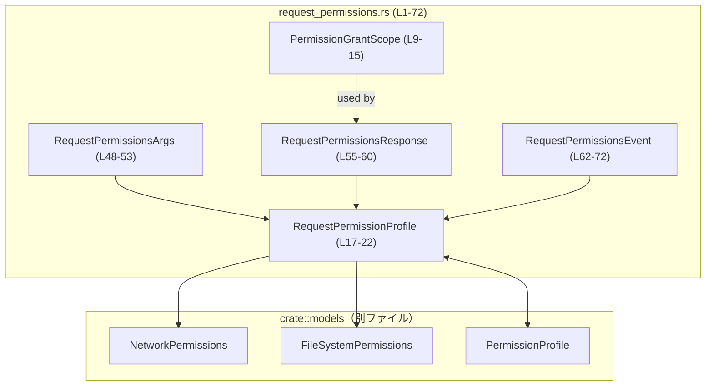
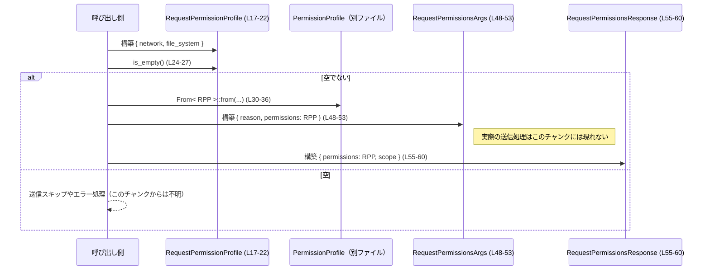

# protocol/src/request_permissions.rs コード解説

## 0. ざっくり一言

このモジュールは、権限要求プロトコルのためのデータ型（要求される権限内容・付与スコープ・リクエスト/レスポンス/イベントのペイロード）と、それらと共通 `PermissionProfile` 間の変換処理を定義しています（request_permissions.rs:L9-15, L17-22, L30-45, L48-72）。

---

## 1. このモジュールの役割

### 1.1 概要

- 権限の付与スコープを `Turn` / `Session` で表す `PermissionGrantScope` を定義します（request_permissions.rs:L9-15）。
- ネットワーク・ファイルシステムの権限セットをまとめた要求専用プロファイル `RequestPermissionProfile` を定義し、空判定メソッドと `PermissionProfile` との相互変換を提供します（request_permissions.rs:L17-22, L24-27, L30-45）。
- 権限要求の引数・レスポンス・イベントに対応する `RequestPermissionsArgs` / `RequestPermissionsResponse` / `RequestPermissionsEvent` を定義します（request_permissions.rs:L48-60, L62-72）。
- すべての型は `serde` でシリアライズ/デシリアライズ可能であり、`schemars::JsonSchema` と `ts_rs::TS` により JSON Schema や TypeScript 型情報も生成されます（request_permissions.rs:L9-9, L17-17, L48-48, L55-55, L62-62）。

### 1.2 アーキテクチャ内での位置づけ

このモジュールは、`crate::models` に定義されている権限モデル（`NetworkPermissions`, `FileSystemPermissions`, `PermissionProfile`）を利用し、それらを用いた「権限リクエスト関連メッセージ」のワイヤフォーマットを表現します（request_permissions.rs:L1-3, L17-22, L30-45, L48-72）。

主要な依存関係を次の Mermaid 図に示します。



- `NetworkPermissions`, `FileSystemPermissions`, `PermissionProfile` の具体的な定義内容や配置ファイルは、このチャンクには現れません（request_permissions.rs:L1-3）。

### 1.3 設計上のポイント

- **データキャリア中心**  
  すべての公開型はフィールドを持つだけの構造体/列挙体であり、状態変更を伴うメソッドは `RequestPermissionProfile::is_empty` のみです（request_permissions.rs:L17-27）。  
  副作用・I/O・スレッド操作などは一切含まれません。

- **要求専用プロファイルと共通プロファイルの分離**  
  実行系で使用されるとみられる `PermissionProfile` と、要求時の表現 `RequestPermissionProfile` を分離し、`From` 実装で相互変換を提供しています（request_permissions.rs:L30-45）。  
  これにより、ワイヤフォーマットの変更と内部表現を分離しやすくなっています。

- **シリアライズとスキーマ生成**  
  すべての構造体・列挙体に `Deserialize`, `Serialize`, `JsonSchema`, `TS` が派生されています（request_permissions.rs:L9-9, L17-17, L48-48, L55-55, L62-62）。  
  これにより、Rust 型から JSON / TypeScript 側の定義を自動生成する設計になっています。

- **フィールドバリデーション / セキュリティ**  
  `RequestPermissionProfile` には `#[serde(deny_unknown_fields)]` が付いており、未定義のフィールドを含む JSON が送られてきた場合はデシリアライズエラーになります（request_permissions.rs:L18）。  
  これは余分な権限指定の紛れ込みを防ぐためのセキュリティ的な制御と解釈できます。

- **後方互換性の考慮**  
  - `RequestPermissionsEvent.turn_id` は `#[serde(default)]` によって、古いメッセージでフィールドが存在しない場合でも、空文字列として復元されます（request_permissions.rs:L66-69）。  
  - `RequestPermissionsResponse.scope` も `#[serde(default)]` により、古いレスポンスでは暗黙に `PermissionGrantScope::Turn` になります（request_permissions.rs:L55-60, L9-13）。

- **エラー・並行性**  
  このファイル内の処理は単純なフィールドコピーと論理演算のみであり、明示的なエラー発生・パニック・ロック・スレッドなどは登場しません。並行性の安全性は、これらの型がどのようなスレッドコンテキストで共有されるか、および内部フィールド型の性質に依存します。

---

## 2. 主要な機能一覧

- 権限の付与スコープを `Turn` / `Session` の 2 種類で表現（request_permissions.rs:L9-15）。
- ネットワーク・ファイルシステム権限をまとめた要求専用プロファイル `RequestPermissionProfile` の定義と空判定（request_permissions.rs:L17-27）。
- `RequestPermissionProfile` と共通 `PermissionProfile` の相互変換（request_permissions.rs:L30-45）。
- 権限要求の引数 `RequestPermissionsArgs`、レスポンス `RequestPermissionsResponse`、イベント `RequestPermissionsEvent` のペイロード定義（request_permissions.rs:L48-60, L62-72）。

### コンポーネントインベントリー（型）

| 名前 | 種別 | 公開 | 定義位置 | 役割 / 用途 |
|------|------|------|----------|------------|
| `PermissionGrantScope` | 列挙体 | `pub` | `request_permissions.rs:L9-15` | 権限付与のスコープ（`Turn` / `Session`）を表す。`Default` は `Turn`（request_permissions.rs:L9-13）。 |
| `RequestPermissionProfile` | 構造体 | `pub` | `request_permissions.rs:L17-22` | ネットワーク権限とファイルシステム権限の要求内容をまとめる。未知フィールド禁止（request_permissions.rs:L18）。 |
| `RequestPermissionsArgs` | 構造体 | `pub` | `request_permissions.rs:L48-53` | 権限要求 API の引数ペイロード。任意の理由文字列と `RequestPermissionProfile` を保持。 |
| `RequestPermissionsResponse` | 構造体 | `pub` | `request_permissions.rs:L55-60` | 権限要求に対するレスポンスペイロード。付与された `RequestPermissionProfile` とスコープを保持。スコープはデフォルトで `Turn`（request_permissions.rs:L55-60, L9-13）。 |
| `RequestPermissionsEvent` | 構造体 | `pub` | `request_permissions.rs:L62-72` | 権限要求に関するイベントペイロード。`call_id` / `turn_id` / 任意理由 / 要求された権限を含む。`turn_id` に `#[serde(default)]`（request_permissions.rs:L66-69）。 |

### コンポーネントインベントリー（関数）

| 関数名 | 所属 | 公開 | 定義位置 | 役割 / 用途 |
|--------|------|------|----------|------------|
| `is_empty(&self) -> bool` | `RequestPermissionProfile` のメソッド | `pub` | `request_permissions.rs:L24-27` | `network` と `file_system` がどちらも `None` のときに空プロファイルと判定する。 |
| `from(value: RequestPermissionProfile) -> PermissionProfile` | `impl From<RequestPermissionProfile> for PermissionProfile` | 公開（トレイト実装） | `request_permissions.rs:L30-36` | 要求専用プロファイルから共通 `PermissionProfile` への変換。フィールドをそのまま移動。 |
| `from(value: PermissionProfile) -> RequestPermissionProfile` | `impl From<PermissionProfile> for RequestPermissionProfile` | 公開（トレイト実装） | `request_permissions.rs:L39-45` | 共通 `PermissionProfile` から要求専用プロファイルへの変換。フィールドをそのまま移動。 |

---

## 3. 公開 API と詳細解説

### 3.1 型一覧（構造体・列挙体など）

| 名前 | 種別 | フィールド概要 | 役割 / 用途 |
|------|------|----------------|------------|
| `PermissionGrantScope` | 列挙体 | `Turn`, `Session`（request_permissions.rs:L11-14） | 権限がどの期間有効かを表します。デフォルトは `Turn` です（request_permissions.rs:L9-13）。 |
| `RequestPermissionProfile` | 構造体 | `network: Option<NetworkPermissions>`, `file_system: Option<FileSystemPermissions>`（request_permissions.rs:L20-21） | 要求されるネットワーク・ファイルシステム権限をまとめます。フィールドは任意（`Option`）で、未知フィールドは禁止です（request_permissions.rs:L18）。 |
| `RequestPermissionsArgs` | 構造体 | `reason: Option<String>`（`skip_serializing_if` で `None` はシリアライズしない）, `permissions: RequestPermissionProfile`（request_permissions.rs:L48-53） | 権限要求 API の入力。ユーザ向けメッセージなどを `reason` で伝達できます。 |
| `RequestPermissionsResponse` | 構造体 | `permissions: RequestPermissionProfile`, `scope: PermissionGrantScope`（`#[serde(default)]`）（request_permissions.rs:L55-60） | 実際に与えられた権限内容と、その有効スコープを表します。`scope` が省略された場合は `Turn` として扱われます。 |
| `RequestPermissionsEvent` | 構造体 | `call_id: String`, `turn_id: String`（`#[serde(default)]`）, `reason: Option<String>`（`skip_serializing_if`）, `permissions: RequestPermissionProfile`（request_permissions.rs:L62-72） | 権限要求に関するイベント通知用ペイロードです。`call_id` は関連ツール呼び出しの ID、`turn_id` は属するターン ID（コメントより、request_permissions.rs:L64-67）。 |

> `NetworkPermissions`, `FileSystemPermissions`, `PermissionProfile` のフィールド構成はこのチャンクには現れないため不明です（request_permissions.rs:L1-3）。

### 3.2 関数詳細

#### `RequestPermissionProfile::is_empty(&self) -> bool`（request_permissions.rs:L24-27）

**概要**

`RequestPermissionProfile` が「何も権限を要求していない状態」かどうかを判定します。`network` と `file_system` が両方 `None` の場合に `true` を返します（request_permissions.rs:L25-27）。

**引数**

| 引数名 | 型 | 説明 |
|--------|----|------|
| `&self` | `&RequestPermissionProfile` | 判定対象のプロファイル。共有参照で取り、所有権は移動しません。 |

**戻り値**

- `bool`  
  - `true`: `network` / `file_system` が両方 `None`。  
  - `false`: 少なくともどちらか一方に `Some(..)` が入っている。

**内部処理の流れ（アルゴリズム）**

1. `self.network.is_none()` を計算し、ネットワーク権限が未設定かどうかを判定（request_permissions.rs:L26）。
2. `self.file_system.is_none()` を計算し、ファイルシステム権限が未設定かどうかを判定（request_permissions.rs:L26）。
3. 両方の結果を論理積 `&&` で結び、両方が `None` の場合のみ `true` を返す（request_permissions.rs:L26）。

**Examples（使用例）**

`RequestPermissionProfile` が空かどうかで要求送信を分岐する例です。同一クレート内のモジュールを想定しています。

```rust
use crate::request_permissions::RequestPermissionProfile; // 本モジュールの型をインポートする

fn should_send_request(profile: &RequestPermissionProfile) -> bool { // 送信するかどうかを判定する関数
    !profile.is_empty()                                             // 空でないときだけ true を返す
}

fn example() {                                                      // 使用例関数
    let empty = RequestPermissionProfile {                          // すべて None の空プロファイルを作成
        network: None,                                              // ネットワーク権限なし
        file_system: None,                                          // ファイルシステム権限なし
    };
    assert_eq!(empty.is_empty(), true);                             // 空なので true

    // 実際の NetworkPermissions / FileSystemPermissions は別ファイル定義のため、このチャンクからは生成方法が不明
    // let some_network: NetworkPermissions = ...;

    let non_empty = RequestPermissionProfile {                      // どちらかに Some が入っていると空ではない
        network: None,
        file_system: None,                                          // ここに Some(..) を入れれば非空になる
    };
    assert_eq!(non_empty.is_empty(), false);                        // 期待される挙動
}
```

※ 上記で `NetworkPermissions` や `FileSystemPermissions` の具体的な値生成は、このチャンクには現れないため省略しています。

**Errors / Panics**

- 明示的なエラーやパニックは発生しません。
- 単純に `Option::is_none` を呼んでいるだけであり、ヌルポインタのような概念もないため、通常の使用では安全です（request_permissions.rs:L26）。

**Edge cases（エッジケース）**

- `network` のみ `Some(..)`、`file_system` が `None`: `false` を返します。
- `network` が `None`、`file_system` のみ `Some(..)`: `false` を返します。
- 両方 `Some(..)`: `false` を返します。
- 両方 `None`: `true` を返します（request_permissions.rs:L26）。

**使用上の注意点**

- 「空」の定義は **`network` と `file_system` の 2 項目だけ** に基づきます（request_permissions.rs:L20-21, L26）。もし将来フィールドが追加された場合、そのフィールドはこのメソッドに反映されない限り、空判定に影響しません。
- 本メソッドは「妥当な権限かどうか」の検証は行いません。権限の内容自体の検証は別の層で行う必要があります。

---

#### `impl From<RequestPermissionProfile> for PermissionProfile::from(value: RequestPermissionProfile) -> PermissionProfile`（request_permissions.rs:L30-36）

**概要**

要求専用プロファイル `RequestPermissionProfile` から共通の `PermissionProfile` へ変換します。`network` / `file_system` フィールドをそのまま移動します（request_permissions.rs:L31-35）。

**引数**

| 引数名 | 型 | 説明 |
|--------|----|------|
| `value` | `RequestPermissionProfile` | 変換元の要求専用プロファイル。所有権は関数に移動します。 |

**戻り値**

- `PermissionProfile`  
  - `network` と `file_system` に `value` の対応フィールドがそのまま入った新しいインスタンスです（request_permissions.rs:L32-35）。

**内部処理の流れ**

1. `Self { .. }` 構文で `PermissionProfile` を構築しています（`Self` はここでは `PermissionProfile` を指します）（request_permissions.rs:L32）。
2. フィールド `network` に `value.network` をそのまま移動します（request_permissions.rs:L33）。
3. フィールド `file_system` に `value.file_system` をそのまま移動します（request_permissions.rs:L34）。
4. 完成した `PermissionProfile` を返します（request_permissions.rs:L32-35）。

**Examples（使用例）**

共通プロファイルに変換して内部処理に渡す例です。`PermissionProfile` の具体的な構造はこのチャンクには現れません。

```rust
use crate::models::PermissionProfile;                 // 共通プロファイル
use crate::request_permissions::RequestPermissionProfile; // 要求専用プロファイル

fn to_internal_profile(
    request_profile: RequestPermissionProfile,        // 呼び出し側から受け取った要求専用プロファイル
) -> PermissionProfile {
    PermissionProfile::from(request_profile)          // From 実装を使って PermissionProfile に変換
    // もしくは: request_profile.into()
}
```

**Errors / Panics**

- `From` 実装は単純なフィールド移動のみであり、エラーやパニックは発生しません（request_permissions.rs:L32-35）。

**Edge cases（エッジケース）**

- `network` / `file_system` が `None` であっても、そのまま `None` として移動します。特別な処理はありません（request_permissions.rs:L33-34）。
- オプション内の値が大きい場合でも、コピーではなくムーブ（所有権移動）であり、追加のヒープ割り当ては発生しません。

**使用上の注意点**

- この変換は **情報を失いません**。`RequestPermissionProfile` のフィールドはそのまま `PermissionProfile` に移されます。
- 所有権が移動するため、呼び出し後に元の `RequestPermissionProfile` は使用できません。必要であれば事前にクローンする必要があります（`Clone` が派生されているため可能ですが、コストはフィールド型に依存します）。

---

#### `impl From<PermissionProfile> for RequestPermissionProfile::from(value: PermissionProfile) -> RequestPermissionProfile`（request_permissions.rs:L39-45）

**概要**

共通の `PermissionProfile` から要求専用プロファイル `RequestPermissionProfile` へ変換します。同様に `network` / `file_system` をそのまま移動します（request_permissions.rs:L41-44）。

**引数**

| 引数名 | 型 | 説明 |
|--------|----|------|
| `value` | `PermissionProfile` | 変換元の共通プロファイル。所有権は関数に移動します。 |

**戻り値**

- `RequestPermissionProfile`  
  - `network` / `file_system` に `value` 側の対応フィールドがそのまま入ったインスタンスです（request_permissions.rs:L41-44）。

**内部処理の流れ**

1. `Self { .. }` 構文で `RequestPermissionProfile` を構築します（request_permissions.rs:L41）。
2. `network` フィールドに `value.network` を移動します（request_permissions.rs:L42）。
3. `file_system` フィールドに `value.file_system` を移動します（request_permissions.rs:L43）。
4. 新しい `RequestPermissionProfile` を返します（request_permissions.rs:L41-44）。

**Examples（使用例）**

内部表現として保持している `PermissionProfile` を、要求プロトコル向けの `RequestPermissionProfile` に変換して送出する例です。

```rust
use crate::models::PermissionProfile;                     // 共通プロファイル
use crate::request_permissions::RequestPermissionProfile; // 要求専用プロファイル

fn to_request_profile(
    internal: PermissionProfile,                          // 内部で使っているプロファイル
) -> RequestPermissionProfile {
    RequestPermissionProfile::from(internal)              // From 実装で要求専用プロファイルに変換
    // もしくは: internal.into()
}
```

**Errors / Panics**

- こちらも単純なフィールド移動であり、エラー・パニック条件はありません（request_permissions.rs:L41-44）。

**Edge cases（エッジケース）**

- `PermissionProfile` の `network` / `file_system` が `None` の場合、そのまま `None` として移動します。
- 追加の検証や変換は一切行いません。`PermissionProfile` に含まれる情報がそのまま露出します。

**使用上の注意点**

- 変換後の `RequestPermissionProfile` は `serde(deny_unknown_fields)` でデシリアライズされるため、JSON 経由で受信する場合は期待通りのフィールドのみが来ることを前提にできますが、この `From` 変換自体にはその制約は関係しません（request_permissions.rs:L18）。
- 所有権が移動する点は、前項と同様です。

### 3.3 その他の関数

- このファイルには、上記 3 つ以外の関数・メソッド定義はありません（request_permissions.rs:L1-72）。

---

## 4. データフロー

ここでは、要求プロファイルを組み立てて引数として使い、必要に応じて共通プロファイルとの変換を行う典型的な流れを示します。



- 上記シーケンスは、このファイルの定義（構築・`is_empty`・`From` 変換）に限定して表現しています。
- 実際のネットワーク送信やイベント発火の処理は、別モジュールにあると推測されますが、このチャンクには現れません。

---

## 5. 使い方（How to Use）

### 5.1 基本的な使用方法

`RequestPermissionProfile` を組み立て、空なら送信をスキップし、そうでなければ `RequestPermissionsArgs` を作る例です。

```rust
use crate::models::{NetworkPermissions, FileSystemPermissions};      // 権限モデル（定義は別ファイル）
use crate::request_permissions::{                                    // 本モジュールの型群
    RequestPermissionProfile,
    RequestPermissionsArgs,
};

fn build_request_args(
    reason: Option<String>,                                          // ユーザに見せる理由（任意）
    network: Option<NetworkPermissions>,                             // ネットワーク権限（任意）
    file_system: Option<FileSystemPermissions>,                      // ファイルシステム権限（任意）
) -> Option<RequestPermissionsArgs> {                                // 空なら None を返す
    let profile = RequestPermissionProfile {                         // 要求専用プロファイルを構築
        network,                                                     // 呼び出し元から受け取った network をそのまま設定
        file_system,                                                 // 同様に file_system を設定
    };

    if profile.is_empty() {                                          // 何も権限が要求されていないかチェック
        return None;                                                 // 空ならリクエスト不要と判断して None を返す
    }

    Some(RequestPermissionsArgs {                                    // リクエスト引数を構築
        reason,                                                      // 任意の理由文字列
        permissions: profile,                                        // 構築したプロファイル
    })
}
```

この関数を使うことで、「実際に何かしらの権限が要求されているか」を `is_empty` でチェックしつつ、引数構造体を安全に組み立てることができます。

### 5.2 よくある使用パターン

#### レスポンスの構築

権限要求を処理した結果を `RequestPermissionsResponse` にまとめるパターンです。

```rust
use crate::request_permissions::{                                   // レスポンス用型
    RequestPermissionProfile,
    RequestPermissionsResponse,
    PermissionGrantScope,
};

fn build_response(
    granted: RequestPermissionProfile,                               // 実際に付与された権限
    session_wide: bool,                                              // セッション全体に適用するかどうか
) -> RequestPermissionsResponse {
    let scope = if session_wide {                                    // スコープを条件に応じて選択
        PermissionGrantScope::Session                                // セッション全体に有効
    } else {
        PermissionGrantScope::Turn                                   // 一回のターンにのみ有効
    };

    RequestPermissionsResponse {                                     // レスポンスを構築
        permissions: granted,                                        // 付与された権限プロファイル
        scope,                                                       // 決定したスコープ
    }
}
```

#### イベントの構築

`RequestPermissionsEvent` で権限要求をイベントとして通知するパターンです。

```rust
use crate::request_permissions::{                                   // イベント用型
    RequestPermissionProfile,
    RequestPermissionsEvent,
};

fn build_event(
    call_id: String,                                                 // 関連ツール呼び出しの ID
    turn_id: String,                                                 // 対応するターン ID
    reason: Option<String>,                                          // 任意の理由
    permissions: RequestPermissionProfile,                           // 要求された権限
) -> RequestPermissionsEvent {
    RequestPermissionsEvent {                                        // イベント構造体を構築
        call_id,                                                     // 必須の call_id
        turn_id,                                                     // 必須の turn_id
        reason,                                                      // 任意の理由
        permissions,                                                 // 要求された権限内容
    }
}
```

### 5.3 よくある間違い

#### 間違い例: 空プロファイルをそのまま送信してしまう

```rust
// 間違い例: 空プロファイルでもそのまま送信してしまう
fn send_without_check(profile: RequestPermissionProfile) {
    let args = RequestPermissionsArgs {
        reason: None,
        permissions: profile,           // network も file_system も None かもしれない
    };
    // args を送信（詳細は別モジュール）
}
```

#### 正しい例: `is_empty` で空を判定する

```rust
// 正しい例: is_empty で空プロファイルを送信しないようにする
fn send_with_check(profile: RequestPermissionProfile) {
    if profile.is_empty() {             // 空プロファイルかどうかをチェック
        return;                         // 何もしない、あるいはログに残すなどの処理
    }

    let args = RequestPermissionsArgs {
        reason: None,
        permissions: profile,
    };
    // args を送信
}
```

#### 間違い例: `turn_id` が必ず非空だと決めつける

`RequestPermissionsEvent.turn_id` には `#[serde(default)]` が付いており、古いクライアントからの JSON ではフィールド自体が無くても、デシリアライズ時に空文字列になります（request_permissions.rs:L66-69）。

```rust
// 間違い例: turn_id が必ず非空と仮定して unwrap などに使う
fn use_turn_id(event: &RequestPermissionsEvent) {
    assert!(!event.turn_id.is_empty()); // 古いメッセージではここが失敗する可能性がある
}
```

### 5.4 使用上の注意点（まとめ）

- **空プロファイルの扱い**  
  `is_empty` は `network` と `file_system` のみを基準にしています（request_permissions.rs:L20-21, L26）。空プロファイルを禁止したい場合は、必ずこのメソッドでチェックするか、呼び出し元側で検証を追加する必要があります。

- **シリアライズ互換性とセキュリティ**  
  - `RequestPermissionProfile` は `deny_unknown_fields` で未知フィールドを拒否します（request_permissions.rs:L18）。API を進化させる際には、クライアント/サーバ双方のスキーマ整合性に注意が必要です。
  - `RequestPermissionsEvent.turn_id` と `RequestPermissionsResponse.scope` は `#[serde(default)]` により、古いメッセージからデシリアライズした際に空文字列や `Turn` にフォールバックすることがあります（request_permissions.rs:L58-59, L68-69, L9-13）。

- **エラー / パニック**  
  このファイル内の処理では、明示的なエラー型もパニックも使用していません。エラーは主にシリアライズ/デシリアライズ時に、`serde` 側で発生し得ます（未知フィールドや型不一致など）。

- **並行性**  
  すべての型は `Clone` / `Debug` / `PartialEq` / `Eq` を実装していますが（request_permissions.rs:L9-9, L17-17, L48-48, L55-55, L62-62）、`Send` / `Sync` が実装されているかどうかは、このチャンクからは読み取れません。通常は JSON メッセージとしてスレッド間で共有しても問題ない設計と考えられますが、最終的な安全性はフィールド型に依存します。

- **性能**  
  このモジュールは主にデータ構造と軽量なロジック（比較・フィールドコピー）のみで構成されており、性能上のボトルネックになる可能性は低いと考えられます。

---

## 6. 変更の仕方（How to Modify）

### 6.1 新しい機能を追加する場合

- **新しい権限カテゴリを追加する**  
  - 例えば「デバイス権限」などを追加したい場合は、`RequestPermissionProfile` に新しいフィールドを追加するのが自然です（request_permissions.rs:L17-22）。
  - それに応じて、`PermissionProfile` 側にも同様のフィールドを追加し、`From` 実装（request_permissions.rs:L30-45）で新フィールドをコピーする必要があります。
  - `is_empty` の定義に新フィールドを含めるかどうかも検討が必要です（request_permissions.rs:L24-27）。

- **新しいスコープ種別の追加**  
  - `PermissionGrantScope` に新しいバリアント（例: `Persistent` 等）を追加する場合は、列挙体定義にバリアントを追加します（request_permissions.rs:L11-14）。
  - 既存のクライアントコードが `match` ですべてのバリアントを網羅しているか確認する必要があります。Rust の `match` は網羅性チェックがあるため、コンパイラが不足ケースを指摘します。

- **イベントや引数の追加情報**  
  - 権限要求イベントに追加情報を持たせたい場合は、`RequestPermissionsEvent` にフィールドを追加します（request_permissions.rs:L62-72）。
  - `serde(default)` や `skip_serializing_if` の有無により、後方互換性の挙動が変わるため、追加する際には慎重な設計が必要です。

### 6.2 既存の機能を変更する場合

- **`is_empty` の振る舞い変更**  
  - 空判定条件を変更すると、呼び出し側のロジック（「空なら送信しない」など）に影響します。`is_empty` を使っている箇所を全て洗い出し、期待する挙動が変わらないか確認する必要があります。

- **`serde` 属性の変更**  
  - `deny_unknown_fields` を外す / 追加する、`default` を外す / 付けると、JSON 互換性やセキュリティ特性が変化します（request_permissions.rs:L18, L58-59, L68-69）。  
  - API を利用するクライアントとの間で、フィールド追加や削除の影響を事前に調査する必要があります。

- **`From` 実装の変更**  
  - フィールド名や意味が変わる場合、`From` 実装（request_permissions.rs:L30-45）のマッピングも変更する必要があります。
  - 変換が単純コピーでなくなる場合は、どのような条件で失敗する可能性があるのか（現在は常に成功）を設計し、必要なら `TryFrom` の利用も検討されます。

- **テスト**  
  - このチャンクにはテストコードは現れません。変更時には、別ファイルにあるテスト（もし存在すれば）を更新・追加し、`is_empty`・`From` 変換・`serde` 属性の挙動が期待通りかをカバーすることが望ましいです。

---

## 7. 関連ファイル

このモジュールと密接に関係する他の型・クレートを一覧にします。

| パス / モジュール | 役割 / 関係 |
|------------------|------------|
| `crate::models::FileSystemPermissions` | ファイルシステム権限の詳細なモデル。`RequestPermissionProfile.file_system` の型として使用されています（request_permissions.rs:L1, L21）。定義位置はこのチャンクには現れません。 |
| `crate::models::NetworkPermissions` | ネットワーク権限の詳細なモデル。`RequestPermissionProfile.network` の型として使用されています（request_permissions.rs:L2, L20）。定義位置はこのチャンクには現れません。 |
| `crate::models::PermissionProfile` | 共通権限プロファイル。`From` 実装により `RequestPermissionProfile` と相互変換されます（request_permissions.rs:L3, L30-45）。 |
| `serde` クレート | `Deserialize`, `Serialize` の派生により、全ての型の JSON シリアライズ/デシリアライズを提供します（request_permissions.rs:L5, L6, L9, L17, L48, L55, L62）。 |
| `schemars` クレート | `JsonSchema` 派生により、型から JSON Schema を生成します（request_permissions.rs:L4, L9, L17, L48, L55, L62）。 |
| `ts_rs` クレート | `TS` 派生により、Rust 型から TypeScript 型定義を生成します（request_permissions.rs:L7, L9, L17, L48, L55, L62）。 |

以上が、`protocol/src/request_permissions.rs` における公開 API とコアロジック、コンポーネント構成およびデータフローの整理です。
