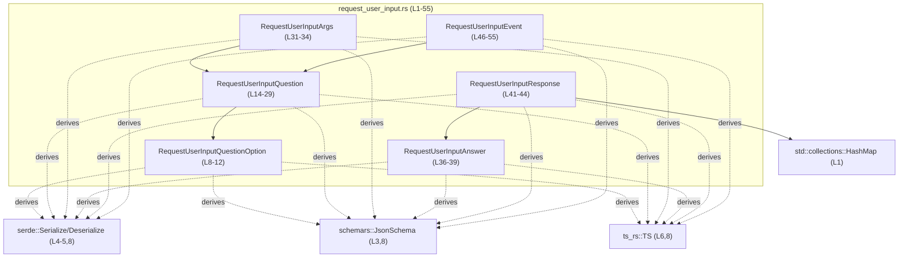
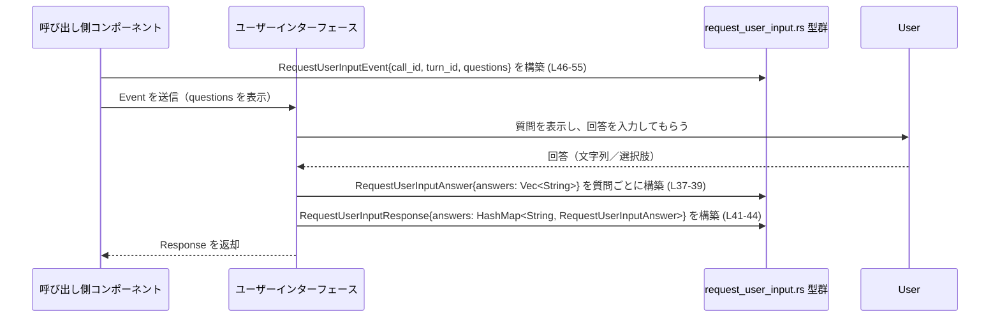

# protocol/src/request_user_input.rs

## 0. ざっくり一言

ユーザーに対する質問とその回答を表現し、シリアライズ／デシリアライズ（JSON・TS型生成など）可能にするためのデータ構造を定義するモジュールです（`request_user_input.rs:L8-55`）。

---

## 1. このモジュールの役割

### 1.1 概要

- ユーザーに提示する質問（質問文、選択肢、フラグ）を表す構造体群を定義します（`RequestUserInputQuestion` など, `L14-29`）。
- 質問の集合、ユーザーからの回答、回答のマップ、イベント情報（call_id/turn_id）を表す構造体を提供します（`L31-55`）。
- すべての構造体は `serde`・`schemars`・`ts_rs` の派生トレイトを持ち、JSONスキーマ生成や TypeScript 型生成を想定した設計になっています（`L3-6,8,14,31,36,41,46`）。

形式的に書くと：

> このモジュールは **「ユーザー入力を質問形式でやりとりする」問題** を解決するために存在し、  
> 質問・回答・イベントを表す **シリアライズ可能なデータ構造** を提供します。

### 1.2 アーキテクチャ内での位置づけ

このファイル内での主な依存関係と外部クレートとの関係を示します（対象範囲: `request_user_input.rs:L1-55`）。



この図から分かる客観的事実：

- 質問 (`RequestUserInputQuestion`) は複数の選択肢 (`RequestUserInputQuestionOption`) を含み得ます（`L27-28`）。
- 質問の集合は `RequestUserInputArgs` と `RequestUserInputEvent` の両方で利用されます（`L31-34`, `L46-55`）。
- 回答は文字列の配列として `RequestUserInputAnswer` に入り、それが `RequestUserInputResponse.answers` に `HashMap<String, RequestUserInputAnswer>` で集約されます（`L37-43`）。
- 全ての構造体が同じ一連のトレイトを derive しており、シリアライズ／スキーマ／TS型生成に一貫性があります（`L8,14,31,36,41,46`）。

### 1.3 設計上のポイント

コードから読み取れる設計上の特徴を列挙します。

- **DTO（データ転送オブジェクト）中心**  
  - すべてが `struct` 定義であり、関数ロジックは一切存在しません（`L8-55`）。  
    → このモジュールは純粋なデータ定義層として設計されています。
- **シリアライズ／スキーマ／TS型の一元管理**  
  - 各構造体が `Deserialize`, `Serialize`, `JsonSchema`, `TS` を derive しており（`L8,14,31,36,41,46`）、  
    Rust・JSON・TypeScript で同じデータ形状を共有する意図が読み取れます。
- **フィールド名の外部インターフェースとの整合性**  
  - `is_other` と `is_secret` は Rust 側では snake_case、外部表現では camelCase (`isOther`, `isSecret`) になるように `#[serde(rename)]` / `#[schemars(rename)]` / `#[ts(rename)]` が指定されています（`L19-26`）。
- **後方互換性への配慮**  
  - `RequestUserInputEvent.turn_id` に `#[serde(default)]` が付与され、「後方互換性のため」とコメントがあります（`L50-53`）。  
    → 旧クライアントから `turn_id` が送られてこないケースでもデシリアライズを成功させる設計です。
- **オプショナルな選択肢**  
  - `RequestUserInputQuestion.options` は `Option<Vec<_>>` であり、`#[serde(skip_serializing_if = "Option::is_none")]` が付与されています（`L27-28`）。  
    → 選択肢が存在しない（自由入力など）場合にはフィールド自体をシリアライズしない設計です。
- **安全性・並行性**  
  - フィールドは `String`, `Vec`, `HashMap` などの標準ライブラリ安全型のみで構成されており（`L10-11,16-18,27-28,33,38-39,43,49,53-54`）、`unsafe` コードは一切ありません。  
  - これらのフィールド型はいずれも `Send` + `Sync` であるため、構造体も自動的に `Send` + `Sync` となり、スレッド間共有が可能です（Rust の自動トレイト規則による）。

---

## 2. 主要な機能一覧（コンポーネントインベントリー）

このモジュールが提供する「機能」はすべてデータ構造として表現されています。

- `RequestUserInputQuestionOption`: 質問の個々の選択肢（ラベルと説明）を表現する（`L8-12`）。
- `RequestUserInputQuestion`: 質問ID・見出し・質問文・フラグ（その他入力・秘匿）・選択肢一覧を表現する（`L15-28`）。
- `RequestUserInputArgs`: 質問のリストをまとめた「引数」コンテナ（`L31-34`）。
- `RequestUserInputAnswer`: 1 つの質問に対する回答（複数回答可）を表現する（`L37-39`）。
- `RequestUserInputResponse`: 質問（キー）から回答へのマッピングを表現するレスポンスコンテナ（`L41-44`）。
- `RequestUserInputEvent`: call_id・turn_id と質問リストを含むイベント情報を表現する（`L46-55`）。

---

## 3. 公開 API と詳細解説

### 3.1 型一覧（構造体）

このファイルで定義されている構造体の一覧と役割です。

| 名前 | 種別 | 役割 / 用途 | 主なフィールド | 行範囲（根拠） |
|------|------|-------------|----------------|----------------|
| `RequestUserInputQuestionOption` | 構造体 | 質問の選択肢 1 件を表現します。ラベルと説明のみを持ちます。 | `label: String`, `description: String` | `request_user_input.rs:L8-12` |
| `RequestUserInputQuestion` | 構造体 | 1 つの質問を表現します。ID、ヘッダ、質問文、フラグ、選択肢を持ちます。 | `id: String`, `header: String`, `question: String`, `is_other: bool`, `is_secret: bool`, `options: Option<Vec<RequestUserInputQuestionOption>>` | `request_user_input.rs:L14-29` |
| `RequestUserInputArgs` | 構造体 | 質問群をまとめた引数オブジェクトです。 | `questions: Vec<RequestUserInputQuestion>` | `request_user_input.rs:L31-34` |
| `RequestUserInputAnswer` | 構造体 | 1 つの質問に対する回答リストを表現します。 | `answers: Vec<String>` | `request_user_input.rs:L36-39` |
| `RequestUserInputResponse` | 構造体 | 複数の質問に対する回答を、キー付きで集約するレスポンスです。 | `answers: HashMap<String, RequestUserInputAnswer>` | `request_user_input.rs:L41-44` |
| `RequestUserInputEvent` | 構造体 | call_id・turn_id と質問群からなるイベントを表現します。コメントから「Responses API コールに紐づくツール呼び出し」など、外部APIと関連することが示唆されています。 | `call_id: String`, `turn_id: String`, `questions: Vec<RequestUserInputQuestion>` | `request_user_input.rs:L46-55` |

#### Rust・言語固有の観点

- すべての構造体で `Debug, Clone, Deserialize, Serialize, PartialEq, Eq, JsonSchema, TS` が derive されています（`L8,14,31,36,41,46`）。
  - `Debug`: `{:?}` でデバッグ出力可能。
  - `Clone`: 所有権を移さずに複製できる。
  - `PartialEq, Eq`: 等値比較が可能。
  - `Deserialize, Serialize`: `serde` によるシリアライズ／デシリアライズが可能。
  - `JsonSchema`: `schemars` を用いて JSON Schema を生成可能。
  - `TS`: `ts_rs` による TypeScript 型生成が可能。

### 3.2 関数詳細

このファイルには、**関数・メソッドの定義は存在しません**（`request_user_input.rs:L1-55` には `fn` 定義がありません）。

そのため、「関数詳細」テンプレートを適用できる公開 API 関数はありません。  
このモジュールの公開 API は、上記構造体の「フィールドとシリアライズ挙動」で構成されます。

### 3.3 その他の関数

- このチャンクには、補助関数やラッパー関数も含めて、関数定義が一切現れません（`request_user_input.rs:L1-55`）。

---

## 4. データフロー

このファイル単体には処理ロジックがなく、「どのコンポーネントからどのように呼ばれるか」は明示されていません。  
以下は **型の命名とフィールド構造から想定される代表的なフロー** であり、あくまで推測であることに注意が必要です。

### 想定される代表的フローの説明（推測）

1. あるコンポーネントが、ユーザーに入力を求めるために `RequestUserInputEvent` を生成し送信する（`L46-55`）。
2. 受け取った側（UI やクライアントなど）が `questions` を表示し、ユーザーからの回答を収集する（`L16-18,27-28`）。
3. 質問ごとに `RequestUserInputAnswer` を構築し、それらを `HashMap<String, RequestUserInputAnswer>` に格納して `RequestUserInputResponse` として返却する（`L37-39,41-44`）。

この想定フローを sequence diagram で表現します（対象範囲: `request_user_input.rs:L8-55`、内容は推測）。



※ この図の「Caller」「UI」「User」は、コード中に明示されていないため、**役割の名前は推測**です。  
　ただし、`Event` と `Response` の名前とフィールド構造から、このような往復が行われる設計である可能性は高いと考えられます。

---

## 5. 使い方（How to Use）

このセクションでは、**このモジュールの型をどのように構築・利用できるか** の例を示します。  
他モジュールとの連携はコードから分からないため、ここでは構造体インスタンスの作成に焦点を当てます。

### 5.1 基本的な使用方法

例: 単純な質問イベントを構築し、擬似的な回答レスポンスを組み立てるコードです。

```rust
use std::collections::HashMap;                                        // HashMap を使用するためにインポートする
use protocol::request_user_input::{                                   // 本ファイルに定義された型をインポートする（実際のモジュールパスは crate 構成に依存）
    RequestUserInputQuestionOption,                                   // 選択肢を表す構造体
    RequestUserInputQuestion,                                         // 質問を表す構造体
    RequestUserInputEvent,                                            // イベントを表す構造体
    RequestUserInputAnswer,                                           // 回答を表す構造体
    RequestUserInputResponse,                                         // レスポンスを表す構造体
};

// 質問とイベントを構築する例
fn build_event_example() -> RequestUserInputEvent {                   // RequestUserInputEvent を返す関数
    // 質問の選択肢を 2 つ定義する
    let option_yes = RequestUserInputQuestionOption {                 // 1つ目の選択肢
        label: "yes".to_string(),                                     // ラベル文字列
        description: "はい".to_string(),                              // 表示用説明
    };
    let option_no = RequestUserInputQuestionOption {                  // 2つ目の選択肢
        label: "no".to_string(),
        description: "いいえ".to_string(),
    };

    // 質問本体を定義する
    let question = RequestUserInputQuestion {                         // 質問 1 件を作成する
        id: "q1".to_string(),                                         // 質問ID
        header: "同意確認".to_string(),                               // 見出し
        question: "利用規約に同意しますか？".to_string(),            // 質問文
        is_other: false,                                              // 「その他」入力を許可しない
        is_secret: false,                                             // 秘匿フラグなし
        options: Some(vec![option_yes, option_no]),                   // 選択肢リストを Some で包む
    };

    // イベント全体を構築する
    RequestUserInputEvent {                                           // RequestUserInputEvent 構造体を作成
        call_id: "call-123".to_string(),                              // 対応する API コールID
        turn_id: String::new(),                                       // turn_id は #[serde(default)] なので空文字でもよい
        questions: vec![question],                                    // 質問を 1 件含めたベクタ
    }
}

// 回答レスポンスを構築する例
fn build_response_example() -> RequestUserInputResponse {             // RequestUserInputResponse を返す関数
    // 質問 q1 に対する回答（ここでは "yes" という 1 つの選択肢を選んだと仮定）
    let answer_q1 = RequestUserInputAnswer {                          // 回答を表す構造体を作成
        answers: vec!["yes".to_string()],                             // 文字列のベクタに回答を格納
    };

    // HashMap で質問ID -> 回答 をマッピングする
    let mut answers_map: HashMap<String, RequestUserInputAnswer> =    // String キーで回答を保持するマップ
        HashMap::new();
    answers_map.insert("q1".to_string(), answer_q1);                  // "q1" 用の回答を登録

    // レスポンス全体を構築する
    RequestUserInputResponse {                                        // RequestUserInputResponse 構造体を作成
        answers: answers_map,                                         // マップをフィールドに設定
    }
}
```

この例から読み取れること（コード＋型定義の事実）：

- 選択肢、質問、イベント、回答、レスポンスは、すべて通常の Rust 構造体として `struct { ... }` リテラルで構築できます（`L8-12,14-29,31-34,36-39,41-44,46-55`）。
- `turn_id` は `String` なので、欠損時は `String::new()` などで空文字を入れても問題ありません（`L52-53` と `String` の `Default` 実装による）。

### 5.2 よくある使用パターン（推測を含む）

コードから直接は分かりませんが、構造体設計から以下のようなパターンが想定されます（推測であることを明示します）。

1. **質問定義を先に作り回すパターン**  
   - アプリケーション起動時に `RequestUserInputQuestion` のリストを用意し、  
     任意のタイミングで `RequestUserInputEvent` として送信する。

2. **質問 → 回答の 1 対多関係**  
   - `RequestUserInputAnswer.answers` が `Vec<String>` であることから（`L37-39`）、  
     1 つの質問に複数回答（チェックボックスなど）が紐づくケースを表現できます。

3. **質問IDをキーにした結果集約**  
   - `RequestUserInputResponse.answers` が `HashMap<String, RequestUserInputAnswer>` なので（`L41-43`）、  
     （推測）質問IDなどの文字列キーによる回答の集約に適しています。

### 5.3 よくある間違い（起こりうる誤用の例）

コードから推測しうる誤用例を、正しい例と並べて示します。

```rust
use std::collections::HashMap;
use protocol::request_user_input::{
    RequestUserInputQuestion, RequestUserInputEvent, RequestUserInputResponse,
    RequestUserInputAnswer,
};

// 誤り例: questions を空のままイベントを送る（仕様として許されるかはこのファイルからは不明）
fn wrong_event() -> RequestUserInputEvent {
    RequestUserInputEvent {
        call_id: "call-1".to_string(),
        turn_id: String::new(),
        questions: Vec::new(),                                       // 質問がゼロ
    }
}

// 正しいかは仕様次第だが、一般には質問がある前提でイベントを構築することが多いと想定される
fn better_event_example(q: RequestUserInputQuestion) -> RequestUserInputEvent {
    RequestUserInputEvent {
        call_id: "call-1".to_string(),
        turn_id: String::new(),
        questions: vec![q],                                         // 少なくとも 1 件の質問を含める
    }
}

// 誤り例: Response.answers に不整合なキーを使う（質問ID以外など）
// → 型としてはコンパイルは通るが、上位レイヤーのロジック上は問題になる可能性がある
fn wrong_response() -> RequestUserInputResponse {
    let mut map = HashMap::new();
    map.insert("not-a-question-id".to_string(), RequestUserInputAnswer {
        answers: vec!["value".to_string()],
    });
    RequestUserInputResponse { answers: map }
}
```

※ 上記の「正しい／誤り」は仕様を仮定した例であり、このファイル単体からはビジネスロジック上の正しさは判定できません。

### 5.4 使用上の注意点（まとめ）

言語仕様とフィールド構造から分かる注意点です。

- **シリアライズ時のフィールド名**  
  - `is_other` は外部表現では `isOther` になり（`L19-22`）、`is_secret` は `isSecret` になります（`L23-26`）。  
    JSON／TS 側とやり取りする場合、フィールド名の大小文字に注意が必要です。
- **オプションフィールドの省略**  
  - `options` は `Option` で、`None` の場合はシリアライズ時にフィールド自体が省略されます（`L27-28`）。  
    これにより、外部クライアント側で「フィールド不在」と「空配列」の違いに注意が必要です。
- **デフォルト値の挙動**  
  - `RequestUserInputQuestion.is_other`, `is_secret` には `#[serde(default)]` が付いているため（`L19,23`）、  
    JSON 側でフィールドが欠損していても `bool` のデフォルト値（`false`）でデシリアライズされます。
  - `RequestUserInputEvent.turn_id` も `#[serde(default)]` が付いており（`L52-53`）、  
    欠損時は `String::default()`（空文字列）が使われます。
- **エラー・例外条件（デシリアライズ）**  
  - このファイルにはエラー処理は登場しませんが、`serde` の挙動として：  
    - JSON 側で `answers` に文字列以外が入っているなど、型不一致の場合はデシリアライズ時に `Err` になります（`L37-39,41-43`）。
    - 必須フィールド（`Option` や `#[serde(default)]` が付いていないフィールド）が欠損しているとエラーになります（例えば `RequestUserInputQuestion.id` など, `L16`）。
- **並行性**  
  - これらの構造体は `String`, `Vec`, `HashMap` など `Send + Sync` な型で構成されているため、  
    スレッド間で安全に共有・送信できるデータとして扱えます（言語仕様による）。

---

## 6. 変更の仕方（How to Modify）

### 6.1 新しい機能を追加する場合

このモジュールは純粋なデータ定義モジュールのため、新機能追加は主に「フィールドの追加」や「新しい構造体の追加」として現れます。

例として、「質問にカテゴリーを追加したい」ケースを考えます。

1. **変更対象の構造体を特定する**  
   - 質問に関する情報は `RequestUserInputQuestion` に集約されています（`L15-28`）。  
     → 新フィールドはこの構造体に追加するのが自然です。
2. **フィールド追加**  

   ```rust
   #[derive(Debug, Clone, Deserialize, Serialize, PartialEq, Eq, JsonSchema, TS)]
   pub struct RequestUserInputQuestion {
       pub id: String,
       pub header: String,
       pub question: String,
       #[serde(rename = "isOther", default)]
       #[schemars(rename = "isOther")]
       #[ts(rename = "isOther")]
       pub is_other: bool,
       #[serde(rename = "isSecret", default)]
       #[schemars(rename = "isSecret")]
       #[ts(rename = "isSecret")]
       pub is_secret: bool,
       #[serde(skip_serializing_if = "Option::is_none")]
       pub options: Option<Vec<RequestUserInputQuestionOption>>,
       // 新フィールド例:
       // pub category: Option<String>,
   }
   ```

3. **外部インターフェースとの整合性確認**  
   - JSON/TS 側のスキーマやクライアントコードがこのフィールドを期待しているかを確認する必要があります。  
   - `serde` 属性を付けるかどうか（rename、default、skip_serializing_if など）も、このファイルと揃えることで一貫性を保持できます。
4. **影響範囲**  
   - この構造体をシリアライズ／デシリアライズしている全ての箇所に影響します。  
     このファイルだけでは呼び出し元が分からないため、IDE などで `RequestUserInputQuestion` の使用箇所を検索する必要があります。

### 6.2 既存の機能を変更する場合

既存フィールドの意味や型を変更する際の一般的な注意点です（このファイルから読み取れる契約に基づきます）。

- **`id` フィールドの型変更**  
  - `RequestUserInputQuestion.id` は `String` です（`L16`）。  
    これを整数 ID などに変更すると、`RequestUserInputResponse.answers` のキーとの対応関係（推測）に影響します。  
    - 変更前に、`HashMap` のキーとして何が使われているか、上位レイヤーの仕様を確認する必要があります。
- **`answers: Vec<String>` の意味変更**  
  - `RequestUserInputAnswer.answers` を単一値にしてしまうと（例: `String`）、複数回答を前提としているロジックが壊れる可能性があります（`L37-39`）。  
    エッジケース（複数回答・未回答）への対応方法も見直しが必要です。
- **属性の変更（serde/ts_rs/schemars）**  
  - `#[serde(rename = "isOther", default)]` から `default` を外すと、古いクライアントからのフィールド欠損でデシリアライズエラーが発生しうるようになります（`L19`）。  
    特に `turn_id` の `#[serde(default)]` はコメントにも「backwards compatibility」と書かれているため（`L50-53`）、安易に削除すると互換性を損なう可能性があります。

---

## 7. 関連ファイル・外部コンポーネント

このファイル自体から分かる関連は、以下の外部クレートのみです。他の自前モジュールとの関係は **このチャンクには現れません**（`request_user_input.rs:L1-6`）。

| パス / クレート | 役割 / 関係 |
|-----------------|------------|
| `std::collections::HashMap` | `RequestUserInputResponse.answers` の内部コンテナとして使用されます（`L1,41-43`）。 |
| `serde::Deserialize` / `serde::Serialize` | 各構造体を JSON などにシリアライズ／デシリアライズするために derive されています（`L4-5,8,14,31,36,41,46`）。 |
| `schemars::JsonSchema` | JSON Schema を生成するために derive されています（`L3,8,14,31,36,41,46`）。 |
| `ts_rs::TS` | TypeScript 側の型定義を生成するために derive されています（`L6,8,14,31,36,41,46`）。 |

自前の他ファイル（例: `protocol/src/lib.rs` や、このイベント・レスポンスを実際に使うサービス層）はこのチャンクには現れないため、  
「どこから呼ばれているか」「どの API エンドポイントに対応するか」といった情報は **不明** です。

---

以上が、`protocol/src/request_user_input.rs` に関する、構造・データフロー・使用方法・言語固有の注意点を含んだ解説です。
