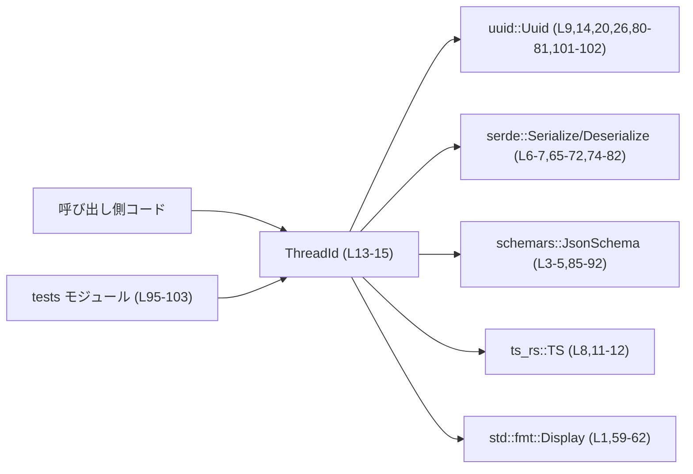
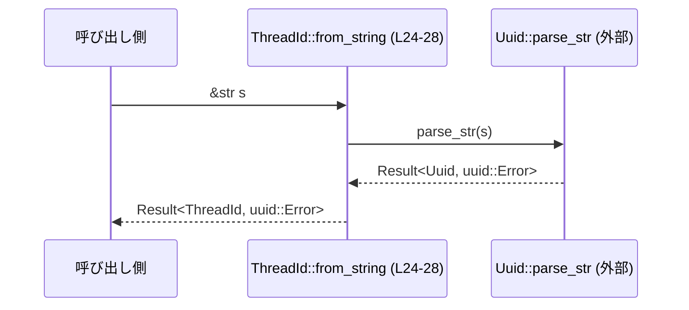
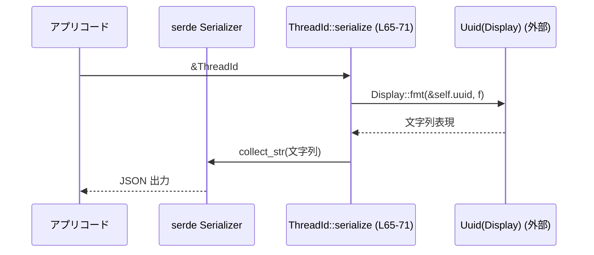
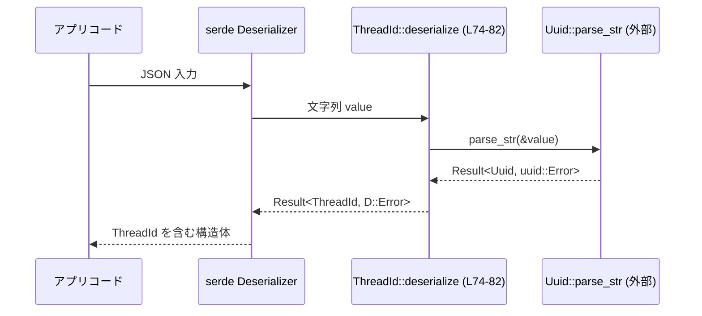

# protocol/src/thread_id.rs コード解説

---

## 0. ざっくり一言

`ThreadId` は、`uuid::Uuid` を内部に持つスレッド識別子用の新しい型（newtype）であり、  
UUID v7 で ID を生成しつつ、文字列・JSON・TypeScript との相互変換を一元的に扱うためのモジュールです（`thread_id.rs:L11-15,18-22,65-83,85-92`）。

---

## 1. このモジュールの役割

### 1.1 概要

- このモジュールは、スレッド（会話など）の識別子を UUID ベースで表現するための `ThreadId` 型を定義します（`thread_id.rs:L11-15`）。
- `ThreadId` の生成（UUID v7）、文字列からのパース、文字列への変換をまとめて提供します（`thread_id.rs:L18-28,31-45,47-51,59-62`）。
- serde によるシリアライズ／デシリアライズ、JSON Schema、TypeScript 型定義への対応を行い、外部とのデータ交換に使いやすい ID 型として振る舞います（`thread_id.rs:L6-8,65-83,85-92`）。

### 1.2 アーキテクチャ内での位置づけ

このモジュールは「アプリケーション全体で使う ID 型」として中心に置かれ、  
外部クレート（`uuid`, `serde`, `schemars`, `ts_rs`, `std::fmt`）との間に薄いラッパーを挟む構造になっています。



**位置づけの要点**

- 呼び出し側は、UUID 自体（`uuid::Uuid`）ではなく `ThreadId` を使うことで、「スレッド ID」であることを型レベルで区別できます（`thread_id.rs:L13-15`）。
- 永続化や API など文字列ベースの境界では、`Display`／`From<ThreadId> for String`／serde 実装によりシームレスに文字列形式へ変換します（`thread_id.rs:L47-51,59-62,65-83`）。
- スキーマ系ツール（schemars, ts_rs）とは、`String` と同じ形式のスキーマ／TypeScript 型として連携しています（`thread_id.rs:L3-5,8,11-12,85-92`）。

### 1.3 設計上のポイント

- **newtype による型安全性**  
  - `ThreadId` は内部に `Uuid` フィールド一つだけを持つ構造体です（`thread_id.rs:L13-15`）。
  - これにより、単なる `Uuid` や `String` と混同されない「スレッド ID 専用の型」として扱えます。

- **ID 生成の一元化**  
  - `ThreadId::new` および `Default` 実装は `Uuid::now_v7()` を呼び出し、ID 生成を一箇所に集約しています（`thread_id.rs:L18-22,53-56`）。

- **文字列とのラウンドトリップを前提とした設計**  
  - 文字列 → `ThreadId`: `from_string` / `TryFrom<&str>` / `TryFrom<String>` で `Uuid::parse_str` を使用（`thread_id.rs:L24-28,31-45,79-81`）。
  - `ThreadId` → 文字列: `Display` と `From<ThreadId> for String` で内部の `Uuid` の `Display` 表現を使う（`thread_id.rs:L47-51,59-62`）。
  - serde シリアライズでも `serializer.collect_str(&self.uuid)` を用い、同じ文字列表現を使っています（`thread_id.rs:L65-71`）。

- **スキーマ／フロントエンドとの整合性**  
  - `#[ts(type = "string")]` により、TypeScript では `string` として扱うよう指定（`thread_id.rs:L11-12`）。
  - `JsonSchema` 実装は `String` のスキーマを再利用し、JSON Schema 上も文字列型として表現します（`thread_id.rs:L85-92`）。

- **所有権・並行性の観点**  
  - `ThreadId` は `Copy` を derive しており、値コピーで扱える小さな値型として設計されています（`thread_id.rs:L11`）。
  - フィールドは `Uuid` のみであり、`Send`/`Sync` といった並行性特性は `Uuid` 型の auto trait 実装に依存します。このファイル単体からは `Uuid` の並行性特性は分かりません。

- **エラーハンドリングの方針**  
  - 文字列 → ID 変換時のエラーは `uuid::Error` として返却するか、serde のデコードエラーに変換して返します（`thread_id.rs:L24-28,31-45,74-82`）。
  - panic を伴うコード（`unwrap` 等）は本モジュール内にはありません。

---

## 2. 主要な機能一覧

### 2.1 コンポーネント一覧（構造体・impl・テスト）

| 名前 | 種別 | 役割 / 用途 | 定義 |
|------|------|-------------|------|
| `ThreadId` | 構造体 | スレッド識別子を表す UUID ベースの新型 | `thread_id.rs:L11-15` |
| `impl ThreadId` | 固有 impl | ID の生成（`new`）と文字列からの生成（`from_string`） | `thread_id.rs:L17-29` |
| `impl TryFrom<&str> for ThreadId` | トレイト impl | 文字列スライスから `ThreadId` への変換を `TryFrom` で提供 | `thread_id.rs:L31-37` |
| `impl TryFrom<String> for ThreadId` | トレイト impl | 所有する `String` から `ThreadId` への変換を `TryFrom` で提供 | `thread_id.rs:L39-45` |
| `impl From<ThreadId> for String` | トレイト impl | `ThreadId` から `String` への変換（文字列表現） | `thread_id.rs:L47-51` |
| `impl Default for ThreadId` | トレイト impl | 既定値として新しい ID を生成 | `thread_id.rs:L53-57` |
| `impl Display for ThreadId` | トレイト impl | 表示用文字列（`Uuid` の表示形式）を提供 | `thread_id.rs:L59-62` |
| `impl Serialize for ThreadId` | トレイト impl | serde によるシリアライズ（文字列として） | `thread_id.rs:L65-72` |
| `impl Deserialize<'de> for ThreadId` | トレイト impl | serde によるデシリアライズ（文字列→UUID→ThreadId） | `thread_id.rs:L74-82` |
| `impl JsonSchema for ThreadId` | トレイト impl | schemars による JSON Schema 出力（`String` と同じスキーマ） | `thread_id.rs:L85-92` |
| `mod tests` | テストモジュール | `Default` が nil UUID を返さないことを確認 | `thread_id.rs:L95-103` |

### 2.2 機能一覧（箇条書き）

- **ID 生成**:  
  - `ThreadId::new()` / `ThreadId::default()` で UUID v7 に基づく新しい ID を生成（`thread_id.rs:L18-22,53-56`）。
- **文字列からのパース**:  
  - `ThreadId::from_string(&str)`、`TryFrom<&str>`、`TryFrom<String>` で UUID 文字列から `ThreadId` を生成（`thread_id.rs:L24-28,31-45`）。
- **文字列への変換**:  
  - `Display` 実装と `From<ThreadId> for String` により、人間可読な文字列に変換（`thread_id.rs:L47-51,59-62`）。
- **シリアライズ／デシリアライズ**:  
  - serde の `Serialize` / `Deserialize` を実装し、JSON などで文字列として保存・読み込み可能（`thread_id.rs:L65-83`）。
- **JSON Schema 出力**:  
  - `JsonSchema` 実装により、スキーマ上は `String` 型として扱われる ID を定義（`thread_id.rs:L85-92`）。
- **TypeScript 型出力**:  
  - `#[derive(TS)]` と `#[ts(type = "string")]` によって、TS 側では `string` として扱う型情報を生成（`thread_id.rs:L11-12`）。
- **テスト**:  
  - `Default` で生成した `ThreadId` の内部 `uuid` が nil（全ゼロ）でないことを検証（`thread_id.rs:L99-102`）。

---

## 3. 公開 API と詳細解説

### 3.1 型一覧（構造体）

| 名前 | 種別 | 役割 / 用途 | 主な関連メソッド・トレイト |
|------|------|-------------|----------------------------|
| `ThreadId` | 構造体（newtype） | スレッド識別子。内部に `uuid::Uuid` を 1 フィールドとして保持する | `new`, `from_string`, `Default`, `TryFrom`, `From`, `Display`, `Serialize`, `Deserialize`, `JsonSchema`（`thread_id.rs:L11-15,L17-92`） |

---

### 3.2 関数詳細（主要 7 件）

#### `ThreadId::new() -> Self`

**概要**

- 新しい `ThreadId` を生成します。
- 内部では `Uuid::now_v7()` を利用して UUID v7 ベースの ID を作成しています（`thread_id.rs:L18-22`）。

**引数**

なし。

**戻り値**

- `Self` (`ThreadId`): 新しく生成されたスレッド ID（`thread_id.rs:L18-22`）。

**内部処理の流れ**

1. `Uuid::now_v7()` を呼び出し、新しい `Uuid` 値を生成する（`thread_id.rs:L20`）。
2. その UUID を `uuid` フィールドに格納した `ThreadId` を返す（`thread_id.rs:L19-21`）。

**Examples（使用例）**

```rust
// ThreadId が現在のスコープに導入されていることを前提とした例です。

// 新しいスレッド ID を生成する
let id = ThreadId::new(); // thread_id.rs:L18-22 に対応

// 表示（内部の Uuid の Display 実装を利用）
println!("thread id = {}", id); // thread_id.rs:L59-62 に対応

// 文字列として取得する
let id_str: String = id.into(); // From<ThreadId> for String, thread_id.rs:L47-51
```

**Errors / Panics**

- `ThreadId::new` 自体は `Result` ではなく、エラーを返しません。
- `Uuid::now_v7` のエラー有無や性質は uuid クレートの実装に依存し、このファイルからは分かりません。少なくともこの関数内ではエラーハンドリングや panic 呼び出しは行っていません（`thread_id.rs:L18-22`）。

**Edge cases（エッジケース）**

- エッジケースを明示的に扱う分岐はありません。
- 同一プロセス内で短時間に多数生成した場合の一意性やソート順などの性質は、`Uuid::now_v7` の仕様に依存します（`thread_id.rs:L20`）。

**使用上の注意点**

- `Default` 実装も `ThreadId::new` を呼び出すだけなので（`thread_id.rs:L53-56`）、両者は同じ意味になります。
- 生成される ID の統計的性質（衝突確率や推測困難性など）は uuid クレートに依存し、このファイルでは評価されていません。

---

#### `ThreadId::from_string(s: &str) -> Result<Self, uuid::Error>`

**概要**

- UUID 形式の文字列から `ThreadId` を生成します（`thread_id.rs:L24-28`）。
- 内部では `Uuid::parse_str` を用いて文字列 → UUID 変換を行います。

**引数**

| 引数名 | 型 | 説明 |
|--------|----|------|
| `s` | `&str` | UUID 形式の文字列（例: `"f47ac10b-58cc-4372-a567-0e02b2c3d479"`） |

**戻り値**

- `Result<ThreadId, uuid::Error>`  
  - `Ok(ThreadId)`: パースに成功した場合の ID。  
  - `Err(uuid::Error)`: 不正な形式などで UUID としてパースできなかった場合のエラー（`thread_id.rs:L24-28`）。

**内部処理の流れ**

1. `Uuid::parse_str(s)` を呼び出して文字列を UUID に変換しようとする（`thread_id.rs:L26`）。
2. `?` 演算子により、失敗時は `uuid::Error` をそのまま呼び出し元へ返す（`thread_id.rs:L24-27`）。
3. 成功時は得られた `Uuid` を `uuid` フィールドに詰めた `ThreadId` を `Ok(Self { uuid })` で返す（`thread_id.rs:L25-27`）。

**Examples（使用例）**

```rust
// &str から ThreadId を生成する
let raw = "f47ac10b-58cc-4372-a567-0e02b2c3d479";

let thread_id = ThreadId::from_string(raw)?; // thread_id.rs:L24-28

// 取得した ID を使う
println!("parsed thread id = {}", thread_id);
```

**Errors / Panics**

- 文字列が UUID として無効な場合、`Uuid::parse_str` が `uuid::Error` を返し、それがそのまま `Err` として返却されます（`thread_id.rs:L24-28`）。
- panic は発生しません（`unwrap` 等は使用されていません）。

**Edge cases（エッジケース）**

- 空文字列や長さの足りない文字列など、UUID 仕様に反する入力はエラーになります（実際の判定条件は uuid クレート実装に依存）。
- 大文字／小文字の取り扱い等の細部も uuid クレート依存であり、このファイルからは詳細は読み取れません。

**使用上の注意点**

- 外部入力をそのまま渡す場合は、この `Result` を適切に扱う必要があります（`?` で呼び出し元に伝播するか、`match` で分岐する等）。
- serde 経由のデシリアライズも同様に `Uuid::parse_str` を使っているため（`thread_id.rs:L79-81`）、JSON の文字列が不正だと同種のエラーが発生します。

---

#### `impl TryFrom<&str> for ThreadId::try_from(value: &str)`

**概要**

- 標準トレイト `TryFrom<&str>` を通して `ThreadId::from_string` と同等の変換を提供します（`thread_id.rs:L31-37`）。
- `value.try_into()` のような書き方で使うためのインターフェースです。

**引数**

| 引数名 | 型 | 説明 |
|--------|----|------|
| `value` | `&str` | UUID 形式の文字列 |

**戻り値**

- `Result<ThreadId, uuid::Error>`：`from_string` と同じ（`thread_id.rs:L31-37`）。

**内部処理の流れ**

1. 単に `Self::from_string(value)` を呼び出すだけのラッパーです（`thread_id.rs:L35`）。

**Examples（使用例）**

```rust
use std::convert::TryFrom;

// &str から TryFrom を経由して ThreadId を生成
let raw = "f47ac10b-58cc-4372-a567-0e02b2c3d479";

// 明示的に呼ぶパターン
let id1 = ThreadId::try_from(raw)?; // thread_id.rs:L34-36

// `try_into()` を使うパターン
let id2: ThreadId = raw.try_into()?; // TryFrom 実装が利用される
```

**Errors / Panics**

- エラー条件は `ThreadId::from_string` と同じで、`uuid::Error` が返却されます（`thread_id.rs:L35`）。

**Edge cases**

- `from_string` と全く同じエッジケースを持ちます（`thread_id.rs:L24-28,35`）。

**使用上の注意点**

- `String` 型の場合は `TryFrom<String>` 実装が使われるため、`TryFrom<&str>` と混同しないようにします（`thread_id.rs:L39-45`）。

---

#### `impl TryFrom<String> for ThreadId::try_from(value: String)`

**概要**

- 所有する `String` から `ThreadId` への変換を提供します（`thread_id.rs:L39-45`）。
- 内部で `value.as_str()` として借用に変換し、`from_string` を再利用します。

**引数**

| 引数名 | 型 | 説明 |
|--------|----|------|
| `value` | `String` | 所有する UUID 文字列 |

**戻り値**

- `Result<ThreadId, uuid::Error>`（`thread_id.rs:L39-45`）。

**内部処理の流れ**

1. `value.as_str()` により `&str` を取得（`thread_id.rs:L43`）。
2. `Self::from_string(value.as_str())` を呼び出す（`thread_id.rs:L42-43`）。

**Examples（使用例）**

```rust
use std::convert::TryFrom;

let raw = String::from("f47ac10b-58cc-4372-a567-0e02b2c3d479");

// 所有する String から変換
let id = ThreadId::try_from(raw)?; // thread_id.rs:L42-43
```

**Errors / Panics・Edge cases・注意点**

- すべて `from_string` と同一であり、入力型が `String` である点のみが異なります。

---

#### `impl Serialize for ThreadId::serialize<S>(&self, serializer: S)`

**概要**

- `ThreadId` を serde を用いてシリアライズする実装です（`thread_id.rs:L65-72`）。
- 実際には内部の `Uuid` を文字列に変換し、その文字列をシリアライズします。

**引数**

| 引数名 | 型 | 説明 |
|--------|----|------|
| `&self` | `&ThreadId` | シリアライズ対象の ID |
| `serializer` | `S` where `S: serde::Serializer` | serde のシリアライザ |

**戻り値**

- `Result<S::Ok, S::Error>`：serde のシリアライズ結果（`thread_id.rs:L65-71`）。

**内部処理の流れ**

1. `serializer.collect_str(&self.uuid)` を呼び出す（`thread_id.rs:L70`）。
   - これは `Display` 実装に基づいて `self.uuid` を文字列化し、その文字列をシリアライズするユーティリティです。

**Examples（使用例）**

```rust
use serde::{Serialize, Deserialize};

#[derive(Serialize, Deserialize)]
struct ThreadInfo {
    id: ThreadId, // ThreadId 自体が Serialize/Deserialize を実装している（thread_id.rs:L65-83）
    title: String,
}

let info = ThreadInfo {
    id: ThreadId::new(),
    title: "example".to_string(),
};

// JSON にシリアライズすると、id は文字列として出力される
let json = serde_json::to_string(&info)?;
println!("{}", json); // 例: {"id":"<uuid-string>","title":"example"}
```

**Errors / Panics**

- エラーは `S::Error` に依存します。`collect_str` 自体は通常フォーマットに失敗しない設計ですが、最終的にはシリアライザ側のエラー型に依存します（`thread_id.rs:L65-71`）。
- 本実装内に panic を起こすコードはありません。

**Edge cases**

- `ThreadId` 内部の `Uuid` がどのような値でも、`Display` 実装にしたがって文字列化され、そのままシリアライズされます。
- `Uuid::nil()` のような値も特別扱いされず、そのまま文字列化されます（ただしテストでは `Default` が nil にならないことを確認しています：`thread_id.rs:L99-102`）。

**使用上の注意点**

- JSON 側では ID が文字列として現れるため、「オブジェクト形式の ID」を期待しているクライアントとは合わない可能性があります。
- TypeScript の型定義でも `string` として扱われるため（`thread_id.rs:L11-12`）、フロントエンド側でも文字列として扱う設計になります。

---

#### `impl<'de> Deserialize<'de> for ThreadId::deserialize<D>(deserializer: D)`

**概要**

- serde を用いて、JSON などから `ThreadId` をデシリアライズする実装です（`thread_id.rs:L74-82`）。
- 文字列として受け取り、それを UUID としてパースし `ThreadId` に変換します。

**引数**

| 引数名 | 型 | 説明 |
|--------|----|------|
| `deserializer` | `D` where `D: serde::Deserializer<'de>` | デシリアライザ |

**戻り値**

- `Result<ThreadId, D::Error>`：成功時は `ThreadId`、失敗時は serde のデコードエラー（`thread_id.rs:L74-82`）。

**内部処理の流れ**

1. `String::deserialize(deserializer)?` で、入力から文字列を読み取る（`thread_id.rs:L79`）。
2. `Uuid::parse_str(&value)` で UUID パースを行い、失敗時には `serde::de::Error::custom` で `D::Error` に変換する（`thread_id.rs:L80`）。
3. 成功時は `Ok(Self { uuid })` として `ThreadId` を返す（`thread_id.rs:L81`）。

**Examples（使用例）**

```rust
use serde::{Serialize, Deserialize};
use serde_json;

#[derive(Serialize, Deserialize)]
struct ThreadInfo {
    id: ThreadId,
    title: String,
}

// JSON 文字列から ThreadInfo をデシリアライズ
let json = r#"{"id":"f47ac10b-58cc-4372-a567-0e02b2c3d479","title":"example"}"#;
let info: ThreadInfo = serde_json::from_str(json)?; // ThreadId::deserialize が呼ばれる（thread_id.rs:L74-82）

println!("{}", info.id); // Display 実装で表示
```

**Errors / Panics**

- JSON 側の `id` フィールドが文字列でない場合、`String::deserialize` の段階でエラーになります（`thread_id.rs:L79`）。
- 文字列が UUID として不正な場合、`Uuid::parse_str(&value)` がエラーとなり、それが `serde::de::Error::custom` でラップされて返されます（`thread_id.rs:L80`）。
- panic を発生させるコードはありません。

**Edge cases**

- `id` フィールド欠如・型不一致・不正な UUID 形式など、さまざまな入力異常が `Result::Err` として表現されます。
- エラーの具体的なメッセージは uuid クレートおよび serde の実装に依存します。

**使用上の注意点**

- `Deserialize` のエラー型は汎用の `D::Error` なので、ハンドリング時には通常 `serde_json::Error` など上位のエラー型を扱うことになります。
- API の仕様として「ID フィールドは UUID 文字列である」ことを明示しておくと、クライアントとの整合性を保ちやすくなります。

---

#### `impl JsonSchema for ThreadId::json_schema(generator: &mut SchemaGenerator) -> Schema`

**概要**

- schemars 用の `JsonSchema` 実装で、`ThreadId` を JSON Schema 上で `String` と同じスキーマとして扱います（`thread_id.rs:L85-92`）。

**引数**

| 引数名 | 型 | 説明 |
|--------|----|------|
| `generator` | `&mut SchemaGenerator` | スキーマ生成コンテキスト |

**戻り値**

- `Schema`: `String` 型と同じスキーマ定義（`thread_id.rs:L90-91`）。

**内部処理の流れ**

1. `<String>::json_schema(generator)` を呼んで、`String` 型のスキーマをそのまま返します（`thread_id.rs:L90-91`）。

**Examples（使用例）**

```rust
use schemars::{JsonSchema, schema::RootSchema};

// ThreadId を含む構造体
#[derive(JsonSchema)]
struct ThreadInfo {
    id: ThreadId, // ThreadId が JsonSchema を実装している（thread_id.rs:L85-92）
    title: String,
}

// schemars で RootSchema を生成する例
let schema: RootSchema = schemars::schema_for!(ThreadInfo);
// ここで id フィールドは JSON Schema 上では string 型として表現される
```

**Errors / Panics**

- このメソッド自体は `Result` ではなく、エラーや panic を直接扱っていません。

**Edge cases**

- 追加のフォーマット（例: `"format": "uuid"`）などは付与していません。`String` と同一のスキーマです（`thread_id.rs:L90-91`）。

**使用上の注意点**

- JSON Schema においても単なる文字列扱いになるため、「UUID であること」をスキーマレベルで強く表現したい場合は、別途 `format` や `pattern` のようなメタ情報を追加する変更が必要です（変更方法は後述）。

---

### 3.3 その他の関数・トレイト実装

| 関数 / メソッド名 | 所属 | 役割（1 行） | 定義 |
|-------------------|------|--------------|------|
| `fn from(value: ThreadId) -> String` | `impl From<ThreadId> for String` | `ThreadId` を `to_string()` により文字列へ変換 | `thread_id.rs:L47-51` |
| `fn default() -> Self` | `impl Default for ThreadId` | `ThreadId::new()` を呼び出して既定の ID を生成 | `thread_id.rs:L53-56` |
| `fn fmt(&self, f: &mut Formatter<'_>)` | `impl Display for ThreadId` | 内部の `Uuid` の `Display` 実装を委譲 | `thread_id.rs:L59-62` |
| `fn schema_name() -> String` | `impl JsonSchema for ThreadId` | スキーマ名 `"ThreadId"` を返す | `thread_id.rs:L86-88` |
| `fn test_thread_id_default_is_not_zeroes()` | テスト関数 | `Default` 生成 ID の `uuid` が `Uuid::nil()` でないことを検証 | `thread_id.rs:L99-102` |

---

## 4. データフロー

ここでは、典型的な「外部から文字列で ID を受け取り、内部で `ThreadId` として扱い、再度 JSON として返す」流れを説明します。

### 4.1 文字列 → ThreadId



- 呼び出し側は UUID 文字列を `ThreadId::from_string` または `TryFrom<&str>` で渡します（`thread_id.rs:L24-28,31-37`）。
- 内部で `Uuid::parse_str` により UUID に変換され、成功時は `ThreadId` として返ります（`thread_id.rs:L26`）。

### 4.2 ThreadId → JSON（シリアライズ）



- アプリコードが `serde_json::to_string` 等を呼ぶと、`ThreadId::serialize` が呼ばれます（`thread_id.rs:L65-71`）。
- 内部の `Uuid` が文字列にフォーマットされ、その文字列が JSON の文字列値として出力されます。

### 4.3 JSON → ThreadId（デシリアライズ）



- JSON からデコードする際、`id` フィールドが文字列として読み出され（`thread_id.rs:L79`）、その値を `Uuid::parse_str` で変換します（`thread_id.rs:L80`）。
- 成功すれば `ThreadId` として構造体に取り込まれます。

---

## 5. 使い方（How to Use）

### 5.1 基本的な使用方法

新しいスレッド ID を生成し、JSON を介してやり取りする最小の例です。

```rust
use serde::{Serialize, Deserialize};
use serde_json;

#[derive(Serialize, Deserialize)]
struct ThreadInfo {
    id: ThreadId,      // ThreadId は Serialize/Deserialize 実装を持つ（thread_id.rs:L65-83）
    title: String,
}

fn main() -> Result<(), Box<dyn std::error::Error>> {
    // 新しいスレッド ID を生成（thread_id.rs:L18-22）
    let id = ThreadId::new();

    let info = ThreadInfo {
        id,
        title: "example thread".to_string(),
    };

    // JSON にシリアライズ（Serialize 実装が利用される）
    let json = serde_json::to_string(&info)?;
    println!("serialized: {}", json);

    // JSON からデシリアライズ（Deserialize 実装が利用される）
    let decoded: ThreadInfo = serde_json::from_str(&json)?;
    println!("decoded id: {}", decoded.id); // Display 実装で表示

    Ok(())
}
```

### 5.2 よくある使用パターン

1. **HTTP パラメータからの ID 取得**

```rust
use std::convert::TryFrom;

fn parse_thread_id_from_param(param: &str) -> Result<ThreadId, uuid::Error> {
    // &str からの変換は TryFrom<&str> が利用できる（thread_id.rs:L31-37）
    ThreadId::try_from(param)
}
```

1. **`Default` を利用した ID 自動採番**

```rust
fn create_thread_with_default_id(title: String) -> (ThreadId, String) {
    // Default 実装は ThreadId::new を呼ぶ（thread_id.rs:L53-56）
    let id = ThreadId::default();
    (id, title)
}
```

1. **ID を文字列としてログに出す**

```rust
fn log_thread_id(id: ThreadId) {
    // Display 実装により {} で表示可能（thread_id.rs:L59-62）
    println!("thread id = {}", id);

    // String として保持したい場合
    let id_str: String = id.into(); // From<ThreadId> for String（thread_id.rs:L47-51）
    println!("thread id (string) = {}", id_str);
}
```

### 5.3 よくある間違いと正しい使い方

**例 1: 文字列パースエラーを無視してしまうケース**

```rust
// 誤り例: unwrap による強制変換（エラー時に panic）
let raw = "invalid-uuid";
let id = ThreadId::from_string(raw).unwrap(); // エラー時に panic する可能性

// 正しい例: Result を明示的に扱う
let id = match ThreadId::from_string(raw) {
    Ok(id) => id,
    Err(e) => {
        eprintln!("invalid thread id: {}", e);
        return; // 適切なエラーハンドリング
    }
};
```

**例 2: JSON 側で ID をオブジェクト形式だと誤解するケース**

```rust
// 誤りの想定例（クライアント側）:
// {"id": {"value": "..."}, "title": "..."}

// 実際: 本モジュールの Serialize/Deserialize は id を文字列として扱う（thread_id.rs:L65-83）
// {"id": "<uuid-string>", "title": "..."}
```

### 5.4 使用上の注意点（まとめ）

- **エラーハンドリング**  
  - `from_string` / `TryFrom` は `Result` を返すため、必ずエラーを処理するか、`?` で上位に伝播させる必要があります（`thread_id.rs:L24-28,31-45`）。
  - JSON からのデシリアライズ時も、ID が不正な文字列だった場合は `serde_json::Error` などとしてエラーになります（`thread_id.rs:L74-82`）。

- **表現形式の一貫性**  
  - `Display` / `Serialize` / `From<ThreadId> for String` はすべて内部の `Uuid` の文字列表現を利用しています（`thread_id.rs:L47-51,59-62,65-71`）。
  - API 仕様やドキュメントには「ID は UUID 形式の文字列である」と明示しておくとよいです。

- **並行性**  
  - `ThreadId` は `Copy` かつ `Clone` を derive しており（`thread_id.rs:L11`）、所有権の移動ではなくコピーで扱われます。
  - スレッド間で共有する際の安全性（`Send` / `Sync`）は内部の `Uuid` 型に依存し、このファイルからは直接確認できません。

- **セキュリティ・ID 生成特性**  
  - ID の衝突率や予測困難性、時系列情報の有無など、セキュリティ上重要な性質は `Uuid::now_v7()` の実装に依存します（`thread_id.rs:L20`）。
  - このモジュール自体は ID 生成ロジックをラップしているだけであり、`Uuid::now_v7` の安全性を変更・検証することはできません。

---

## 6. 変更の仕方（How to Modify）

### 6.1 新しい機能を追加する場合

1. **ID の生成方法を拡張する**  
   - 例: 別種の UUID（v4 など）を選択可能にしたい場合。  
   - 変更箇所の入口は `impl ThreadId` の `new` または新規メソッド追加です（`thread_id.rs:L17-22`）。
   - 生成戦略を切り替える場合は、呼び出し元で戦略を選べるような API を追加することも考えられます（このファイルにはそのような構造はまだありません）。

2. **内部 UUID へのアクセスを提供する**  
   - 現状 `uuid` フィールドは private であり、外部から直接アクセスできません（`thread_id.rs:L14`）。
   - UUID を直接扱いたい場合は、`fn as_uuid(&self) -> &Uuid` や `fn into_uuid(self) -> Uuid` のようなメソッドを `impl ThreadId` 内に追加するのが自然です（`thread_id.rs:L17-29`）。

3. **スキーマ表現を拡張する**  
   - JSON Schema に `"format": "uuid"` などを追加したい場合は、`JsonSchema::json_schema` 実装を拡張します（`thread_id.rs:L85-92`）。
   - `String` のスキーマを取得した上で、必要なメタ情報を追加する形で拡張できます。

4. **TypeScript 側表現の変更**  
   - TypeScript で `type ThreadId = string` ではなく、ブランド型など別の形式にしたい場合は、`#[ts(type = "string")]` 属性を調整します（`thread_id.rs:L11-12`）。

### 6.2 既存の機能を変更する場合

- **ID 生成（`new` / `Default`）を変更する場合**
  - 影響範囲:
    - `ThreadId::new`（`thread_id.rs:L18-22`）
    - `Default` 実装（`thread_id.rs:L53-56`）
    - テスト `test_thread_id_default_is_not_zeroes`（`thread_id.rs:L99-102`）
  - `Default` の意味が変わるため、既存コードが「生成された ID が必ず非 nil である」という前提を持っている場合に注意が必要です。

- **文字列表現を変更する場合**
  - 変更箇所:
    - `Display` 実装（`thread_id.rs:L59-62`）
    - `Serialize` 実装（`thread_id.rs:L65-71`）
    - `From<ThreadId> for String`（`thread_id.rs:L47-51`）
    - `from_string` / `Deserialize`（`thread_id.rs:L24-28,74-82`）
  - これらが整合していないと、「文字列 → ThreadId → 文字列」のラウンドトリップが崩れる可能性があります。
  - 仕様として、どの文字列表現を正とするかを決め、それに合わせてすべての変換系実装を更新する必要があります。

- **エラー型を変更する場合**
  - `from_string` と `TryFrom` 系は現在 `uuid::Error` を返しています（`thread_id.rs:L24-28,31-45`）。
  - これを独自エラー型に変える場合、呼び出し元のエラーハンドリングや `Deserialize` 実装（`D::Error` への変換）も合わせて変更する必要があります（`thread_id.rs:L80`）。

- **テストの更新**
  - ID 生成ロジックの仕様を変えた場合、`test_thread_id_default_is_not_zeroes` の期待値も再検討が必要です（`thread_id.rs:L99-102`）。

---

## 7. 関連ファイル

このチャンク内には、同一クレート内の他ファイルへの直接の参照は現れません。  
外部クレートとの関係のみがコードから読み取れます。

| パス / クレート | 役割 / 関係 |
|----------------|------------|
| `uuid::Uuid` | 実際の UUID 値の型。`ThreadId` の内部フィールドとして使用され、ID 生成（`Uuid::now_v7`）やパース（`Uuid::parse_str`）にも利用（`thread_id.rs:L9,14,20,26,80-81,101-102`）。 |
| `serde::{Serialize, Deserialize}` | `ThreadId` を JSON 等にシリアライズ／デシリアライズするためのトレイト（`thread_id.rs:L6-7,65-83`）。 |
| `schemars::{JsonSchema, gen::SchemaGenerator, schema::Schema}` | `ThreadId` の JSON Schema を生成するためのトレイトと関連型（`thread_id.rs:L3-5,85-92`）。 |
| `ts_rs::TS` | TypeScript 向け型定義を生成するための derive マクロ。`ThreadId` を TypeScript の `string` 型として扱う設定に利用（`thread_id.rs:L8,11-12`）。 |
| `std::fmt::Display` | `ThreadId` の文字列表現を提供するための標準トレイト（`thread_id.rs:L1,59-62`）。 |

このファイルがクレート内でどのように module として公開されているか（例: `crate::thread_id::ThreadId` なのか、`crate::ThreadId` として re-export されているのか）は、このチャンクからは分かりません。
