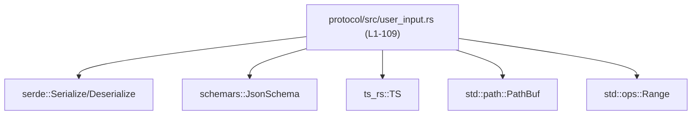
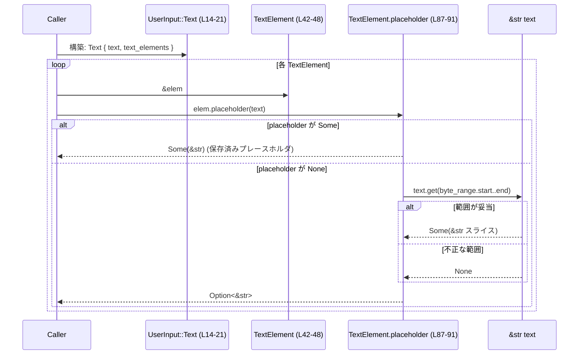

# protocol/src/user_input.rs コード解説

## 0. ざっくり一言

ユーザの入力（テキスト・画像・スキル・メンション）を表現するためのプロトコル用データ型と、テキスト中の特殊要素を指すバイト範囲（`ByteRange`）とプレースホルダ（`TextElement`）を定義するモジュールです。  
シリアライズ／スキーマ生成用のメタデータ（serde / schemars / ts-rs）も付与されています。

---

## 1. このモジュールの役割

### 1.1 概要

- このモジュールは **ユーザ入力を多種別に表現し、他コンポーネントに安全に受け渡す** ために存在します。
- 主な機能は次のとおりです。
  - テキスト・画像 URL・ローカル画像パス・スキル・メンションなどを表す `UserInput` 列挙体の定義（`UserInput`、`MAX_USER_INPUT_TEXT_CHARS`、`Text` バリアントなど。`protocol/src/user_input.rs:L7-40`）。
  - テキスト中の特殊要素の位置を表す `TextElement` と、そのバイト範囲 `ByteRange` の定義（`L42-48`, `L94-100`）。
  - `TextElement` の生成・プレースホルダの更新・バイト範囲の再マッピングなどの補助メソッド（`L50-91`）。

### 1.2 アーキテクチャ内での位置づけ

このファイル自体は純粋なデータ定義と軽量なユーティリティのみを持ち、他の自前モジュールは参照していません。依存しているのはシリアライズ・スキーマ生成用の外部クレートと標準ライブラリのみです（`use` 行 `L1-4`）。

- 依存している主な外部コンポーネント
  - `serde::{Serialize, Deserialize}`（JSON などへのシリアライズ／デシリアライズ用）`L2-3`
  - `schemars::JsonSchema`（JSON Schema 生成用）`L1`
  - `ts_rs::TS`（TypeScript 型定義生成用）`L4`
  - `std::path::PathBuf`（パス表現）`L28, L33`
  - `std::ops::Range`（`ByteRange` への変換元）`L102-107`

これを図示すると次のようになります。



この図は「user_input モジュールがどの外部コンポーネントに依存しているか」を表します。  
このチャンクには、`UserInput` がどのモジュールから利用されるかは現れないため不明です。

### 1.3 設計上のポイント

コードから読み取れる設計上の特徴は次のとおりです。

- **拡張可能な列挙体**  
  - `UserInput` は `#[non_exhaustive]` が付いており、将来バリアントを追加する前提になっています（`L9-13`）。
- **JSON/TypeScript との往復可能なプロトコル型**  
  - `UserInput`, `TextElement`, `ByteRange` すべてに `Serialize`, `Deserialize`, `TS`, `JsonSchema` が derive されています（`L11`, `L42`, `L94`）。
- **タグ付き enum シリアライズ**  
  - `#[serde(tag = "type", rename_all = "snake_case")]` により、`UserInput` は `{ "type": "text", ... }` のような形式でシリアライズされます（`L12-13`）。
- **テキスト長の上限を定数で表現**  
  - 1 メッセージがコンテキストを独占しないよう `MAX_USER_INPUT_TEXT_CHARS`（1MiB）が定義されていますが、このファイル内ではまだ使用されていません（`L6-7`）。
- **バイト範囲ベースのテキスト要素管理**  
  - `TextElement` は UTF-8 テキスト中のバイト範囲 `ByteRange` と任意のプレースホルダ文字列を持ちます（`L42-48`）。
  - プレースホルダ取得時に、事前に保存されたプレースホルダがなければ `text.get(start..end)` にフォールバックし、安全にサブスライスを取得します（`L87-91`）。
- **状態を持たない純粋型**  
  - すべての型は単なるデータの集まりで、内部でグローバル状態や I/O は行わず、副作用はありません。

---

## 2. 主要な機能一覧

- `UserInput`: ユーザ入力を、テキスト・画像・ローカル画像パス・スキル・メンションのバリアントで表現する。
- `MAX_USER_INPUT_TEXT_CHARS`: 1 つのユーザメッセージで許容されるテキスト長の上限を表す定数（1MiB）。
- `TextElement`: 親テキスト中のバイト範囲とオプションのプレースホルダを保持する。
- `TextElement::map_range`: `TextElement` のバイト範囲のみを関数で変換したコピーを作成する。
- `TextElement::placeholder`: 明示的なプレースホルダがなければ、テキストバッファから該当範囲のサブ文字列を安全に取得する。
- `ByteRange`: UTF-8 テキスト中のバイト範囲（開始・終了オフセット）を保持する。
- `From<std::ops::Range<usize>> for ByteRange`: 標準の `Range<usize>` から `ByteRange` に変換する。

### 2.1 コンポーネントインベントリー

#### 型・定数

| 名称 | 種別 | 役割 / 用途 | 定義位置 |
|------|------|-------------|----------|
| `MAX_USER_INPUT_TEXT_CHARS` | 定数 | ユーザメッセージのテキスト長上限（1 << 20） | `protocol/src/user_input.rs:L6-7` |
| `UserInput` | enum | ユーザ入力（テキスト／画像／ローカル画像／スキル／メンション）を表現 | `protocol/src/user_input.rs:L9-40` |
| `TextElement` | struct | テキスト中の特殊要素のバイト範囲とプレースホルダ文字列 | `protocol/src/user_input.rs:L42-48` |
| `ByteRange` | struct | UTF-8 テキスト中のバイト範囲（start/end バイトオフセット） | `protocol/src/user_input.rs:L94-100` |

#### 関数・メソッド

| 名称 | 所属 | 役割（1 行） | 定義位置 |
|------|------|--------------|----------|
| `TextElement::new` | `impl TextElement` | バイト範囲とプレースホルダから `TextElement` を生成する | `protocol/src/user_input.rs:L51-56` |
| `TextElement::map_range` | `impl TextElement` | バイト範囲を関数で変換した新しい `TextElement` を返す | `protocol/src/user_input.rs:L63-71` |
| `TextElement::set_placeholder` | `impl TextElement` | プレースホルダを更新する可変メソッド | `protocol/src/user_input.rs:L73-75` |
| `TextElement::_placeholder_for_conversion_only` | `impl TextElement` | テキストフォールバックを行わず、保存済みプレースホルダのみを返す | `protocol/src/user_input.rs:L83-85` |
| `TextElement::placeholder` | `impl TextElement` | 保存済みプレースホルダか、テキストのバイト範囲からサブ文字列を取得する | `protocol/src/user_input.rs:L87-91` |
| `ByteRange::from` | `impl From<Range<usize>> for ByteRange` | `a..b` 形式の範囲から `ByteRange` を生成する | `protocol/src/user_input.rs:L102-108` |

---

## 3. 公開 API と詳細解説

### 3.1 型一覧（構造体・列挙体など）

公開されている主要な型の一覧です。

| 名前 | 種別 | 役割 / 用途 | 主なフィールド | 根拠 |
|------|------|-------------|----------------|------|
| `UserInput` | enum | ユーザ入力の主要なバリアントを表現 | `Text { text, text_elements }`, `Image { image_url }`, `LocalImage { path }`, `Skill { name, path }`, `Mention { name, path }` | `protocol/src/user_input.rs:L9-40` |
| `TextElement` | struct | テキスト中の特殊要素の位置とプレースホルダ | `byte_range: ByteRange`, `placeholder: Option<String>` | `protocol/src/user_input.rs:L42-48` |
| `ByteRange` | struct | UTF-8 テキストバッファ中のバイト範囲 | `start: usize`, `end: usize` | `protocol/src/user_input.rs:L94-100` |

### 3.2 関数詳細

#### `TextElement::new(byte_range: ByteRange, placeholder: Option<String>) -> TextElement`

**概要**

`ByteRange` と任意のプレースホルダ文字列から、新しい `TextElement` を生成します（`protocol/src/user_input.rs:L51-56`）。

**引数**

| 引数名 | 型 | 説明 |
|--------|----|------|
| `byte_range` | `ByteRange` | 親テキスト中のこの要素のバイト範囲 |
| `placeholder` | `Option<String>` | UI に表示する任意のプレースホルダ文字列。`None` なら後でテキストから取得可能 |

**戻り値**

- 指定したバイト範囲とプレースホルダを持つ `TextElement` インスタンス。

**内部処理の流れ**

1. `Self { byte_range, placeholder }` でフィールドをそのまま格納して返します（`L52-55`）。

**Examples（使用例）**

```rust
use protocol::user_input::{TextElement, ByteRange};

// 親テキスト中のバイト 5..15 を指す要素を作成し、プレースホルダを設定する
let range = ByteRange { start: 5, end: 15 };           // バイト範囲を指定
let elem = TextElement::new(range, Some("[image]".into())); // プレースホルダ付きで生成
```

**Errors / Panics**

- この関数自体はエラーも panic も発生させません。
- `byte_range` の妥当性（UTF-8 上の境界か、テキスト長を超えていないか）は呼び出し側の責任です。この関数内では検証されません（コード上にチェック無し `L51-56`）。

**Edge cases（エッジケース）**

- `placeholder` に空文字列 `Some("".into())` を渡すと、プレースホルダとして空文字が保持されます。
- `byte_range.start == byte_range.end` の場合、長さ 0 の範囲となります。このモジュールでは制約が課されていません。

**使用上の注意点**

- 後で `placeholder(text)` を使ってテキストからフォールバックを得たい場合、`byte_range` が UTF-8 のコードポイント境界になっている必要があります。そうでない場合、`text.get(...)` は `None` を返す可能性があります（`L87-91`）。

---

#### `TextElement::map_range<F>(&self, map: F) -> TextElement where F: FnOnce(ByteRange) -> ByteRange`

**概要**

既存の `TextElement` から、バイト範囲だけを変換した新しい `TextElement` を生成します。プレースホルダはそのままコピーされます（`L63-71`）。

**引数**

| 引数名 | 型 | 説明 |
|--------|----|------|
| `&self` | `&TextElement` | 元になる要素 |
| `map` | `F`（`FnOnce(ByteRange) -> ByteRange`） | 現在の `byte_range` を受け取り、新しい `ByteRange` を返す関数 |

**戻り値**

- `byte_range` が `map(self.byte_range)` で更新され、`placeholder` は `self.placeholder.clone()` された新しい `TextElement`。

**内部処理の流れ**

1. `map(self.byte_range)` で新しいバイト範囲を計算します（`L68`）。
2. `placeholder` は `self.placeholder.clone()` でクローンを作ります（`L69`）。
3. 新しい `Self { byte_range, placeholder }` を返します（`L67-70`）。

**Examples（使用例）**

```rust
use protocol::user_input::{TextElement, ByteRange};

// 既存要素
let elem = TextElement::new(ByteRange { start: 10, end: 20 }, Some("[img]".into()));

// テキストの先頭に 5 バイト挿入されたので、範囲を +5 した新しい要素を作る
let shifted = elem.map_range(|r| ByteRange { start: r.start + 5, end: r.end + 5 });

// プレースホルダは同じまま
assert_eq!(shifted.placeholder("dummy"), elem.placeholder("dummy"));
```

**Errors / Panics**

- このメソッド自体もエラーや panic を発生させるコードを含みません。
- ただし `map` が panic する可能性はあります。これは `map` の実装次第であり、このモジュールでは制御しません。

**Edge cases**

- `map` が `start > end` の `ByteRange` を返しても、このメソッド自身は検証を行いません。
  - その後 `placeholder(text)` で `text.get(start..end)` を呼んだ場合、`None` が返るだけで panic はしません（`L89-90`）。
- `placeholder` が `Some` の場合はクローンされるため、長い文字列を多数クローンするとメモリ使用量が増えます。

**使用上の注意点**

- テキスト編集に追従させる用途が想定されるため、`map` 関数内でバイト範囲の整合性（0 以上、`start <= end`、テキスト長以下など）を保つことが重要です。
- 想定と異なる `ByteRange` を返してしまうと、UI 上で誤った範囲がハイライトされるなどの不整合が発生します。

---

#### `TextElement::set_placeholder(&mut self, placeholder: Option<String>)`

**概要**

既存の `TextElement` の `placeholder` フィールドを更新します（`L73-75`）。

**引数**

| 引数名 | 型 | 説明 |
|--------|----|------|
| `&mut self` | `&mut TextElement` | 更新対象の要素 |
| `placeholder` | `Option<String>` | 新しいプレースホルダ。`None` にすると削除 |

**戻り値**

- なし（`()`）。

**内部処理の流れ**

1. `self.placeholder = placeholder;` と代入するだけの単純な処理です（`L74`）。

**Examples（使用例）**

```rust
use protocol::user_input::{TextElement, ByteRange};

let mut elem = TextElement::new(ByteRange { start: 0, end: 5 }, None);

// 後からユーザがわかりやすいプレースホルダを設定する
elem.set_placeholder(Some("<file>".into()));

// プレースホルダを削除する
elem.set_placeholder(None);
```

**Errors / Panics**

- 代入のみであり、エラーや panic の可能性はありません。

**Edge cases**

- 何度でも上書き可能です。履歴や整合性は呼び出し側で管理する必要があります。

**使用上の注意点**

- `_placeholder_for_conversion_only` のような「テキストにアクセスできないコンテキスト」での使用を想定して、プレースホルダをセットしておくことができます。

---

#### `TextElement::_placeholder_for_conversion_only(&self) -> Option<&str>`

**概要**

保存済みのプレースホルダだけを返します。テキストバッファへのフォールバックは行いません（`L83-85`）。ドキュメント上、「変換専用」と明示されている内部寄りのメソッドです（`L77-82`）。

**引数**

| 引数名 | 型 | 説明 |
|--------|----|------|
| `&self` | `&TextElement` | 対象要素 |

**戻り値**

- `Option<&str>`: プレースホルダが設定されていれば `Some(&str)`、なければ `None`。

**内部処理の流れ**

1. `self.placeholder.as_deref()` をそのまま返します（`L84`）。
   - `Option<String>` を `Option<&str>` に変換する標準的なパターンです。

**Examples（使用例）**

```rust
use protocol::user_input::{TextElement, ByteRange};

let elem = TextElement::new(ByteRange { start: 0, end: 5 }, Some("[X]".into()));
assert_eq!(elem._placeholder_for_conversion_only(), Some("[X]"));

let elem2 = TextElement::new(ByteRange { start: 0, end: 5 }, None);
assert_eq!(elem2._placeholder_for_conversion_only(), None);
```

**Errors / Panics**

- エラーも panic も起こしません。

**Edge cases**

- テキストが利用できる場面では、このメソッドは使わず `placeholder(text)` を使うべき、とコメントで注意されています（`L79-81`）。

**使用上の注意点**

- `#[doc(hidden)]` が付いており、通常の公開ドキュメントには出ないことから、他のプロトコル型への変換実装専用であると明記されています（`L82`）。
- テキストバッファが手元にない変換コード内など、用途が非常に限定されるメソッドです。

---

#### `TextElement::placeholder<'a>(&'a self, text: &'a str) -> Option<&'a str>`

**概要**

プレースホルダ文字列を取得する高水準メソッドです（`L87-91`）。  
優先順位は次の通りです。

1. `self.placeholder` が `Some` なら、その文字列への参照を返す。
2. `self.placeholder` が `None` なら、`text.get(self.byte_range.start..self.byte_range.end)` でテキストの該当範囲を返す。
3. それも取得できなければ `None`。

**引数**

| 引数名 | 型 | 説明 |
|--------|----|------|
| `&self` | `&TextElement` | 要素 |
| `text` | `&str` | 親となるテキストバッファ。`byte_range` はこの文字列に対して解釈される |

**戻り値**

- `Option<&str>`: プレースホルダ、もしくはテキスト上の該当範囲への参照。取得できない場合は `None`。

**内部処理の流れ**

1. `self.placeholder.as_deref()` で保存済みプレースホルダを `Option<&str>` として取得（`L88-89`）。
2. `or_else(|| text.get(self.byte_range.start..self.byte_range.end))` により、`None` の場合のみ `text` から該当範囲のスライスを取得（`L89-90`）。
   - `str::get` は範囲が不正（範囲外・UTF-8 境界でない）でも panic せず `None` を返す安全なメソッドです。
3. 1 または 2 の結果を返す。

**Examples（使用例）**

```rust
use protocol::user_input::{TextElement, ByteRange};

// 1. プレースホルダあり
let text = "hello world";
let elem = TextElement::new(ByteRange { start: 6, end: 11 }, Some("[world]".into()));
assert_eq!(elem.placeholder(text), Some("[world]")); // プレースホルダが優先

// 2. プレースホルダなし → テキストから取得
let elem2 = TextElement::new(ByteRange { start: 6, end: 11 }, None);
assert_eq!(elem2.placeholder(text), Some("world"));

// 3. 不正な範囲 → None（panic しない）
let elem3 = TextElement::new(ByteRange { start: 100, end: 200 }, None);
assert_eq!(elem3.placeholder(text), None);
```

**Errors / Panics**

- `text.get(range)` を使っているため、範囲が不正でも panic せず `None` を返します（`L89-90`）。
- このメソッド自体からはエラー型も返されず、Result を介したエラーハンドリングはありません。

**Edge cases**

- `byte_range` が UTF-8 境界に一致しない場合、`text.get` は `None` を返し、フォールバックは失敗します。
- `byte_range.start == byte_range.end` の場合、`Some("")`（空文字列）が返る可能性があります（境界が正しければ）。
- `byte_range.start` または `end` が `text.len()` を超えていると、例外ではなく `None` になります。

**使用上の注意点**

- UI に何らかのテキストを必ず表示したい場合、このメソッドの返り値に対して `unwrap_or("<unknown>")` のようなデフォルト値指定を行う必要があります。
- あくまで「ベストエフォート」の取得であり、バイト範囲の妥当性は上流で保証しておく必要があります。

---

#### `impl From<std::ops::Range<usize>> for ByteRange`

**概要**

`a..b` 形式の `Range<usize>` を `ByteRange` に変換します（`L102-108`）。  
`From` 実装により、`ByteRange::from(0..10)` や `let br: ByteRange = (0..10).into();` のような書き方が可能になります。

**シグネチャ**

```rust
impl From<std::ops::Range<usize>> for ByteRange {
    fn from(range: std::ops::Range<usize>) -> Self { ... }
}
```

**引数**

| 引数名 | 型 | 説明 |
|--------|----|------|
| `range` | `std::ops::Range<usize>` | `start..end` 形式の標準的な範囲 |

**戻り値**

- `ByteRange { start: range.start, end: range.end }`。

**内部処理の流れ**

1. `Self { start: range.start, end: range.end }` を返すだけです（`L104-107`）。

**Examples（使用例）**

```rust
use protocol::user_input::ByteRange;

// From::from
let br1 = ByteRange::from(5..10);

// Into トレイト経由
let br2: ByteRange = (5..10).into();

assert_eq!(br1.start, 5);
assert_eq!(br1.end, 10);
```

**Errors / Panics**

- この変換自体はエラーや panic を起こしません。
- `start <= end` であるか、テキスト長との関係などは一切検証しません。

**Edge cases**

- `10..5` のような逆転した範囲もそのまま `ByteRange { start: 10, end: 5 }` として保持されます。
- 上記のような範囲は後続処理で `text.get(start..end)` を呼ぶと `None` を返すだけです。

**使用上の注意点**

- ユーザ入力や UI から受け取った `Range` をそのまま変換する前に、必要であれば検証・正規化を行うべきです。

---

### 3.3 その他の関数

- このファイルには、3.2 で列挙した 6 個以外の関数・メソッドはありません（`protocol/src/user_input.rs:L50-108` を全て確認）。

---

## 4. データフロー

### 4.1 代表的なフロー：テキスト要素のプレースホルダ解決

このモジュールで最も特徴的なデータフローは、`TextElement::placeholder` によるプレースホルダ解決です（`L87-91`）。

1. UI または上位レイヤが `UserInput::Text { text, text_elements }` を構築する（`L14-21`）。
2. 各 `TextElement` は `ByteRange` と `Option<String>` を持つ（`L42-48`）。
3. 表示や変換時に、`placeholder(text)` を呼び出し、表示用文字列を決定する。

これを sequence diagram で示します。



この図は、`UserInput::Text` の `text_elements` からプレースホルダ文字列を段階的に解決する流れを表しています。  
`text.get` を使っているため、不正なバイト範囲でも panic ではなく `None` になる点が安全性上の特徴です（`L89-90`）。

---

## 5. 使い方（How to Use）

### 5.1 基本的な使用方法

#### テキスト入力とテキスト要素

```rust
use protocol::user_input::{UserInput, TextElement, ByteRange, MAX_USER_INPUT_TEXT_CHARS};

fn build_text_input() -> UserInput {
    // ユーザが入力したテキスト
    let text = String::from("Hello, [file]!");

    // テキスト長が上限を超えないかチェック（このファイルではしていないので、利用側で行う例）
    assert!(text.chars().count() <= MAX_USER_INPUT_TEXT_CHARS);

    // "[file]" に相当する部分をバイト範囲で指定する
    let start = text.find("[file]").unwrap();          // 位置を検索（例として単純に実装）
    let end = start + "[file]".len();                  // バイト長を加算
    let elem = TextElement::new(ByteRange { start, end }, Some("[file]".into()));

    // UserInput::Text を構築する
    UserInput::Text {
        text,
        text_elements: vec![elem],
    }
}
```

このコードでは、テキスト中の `[file]` 部分を `TextElement` で表し、後で UI 側で特殊なレンダリングを行えるようにしています。

#### 画像など他のバリアント

```rust
use protocol::user_input::UserInput;
use std::path::PathBuf;

// 事前に base64 データ URL 化された画像
let img_input = UserInput::Image {
    image_url: "data:image/png;base64,...".into(),
};

// ローカルファイルパスのみ渡す
let local_img = UserInput::LocalImage {
    path: PathBuf::from("/tmp/image.png"),
};

// スキルやメンション
let skill = UserInput::Skill {
    name: "Summarize".into(),
    path: PathBuf::from("/skills/summarize/SKILL.md"),
};

let mention = UserInput::Mention {
    name: "MyConnector".into(),
    path: "app://connector-123".into(),
};
```

これらのバリアントはシンプルなフィールドのみで構成されており、シリアライズ／デシリアライズに適しています（`L23-39`）。

### 5.2 よくある使用パターン

1. **テキスト編集後の範囲更新に `map_range` を使う**

```rust
use protocol::user_input::{TextElement, ByteRange};

// 既存要素
let elem = TextElement::new(ByteRange { start: 10, end: 20 }, Some("[img]".into()));

// テキストの先頭に 3 バイト挿入された
let updated = elem.map_range(|r| ByteRange { start: r.start + 3, end: r.end + 3 });
```

1. **テキストバッファからのフォールバックを使う**

```rust
use protocol::user_input::{TextElement, ByteRange};

let text = "hello world";
let elem = TextElement::new(ByteRange { start: 6, end: 11 }, None);

// プレースホルダがないので "world" が返る
assert_eq!(elem.placeholder(text), Some("world"));
```

1. **`Range<usize>` から `ByteRange` への簡便な変換**

```rust
use protocol::user_input::ByteRange;

let br: ByteRange = (5..10).into();
```

### 5.3 よくある間違い

```rust
use protocol::user_input::{TextElement, ByteRange};

// 間違い例: UTF-8 境界を無視してバイト範囲を決める
let text = "こんにちは"; // マルチバイト文字
// 「にち」のつもりで適当にバイト範囲を指定してしまう
let wrong = TextElement::new(ByteRange { start: 2, end: 5 }, None);

// placeholder は None になる可能性が高い（text.get が失敗）
// assert!(wrong.placeholder(text).is_some()); // ← これは保証されない

// 正しい例: 実際のバイト境界を計算してから範囲を作る
let start = text.find("にち").unwrap(); // &str から開始位置を得る
let end = start + "にち".len();
let correct = TextElement::new(ByteRange { start, end }, None);
assert_eq!(correct.placeholder(text), Some("にち"));
```

このように、UTF-8 マルチバイト文字列では、単純なバイトオフセット操作で範囲を決めると誤った境界を指定しがちです。

### 5.4 使用上の注意点（まとめ）

- `byte_range` は **バイト単位** であり、UTF-8 文字境界に沿う必要があります（`L96-99` のコメントと `placeholder` 実装 `L87-91` より）。
- このモジュールはバイト範囲の検証を一切行わず、`text.get` による安全な失敗 (`None`) に委ねています。
- `UserInput` は `#[non_exhaustive]` なので、外部クレートから `match` する際はワイルドカードアームを含める必要があります（`L9-13`）。
- `LocalImage.path` や `Skill.path` は単なる `PathBuf` であり、パスの妥当性チェックは他のモジュールで行う必要があります（`L28, L32-33`）。

---

## 6. 変更の仕方（How to Modify）

### 6.1 新しい機能を追加する場合

#### 例: `UserInput` に新しいバリアントを追加する

1. **enum バリアントを追加**  
   - `UserInput` 定義部（`L13-39`）に新しいバリアントを追加します。
   - 例: 音声入力を追加するなら `Audio { url: String }` など。

2. **serde の互換性を意識**  
   - `#[serde(tag = "type", rename_all = "snake_case")]` の影響で、新バリアントの `type` フィールド値は自動的に snake_case になります。
   - 既存クライアントが未対応の場合でも、`non_exhaustive` により、ワイルドカードアームで安全に無視できる設計になっています（ただし実際のクライアントコードはこのチャンクには現れません）。

3. **関連ロジックの追加**  
   - このファイルにはロジックはほぼないため、実際の処理は他モジュールで追加する必要があります。このチャンクからは、どのファイルを修正すべきかは不明です。

4. **型スキーマへの影響**  
   - `TS` と `JsonSchema` の derive により、TypeScript 型や JSON Schema も変わるため、フロントエンドやバリデーションロジックへの影響を確認する必要があります。

### 6.2 既存の機能を変更する場合

- **`ByteRange` の意味を変える場合**
  - 現在は「UTF-8 テキストバッファ中のバイト範囲」と明示されており（`L96-99`）、`TextElement::placeholder` でもその前提で `text.get` を使っています（`L87-91`）。
  - もしコードポイント単位など別の意味に変える場合、これらのコメントと実装（`placeholder`）を一貫して変更する必要があります。

- **`TextElement::placeholder` の挙動を変える場合**
  - 現状は「保存済みプレースホルダ優先 → テキストフォールバック → None」という順序です（`L88-90`）。
  - 順序変更やエラー型の導入は、呼び出し側に大きな影響を与えるため、全呼び出し箇所を検索して確認する必要があります（呼び出し箇所はこのチャンクには現れません）。

- **`MAX_USER_INPUT_TEXT_CHARS` の値変更**
  - この定数は 1 << 20（約 1MiB）に設定されています（`L6-7`）。  
    値を増減すると、コンテキスト使用量や DoS 耐性に影響します。
  - このファイル内では未使用のため、別ファイルでの参照箇所に注意が必要です。

---

## 7. 関連ファイル

このチャンクには、自前モジュールのパス（`crate::...` など）への参照は出てきません。そのため、直接の関連ファイルは特定できません。

代わりに、本モジュールが依存している外部コンポーネントを整理します。

| パス / クレート | 役割 / 関係 | 根拠 |
|-----------------|------------|------|
| `serde::Serialize` / `serde::Deserialize` | `UserInput`, `TextElement`, `ByteRange` のシリアライズ／デシリアライズに用いられる | `protocol/src/user_input.rs:L2-3, L11, L42, L94` |
| `schemars::JsonSchema` | JSON Schema 生成用トレイト。各型に derive されている | `protocol/src/user_input.rs:L1, L11, L42, L94` |
| `ts_rs::TS` | TypeScript 型定義の自動生成に利用される | `protocol/src/user_input.rs:L4, L11, L42, L94` |
| `std::path::PathBuf` | `UserInput::LocalImage` と `UserInput::Skill` のパス表現として利用 | `protocol/src/user_input.rs:L28, L33` |
| `std::ops::Range<usize>` | `ByteRange` への変換元として `From` 実装に登場 | `protocol/src/user_input.rs:L102-108` |

テストコード・他モジュールでの利用状況については、このチャンクには現れないため不明です。

---

## Bugs / Security / 並行性に関する補足（このファイルから読み取れる範囲）

※ 専用見出しは避け、まとめとして記載します。

- **安全性（メモリ／パニック）**
  - `TextElement::placeholder` は `text.get(range)` を用いており、範囲外アクセスや UTF-8 境界違反でも panic しない設計です（`L89-90`）。
  - その他のメソッドは単純なフィールド代入とクローンのみであり、明示的な unsafe コードは存在しません（`L50-91` に `unsafe` キーワードなし）。

- **バグになりうる点（契約違反）**
  - `ByteRange` の整合性は一切チェックされません（`L94-100`, `L102-108`）。  
    呼び出し側が誤った範囲を渡すと、`placeholder` が `None` になり UI 上で要素が表示されないなどの論理バグになり得ます。

- **セキュリティ**
  - `LocalImage.path` や `Skill.path` は任意のファイルパスを保持可能です（`L28, L32-33`）。  
    このファイルではパスを利用して I/O する処理は存在しないため、セキュリティ上の影響は他のモジュール側の実装次第です。
  - テキスト長制限を示す `MAX_USER_INPUT_TEXT_CHARS` が定義されていることから、コンテキストのリソース枯渇対策として利用される意図がコメントされています（`L6-7`）。実際にチェックが行われているかはこのチャンクからは分かりません。

- **並行性**
  - このファイルにはスレッドや非同期に関するコード（`async`, `std::thread` など）は登場しません。
  - 型はすべて所有型 (`String`, `PathBuf`, `usize` 等) の組み合わせで、内部可変性も無いため、一般的にはスレッド間で所有権ごと送受信して使うことが可能な設計です。ただし実際のスレッドセーフな利用パターンは、このチャンクには現れません。
