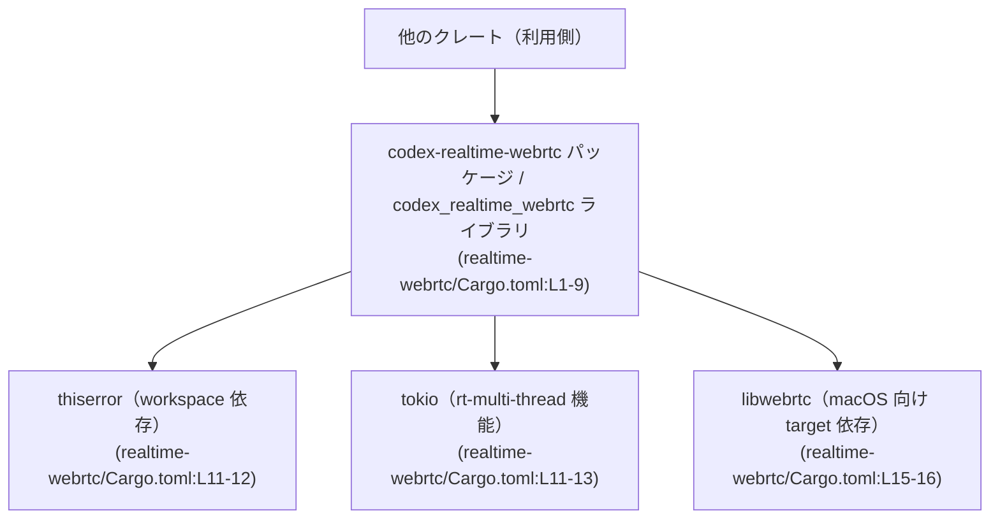
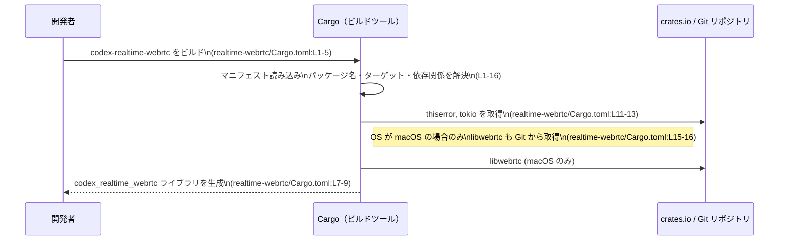

# realtime-webrtc/Cargo.toml コード解説

## 0. ざっくり一言

このファイルは、`codex-realtime-webrtc` というライブラリクレートの Cargo マニフェストで、ライブラリターゲットと依存クレート（`thiserror`・`tokio`・macOS 向け `libwebrtc`）を定義しています（`realtime-webrtc/Cargo.toml:L1-16`）。  
実際の公開 API やコアロジックは `src/lib.rs` 側にあり、このチャンクには含まれていません（`realtime-webrtc/Cargo.toml:L7-9`）。

---

## 1. このモジュールの役割

### 1.1 概要

- このファイルは、`codex-realtime-webrtc` クレートの **ビルド設定と依存関係** を定義するために存在します（`realtime-webrtc/Cargo.toml:L1-5`）。
- ライブラリターゲット `codex_realtime_webrtc` のエントリポイントを `src/lib.rs` に指定します（`realtime-webrtc/Cargo.toml:L7-9`）。
- エラー表現用に `thiserror`、非同期実行用に `tokio`（マルチスレッドランタイム）を依存として設定しています（`realtime-webrtc/Cargo.toml:L11-13`）。
- macOS ターゲットに限り、`libwebrtc` クレートに Git リポジトリから依存する設定になっています（`realtime-webrtc/Cargo.toml:L15-16`）。

### 1.2 アーキテクチャ内での位置づけ

Cargo マニフェストから読み取れる範囲での、クレートと依存関係の関係を図示します。



- 上位のアプリケーションや別クレートは、このライブラリ `codex_realtime_webrtc` を利用すると考えられます（名称と `[lib]` セクションより、`realtime-webrtc/Cargo.toml:L2-9`）。
- ライブラリ内部では、エラー表現に `thiserror` を、非同期実行基盤としてマルチスレッド版 `tokio` を利用するための依存が宣言されています（`realtime-webrtc/Cargo.toml:L11-13`）。
- macOS ビルド時のみ `libwebrtc` への依存が追加されるため、WebRTC 関連の処理は少なくとも macOS では `libwebrtc` クレートを経由する構造になっていると解釈できます（`realtime-webrtc/Cargo.toml:L15-16`）。実際の呼び出し箇所はこのチャンクには現れません。

### 1.3 設計上のポイント（Cargo.toml から分かる範囲）

- **ライブラリクレートとしての構成**  
  - `[lib]` セクションにより、バイナリではなくライブラリとしてビルドされる構成になっています（`realtime-webrtc/Cargo.toml:L7-9`）。
- **ワークスペースによる共通設定の継承**  
  - バージョン・エディション・ライセンス・リント設定をすべてワークスペースから継承しています（`version.workspace = true`, `edition.workspace = true`, `license.workspace = true`, `lints.workspace = true`, `realtime-webrtc/Cargo.toml:L3-5,L18-19`）。
- **非同期・並行実行の前提**  
  - 依存として `tokio` の `rt-multi-thread` 機能を有効化しているため、マルチスレッドの tokio ランタイムを前提とした非同期処理が想定されますが、実際の使用箇所や並行性の詳細はこのチャンクには現れません（`realtime-webrtc/Cargo.toml:L11-13`）。
- **プラットフォーム依存の WebRTC 実装**  
  - `libwebrtc` は `target_os = "macos"` のみの依存として宣言されているため、macOS とそれ以外でビルドされる依存集合が異なります（`realtime-webrtc/Cargo.toml:L15-16`）。他 OS 向けの WebRTC 実装の有無は、このチャンクからは分かりません。
- **Git 依存の固定リビジョン**  
  - `libwebrtc` は Git リポジトリと特定のコミットハッシュに固定された形で依存しており、再現性の高いビルドを意図していると考えられます（`realtime-webrtc/Cargo.toml:L16`）。

---

## 2. 主要な機能・コンポーネント一覧

このファイル自体はコードではなく設定ですが、「この Cargo.toml が定義している主要コンポーネント」を一覧化します。

### 2.1 コンポーネントインベントリー

| コンポーネント | 種別 | 説明 | 根拠 |
|----------------|------|------|------|
| `codex-realtime-webrtc` | パッケージ名 | クレートのパッケージ名。`Cargo.toml` 内での識別子となり、他クレートの `[dependencies]` から参照されます。 | `realtime-webrtc/Cargo.toml:L1-2` |
| `codex_realtime_webrtc` | ライブラリターゲット名 | Rust コードから `use codex_realtime_webrtc::...` として利用されるライブラリのクレート名です。 | `realtime-webrtc/Cargo.toml:L7-8` |
| `src/lib.rs` | ライブラリエントリポイント | ライブラリのルートモジュールとなるソースファイルです。公開 API やコアロジックはここに定義されます。中身はこのチャンクには現れません。 | `realtime-webrtc/Cargo.toml:L7-9` |
| `thiserror` | 依存クレート（workspace） | エラー型の実装に使われることが多いクレート。ここではワークスペースのバージョン設定を継承しています。実際の使用箇所は不明です。 | `realtime-webrtc/Cargo.toml:L11-12` |
| `tokio`（`rt-multi-thread`） | 依存クレート（workspace） | 非同期ランタイム。`rt-multi-thread` 機能が有効化されており、マルチスレッド実行が可能です。具体的な API 利用はこのチャンクには現れません。 | `realtime-webrtc/Cargo.toml:L11-13` |
| `libwebrtc` | ターゲット依存クレート | macOS でのみ利用される WebRTC 関連クレート。バージョンと Git のコミットハッシュで固定されています。他 OS での扱いは不明です。 | `realtime-webrtc/Cargo.toml:L15-16` |
| `lints.workspace` | リント設定 | コンパイラ/Clippy の警告・エラー設定をワークスペース共通設定から継承します。具体的なルール内容はワークスペース側の設定に依存し、このチャンクには現れません。 | `realtime-webrtc/Cargo.toml:L18-19` |

### 2.2 関数・構造体インベントリー（このファイル）

- このファイルは Cargo の設定ファイルであり、Rust の **関数や構造体定義は一切含まれていません**。
- したがって、このチャンクに基づいて列挙できる公開 API（関数・型）はありません。  
  公開 API は `src/lib.rs` 以下に定義されていると考えられますが、その内容はこのチャンクには現れません（`realtime-webrtc/Cargo.toml:L7-9`）。

---

## 3. 公開 API と詳細解説

### 3.1 型一覧（構造体・列挙体など）

- `realtime-webrtc/Cargo.toml` には、構造体・列挙体・型エイリアスなどの Rust の型定義は含まれていません。
- そのため、**公開されている型をこのチャンクから特定することはできません**。  
  型定義は `src/lib.rs` やその配下のモジュールに存在すると考えられます（`realtime-webrtc/Cargo.toml:L7-9`）。

### 3.2 関数詳細（最大 7 件）

- このファイルには Rust の関数定義が存在しないため、**関数レベルの詳細解説（引数・戻り値・エラーハンドリング・エッジケースなど）は行えません**。
- 公開 API となる関数やメソッドは、`src/lib.rs` など別ファイルに定義されており、このチャンクには現れません。

### 3.3 その他の関数

- 補助関数やラッパー関数を含め、**関数情報はこのチャンクには一切登場しません**。

---

## 4. データフロー

このファイルからは **実行時のデータフロー** は読み取れませんが、**ビルド時の依存解決フロー** は把握できます。Cargo がこのファイルを用いてどのように依存クレートを取得するかを図示します。



- この図は **ビルド時の挙動** を表しており、**実行時の関数呼び出しやデータフローはこのチャンクからは不明**です。
- 並行性やエラー伝搬の具体的な設計は `src/lib.rs` などのコード側を確認する必要があります。

---

## 5. 使い方（How to Use）

このセクションでは、**Cargo.toml の設定としての使い方**と、クレートを利用する際の一般的なパターン（推測を明示）を説明します。

### 5.1 基本的な使用方法（他クレートからの依存）

このクレートを別のクレートから利用する場合、パッケージ名 `codex-realtime-webrtc` を使って依存関係を追加します（`realtime-webrtc/Cargo.toml:L2`）。

```toml
# 例: 同じワークスペース内の別クレートからの依存
[dependencies]
codex-realtime-webrtc = { path = "realtime-webrtc" } # パッケージ名に基づいて指定（L2）
```

Rust コード側では、ライブラリ名 `codex_realtime_webrtc` をクレートとして `use` します（`realtime-webrtc/Cargo.toml:L7-8`）。

```rust
// ライブラリクレートの利用例（公開 API の詳細はこのチャンクからは不明）
use codex_realtime_webrtc::*; // L7-8 で定義されているライブラリ名

fn main() {
    // 実際に呼び出せる関数・型は src/lib.rs の定義に依存します
    // このチャンクにはそれらの定義は現れません。
}
```

### 5.2 よくある使用パターン（推測を含む一般論）

`tokio` の `rt-multi-thread` 機能が有効化されているため（`realtime-webrtc/Cargo.toml:L11-13`）、**非同期 API を提供するクレートであれば**、以下のようなマルチスレッドランタイム上で利用されることが一般的です。

```rust
// 一般的な tokio マルチスレッドランタイムのエントリポイントの例
// ※ codex_realtime_webrtc にこの形の API が存在するかどうかは、このチャンクからは分かりません。
#[tokio::main(flavor = "multi_thread")]
async fn main() {
    // ここで codex_realtime_webrtc の非同期 API を呼び出す可能性があります
    // 具体的な関数名や型は src/lib.rs を確認する必要があります。
}
```

上記は **tokio ベースクレートの一般的な利用例**であり、`codex_realtime_webrtc` 特有の API を示すものではありません。

### 5.3 よくある間違い（このファイルから予想されるもの）

この Cargo.toml から推測できる、設定・依存に関する典型的な注意点を示します。

```toml
# 間違い例: パッケージ名ではなくライブラリ名で依存を書いてしまう
[dependencies]
codex_realtime_webrtc = "0.1"  # ライブラリ名（L7-8）だが、Cargo の依存指定にはパッケージ名が必要

# 正しい例: パッケージ名を使う
[dependencies]
codex-realtime-webrtc = "0.1"  # パッケージ名（L2）
```

- **macOS 以外での libwebrtc 依存の勘違い**  
  - `libwebrtc` 依存は `target_os = "macos"` に限定されています（`realtime-webrtc/Cargo.toml:L15-16`）。  
    他 OS では自動的には `libwebrtc` が導入されないため、コード側で `cfg(target_os = "macos")` を用いたガードが適切に行われていないと、ビルドエラーになる可能性があります。  
    ただし、実際にどうガードしているかはこのチャンクからは分かりません。

### 5.4 使用上の注意点（まとめ）

このファイルから読み取れる範囲での注意点を整理します。

- **公開 API の確認が必要**  
  - このチャンクはマニフェストのみであり、関数や型などの公開 API は一切示されていません。  
    実際の利用時は `src/lib.rs` 以下のコードとドキュメントを確認する必要があります（`realtime-webrtc/Cargo.toml:L7-9`）。
- **非同期・並行性の前提**  
  - `tokio` の `rt-multi-thread` が有効なため（`realtime-webrtc/Cargo.toml:L11-13`）、マルチスレッドランタイム上で実行されることを前提にした設計である可能性があります。  
    その場合、`Send` でない型をタスクに渡すとコンパイルエラーになるなど、tokio 特有の制約を受けることが多いですが、具体的な型はこのチャンクには現れません。
- **プラットフォーム依存コードへの配慮**  
  - macOS のみで `libwebrtc` が利用可能な構成になっているため（`realtime-webrtc/Cargo.toml:L15-16`）、WebRTC 関連機能が他 OS でどのように扱われるか（無効化・代替実装など）は別途確認が必要です。
- **ビルドの再現性とセキュリティ**  
  - `libwebrtc` は Git のコミットハッシュでピン留めされており（`realtime-webrtc/Cargo.toml:L16`）、サプライチェーンの変動リスクを軽減する意図が推測されます。  
    一方で、Git リポジトリの可用性に依存するため、ビルド環境によってはクローンに失敗する可能性があります。

---

## 6. 変更の仕方（How to Modify）

### 6.1 新しい機能を追加する場合（依存やターゲットの拡張）

この Cargo.toml を変更して新機能・新プラットフォームを追加する際の典型的な入口を示します。

1. **新しい依存クレートの追加**  
   - 新機能に必要なクレートは、`[dependencies]` ブロックに追加します（`realtime-webrtc/Cargo.toml:L11-13`）。
   - 例: 追加のシグナリング機能用に別クレートを導入する場合。
2. **別 OS 向けの WebRTC 実装の追加**（設計によっては）  
   - macOS 以外でも `libwebrtc` または別の WebRTC クレートを使いたい場合は、`[target.'cfg(...)'.dependencies]` を追加します（`realtime-webrtc/Cargo.toml:L15-16` を参考に同様の形式で追加）。
3. **ワークスペース設定との整合性確認**  
   - バージョンやリントポリシーはワークスペースから継承されているため（`realtime-webrtc/Cargo.toml:L3-5,L18-19`）、新機能追加時にワークスペースレベルでの互換性も確認する必要があります。

### 6.2 既存の機能を変更する場合（Cargo 設定の変更）

1. **tokio の機能フラグを変更する場合**  
   - 現在は `rt-multi-thread` が有効です（`realtime-webrtc/Cargo.toml:L11-13`）。  
     これを変更すると、`src/lib.rs` 側で期待しているランタイム（シングルスレッド vs マルチスレッド）と齟齬が生じる可能性があります。  
     コード側で `spawn_blocking` などの API を利用している場合、動作や制約が変わる可能性があるため、呼び出し箇所の確認が必要です。  
     ただし、具体的な API 利用はこのチャンクには現れません。
2. **libwebrtc のリビジョンを更新する場合**  
   - `rev` フィールドを変更すると、内部の WebRTC 実装の挙動が変わる可能性があります（`realtime-webrtc/Cargo.toml:L16`）。  
     API の変更やバグ修正の影響を把握するためには、`libwebrtc` 側のリリースノートやコードを参照する必要があります。
3. **ターゲット条件の変更**  
   - `target_os = "macos"` の条件を変更すると、ビルド対象プラットフォームにおける依存構成が変わります（`realtime-webrtc/Cargo.toml:L15-16`）。  
     それに応じてコード側の `cfg` 属性も整合性を取る必要がありますが、そのコードはこのチャンクには現れません。

---

## 7. 関連ファイル

この Cargo.toml と密接に関係するファイル・設定を列挙します。

| パス / 場所 | 役割 / 関係 |
|-------------|------------|
| `realtime-webrtc/src/lib.rs` | `[lib]` セクションでエントリポイントとして指定されているファイルで、`codex_realtime_webrtc` クレートの公開 API とコアロジックが定義されていると考えられます（`realtime-webrtc/Cargo.toml:L7-9`）。このチャンクには内容が現れません。 |
| ワークスペースルートの `Cargo.toml` | `version.workspace = true`, `edition.workspace = true`, `license.workspace = true`, `lints.workspace = true` で参照される設定の実体です（`realtime-webrtc/Cargo.toml:L3-5,L18-19`）。具体的なパスや設定内容はこのチャンクからは分かりません。 |
| `libwebrtc` クレートの Git リポジトリ | macOS ビルド時に取得される WebRTC 関連クレートです（`realtime-webrtc/Cargo.toml:L16`）。このリポジトリの構造や API はこのチャンクには現れません。 |

---

### Bugs / Security / Contracts / Tests / Performance に関する補足（このチャンクから分かる範囲）

- **Bugs**:  
  - このファイルは設定のみであり、ロジックに起因するバグは読み取れません。  
  - `libwebrtc` の Git 依存が利用不能になった場合、ビルドが失敗する可能性はあります（`realtime-webrtc/Cargo.toml:L16`）。
- **Security**:  
  - 外部 Git 依存を使っている点でサプライチェーンリスクが存在しますが、コミットハッシュ固定により一定の再現性は確保されています（`realtime-webrtc/Cargo.toml:L16`）。  
  - 実際の暗号化や認証などのセキュリティロジックは、このチャンクからは一切分かりません。
- **Contracts / Edge Cases**:  
  - OS によって依存構成が変わる点（macOS のみ libwebrtc 有効）が、ビルド時の「契約」として読み取れます（`realtime-webrtc/Cargo.toml:L15-16`）。  
  - 非 macOS 環境で WebRTC 関連機能をどう扱うかは、このチャンクには現れません。
- **Tests**:  
  - テストに関する設定や依存（`[dev-dependencies]` など）はこのファイルには記載されていません。テストコードの有無や内容は不明です。
- **Performance / Scalability**:  
  - マルチスレッド tokio ランタイムを前提としている可能性があり、並列化を意識した設計であることが推測されますが（`realtime-webrtc/Cargo.toml:L11-13`）、実際の性能特性・スケーラビリティはコード側を確認する必要があります。

このチャンクだけでは公開 API とコアロジックの具体像は分からず、**設定レベルでの構造と前提条件のみ**が把握できる状態です。
