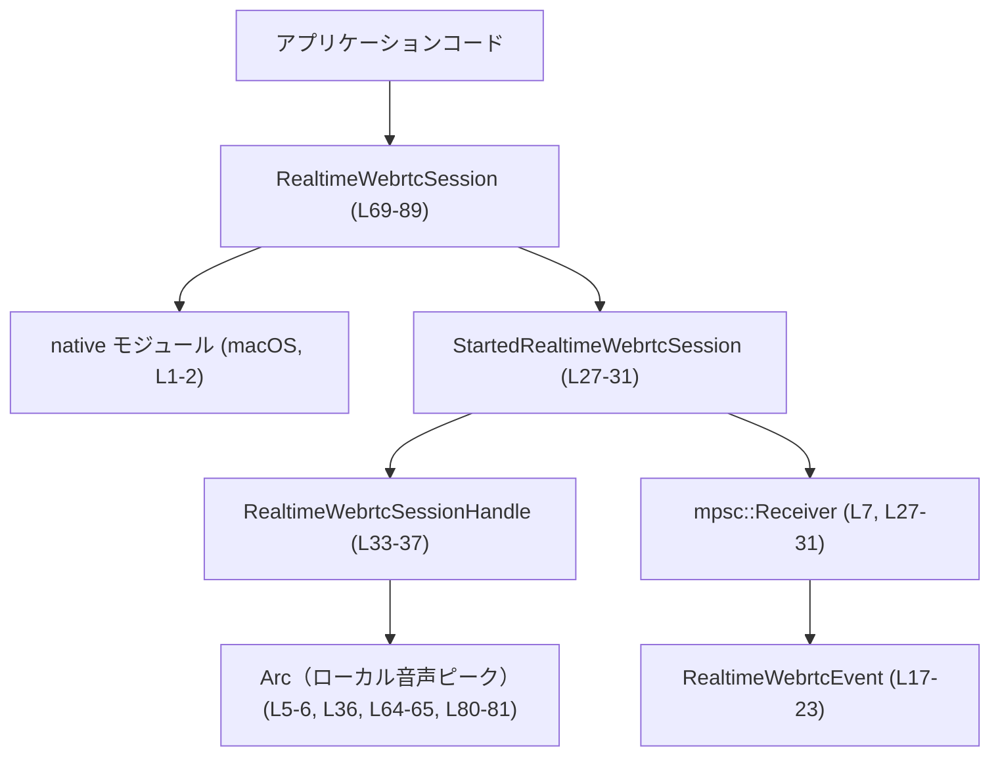
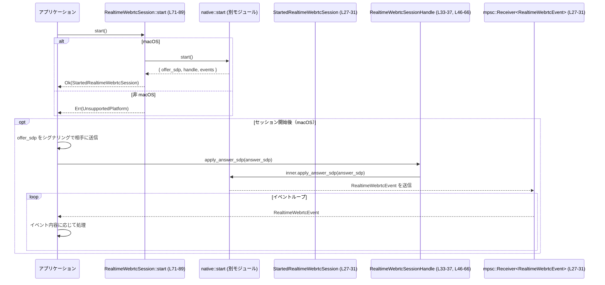

# realtime-webrtc/src/lib.rs コード解説

---

## 0. ざっくり一言

このモジュールは、「リアルタイム WebRTC セッション」を開始し、そのセッションへのハンドルとイベントストリームをアプリケーションに引き渡すための、プラットフォーム依存ラッパーを提供します（macOS のみ対応、その他はエラーを返す設計です）（`RealtimeWebrtcSession`, `StartedRealtimeWebrtcSession`, `RealtimeWebrtcSessionHandle`、`native` モジュールとの連携, `RealtimeWebrtcError::UnsupportedPlatform` など）。  
（realtime-webrtc/src/lib.rs:L1-2, L9-15, L27-31, L33-37, L69-89）

---

## 1. このモジュールの役割

### 1.1 概要

- このモジュールは、**リアルタイム WebRTC セッションの開始と制御を統一的に扱う API** を提供します。  
  （`RealtimeWebrtcSession::start`, `RealtimeWebrtcSessionHandle` のメソッド群）  
  （realtime-webrtc/src/lib.rs:L33-37, L46-66, L69-89）
- 実際の WebRTC 処理は macOS 専用の `native` モジュールに委譲され、非 macOS では `UnsupportedPlatform` エラーを返して機能しません。  
  （`#[cfg(target_os = "macos")] mod native;`, `RealtimeWebrtcError::UnsupportedPlatform` の利用）  
  （realtime-webrtc/src/lib.rs:L1-2, L9-15, L47-56, L71-88）
- セッション開始時に SDP の offer 文字列とイベント受信用の `mpsc::Receiver`、および操作用ハンドルがまとめて返されます。  
  （`StartedRealtimeWebrtcSession` のフィールド）  
  （realtime-webrtc/src/lib.rs:L27-31）

### 1.2 アーキテクチャ内での位置づけ

アプリケーションと macOS 向けネイティブ実装の間に位置する薄いラッパーとして動作します。



- `native` モジュール（macOS のみ有効）が WebRTC の実処理と OS 連携を担い、このファイルはその公開 API を定義しています。`native` の具体的実装はこのチャンクには現れません。  
  （realtime-webrtc/src/lib.rs:L1-2, L73-76）
- アプリケーションは `RealtimeWebrtcSession::start()` を呼び、`StartedRealtimeWebrtcSession` 経由で offer SDP・ハンドル・イベント受信機を受け取ります。  
  （realtime-webrtc/src/lib.rs:L27-31, L71-83）

### 1.3 設計上のポイント

- **プラットフォーム分岐をコンパイル時に行う構造**  
  - `#[cfg(target_os = "macos")]` / `#[cfg(not(target_os = "macos"))]` により、macOS とそれ以外で異なる実装がコンパイルされます。  
    （realtime-webrtc/src/lib.rs:L1-2, L34-35, L47-56, L59-61, L73-88）
- **エラー表現の統一**  
  - ライブラリ固有のエラー型 `RealtimeWebrtcError` と `Result<T>` エイリアスを用いることで、すべての公開 API が同じエラー表現を使います。  
    （realtime-webrtc/src/lib.rs:L9-15, L25, L47-56, L71-88）
- **イベント駆動 + メッセージング**  
  - セッションの状態や音声レベルなどは `mpsc::Receiver<RealtimeWebrtcEvent>` から非同期に受け取る設計です（送信側は `native` 側と推測されますが、このチャンクには現れません）。  
    （realtime-webrtc/src/lib.rs:L17-23, L27-31）
- **スレッド安全な共有状態**  
  - ローカル音声ピーク値は `Arc<AtomicU16>` で保持されており、スレッド間で安全に共有・更新できる形になっています。  
    （realtime-webrtc/src/lib.rs:L5-6, L33-37, L64-65, L80-81）
- **セッション開始 API をユニット構造体に集約**  
  - `RealtimeWebrtcSession` 自体は状態を持たないユニット構造体で、`start` メソッドのみを提供しています。  
    （realtime-webrtc/src/lib.rs:L69-72）

---

## 2. 主要な機能一覧

- WebRTC セッション開始: `RealtimeWebrtcSession::start()` で新しいセッションを開始し、offer SDP・ハンドル・イベント受信機を取得する。  
  （realtime-webrtc/src/lib.rs:L27-31, L71-83）
- SDP answer の適用: `RealtimeWebrtcSessionHandle::apply_answer_sdp` でリモート側から受け取った answer SDP を適用する。  
  （realtime-webrtc/src/lib.rs:L46-57）
- セッションの明示的な終了: `RealtimeWebrtcSessionHandle::close` でセッションをクローズする（macOS のみ有効）。  
  （realtime-webrtc/src/lib.rs:L59-62）
- ローカル音声ピーク値の共有: `RealtimeWebrtcSessionHandle::local_audio_peak` で `Arc<AtomicU16>` を取得し、アプリケーション側で参照または更新できるようにする。  
  （realtime-webrtc/src/lib.rs:L33-37, L64-65, L80-81）
- セッション状態のイベント購読: `StartedRealtimeWebrtcSession.events` から `RealtimeWebrtcEvent` を受信する。  
  （realtime-webrtc/src/lib.rs:L17-23, L27-31）

---

## 3. 公開 API と詳細解説

### 3.1 型一覧（構造体・列挙体など）

| 名前 | 種別 | 公開 | 役割 / 用途 | 定義位置 |
|------|------|------|-------------|----------|
| `RealtimeWebrtcError` | 列挙体（enum） | 公開 | ライブラリ内で発生するエラー（汎用メッセージ or 非対応プラットフォーム）を表現する。`thiserror::Error` を実装。 | realtime-webrtc/src/lib.rs:L9-15 |
| `RealtimeWebrtcEvent` | 列挙体（enum） | 公開 | セッションから通知されるイベント（接続完了、ローカル音声レベル、クローズ、失敗）を表現する。 | realtime-webrtc/src/lib.rs:L17-23 |
| `Result<T>` | 型エイリアス | 公開 | `std::result::Result<T, RealtimeWebrtcError>` の別名。公開 API の戻り値で一貫して使用。 | realtime-webrtc/src/lib.rs:L25 |
| `StartedRealtimeWebrtcSession` | 構造体 | 公開 | `start` 実行後に返される束。offer SDP、操作用ハンドル、イベント受信機を保持する。 | realtime-webrtc/src/lib.rs:L27-31 |
| `RealtimeWebrtcSessionHandle` | 構造体 | 公開 | 実行中セッションを操作するためのハンドル。内部でプラットフォーム依存の `native::SessionHandle` とローカル音声ピーク値を保持する。 | realtime-webrtc/src/lib.rs:L33-37 |
| `RealtimeWebrtcSession` | ユニット構造体 | 公開 | セッション開始 API をまとめるための名前的な型。状態は持たない。 | realtime-webrtc/src/lib.rs:L69 |
| `native` | モジュール | 非公開 | macOS 専用のネイティブ実装を含むと考えられるモジュール。`SessionHandle` 型と `start()` 関数を提供（このチャンクには定義なし）。 | realtime-webrtc/src/lib.rs:L1-2 |

### 3.2 関数詳細

#### `RealtimeWebrtcSession::start() -> Result<StartedRealtimeWebrtcSession>`

**概要**

- 新しいリアルタイム WebRTC セッションを開始し、offer SDP・セッションハンドル・イベント受信用の `mpsc::Receiver` をまとめた `StartedRealtimeWebrtcSession` を返します。  
  （realtime-webrtc/src/lib.rs:L27-31, L71-83）
- macOS では `native::start()` に処理を委譲し、それ以外のプラットフォームでは `UnsupportedPlatform` エラーになります。  
  （realtime-webrtc/src/lib.rs:L71-88）

**引数**

- なし。

**戻り値**

- `Result<StartedRealtimeWebrtcSession>`  
  - `Ok(StartedRealtimeWebrtcSession)` : セッション開始に成功した場合。offer SDP 文字列、`RealtimeWebrtcSessionHandle`、`mpsc::Receiver<RealtimeWebrtcEvent>` を含みます。  
    （realtime-webrtc/src/lib.rs:L27-31, L71-83）
  - `Err(RealtimeWebrtcError)` : セッション開始に失敗した場合。macOS では `native::start()` によるエラーがラップされる可能性があり、非 macOS では必ず `UnsupportedPlatform` が返されます。  
    （realtime-webrtc/src/lib.rs:L9-15, L71-88）

**内部処理の流れ**

macOS の場合（`#[cfg(target_os = "macos")]`）:

1. `native::start()` を呼び出して、内部型の `started` を取得します。`?` によってエラーはそのまま呼び出し元へ伝播します。  
   （realtime-webrtc/src/lib.rs:L73-76）
2. `started` から `offer_sdp`、`handle`、`events` フィールドを取り出し、新しい `StartedRealtimeWebrtcSession` を構築します。  
   （realtime-webrtc/src/lib.rs:L75-83）
3. `RealtimeWebrtcSessionHandle` を作成する際に、`inner` に `started.handle` を代入し、`local_audio_peak` には `Arc::new(AtomicU16::new(0))` で新規のアトミック変数を設定します。  
   （realtime-webrtc/src/lib.rs:L78-81）
4. 生成した `StartedRealtimeWebrtcSession` を `Ok(...)` で包んで返します。  
   （realtime-webrtc/src/lib.rs:L76-83）

非 macOS の場合（`#[cfg(not(target_os = "macos"))]`）:

1. 何も処理を行わず、即座に `Err(RealtimeWebrtcError::UnsupportedPlatform)` を返します。  
   （realtime-webrtc/src/lib.rs:L85-88）

**Examples（使用例）**

以下では、クレート名を `realtime_webrtc` と仮定しています（実際のクレート名に置き換えてください）。

```rust
// macOS 前提でセッションを開始し、結果を処理する例
use realtime_webrtc::{RealtimeWebrtcSession, RealtimeWebrtcEvent, Result}; // 公開 API のインポート

fn start_session_example() -> Result<()> {                     // ライブラリの Result<T> を利用
    let started = RealtimeWebrtcSession::start()?;             // セッション開始（macOS 以外では Err）

    // StartedRealtimeWebrtcSession から各要素を取り出す
    let offer_sdp = started.offer_sdp;                         // 相手に送る offer SDP 文字列
    let handle = started.handle;                               // セッション操作用ハンドル
    let events = started.events;                               // イベント受信機（mpsc::Receiver）

    // ここで offer_sdp をシグナリングチャンネル経由で相手に送るなどの処理を行う
    // ...

    // イベントを受信する（ブロッキング）
    std::thread::spawn(move || {                               // 別スレッドでイベント処理
        while let Ok(event) = events.recv() {                  // recv() が Ok の間ループ
            match event {                                      // RealtimeWebrtcEvent に応じて分岐
                RealtimeWebrtcEvent::Connected => {
                    // 接続完了時の処理
                }
                RealtimeWebrtcEvent::LocalAudioLevel(level) => {
                    // ローカル音声レベルの利用
                }
                RealtimeWebrtcEvent::Closed => {
                    break;                                     // セッション終了
                }
                RealtimeWebrtcEvent::Failed(reason) => {
                    eprintln!("WebRTC failed: {}", reason);    // エラーのログ出力
                    break;
                }
            }
        }
    });

    Ok(())                                                     // 正常終了
}
```

**Errors / Panics**

- `Errors`  
  - macOS 以外: 常に `Err(RealtimeWebrtcError::UnsupportedPlatform)` を返します。  
    （realtime-webrtc/src/lib.rs:L85-88）
  - macOS: `native::start()` が `Err` を返した場合、そのエラーが `Result` を通じてそのまま呼び出し元に返されます（`?` による伝播）。`native::start()` の具体的なエラー内容はこのチャンクには現れません。  
    （realtime-webrtc/src/lib.rs:L73-76）
- `Panics`  
  - このファイル内の実装では `panic!` や `unwrap` などは使用しておらず、`start` 自体から panic が発生するコードはありません（`native::start()` 内は不明）。  
    （realtime-webrtc/src/lib.rs:L71-88）

**Edge cases（エッジケース）**

- 非対応 OS（Linux / Windows など）で呼び出すと、必ず `UnsupportedPlatform` になり、セッションは開始されません。  
  （realtime-webrtc/src/lib.rs:L85-88）
- macOS 上で `native::start()` が内部的にどのような条件で失敗するかは、このチャンクからは分かりません。エラーは `RealtimeWebrtcError` でラップされる可能性がありますが、詳細は `native` 側の実装に依存します。  
  （realtime-webrtc/src/lib.rs:L9-15, L73-76）

**使用上の注意点**

- 呼び出し前に、**実行環境が macOS であること** を前提にする必要があります。非 macOS では常にエラーになるため、「WebRTC が利用できない」という前提でフォールバック処理を設計する必要があります。  
  （realtime-webrtc/src/lib.rs:L85-88）
- `start()` が成功した後は、返された `mpsc::Receiver` をどこかでポーリングまたはブロッキング受信しないと、イベントが処理されないままになります（標準ライブラリの `mpsc::Receiver` の仕様に従います）。  
  （realtime-webrtc/src/lib.rs:L27-31）
- `StartedRealtimeWebrtcSession` は所有権を持つ構造体なので、offer SDP、ハンドル、イベントをどのスレッドにどのように移動させるかを明示的に設計する必要があります（所有権・`Send`/`Sync` の性質は Rust 標準のルールに従います）。

---

#### `RealtimeWebrtcSessionHandle::apply_answer_sdp(&self, answer_sdp: String) -> Result<()>`

**概要**

- リモート側から受信した SDP answer をネイティブ層に適用するためのメソッドです（名前と引数からの推測）。  
  （realtime-webrtc/src/lib.rs:L46-57）
- macOS では `inner.apply_answer_sdp` に委譲し、非 macOS では `UnsupportedPlatform` エラーを返します。  
  （realtime-webrtc/src/lib.rs:L47-56）

**引数**

| 引数名 | 型 | 説明 |
|--------|----|------|
| `answer_sdp` | `String` | リモート側から受信した SDP answer 文字列。フォーマットや内容の検証はこのファイルでは行っていません。 | （realtime-webrtc/src/lib.rs:L47） |

**戻り値**

- `Result<()>`  
  - `Ok(())` : 適用に成功した場合（macOS のみ）。  
  - `Err(RealtimeWebrtcError)` : 失敗時のエラー。非 macOS では常に `UnsupportedPlatform`。macOS での詳細なエラー種別は `native::SessionHandle::apply_answer_sdp` に依存し、このチャンクからは分かりません。  
    （realtime-webrtc/src/lib.rs:L9-15, L47-56）

**内部処理の流れ**

1. macOS の場合のみ `self.inner.apply_answer_sdp(answer_sdp)` を呼び出し、その `Result<()>` をそのまま戻り値とします。  
   （realtime-webrtc/src/lib.rs:L47-51）
2. 非 macOS の場合は、`answer_sdp` を未使用変数警告回避のために一度束縛した後、`Err(RealtimeWebrtcError::UnsupportedPlatform)` を返します。  
   （realtime-webrtc/src/lib.rs:L52-56）

**Examples（使用例）**

```rust
use realtime_webrtc::{RealtimeWebrtcSession, Result};    // 公開 API のインポート

fn apply_answer_example(answer_sdp: String) -> Result<()> {
    let started = RealtimeWebrtcSession::start()?;       // セッション開始
    let handle = started.handle;                         // ハンドルを取得

    // 受信済みの answer SDP を適用
    handle.apply_answer_sdp(answer_sdp)?;                // エラーは ? で呼び出し元へ伝播

    Ok(())
}
```

**Errors / Panics**

- `Errors`  
  - 非 macOS: 常に `Err(RealtimeWebrtcError::UnsupportedPlatform)` を返します。  
    （realtime-webrtc/src/lib.rs:L52-56）
  - macOS: `self.inner.apply_answer_sdp(answer_sdp)` の戻り値が `Err` である場合、そのエラーがそのまま返されます。どのような条件で `Err` になるかは `native::SessionHandle` の実装に依存し、このチャンクには現れません。  
    （realtime-webrtc/src/lib.rs:L47-51）
- `Panics`  
  - このメソッド内に panic を発生させるコードはありません。  

**Edge cases（エッジケース）**

- 空文字列の `answer_sdp` や不正な SDP 形式の扱いは、このファイルでは一切検証しておらず、すべて `native::SessionHandle::apply_answer_sdp` 側の責務になっています。ライブラリの外側では、入力検証を行うかどうかを設計段階で検討する必要があります。  
  （realtime-webrtc/src/lib.rs:L47-51）
- セッションがすでにクローズされている状態で `apply_answer_sdp` を呼ぶとどうなるかは、このチャンクからは分かりません。  

**使用上の注意点**

- `start()` と同様、**実行環境が macOS でないと機能しません**。非対応プラットフォームでは常に `UnsupportedPlatform` エラーとなるため、エラー結果を見てフォールバック処理を行う必要があります。  
  （realtime-webrtc/src/lib.rs:L52-56）
- `answer_sdp` の所有権がこのメソッドにムーブされるため、呼び出し後に同じ文字列を再利用したい場合は、呼び出し前に `clone` するなどの配慮が必要です。  

---

#### `RealtimeWebrtcSessionHandle::close(&self)`

**概要**

- セッションを明示的にクローズするためのメソッドです。  
  （realtime-webrtc/src/lib.rs:L59-62）
- macOS では `inner.close()` に委譲し、非 macOS では何も行いません（空のメソッドになります）。  
  （realtime-webrtc/src/lib.rs:L59-62）

**引数**

- なし（`&self` のみ）。

**戻り値**

- 戻り値はなく、副作用（セッション終了）が期待されるメソッドです。  
  （realtime-webrtc/src/lib.rs:L59-62）

**内部処理の流れ**

1. macOS のみ `self.inner.close()` を呼び出します。  
   （realtime-webrtc/src/lib.rs:L60-61）
2. 非 macOS の場合、このメソッド本体は空であり、何も実行されません（`#[cfg(target_os = "macos")]` により該当行が除去されるため）。  
   （realtime-webrtc/src/lib.rs:L59-62）

**Examples（使用例）**

```rust
use realtime_webrtc::{RealtimeWebrtcSession, Result};

fn close_example() -> Result<()> {
    let started = RealtimeWebrtcSession::start()?;    // セッションを開始
    let handle = started.handle;                      // ハンドル取得

    // 何らかの処理の後にセッションを明示的にクローズ
    handle.close();                                   // macOS ではネイティブ層にクローズ要求

    Ok(())
}
```

**Errors / Panics**

- 戻り値がないため、エラーは呼び出し元で検知できません。`native::SessionHandle::close` が内部的にエラーを持つ設計かどうかは、このチャンクからは分かりません。  
  （realtime-webrtc/src/lib.rs:L59-61）
- このメソッド内には panic を発生させるコードはありません。

**Edge cases（エッジケース）**

- 複数回 `close()` を呼び出した場合の挙動は、このファイルからは分かりません。一般的には idempotent（多重呼び出し可）に設計されることが多いですが、ここでは断定できません。  
- 非 macOS ではこのメソッドは何もしないため、「クローズした」とみなせません。プラットフォームごとの差異に注意が必要です。  

**使用上の注意点**

- 非 macOS では実質 no-op になるため、クローズ処理に依存するロジック（例えばリソース解放や状態遷移）は、`UnsupportedPlatform` のケースも考慮した設計にする必要があります。  
- イベントストリームに `Closed` イベントが送られるかどうかは `native` 側の実装次第であり、このチャンクからは分かりません。`RealtimeWebrtcEvent::Closed` の variant が存在するため、その可能性はあります。  
  （realtime-webrtc/src/lib.rs:L17-23）

---

#### `RealtimeWebrtcSessionHandle::local_audio_peak(&self) -> Arc<AtomicU16>`

**概要**

- ローカル音声のピーク値を保持する `Arc<AtomicU16>` を取得するメソッドです。  
  （realtime-webrtc/src/lib.rs:L33-37, L64-65）
- `Arc` によってスレッド間で共有でき、`AtomicU16` によりロックなしで同じ値を読み書きできます（Rust 標準ライブラリの仕様）。  

**引数**

- なし（`&self` のみ）。

**戻り値**

- `Arc<AtomicU16>`  
  - セッションハンドル内部に保持されている `local_audio_peak` のクローンです。`Arc::clone` により参照カウントを増やして返します。  
    （realtime-webrtc/src/lib.rs:L36, L64-65）

**内部処理の流れ**

1. `self.local_audio_peak.clone()` を実行して新しい `Arc` を作成し、そのまま返します。  
   （realtime-webrtc/src/lib.rs:L64-65）
2. 返された `Arc` は元の `Arc` と同じ `AtomicU16` を指しているため、どのクローンからでも同じ値を読み書きできます。

**Examples（使用例）**

```rust
use std::sync::atomic::{AtomicU16, Ordering};
use realtime_webrtc::{RealtimeWebrtcSession, Result};

fn audio_peak_example() -> Result<()> {
    let started = RealtimeWebrtcSession::start()?;           // セッション開始
    let handle = started.handle;                             // ハンドル取得

    let peak_arc = handle.local_audio_peak();                // Arc<AtomicU16> を取得
    let peak_value: u16 = peak_arc.load(Ordering::Relaxed);  // 現在値を読み取り

    println!("current local audio peak: {}", peak_value);

    // アプリケーション側で更新したい場合（あくまで例）
    peak_arc.store(100, Ordering::Relaxed);                  // 新しいピーク値を書き込み

    Ok(())
}
```

**Errors / Panics**

- このメソッド自体はエラーも panic も発生させません。  
  （realtime-webrtc/src/lib.rs:L64-65）
- `AtomicU16::load` / `store` などの呼び出しは標準ライブラリの仕様に従い、適切なメモリオーダリングを指定する必要があります（例では `Ordering::Relaxed` を使用）。

**Edge cases（エッジケース）**

- このファイル内には `local_audio_peak` の値を更新するコードが存在しません。初期化時に `0` がセットされるのみです。  
  （realtime-webrtc/src/lib.rs:L36, L80-81）
- したがって、**ライブラリ内部から自動更新される前提で設計されているかどうかは、このチャンクからは判断できません**。アプリケーション側で `store` を呼び出さない限り、値は 0 のままです。  

**使用上の注意点**

- 複数スレッドから `Arc<AtomicU16>` を共有する場合、Atomic 型であることによりデータ競合は防がれますが、**どのスレッドがいつ更新するか** の設計は利用者側の責任です。  
- 「ローカル音声ピーク値」が本来ネイティブ層から更新されるはずであるなら、`native` 側とこのアトミック変数のつなぎ込みが正しく実装されているかを別途確認する必要があります（このチャンクにはそのコードがありません）。  

---

### 3.3 その他の関数・実装

| 関数 / 実装名 | 役割（1 行） | 定義位置 |
|---------------|--------------|----------|
| `impl fmt::Debug for RealtimeWebrtcSessionHandle` | `Debug` 実装。`RealtimeWebrtcSessionHandle` のデバッグ出力時にフィールド詳細を隠し、`finish_non_exhaustive` を用いた簡易的な表現としています。 | realtime-webrtc/src/lib.rs:L39-43 |

---

## 4. データフロー

ここでは、「セッション開始」から「SDP のやり取り・イベント処理・ローカル音声ピーク参照」までの典型的なデータフローを示します。

### 4.1 セッション開始〜イベント処理のフロー



- `RealtimeWebrtcSession::start` は macOS でのみ `native::start()` を呼び出し、ネイティブ層から offer SDP・ネイティブハンドル・イベント受信機を取得します。  
  （realtime-webrtc/src/lib.rs:L71-83）
- それらを `StartedRealtimeWebrtcSession` にラップし、アプリケーションに返します。  
  （realtime-webrtc/src/lib.rs:L27-31, L75-83）
- アプリケーションは offer SDP を相手に送信し、相手から受信した answer SDP を `RealtimeWebrtcSessionHandle::apply_answer_sdp` に渡します。  
  （realtime-webrtc/src/lib.rs:L46-57, L77）
- イベントは `mpsc::Receiver<RealtimeWebrtcEvent>` を通じてアプリケーションに届けられます。  
  （realtime-webrtc/src/lib.rs:L17-23, L27-31）

### 4.2 ローカル音声ピーク値のフロー

ローカル音声ピーク値について、このファイル内でのフローを整理します。


- `start()` の中で `Arc<AtomicU16>::new(0)` により初期化され、`RealtimeWebrtcSessionHandle` のフィールドに格納されます。  
  （realtime-webrtc/src/lib.rs:L78-81）
- その後は `local_audio_peak()` を通じてクローンされた `Arc` をアプリケーションが取得し、任意に参照・更新できます。  
  （realtime-webrtc/src/lib.rs:L36, L64-65）
- **このファイル内には、ネイティブ層からこのアトミック値を更新するコードは存在しないため、アプリケーションが更新しない限り値は 0 のままです。** これが意図された設計かどうかは、このチャンクからは判断できません。  

---

## 5. 使い方（How to Use）

### 5.1 基本的な使用方法

macOS 上での、最も基本的な利用フローの一例です。

```rust
use std::sync::atomic::Ordering;                               // Atomic のメモリオーダリング
use realtime_webrtc::{                                         // クレート名は実際のものに置き換え
    RealtimeWebrtcSession,
    RealtimeWebrtcEvent,
    Result,
};

fn basic_usage() -> Result<()> {                               // ライブラリの Result<T> を使用
    let started = RealtimeWebrtcSession::start()?;             // セッションを開始（macOS 以外では Err）

    let offer_sdp = started.offer_sdp;                         // offer SDP を取得
    let handle = started.handle;                               // セッションハンドル
    let events = started.events;                               // イベント受信機

    // ここで offer_sdp をシグナリング経路で相手に送信する
    // send_offer_to_remote(offer_sdp);

    // 別途、相手から answer_sdp を受信したと仮定
    let answer_sdp = String::from("...remote answer sdp...");  // 受信した answer SDP
    handle.apply_answer_sdp(answer_sdp)?;                      // answer SDP を適用

    // ローカル音声ピーク値へのアクセス
    let peak = handle.local_audio_peak();                      // Arc<AtomicU16> を取得
    let current_value = peak.load(Ordering::Relaxed);          // 現在値の読み取り
    println!("local audio peak: {}", current_value);

    // イベント処理（別スレッドで受信ループを回す例）
    std::thread::spawn(move || {
        while let Ok(event) = events.recv() {                  // イベントをブロッキングで受信
            match event {
                RealtimeWebrtcEvent::Connected => {
                    println!("connected");
                }
                RealtimeWebrtcEvent::LocalAudioLevel(level) => {
                    println!("audio level: {}", level);
                }
                RealtimeWebrtcEvent::Closed => {
                    println!("session closed");
                    break;
                }
                RealtimeWebrtcEvent::Failed(reason) => {
                    eprintln!("session failed: {}", reason);
                    break;
                }
            }
        }
    });

    Ok(())
}
```

### 5.2 よくある使用パターン

1. **イベントを別スレッドで処理し、メインスレッドで UI 更新**  
   - `mpsc::Receiver` はシングルコンシューマでスレッドセーフなため、イベント受信を専用スレッドに任せ、UI スレッドは `local_audio_peak` をポーリングする構成が考えられます。  
     （realtime-webrtc/src/lib.rs:L7, L27-31, L64-65）
2. **複数モジュール間でハンドルを共有**  
   - `RealtimeWebrtcSessionHandle` 自体は `Clone` ではありませんが、`local_audio_peak` の `Arc` やイベント `Receiver` を必要なモジュールに移動して役割分担する設計が可能です（所有権をどこに置くかは利用者側で決める必要があります）。

### 5.3 よくある間違い（想定される誤用）

```rust
use realtime_webrtc::{RealtimeWebrtcSession, Result};

// 間違い例: Result を無視して start を呼び出す
fn wrong_usage() {
    let _started = RealtimeWebrtcSession::start();      // コンパイルは通るが、Err の可能性を無視している
    // _started.unwrap(); などを行うと、Err の場合 panic する可能性がある
}

// 正しい例: Result を扱う
fn correct_usage() -> Result<()> {
    let started = RealtimeWebrtcSession::start()?;      // ? 演算子でエラーを呼び出し元へ伝播
    // started を利用した処理 ...
    Ok(())
}
```

```rust
use realtime_webrtc::{RealtimeWebrtcSession, Result};

// 間違い例: 非 macOS で WebRTC が使える前提の設計
fn wrong_platform_assumption() -> Result<()> {
    let _started = RealtimeWebrtcSession::start()?;     // 非 macOS では UnsupportedPlatform が返る
    // 以降の処理が WebRTC 前提だと、実行時に常にエラーになってしまう
    Ok(())
}

// 正しい例: プラットフォーム非対応を考慮した分岐
fn correct_platform_handling() {
    match RealtimeWebrtcSession::start() {
        Ok(started) => {
            // WebRTC が利用可能な場合の処理
            let _handle = started.handle;
        }
        Err(e) => {
            eprintln!("Realtime WebRTC not available: {}", e);
            // フォールバック処理（例えば別の通信手段を使うなど）
        }
    }
}
```

### 5.4 使用上の注意点（まとめ）

- **プラットフォーム依存性**  
  - macOS 以外のプラットフォームでは `start` や `apply_answer_sdp` が常に `UnsupportedPlatform` を返し、`close` は何も行いません。クロスプラットフォームアプリケーションでは、この前提を踏まえた条件分岐やフォールバックが必須です。  
    （realtime-webrtc/src/lib.rs:L47-56, L71-88）
- **ローカル音声ピーク値の更新元**  
  - このファイル内には `local_audio_peak` を更新する処理がないため、値がどこで更新されるか（ネイティブ層 or アプリケーション）は別途確認が必要です。利用側で更新する場合は、`AtomicU16` の正しい使い方（メモリオーダリングなど）に注意します。  
    （realtime-webrtc/src/lib.rs:L36, L64-65, L80-81）
- **エラー処理の徹底**  
  - `start` と `apply_answer_sdp` は `Result` を返すため、必ず `?` や `match` でハンドリングする必要があります。エラー内容は `RealtimeWebrtcError` に統一されているため、ログ出力などに利用しやすい構造です。  
    （realtime-webrtc/src/lib.rs:L9-15, L25, L47-56, L71-88）
- **テストと観測性**  
  - このファイル内にはテストコードやログ出力・メトリクス収集といった観測性のためのコードは含まれていません（`println!` 等もなし）。実際の動作確認には別途テストコードやログの追加が必要です。  
    （realtime-webrtc/src/lib.rs:L1-90）

---

## 6. 変更の仕方（How to Modify）

### 6.1 新しい機能を追加する場合

例として、新しいイベントを追加する場合の観点を整理します。

1. **イベント型の拡張**  
   - `RealtimeWebrtcEvent` に新しい variant を追加します。  
     （realtime-webrtc/src/lib.rs:L17-23）
2. **イベント送信側の対応**  
   - `StartedRealtimeWebrtcSession.events` にイベントを送る側（`native` モジュール）で、新しい variant を送信する処理を追加する必要があります。`native` 側のコードはこのチャンクにはありませんが、`mpsc::Receiver<RealtimeWebrtcEvent>` の送り手に当たる箇所を修正することになります。  
     （realtime-webrtc/src/lib.rs:L27-31）
3. **呼び出し側の `match` 文の更新**  
   - アプリケーション側で `RealtimeWebrtcEvent` に対する `match` を行っている箇所は、新しい variant を考慮した分岐に更新する必要があります（網羅性のためコンパイル時にエラーになることが多いです）。
4. **公開 API の整合性確認**  
   - 新しい機能追加に伴い、必要であれば `RealtimeWebrtcSessionHandle` にメソッドを追加します。例えば「ミュート制御」などの操作を追加する場合、新しいメソッドをこの構造体の `impl` に追加し、macOS / 非 macOS で `cfg` 分岐するのが自然です。  
     （realtime-webrtc/src/lib.rs:L46-66）

### 6.2 既存の機能を変更する場合

- **`Result` の契約（Contract）の保持**  
  - `start` や `apply_answer_sdp` の戻り値型を変更する場合、ライブラリ利用者のコードに大きな影響が出ます。特に `UnsupportedPlatform` を廃止・変更する場合は、フォールバック処理に依存しているコードを全て確認する必要があります。  
    （realtime-webrtc/src/lib.rs:L9-15, L25, L47-56, L71-88）
- **プラットフォーム分岐の見直し**  
  - 将来的に別 OS をサポートする場合、`#[cfg(target_os = "macos")]` / `#[cfg(not(target_os = "macos"))]` のロジックを分解し、OS ごとに異なる `native` モジュールを用意する形にリファクタリングする可能性があります。その場合、エラー型やイベント型がすべての OS で共通になるよう調整が必要です。  
    （realtime-webrtc/src/lib.rs:L1-2, L47-56, L71-88）
- **ローカル音声ピーク値の扱い変更**  
  - `local_audio_peak` をネイティブ層から更新するようにしたい場合、この `Arc<AtomicU16>` を `native::SessionHandle` に渡す処理がどこかに必要になります。このファイル内にはそのようなコードがないため、`native::start()` の返り値や引数設計を含めたインターフェース変更が必要になると考えられます。  
    （realtime-webrtc/src/lib.rs:L33-37, L71-83）

---

## 7. 関連ファイル

このモジュールと密接に関連するのは、macOS 向けネイティブ実装を含む `native` モジュールです。

| パス（候補） | 役割 / 関係 |
|--------------|------------|
| `src/native.rs` または `src/native/mod.rs` | `mod native;` に対応するモジュール。`SessionHandle` 型と `start()` 関数を提供し、macOS 上での実際の WebRTC 処理・イベント送信・リソース管理を実装していると考えられます。このチャンクにはコードが現れないため、詳細は不明です。 （realtime-webrtc/src/lib.rs:L1-2, L34-35, L73-76） |

このファイル単体ではテストや補助ユーティリティの所在は分かりませんが、`tests/` ディレクトリや `examples/` ディレクトリが存在する場合は、それらも合わせて参照することで実際の利用例やエッジケースの扱いを確認できます（このチャンクには現れません）。
