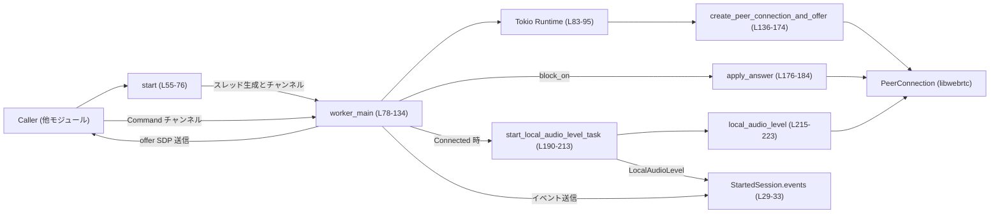
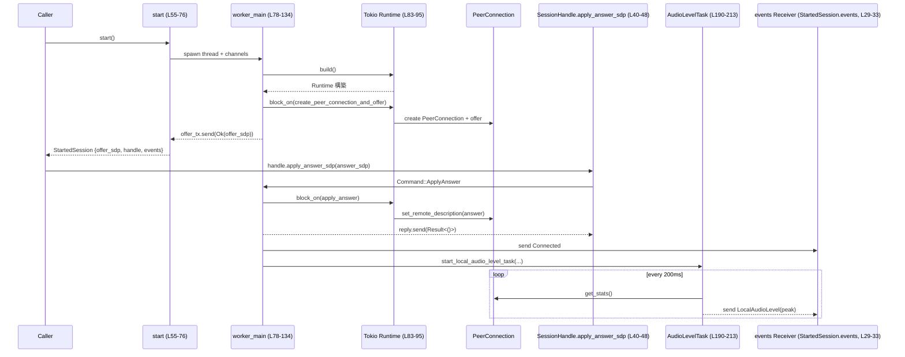

# realtime-webrtc/src/native.rs

## 0. ざっくり一言

WebRTC の `PeerConnection` を **専用スレッド＋Tokio ランタイム** 上で管理し、  
SDP offer の生成・answer の適用・ローカル音声レベルの通知を、シンプルな API (`start`, `SessionHandle`) とイベントストリームで提供するモジュールです（根拠: `native.rs:L55-76`, `L78-134`, `L190-223`）。

---

## 1. このモジュールの役割

### 1.1 概要

- このモジュールは、**WebRTC セッション管理をアプリ本体から切り離す**ために存在し、以下を提供します。
  - WebRTC の初期化と SDP offer 生成（`start`）  
  - クライアントからの SDP answer 適用（`SessionHandle::apply_answer_sdp`）  
  - セッション終了要求（`SessionHandle::close`）  
  - 接続状態およびローカル音声レベルを通知する `RealtimeWebrtcEvent` ストリーム（`StartedSession.events`）

すべての WebRTC 処理はこのモジュール内のワーカースレッド＋Tokio ランタイムで行われ、呼び出し側はチャンネルと構造体を通じて操作します（`native.rs:L55-76`, `L78-134`）。

### 1.2 アーキテクチャ内での位置づけ

**主なコンポーネントと依存関係**

- 呼び出し元（他モジュール）
  - → `start` でセッション開始・`StartedSession` 取得（`L55-76`）
  - → `SessionHandle` (`apply_answer_sdp`, `close`) でセッション制御（`L35-52`）
  - → `StartedSession.events` から `RealtimeWebrtcEvent` を受信（`L29-33`）
- ワーカースレッド `worker_main`（`L78-134`）
  - 内部に `tokio::runtime::Runtime` を生成（`L83-95`）
  - 非同期関数 `create_peer_connection_and_offer` / `apply_answer` を `block_on` で実行（`L97-108`, `L113`）
  - `start_local_audio_level_task` で音声レベル監視タスクを起動（`L116-120`, `L190-213`）
- `libwebrtc::PeerConnection` と関連型（`L136-174`, `L176-184`, `L215-223`）



> この図は `native.rs:L55-223` の流れを要約したものです。

### 1.3 設計上のポイント

- **責務の分離**
  - WebRTC と Tokio ランタイムはワーカースレッド `worker_main` 側に閉じ込めており（`L78-134`）、呼び出し側は同期 API とチャンネルで操作します（`L55-76`, `L35-52`）。
- **状態管理**
  - `PeerConnection` インスタンスはワーカースレッド内のローカル変数として保持され（`L97-101`）、外部から直接触られません。
  - セッション全体の外部インターフェースは `StartedSession` / `SessionHandle` / `RealtimeWebrtcEvent` に集約されています（`L29-33`, `L35-52`）。
- **エラーハンドリング**
  - すべての公開 API は `crate::Result<T>` を返し（`L40`, `L55`, `L136`, `L176`）、`RealtimeWebrtcError::Message` でエラー内容を文字列化します（`L17`, `L186-187`）。
  - 非同期処理のエラーはイベント `RealtimeWebrtcEvent::Failed` としても通知されます（`L91-92`, `L104-105`）。
- **並行性**
  - 標準ライブラリの `mpsc::channel` によるコマンド・イベント伝搬（`L55-58`, `L39-52`, `L110-123`, `L190-213`）。
  - OS スレッド＋Tokio マルチスレッドランタイムの二層構成により、同期コードと非同期 WebRTC API を橋渡ししています（`L60-66`, `L83-95`, `L97`, `L113`）。

---

## 2. 主要な機能一覧

- `start`: ワーカースレッドと Tokio ランタイムを起動し、WebRTC offer SDP とセッションハンドル、イベント受信口を返す（`native.rs:L55-76`）。
- `StartedSession`: offer SDP / セッション操作ハンドル / イベント受信チャンネルをまとめたコンテナ（`L29-33`）。
- `SessionHandle::apply_answer_sdp`: リモートから受け取った SDP answer をワーカースレッドに送り、適用結果を待つ同期 API（`L40-48`）。
- `SessionHandle::close`: セッション終了要求をワーカースレッドに送る（`L50-52`）。
- `worker_main`: Tokio ランタイムと `PeerConnection` のライフサイクルを管理し、コマンド処理とイベント発行を行うワーカースレッド本体（`L78-134`）。
- `create_peer_connection_and_offer`: `PeerConnection` と音声トランシーバー／トラックを構成し、SDP offer を生成してローカルにセットする非同期処理（`L136-174`）。
- `apply_answer`: SDP 文字列から `SessionDescription` をパースし、リモート description として適用する非同期処理（`L176-184`）。
- `start_local_audio_level_task`: ローカル音声のレベルを 200ms ごとに取得し、イベントとして送信する Tokio タスクを起動（`L190-213`）。
- `local_audio_level`: WebRTC の統計情報から音声ソースのレベルを抽出し、ピーク値に変換する（`L215-223`）。
- `audio_level_to_peak`: 0.0〜1.0 の audio_level を 0〜32767 の整数ピーク値に変換（`L225-226`）。

---

## 3. 公開 API と詳細解説

### 3.1 型一覧（構造体・列挙体など）

#### このファイル内で定義される型

| 名前 | 種別 | 役割 / 用途 | 定義位置 |
|------|------|-------------|----------|
| `Command` | 列挙体 | ワーカースレッド `worker_main` への制御コマンド。`ApplyAnswer` と `Close` を持つ内部用プロトコル。 | `native.rs:L21-27` |
| `StartedSession` | 構造体 | `start` 成功時に返されるセッション情報。offer SDP、`SessionHandle`、イベント受信チャンネルを保持。 | `native.rs:L29-33` |
| `SessionHandle` | 構造体 | コマンド送信用の `mpsc::Sender<Command>` をカプセル化し、`apply_answer_sdp` / `close` メソッドを提供。 | `native.rs:L35-37`, `L39-52` |

#### 他ファイル / 外部クレートの型（定義はこのチャンクには現れない）

| 名前 | 由来 | 概要（このファイルでの利用範囲） | 使用位置 |
|------|------|---------------------------------|----------|
| `Result<T>` | `crate::Result` | このクレート共通の結果型。エラー型は `RealtimeWebrtcError` と推測されますが定義は別ファイルです。 | `L19`, `L40`, `L55`, `L136`, `L176` |
| `RealtimeWebrtcError` | `crate` | エラー種別。ここでは `RealtimeWebrtcError::Message(String)` を生成して使用します。 | `L17`, `L44`, `L47`, `L64`, `L69`, `L90-91`, `L104`, `L136-141`, `L151`, `L157`, `L166`, `L171`, `L178`, `L182`, `L186-187` |
| `RealtimeWebrtcEvent` | `crate` | イベント種別。ここでは `Failed`, `Connected`, `Closed`, `LocalAudioLevel` といったバリアントが使用されています。定義自体はこのチャンクには現れません。 | `L18`, `L32`, `L91-92`, `L105`, `L115`, `L126`, `L133`, `L209` |
| `PeerConnection`, `PeerConnectionFactory`, `RtcConfiguration`, `OfferOptions`, `MediaType`, `RtpTransceiverInit`, `RtpTransceiverDirection`, `SessionDescription`, `SdpType`, `RtcStats` | `libwebrtc` クレート | WebRTC ネイティブ API への Rust バインディング。詳細は外部クレート側の実装に依存します。 | `L5-15`, `L136-174`, `L176-184`, `L215-223` |

### 3.2 関数詳細（主要 7 件）

#### `pub(crate) fn start() -> Result<StartedSession>`（`native.rs:L55-76`）

**概要**

- WebRTC セッション用のワーカースレッドを生成し、その中で Tokio ランタイムと `PeerConnection` を初期化して offer SDP を取得します。
- 呼び出し元には `StartedSession` として、offer SDP とセッション操作ハンドル・イベント受信口を返します。

**引数**

- なし。

**戻り値**

- `Ok(StartedSession)`:
  - `offer_sdp`: 生成された SDP offer 文字列（`L67-73`）。
  - `handle`: `SessionHandle`（内部にコマンド送信用 sender を保持、`L72-74`）。
  - `events`: `mpsc::Receiver<RealtimeWebrtcEvent>`（`L32`, `L71-75`）。
- `Err(RealtimeWebrtcError)`:
  - スレッド生成失敗（`L60-66`）。
  - ワーカースレッド側でのランタイム初期化 / PeerConnection 構築 / offer 生成のいずれかの失敗（`L67-69` で `??` により伝播）。

**内部処理の流れ**

1. コマンド、イベント、offer 受信用の 3 つの `mpsc::channel` を生成（`L55-58`）。
2. `thread::Builder` でワーカースレッドを生成し、`worker_main` に `command_rx`, `events_tx`, `offer_tx` を渡す（`L60-63`）。
3. スレッド生成に失敗した場合、`RealtimeWebrtcError::Message` にラップして即座にエラーを返す（`L63-65`）。
4. `offer_rx.recv()` でワーカースレッドからの `Result<String>` を待ち受ける（`L67-69`）。
   - ここで `recv` エラーは「realtime WebRTC worker stopped」として扱われます（`L68-69`）。
   - 受信した `Result<String>` 自体が `Err` の場合も `?` によりそのままエラーを返します（`L69` の `??`）。
5. 取得した SDP 文字列を `offer_sdp` として `StartedSession` を組み立てて返却（`L71-75`）。

**Examples（使用例）**

呼び出し元でセッションを開始し、offer をログに出力する例です（モジュールパスは仮です）。

```rust
// エラー型はクレート定義に依存するため、ここでは anyhow を仮に使用します。
fn main() -> anyhow::Result<()> {
    // WebRTC セッションを開始し、StartedSession を取得する
    let session = crate::native::start()?; // native.rs:L55-76

    // 生成された offer SDP を表示する
    println!("Offer SDP:\n{}", session.offer_sdp); // native.rs:L29-33

    // 後続で session.handle / session.events を利用する
    Ok(())
}
```

**Errors / Panics**

- `Err(RealtimeWebrtcError::Message("failed to spawn realtime WebRTC worker: ..."))`  
  - ワーカースレッド生成に失敗した場合（`L60-65`）。
- `Err(RealtimeWebrtcError::Message("realtime WebRTC worker stopped"))`  
  - `offer_rx.recv()` が `RecvError` を返した場合（`L67-69`）。
- `Err(RealtimeWebrtcError)`（内容は `worker_main` 側で生成されたもの）  
  - ランタイム初期化失敗や `create_peer_connection_and_offer` のエラーが `offer_tx` 経由で伝搬した場合（`L97-108`, `L67-69`）。

この関数自身には明示的な `panic!` はありません。標準ライブラリや `libwebrtc` 側の panic 可能性についてはこのチャンクからは分かりません。

**Edge cases（エッジケース）**

- ワーカースレッド内でランタイム初期化に失敗した場合、`RealtimeWebrtcEvent::Failed` が送信されますが（`L90-92`）、`start` がエラーで return するため、呼び出し側がこのイベントを受信することは通常ありません。
- `start` は offer SDP を受信するまで **ブロック** します（`L67-69`）。`create_peer_connection_and_offer` が長時間かかる場合、呼び出しスレッドもその間ブロックされます。

**使用上の注意点**

- この関数は同期 API であり、最初の offer SDP を受け取るまでブロックします。GUI スレッドや高頻度リクエスト処理スレッドから呼び出す場合は、別スレッドでラップするなどの配慮が必要です。
- 複数回呼び出すと、その回数分だけワーカースレッドおよび Tokio ランタイムが生成されます（`L60-66`, `L83-95`）。セッションごとに 1 回呼ぶ前提の設計と解釈できますが、このチャンクからは制約は明示されていません。

---

#### `impl SessionHandle::apply_answer_sdp(&self, answer_sdp: String) -> Result<()>`（`native.rs:L40-48`）

**概要**

- 呼び出し元スレッドから、ワーカースレッドへ SDP answer を送信し、その適用結果（成功/失敗）を待ち合わせる同期メソッドです。

**引数**

| 引数名 | 型 | 説明 |
|--------|----|------|
| `self` | `&SessionHandle` | コマンド送信用 sender を内部に保持したハンドル（`L35-37`）。 |
| `answer_sdp` | `String` | リモートから受信した SDP answer 文字列。所有権がメソッドに移動します。 |

**戻り値**

- `Ok(())`: SDP answer のパースと `set_remote_description` が成功した場合（`L176-184`）。
- `Err(RealtimeWebrtcError)`:
  - ワーカースレッド側へのコマンド送信に失敗した場合（`L42-44`）。
  - ワーカースレッドからの返信受信に失敗した場合（`L45-47`）。
  - ワーカースレッド内の `apply_answer` が `Err` を返した場合（`L113`, `L176-184`）。

**内部処理の流れ**

1. `mpsc::channel()` を用いて、結果返信用の一時チャンネル（`reply`, `reply_rx`）を生成（`L41`）。
2. `Command::ApplyAnswer { answer_sdp, reply }` を作成し、ワーカースレッドに送信（`L42-43`）。
   - 送信失敗時は `RealtimeWebrtcError::Message("realtime WebRTC worker stopped")` に変換（`L43-44`）。
3. `reply_rx.recv()` でワーカースレッドからの `Result<()>` を待機（`L45-47`）。
   - 受信失敗時も同様のメッセージでエラーに変換（`L45-47`）。
4. 受信した `Result<()>` に対して `?` を適用し、失敗すればエラーを返し、成功すれば `Ok(())` を返す（`L47-48`）。

**Examples（使用例）**

```rust
fn apply_answer_example(session: &crate::native::StartedSession, answer_sdp: String) -> crate::Result<()> {
    // SessionHandle 経由で SDP answer を適用する（ブロッキング）
    session.handle.apply_answer_sdp(answer_sdp)?; // native.rs:L40-48

    // 成功時には Connected イベントが後続で飛んでくる（native.rs:L115）
    Ok(())
}
```

**Errors / Panics**

- `Err(RealtimeWebrtcError::Message("realtime WebRTC worker stopped"))`
  - ワーカースレッド側でコマンドチャンネルがすでにクローズされている場合（`L42-44`）。
  - 結果返信チャンネルで `RecvError` が発生した場合（`L45-47`）。
- `Err(RealtimeWebrtcError::Message("failed to parse WebRTC answer SDP: ..."))` など
  - `apply_answer` 内でパース／リモート description 設定に失敗した場合（`L176-184`）。

**Edge cases（エッジケース）**

- `answer_sdp` が不正フォーマットの場合
  - `SessionDescription::parse` がエラーを返し（`L177-178`）、結果として `apply_answer_sdp` もエラーになります。
- ワーカースレッドがすでに終了している場合
  - `send` / `recv` のいずれかが失敗し、「worker stopped」のメッセージでエラーになります（`L42-44`, `L45-47`）。

**使用上の注意点**

- このメソッドは同期的にブロックするため、UI スレッドから直接呼ぶ場合は注意が必要です。
- 成功すると `RealtimeWebrtcEvent::Connected` が 1 回送信され、さらにローカル音声レベル監視タスクが起動します（`L114-120`, `L190-213`）。`apply_answer_sdp` を複数回呼び出すと、その回数分だけ音声レベルタスクが起動しうる点に注意が必要です（このチャンクでは明示的な制御は行われていません）。

---

#### `impl SessionHandle::close(&self)`（`native.rs:L50-52`）

**概要**

- ワーカースレッドに対してセッション終了を要求するメソッドです。戻り値はなく、送信失敗も無視します。

**引数**

| 引数名 | 型 | 説明 |
|--------|----|------|
| `self` | `&SessionHandle` | コマンド送信用 sender を内部に持つハンドル。 |

**戻り値**

- なし（`()`）。エラー情報も返しません（`L50-52`）。

**内部処理の流れ**

1. `Command::Close` をコマンドチャンネルに送信しようとします（`L51`）。
2. 送信結果は `let _ = ...` により破棄され、失敗しても何も起こしません（`L51-52`）。

**Examples（使用例）**

```rust
fn graceful_shutdown(session: crate::native::StartedSession) {
    // セッション終了を要求
    session.handle.close(); // native.rs:L50-52

    // events Receiver 側では RealtimeWebrtcEvent::Closed を受け取りうる（native.rs:L126-127, L132-133）
}
```

**Errors / Panics**

- 送信失敗は無視されます。
- 明示的な panic はありません。

**Edge cases（エッジケース）**

- すでにワーカースレッドが終了している場合、`send` はエラーになりますが無視されます（`L51`）。
- `close` を呼ばなくても、`SessionHandle` をすべて drop してコマンドチャンネルをクローズすると、`worker_main` の `for command in command_rx` が終了し、その後 `Closed` イベントを送信して `PeerConnection` をクローズします（`L110`, `L131-133`）。

**使用上の注意点**

- 「閉じられたかどうか」を保証したい場合は、`events` 側で `RealtimeWebrtcEvent::Closed` を待ち受ける必要があります（`L126-127`, `L132-133`）。
- 送信失敗を検知したい場合は、このメソッドではなく、コマンドチャンネルを直接扱うような拡張が必要になります。

---

#### `fn worker_main(...)`（`native.rs:L78-134`）

```rust
fn worker_main(
    command_rx: mpsc::Receiver<Command>,
    events_tx: mpsc::Sender<RealtimeWebrtcEvent>,
    offer_tx: mpsc::Sender<Result<String>>,
)
```

**概要**

- 専用スレッド上で動作するワーカー処理です。
- Tokio マルチスレッドランタイムを構築し、`create_peer_connection_and_offer` を実行して offer SDP を生成し、その後 `PeerConnection` とコマンドループを管理します。

**引数**

| 引数名 | 型 | 説明 |
|--------|----|------|
| `command_rx` | `mpsc::Receiver<Command>` | 呼び出し側からの `ApplyAnswer` / `Close` コマンド受信用チャンネル。`start` から渡されます（`L55-57`, `L79`）。 |
| `events_tx` | `mpsc::Sender<RealtimeWebrtcEvent>` | イベント送信用チャンネル。`StartedSession.events` の反対側です（`L56-58`, `L80`）。 |
| `offer_tx` | `mpsc::Sender<Result<String>>` | 初期 offer SDP もしくは初期化エラーを呼び出し側に返すためのチャンネル（`L57-58`, `L81`）。 |

**戻り値**

- なし。終了時には `PeerConnection.close()` を呼び、`RealtimeWebrtcEvent::Closed` を送信します（`L125-127`, `L132-133`）。

**内部処理の流れ**

1. **Tokio ランタイム構築**（`L83-95`）
   - `tokio::runtime::Builder::new_multi_thread().enable_all().thread_name(...).build()` を実行。
   - 失敗時は `offer_tx` にエラーを送り、`RealtimeWebrtcEvent::Failed` をイベントとして送信してリターン（`L90-93`）。
2. **PeerConnection と offer 生成**（`L97-108`）
   - `runtime.block_on(create_peer_connection_and_offer())` を呼び出し（`L97`）。
   - 成功時: `offer_tx` に `Ok(offer_sdp)` を送り、`peer_connection` を保持（`L98-101`）。
   - 失敗時: エラーを `offer_tx` と `RealtimeWebrtcEvent::Failed` で呼び出し側に通知し、リターン（`L102-107`）。
3. **コマンドループ**（`L110-130`）
   - `for command in command_rx` により、チャンネルがクローズされるまでコマンドを処理。
   - `Command::ApplyAnswer`:
     - `runtime.block_on(apply_answer(&peer_connection, answer_sdp))` で SDP answer を適用（`L113`）。
     - 成功時: `RealtimeWebrtcEvent::Connected` を送信し（`L114-115`）、`start_local_audio_level_task` で音声レベル監視タスクを起動（`L116-120`）。
     - 成功・失敗に関わらず `reply` チャンネルで結果を返す（`L122`）。
   - `Command::Close`:
     - `peer_connection.close()` を呼んで接続を閉じ、`RealtimeWebrtcEvent::Closed` を送信してからリターン（`L125-127`）。
4. **コマンドチャンネル終了時の後処理**（`L131-133`）
   - `for` ループが終了した場合（`command_rx` がクローズされた場合）、`peer_connection.close()` を呼び、`Closed` イベントを送信して終了。

**Errors / Panics**

- エラー情報は `offer_tx` / `events_tx` / `reply` チャンネルを通じて外部に伝えられます。
- `send` の失敗はすべて `let _ = ...` で無視されています（`L91`, `L92`, `L98-99`, `L104-105`, `L115`, `L122`, `L126`, `L133`）。
- 明示的な panic はありません。

**Edge cases（エッジケース）**

- 呼び出し側が `SessionHandle` をすべて drop し、`Command::Close` を送らない場合でも、`command_rx` がクローズされることで `for` ループが終了し、`Closed` イベントが送信されます（`L110`, `L131-133`）。
- `apply_answer` が失敗した場合、`Connected` イベントや音声レベルタスクは起動されず、`reply` にエラーが返ります（`L113-122`）。

**使用上の注意点**

- `worker_main` は専用スレッド上で動作し、内部で Tokio マルチスレッドランタイムを持つため、`start` を大量に呼び出すとスレッド・スレッドプールが多数生成される可能性があります。
- `runtime.block_on(...)` はワーカースレッド上でのみ呼ばれており、Tokio ランタイムのワーカースレッド上では呼ばれていないため、典型的な「ネストした block_on」によるデッドロックはこのコードからは見られません（`L83-87`, `L97`, `L113`）。

---

#### `async fn create_peer_connection_and_offer() -> Result<(PeerConnection, String)>`（`native.rs:L136-174`）

**概要**

- `PeerConnectionFactory` から `PeerConnection` を生成し、音声トランシーバーとローカルマイクトラックを設定した上で SDP offer を作成し、ローカル description にセットします。

**引数**

- なし。

**戻り値**

- `Ok((peer_connection, offer_sdp))`:
  - `peer_connection`: 初期化済みの `PeerConnection`（`L136-141`, `L142-157`, `L168-171`）。
  - `offer_sdp`: `offer.to_string()` による SDP 文字列（`L159-165`, `L173`）。
- `Err(RealtimeWebrtcError)`:
  - PeerConnection の生成失敗（`L138-141`）。
  - 音声トランシーバー追加失敗（`L142-151`）。
  - ローカルオーディオトラックのアタッチ失敗（`L152-157`）。
  - offer 生成・ローカル description 設定の失敗（`L159-166`, `L168-171`）。

**内部処理の流れ**

1. `PeerConnectionFactory::with_platform_adm()` でファクトリを取得（`L137`）。
2. `RtcConfiguration::default()` を使って `create_peer_connection`（`L138-140`）。
3. オーディオ用トランシーバーを `MediaType::Audio` / `RtpTransceiverDirection::SendRecv` で追加（`L142-151`）。
4. ローカルオーディオソースとトラックを生成し、トランシーバーの sender に紐づけ（`L152-157`）。
5. `create_offer` を非同期で呼び出し、offer SDP を生成（`L159-166`）。
6. `set_local_description(offer.clone())` でローカル description を設定（`L168-171`）。
7. `(peer_connection, offer.to_string())` を返却（`L173`）。

**Errors / Panics**

- 各ステップでの失敗は `message_error` によって `"failed to ...: {err}"` 形式に変換されます（`L140-141`, `L151`, `L157`, `L166`, `L171`, `L186-187`）。

**Edge cases（エッジケース）**

- 音声以外のメディア（映像など）はこの関数では扱っていません。`offer_to_receive_video: false` と明示されています（`L161-163`）。
- `stream_ids` は `"realtime"` 固定です（`L147`）。

**使用上の注意点**

- この関数は `worker_main` 内の Tokio ランタイムから `block_on` で呼び出される前提で設計されています（`L97`）。
- `PeerConnection` のライフタイムやスレッド安全性は `libwebrtc` の実装に依存します。このチャンクでは `peer_connection.clone()` が別スレッドで使用されていることから（`L116-120`, `L190-213`）、`Send + Sync` なハンドルであると想定して使用していますが、実際の保証は外部クレート側にあります。

---

#### `async fn apply_answer(peer_connection: &PeerConnection, answer_sdp: String) -> Result<()>`（`native.rs:L176-184`）

**概要**

- SDP answer 文字列を `SessionDescription` にパースし、それをリモート description として `peer_connection` に設定します。

**引数**

| 引数名 | 型 | 説明 |
|--------|----|------|
| `peer_connection` | `&PeerConnection` | すでに `create_peer_connection_and_offer` で初期化済みの接続（`L136-174`, `L97-101`）。 |
| `answer_sdp` | `String` | リモートピアから受信した SDP answer 文字列。所有権はこの関数に移動します。 |

**戻り値**

- `Ok(())`: パースと `set_remote_description` の双方が成功した場合（`L176-183`）。
- `Err(RealtimeWebrtcError)`:
  - SDP パース失敗（`L177-178`）。
  - リモート description 設定失敗（`L179-182`）。

**内部処理の流れ**

1. `SessionDescription::parse(&answer_sdp, SdpType::Answer)` で SDP をパース（`L177`）。
2. 失敗時は `"failed to parse WebRTC answer SDP: {err}"` としてエラー生成（`L178`, `L186-187`）。
3. `peer_connection.set_remote_description(answer).await` を実行（`L179-181`）。
4. 失敗時は `"failed to set remote WebRTC description: {err}"` としてエラー生成（`L181-182`）。
5. 成功時は `Ok(())` を返す（`L183-184`）。

**Errors / Panics**

- SDP 文字列が不正な場合、`SessionDescription::parse` によってエラーが返ります。
- `set_remote_description` のエラー理由は `libwebrtc` に依存します。

**Edge cases（エッジケース）**

- `answer_sdp` が空文字列や全くの不正フォーマットであっても、この関数内ではパースを試み、失敗時に `RealtimeWebrtcError::Message` でエラーを返します（`L177-178`, `L186-187`）。
- 同じ `peer_connection` に対し、複数回 `apply_answer` を呼び出すことが許容されるかどうかは `libwebrtc` の仕様に依存し、このチャンクからは判断できません。

**使用上の注意点**

- この関数は `worker_main` 内からのみ呼ばれており、直接公開されていません（`L113`）。外部からは `SessionHandle::apply_answer_sdp` を介して使用します。
- パースエラーの詳細は `err.to_string()` を通じてメッセージに含まれますが（`L186-187`）、呼び出し元で細かく種類を判定することはできません。

---

#### `fn start_local_audio_level_task(...)`（`native.rs:L190-213`）

```rust
fn start_local_audio_level_task(
    runtime: &tokio::runtime::Runtime,
    peer_connection: PeerConnection,
    events_tx: mpsc::Sender<RealtimeWebrtcEvent>,
)
```

**概要**

- ローカル音声のレベル（peak 値）を定期的に取得し、`RealtimeWebrtcEvent::LocalAudioLevel(u16)` として送信するバックグラウンド Tokio タスクを起動します。

**引数**

| 引数名 | 型 | 説明 |
|--------|----|------|
| `runtime` | `&tokio::runtime::Runtime` | 既存のマルチスレッド Tokio ランタイム（`worker_main` で生成済み、`L83-95`）。 |
| `peer_connection` | `PeerConnection` | 音声統計情報を取得する対象。所有権がタスク内部に move されます（`L190-193`, `L195`）。 |
| `events_tx` | `mpsc::Sender<RealtimeWebrtcEvent>` | `LocalAudioLevel` イベントを送信するチャンネル。クローンがタスクに move されます（`L190-193`, `L195`）。 |

**戻り値**

- なし。内部で `runtime.spawn` を呼ぶだけで、タスクハンドルも保持していません（`L195`）。

**内部処理の流れ**

1. `runtime.spawn(async move { ... })` で非同期タスクを起動（`L195`）。
2. タスク内部で 200ms 間隔の `tokio::time::interval` を作成（`L196-197`）。
3. 無限ループで以下を繰り返す（`L198-211`）:
   - `interval.tick().await` で 200ms 待機（`L199`）。
   - `peer_connection.connection_state()` が `Closed` または `Failed` ならタスクを終了（`L200-205`）。
   - `local_audio_level(&peer_connection).await` を呼び、`Some(peak)` なら `RealtimeWebrtcEvent::LocalAudioLevel(peak)` を `events_tx` で送信（`L208-210`）。

**Errors / Panics**

- `events_tx.send(...)` の失敗はすべて無視されます（`L209`）。
- `local_audio_level` が `None` を返す場合はイベントを送信しません（`L208-210`）。
- 明示的な panic はありません。

**Edge cases（エッジケース）**

- イベント受信側が `events_rx` を drop していると、`send` は常にエラーとなり、すべて無視されます（`L209`）。タスク自体は `connection_state` によってのみ終了します。
- `get_stats` がエラーを返したり音声ソースが見つからない場合、`local_audio_level` は `None` を返すため、イベントは送信されません（`L215-223`）。

**使用上の注意点**

- `apply_answer_sdp` の成功時にのみ起動されるため（`L114-120`）、接続が確立していない状態では呼び出さない設計になっています。
- `peer_connection` はタスクに move されるため、このタスクが動作中は `worker_main` 側からも同じハンドルにアクセスしています。`PeerConnection` がスレッドセーフであることが前提となっていますが、その保証は `libwebrtc` 側に依存します。
- `apply_answer_sdp` を複数回成功させた場合、音声レベルタスクも複数走る可能性があります。この挙動を制御したい場合は、`worker_main` 側でフラグ管理などの追加が必要になります。

---

### 3.3 その他の関数

| 関数名 | 役割（1 行） | 定義位置 |
|--------|--------------|----------|
| `fn message_error(prefix: &str, err: impl Display) -> RealtimeWebrtcError` | エラーメッセージに共通の `"prefix: err"` フォーマットを適用して `RealtimeWebrtcError::Message` を生成するヘルパー関数。 | `native.rs:L186-187` |
| `async fn local_audio_level(peer_connection: &PeerConnection) -> Option<u16>` | `PeerConnection.get_stats()` の結果から音声ソースの `audio_level` を探し、`audio_level_to_peak` でピーク値に変換して返す。失敗時・未検出時は `None`。 | `native.rs:L215-223` |
| `fn audio_level_to_peak(audio_level: f64) -> u16` | 0.0〜1.0 の `audio_level` を `i16::MAX` スケールで 0〜32767 の `u16` に変換する。範囲外は `clamp` で補正。 | `native.rs:L225-226` |

---

## 4. データフロー

ここでは、典型的なフローである「セッション開始 → answer 適用 → 音声レベル通知」のデータの流れを示します。

1. 呼び出し元が `start()` を呼び、`StartedSession { offer_sdp, handle, events }` を受け取る（`L55-76`）。
2. 呼び出し元は `offer_sdp` をリモートに送信し、リモートから `answer_sdp` を受信。
3. 呼び出し元が `handle.apply_answer_sdp(answer_sdp)` を呼ぶと、コマンドチャンネル経由でワーカースレッドに伝達される（`L40-48`, `L78-82`, `L110-123`）。
4. ワーカースレッドは `apply_answer` を実行し、成功したら `Connected` イベントを送信し、音声レベルタスクを起動（`L113-120`）。
5. 音声レベルタスクは 200ms ごとに `PeerConnection` の統計情報から `LocalAudioLevel` を算出し、イベントとして送信（`L190-213`, `L215-223`）。



> このシーケンス図は `native.rs:L40-48`, `L55-76`, `L78-134`, `L190-223` のやり取りをまとめたものです。

---

## 5. 使い方（How to Use）

### 5.1 基本的な使用方法

典型的な同期コードでの利用例です。エラー型やモジュールパスは仮です。

```rust
use std::thread;
use std::time::Duration;

// 適切なパスを指定する必要があります。ここでは crate::native と仮定します。
use crate::native::{start};
use crate::{RealtimeWebrtcEvent, Result}; // エイリアス定義は別ファイル

fn main() -> Result<()> {
    // 1. セッションを開始する（ワーカースレッド + Tokio ランタイムが起動）
    let session = start()?;                                       // native.rs:L55-76

    // 2. 生成された offer SDP をリモート側に送信し、answer SDP を受信する
    println!("Offer SDP:\n{}", session.offer_sdp);                // native.rs:L29-33
    let answer_sdp = obtain_answer_from_remote();                 // アプリ固有の処理

    // 3. answer SDP を適用する（同期的に結果を待つ）
    session.handle.apply_answer_sdp(answer_sdp)?;                 // native.rs:L40-48

    // 4. イベントループで状態と音声レベルを監視する
    for event in session.events {                                 // native.rs:L29-33
        match event {
            RealtimeWebrtcEvent::Connected => {
                println!("WebRTC connected");
            }
            RealtimeWebrtcEvent::LocalAudioLevel(level) => {
                println!("Local audio level: {}", level);
            }
            RealtimeWebrtcEvent::Closed => {
                println!("Session closed");
                break;
            }
            RealtimeWebrtcEvent::Failed(msg) => {
                eprintln!("WebRTC failed: {}", msg);
                break;
            }
            _ => {
                // 他のバリアントがある場合
            }
        }
    }

    Ok(())
}

// ダミー関数: 実際にはシグナリングの実装に依存
fn obtain_answer_from_remote() -> String {
    thread::sleep(Duration::from_secs(1));
    String::from("v=0 ...")  // 実際の SDP answer を返す
}
```

### 5.2 よくある使用パターン

1. **バックグラウンドスレッドでイベントを処理**

   メインスレッドでは `start` と `apply_answer_sdp` のみ行い、`session.events` を別スレッドで処理することで、イベント処理によるブロッキングを避けることができます。

   ```rust
   fn run_session() -> crate::Result<()> {
       let session = crate::native::start()?;
       let events = session.events;

       // イベント処理スレッド
       std::thread::spawn(move || {
           for event in events {
               // イベントの種類に応じた処理
               println!("Event: {:?}", event);
           }
       });

       // シグナリング処理はメインスレッドで続行
       // session.handle.apply_answer_sdp(...);

       Ok(())
   }
   ```

2. **非同期アプリケーションからの利用**

   このモジュールの API は同期的ですが、Tokio アプリからでも `spawn_blocking` などでラップして利用できます。

   ```rust
   async fn start_session_async() -> crate::Result<()> {
       let session = tokio::task::spawn_blocking(|| crate::native::start()).await??;
       // 以降、session.handle / session.events を使用
       Ok(())
   }
   ```

### 5.3 よくある間違い

```rust
// 間違い例: apply_answer_sdp のエラーを無視してしまう
fn wrong(session: crate::native::StartedSession, answer_sdp: String) {
    let _ = session.handle.apply_answer_sdp(answer_sdp); // エラーを捨ててしまう
    // 失敗しても Connected イベントが来ないだけなので、
    // バグに気付きにくくなります。
}

// 正しい例: Result を確認し、失敗時の処理を行う
fn correct(session: crate::native::StartedSession, answer_sdp: String) {
    if let Err(err) = session.handle.apply_answer_sdp(answer_sdp) {
        eprintln!("failed to apply answer: {}", err);
        // 必要に応じてセッションを終了する
        session.handle.close();
    }
}
```

```rust
// 間違い例: apply_answer_sdp を何度も成功させ、音声レベルタスクを多重起動してしまう
fn multiple_apply(session: &crate::native::StartedSession, answer1: String, answer2: String) {
    let _ = session.handle.apply_answer_sdp(answer1);
    let _ = session.handle.apply_answer_sdp(answer2); // 成功すればタスクがもう一つ起動しうる（native.rs:L114-120）
}

// 正しい例（想定される使い方）: 通常は一度だけ answer を適用する
fn single_apply(session: &crate::native::StartedSession, answer: String) -> crate::Result<()> {
    session.handle.apply_answer_sdp(answer)?;
    Ok(())
}
```

### 5.4 使用上の注意点（まとめ）

- **同期 API とブロッキング**
  - `start` と `apply_answer_sdp` はどちらもブロッキングです（`L55-76`, `L40-48`）。高レイテンシ環境や GUI スレッドからの呼び出しでは、専用スレッドでラップすることが望ましい場合があります。
- **セッションあたりのリソース**
  - 1 セッションごとに 1 ワーカースレッドと 1 Tokio マルチスレッドランタイムが生成されています（`L60-66`, `L83-95`）。
- **イベントチャンネルのライフタイム**
  - `StartedSession.events` を drop すると、以降の `send` はすべて失敗し無視されますが、ワーカースレッドや `PeerConnection` は `Command` チャンネル側のライフタイムに従って終了します（`L110-134`, `L190-213`）。
- **エラーメッセージ**
  - エラーは基本的に `"failed to ...: {err}"` または `"realtime WebRTC worker stopped"` の文字列として伝えられます（`L44`, `L47`, `L64`, `L69`, `L140-141`, `L151`, `L157`, `L166`, `L171`, `L178`, `L182`, `L186-187`）。細かなエラー分類はクレート外部からは行いづらい設計です。

---

## 6. 変更の仕方（How to Modify）

### 6.1 新しい機能を追加する場合

例として、「ビデオトラックの追加」と「新しいイベント種別の追加」を考えます。

1. **新しいメディアトランシーバーの追加**
   - `create_peer_connection_and_offer` にビデオ用トランシーバー設定を追加します（`L142-151` 付近）。
   - `MediaType::Video` や `offer_to_receive_video: true` など、`OfferOptions` を変更します（`L159-164`）。
2. **新しいコマンドの追加**
   - `enum Command` に新しいバリアント（例: `Mute`, `Unmute`）を追加（`L21-27`）。
   - `worker_main` の `match command` に分岐を追加し、対応する処理を記述（`L110-129`）。
   - `SessionHandle` に対応するメソッドを追加し、`Command` を送るラッパーを実装（`L39-52`）。
3. **新しいイベント種別の追加**
   - `RealtimeWebrtcEvent` の定義（別ファイル）にバリアントを追加（このチャンクには定義が現れません）。
   - `worker_main` や `start_local_audio_level_task` 内で `events_tx.send(...)` を用いて新イベントを送信（`L91-92`, `L105`, `L115`, `L126`, `L133`, `L209`）。

### 6.2 既存の機能を変更する場合

- **音声レベルのサンプリング周期を変えたい**
  - `start_local_audio_level_task` 内の `Duration::from_millis(200)` を変更（`L196-197`）。
  - 周期を短くすると CPU 負荷・`get_stats` 呼び出し頻度が増える点に注意が必要です（パフォーマンス観点）。
- **エラーメッセージをより構造化したい**
  - `message_error` を修正し、構造体型のエラーにしたり、ログ出力を追加するなどの対応が考えられます（`L186-187`）。
  - 同時に、`apply_answer_sdp` や `start` が返すエラーの意味も変わるため、呼び出し側のハンドリングも見直す必要があります。
- **イベント送信の保証を強めたい**
  - 現状 `send` の結果はすべて無視しています（`L91`, `L92`, `L98-99`, `L104-105`, `L115`, `L122`, `L126`, `L133`, `L209`）。
  - 重要なイベント（例: `Failed`, `Closed`）については、`send` の失敗時にログ出力やリトライを行うよう、分岐を追加することができます。

### 6.3 テスト観点（このファイルにはテスト定義なし）

このチャンク内にはテストコードは含まれていませんが、以下のような観点でテストを書けます。

- **ユニットテスト**
  - `audio_level_to_peak` に対して、`audio_level = -0.5, 0.0, 0.5, 1.0, 1.5` などを入力し、出力が 0〜32767 に clamp されていることを確認（`L225-226`）。
  - `local_audio_level` をモック化した `PeerConnection` でテストできるなら、MediaSource がない場合は `None` を返すことなどを確認（`L215-223`）。
- **統合テスト（モック / テスト用ビルドが可能なら）**
  - `start` → `apply_answer_sdp` が正常に動作し、`Connected` の後に `LocalAudioLevel` が一定回数発生し、その後 `close` で `Closed` が 1 回発生することを確認（`L55-76`, `L40-52`, `L110-134`, `L190-213`）。

---

## 7. 関連ファイル

このチャンクには他ファイルのコードは含まれていないため、具体的なパスは不明ですが、型の利用状況から以下の関連が推測できます（推測であることを明示します）。

| パス（推定 / 不明） | 役割 / 関係 |
|---------------------|------------|
| （不明）`RealtimeWebrtcError` 定義ファイル | `RealtimeWebrtcError::Message(String)` を定義し、このモジュールのすべてのエラーで使用されます（`native.rs:L17`, `L44`, `L47`, `L64`, `L69`, `L186-187`）。 |
| （不明）`RealtimeWebrtcEvent` 定義ファイル | `Failed(String)`, `Connected`, `Closed`, `LocalAudioLevel(u16)` などのイベント型を提供し、このモジュールから状態通知に使用されます（`native.rs:L18`, `L32`, `L91-92`, `L105`, `L115`, `L126`, `L133`, `L209`）。 |
| （不明）`Result<T>` エイリアス定義ファイル | `type Result<T> = std::result::Result<T, RealtimeWebrtcError>;` のような形で定義されていると想定され、このモジュールの公開 API で使用されています（`native.rs:L19`, `L40`, `L55`, `L136`, `L176`）。 |
| 外部クレート `libwebrtc` | `PeerConnection` や `PeerConnectionFactory` など、WebRTC ネイティブ API へのアクセスを提供します（`native.rs:L5-15`, `L136-174`, `L176-184`, `L215-223`）。 |

> 具体的なファイルパスやモジュール階層はこのチャンクには現れず、ここでは型の利用状況からの推測に留まります。
