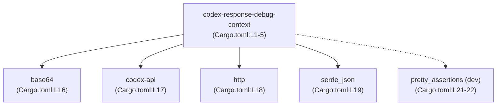
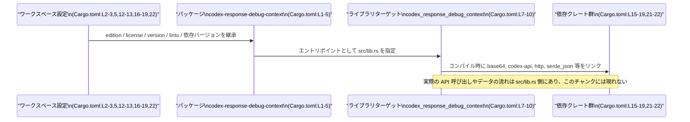

# response-debug-context/Cargo.toml コード解説

## 0. ざっくり一言

`response-debug-context` クレートの Cargo マニフェストであり、パッケージ情報・ライブラリターゲット・lint 設定・依存クレートを定義しているファイルです（`Cargo.toml:L1-5,7-10,12-13,15-22`）。

---

## 1. このモジュールの役割

### 1.1 概要

- このファイルは、Rust クレート `codex-response-debug-context` のビルド設定と依存関係を定義する Cargo 設定ファイルです（`Cargo.toml:L1-5`）。
- ライブラリクレートとしてビルドされること、クレート名とエントリポイント（`src/lib.rs`）を指定しています（`Cargo.toml:L7-10`）。
- edition / license / version / lints / 依存バージョンなどをワークスペース共通設定から継承する構成になっています（`Cargo.toml:L2-3,5,12-13,16-19,22`）。

### 1.2 アーキテクチャ内での位置づけ

このファイルからは、クレートレベルでの依存関係のみが読み取れます。以下は、`codex-response-debug-context` クレートと、その依存クレートとの関係を示した図です。



- 実行時にどのような関数呼び出しが行われるか、どのモジュールがどのデータを扱うかといったコアロジックは、このファイルには現れません。
- 実際の公開 API やデータフローは、ライブラリ本体 `src/lib.rs` などのソースファイル側に存在すると指定されています（`Cargo.toml:L10`）。

### 1.3 設計上のポイント

コードから読み取れる設計上の特徴は次のとおりです。

- **ワークスペースベースの設定共有**  
  - `edition.workspace = true`（`Cargo.toml:L2`）、`license.workspace = true`（`Cargo.toml:L3`）、`version.workspace = true`（`Cargo.toml:L5`）、`[lints] workspace = true`（`Cargo.toml:L12-13`）、依存クレート定義の `workspace = true`（`Cargo.toml:L16-19,22`）により、バージョンや lints などをワークスペース共通設定に委ねています。
- **ライブラリターゲット専用クレート**  
  - `[lib]` セクションのみが存在し、バイナリターゲット（`[[bin]]`）は定義されていません（`Cargo.toml:L7-10`）。  
  - ライブラリ名は `codex_response_debug_context` として明示されており（`Cargo.toml:L9`）、Rust コードからはこの名前でクレートを参照することになります。
- **doctest 無効化**  
  - `doctest = false` により、ドキュメントコメントに対する doctest 実行を行わない方針になっています（`Cargo.toml:L8`）。
- **テスト専用依存の分離**  
  - `pretty_assertions` は `[dev-dependencies]` にのみ登録されており（`Cargo.toml:L21-22`）、本番コードではなくテストコード内でのみ利用される構成です。

---

## 2. 主要な機能一覧

このファイル自体は設定ファイルであり、関数や構造体といった「実行されるコード」は含まれていません。そのため、公開 API やコアロジックの具体的な機能はここからは分かりません。

このファイルから読み取れる「機能」は、あくまでビルド設定レベルのものに限られます。

- パッケージ定義: クレートのパッケージ名とワークスペースから継承されるメタ情報を定義（`Cargo.toml:L1-5`）。
- ライブラリターゲット定義: ライブラリクレート名とエントリポイントファイルを指定（`Cargo.toml:L7-10`）。
- lints 設定: ワークスペース共通の lint 設定を利用（`Cargo.toml:L12-13`）。
- 依存クレートの宣言: `base64` / `codex-api` / `http` / `serde_json` への依存を宣言（`Cargo.toml:L15-19`）。
- テスト用依存の宣言: `pretty_assertions` を dev-dependency として宣言（`Cargo.toml:L21-22`）。

---

## 3. 公開 API と詳細解説

### コンポーネントインベントリー（このチャンクで判明している要素）

| 名前                         | 種別                   | 役割 / 用途                                                                                 | 根拠行                    |
|------------------------------|------------------------|----------------------------------------------------------------------------------------------|---------------------------|
| `codex-response-debug-context` | パッケージ名           | Cargo が認識するパッケージ名。依存として指定するときに使用される名前。                      | `Cargo.toml:L1-5`         |
| `codex_response_debug_context` | ライブラリクレート名   | Rust コード内で `use` する際のクレート名。`src/lib.rs` をルートとするライブラリとしてビルド。 | `Cargo.toml:L7-10`        |
| `src/lib.rs`                | ライブラリエントリ     | ライブラリの実装が書かれていると指定されているファイル。                                     | `Cargo.toml:L10`          |
| `base64`                    | 依存クレート           | 本クレートがリンクする外部クレート。用途はこのチャンクからは不明。                           | `Cargo.toml:L15-16`       |
| `codex-api`                 | 依存クレート           | 本クレートがリンクする外部クレート。用途はこのチャンクからは不明。                           | `Cargo.toml:L15,17`       |
| `http`                      | 依存クレート           | 本クレートがリンクする外部クレート。用途はこのチャンクからは不明。                           | `Cargo.toml:L15,18`       |
| `serde_json`                | 依存クレート           | 本クレートがリンクする外部クレート。用途はこのチャンクからは不明。                           | `Cargo.toml:L15,19`       |
| `pretty_assertions`         | dev-dependency クレート | テストコードで利用されると想定されるクレート。用途はこのチャンクからは不明。                 | `Cargo.toml:L21-22`       |
| ワークスペース共通設定       | 設定共有メカニズム     | edition / license / version / lints / 依存バージョン等をワークスペースルートから継承。       | `Cargo.toml:L2-3,5,12-13,16-19,22` |

※ 実際の構造体や関数などの「型・関数」の一覧は、`src/lib.rs` 側にあり、このチャンクには現れません。

### 3.1 型一覧（構造体・列挙体など）

このファイルには Rust の型定義（構造体・列挙体など）は含まれていません。

- 型定義が書かれているファイルとして `src/lib.rs` が指定されていますが（`Cargo.toml:L10`）、その内容はこのチャンクには含まれないため、公開されている型の一覧は「不明」です。

### 3.2 関数詳細（最大 7 件）

- Cargo.toml は設定ファイルであり、関数定義は存在しません。
- 公開 API（関数・メソッド）の振る舞い・エラー・並行性などは `src/lib.rs` 以降のソースコードが必要で、このチャンクだけからは何も特定できません。

したがって、このセクションに記載できる具体的な関数は「該当なし」です。

### 3.3 その他の関数

- 同様に、補助的な関数やラッパー関数も、このファイルには現れません。

---

## 4. データフロー

このファイルからは、実行時のデータフローや関数呼び出しの流れは分かりません。ただし、「ビルド時の依存解決」という観点でのフローは、次のように整理できます。



要点:

- **ビルド時**  
  - ワークスペース設定が、edition / license / version / lints / 依存のバージョンを提供します（`Cargo.toml:L2-3,5,12-13,16-19,22`）。
  - Cargo はこの情報を用いて `codex-response-debug-context` パッケージをビルドし、`src/lib.rs` からライブラリクレート `codex_response_debug_context` を生成します（`Cargo.toml:L7-10`）。
- **実行時**  
  - 実行時にどのようなデータが base64 / codex-api / http / serde_json に渡されるか、どのようなエラー処理や並行性制御があるかは、このチャンクからは分かりません。

---

## 5. 使い方（How to Use）

### 5.1 基本的な使用方法

このファイルが定義するライブラリクレート `codex_response_debug_context` を、別のクレートから利用する場合の「Cargo 側の設定」と「Rust コード側のクレート名の違い」が注意点になります。

- **依存として指定するときの名前**  
  - `Cargo.toml` の `[package]` セクションで指定されている `name = "codex-response-debug-context"`（`Cargo.toml:L4`）が、Cargo にとってのパッケージ名です。
- **Rust コードで `use` するときの名前**  
  - `[lib]` の `name = "codex_response_debug_context"`（`Cargo.toml:L9`）が、Rust コードからクレートを参照するときの名前です。

依存側からの利用例（あくまで一般的な例であり、実際のパスやバージョンはこのチャンクからは分かりません）:

```toml
# 他クレート側の Cargo.toml の一例（実際のパスは不明）
[dependencies]
codex-response-debug-context = { path = "../response-debug-context" } # パッケージ名で指定
```

```rust
// 依存側クレートからの利用例（実際に存在する API 名はこのチャンクからは分かりません）
use codex_response_debug_context; // クレート名は [lib].name に基づく

fn main() {
    // ここで codex_response_debug_context が提供する API を呼び出す想定
    // 実際にどの関数が存在するかは src/lib.rs がないため不明
}
```

この例で示した API 呼び出し部分は、あくまで「クレート名の扱い方」を示すための雛形であり、実際の関数名や型はこのチャンクからは特定できません。

### 5.2 よくある使用パターン

このファイルのみからは、同期 / 非同期などの使用パターンや典型的な API 呼び出しの形は分かりません。

読み取れるのは、次のようなビルド設定レベルのパターンです。

- **ワークスペース共通依存を利用するパターン**  
  - すべての依存クレートに `workspace = true` を指定し（`Cargo.toml:L16-19,22`）、バージョンや特徴的な設定をワークスペース側に集約する構成です。
- **テストコードと本番コードで依存を分けるパターン**  
  - テスト専用の `pretty_assertions` は `[dev-dependencies]` のみに定義されており（`Cargo.toml:L21-22`）、本番コードでは利用されないことが保証されます。

### 5.3 よくある間違い

このファイルの構成から起こりそうな誤用を、パッケージ名とクレート名の違いに着目して整理します。

```rust
// 間違い例: パッケージ名をそのままクレート名として使ってしまう
use codex-response-debug-context; // ハイフンを含むため、コンパイルエラーになる

// 正しい例: [lib].name で指定されているクレート名を使う
use codex_response_debug_context; // アンダースコアで区切られたクレート名
```

- 間違いの原因: `name = "codex-response-debug-context"`（`Cargo.toml:L4`）と `name = "codex_response_debug_context"`（`Cargo.toml:L9`）で表記が異なるため。
- 対応: Rust コード内では、`[lib]` の `name` で指定されたクレート名を使う必要があります。

### 5.4 使用上の注意点（まとめ）

このファイルに基づいて、このクレート全体を利用する際の注意点をまとめます。

- **公開 API・エラー・並行性はこのファイルからは分からない**  
  - 実際にどのような関数が公開されているか、どういうエラー型や並行性制御が行われているかは `src/lib.rs` 以降のコードが必要であり、このチャンクでは不明です（`Cargo.toml:L10`）。
- **ワークスペース設定に依存**  
  - edition や version、依存バージョンはワークスペース側の設定に依存しているため（`Cargo.toml:L2-3,5,16-19,22`）、ワークスペース設定を変更するとこのクレートにも影響します。
- **doctest が無効**  
  - `doctest = false` により（`Cargo.toml:L8`）、ドキュメントコメント内のサンプルコードが自動テストされないため、ドキュメントと実装の乖離に注意が必要です。
- **テストコードでのみ利用される依存**  
  - `pretty_assertions` は dev-dependency なので、本番バイナリに組み込まれることはありません（`Cargo.toml:L21-22`）。  
    テストコードでのみ利用する設計になっている前提で、誤って本番コードで use しないよう注意が必要です。

---

## 6. 変更の仕方（How to Modify）

### 6.1 新しい機能を追加する場合

「新機能を追加する」といっても、このファイルではビルド設定までしか扱えません。実際のロジック追加は `src/lib.rs` などのソースコード側になりますが、関連してこのファイルを変更するケースを整理します。

1. **新しい外部クレートに依存する場合**  
   - `[dependencies]` セクションに依存を追加します（`Cargo.toml:L15-19`）。  
   - 例（※ 一般的な書き方の例であり、このリポジトリ固有の情報ではありません）:

     ```toml
     [dependencies]
     base64 = { workspace = true }
     codex-api = { workspace = true }
     http = { workspace = true }
     serde_json = { workspace = true }
     new-crate = { workspace = true } # 新規依存の追加例
     ```

   - 実際に `new-crate` をどう使うかは `src/lib.rs` 側で実装します。このチャンクにはそのコードはありません。
2. **新しいテスト専用機能を追加する場合**  
   - テストでのみ利用するライブラリを追加する際は、`[dev-dependencies]` に追記します（`Cargo.toml:L21-22`）。
3. **エントリポイントの追加・分割**  
   - このファイルには `[lib]` しかなく（`Cargo.toml:L7-10`）、`[[bin]]` は定義されていません。  
   - もし今後、CLI バイナリを追加したい場合は `[[bin]]` セクションを追加することになりますが、そのような構造は現状のチャンクには現れていません。

### 6.2 既存の機能を変更する場合

ビルド設定を変更する際に考慮すべき点を挙げます。

- **クレート名の変更**  
  - `[lib].name` を変更すると（`Cargo.toml:L9`）、Rust コードからの `use` パスや依存側クレートからの参照パスが変わります。  
  - 変更時は:
    - 自身のソースコード内の `use codex_response_debug_context` 等を一括で置き換える必要があります。
    - 他クレートが依存している場合、そのクレートのコードも変更が必要になります。
- **パッケージ名の変更**  
  - `[package].name` を変更すると（`Cargo.toml:L4`）、依存側の Cargo.toml で指定する名前が変わります。  
  - パッケージ名とクレート名は別に設定できるため、「どちらをどう変えるか」を明確にする必要があります。
- **doctest の有効化/無効化**  
  - `doctest = false` を `true` に変更すると（`Cargo.toml:L8`）、ドキュメントコメント内のサンプルがテスト対象になります。  
  - 既存のドキュメントコメントが doctest に対応していない場合、テストが失敗する可能性があります。
- **ワークスペース依存からの切り離し**  
  - 現状は `workspace = true` を用いて依存バージョン等を共有していますが（`Cargo.toml:L16-19,22`）、個別にバージョンを指定したい場合は、`workspace = true` を削除して具体的なバージョンを書く必要があります。  
  - その場合、ワークスペース内の他クレートとのバージョン整合性に注意が必要です。

---

## 7. 関連ファイル

このファイルと密接に関係するファイルは、コードから次のように読み取れます。

| パス / 区分                 | 役割 / 関係                                                                                 | 根拠行            |
|----------------------------|----------------------------------------------------------------------------------------------|-------------------|
| `src/lib.rs`               | 本クレートのライブラリ実装が置かれていると指定されたファイル。公開 API やコアロジックが存在する。 | `Cargo.toml:L10`  |
| ワークスペースルートの Cargo.toml（パス不明） | `edition.workspace = true` などで参照されるワークスペース共通設定を提供するファイルと推測されるが、具体的な場所や内容はこのチャンクには現れない。 | `Cargo.toml:L2-3,5,12-13,16-19,22` |
| テストコード（パス不明）   | `pretty_assertions` を利用するテストコードが存在すると考えられるが、実際のファイルパスや内容はこのチャンクには現れない。 | `Cargo.toml:L21-22` |

※ 「ワークスペースルートの Cargo.toml」「テストコード」の具体的な場所や内容は、このチャンクには記載がないため不明です。`workspace = true` や dev-dependencies の存在から、そのようなファイルが存在すると推測されますが、詳細はコードからは読み取れません。

---

## Bugs / Security / Contracts / Edge Cases / Tests / Performance に関する補足

このファイルは設定のみを含むため、直接的なロジック上のバグやセキュリティホール、並行性バグを特定することはできませんが、観点ごとに言える範囲を整理します。

- **Bugs（設定上の注意点）**  
  - パッケージ名とクレート名の不一致に伴う誤用（前述の 5.3）が起きやすい構成です（`Cargo.toml:L4,L9`）。
- **Security**  
  - セキュリティ関連の設定（例: feature flags や `default-features = false` 等）は、このチャンクには現れません。  
  - `http` などの依存クレートがネットワークに関わる可能性はありますが、このチャンクだけでは利用方法や安全性は評価できません（`Cargo.toml:L18`）。
- **Contracts / Edge Cases**  
  - API の前提条件やエッジケースは、すべて実装側の `src/lib.rs` に依存しており、このチャンクからは何も分かりません（`Cargo.toml:L10`）。
- **Tests**  
  - doctest を無効化している一方で（`Cargo.toml:L8`）、`pretty_assertions` を dev-dependency に含めていることから（`Cargo.toml:L21-22`）、テストコード自体は別途存在すると推測されますが、内容は不明です。
- **Performance / Scalability**  
  - ランタイム性能やスケーラビリティに関する情報は、この設定ファイルからは読み取れません。  
  - 依存クレートの選定が性能に影響する可能性はありますが、その評価には実装側のコードが必要です。

このチャンクから確実に言えるのは、「どのようなクレート構成でビルドされるか」という点までであり、公開 API・コアロジック・安全性・エラー処理・並行性についての詳細な解説には、`src/lib.rs` などのソースコードが必要になります。
