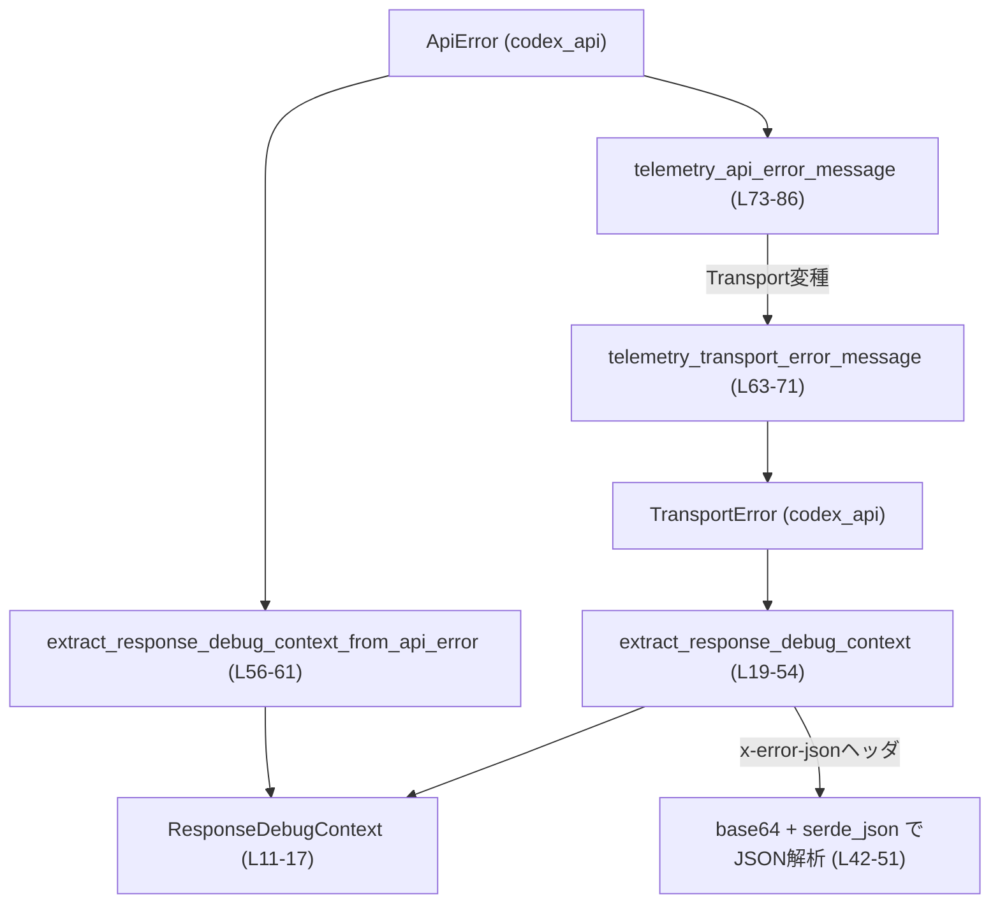
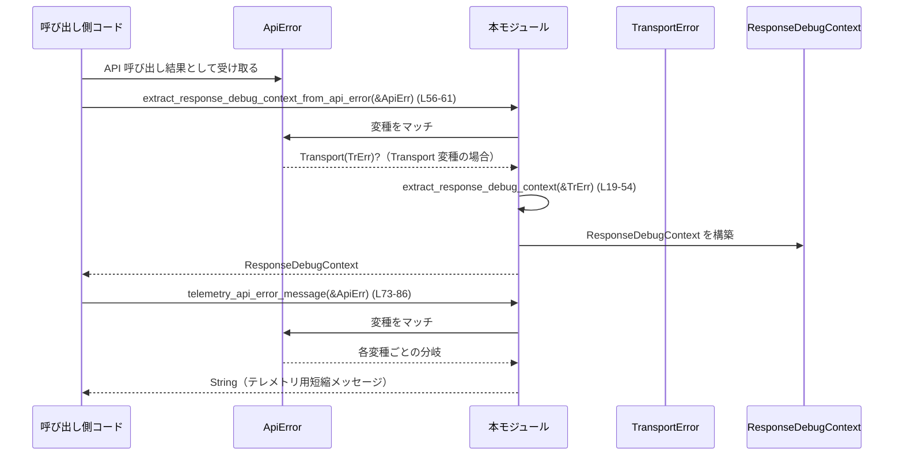

# response-debug-context/src/lib.rs コード解説

## 0. ざっくり一言

HTTP ベースのエラー (`TransportError`, `ApiError`) から、リクエスト ID や認可エラーなどの **デバッグ用コンテキスト** と、テレメトリ送信用の **短いエラーメッセージ** を抽出するモジュールです（`response-debug-context/src/lib.rs:L11-86`）。

---

## 1. このモジュールの役割

### 1.1 概要

- このモジュールは、`codex_api` クレートの `TransportError` / `ApiError` から
  - OpenAI 側リクエスト ID
  - Cloudflare Ray ID
  - 認可エラー内容・エラーコード  
 などを取り出して `ResponseDebugContext` にまとめます（`response-debug-context/src/lib.rs:L11-17, L19-54`）。
- あわせて、テレメトリ（ログ・メトリクスなど）に載せるための **短いエラーメッセージ** を構築します。HTTP エラーの場合はステータスコードのみを含め、HTTP ボディは含めないようになっています（`response-debug-context/src/lib.rs:L63-86`）。
- これにより、「ユーザー影響の把握に必要な情報を残しつつ、機密性の高いデータ（HTTP ボディなど）をテレメトリへ流さない」ことを目的とした設計になっています（テストもこれを検証しています `response-debug-context/src/lib.rs:L133-147`）。

### 1.2 アーキテクチャ内での位置づけ

`codex_api` 由来のエラー型を入力として、デバッグ用コンテキストとテレメトリ文言を生成する位置づけです。



- `ApiError` / `TransportError` は外部クレート `codex_api` の型です（`response-debug-context/src/lib.rs:L2-3`）。
- `ResponseDebugContext` はこのモジュールの中心的なデータ構造です（`response-debug-context/src/lib.rs:L11-17`）。
- `extract_response_debug_context` は HTTP 変種の `TransportError` からヘッダを解析します（`response-debug-context/src/lib.rs:L19-54`）。
- `telemetry_*_error_message` は、ログやメトリクス向けにコンパクトなメッセージを作ります（`response-debug-context/src/lib.rs:L63-86`）。

※図は `response-debug-context/src/lib.rs:L11-86` の処理を表現しています。

### 1.3 設計上のポイント

- **ステートレスな純粋関数**  
  グローバル状態や可変な共有状態は持たず、すべての公開関数は引数だけから戻り値を計算する純粋関数です（`response-debug-context/src/lib.rs:L19-86`）。
- **情報抽出の集約**  
  デバッグに使うヘッダ値を 1 つの構造体 `ResponseDebugContext` に集約しており、呼び出し側は struct だけを見れば必要な情報を確認できる形になっています（`response-debug-context/src/lib.rs:L11-17, L19-51`）。
- **安全なエラーハンドリング**  
  - ヘッダ値の取得・UTF-8 変換・base64 デコード・JSON パースはいずれも `Option` チェーンと `.ok()?` によって失敗を `None` として扱っており、panic を起こさない方針です（`response-debug-context/src/lib.rs:L29-35, L42-51`）。
  - `Result` の `unwrap` / `expect` は使用されていません。
- **プライバシー配慮されたテレメトリ**  
  - HTTP エラーのテレメトリメッセージは `"http 401"` のようにステータスコードのみを含み、HTTP ボディには一切触れません（`response-debug-context/src/lib.rs:L63-71, L133-147`）。
  - テストで、HTTP ボディ内に含まれるシークレットがテレメトリに出ないことが検証されています（`response-debug-context/src/lib.rs:L133-147`）。
- **並行性**  
  - モジュール内に `static mut` やグローバルなミュータブル状態は存在せず、関数も純粋関数なので、複数スレッドから同時に呼び出してもデータ競合は発生しません。
  - `ResponseDebugContext` は `String` と `Option<String>` のみから構成されており（`response-debug-context/src/lib.rs:L13-16`）、通常の Rust の規則に従うと `Send` / `Sync` 自動実装が期待されますが、このファイル内に明示的な `unsafe impl` などはありません。

---

## 2. 主要な機能一覧

- `ResponseDebugContext` 構造体: HTTP レスポンスから抽出したデバッグ用メタデータを保持する（`response-debug-context/src/lib.rs:L11-17`）。
- `extract_response_debug_context`: `TransportError::Http` のヘッダから `ResponseDebugContext` を生成する（`response-debug-context/src/lib.rs:L19-54`）。
- `extract_response_debug_context_from_api_error`: `ApiError` から上記コンテキスト抽出を行うラッパー（`response-debug-context/src/lib.rs:L56-61`）。
- `telemetry_transport_error_message`: `TransportError` を短いテレメトリ用文字列に変換する（`response-debug-context/src/lib.rs:L63-71`）。
- `telemetry_api_error_message`: `ApiError` を短いテレメトリ用文字列に変換する（`response-debug-context/src/lib.rs:L73-86`）。

---

## 3. 公開 API と詳細解説

### 3.1 型一覧（構造体・列挙体など）

#### コンポーネントインベントリー

| 名前 | 種別 | 行範囲 | 役割 / 用途 |
|------|------|--------|-------------|
| `ResponseDebugContext` | 構造体 | `response-debug-context/src/lib.rs:L11-17` | HTTP レスポンスヘッダなどから抽出したデバッグ情報（リクエスト ID / CF Ray / 認可エラー情報）をまとめるコンテキスト |

`ResponseDebugContext` のフィールド:

- `request_id: Option<String>` – OpenAI 側のリクエスト ID。`x-request-id` または `x-oai-request-id` ヘッダから取得（`response-debug-context/src/lib.rs:L5-6, L13, L37-38`）。
- `cf_ray: Option<String>` – Cloudflare の Ray ID。`cf-ray` ヘッダから取得（`response-debug-context/src/lib.rs:L7, L14, L39`）。
- `auth_error: Option<String>` – 認可エラー内容。`x-openai-authorization-error` ヘッダから取得（`response-debug-context/src/lib.rs:L8, L15, L40`）。
- `auth_error_code: Option<String>` – エラーコード。`x-error-json` ヘッダの base64 エンコードされた JSON をデコードして `{"error":{"code":"..."}}` から取り出す（`response-debug-context/src/lib.rs:L9, L16, L41-51`）。

### 3.2 関数詳細

#### 1. `extract_response_debug_context(transport: &TransportError) -> ResponseDebugContext`

**概要**

- `TransportError` のうち HTTP エラー変種から、各種デバッグ用ヘッダを抽出して `ResponseDebugContext` を生成する関数です（`response-debug-context/src/lib.rs:L19-54`）。
- HTTP 以外のエラー種別の場合は、すべて `None` を持つデフォルトの `ResponseDebugContext` を返します。

**引数**

| 引数名 | 型 | 説明 |
|--------|----|------|
| `transport` | `&TransportError` | 通信レイヤのエラー。HTTP ステータス・ヘッダ・ボディなどを含む可能性のある型（`response-debug-context/src/lib.rs:L19, L22-27, L115-120`）。 |

**戻り値**

- `ResponseDebugContext` – 抽出されたデバッグ情報のコンテキスト。HTTP エラーでない場合やヘッダが存在しない・解析できない場合は、該当フィールドが `None` になります（`response-debug-context/src/lib.rs:L20, L37-51, L53`）。

**内部処理の流れ（アルゴリズム）**

1. `ResponseDebugContext::default()` で、すべてのフィールドが `None` のコンテキストを作成します（`response-debug-context/src/lib.rs:L20`）。
2. パターンマッチで `TransportError::Http { headers, body: _, .. }` の場合だけを取り出し、それ以外の変種ならそのままデフォルトを返して終了します（`response-debug-context/src/lib.rs:L22-27`）。
3. ローカルクロージャ `extract_header` を定義し、指定したヘッダ名について以下を行います（`response-debug-context/src/lib.rs:L29-35`）。
   - `headers` が `Some` か確認。
   - Map から該当ヘッダを取り出し `HeaderValue::to_str()` で UTF-8 文字列に変換。
   - 成功した場合は `String` に変換し、失敗した場合は `None`。
4. `request_id` は `x-request-id` を優先し、なければ `x-oai-request-id` を使う形で設定します（`response-debug-context/src/lib.rs:L37-38`）。
5. `cf_ray` と `auth_error` はそれぞれ対応するヘッダから単純に取得します（`response-debug-context/src/lib.rs:L39-40`）。
6. `auth_error_code` は `x-error-json` ヘッダを使って以下を行います（`response-debug-context/src/lib.rs:L41-51`）。
   - ヘッダ値を base64 デコード (`base64::engine::general_purpose::STANDARD.decode`) し、失敗したら `None`。
   - デコード結果を JSON としてパース (`serde_json::from_slice::<serde_json::Value>`) し、失敗したら `None`。
   - パース結果から `error` → `code` の文字列を辿って取得し、存在しなければ `None`。
7. 最終的な `context` を返します（`response-debug-context/src/lib.rs:L53`）。

**Examples（使用例）**

HTTP エラーからデバッグコンテキストを抽出する簡単な例です。

```rust
use codex_api::TransportError;                        // TransportError 型をインポートする
use response_debug_context::extract_response_debug_context;
use response_debug_context::ResponseDebugContext;

fn log_transport_error(err: &TransportError) {        // 通信エラーをロギングする関数
    let ctx: ResponseDebugContext =
        extract_response_debug_context(err);          // ヘッダからデバッグ情報を抽出する

    eprintln!("request_id={:?}, cf_ray={:?}, auth_error={:?}, auth_error_code={:?}",
        ctx.request_id,                               // x-request-id / x-oai-request-id 由来
        ctx.cf_ray,                                   // cf-ray 由来
        ctx.auth_error,                               // x-openai-authorization-error 由来
        ctx.auth_error_code,                          // x-error-json（base64+JSON）由来
    );
}
```

**Errors / Panics**

- この関数内で `Result::unwrap` や `expect` は使用されておらず、base64 デコード・JSON パース・ヘッダの UTF-8 変換はすべて `ok()?` / `Option` チェーンで失敗時 `None` になります（`response-debug-context/src/lib.rs:L29-35, L42-51`）。
- よって、入力にどのようなヘッダ値が含まれていても、この関数がパニックすることはありません（`unsafe` も存在しません `response-debug-context/src/lib.rs:L1-86`）。

**Edge cases（エッジケース）**

- `transport` が `TransportError::Http` 以外の場合  
  → 早期にデフォルトコンテキストを返します（`response-debug-context/src/lib.rs:L22-27`）。
- `headers` が `None` の HTTP エラーの場合  
  → すべてのフィールドが `None` のコンテキストになります（`response-debug-context/src/lib.rs:L29-35`）。
- 対応するヘッダが存在しない場合  
  → 該当フィールドは `None` になります（`response-debug-context/src/lib.rs:L29-40`）。
- ヘッダが非 UTF-8 の値を持つ場合  
  → `to_str().ok()` により `None` と扱われ、そのフィールドは `None` になります（`response-debug-context/src/lib.rs:L32-34`）。
- `x-error-json` ヘッダが不正な base64 / 不正な JSON / 期待と異なる構造の場合  
  → いずれの段階でも `.ok()?` / `.get(...)` チェーンで `None` となり、`auth_error_code` は `None` になります（`response-debug-context/src/lib.rs:L41-51`）。

**使用上の注意点**

- 取得した各フィールドは `Option<String>` であり、`None` になりうるため、呼び出し側で `unwrap()` せずに `match` や `if let` で扱うことが前提です。
- HTTP 以外の `TransportError` からは一切の情報が抽出されない設計になっています。必要があれば別途 Network / Timeout 系の情報を扱う仕組みが必要です。
- この関数は `TransportError::Http` の **ヘッダ値のみ** を参照し、HTTP ボディは一切参照しません（`body: _` として無視しているため `response-debug-context/src/lib.rs:L22-23`）。ボディの情報をテレメトリに含めたくない場合に安全です。

---

#### 2. `extract_response_debug_context_from_api_error(error: &ApiError) -> ResponseDebugContext`

**概要**

- 高レベルの `ApiError` から、内部に含まれている `TransportError`（HTTP エラー）のデバッグコンテキストを抽出するためのラッパー関数です（`response-debug-context/src/lib.rs:L56-61`）。

**引数**

| 引数名 | 型 | 説明 |
|--------|----|------|
| `error` | `&ApiError` | アプリケーション全体で扱う API エラー型（`response-debug-context/src/lib.rs:L56-60`）。 |

**戻り値**

- `ResponseDebugContext` – `ApiError::Transport` 変種であれば `extract_response_debug_context` の結果、それ以外はデフォルトコンテキストです（`response-debug-context/src/lib.rs:L57-60`）。

**内部処理の流れ**

1. `match error` で `ApiError` の変種を判定します（`response-debug-context/src/lib.rs:L57`）。
2. `ApiError::Transport(transport)` の場合に限り、`extract_response_debug_context(transport)` を呼び出してコンテキストを取得します（`response-debug-context/src/lib.rs:L57-58`）。
3. それ以外の変種（API レベルのエラー、ストリームエラーなど）は、`ResponseDebugContext::default()` を返します（`response-debug-context/src/lib.rs:L59`）。

**Examples（使用例）**

```rust
use codex_api::ApiError;                                      // ApiError 型
use response_debug_context::{
    extract_response_debug_context_from_api_error,
    ResponseDebugContext,
};

fn handle_api_error(err: &ApiError) {                         // API エラーを処理する関数
    let ctx: ResponseDebugContext =
        extract_response_debug_context_from_api_error(err);   // 必要なら TransportError から情報抽出

    // TransportError でなければ ctx はデフォルト（全て None）
    eprintln!("debug context: {:?}", ctx);                    // デバッグ目的のログ出力などに利用する
}
```

**Errors / Panics**

- `extract_response_debug_context` と同様、panic を発生させるような `unwrap` / `expect` は使用されていません（`response-debug-context/src/lib.rs:L56-61`）。
- 非 `Transport` 変種では単に `ResponseDebugContext::default()` を返すだけです。

**Edge cases**

- `ApiError` が `Transport` 以外の全ての変種（`Api`, `Stream`, `ContextWindowExceeded` など）  
  → すべて `None` を持つデフォルトコンテキストが返されます（`response-debug-context/src/lib.rs:L59`）。

**使用上の注意点**

- あくまで HTTP レベルの情報（ヘッダ）に限定したコンテキストであり、API レベルのエラー内容（例えば JSON ボディ内メッセージ）はここには含まれません。
- API エラー種別に応じて別の情報を見たい場合は、`ApiError` 自体を併用する必要があります。

---

#### 3. `telemetry_transport_error_message(error: &TransportError) -> String`

**概要**

- `TransportError` を、テレメトリ（ログ・メトリクスなど）で扱いやすい短い文字列に変換する関数です（`response-debug-context/src/lib.rs:L63-71`）。
- HTTP エラーの場合は `"http 401"` のようにステータスコードのみを含み、HTTP ボディの情報は一切含みません。

**引数**

| 引数名 | 型 | 説明 |
|--------|----|------|
| `error` | `&TransportError` | 通信レイヤのエラー（`response-debug-context/src/lib.rs:L63-70`）。 |

**戻り値**

- `String` – テレメトリ用に短く整形されたエラー説明文字列（`response-debug-context/src/lib.rs:L64-70`）。

**内部処理の流れ**

1. `match error` で `TransportError` の変種ごとに処理を分岐します（`response-debug-context/src/lib.rs:L64-70`）。
2. `TransportError::Http { status, .. }`  
   → `format!("http {}", status.as_u16())` として `"http 401"` のような文字列を返します（`response-debug-context/src/lib.rs:L65`）。
3. `TransportError::RetryLimit`  
   → `"retry limit reached".to_string()` を返します（`response-debug-context/src/lib.rs:L66`）。
4. `TransportError::Timeout`  
   → `"timeout".to_string()` を返します（`response-debug-context/src/lib.rs:L67`）。
5. `TransportError::Network(err)` / `TransportError::Build(err)`  
   → `err.to_string()` をそのまま返します（`response-debug-context/src/lib.rs:L68-69`）。

**Examples（使用例）**

```rust
use codex_api::TransportError;
use response_debug_context::telemetry_transport_error_message;

fn record_transport_error(err: &TransportError) {
    let msg = telemetry_transport_error_message(err);     // エラーを短い文字列に変換
    // 例: "http 401", "timeout", "dns lookup failed" など
    metrics::increment_counter!("transport_errors",       // メトリクスラベルとして利用する例
        "reason" => msg.clone(),
    );
    eprintln!("transport error: {}", msg);                // ログに出力するなど
}
```

**Errors / Panics**

- パターンマッチは `TransportError` の全ての変種を網羅しており、`_` アームは不要です（`response-debug-context/src/lib.rs:L64-70`）。
- `status.as_u16()` と `err.to_string()` は通常 panic を発生させません（このファイル内で `unwrap` などは使っていません）。

**Edge cases**

- HTTP レスポンスボディが機密情報を含んでいても、この関数はボディには一切アクセスしていないため、テレメトリにボディ内容が漏れることはありません（`response-debug-context/src/lib.rs:L65`）。
- `Network` / `Build` 変種については、`err.to_string()` の内容次第で機密情報が含まれる可能性がありますが、その内容は `codex_api` 側のエラーメッセージ設計に依存します（`response-debug-context/src/lib.rs:L68-69`）。

**使用上の注意点**

- メトリクスのラベルなどにそのまま使う場合、値のカーディナリティ（種類数）が増えすぎると監視基盤によっては負荷になる可能性があります。HTTP の場合は `"http 401"` のように限定的ですが、`Network` / `Build` 変種で自由形式の文字列が返る点に注意が必要です。
- HTTP ボディを含めたい場合でも、この関数はボディを見ない設計なので、別途ロギングを行う必要があります（ただしセキュリティ上の配慮が必要です）。

---

#### 4. `telemetry_api_error_message(error: &ApiError) -> String`

**概要**

- `ApiError` を、テレメトリ向けの短い文字列に変換する関数です（`response-debug-context/src/lib.rs:L73-86`）。
- `TransportError` 変種の場合は `telemetry_transport_error_message` を委譲して使用します。

**引数**

| 引数名 | 型 | 説明 |
|--------|----|------|
| `error` | `&ApiError` | アプリケーション全体で扱う API エラー（`response-debug-context/src/lib.rs:L73-85`）。 |

**戻り値**

- `String` – エラー種別に応じた短い説明文（`response-debug-context/src/lib.rs:L74-85`）。

**内部処理の流れ**

1. `match error` で `ApiError` の変種を判定します（`response-debug-context/src/lib.rs:L74-85`）。
2. `ApiError::Transport(transport)`  
   → `telemetry_transport_error_message(transport)` に処理を委譲し、その戻り値を返します（`response-debug-context/src/lib.rs:L75`）。
3. `ApiError::Api { status, .. }`  
   → `format!("api error {}", status.as_u16())` として `"api error 401"` のような文字列を返します（`response-debug-context/src/lib.rs:L76`）。
4. `ApiError::Stream(err)`  
   → `err.to_string()` を返します（`response-debug-context/src/lib.rs:L77`）。
5. その他の変種は、定数的な短い文字列を返します（`response-debug-context/src/lib.rs:L78-85`）。
   - `ContextWindowExceeded` → `"context window exceeded"`
   - `QuotaExceeded` → `"quota exceeded"`
   - `UsageNotIncluded` → `"usage not included"`
   - `Retryable { .. }` → `"retryable error"`
   - `RateLimit(_)` → `"rate limit"`
   - `InvalidRequest { .. }` → `"invalid request"`
   - `ServerOverloaded` → `"server overloaded"`

**Examples（使用例）**

```rust
use codex_api::ApiError;
use response_debug_context::telemetry_api_error_message;

fn record_api_error(err: &ApiError) {
    let msg = telemetry_api_error_message(err);         // API エラーを短い文字列に変換
    // 例: "http 401", "api error 500", "rate limit", "context window exceeded"
    log::warn!("api error (telemetry): {}", msg);       // ログやメトリクスに利用できる
}
```

**Errors / Panics**

- すべての `ApiError` 変種が `match` の中で明示的に扱われており、このファイル内に `_` アームや `panic!` はありません（`response-debug-context/src/lib.rs:L74-85`）。
- `Transport` 変種は `telemetry_transport_error_message` に委譲しており、そちらも panic を発生させない方針です（`response-debug-context/src/lib.rs:L63-71`）。

**Edge cases**

- 新たな `ApiError` 変種が `codex_api` 側に追加された場合、この関数にもアーム追加が必要になります（現状はすべて列挙しているため、コンパイルエラーで検知可能です）。
- `ApiError::Stream(err)` の `err.to_string()` の内容次第では、低レベルなエラー詳細（ソケットアドレスなど）が含まれる可能性があります。

**使用上の注意点**

- 返される文字列はテレメトリ向けに「縮約」されたものであり、ユーザー向けの詳細なエラーメッセージとしては不十分な場合があります。その場合は `ApiError` 自体を別途ログに残す必要があります。
- プライバシー上、HTTP ボディ等の機密情報はこの関数では扱っていませんが、`Stream` や `Network` 系エラー文字列には環境依存の情報が含まれる可能性があるため、利用先のログポリシーに注意が必要です。

---

### 3.3 その他の関数

このモジュールには、公開 API 以外に補助的なトップレベル関数はありません。  
`tests` モジュール内のテスト関数はランタイムには含まれず、動作検証のためだけに存在します（`response-debug-context/src/lib.rs:L88-165`）。

---

## 4. データフロー

代表的なシナリオとして、「API 呼び出しが失敗し `ApiError` が返されたとき、デバッグコンテキストとテレメトリメッセージを生成する」流れを示します。



- `extract_response_debug_context_from_api_error` が `ApiError::Transport` 変種に対してのみ HTTP ヘッダからのコンテキスト抽出を行います（`response-debug-context/src/lib.rs:L56-61`）。
- `telemetry_api_error_message` は `ApiError` 全体に対する短い説明文を返し、`Transport` 変種については `telemetry_transport_error_message` に委譲します（`response-debug-context/src/lib.rs:L73-86`）。
- これらを組み合わせることで、「ユーザー向けの詳細なエラーメッセージ」とは別に、「監視・テレメトリ向けの簡潔なラベル」と「サポート向けのデバッグコンテキスト」を並行して扱うことができます。

---

## 5. 使い方（How to Use）

### 5.1 基本的な使用方法

API 呼び出しで `ApiError` が返ってきたときに、デバッグコンテキストとテレメトリメッセージを生成してログに残す例です。

```rust
use codex_api::ApiError;                                           // ApiError 型をインポート
use response_debug_context::{
    extract_response_debug_context_from_api_error,
    telemetry_api_error_message,
    ResponseDebugContext,
};

fn handle_api_error(err: &ApiError) {
    // 1. デバッグコンテキストを抽出する（TransportError::Http の場合のみ有効な情報が入る）
    let ctx: ResponseDebugContext =
        extract_response_debug_context_from_api_error(err);        // L56-61 相当の処理

    // 2. テレメトリ用の短いメッセージを作る
    let msg: String =
        telemetry_api_error_message(err);                          // L73-86 相当の処理

    // 3. ログに出力（ボディなどの機密情報は含まれない設計）
    log::warn!(
        "api error: msg={}, request_id={:?}, cf_ray={:?}, auth_error={:?}, auth_error_code={:?}",
        msg,
        ctx.request_id,
        ctx.cf_ray,
        ctx.auth_error,
        ctx.auth_error_code,
    );
}
```

- ここで `msg` は `"http 401"` や `"rate limit"` などの短い文字列に統一されるため、メトリクスラベルとしても利用しやすい設計になっています（`response-debug-context/src/lib.rs:L73-85`）。

### 5.2 よくある使用パターン

1. **テレメトリラベルとしてのみ利用する**

   ```rust
   fn record_api_error_metrics(err: &ApiError) {
       let label = telemetry_api_error_message(err);          // 種別に応じた短いラベル
       metrics::increment_counter!(
           "api_errors_total",
           "error_type" => label,                            // メトリクスのラベルとして使用
       );
   }
   ```

2. **HTTP エラー時のみ追加コンテキストを収集する**

   ```rust
   fn log_http_debug_info(err: &ApiError) {
       let ctx = extract_response_debug_context_from_api_error(err);

       if ctx.request_id.is_some() || ctx.auth_error.is_some() {
           // HTTP レイヤの情報がある場合のみ詳細ログを出す
           log::debug!("http debug context: {:?}", ctx);
       }
   }
   ```

### 5.3 よくある間違い

**間違い例: `auth_error_code` が必ずあると決めつけて `unwrap` する**

```rust
// 間違い例: auth_error_code が None になるケースを考慮していない
fn bad_use(err: &TransportError) {
    let ctx = extract_response_debug_context(err);
    let code = ctx.auth_error_code.unwrap();              // パニックの可能性あり（ヘッダが無い/解析失敗など）
    eprintln!("auth error code = {}", code);
}
```

**正しい例: `Option` として扱う**

```rust
fn good_use(err: &TransportError) {
    let ctx = extract_response_debug_context(err);

    if let Some(code) = ctx.auth_error_code.as_deref() {  // Some のときだけ利用する
        eprintln!("auth error code = {}", code);
    } else {
        eprintln!("auth error code is not available");
    }
}
```

**間違い例: HTTP ボディを独自にテレメトリへ送ってしまう**

```rust
// 間違い例: HTTP ボディにシークレットが含まれている場合、そのまま漏洩する
fn bad_http_logging(err: &TransportError) {
    if let TransportError::Http { body: Some(body), .. } = err {
        log::warn!("http error body: {}", body);          // ボディの内容をそのままログに出している
    }
}
```

このモジュールの `telemetry_*` 関数は HTTP ボディを一切見ない設計（`body` を無視）になっているため（`response-debug-context/src/lib.rs:L22-23, L65`）、ボディのログ出力は慎重に検討する必要があります。

### 5.4 使用上の注意点（まとめ）

- **前提条件**
  - すべての公開関数は引数を `&ApiError` / `&TransportError` として借用するだけであり、所有権を奪わないため、呼び出し元でエラーを再利用できます（`response-debug-context/src/lib.rs:L19, L56, L63, L73`）。
- **Option フィールドの扱い**
  - `ResponseDebugContext` の各フィールドは `Option<String>` であり、ヘッダが無い / 不正な形式 / 非 HTTP エラーなど、多くのケースで `None` になりうる設計です（`response-debug-context/src/lib.rs:L13-16, L29-51`）。
- **プライバシー / セキュリティ**
  - HTTP エラーのテレメトリ文字列はステータスコードのみを含み、HTTP ボディや URL、ヘッダ値は含みません（`response-debug-context/src/lib.rs:L65, L133-147`）。
  - `Network` / `Build` / `Stream` などの変種では `err.to_string()` をそのまま返しており（`response-debug-context/src/lib.rs:L68-69, L77`）、その内容がどこまで詳細かは `codex_api` 側の実装に依存します。  
    テレメトリやログに使う場合は、その文字列に機密情報が含まれないポリシーになっているかを確認する必要があります。
- **並行性**
  - モジュール内にグローバルな可変状態はなく、すべての処理はローカル変数のみを操作します（`response-debug-context/src/lib.rs:L19-86`）。  
    そのため、複数スレッドから同時に呼び出してもデータ競合は発生しません。

---

## 6. 変更の仕方（How to Modify）

### 6.1 新しい機能を追加する場合

例: 新しいデバッグヘッダ（例えば `x-openai-region`）を `ResponseDebugContext` に追加したい場合。

1. **モジュール定数の追加**  
   - 既存のヘッダ名定数 (`REQUEST_ID_HEADER` など `response-debug-context/src/lib.rs:L5-9`) と同様に、新しいヘッダ名用の `const` を追加します。
2. **`ResponseDebugContext` へのフィールド追加**  
   - 構造体に `pub region: Option<String>` のようなフィールドを追加します（`response-debug-context/src/lib.rs:L11-17`）。
3. **`extract_response_debug_context` の拡張**
   - `extract_header` クロージャ（`response-debug-context/src/lib.rs:L29-35`）をそのまま利用し、新ヘッダを読み取って新フィールドに代入する行を追加します。
4. **テストの追加 / 変更**
   - `tests` モジュール内で、新しいヘッダを含む `TransportError::Http` を構築し、`extract_response_debug_context` の結果に期待した値が入ることを検証するテストを追加します（既存テスト `response-debug-context/src/lib.rs:L101-131` を参考にできます）。

### 6.2 既存の機能を変更する場合

- **テレメトリメッセージの文言変更**
  - `telemetry_transport_error_message` / `telemetry_api_error_message` はテストで文言を検証しているため（`response-debug-context/src/lib.rs:L133-147, L149-164`）、メッセージを変更した場合はテストも併せて更新する必要があります。
- **HTTP ボディをテレメトリに含めるように変更したい場合**
  - 現在は `TransportError::Http` で `body: _` としてボディを無視しているため（`response-debug-context/src/lib.rs:L22-23, L65`）、ボディを扱うにはパターンに `body` を追加し、それを利用する処理を実装する必要があります。
  - ただし、機密情報漏洩のリスクがあるため、安全性ポリシーとログ規約を確認することが重要です。
- **`ApiError` / `TransportError` の変種追加に伴う変更**
  - `match` 文は両型の変種を網羅しています（`response-debug-context/src/lib.rs:L64-70, L74-85`）。  
    外部クレート側で変種が増えた場合、コンパイラが非網羅マッチとして指摘するため、その時点でアームを追加し、テレメトリ文字列のポリシー（ボディ不使用など）に沿った処理を実装する必要があります。

---

## 7. 関連ファイル

このモジュールと密接に関係する型・外部クレートは次のとおりです。

| パス / 型 | 役割 / 関係 |
|-----------|------------|
| `codex_api::ApiError` | 高レベルの API エラー型。`telemetry_api_error_message` や `extract_response_debug_context_from_api_error` の入力として使用されます（`response-debug-context/src/lib.rs:L2, L56-61, L73-85`）。この型の定義場所のファイルパスは、このチャンクには現れません。 |
| `codex_api::TransportError` | 通信レイヤのエラー型。HTTP ステータス・URL・ヘッダ・ボディなどを持つ `Http` 変種があり、本モジュールのコンテキスト抽出の主な入力となります（`response-debug-context/src/lib.rs:L3, L19-54, L63-71, L115-120`）。 |
| `http::HeaderMap` / `http::HeaderValue` / `http::StatusCode` | テストコードで `TransportError::Http` を構築するときに使用される HTTP 型です（`response-debug-context/src/lib.rs:L96-98, L115-120, L135-140`）。本番コードでは直接使用していません。 |
| `base64` / `serde_json` | `x-error-json` ヘッダに入っている base64 エンコードされた JSON から `auth_error_code` を取得するために使用されます（`response-debug-context/src/lib.rs:L42-51`）。 |

> 補足: `codex_api` クレート内のファイル構成や `ApiError` / `TransportError` の詳細定義は、このチャンクには現れないため不明です。
