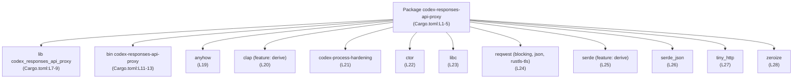
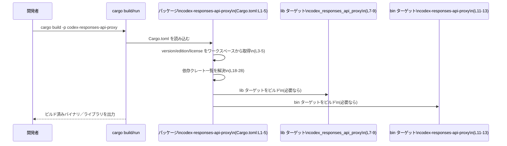

# responses-api-proxy/Cargo.toml

## 0. ざっくり一言

`codex-responses-api-proxy` クレートの Cargo マニフェストであり、  
ライブラリとバイナリのターゲット、依存クレート、ワークスペース共通設定を定義しています（Cargo.toml:L1-5, L7-9, L11-13, L18-31）。

---

## 1. このモジュールの役割

### 1.1 概要

- このファイルは Rust パッケージ `codex-responses-api-proxy` のビルド設定を行う Cargo マニフェストです（Cargo.toml:L1-5）。
- ライブラリターゲット `codex_responses_api_proxy`（Cargo.toml:L7-9）と、バイナリターゲット `codex-responses-api-proxy`（Cargo.toml:L11-13）を定義しています。
- エラー処理・CLI パース・HTTP 通信・シリアライゼーション・セキュリティ強化などの外部クレートへの依存を宣言し（Cargo.toml:L18-28）、ワークスペース共通のバージョン・edition・ライセンス・lints を使用します（Cargo.toml:L3-5, L15-16, L19-28, L31）。

### 1.2 アーキテクチャ内での位置づけ

このマニフェストから分かる「ビルド単位」と「依存関係」を図示します。  
ここでは**パッケージ単位**の依存関係のみであり、関数レベルやモジュールレベルの呼び出し関係はこのチャンクには現れません。



- `codex-responses-api-proxy` パッケージが、1つのライブラリ・1つのバイナリ・複数の外部クレートに依存する構成になっています。
- 依存はパッケージ単位で宣言されているため、**lib と bin の両方から同じ依存クレートを利用可能**な形になっています（Cargo.toml:L18-28）。

### 1.3 設計上のポイント

コードから読み取れる設計上の特徴を箇条書きにします。

- **ワークスペース前提の設定共有**  
  - `version.workspace = true`、`edition.workspace = true`、`license.workspace = true` により、バージョン・edition・ライセンスをワークスペースルートで一元管理しています（Cargo.toml:L3-5）。
  - `[lints] workspace = true` により、コンパイラ lints 設定もワークスペース側で統一されています（Cargo.toml:L15-16）。
  - 依存クレートも `workspace = true` を使っており、バージョン指定はワークスペース側に委譲されています（Cargo.toml:L19-28, L31）。

- **ライブラリ＋バイナリの二面性**  
  - `src/lib.rs` をエントリポイントとするライブラリクレート `codex_responses_api_proxy` を定義（Cargo.toml:L7-9）。
  - `src/main.rs` をエントリポイントとするバイナリクレート `codex-responses-api-proxy` を併設（Cargo.toml:L11-13）。
  - どの程度 lib と bin がコード共有しているかは、このチャンクには現れません。

- **エラー処理と安全性関連の依存**  
  - `anyhow` に依存しており、汎用エラー型によるエラー伝播が可能な設計になっています（Cargo.toml:L19）。
  - `codex-process-hardening` や `zeroize` を依存に含めており、プロセスのハードニングや機密情報のメモリ消去といった**セキュリティ強化**を意識した構成が取れるようになっています（Cargo.toml:L21, L28）。  
    実際にどのように利用しているかは、このチャンクからは分かりません。

- **CLI とシリアライゼーションのための依存**  
  - `clap` の `derive` 機能を有効化しており（Cargo.toml:L20）、構造体から CLI 引数定義を派生させる設計が可能です。
  - `serde`（derive）と `serde_json` に依存しており（Cargo.toml:L25-26）、構造体 <-> JSON 変換を用いたデータ入出力が可能な構成です。

- **HTTP 通信と並行性に関わる依存**  
  - HTTP クライアントとして `reqwest` を依存に含み、`blocking`, `json`, `rustls-tls` フィーチャを有効化しています（Cargo.toml:L24）。  
    - これにより**同期（blocking）API** と JSON シリアライゼーション、TLS を利用可能な設定になっています。
  - HTTP サーバとして使える `tiny_http` に依存しています（Cargo.toml:L27）。
  - このファイルに `tokio` などの非同期ランタイム依存は現れません（Cargo.toml:L18-28）。  
    したがって、少なくともマニフェストからは「同期的な HTTP 通信(stack) を採用しうる構成」であることだけが読み取れます。実際の並行処理モデル（スレッド数・ブロッキング I/O の扱いなど）は、このチャンクには現れません。

---

## 2. 主要な機能一覧

このファイル自体は実行時ロジックや関数を含まず、**ビルド・配布形態を定義する設定ファイル**です。その観点での主要な機能は次の通りです。

- パッケージメタデータの定義: パッケージ名とワークスペース由来のバージョン・edition・ライセンスを定義（Cargo.toml:L1-5）。
- ライブラリターゲットの定義: `src/lib.rs` をエントリとする lib クレート `codex_responses_api_proxy` を定義（Cargo.toml:L7-9）。
- バイナリターゲットの定義: `src/main.rs` をエントリとする bin クレート `codex-responses-api-proxy` を定義（Cargo.toml:L11-13）。
- 共通 lints 設定の適用: ワークスペース共通の lint 設定を利用（Cargo.toml:L15-16）。
- 実行時依存クレートの宣言: エラー処理、CLI、HTTP、シリアライゼーション、セキュリティ関連の依存を宣言（Cargo.toml:L18-28）。
- テスト用依存の宣言: `pretty_assertions` を dev-dependency として追加（Cargo.toml:L30-31）。

### 2.1 コンポーネント一覧（コンポーネントインベントリー）

このチャンクで確認できる「ビルド上のコンポーネント（ターゲット・依存クレート）」の一覧です。

| コンポーネント名 | 種別 | 説明 | 根拠 |
|------------------|------|------|------|
| `codex-responses-api-proxy` | パッケージ | Rust パッケージ全体の論理名。バージョン・edition・ライセンスはワークスペースから取得。 | Cargo.toml:L1-5 |
| `codex_responses_api_proxy` | ライブラリターゲット | `src/lib.rs` をエントリとする lib クレート。外部から再利用可能な API が定義される想定ですが、内容はこのチャンクには現れません。 | Cargo.toml:L7-9 |
| `codex-responses-api-proxy` | バイナリターゲット | `src/main.rs` をエントリとする実行可能バイナリ。CLI アプリケーションである可能性がありますが、具体的な挙動は不明です。 | Cargo.toml:L11-13 |
| `anyhow` | 依存クレート | 一般的にエラー処理のためのクレート。`anyhow::Error` によるエラー集約が可能になります。本クレートでの実際の利用箇所はこのチャンクには現れません。 | Cargo.toml:L19 |
| `clap` (feature: `derive`) | 依存クレート | 一般的に CLI 引数パースに使われるクレート。`derive` により構造体から CLI 定義を生成可能な設定。利用箇所は不明。 | Cargo.toml:L20 |
| `codex-process-hardening` | 依存クレート | ワークスペース内のハードニング用クレートと推測されますが、実装はこのチャンクには現れません。セキュリティ強化用途の依存であることだけが分かります。 | Cargo.toml:L21 |
| `ctor` | 依存クレート | グローバルコンストラクタ/デストラクタを定義するためのクレートとして知られていますが、具体的な利用は不明です。 | Cargo.toml:L22 |
| `libc` | 依存クレート | C ランタイムとの FFI 連携に用いられるクレート。OS レベル機能利用の可能性を示唆しますが、利用内容は不明です。 | Cargo.toml:L23 |
| `reqwest` (features: `blocking`, `json`, `rustls-tls`) | 依存クレート | HTTP クライアント用クレート。同期 API・JSON・TLS を利用可能な設定になっていますが、どの API を使っているかは不明です。 | Cargo.toml:L24 |
| `serde` (feature: `derive`) | 依存クレート | シリアライゼーションのためのクレート。構造体への `#[derive(Serialize, Deserialize)]` 付与が可能な設定ですが、対象型はこのチャンクには現れません。 | Cargo.toml:L25 |
| `serde_json` | 依存クレート | JSON との変換用クレート。どのデータを JSON で扱うかは不明です。 | Cargo.toml:L26 |
| `tiny_http` | 依存クレート | シンプルな HTTP サーバ実装を提供するクレートとして知られていますが、本クレートで実際にサーバを起動しているかは不明です。 | Cargo.toml:L27 |
| `zeroize` | 依存クレート | 機密情報をメモリから安全に消去するためのクレート。機密データを扱う可能性を示唆しますが、具体的なデータ種別は不明です。 | Cargo.toml:L28 |
| `pretty_assertions` | dev-dependency | テスト失敗時の diff を見やすく表示するためのクレート。テストコード自体はこのチャンクには現れません。 | Cargo.toml:L30-31 |

> このファイルには Rust の関数・構造体などの**実装コードは一切含まれない**ため、関数／構造体インベントリーはこのチャンクでは空です。

---

## 3. 公開 API と詳細解説

このファイルは Cargo の設定ファイルであり、Rust の型や関数の定義を含みません。そのため、以下のサブセクションにおいても**該当する具体的な型・関数はありません**。

### 3.1 型一覧（構造体・列挙体など）

- このチャンクには Rust コードが含まれていないため、構造体・列挙体など公開型の定義は存在しません（Cargo.toml:L1-31）。

### 3.2 関数詳細（最大 7 件）

- このファイルは TOML 設定のみであり、関数定義は含まれません（Cargo.toml:L1-31）。
- したがって、詳細解説すべき関数はこのチャンクには現れません。

### 3.3 その他の関数

- 関数定義そのものが存在しないため、このセクションも該当なしです。

> 実際の公開 API（関数・メソッド・型）は `src/lib.rs` や `src/main.rs` 側に存在すると考えられますが、その内容はこのチャンクには含まれていません。

---

## 4. データフロー

### 4.1 このファイルから分かるデータフローの範囲

- Cargo.toml から分かるのは**ビルド時の依存解決とターゲット構成**のみです。
- HTTP リクエスト／レスポンスなどの**実行時データフロー**（どのエンドポイントにアクセスするか、どのようにプロキシするか等）は、このチャンクには現れません。

ここでは、「開発者がビルド／実行する際に Cargo がどのようにこのマニフェストを利用するか」という観点で sequence diagram を示します。



- 並行コンパイルやインクリメンタルビルドの詳細は Cargo の挙動に依存し、このファイルからだけでは分かりません。
- 実行時に lib と bin のどの関数がどのように呼び出し合うかについても、このチャンクには現れません。

---

## 5. 使い方（How to Use）

このセクションでは、「Cargo.toml が示す範囲」での使い方を説明します。  
実際の関数呼び出し方法や CLI オプションなどの詳細は `src/lib.rs` / `src/main.rs` の実装に依存し、このチャンクには現れません。

### 5.1 基本的な使用方法

#### バイナリとして実行する

`codex-responses-api-proxy` バイナリターゲットを実行する最も基本的な方法は、Cargo からパッケージを指定して起動する形です。

```bash
# ワークスペースルートからの実行例
cargo run -p codex-responses-api-proxy -- [必要な引数]
```

- `-p codex-responses-api-proxy` はパッケージ名に対応しています（Cargo.toml:L2）。
- 実際にどのような引数が必要か・どのようなサブコマンドがあるかは `clap` を使った `src/main.rs` 側の定義に依存し、このチャンクからは分かりません。

#### ライブラリとして別クレートから利用する

同一ワークスペース内の別クレートからこのライブラリを利用する場合の例です。

```toml
# 別クレート側の Cargo.toml の例
[dependencies]
codex-responses-api-proxy = { path = "responses-api-proxy" }
```

- ここでの `path = "responses-api-proxy"` は、質問で与えられたディレクトリ名に基づく例です。  
  実際の相対パスはリポジトリ構成に依存します。
- ライブラリの API（どの関数・型を import して使うか）は `src/lib.rs` の中身に依存し、このチャンクには現れません。

### 5.2 よくある使用パターン（推測できる範囲）

このファイルから確実に言えるのは、「どのようなクレートを利用可能な状態にしているか」です。

- **CLI ツールとしての利用可能性**  
  - `clap`（derive）依存（Cargo.toml:L20）とバイナリターゲット定義（Cargo.toml:L11-13）から、CLI ツールとして実行される構成を取りうることが分かります。
  - ただし、どのオプション・サブコマンドがあるかはこのチャンクには現れません。

- **HTTP/JSON ベースの処理**  
  - `reqwest`（blocking, json, rustls-tls）、`tiny_http`、`serde`、`serde_json` 依存（Cargo.toml:L24-27）から、HTTP + JSON を扱うロジックを実装しうる構成です。
  - どのようなエンドポイントにアクセスするか、プロキシのルーティングやエラーハンドリングの詳細はこのチャンクには現れません。

### 5.3 よくある間違い（このマニフェストに対して）

Cargo.toml の編集に関連して起こりうる誤用を、事実ベースで挙げます。

```toml
# 間違い例: 個別クレート側だけでバージョンを変更しようとする
[package]
name = "codex-responses-api-proxy"
version = "1.2.3"               # ← workspace = true をやめてしまう

# 正しい例: version.workspace = true を維持し、ワークスペースルートでバージョンを変更する
[package]
name = "codex-responses-api-proxy"
version.workspace = true         # Cargo.toml:L3 と同じ形を維持
```

- このパッケージは `version.workspace = true` を前提としているため（Cargo.toml:L3）、ローカルで直接 `version = "..."` と書き換えると、ワークスペース全体のバージョン管理方針と齟齬が生じます。

```toml
# 間違い例: workspace でバージョンを管理している依存に個別バージョンを付ける
[dependencies]
reqwest = "0.11"     # ← workspace = true を削除して固定バージョンに

# 正しい例: workspace 側でバージョンを管理する
[dependencies]
reqwest = { workspace = true, features = ["blocking", "json", "rustls-tls"] }  # Cargo.toml:L24
```

- `reqwest` などの依存は `workspace = true` によりワークスペースで統一管理する前提です（Cargo.toml:L19-28）。
- 個別クレートでバージョンを固定すると、ワークスペース内の他クレートとのバージョン不整合を招く可能性があります。

### 5.4 使用上の注意点（まとめ）

このファイルに対して、Rust 言語固有の安全性・エラー・並行性の観点を含めて注意点を整理します。

- **ワークスペース前提であること**  
  - `version.workspace = true` などにより、ワークスペース外から単独でこのクレートをビルドしようとすると、ワークスペースルートの設定が存在せずビルドエラーになる可能性があります（Cargo.toml:L3-5, L15-16, L19-28, L31）。
  - このクレートはワークスペースの一部として扱う前提で利用する必要があります。

- **HTTP 通信と並行性（blocking reqwest + tiny_http）**  
  - `reqwest` の `blocking` フィーチャが有効化されており（Cargo.toml:L24）、非同期ランタイムを使わない同期 HTTP クライアント API を利用可能な構成です。
  - `tiny_http` も一般にブロッキング I/O に基づく設計で使われるため（Cargo.toml:L27）、大きな負荷をかける場合はスレッドの使い方や同時接続数に注意が必要になります。ただし、このクレートがどのようにスレッド・ブロッキング I/O を扱っているかは、このチャンクには現れません。

- **セキュリティ関連依存の存在**  
  - `codex-process-hardening` と `zeroize` が依存に含まれていることから（Cargo.toml:L21, L28）、プロセス保護や機密データゼロ化を行う実装を置きうる構成になっています。
  - 実際にどのデータを `zeroize` しているか、どのようなハードニングが行われているかはこのチャンクには現れず、`src/lib.rs` / `src/main.rs` の内容を確認する必要があります。

- **テスト依存の存在**  
  - `pretty_assertions` はテスト用依存であり（Cargo.toml:L30-31）、エラー発生時に見やすい diff を表示するテストスタイルが採用されている可能性があります。
  - 実際のテストケースやカバレッジは、このチャンクには現れません。

- **観測性（ログ・メトリクス）の情報はない**  
  - このマニフェストには `tracing` や `log` などのロギング／メトリクス用クレートは現れません（Cargo.toml:L18-28）。
  - ログ／メトリクスが全く無いのか、別の仕組みを利用しているのかは、このチャンクには現れません。

---

## 6. 変更の仕方（How to Modify）

### 6.1 新しい機能を追加する場合（このファイルの観点）

新しい機能を実装する際、この Cargo.toml に対して行う変更の典型パターンを示します。

1. **必要な外部クレートを追加する**  
   - 例: 新しい HTTP 機能で別のクライアントクレートが必要になった場合、ワークスペースルートの `[workspace.dependencies]`（このチャンクには現れない）にクレートを追加し、このファイルでは `クレート名 = { workspace = true }` を追加する、という方針と整合させる必要があります（Cargo.toml:L18-28 の既存パターンに合わせる）。

2. **lib / bin ターゲットを増やす場合**  
   - 追加のバイナリを増やしたい場合は、`[[bin]]` エントリを増やします。既存の bin エントリは `name` と `path` を指定しています（Cargo.toml:L11-13）。
   - 追加ライブラリ（別名）を定義したい場合は `[lib]` は 1 つのみ定義されています（Cargo.toml:L7-9）ので、通常はサブクレートとして別ディレクトリに新しい Cargo.toml を作成する形になります。

3. **lints やバージョンポリシーを変えたい場合**  
   - `[lints] workspace = true` や `version.workspace = true` を維持しつつ、ワークスペースルートで設定を変更するのが前提です（Cargo.toml:L3-5, L15-16）。
   - 個別クレート側だけでこれらを変更すると、ワークスペース全体のポリシーに反する可能性があります。

### 6.2 既存の機能を変更する場合（このファイルに関する注意）

- **影響範囲の確認**  
  - 依存クレートの追加・削除・フィーチャ変更は、lib と bin の両方に影響します（Cargo.toml:L18-28）。
  - 特に `reqwest` や `tiny_http` のような基盤クレートを削除／フィーチャ変更する場合は、`src/lib.rs` / `src/main.rs` 両方の利用箇所を確認する必要があります。

- **契約（前提条件）の維持**  
  - `workspace = true` に基づくバージョン管理ポリシーを保つ必要があります（Cargo.toml:L3-5, L19-28, L31）。
  - HTTP クライアントとして blocking API を前提に書かれているコードが存在する場合、`reqwest` の `blocking` フィーチャを外すとコンパイルエラーになる可能性があります（Cargo.toml:L24）。  
    実際にどの API を使っているかは、このチャンクには現れません。

- **テスト・ビルドの再実行**  
  - 依存やターゲット定義を変更した場合は、`cargo build -p codex-responses-api-proxy` と `cargo test -p codex-responses-api-proxy` を再実行し、ビルド／テストの成功を確認する必要があります。  
    テスト内容そのものはこのチャンクには現れませんが、`pretty_assertions` dev-dependency からテストが存在する可能性が高いことが分かります（Cargo.toml:L30-31）。

---

## 7. 関連ファイル

この Cargo.toml と密接に関係するファイル・ディレクトリをまとめます。

| パス | 役割 / 関係 |
|------|------------|
| `responses-api-proxy/src/lib.rs` | ライブラリターゲット `codex_responses_api_proxy` のエントリポイントです（Cargo.toml:L7-9）。公開 API（関数・構造体など）は主にこのファイル配下で定義されていると考えられますが、このチャンクにはその内容は現れません。 |
| `responses-api-proxy/src/main.rs` | バイナリターゲット `codex-responses-api-proxy` のエントリポイントです（Cargo.toml:L11-13）。CLI やメイン処理のロジックはこのファイル側に存在しますが、このチャンクには現れません。 |
| ワークスペースルートの `Cargo.toml` | `version.workspace = true`、`edition.workspace = true`、`license.workspace = true`、`[lints] workspace = true`、および `workspace = true` な依存クレートの実際のバージョン指定の定義元です（Cargo.toml:L3-5, L15-16, L19-28, L31）。このチャンクには内容が現れません。 |
| ワークスペース内の `codex-process-hardening` クレート | セキュリティハードニング用と思われる内部クレートです（Cargo.toml:L21）。ソースコードの場所や具体的な API は、このチャンクには現れません。 |
| テストコード（`tests/` や `src/*_test.rs` など） | `pretty_assertions` dev-dependency を利用しているテストコードが存在する可能性があります（Cargo.toml:L30-31）。具体的なファイル名や内容はこのチャンクには現れません。 |

---

### このチャンクから分からないこと（明示）

最後に、この Cargo.toml から**あえて分からないと明示すべきポイント**を整理します。

- HTTP プロキシとしての具体的な振る舞い（どの URL に対して、どのルールでリクエストを転送するか）は、このチャンクには現れません。
- 公開 API（関数・メソッド・構造体名、エラー型など）の詳細は、このチャンクには現れません。
- 実行時のエラーハンドリング戦略（リトライ・タイムアウト・ログ出力など）、並行処理戦略（スレッド数・接続制限など）、ログ／メトリクスの設計も、このチャンクには現れません。
- セキュリティハードニングや `zeroize` の実際の適用箇所も、このチャンクには現れません。

これらを把握するには、`src/lib.rs` / `src/main.rs` および関連モジュールのコードを参照する必要があります。
