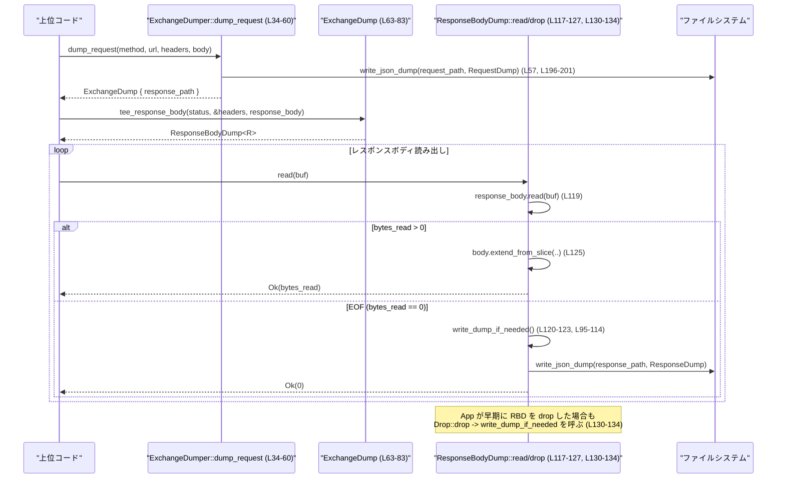

# responses-api-proxy/src/dump.rs コード解説

---

## 0. ざっくり一言

このモジュールは、プロキシ経由の HTTP リクエストとレスポンスをローカルディスクに JSON 形式でダンプするためのユーティリティを提供します。リクエストは即座にファイルへ書き出し、レスポンスはストリーミングしながらボディを読みつつ、読み終わりまたは Drop タイミングでダンプを書き出します。

---

## 1. このモジュールの役割

### 1.1 概要

- このモジュールは **HTTP のリクエスト／レスポンスの内容を後から検査できるようにファイルへ保存する** ために存在し、以下の機能を提供します。
  - リクエスト情報（メソッド・URL・ヘッダ・ボディ）の JSON ファイル出力  
    （`ExchangeDumper::dump_request`）  
    ※ `responses-api-proxy/src/dump.rs:L34-60`
  - レスポンスボディを読み出すと同時に内容をバッファリングし、読み終わりまたは Drop 時にレスポンス情報を JSON ファイルへ出力  
    （`ExchangeDump::tee_response_body` と `ResponseBodyDump`）  
    ※ `responses-api-proxy/src/dump.rs:L68-83`, `L85-134`
  - Authorization/Cookie 系ヘッダのマスキング  
    （`HeaderDump`, `should_redact_header`）  
    ※ `responses-api-proxy/src/dump.rs:L151-167`, `L186-189`

### 1.2 アーキテクチャ内での位置づけ

このファイル内の主要コンポーネントの関係と、外部クレートとの依存を示します。

```mermaid
graph LR
    subgraph "dump.rs"
        ED["ExchangeDumper (L19-61)"]
        EX["ExchangeDump (L63-83)"]
        RBD["ResponseBodyDump<R> (L85-134)"]
        ReqDump["RequestDump (L136-142)"]
        ResDump["ResponseDump (L144-149)"]
        HD["HeaderDump (L151-183)"]
        redact["should_redact_header (L186-189)"]
        body["dump_body (L191-194)"]
        write["write_json_dump (L196-201)"]
    end

    Caller["上位コード（HTTP プロキシ本体）"] --> ED
    ED -->|dump_request (L34-60)| ReqDump
    ED -->|dump_request (L34-60)| write

    ED -->|dump_request 戻り値| EX
    EX -->|tee_response_body (L68-82)| RBD
    RBD -->|write_dump_if_needed (L95-114)| ResDump
    RBD -->|write_dump_if_needed/read/drop| write
    ReqDump --> HD
    ResDump --> HD
    HD --> redact
    ReqDump --> body
    ResDump --> body

    ED -->|"fs::create_dir_all (L25-31), fs::write (L196-201)"| FS["std::fs"]
    ED -->|"SystemTime::now (L42)"| Time["std::time"]
    RBD -->|"impl Read (L117-127)"| IO["std::io::Read"]
    EX -->|"HeaderMap (L68-72)"| Reqwest["reqwest::header"]
    ED -->|"tiny_http::Header/Method (L34-39)"| Tiny["tiny_http"]
```

### 1.3 設計上のポイント

- **責務の分割**  
  - `ExchangeDumper`: ダンプディレクトリの管理、リクエストダンプファイルの作成、レスポンスダンプのためのハンドル (`ExchangeDump`) 生成  
    ※ `responses-api-proxy/src/dump.rs:L19-61`
  - `ExchangeDump`: 1 つのリクエストに対応するレスポンスダンプファイルのパスを保持し、レスポンスボディを包む `ResponseBodyDump` を生成  
    ※ `responses-api-proxy/src/dump.rs:L63-83`
  - `ResponseBodyDump<R>`: `Read` 実装を通じてレスポンスボディをストリーミングしつつ内容をバッファリングし、ファイルへの書き出しを管理  
    ※ `responses-api-proxy/src/dump.rs:L85-134`
  - `RequestDump` / `ResponseDump` / `HeaderDump`: 実際に JSON にシリアライズされる構造体  
    ※ `responses-api-proxy/src/dump.rs:L136-155`

- **状態管理と並行性**  
  - ダンプファイル名の連番は `AtomicU64` で管理しており、`Ordering::Relaxed` でインクリメントしているため、複数スレッドから `dump_request` を呼び出しても番号の一意性が保たれます  
    ※ `responses-api-proxy/src/dump.rs:L19-22`, `L41`
  - `ResponseBodyDump` の内部状態（バッファ、フラグ）は `&mut self` 経由でのみ更新されるため、Rust の所有権／借用ルールによりデータ競合（data race）は防がれます。

- **エラーハンドリング**  
  - リクエストダンプ (`dump_request`) の書き込み失敗は `io::Result` を通じて **呼び出し元へ伝播** します  
    ※ `responses-api-proxy/src/dump.rs:L57-60`, `L196-201`
  - レスポンスダンプの書き込み失敗は `eprintln!` で **標準エラー出力にログ** され、アプリケーションの処理自体は継続します  
    ※ `responses-api-proxy/src/dump.rs:L108-113`

- **機密情報の扱い**  
  - `authorization` および `*cookie*` を含むヘッダ名は `[REDACTED]` にマスクされます  
    ※ `responses-api-proxy/src/dump.rs:L16-17`, `L186-189`, `L160-163`, `L173-177`

- **RAII/Drop による安全な後処理**  
  - `ResponseBodyDump` は `Drop` 実装を持ち、利用者がボディを読み切らなかった場合でも、保持している範囲でレスポンスダンプを書き出します  
    ※ `responses-api-proxy/src/dump.rs:L130-134`, `L95-114`

---

## 2. 主要な機能一覧

- リクエストの JSON ダンプファイル生成 (`ExchangeDumper::dump_request`)  
  （メソッド・URL・ヘッダ（マスキングあり）・ボディの保存）  
  ※ `responses-api-proxy/src/dump.rs:L34-60`
- レスポンスボディのストリーミングと同時ダンプ (`ExchangeDump::tee_response_body` + `ResponseBodyDump`)  
  ※ `responses-api-proxy/src/dump.rs:L68-83`, `L85-134`
- 機密ヘッダ（Authorization / Cookie 系）の自動マスキング (`HeaderDump`, `should_redact_header`)  
  ※ `responses-api-proxy/src/dump.rs:L151-183`, `L186-189`
- ボディの JSON/テキスト自動判別 (`dump_body`)  
  ※ `responses-api-proxy/src/dump.rs:L191-194`
- ダンプファイルの JSON シリアライズと書き出し (`write_json_dump`)  
  ※ `responses-api-proxy/src/dump.rs:L196-201`
- テスト用ユーティリティ（テンポラリディレクトリ管理、出力ファイル検出）  
  ※ `responses-api-proxy/src/dump.rs:L222-223`, `L339-359`

### 2.1 コンポーネント一覧（インベントリー）

#### 型（構造体）一覧

| 名前 | 種別 | 役割 / 用途 | 定義位置 |
|------|------|-------------|----------|
| `ExchangeDumper` | 構造体 | ダンプディレクトリと連番カウンタを保持し、リクエストダンプ生成と `ExchangeDump` の作成を行う | `responses-api-proxy/src/dump.rs:L19-22` |
| `ExchangeDump` | 構造体 | 1 リクエストに対応するレスポンスダンプファイルのパスを保持し、`ResponseBodyDump` を生成する | `responses-api-proxy/src/dump.rs:L63-65` |
| `ResponseBodyDump<R>` | ジェネリック構造体 | 任意の `Read` 実装を包み、読み出したレスポンスボディをバッファリングしつつダンプファイルを書き出す | `responses-api-proxy/src/dump.rs:L85-92` |
| `RequestDump` | 構造体 | リクエストのダンプ内容（メソッド・URL・ヘッダ・ボディ）をシリアライズするための型 | `responses-api-proxy/src/dump.rs:L136-142` |
| `ResponseDump` | 構造体 | レスポンスのダンプ内容（ステータス・ヘッダ・ボディ）をシリアライズするための型 | `responses-api-proxy/src/dump.rs:L144-149` |
| `HeaderDump` | 構造体 | 1 ヘッダの名前と値（マスキング後）を表現する | `responses-api-proxy/src/dump.rs:L151-155` |

#### 関数・メソッド・トレイト実装一覧

| 名前 | 種別 | 役割 / 一言説明 | 定義位置 |
|------|------|----------------|----------|
| `ExchangeDumper::new` | 関数（関連関数） | ダンプディレクトリを作成しつつ `ExchangeDumper` を初期化する | `responses-api-proxy/src/dump.rs:L25-32` |
| `ExchangeDumper::dump_request` | メソッド | リクエスト内容を JSON ダンプファイルに書き出し、対応する `ExchangeDump` を返す | `responses-api-proxy/src/dump.rs:L34-60` |
| `ExchangeDump::tee_response_body` | メソッド | ステータス・ヘッダ・ボディを受け取り、レスポンスダンプ用の `ResponseBodyDump` を生成する | `responses-api-proxy/src/dump.rs:L68-82` |
| `ResponseBodyDump::write_dump_if_needed` | メソッド（プライベート） | まだダンプを書いていない場合に `ResponseDump` を構築しファイルへ書き出す | `responses-api-proxy/src/dump.rs:L95-114` |
| `impl Read for ResponseBodyDump<R>::read` | トレイトメソッド | 包んだ `Read` から読み取りつつ、同じデータを内部バッファへコピーし、EOF でダンプを書く | `responses-api-proxy/src/dump.rs:L117-127` |
| `impl Drop for ResponseBodyDump<R>::drop` | トレイトメソッド | インスタンスがスコープを抜ける際にダンプを書き出す（未書き込みの場合） | `responses-api-proxy/src/dump.rs:L130-134` |
| `impl From<&tiny_http::Header> for HeaderDump::from` | 変換関数 | `tiny_http` のヘッダから `HeaderDump` を構築する（マスキング含む） | `responses-api-proxy/src/dump.rs:L157-167` |
| `impl From<(&HeaderName, &HeaderValue)> for HeaderDump::from` | 変換関数 | `reqwest` のヘッダから `HeaderDump` を構築する（マスキング含む） | `responses-api-proxy/src/dump.rs:L170-183` |
| `should_redact_header` | 関数 | ヘッダ名がマスキング対象かどうかを判定する | `responses-api-proxy/src/dump.rs:L186-189` |
| `dump_body` | 関数 | バイト列を JSON としてパースするか、テキストとして保存するかを決定する | `responses-api-proxy/src/dump.rs:L191-194` |
| `write_json_dump` | 関数 | 任意の `Serialize` な値を JSON でファイルに書き出す | `responses-api-proxy/src/dump.rs:L196-201` |
| `tests::dump_request_writes_redacted_headers_and_json_body` | テスト関数 | リクエストダンプのヘッダマスキングと JSON ボディ保存を検証する | `responses-api-proxy/src/dump.rs:L224-282` |
| `tests::response_body_dump_streams_body_and_writes_response_file` | テスト関数 | レスポンスボディのストリーミングとレスポンスダンプの内容を検証する | `responses-api-proxy/src/dump.rs:L284-337` |
| `tests::test_dump_dir` | テスト用関数 | 一時ダンプディレクトリを作成する | `responses-api-proxy/src/dump.rs:L339-347` |
| `tests::dump_file_with_suffix` | テスト用関数 | ダンプディレクトリから指定サフィックスのファイルを 1 つに特定して返す | `responses-api-proxy/src/dump.rs:L349-359` |

---

## 3. 公開 API と詳細解説

### 3.1 型一覧（構造体・列挙体など）

上位モジュールから利用される主な公開（`pub(crate)`）型の概要です。

| 名前 | 種別 | 役割 / 用途 | フィールド概要 | 定義位置 |
|------|------|-------------|----------------|----------|
| `ExchangeDumper` | 構造体 | 全体のダンプ機能のエントリポイント | `dump_dir: PathBuf` ダンプの出力先ディレクトリ / `next_sequence: AtomicU64` ファイル名用の連番 | `responses-api-proxy/src/dump.rs:L19-22` |
| `ExchangeDump` | 構造体 | 1 リクエストに紐づくレスポンスダンプのコンテキスト | `response_path: PathBuf` レスポンスダンプファイルのパス | `responses-api-proxy/src/dump.rs:L63-65` |
| `ResponseBodyDump<R>` | 構造体 | レスポンスボディをストリーミングしつつダンプする `Read` 実装 | `response_body: R` 元のボディ / `response_path: PathBuf` 出力先 / `status: u16` / `headers: Vec<HeaderDump>` / `body: Vec<u8>` / `dump_written: bool` | `responses-api-proxy/src/dump.rs:L85-92` |

内部的なシリアライズ用型：

| 名前 | 種別 | 役割 / 用途 | 定義位置 |
|------|------|-------------|----------|
| `RequestDump` | 構造体 | リクエストダンプの JSON 形式 | `responses-api-proxy/src/dump.rs:L136-142` |
| `ResponseDump` | 構造体 | レスポンスダンプの JSON 形式 | `responses-api-proxy/src/dump.rs:L144-149` |
| `HeaderDump` | 構造体 | 1 ヘッダの名前と値（マスク済み） | `responses-api-proxy/src/dump.rs:L151-155` |

### 3.2 関数詳細（主要 7 件）

#### `ExchangeDumper::new(dump_dir: PathBuf) -> io::Result<ExchangeDumper>`

**概要**

ダンプファイルを保存するディレクトリを作成し、連番カウンタを初期化した `ExchangeDumper` を返します。  
※ `responses-api-proxy/src/dump.rs:L25-32`

**引数**

| 引数名 | 型 | 説明 |
|--------|----|------|
| `dump_dir` | `PathBuf` | ダンプファイルを保存するディレクトリパス |

**戻り値**

- `Ok(ExchangeDumper)` : 指定ディレクトリが作成できた場合の初期化済みインスタンス  
- `Err(io::Error)` : ディレクトリ作成に失敗した場合

**内部処理の流れ**

1. `fs::create_dir_all(&dump_dir)?` でディレクトリの作成（既に存在していても OK）  
   ※ `responses-api-proxy/src/dump.rs:L25-27`
2. `next_sequence` を `AtomicU64::new(1)` で 1 から開始する連番カウンタとして初期化  
   ※ `responses-api-proxy/src/dump.rs:L28-31`
3. 初期化済み `ExchangeDumper` を `Ok` で返す。

**Examples（使用例）**

```rust
use std::path::PathBuf;
use std::io;
use responses_api_proxy::dump::ExchangeDumper; // モジュールパスは実際の crate 構成に依存

fn init_dumper() -> io::Result<ExchangeDumper> {
    // ダンプを保存するディレクトリを決める
    let dump_dir = PathBuf::from("/tmp/responses-api-dumps"); // 出力先ディレクトリ

    // ディレクトリを作成しつつ dumper を初期化
    ExchangeDumper::new(dump_dir) // io::Result で返る
}
```

**Errors / Panics**

- `fs::create_dir_all` が失敗した場合に `Err(io::Error)` を返します。  
  （権限不足、パスが不正など）  
  ※ `responses-api-proxy/src/dump.rs:L25-27`
- パニックはこの関数内では発生しません（`?` でエラーを伝播）。

**Edge cases（エッジケース）**

- 既にディレクトリが存在する場合も `create_dir_all` は成功し、そのまま利用されます。
- 親ディレクトリが存在しない場合は再帰的に作成されます。

**使用上の注意点**

- `dump_dir` は書き込み権限のある場所を指定する必要があります。
- 複数スレッドから同じ `ExchangeDumper` を使う場合でも、この初期化処理は 1 度だけ行われる前提です。

---

#### `ExchangeDumper::dump_request(&self, method: &Method, url: &str, headers: &[Header], body: &[u8]) -> io::Result<ExchangeDump>`

**概要**

HTTP リクエストの内容を `{sequence}-{timestamp}-request.json` というファイル名でダンプし、対応するレスポンスダンプファイルのパスを持つ `ExchangeDump` を返します。  
※ `responses-api-proxy/src/dump.rs:L34-60`

**引数**

| 引数名 | 型 | 説明 |
|--------|----|------|
| `method` | `&tiny_http::Method` | リクエストメソッド |
| `url` | `&str` | リクエスト URL パス |
| `headers` | `&[tiny_http::Header]` | リクエストヘッダのスライス |
| `body` | `&[u8]` | リクエストボディの生バイト列 |

**戻り値**

- `Ok(ExchangeDump)` : リクエストダンプファイルの書き込みが成功した場合
- `Err(io::Error)` : ファイル書き込みや JSON シリアライズに失敗した場合

**内部処理の流れ**

1. `next_sequence.fetch_add(1, Ordering::Relaxed)` で連番をインクリメントし、現在値を取得。  
   ※ `responses-api-proxy/src/dump.rs:L41`
2. `SystemTime::now().duration_since(UNIX_EPOCH)` で現在時刻のエポックからのミリ秒を取得（失敗時は 0）。  
   ※ `responses-api-proxy/src/dump.rs:L42-44`
3. `{sequence:06}-{timestamp_ms}` のフォーマットでファイル名のプレフィックスを作成。  
   ※ `responses-api-proxy/src/dump.rs:L45`
4. プレフィックスに `-request.json` / `-response.json` を付けてリクエスト／レスポンスファイルのパスを決定。  
   ※ `responses-api-proxy/src/dump.rs:L47-48`
5. `RequestDump` を構築：  
   - `method`: `method.as_str().to_string()`  
   - `url`: `url.to_string()`  
   - `headers`: イテレータで `HeaderDump::from` を適用し `Vec<HeaderDump>` に収集  
   - `body`: `dump_body(body)` で JSON or 文字列として格納  
   ※ `responses-api-proxy/src/dump.rs:L50-55`
6. `write_json_dump(&request_path, &request_dump)?` でファイルへ JSON を書き出し。  
   ※ `responses-api-proxy/src/dump.rs:L57`
7. `ExchangeDump { response_path }` を `Ok` で返す。  
   ※ `responses-api-proxy/src/dump.rs:L59-60`

**Examples（使用例）**

```rust
use std::io;
use tiny_http::{Method, Header};
use responses_api_proxy::dump::ExchangeDumper;

fn handle_request(dumper: &ExchangeDumper, req: &tiny_http::Request) -> io::Result<()> {
    // tiny_http::Request から情報を取り出す（詳細は tiny_http の API に依存）
    let method = req.method();                  // メソッド参照を取得
    let url = req.url();                        // URL パス
    let headers: Vec<Header> = req.headers().to_vec(); // ヘッダを Vec にコピー
    let body_bytes = req.as_reader().bytes().collect::<Result<Vec<_>, _>>().unwrap();

    // リクエストをダンプし、レスポンス用コンテキストを取得
    let exchange = dumper.dump_request(&method, url, &headers, &body_bytes)?; // io::Result

    // `exchange` は後でレスポンスボディダンプに利用できる
    Ok(())
}
```

**Errors / Panics**

- JSON シリアライズ失敗（`serde_json::to_vec_pretty`）や `fs::write` 失敗は `io::Error` として呼び出し元に返されます。  
  ※ `responses-api-proxy/src/dump.rs:L196-201`, `L57`
- システム時刻の異常（エポック前）は `map_or(0, ...)` により 0 ミリ秒として扱われますが、これはエラーにはなりません。  
  ※ `responses-api-proxy/src/dump.rs:L42-44`
- パニックを起こすコードは含まれていません（`unwrap` などが無い）。

**Edge cases（エッジケース）**

- `SystemTime::now().duration_since(UNIX_EPOCH)` が Err の場合、タイムスタンプは 0 になりますが、連番とは独立なのでファイル名の一意性は `next_sequence` により維持されます。
- `headers` が空の場合、`headers: []` としてダンプされます。
- `body` が空の場合、`dump_body` により `Value::String("")` として保存されます（JSON 化に失敗した場合のフォールバック）。  
  ※ `responses-api-proxy/src/dump.rs:L191-194`

**使用上の注意点**

- このメソッドが `Err` を返した場合、そのリクエストに対するダンプ（リクエスト／レスポンス両方）は行われません。
- `body` に非常に大きなペイロードを渡すと、それをメモリ上に保持した状態で JSON へ変換するため、メモリ使用量が増加します。
- 複数スレッドから同じ `ExchangeDumper` を共有して使用することは想定されていますが、出力ディレクトリ自体のファイルシステムロック状況によっては `fs::write` が失敗する可能性があります。

---

#### `ExchangeDump::tee_response_body<R: Read>(self, status: u16, headers: &HeaderMap, response_body: R) -> ResponseBodyDump<R>`

**概要**

`ExchangeDumper::dump_request` から返された `ExchangeDump` を起点に、レスポンスダンプ用の `ResponseBodyDump` を生成します。レスポンスステータスとヘッダ、ボディ読み取り元を受け取り、後続の `Read` 呼び出しによりボディをストリーミングしながらダンプできるようにします。  
※ `responses-api-proxy/src/dump.rs:L68-82`

**引数**

| 引数名 | 型 | 説明 |
|--------|----|------|
| `self` | `ExchangeDump` | リクエストに紐づくレスポンスダンプファイルのパスを保持するコンテキスト（ムーブされる） |
| `status` | `u16` | HTTP ステータスコード |
| `headers` | `&HeaderMap` | `reqwest::header::HeaderMap` 型のレスポンスヘッダ |
| `response_body` | `R` | `Read` を実装するレスポンスボディのデータソース |

**戻り値**

- `ResponseBodyDump<R>` : `Read` を実装し、レスポンスボディを読み出すと同時にダンプするラッパー

**内部処理の流れ**

1. `ResponseBodyDump` 構造体を初期化：  
   - `response_body` に引数をそのまま保持  
   - `response_path` に `self.response_path` をムーブ  
   - `status` に引数のステータスコード  
   - `headers` に `HeaderDump::from` を `HeaderMap::iter()` で適用して `Vec<HeaderDump>` を構築  
   - `body` は空の `Vec<u8>` で開始  
   - `dump_written` は `false` にセット  
   ※ `responses-api-proxy/src/dump.rs:L74-81`
2. 上記を返す。

**Examples（使用例）**

```rust
use std::io::{self, Read};
use reqwest::blocking::Response;
use responses_api_proxy::dump::{ExchangeDump, ResponseBodyDump};

fn wrap_response(exchange: ExchangeDump, resp: Response) -> ResponseBodyDump<Response> {
    // ステータスコードとヘッダ、ボディの Read 実装を tee_response_body に渡す
    let status = resp.status().as_u16();     // u16 ステータスコード
    let headers = resp.headers();            // &HeaderMap
    exchange.tee_response_body(status, headers, resp) // Response は Read を実装
}
```

**Errors / Panics**

- この関数自体は `Result` を返さず、内部でも `?` や `unwrap` を使用していないため、エラーやパニックは発生しません。

**Edge cases（エッジケース）**

- `headers` が空の場合、`ResponseDump.headers` は空の配列になります。
- `ResponseBodyDump` を生成しただけで `Read` を呼ばずに即座に drop しても、`Drop` 実装により空ボディとしてレスポンスダンプが書き出されます（`status` と `headers` は含まれる）。  
  ※ `responses-api-proxy/src/dump.rs:L130-134`, `L95-114`

**使用上の注意点**

- `self` はムーブされるため、1 つの `ExchangeDump` から複数回 `tee_response_body` を呼び出すことはできません。
- `ResponseBodyDump` は `Read` と `Drop` を通じてダンプを行うため、**必ずこのラッパーを経由してレスポンスボディを読み出す** 必要があります。元の `response_body` を直接読んでしまうとダンプされません。

---

#### `impl<R: Read> Read for ResponseBodyDump<R>::read(&mut self, buf: &mut [u8]) -> io::Result<usize>`

**概要**

`ResponseBodyDump` を `Read` として扱えるようにする実装です。ラップしている `response_body` からデータを読み取り、呼び出し元に返すと同時に、読み取ったバイト列を内部バッファ `body` に蓄積します。EOF に達したときにレスポンスダンプファイルを書き出します。  
※ `responses-api-proxy/src/dump.rs:L117-127`

**引数**

| 引数名 | 型 | 説明 |
|--------|----|------|
| `&mut self` | `&mut ResponseBodyDump<R>` | レスポンスボディラッパーの可変参照 |
| `buf` | `&mut [u8]` | 読み込み先のバッファ |

**戻り値**

- `Ok(n)` : `n` バイト読み取れた場合。`n == 0` のときは EOF。
- `Err(io::Error)` : 内部の `response_body.read(buf)` が返すエラー。

**内部処理の流れ**

1. `let bytes_read = self.response_body.read(buf)?;` で内部の `Read` 実装から読み込み。  
   ※ `responses-api-proxy/src/dump.rs:L119`
2. 読み込んだバイト数が 0（EOF）の場合：  
   - `self.write_dump_if_needed();` を呼び出してレスポンスダンプを書き出す。  
   - `Ok(0)` を返す。  
   ※ `responses-api-proxy/src/dump.rs:L120-123`
3. それ以外の場合（まだデータがある）：  
   - `self.body.extend_from_slice(&buf[..bytes_read]);` で内部バッファにコピー。  
     ※ `responses-api-proxy/src/dump.rs:L125`
   - `Ok(bytes_read)` を返す。

**Examples（使用例）**

```rust
use std::io::{self, Read};
use std::io::Cursor;
use responses_api_proxy::dump::{ExchangeDump, ExchangeDumper};

fn read_response_body(dumper: &ExchangeDumper) -> io::Result<String> {
    // 前段でリクエストをダンプして ExchangeDump を取得しているとする
    let exchange = dumper.dump_request(
        &tiny_http::Method::Get,
        "/v1/test",
        &[],
        b"{}",                                  // 空の JSON ボディ
    )?;

    // ダミーのレスポンスボディ（Cursor は Read を実装）
    let cursor = Cursor::new(b"hello world".to_vec());

    // ResponseBodyDump でラップ
    let mut tee = exchange.tee_response_body(200, &reqwest::header::HeaderMap::new(), cursor);

    // 通常の Read と同様に読み出す
    let mut body = String::new();
    tee.read_to_string(&mut body)?;           // Read 実装によりストリーミング読み出し

    Ok(body)                                  // "hello world" が返ると同時にダンプも書かれる
}
```

**Errors / Panics**

- 内部の `response_body.read(buf)` が返す `io::Error` をそのまま返します。  
  ※ `responses-api-proxy/src/dump.rs:L119`
- `write_dump_if_needed` 内の `write_json_dump` で発生したエラーは `eprintln!` でログ出力されるだけで、`read` の戻り値には反映されません。  
  ※ `responses-api-proxy/src/dump.rs:L108-113`
- パニック条件はありません（`unwrap` 不使用）。

**Edge cases（エッジケース）**

- 呼び出し側が EOF まで読みきらずに `ResponseBodyDump` を drop した場合：  
  - `read` は `write_dump_if_needed` をまだ呼び出していない可能性があり、その場合は `Drop` 実装側でダンプが書かれます。  
    ※ `responses-api-proxy/src/dump.rs:L130-134`
  - ダンプされるボディは **読み取られたところまでの部分ボディ** に限られます。
- 非 UTF-8 / バイナリレスポンスの場合でも、`dump_body` で UTF-8 へのロスのある変換を行って JSON に保存します。  
  ※ `responses-api-proxy/src/dump.rs:L191-194`

**使用上の注意点**

- 完全なレスポンスボディをダンプしたい場合は、**EOF まで読み切ることが前提** です。途中で読み出しをやめると、ダンプファイルの `body` フィールドは途中までの内容となります。
- 非常に大きなレスポンス（ストリーミング SSE など）を全て読み切ると、`self.body` に全バイトを蓄積するため、メモリ使用量が大きくなります。
- `ResponseBodyDump` は `&mut self` を必要とするため、同一インスタンスを複数スレッドから同時に読み出すことはコンパイラが禁止します（Rust の借用規則により）。

---

#### `ResponseBodyDump<R>::write_dump_if_needed(&mut self)`

**概要**

レスポンスダンプがまだ書かれていない場合に限り、`ResponseDump` を構築してファイルに書き出すメソッドです。`read` と `Drop` の両方から呼ばれます。  
※ `responses-api-proxy/src/dump.rs:L95-114`

**引数**

| 引数名 | 型 | 説明 |
|--------|----|------|
| `&mut self` | `&mut ResponseBodyDump<R>` | ラッパーの内部状態を更新するための可変参照 |

**戻り値**

- 戻り値はなく、副作用としてダンプファイルの書き込みと内部フラグの更新を行います。

**内部処理の流れ**

1. `if self.dump_written { return; }` で既に書き込み済みかを確認し、二重書き込みを防止。  
   ※ `responses-api-proxy/src/dump.rs:L95-98`
2. `self.dump_written = true;` としてフラグを立てる。  
   ※ `responses-api-proxy/src/dump.rs:L100`
3. `ResponseDump` を構築：  
   - `status` をコピー  
   - `headers` に `std::mem::take(&mut self.headers)` を使ってベクタの中身をムーブ  
   - `body` に `dump_body(&self.body)` の結果を入れる  
   ※ `responses-api-proxy/src/dump.rs:L102-106`
4. `write_json_dump(&self.response_path, &response_dump)` を呼び出し、失敗した場合は `eprintln!` でログに出す。  
   ※ `responses-api-proxy/src/dump.rs:L108-113`

**Examples（使用例）**

このメソッドは公開されていないため、直接呼び出すことはできません。`Read::read` または `Drop` を通じて自動的に呼ばれます。

**Errors / Panics**

- シグネチャは `fn` で `Result` を返さず、失敗時には `eprintln!` でログを出力するだけです。  
- パニックはありません。

**Edge cases（エッジケース）**

- `write_dump_if_needed` を `read` と `Drop` 両方から呼び出しても、`dump_written` フラグにより 1 回しか書き込みが行われません。
- ボディが空のままでも `dump_body(&self.body)` により空文字列または空 JSON としてダンプされます。

**使用上の注意点**

- 呼び出し側からは直接制御できない内部メソッドですが、**レスポンスダンプが「一度だけ」書かれる** という性質を前提にロジックが組まれている点に注意が必要です。

---

#### `should_redact_header(name: &str) -> bool`

**概要**

ヘッダ名が機密情報を含むとみなし、ダンプ時に値を `[REDACTED]` に置き換えるべきかどうかを判定します。  
※ `responses-api-proxy/src/dump.rs:L186-189`

**引数**

| 引数名 | 型 | 説明 |
|--------|----|------|
| `name` | `&str` | ヘッダ名（ASCII 英字を含む任意の文字列） |

**戻り値**

- `true` : マスキング対象（Authorization または Cookie 由来のヘッダ）
- `false` : マスキング不要

**内部処理の流れ**

1. `name.eq_ignore_ascii_case(AUTHORIZATION_HEADER_NAME)` で `authorization`（大文字小文字無視）かどうかを判定。  
   ※ `responses-api-proxy/src/dump.rs:L187`
2. それ以外に `name.to_ascii_lowercase().contains("cookie")` で `cookie` を含むヘッダかどうかを判定。  
   ※ `responses-api-proxy/src/dump.rs:L188`
3. いずれかが真なら `true`、両方偽なら `false` を返す。

**Examples（使用例）**

```rust
use responses_api_proxy::dump::should_redact_header;

assert!(should_redact_header("Authorization")); // true
assert!(should_redact_header("authorization")); // true
assert!(should_redact_header("Set-Cookie"));    // true
assert!(should_redact_header("x-cookie-id"));   // true
assert!(!should_redact_header("Content-Type")); // false
```

**Errors / Panics**

- エラーやパニックは発生しません。

**Edge cases（エッジケース）**

- `to_ascii_lowercase().contains("cookie")` を用いているため、`"cookie"` を含む任意のヘッダ名（例: `"my-cookie-header"`）がマスキング対象になります。  
  ※ `responses-api-proxy/src/dump.rs:L188`
- 非 ASCII 文字を含む名前に対しても `to_ascii_lowercase` は動作しますが、非 ASCII 部分はそのまま残るため、`cookie` 部分の検出には影響しません。

**使用上の注意点**

- Authorization や Cookie 以外の機密情報（例: `X-API-Key`）はこの関数ではマスキングされません。追加でマスキング対象を増やしたい場合は、この関数に条件を追加する必要があります。
- `HeaderDump::from` の実装がこの関数を前提としているため、ヘッダのマスキングポリシーを変えるときはテストも合わせて更新する必要があります。  
  ※ テストで Authorization/Cookie のマスキングが検証されています `responses-api-proxy/src/dump.rs:L224-282`, `L284-337`

---

#### `dump_body(body: &[u8]) -> Value`

**概要**

ボディのバイト列を、まず JSON としてパースし、失敗した場合には UTF-8（ロスあり）文字列として JSON の `String` に包んで返します。  
※ `responses-api-proxy/src/dump.rs:L191-194`

**引数**

| 引数名 | 型 | 説明 |
|--------|----|------|
| `body` | `&[u8]` | レスポンスまたはリクエストのボディの生バイト列 |

**戻り値**

- `serde_json::Value` : 成功時は JSON 値、失敗時は `Value::String`（UTF-8 文字列）

**内部処理の流れ**

1. `serde_json::from_slice(body)` で JSON としてパースを試みる。  
2. パース成功時はその `Value` を返す。  
3. パース失敗時は `Value::String(String::from_utf8_lossy(body).into_owned())` を返す。  
   ※ `responses-api-proxy/src/dump.rs:L191-194`

**Examples（使用例）**

```rust
use serde_json::Value;
use responses_api_proxy::dump::dump_body;

let json_bytes = br#"{"key":"value"}"#;
let v: Value = dump_body(json_bytes);
assert_eq!(v["key"], "value");     // JSON として扱える

let text_bytes = b"plain text";
let v2: Value = dump_body(text_bytes);
assert_eq!(v2, Value::String("plain text".to_string())); // 文字列として保存
```

**Errors / Panics**

- `serde_json::from_slice` のエラーは `unwrap_or_else` で握り潰しており、パニックはしません。  
  ※ `responses-api-proxy/src/dump.rs:L191-194`
- UTF-8 変換は `from_utf8_lossy` を用いるため、こちらもパニックしません。

**Edge cases（エッジケース）**

- 無効な UTF-8 を含むバイト列の場合、`from_utf8_lossy` により置換文字に変換され、元のバイト列は完全には再現できません。
- `body` が空の場合、`serde_json::from_slice` はエラーになり、結果は `Value::String("")` になります。

**使用上の注意点**

- バイナリ形式（画像や圧縮データなど）をダンプする場合、JSON としては意味のない文字列になります。またサイズも大きくなり得ます。
- JSON パースの有無によりダンプファイルの形式が変わる（オブジェクト／配列 vs. 文字列）ため、ダンプを読み取る側は `Value` の型を確認する必要があります。

---

#### `write_json_dump(path: &PathBuf, dump: &impl Serialize) -> io::Result<()>`

**概要**

任意の `Serialize` を実装した値を、整形済み JSON（pretty print）で指定パスに書き出します。最後に改行が 1 つ追加されます。  
※ `responses-api-proxy/src/dump.rs:L196-201`

**引数**

| 引数名 | 型 | 説明 |
|--------|----|------|
| `path` | `&PathBuf` | 出力先ファイルパス |
| `dump` | `&impl Serialize` | JSON にシリアライズ可能な値の参照 |

**戻り値**

- `Ok(())` : JSON のシリアライズとファイル書き込みが成功した場合
- `Err(io::Error)` : シリアライズまたはファイル書き込みに失敗した場合

**内部処理の流れ**

1. `serde_json::to_vec_pretty(dump)` で JSON バイト列を生成し、失敗した場合には `io::ErrorKind::InvalidData` の `io::Error` にラップして返す。  
   ※ `responses-api-proxy/src/dump.rs:L197-198`
2. バイト列の末尾に改行（`b'\n'`）を追加。  
   ※ `responses-api-proxy/src/dump.rs:L199`
3. `fs::write(path, bytes)` でファイルに書き込む。  
   ※ `responses-api-proxy/src/dump.rs:L200-201`

**Examples（使用例）**

```rust
use std::io;
use std::path::PathBuf;
use serde::Serialize;
use serde_json::json;
use responses_api_proxy::dump::write_json_dump;

fn save_sample() -> io::Result<()> {
    let path = PathBuf::from("/tmp/sample.json");
    let value = json!({ "hello": "world" }); // serde_json::Value は Serialize

    write_json_dump(&path, &value)          // pretty JSON + 改行で書き出し
}
```

**Errors / Panics**

- `serde_json::to_vec_pretty` のエラーは `io::ErrorKind::InvalidData` としてマッピングされます。  
  ※ `responses-api-proxy/src/dump.rs:L197-198`
- `fs::write` のエラー（ディスクフル、権限不足 etc.）はそのまま `io::Error` として返されます。
- パニックは発生しません。

**Edge cases（エッジケース）**

- `path` の親ディレクトリが存在しない場合、`fs::write` はエラーになります（`ExchangeDumper::new` が成功していれば通常は存在している前提）。
- 非常に大きな `dump` をシリアライズすると、メモリ上に全体を `Vec<u8>` として保持するため一時的にメモリ使用量が増えます。

**使用上の注意点**

- pretty print を使用しているため、ファイルサイズは最小にはなりませんが、人間に読みやすい形式になります。
- この関数は同期 I/O を行うため、非同期環境（`tokio` など）内で頻繁に呼び出すとスレッドプールをブロックし得ます。必要なら専用スレッドなどで実行する設計が望まれます。

---

### 3.3 その他の関数

| 関数名 | 役割（1 行） | 定義位置 |
|--------|--------------|----------|
| `impl From<&tiny_http::Header> for HeaderDump::from` | tiny_http のヘッダを `HeaderDump` に変換し、マスキングを適用する | `responses-api-proxy/src/dump.rs:L157-167` |
| `impl From<(&HeaderName, &HeaderValue)> for HeaderDump::from` | reqwest のヘッダペアを `HeaderDump` に変換し、マスキングを適用する | `responses-api-proxy/src/dump.rs:L170-183` |
| `tests::dump_request_writes_redacted_headers_and_json_body` | リクエストダンプで Authorization/Cookie ヘッダがマスクされることと JSON ボディが保存されることをテスト | `responses-api-proxy/src/dump.rs:L224-282` |
| `tests::response_body_dump_streams_body_and_writes_response_file` | レスポンスボディがストリーミングされつつ完全にダンプされること、およびヘッダマスキングをテスト | `responses-api-proxy/src/dump.rs:L284-337` |
| `tests::test_dump_dir` | テスト用の一意なテンポラリディレクトリを作成するユーティリティ | `responses-api-proxy/src/dump.rs:L339-347` |
| `tests::dump_file_with_suffix` | ダンプディレクトリから指定サフィックスに合致する単一ファイルを見つけるユーティリティ | `responses-api-proxy/src/dump.rs:L349-359` |

---

## 4. データフロー

ここでは、典型的な 1 回のリクエスト～レスポンスにおけるデータの流れを示します。

- 上位コードが `ExchangeDumper::dump_request` を呼び出し、リクエストをファイルにダンプしつつ `ExchangeDump` を得ます。
- レスポンスが到着したら、上位コードは `ExchangeDump::tee_response_body` で `ResponseBodyDump` を生成し、レスポンスボディの `Read` をこのラッパー経由で行います。
- 読み出したボディは呼び出し元に返されると同時に内部バッファにコピーされ、EOF または Drop タイミングで `ResponseDump` がファイルに書き出されます。



---

## 5. 使い方（How to Use）

### 5.1 基本的な使用方法

`ExchangeDumper` を初期化し、HTTP リクエスト処理の中でリクエストとレスポンスをダンプする一連の流れの例です。

```rust
use std::io::{self, Read};
use std::path::PathBuf;
use tiny_http::{Request, Response, Method};
use reqwest::header::HeaderMap;
use responses_api_proxy::dump::ExchangeDumper; // 実際のパスは crate 構成に依存

fn handle(req: Request, dumper: &ExchangeDumper) -> io::Result<()> {
    // 1. リクエストボディを読み込む
    let mut body_bytes = Vec::new();                 // ボディを貯めるバッファ
    req.as_reader().read_to_end(&mut body_bytes)?;   // tiny_http::Request から読み出す

    // 2. リクエストをダンプし、ExchangeDump を得る
    let exchange = dumper.dump_request(
        req.method(),                                // &Method
        req.url(),                                   // &str
        req.headers(),                               // &[Header]
        &body_bytes,                                 // &[u8]
    )?;                                              // io::Result なので ? で伝播

    // 3. アップストリーム（実際の API）へリクエストを送りレスポンスを取得（仮）
    let upstream_resp = send_to_upstream(&body_bytes)?; // 仮の関数。返り値は Read を実装

    // 4. レスポンスを ResponseBodyDump でラップ
    let status = 200u16;
    let headers = HeaderMap::new();                  // 実際は upstream_resp から取得
    let mut tee = exchange.tee_response_body(status, &headers, upstream_resp);

    // 5. tee を使ってクライアントへストリーミングレスポンス
    let mut client_resp = Response::from_string(""); // tiny_http::Response への書き込み例
    std::io::copy(&mut tee, client_resp.as_writer())?; // copy が read を繰り返し呼ぶ

    // 6. 関数を抜けると tee は drop される。EOF を読んでいれば既にダンプ済み
    Ok(())
}

// 実際のアップストリーム呼び出しは crate 外部のロジック
fn send_to_upstream(_body: &[u8]) -> io::Result<impl Read> {
    // ここでは例として Cursor を返す
    use std::io::Cursor;
    Ok(Cursor::new(b"{\"ok\": true}".to_vec()))
}
```

### 5.2 よくある使用パターン

1. **フルボディのダンプ（推奨）**

   - `ResponseBodyDump` を EOF まで読み切ることで、レスポンスボディ全体が `body` に保存され、完全なレスポンスがダンプされます。
   - 例：`std::io::copy`, `read_to_end`, `read_to_string` などのヘルパーを使う。

2. **部分ボディのダンプ（途中で読み取りを止める）**

   - SSE（サーバー送信イベント）など無限ストリームに対しては、一定量だけ読み取って切断する場合があります。
   - この場合、ダンプされる `body` は「読み取った部分のみ」となります。
   - `Drop` によって、読み取りを止めた時点の内容が確実に保存されます。

3. **リクエストのみダンプ**

   - レスポンスのダンプが不要なケースでは、`ExchangeDump` を無視すればレスポンスファイルは作成されません。
   - テストで `exchange_dump.response_path` のファイル名が `-response.json` で終わることを確認しているため、`ExchangeDump` がレスポンス用のコンテキストであることが分かります。  
     ※ `responses-api-proxy/src/dump.rs:L272-279`

### 5.3 よくある間違い

```rust
use std::io::Read;
use responses_api_proxy::dump::ExchangeDumper;

// 間違い例: ResponseBodyDump を作らずに upstream レスポンスを直接読む
fn wrong_usage(dumper: &ExchangeDumper) {
    let exchange = dumper.dump_request(&Method::Get, "/v1/test", &[], b"{}").unwrap();
    let mut upstream_resp = send_to_upstream().unwrap(); // Read を実装

    // ❌ 直接 upstream_resp を読むと、レスポンスはダンプされない
    let mut buf = String::new();
    upstream_resp.read_to_string(&mut buf).unwrap();
}

// 正しい例: tee_response_body で ResponseBodyDump を経由して読む
fn correct_usage(dumper: &ExchangeDumper) {
    let exchange = dumper.dump_request(&Method::Get, "/v1/test", &[], b"{}").unwrap();
    let upstream_resp = send_to_upstream().unwrap(); // Read を実装

    // ✅ ResponseBodyDump でラップ
    let mut tee = exchange.tee_response_body(200, &HeaderMap::new(), upstream_resp);

    let mut buf = String::new();
    tee.read_to_string(&mut buf).unwrap(); // 読み出しと同時にダンプされる
}
```

### 5.4 使用上の注意点（まとめ）

- **スレッド安全性**
  - `ExchangeDumper` は `AtomicU64` によりファイル名連番のインクリメントがスレッドセーフです。  
    複数スレッドから `dump_request` を呼んでも同じファイル名が生成されることはありません。  
    ※ `responses-api-proxy/src/dump.rs:L41`
  - `ResponseBodyDump` は `&mut self` を要求する `Read` 実装のため、同一インスタンスを複数スレッドから同時に扱うことは型システムにより防止されます。

- **エラー処理**
  - リクエストダンプ（`dump_request`）の失敗は `io::Result` で把握できますが、レスポンスダンプの失敗は `eprintln!` のみで、呼び出し側に通知されません。  
    必要であれば、標準エラー出力を収集するか、このロジックを変更する必要があります。  
    ※ `responses-api-proxy/src/dump.rs:L108-113`

- **セキュリティ**
  - Authorization / Cookie 系ヘッダは `[REDACTED]` に置き換えられますが、それ以外のヘッダ値はそのまま保存されます。  
    アクセストークンが別ヘッダに入っている場合などは、追加のマスキングロジックが必要です。  
    ※ テストで Cookie/Authorization のマスキングが確認されています `responses-api-proxy/src/dump.rs:L224-282`, `L284-337`

- **パフォーマンス**
  - リクエスト／レスポンスボディを全てメモリに保持した上で JSON に変換するため、大きなペイロードが頻繁に流れる場合はメモリとディスク I/O のコストがかかります。
  - `write_json_dump` は同期 I/O であり、ブロッキング動作をします。高スループットが必要な場合は、ダンプ処理をバックグラウンドスレッドにオフロードすることを検討する余地があります。

---

## 6. 変更の仕方（How to Modify）

### 6.1 新しい機能を追加する場合

1. **マスキング対象ヘッダを増やしたい場合**
   - `should_redact_header` に条件を追加します。  
     例：`name.eq_ignore_ascii_case("x-api-key")` を OR 条件として付ける。  
     ※ `responses-api-proxy/src/dump.rs:L186-189`
   - 変更後は、`tests` モジュール内に新しいテストケースを追加して期待どおりにマスクされることを確認します。  
     ※ 既存テストの例 `responses-api-proxy/src/dump.rs:L224-282`, `L284-337`

2. **ダンプファイルのフォーマットを拡張したい場合**
   - リクエスト側: `RequestDump` にフィールドを追加し、`dump_request` 内で値をセットします。  
     ※ `responses-api-proxy/src/dump.rs:L136-142`, `L50-55`
   - レスポンス側: `ResponseDump` にフィールドを追加し、`write_dump_if_needed` 内で値をセットします。  
     ※ `responses-api-proxy/src/dump.rs:L144-149`, `L102-106`
   - JSON スキーマを前提にする他ツールがあれば、互換性に注意する必要があります。

3. **出力先ディレクトリのルールを変えたい場合**
   - プレフィックス生成やファイル名を変更するには `dump_request` 内の `prefix` と `request_path` / `response_path` の組み立て部分を修正します。  
     ※ `responses-api-proxy/src/dump.rs:L41-48`

### 6.2 既存の機能を変更する場合の注意点

- **契約（Contract）と影響範囲**
  - `dump_request` は成功時に必ず `ExchangeDump` を返し、対応する `*-request.json` ファイルが存在するという前提で他コードが動いている可能性があります。  
    リクエストダンプを省略したり、ファイル名パターンを変えたりする場合は、テストや周辺コードの見直しが必要です。
  - `ResponseBodyDump` は「`Read` として使えばダンプが行われる」という契約を持つため、`read` や `Drop` の挙動変更は慎重に行うべきです。  
    例えば、`Drop` からダンプを呼ばなくすると、EOF まで読み切らなかった場合にダンプが残らない動作へ変わります。

- **テストとの整合性**
  - 2 つのテスト関数はダンプファイルの JSON 内容を厳密に比較しています。  
    - ヘッダの順序や大文字小文字も含めて検証されているため、`HeaderMap` から `Vec<HeaderDump>` への変換ロジックを変えるとテストが失敗します。  
      ※ `responses-api-proxy/src/dump.rs:L248-270`, `L313-333`
  - ヘッダ名の大文字小文字（tiny_http と reqwest で違う）も期待値に含まれています。

- **エラー通知の方式**
  - 現状、レスポンスダンプの書き込み失敗はログのみなので、これを `Result` に変えると呼び出し側のインターフェースが大きく変わります。  
    エラー処理ポリシーを変える際は、上位コードの設計も合わせて見直す必要があります。

---

## 7. 関連ファイル

このチャンクでは `responses-api-proxy/src/dump.rs` 以外のファイル内容は提供されていないため、依存関係として推測できる範囲でのみ記載します。

| パス | 役割 / 関係 |
|------|------------|
| `responses-api-proxy/src/dump.rs` | 本解説の対象ファイル。リクエスト／レスポンスのダンプロジックとテストを含む。 |
| （不明）`…` | 実際の HTTP プロキシ本体のコード（`ExchangeDumper`/`ExchangeDump` を呼び出す部分）はこのチャンクには現れません。 |

---

## 付録: Bugs / Security / Edge Cases / Tests / Performance の要点まとめ

※すべてコード上で確認できる事実に基づいています。

- **潜在的な注意点（Bugs 的な性質）**
  - レスポンスダンプが書けなかった場合（ディスクフルなど）でも、`Read` の戻り値は成功のままです。ダンプの有無をプログラムから確認する手段はありません。  
    ※ `responses-api-proxy/src/dump.rs:L108-113`
  - 部分読み取りで Drop した場合、ダンプされる `body` は途中までの内容になります。これは仕様ですが、「必ず完全なボディが取れる」と期待すると誤解になります。  

- **Security**
  - Authorization/Cookie 系は `[REDACTED]` ですが、それ以外のヘッダやボディはそのまま保存されるため、プライバシーや秘密情報の扱いには注意が必要です。  
    ※ `responses-api-proxy/src/dump.rs:L160-163`, `L173-177`, `L186-189`

- **Contracts / Edge Cases**
  - `dump_request` が `Ok` を返した場合、対応する `*-request.json` が存在し、`ExchangeDump` により同じプレフィックスの `*-response.json` を作成できる、というのが暗黙の契約と解釈できます。  
    ※ テストでもこの前提で `ends_with("-response.json")` を確認しています `responses-api-proxy/src/dump.rs:L272-279`
  - JSON でないボディは常に文字列として扱われるため、後処理側は `Value` の型に依存しないように設計する必要があります。

- **Tests**
  - 2 つのテストが、ヘッダマスキング・JSON パース・レスポンスボディの完全なストリーミングダンプをカバーしています。  
    ※ `responses-api-proxy/src/dump.rs:L224-282`, `L284-337`

- **Performance / Scalability**
  - メモリ: ボディをすべて `Vec<u8>` に蓄積する設計のため、大きいレスポンスが大量に流れるワークロードではメモリ利用が増えます。  
    ※ `responses-api-proxy/src/dump.rs:L90-91`, `L125`
  - I/O: すべてのリクエスト／レスポンスで同期ディスク書き込みが発生するため、多数の並列リクエストがある環境ではディスク I/O がボトルネックになる可能性があります。

この情報を前提として、モジュールの利用や変更を安全に行うことができます。
