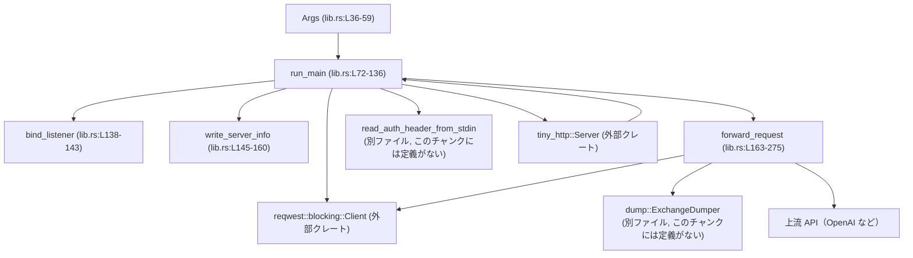
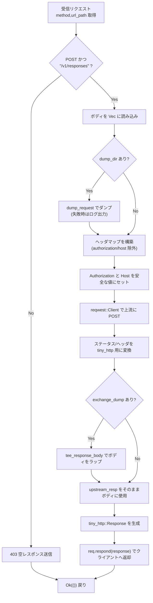
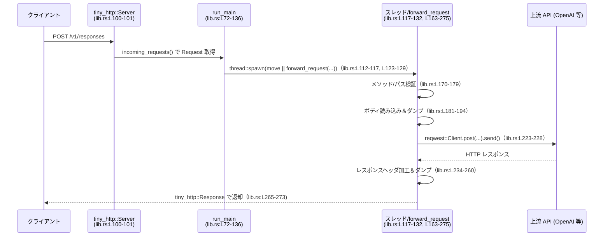

# responses-api-proxy/src/lib.rs

## 0. ざっくり一言

`tiny_http` と `reqwest` を使って、ローカルで待ち受ける **最小限の OpenAI Responses API プロキシサーバ** を起動し、`Authorization` ヘッダを差し替えつつ上流の `/v1/responses` エンドポイントへリクエストを中継するモジュールです（lib.rs:L36-59, L72-136, L163-275）。

---

## 1. このモジュールの役割

### 1.1 概要

- このモジュールは、ローカルホスト上の HTTP サーバを立ち上げ、指定ポートで `POST /v1/responses` だけを受け付け、指定された上流 URL（デフォルトは OpenAI）へリクエストを転送する役割を持ちます（lib.rs:L36-59, L72-81, L163-179）。
- 起動時に標準入力から読み取った認証ヘッダをすべての上流リクエストに設定し、クライアントから送られてきた `Authorization` や `Host` は無視・上書きします（lib.rs:L72-75, L196-213, L215-221）。
- オプションで、起動ポートなどを JSON ファイルに書き出したり、リクエスト/レスポンスを JSON 形式でダンプする機能を持ちます（lib.rs:L44-47, L56-58, L89-95, L145-160, L186-194, L258-260）。

### 1.2 アーキテクチャ内での位置づけ

主なコンポーネントと依存関係は次の通りです。



- `Args` は CLI オプション定義であり、`run_main` の唯一の外部入力です（lib.rs:L36-59, L72）。
- `run_main` は認証ヘッダの読み込み、上流 URL のパース、`tiny_http::Server` と `reqwest::blocking::Client` の初期化、およびリクエストごとのスレッド生成までを担います（lib.rs:L72-136）。
- `forward_request` は各リクエストを検証し、必要に応じてダンプを行いながら上流に転送してレスポンスをクライアントに返します（lib.rs:L163-275）。
- `dump::ExchangeDumper` と `read_api_key::read_auth_header_from_stdin` の定義はこのチャンクには現れませんが、リクエスト/レスポンスのダンプと認証ヘッダの取得を担当しているとコードから読み取れます（lib.rs:L31-34, L72-75, L89-95, L186-194, L258-260）。

### 1.3 設計上のポイント

- **ローカルホストバインド**  
  サーバは `127.0.0.1` にのみバインドし、外部から直接アクセスできない設計になっています（lib.rs:L138-140）。
- **スレッド per リクエストモデル**  
  `server.incoming_requests()` の各リクエストごとに `std::thread::spawn` で新しいスレッドを起こし、`forward_request` で処理します（lib.rs:L112-133, L163-275）。  
  `Arc<Client>` と `Arc<ForwardConfig>` で共有状態をスレッド安全に共有します（lib.rs:L85-88, L96-108, L112-117）。
- **認証ヘッダの集中管理**  
  標準入力から一度だけ読み込んだ認証ヘッダ（おそらく `&'static str`）を全リクエストに使い回し、上流への `Authorization` ヘッダとして設定します（lib.rs:L72-75, L163-166, L215-221）。
- **入力の制限による安全性**  
  受け付けるのは `POST /v1/responses` のみで、それ以外は 403 で即座に拒否します。クエリストリングも許可されません（lib.rs:L170-179）。
- **エラーハンドリング方針**  
  - 起動時・接続確立時のエラーは `anyhow::Error` として呼び出し元へ伝播します（lib.rs:L72-81, L96-107, L138-143, L145-160）。
  - リクエスト処理中の一部エラー（ダンプ失敗、レスポンス書き込み失敗など）は `eprintln!` でログに出しつつ処理続行または早期終了します（lib.rs:L118-121, L186-194, L273-274）。
- **上流レスポンスのストリーミング**  
  `reqwest::blocking::Response` が `Read` を実装していることを利用し、`tiny_http::Response` のボディとしてストリーム的に扱います。クライアントへの転送前にレスポンス全体をバッファリングしません（lib.rs:L230-233, L258-263）。

---

## 2. コンポーネント一覧と主要な機能

### 2.1 コンポーネント一覧（インベントリー）

| 名前 | 種別 | 公開 | 役割 / 用途 | 定義位置 |
|------|------|------|-------------|----------|
| `Args` | 構造体 | `pub` | CLI から受け取る設定（ポート、上流 URL、ダンプディレクトリなど）を保持 | lib.rs:L36-59 |
| `ServerInfo` | 構造体 | 非公開 | 起動したサーバの `port` と `pid` を JSON で書き出すためのデータ | lib.rs:L61-65 |
| `ForwardConfig` | 構造体 | 非公開 | 上流への転送に必要な URL と Host ヘッダ値をまとめた設定 | lib.rs:L67-70 |
| `run_main` | 関数 | `pub` | ライブラリのエントリポイント。サーバ起動〜リクエスト処理ループを実行 | lib.rs:L72-136 |
| `bind_listener` | 関数 | 非公開 | `127.0.0.1:port` で `TcpListener` をバインドし、実際に割り当てられたアドレスを返す | lib.rs:L138-143 |
| `write_server_info` | 関数 | 非公開 | 指定パスに `ServerInfo` を JSON 1 行として書き出す | lib.rs:L145-160 |
| `forward_request` | 関数 | 非公開 | 単一 HTTP リクエストの検証と上流への転送、レスポンスの返却を行うコアロジック | lib.rs:L163-275 |
| `dump` | モジュール | 非公開 | `ExchangeDumper` 型など、リクエスト/レスポンスダンプ機能を提供（詳細はこのチャンクには現れない） | lib.rs:L31, L33, L89-95, L186-194, L258-260 |
| `read_api_key` | モジュール | 非公開 | 標準入力から認証情報を読み取り `read_auth_header_from_stdin` として提供（詳細はこのチャンクには現れない） | lib.rs:L32, L34, L72-75 |

### 2.2 主要な機能一覧

- プロキシ起動と待受  
  - `run_main` が CLI 引数（`Args`）に従ってローカルサーバを起動し、リクエストを待ち受けます（lib.rs:L36-59, L72-108）。
- 上流 URL の解決と Host ヘッダの設定  
  - `upstream_url` をパースし、ホスト名とポートから `Host` ヘッダ値を構築します（lib.rs:L76-83）。
- 認証ヘッダの読み込みと付与  
  - 起動時に標準入力から認証ヘッダ文字列を読み取り、全リクエストに対して `Authorization` ヘッダとして設定します（lib.rs:L72-75, L215-221）。
- リクエストダンプ / レスポンスダンプ  
  - `--dump-dir` が指定されている場合、`ExchangeDumper` を使ってリクエストとレスポンスを JSON でファイルに書き出します（lib.rs:L56-58, L89-95, L186-194, L258-260）。
- パスとメソッドの検証  
  - 上流に送るのは `POST /v1/responses` のみとし、それ以外は 403 を返すことで API の誤用を防ぎます（lib.rs:L170-179）。
- 終了用 HTTP エンドポイント（オプション）  
  - `--http-shutdown` オプション指定時のみ、`GET /shutdown` でプロセスを終了できます（lib.rs:L48-50, L112-121）。

---

## 3. 公開 API と詳細解説

### 3.1 型一覧（構造体）

| 名前 | 種別 | 役割 / 用途 | 主なフィールド | 定義位置 |
|------|------|-------------|----------------|----------|
| `Args` | 構造体（`#[derive(Parser)]`） | CLI 引数を表現する設定オブジェクト | `port: Option<u16>`, `server_info: Option<PathBuf>`, `http_shutdown: bool`, `upstream_url: String`, `dump_dir: Option<PathBuf>` | lib.rs:L36-59 |
| `ServerInfo` | 構造体（`#[derive(Serialize)]`） | サーバ起動情報を JSON にシリアライズするための型 | `port: u16`, `pid: u32` | lib.rs:L61-65 |
| `ForwardConfig` | 構造体 | 上流への転送に必要な情報をまとめる | `upstream_url: Url`, `host_header: HeaderValue` | lib.rs:L67-70 |

---

### 3.2 関数詳細

#### `run_main(args: Args) -> Result<()>`

**概要**

- ライブラリとしてのメイン関数です。  
  認証ヘッダの読み込み、上流 URL のパース、リスナーのバインド、`tiny_http::Server` と `reqwest::blocking::Client` の初期化、そしてリクエスト処理ループを実行します（lib.rs:L72-136）。

**引数**

| 引数名 | 型 | 説明 |
|--------|----|------|
| `args` | `Args` | CLI から取得した設定値。ポート、上流 URL、ダンプディレクトリ、シャットダウンエンドポイント有無などを含む（lib.rs:L36-59, L72）。 |

**戻り値**

- `Result<()>` (`anyhow::Result`)  
  - 正常に終了するケースは基本的になく、サーバが何らかの理由で停止した場合に `Err(anyhow!("server stopped unexpectedly"))` を返します（lib.rs:L135-135）。  
  - 起動時の各ステップでエラーが発生した場合も `Err` で返されます（lib.rs:L72-83, L89-95, L96-107, L138-143, L145-160）。

**内部処理の流れ**

1. **認証ヘッダの読み込み**  
   `read_auth_header_from_stdin()?` で標準入力から認証ヘッダ文字列を読み込みます（lib.rs:L72-75）。  
   型は `&'static str` を返す `Result` と推測されます（`forward_request` のシグネチャとの整合から。根拠: lib.rs:L72-75, L163-166）。
2. **上流 URL と Host ヘッダの準備**  
   - `Url::parse(&args.upstream_url)` で上流 URL をパース（lib.rs:L76-76）。  
   - `upstream_url.host_str()` と `upstream_url.port()` から `"host:port"` または `"host"` 文字列を作成し（lib.rs:L77-80）、`HeaderValue::from_str(&host)` で `Host` ヘッダ値を構築します（lib.rs:L82-83）。
3. **共有設定オブジェクトの構築**  
   - `ForwardConfig { upstream_url, host_header }` を `Arc` でラップ（lib.rs:L85-88）。  
   - `--dump-dir` が指定されていれば `ExchangeDumper::new` で作成し、さらに `Arc` でラップした `Option<Arc<ExchangeDumper>>` を得ます（lib.rs:L89-95）。
4. **リスナーのバインドとサーバ情報ファイル出力**  
   - `bind_listener(args.port)?` で `127.0.0.1:port` にバインドし、実際のバインドアドレスを取得（lib.rs:L96-99, L138-143）。  
   - `args.server_info` が指定されていれば `write_server_info` で JSON ファイルを出力します（lib.rs:L44-47, L96-99, L145-160）。
5. **HTTP サーバと HTTP クライアントの構築**  
   - `Server::from_listener(listener, None)` で `tiny_http::Server` を作成（lib.rs:L100-101）。  
   - `Client::builder().timeout(None::<Duration>).build()` でタイムアウトなしの `reqwest::blocking::Client` を作成し、`Arc` で共有します（lib.rs:L102-108）。
6. **リクエスト受信ループとスレッド生成**  
   - `for request in server.incoming_requests()` で無限ループし、リクエストごとに `std::thread::spawn` でワーカースレッドを起動します（lib.rs:L112-117）。  
   - スレッド内ではまず `GET /shutdown`（オプション）を処理し（lib.rs:L118-121）、それ以外は `forward_request` に処理を委譲します（lib.rs:L123-131）。
7. **ループ終了時のエラー**  
   - `incoming_requests()` が何らかの理由で終了した場合、ループを抜けて `Err(anyhow!("server stopped unexpectedly"))` を返します（lib.rs:L134-135）。

**Examples（使用例）**

基本的な `main` 関数からの呼び出し例です。

```rust
use anyhow::Result;               // anyhow::Result を使う
use clap::Parser;                 // Args::parse() のために必要
// use responses_api_proxy::Args; // 実際にはクレートパスに合わせてインポートする
// use responses_api_proxy::run_main;

fn main() -> Result<()> {         // メイン関数も Result を返す
    let args = Args::parse();     // CLI 引数から Args を構築（lib.rs:L36-59）
    run_main(args)                // プロキシサーバを起動し、終了時に Result を返す（lib.rs:L72-136）
}
```

このコードを実行すると、指定されたポート（またはエフェメラルポート）でローカルのプロキシサーバが立ち上がります。

**Errors / Panics**

- `read_auth_header_from_stdin` が失敗した場合（入力不足・フォーマットエラー等）、`?` により `Err` が返されます（lib.rs:L72-75）。
- 上流 URL のパース失敗やホスト欠如の場合にエラーを返します（`parsing --upstream-url`, `upstream URL must include a host`）（lib.rs:L76-83）。
- `--dump-dir` の作成や `server_info` ファイル書き込み、リスナーのバインド、HTTP サーバの作成、HTTP クライアントの構築でエラーが発生すると `Err` になります（lib.rs:L89-95, L96-101, L102-108, L138-143, L145-160）。
- `incoming_requests` のループが予期せず終了した場合、`anyhow!("server stopped unexpectedly")` でエラーを返します（lib.rs:L134-135）。
- パニックの可能性としては、依存関数内（例: `HeaderValue::from_str` は `Result` 返却なので `?` によるエラーでありパニックではない）に依存します。

**Edge cases（エッジケース）**

- `args.port` が `None` の場合：ポート `0` が指定され、OS がエフェメラルポートを割り当てます（lib.rs:L138-140）。
- `args.server_info` が `None` の場合：起動情報ファイルは出力されません（lib.rs:L96-99）。
- `args.dump_dir` が `None` の場合：リクエスト/レスポンスのダンプは行われません（lib.rs:L89-95, L186-194, L258-260）。
- `--http-shutdown` が指定されていない場合：`GET /shutdown` は通常のリクエストとして `forward_request` に渡されますが、`forward_request` の条件により 403 になります（lib.rs:L112-121, L170-179）。

**使用上の注意点**

- この関数は通常、プロセスのライフタイム全体にわたりブロッキングで動作します。別スレッドから呼び出す設計ではなく、`main` から直接呼び出す前提と見るのが自然です（lib.rs:L112-135）。
- `upstream_url` には必ずホストが含まれている必要があります（`http://host/...` の形式）。ホスト未指定の URL を渡すと起動に失敗します（lib.rs:L76-81）。
- `read_auth_header_from_stdin` は `'static` な文字列を返す前提になっており、認証情報はプロセスのライフタイム全体にわたってメモリに残り続ける設計と考えられます（lib.rs:L72-75, L163-166, L215-219）。

---

#### `bind_listener(port: Option<u16>) -> Result<(TcpListener, SocketAddr)>`

**概要**

- `127.0.0.1`（IPv4 ループバック）の指定ポートで `TcpListener` をバインドし、実際にバインドされたアドレス（エフェメラルポートの場合は割り当て済みのポート）を返します（lib.rs:L138-143）。

**引数**

| 引数名 | 型 | 説明 |
|--------|----|------|
| `port` | `Option<u16>` | 明示的にバインドするポート番号。`None` の場合は 0 を使用し、OS に任せます（lib.rs:L138-140）。 |

**戻り値**

- `Result<(TcpListener, SocketAddr)>`  
  - 成功時：バインド済みの `TcpListener` と、そのリスナーが実際に使用しているアドレス（ポート）を返します（lib.rs:L138-143）。
  - 失敗時：`anyhow::Error` としてエラーを返します。

**内部処理の流れ**

1. `SocketAddr::from(([127, 0, 0, 1], port.unwrap_or(0)))` で `127.0.0.1:port` のアドレスを生成します（lib.rs:L139-139）。
2. `TcpListener::bind(addr)` でリスナーをバインドし、失敗時には `with_context(|| format!("failed to bind {addr}"))` でエラーメッセージを補足します（lib.rs:L140-140）。
3. `listener.local_addr()` で実際のアドレスを取得し、失敗時には `context("failed to read local_addr")` を追加します（lib.rs:L141-141）。
4. `(listener, bound)` を返します（lib.rs:L142-142）。

**Errors / Panics**

- ポートがすでに使用中、権限不足などにより `TcpListener::bind` が失敗するとエラーとなります（lib.rs:L140-140）。
- `local_addr` の取得に失敗した場合もエラーとして返されます（lib.rs:L141-141）。
- 関数内に明示的なパニック要因は見当たりません。

**Edge cases**

- `port` が `None` または `Some(0)` の場合：ポート 0 にバインドし、OS が空いているポートを割り当てます（lib.rs:L138-140）。
- IPv6 アドレスには対応しておらず、常に IPv4 ループバック（`127.0.0.1`）でのみ待ち受けます（lib.rs:L139-139）。

**使用上の注意点**

- 外部からアクセス可能なインターフェースでリッスンしたい場合は、この関数を修正する必要があります（現在は `127.0.0.1` 固定です）。
- `run_main` ではこの戻り値の `SocketAddr` を `server_info` などに使うため、他の呼び出しでも同様の用途が想定されます（lib.rs:L96-99）。

---

#### `write_server_info(path: &Path, port: u16) -> Result<()>`

**概要**

- サーバの起動情報（ポートとプロセス ID）を JSON 形式の 1 行として指定パスに書き出します（lib.rs:L145-160）。

**引数**

| 引数名 | 型 | 説明 |
|--------|----|------|
| `path` | `&Path` | 情報を書き出すファイルパス。必要に応じて親ディレクトリが作成されます（lib.rs:L145-150）。 |
| `port` | `u16` | 実際にバインドされたサーバのポート番号（lib.rs:L145-145, L152-154）。 |

**戻り値**

- `Result<()>`  
  - 成功時：`Ok(())`。  
  - 失敗時：ファイル操作やシリアライズの失敗が `anyhow::Error` として返されます（lib.rs:L149-160）。

**内部処理の流れ**

1. `path.parent()` を取得し、存在し、かつ空でない場合に `fs::create_dir_all(parent)?` で親ディレクトリを作成します（lib.rs:L146-150）。
2. `ServerInfo { port, pid: std::process::id() }` を構築します（lib.rs:L152-155）。
3. `serde_json::to_string(&info)?` で JSON 文字列へシリアライズし、最後に改行 `'\n'` を追加します（lib.rs:L156-157）。
4. `File::create(path)?` でファイルを作成し、`write_all` でデータを書き込みます（lib.rs:L158-159）。
5. `Ok(())` を返します（lib.rs:L160-160）。

**Errors / Panics**

- ディレクトリ作成、ファイル作成、書き込み、JSON シリアライズのいずれかに失敗した場合、エラーが返ります（lib.rs:L149-160）。
- 明示的なパニック処理はありません。

**Edge cases**

- `path` に親ディレクトリがない（カレントディレクトリ直下のファイルなど）：この場合 `path.parent()` は `Some("")` となり、`!parent.as_os_str().is_empty()` が偽になるため、ディレクトリ作成は行われません（lib.rs:L146-150）。
- すでにファイルが存在する場合：`File::create` は既存ファイルを truncate するため、内容は上書きされます（lib.rs:L158-159）。

**使用上の注意点**

- JSON は 1 行（末尾改行付き）で書かれる前提のため、他ツールからパースしやすい形式になっています（lib.rs:L156-157）。
- テストやスクリプトからポート番号を取得する用途が想定されますが、このチャンクには利用例は現れません。

---

#### `forward_request(client: &Client, auth_header: &'static str, config: &ForwardConfig, dump_dir: Option<&ExchangeDumper>, req: Request) -> Result<()>`

**概要**

- 単一の `tiny_http::Request` を検証し、許可されたパス・メソッドであれば上流に転送してレスポンスをクライアントに返します（lib.rs:L163-275）。
- オプションでリクエスト・レスポンスのダンプを行い、クライアントからの `Authorization` と `Host` ヘッダは無視して安全な値に差し替えます（lib.rs:L170-179, L186-194, L196-213, L215-221, L258-260）。

**引数**

| 引数名 | 型 | 説明 |
|--------|----|------|
| `client` | `&Client` (`reqwest::blocking::Client`) | 上流への HTTP リクエスト送信用の共有クライアント（lib.rs:L163-165, L102-108）。 |
| `auth_header` | `&'static str` | 上流に送る `Authorization` ヘッダの値。`HeaderValue::from_static` で使用されるため、HTTP ヘッダとして妥当な文字列である必要があります（lib.rs:L163-166, L215-219）。 |
| `config` | `&ForwardConfig` | 上流 URL と Host ヘッダ値を含む設定（lib.rs:L163-167）。 |
| `dump_dir` | `Option<&ExchangeDumper>` | ダンプが有効な場合に `Some(&ExchangeDumper)`。無効な場合は `None`（lib.rs:L163-168, L89-95）。 |
| `req` | `Request` (`tiny_http::Request`) | クライアントからの HTTP リクエスト。ボディ読み込みとレスポンス送信に使用されます（lib.rs:L163-169, L181-185, L196-213, L273-274）。 |

**戻り値**

- `Result<()>`  
  - 正常にレスポンスをクライアントへ返した場合は `Ok(())`。  
  - 上流への送信やボディ読み取りなどでエラーが発生した場合は `anyhow::Error` で `Err` を返します（lib.rs:L181-185, L223-228）。

**内部処理の流れ（アルゴリズム）**

1. **リクエストメソッドとパスの検証**  
   - `method = req.method().clone()`、`url_path = req.url().to_string()` を取得し、`method == Method::Post && url_path == "/v1/responses"` の場合のみ許可（lib.rs:L170-173）。  
   - 許可されない場合は `403` の空レスポンスを返し、その後 `Ok(())` で終了します（lib.rs:L175-179）。
2. **リクエストボディの読み込みとダンプ**  
   - `req.as_reader()` から `body`（`Vec<u8>`）に対して `read_to_end` を行い、全ボディをメモリに読み込みます（lib.rs:L181-185）。  
   - `dump_dir` が `Some` であれば `dump_request` を呼び、失敗した場合は `eprintln!` でログを出してダンプをスキップします（lib.rs:L186-194）。
   - ダンプが成功した場合、後続でレスポンスボディをティーイングするためのオブジェクト `exchange_dump` を保持します（lib.rs:L186-194, L258-260）。
3. **上流へ送るヘッダの構築**  
   - 新しい `HeaderMap` を作成し、元のリクエストのヘッダを走査しながら `authorization` と `host` 以外をコピーします（lib.rs:L196-203）。  
   - ヘッダ名は ASCII 小文字化し、`HeaderName::from_bytes` で `HeaderName` に変換します。失敗したヘッダはスキップされます（lib.rs:L200-208）。  
   - ヘッダ値も `HeaderValue::from_bytes` で変換し、失敗したものはスキップされます（lib.rs:L210-212）。
4. **認証・ホストヘッダのセット**  
   - `HeaderValue::from_static(auth_header)` で `Authorization` ヘッダ値を作成し、`set_sensitive(true)` を設定してログなどに出力されにくくします（lib.rs:L215-219）。  
   - `config.host_header.clone()` を `HOST` ヘッダに設定します（lib.rs:L221-221）。
5. **上流への HTTP リクエスト送信**  
   - `client.post(config.upstream_url.clone()).headers(headers).body(body).send()` で上流へのリクエストを送り、エラー時には `context("forwarding request to upstream")` を付加します（lib.rs:L223-228）。
6. **上流レスポンスから tiny_http レスポンスの生成**  
   - ステータスコードとレスポンスヘッダを取得し、`tiny_http` が管理するヘッダ（`content-length` など）は除外のうえ `Header` に変換して保持します（lib.rs:L234-247）。  
   - `content_length` は `usize::MAX` を超える場合は `None` として扱います（lib.rs:L250-256）。
7. **レスポンスボディの選択（ダンプの有無）**  
   - `exchange_dump` がある場合、`exchange_dump.tee_response_body(status.as_u16(), &headers, upstream_resp)` を呼び、その戻り値を `Read + Send` としてラップします（lib.rs:L258-260）。  
   - ない場合は `upstream_resp` 自体を `Box<dyn Read + Send>` として使用します（lib.rs:L262-263）。
8. **クライアントへのレスポンス送信**  
   - `Response::new(StatusCode(status.as_u16()), response_headers, response_body, content_length, None)` で `tiny_http::Response` を構築し（lib.rs:L265-271）、`req.respond(response)` でクライアントに返します（lib.rs:L273-273）。

**Mermaid フローチャート（forward_request の概略, lib.rs:L163-275）**



**Errors / Panics**

- **`Result` として返されるエラー**（`?` による伝播）:
  - リクエストボディ読み込み (`read_to_end`) の失敗（lib.rs:L181-185）。
  - 上流へのリクエスト送信 (`send`) の失敗（lib.rs:L223-228）。
- **内部でログを出して握りつぶすエラー**:
  - `dump_request` の失敗は `eprintln!` でログされた後、ダンプなしで処理続行します（lib.rs:L186-194）。
  - `req.respond(...)` の返り値は捨てており、送信失敗はエラーとして扱われません（lib.rs:L176-177, L273-273）。
- **パニックの可能性**:
  - `HeaderValue::from_static(auth_header)` は、渡された `auth_header` が HTTP ヘッダ値として不正な文字を含む場合にパニックを起こす仕様です（reqwest の依存である `http` クレートの仕様に基づく一般的知識）。したがって、`auth_header` は常に妥当なヘッダ値である必要があります（lib.rs:L215-219）。

**Edge cases（エッジケース）**

- メソッドやパスが一致しない場合（例: `GET /v1/responses`, `POST /v1/responses?foo=bar`）：403 応答を返し、上流には何も送信しません（lib.rs:L170-179）。
- クライアントから `Authorization` や `Host` ヘッダが送られてきた場合：これらは完全に無視され、`auth_header` と `config.host_header` によって上書きされます（lib.rs:L196-203, L215-221）。
- 上流レスポンスの Content-Length が `usize::MAX` を超える場合：`tiny_http::Response` の `content_length` には `None` が渡されます（lib.rs:L250-256）。
- レスポンスヘッダに `content-length` や `transfer-encoding` など特定のヘッダが含まれる場合：`tiny_http` が管理するため、それらはクライアントに転送されません（lib.rs:L236-243）。

**使用上の注意点**

- `auth_header` は `'static` な文字列であり、ヘッダ値として妥当である必要があります。`read_auth_header_from_stdin` はその条件を満たすように実装されていると考えられますが、このチャンクには定義がないため詳細は不明です（lib.rs:L72-75, L163-166, L215-219）。
- リクエストボディを全て `Vec<u8>` に読み込むため、非常に大きなボディを受け付けるとメモリ使用量が増大します（lib.rs:L181-185）。サイズ上限の検証はこの関数では行っていません。
- `req.respond` の結果を無視しているため、クライアントへの送信中のエラー（接続切断など）はログにも残らず、呼び出し元にも伝播しません（lib.rs:L176-177, L273-273）。
- レスポンスのストリーミングはサポートされますが（`Read` をそのままボディに使用）、上流からの読み込みはスレッドごとにブロッキングで行われるため、高負荷時はスレッド数と上流の応答速度に依存したスケーラビリティとなります（lib.rs:L223-228, L258-263）。

---

### 3.3 その他の関数

このファイルに定義される関数は上記 3 つ（`run_main`, `bind_listener`, `write_server_info`, `forward_request`）のみであり、どれもコア処理に属するため「補助的な関数」はありません（lib.rs:L72-275）。

---

## 4. データフロー

ここでは、典型的な `POST /v1/responses` リクエストがどのように処理されるかを示します。

1. クライアントがローカルサーバ（`127.0.0.1:port`）に `POST /v1/responses` を送信します（lib.rs:L138-140, L170-173）。
2. `tiny_http::Server` がリクエストを受け取り、`run_main` 内の `for request in server.incoming_requests()` ループで取り出されます（lib.rs:L112-114）。
3. 各リクエストごとに新しいスレッドが立ち上がり、そのスレッド内で `forward_request` が呼ばれます（lib.rs:L112-117, L123-129）。
4. `forward_request` はリクエストの検証・ボディ読み込み・ダンプ・ヘッダ構築を行った後、`reqwest::Client` を用いて上流 API に対して `POST` を発行します（lib.rs:L170-228）。
5. 上流からのレスポンスを受け取り、必要に応じてレスポンスダンプを行いながら `tiny_http::Response` としてクライアントへ返却します（lib.rs:L234-275）。

### シーケンス図（lib.rs:L72-136, L163-275）



---

## 5. 使い方（How to Use）

### 5.1 基本的な使用方法

このモジュールは、`Args` を使って CLI 引数をパースし、その結果を `run_main` に渡す形で利用される想定です。

```rust
use anyhow::Result;                // エラー型として anyhow::Error を使う
use clap::Parser;                  // Args::parse() を呼ぶため

// このファイルの定義を同じクレート内で使う前提の例です。
fn main() -> Result<()> {
    let args = Args::parse();      // CLI から設定を取得（lib.rs:L36-59）
    run_main(args)                 // プロキシサーバを起動（lib.rs:L72-136）
}
```

CLI オプションの例（コメントは Args のフィールドに対応）:

- `--port 8080` : `127.0.0.1:8080` で待ち受け（lib.rs:L40-42, L138-140）。
- `--server-info /tmp/server.json` : 実際のポートと PID を `/tmp/server.json` に出力（lib.rs:L44-47, L96-99, L145-160）。
- `--upstream-url https://api.openai.com/v1/responses` : 上流 URL（デフォルト値）（lib.rs:L52-54, L76-83）。
- `--dump-dir ./dumps` : リクエスト/レスポンスダンプを `./dumps` 配下に保存（lib.rs:L56-58, L89-95, L186-194, L258-260）。
- `--http-shutdown` : `GET /shutdown` でプロセスを終了可能にする（lib.rs:L48-50, L112-121）。

### 5.2 よくある使用パターン

1. **単純なローカルプロキシとして利用**

   - CLI 引数を最低限指定し、`upstream_url` はデフォルトのままにして OpenAI の Responses API にプロキシします。
   - 認証ヘッダは起動時に標準入力から一度だけ受け取り、その後はすべてのリクエストに対して共通のヘッダが使われます（lib.rs:L72-75, L215-219）。

2. **テスト環境でのポート自動割り当てと server_info 利用**

   - `--port` を指定せず起動し、エフェメラルポートを OS に割り当てさせた上で `--server-info` でポート情報をファイル出力します（lib.rs:L40-42, L96-99, L138-143, L145-160）。
   - 別プロセスのテストコードがこのファイルを読み取ることで、どのポートでサーバが起動しているかを知ることができます。

3. **リクエスト/レスポンスのデバッグ用ダンプ**

   - `--dump-dir` を指定すると、すべてのリクエストとレスポンスが JSON で保存されます（lib.rs:L56-58, L89-95, L186-194, L258-260）。
   - エラー時の調査や、送受信内容の再現に役立ちます。

### 5.3 よくある間違い

```rust
// 間違い例: Args を自前で生成し、一部必須情報を間違えて指定している
let args = Args {
    port: Some(0),
    server_info: None,
    http_shutdown: false,
    upstream_url: "not-a-url".to_string(),   // 不正な URL
    dump_dir: None,
};
let _ = run_main(args);                      // URL パースでエラーになる（lib.rs:L76-76）
```

```rust
// 正しい例: clap::Parser の機能を使って CLI から正しい形式でパースする
use clap::Parser;

let args = Args::parse();                    // clap が URL などの文字列をそのまま収集
let result = run_main(args);                 // エラー発生時は anyhow::Error として処理（lib.rs:L72-83）
```

```rust
// 間違い例: GET /v1/responses を送ってしまうクライアント
// → forward_request では POST /v1/responses 以外を 403 で拒否（lib.rs:L170-179）
```

### 5.4 使用上の注意点（まとめ）

- **スレッドの増加**  
  リクエストごとに `std::thread::spawn` で新規スレッドを起動するため、高負荷時には多数のスレッドが生成されます（lib.rs:L112-117）。  
  OS のスレッド数制限やコンテキストスイッチコストに注意が必要です。
- **ブロッキング I/O**  
  `tiny_http` と `reqwest::blocking::Client` を使用しているため、各ワーカースレッドはブロッキング I/O を行います（lib.rs:L102-108, L181-185, L223-228）。
- **`GET /shutdown` の扱い**  
  `--http-shutdown` が有効な場合、ローカル環境の誰でも `GET /shutdown` を送ればプロセスを終了できます（lib.rs:L48-50, L112-121）。  
  サーバがローカルホスト (`127.0.0.1`) にのみバインドされているため、ネットワーク越しの攻撃は想定されていませんが、同一マシン上の他プロセスからの誤用には注意が必要です（lib.rs:L138-140）。
- **認証ヘッダの扱い**  
  認証ヘッダは `'static` な文字列としてプロセスのライフタイムにわたり保持され、`HeaderValue::from_static` で使用されます（lib.rs:L163-166, L215-219）。不正な文字列を渡すとパニックの可能性があります。

---

## 6. 変更の仕方（How to Modify）

### 6.1 新しい機能を追加する場合

例として、「別のパスを許可する」機能追加を考えます。

1. **パス検証ロジックの拡張**  
   - `forward_request` 内の `allow` 判定（lib.rs:L170-173）に条件を追加して、複数パスを許可するようにします。
2. **CLI オプションの追加**  
   - `Args` に新しいフィールドを追加し、`#[arg(...)]` 属性でオプションを定義します（lib.rs:L36-59）。
   - `run_main` でそのフィールドを参照し、`ForwardConfig` に含めるなど必要に応じて処理を追加します（lib.rs:L72-88）。
3. **ダンプ機能の拡張**  
   - より詳細なダンプが必要な場合は `dump` モジュール内の `ExchangeDumper` の実装を変更します。このチャンクには実装がないため、別ファイルを参照する必要があります（lib.rs:L31, L33, L89-95, L186-194, L258-260）。

### 6.2 既存の機能を変更する場合

- **影響範囲の確認**  
  - `run_main` の変更はサーバ起動フロー全体に影響します。`Args`、`bind_listener`、`write_server_info`、`forward_request` の相互依存を確認する必要があります（lib.rs:L72-136, L138-160, L163-275）。
- **契約（前提条件）の把握**
  - `forward_request` は `auth_header` が妥当なヘッダ値であること、`config.upstream_url` が完全な URL であることを前提として動作しています（lib.rs:L163-167, L215-221, L76-83）。これらの前提を崩さないようにする必要があります。
- **テストと検証**
  - このチャンクにはテストコードが含まれていないため（lib.rs 全体に `#[test]` や `mod tests` が現れない）、変更後は外部から HTTP クライアントを用いた統合テストを書くことが推奨されます。
- **エラーハンドリングの一貫性**
  - 起動時のエラーは `anyhow::Error` として返し、リクエスト処理中のエラーは基本的にログ出力にとどめている現状の方針（lib.rs:L96-108, L118-121, L130-131, L186-194, L273-274）に合わせるか、方針自体を見直すかを検討する必要があります。

---

## 7. 関連ファイル

このモジュールと密接に関係するファイルは、コードから次のように推測されます。

| パス | 役割 / 関係 |
|------|------------|
| `src/dump.rs` | `mod dump;` としてインポートされ、`ExchangeDumper` 型を提供します。リクエスト/レスポンスの JSON ダンプ機能を担います（lib.rs:L31, L33, L89-95, L186-194, L258-260）。実装はこのチャンクには現れないため、詳細は不明です。 |
| `src/read_api_key.rs` | `mod read_api_key;` としてインポートされ、`read_auth_header_from_stdin` 関数を提供します。標準入力から認証ヘッダ文字列を読み取り、`run_main` で使用されます（lib.rs:L32, L34, L72-75）。実装はこのチャンクには現れないため、詳細は不明です。 |

---

### Bugs / Security / エッジケース（まとめ）

- **潜在的なバグ・注意点**
  - `HeaderValue::from_static(auth_header)` は不正なヘッダ値でパニックしうるため、`read_auth_header_from_stdin` 側で値検証を行っている必要があります（lib.rs:L215-219）。
  - リクエストボディ長に上限チェックがないため、大きなリクエストによるメモリ消費増大の危険があります（lib.rs:L181-185）。
  - スレッド数が無制限に増加しうるため、大量リクエスト時のリソース枯渇に注意が必要です（lib.rs:L112-117）。

- **セキュリティ上の配慮**
  - サーバは `127.0.0.1` のみで待ち受け、認証ヘッダはクライアントからの値を無視して標準入力からの値に差し替えるため、ローカルプロセス間での安全なプロキシとして設計されています（lib.rs:L138-140, L196-203, L215-221）。
  - `GET /shutdown` による終了機能はローカルホストからのみ到達可能ですが、同一マシン上の他ユーザによる悪用の可能性は残ります（lib.rs:L48-50, L112-121）。

- **テスト・観測性**
  - ログは `eprintln!` のみであり、構造化ログやログレベルなどはサポートしていません（lib.rs:L110-110, L118-121, L130-131, L186-194）。  
    実運用ではログの拡充やメトリクス連携を追加する余地があります。
