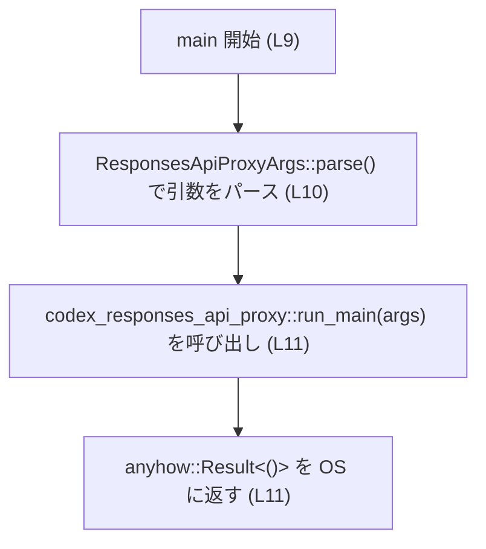

# responses-api-proxy/src/main.rs

## 0. ざっくり一言

`responses-api-proxy` バイナリのエントリポイントです。  
プロセス起動直後にハードニング処理を実行し、その後にコマンドライン引数を `clap` でパースして、コアロジックである `codex_responses_api_proxy::run_main` を呼び出します。

---

## 1. このモジュールの役割

### 1.1 概要

- このモジュールは **バイナリの起動と初期化** を担当します。
- 具体的には次の 2 点を行います（いずれもこのファイルで確認できます）。
  - プロセス開始時に `codex_process_hardening::pre_main_hardening` を呼び出すフック関数 `pre_main` の定義（`responses-api-proxy\src\main.rs:L4-7`）。
  - CLI 引数をパースし、`codex_responses_api_proxy::run_main` を実行する `main` 関数の定義（`responses-api-proxy\src\main.rs:L9-11`）。

### 1.2 アーキテクチャ内での位置づけ

このファイルは「薄いエントリポイント」として、外部クレートに処理を委譲しています。

- 引数パース: `clap::Parser` トレイトによる `ResponsesApiProxyArgs::parse()`（`responses-api-proxy\src\main.rs:L1-2,10`）。
- コア処理: `codex_responses_api_proxy::run_main` への委譲（`responses-api-proxy\src\main.rs:L11`）。
- セキュリティ/ハードニング: `codex_process_hardening::pre_main_hardening` の呼び出し（`responses-api-proxy\src\main.rs:L5-6`）。

Mermaid 図で表すと、次のような依存関係になっています。

```mermaid
graph TD
  subgraph "responses-api-proxy/src/main.rs (L1-12)"
    pre_main["pre_main 関数 (L4-7)"]
    main_fn["main 関数 (L9-11)"]
  end

  pre_main -->|"呼び出し"| harden["codex_process_hardening::pre_main_hardening"]
  main_fn -->|"型利用"| args_type["codex_responses_api_proxy::Args\n(ResponsesApiProxyArgs)"]
  main_fn -->|"実行委譲"| run_main["codex_responses_api_proxy::run_main"]
  main_fn -->|"トレイト境界"| clap_parser["clap::Parser トレイト"]

  note right of pre_main
    #[ctor::ctor] 属性付き
    （プログラム起動時に実行されるコンストラクタ関数。
     詳細挙動は ctor クレートの仕様による）
  end
```

※ `pre_main` の呼び出しタイミング（プログラム起動時に自動呼び出しされる）は、`ctor` クレートの一般的な仕様に基づくものであり、このファイル単体に直接の呼び出しコードは現れません（`responses-api-proxy\src\main.rs:L4`）。

### 1.3 設計上のポイント

コードから読み取れる設計上の特徴は次のとおりです。

- **責務の分割**
  - このモジュールは「起動シーケンスの接着コード」として、実際のビジネスロジックを外部クレート `codex_responses_api_proxy` に完全に委譲しています（`responses-api-proxy\src\main.rs:L10-11`）。
- **状態を持たない設計**
  - グローバル変数や構造体は一切定義しておらず、状態は `Args` や外部クレート側にのみ存在すると解釈できます（このチャンクには状態を持つ定義は現れません）。
- **エラーハンドリング方針**
  - `main` が `anyhow::Result<()>` を返すことで、エラーを呼び出し元（ランタイム）に伝播する設計です（`responses-api-proxy\src\main.rs:L9,11`）。
  - これにより、`run_main` 内で発生するあらゆるエラーを `anyhow` の汎用エラー型で一元的に扱えるようになっています。
- **セキュリティ/ハードニング**
  - プロセス起動直後に `codex_process_hardening::pre_main_hardening` が実行されるフックが用意されています（`responses-api-proxy\src\main.rs:L4-6`）。
  - 具体的なハードニング内容はこのチャンクには現れませんが、セキュリティ関連の初期化処理をここで集中実行する設計と解釈できます。

---

## 2. コンポーネントインベントリー & 主要な機能一覧

### 2.1 関数・型インベントリー

このチャンク（`responses-api-proxy\src\main.rs`）に現れる関数・型の一覧です。

#### 関数

| 名前 | 種別 | 公開? | 定義位置 | 役割 / 概要 |
|------|------|--------|-----------|-------------|
| `pre_main` | 関数 | 非公開 | `responses-api-proxy\src\main.rs:L4-7` | プロセス起動時に `codex_process_hardening::pre_main_hardening` を呼び出す初期化フック。 |
| `main` | 関数 | 公開 (`pub`) | `responses-api-proxy\src\main.rs:L9-11` | CLI 引数をパースして `codex_responses_api_proxy::run_main` を実行するバイナリエントリポイント。 |

#### このファイル内で定義される型

- 構造体・列挙体・型エイリアスなどの **型定義はありません**（このチャンクには現れません）。

#### 外部から利用している主な型・関数（参考）

| 名前 | 出典 | 利用位置 | 役割（このチャンクから分かる範囲） |
|------|------|----------|-------------------------------------|
| `Parser` トレイト | `clap` クレート | `responses-api-proxy\src\main.rs:L1,10` | `ResponsesApiProxyArgs` に `.parse()` メソッドを提供するトレイト。 |
| `Args` 型 | `codex_responses_api_proxy` クレート | `responses-api-proxy\src\main.rs:L2,10` | コマンドライン引数を表す型。`Parser` トレイトを実装していると推測できます（`.parse()` 呼び出しより）。 |
| `pre_main_hardening` 関数 | `codex_process_hardening` クレート | `responses-api-proxy\src\main.rs:L6` | プロセスハードニング処理。詳細はこのチャンクには現れません。 |
| `run_main` 関数 | `codex_responses_api_proxy` クレート | `responses-api-proxy\src\main.rs:L11` | プロキシのコアロジックを実行する関数。戻り値が `anyhow::Result<()>` であることが型から分かります。 |
| `Result` 型 | `anyhow` クレート | `responses-api-proxy\src\main.rs:L9` | `main` の戻り値のエラー型として利用。さまざまなエラー型をまとめて扱うための汎用エラー型。 |
| `ctor` 属性マクロ | `ctor` クレート | `responses-api-proxy\src\main.rs:L4` | プログラム起動時に自動実行される関数を定義するための属性。 |

### 2.2 主要な機能一覧

このモジュールが提供する主要な機能は次のとおりです。

- プロセス起動前ハードニングの実行: `pre_main` から `codex_process_hardening::pre_main_hardening` を呼び出します（`responses-api-proxy\src\main.rs:L4-6`）。
- コマンドライン引数のパース: `ResponsesApiProxyArgs::parse()` により、`clap` ベースで CLI 引数を構造体に変換します（`responses-api-proxy\src\main.rs:L1-2,10`）。
- コアロジックの起動: パースした引数を `codex_responses_api_proxy::run_main` に渡して実行し、その結果を `main` の戻り値として返します（`responses-api-proxy\src\main.rs:L9-11`）。

---

## 3. 公開 API と詳細解説

### 3.1 型一覧（構造体・列挙体など）

このファイル内で **新たに定義される公開型はありません**。  
利用している `Args` 型などはすべて外部クレート由来であり、このチャンクには定義が現れません。

### 3.2 関数詳細

このファイルに定義された 2 つの関数を、テンプレートに沿って説明します。

---

#### `pub fn main() -> anyhow::Result<()>`

**定義位置**

- `responses-api-proxy\src\main.rs:L9-11`

**概要**

- バイナリの標準的なエントリポイント関数です。
- `ResponsesApiProxyArgs`（`codex_responses_api_proxy::Args` の別名）を `clap::Parser` を用いてパースし、その値を `codex_responses_api_proxy::run_main` に渡して実行します。
- 実行結果を `anyhow::Result<()>` として返し、エラーをランタイムに伝播します。

**引数**

- 引数は取りません（標準の `main` 関数と同様）。

| 引数名 | 型 | 説明 |
|--------|----|------|
| なし | なし | コマンドライン引数は `clap` が直接 `std::env::args()` から取得するため、`main` の引数としては受け取りません。 |

**戻り値**

- 型: `anyhow::Result<()>`（`responses-api-proxy\src\main.rs:L9`）
- 意味:
  - `Ok(())`: `run_main` が正常に完了したことを表します。
  - `Err(e)`: `run_main` 内でエラーが発生したことを表します。エラー内容は `anyhow::Error` としてカプセル化されます。

**内部処理の流れ（アルゴリズム）**

コード（`responses-api-proxy\src\main.rs:L9-11`）に忠実に書くと、次の 2 ステップです。

1. `ResponsesApiProxyArgs::parse()` を呼び出して、コマンドラインから引数構造体 `args` を生成します（`L10`）。
   - このとき `clap::Parser` トレイトが使われます（`L1,10`）。
2. 生成した `args` を `codex_responses_api_proxy::run_main(args)` に渡し、その戻り値（`anyhow::Result<()>`）をそのまま `main` の戻り値として返します（`L11`）。

**簡易フローチャート**



**Examples（使用例）**

`main` は通常外部から直接呼び出すものではなく、バイナリとして起動されます。  
想定される利用方法は次のようなコマンドライン実行です（具体的な引数は `Args` 型の定義側に依存するため、このチャンクからは分かりません）。

```bash
# ヘルプの表示（clap が自動生成）
$ responses-api-proxy --help

# 典型的な起動例（引数は例示）
$ responses-api-proxy --listen 0.0.0.0:8080 --upstream https://api.example.com
```

Rust コードからの呼び出し例（テストなどで想定）を示すと、次のようになります。

```rust
// main 関数を直接テストするケース（あくまで例であり、このリポジトリのテストコードではありません）
fn call_main_for_test() {
    // 環境変数や std::env::set_var などで仮想的な CLI 引数を設定したうえで
    // main() を直接呼び出すことが技術的には可能です。
    let result = responses_api_proxy::main(); // 仮のモジュールパス例
    assert!(result.is_ok());
}
```

※ 実際にこのようなテストが存在するかどうかは、このチャンクには現れません。

**Errors / Panics**

- `Err` になる条件:
  - `codex_responses_api_proxy::run_main` が `Err` を返した場合、そのまま `main` からも `Err` が返ります（`responses-api-proxy\src\main.rs:L11`）。
  - コマンドライン引数の不正などで `ResponsesApiProxyArgs::parse()` がエラーを出す場合、`clap` の標準挙動としてプロセスを終了（ヘルプ表示など）しますが、その挙動はこのチャンクには現れません（`L10`）。
- `panic` の可能性:
  - この関数内で明示的に `panic!` を呼んでいる箇所はありません。
  - `panic` が発生しうるとすれば、`clap` や `run_main` 内部の `panic` ですが、その有無はこのチャンクからは分かりません。

**Edge cases（エッジケース）**

このファイルから読み取れる範囲では、次のようなケースが考えられます。

- **引数が一切指定されない場合**
  - `ResponsesApiProxyArgs::parse()` がデフォルト値や必須オプションに基づいて処理します。
  - 具体的な必須/任意オプションは `Args` の定義側に依存し、このチャンクには現れません。
- **不正な引数が渡された場合**
  - 一般的な `clap` の挙動として、エラーメッセージとともに非 0 ステータスで終了します。
  - `main` の戻り値として `Err` が返るかどうかは、`clap` の設定に依存しますが、このチャンクにはその設定は現れません。
- **`run_main` 内部でエラーが発生する場合**
  - `run_main` が `Err` を返すため、`main` も同じ `Err` を返し、プロセスは非 0 終了コードとなるのが標準的な挙動です（Rust の `main -> Result` の仕様による）。

**使用上の注意点**

- バイナリ利用者側（CLI ユーザー）:
  - 引数の仕様は `codex_responses_api_proxy::Args` の定義に従う必要があります（このチャンクには仕様が現れません）。
- ライブラリ開発者側:
  - `main` の戻り値型（`anyhow::Result<()>`）は、`run_main` の戻り値型と直接結び付いています。
    - `run_main` の戻り値型を変更すると、この `main` のシグネチャも合わせて変更する必要があります。
- 並行性:
  - `main` 自体はマルチスレッドや `async` を使用していません。並行処理の有無は `run_main` 側に依存します（このチャンクには現れません）。
- セキュリティ:
  - `pre_main` で行われるハードニングを前提としている可能性があります。`pre_main` の削除や変更はセキュリティに影響を与える可能性があります（詳細は 6. 変更の仕方で言及します）。

---

#### `#[ctor::ctor] fn pre_main()`

**定義位置**

- `responses-api-proxy\src\main.rs:L4-7`

**概要**

- プロセス起動時に実行される初期化関数です。
- `codex_process_hardening::pre_main_hardening()` を呼び出し、プロセスのハードニング（強化）を行います（`L5-6`）。

**引数**

- 引数はありません。

| 引数名 | 型 | 説明 |
|--------|----|------|
| なし | なし | 起動時に自動で呼び出されるため、引数は取りません。 |

**戻り値**

- 戻り値は `()`（ユニット型）です。
  - 関数シグネチャに戻り値型の記述がないため（`fn pre_main() { ... }`）、暗黙の戻り値型は `()` になります（`responses-api-proxy\src\main.rs:L5`）。

**内部処理の流れ**

`responses-api-proxy\src\main.rs:L4-7` に基づくと、処理は 1 ステップのみです。

1. `codex_process_hardening::pre_main_hardening()` を呼び出します（`L6`）。

**起動タイミングについて**

- `#[ctor::ctor]` 属性は、外部クレート `ctor` による属性マクロです（`L4`）。
- 一般的な `ctor` クレートの仕様に従うと、この属性を付けた関数は **`main` が実行される前に自動的に実行されるコンストラクタ** として登録されます。
- このファイルには `pre_main` を直接呼び出すコードは存在せず、生成される呼び出しはコンパイル時に `ctor` によって追加されます（このチャンクには現れません）。

**Examples（使用例）**

`pre_main` は通常コードから直接呼び出すものではありませんが、擬似的な例を示します。

```rust
// 通常の Rust コードからの呼び出し例（あくまでテストやデバッグでの利用例）
fn main() {
    // 本来は ctor により自動で呼び出されますが、
    // 明示的にもう一度呼びたい場合にはこう書けます。
    pre_main(); // 追加のハードニング処理を手動で適用
}
```

※ 実運用でこのように二重に呼び出すべきかどうかは、このチャンクおよび `codex_process_hardening` の仕様からは分かりません。

**Errors / Panics**

- `pre_main` 自体からは `Result` を返しません（戻り値は `()`）。
- エラーや失敗は、呼び出し先である `codex_process_hardening::pre_main_hardening()` の内部で扱われます。
  - この関数が `panic!` を起こすか、静かに失敗を無視するかは、このチャンクには現れません。
- したがって、`pre_main` の失敗は **コンパイル時には型として表現されていません**。

**Edge cases（エッジケース）**

- **`pre_main_hardening` が失敗する場合**
  - 戻り値がないため、失敗を検知する手段はこの関数には組み込まれていません。
  - セキュリティ上重大なハードニングに失敗しても、プロセスが続行される設計である可能性がありますが、この点も `codex_process_hardening` の仕様に依存します。
- **複数回呼び出された場合**
  - `#[ctor::ctor]` での自動呼び出しに加えて、コードから明示的に呼び出せば複数回実行され得ます。
  - 冪等性（同じ処理を複数回行っても問題ないか）は、このチャンクからは分かりません。

**使用上の注意点**

- セキュリティの観点:
  - セキュリティハードニングを行う責務を負っていると考えられるため、この関数（と `ctor` 属性）を削除したり変更したりする場合は、セキュリティ要件を慎重に確認する必要があります。
- デバッグの観点:
  - ハードニング処理が原因の不具合を切り分けるために、一時的に `pre_main` の呼び出しをコメントアウトしたくなる場合がありますが、これはセキュリティ低下に直結する可能性があるため、慎重な判断が必要です。

---

### 3.3 その他の関数

このファイルにある関数は `pre_main` と `main` の 2 つのみであり、いずれも上で詳細に説明しました。補助的なラッパー関数などはこのチャンクには現れません。

---

## 4. データフロー

このモジュールの典型的な実行シナリオは「バイナリ起動時からコアロジック実行までの流れ」です。  
ここでは、起動から `run_main` の実行までのデータと制御の流れを示します。

1. OS/ランタイムが `responses-api-proxy` バイナリを起動する。
2. `ctor` クレートの仕組みにより、`pre_main` が自動的に呼び出される（`responses-api-proxy\src\main.rs:L4`）。
3. `pre_main` は `codex_process_hardening::pre_main_hardening` を呼び出し、プロセスのハードニングを行う（`L6`）。
4. その後、通常の Rust の起動シーケンスに従い `main` が呼ばれる（`L9`）。
5. `main` は `ResponsesApiProxyArgs::parse()` により CLI 引数を構造体に変換する（`L10`）。
6. 変換された `args` が `codex_responses_api_proxy::run_main(args)` に渡され、コアロジックが実行される（`L11`）。
7. `run_main` の戻り値（`anyhow::Result<()>`）が `main` の戻り値となり、プロセス終了コードとして OS に伝わる。

これをシーケンス図で表すと次のようになります。

```mermaid
sequenceDiagram
    autonumber
    participant OS as OS / ランタイム
    participant pre as pre_main (L4-7)
    participant hard as codex_process_hardening::pre_main_hardening
    participant main as main (L9-11)
    participant core as codex_responses_api_proxy::run_main
    participant clap as ResponsesApiProxyArgs::parse (clap::Parser)

    %% この図は responses-api-proxy/src/main.rs (L1-12) を対象とした実行フローの概略です。

    OS->>pre: プロセス起動時に自動呼び出し（#[ctor::ctor] に基づく）*
    pre->>hard: pre_main_hardening()
    hard-->>pre: 処理完了
    pre-->>OS: 戻り

    OS->>main: main()
    main->>clap: ResponsesApiProxyArgs::parse()
    clap-->>main: args: ResponsesApiProxyArgs
    main->>core: run_main(args)
    core-->>main: anyhow::Result<()>
    main-->>OS: 終了コード（Result に応じて）

    note over pre,main
      * pre_main の自動呼び出しは ctor クレートの仕様に基づく。
      このファイルには明示的な呼び出しは書かれていない。
    end
```

---

## 5. 使い方（How to Use）

### 5.1 基本的な使用方法

エンドユーザー視点では、このモジュールは `responses-api-proxy` バイナリとして使用されます。

```bash
# 一般的な起動例
$ responses-api-proxy [オプション] [引数...]
```

開発者視点の典型的なコードフローは次のとおりです（`main` 内部の処理と一致します）。

```rust
use clap::Parser; // Parser トレイトのインポート（responses-api-proxy\src\main.rs:L1）
// Args 型は codex_responses_api_proxy クレート内で定義（this chunkには定義なし）

fn main() -> anyhow::Result<()> {
    // コマンドライン引数を構造体にパース（L10）
    let args = codex_responses_api_proxy::Args::parse();

    // コアロジックを実行（L11）
    codex_responses_api_proxy::run_main(args)
}
```

※ 実際の `main` は `pub` で、かつ `ResponsesApiProxyArgs` 型を `use` して別名にしていますが、概念的には上記と同じ構造です（`responses-api-proxy\src\main.rs:L1-2,9-11`）。

### 5.2 よくある使用パターン

このファイル自体はパターンのバリエーションを持ちませんが、想定される利用シナリオを挙げます。

1. **通常起動**
   - バイナリを直接起動してプロキシとして動作させる。
2. **システムサービスとして起動**
   - systemd や supervisord などから `responses-api-proxy` を起動する。
   - この場合も `main` の挙動は変わらず、環境設定・ログ出力などは `run_main` およびその依存先に委ねられます。

### 5.3 よくある間違い（推測できる範囲）

このチャンクから推測できる潜在的な誤用例と、その正しい例を示します。

```rust
// 誤りの例: 引数を手動で構築しようとする（Args の定義を知らないまま）
// これは main の中では行われていません。
fn wrong_main() -> anyhow::Result<()> {
    // 仮に Args を自分で new しようとすると、clap が提供する
    // バリデーション・ヘルプ・デフォルト値などをバイパスしてしまいます。
    let args = codex_responses_api_proxy::Args {
        // フィールド初期化（定義はこのチャンクには現れません）
    };
    codex_responses_api_proxy::run_main(args)
}

// 正しい例: clap::Parser によるパースに任せる（本ファイルの実装と同様）
fn correct_main() -> anyhow::Result<()> {
    let args = codex_responses_api_proxy::Args::parse();
    codex_responses_api_proxy::run_main(args)
}
```

### 5.4 使用上の注意点（まとめ）

- **CLI インターフェースの変更**
  - 引数仕様を変更する場合は、`Args` の定義側（このチャンクには現れない）を編集し、`main` は `ResponsesApiProxyArgs::parse()` を呼び続ける形が保守性の高い設計です。
- **セキュリティハードニング**
  - `pre_main` の存在により、起動時に特定のセキュリティ設定が行われる前提で `run_main` が書かれている可能性があります。
  - そのため、`pre_main` や `pre_main_hardening` を無効化する変更は慎重に検討する必要があります。
- **エラー処理**
  - `main` の戻り値は `anyhow::Result<()>` であり、エラーはまとめて `Err` に乗る設計です。
  - 細かな終了コードの出し分けや、ユーザーへのメッセージの制御は `run_main` 側で行うのが自然です。

---

## 6. 変更の仕方（How to Modify）

### 6.1 新しい機能を追加する場合

このファイルの責務はきわめて限定的であるため、新機能は多くの場合 **`codex_responses_api_proxy` クレート側** に追加するのが自然です。

- 例: 新しいサブコマンドやフラグを追加したい場合
  1. `codex_responses_api_proxy::Args` の定義ファイル（このチャンクには現れません）にフィールドやサブコマンドを追加する。
  2. `run_main` やその内部で、新しいフィールドに応じた処理を追加する。
  3. `main` は引き続き `ResponsesApiProxyArgs::parse()` と `run_main(args)` を呼ぶだけで済みます。

- もし `responses-api-proxy` の起動前に別の初期化処理を追加したい場合:
  - `pre_main` 内で `pre_main_hardening` の前後に処理を追加するのが自然です（`responses-api-proxy\src\main.rs:L5-6`）。
  - ただし、初期化の順序や失敗時の挙動がセキュリティや安定性に影響する可能性があるため、`codex_process_hardening` の仕様を確認する必要があります。

### 6.2 既存の機能を変更する場合

- **`run_main` のシグネチャを変更する場合**
  - 例えば `run_main(args) -> anyhow::Result<ExitCode>` のように変更したいとき、
    - `main` の戻り値型もそれに合わせて変更するか、
    - `main` 内で `ExitCode` を `Result<()>` に変換するラッパー処理を追加する必要があります。
- **ハードニング処理の変更**
  - `pre_main` を `pub` にする、または別のファイルに移動するといった変更は、`ctor` のスキャン対象やリンク順序に影響する可能性があります。
  - 変更時は「起動時に必ず実行されるか」を確認する必要があります。
- **影響範囲の確認方法**
  - `main` や `pre_main` を変更する場合、リポジトリ全体でこれらの関数名を検索し、直接呼び出しやテストコードが存在するかを確認するのが安全です（このチャンクにはテストは現れません）。
- **契約（Contracts）**
  - `main` が `anyhow::Result<()>` を返すという契約に依存したコードが（テストなどで）存在する可能性があります。
  - 戻り値型やエラーの表現を変更する場合は、その契約が破られないように注意する必要があります。

---

## 7. 関連ファイル

このモジュールと密接に関係するであろうファイル・クレート（このチャンクから参照が確認できるもの）をまとめます。

| パス / クレート | 役割 / 関係 |
|----------------|------------|
| `codex_responses_api_proxy::Args`（定義ファイルのパスはこのチャンクには現れません） | CLI 引数を表す構造体。`clap::Parser` を実装しており、`ResponsesApiProxyArgs::parse()` で利用されます（`responses-api-proxy\src\main.rs:L2,10`）。 |
| `codex_responses_api_proxy::run_main` | プロキシのコアロジックを実行する関数。`main` から呼び出されます（`responses-api-proxy\src\main.rs:L11`）。戻り値型は `anyhow::Result<()>` と一致している必要があります。 |
| `codex_process_hardening::pre_main_hardening` | プロセス起動前のハードニング処理を行う関数。`pre_main` から呼び出されます（`responses-api-proxy\src\main.rs:L6`）。 |
| `clap::Parser` トレイト | CLI 引数パーサを自動生成するためのトレイト。`ResponsesApiProxyArgs::parse()` の実装元です（`responses-api-proxy\src\main.rs:L1,10`）。 |
| `anyhow::Result` | さまざまなエラー型を一つにまとめるための汎用的な結果型。`main` の戻り値で使用されます（`responses-api-proxy\src\main.rs:L9`）。 |
| `ctor` クレート | `#[ctor::ctor]` 属性を提供し、プログラム起動時に自動実行される関数を定義できるようにします（`responses-api-proxy\src\main.rs:L4`）。 |

---

### Bugs / Security / Edge Cases まとめ（このファイルから分かる範囲）

- **潜在的なバグ要因（このチャンクから読み取れる範囲）**
  - `pre_main` が失敗した場合のハンドリングが型で表現されていないため、失敗しても検知できない可能性があります。
- **セキュリティ上のポイント**
  - `pre_main` を介してハードニング処理を行う設計になっており、これを無効化するとセキュリティが低下する可能性があります。
  - どのようなハードニングが行われているかは `codex_process_hardening` の実装に依存し、このチャンクには現れません。
- **並行性**
  - このファイル自体にはマルチスレッドや非同期処理はありません。並行性に関する注意点は `run_main` など他の部分に依存します。

このレポートは、`responses-api-proxy\src\main.rs` のコード（L1-12）から直接読み取れる事実と、 Rust / 利用クレートの一般的な仕様に基づいた説明のみを含んでいます。それ以外の部分（外部クレートの内部実装など）は「このチャンクには現れません」として扱いました。
