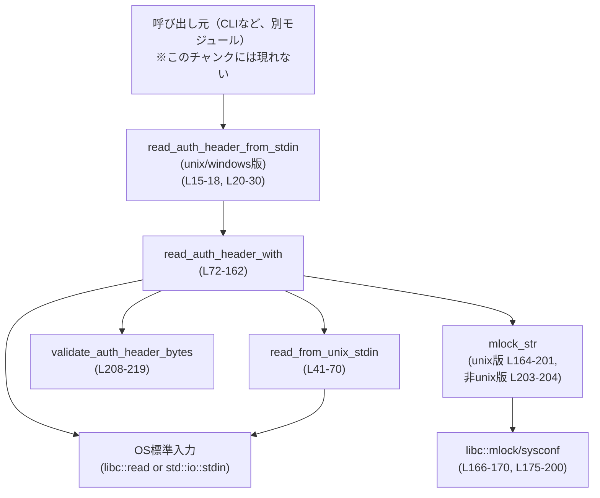
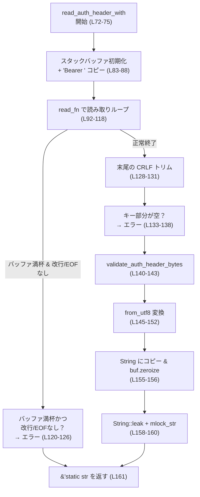
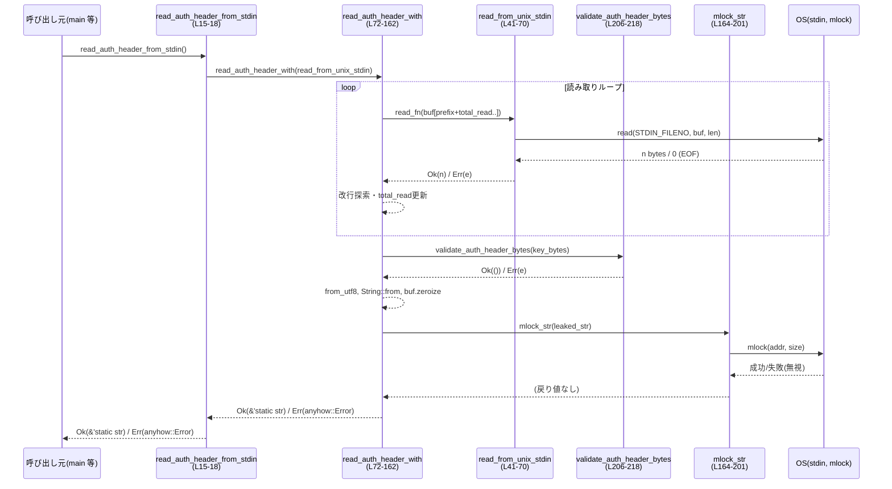

# responses-api-proxy/src/read_api_key.rs

## 0. ざっくり一言

標準入力（stdin）から API キーを読み取り、`"Bearer <KEY>"` 形式の `Authorization` ヘッダ文字列を生成するモジュールです。  
API キーがメモリ上に長時間・複数コピーとして残らないよう、スタックバッファと `mlock(2)`／`zeroize` を使って慎重に扱うのが特徴です（`read_api_key.rs:L72-83`, `read_api_key.rs:L155-160`, `read_api_key.rs:L164-201`）。

---

## 1. このモジュールの役割

### 1.1 概要

- このモジュールは、**API キーを安全に読み取り、`Authorization: Bearer ...` の値を生成する問題**を解決するために存在します。
- 標準入力からテキストとして API キーを読み取り、先頭に `"Bearer "` を付けた文字列を作成し、`&'static str` として返します（`read_api_key.rs:L11-18`, `read_api_key.rs:L20-30`, `read_api_key.rs:L72-162`）。
- UNIX では、生成した文字列のメモリページを `mlock(2)` でロックし、スタック上のバッファは `zeroize` で上書きして、キーのコピーがメモリ上に残らないよう配慮しています（`read_api_key.rs:L76-83`, `read_api_key.rs:L155-160`, `read_api_key.rs:L164-201`）。

### 1.2 アーキテクチャ内での位置づけ

このファイル内の関数同士の依存関係と、外部コンポーネントとの関係は次のようになっています。



- 実際の呼び出し元（CLI の `main` など）はこのチャンクには含まれていませんが、`pub(crate) fn read_auth_header_from_stdin()` を起点に使われる構造になっています（`read_api_key.rs:L15-18`, `read_api_key.rs:L20-30`）。
- OS 依存の部分は `#[cfg(unix)]` と `#[cfg(windows)]`／`#[cfg(not(unix))]` で分岐し、UNIX では `libc::read`／`mlock` を使い、Windows では `std::io::stdin().read` のみを使います（`read_api_key.rs:L20-30`, `read_api_key.rs:L41-54`, `read_api_key.rs:L164-201`, `read_api_key.rs:L203-204`）。

### 1.3 設計上のポイント

- **責務の分割**
  - 標準入力からの読み取り戦略は `read_auth_header_with` に抽象化し、実際の読み取り実装はクロージャ／`read_from_unix_stdin` に委譲しています（テスト容易性と OS 抽象のため）（`read_api_key.rs:L72-75`, `read_api_key.rs:L15-18`, `read_api_key.rs:L20-30`）。
  - キーのバリデーションは `validate_auth_header_bytes` に分離し、文字種チェックを担当します（`read_api_key.rs:L206-218`）。
  - メモリロックは `mlock_str` に分離し、ページ境界計算と `libc::mlock` 呼び出しをカプセル化しています（`read_api_key.rs:L164-201`）。

- **状態管理**
  - すべての実処理は関数ローカルの変数だけで行われ、グローバルな可変状態は持ちません。
  - ただし `String::leak()` により、1 つの API キー文字列をヒープ上に永続的（`'static` ライフタイム）に残す設計になっています（`read_api_key.rs:L155-161`）。

- **エラーハンドリング**
  - `anyhow::Result` を採用し、メッセージ主体のエラー（`anyhow!`）と、I/O エラーの伝播に対応しています（`read_api_key.rs:L2-3`, `read_api_key.rs:L94-100`, `read_api_key.rs:L121-126`, `read_api_key.rs:L133-138`, `read_api_key.rs:L140-143`, `read_api_key.rs:L145-152`, `read_api_key.rs:L208-218`）。
  - UTF-8 変換エラー時には `Context` 拡張でエラーに説明を付加します（`read_api_key.rs:L145-152`）。

- **安全性（メモリ／セキュリティ）**
  - API キーはまず固定長スタックバッファに読み込み（`[0u8; BUFFER_SIZE]`）、処理後に `zeroize()` で上書きします（`read_api_key.rs:L83`, `read_api_key.rs:L97-98`, `read_api_key.rs:L122-123`, `read_api_key.rs:L134-135`, `read_api_key.rs:L141-142`, `read_api_key.rs:L150-151`, `read_api_key.rs:L155-156`）。
  - UNIX では最終的な `&'static str` が指すメモリ範囲をページ単位で `mlock(2)` し、スワップアウトされないようにします（`read_api_key.rs:L164-201`）。
  - キーのバイト列は `/^[A-Za-z0-9\-_]+$/` に制限され、NUL や非 ASCII などの「怪しい」バイト列を拒否します（`read_api_key.rs:L206-213`）。

- **並行性**
  - 関数はすべてスレッドローカルなデータだけを扱い、グローバルな可変状態を持たないため、再入可能です。
  - 返される `&'static str` は不変な文字列であり、共有して読み取り専用に使う限り、スレッド間で安全に利用できます（`read_api_key.rs:L155-161`）。

---

## 2. 主要な機能一覧

### 2.1 コンポーネント一覧（関数・定数インベントリ）

| 名前 | 種別 | 公開範囲 | 説明 | 定義位置 |
|------|------|----------|------|----------|
| `BUFFER_SIZE` | 定数 `usize` | モジュール内 | API キー＋プレフィックスを収めるスタックバッファのサイズ（1024バイト） | `read_api_key.rs:L6-8` |
| `AUTH_HEADER_PREFIX` | 定数 `&[u8]` | モジュール内 | `"Bearer "` をバイト列として保持するプレフィックス | `read_api_key.rs:L9` |
| `read_auth_header_from_stdin` (unix) | 関数 | `pub(crate)` | UNIX で標準入力から API キーを読み取り、ロックされた `&'static str` ヘッダ値を返す | `read_api_key.rs:L11-18` |
| `read_auth_header_from_stdin` (windows) | 関数 | `pub(crate)` | Windows で `std::io::stdin().read` を用いて API キーを読み取る | `read_api_key.rs:L20-30` |
| `read_from_unix_stdin` | 関数 | モジュール内 | `libc::read(2)` を用いて低レベルに stdin から読み取る。EINTR リトライなどを行う | `read_api_key.rs:L32-70` |
| `read_auth_header_with` | 関数 | モジュール内 | 任意の読み取り関数 `FnMut(&mut [u8])` を使って API キーを読み込み、`"Bearer <KEY>"` を生成するコアロジック | `read_api_key.rs:L72-162` |
| `mlock_str` (unix) | 関数 | モジュール内 | `&str` が乗っているメモリ範囲をページ境界で切り出し、`mlock(2)` でロックする | `read_api_key.rs:L164-201` |
| `mlock_str` (not unix) | 関数 | モジュール内 | 非 UNIX 環境ではダミー実装（何もしない） | `read_api_key.rs:L203-204` |
| `validate_auth_header_bytes` | 関数 | モジュール内 | API キーのバイト列が `/^[A-Za-z0-9\-_]+$/` にマッチするか検証する | `read_api_key.rs:L206-218` |
| `tests` モジュール | テストモジュール | `cfg(test)` | 上記関数群の振る舞い（正常系・エラー系）を検証する単体テストを多数含む | `read_api_key.rs:L221-341` |

### 2.2 主要な機能の箇条書き

- 標準入力から API キー（1 行）を読み取る（複数回の短い読み取りにも対応）（`read_api_key.rs:L92-118`）。
- `"Bearer "` プレフィックスを付けたヘッダ値を生成する（`read_api_key.rs:L83-88`, `read_api_key.rs:L128-131`, `read_api_key.rs:L155-161`）。
- 改行（`\n`）・CRLF（`\r\n`）を末尾からトリムする（`read_api_key.rs:L128-131`）。
- キーが空の場合や、あまりに長い場合にエラーにする（`read_api_key.rs:L121-126`, `read_api_key.rs:L133-138`）。
- キーのバイト列が ASCII 英数字と `-`／`_` のみに収まっていることを検証する（`read_api_key.rs:L206-213`）。
- 読み取り用のスタックバッファを `zeroize()` で上書きし、残存を防ぐ（`read_api_key.rs:L97-98`, `read_api_key.rs:L122-123`, `read_api_key.rs:L134-135`, `read_api_key.rs:L141-142`, `read_api_key.rs:L150-151`, `read_api_key.rs:L155-156`）。
- UNIX では最終的なヘッダ文字列のメモリページを `mlock(2)` でロックする（`read_api_key.rs:L164-201`）。

---

## 3. 公開 API と詳細解説

### 3.1 型一覧（構造体・列挙体など）

このファイルには、新たな構造体・列挙体・トレイトなどの型定義はありません。  
外部の型として `anyhow::Result`、`std::io::Result`、`&str`、`&[u8]` などを利用しています（`read_api_key.rs:L1-4`, `read_api_key.rs:L41`, `read_api_key.rs:L72-75`）。

### 3.2 関数詳細（コア 5 件）

#### `pub(crate) fn read_auth_header_from_stdin() -> Result<&'static str>`

（`#[cfg(unix)]` 版: `read_api_key.rs:L11-18`, `#[cfg(windows)]` 版: `read_api_key.rs:L20-30`）

**概要**

- 標準入力から API キーを読み取り、`"Bearer <KEY>"` 形式の `&'static str` を返します。
- 実際の読み取りとヘッダ構築処理は `read_auth_header_with` に委譲し、UNIX 版は低レベル `read_from_unix_stdin`、Windows 版は `std::io::stdin().read` を使います。

**引数**

なし。  
標準入力からの読み取りを前提としています。

**戻り値**

- `Result<&'static str>`（`anyhow::Result` エイリアス）
  - `Ok(&'static str)` … `"Bearer <KEY>"` 形式のヘッダ文字列
  - `Err(anyhow::Error)` … I/O エラーやフォーマットエラーなど

**内部処理の流れ**

UNIX:

1. `read_auth_header_with(read_from_unix_stdin)` を呼び出します（`read_api_key.rs:L16-17`）。
2. 戻り値をそのまま返します。

Windows:

1. ローカルで `use std::io::Read;` をインポート（`read_api_key.rs:L22`）。
2. `read_auth_header_with` にクロージャ `|buffer| std::io::stdin().read(buffer)` を渡して呼び出します（`read_api_key.rs:L29`）。
3. 戻り値をそのまま返します。

**Examples（使用例）**

UNIX / Windows 共通の使い方イメージです。

```rust
use anyhow::Result;                                     // anyhow::Result をインポート
mod read_api_key;                                       // このモジュールをインポート（パスは実際の構成に合わせる）

fn main() -> Result<()> {                               // エラーを anyhow::Result で返す main
    // 標準入力から API キーを読み取り、Authorization ヘッダ値を得る
    let auth_header: &'static str = read_api_key::read_auth_header_from_stdin()?;
    // 例: HTTP クライアントに Authorization ヘッダとして設定する
    println!("Authorization: {}", auth_header);         // 実際はログには出さない方が安全
    Ok(())
}
```

**Errors / Panics**

- エラーになる主な条件
  - 標準入力からの読み取りで `std::io::Error` が発生した場合（`read_api_key.rs:L94-100`）。
  - API キーがバッファに入りきらない（1024 バイトを超える）場合（`read_api_key.rs:L120-126`）。
  - API キーが空（改行のみなど）の場合（`read_api_key.rs:L133-138`）。
  - キーに ASCII 英数字・`-`・`_` 以外の文字が含まれる場合（`read_api_key.rs:L206-218`）。
  - UTF-8 として解釈できない場合（理論上はバリデーションで防いでいるが、保険として）（`read_api_key.rs:L145-152`）。
- パニック要因
  - この関数自身は明示的に `panic!` を呼びません。
  - ただしプロセス全体が深刻な環境依存エラーなどでパニックする可能性は一般論としてあります。

**Edge cases（エッジケース）**

- 標準入力が即 EOF（何も入力されない）:
  - `read_auth_header_with` がエラー `"API key must be provided via stdin..."` を返します（`read_api_key.rs:L133-138`）。
- 非 UNIX 環境（Windows 等）:
  - メモリロック（`mlock`）は行われず、単にヘッダ文字列を返すだけです（`read_api_key.rs:L203-204`）。
- 複数回呼び出した場合:
  - 各呼び出しごとに `String::leak()` で新しい `'static` 文字列が生成され、メモリに残り続けます（`read_api_key.rs:L155-161`）。

**使用上の注意点**

- セキュリティ上、**同じプロセスで何度も呼び出すと複数のキーがリークし続ける**ため、通常はプロセス起動時に一度だけ呼ぶ設計が望ましいです（`read_api_key.rs:L155-161`）。
- Windows では `mlock` が実装されていないため、API キーがスワップアウトされる可能性があります（`read_api_key.rs:L24-28`, `read_api_key.rs:L203-204`）。
- この関数は標準入力からブロッキング読み取りを行うため、**非同期コンテキストの中で直接呼ぶとスレッドをブロック**する点に注意が必要です。

---

#### `fn read_auth_header_with<F>(read_fn: F) -> Result<&'static str> where F: FnMut(&mut [u8]) -> std::io::Result<usize>`

（定義: `read_api_key.rs:L72-162`）

**概要**

- 任意の「読み取り関数」（`read_fn`）を使ってバイト列を読み込み、`"Bearer "` プレフィックスと結合して `Authorization` ヘッダ文字列を生成するコアロジックです。
- スタック上の固定長バッファに直接読み込み、**コピー回数を最小限にし、処理後にバッファを `zeroize` する**ことで API キーのメモリ残留を抑えます（`read_api_key.rs:L76-83`, `read_api_key.rs:L97-98`, `read_api_key.rs:L122-123`, `read_api_key.rs:L134-135`, `read_api_key.rs:L141-142`, `read_api_key.rs:L150-151`, `read_api_key.rs:L155-156`）。

**引数**

| 引数名 | 型 | 説明 |
|--------|----|------|
| `read_fn` | `F`（`FnMut(&mut [u8]) -> std::io::Result<usize>`） | 渡されたバッファにデータを書き込み、実際に書き込んだバイト数を返す読み取り関数。EOF の場合は `Ok(0)` を返すことを想定（`read_api_key.rs:L72-75`, `read_api_key.rs:L92-100`）。 |

**戻り値**

- `Result<&'static str>`（`anyhow::Result`）
  - `Ok(&'static str)` … `"Bearer <KEY>"` 形式のヘッダ文字列
  - `Err(anyhow::Error)` … I/O エラー、フォーマットエラーなど

**内部処理の流れ（アルゴリズム）**

1. スタックバッファ `buf` を `[0u8; BUFFER_SIZE]` で確保し、先頭に `"Bearer "` のバイト列をコピーします（`read_api_key.rs:L83-85`）。
2. `prefix_len` としてプレフィックスの長さ、`capacity = buf.len() - prefix_len` を計算し、API キー部分に使える最大長を求めます（`read_api_key.rs:L86-88`）。
3. `total_read`（キー部分に読み込んだ総バイト数）、`saw_newline`（改行を見つけたか）、`saw_eof`（EOF を見つけたか）を初期化します（`read_api_key.rs:L88-90`）。
4. `while total_read < capacity` ループで `read_fn` を呼び出し、残り領域に読み込みます（`read_api_key.rs:L92-99`）。
   - `read == 0` の場合は EOF とみなして `saw_eof = true`、ループ終了（`read_api_key.rs:L102-105`）。
   - 読み込まれた領域のみを走査し、`\n` を探します。見つかった場合はその位置＋1 までをキーとしてカウントし、`saw_newline = true` でループ終了（`read_api_key.rs:L107-113`）。
   - 改行がなければ `total_read += read` として、さらに読み込みを続けます（`read_api_key.rs:L115`）。
5. ループを抜けた後、**バッファがいっぱいになるまで読み込んだのに改行も EOF も見つからない場合**は「キーが長すぎる」としてエラーを返します（`read_api_key.rs:L120-126`）。
6. ヘッダ全体の長さ `total = prefix_len + total_read` を計算し、末尾から `\n` と `\r` を削っていきます（`read_api_key.rs:L128-131`）。
7. プレフィックス以外の長さが 0（＝キー部分が空）の場合は、「API キーが提供されていない」としてエラーにします（`read_api_key.rs:L133-138`）。
8. キー部分だけ（`&buf[prefix_len..total]`）に対して `validate_auth_header_bytes` を呼び出し、文字種を検証します（`read_api_key.rs:L140-143`）。
9. バッファ全体 `&buf[..total]` を `std::str::from_utf8` で `&str` に変換します。失敗した場合はバッファをゼロ化してエラーを返します（`read_api_key.rs:L145-152`）。
10. ヘッダ文字列を `String::from(header_str)` でヒープにコピーし、その後スタックバッファ `buf` を `zeroize()` します（`read_api_key.rs:L155-156`）。
11. `String::leak()` で `String` を `'static` ライフタイムの `&mut str` に変換し、`mlock_str` でメモリロックを試みてから `Ok(leaked)` として返します（`read_api_key.rs:L158-161`）。

**Mermaid フロー図（コアロジック: L72-162）**



**Examples（使用例）**

テストコードと同じパターンで、任意のソースから読み取る例です。

```rust
use std::io;                                            // I/O 型をインポート
use anyhow::Result;                                     // anyhow::Result

// メモリ上のバイト列から API キーを読み取る read_fn を定義する
fn read_from_memory<'a>(mut data: &'a [u8])             // &'a [u8] から読み取る関数
    -> impl FnMut(&mut [u8]) -> io::Result<usize> + 'a  // read_auth_header_with に渡せるクロージャ型
{
    move |buf: &mut [u8]| {                             // クロージャ本体
        if data.is_empty() {                            // 残りデータがない場合
            return Ok(0);                               // EOF として 0 を返す
        }
        let n = data.len().min(buf.len());              // 読み込むバイト数を決定
        buf[..n].copy_from_slice(&data[..n]);           // バッファにコピー
        data = &data[n..];                              // 残りデータを更新
        Ok(n)                                           // 読み込んだバイト数を返す
    }
}

fn main() -> Result<()> {
    let source = b"sk-abc123\n";                        // 改行つき API キー
    let read_fn = read_from_memory(source.as_ref());    // read_fn を生成
    let header = read_api_key::read_auth_header_with(read_fn)?; // ヘッダ生成
    assert_eq!(header, "Bearer sk-abc123");             // 結果の確認
    Ok(())
}
```

**Errors / Panics**

- `Err(anyhow::Error)` となる主な条件:
  - `read_fn` が `Err(io::Error)` を返した場合（I/O エラーをラップ）（`read_api_key.rs:L94-100`）。
  - バッファがいっぱいになるまで読み込んでも改行／EOF に到達しない場合（`read_api_key.rs:L120-126`）。
  - キー部分が空の場合（`read_api_key.rs:L133-138`）。
  - `validate_auth_header_bytes` によって許容されない文字が検出された場合（`read_api_key.rs:L140-143`, `read_api_key.rs:L206-218`）。
  - UTF-8 変換に失敗した場合（`read_api_key.rs:L145-152`）。
- パニック:
  - インデックス操作はバッファサイズに基づく計算で守られており、通常の入力ではパニックしない設計です（`read_api_key.rs:L83-88`, `read_api_key.rs:L92-118`, `read_api_key.rs:L128-131`）。
  - `String::leak` もパニックはしませんが、意図的にメモリリークを起こします（`read_api_key.rs:L155-161`）。

**Edge cases（エッジケース）**

- **空入力**: 最初の `read_fn` 呼び出しで `Ok(0)` が返ってきた場合、`total` はプレフィックス長だけとなり、「API key must be provided...」エラーになります（`read_api_key.rs:L102-105`, `read_api_key.rs:L128-138`）。
- **改行のみの入力**: `" \n"` などキー部分が空になる入力も同様にエラー（`read_api_key.rs:L128-138`）。
- **キーがほぼバッファいっぱいの長さ**:
  - バッファの残り容量ちょうどまで読み込んだが改行／EOF がない場合、「API key is too large...」エラーになります（`read_api_key.rs:L120-126`）。
  - この場合、実際にはギリギリ収まる長さのキーでも EOF を見るための追加 `read_fn` 呼び出しを行わないため、「長すぎる」と誤判定される可能性があります。ただし鍵長としては極端なケースです（この挙動はコードに基づく事実です）。
- **複数行入力**:
  - 最初に見つかった改行までが API キーとして解釈され、それ以降のバイトは無視されます（`read_api_key.rs:L107-113`, `read_api_key.rs:L128-131`）。
- **不正文字（空白、記号など）**:
  - `validate_auth_header_bytes` がエラーを返し、「API key may only contain ASCII letters, numbers, '-' or '_'」メッセージになります（`read_api_key.rs:L206-218`）。

**使用上の注意点**

- `read_fn` は「EOF で `Ok(0)` を返す」という契約を満たす必要があります。そうでないとループが正しく終わらない可能性があります（`read_api_key.rs:L92-105`）。
- 読み取り回数を最小にするため、可能なら 1 回の呼び出しでキー全体を渡すのがパフォーマンス上有利ですが、短いチャンクに分割された読み取り（ソケット等）も正しく処理できる設計です（テスト参照 `read_api_key.rs:L244-258`）。
- この関数は意図的に `String::leak` によるメモリリークを行います。プロセスのライフタイム全体で API キーを保持することを前提とした設計です（`read_api_key.rs:L155-161`）。

---

#### `#[cfg(unix)] fn read_from_unix_stdin(buffer: &mut [u8]) -> std::io::Result<usize>`

（定義: `read_api_key.rs:L32-70`）

**概要**

- UNIX 上で `libc::read(2)` を使い、標準入力から低レベルに読み取るヘルパー関数です。
- EINTR（割り込み）時のリトライ処理を行い、**BufReader の内部バッファにキーが残らないこと**を目的としています（`read_api_key.rs:L32-39`, `read_api_key.rs:L45-47`, `read_api_key.rs:L60-66`）。

**引数**

| 引数名 | 型 | 説明 |
|--------|----|------|
| `buffer` | `&mut [u8]` | 読み込んだデータを書き込むバイトスライス。最大で `buffer.len()` バイトまで読み込む（`read_api_key.rs:L41`, `read_api_key.rs:L49-53`）。 |

**戻り値**

- `std::io::Result<usize>`
  - `Ok(n)` … 読み込んだバイト数（`n > 0`）
  - `Ok(0)` … EOF
  - `Err(io::Error)` … I/O エラー

**内部処理の流れ**

1. `libc::read` と `libc::c_void` をインポートします（`read_api_key.rs:L42-43`）。
2. 無限ループ `loop { ... }` 内で `unsafe { read(...) }` を呼び出し、標準入力から `buffer` に読み込みます（`read_api_key.rs:L47-54`）。
3. 戻り値 `result` が 0 の場合は EOF とみなし `Ok(0)` を返します（`read_api_key.rs:L56-58`）。
4. `result < 0` の場合は `std::io::Error::last_os_error()` でエラー情報を取得します（`read_api_key.rs:L60-61`）。
   - エラー種別が `Interrupted` の場合はループの先頭に戻り、再試行します（`read_api_key.rs:L62-63`）。
   - それ以外のエラーは `Err(err)` として返します（`read_api_key.rs:L65-66`）。
5. 正常な読み取り（`result > 0`）の場合は `Ok(result as usize)` を返します（`read_api_key.rs:L68`）。

**Examples（使用例）**

通常は直接使わず、`read_auth_header_with` の中で利用されます（`read_api_key.rs:L15-18`）。  
テスト用に使う場合のイメージは次の通りです。

```rust
#[cfg(unix)]
fn example_read_once() -> std::io::Result<()> {
    let mut buf = [0u8; 128];                           // 読み取り用のバッファ
    let n = read_api_key::read_from_unix_stdin(&mut buf)?; // 低レベル read(2) 呼び出し
    println!("Read {} bytes", n);                       // 読み取ったバイト数を表示
    Ok(())
}
```

**Errors / Panics**

- EINTR の場合は内部でリトライするため、そのままエラーにはなりません（`read_api_key.rs:L60-63`）。
- それ以外の OS レベルエラーは `io::Error` として返されます（`read_api_key.rs:L65-66`）。
- パニックは行っておらず、`unsafe` ブロックは `read` の呼び出しにのみ限定されています（`read_api_key.rs:L47-54`）。

**Edge cases / 使用上の注意点**

- バッファ長が 0 の場合でも `read` 呼び出しを行いますが、OS 側の挙動に依存します。通常はこの関数を 0 長バッファとともに呼ぶ必要はありません。
- `read_auth_header_with` からは、**複数回呼ばれうる前提で使用されます**（`read_api_key.rs:L92-99`）。1 回で読みきれなくても問題ありません。

---

#### `#[cfg(unix)] fn mlock_str(value: &str)`

（定義: `read_api_key.rs:L164-201`、非 UNIX 版は `read_api_key.rs:L203-204`）

**概要**

- 与えられた `&str` が乗っているアドレス範囲をページ境界で丸め、`mlock(2)` によりメモリからスワップアウトされないよう OS に依頼します。
- 失敗してもエラーにはせず、あくまで「ベストエフォート」のメモリ保護です（`read_api_key.rs:L200-201`）。

**引数**

| 引数名 | 型 | 説明 |
|--------|----|------|
| `value` | `&str` | メモリロックの対象としたい文字列。空文字列の場合は何もしません（`read_api_key.rs:L171-173`）。 |

**戻り値**

なし（`()`）。  
エラーは返さず、`mlock` の結果も無視します（`read_api_key.rs:L200-201`）。

**内部処理の流れ**

1. 空文字列の場合は即 return（`read_api_key.rs:L171-173`）。
2. `sysconf(_SC_PAGESIZE)` によりページサイズを取得し、0 以下の場合は return（`read_api_key.rs:L175-180`）。
3. `value.as_ptr()` と `value.len()` から開始アドレスと長さを取得し、**開始アドレスをページ境界に切り下げ**、**終了アドレスをページ境界に切り上げ**ます（`read_api_key.rs:L184-195`）。
   - `checked_add` と `saturating_sub` を用いて整数オーバーフローを防いでいます（`read_api_key.rs:L187-193`, `read_api_key.rs:L195`）。
4. ページサイズ換算でロックすべきバイト数 `size` が 0 の場合は return（`read_api_key.rs:L195-197`）。
5. `unsafe { mlock(start as *const c_void, size) }` を呼び出し、戻り値は `_` に束縛して捨てます（`read_api_key.rs:L200`）。

**Examples（使用例）**

通常は `read_auth_header_with` から呼び出されます（`read_api_key.rs:L158-160`）。  
個別に使う場合のイメージです（UNIX のみ）。

```rust
#[cfg(unix)]
fn lock_secret_example() {
    let secret = String::from("very-secret");           // ヒープ上のシークレット
    let leaked: &'static str = Box::leak(secret.into_boxed_str()); // 'static にリーク
    read_api_key::mlock_str(leaked);                    // メモリを mlock でロック
}
```

**Edge cases / 使用上の注意点**

- ページサイズ取得やアドレス計算に問題がある場合（`sysconf` の失敗、オーバーフローなど）は静かに何もしない仕様です（`read_api_key.rs:L175-193`）。
- `mlock` が失敗しても、関数はエラーを報告しません（`read_api_key.rs:L200-201`）。**ロックに失敗しても処理は継続**する設計です。
- 非 UNIX 環境ではダミー実装であり、メモリロックは行われません（`read_api_key.rs:L203-204`）。

---

#### `fn validate_auth_header_bytes(key_bytes: &[u8]) -> Result<()>`

（定義: `read_api_key.rs:L206-218`）

**概要**

- API キーのバイト列が `/^[A-Za-z0-9\-_]+$/` に一致しているかを検証し、**ASCII 英数字＋`-`＋`_` のみ許可**します。
- NUL バイトやスペース、その他の記号・非 ASCII 文字を拒否することで、ヘッダ内部での予期しない挙動を防ぐ意図が読み取れます（コメントより）（`read_api_key.rs:L206-207`）。

**引数**

| 引数名 | 型 | 説明 |
|--------|----|------|
| `key_bytes` | `&[u8]` | API キーのバイト列。ここではすでに末尾の改行などは取り除かれている前提です（`read_api_key.rs:L140-143`, `read_api_key.rs:L128-131`）。 |

**戻り値**

- `Result<()>`
  - `Ok(())` … すべてのバイトが許容された文字種のみ
  - `Err(anyhow::Error)` … 許容されないバイトが含まれる

**内部処理の流れ**

1. `key_bytes.iter().all(...)` を使い、各バイトが `is_ascii_alphanumeric()`（ASCII 英数字）か、`'-'` または `'_'` であるかをチェックします（`read_api_key.rs:L209-213`）。
2. 条件をすべて満たす場合は `Ok(())` を返します（`read_api_key.rs:L209-213`）。
3. それ以外のケースでは `anyhow!` によりエラーメッセージを持つ `Err` を返します（`read_api_key.rs:L216-218`）。

**Examples（使用例）**

```rust
use anyhow::Result;

fn main() -> Result<()> {
    // 許可されるキー
    validate_auth_header_bytes(b"sk-ABC_123")?;         // 英大文字・小文字・数字・-・_ は許可

    // 許可されないキー
    let err = validate_auth_header_bytes(b"sk-abc!23").unwrap_err();
    assert!(format!("{err}").contains("may only contain ASCII letters")); // エラーメッセージを確認
    Ok(())
}
```

**Errors / Panics**

- 不正文字が含まれると `"API key may only contain ASCII letters, numbers, '-' or '_'"` メッセージを持つエラーになります（`read_api_key.rs:L216-218`）。
- パニックは使用していません。

**Edge cases / 使用上の注意点**

- 空スライス `&[]` が渡された場合は `all` が vacuously true となるため `Ok(())` を返します（`read_api_key.rs:L209-213`）。
  - 実際には `read_auth_header_with` 側で空のキーはエラーにしているので、ここに空が渡ることはありません（`read_api_key.rs:L133-138`）。
- 非 ASCII 文字（たとえば `0xff`）は拒否されます。テスト `errors_on_invalid_utf8` はその挙動を検証しています（`read_api_key.rs:L308-323`）。

---

### 3.3 その他の関数（テストなど）

| 関数名 | 役割（1 行） | 定義位置 |
|--------|--------------|----------|
| `reads_key_with_no_newlines` | 改行なしのキーを 1 回の読み取りで処理できるか検証 | `read_api_key.rs:L227-242` |
| `reads_key_with_short_reads` | 複数回の短い読み取りを通してキーを組み立てられるか検証 | `read_api_key.rs:L244-258` |
| `reads_key_and_trims_newlines` | `\r\n` を含む入力から末尾改行をトリムできるか検証 | `read_api_key.rs:L260-275` |
| `errors_when_no_input_provided` | EOF のみの入力でエラーになることを検証 | `read_api_key.rs:L277-282` |
| `errors_when_buffer_filled` | バッファを埋めるほど長いキーがエラーになることを検証 | `read_api_key.rs:L284-295` |
| `propagates_io_error` | `read_fn` の `io::Error` が外側に伝播することを検証 | `read_api_key.rs:L298-305` |
| `errors_on_invalid_utf8` | 非 ASCII バイト（`0xff`）を含むキーでエラーになることを検証 | `read_api_key.rs:L307-323` |
| `errors_on_invalid_characters` | 許可されない記号（`'!'`）入りキーでエラーになることを検証 | `read_api_key.rs:L325-340` |

---

## 4. データフロー

### 4.1 代表的な処理シナリオ

「UNIX 環境で、標準入力から API キーを 1 行受け取り、`Authorization` ヘッダ文字列を返す」ケースのデータフローです。

1. 呼び出し側が `read_auth_header_from_stdin()` を呼ぶ（`read_api_key.rs:L15-18`）。
2. `read_auth_header_with(read_from_unix_stdin)` が呼ばれ、スタックバッファに `"Bearer "` をセットする（`read_api_key.rs:L83-88`）。
3. `read_from_unix_stdin` が `libc::read` を介して標準入力からキーバイト列を読み込む（`read_api_key.rs:L41-54`）。
4. `read_auth_header_with` は改行までをキーとして扱い、末尾の改行をトリムする（`read_api_key.rs:L107-113`, `read_api_key.rs:L128-131`）。
5. `validate_auth_header_bytes` で文字種チェック（`read_api_key.rs:L140-143`, `read_api_key.rs:L206-213`）。
6. `from_utf8` で `&str` に変換し、ヒープ上に `String` としてコピー後、スタックバッファを `zeroize` する（`read_api_key.rs:L145-156`）。
7. `String::leak` で `&'static str` に変換し、`mlock_str` でページをロックしてから、それを返す（`read_api_key.rs:L155-161`, `read_api_key.rs:L164-201`）。

### 4.2 Sequence diagram（L11-18, L32-70, L72-162, L164-201）



---

## 5. 使い方（How to Use）

### 5.1 基本的な使用方法

CLI ツールから、このモジュールを使って stdin 経由で API キーを受け取り、HTTP クライアントに設定する想定のコード例です。

```rust
use anyhow::Result;                                     // エラー型に anyhow::Result を使う
mod read_api_key;                                       // このファイルのモジュールをインポート

fn main() -> Result<()> {
    // 環境変数から標準入力に API キーを流す例:
    //   $ printenv OPENAI_API_KEY | your-binary
    //
    // ここで stdin から API キーを読み取り、Authorization ヘッダ値を生成する
    let auth_header: &'static str = read_api_key::read_auth_header_from_stdin()?;

    // HTTP クライアントのヘッダ設定などに利用する（擬似コード）
    // let client = reqwest::Client::new();
    // let resp = client
    //     .get("https://api.example.com/endpoint")
    //     .header("Authorization", auth_header)
    //     .send()
    //     .await?;

    // 実運用ではログにキーを出力しないことが重要
    println!("Authorization header is ready (value not printed)"); 

    Ok(())
}
```

### 5.2 よくある使用パターン

1. **Unix パイプからキーを渡す**

```bash
printenv OPENAI_API_KEY | your-binary
```

- `your-binary` 内で `read_auth_header_from_stdin()` を呼び出し、キーを読み取ります（`read_api_key.rs:L11-18`, `read_api_key.rs:L72-162`）。

1. **テスト用にメモリからキーを供給する**

```rust
use std::io;

fn main() -> anyhow::Result<()> {
    let mut sent = false;                               // 一度だけ送るフラグ
    let header = read_api_key::read_auth_header_with(|buf| {
        if sent {                                       // 2 回目以降は EOF を返す
            return Ok(0);
        }
        let data = b"sk-abc123\n";                      // テスト用キー（改行付き）
        buf[..data.len()].copy_from_slice(data);        // バッファにコピー
        sent = true;                                    // 送信済みにする
        Ok(data.len())
    })?;
    assert_eq!(header, "Bearer sk-abc123");             // 結果を検証
    Ok(())
}
```

- 実際のテスト `reads_key_with_no_newlines`／`reads_key_with_short_reads` も同様のパターンで `read_auth_header_with` を使っています（`read_api_key.rs:L227-242`, `read_api_key.rs:L244-258`）。

### 5.3 よくある間違い

```rust
// 間違い例: API キーを空のまま実行する
// $ your-binary
// （標準入力に何も流さない）

let result = read_api_key::read_auth_header_from_stdin();
// → エラー: "API key must be provided via stdin ..." が返る（read_api_key.rs:L133-138）


// 正しい例: パイプやリダイレクトで API キーを渡す
// $ echo "sk-abc123" | your-binary

let header = read_api_key::read_auth_header_from_stdin()?;
// header == "Bearer sk-abc123"
```

```rust
// 間違い例: スペースや記号を含むキーを渡してしまう
// 例: "sk-abc 123" や "sk-abc!23" など

let err = read_api_key::read_auth_header_with(|buf| {
    let data = b"sk-abc!23";                            // 不正な'!'を含む
    buf[..data.len()].copy_from_slice(data);
    Ok(data.len())
}).unwrap_err();                                        // → エラーを返す

// 正しい例: 英数字と '-' '_' のみで構成されたキー
let ok_header = read_api_key::read_auth_header_with(|buf| {
    let data = b"sk-abc_123";                           // 許可された文字のみ
    buf[..data.len()].copy_from_slice(data);
    Ok(data.len())
})?;
```

### 5.4 使用上の注意点（まとめ・セキュリティ/エラー/並行性）

- **API キーの入力経路**
  - このモジュールは **標準入力からの API キー取得を前提**としており、環境変数や設定ファイルから直接読む機能はありません（`read_api_key.rs:L11-14`）。
  - キーが標準入力に渡されない場合、必ずエラーになります（`read_api_key.rs:L133-138`, テスト `read_api_key.rs:L277-282`）。

- **バリデーションとエラー**
  - キーは ASCII 英数字・`-`・`_` のみ許可され、それ以外を含むとエラーになります（`read_api_key.rs:L206-218`, テスト `read_api_key.rs:L325-340`）。
  - 極端に長いキー（約 1000 バイト超）は「長すぎる」としてエラーになります（`read_api_key.rs:L86-88`, `read_api_key.rs:L120-126`, `read_api_key.rs:L284-295`）。

- **メモリとセキュリティ**
  - スタックバッファは読み取り処理中のみ使用され、処理後に `zeroize()` で上書きされます（`read_api_key.rs:L97-98`, `read_api_key.rs:L122-123`, `read_api_key.rs:L134-135`, `read_api_key.rs:L141-142`, `read_api_key.rs:L150-151`, `read_api_key.rs:L155-156`）。
  - UNIX では最終的なキー文字列は `mlock` でロックされ、スワップアウトされにくくなっています（`read_api_key.rs:L164-201`）。
  - `String::leak()` により、ヘッダ文字列はプロセス終了まで解放されません（`read_api_key.rs:L155-161`）。これは「キーがメモリから消えない」という意味でもあるため、**プロセスを終了させることでのみキーを解放できる**設計です。

- **並行性**
  - `&'static str` は不変であり、複数スレッドから同時に読み取り専用で使って問題ありません。
  - ただし標準入力の読み取りはブロッキングであり、非同期ランタイム（`tokio` など）のメインスレッド上で直接呼ぶとスレッドをブロックする点に注意が必要です。

---

## 6. 変更の仕方（How to Modify）

### 6.1 新しい機能を追加する場合

1. **別の入力源からキーを読みたい場合**（例: TCP ソケットや環境変数等）
   - `read_auth_header_with` は `FnMut(&mut [u8]) -> io::Result<usize>` を満たす任意の読み取り関数を受け取れるため、  
     その入力源を使う `read_fn` を作り、この関数に渡すのが最も自然です（`read_api_key.rs:L72-75`）。
   - 例:
     - `read_auth_header_from_socket()` を追加し、その中で `read_auth_header_with` にソケット読み取りクロージャを渡す。

2. **許可する文字種を増やしたい場合**
   - `validate_auth_header_bytes` 内の `is_ascii_alphanumeric()`／`matches!(byte, b'-' | b'_')` 部分を修正します（`read_api_key.rs:L209-213`）。
   - 変更した後はテストを追加し、意図した文字が通る／通らないことを確認する必要があります（既存テスト `errors_on_invalid_characters` を参考にする, `read_api_key.rs:L325-340`）。

3. **Windows でもメモリロックを実現したい場合**
   - 現在の `mlock_str` 非 UNIX 版は空実装です（`read_api_key.rs:L203-204`）。
   - Windows API（例: `VirtualLock`）を用いる新しい実装をこの関数に追加するのが自然な拡張ポイントです。

### 6.2 既存の機能を変更する場合の注意点

- **契約の維持**
  - `read_auth_header_with` の `read_fn` 契約（EOF で `Ok(0)`、`Err(io::Error)` でエラー）は、テストにも依存しているため、変更しない方が安全です（`read_api_key.rs:L92-105`, `read_api_key.rs:L298-305`）。
  - `"Bearer "` プレフィックスは他のコード（HTTP クライアント）側の前提になっている可能性があります。変更する場合は呼び出し側の修正も必要になります（`read_api_key.rs:L9`, `read_api_key.rs:L83-85`）。

- **バッファサイズの変更**
  - `BUFFER_SIZE` を変更する場合、`errors_when_buffer_filled` テストが前提としている境界条件が変わるため、テストの期待値も合わせて修正する必要があります（`read_api_key.rs:L6-8`, `read_api_key.rs:L284-295`）。
  - あまり小さくすると現実的なキー長でも溢れてしまい、ユーザビリティが低下します。

- **メモリ安全性への影響**
  - `read_auth_header_with` 内のインデックス計算や `while` 条件は、バッファ境界を守るよう慎重に設計されています（`read_api_key.rs:L83-88`, `read_api_key.rs:L92-118`, `read_api_key.rs:L128-131`）。
  - この部分を書き換える際は、インデックスオーバーランやオーバーフローが起こらないことを念入りに確認する必要があります。
  - `mlock_str` のページ境界計算も `checked_add`／`saturating_sub` に依存しているため、このアルゴリズムを変更する際はオーバーフローの可能性を考慮してください（`read_api_key.rs:L187-195`）。

- **観測しづらいバグになりうる点**
  - 「バッファ満杯＋改行・EOFなし」のときに「長すぎる」エラーにするロジック（`read_api_key.rs:L120-126`）は、**本当に長すぎるのか EOF を見ていないだけなのか**が区別できません。
    - 仕様として許容するのか、もう一度 `read_fn` を呼んで EOF を確認するのかを含め、要件に応じて検討が必要です。
  - `String::leak` により、複数回呼び出し時に複数のキーがメモリに残る点も、長期稼働プロセスではリソースリークとして考慮すべきです（`read_api_key.rs:L155-161`）。

---

## 7. 関連ファイル

このチャンクには他ファイルは含まれていませんが、関係しそうなコンポーネントを整理します。

| パス | 役割 / 関係 |
|------|------------|
| `responses-api-proxy/src/read_api_key.rs` | 本ファイル。API キーを stdin から読み取り、`Authorization` ヘッダ文字列を生成・保護するロジックを提供。 |
| （不明: CLI エントリポイント） | このチャンクには現れませんが、`read_auth_header_from_stdin` を呼び出す `main` 関数や CLI ロジックが存在すると考えられます。 |
| （不明: HTTP クライアント関連） | 生成された `"Bearer <KEY>"` が実際に利用される HTTP クライアントコードは、このチャンクには現れません。 |

---

### テストのカバレッジと品質のまとめ

- 正常系:
  - 改行なしのキー（`reads_key_with_no_newlines`, `read_api_key.rs:L227-242`）。
  - 複数回の短い読み取り（`reads_key_with_short_reads`, `read_api_key.rs:L244-258`）。
  - CRLF 付きキーのトリム（`reads_key_and_trims_newlines` , `read_api_key.rs:L260-275`）。
- エラー系:
  - 入力なし（EOF）の場合（`errors_when_no_input_provided`, `read_api_key.rs:L277-282`）。
  - バッファ上限ちょうどまで埋める長いキー（`errors_when_buffer_filled`, `read_api_key.rs:L284-295`）。
  - `read_fn` の I/O エラー伝播（`propagates_io_error`, `read_api_key.rs:L298-305`）。
  - 非 ASCII バイトや記号を含むキーの拒否（`errors_on_invalid_utf8`, `errors_on_invalid_characters`, `read_api_key.rs:L307-323`, `read_api_key.rs:L325-340`）。

これらのテストにより、**バッファ境界、改行処理、エラー伝播、バリデーション** といったコアな契約が網羅的に検証されていることがコードから確認できます。
