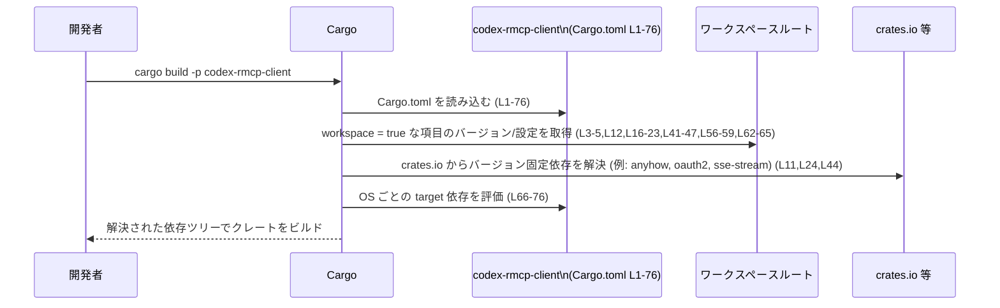

# rmcp-client/Cargo.toml 解説レポート

## 0. ざっくり一言

このファイルは、`codex-rmcp-client` クレートの **パッケージ情報と依存関係・機能（feature）構成を定義する Cargo.toml** です（`rmcp-client/Cargo.toml:L1-76`）。  
実際の API やロジックは含まれておらず、このクレートがどのライブラリ群を使って動作するかを指定しています。

---

## 1. このモジュールの役割

### 1.1 概要

- このファイルは Rust のビルドツール Cargo に対して、`codex-rmcp-client` クレートの **メタデータ（名前・版・ライセンス）** と **依存クレート構成** を提供します（`rmcp-client/Cargo.toml:L1-5,L10-59,L61-76`）。
- 依存クレートから、このクレートは **非同期ランタイム (tokio/futures)**、**HTTP クライアント/サーバ (reqwest/axum/tiny_http)**、**認証・キーチェーン (oauth2/keyring)**、**シリアライゼーション (serde/serde_json)** などを利用する前提で設計されていることが分かります。
- ただし Cargo.toml には **公開 API やコアロジックの実装は一切含まれておらず**、関数・構造体・エラーハンドリング・並行処理の具体的な設計は、このファイルからは分かりません。

### 1.2 アーキテクチャ内での位置づけ

`codex-rmcp-client` は、Codex 系のワークスペース内の 1 クレートとして、複数の内部クレートと外部クレートに依存するフロントエンド的な位置づけであると読み取れます（`rmcp-client/Cargo.toml:L10-22,L30-59`）。

主な依存のまとまりは以下です（いずれも Cargo.toml 上の事実のみ）:

- Codex 内部クレート群: `codex-client`, `codex-config`, `codex-keyring-store`, `codex-protocol`, `codex-utils-*`（`rmcp-client/Cargo.toml:L16-21,L41-43`）
- HTTP/ネットワーク関連: `axum`, `reqwest`, `tiny_http`, `sse-stream`（`rmcp-client/Cargo.toml:L12-15,L25-29,L46,L44`）
- 非同期ランタイム: `tokio`, `futures`（`rmcp-client/Cargo.toml:L22,L47-55`）
- 認証・秘密情報管理: `oauth2`, `keyring`（一般＋ OS 別）、`sha2`（`rmcp-client/Cargo.toml:L23-24,L66-76,L43`）
- シリアライゼーション/エラー/ロギング: `serde`, `serde_json`, `thiserror`, `tracing`（`rmcp-client/Cargo.toml:L41-42,L45,L56`）
- ユーティリティ: `urlencoding`, `webbrowser`, `which`（`rmcp-client/Cargo.toml:L57-59`）

依存関係の概要を Mermaid の依存グラフで示します。

```mermaid
graph TD
    A["codex-rmcp-client (このクレート)\nrmcp-client/Cargo.toml (L1-76)"]

    subgraph Codex内部
        C1["codex-client\n(L16)"]
        C2["codex-config\n(L17)"]
        C3["codex-keyring-store\n(L18)"]
        C4["codex-protocol\n(L19)"]
        C5["codex-utils-pty / home-dir\n(L20-21)"]
    end

    subgraph ネットワーク/HTTP
        N1["axum\n(L12-15)"]
        N2["reqwest\n(L25-29)"]
        N3["tiny_http\n(L46)"]
        N4["sse-stream\n(L44)"]
    end

    subgraph 非同期/並行
        A1["tokio\n(L47-55)"]
        A2["futures\n(L22)"]
    end

    subgraph 認証/セキュリティ
        S1["oauth2\n(L24)"]
        S2["keyring (+OS別)\n(L23,L66-76)"]
        S3["sha2\n(L43)"]
    end

    subgraph 補助
        H1["serde / serde_json\n(L41-42)"]
        H2["thiserror\n(L45)"]
        H3["tracing\n(L56)"]
        H4["urlencoding / webbrowser / which\n(L57-59)"]
    end

    A --> C1
    A --> C2
    A --> C3
    A --> C4
    A --> C5

    A --> N1
    A --> N2
    A --> N3
    A --> N4

    A --> A1
    A --> A2

    A --> S1
    A --> S2
    A --> S3

    A --> H1
    A --> H2
    A --> H3
    A --> H4
```



この図はあくまで **依存関係レベル** の位置づけであり、それぞれのクレート間でどのような API 呼び出しやデータフローがあるかは Cargo.toml からは分かりません。

### 1.3 設計上のポイント（Cargo レベル）

Cargo.toml から読み取れる設計上の特徴は次の通りです。

- **ワークスペース集中管理**  
  - `version.workspace = true`, `edition.workspace = true`, `license.workspace = true` により、バージョン・Edition・ライセンスはワークスペースのルートで一元管理されています（`rmcp-client/Cargo.toml:L3-5`）。
  - 多くの依存も `workspace = true` としており、依存バージョンもワークスペース側で統一されています（例: `axum`, `tokio`, `serde` など `rmcp-client/Cargo.toml:L12,L16-23,L41-43,L45-47,L56-59,L62-65`）。

- **最小限のデフォルト機能**  
  - `axum`, `futures`, `reqwest`, `rmcp` などで `default-features = false` と明示指定し、必要な feature のみを有効化しています（`rmcp-client/Cargo.toml:L12,L22,L25,L30`）。
  - これは依存グラフとバイナリサイズ・依存関係を抑制する方向の設定です。

- **非同期・マルチスレッド前提**  
  - `tokio` で `rt-multi-thread` や `sync`, `time` など多数の機能が有効にされており（`rmcp-client/Cargo.toml:L47-55`）、マルチスレッドな非同期ランタイムを前提とした設計であることが分かります。

- **OS 依存のキーチェーン連携**  
  - `keyring` は共通依存として `crypto-rust` feature を有効化した上で（`rmcp-client/Cargo.toml:L23`）、`target.'cfg(...)'.dependencies` で各 OS 向けのネイティブ連携機能を追加指定しています（Linux/macOS/Windows/BSD: `rmcp-client/Cargo.toml:L66-76`）。

- **開発用依存の分離**  
  - テストやツール用の依存（`pretty_assertions`, `serial_test`, `tempfile`, `codex-utils-cargo-bin`）は `[dev-dependencies]` に分離しています（`rmcp-client/Cargo.toml:L61-65`）。

---

## 2. 主要な機能一覧（Cargo 設定から見える機能）

このファイル自体は機能を実装していませんが、依存クレートと feature 設定から「このクレートが実現しうる機能のカテゴリ」を推測できます（いずれも **コード実装はこのチャンクには存在しない** ことに注意してください）。

- 非同期実行基盤の利用  
  - `tokio`（マルチスレッドランタイム）と `futures`（標準的 Future/Stream ユーティリティ）による非同期処理（`rmcp-client/Cargo.toml:L22,L47-55`）。

- HTTP/ネットワーク通信  
  - `reqwest` による HTTP クライアント（TLS 付き）、`axum`/`tiny_http` による HTTP サーバ関連機能の利用が可能な構成です（`rmcp-client/Cargo.toml:L12-15,L25-29,L46`）。

- RMCP プロトコル関連機能  
  - `rmcp` クレートの `client`, `server`, `transport-*-reqwest/http` など多くの feature を有効化しており、HTTP 経由や子プロセス経由のトランスポートを含む RMCP 関連の処理を行う前提の構成です（`rmcp-client/Cargo.toml:L30-40`）。
  - ただし、`codex-rmcp-client` がこれらのどの API をどのように使っているかは、このファイルからは分かりません。

- 認証およびキーチェーン利用  
  - `oauth2` と OS ネイティブな `keyring` 機能により、認可フローと資格情報の安全な保存を行う構成が示唆されます（`rmcp-client/Cargo.toml:L23-24,L66-76`）。

- データシリアライゼーション/バリデーション  
  - `serde` + `serde_json` による JSON シリアライゼーション（`rmcp-client/Cargo.toml:L41-42`）。
  - `rmcp` 側で `schemars` feature が有効になっているため、スキーマ生成やバリデーションが関わる可能性があります（`rmcp-client/Cargo.toml:L35`）。

- ログ・トレース  
  - `tracing` に `log` 機能を付けて利用できる構成になっており、構造化ロギングやトレースに対応している前提です（`rmcp-client/Cargo.toml:L56`）。

- その他ユーティリティ  
  - `urlencoding`, `webbrowser`, `which` により URL エンコード、ブラウザ起動、外部コマンド探索などの補助機能が利用できるようになっています（`rmcp-client/Cargo.toml:L57-59`）。

---

## 3. 公開 API と詳細解説

### 3.1 型・コンポーネント一覧（コンポーネントインベントリー）

Cargo.toml 自体は型や関数を定義しないため、ここでは **本クレートおよび依存クレートをコンポーネントとして一覧** します。  
役割はクレートの一般的な用途に基づく説明であり、このプロジェクト内で実際にどう使われているかはコードを見ないと断定できません。

| コンポーネント名 | 種別 | 役割 / 用途（一般的な説明） | 定義位置 |
|------------------|------|-----------------------------|----------|
| `codex-rmcp-client` | 自クレート | RMCP 関連クライアント機能を持つと推測される Codex ワークスペースの一部 | `rmcp-client/Cargo.toml:L1-5` |
| `anyhow` | 依存 | エラーを `anyhow::Error` として集約するユーティリティ | `rmcp-client/Cargo.toml:L11` |
| `axum` | 依存 | 非同期 HTTP サーバ／ルータ。`http1` と `tokio` feature のみ有効 | `rmcp-client/Cargo.toml:L12-15` |
| `codex-client` | 依存（workspace） | Codex 用のクライアントロジックと推測される内部クレート | `rmcp-client/Cargo.toml:L16` |
| `codex-config` | 依存（workspace） | 設定管理用の内部クレートと推測 | `rmcp-client/Cargo.toml:L17` |
| `codex-keyring-store` | 依存（workspace） | キーチェーン連携ラッパと推測 | `rmcp-client/Cargo.toml:L18` |
| `codex-protocol` | 依存（workspace） | Codex プロトコル定義と推測 | `rmcp-client/Cargo.toml:L19` |
| `codex-utils-pty` | 依存（workspace） | 擬似端末（PTY）関連ユーティリティと推測 | `rmcp-client/Cargo.toml:L20` |
| `codex-utils-home-dir` | 依存（workspace） | ホームディレクトリ関連ユーティリティと推測 | `rmcp-client/Cargo.toml:L21` |
| `futures` | 依存 | 非同期処理のための Future/Stream ユーティリティ (`std` feature 有効) | `rmcp-client/Cargo.toml:L22` |
| `keyring`（共通） | 依存 | OS のキーチェーンと連携するライブラリ。`crypto-rust` feature 有効 | `rmcp-client/Cargo.toml:L23` |
| `oauth2` | 依存 | OAuth2 認可フローの実装 | `rmcp-client/Cargo.toml:L24` |
| `reqwest` | 依存 | HTTP クライアント。`json`, `stream`, `rustls-tls` feature 有効、デフォルト無効 | `rmcp-client/Cargo.toml:L25-29` |
| `rmcp` | 依存（workspace） | RMCP プロトコル実装。`client`/`server`/`transport-*` など多くの feature を利用 | `rmcp-client/Cargo.toml:L30-40` |
| `serde` | 依存（workspace） | シリアライゼーション/デシリアライゼーション。`derive` 有効 | `rmcp-client/Cargo.toml:L41` |
| `serde_json` | 依存（workspace） | JSON フォーマットでのシリアライゼーション | `rmcp-client/Cargo.toml:L42` |
| `sha2` | 依存（workspace） | SHA-2 系ハッシュ関数 | `rmcp-client/Cargo.toml:L43` |
| `sse-stream` | 依存 | サーバー送信イベント（SSE）ストリーム処理 | `rmcp-client/Cargo.toml:L44` |
| `thiserror` | 依存（workspace） | エラー型を簡単に定義するための派生マクロ | `rmcp-client/Cargo.toml:L45` |
| `tiny_http` | 依存（workspace） | 軽量な HTTP サーバ | `rmcp-client/Cargo.toml:L46` |
| `tokio` | 依存（workspace） | 非同期ランタイム。`rt-multi-thread` など多数 feature 有効 | `rmcp-client/Cargo.toml:L47-55` |
| `tracing` | 依存（workspace） | 構造化ロギング/トレース。`log` 連携 feature 有効 | `rmcp-client/Cargo.toml:L56` |
| `urlencoding` | 依存（workspace） | URL エンコード/デコード | `rmcp-client/Cargo.toml:L57` |
| `webbrowser` | 依存（workspace） | デフォルトブラウザの起動 | `rmcp-client/Cargo.toml:L58` |
| `which` | 依存（workspace） | PATH 上の実行ファイル探索 | `rmcp-client/Cargo.toml:L59` |
| `codex-utils-cargo-bin` | 開発用依存 | Cargo バイナリ関連ユーティリティと推測 | `rmcp-client/Cargo.toml:L62` |
| `pretty_assertions` | 開発用依存 | テスト用に見やすい差分表示を提供 | `rmcp-client/Cargo.toml:L63` |
| `serial_test` | 開発用依存 | テストを直列実行にするための属性マクロ | `rmcp-client/Cargo.toml:L64` |
| `tempfile` | 開発用依存 | 一時ファイル/ディレクトリユーティリティ | `rmcp-client/Cargo.toml:L65` |
| `keyring` (Linux 用) | OS 依存 | Linux のネイティブ非同期永続キーチェーン機能 | `rmcp-client/Cargo.toml:L66-67` |
| `keyring` (macOS 用) | OS 依存 | macOS のネイティブキーチェーン連携 | `rmcp-client/Cargo.toml:L69-70` |
| `keyring` (Windows 用) | OS 依存 | Windows の Credential Manager 等との連携 | `rmcp-client/Cargo.toml:L72-73` |
| `keyring` (BSD 用) | OS 依存 | Secret Service ベースの同期アクセス | `rmcp-client/Cargo.toml:L75-76` |

> 注: ここに記載した用途は各クレートの一般的な役割であり、`codex-rmcp-client` が実際にどの API をどう呼び出しているかは、本チャンクからは分かりません。

### 3.2 関数詳細

このファイルは Cargo のマニフェストであり、**関数・メソッド・型定義は一切含まれていません**。  
そのため、「公開 API の関数詳細」をこのチャンクから記述することはできません。

- 公開 API やコアロジックの位置は、通常 `src/lib.rs` や `src/main.rs` に定義されますが、このレポートではそれらのファイルは提供されていないため、「不明」となります。

### 3.3 その他の関数

同様に、このファイルには補助関数・ラッパー関数も存在しません。

---

## 4. データフロー

### 4.1 ビルド時の依存解決フロー

実行時のデータフローや呼び出し関係は Cargo.toml では分からないため、ここでは **ビルド時に Cargo がこのファイルをどう解釈して依存を解決するか** のフローを示します。



この図から分かること:

- `workspace = true` が付いている依存やメタ情報は、ワークスペースルートの `Cargo.toml` から値が供給されます。
- `target.'cfg(...)'.dependencies` セクション（`rmcp-client/Cargo.toml:L66-76`）は、ビルド対象 OS に応じて `keyring` の追加 feature を選択します。
- 実際のソースコードのコンパイルや、非同期処理・エラーハンドリング・並行性制御の詳細は、ここには現れません。

### 4.2 実行時データフローについて

- 依存クレートから推測すると、HTTP リクエスト/レスポンス、RMCP メッセージ、OAuth2 トークン、キーチェーンに保存される秘密情報などがデータとして扱われると考えられますが、**本チャンクには一切の実装コードが無いため、具体的なデータ構造やフローは記述できません**。
- 実行時データフローの詳細は、`codex-rmcp-client` の Rust ソースコード側（未提供）を参照する必要があります。

---

## 5. 使い方（How to Use）

ここでは、「Cargo マニフェストとしての使い方」を説明します。

### 5.1 基本的な使用方法

`codex-rmcp-client` クレートをビルド・テストする基本的なコマンド例です。  
これらはライブラリクレート／バイナリクレートのどちらでも有効です。

```bash
# ワークスペース全体ではなく、このクレートだけをビルドする例
cargo build -p codex-rmcp-client

# このクレートに対するテストを実行する例
cargo test -p codex-rmcp-client
```

これらのコマンドは、`[package]` セクションで `name = "codex-rmcp-client"` と定義されていること（`rmcp-client/Cargo.toml:L2`）に基づきます。

### 5.2 よくある使用パターン（Cargo 設定）

Cargo.toml を編集する際に発生しやすいパターンを示します。

1. **新しい依存の追加**

   ```toml
   [dependencies]
   # 既存の依存（抜粋）
   anyhow = "1"
   # 新しい依存クレートの追加例
   # foo = "0.1"  # 新機能に必要なクレートを追加する
   ```

   - `rmcp-client/Cargo.toml:L10-59` に見られる形式に倣って、必要なクレートを追加します。
   - ワークスペース管理下に置きたい場合は、他クレートと同様に `workspace = true` を使うことがありますが、その可否はワークスペースのルート設定に依存し、このチャンクからは判断できません。

2. **feature を絞った依存**

   既存の例として `reqwest` の設定があります（`rmcp-client/Cargo.toml:L25-29`）。

   ```toml
   reqwest = { version = "0.12", default-features = false, features = [
       "json",
       "stream",
       "rustls-tls",
   ] }
   ```

   - このように `default-features = false` とし、必要な機能だけ `features` 配列で指定するパターンが採られています。

### 5.3 よくある間違い（Cargo 観点）

Cargo 設定で起こりがちな誤りと、その対比です。ここでは一般的な注意点を示します。

```toml
# 誤りの例: 同じクレートに対して矛盾する指定を複数箇所に書く

[dependencies]
keyring = { workspace = true, features = ["crypto-rust"] }

[target.'cfg(target_os = "linux")'.dependencies]
keyring = { version = "x.y.z", default-features = false } # workspace指定と競合しうる
```

```toml
# 本ファイルのような例: 同じクレートに対し、feature を追加する形で OS 別指定

[dependencies]
keyring = { workspace = true, features = ["crypto-rust"] }  # 共通機能 (L23)

[target.'cfg(target_os = "linux")'.dependencies]
keyring = { workspace = true, features = ["linux-native-async-persistent"] }  # OS固有追加 (L66-67)
```

- Rust/Cargo では **同一クレートに対する feature は「和集合」で統合** されます。
- 本ファイルのように、共通部分と OS 別の feature を追加指定する形は、矛盾を生まない運用の一例です（`rmcp-client/Cargo.toml:L23,L66-76`）。
- 一方で、異なるバージョンや `default-features` の指定を OS 別で変えてしまうと、解決が失敗したり意図しない構成になる可能性があります。

### 5.4 使用上の注意点（まとめ）

Cargo.toml を編集・利用する際の注意点を、本ファイルから読み取れる範囲で整理します。

- **ワークスペース設定との整合性**  
  - 多くの依存とメタ情報を `workspace = true` に委ねているため（`rmcp-client/Cargo.toml:L3-5,L12,L16-23,L41-47,L56-59,L62-65`）、ワークスペースルートの `Cargo.toml` との整合性が前提になっています。
  - ルート側のバージョンなどを変更すると、このクレートも影響を受けます。

- **非同期ランタイムの feature 前提**  
  - `tokio` で `rt-multi-thread` や `macros` などを有効にしているため（`rmcp-client/Cargo.toml:L47-55`）、ソースコード側では `#[tokio::main]` や `tokio::spawn` 等の利用が想定されますが、実際にどう使っているかは不明です。
  - これらの feature を不用意に削ると、既存コードがコンパイルできなくなる可能性があります。

- **OS 別依存の挙動**  
  - `keyring` の OS 別依存は Linux/macOS/Windows/FreeBSD/OpenBSD のみが明示されており（`rmcp-client/Cargo.toml:L66-76`）、それ以外の OS（例: NetBSD）では共通設定のみが有効になります。
  - 対象外 OS でネイティブなキーチェーン機能が利用できるかは、このファイルからは分かりません。

- **セキュリティ関連ライブラリのアップデート**  
  - `reqwest`（TLS）, `oauth2`, `sha2`, `keyring` などセキュリティに関わるライブラリを多く利用する構成になっています（`rmcp-client/Cargo.toml:L23-25,L30-40,L43`）。
  - 脆弱性対応のためには、ワークスペースルートでの依存バージョン管理が重要です。本ファイル単体ではバージョン情報（workspace 側の実値）は分かりません。

---

## 6. 変更の仕方（How to Modify）

このセクションでは、Cargo.toml レベルで `codex-rmcp-client` の依存構成を変更する際の観点を整理します。

### 6.1 新しい機能を追加する場合

1. **まず必要なカテゴリを特定する**  
   - 例: 新しい HTTP エンドポイントが必要 → HTTP サーバ/クライアント機能の補強。
   - 例: 新しいシリアライゼーションフォーマットが必要 → `serde` 対応クレートの追加。

2. **既存依存との重複を確認する**  
   - 似た機能のクレートが既に入っていないか、`[dependencies]` と `[dev-dependencies]` を確認します（`rmcp-client/Cargo.toml:L10-59,L61-65`）。

3. **依存の追加**  
   - 新規クレートを `[dependencies]` に追加します。
   - ワークスペース共通で使う場合は、他クレートの指定形式（`workspace = true` かどうか）を参考にし、必要に応じてワークスペースルート側も編集する必要があります（ルートファイルはこのチャンクには存在しません）。

4. **OS 依存が必要な場合**  
   - `keyring` と同様に、OS ごとに挙動が異なるクレートは `target.'cfg(...)'.dependencies` を追加することができます（`rmcp-client/Cargo.toml:L66-76`）。
   - ただし、feature の統合ルール（和集合）を踏まえ、共通設定と OS 別設定が矛盾しないようにする必要があります。

### 6.2 既存の機能（依存構成）を変更する場合

- **影響範囲の確認**  
  - 依存を削除・バージョン変更する前に、そのクレートがどのモジュール・関数から利用されているか、ソースコード側の参照を確認する必要があります。
  - Cargo.toml には利用箇所の情報は含まれていないため、「どのコードがそのクレートを使っているか」はこのチャンクからは不明です。

- **契約・前提条件**  
  - `tokio` の特定 feature（例: `rt-multi-thread`, `macros`）を無効化すると、`#[tokio::main]` や `tokio::spawn` などがコンパイルできなくなる可能性があります（`rmcp-client/Cargo.toml:L47-55`）。
  - `reqwest` の `json` や `stream` feature を削ると、JSON シリアライゼーションやストリーミング API が使えなくなるため、該当部分のコード修正が必要になります（`rmcp-client/Cargo.toml:L25-29`）。

- **テストの更新**  
  - 開発用依存（`pretty_assertions`, `serial_test`, `tempfile` など）が絡む変更の場合、テストコードの修正も必要になる可能性があります（`rmcp-client/Cargo.toml:L61-65`）。
  - ただし、どのテストがどの依存を使っているかは、このチャンクからは分かりません。

---

## 7. 関連ファイル

このチャンクには、`codex-rmcp-client` に関連する他のファイルやディレクトリ（`src/lib.rs`、`src/main.rs` など）への直接の参照は含まれていません。

| パス | 役割 / 関係 |
|------|------------|
| （不明） | 本チャンクにはソースコードファイルや他の設定ファイルのパスは登場しません。通常の Cargo プロジェクトであれば `src/` 配下にソースコードが存在しますが、このリポジトリにおける具体的な構成は Cargo.toml だけからは特定できません。 |

---

### 言語固有の安全性・エラー・並行性について

- **安全性**  
  - Rust 言語自体のメモリ安全性・所有権モデルは変わりませんが、このファイルからは unsafe コードやその有無は分かりません。
- **エラー処理**  
  - `anyhow` と `thiserror` を併用している点から、エラーを型安全かつ集約しやすい形で扱う設計が可能ですが、実際にどのように扱っているかはソースコードが無いため不明です（`rmcp-client/Cargo.toml:L11,L45`）。
- **並行性**  
  - `tokio` のマルチスレッドランタイムや `futures` に依存しているため、非同期かつ並行性を伴う処理が書かれている可能性は高いものの、どのようなタスク分割・同期（例: `Mutex`, `RwLock`）をしているかは本チャンクからは分かりません。

以上が、`rmcp-client/Cargo.toml` 単体から客観的に読み取れる情報の整理になります。実際の公開 API やコアロジック、より具体的なエラーハンドリング・並行性の設計は、ソースコードファイル側の解析が必要です。
