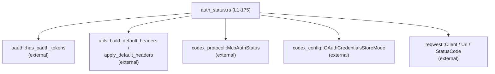

# rmcp-client/src/auth_status.rs 解説レポート

## 0. ざっくり一言

Streamable HTTP な MCP サーバーに対して、  
「現在どの認証方式が有効か / OAuth ログインをサポートしているか」を判定し、RFC 8414 に従って OAuth メタデータを検出するためのモジュールです（`auth_status.rs:L20-22, L29-57, L78-123, L155-175`）。

---

## 1. このモジュールの役割

### 1.1 概要

- このモジュールは **MCP HTTP サーバーの認証方式を判定する問題** を解決するために存在し、以下の機能を提供します。
  - Bearer トークン（環境変数・HTTP ヘッダ）・既存 OAuth トークンの有無に基づいた認証ステータス判定（`determine_streamable_http_auth_status`、`auth_status.rs:L29-57`）。
  - RFC 8414 準拠の「well-known」エンドポイント探索を用いた OAuth メタデータ検出（`discover_streamable_http_oauth_with_headers` と `discovery_paths`、`auth_status.rs:L78-123, L155-175`）。
  - サーバーが OAuth ログインを広告しているかどうかのブール判定（`supports_oauth_login`、`auth_status.rs:L60-67`）。
  - 取得した OAuth スコープ名の正規化（空・重複の除去）（`normalize_scopes`、`auth_status.rs:L135-153`）。

### 1.2 アーキテクチャ内での位置づけ

このモジュールは主に「認証状態の判定」と「OAuth 検出」を担当し、他のモジュールや外部ライブラリと連携します。

- `codex_protocol::protocol::McpAuthStatus` に対して認証状態を返却します（`auth_status.rs:L6, L29-57`）。
- OAuth 認証情報の永続化モードとして `codex_config::types::OAuthCredentialsStoreMode` を受け取ります（`auth_status.rs:L18, L36`）。
- `crate::oauth::has_oauth_tokens` を呼び出して、ローカルに保存済みの OAuth トークンの有無を確認します（`auth_status.rs:L15, L45-46`）。
- `crate::utils::{build_default_headers, apply_default_headers}` を使用して、ユーザー指定・環境変数指定の HTTP ヘッダを統合し、`reqwest::Client` に適用します（`auth_status.rs:L16-17, L41-42, L86`）。
- HTTP 通信には `reqwest` を使用し、URL パース・タイムアウト・プロキシ無効化などを行います（`auth_status.rs:L7-11, L78-86`）。

Mermaid による簡易依存関係図です（本ファイルのコードのみを対象）:



テストモジュール（`auth_status.rs:L177-347`）では `axum`, `tokio`, `serial_test` 等を用いてローカル HTTP サーバーを立て、OAuth 検出ロジックをエンドツーエンドで検証しています。

### 1.3 設計上のポイント

コードから読み取れる特徴は次の通りです。

- **多段階の認証ステータス判定**（`auth_status.rs:L29-57`）
  - 1. 明示的な Bearer トークン環境変数が指定されているか。
  - 1. HTTP ヘッダ（ユーザー指定＋環境変数展開）に `Authorization` ヘッダが含まれているか。
  - 1. ローカルの OAuth トークンストアにトークンが存在するか。
  - 1. サーバーが OAuth ログインを広告しているか（RFC 8414 による検出）。
- **エラー処理方針の違い**
  - ローカル処理（ヘッダ生成・トークンストアアクセス・URL パース・`reqwest::Client` 構築）でのエラーは `Result<_, anyhow::Error>` として呼び出し元に伝搬します（`auth_status.rs:L41, L45, L82, L86`）。
  - 一方、実際の HTTP リクエスト送信およびレスポンス JSON パースのエラーはループ内で記録されるだけで、最終的には「OAuth 未検出（`Ok(None)`）」として扱われます（`auth_status.rs:L87-121`）。  
    → 呼び出し側は「ネットワークエラー」と「サーバーが OAuth 情報を公開していない」を区別できない実装になっています。
- **状態レスな設計**
  - すべての関数は `async fn` を含め、共有ミュータブル状態を内部に持たず、入力引数と外部モジュールにのみ依存しています（`auth_status.rs:L29-76, L78-123, L135-175`）。
- **ネットワーク安全性と安定性への配慮**
  - OAuth 検出の HTTP リクエストには 5 秒のタイムアウトが設定されています（`DISCOVERY_TIMEOUT`, `auth_status.rs:L20, L85`）。
  - `Client::builder().no_proxy()` を使用し、`system-configuration` crate のバグによるパニックを避けています（コメントとコード、`auth_status.rs:L83-86`）。
- **RFC 8414 に基づくパス探索**
  - ベースパスから複数の well-known パス候補を生成し、重複を排除して順に試行します（`discovery_paths`, `auth_status.rs:L155-175`）。
- **スコープ名の正規化**
  - 前後空白の除去、空文字列の除外、重複スコープの削除を行い、`None` / `Some(Vec<String>)` で表現します（`normalize_scopes`, `auth_status.rs:L135-153`）。

---

## 2. 主要な機能一覧

このモジュールが提供する主な機能です。

- 認証ステータス判定: `determine_streamable_http_auth_status`  
  - Bearer トークン・OAuth トークン・サーバーの OAuth サポート有無に基づき `McpAuthStatus` を返します（`auth_status.rs:L29-57`）。
- OAuth ログインサポート有無の判定: `supports_oauth_login`  
  - 指定 URL が OAuth ログインを広告しているかを `bool` で返します（`auth_status.rs:L60-67`）。
- OAuth メタデータ検出: `discover_streamable_http_oauth` / `discover_streamable_http_oauth_with_headers`  
  - RFC 8414 の well-known エンドポイントから OAuth メタデータを取得し、`StreamableHttpOAuthDiscovery` として返します（`auth_status.rs:L69-76, L78-123`）。
- スコープ名の正規化: `normalize_scopes`  
  - レスポンスの `scopes_supported` をきれいに整形して `Option<Vec<String>>` として返します（`auth_status.rs:L135-153`）。
- well-known パス候補生成: `discovery_paths`  
  - ベースパスから複数の OAuth discovery パス候補を生成します（`auth_status.rs:L155-175`）。

---

## 3. 公開 API と詳細解説

### 3.0 コンポーネント一覧（インベントリー）

#### 本番コードのコンポーネント

| 名前 | 種別 | 公開 | 役割 / 用途 | 定義位置 |
|------|------|------|-------------|----------|
| `DISCOVERY_TIMEOUT` | `Duration` 定数 | 非公開 | OAuth discovery HTTP リクエストのタイムアウト（5 秒）を定義 | `auth_status.rs:L20` |
| `OAUTH_DISCOVERY_HEADER` | `&'static str` 定数 | 非公開 | OAuth discovery 用のカスタムヘッダ名 `"MCP-Protocol-Version"` | `auth_status.rs:L21` |
| `OAUTH_DISCOVERY_VERSION` | `&'static str` 定数 | 非公開 | 上記ヘッダに入れるバージョン文字列 `"2024-11-05"` | `auth_status.rs:L22` |
| `StreamableHttpOAuthDiscovery` | 構造体 | 公開 | 検出した OAuth メタデータの一部（現状はスコープ一覧のみ）を保持 | `auth_status.rs:L24-27` |
| `determine_streamable_http_auth_status` | `async fn` | 公開 | Bearer トークン／OAuth トークン／サーバー機能を元に `McpAuthStatus` を決定 | `auth_status.rs:L29-57` |
| `supports_oauth_login` | `async fn` | 公開 | 指定 URL が OAuth ログインを広告しているかを `bool` で返す | `auth_status.rs:L60-67` |
| `discover_streamable_http_oauth` | `async fn` | 公開 | HTTP ヘッダ指定付きで OAuth discovery を行い、メタデータを返す | `auth_status.rs:L69-76` |
| `discover_streamable_http_oauth_with_headers` | `async fn` | 非公開 | 実際の HTTP リクエストを発行し OAuth メタデータを取得するコア処理 | `auth_status.rs:L78-123` |
| `OAuthDiscoveryMetadata` | 構造体 | 非公開 | JSON レスポンスをデシリアライズするための内部用メタデータ型 | `auth_status.rs:L125-133` |
| `normalize_scopes` | `fn` | 非公開 | `scopes_supported` フィールドを正規化するユーティリティ | `auth_status.rs:L135-153` |
| `discovery_paths` | `fn` | 非公開 | RFC 8414 の well-known パス候補を生成する | `auth_status.rs:L155-175` |

#### テスト用コンポーネント

| 名前 | 種別 | 公開（モジュール内） | 役割 / 用途 | 定義位置 |
|------|------|----------------------|-------------|----------|
| `tests` | `mod` | 非公開（`cfg(test)`） | OAuth discovery / 認証ステータス判定の統合テスト群 | `auth_status.rs:L177-347` |
| `TestServer` | 構造体 | 非公開 | ローカル `axum` サーバーを起動し、テスト用の discovery エンドポイントを提供 | `auth_status.rs:L189-192` |
| `EnvVarGuard` | 構造体 | 非公開 | 環境変数の一時変更とロールバックを管理 | `auth_status.rs:L224-227` |
| 各種 `#[tokio::test]` 関数 | 非公開 | 非同期テスト。ヘッダ／環境変数／スコープ正規化／`supports_oauth_login` 動作を検証 | `auth_status.rs:L256-346` |

### 3.1 型一覧（構造体・列挙体など）

| 名前 | 種別 | 役割 / 用途 | 定義位置 |
|------|------|-------------|----------|
| `StreamableHttpOAuthDiscovery` | 構造体（`pub`） | サーバーが広告する OAuth 機能のうち、サポートされるスコープ一覧を保持します。`scopes_supported` は正規化済みの `Option<Vec<String>>` です。 | `auth_status.rs:L24-27` |
| `OAuthDiscoveryMetadata` | 構造体 | OAuth discovery の JSON レスポンスを受け取るための内部型です。`authorization_endpoint` / `token_endpoint` / `scopes_supported` の 3 フィールドを `Option` として保持します。 | `auth_status.rs:L125-133` |

※ 列挙体（enum）はこのファイル内には定義されていません。

### 3.2 関数詳細（主要 6 件）

#### `determine_streamable_http_auth_status(...) -> Result<McpAuthStatus>`

```rust
pub async fn determine_streamable_http_auth_status(
    server_name: &str,
    url: &str,
    bearer_token_env_var: Option<&str>,
    http_headers: Option<HashMap<String, String>>,
    env_http_headers: Option<HashMap<String, String>>,
    store_mode: OAuthCredentialsStoreMode,
) -> Result<McpAuthStatus>  // auth_status.rs:L29-37
```

**概要**

- Streamable HTTP MCP サーバーに対して、現在利用可能な認証方式を判定し、`McpAuthStatus` を返します（`auth_status.rs:L29-57`）。
- 優先順位は「明示的な Bearer トークン > ローカル OAuth トークン > サーバーが OAuth を広告しているか > 未サポート」となっています。

**引数**

| 引数名 | 型 | 説明 |
|--------|----|------|
| `server_name` | `&str` | サーバー識別子。`has_oauth_tokens` に渡され、トークンストア内のキーとして使われます（`auth_status.rs:L31, L45`）。 |
| `url` | `&str` | Streamable HTTP MCP サーバーのベース URL。OAuth discovery でも使用されます（`auth_status.rs:L32, L48`）。 |
| `bearer_token_env_var` | `Option<&str>` | Bearer トークン環境変数が存在するかを示すフラグ的引数です。`Some(_)` であれば即 `BearerToken` と判定されます（`auth_status.rs:L33, L38-40`）。値の中身はここでは参照されません。 |
| `http_headers` | `Option<HashMap<String, String>>` | 呼び出し元が指定した HTTP ヘッダ（キー・値は文字列）。`build_default_headers` に渡されます（`auth_status.rs:L34, L41`）。 |
| `env_http_headers` | `Option<HashMap<String, String>>` | 値に環境変数名を含むヘッダ設定。`build_default_headers` が実際の値を解決すると推測されますが、詳細はこのファイルからは分かりません（`auth_status.rs:L35, L41`）。 |
| `store_mode` | `OAuthCredentialsStoreMode` | OAuth 認証情報ストアの保存モード。`has_oauth_tokens` に渡されます（`auth_status.rs:L36, L45`）。 |

**戻り値**

- `Result<McpAuthStatus>`（`auth_status.rs:L37`）
  - `Ok(McpAuthStatus::BearerToken | OAuth | NotLoggedIn | Unsupported)` のいずれか。
  - `Err(anyhow::Error)` はヘッダ生成やトークンストアアクセス等のローカル処理で発生したエラーを表します。

**内部処理の流れ（アルゴリズム）**

1. `bearer_token_env_var.is_some()` なら、即座に `McpAuthStatus::BearerToken` を返す（`auth_status.rs:L38-40`）。
2. `build_default_headers(http_headers, env_http_headers)?` を呼び出し、ヘッダを統合する（`auth_status.rs:L41`）。
3. 統合ヘッダに `AUTHORIZATION` ヘッダが含まれていれば `McpAuthStatus::BearerToken` を返す（`auth_status.rs:L42-43`）。
4. `has_oauth_tokens(server_name, url, store_mode)?` が `true` なら `McpAuthStatus::OAuth` を返す（`auth_status.rs:L45-46`）。
5. `discover_streamable_http_oauth_with_headers(url, &default_headers).await` を呼び出し、その結果に応じて:
   - `Ok(Some(_))` → `McpAuthStatus::NotLoggedIn`（サーバーは OAuth をサポートしているが、ローカルにトークンはない） （`auth_status.rs:L48-50`）。
   - `Ok(None)` → `McpAuthStatus::Unsupported`（サーバーが OAuth を広告していない） （`auth_status.rs:L49-50`）。
   - `Err(error)` → `debug!` でログを出力し、`McpAuthStatus::Unsupported` とみなす（`auth_status.rs:L51-56`）。

**Examples（使用例）**

典型的な使用例です。`tokio` ランタイムで呼び出すことを想定しています。

```rust
use std::collections::HashMap;
use codex_config::types::OAuthCredentialsStoreMode;
use codex_protocol::protocol::McpAuthStatus;
use rmcp_client::auth_status::determine_streamable_http_auth_status;

#[tokio::main]
async fn main() -> anyhow::Result<()> {
    // 環境変数による Bearer トークンは使わない
    let bearer_token_env_var = None;

    // 明示ヘッダ: Authorization ヘッダは指定しない例
    let http_headers: Option<HashMap<String, String>> = None;

    // 環境変数経由のヘッダ指定も無し
    let env_http_headers: Option<HashMap<String, String>> = None;

    let status = determine_streamable_http_auth_status(
        "my-mcp-server",
        "https://example.com/mcp",
        bearer_token_env_var,
        http_headers,
        env_http_headers,
        OAuthCredentialsStoreMode::Keyring,
    )
    .await?;

    println!("Auth status: {:?}", status); // 例: NotLoggedIn / Unsupported など

    Ok(())
}
```

**Errors / Panics**

- `Err` になり得るケース（`?` を用いてそのまま上位に伝搬）:
  - `build_default_headers` がエラーを返した場合（ヘッダの形式・環境変数展開に起因すると推測されますが、詳細は別モジュールの実装次第です、`auth_status.rs:L41`）。
  - `has_oauth_tokens` がエラーを返した場合（トークンストア操作に関連、`auth_status.rs:L45`）。
- OAuth discovery の HTTP リクエストや JSON パースで発生したエラーは、`discover_streamable_http_oauth_with_headers` 内で握りつぶされ、「Unsupported」として扱われます（`auth_status.rs:L51-56, L87-121`）。
- 本関数自体は `panic!` を呼び出しておらず、パニックは想定されません。

**Edge cases（エッジケース）**

- `bearer_token_env_var` が `Some("")` のような「空文字列」でも `Some` である限り `BearerToken` と判定されます。値の内容は検証していません（`auth_status.rs:L38-40`）。
- `http_headers` や `env_http_headers` に `Authorization` ヘッダが含まれていれば、値の内容に関係なく `BearerToken` と判定されます（`auth_status.rs:L42-43`）。
- `url` が不正な場合（`Url::parse` に失敗）でも、エラーは `discover_streamable_http_oauth_with_headers` 内で捕捉され、「Unsupported」として扱われます（`auth_status.rs:L48-56, L82`）。
- ネットワーク障害や JSON 解析エラーが起きた場合も、`debug!` ログを出すだけで `Unsupported` となるため、呼び出し側からは「本当に未対応なのか / 一時的な失敗なのか」を区別できません（`auth_status.rs:L51-56, L87-121`）。

**使用上の注意点**

- `async fn` なので、`tokio` や `async-std` などの非同期ランタイム上で `.await` する必要があります。
- `McpAuthStatus::Unsupported` は「サーバーが未対応」だけでなく「ネットワークエラーで検出できなかった」場合も含み得ることに注意が必要です。
- 認証方式の判定は「存在チェック」のみであり、トークンの有効性（有効期限切れなど）はこの関数では検証しません。

---

#### `supports_oauth_login(url: &str) -> Result<bool>`

```rust
pub async fn supports_oauth_login(url: &str) -> Result<bool>  // auth_status.rs:L60-67
```

**概要**

- 指定された URL のサーバーが、OAuth ログインを RFC 8414 準拠の well-known エンドポイントで広告しているかどうかを、`bool` で返します（`auth_status.rs:L60-67`）。
- 内部的には `discover_streamable_http_oauth` を呼び出し、その戻り値が `Some(_)` かどうかを確認するだけです。

**引数**

| 引数名 | 型 | 説明 |
|--------|----|------|
| `url` | `&str` | Streamable HTTP MCP サーバーのベース URL。OAuth discovery のベースとして使用されます（`auth_status.rs:L61-63`）。 |

**戻り値**

- `Result<bool>`:
  - `Ok(true)` : OAuth メタデータが取得でき、`authorization_endpoint`/`token_endpoint` が両方存在したケース（`auth_status.rs:L69-76, L113-116`）。
  - `Ok(false)` : OAuth メタデータを検出できなかった（またはネットワークエラー等で検出に失敗した）ケース。
  - `Err(anyhow::Error)` : URL パースやクライアント構築などローカルな初期化フェーズでのエラー。

**内部処理の流れ**

1. `discover_streamable_http_oauth(url, None, None).await?` を呼び出す（`auth_status.rs:L61-65, L69-76`）。
2. 戻り値が `Some(_)` なら `true`、`None` なら `false` を返す（`auth_status.rs:L65-66`）。

**Examples（使用例）**

```rust
use rmcp_client::auth_status::supports_oauth_login;

#[tokio::main]
async fn main() -> anyhow::Result<()> {
    let url = "https://example.com/mcp";

    let supports = supports_oauth_login(url).await?;

    if supports {
        println!("{url} supports OAuth login");
    } else {
        println!("{url} does NOT advertise OAuth login");
    }

    Ok(())
}
```

**Errors / Panics**

- `Err` になり得るのは `discover_streamable_http_oauth` が `Err` を返した場合です（`auth_status.rs:L61-66`）。
  - 具体的には URL パース失敗（`Url::parse`）、`reqwest::Client` 構築失敗等が該当します（`auth_status.rs:L82, L86`）。
  - 個々の HTTP リクエスト送信エラーや JSON パースエラーは `discover_streamable_http_oauth_with_headers` 内で握りつぶされるため、この関数では `Err` にはなりません（`auth_status.rs:L87-121`）。
- パニックは使用していません。

**Edge cases**

- `url` が不正（例えば `"not-a-url"`）でも、`discover_streamable_http_oauth` 内の `Url::parse` でエラーになり、この関数は `Err` を返します（`auth_status.rs:L82`）。
- ネットワーク不可やサーバーが JSON 以外を返すなどのケースでは、`Ok(false)` を返しうるため、「本当にサーバーが未対応か」は区別できません。

**使用上の注意点**

- OAuth 対応の有無を厳密に検証したい場合、「`Ok(false)` でも実は一時的な失敗である可能性」がある点に留意する必要があります。
- 本関数はヘッダを一切追加せずに discovery を行うため、サーバーによってはヘッダが無いと OAuth メタデータを返さない実装だと誤検出する可能性があります（その場合、`discover_streamable_http_oauth` を直接使い、ヘッダを指定することができます）。

---

#### `discover_streamable_http_oauth(...) -> Result<Option<StreamableHttpOAuthDiscovery>>`

```rust
pub async fn discover_streamable_http_oauth(
    url: &str,
    http_headers: Option<HashMap<String, String>>,
    env_http_headers: Option<HashMap<String, String>>,
) -> Result<Option<StreamableHttpOAuthDiscovery>>  // auth_status.rs:L69-73
```

**概要**

- 指定 URL を基に OAuth discovery を行い、サーバーが OAuth ログインを広告していれば `StreamableHttpOAuthDiscovery` を返します（`auth_status.rs:L69-76`）。
- HTTP ヘッダと環境変数ベースのヘッダ設定を統合して使用できます。

**引数**

| 引数名 | 型 | 説明 |
|--------|----|------|
| `url` | `&str` | MCP サーバーのベース URL（`auth_status.rs:L70`）。 |
| `http_headers` | `Option<HashMap<String, String>>` | 追加 HTTP ヘッダ（キー／値は直接指定、`auth_status.rs:L71`）。 |
| `env_http_headers` | `Option<HashMap<String, String>>` | 値に環境変数名を含むヘッダ設定（`auth_status.rs:L72`）。 |

**戻り値**

- `Result<Option<StreamableHttpOAuthDiscovery>>`:
  - `Ok(Some(discovery))` : OAuth メタデータが検出できた場合。
  - `Ok(None)` : OAuth メタデータを検出できなかった場合（ネットワーク障害なども含む可能性があります）。
  - `Err(anyhow::Error)` : URL パースやヘッダ統合 / クライアント構築失敗時など。

**内部処理の流れ**

1. `build_default_headers(http_headers, env_http_headers)?` を呼び出し、統合ヘッダを生成（`auth_status.rs:L74`）。
2. `discover_streamable_http_oauth_with_headers(url, &default_headers).await` を呼び出し、その結果をそのまま返す（`auth_status.rs:L75`）。

**Examples（使用例）**

環境変数名を含むヘッダ設定を用いる例です（テストコードから推測、`auth_status.rs:L275-287`）。

```rust
use std::collections::HashMap;
use rmcp_client::auth_status::discover_streamable_http_oauth;

// 例: CODEX_MCP_TOKEN 環境変数にトークンが入っているとする
#[tokio::main]
async fn main() -> anyhow::Result<()> {
    let url = "https://example.com/mcp";

    // 環境変数名を値として指定し、utils 側で展開される想定
    let env_headers = HashMap::from([(
        "Authorization".to_string(),
        "CODEX_MCP_TOKEN".to_string(),
    )]);

    let discovery = discover_streamable_http_oauth(
        url,
        None,                  // 直接指定ヘッダなし
        Some(env_headers),     // 環境変数経由ヘッダあり
    )
    .await?;

    if let Some(info) = discovery {
        println!("Scopes supported: {:?}", info.scopes_supported);
    }

    Ok(())
}
```

**Errors / Panics**

- `build_default_headers` がエラーを返した場合に `Err` となります（`auth_status.rs:L74`）。
- URL パースや `reqwest::Client` 構築の失敗は、内部の `discover_streamable_http_oauth_with_headers` から `Err` として伝搬します（`auth_status.rs:L82, L86`）。
- それ以外のネットワーク／JSON エラーは `Ok(None)` に吸収されます（`auth_status.rs:L87-121`）。
- パニックはありません。

**Edge cases**

- `http_headers` と `env_http_headers` の両方で同じヘッダキーが指定されたときの優先順位は、このファイルからは分かりません（`build_default_headers` の実装次第、`auth_status.rs:L74`）。
- サーバーが `authorization_endpoint` / `token_endpoint` の片方だけを返す場合は OAuth メタデータとして扱われず、`Ok(None)` になります（`auth_status.rs:L113-117`）。

**使用上の注意点**

- `Ok(None)` は「本当に OAuth メタデータが存在しない」を必ずしも意味しません。HTTP リクエストエラー等も含みます。
- サーバー側が特定のヘッダ（例えばバージョンヘッダ）を要求する場合、`http_headers` / `env_http_headers` で適切に指定する必要があります。

---

#### `discover_streamable_http_oauth_with_headers(...) -> Result<Option<StreamableHttpOAuthDiscovery>>`

```rust
async fn discover_streamable_http_oauth_with_headers(
    url: &str,
    default_headers: &HeaderMap,
) -> Result<Option<StreamableHttpOAuthDiscovery>>  // auth_status.rs:L78-81
```

**概要**

- OAuth discovery のコア処理です。指定 URL とヘッダを使って複数の well-known パスを順に問い合わせ、OAuth メタデータ（認可エンドポイント・トークンエンドポイント・スコープ一覧）を取得します（`auth_status.rs:L78-123`）。

**引数**

| 引数名 | 型 | 説明 |
|--------|----|------|
| `url` | `&str` | ベース URL。`Url::parse` でパースされ、パス部分のみ `discovery_paths` の入力に使われます（`auth_status.rs:L82, L88`）。 |
| `default_headers` | `&HeaderMap` | 既に構築済みの HTTP ヘッダセット。`apply_default_headers` を通じて `reqwest::Client` に適用されます（`auth_status.rs:L80, L85-86`）。 |

**戻り値**

- `Result<Option<StreamableHttpOAuthDiscovery>>`（意味は前節と同じ）。

**内部処理の流れ**

1. `Url::parse(url)?` で URL をパースし、`base_url` を得る（`auth_status.rs:L82`）。
2. `Client::builder().timeout(DISCOVERY_TIMEOUT).no_proxy()` でタイムアウトと no_proxy を設定し、`apply_default_headers` でヘッダを適用したうえで `client` を構築（`auth_status.rs:L83-86`）。
3. `discovery_paths(base_url.path())` によってパス候補一覧を生成（`auth_status.rs:L88, L155-175`）。
4. 各 `candidate_path` についてループ:
   1. `base_url` をクローンし、`set_path(&candidate_path)` でパスを書き換え（`auth_status.rs:L88-90`）。
   2. `client.get(discovery_url)` に対し、`OAUTH_DISCOVERY_HEADER` / `OAUTH_DISCOVERY_VERSION` を追加してリクエスト送信（`auth_status.rs:L91-95`）。
   3. 送信エラーなら `last_error = Some(err.into())` として格納し、次の候補へ（`auth_status.rs:L97-101`）。
   4. ステータスコードが 200 OK 以外ならスキップ（`auth_status.rs:L103-104`）。
   5. ボディを `OAuthDiscoveryMetadata` に JSON デシリアライズ。エラーなら `last_error` に格納してスキップ（`auth_status.rs:L106-112`）。
   6. `authorization_endpoint` / `token_endpoint` の両方が `Some` であれば、`StreamableHttpOAuthDiscovery { scopes_supported: normalize_scopes(...) }` を構築して `Ok(Some(...))` を返す（`auth_status.rs:L113-116`）。
5. すべての候補で成功しなかった場合:
   - `last_error` があれば `debug!` でログ出力（`auth_status.rs:L119-120`）。
   - `Ok(None)` を返す（`auth_status.rs:L122`）。

**Errors / Panics**

- `Err` になり得るケース:
  - `Url::parse(url)` に失敗（`auth_status.rs:L82`）。
  - `apply_default_headers(...).build()` に失敗（`auth_status.rs:L86`）。
- HTTP 送信エラー・JSON デシリアライズエラーは `last_error` に記録され、最終的に `Ok(None)` として返されます（`auth_status.rs:L87-121`）。
- パニックは使用していません。

**Edge cases**

- どの候補パスからも 200 OK が返らない場合、`Ok(None)` となります。
- 最後に成功したリクエスト・パースがないまま `last_error` だけが蓄積された場合、ログには最後のエラーだけが出力されます（`auth_status.rs:L119-120`）。
- `scopes_supported` が `None` だったり、空・空白だけのスコープしか含まない場合でも、`authorization_endpoint` と `token_endpoint` が揃っていれば OAuth サポートありとみなされます（`auth_status.rs:L113-116, L135-153`）。

**使用上の注意点**

- `no_proxy()` を使っているため、システムプロキシ設定を経由した discovery は行われません（`auth_status.rs:L83-86`）。プロキシ環境下での動作に影響する可能性があります。
- `debug!` ログは `tracing` に依存するため、適切なサブスクライバ設定がないとログが出力されません（`auth_status.rs:L13, L119-120`）。

---

#### `normalize_scopes(scopes_supported: Option<Vec<String>>) -> Option<Vec<String>>`

```rust
fn normalize_scopes(scopes_supported: Option<Vec<String>>) -> Option<Vec<String>>  // auth_status.rs:L135-135
```

**概要**

- OAuth discovery メタデータの `scopes_supported` フィールドを整形し、
  - `None` / 空・空白のみ → `None`
  - 非空のユニークなスコープ一覧 → `Some(Vec<String>)`  
  として返します（`auth_status.rs:L135-153`）。

**引数**

| 引数名 | 型 | 説明 |
|--------|----|------|
| `scopes_supported` | `Option<Vec<String>>` | OAuth メタデータに含まれるスコープ一覧（`auth_status.rs:L135-136`）。 |

**戻り値**

- `Option<Vec<String>>`:
  - 引数が `None`、または有効なスコープが一つもなければ `None`（`auth_status.rs:L135-136, L148-150`）。
  - 有効なスコープがあれば、順序を保ったユニークなリストで `Some`（`auth_status.rs:L137-147, L151`）。

**内部処理の流れ**

1. `let scopes_supported = scopes_supported?;` で `Option` を早期リターン処理（`auth_status.rs:L136`）。
2. 新しい `Vec<String>` を `normalized` として用意（`auth_status.rs:L137`）。
3. 入力ベクタの各 `scope` について:
   - `scope.trim()` で前後の空白を除去（`auth_status.rs:L139`）。
   - 空文字ならスキップ（`auth_status.rs:L140-141`）。
   - `to_string()` して所有権を持つ `String` に変換（`auth_status.rs:L143`）。
   - `normalized` に同じ値が既に含まれていない場合にのみ追加（`auth_status.rs:L144-146`）。
4. `normalized` が空なら `None`、そうでなければ `Some(normalized)` を返す（`auth_status.rs:L148-152`）。

**Examples（使用例）**

テストコード（`auth_status.rs:L294-314, L316-332`）の動作に対応した例です。

```rust
fn main() {
    // 重複と空白を含む例
    let raw = Some(vec![
        "profile".to_string(),
        " email ".to_string(),
        "profile".to_string(),
        "".to_string(),
        "   ".to_string(),
    ]);

    let normalized = normalize_scopes(raw);

    assert_eq!(
        normalized,
        Some(vec!["profile".to_string(), "email".to_string()])
    );
}
```

**Errors / Panics**

- エラーは発生せず、`panic!` も使用していません。
- メモリアロケーションに失敗した場合のみランタイムエラーになる可能性がありますが、これは一般的なケースです。

**Edge cases**

- `None` → `None`（入力が存在しないケース、`auth_status.rs:L135-136`）。
- `Some(vec!["", "   "])` のように有効スコープが一つもない → `None`（`auth_status.rs:L139-141, L148-150`）。
- 同じスコープが複数回出てきた場合、最初の一回のみ残る（`auth_status.rs:L144-146`）。

**使用上の注意点**

- 重複チェックは `Vec::contains` による線形探索のため、スコープ数が非常に多い場合は O(N^2) のコストになります。ただし、通常のスコープ数では問題になりにくい構造です。

---

#### `discovery_paths(base_path: &str) -> Vec<String>`

```rust
fn discovery_paths(base_path: &str) -> Vec<String>  // auth_status.rs:L159-159
```

**概要**

- RFC 8414 section 3.1 に基づき、与えられたベースパスから OAuth discovery の well-known パス候補を列挙します（`auth_status.rs:L155-175`）。
- この関数によって複数パターンのパスが試行されます。

**引数**

| 引数名 | 型 | 説明 |
|--------|----|------|
| `base_path` | `&str` | ベース URL のパス部分（例: `/mcp`）。`Url::path()` の戻り値がそのまま渡されています（`auth_status.rs:L88, L159-160`）。 |

**戻り値**

- `Vec<String>`:
  - 返されるパスの例（`base_path == "/mcp"` の場合、`auth_status.rs:L161-173`）:
    - `"/.well-known/oauth-authorization-server/mcp"`
    - `"/mcp/.well-known/oauth-authorization-server"`
    - `"/.well-known/oauth-authorization-server"`

**内部処理の流れ**

1. `trim_start_matches('/')` と `trim_end_matches('/')` で両端の `/` を除去し、`trimmed` を得る（`auth_status.rs:L160`）。
2. `canonical` として `"/.well-known/oauth-authorization-server"` を文字列として定義（`auth_status.rs:L161`）。
3. `trimmed` が空なら `vec![canonical]` を即返却（`auth_status.rs:L162-163`）。
4. そうでなければ空の `candidates` ベクタを用意し、重複チェック付きクロージャ `push_unique` を定義（`auth_status.rs:L165-170`）。
5. 次の 3 つのパスをこの順に `push_unique`:
   - `"{canonical}/{trimmed}"`（`auth_status.rs:L171`）
   - `"/{trimmed}/.well-known/oauth-authorization-server"`（`auth_status.rs:L172`）
   - `canonical`（`auth_status.rs:L173`）。
6. `candidates` を返す（`auth_status.rs:L174`）。

**Examples（使用例）**

```rust
fn main() {
    assert_eq!(
        discovery_paths("/"),
        vec!["/.well-known/oauth-authorization-server".to_string()]
    );

    assert_eq!(
        discovery_paths("/mcp"),
        vec![
            "/.well-known/oauth-authorization-server/mcp".to_string(),
            "/mcp/.well-known/oauth-authorization-server".to_string(),
            "/.well-known/oauth-authorization-server".to_string(),
        ]
    );
}
```

**Errors / Panics**

- エラーやパニックは発生しません（単純な文字列操作のみ）。

**Edge cases**

- `base_path` が空文字 `""` または `/` のみの場合、候補は canonical のみ（`auth_status.rs:L160-163`）。
- すでに `.well-known` を含むような特殊なパスでも、そのまま `trimmed` として扱われます。特別扱いはありません。

**使用上の注意点**

- 返されるパスの順序は、実際の discovery 試行順序に直結します（`auth_status.rs:L88-89, L171-173`）。  
  どのパスを優先するかを変えたい場合、この関数を編集する必要があります。

---

### 3.3 その他の関数

補助的な関数・テスト用関数の一覧です。

| 関数名 | 役割（1 行） | 定義位置 |
|--------|--------------|----------|
| `supports_oauth_login` | `discover_streamable_http_oauth` のラッパーとして、OAuth サポート有無を `bool` で返す | `auth_status.rs:L60-67` |
| `spawn_oauth_discovery_server` | テスト用: `axum` を使ってローカル OAuth discovery サーバーを起動する | `auth_status.rs:L200-222` |
| `EnvVarGuard::set` | テスト用: 環境変数をセットし、元の値を保持する | `auth_status.rs:L229-239` |
| `Drop for TestServer` | テスト用: テスト終了時にバックグラウンドサーバーを `abort` する | `auth_status.rs:L194-197` |
| `Drop for EnvVarGuard` | テスト用: 環境変数を元の状態に戻す | `auth_status.rs:L242-253` |
| 各種 `#[tokio::test]` | ヘッダ・環境変数・スコープ正規化・OAuth サポート判定の確認 | `auth_status.rs:L256-346` |

---

## 4. データフロー

ここでは、`determine_streamable_http_auth_status` を呼び出した際の代表的なデータフローを示します。

1. 呼び出し元が `server_name`, `url`, ヘッダ情報、`store_mode` を渡して `determine_streamable_http_auth_status` を呼び出します（`auth_status.rs:L29-37`）。
2. 関数内で Bearer トークンの有無と OAuth トークンの有無をチェックします（`auth_status.rs:L38-47`）。
3. まだ認証方式が決まらない場合、`discover_streamable_http_oauth_with_headers` を通じてサーバーの OAuth メタデータを取得しようとします（`auth_status.rs:L48-57, L78-123`）。
4. `discover_streamable_http_oauth_with_headers` は `discovery_paths` で生成した複数のパスに対して HTTP リクエストを送り、成功したレスポンスを `OAuthDiscoveryMetadata` → `StreamableHttpOAuthDiscovery` に変換します（`auth_status.rs:L88-116, L125-133, L135-153, L155-175`）。

Mermaid のシーケンス図（本ファイルの範囲のみを対象）:

```mermaid
sequenceDiagram
    participant Caller as "Caller"
    participant Auth as "determine_streamable_http_auth_status\n(L29-57)"
    participant Utils as "build_default_headers / has_oauth_tokens\n(external)"
    participant Disc as "discover_streamable_http_oauth_with_headers\n(L78-123)"
    participant Paths as "discovery_paths\n(L155-175)"
    participant HTTP as "reqwest::Client\n(external)"
    participant Server as "MCP server"

    Caller->>Auth: call(..., server_name, url, headers, store_mode)
    Auth->>Auth: check bearer_token_env_var (L38-40)
    Auth->>Utils: build_default_headers(http_headers, env_http_headers) (L41)
    Utils-->>Auth: HeaderMap
    Auth->>Auth: check Authorization header (L42-43)
    Auth->>Utils: has_oauth_tokens(server_name, url, store_mode) (L45-46)
    Utils-->>Auth: bool
    alt no tokens & no bearer
        Auth->>Disc: discover_streamable_http_oauth_with_headers(url, &headers) (L48)
        Disc->>HTTP: Client::builder().timeout(...).no_proxy() (L83-86)
        Disc->>Paths: discovery_paths(base_url.path()) (L88, L155-175)
        Paths-->>Disc: Vec<candidate_path>
        loop for each candidate_path
            Disc->>HTTP: GET discovery_url with header\nMCP-Protocol-Version (L91-95)
            HTTP-->>Disc: Response or Error
            alt Response 200 OK + valid JSON
                Disc->>Disc: normalize_scopes(scopes_supported) (L113-116, L135-153)
                Disc-->>Auth: Ok(Some(StreamableHttpOAuthDiscovery))
                break
            else other status / error
                Disc->>Disc: record last_error and continue (L97-112)
            end
        end
        Disc-->>Auth: Ok(Some(...)) or Ok(None)/Err(...)
        Auth->>Auth: map result to McpAuthStatus (L48-56)
    end
    Auth-->>Caller: Result<McpAuthStatus>
```

このように、認証ステータス判定はローカル状態とネットワーク上のメタデータを組み合わせた多段階フローになっています。

---

## 5. 使い方（How to Use）

### 5.1 基本的な使用方法

もっとも典型的な利用パターンは、MCP クライアント側でサーバーへの接続前に認証状態を判定することです。

```rust
use std::collections::HashMap;
use codex_config::types::OAuthCredentialsStoreMode;
use codex_protocol::protocol::McpAuthStatus;
use rmcp_client::auth_status::{
    determine_streamable_http_auth_status,
    supports_oauth_login,
};

#[tokio::main]
async fn main() -> anyhow::Result<()> {
    let server_name = "my-mcp-server";
    let url = "https://example.com/mcp";

    // 直接指定する HTTP ヘッダ（ここでは空）
    let http_headers: Option<HashMap<String, String>> = None;

    // 環境変数経由のヘッダ（ここでは空）
    let env_http_headers: Option<HashMap<String, String>> = None;

    // 環境変数に Bearer トークンがあるなら Some(...) を渡す設計
    let bearer_token_env_var: Option<&str> = std::env::var("MCP_BEARER_TOKEN")
        .ok()
        .as_deref()
        .map(|_| "MCP_BEARER_TOKEN"); // 値自体ではなく「存在フラグ」として使う

    let status = determine_streamable_http_auth_status(
        server_name,
        url,
        bearer_token_env_var,
        http_headers,
        env_http_headers,
        OAuthCredentialsStoreMode::Keyring,
    )
    .await?;

    println!("Auth status: {:?}", status);

    // 追加でサーバーが OAuth ログインを広告しているかの確認
    let supports_oauth = supports_oauth_login(url).await?;
    println!("Supports OAuth login: {}", supports_oauth);

    Ok(())
}
```

### 5.2 よくある使用パターン

1. **Bearer トークンヘッダを使う場合**

   - 事前に HTTP ヘッダに `Authorization: Bearer ...` をセットし、そのまま `determine_streamable_http_auth_status` に渡すと、即 `BearerToken` と判定されます（`auth_status.rs:L41-43, L256-272`）。

   ```rust
   let mut headers = HashMap::new();
   headers.insert(
       "Authorization".to_string(),
       "Bearer my-token".to_string(),
   );

   let status = determine_streamable_http_auth_status(
       "server",
       "https://example.com/mcp",
       None,
       Some(headers),
       None,
       OAuthCredentialsStoreMode::Keyring,
   )
   .await?;
   assert!(matches!(status, McpAuthStatus::BearerToken));
   ```

2. **環境変数から Authorization ヘッダを構成する場合**

   - `env_http_headers` に `"Authorization" -> "ENV_VAR_NAME"` のようなマップを渡し、`build_default_headers` 側で展開する設計がテストから読み取れます（`auth_status.rs:L275-287`）。

3. **OAuth discovery のみを行い、スコープ情報を参照する場合**

   - `discover_streamable_http_oauth` を直接呼び出し、`StreamableHttpOAuthDiscovery.scopes_supported` から UI に表示するスコープ一覧を得るなどの用途が想定されます（`auth_status.rs:L69-76, L24-27`）。

### 5.3 よくある間違い

コードから推測できる誤用例と、その修正例です。

```rust
// 誤り例: async ランタイム外で .await しようとしている
// let status = determine_streamable_http_auth_status(/* ... */).await;

// 正しい例: tokio などのランタイム内で await する
#[tokio::main]
async fn main() -> anyhow::Result<()> {
    let status = determine_streamable_http_auth_status(/* ... */).await?;
    println!("{:?}", status);
    Ok(())
}
```

```rust
// 誤り例: ネットワークエラーを「サーバーが OAuth 未対応」と決め打ちする
let supports = supports_oauth_login("https://invalid-host").await?;
if !supports {
    // ここで「必ず未対応」と解釈してしまうのは危険
}

// より慎重な例: URL の妥当性やネットワーク状況を別途考慮する
let result = supports_oauth_login("https://invalid-host").await;
match result {
    Ok(true) => println!("Supports OAuth"),
    Ok(false) => println!("May be unsupported OR unreachable"),
    Err(e) => eprintln!("Invalid URL or client init error: {e:?}"),
}
```

### 5.4 使用上の注意点（まとめ）

- **非同期実行が前提**  
  すべての主要関数は `async fn` であり、非同期ランタイム（`tokio` など）上で動かす必要があります（`auth_status.rs:L29-37, L60-76, L78-81`）。

- **`Unsupported` / `false` の意味**  
  `McpAuthStatus::Unsupported` や `supports_oauth_login` の `false` は、「サーバーが OAuth 未対応」である場合だけでなく、「発見に失敗した（ネットワークエラー等）」場合も含み得ます（`auth_status.rs:L51-56, L87-121`）。

- **プロキシを経由しない設計**  
  `no_proxy()` によりシステムプロキシ設定を無視するため、プロキシ環境での discovery に注意が必要です（`auth_status.rs:L83-86`）。

- **安全性（Rust 特有の観点）**
  - 本番コードでは `unsafe` は使用されていません。
  - テストコード内の環境変数操作にだけ `unsafe` ブロックが使われていますが、`std::env::set_var` / `remove_var` 自体は安全関数であり、ここでは「プロセス全体のグローバル状態を書き換える」ことを明示する目的と考えられます（`auth_status.rs:L229-239, L242-253`）。

---

## 6. 変更の仕方（How to Modify）

### 6.1 新しい機能を追加する場合

例として「別の認証方式（例: API キー）をステータスに加えたい」場合の大まかな手順です。

1. **認証ステータスの拡張**
   - `McpAuthStatus` に新しいバリアント（例: `ApiKey`）を追加する必要があります。これは `codex_protocol` 側の変更であり、このファイルからは定義場所は分かりません（`auth_status.rs:L6`）。

2. **判定ロジックへの組み込み**
   - `determine_streamable_http_auth_status` の条件分岐（`auth_status.rs:L38-47`）に、API キーに関するチェックを追加します。
   - 優先順位を決定し、既存の条件の前/後のどこに入れるか整理する必要があります。

3. **OAuth discovery への影響確認**
   - API キーが OAuth と無関係なら、`discover_streamable_http_oauth_with_headers` には変更不要です（`auth_status.rs:L78-123`）。

4. **テスト追加**
   - 既存のテストのスタイルに倣って新しい `#[tokio::test]` を追加し、ヘッダや環境変数設定で新しいステータスが選ばれることを確認します（`auth_status.rs:L256-346`）。

### 6.2 既存の機能を変更する場合

変更時に注意すべきポイントです。

- **ディスカバリパス戦略を変える場合**
  - どのパスを優先するか・どのようなパターンを追加するかは `discovery_paths` の編集で行います（`auth_status.rs:L155-175`）。
  - テストの `spawn_oauth_discovery_server` は `/ .well-known/oauth-authorization-server/mcp` にバインドしているため、新しいパス戦略が既存のパターンを壊さないか確認する必要があります（`auth_status.rs:L200-214`）。

- **エラー伝搬戦略を変えたい場合**
  - 現状、HTTP 送信エラーや JSON パースエラーは握りつぶされています（`auth_status.rs:L87-121`）。
  - これを呼び出し側に伝搬する設計に変更する場合、`discover_streamable_http_oauth_with_headers` のループ内で `Err` を返すようにし、それに依存する上位関数 (`discover_streamable_http_oauth`, `supports_oauth_login`, `determine_streamable_http_auth_status`) のエラー扱いも見直す必要があります（`auth_status.rs:L48-57, L60-76`）。

- **スコープの扱いを変える場合**
  - `normalize_scopes` が現在行っている「空文字・重複の排除」の仕様を変えると、その結果を検証しているテスト `discover_streamable_http_oauth_returns_normalized_scopes` / `discover_streamable_http_oauth_ignores_empty_scopes` も更新が必要です（`auth_status.rs:L294-332`）。

---

## 7. 関連ファイル

このモジュールと密接に関係する外部モジュール・クレートです。正確なファイルパスは、このチャンクだけからは分かりません。

| パス / モジュール | 役割 / 関係 |
|------------------|------------|
| `crate::oauth` | `has_oauth_tokens` を提供し、ローカルに保存された OAuth トークンの有無を確認します。`determine_streamable_http_auth_status` から呼び出されています（`auth_status.rs:L15, L45-46`）。 |
| `crate::utils` | `build_default_headers` と `apply_default_headers` を提供し、ユーザー指定のヘッダや環境変数から HTTP ヘッダを構築して `reqwest::Client` に適用します（`auth_status.rs:L16-17, L41-42, L86`）。 |
| `codex_protocol::protocol` | `McpAuthStatus` 型を定義しており、本モジュールの主要な戻り値として使用されています（`auth_status.rs:L6, L29-37`）。 |
| `codex_config::types` | `OAuthCredentialsStoreMode` を定義し、OAuth 認証情報ストアの利用方法を指定します（`auth_status.rs:L18, L36, L268, L287`）。 |
| `reqwest` | HTTP クライアント実装。タイムアウト、no_proxy 設定、URL パースなど、OAuth discovery の通信処理を担います（`auth_status.rs:L7-11, L78-86, L91-103`）。 |
| `tracing` | `debug!` ログマクロを提供し、OAuth discovery 失敗時のログ出力に利用されています（`auth_status.rs:L13, L51-53, L119-120`）。 |
| `axum`（テスト用） | ローカル HTTP サーバーを起動し、OAuth discovery の挙動をテストするために使用されています（`auth_status.rs:L180-183, L200-217`）。 |
| `tokio`（テスト用） | 非同期ランタイムおよび `#[tokio::test]` による非同期テスト実行環境を提供します（`auth_status.rs:L187, L256, L274, L295, L317, L335`）。 |

---

以上が `rmcp-client/src/auth_status.rs` の公開 API・コアロジック・データフロー・エッジケース・安全性の観点を網羅した解説です。
