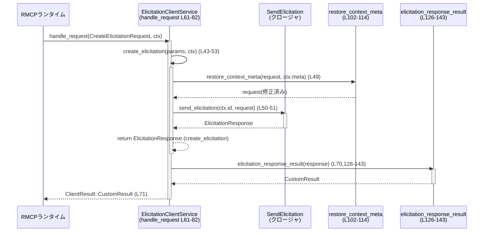

# rmcp-client/src/elicitation_client_service.rs

## 0. ざっくり一言

このモジュールは、RMCP クライアント側の `Service<RoleClient>` 実装として、`CreateElicitation` リクエストだけを特別扱いし、それ以外は汎用の `LoggingClientHandler` に委譲するためのアダプタ実装です（根拠: `impl Service<RoleClient> for ElicitationClientService` の `handle_request` マッチ分岐、`elicitation_client_service.rs:L60-82`）。  
また、リクエスト／レスポンスの `_meta` フィールドの扱いを調整し、シリアライズエラーを `rmcp::ErrorData` に変換します（根拠: `restore_context_meta`, `elicitation_response_result`, `elicitation_client_service.rs:L102-114,L126-143`）。

---

## 1. このモジュールの役割

### 1.1 概要

- `ElicitationClientService` は、RMCP の `Service<RoleClient>` トレイトを実装したクライアントサービスです（根拠: `impl Service<RoleClient> for ElicitationClientService`, `L60-100`）。
- サーバからの `ServerRequest::CreateElicitationRequest` を受け取ると、内部の `SendElicitation` クロージャを通じて実アプリケーション側の処理を呼び出します（根拠: `match request { ServerRequest::CreateElicitationRequest(..) => { .. self.create_elicitation(..) .. } }`, `L66-71`）。
- JSON-RPC `_meta` は一度 `RequestContext` に持ち上げられるため、それを `Elicitation` リクエストに戻しつつ、`"progressToken"` だけを除外する補正を行います（根拠: コメントと `restore_context_meta`, `L102-105`）。
- `ElicitationResponse` は内部構造体 `CreateElicitationResultWithMeta` を経由して JSON に変換され、`CustomResult` として上位に返されます（根拠: `CreateElicitationResultWithMeta`, `elicitation_response_result`, `L116-143`）。

### 1.2 アーキテクチャ内での位置づけ

このファイルに現れる主要コンポーネント間の依存関係は次のようになっています。

```mermaid
graph TD
  %% rmcp-client/src/elicitation_client_service.rs:L25-143
  subgraph File[elicitation_client_service.rs (L25-143)]
    ECS[ElicitationClientService<br/>Service実装]
    cloneFn[clone_send_elicitation]
    restoreFn[restore_context_meta]
    resultFn[elicitation_response_result]
    ResultStruct[CreateElicitationResultWithMeta]
  end

  RMCPService[rmcp::service::Service<RoleClient>] --> ECS
  ECS -->|フィールド| Handler[LoggingClientHandler]
  ECS -->|Arcで共有| SendE[SendElicitation<br/>(クロージャ)]
  ECS --> restoreFn
  ECS --> resultFn
  resultFn -->|シリアライズ| Serde[serde_json::to_value]

  RMCPReq[ServerRequest] --> ECS
  RMCPNotif[ServerNotification] --> ECS
  ECS -->|その他リクエスト/通知| Handler
```

- `ElicitationClientService` は `LoggingClientHandler` を内部に保持し（根拠: フィールド `handler: LoggingClientHandler`, `L26-28`）、`CreateElicitationRequest` 以外のすべてをそこに委譲します（根拠: `request => { <LoggingClientHandler as Service<RoleClient>>::handle_request(..) }`, `L73-80`）。
- 実際の「Elicitation を送る」処理は `SendElicitation` 型のクロージャとして注入され、`Arc` で共有されます（根拠: フィールド `send_elicitation: Arc<SendElicitation>`, `L27-28` と `new` 内での `Arc::new`, `L32-40`）。
- `_meta` のマージと `CustomResult` 化はこのモジュール内のヘルパ関数で完結しており、外部からは `ClientResult` としてしか見えません（根拠: `ClientResult::CustomResult(result)`, `L71`）。

`LoggingClientHandler` や `SendElicitation` の内部実装はこのチャンクには現れません。

### 1.3 設計上のポイント

- **責務の分割**
  - RMCP の `Service<RoleClient>` フレームワークとの接点を `ElicitationClientService` が担い、アプリケーションロジックは注入された `SendElicitation` クロージャに委譲する構造になっています（根拠: `ElicitationClientService` のフィールドと `create_elicitation` 内の呼び出し、`L26-28,L50-52`）。
  - ログや「一般的な」リクエスト／通知処理は `LoggingClientHandler` にまとめ、ここでは Elicitation 特有の処理だけを扱っています（根拠: `CreateElicitationRequest` 分岐のみ特別扱い、それ以外は委譲、`L66-80,L84-95`）。
- **状態管理**
  - 構造体は `LoggingClientHandler` と `Arc<SendElicitation>` の 2 フィールドだけを持ち、長期的なセッション状態などは保持していません（根拠: `struct ElicitationClientService { handler, send_elicitation }`, `L25-29`）。
  - `#[derive(Clone)]` によりインスタンス全体をクローン可能であり、`Arc` によりクロージャを安全に共有できます（根拠: `#[derive(Clone)]`, `L25`, `Arc<SendElicitation>`, `L27-28`）。
- **エラーハンドリング**
  - 送信クロージャやシリアライズのエラーは `rmcp::ErrorData::internal_error` に変換され、クライアントには内部エラーとして通知されます（根拠: `map_err(|err| rmcp::ErrorData::internal_error(..))`, `L51-52,L141-142`）。
- **メタデータ処理**
  - JSON-RPC レベルの `_meta` を `RequestContext` から Elicitation リクエストの `meta` に戻す処理を `restore_context_meta` に切り出し、`"progressToken"` キーは除外するポリシーになっています（根拠: `context_meta.remove(MCP_PROGRESS_TOKEN_META_KEY);`, `L104`）。
- **並行性**
  - サービスのエントリポイントはすべて `async fn` であり、非同期ランタイム上での同時処理を前提に設計されています（根拠: `async fn handle_request`, `async fn handle_notification`, `L61,L84`）。
  - 共有されるのは `Arc<SendElicitation>` のみであり、それ以外の状態はメソッド内ローカルに閉じています。

---

## 2. 主要な機能一覧

このモジュールが提供する主な機能は以下のとおりです。

- `ElicitationClientService::new`: クライアント情報と送信クロージャからサービスインスタンスを構築する（根拠: `fn new(..) -> Self`, `L32-41`）。
- `Service<RoleClient>::handle_request`: `CreateElicitationRequest` を検出して Elicitation 処理を実行し、それ以外を `LoggingClientHandler` に委譲する（根拠: `match request { ServerRequest::CreateElicitationRequest(..) => .. }`, `L66-72`）。
- `Service<RoleClient>::handle_notification`: すべての通知を `LoggingClientHandler` に委譲する（根拠: `handle_notification` 内での委譲, `L84-95`）。
- `restore_context_meta`: `RequestContext` の `Meta` を Elicitation リクエストの `meta` に統合し、`"progressToken"` を取り除く（根拠: `restore_context_meta`, `L102-114`）。
- `elicitation_response_result`: `ElicitationResponse` を JSON にシリアライズして `CustomResult` に包み、結果レベルの `_meta` を表現する（根拠: `CreateElicitationResultWithMeta` と `elicitation_response_result`, `L116-143`）。
- `clone_send_elicitation`: `Arc<SendElicitation>` から新しい `SendElicitation` クロージャを生成するユーティリティ（根拠: `fn clone_send_elicitation(..)`, `L56-58`）。

---

## 3. 公開 API と詳細解説

### 3.1 型一覧（構造体・定数など）

| 名前 | 種別 | 役割 / 用途 | 定義範囲 |
|------|------|-------------|----------|
| `MCP_PROGRESS_TOKEN_META_KEY` | 定数 `&'static str` | `restore_context_meta` 内でコンテキストメタから削除するキー（`"progressToken"`）を表す | `elicitation_client_service.rs:L23-23` |
| `ElicitationClientService` | 構造体 | `Service<RoleClient>` を実装するクライアントサービス本体。`LoggingClientHandler` と `Arc<SendElicitation>` を保持する | `elicitation_client_service.rs:L25-29` |
| `CreateElicitationResultWithMeta` | 構造体（`Serialize`） | `ElicitationResponse` を JSON に変換する際に使う内部用の結果型。`_meta` フィールドを含めてシリアライズ形式を制御する | `elicitation_client_service.rs:L116-124` |

※ `Elicitation`, `ElicitationResponse`, `SendElicitation` 等は他モジュール（`crate::rmcp_client`）で定義されており、このチャンクには構造が現れません（根拠: `use crate::rmcp_client::Elicitation;` 等、`L19-21`）。

### 3.2 関数詳細（主要 7 件）

#### `ElicitationClientService::new(client_info: ClientInfo, send_elicitation: SendElicitation) -> Self`

**概要**

- クライアント情報と Elicitation 送信クロージャを受け取り、`LoggingClientHandler` と `Arc<SendElicitation>` を内部に格納した `ElicitationClientService` を構築します（根拠: コンストラクタ実装, `L32-41`）。

**引数**

| 引数名 | 型 | 説明 |
|--------|----|------|
| `client_info` | `ClientInfo` | クライアントの識別情報。`LoggingClientHandler::new` に渡されます（根拠: `LoggingClientHandler::new(client_info, ..)`, `L35-37`）。 |
| `send_elicitation` | `SendElicitation` | Elicitation リクエストを実際に送信するためのクロージャ。`Arc` に包まれてサービス内部に保持されます（根拠: `let send_elicitation = Arc::new(send_elicitation);`, `L33`）。 |

**戻り値**

- `ElicitationClientService` のインスタンス。内部に `handler` と `send_elicitation` を保持しています（根拠: `Self { handler: ..., send_elicitation }`, `L34-40`）。

**内部処理の流れ**

1. 受け取った `SendElicitation` を `Arc` で包みます（`Arc::new(send_elicitation)`、`L33`）。
2. `LoggingClientHandler::new` に `client_info` と、`Arc<SendElicitation>` をラップしたクロージャ（`clone_send_elicitation` 経由）を渡してハンドラを生成します（根拠: `LoggingClientHandler::new(.. clone_send_elicitation(Arc::clone(&send_elicitation)))`, `L35-38`）。
3. 生成した `handler` と `send_elicitation` をフィールドに設定して `Self` を返します（`L34-40`）。

**Examples（使用例）**

```rust
use rmcp::model::ClientInfo;
// use crate::rmcp_client::{SendElicitation, Elicitation, ElicitationResponse};

fn make_service(client_info: ClientInfo, send_elicitation: SendElicitation) -> ElicitationClientService {
    // client_info と送信クロージャからサービスを構築する
    ElicitationClientService::new(client_info, send_elicitation)
}
```

**Errors / Panics**

- この関数自体は `Result` を返さず、明示的なエラー処理は行っていません（根拠: `fn new(..) -> Self`, `L32`）。
- 内部で呼び出される `LoggingClientHandler::new` の挙動はこのチャンクには現れないため、その中でのパニック可能性は不明です。

**Edge cases（エッジケース）**

- `send_elicitation` が `None` になるケースは型的に存在せず、常に何らかのクロージャが渡される前提になっています。
- `client_info` の内容に対する検証は行われていません。この関数側ではそのまま `LoggingClientHandler::new` に渡すだけです。

**使用上の注意点**

- `send_elicitation` は `Arc` に包まれ、`ElicitationClientService` の `Clone` に伴って共有されるため、実装するクロージャはスレッドセーフ／再入可能であることが前提と考えられます（根拠: `Arc<SendElicitation>` フィールドと `#[derive(Clone)]`, `L25-28`）。

---

#### `async fn create_elicitation(&self, request: Elicitation, context: RequestContext<RoleClient>) -> Result<ElicitationResponse, rmcp::ErrorData>`

**概要**

- `ServerRequest::CreateElicitationRequest` に対応し、`RequestContext` からメタデータを復元した `Elicitation` リクエストを `send_elicitation` クロージャに渡して実行します（根拠: 関数本体, `L43-53`）。
- 実行中に発生したエラーは `rmcp::ErrorData::internal_error` に変換されます（根拠: `map_err(.. internal_error(..))`, `L51-52`）。

**引数**

| 引数名 | 型 | 説明 |
|--------|----|------|
| `request` | `Elicitation` | サーバから受け取った Elicitation リクエストのパラメータ部分（根拠: シグネチャ, `L45`）。 |
| `context` | `RequestContext<RoleClient>` | リクエスト ID や `_meta` などのコンテキスト情報を含む（根拠: `RequestContext<RoleClient>`, `L46`）。 |

**戻り値**

- `Ok(ElicitationResponse)`：`send_elicitation` の成功結果。
- `Err(rmcp::ErrorData)`：送信処理中に発生したエラーを内部エラーとしてラップしたもの。

**内部処理の流れ**

1. `RequestContext` を分解し、`id` と `meta` を取り出します（根拠: `let RequestContext { id, meta, .. } = context;`, `L48`）。
2. `restore_context_meta` を呼び出して、コンテキストのメタデータを `request` の `meta` に統合します（根拠: `let request = restore_context_meta(request, meta);`, `L49`）。
3. `self.send_elicitation` クロージャを呼び出し、`id` と更新済み `request` を渡して `await` します（根拠: `(self.send_elicitation)(id, request).await`, `L50-51`）。
4. 送信クロージャがエラーを返した場合、`rmcp::ErrorData::internal_error(err.to_string(), None)` に変換して `Err` を返します（根拠: `map_err(|err| rmcp::ErrorData::internal_error(err.to_string(), None))`, `L51-52`）。

**Examples（使用例）**

```rust
// 非公開メソッドのため、実際には handle_request 経由で呼び出されます。
// 以下は概念的な例です。

async fn handle_create(
    service: &ElicitationClientService,
    request: Elicitation,
    ctx: rmcp::service::RequestContext<rmcp::RoleClient>,
) -> Result<ElicitationResponse, rmcp::ErrorData> {
    service.create_elicitation(request, ctx).await
}
```

**Errors / Panics**

- `send_elicitation` クロージャがエラーを返した場合、それは `rmcp::ErrorData::internal_error` に変換されます（根拠: `map_err`, `L51-52`）。
  - どのような条件でエラーになるかは `SendElicitation` の実装がこのチャンクに現れないため不明です。
- 関数自体はパニックを明示的に発生させていません。

**Edge cases（エッジケース）**

- `context.meta` が空、または `"progressToken"` のみの場合、`restore_context_meta` によりリクエストの `meta` は変化しないか、`"progressToken"` が除外された状態になります（根拠: `restore_context_meta`, `L102-114`）。
- `send_elicitation` が非常に時間のかかる処理を行う場合、その間 `handle_request` のレスポンスも遅延します。

**使用上の注意点**

- `async fn` であるため、非同期ランタイム上で `.await` する必要があります。
- `RequestContext` はムーブされるため、このメソッド呼び出し後に同じ `context` を再利用することはできません（根拠: `context` をパターンマッチでムーブ, `L48`）。

---

#### `fn clone_send_elicitation(send_elicitation: Arc<SendElicitation>) -> SendElicitation`

**概要**

- `Arc<SendElicitation>` をキャプチャする新しい `SendElicitation` クロージャを生成します。これにより、`Arc` で共有されている送信処理を、`LoggingClientHandler` にも渡せるようにしています（根拠: 関数定義, `L56-58`）。

**引数**

| 引数名 | 型 | 説明 |
|--------|----|------|
| `send_elicitation` | `Arc<SendElicitation>` | 共有された送信クロージャ。内部でクローンせず、そのままキャプチャされます。 |

**戻り値**

- 新たな `SendElicitation`（おそらく `Box<dyn Fn(..)>` 型のエイリアス）で、内部で `Arc` に格納された元のクロージャを呼び出します（根拠: `Box::new(move |request_id, request| send_elicitation(request_id, request))`, `L57`）。

**内部処理の流れ**

1. `Arc<SendElicitation>` をムーブでクロージャにキャプチャし（`move |..|`）、引数として受け取った `request_id`・`request` をそのまま内部の `send_elicitation` に渡すラッパーを作成します（根拠: `Box::new(move |request_id, request| send_elicitation(request_id, request))`, `L57`）。
2. 生成したクロージャを `Box` に包んで返します。

**Examples（使用例）**

```rust
// new 内部と同様の使い方
let arc = std::sync::Arc::new(send_elicitation);
let cloned: SendElicitation = clone_send_elicitation(std::sync::Arc::clone(&arc));
// cloned と arc 内部の関数は同じ実装を共有する
```

**Errors / Panics**

- この関数自体はエラーもパニックも発生させません。

**Edge cases**

- `Arc` の参照カウントがいくつであっても問題なく動作します。最後の 1 つであってもクロージャ内で保持されるため解放されません。

**使用上の注意点**

- キャプチャする `Arc<SendElicitation>` がどのスレッドからも安全に呼び出せる前提で使用する必要があります（`SendElicitation` の具体的なトレイト境界はこのチャンクでは不明です）。

---

#### `async fn handle_request(&self, request: ServerRequest, context: RequestContext<RoleClient>) -> Result<ClientResult, rmcp::ErrorData>`

（`Service<RoleClient> for ElicitationClientService` の実装）

**概要**

- RMCP ランタイムから呼ばれるリクエスト処理のエントリポイントです。
- `ServerRequest::CreateElicitationRequest` の場合にのみ Elicitation 処理を行い、それ以外は `LoggingClientHandler` の `handle_request` にそのまま委譲します（根拠: `match request { ... }`, `L66-81`）。

**引数**

| 引数名 | 型 | 説明 |
|--------|----|------|
| `request` | `ServerRequest` | サーバからのリクエスト。`CreateElicitationRequest` を含む列挙型です（根拠: `ServerRequest` 型, `L63`）。 |
| `context` | `RequestContext<RoleClient>` | リクエスト ID や `_meta` を含むコンテキスト（根拠: `RequestContext<RoleClient>`, `L64`）。 |

**戻り値**

- `Ok(ClientResult)`：正常なクライアント側の応答（`CustomResult` を含む）。
- `Err(rmcp::ErrorData)`：Elicitation 処理または `LoggingClientHandler` 内で発生したエラー。

**内部処理の流れ**

1. `match request` でパターンマッチします（根拠: `match request {`, `L66`）。
2. `ServerRequest::CreateElicitationRequest(request)` のケースでは:
   - `request.params` を取り出し、`context` とともに `self.create_elicitation(..)` に渡して `await` します（根拠: `self.create_elicitation(request.params, context).await?;`, `L67-68`）。
   - 返ってきた `ElicitationResponse` を `elicitation_response_result` に渡し、`CustomResult` に変換します（根拠: `let result = elicitation_response_result(response)?;`, `L70`）。
   - `ClientResult::CustomResult(result)` でラップして返します（根拠: `Ok(ClientResult::CustomResult(result))`, `L71`）。
3. それ以外のリクエストは、そのまま `LoggingClientHandler` の `handle_request` に渡し、`await` して結果を返します（根拠: `request => { <LoggingClientHandler as Service<RoleClient>>::handle_request(&self.handler, request, context).await }`, `L73-80`）。

**Examples（使用例）**

```rust
// 概念的な例: CreateElicitationRequest の処理
async fn on_server_request(
    service: &ElicitationClientService,
    req: ServerRequest,
    ctx: RequestContext<RoleClient>,
) -> Result<ClientResult, rmcp::ErrorData> {
    service.handle_request(req, ctx).await
}
```

**Errors / Panics**

- `self.create_elicitation(..)` からの `Err` はそのまま伝播します（`?` 演算子, `L68`）。
- `elicitation_response_result` からの `Err` も `?` により伝播します（`L70`）。
- 委譲先の `LoggingClientHandler::handle_request` でのエラーも `Result` を通じて上位に返されます（`L74-80`）。
- 明示的な `panic!` 呼び出しはありません。

**Edge cases**

- `ServerRequest` に `CreateElicitationRequest` 以外の新しいバリアントが追加された場合、本実装はデフォルト分岐（`request => { .. }`）で `LoggingClientHandler` に委譲します（根拠: `request => { .. }`, `L73`）。
- `LoggingClientHandler` 側で `ServerRequest::CreateElicitationRequest` を扱うコードは呼ばれません。Elicitation は必ずこのサービスで処理されます（根拠: Elicitation だけが最初の分岐で消費されている, `L66-72`）。

**使用上の注意点**

- `context` は `CreateElicitationRequest` のケースでは `create_elicitation` にムーブされるため、それ以降の分岐には使えません（この構造のため、コンテキストを二重に使うような拡張は注意が必要です）。

---

#### `async fn handle_notification(&self, notification: ServerNotification, context: NotificationContext<RoleClient>) -> Result<(), rmcp::ErrorData>`

**概要**

- すべてのサーバ通知を `LoggingClientHandler` に委譲する実装です（根拠: 関数本体, `L84-95`）。

**引数**

| 引数名 | 型 | 説明 |
|--------|----|------|
| `notification` | `ServerNotification` | サーバからの通知。具体的なバリアントはこのチャンクには現れません。 |
| `context` | `NotificationContext<RoleClient>` | 通知のコンテキスト情報。 |

**戻り値**

- `Ok(())`：通知が正しく処理された場合。
- `Err(rmcp::ErrorData)`：`LoggingClientHandler` 内でエラーが発生した場合。

**内部処理の流れ**

1. `<LoggingClientHandler as Service<RoleClient>>::handle_notification(&self.handler, notification, context)` を呼び出し、その結果をそのまま返します（根拠: `L89-94`）。

**Errors / Panics**

- エラーはすべて委譲先からのものです。このチャンクでは `LoggingClientHandler` の実装が見えないため、詳細条件は不明です。
- 明示的なパニックはありません。

**Edge cases**

- どの通知もこのサービス内で特別扱いされません。Elicitation 関連の通知があるかどうかも、このチャンクからは分かりません。

**使用上の注意点**

- 通知処理の追加・変更は主に `LoggingClientHandler` 側で行うことになります。

---

#### `fn restore_context_meta(mut request: Elicitation, mut context_meta: Meta) -> Elicitation`

**概要**

- `RequestContext` に持ち上げられている `_meta` 情報を Elicitation リクエストの `meta` に戻すヘルパ関数です。
- `"progressToken"` というキーはコンテキストから削除し、リクエストには引き継がないポリシーになっています（根拠: `context_meta.remove(MCP_PROGRESS_TOKEN_META_KEY);`, `L104`）。

**引数**

| 引数名 | 型 | 説明 |
|--------|----|------|
| `request` | `Elicitation` | `meta` を持つ可能性のある Elicitation リクエスト値。 |
| `context_meta` | `Meta` | `RequestContext` 側に持ち上げられた `_meta`（JSON オブジェクト）。 |

**戻り値**

- `Elicitation`：`request` の `meta` に `context_meta` がマージされた新しいリクエスト。

**内部処理の流れ**

1. コメントで「RMCP が JSON-RPC `_meta` を RequestContext に持ち上げる」ことが説明されています（根拠: コメント, `L103`）。
2. `context_meta.remove(MCP_PROGRESS_TOKEN_META_KEY);` で `"progressToken"` キーを削除します（根拠: `L104`）。
3. `context_meta.is_empty()` で空かどうかを確認し、空であれば `request` をそのまま返します（根拠: `if context_meta.is_empty() { return request; }`, `L105-107`）。
4. 空でなければ、`request.meta_mut().get_or_insert_with(Meta::new)` で `request` の `meta` を取得または新規作成し、`extend(context_meta)` でメタ情報を統合します（根拠: `L109-112`）。
5. 更新された `request` を返します（`L113`）。

**Examples（使用例）**

テストコードがこの関数の使い方を示しています。

```rust
#[test]
fn restore_context_meta_adds_elicitation_meta_and_removes_progress_token() {
    let request = restore_context_meta(
        form_request(/*meta*/ None),  // meta が None のリクエスト
        meta(json!({
            "progressToken": "progress-token",
            "persist": ["session", "always"],
        })),
    );

    assert_eq!(
        request,
        form_request(Some(meta(json!({
            "persist": ["session", "always"],
        }))))
    );
}
```

（根拠: テスト関数, `elicitation_client_service.rs:L157-173`）

**Errors / Panics**

- 本体内で `panic!` は呼ばれていません。
- テスト用ヘルパー `meta(value: Value) -> Meta` は `Value` がオブジェクトでないと `panic!` しますが、本番コードでは使用されていません（根拠: `meta` 内の `panic!`, `L207-210`）。

**Edge cases**

- `context_meta` が `"progressToken"` 以外のキーを持たない場合 → `"progressToken"` 削除後に空となり、`request` は変更されません（根拠: `is_empty()` チェック, `L105-107`）。
- `request` 側にすでに `meta` があった場合 → `Meta::extend` により `context_meta` がマージされます。どちらが優先されるかは `Meta` の `extend` 実装に依存し、このチャンクからは分かりません（根拠: `extend(context_meta)`, `L112`）。
- `context_meta` が大量のキーを持つ場合も、そのまま `extend` で統合されます。

**使用上の注意点**

- `"progressToken"` をリクエスト側に残したい場合、この関数をそのまま使うと除去されてしまう点に注意が必要です。
- 関数はモジュール内のプライベート関数であり（`pub` 修飾子なし）、外部から直接呼び出す設計にはなっていません（根拠: `fn restore_context_meta`, `L102`）。

---

#### `fn elicitation_response_result(response: ElicitationResponse) -> Result<CustomResult, rmcp::ErrorData>`

**概要**

- `ElicitationResponse` を内部構造体 `CreateElicitationResultWithMeta` に詰め替え、`serde_json::to_value` を使って JSON 値にシリアライズし、それを `CustomResult` に変換します（根拠: `elicitation_response_result`, `L126-143`）。
- シリアライズエラーは `rmcp::ErrorData::internal_error` としてラップされます（根拠: `map_err(|err| rmcp::ErrorData::internal_error(err.to_string(), None))`, `L141-142`）。

**引数**

| 引数名 | 型 | 説明 |
|--------|----|------|
| `response` | `ElicitationResponse` | アプリケーション側から返された Elicitation の応答。`action`, `content`, `meta` を含む構造体です（根拠: `let ElicitationResponse { action, content, meta } = response;`, `L129-133`）。 |

**戻り値**

- `Ok(CustomResult)`：JSON にシリアライズ済みの結果をラップしたもの。
- `Err(rmcp::ErrorData)`：シリアライズに失敗した場合の内部エラー。

**内部処理の流れ**

1. `ElicitationResponse` を分解し、`action`, `content`, `meta` を取り出します（根拠: `let ElicitationResponse { .. } = response;`, `L129-133`）。
2. `CreateElicitationResultWithMeta { action, content, meta }` を構築します（根拠: `let result = CreateElicitationResultWithMeta { .. };`, `L134-138`）。
   - `CreateElicitationResultWithMeta` は `Serialize` を実装しており、`content` と `meta` は `Option` で、`None` の場合シリアライズ時に省略されます（根拠: `#[serde(skip_serializing_if = "Option::is_none")]`, `L120-123`）。
   - `meta` は JSON 上では `_meta` というキー名でシリアライズされます（根拠: `#[serde(rename = "_meta", ..)]`, `L122-123`）。
3. `serde_json::to_value(result)` で `serde_json::Value` に変換します（根拠: `serde_json::to_value(result)`, `L140`）。
4. 成功した場合は `CustomResult` のコンストラクタでラップし（`map(CustomResult)`, `L141`）、失敗した場合は `rmcp::ErrorData::internal_error` に変換します（`L141-142`）。

**Examples（使用例）**

テストコードが利用例を示します。

```rust
#[test]
fn elicitation_response_result_serializes_response_meta() {
    let result = rmcp::model::ClientResult::CustomResult(
        elicitation_response_result(ElicitationResponse {
            action: ElicitationAction::Accept,
            content: Some(json!({ "confirmed": true })),
            meta: Some(json!({ "persist": "always" })),
        })
        .expect("elicitation response should serialize"),
    );

    assert_eq!(
        serde_json::to_value(result).expect("client result should serialize"),
        json!({
            "action": "accept",
            "content": { "confirmed": true },
            "_meta": { "persist": "always" },
        })
    );
}
```

（根拠: テスト関数, `elicitation_client_service.rs:L175-194`）

**Errors / Panics**

- `serde_json::to_value` がエラーを返した場合、それは `rmcp::ErrorData::internal_error(err.to_string(), None)` に変換されます（根拠: `map_err(..)`, `L141-142`）。
  - エラー条件（循環参照など）は `serde_json` の仕様に依存し、このチャンクでは詳細は分かりません。
- 関数自体で `panic!` は使用していません。

**Edge cases**

- `response.content == None` の場合 → `content` フィールドは JSON から省略されます（根拠: `skip_serializing_if = "Option::is_none"`, `L120-121`）。
- `response.meta == None` の場合 → `_meta` フィールドは JSON から省略されます（根拠: `skip_serializing_if`, `L122-123`）。
- `response.meta` がオブジェクト以外の JSON 値でも、そのまま `_meta` に入ります。`meta` の型は `Option<Value>` であり、この層では特に制約を課していません（根拠: フィールド型とテストで `json!({ .. })` を使用していること, `L121-123,L180-182`）。

**使用上の注意点**

- ここで `_meta` を含んだ JSON に変換しているため、上位でさらにラップする際に `_meta` を上書きしないように注意が必要です。
- シリアライズエラーが内部エラーとして扱われるため、`CustomResult` を拡張する際に非シリアライズ可能な型を含めるとクライアント全体のエラーになります。

---

### 3.3 その他の関数・テスト

| 関数名 | 役割（1 行） | 定義範囲 |
|--------|--------------|----------|
| `fn get_info(&self) -> ClientInfo` | `LoggingClientHandler` の `get_info` をそのまま返すラッパー。クライアント情報の取得に利用される | `elicitation_client_service.rs:L97-99` |
| `mod tests` | `restore_context_meta` と `elicitation_response_result` の挙動を検証するユニットテスト群 | `elicitation_client_service.rs:L145-213` |
| `fn form_request(meta: Option<Meta>) -> CreateElicitationRequestParams` | テスト用に Elicitation リクエスト（フォーム）を生成するヘルパー | `elicitation_client_service.rs:L196-205` |
| `fn meta(value: Value) -> Meta` | テスト用に `Value::Object` を `Meta` に変換するヘルパー。オブジェクト以外では `panic!` する | `elicitation_client_service.rs:L207-212` |

---

## 4. データフロー

ここでは典型的な「CreateElicitation リクエストを処理する」流れを説明します。

1. RMCP ランタイムがサーバから `ServerRequest::CreateElicitationRequest` を受信し、`ElicitationClientService::handle_request` を呼び出します（根拠: 想定される `Service` の使用方法と `match` 分岐, `L60-66`）。
2. `handle_request` は `self.create_elicitation(request.params, context)` を `await` し、`ElicitationResponse` を得ます（根拠: `L67-68`）。
3. `create_elicitation` は `RequestContext` から `id` と `meta` を取り出し、`restore_context_meta` で `meta` をリクエストに戻した上で `send_elicitation` クロージャを呼び出します（根拠: `L48-50`）。
4. `send_elicitation` から返った `ElicitationResponse` は `elicitation_response_result` に渡され、JSON 化された `CustomResult` へ変換されます（根拠: `L70,L126-143`）。
5. 最終的に `ClientResult::CustomResult(result)` として RMCP ランタイムに返されます（根拠: `L71`）。

この流れをシーケンス図で表すと以下のようになります。



このチャンクでは、`SendElicitation` の内部で何が行われるか（ネットワーク送信など）は不明です。

---

## 5. 使い方（How to Use）

### 5.1 基本的な使用方法

このモジュールは主に「RMCP クライアントフレームワークから `Service<RoleClient>` として利用される」ことを想定しています。基本的な流れは次のとおりです（推測部分は明示します）。

1. `SendElicitation` 型のクロージャを用意する（実際の送信ロジックはこのチャンクには現れません）。
2. `ClientInfo` と `SendElicitation` を引数に `ElicitationClientService::new` を呼び出す。
3. 生成したサービスを RMCP クライアントのサービスレジストリに登録する（この処理はこのチャンクには現れません）。

概念的なコード例:

```rust
use rmcp::model::ClientInfo;
// use crate::rmcp_client::{SendElicitation, Elicitation, ElicitationResponse};

fn initialize_service(client_info: ClientInfo, send_elicitation: SendElicitation) -> ElicitationClientService {
    // サービスの初期化
    ElicitationClientService::new(client_info, send_elicitation)
}

// その後、RMCP ランタイムが handle_request / handle_notification を呼び出す想定です。
```

### 5.2 よくある使用パターン（想定）

コードから読み取れる範囲での使用パターンは次のとおりです。

- **Elicitation だけ特別扱いするクライアント**
  - `ElicitationClientService` を使用して `CreateElicitationRequest` だけをアプリケーション独自のクロージャにルーティングし、それ以外は `LoggingClientHandler` の挙動（おそらくログとデフォルト処理）に任せる構成になっています（根拠: `handle_request` の分岐, `L66-80`）。

### 5.3 よくある間違い（起こり得る誤用）

このチャンクから推測できる範囲での注意点です。

```rust
// 誤りの例（仮想的なもの）:
// SendElicitation 内で同期的にブロッキング I/O を行う
let send_elicitation: SendElicitation = Box::new(|id, req| {
    // ブロッキングなネットワーク呼び出しなど（例: std::net::TcpStream）を直接行う
    // これは async コンテキストでのパフォーマンス低下につながる
    todo!()
});
```

**正しい方向性の例（概念）:**

```rust
// 非同期ランタイムのクライアントを使い、非同期 I/O を行う send_elicitation を実装するなど
let send_elicitation: SendElicitation = Box::new(|id, req| {
    // 実際の型定義はこのチャンクには現れませんが、非同期フレンドリーな実装が望まれます
    todo!()
});
```

※ `SendElicitation` の具体的な型と利用方法はこのチャンクには現れないため、上記はあくまで一般的な async コードの注意点として記載しています。

### 5.4 使用上の注意点（まとめ）

- **非同期実行前提**
  - `handle_request` および `handle_notification` は `async fn` であり、非同期ランタイム（tokio 等）のコンテキストで `.await` されることが前提です（根拠: `async fn`, `L61,L84`）。
- **`SendElicitation` の実装**
  - `create_elicitation` 内で `send_elicitation` を `await` しているため（根拠: `L50-51`）、長時間ブロックする実装はクライアント全体のレスポンス低下につながります。
- **メタデータの扱い**
  - `"progressToken"` はコンテキストから削除され、リクエストの `meta` に引き継がれません（根拠: `context_meta.remove(MCP_PROGRESS_TOKEN_META_KEY);`, `L104`）。
  - 結果の `_meta` は `elicitation_response_result` によって JSON に埋め込まれます。別の層で `_meta` を上書きしないよう注意が必要です（根拠: `#[serde(rename = "_meta")]`, `L122-123`）。
- **エラーメッセージ**
  - 送信処理やシリアライズのエラー内容が `err.to_string()` としてエラーデータに含まれます（根拠: `internal_error(err.to_string(), None)`, `L51-52,L141-142`）。ログやクライアントへの公開範囲は上位層で検討する必要があります。

---

## 6. 変更の仕方（How to Modify）

### 6.1 新しい機能を追加する場合

このモジュールに新しい機能（例えば別種の専用リクエスト処理）を追加する場合、既存の構造から次のようなパターンが読み取れます。

1. **新しい専用処理関数を追加**
   - `create_elicitation` と同様に、`async fn` で専用の処理関数を実装します（根拠: `create_elicitation`, `L43-53`）。
   - 必要に応じて、メタデータ処理用のヘルパ関数（`restore_context_meta` に類似）を追加します。
2. **`handle_request` の `match` を拡張**
   - `ServerRequest` の新しいバリアントに対する分岐を `handle_request` に追加し、その中で新規の専用処理関数を呼び出します（根拠: 現在の `CreateElicitationRequest` 分岐, `L66-72`）。
3. **結果のシリアライズ処理を追加**
   - `CreateElicitationResultWithMeta` と `elicitation_response_result` のように、結果型のシリアライズを行う専用構造体と関数を追加します（根拠: `L116-143`）。
4. **テストを追加**
   - 既存のテストと同様に、`restore_context_meta` やシリアライズ結果の JSON を検証するテストを追加します（根拠: `tests` モジュール, `L145-213`）。

### 6.2 既存の機能を変更する場合

変更時に注意すべきポイントです。

- **メタデータの契約**
  - `restore_context_meta` で `"progressToken"` を削除している契約を変更する場合、既存のクライアントやサーバがそれに依存していないか確認が必要です（根拠: `L104`）。
  - `Meta::extend` の挙動に依存するロジック（「どちらの値が優先されるか」など）は、このチャンクからは分からないため、`Meta` 型の実装や利用箇所を確認する必要があります（根拠: `extend(context_meta)`, `L112`）。
- **結果の JSON 形式**
  - `CreateElicitationResultWithMeta` のフィールド名や `serde` 属性を変更すると、クライアント／サーバ間のプロトコル互換性に影響します（根拠: `#[serde(rename_all = "camelCase")]`, `#[serde(rename = "_meta")]`, `L117-123`）。
- **エラーハンドリング**
  - 現在は内部エラーとして一律に `internal_error` にマップしています。これを変える場合、エラー分類や HTTP ステータスなど、上位レイヤの設計に合わせる必要があります（根拠: `map_err(.. internal_error(..))`, `L51-52,L141-142`）。
- **影響範囲の確認**
  - `ElicitationClientService` は `Service<RoleClient>` として使われるため、変更時には RMCP ランタイムからの呼び出しパス全体（他ファイル）とテストを併せて確認する必要があります。

---

## 7. 関連ファイル

このモジュールと密接に関係する外部ファイル／型はインポート文から次のように読み取れます。

| パス / 型 | 役割 / 関係 | 根拠 |
|-----------|-------------|------|
| `crate::logging_client_handler::LoggingClientHandler` | 他のリクエスト／通知処理を担当するサービス。`ElicitationClientService` が内部フィールドとして保持し、`Service<RoleClient>` の実装に委譲しています。具体的な処理内容はこのチャンクには現れません。 | インポートと利用箇所（`handler` フィールドと trait 委譲）, `elicitation_client_service.rs:L18,L26-28,L74-80,L89-95,L97-99` |
| `crate::rmcp_client::{Elicitation, ElicitationResponse, SendElicitation}` | Elicitation リクエスト／レスポンスと、それを送信するためのクロージャ型。`ElicitationClientService` はこれらを引数やフィールドとして扱いますが、型の詳細はこのチャンクには現れません。 | インポートとシグネチャ, `elicitation_client_service.rs:L19-21,L43-47,L126-133` |
| `rmcp::service::{Service, RequestContext, NotificationContext}` | RMCP フレームワークのサービスインタフェースおよびコンテキスト。`ElicitationClientService` が `Service<RoleClient>` を実装し、`handle_request` / `handle_notification` の引数として使います。 | インポートと `impl Service<RoleClient> for ElicitationClientService`, `elicitation_client_service.rs:L12-14,L60-100` |
| `rmcp::model::{ClientInfo, ClientResult, CustomResult, ElicitationAction, Meta, ServerRequest, ServerNotification}` | RMCP プロトコル上の各種モデル。クライアント情報、リクエスト／通知、メタデータ、結果型などが含まれます。詳細な構造はこのチャンクには現れません。 | インポートおよびフィールド/引数型, `elicitation_client_service.rs:L4-11,L15-16,L116-123,L126-143` |
| `serde` / `serde_json` | 結果やメタデータの JSON シリアライズ／デシリアライズに使用されます。特に `CreateElicitationResultWithMeta` のシリアライズと `elicitation_response_result` で利用されます。 | インポートと `serde_json::to_value`, `elicitation_client_service.rs:L15-16,L116-123,L140-141` |

このチャンクにない他ファイル（RMCP ランタイムや `rmcp_client` モジュールの詳細な実装など）の挙動は不明であり、ここでは推測していません。

---
