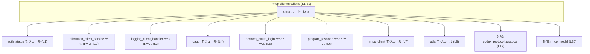

# rmcp-client/src/lib.rs コード解説

## 0. ざっくり一言

`rmcp-client/src/lib.rs` は、RMCP クライアントクレート全体のルートモジュールで、内部モジュールや外部クレートから OAuth 認証・RMCP 関連の型や関数を `pub use` で再エクスポートし、利用者向けの公開 API を 1 箇所に集約するファサード（窓口）として機能しています（rmcp-client/src/lib.rs:L1-8, L10-31）。

---

## 1. このモジュールの役割

### 1.1 概要

- このモジュールは、`auth_status`, `oauth`, `perform_oauth_login`, `rmcp_client` などの内部モジュールを宣言し（rmcp-client/src/lib.rs:L1-8）、それらから必要な識別子だけを選んで `pub use` することで公開 API を構成しています（rmcp-client/src/lib.rs:L10-31）。
- 外部クレート `codex_protocol::protocol` と `rmcp::model` からも型を直接再エクスポートし、`rmcp_client::McpAuthStatus` や `rmcp_client::ElicitationAction` として利用できるようにしています（rmcp-client/src/lib.rs:L14, L25）。
- 自身では関数や型の実装を持たず、モジュール宣言と再エクスポートのみで構成されているのが特徴です（rmcp-client/src/lib.rs:L1-31）。

### 1.2 アーキテクチャ内での位置づけ

`lib.rs` から見たモジュール・クレート間の依存関係を示します。ここでは、このファイルに現れる事実（`mod` と `pub use`）だけを図示しています。



- 実行時の処理フローはこのファイルには存在せず、すべてコンパイル時のモジュール解決・公開 API の構成に関する関係です。
- `auth_status`, `oauth`, `perform_oauth_login`, `rmcp_client` などのモジュールの実装は、このチャンクには現れません。

### 1.3 設計上のポイント

コードから読み取れる設計上の特徴は次の通りです。

- **ファサード設計**
  - 内部モジュールはすべて `mod` 宣言のみで、`pub mod` にはなっていないため、外部クレートからは直接アクセスできません（rmcp-client/src/lib.rs:L1-8）。
  - 外部に公開したい識別子のみを `pub use` で再エクスポートしており、ルートモジュールが「公式な API 面」を定義しています（rmcp-client/src/lib.rs:L10-31）。

- **公開範囲の制御**
  - OAuth 関連の識別子のうち、`load_oauth_tokens` だけは `pub(crate)` で再エクスポートされ、クレート内に限定されています（rmcp-client/src/lib.rs:L18）。
  - これはトークン読み込み処理を外部に直接公開したくない、という公開範囲の設計がされていることを示します（詳細な意図はコードからは断定できません）。

- **依存先の明確化**
  - 公開 API に `McpAuthStatus` や `ElicitationAction` を含めることで、このクレートが `codex_protocol` や `rmcp` クレートと密接に連携することが分かります（rmcp-client/src/lib.rs:L14, L25）。

- **安全性・エラー処理・並行性について**
  - このファイルにはロジックやスレッド関連コード、エラー処理コードは一切含まれていないため、安全性・エラー処理・並行性の具体的な方針は読み取れません。
  - それらは各サブモジュール側（`auth_status`, `oauth`, `perform_oauth_login`, `rmcp_client` など）の実装に依存しており、このチャンクには現れません。

---

## 2. 主要な機能一覧

このファイル自体はロジックを持ちませんが、`pub use` している識別子から、外部に提供される機能のカテゴリを整理できます。

- **OAuth 認証状態の判定・発見に関する機能**  
  - `StreamableHttpOAuthDiscovery`, `determine_streamable_http_auth_status`, `discover_streamable_http_oauth`, `supports_oauth_login`（rmcp-client/src/lib.rs:L10-13）  
  - `McpAuthStatus`（rmcp-client/src/lib.rs:L14）  
  → HTTP/OAuth に関連した認証状態や Discovery を扱う API 群と解釈できますが、具体仕様はこのチャンクには現れません。

- **OAuth トークンの管理に関する機能**  
  - `StoredOAuthTokens`, `WrappedOAuthTokenResponse`（rmcp-client/src/lib.rs:L15-16）  
  - `delete_oauth_tokens`, `save_oauth_tokens`（rmcp-client/src/lib.rs:L17, L19）  
  - クレート内部専用の `load_oauth_tokens`（rmcp-client/src/lib.rs:L18）  
  → トークンの保存・削除・読込のための API を提供していると考えられます。

- **OAuth ログインフローに関する機能**  
  - `OAuthProviderError`, `OauthLoginHandle`（rmcp-client/src/lib.rs:L20-21）  
  - `perform_oauth_login`, `perform_oauth_login_return_url`, `perform_oauth_login_silent`（rmcp-client/src/lib.rs:L22-24）  
  → OAuth ログイン処理と、それに伴うエラーやハンドルを扱う API の入口になっています。

- **RMCP クライアントおよび Elicitation 関連機能**  
  - `ElicitationAction`（外部 `rmcp::model`、rmcp-client/src/lib.rs:L25）  
  - `Elicitation`, `ElicitationResponse`, `ListToolsWithConnectorIdResult`, `RmcpClient`, `SendElicitation`, `ToolWithConnectorId`（rmcp-client/src/lib.rs:L26-31）  
  → 「エリシテーション（Elicitation）」やツール一覧取得など、RMCP プロトコルのクライアント側機能の入口であると推測されます。

※ 上記の「何をするか」は名称からの解釈であり、具体的な挙動・引数・戻り値はこのファイルからは分かりません。

---

## 3. 公開 API と詳細解説

### 3.1 型一覧（構造体・列挙体など）

ここでは CamelCase の識別子を「型候補」としてまとめます。実際に構造体・列挙体・トレイト・型エイリアスのどれに該当するかは、このファイルだけからは断定できません。

| 名前 | 想定種別 | 定義元 | 根拠 | 役割 / 用途（名前からの推測、仕様は不明） |
|------|----------|--------|------|-------------------------------------------|
| `StreamableHttpOAuthDiscovery` | 型候補（CamelCase） | `auth_status` モジュール | rmcp-client/src/lib.rs:L10-10 | Streamable な HTTP/OAuth Discovery 関連の情報を表す型と推測されます。 |
| `McpAuthStatus` | 型候補（CamelCase） | 外部 `codex_protocol::protocol` | rmcp-client/src/lib.rs:L14-14 | MCP（プロトコル）における認証状態を表す型と推測されます。 |
| `StoredOAuthTokens` | 型候補（CamelCase） | `oauth` モジュール | rmcp-client/src/lib.rs:L15-15 | 保存済みの OAuth トークン群を表現する型と推測されます。 |
| `WrappedOAuthTokenResponse` | 型候補（CamelCase） | `oauth` モジュール | rmcp-client/src/lib.rs:L16-16 | OAuth のトークンレスポンスをラップした型と推測されます。 |
| `OAuthProviderError` | 型候補（CamelCase） | `perform_oauth_login` モジュール | rmcp-client/src/lib.rs:L20-20 | OAuth プロバイダとのやりとりで発生するエラーを表現する型と推測されます。 |
| `OauthLoginHandle` | 型候補（CamelCase） | `perform_oauth_login` モジュール | rmcp-client/src/lib.rs:L21-21 | OAuth ログイン処理を表現・制御するハンドルと推測されます。 |
| `ElicitationAction` | 型候補（CamelCase） | 外部 `rmcp::model` | rmcp-client/src/lib.rs:L25-25 | 「エリシテーション（質問・誘導）」に関するアクションを表す型と推測されます。 |
| `Elicitation` | 型候補（CamelCase） | `rmcp_client` モジュール | rmcp-client/src/lib.rs:L26-26 | エリシテーションリクエストあるいはセッションを表す型と推測されます。 |
| `ElicitationResponse` | 型候補（CamelCase） | `rmcp_client` モジュール | rmcp-client/src/lib.rs:L27-27 | エリシテーションに対するレスポンスを表す型と推測されます。 |
| `ListToolsWithConnectorIdResult` | 型候補（CamelCase） | `rmcp_client` モジュール | rmcp-client/src/lib.rs:L28-28 | コネクタ ID 付きツール一覧取得の結果を表す型と推測されます。 |
| `RmcpClient` | 型候補（CamelCase） | `rmcp_client` モジュール | rmcp-client/src/lib.rs:L29-29 | RMCP プロトコルのクライアントを表す中心的な型と推測されます。 |
| `SendElicitation` | 型候補（CamelCase） | `rmcp_client` モジュール | rmcp-client/src/lib.rs:L30-30 | エリシテーション送信処理に関連する型（コマンド・構成など）と推測されます。 |
| `ToolWithConnectorId` | 型候補（CamelCase） | `rmcp_client` モジュール | rmcp-client/src/lib.rs:L31-31 | コネクタ ID 付きツールを表す型と推測されます。 |

> ※ いずれも「型候補」として扱っており、構造体・列挙体・トレイトのいずれであるかは、このファイルの情報だけでは特定できません。

### 3.2 関数詳細（最大 7 件）

ここでは snake_case の識別子を「関数候補」として扱い、公開 API の入口としての位置づけだけを記述します。  
**重要**: いずれもシグネチャや実装はこのファイルには含まれていないため、引数・戻り値・内部処理は不明です。

#### `determine_streamable_http_auth_status(...)`

**概要**

- `auth_status` モジュール由来の識別子で、`pub use auth_status::determine_streamable_http_auth_status;` により公開されています（rmcp-client/src/lib.rs:L11-11）。
- 名前から、HTTP 経由で利用可能な OAuth 認証ステータスを判定する関数である可能性がありますが、仕様はこのチャンクからは分かりません。

**引数**

| 引数名 | 型 | 説明 |
|--------|----|------|
| （不明） | （不明） | シグネチャがこのファイルには存在せず、詳細は `auth_status` モジュール側の定義を確認する必要があります。 |

**戻り値**

- 不明です。`auth_status` モジュール内の定義に依存します。

**内部処理の流れ（アルゴリズム）**

- 実装は `auth_status` モジュール内にあり、このファイルには現れません。

**Examples（使用例）**

- このファイルだけからは型情報が得られず、コンパイル可能な具体例を構成できません。  
  実際の利用方法は `auth_status` モジュールの定義（このチャンクには未掲載）を参照する必要があります。

**Errors / Panics**

- どのような条件でエラーを返すか、あるいはパニックの可能性があるかは不明です。

**Edge cases（エッジケース）**

- 空入力や異常値への挙動などは、このファイルからは読み取れません。

**使用上の注意点**

- 外部クレートからは `rmcp_client::determine_streamable_http_auth_status` というパスでアクセスすることが想定されており、`auth_status` モジュール自体は公開されていません（rmcp-client/src/lib.rs:L1, L11）。
- 具体的な前提条件やスレッド安全性は `auth_status` の実装依存で、このチャンクからは不明です。

---

#### `discover_streamable_http_oauth(...)`

**概要**

- `auth_status` モジュール由来で、`pub use auth_status::discover_streamable_http_oauth;` によって公開されています（rmcp-client/src/lib.rs:L12-12）。
- HTTP 経由で利用可能な OAuth 機能の Discovery を行う API である可能性があります。

**引数 / 戻り値 / 内部処理**

- すべてこのファイルからは不明で、`auth_status` モジュールの定義に依存します。

**Examples / Errors / Edge cases / 使用上の注意点**

- 具体例やエラー条件、エッジケースも同様に不明です。
- 利用時は `rmcp_client::discover_streamable_http_oauth` として参照し、内部モジュールへの直接依存は避ける前提の構成になっています。

---

#### `supports_oauth_login(...)`

**概要**

- `auth_status` モジュール由来の識別子で、`pub use auth_status::supports_oauth_login;` により公開されています（rmcp-client/src/lib.rs:L13-13）。
- 名前から、対象環境が OAuth ログインをサポートしているかどうかを判定する関数であると推測されます。

**それ以外（引数・戻り値・内部処理・例・エラー・エッジケース・注意点）**

- すべて `auth_status` モジュール内の実装に依存し、このファイルには情報がありません。

---

#### `delete_oauth_tokens(...)`

**概要**

- `oauth` モジュール由来で、`pub use oauth::delete_oauth_tokens;` により公開されています（rmcp-client/src/lib.rs:L17-17）。
- 永続化された OAuth トークンを削除する機能を提供する API である可能性があります。

**引数 / 戻り値 / 内部処理**

- 削除対象のスコープ（全削除か一部削除か）や戻り値型は、このファイルからは分かりません。

**Errors / Edge cases / 使用上の注意点**

- 認証ストレージに関わる操作である可能性が高いため、安全性・エラー処理は重要なポイントですが、その具体内容は `oauth` モジュールの実装に依存します。
- 外部からは `rmcp_client::delete_oauth_tokens` として呼び出します（rmcp-client/src/lib.rs:L17）。

---

#### `save_oauth_tokens(...)`

**概要**

- `oauth` モジュール由来で、`pub use oauth::save_oauth_tokens;` により公開されています（rmcp-client/src/lib.rs:L19-19）。
- OAuth トークンを何らかのストレージに保存する API である可能性があります。

**その他の項目**

- 引数・戻り値・エラー処理・エッジケースについて、このファイルから読み取れる情報はありません。
- 内部には `pub(crate) use oauth::load_oauth_tokens;` が存在するため、読み込み処理はクレート内に閉じられており、保存処理のみが外部に公開されている設計です（rmcp-client/src/lib.rs:L18-19）。

---

#### `perform_oauth_login(...)`

**概要**

- `perform_oauth_login` モジュール由来で、`pub use perform_oauth_login::perform_oauth_login;` により公開されています（rmcp-client/src/lib.rs:L22-22）。
- OAuth ログインフローを開始・実行するメインの API であると推測されます。

**引数 / 戻り値 / 内部処理**

- 具体的なシグネチャや処理ステップは、このファイルには存在しません。

**Errors / Panics**

- `OAuthProviderError` が同じモジュールから再エクスポートされているため、エラー時にはこの型（もしくはそれに関連する結果型）が利用される可能性がありますが、詳細は不明です（rmcp-client/src/lib.rs:L20, L22）。

**使用上の注意点**

- 外部からは `rmcp_client::perform_oauth_login` として呼び出すことができ、モジュール構成の変更から利用者を守るためのファサードとして機能しています。

---

#### `perform_oauth_login_silent(...)`

**概要**

- `perform_oauth_login` モジュール由来で、`pub use perform_oauth_login::perform_oauth_login_silent;` により公開されています（rmcp-client/src/lib.rs:L24-24）。
- 名前から、ユーザーの明示的な操作や UI を伴わない「サイレント」な OAuth ログイン処理を表す API である可能性があります。

**その他**

- シグネチャ・エラー処理・エッジケースなどは、このファイルには現れません。
- 通常の `perform_oauth_login` との違いも、このチャンクだけでは分かりません。

---

### 3.3 その他の関数・識別子（関数候補など）

ここでは、上記で個別解説しなかった snake_case の識別子をまとめます。

| 名前 | 想定種別 | 定義元 | 公開範囲 | 根拠 | 役割（名前からの推測） |
|------|----------|--------|----------|------|------------------------|
| `perform_oauth_login_return_url` | 関数候補 | `perform_oauth_login` モジュール | `pub` | rmcp-client/src/lib.rs:L23-23 | OAuth ログイン後に返却される URL を扱う API と推測されます。 |
| `load_oauth_tokens` | 関数候補 | `oauth` モジュール | `pub(crate)` | rmcp-client/src/lib.rs:L18-18 | OAuth トークンを内部ストレージから読み込む API と推測されます。クレート外からは利用できません。 |

---

## 4. データフロー

このファイルには実行時のロジックはありませんが、「外部クレートの利用者がどのようにシンボルへ到達するか」という観点で、**コンパイル時の名前解決のフロー**をシーケンス図として示します。

```mermaid
sequenceDiagram
    participant UserCrate as "ユーザー側クレート"
    participant Lib as "rmcp_client:: (lib.rs, L1-31)"
    participant AuthStatus as "auth_status モジュール"
    participant OAuth as "oauth モジュール"
    participant PerformLogin as "perform_oauth_login モジュール"
    participant RmcpClientMod as "rmcp_client モジュール"
    participant ExtRmcp as "rmcp::model (外部)"
    participant ExtCodex as "codex_protocol::protocol (外部)"

    UserCrate->>Lib: use rmcp_client::RmcpClient;
    Note right of Lib: `pub use rmcp_client::RmcpClient;` (L29)
    Lib-->>RmcpClientMod: シンボルを再エクスポート（コンパイル時）

    UserCrate->>Lib: use rmcp_client::perform_oauth_login;
    Note right of Lib: `pub use perform_oauth_login::perform_oauth_login;` (L22)
    Lib-->>PerformLogin: シンボルを再エクスポート（コンパイル時）

    UserCrate->>Lib: use rmcp_client::save_oauth_tokens;
    Note right of Lib: `pub use oauth::save_oauth_tokens;` (L19)
    Lib-->>OAuth: シンボルを再エクスポート（コンパイル時）

    UserCrate->>Lib: use rmcp_client::determine_streamable_http_auth_status;
    Note right of Lib: `pub use auth_status::determine_streamable_http_auth_status;` (L11)
    Lib-->>AuthStatus: シンボルを再エクスポート（コンパイル時）

    UserCrate->>Lib: use rmcp_client::ElicitationAction;
    Note right of Lib: `pub use rmcp::model::ElicitationAction;` (L25)
    Lib-->>ExtRmcp: シンボルを再エクスポート（コンパイル時）

    UserCrate->>Lib: use rmcp_client::McpAuthStatus;
    Note right of Lib: `pub use codex_protocol::protocol::McpAuthStatus;` (L14)
    Lib-->>ExtCodex: シンボルを再エクスポート（コンパイル時）
```

要点:

- `lib.rs` は実行時のデータフローを持たず、**コンパイル時にシンボルをどのモジュール／クレートに紐付けるか**だけを定義しています。
- ユーザーコードは `rmcp_client::…` という短いパスで識別子にアクセスできますが、実体の定義は各モジュール／外部クレート側にあります。

---

## 5. 使い方（How to Use）

### 5.1 基本的な使用方法

このモジュールの主目的は「パスを簡潔にすること」なので、典型的な利用は **再エクスポートされた識別子を直接インポートする** 形になります。

```rust
// Cargo.toml で rmcp-client (仮) を依存として追加している前提です。

// lib.rs で再エクスポートされた型・関数をインポート
use rmcp_client::RmcpClient;                 // rmcp-client/src/lib.rs:L29
use rmcp_client::perform_oauth_login;        // rmcp-client/src/lib.rs:L22
use rmcp_client::save_oauth_tokens;          // rmcp-client/src/lib.rs:L19
use rmcp_client::McpAuthStatus;              // rmcp-client/src/lib.rs:L14

fn main() {
    // ここでは、「これらの識別子が crate ルートから直接参照できる」
    // という点だけを示しています。
    //
    // 実際のコンストラクタや引数、戻り値は、それぞれのモジュール
    // (rmcp_client, perform_oauth_login, oauth, codex_protocol など) の
    // 実装に依存し、このファイルからは分かりません。
}
```

ポイント:

- 利用者は内部モジュール (`auth_status`, `oauth`, `perform_oauth_login` など) を直接パス指定する必要はなく、`rmcp_client::…` という統一されたインターフェイス経由でアクセスできます。
- これは、内部構成を変更しても外側の API を安定させやすいという利点があります。

### 5.2 よくある使用パターン

このファイルから読み取れる範囲で、想定されるパターンを 2 つ挙げます（いずれも抽象的なレベルです）。

1. **OAuth ログインとトークン管理を行うパターン**

```rust
use rmcp_client::{
    perform_oauth_login,       // ログイン処理の入口 (L22)
    save_oauth_tokens,         // トークン保存 (L19)
    delete_oauth_tokens,       // トークン削除 (L17)
    OAuthProviderError,        // エラー型候補 (L20)
    OauthLoginHandle,          // ログインハンドル候補 (L21)
};
```

- これにより、OAuth 関連の API をすべて `rmcp_client::…` から参照できます。
- 実際の利用方法（どのような引数を渡すかなど）は、それぞれの定義モジュール側の実装に依存します。

1. **RMCP クライアントとしてエリシテーションやツール一覧を扱うパターン**

```rust
use rmcp_client::{
    RmcpClient,                       // クライアント型候補 (L29)
    Elicitation,                      // エリシテーション関連型候補 (L26)
    ElicitationResponse,             // レスポンス型候補 (L27)
    ListToolsWithConnectorIdResult,  // ツール一覧結果型候補 (L28)
    SendElicitation,                 // 送信関連型候補 (L30)
    ToolWithConnectorId,             // ツール情報型候補 (L31)
    ElicitationAction,               // 外部 rmcp::model 由来 (L25)
};
```

- これらは RMCP プロトコルを利用した対話・ツール管理などに使われる API 群であると推測されます。
- どのメソッドが存在するかなどの詳細は、このファイルからは分かりません。

### 5.3 よくある間違い

**内部モジュールに直接依存しようとしてしまう**

`auth_status` などは `mod` として宣言されていますが `pub mod` ではないため、外部クレートからは直接アクセスできません（rmcp-client/src/lib.rs:L1-8）。

```rust
// 間違い例: クレート外から内部モジュールに直接アクセスしようとする
// (このコードはコンパイルエラーになります)
use rmcp_client::auth_status::determine_streamable_http_auth_status;
// error[E0603]: module `auth_status` is private になる可能性が高い

// 正しい例: lib.rs が再エクスポートしているパスを使う
use rmcp_client::determine_streamable_http_auth_status;  // (L11)
```

- 設計上、`rmcp_client::…` というトップレベルの API に依存することが推奨されていると言えます。
- 内部モジュール（`auth_status`, `oauth`, `perform_oauth_login`, `rmcp_client` モジュールなど）の構成やパスは、将来のリファクタリングで変更される可能性があります。

### 5.4 使用上の注意点（まとめ）

- **公開 API への依存を優先すること**  
  - このクレートの「公式な」API は `lib.rs` の `pub use` 群であり、外部利用者はここで公開されている識別子のみに依存するのが安全です（rmcp-client/src/lib.rs:L10-31）。

- **内部専用関数の存在**  
  - `load_oauth_tokens` は `pub(crate)` であり、外部からは使用できません（rmcp-client/src/lib.rs:L18-18）。  
    トークン読み込みの詳細に外部が依存しないようにするための公開範囲の制御と考えられます。

- **安全性・エラー・並行性**  
  - このファイル自体にはロジックがないため、安全性・エラー処理・並行性に関する具体的な契約や挙動は読み取れません。  
  - それらは各サブモジュール（`auth_status`, `oauth`, `perform_oauth_login`, `rmcp_client` 等）の実装・ドキュメントを確認する必要があります。

---

## 6. 変更の仕方（How to Modify）

### 6.1 新しい機能を追加する場合

新しい機能をこのクレートに追加し、外部から利用可能にしたい場合の基本的な流れは次のようになります。

1. **実装モジュールに機能を追加する**
   - 既存のモジュール（例: `oauth`, `rmcp_client`）に関数・型を追加するか、新しいモジュールを作成して `mod` 宣言を追加します（rmcp-client/src/lib.rs:L1-8）。
   - 新モジュールを追加する場合:  
     `mod new_module;` のような行を `lib.rs` に追加します。

2. **`lib.rs` から再エクスポートする**
   - 外部公開したい識別子のみ、`pub use` で再エクスポートします。
   - 例（パターンのみ）:

     ```rust
     // 新しいモジュール内で定義した識別子 NewFeature を公開したい場合
     mod new_module;                          // 1. モジュール宣言
     pub use new_module::NewFeature;          // 2. 公開 API として再エクスポート
     ```

3. **公開範囲の検討**
   - 外部にも公開する場合は `pub use`、クレート内限定にしたい場合は `pub(crate) use` とします（`load_oauth_tokens` が後者の例です、rmcp-client/src/lib.rs:L18-18）。
   - セキュリティや API の安定性の観点から、何を外部に見せるかを慎重に選ぶ必要があります。

4. **利用側コードの変更**
   - 追加した識別子を使う側は、`rmcp_client::NewFeature` のように crate ルートから利用できるようになります。

### 6.2 既存の機能を変更する場合

`lib.rs` を変更する際に注意すべきポイント:

- **再エクスポートの削除・名称変更は破壊的変更**
  - `pub use` 行を削除したり別名に変更すると、それに依存している外部クレートはコンパイルエラーになります（rmcp-client/src/lib.rs:L10-31）。
  - 互換性を保つ必要がある場合は、新旧両方のエイリアスを一定期間残すなどの対応が必要になります。

- **公開範囲の変更**
  - `pub use` を `pub(crate) use` に変更すると、外部から利用できなくなります。
  - 特にセキュリティ関連（トークンアクセスなど）の API については、公開範囲の見直しが重要ですが、その変更は利用者への影響が大きい可能性があります。

- **実装モジュール側の変更との整合性**
  - `auth_status`, `oauth`, `perform_oauth_login`, `rmcp_client` などのモジュール側で識別子名を変更した場合、`lib.rs` の `pub use` も同期して更新する必要があります。
  - 逆に `lib.rs` のみを変更しても、実装側のシグネチャや挙動には影響しませんが、API 面の意味は変わるため注意が必要です。

- **テスト**
  - このファイルにはテストコードは存在しません（rmcp-client/src/lib.rs:L1-31）。  
    再エクスポートの整合性を確認するには、別途クレートレベルまたは統合テストで、`rmcp_client::…` パス経由でのコンパイル確認・動作確認を行う必要があります。

---

## 7. 関連ファイル

このモジュールと密接に関係するファイル・クレートを、コードに現れる範囲で列挙します。

| パス / クレート | 役割 / 関係（このファイルから分かる範囲） | 根拠 |
|-----------------|--------------------------------------------|------|
| `auth_status`（モジュール） | OAuth や HTTP 認証ステータス関連の識別子（`StreamableHttpOAuthDiscovery` など）の定義モジュールと推測されます。 | rmcp-client/src/lib.rs:L1-1, L10-13 |
| `elicitation_client_service`（モジュール） | モジュール宣言のみ存在します。役割は名称からエリシテーション関連のクライアントサービスと推測されますが、このチャンクには詳細が現れません。 | rmcp-client/src/lib.rs:L2-2 |
| `logging_client_handler`（モジュール） | ロギング関連のクライアントハンドラを扱うモジュール名ですが、本ファイルには再エクスポートがなく、役割詳細は不明です。 | rmcp-client/src/lib.rs:L3-3 |
| `oauth`（モジュール） | OAuth トークンの保存・読込・削除、およびトークンレスポンスのラップ型などを提供していると推測されます。 | rmcp-client/src/lib.rs:L4-4, L15-19 |
| `perform_oauth_login`（モジュール） | OAuth ログイン処理と、それに関連するエラー型・ハンドル型・複数のログイン関数を提供しているモジュールと推測されます。 | rmcp-client/src/lib.rs:L5-5, L20-24 |
| `program_resolver`（モジュール） | モジュール宣言のみがあり、役割の詳細はこのチャンクには現れません。 | rmcp-client/src/lib.rs:L6-6 |
| `rmcp_client`（モジュール） | `RmcpClient` や `Elicitation` 関連の型・結果型を定義する中心的なモジュールと推測されます。 | rmcp-client/src/lib.rs:L7-7, L26-31 |
| `utils`（モジュール） | ユーティリティ的な機能をまとめたモジュール名ですが、このチャンクには再エクスポートがなく、詳細は不明です。 | rmcp-client/src/lib.rs:L8-8 |
| 外部クレート `codex_protocol::protocol` | `McpAuthStatus` 型を提供し、このクレートの公開 API の一部として直接再エクスポートされています。 | rmcp-client/src/lib.rs:L14-14 |
| 外部クレート `rmcp::model` | `ElicitationAction` 型を提供し、RMCP 関連のモデル型としてこのクレートからも公開されています。 | rmcp-client/src/lib.rs:L25-25 |

---

このファイルは、機能実装というより **公開 API の「目録」とアクセス窓口** の性格が強く、バグやセキュリティ問題は主として実装モジュール側に依存します。  
一方で、どの識別子をどの公開範囲で外側に見せるかという設計は、安全性や互換性に直結するため、この `lib.rs` の変更は慎重に扱う必要があります。
