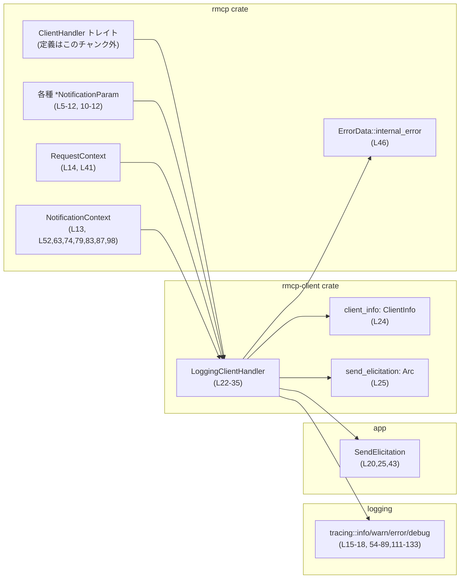
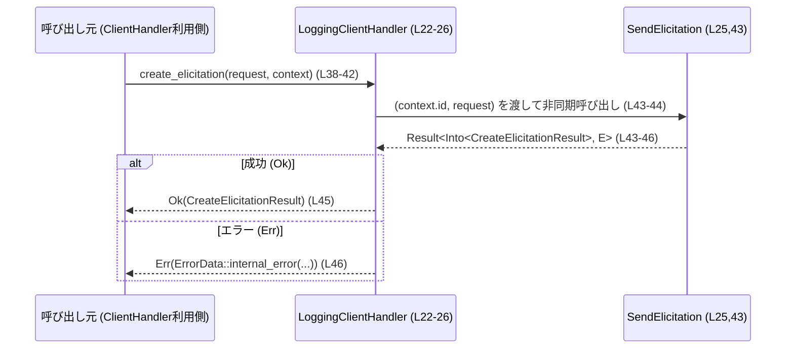
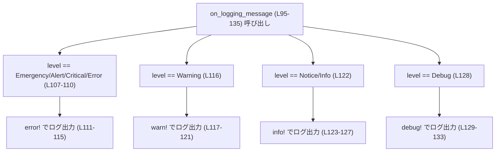
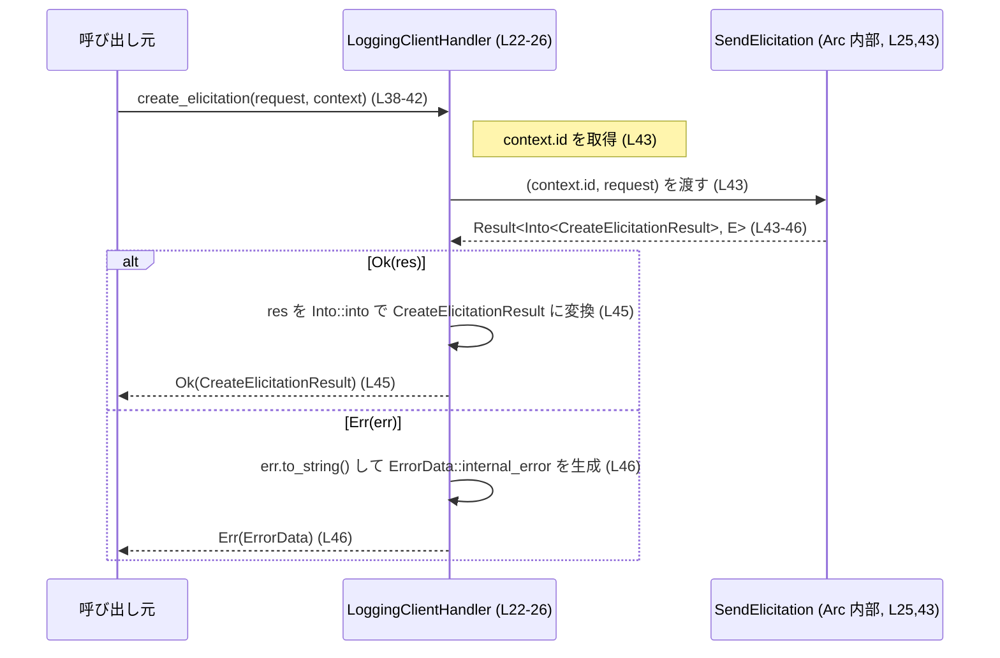
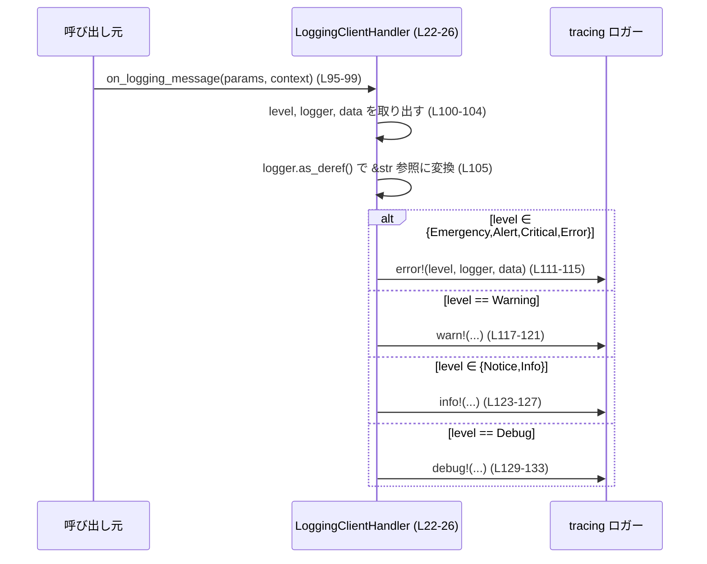

# rmcp-client/src/logging_client_handler.rs

## 0. ざっくり一言

`LoggingClientHandler` は、`rmcp::ClientHandler` トレイトを実装したクライアント側ハンドラで、  
MCP サーバーからの各種通知を `tracing` でログ出力しつつ、照会作成 (`create_elicitation`) を外部の送信関数に委譲するモジュールです。

---

## 1. このモジュールの役割

### 1.1 概要

- このモジュールは **MCP クライアントから見た各種イベントハンドリングとロギング** を行います。
- サーバーからのキャンセル・進捗・リソース更新・ツールリスト更新・プロンプトリスト更新・ログメッセージを受け取り、`tracing` 経由でログ出力します（`on_*` 系メソッド群、L49-135）。
- 照会作成リクエスト `create_elicitation` を、外部から渡された `SendElicitation` 関数オブジェクトに委譲し、その結果を `rmcp::ErrorData` にマッピングして返します（L38-47）。

### 1.2 アーキテクチャ内での位置づけ

このモジュールは、`rmcp` クレートが定義する `ClientHandler` トレイトの実装として機能し、  
アプリケーション側で用意した「照会送信ロジック (`SendElicitation`)」と「ログ出力 (`tracing`)」を橋渡しします。



> ※ `ClientHandler` や `SendElicitation` の詳細な定義は、このチャンクには現れません。

### 1.3 設計上のポイント

- **責務の分割**
  - `LoggingClientHandler` 自身は状態をほとんど持たず（`ClientInfo` と関数オブジェクトだけ、L24-25）、ロジックの大半を「外部の送信関数」と「ログ出力」に委譲する構造になっています。
- **共有とクローン**
  - 構造体は `#[derive(Clone)]`（L22）でクローン可能です。  
    内部の `send_elicitation` は `Arc<...>` に包まれているため、ハンドラをクローンしても同じ送信ロジックを共有します（L25, L32）。
- **非同期処理**
  - `ClientHandler` トレイトのメソッド実装は `async fn` で定義されており（L38,49,60,71,79,83,87,95）、  
    Tokio 等の非同期ランタイム上で非同期タスクとして並行実行されることを前提にした設計です。
- **エラーハンドリング**
  - `create_elicitation` では、`SendElicitation` の戻り値のエラーを `rmcp::ErrorData::internal_error` に変換しています（L43-46）。  
    これにより、アプリケーション内部エラーを MCP プロトコル上のエラー表現に統一しています。

### 1.4 コンポーネント一覧（インベントリー）

このチャンクに現れる構造体・メソッドの一覧です。

| 種別 | 名前 | 役割 / 用途 | 定義位置 |
|------|------|-------------|----------|
| 構造体 | `LoggingClientHandler` | MCP クライアント用のイベントハンドラ。各種通知をロギングし、`create_elicitation` を外部関数に委譲する。 | `rmcp-client/src/logging_client_handler.rs:L22-26` |
| フィールド | `client_info: ClientInfo` | クライアントの情報を保持し、`get_info` で返す。 | `rmcp-client/src/logging_client_handler.rs:L24` |
| フィールド | `send_elicitation: Arc<SendElicitation>` | `create_elicitation` を実際に送信するための関数オブジェクトを共有所有する。 | `rmcp-client/src/logging_client_handler.rs:L25` |
| 関数 | `LoggingClientHandler::new` | `ClientInfo` と `SendElicitation` を受け取り、`Arc` ラップしたハンドラを生成するコンストラクタ。 | `rmcp-client/src/logging_client_handler.rs:L28-34` |
| メソッド | `create_elicitation` | MCP の照会作成リクエストを `SendElicitation` に委譲し、結果を `CreateElicitationResult` / `ErrorData` に変換して返す。 | `rmcp-client/src/logging_client_handler.rs:L38-47` |
| メソッド | `on_cancelled` | リクエストキャンセル通知を受け取り、`info!` ログを出力する。 | `rmcp-client/src/logging_client_handler.rs:L49-58` |
| メソッド | `on_progress` | 進捗通知を受け取り、トークン・進捗値・メッセージなどを含む `info!` ログを出力する。 | `rmcp-client/src/logging_client_handler.rs:L60-68` |
| メソッド | `on_resource_updated` | リソース更新通知を受け取り、URI を含む `info!` ログを出力する。 | `rmcp-client/src/logging_client_handler.rs:L71-77` |
| メソッド | `on_resource_list_changed` | リソース一覧の変更通知を受け取り、`info!` ログを出力する。 | `rmcp-client/src/logging_client_handler.rs:L79-81` |
| メソッド | `on_tool_list_changed` | ツール一覧の変更通知を受け取り、`info!` ログを出力する。 | `rmcp-client/src/logging_client_handler.rs:L83-85` |
| メソッド | `on_prompt_list_changed` | プロンプト一覧の変更通知を受け取り、`info!` ログを出力する。 | `rmcp-client/src/logging_client_handler.rs:L87-89` |
| メソッド | `get_info` | 保持している `ClientInfo` をクローンして返す。 | `rmcp-client/src/logging_client_handler.rs:L91-93` |
| メソッド | `on_logging_message` | サーバーからのログメッセージ通知を受け取り、`LoggingLevel` に応じて `error!/warn!/info!/debug!` でログ出力する。 | `rmcp-client/src/logging_client_handler.rs:L95-135` |

---

## 2. 主要な機能一覧

- MCP 照会作成の委譲: `create_elicitation` で受け取ったリクエストを `SendElicitation` に渡し、結果を `CreateElicitationResult` / `ErrorData` に変換する。
- キャンセル通知ロギング: `on_cancelled` でキャンセル理由とリクエスト ID をログ出力する。
- 進捗通知ロギング: `on_progress` でトークン・進捗・トータル・メッセージをログ出力する。
- リソース更新通知ロギング: `on_resource_updated` / `on_resource_list_changed` でリソース関連の変化をログ出力する。
- ツール／プロンプト一覧更新ロギング: `on_tool_list_changed` / `on_prompt_list_changed` でそれぞれの一覧変化をログ出力する。
- サーバー側ログ転送: `on_logging_message` でサーバーからのログをローカルの `tracing` ログにレベルごとに出力する。
- クライアント情報の公開: `get_info` で `ClientInfo` を返し、ハンドラのメタ情報として利用できるようにする。

---

## 3. 公開 API と詳細解説

### 3.1 型一覧

| 名前 | 種別 | 役割 / 用途 | 定義位置 |
|------|------|-------------|----------|
| `LoggingClientHandler` | 構造体 | `rmcp::ClientHandler` トレイトの実装。MCP サーバーからの通知をログ出力し、照会作成リクエストを送信処理に委譲する。 | `rmcp-client/src/logging_client_handler.rs:L22-26` |

> `SendElicitation` は別モジュール `crate::rmcp_client` で定義されており、このチャンクには定義が現れません（L20）。

---

### 3.2 関数詳細（主要 7 件）

#### `LoggingClientHandler::new(client_info: ClientInfo, send_elicitation: SendElicitation) -> LoggingClientHandler`

**概要**

- `ClientInfo` と照会送信関数 `SendElicitation` を受け取り、`Arc<SendElicitation>` に包んだ `LoggingClientHandler` インスタンスを生成します（L28-34）。

**引数**

| 引数名 | 型 | 説明 |
|--------|----|------|
| `client_info` | `ClientInfo` | クライアントの識別・メタ情報。`get_info` から返されます（L24, L91-93）。 |
| `send_elicitation` | `SendElicitation` | MCP 照会を実際に送信する関数またはクロージャ。`create_elicitation` から呼び出されます（L25, L43）。 |

**戻り値**

- `LoggingClientHandler`  
  引数で受け取った情報を内部フィールドに保持した新しいハンドラ。

**内部処理の流れ**

1. フィールド `client_info` に引数 `client_info` をそのまま格納します（L31）。
2. フィールド `send_elicitation` には `Arc::new(send_elicitation)` を格納し、関数オブジェクトを共有所有可能にします（L32）。
3. `Self { ... }` を返します（L30-33）。

**Examples（使用例）**

`ClientInfo` や `SendElicitation` の具体的な構築方法はこのチャンクからは分からないため、プレースホルダで示します。

```rust
use rmcp::model::ClientInfo;
use rmcp_client::rmcp_client::SendElicitation;
use rmcp_client::logging_client_handler::LoggingClientHandler;

fn build_handler(client_info: ClientInfo, send_elicitation: SendElicitation) -> LoggingClientHandler {
    // client_info: クライアント名やバージョンなどを含む構造体（詳細はこのチャンクには現れません）
    // send_elicitation: (request_id, params) を受け取って非同期に照会を送信する関数・クロージャ

    LoggingClientHandler::new(client_info, send_elicitation)
}
```

**Errors / Panics**

- `new` 自体は `Result` を返さず、コード上からはエラーや `panic!` の可能性は読み取れません。この関数内の唯一の処理は `Arc::new` で、これは通常 `panic!` しません（メモリ不足など極端な状況を除く）。

**Edge cases（エッジケース）**

- `client_info` や `send_elicitation` がどのような制約を持つかは、このチャンクには現れません。

**使用上の注意点**

- `send_elicitation` が `Send + Sync` を満たすかどうかはこのファイルからは分かりませんが、非同期ランタイム上で複数タスクから共有されることが想定されるため、スレッドセーフな実装が望ましいです（`Arc` で共有されるため、並行アクセスされる可能性があります）。

---

#### `create_elicitation(&self, request: CreateElicitationRequestParams, context: RequestContext<RoleClient>) -> Result<CreateElicitationResult, rmcp::ErrorData>`

**概要**

- MCP の「照会作成」リクエストを受け取り、内部に保持している `SendElicitation` 関数を使って送信し、その結果を `CreateElicitationResult` / `rmcp::ErrorData` に変換して返す非同期メソッドです（L38-47）。

**引数**

| 引数名 | 型 | 説明 |
|--------|----|------|
| `&self` | `&LoggingClientHandler` | ハンドラの共有参照。内部状態は読み取りのみです。 |
| `request` | `CreateElicitationRequestParams` | サーバーに送信する照会作成パラメータ（詳細はこのチャンクには現れません、L7）。 |
| `context` | `RequestContext<RoleClient>` | リクエスト ID などを含むコンテキスト。ここでは `context.id` だけが使用されます（L41, L43）。 |

**戻り値**

- `Result<CreateElicitationResult, rmcp::ErrorData>`  
  - `Ok(CreateElicitationResult)`：`SendElicitation` が成功した場合（L43-45）。
  - `Err(rmcp::ErrorData)`：`SendElicitation` がエラーを返した場合、そのエラーを `ErrorData::internal_error` でラップしたもの（L46）。

**内部処理の流れ**

1. `self.send_elicitation` フィールドから `Arc<SendElicitation>` を取り出します（L43）。
2. 関数オブジェクトを `(self.send_elicitation)(context.id, request)` という形で呼び出します（L43）。
3. 非同期呼び出しの結果を `.await` で待機します（L44）。
4. 成功 (`Ok(...)`) の場合は `.map(Into::into)` により、戻り値を `CreateElicitationResult` に変換します（L45）。  
   ここから、`SendElicitation` の成功時の戻り値は `Into<CreateElicitationResult>` を実装していると読み取れます。
5. 失敗 (`Err(err)`) の場合は `.map_err(|err| rmcp::ErrorData::internal_error(err.to_string(), None))` により、  
   エラーを文字列化して `ErrorData::internal_error` でラップし、`Err` として返します（L46）。

**Mermaid フロー図（処理フロー）**



**Examples（使用例）**

テストや実装で `ClientHandler` として利用するときの典型的な呼び出しイメージです。

```rust
async fn send_request<H>(
    handler: &H,
    request: rmcp::model::CreateElicitationRequestParams,
    ctx: rmcp::service::RequestContext<rmcp::RoleClient>,
) -> Result<rmcp::model::CreateElicitationResult, rmcp::ErrorData>
where
    H: rmcp::ClientHandler, // 実際には LoggingClientHandler を使う
{
    // create_elicitation を await して結果を受け取る
    handler.create_elicitation(request, ctx).await
}
```

**Errors / Panics**

- `Err(rmcp::ErrorData)` になる条件:
  - `SendElicitation` が `Err(err)` を返した場合（L43-46）。
  - その `err` は `.to_string()` によって文字列化され、`ErrorData::internal_error(message, None)` が生成されます（L46）。
- `panic!` の可能性:
  - `SendElicitation` 自体が内部で `panic!` する可能性は、このチャンクからは判断できません。
  - `err.to_string()` が `panic!` するケースは通常想定されません。

**Edge cases（エッジケース）**

- `context.id` がどのような範囲・制約を持つかは、このチャンクには現れません。
- `request` が空あるいは不正な場合、`SendElicitation` 側がどう振る舞うかも、このチャンクには現れません。
- `SendElicitation` がネットワーク I/O を行う場合、タイムアウトや接続エラーなどが `Err` として戻される可能性がありますが、種類は不明です。

**使用上の注意点（安全性・並行性中心）**

- **共有参照 & 非同期**  
  - メソッドは `&self` を取り、内部フィールドへの変更を行っていません。  
    そのため、Rust の型システム的には同一インスタンスに対して複数タスクから同時に `create_elicitation` を呼び出してもデータ競合は起こりにくい構造になっています。
- **`SendElicitation` のスレッドセーフ性**  
  - `SendElicitation` がどのような型かは不明ですが、`Arc` を介して共有されるため、実際にマルチスレッド環境で使う場合は内部でミュータブルな状態を持つ場合に注意が必要です。
- **エラー情報の欠落**  
  - `ErrorData::internal_error(err.to_string(), None)` の第 2 引数に常に `None` を渡しているため（L46）、  
    エラーコード等の構造化情報が失われる可能性があります。  
    これは「仕様」か「制限」かはこのチャンクからは分かりません。

---

#### `on_cancelled(&self, params: CancelledNotificationParam, _context: NotificationContext<RoleClient>)`

**概要**

- サーバー側でリクエストがキャンセルされた際に呼ばれ、リクエスト ID とキャンセル理由を `info!` ログとして出力します（L49-58）。

**引数**

| 引数名 | 型 | 説明 |
|--------|----|------|
| `params` | `CancelledNotificationParam` | キャンセルされたリクエストの ID と理由を含むパラメータ（L51, L56-57）。 |
| `_context` | `NotificationContext<RoleClient>` | 通知コンテキスト。ここでは未使用で、変数名が `_context` になっています（L52）。 |

**戻り値**

- `()`（暗黙的）。ログ出力のみを行います。

**内部処理**

1. `info!` マクロを用いて `"MCP server cancelled request ..."` というメッセージを出力します（L54-57）。
2. メッセージの中で `params.request_id` と `params.reason` を `{:?}` でフォーマットして出力します（L55-56）。

**使用上の注意点**

- 引数 `_context` は未使用ですが、今後利用が追加される可能性があります。
- ログレベルは `info` 固定で、キャンセルが異常系なのか期待通りなのかはログだけでは判断できません。

---

#### `on_progress(&self, params: ProgressNotificationParam, _context: NotificationContext<RoleClient>)`

**概要**

- サーバーからの進捗通知を受け取り、進捗トークン・現在値・合計・メッセージを含んだ `info!` ログを出力します（L60-68）。

**引数**

| 引数名 | 型 | 説明 |
|--------|----|------|
| `params` | `ProgressNotificationParam` | 進捗トークンや進捗率などを含む通知パラメータ（L62, L66-67）。 |
| `_context` | `NotificationContext<RoleClient>` | 通知コンテキスト。ここでは未使用です（L63）。 |

**戻り値**

- `()`。

**内部処理**

1. `info!` マクロで `"MCP server progress notification ..."` というメッセージを出力します（L65-68）。
2. ログには `progress_token`, `progress`, `total`, `message` が含まれます（L66-67）。

**Edge cases**

- `params.total` や `params.message` は `Option` である可能性がありますが、ここでは `{:?}` でそのまま表示しているため、`None` の場合は `None` と出力されると考えられます（型定義はこのチャンクには現れません）。

**使用上の注意点**

- 進捗が頻繁に通知される場合、ログ量が増える可能性があります。`tracing` のログフィルタ設定で制御する必要があります。

---

#### `on_resource_updated(&self, params: ResourceUpdatedNotificationParam, _context: NotificationContext<RoleClient>)`

**概要**

- リソースが更新されたタイミングで呼び出され、更新されたリソースの URI を `info!` ログに出力します（L71-77）。

**引数**

| 引数名 | 型 | 説明 |
|--------|----|------|
| `params` | `ResourceUpdatedNotificationParam` | 更新されたリソースの URI を含むパラメータ（L73, L76）。 |
| `_context` | `NotificationContext<RoleClient>` | 通知コンテキスト（未使用、L74）。 |

**戻り値**

- `()`。

**内部処理**

1. `info!` マクロを呼び出し、`"MCP server resource updated (uri: {})"` という形式で URI をログ出力します（L76）。

**使用上の注意点**

- URI の形式や意味づけはこのチャンクには現れません。

---

#### `get_info(&self) -> ClientInfo`

**概要**

- コンストラクタで受け取った `ClientInfo` をクローンして返すメソッドです（L91-93）。

**引数**

| 引数名 | 型 | 説明 |
|--------|----|------|
| `&self` | `&LoggingClientHandler` | ハンドラの共有参照。`ClientInfo` を参照するのみです。 |

**戻り値**

- `ClientInfo`  
  内部フィールド `client_info` のクローン（L92）。

**内部処理**

1. `self.client_info.clone()` を呼び出して新しい `ClientInfo` を生成します（L92）。
2. それを戻り値として返します（L91-93）。

**使用上の注意点**

- `ClientInfo` がどの程度のサイズ・コストを持つかは不明ですが、頻繁なクローンはコストになる可能性があります。  
  ただし、ここでは API として所有権を返す必要があるため、`clone` は妥当な選択と考えられます。

---

#### `on_logging_message(&self, params: LoggingMessageNotificationParam, _context: NotificationContext<RoleClient>)`

**概要**

- サーバーから送られてきたログメッセージを受け取り、その `LoggingLevel` に応じて適切な `tracing` のログレベルにマッピングして出力する非同期メソッドです（L95-135）。

**引数**

| 引数名 | 型 | 説明 |
|--------|----|------|
| `params` | `LoggingMessageNotificationParam` | サーバー側ログのレベル・ロガー名・メッセージデータを含むパラメータ（L97-104）。 |
| `_context` | `NotificationContext<RoleClient>` | 通知コンテキスト。ここでは未使用です（L98）。 |

**戻り値**

- `()`。

**内部処理の流れ**

1. `LoggingMessageNotificationParam { level, logger, data } = params;` でフィールドをムーブして取り出します（L100-104）。
2. `let logger = logger.as_deref();` により、`Option<String>` などの所有型から `Option<&str>` のような借用参照に変換します（L105）。  
   これにより、フォーマット時に所有権を移動せずに参照できます。
3. `match level` で `LoggingLevel` をパターンマッチし、以下のグループごとに処理します（L106-133）:
   - `Emergency | Alert | Critical | Error` → `error!` ログで出力（L107-115）。
   - `Warning` → `warn!` ログで出力（L116-121）。
   - `Notice | Info` → `info!` ログで出力（L122-127）。
   - `Debug` → `debug!` ログで出力（L128-133）。
4. どの分岐でも `"MCP server log message (level: {:?}, logger: {:?}, data: {})"` というメッセージ書式を使用し、  
   `level`, `logger`, `data` を埋め込んで出力します（L112-113,118-119,124-125,130-131）。

**Mermaid フロー図（ロギングレベルマッピング）**



**Examples（使用例）**

`LoggingClientHandler` の利用側は通常 `ClientHandler` トレイト越しに呼び出しますが、  
ここではテストなどで直接呼ぶイメージを示します。

```rust
use rmcp::model::{LoggingMessageNotificationParam, LoggingLevel};
use rmcp::service::NotificationContext;
use rmcp::RoleClient;

// 非同期テストなどから呼び出す例
async fn test_logging(handler: &LoggingClientHandler) {
    let params = LoggingMessageNotificationParam {
        level: LoggingLevel::Info,      // 情報レベルのログ
        logger: Some("mcp-server".into()),
        data: "hello from server".into(),
    };

    // NotificationContext の生成方法はこのチャンクには現れないので省略
    let ctx: NotificationContext<RoleClient> = /* ... */;

    handler.on_logging_message(params, ctx).await;
}
```

**Errors / Panics**

- このメソッドは `Result` を返さず、コード中にも `panic!` に相当する記述はありません。
- `tracing` の `error!` / `warn!` / `info!` / `debug!` マクロが内部で `panic!` することは一般的にはありません。

**Edge cases**

- `logger` が `None` の場合、`logger.as_deref()` により `Option<&str>` の `None` となり、そのまま `{:?}` で `None` とログ出力されると考えられます（L105, L112 など）。
- `data` が非常に長い文字列の場合、ログ量が増大し、ログ出力先のストレージを圧迫する可能性があります。

**使用上の注意点（安全性・セキュリティ）**

- **情報漏えいリスク**  
  - `data` がサーバー側から送られた任意の文字列をそのままログに書き出すため（L112,118,124,130）、  
    サーバーがユーザー入力を含むセンシティブ情報をログとして送信すると、クライアント側ログにも記録されます。  
    ログの取り扱いには注意が必要です。
- **ログ量**  
  - サーバーが `Debug` や `Info` レベルのログを大量に送信する場合、クライアント側のログも同様に膨らみます。  
    運用時には `tracing` のフィルタ設定で適切に制御する必要があります。

---

### 3.3 その他の関数

詳細解説を省略した補助的なメソッドです。

| 関数名 | 役割（1 行） | 定義位置 |
|--------|--------------|----------|
| `on_resource_list_changed(&self, _context)` | サーバーからのリソース一覧変更通知を受け取り、`"resource list changed"` と `info!` ログ出力する。 | `rmcp-client/src/logging_client_handler.rs:L79-81` |
| `on_tool_list_changed(&self, _context)` | サーバーからのツール一覧変更通知を受け取り、`"tool list changed"` と `info!` ログ出力する。 | `rmcp-client/src/logging_client_handler.rs:L83-85` |
| `on_prompt_list_changed(&self, _context)` | サーバーからのプロンプト一覧変更通知を受け取り、`"prompt list changed"` と `info!` ログ出力する。 | `rmcp-client/src/logging_client_handler.rs:L87-89` |

---

## 4. データフロー

ここでは代表的な 2 つのシナリオについて、`LoggingClientHandler` 内のデータの流れを示します。

### 4.1 照会作成 (`create_elicitation`) のデータフロー



- 外部から渡されるのは `request`, `context` の 2 つ（L38-42）。
- ハンドラ内部では、`context.id` と `request` が `SendElicitation` に渡されます（L43）。
- 戻り値は `Result` として呼び出し元に返されます（L38-47）。

### 4.2 サーバーログ通知 (`on_logging_message`) のデータフロー



- `params` の中身は一度ローカル変数に分解され（L100-104）、`logger` の所有権を借用参照に変換した上でログに流れます（L105）。
- `NotificationContext` はこの処理では使用されません（L98）。

---

## 5. 使い方（How to Use）

### 5.1 基本的な使用方法

このモジュール単体では、`LoggingClientHandler` を生成して `rmcp::ClientHandler` として利用する形になります。  
`ClientInfo` と `SendElicitation` の具体的な作り方はこのチャンクには現れないため、省略します。

```rust
use std::sync::Arc;
use rmcp::model::{ClientInfo, CreateElicitationRequestParams};
use rmcp::service::RequestContext;
use rmcp::RoleClient;

use rmcp_client::rmcp_client::SendElicitation;
use rmcp_client::logging_client_handler::LoggingClientHandler;

async fn example_usage() -> Result<(), rmcp::ErrorData> {
    // 1. ClientInfo を用意する（フィールドやコンストラクタはこのチャンクには現れません）
    let client_info: ClientInfo = /* ... */;

    // 2. SendElicitation を用意する
    //    ここでは型エイリアスの具体的な定義が分からないため、プレースホルダとします。
    let send_elicitation: SendElicitation = /* ... */;

    // 3. ハンドラを生成する
    let handler = LoggingClientHandler::new(client_info, send_elicitation);

    // 4. リクエストとコンテキストを用意する
    let request: CreateElicitationRequestParams = /* ... */;
    let ctx: RequestContext<RoleClient> = /* ... */;

    // 5. 照会作成を行う
    let result = handler.create_elicitation(request, ctx).await?;

    // 6. 結果の利用（詳細はこのチャンクには現れません）
    println!("result: {:?}", result);

    Ok(())
}
```

### 5.2 よくある使用パターン

- **ロギングベースのハンドラとして差し替える**
  - `rmcp::ClientHandler` を実装する他のハンドラの代わりに、`LoggingClientHandler` を登録することで、  
    サーバーからの通知を詳細にログ取得する用途に向きます。
- **`SendElicitation` の中でネットワーク処理**
  - `SendElicitation` を HTTP クライアントやソケット通信に紐づけることで、  
    `create_elicitation` から透過的にネットワーク呼び出しを行えます（詳細はこのチャンクには現れません）。

### 5.3 よくある間違い（想定される誤用例）

コードから推測できる範囲での誤用パターンです。

```rust
// 誤り例: SendElicitation を Arc で包んだものを new に渡してしまう
// let send_elicitation = Arc::new(...);
// let handler = LoggingClientHandler::new(client_info, send_elicitation);

// 正しい例: new の引数は SendElicitation 型そのもの
let send_elicitation: SendElicitation = /* ... */;
let handler = LoggingClientHandler::new(client_info, send_elicitation);
```

理由:

- `LoggingClientHandler::new` の中で `Arc::new(send_elicitation)` を行っているため（L32）、  
  引数側で `Arc` に包むと `Arc<Arc<SendElicitation>>` のようになり、型が一致しません。

### 5.4 使用上の注意点（まとめ）

- **並行呼び出し**
  - メソッドはすべて `&self` を取るだけで内部状態を書き換えないため、  
    型システム上は同じハンドラを複数タスクから並行に利用してもデータ競合は発生しにくい設計です。
  - ただし、`SendElicitation` の実装側で内部状態を持つ場合は、スレッドセーフ性を考慮する必要があります。
- **ログの扱い**
  - `on_logging_message` などは任意の文字列をログ出力するため、プライバシー情報・機密情報がログに残らないよう全体設計で配慮が必要です（L112-113 など）。
- **エラー情報のマッピング**
  - `create_elicitation` のエラーはすべて `internal_error` にまとめているため（L46）、  
    より詳細なエラー分類を行いたい場合は、この部分の変更が必要になります。

---

## 6. 変更の仕方（How to Modify）

### 6.1 新しい機能を追加する場合

例: 通知を受け取ったときにメトリクスを更新したい場合。

1. **ロジック追加場所の特定**
   - 対応する通知メソッド（`on_progress`, `on_resource_updated`, `on_logging_message` など）内に処理を追加します（L60-68, L71-77, L95-135）。
2. **依存の注入**
   - メトリクス用オブジェクトを使いたい場合は、`LoggingClientHandler` のフィールドとして追加し（L24-25）、`new` で初期化します（L28-34）。
3. **呼び出し**
   - 追加したフィールドをメソッド内で参照して、カウンタインクリメントなどを行います。

### 6.2 既存の機能を変更する場合

- **`create_elicitation` のエラー変換を変更したい**
  - 変更箇所: `.map_err(|err| rmcp::ErrorData::internal_error(err.to_string(), None))` の部分（L46）。
  - 影響範囲:
    - `ClientHandler` を利用する上位層が、現在は「内部エラー」として扱っているものが別のエラー種別になる可能性があります。
- **ロギングレベルを変えたい**
  - 変更箇所: `on_logging_message` の `match level` と `error!/warn!/info!/debug!` 呼び出し（L106-133）。
  - 注意点:
    - `LoggingLevel` の列挙値は `rmcp::model` で定義されているため（L9）、  
      ここで扱わないレベルを追加した場合はコンパイルエラーで気付くことができます。

---

## 7. 関連ファイル

このモジュールと密接に関係する外部型・モジュールです（定義はこのチャンクには現れません）。

| パス / 型 | 役割 / 関係 |
|-----------|------------|
| `crate::rmcp_client::SendElicitation` | `create_elicitation` から呼び出される照会送信ロジックの型。`LoggingClientHandler` が `Arc` で保持します（L20, L25, L43）。 |
| `rmcp::ClientHandler` | 本モジュールで実装しているトレイト。MCP クライアントのコールバックインターフェースを提供します（L3, L37）。 |
| `rmcp::model::ClientInfo` | クライアント情報のデータ型。`LoggingClientHandler` のフィールドおよび `get_info` の戻り値として利用されます（L6, L24, L91-93）。 |
| `rmcp::model::*NotificationParam` | 各種通知のパラメータ型（キャンセル・進捗・リソース更新・ログメッセージなど）。`on_*` メソッドの引数として利用されます（L5,7-12, L49-52,60-63,71-74,95-98）。 |
| `rmcp::service::{RequestContext, NotificationContext}` | リクエストおよび通知コンテキストを表す型。`create_elicitation` および `on_*` メソッドの引数で使用されます（L13-14, L41-42,52,63,74,79,83,87,98）。 |
| `tracing::{info,warn,error,debug}` | ロギング用マクロ群。すべての `on_*` メソッドおよび `on_logging_message` で利用されています（L15-18, L54-77,79-89,111-133）。 |

---

### Bugs / Security に関する補足（コードから読み取れる範囲）

- **潜在的なバグ要因**
  - `create_elicitation` のエラーをすべて `internal_error` として扱うため、  
    エラーの種類による分岐が必要な場合に情報が不足する可能性があります（L46）。
- **セキュリティ上の注意点**
  - `on_logging_message` で `data` をそのままログ出力しているため（L112,118,124,130）、  
    サーバーが機密情報を誤ってログとして送信した場合にクライアント側ログにも残ります。  
    ログファイルのアクセス制御・マスキングなどが必要になる場合があります。
