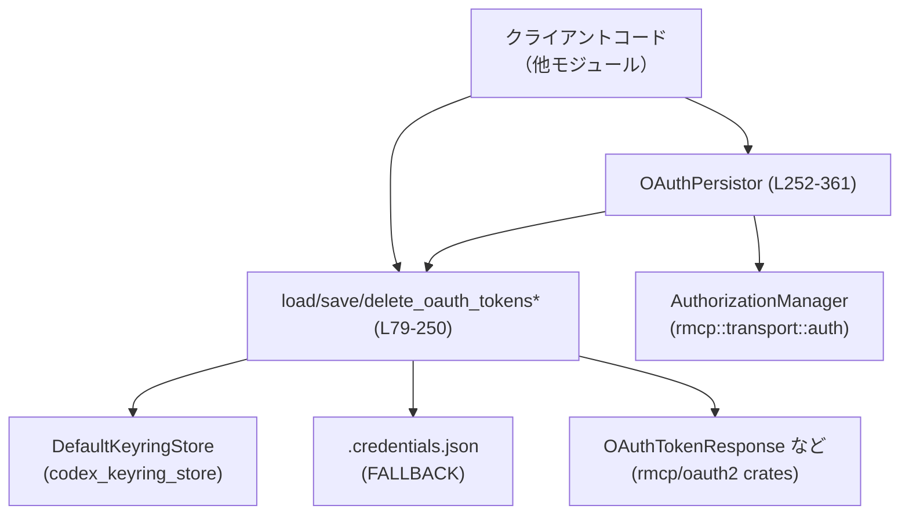
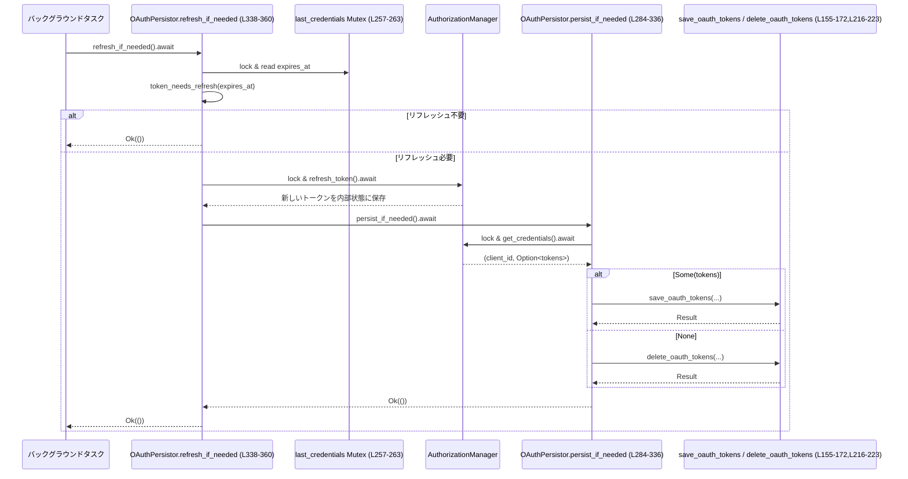

# rmcp-client/src/oauth.rs

## 0. ざっくり一言

MCP サーバー向けの OAuth アクセストークン／リフレッシュトークンを、OS のキーリングと `CODEX_HOME/.credentials.json` ファイルに保存・読み出し・削除し、`AuthorizationManager` と連携して自動リフレッシュ・自動永続化するモジュールです（`rmcp-client/src/oauth.rs:L1-585`）。

> 以下で示す行番号 `Lxx-yy` は、このファイル先頭行を `L1` としたものです。

---

## 1. このモジュールの役割

### 1.1 概要

- このモジュールは **MCP サーバー用 OAuth 資格情報の永続化と更新管理** を行います。
- 主な機能は次のとおりです（`oauth.rs:L53-64, L79-103, L252-361`）。
  - OS のキーリング（macOS キーチェーン、Windows Credential Manager、Linux Secret Service など）へのトークン保存・読み出し
  - キーリングが使えない／失敗した場合の **JSON ファイルへのフォールバック保存**（`CODEX_HOME/.credentials.json`）
  - `AuthorizationManager` と連携し、トークンの有効期限に基づく自動リフレッシュと保存
  - 有効期限（ミリ秒タイムスタンプ）と `expires_in` 秒数の相互変換ユーティリティ

### 1.2 アーキテクチャ内での位置づけ

このモジュールは「認可管理」と「永続ストレージ（キーリング／ファイル）」の間を仲介します。



- 認可フロー自体は `AuthorizationManager` が担当し、このモジュールはその結果であるトークンの保存・ロード・更新判断を行います（`oauth.rs:L257-263, L284-360`）。
- キーリング操作は `codex_keyring_store::KeyringStore` 抽象に隠蔽されており、ここではインターフェース越しにしか扱いません（`oauth.rs:L46-47, L121-153, L174-198, L225-250`）。

### 1.3 設計上のポイント

コードから読み取れる特徴を箇条書きで示します。

- **ストレージ選択ポリシー**（`oauth.rs:L79-95, L155-172, L216-223`）
  - `OAuthCredentialsStoreMode::Auto`  
    - 読み込み: キーリング優先、失敗時はファイルへフォールバック
    - 書き込み: キーリング優先、失敗時はファイルへフォールバック
    - 削除: キーリングとファイル両方を削除。キーリング削除エラーはそのままエラーにする
  - `File`: 常にファイルのみ利用（キーリングエラーは削除時のみ無視）
  - `Keyring`: 常にキーリングのみ利用（フォールバックなし。ただし `save_*_with_keyring_with_fallback_to_file` は内部ユーティリティ）

- **状態管理**
  - 永続化されたトークンそのものは `StoredOAuthTokens` 構造体で表現（`oauth.rs:L56-64`）。
  - `OAuthPersistorInner` が `AuthorizationManager` と最後に保存した資格情報を保持し、`Arc` + `tokio::sync::Mutex` でスレッド安全に共有（`oauth.rs:L257-263`）。

- **エラーハンドリング**
  - すべての公開 API は `anyhow::Result` を返し、コンテキスト付きエラーを付加（`oauth.rs:L79-95, L155-172, L216-223, L528-548`）。
  - キーリングやファイル I/O のエラーを適切にラップしつつ、Auto モードでは可能な限りフォールバックして動作継続。

- **非同期・並行性**
  - ストレージ操作自体は同期 I/O ですが、`OAuthPersistor` のメソッドは `async fn` で、`AuthorizationManager` との連携に `tokio::sync::Mutex` を利用（`oauth.rs:L48-49, L265-361`）。
  - ロックのスコープをブロックで明示的に区切り、複数の Mutex が同時にロックされないよう配慮（デッドロック回避）。

- **セキュリティ**
  - OS キーリングを利用するのが基本方針（`KEYRING_SERVICE` 名を指定して保存、`oauth.rs:L53, L143-152, L181-197`）。
  - フォールバックファイルは `CODEX_HOME/.credentials.json` に置かれ、Unix ではパーミッション `0600`（所有者のみ読み書き）に設定（`oauth.rs:L363-366, L550-575`）。
  - キーリングのキーは `server_name` + SHA-256 ハッシュのプレフィックスで構成し、内部 JSON ペイロードを直接キーとして保存しない（`oauth.rs:L509-520, L577-585`）。

---

## 2. 主要な機能一覧 / コンポーネント一覧

### 2.1 機能の箇条書き

- OAuth トークンの読み込み (`load_oauth_tokens`, `has_oauth_tokens`)（`oauth.rs:L79-103`）
- OAuth トークンの保存 (`save_oauth_tokens`) と削除 (`delete_oauth_tokens`)（`oauth.rs:L155-172, L216-223`）
- キーリング ↔ ファイルのフォールバックロジック（`oauth.rs:L121-135, L174-214, L225-250, L382-452`）
- トークン有効期限の管理（`compute_expires_at_millis`, `expires_in_from_timestamp`, `token_needs_refresh`, `refresh_expires_in_from_timestamp`）（`oauth.rs:L105-119, L469-507`）
- `OAuthPersistor` による `AuthorizationManager` との統合（自動永続化・自動リフレッシュ）（`oauth.rs:L252-361`）
- フォールバック JSON ファイルの読み書き・パス解決（`oauth.rs:L363-366, L522-548, L550-575`）

### 2.2 型一覧（構造体など）

| 名前 | 種別 | 役割 / 用途 | 定義位置 |
|------|------|-------------|----------|
| `StoredOAuthTokens` | 構造体 | サーバー名・URL・クライアント ID と、実際の `OAuthTokenResponse`（ラップしたもの）および有効期限をまとめて表現する永続化用 DTO | `oauth.rs:L56-64` |
| `WrappedOAuthTokenResponse` | 構造体 | `OAuthTokenResponse` をラップし、JSON 文字列ベースの `PartialEq` 実装を提供する（部分的な等価比較のため） | `oauth.rs:L67-68, L70-77` |
| `OAuthPersistor` | 構造体 | `AuthorizationManager` とストレージの間を仲介し、トークンの永続化・リフレッシュを非同期に行う高レベルコンポーネント | `oauth.rs:L252-255, L265-361` |
| `OAuthPersistorInner` | 構造体(非公開) | `OAuthPersistor` の内部状態（サーバー名、URL、`AuthorizationManager` へのハンドル、保存モード、最後に保存したトークン）を保持 | `oauth.rs:L257-263` |
| `FallbackTokenEntry` | 構造体(非公開) | フォールバック JSON ファイル `.credentials.json` 内の 1 エントリを表現する構造体 | `oauth.rs:L368-380` |
| `TempCodexHome` | 構造体(テスト用) | テスト時に `CODEX_HOME` を一時ディレクトリに切り替え、Drop 時に環境変数を戻す RAII ヘルパ | `oauth.rs:L602-621, L625-631` |

### 2.3 プロダクション関数・メソッド一覧

テストモジュール外に定義されている主な関数・メソッドの一覧です。

| 名前 | 概要 | 定義位置 |
|------|------|----------|
| `load_oauth_tokens` | モードに応じてキーリング／ファイルから `StoredOAuthTokens` を読み出す | `oauth.rs:L79-95` |
| `has_oauth_tokens` | 指定サーバー・URL の資格情報が存在するかをブール値で返す | `oauth.rs:L97-103` |
| `refresh_expires_in_from_timestamp` | `StoredOAuthTokens.expires_at` から `OAuthTokenResponse` の `expires_in` を再計算して設定 | `oauth.rs:L105-119` |
| `load_oauth_tokens_from_keyring_with_fallback_to_file` | キーリングからの読み込みを試み、失敗時・未登録時にファイルへフォールバック | `oauth.rs:L121-135` |
| `load_oauth_tokens_from_keyring` | キーリングからシリアライズ済みトークンを読み出しデシリアライズ | `oauth.rs:L137-153` |
| `save_oauth_tokens` | モードに応じてキーリング／ファイルへ `StoredOAuthTokens` を保存 | `oauth.rs:L155-172` |
| `save_oauth_tokens_with_keyring` | キーリングへの保存を行い、成功時にフォールバックファイルから削除 | `oauth.rs:L174-198` |
| `save_oauth_tokens_with_keyring_with_fallback_to_file` | キーリングへの保存を試み、失敗時にはファイル保存へフォールバック | `oauth.rs:L200-214` |
| `delete_oauth_tokens` | モードに応じてキーリングとファイルからトークンを削除 | `oauth.rs:L216-223` |
| `delete_oauth_tokens_from_keyring_and_file` | キーリングとファイル双方からトークン削除を試みる内部ユーティリティ | `oauth.rs:L225-250` |
| `OAuthPersistor::new` | `OAuthPersistor` のコンストラクタ | `oauth.rs:L265-282` |
| `OAuthPersistor::persist_if_needed` | `AuthorizationManager` に保持されている最新トークンを読み出し、変更があれば永続化し、なくなっていれば削除 | `oauth.rs:L284-336` |
| `OAuthPersistor::refresh_if_needed` | 有効期限に基づきトークンのリフレッシュが必要か判定し、必要なら `AuthorizationManager` にリフレッシュを依頼しその結果を永続化 | `oauth.rs:L338-360` |
| `load_oauth_tokens_from_file` | フォールバック JSON ファイルから該当エントリを探し `StoredOAuthTokens` に変換 | `oauth.rs:L382-423` |
| `save_oauth_tokens_to_file` | `StoredOAuthTokens` を `FallbackTokenEntry` に変換し JSON ファイルへ保存 | `oauth.rs:L425-452` |
| `delete_oauth_tokens_from_file` | JSON ファイルからキーに対応するエントリを削除し、空ならファイル自体も削除 | `oauth.rs:L454-467, L550-575` |
| `compute_expires_at_millis` | `OAuthTokenResponse.expires_in` と現在時刻から、有効期限の絶対値（UNIX エポックからのミリ秒）を計算 | `oauth.rs:L469-481` |
| `expires_in_from_timestamp` | `expires_at`（ミリ秒）と現在時刻から、残り秒数を `expires_in` として計算 | `oauth.rs:L483-494` |
| `token_needs_refresh` | `expires_at` と現在時刻 + スキューの比較で、リフレッシュが必要か判定 | `oauth.rs:L496-507` |
| `compute_store_key` | サーバー種別・URL から SHA-256 ハッシュを作り、`server_name|hash` 形式のストレージキーを生成 | `oauth.rs:L509-520, L577-585` |
| `fallback_file_path` | `CODEX_HOME` を基準とした `.credentials.json` のパスを決定 | `oauth.rs:L522-526` |
| `read_fallback_file` | `.credentials.json` を読み込み `FallbackFile`（`BTreeMap`）としてパース | `oauth.rs:L528-548` |
| `write_fallback_file` | `FallbackFile` を `.credentials.json` に書き出し、UNIX ではパーミッションを `0600` に設定 | `oauth.rs:L550-575` |
| `sha_256_prefix` | `serde_json::Value` をシリアライズし SHA-256 ハッシュの先頭 16 文字を返す | `oauth.rs:L577-585` |

---

## 3. 公開 API と詳細解説

### 3.1 公開されている主要な型

このファイルから「公開（`pub`）」されているのは次の 3 つです。

| 名前 | 種別 | 役割 / 用途 | 定義位置 |
|------|------|-------------|----------|
| `StoredOAuthTokens` | 構造体 | トークン永続化のための情報コンテナ。クライアント側からも構築・検査される可能性のあるデータ型 | `oauth.rs:L56-64` |
| `WrappedOAuthTokenResponse` | 構造体 | `OAuthTokenResponse` をラップし、比較やシリアライズで使いやすくするための公開型 | `oauth.rs:L67-68` |
| `save_oauth_tokens` / `delete_oauth_tokens` | 関数 | 他モジュールから直接呼ばれるトークン保存・削除 API | `oauth.rs:L155-172, L216-223` |

`load_oauth_tokens` や `OAuthPersistor` は `pub(crate)` ですので、この crate 内から利用される内部 API です。

### 3.2 重要関数の詳細解説（テンプレート適用）

#### `load_oauth_tokens(server_name: &str, url: &str, store_mode: OAuthCredentialsStoreMode) -> Result<Option<StoredOAuthTokens>>`

**概要**

- 指定されたサーバー名・URL・ストアモードに基づき、OAuth トークンを読み出す関数です（`oauth.rs:L79-95`）。
- Auto モードではキーリングを優先しつつ、未登録・エラー時にはフォールバックファイルから読み出します。

**引数**

| 引数名 | 型 | 説明 |
|--------|----|------|
| `server_name` | `&str` | 資格情報を区別するサーバー名。実際のキーは `server_name` + URL から計算されます |
| `url` | `&str` | MCP サーバーの URL。ストレージキー計算に使われます |
| `store_mode` | `OAuthCredentialsStoreMode` | `Auto` / `File` / `Keyring` のいずれか。使用するストレージ種別を指定します |

**戻り値**

- `Ok(Some(tokens))` : トークンが見つかり、正しく復元できた場合。
- `Ok(None)` : 該当するトークンが存在しない場合。
- `Err(anyhow::Error)` : キーリング・ファイル操作・JSON パースなどが失敗した場合。

**内部処理の流れ**

1. `DefaultKeyringStore` のインスタンスを生成（`oauth.rs:L84`）。
2. `store_mode` に応じて処理を分岐（`oauth.rs:L85-93`）。
   - `Auto`  
     → `load_oauth_tokens_from_keyring_with_fallback_to_file` を呼び出し（キーリング優先・フォールバックあり）。
   - `File`  
     → `load_oauth_tokens_from_file` を直接呼び出し。
   - `Keyring`  
     → `load_oauth_tokens_from_keyring` を呼び出し、失敗時に `"failed to read OAuth tokens from keyring"` というコンテキスト付きのエラーとして返却。

**Examples（使用例）**

```rust
use rmcp_client::oauth::load_oauth_tokens;                     // トークン読み出し関数をインポート
use codex_config::types::OAuthCredentialsStoreMode;            // 保存モードの列挙体

fn main() -> anyhow::Result<()> {
    let mode = OAuthCredentialsStoreMode::Auto;                // キーリング優先、フォールバックあり
    let maybe_tokens = load_oauth_tokens(
        "my-server",                                           // サーバー名
        "https://mcp.example.com",                             // サーバー URL
        mode,
    )?;                                                        // エラー時は ? で早期リターン

    if let Some(tokens) = maybe_tokens {                       // トークンが存在する場合
        // tokens.token_response.0 からアクセストークンを取得して利用する
        println!("access token = {}",
            tokens.token_response.0.access_token().secret());  // トークン文字列を表示（実使用ではログ出力は注意）
    } else {
        // ここで初回の OAuth 認可フローを実行し、新しいトークンを取得する
    }
    Ok(())
}
```

**Errors / Panics**

- エラー (`Err`) になりうる条件（`oauth.rs:L79-95`）:
  - `KeyringStore` 実装がエラーを返した場合（Keyring モード）。
  - フォールバックファイルの読取エラーや JSON パースエラー。
- パニック条件:
  - この関数自体には `unwrap` などのパニック要因はなく、すべて `Result` に包まれて返ります。

**Edge cases（エッジケース）**

- `store_mode` が `Keyring` のときにキーリングが利用できない・壊れている場合  
  → エラーとして即座に返され、ファイルにはフォールバックしません（`oauth.rs:L90-93`）。
- `store_mode` が `File` のとき  
  → キーリングは一切参照せず、`.credentials.json` のみを見ます。
- Auto モードでキーリングにトークンが存在しない (`Ok(None)`) 場合  
  → フォールバックファイルからの読み出しに移行します（`oauth.rs:L121-135`）。

**使用上の注意点**

- `server_name` と `url` は、保存時 (`save_oauth_tokens`) と読み出し時で **同じ値** を指定する必要があります。異なる値を指定すると別キーとして扱われ、トークンが見つかりません。
- エラー時には `anyhow` のコンテキストメッセージが付与されるので、ログに出して原因を確認する運用を前提としています。

---

#### `save_oauth_tokens(server_name: &str, tokens: &StoredOAuthTokens, store_mode: OAuthCredentialsStoreMode) -> Result<()>`

**概要**

- `StoredOAuthTokens` を、指定モードに従ってキーリングまたはフォールバックファイルに保存します（`oauth.rs:L155-172`）。
- Auto モードではキーリングへ保存できればフォールバックファイルを削除し、失敗した場合にファイルへフォールバックします。

**引数**

| 引数名 | 型 | 説明 |
|--------|----|------|
| `server_name` | `&str` | ストレージキー生成の一部として利用されるサーバー名 |
| `tokens` | `&StoredOAuthTokens` | 保存するトークン情報一式 |
| `store_mode` | `OAuthCredentialsStoreMode` | 保存モード（Auto / File / Keyring） |

**戻り値**

- 成功時は `Ok(())`。
- いずれかの保存操作が失敗した場合 `Err(anyhow::Error)`。

**内部処理の流れ**

1. `DefaultKeyringStore` を生成（`oauth.rs:L160`）。
2. `store_mode` に応じて保存処理を分岐（`oauth.rs:L161-170`）。
   - `Auto` → `save_oauth_tokens_with_keyring_with_fallback_to_file` を呼び出し。
   - `File` → `save_oauth_tokens_to_file` を呼び出し。
   - `Keyring` → 失敗時にフォールバックしない `save_oauth_tokens_with_keyring` を呼び出し。

**Examples（使用例）**

```rust
use rmcp_client::oauth::{save_oauth_tokens, StoredOAuthTokens, WrappedOAuthTokenResponse};
use codex_config::types::OAuthCredentialsStoreMode;
use rmcp::transport::auth::OAuthTokenResponse;
use oauth2::{AccessToken, EmptyExtraTokenFields};
use oauth2::basic::BasicTokenType;

fn store_example() -> anyhow::Result<()> {
    // サンプルの OAuthTokenResponse を作成
    let response = OAuthTokenResponse::new(
        AccessToken::new("access-token".to_string()),          // アクセストークン文字列
        BasicTokenType::Bearer,                                // トークンタイプ
        EmptyExtraTokenFields {},                              // 追加フィールドなし
    );

    // 永続化用の StoredOAuthTokens を構築
    let tokens = StoredOAuthTokens {
        server_name: "my-server".to_string(),
        url: "https://mcp.example.com".to_string(),
        client_id: "my-client-id".to_string(),
        token_response: WrappedOAuthTokenResponse(response),
        expires_at: None,                                      // ここが None なら保存側で計算される場合もある
    };

    save_oauth_tokens("my-server", &tokens, OAuthCredentialsStoreMode::Auto)?; // Auto モードで保存
    Ok(())
}
```

**Errors / Panics**

- キーリング保存の失敗（`KeyringStore::save` が `Err` を返した場合）→ エラーに `message()` を含めて返却（`oauth.rs:L181-197`）。
- フォールバックファイルへの書き込み (`write_fallback_file`) 失敗 → I/O エラーとして返却（`oauth.rs:L425-452, L550-575`）。
- パニックとなるコードは使われていません。

**Edge cases**

- `store_mode::Keyring` の場合  
  → キーリング保存に失敗すると **即エラー**。ファイルにはフォールバックしません（`oauth.rs:L168-170`）。
- `store_mode::Auto` の場合  
  → キーリング保存エラー時に WARN ログを出しつつファイル保存にフォールバックします（`oauth.rs:L200-214`）。
- `tokens.server_name` と `server_name` 引数が異なる場合  
  → ストレージキーは引数 `server_name` と `tokens.url` から計算されますが、構造体内の `server_name` フィールドもそのまま保存されます。  
    一貫して同じ値を使うことが前提です。

**使用上の注意点**

- Auto モードでは「どちらに保存されたか」は内部実装に依存するため、削除時も同じモードを使うのが安全です。
- トークン文字列自体は暗号化されずにファイルに保存されるため（キーリングを使わない場合）、運用上は OS レベルのディレクトリ保護やディスク暗号化などを前提とする必要があります（`oauth.rs:L363-366, L550-575`）。

---

#### `delete_oauth_tokens(server_name: &str, url: &str, store_mode: OAuthCredentialsStoreMode) -> Result<bool>`

**概要**

- キーリングおよびフォールバックファイルから、指定サーバーの OAuth トークンを削除する関数です（`oauth.rs:L216-223`）。
- Auto / Keyring モードではキーリング削除エラーをエラーとして返しますが、File モードではキーリングエラーを無視します。

**引数**

| 引数名 | 型 | 説明 |
|--------|----|------|
| `server_name` | `&str` | 削除対象のサーバー名 |
| `url` | `&str` | 削除対象のサーバー URL |
| `store_mode` | `OAuthCredentialsStoreMode` | 削除モード |

**戻り値**

- `Ok(true)` : キーリングまたはファイルのどちらかから少なくとも 1 件削除された。
- `Ok(false)` : どちらにも見つからず、削除対象がなかった。
- `Err(anyhow::Error)` : キーリング削除が失敗し、モードが Auto または Keyring の場合。

**内部処理の流れ**

1. `DefaultKeyringStore` を生成（`oauth.rs:L221`）。
2. `delete_oauth_tokens_from_keyring_and_file` を呼び出し（`oauth.rs:L222-223`）。
3. 内部関数では
   - ストレージキーを計算（`compute_store_key`、`oauth.rs:L231`）。
   - キーリング削除を試み、エラー時はログとモードに応じたエラー伝搬を実施（`oauth.rs:L232-245`）。
   - フォールバックファイルからも削除し、どちらかで削除されたかどうかを返す（`oauth.rs:L248-249`）。

**Examples（使用例）**

```rust
use rmcp_client::oauth::delete_oauth_tokens;
use codex_config::types::OAuthCredentialsStoreMode;

fn revoke() -> anyhow::Result<()> {
    let removed = delete_oauth_tokens(
        "my-server",                                          // サーバー名
        "https://mcp.example.com",                            // URL
        OAuthCredentialsStoreMode::Auto,                      // Auto モード
    )?;

    if removed {
        println!("tokens removed");
    } else {
        println!("no tokens to remove");
    }
    Ok(())
}
```

**Errors / Panics**

- Auto / Keyring モードで `KeyringStore::delete` がエラーを返した場合、エラーとして返却し、ファイル削除処理に進みません（`oauth.rs:L238-242`）。
- File モードではキーリングエラーを無視し、ファイル削除のみを継続します（`oauth.rs:L243-244`）。
- パニックはありません。

**Edge cases**

- フォールバックファイルが存在しない場合  
  → `read_fallback_file` が `Ok(None)` を返し、`delete_oauth_tokens_from_file` は `Ok(false)` を返します（`oauth.rs:L454-458`）。
- キーリングには存在しないがファイルには存在するケース  
  → `keyring_removed == false` かつ `file_removed == true` となり、戻り値は `true` になります（`oauth.rs:L248-249`）。

**使用上の注意点**

- 保存時と同じ `store_mode` を使う必要はありませんが、Auto モードで保存していた場合は Auto モードでの削除が最も直感的です。
- Keyring モードで削除したいがキーリング側に何らかの不具合がある場合、エラーが返るため、CLI やアプリケーション側でエラー処理が必要です。

---

#### `OAuthPersistor::persist_if_needed(&self) -> Result<()>`（非公開だがコア）

**概要**

- `AuthorizationManager` に格納されている現在のトークンを取得し、前回保存した値と比較して **変更があれば永続化** します（`oauth.rs:L284-336`）。
- 資格情報が `None` になった場合は、ストレージからも削除します。

**引数**

- なし（`&self` のみ）。`OAuthPersistor` は `server_name` / `url` / `store_mode` / `authorization_manager` / `last_credentials` を内部に保持します（`oauth.rs:L257-263`）。

**戻り値**

- 正常終了時は `Ok(())`。
- `AuthorizationManager::get_credentials` や保存・削除関数が失敗した場合 `Err(anyhow::Error)`。

**内部処理の流れ**

1. `AuthorizationManager` のロックを取得し、`get_credentials().await` で `(client_id, Option<OAuthTokenResponse>)` を取得（`oauth.rs:L287-291`）。
2. `match` で `Some(credentials)` / `None` を分岐（`oauth.rs:L293-333`）。
3. `Some(credentials)` の場合:
   - `last_credentials` のロックを取得（`oauth.rs:L295`）。
   - 新しい `WrappedOAuthTokenResponse` を作成し、直前の `token_response` と JSON ベースの `PartialEq` で比較（`oauth.rs:L296-300`）。
   - 「同じトークン」であれば以前の `expires_at` を引き継ぎ、トークンが変わっていれば `compute_expires_at_millis` から再計算（`oauth.rs:L301-305`）。
   - 新しい `StoredOAuthTokens` を構築し、`last_credentials` と比較して差分があれば `save_oauth_tokens` を呼び出して保存し、`last_credentials` を更新（`oauth.rs:L306-316`）。
4. `None` の場合:
   - `last_credentials` を `take()` で取り出し、以前保存されていれば `delete_oauth_tokens` を呼び出してストレージから削除（`oauth.rs:L319-325`）。
   - 削除に失敗した場合は WARN ログを出すが、エラーは外側に伝搬しません（`oauth.rs:L326-331`）。

**並行性・安全性のポイント**

- `AuthorizationManager` と `last_credentials` は **別々の `tokio::sync::Mutex`** で保護され、それぞれ異なるスコープでロックされます。  
  → 同時に二つのロックを持たないため、デッドロックになりにくい構造です（`oauth.rs:L287-291, L295`）。
- `StoredOAuthTokens` は `Clone` 可能であり、`last_credentials` に保持されている値のスナップショットとは独立したオブジェクトとして扱われます（`oauth.rs:L56-64`）。

**Errors / Panics**

- `AuthorizationManager::get_credentials` が `Err` を返した場合、そのまま `?` で外側へ伝搬します（`oauth.rs:L287-291`）。
- `save_oauth_tokens` の内部で発生した I/O / キーリングエラーも、そのまま `Err` として返ります（`oauth.rs:L313-315`）。
- 削除時のエラーはログに出すのみで無視されます（`oauth.rs:L319-331`）。
- パニックコードはありません。

**Edge cases**

- `get_credentials` が `Ok((client_id, None))` を返し、かつ `last_credentials` も `None` の場合  
  → 何もせずに `Ok(())` を返す（不要な削除・保存は行われません）。
- `get_credentials` が同じトークンを返し続けるが `expires_in` 値だけ変化するケース  
  → `WrappedOAuthTokenResponse` の `PartialEq` は JSON 文字列比較のため、`expires_in` の表現差があれば異なるとして扱われる可能性があります（`oauth.rs:L70-77`）。

**使用上の注意点**

- このメソッドは非同期であり、`tokio` などの非同期ランタイム上で `.await` する必要があります。
- トークンを外部から手動で永続化するのではなく、`AuthorizationManager` の状態変化に連動して永続化したい場合に使う設計です。

---

#### `OAuthPersistor::refresh_if_needed(&self) -> Result<()>`

**概要**

- 現在保存されているトークンの `expires_at` に基づき、近く失効しそうであれば `AuthorizationManager` にリフレッシュを依頼し、その結果を `persist_if_needed` で保存する非同期メソッドです（`oauth.rs:L338-360`）。

**内部処理の流れ**

1. `last_credentials` をロックし、`expires_at`（`Option<u64>`）を取得（`oauth.rs:L339-342`）。
2. `token_needs_refresh(expires_at)` でリフレッシュの必要性を判定（`oauth.rs:L344-345, L496-507`）。
   - `expires_at` が `None` → リフレッシュ不要。
   - 現在時刻 + `REFRESH_SKEW_MILLIS`（30 秒） >= `expires_at` → リフレッシュ必要。
3. リフレッシュ不要なら `Ok(())` を返して終了（`oauth.rs:L344-346`）。
4. 必要な場合:
   - `AuthorizationManager` のロックを取り、`refresh_token().await` を呼ぶ（`oauth.rs:L348-356`）。
   - ここでもエラー時には `"failed to refresh OAuth tokens for server ..."` というコンテキストを付与。
   - リフレッシュ成功後に `self.persist_if_needed().await` を呼び、更新されたトークンを永続化（`oauth.rs:L359`）。

**Errors / Panics**

- `AuthorizationManager::refresh_token` のエラーは `anyhow::Error` として呼び出し元へ伝搬されます。
- `persist_if_needed` 内のエラーも同様に伝搬されます。
- パニックコードはありません。

**Edge cases**

- `last_credentials` がまだ一度も設定されていない（`None`）場合  
  → `expires_at` も `None` のため、リフレッシュは行われません。
- トークンがすでに失効している (`now >= expires_at`) 場合  
  → `token_needs_refresh` の判定によりリフレッシュが即座に行われます（`oauth.rs:L496-507`）。

**使用上の注意点**

- `refresh_if_needed` は **`expires_at` ベース**で判断するため、`last_credentials` が最新状態に保たれている（`persist_if_needed` が定期的に呼ばれている）ことが前提条件です。
- このメソッド単体をタイマー等で呼び出す場合でも、リフレッシュ後に内部で `persist_if_needed` が呼ばれる点に注意が必要です。

---

#### `load_oauth_tokens_from_keyring_with_fallback_to_file<K: KeyringStore>(...) -> Result<Option<StoredOAuthTokens>>`

**概要**

- キーリングからトークン読み出しを行い、未登録 (`Ok(None)`) またはエラー (`Err`) の場合にフォールバックファイルから読み出す内部関数です（`oauth.rs:L121-135`）。

**内部処理の流れ**

1. `load_oauth_tokens_from_keyring` を呼び出し（`oauth.rs:L126`）。
2. 結果に応じて:
   - `Ok(Some(tokens))` → そのまま返す。
   - `Ok(None)` → `load_oauth_tokens_from_file` を呼び出して結果を返す（`oauth.rs:L128-129`）。
   - `Err(error)` → WARN ログ出力後、`load_oauth_tokens_from_file` を実行し、エラー内容をコンテキストに含めて返す（`oauth.rs:L129-133`）。

**使用上の注意点**

- Auto モードの読み出しロジックの中核であり、キーリングが壊れていても可能な限りフォールバックファイルから読み出すことで CLI の利用可能性を高めています。

---

#### `compute_expires_at_millis(response: &OAuthTokenResponse) -> Option<u64>`

**概要**

- `OAuthTokenResponse` の `expires_in`（`Duration`）と現在の時刻から、トークン有効期限の絶対時刻（ミリ秒）を計算し、`Some(millis)` または `None` を返します（`oauth.rs:L469-481`）。

**引数**

| 引数名 | 型 | 説明 |
|--------|----|------|
| `response` | `&OAuthTokenResponse` | `expires_in()` を持つ OAuth 応答オブジェクト |

**戻り値**

- `Some(u64)` : 現在時刻 + `expires_in` が `u64::MAX` を超えない場合、そのミリ秒値。
- `Some(u64::MAX)` : 将来時刻が `u64` の範囲を超える場合。
- `None` : `expires_in()` が `None` の場合、または `checked_add` がオーバーフローする場合。

**内部処理の流れ**

1. `response.expires_in()` を取得し、`None` なら `None` を返す（`oauth.rs:L470`）。
2. 現在時刻 `SystemTime::now()` から UNIX エポックとの差分を `Duration` として取得。エラー時は `Duration::from_secs(0)` にフォールバック（`oauth.rs:L471-473`）。
3. `checked_add(expires_in)` で有効期限の絶対時刻 `expiry` を計算。オーバーフロー時は `None`（`oauth.rs:L474`）。
4. `as_millis()` でミリ秒に変換し、`u128` → `u64` に収まらない場合は `u64::MAX` を返す（`oauth.rs:L475-480`）。

**使用上の注意点**

- `expires_in` がないトークン（無期限トークン）の場合は `None` が返るため、呼び出し側で「リフレッシュ不要」とみなすなどのポリシーを別途定義する必要があります。

---

### 3.3 その他の関数（簡易一覧）

上記で詳細を説明していない補助関数の役割をまとめます。

| 関数名 | 役割（1 行） | 定義位置 |
|--------|--------------|----------|
| `has_oauth_tokens` | `load_oauth_tokens(...).is_some()` を返すラッパー | `oauth.rs:L97-103` |
| `refresh_expires_in_from_timestamp` | `StoredOAuthTokens.expires_at` から `token_response.expires_in` を復元 | `oauth.rs:L105-119` |
| `load_oauth_tokens_from_keyring` | キーリングの文字列値を `StoredOAuthTokens` にデシリアライズし、`refresh_expires_in_from_timestamp` を適用 | `oauth.rs:L137-153` |
| `save_oauth_tokens_with_keyring` | キーリングに保存し、成功すればフォールバックファイルから該当エントリを削除 | `oauth.rs:L174-198` |
| `save_oauth_tokens_with_keyring_with_fallback_to_file` | キーリング保存失敗時に WARN ログとともにファイル保存へフォールバック | `oauth.rs:L200-214` |
| `delete_oauth_tokens_from_keyring_and_file` | キーリングとフォールバックファイルの両方から削除し、削除の有無を返す | `oauth.rs:L225-250` |
| `load_oauth_tokens_from_file` | `.credentials.json` を走査し、マッチするエントリから `StoredOAuthTokens` を生成 | `oauth.rs:L382-423` |
| `save_oauth_tokens_to_file` | `StoredOAuthTokens` から `FallbackTokenEntry` を組み立て JSON ファイルに保存 | `oauth.rs:L425-452` |
| `delete_oauth_tokens_from_file` | フォールバックファイルから 1 エントリを削除し、空になればファイルごと削除 | `oauth.rs:L454-467` |
| `expires_in_from_timestamp` | `expires_at` と現在時刻から残り秒数を計算し、すでに期限切れなら `None` | `oauth.rs:L483-494` |
| `token_needs_refresh` | 現在時刻 + 30 秒 スキューが `expires_at` を超えているか判定 | `oauth.rs:L496-507` |
| `compute_store_key` | `server_name` と URL を含む JSON から SHA-256 プレフィックスを計算し、ストレージキーを生成 | `oauth.rs:L509-520, L577-585` |
| `fallback_file_path` | `find_codex_home()` を使って `.credentials.json` のパスを返す | `oauth.rs:L522-526` |
| `read_fallback_file` | パスがなければ `Ok(None)`、読み込み・パースエラーにはコンテキストを付けて `Err` を返す | `oauth.rs:L528-548` |
| `write_fallback_file` | マップが空ならファイル削除、そうでなければ JSON として書き出し、Unix では `0600` パーミッションに設定 | `oauth.rs:L550-575` |
| `sha_256_prefix` | JSON シリアライズ + SHA-256 ハッシュから 16 文字の 16 進文字列を返す | `oauth.rs:L577-585` |

---

## 4. データフロー

### 4.1 トークン自動リフレッシュと永続化のフロー

`OAuthPersistor::refresh_if_needed` と `persist_if_needed` が協調して、トークンのリフレッシュと永続化を行うフローを示します（`oauth.rs:L284-360`）。



**要点**

- 有効期限は `expires_at`（ミリ秒）として `StoredOAuthTokens` に保持され、`last_credentials` を通して読まれます。
- リフレッシュが必要な場合のみ `AuthorizationManager::refresh_token` が呼び出され、結果は `persist_if_needed` を通じてストレージに保存されます。
- すべての共有状態アクセスは `tokio::sync::Mutex` により同期されており、非同期環境下でもデータ競合を防いでいます（`oauth.rs:L257-263, L284-360`）。

---

## 5. 使い方（How to Use）

### 5.1 基本的な使用方法

#### 5.1.1 単発でトークンを読み書きする

```rust
use rmcp_client::oauth::{
    load_oauth_tokens, save_oauth_tokens, delete_oauth_tokens,
    StoredOAuthTokens, WrappedOAuthTokenResponse,
};
use codex_config::types::OAuthCredentialsStoreMode;
use rmcp::transport::auth::OAuthTokenResponse;
use oauth2::{AccessToken, EmptyExtraTokenFields};
use oauth2::basic::BasicTokenType;

fn main() -> anyhow::Result<()> {
    let server_name = "my-server";                            // サーバー識別子
    let url = "https://mcp.example.com";                      // MCP サーバー URL
    let mode = OAuthCredentialsStoreMode::Auto;               // Auto モードでキーリング優先

    // 1. 既存トークンがあれば読み出す
    if let Some(tokens) = load_oauth_tokens(server_name, url, mode)? {
        println!("loaded access token: {}",
            tokens.token_response.0.access_token().secret()); // 読み出したトークンを利用
    } else {
        // 2. なければ OAuth 認可フローで新規発行（ここはアプリ側実装）
        let response = OAuthTokenResponse::new(
            AccessToken::new("new-access-token".to_string()),
            BasicTokenType::Bearer,
            EmptyExtraTokenFields {},
        );

        let tokens = StoredOAuthTokens {
            server_name: server_name.to_string(),
            url: url.to_string(),
            client_id: "my-client-id".to_string(),
            token_response: WrappedOAuthTokenResponse(response),
            expires_at: None,                                  // compute_expires_at_millis に任せる場合もある
        };

        // 3. 新しいトークンを保存
        save_oauth_tokens(server_name, &tokens, mode)?;
    }

    // 4. トークンを明示的に削除したい場合
    let _removed = delete_oauth_tokens(server_name, url, mode)?; // ブール値で削除有無を確認
    Ok(())
}
```

### 5.2 よくある使用パターン

#### 5.2.1 AuthorizationManager と組み合わせた定期リフレッシュ

```rust
use rmcp_client::oauth::{OAuthPersistor, load_oauth_tokens};
use codex_config::types::OAuthCredentialsStoreMode;
use rmcp::transport::auth::AuthorizationManager;
use std::sync::Arc;
use tokio::sync::Mutex;

async fn run() -> anyhow::Result<()> {
    let server_name = "my-server".to_string();
    let url = "https://mcp.example.com".to_string();
    let mode = OAuthCredentialsStoreMode::Auto;

    let auth_mgr = Arc::new(Mutex::new(
        AuthorizationManager::new(/* 認可設定 */)           // AuthorizationManager の初期化
    ));

    // 起動時に既存トークンをロードして AuthorizationManager に渡す設計の場合が多い
    let initial_tokens = load_oauth_tokens(&server_name, &url, mode)?; // Option<StoredOAuthTokens>

    let persistor = OAuthPersistor::new(
        server_name.clone(),
        url.clone(),
        auth_mgr.clone(),
        mode,
        initial_tokens,                                      // 最初の last_credentials
    );

    loop {
        // トークンが必要なタイミングでまずリフレッシュ判定
        persistor.refresh_if_needed().await?;                // 必要ならリフレッシュと永続化
        // 続けて、明示的に現在の状態を永続化
        persistor.persist_if_needed().await?;                // 状態が変わっていれば保存

        // 適切なインターバルでループ
        tokio::time::sleep(std::time::Duration::from_secs(60)).await;
    }
}
```

### 5.3 よくある間違い

```rust
use rmcp_client::oauth::save_oauth_tokens;
use codex_config::types::OAuthCredentialsStoreMode;

// 間違い例: 保存時と読み出し/削除時で server_name や URL が一致していない
fn wrong() -> anyhow::Result<()> {
    // 保存時
    let tokens = /* StoredOAuthTokens を構築 */;
    save_oauth_tokens("my-server-A", &tokens, OAuthCredentialsStoreMode::Auto)?; // A で保存

    // 削除時
    // delete_oauth_tokens("my-server-B", "https://different.example.com", ...) // B & 別 URL で削除 → 見つからない

    Ok(())
}

// 正しい例: server_name と URL を一貫させる
fn correct() -> anyhow::Result<()> {
    let tokens = /* StoredOAuthTokens を構築 */;
    let name = "my-server";
    let url = "https://mcp.example.com";
    save_oauth_tokens(name, &tokens, OAuthCredentialsStoreMode::Auto)?;         // 保存
    let _removed = rmcp_client::oauth::delete_oauth_tokens(
        name,
        url,
        OAuthCredentialsStoreMode::Auto,
    )?;                                                                          // 同じ値で削除
    Ok(())
}
```

### 5.4 使用上の注意点（まとめ）

- **ストレージキーの一貫性**（`oauth.rs:L509-520`）
  - キーは `compute_store_key(server_name, server_url)` で生成されるため、保存・読み出し・削除時に同じ `server_name` と URL を指定することが前提です。
- **有効期限の扱い**（`oauth.rs:L469-507`）
  - `expires_at` が `None` のトークンは `token_needs_refresh` では常に「リフレッシュ不要」と判断されます。
  - 長期トークンや無期限トークンを扱う場合、この挙動を前提に設計する必要があります。
- **セキュリティ**
  - キーリング利用時は、OS のセキュアストアに保存されます（`KEYRING_SERVICE` 名で区別、`oauth.rs:L53, L143-152, L181-197`）。
  - フォールバックファイルはプレーンテキストですが、Unix ではパーミッション `0600` に設定されます（`oauth.rs:L550-575`）。  
    他 OS の権限管理は OS 依存であり、このコードからは詳細は分かりません。
- **並行性**
  - `OAuthPersistor` は `Clone` 可能で、内部状態を `Arc` + `tokio::sync::Mutex` で保護しています（`oauth.rs:L252-255, L257-263`）。
  - 複数タスクから同じ `OAuthPersistor` を使ってもデータ競合は生じにくい設計ですが、同一サーバーに対して複数の `OAuthPersistor` インスタンスを作成すると、`last_credentials` が分散するため非推奨です。
- **エラーログ**
  - フォールバック処理や削除失敗時には `tracing::warn!` でログが出力されます（`oauth.rs:L130, L185, L194, L209, L237, L327-330`）。  
    運用上はこの WARN ログを監視することでストレージ障害に気づけます。

---

## 6. 変更の仕方（How to Modify）

### 6.1 新しい機能を追加する場合

**例: 新しいストレージバックエンドを追加したい**

1. 新しいモードを `OAuthCredentialsStoreMode`（別 crate）に追加する（このファイルには定義がありません）。
2. `load_oauth_tokens` / `save_oauth_tokens` / `delete_oauth_tokens` の `match store_mode` に新モード用の分岐を追加する（`oauth.rs:L79-95, L155-172, L216-223`）。
3. バックエンド実装は、このファイル内の `load_oauth_tokens_from_file` / `save_oauth_tokens_to_file` にならい、
   - 読み出し
   - 保存
   - 削除
   の 3 系列の関数を用意すると分かりやすい構造になります。

**例: フォールバックファイルのフォーマットを拡張したい**

1. `FallbackTokenEntry` に新フィールドを追加（`oauth.rs:L368-380`）。
2. `save_oauth_tokens_to_file` でエントリを構築する箇所に新フィールドの値を書き込み（`oauth.rs:L425-452`）。
3. `load_oauth_tokens_from_file` で新フィールドを読み出して `StoredOAuthTokens` へ適切に反映（`oauth.rs:L382-423`）。
4. 既存フォーマットからの移行時を考慮し、`#[serde(default)]` を付けることで古い JSON との互換性を維持できます（既にいくつかのフィールドで使われています）。

### 6.2 既存の機能を変更する場合

- **影響範囲の確認**
  - `save_oauth_tokens` / `delete_oauth_tokens` は crate 外からも呼ばれ得る公開 API です（`oauth.rs:L155-172, L216-223`）。
  - `OAuthPersistor` は crate 内の非公開 API ですが、トークン自動管理の中心であるため、変更時には広い影響範囲を考慮する必要があります（`oauth.rs:L252-361`）。
  - フォールバックファイル形式を変えると、テストコードおよび既存ユーザーデータに影響します（`oauth.rs:L368-380, L382-452, L528-548`）。

- **契約（前提条件・返り値の意味）の確認**
  - `compute_expires_at_millis` / `token_needs_refresh` の動作を変えると、リフレッシュタイミングが変わるため、`OAuthPersistor::refresh_if_needed` の挙動も変わります（`oauth.rs:L338-360, L469-507`）。
  - `delete_oauth_tokens_from_keyring_and_file` のエラー伝播ポリシー（モード別の扱い）を変えると、CLI エラー表示が変わるため注意が必要です（`oauth.rs:L225-250`）。

- **関連するテストの確認**
  - テストモジュールには、キーリング・フォールバック・削除・期限復元など主要なシナリオのテストが揃っています（`oauth.rs:L633-905`）。
  - ロジック変更時は、これらのテストを更新しつつ、新しいエッジケース用のテストを追加することが推奨されます。

---

## 7. 関連ファイル・モジュール

このモジュールと密接に関連する外部モジュール／crate は、インポートから以下のように読み取れます（実ファイルパスはこのチャンクには現れません）。

| モジュール / クレート | 役割 / 関係 |
|------------------------|------------|
| `codex_config::types::OAuthCredentialsStoreMode` | ストレージモード（Auto / File / Keyring）を定義する列挙体。ストレージ選択ロジックの前提 | `oauth.rs:L22` |
| `codex_keyring_store::{DefaultKeyringStore, KeyringStore}` | OS ごとのキーリングにアクセスする抽象インターフェースとデフォルト実装 | `oauth.rs:L46-47` |
| `rmcp::transport::auth::{AuthorizationManager, OAuthTokenResponse}` | 認可管理と OAuth 応答型。`OAuthPersistor` が直接利用 | `oauth.rs:L29, L48, L257-263, L284-360` |
| `oauth2` クレート (`AccessToken`, `RefreshToken`, `Scope`, など) | OAuth トークン型・スコープ表現を提供し、`OAuthTokenResponse` の構築に利用 | `oauth.rs:L23-28, L395-403, L885-897` |
| `codex_utils_home_dir::find_codex_home` | `CODEX_HOME` ディレクトリを見つけるユーティリティ。フォールバックファイルのパス決定に利用 | `oauth.rs:L51, L522-526` |
| `tracing::warn` | キーリングやファイル処理の失敗時に WARN ログを出力するためのロギング機構 | `oauth.rs:L44, L130, L185, L194, L209, L237, L327-330` |
| テスト用: `codex_keyring_store::tests::MockKeyringStore`, `tempfile` など | キーリング動作のモックと一時ディレクトリ作成により、ストレージロジックを単体テストするために使用 | `oauth.rs:L600-601, L598` |

---

## 付録: Bugs / Security / Edge Cases / Tests の要点

※ 見出しとしてはまとめませんが、要求トピックに対応する情報を整理します。

- **潜在的なバグ／注意点**
  - `WrappedOAuthTokenResponse::PartialEq` が JSON 文字列比較であるため、フィールド順やシリアライズのスタイルに依存します（`oauth.rs:L70-77`）。現状では `serde` の決定性に依存しています。
  - `sha_256_prefix` は SHA-256 の先頭 16 文字（64 ビット相当）しか使わないため、理論的にはキー衝突の可能性がありますが、一般的な CLI 用ストレージでは許容される設計と考えられます（`oauth.rs:L577-585`）。

- **セキュリティ**
  - 基本は OS キーリングを使用し、ファイルストアはあくまでフォールバックという設計です（`oauth.rs:L17, L79-95, L155-172`）。
  - フォールバックファイルは Unix では `0600` に設定されますが、それ以外の OS では OS のデフォルト権限に依存します（`oauth.rs:L567-572`）。

- **エッジケース**
  - フォールバックファイルが壊れている場合、`read_fallback_file` はパースエラーを返し、呼び出し側の `load_*` 関数は `Err` になります（`oauth.rs:L541-547`）。
  - `SystemTime::now()` が過去になるようなケース（システム時計のずれなど）は `unwrap_or_else` で 0 秒起点にフォールバックされます（`oauth.rs:L471-473, L484-487`）。

- **テスト**
  - キーリング優先読み出し・フォールバック読み出し・キーリングエラー時のフォールバック・キーリング優先保存・フォールバック保存・削除動作・キーリング削除エラーの伝播など、主要なパスがテストされています（`oauth.rs:L633-688, L690-740, L742-803`）。
  - `refresh_expires_in_from_timestamp` の挙動（将来の期限の復元と期限切れトークンのクリア）も明示的に検証されています（`oauth.rs:L807-841`）。

この情報をもとに、既存コードの振る舞いを安全に理解し、実務で利用・変更する際の判断材料とすることができます。
