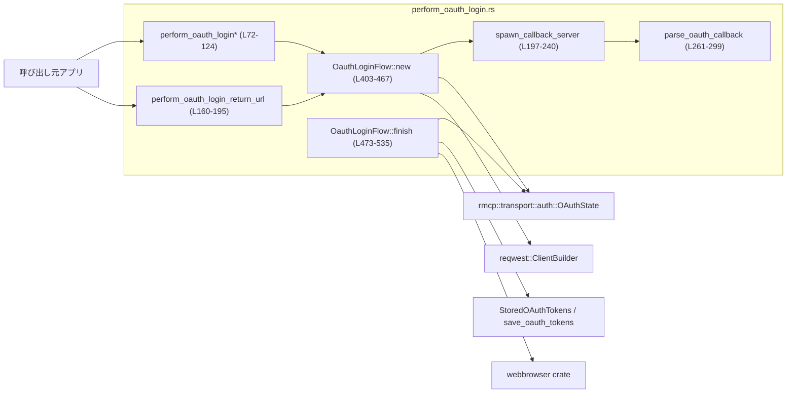
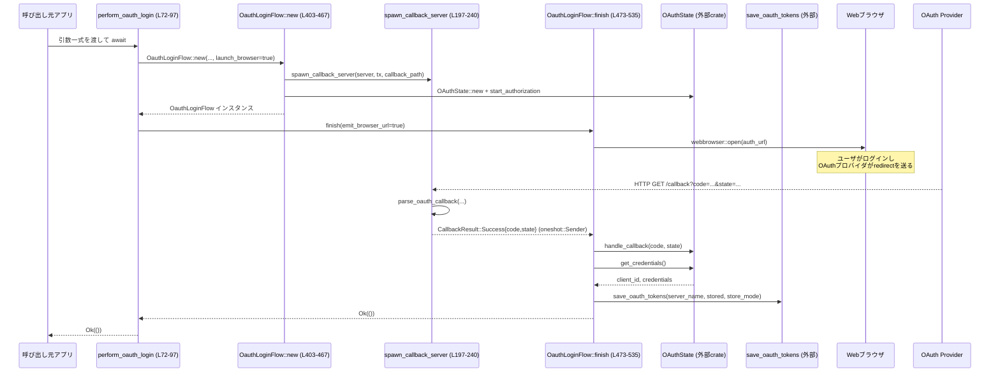
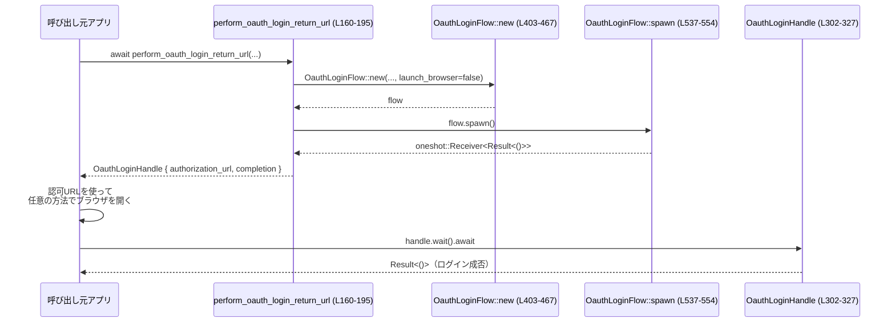

# rmcp-client/src/perform_oauth_login.rs

## 0. ざっくり一言

- OAuth2 の「ブラウザを使った認可コードフロー」を実行し、ローカル HTTP コールバックサーバを立ち上げて、取得したトークンを保存するためのモジュールです（rmcp-client 側の OAuth ログイン処理の実装）。  
  （根拠: 公開関数 `perform_oauth_login*` と `OauthLoginFlow` の処理内容  
  `rmcp-client/src/perform_oauth_login.rs:L72-L195`, `L330-L467`, `L473-L535`）

---

## 1. このモジュールの役割

### 1.1 概要

- このモジュールは **外部サービスに対する OAuth 認可フロー** を実行し、ユーザにブラウザでログインしてもらい、その結果として得られた OAuth トークンをローカルに保存するために存在します。  
- ローカルに tiny_http ベースの HTTP サーバを立ち上げ、OAuth プロバイダからのリダイレクトを受け取り、`rmcp::transport::auth::OAuthState` と連携してトークン取得・保存までを完結させます。  
  （根拠: `OauthLoginFlow::new` / `finish` での `OAuthState` 利用と `save_oauth_tokens` 呼び出し  
  `rmcp-client/src/perform_oauth_login.rs:L402-L467`, `L493-L528`）

### 1.2 アーキテクチャ内での位置づけ

主な依存関係と役割を簡易図で表すと次のようになります。



（全て本ファイル内: `rmcp-client/src/perform_oauth_login.rs:L72-L572`）

### 1.3 設計上のポイント

- **責務分割**  
  - 公開 API 関数 (`perform_oauth_login*`, `perform_oauth_login_return_url`) は、パラメータの受け取りと `OauthLoginFlow` の組み立てに専念しています  
    （`rmcp-client/src/perform_oauth_login.rs:L72-L124`, `L160-L195`）
  - 実際のフロー制御（HTTP サーバ起動、OAuthState とのやり取り、トークン保存）は `OauthLoginFlow` に集約されています  
    （`L330-L339`, `L402-L467`, `L473-L535`）
- **状態管理**  
  - `OauthLoginFlow` がフロー全体の状態（認可 URL、`OAuthState`、oneshot 受信側、タイムアウトなど）を保持します  
    （`L330-L339`）
  - ローカル HTTP サーバのライフサイクルは `CallbackServerGuard` の `Drop` 実装で管理され、終了時に `server.unblock()` によりブロック中の受信を解除します  
    （`L32-L40`）
- **エラーハンドリング**  
  - `anyhow::Result` を一貫して利用し、`?` と `context` を使ってエラーに文脈を付加しています  
    （例: `resolve_redirect_uri` `L372-L379`, `finish` 内 `L493-L517`）
  - OAuth プロバイダから返るエラーは専用型 `OAuthProviderError` で表現し、`Display` を実装してメッセージ整形を行います  
    （`L42-L70`）
- **並行性／非同期**  
  - tokio の `spawn_blocking` 上で tiny_http のブロッキングサーバを動かし、その結果を `oneshot::channel` で非同期タスクに渡す構成です  
    （`spawn_callback_server` `L197-L240`, `OauthLoginFlow::new` 内 `L433-L435`, `finish` 内 `L493-L503`）
  - 認可完了を待ち受ける側は `tokio::time::timeout` でタイムアウト制御を行います  
    （`L493-L497`）

---

## 2. 主要な機能一覧

- OAuth ログイン（対話的）: `perform_oauth_login` — ブラウザを開き、ユーザに認可してもらうフローを実行し、トークンを保存します。  
  （`L72-L97`, `L473-L528`）
- OAuth ログイン（ブラウザ URL の出力のみ抑制）: `perform_oauth_login_silent` — ログの出力を抑えたバリエーションです（ブラウザは起動）。  
  （`L99-L124`）
- OAuth ログイン（URL を返して外側がブラウザを開く）: `perform_oauth_login_return_url` — 認可 URL と完了待ちのハンドルを返し、呼び出し側がブラウザを開く用途向けです。  
  （`L160-L195`, `L302-L327`, `L537-L554`）
- ローカル OAuth コールバック HTTP サーバの起動と受信: `spawn_callback_server` + `parse_oauth_callback` — リダイレクト受信・クエリパラメータの解析を行います。  
  （`L197-L240`, `L261-L299`）
- リダイレクト URI / バインドアドレスの決定: `local_redirect_uri`, `resolve_redirect_uri`, `callback_bind_host`, `resolve_callback_port`, `callback_path_from_redirect_uri`。  
  （`L342-L353`, `L355-L370`, `L372-L385`, `L387-L399`）
- 認可 URL のクエリ拡張: `append_query_param` — `resource` パラメータなど任意のクエリを追加します。  
  （`L557-L572`）
- OAuth プロバイダエラー型: `OAuthProviderError` — `error` / `error_description` を保持し、ユーザに分かりやすいメッセージを提供します。  
  （`L42-L70`）

---

## 3. 公開 API と詳細解説

### 3.1 型・関数インベントリー

#### 型一覧

| 名前 | 種別 | 公開 | 役割 / 用途 | 行範囲 |
|------|------|------|-------------|--------|
| `OauthHeaders` | 構造体 | 非公開 | HTTP ヘッダと環境変数由来ヘッダをまとめて保持する内部用コンテナ | L27-L30 |
| `CallbackServerGuard` | 構造体 | 非公開 | tiny_http サーバを所有し、`Drop` 時に `unblock()` して終了させるガード | L32-L40 |
| `OAuthProviderError` | 構造体 | 公開 | OAuth プロバイダから返却された `error` / `error_description` を保持するエラー型 | L42-L46 |
| `OauthCallbackResult` | 構造体 | 非公開 | コールバックから取得した `code` と `state` をまとめた結果 | L242-L246 |
| `CallbackResult` | enum | 非公開 | コールバック結果（成功 or プロバイダエラー）を表現 | L248-L252 |
| `CallbackOutcome` | enum | 非公開 | `parse_oauth_callback` のパース結果（成功・エラー・無効） | L254-L259 |
| `OauthLoginHandle` | 構造体 | 公開 | 認可 URL と、ログイン完了を待つための `oneshot::Receiver` を保持するハンドル | L302-L305 |
| `OauthLoginFlow` | 構造体 | 非公開 | OAuth 認可フロー全体の状態とロジックを保持する中心的コンポーネント | L330-L339 |

#### 関数・メソッド一覧（主要部分）

| 名前 | 種別 | 公開 | async | 概要 | 行範囲 |
|------|------|------|-------|------|--------|
| `OAuthProviderError::new` | 関連関数 | 公開 | いいえ | `error` / `error_description` からエラーを作成 | L48-L55 |
| `impl Display for OAuthProviderError::fmt` | メソッド | 非公開 | いいえ | 表示用メッセージ生成 | L57-L67 |
| `perform_oauth_login` | 関数 | 公開 | はい | 対話的 OAuth ログインを実行 | L72-L97 |
| `perform_oauth_login_silent` | 関数 | 公開 | はい | ログ出力を抑えた OAuth ログイン | L99-L124 |
| `perform_oauth_login_with_browser_output` | 関数 | 非公開 | はい | 上記 2 関数の共通実装（ブラウザ起動 + フロー完了） | L126-L158 |
| `perform_oauth_login_return_url` | 関数 | 公開 | はい | 認可 URL と完了待ちハンドルを返す | L160-L195 |
| `spawn_callback_server` | 関数 | 非公開 | いいえ | tiny_http サーバを `spawn_blocking` で起動し、コールバックを待つ | L197-L240 |
| `parse_oauth_callback` | 関数 | 非公開 | いいえ | コールバック URL をパースし、code/state などを抽出 | L261-L299 |
| `OauthLoginHandle::new` | 関連関数 | 非公開 | いいえ | ハンドルの内部コンストラクタ | L308-L313 |
| `OauthLoginHandle::authorization_url` | メソッド | 公開 | いいえ | 認可 URL への参照を返す | L315-L317 |
| `OauthLoginHandle::into_parts` | メソッド | 公開 | いいえ | 認可 URL と `Receiver` を分離して返す | L319-L321 |
| `OauthLoginHandle::wait` | メソッド | 公開 | はい | バックグラウンドで進行中のログインフローの完了を待つ | L323-L327 |
| `resolve_callback_port` | 関数 | 非公開 | いいえ | 指定ポートの検証と正規化 | L342-L353 |
| `local_redirect_uri` | 関数 | 非公開 | いいえ | ローカルサーバの実バインドアドレスから redirect URI を生成 | L355-L370 |
| `resolve_redirect_uri` | 関数 | 非公開 | いいえ | ユーザ指定 callback URL の検証と fallback | L372-L379 |
| `callback_path_from_redirect_uri` | 関数 | 非公開 | いいえ | redirect URI からパス部分のみを取り出す | L381-L385 |
| `callback_bind_host` | 関数 | 非公開 | いいえ | callback URL に応じて `127.0.0.1` or `0.0.0.0` を決定 | L387-L399 |
| `OauthLoginFlow::new` | 関連関数 | 非公開 | はい | フロー全体の構築（HTTP サーバ起動、OAuthState 初期化など） | L403-L467 |
| `OauthLoginFlow::authorization_url` | メソッド | 非公開 | いいえ | 認可 URL を返す | L469-L471 |
| `OauthLoginFlow::finish` | メソッド | 非公開 | はい | コールバック待ち・トークン取得・保存までを完了させる | L473-L535 |
| `OauthLoginFlow::spawn` | メソッド | 非公開 | いいえ | `finish` をバックグラウンドタスクとして起動し、結果を返す `Receiver` を返却 | L537-L554 |
| `append_query_param` | 関数 | 非公開 | いいえ | 任意のクエリパラメータを URL に追加 | L557-L572 |

テスト関数も 8 個定義されています（詳細は §3.3 と §7 で触れます）。  
（`rmcp-client/src/perform_oauth_login.rs:L574-L659`）

---

### 3.2 重要関数・メソッド詳細

#### `perform_oauth_login` / `perform_oauth_login_silent`

```rust
pub async fn perform_oauth_login( /* 引数略 */ ) -> Result<()>   // L72-L97
pub async fn perform_oauth_login_silent( /* 引数略 */ ) -> Result<()> // L99-L124
```

**概要**

- どちらも **ブラウザを利用した OAuth ログインを行い、トークンを保存する** 非同期関数です。  
- 違いは「ブラウザで開く URL を `println!` で出すかどうか」のみです。  
  `perform_oauth_login` は URL を表示し、`perform_oauth_login_silent` は失敗時のみ表示します。  
  （根拠: `emit_browser_url` の引数値の違い `L94-L95`, `L121-L122` と `finish` 内の分岐 `L473-L491`）

**引数**

| 引数名 | 型 | 説明 | 行 |
|--------|----|------|----|
| `server_name` | `&str` | 認可対象サーバの論理名（ログメッセージ等に使用） | L74, L101 |
| `server_url` | `&str` | OAuth エンドポイントなどを含むサーバ URL（`OAuthState` に渡される） | L75, L102 |
| `store_mode` | `OAuthCredentialsStoreMode` | トークン保存方法の指定 | L76, L103 |
| `http_headers` | `Option<HashMap<String, String>>` | HTTP クライアントに設定する追加ヘッダ | L77, L104 |
| `env_http_headers` | `Option<HashMap<String, String>>` | 環境変数由来のヘッダ | L78, L105 |
| `scopes` | `&[String]` | OAuth スコープ一覧 | L79, L106 |
| `oauth_resource` | `Option<&str>` | `resource` クエリとして追加される任意のパラメータ | L80, L107 |
| `callback_port` | `Option<u16>` | ローカルコールバックサーバのバインドポート（None で OS 任せ） | L81, L108 |
| `callback_url` | `Option<&str>` | OAuth プロバイダに登録済みの redirect URI（指定なしでローカル URI を使用） | L82, L109 |

**戻り値**

- `Result<()>` — 成功時は `Ok(())`。失敗時は `anyhow::Error` を返します。  
  （`perform_oauth_login_with_browser_output` の戻り値をそのまま返しています `L84-L97`, `L111-L123`）

**内部処理の流れ**

1. それぞれ `perform_oauth_login_with_browser_output` を呼び出します。  
   - `perform_oauth_login`: `emit_browser_url = true`（`L94`）  
   - `silent`: `emit_browser_url = false`（`L121`）
2. `perform_oauth_login_with_browser_output` 内で `OauthHeaders` を構築し、`OauthLoginFlow::new` を呼び出します。  
   （`L139-L154`）
3. `OauthLoginFlow::new` から返されたフローの `finish(emit_browser_url)` を await して終了します。  
   （`L155-L157`, `L473-L535`）

**Examples（使用例）**

```rust
// 非同期コンテキストからの使用例
use rmcp_client::perform_oauth_login;
use codex_config::types::OAuthCredentialsStoreMode;

#[tokio::main]
async fn main() -> anyhow::Result<()> {
    let scopes = vec!["openid".to_string(), "profile".to_string()];

    perform_oauth_login(
        "example-server",
        "https://auth.example.com",
        OAuthCredentialsStoreMode::Default,
        None,
        None,
        &scopes,
        None,          // resource なし
        None,          // ポートは OS 任せ
        None,          // redirect URI も自動決定
    ).await?;

    // ここまで来ればトークンは保存済み
    Ok(())
}
```

**Errors / Panics**

（コードから読み取れる範囲）

- `OauthLoginFlow::new` からのエラー
  - コールバックポートが 0 の場合: `bail!` によるエラー  
    （`resolve_callback_port` `L343-L347`）
  - tiny_http サーバのバインド失敗（ポート競合など）  
    （`Server::http` の失敗を `anyhow!(err)` 変換 `L425`）
  - `callback_url` が不正な URL の場合  
    （`resolve_redirect_uri` 内 `Url::parse` 失敗時 `with_context` `L372-L379`）
  - HTTP クライアント構築エラー (`reqwest::Client::build`)  
    （`L440-L442`）
  - `OAuthState::new` / `start_authorization` / `get_authorization_url` 内部エラー  
    （`L443-L452`）
- `finish` からのエラー
  - タイムアウト（デフォルト 300 秒）までにコールバックを受信できない場合  
    → `"timed out waiting for OAuth callback"` 付きエラー  
    （`L493-L497`）
  - oneshot チャンネルがキャンセルされた場合  
    → `"OAuth callback was cancelled"` 付きエラー  
    （`L493-L497`）
  - OAuth プロバイダからエラーが返った場合  
    → `OAuthProviderError` を `anyhow!` で包んだエラー  
    （`L501-L504`）
  - `handle_callback` / `get_credentials` に失敗した場合  
    （`L506-L515`）
  - `credentials` が `None` の場合  
    → `"OAuth provider did not return credentials"` エラー  
    （`L516-L517`）
  - `save_oauth_tokens` のエラー  
    （`L519-L528`）

パニックを直接発生させるコードはありません（`unwrap` や `expect` は未使用）。  
（確認: 全ファイル `rmcp-client/src/perform_oauth_login.rs:L1-L572`）

**Edge cases（エッジケース）**

- `callback_port = Some(0)` → 即エラー（ポート範囲外）。  
  （`L343-L347`）
- コールバックが間違ったパスに来た場合 → HTTP 400 を返しつつ `CallbackOutcome::Invalid` のまま、フロー側は何もせず **タイムアウトまで待つ**。  
  （`parse_oauth_callback` `L261-L267`, `spawn_callback_server` の `Invalid` 分岐 `L230-L236`）
- OAuth プロバイダが `code/state` ではなく `error/error_description` を返した場合 → `OAuthProviderError` に変換され、`finish` 内でエラーとして扱われます。  
  （`L269-L297`, `L501-L504`）

**使用上の注意点**

- 関数はいずれも **tokio ランタイム上の async コンテキストで呼び出す必要** があります（`tokio::spawn` / `timeout` 等を内部利用）。  
- この関数を呼び出すとローカルに HTTP サーバが起動します。  
  - `callback_url` の host によって `127.0.0.1` か `0.0.0.0` で listen します（詳細は `callback_bind_host` を参照）。  
  - セキュリティ上、外部からアクセス可能な環境で `0.0.0.0` バインドになる設定を使う場合は注意が必要です。  
    （`L387-L399`）
- ブラウザ起動が失敗した場合でも、URL は標準出力／標準エラーに表示されます。ユーザが手動で URL を開けばフロー自体は継続できます。  
  （`L483-L490`）

---

#### `perform_oauth_login_return_url(...) -> Result<OauthLoginHandle>`

**概要**

- 認可 URL を文字列で返しつつ、ログインフロー本体をバックグラウンドで進行させるためのエントリポイントです。  
- 呼び出し側でブラウザを開き、完了したら `OauthLoginHandle::wait` で結果を待つパターンを実装できます。  
  （`L160-L195`, `L302-L327`, `L537-L554`）

**引数**

`perform_oauth_login` とほぼ同じですが、追加で `timeout_secs` を受け取ります。

| 引数名 | 型 | 説明 | 行 |
|--------|----|------|----|
| `timeout_secs` | `Option<i64>` | 認可完了を待つ秒数（None でデフォルト 300 秒）。最小値 1 秒 | L169 |

**戻り値**

- `Result<OauthLoginHandle>` —  
  - `Ok(handle)` の場合、`handle.authorization_url()` で認可 URL を取得し、`handle.wait().await` で完了を待ちます。  
  - `Err` 場合、フローの初期化（HTTP サーバ起動、`OAuthState` 初期化等）に失敗しています。

**内部処理の流れ**

1. `OauthHeaders` を構築 (`L173-L176`)。
2. `OauthLoginFlow::new(..., launch_browser = false, ...)` を呼び出し (`L177-L188`)。  
   - ブラウザは内部では起動されません。
3. `flow.authorization_url()` で URL を取得し (`L191`)、`flow.spawn()` でバックグラウンドタスクを起動 (`L192`)。
4. `OauthLoginHandle::new` で URL と `oneshot::Receiver<Result<()>>` をひとまとめにして返します (`L194-L195`, `L308-L313`)。

**Examples（使用例）**

```rust
use rmcp_client::perform_oauth_login_return_url;

async fn login_with_custom_browser() -> anyhow::Result<()> {
    let scopes = vec!["openid".to_string()];
    let handle = perform_oauth_login_return_url(
        "example-server",
        "https://auth.example.com",
        OAuthCredentialsStoreMode::Default,
        None,
        None,
        &scopes,
        None,
        Some(600),  // 10 分まで待機
        None,
        None,
    ).await?;

    // 認可 URL を自前のブラウザ起動ロジックで開く
    let url = handle.authorization_url().to_string();
    my_custom_browser_open(&url)?;

    // 認可完了を待つ（ここでトークン保存まで行われる）
    handle.wait().await
}
```

**Errors / Edge cases / 注意点**

- `OauthLoginFlow::new` のエラー条件は `perform_oauth_login` と同じです。  
- `timeout_secs` が 0 以下の場合でも `max(1)` により 1 秒に補正されます。  
  （`L453-L454`）
- `OauthLoginHandle` をドロップして `wait` しない場合:
  - バックグラウンドで動いているタスクは、内部の `timeout` が来るまでコールバックを待ち続けますが、`oneshot::Sender` 側で `tx.send(result)` が `Err` になっても無視されます（`let _ = tx.send(result);` `L550-L551`）。
  - ローカル HTTP サーバ自体は `CallbackServerGuard` の Drop により終了するため、重大なリソースリークは起きにくい設計です。

---

#### `OauthLoginFlow::new(...) -> Result<Self>`（内部用）

**概要**

- ローカルコールバックサーバの起動、redirect URI の決定、HTTP クライアントと `OAuthState` の初期化、認可 URL の生成など、OAuth フロー開始に必要なセットアップを行うコンストラクタです。  
  （`rmcp-client/src/perform_oauth_login.rs:L403-L467`）

**主な処理ステップ**

1. **タイムアウト値の決定**  
   - デフォルト 300 秒 (`DEFAULT_OAUTH_TIMEOUT_SECS`) を定義し、`timeout_secs.unwrap_or(...).max(1)` で 1 秒以上に補正。  
     （`L416`, `L453-L454`）
2. **コールバックサーバのバインドアドレス決定**  
   - `callback_bind_host(callback_url)` で host を決定 (`"127.0.0.1"` or `"0.0.0.0"`)。  
     （`L418`, `L387-L399`）  
   - `resolve_callback_port(callback_port)` でポート検証 (`0` 禁止) の後、`"{host}:{port}"` or `"{host}:0"` を作成。  
     （`L419-L423`, `L342-L353`）
3. **tiny_http サーバ起動とガード生成**  
   - `Server::http(&bind_addr)` でサーバを起動し、`Arc<Server>` に包む。  
   - `CallbackServerGuard` にクローンした `Arc` を渡す（Drop 時に `unblock`）。  
     （`L425-L428`, `L32-L40`）
4. **redirect URI とコールバックパス決定**  
   - `resolve_redirect_uri(&server, callback_url)` で redirect URI を決定（ユーザ指定があれば検証して利用）。  
     （`L430-L431`, `L372-L379`）  
   - `callback_path_from_redirect_uri` でパス部分（`/callback` 等）のみ抽出。  
     （`L431-L432`, `L381-L385`）
5. **oneshot チャンネル + コールバックサーバ起動**  
   - `oneshot::channel()` で `(tx, rx)` を作成し、`spawn_callback_server(server, tx, callback_path)` を呼び出す。  
     （`L433-L435`）
6. **HTTP クライアントと OAuthState 初期化**  
   - `build_default_headers` でヘッダを組み立て、`apply_default_headers(ClientBuilder::new(), &default_headers)` から `reqwest` クライアントを構築。  
     （`L436-L442`）  
   - `OAuthState::new(server_url, Some(http_client)).await?` で状態を作成し、`start_authorization` を呼び出して認可開始。  
     （`L443-L447`）
7. **認可 URL 構築**  
   - `oauth_state.get_authorization_url().await?` を取り出し、`append_query_param(..., "resource", oauth_resource)` でクエリを追加。  
     （`L448-L452`, `L557-L572`）
8. **構造体フィールドに格納して返却** (`L456-L466`)

**使用上の注意点（設計上）**

- `server` は `Arc` で共有され、`spawn_callback_server` 側と `CallbackServerGuard` の両方から参照されます。Drop による unblocking を忘れないために、`guard` を `OauthLoginFlow` のフィールドに保持して後でまとめて Drop しています。  
  （`L334-L335`, `L456-L461`, `L533-L534`）
- `callback_url` を指定すると `callback_bind_host` の結果により `0.0.0.0` バインドになる可能性があります（host が `localhost/127.0.0.1/::1` 以外の場合）。この挙動は、コンテナなどから外向きにアクセスさせるためには有用ですが、ネットワーク公開のリスクもあります。  
  （`L387-L399`）

---

#### `OauthLoginFlow::finish(mut self, emit_browser_url: bool) -> Result<()>`

**概要**

- 実際にブラウザ（または URL）をユーザに提示し、コールバックを受信して `OAuthState` に渡し、最終的にトークンを保存するまでの「本体処理」です。  
  （`rmcp-client/src/perform_oauth_login.rs:L473-L535`）

**処理フロー**

1. **ブラウザ起動フェーズ**（`self.launch_browser` が true の場合のみ）
   - `emit_browser_url` が true のとき、認可 URL を標準出力に表示。  
     （`L473-L481`）
   - `webbrowser::open(auth_url)` を試み、失敗時は URL を標準エラーに表示し、「手動で開いてほしい」旨のメッセージを出力。  
     （`L483-L490`）
2. **コールバック待ちフェーズ**
   - `timeout(self.timeout, &mut self.rx)` で oneshot からの結果を待機。  
     - タイムアウトでエラー `"timed out waiting for OAuth callback"`。  
     - `Receiver` 側のキャンセルで `"OAuth callback was cancelled"`。  
     （`L493-L497`）
   - `CallbackResult` が `Success` の場合は `code` / `state` を展開し、`Error` の場合は `OAuthProviderError` を `anyhow!` に変換して終了。  
     （`L498-L504`）
3. **OAuthState へのコールバック処理**
   - `self.oauth_state.handle_callback(&code, &csrf_state).await?` を呼び、状態を更新。  
     （`L506-L509`）
   - `get_credentials().await?` で `(client_id, credentials_opt)` を取得し、`credentials_opt` が `None` ならエラー。  
     （`L511-L517`）
4. **トークン保存フェーズ**
   - `compute_expires_at_millis(&credentials)` で有効期限を計算し、`StoredOAuthTokens` 構造体を組み立てて `save_oauth_tokens` を呼ぶ。  
     （`L519-L528`）
5. **コールバックサーバの終了**
   - 上記非同期処理を await した後で `drop(self.guard)` を呼び、tiny_http サーバを unblocking して終了させる。  
     （`L531-L534`）

**並行性・安全性の観点**

- コールバックサーバは `spawn_callback_server` で別スレッド（`spawn_blocking`）として実行されており、`finish` は tokio タスク内で非同期に待ち構える形です。  
  （`L197-L240`, `L493-L497`）
- `CallbackServerGuard` の Drop を `finish` の最後に明示的に実行することで、  
  - 正常終了でもタイムアウト終了でも、HTTP サーバが確実に停止することが保証されています。  
  - Rust の所有権 + Drop によるリソース管理の典型的なパターンです。  
  （`L32-L40`, `L533-L534`）

---

#### `OauthLoginHandle::wait(self) -> Result<()>`

**概要**

- `perform_oauth_login_return_url` の呼び出し時に返されるハンドルに対して利用し、バックグラウンドで進行している OAuth ログインタスクの完了を待つメソッドです。  
  （`rmcp-client/src/perform_oauth_login.rs:L302-L327`）

**内部処理**

- `self.completion.await` を呼び出し、`oneshot::Receiver<Result<()>>` の結果をそのまま返します。  
- もし送信側がドロップされていた場合（タスクが何らかの原因で panic するなど）、`RecvError` を `"OAuth login task was cancelled: {err}"` というメッセージに変換してエラーとします。  
  （`L323-L327`）

**使用上の注意点**

- `wait` を呼ばずに `OauthLoginHandle` をドロップした場合:
  - 呼び出し元ではログインの成否を知ることができません。
  - ただし `finish` 側で `CallbackServerGuard` を保持しているため、タスクが完了すれば HTTP サーバは終了します。  
    （`L537-L554`, `L533-L534`）

---

#### `parse_oauth_callback(path: &str, expected_callback_path: &str) -> CallbackOutcome`

**概要**

- OAuth プロバイダからの redirect URI（`/callback?code=...&state=...` のような文字列）を解析し、  
  - 認可コード + CSRF state を含む「成功」コールバック  
  - `error` / `error_description` を含む「プロバイダエラー」  
  - それ以外の無効なコールバック  
  を判別します。  
  （`rmcp-client/src/perform_oauth_login.rs:L261-L299`）

**内部アルゴリズム**

1. `path.split_once('?')` で `route`（パス）と `query` に分割。`?` がなければ `Invalid`。  
   （`L262-L264`）
2. `route != expected_callback_path` の場合も `Invalid`。  
   （`L265-L267`）
3. `query` を `&` で分割し、各ペアを `key=value` に分解。  
   - `=` がないペアは無視。  
   - `urlencoding::decode(value)` に失敗したペアも無視。  
   （`L274-L280`）
4. `key` に応じて `code`, `state`, `error`, `error_description` に格納。  
   （`L281-L287`）
5. 最終的に判定:
   - `code` と `state` が両方 `Some` → `CallbackOutcome::Success(OauthCallbackResult)`。  
   - そうでなくても `error` or `error_description` のどちらかが `Some` → `CallbackOutcome::Error(OAuthProviderError)`。  
   - それ以外 → `CallbackOutcome::Invalid`。  
   （`L291-L299`）

**Edge cases**

- クエリ中に `code` が複数ある場合: 最後に見つかった値で上書きされます（明示的なガードなし）。  
- 不正な URL エンコードを含むパラメータは無視され、それ以外のパラメータから判定が行われます（`decode` エラーで `continue`）。  
  （`L278-L280`）

**使用上の注意点**

- `expected_callback_path` と `route` の完全一致を要求しているため、末尾スラッシュ有無などは事前に揃えておく必要があります。  
  （これを行っているのが `callback_path_from_redirect_uri` です `L381-L385`）

---

#### `append_query_param(url: &str, key: &str, value: Option<&str>) -> String`

**概要**

- 与えられた URL に対して、`value` が Some かつトリム後に非空であれば `key=value` のクエリパラメータを追加するヘルパ関数です。  
  （`rmcp-client/src/perform_oauth_login.rs:L557-L572`）

**アルゴリズム**

1. `value` が None → 元の `url.to_string()` をそのまま返す。  
   （`L558-L560`）
2. `value.trim()` が空文字 → 元の URL をそのまま返す。  
   （`L561-L563`）
3. `Url::parse(url)` に成功した場合:
   - `query_pairs_mut().append_pair(key, value)` でクエリを追加し、`parsed.to_string()` を返す。  
     （`L565-L567`）
4. `Url::parse(url)` に失敗した場合:
   - `urlencoding::encode(value)` で `value` のみをエンコードし、  
     - 元 URL に `?` が含まれていれば `&`、なければ `?` を区切りとして連結。  
     （`L569-L571`）

**テストで確認されている事実**

- 絶対 URL への `resource` 追加 (`append_query_param_adds_resource_to_absolute_url`)  
  → 既存クエリ `scope=read` の後ろに `&resource=https%3A%2F%2Fapi.example.com` が付くこと。  
  （`L625-L637`）  
- `value` が空白だけのケースでは URL が変更されない (`append_query_param_ignores_empty_values`)  
  （`L639-L648`）  
- 解析不能な URL の場合でも `"not a url?resource=api%2Fresource"` のように素朴に付与される (`append_query_param_handles_unparseable_url`)  
  （`L650-L655`）

---

### 3.3 その他の関数・補助ロジック

| 関数名 | 役割（1 行） | 行範囲 |
|--------|--------------|--------|
| `spawn_callback_server` | tiny_http サーバでコールバック HTTP リクエストを受け取り、最初の「成功」または「エラー」結果を `oneshot::Sender` に送信 | L197-L240 |
| `resolve_callback_port` | ユーザ指定ポートの検証（0 を禁止）と正規化 | L342-L353 |
| `local_redirect_uri` | 実際にサーバが bind したアドレスから `http://IP:port/callback` 形式の URI を組み立てる | L355-L370 |
| `resolve_redirect_uri` | callback URL が指定されていれば検証・利用し、なければ `local_redirect_uri` を利用する | L372-L379 |
| `callback_path_from_redirect_uri` | redirect URI からパス部分のみを抽出してコールバック検証に使う | L381-L385 |
| `callback_bind_host` | callback URL からホストを見て、ローカル専用 (`127.0.0.1`) か全インタフェース (`0.0.0.0`) かを決定 | L387-L399 |
| `OauthLoginFlow::authorization_url` | 認可 URL のクローンを返す内部メソッド | L469-L471 |
| `OauthLoginFlow::spawn` | `finish(false)` を tokio タスクで起動し、結果を返す `oneshot::Receiver` を生成 | L537-L554 |

---

## 4. データフロー

### 4.1 典型フロー: `perform_oauth_login` の場合

ユーザコードから `perform_oauth_login` を呼び出した場合の主要なデータフローを sequence diagram で示します。



**要点**

- tiny_http サーバは `spawn_callback_server` が `spawn_blocking` 上で回しており、  
  完了結果を `oneshot::Sender<CallbackResult>` で `OauthLoginFlow::finish` に届けます。  
  （`L197-L240`, `L493-L503`）
- `finish` は `timeout` を使ってコールバックを待ち受け、その後 `OAuthState` に処理を委譲し、トークンを保存します。  
  （`L493-L528`）

### 4.2 `perform_oauth_login_return_url` + `OauthLoginHandle`



- ここでは `launch_browser=false` のため、内部ではブラウザ起動は行われません。  
  （`L184-L185`, `L473-L491` 条件）

---

## 5. 使い方（How to Use）

### 5.1 基本的な使用方法

#### 5.1.1 対話的ログイン（標準）

```rust
use rmcp_client::perform_oauth_login;
use codex_config::types::OAuthCredentialsStoreMode;

#[tokio::main]
async fn main() -> anyhow::Result<()> {
    let scopes = vec![
        "openid".to_string(),
        "profile".to_string(),
    ];

    perform_oauth_login(
        "my-server",
        "https://auth.my-server.com",
        OAuthCredentialsStoreMode::Default,
        None, // 追加ヘッダなし
        None, // 環境ヘッダなし
        &scopes,
        None, // resource なし
        None, // コールバックポートは OS 任せ
        None, // redirect URI もローカルで自動決定
    ).await?;

    Ok(())
}
```

### 5.2 よくある使用パターン

#### パターン A: サイレントモード（ログが少ない）

```rust
use rmcp_client::perform_oauth_login_silent;

async fn login_quietly() -> anyhow::Result<()> {
    let scopes = vec!["openid".to_string()];
    perform_oauth_login_silent(
        "quiet-server",
        "https://auth.example.com",
        OAuthCredentialsStoreMode::Default,
        None,
        None,
        &scopes,
        None,
        None,
        None,
    ).await
}
```

- ブラウザ起動は行いますが、URL の `println!` は抑制されます。  
  （`emit_browser_url=false` `L121-L122`, `finish` 内の分岐 `L477-L489`）

#### パターン B: 外部ブラウザ管理（URL を呼び出し元が扱う）

```rust
use rmcp_client::perform_oauth_login_return_url;

async fn login_with_external_browser() -> anyhow::Result<()> {
    let scopes = vec!["openid".to_string()];
    let handle = perform_oauth_login_return_url(
        "server",
        "https://auth.example.com",
        OAuthCredentialsStoreMode::Default,
        None,
        None,
        &scopes,
        None,
        Some(300),  // 5分でタイムアウト
        None,
        None,
    ).await?;

    let url = handle.authorization_url().to_string();
    // 独自のブラウザ（組み込みブラウザなど）で開く
    open_in_embedded_browser(&url)?;

    // 完了を待機
    handle.wait().await
}
```

### 5.3 よくある間違い

```rust
// 間違い例: tokio ランタイム外から直接呼び出す
fn main() {
    let scopes = vec!["openid".to_string()];
    // コンパイルは通りますが、実行時に tokio ランタイムがないと動きません
    // let _ = perform_oauth_login("server", "https://auth", Default::default(), None, None, &scopes, None, None, None);
}

// 正しい例: tokio ランタイム上から await する
#[tokio::main]
async fn main() -> anyhow::Result<()> {
    let scopes = vec!["openid".to_string()];
    perform_oauth_login(
        "server",
        "https://auth",
        OAuthCredentialsStoreMode::Default,
        None,
        None,
        &scopes,
        None,
        None,
        None,
    ).await?;
    Ok(())
}
```

```rust
// 間違い例: perform_oauth_login_return_url のハンドルを待たずに捨てる
async fn wrong() -> anyhow::Result<()> {
    let scopes = vec!["openid".to_string()];
    let handle = perform_oauth_login_return_url(
        "server", "https://auth", OAuthCredentialsStoreMode::Default,
        None, None, &scopes, None, None, None, None
    ).await?;

    let _url = handle.authorization_url();
    // handle.wait().await を呼ばずに終了してしまう
    Ok(())
}

// 正しい例: ハンドルの wait を呼び、成否を確認する
async fn correct() -> anyhow::Result<()> {
    let scopes = vec!["openid".to_string()];
    let handle = perform_oauth_login_return_url(
        "server", "https://auth", OAuthCredentialsStoreMode::Default,
        None, None, &scopes, None, None, None, None
    ).await?;

    let url = handle.authorization_url().to_string();
    open_in_embedded_browser(&url)?;
    handle.wait().await
}
```

### 5.4 使用上の注意点（まとめ）

- **非同期コンテキスト必須**: すべての公開関数は async であり、tokio ランタイム上で利用する前提です。  
- **ローカル HTTP サーバ**: 呼び出しごとに tiny_http サーバが起動し、コールバックを 1 回処理して終了します。  
- **ネットワーク公開範囲**:
  - `callback_url` が `localhost/127.0.0.1/::1` か未指定の場合 → `127.0.0.1` で listen。  
  - それ以外の host の場合 → `0.0.0.0` で listen（外部からもアクセス可能になり得る）。  
    （`callback_bind_host` `L387-L399`）  
- **ポート指定**:
  - `callback_port = Some(0)` は許可されません（即エラー）。  
  - `None` を指定すると OS が空きポートを割り当てます。  
    （`resolve_callback_port` `L342-L353`）

---

## 6. 変更の仕方（How to Modify）

### 6.1 新しい機能を追加する場合

例: 認可 URL に追加のクエリパラメータを付けたい場合。

1. **URL 生成箇所の確認**  
   - 認可 URL は `OauthLoginFlow::new` 内で `oauth_state.get_authorization_url().await?` の結果に対し、`append_query_param` で `resource` を追加しています。  
     （`rmcp-client/src/perform_oauth_login.rs:L448-L452`）
2. **クエリ追加の拡張**  
   - 別のパラメータを追加したい場合は、この `append_query_param` 呼び出し部分を拡張するのが自然です。  
   - 既存の `append_query_param` を再利用すれば URL パース失敗時のフォールバック挙動も一貫します。
3. **公開 API での引数追加**  
   - 新しいパラメータを外部から渡したい場合は、`perform_oauth_login*` と `perform_oauth_login_return_url` の引数を拡張し、`OauthLoginFlow::new` の引数にも渡します。  
     （`L72-L124`, `L160-L195`, `L403-L415`）

### 6.2 既存の機能を変更する場合の注意点

- **コールバックパス検証を変更する場合**  
  - `parse_oauth_callback` と `callback_path_from_redirect_uri` の組み合わせが現在の仕様を形成しています。  
    - `callback_path_from_redirect_uri` でパスのみを取り出し (`L381-L385`)、  
    - `parse_oauth_callback` が `route == expected_callback_path` を要求。  
  - 仕様変更時は両者の整合性を保つ必要があります。
- **タイムアウト関連の変更**  
  - デフォルト値は `DEFAULT_OAUTH_TIMEOUT_SECS = 300` として `OauthLoginFlow::new` にハードコードされています (`L416`)。  
  - 外部設定にしたい場合は、公開 API の引数や設定ファイル側との整合性を検討しつつ改修する必要があります。
- **エラーメッセージの意味**  
  - `context("...")` のメッセージは呼び出し元ユーザに直接見える可能性があります（外側で `anyhow::Error` をそのまま表示する場合など）。  
  - 変更時はメッセージの一貫性と可読性を考慮する必要があります。

---

## 7. 関連ファイル・テスト

### 7.1 関連モジュール

| パス / モジュール | 役割 / 関係 |
|------------------|------------|
| `crate::oauth` | `compute_expires_at_millis` を提供し、トークンの有効期限計算を担当します（どのように計算するかはこのチャンクからは分かりません）。`L21`, `L519` |
| `crate::utils` | `build_default_headers`, `apply_default_headers` により `reqwest` クライアントのヘッダ設定を行います。`L23-L24`, `L436-L442` |
| `crate::save_oauth_tokens` | `StoredOAuthTokens` の保存ロジックを提供します（保存先や形式はこのチャンクには現れません）。`L22`, `L519-L528` |
| `rmcp::transport::auth::OAuthState` | OAuth フロー（認可 URL 生成・コールバック処理・資格情報取得）の抽象化を提供します。`L12`, `L443-L447`, `L506-L515` |
| `codex_config::types::OAuthCredentialsStoreMode` | トークンの保存モードを表す設定型です。`L25`, `L72-L76`, `L160-L165`, `L330-L338` |

※ 実際のファイルパスはこのチャンクには現れないため、モジュールパスのみを記載しています。

### 7.2 テストコードの概要

テストは `#[cfg(test)] mod tests` 内に 8 個定義されています。  
（`rmcp-client/src/perform_oauth_login.rs:L574-L659`）

| テスト名 | 対象 | 目的 | 行範囲 |
|----------|------|------|--------|
| `parse_oauth_callback_accepts_default_path` | `parse_oauth_callback` | パス `/callback` で `code` と `state` があれば `Success` となることを確認 | L584-L588 |
| `parse_oauth_callback_accepts_custom_path` | 同上 | カスタムパス `/oauth/callback` でも動作することを確認 | L590-L594 |
| `parse_oauth_callback_rejects_wrong_path` | 同上 | パスが一致しなければ `Invalid` となることを確認 | L596-L600 |
| `parse_oauth_callback_returns_provider_error` | 同上 + `OAuthProviderError` | `error` と `error_description` から `CallbackOutcome::Error` が生成されることを確認 | L602-L616 |
| `callback_path_comes_from_redirect_uri` | `callback_path_from_redirect_uri` | redirect URI からパス `/oauth/callback` が抽出されることを確認 | L618-L623 |
| `append_query_param_adds_resource_to_absolute_url` | `append_query_param` | 既存クエリを持つ絶対 URL に `resource` が正しく追加されることを確認 | L625-L637 |
| `append_query_param_ignores_empty_values` | 同上 | `value` が空白のみの場合は URL が変わらないことを確認 | L639-L648 |
| `append_query_param_handles_unparseable_url` | 同上 | 解析不能な URL でも、`?` or `&` で素直にクエリが追加されることを確認 | L650-L655 |

これらのテストにより、**コールバック URL パースロジック** と **クエリパラメータ追加ロジック** の基本的な挙動が保証されています。  
（ただし tiny_http サーバや `OauthLoginFlow` 全体の統合テストは、このファイルには含まれていません。）

---

## 付記: セキュリティ・エッジケースの観点（コードから分かる範囲）

- **コールバックサーバの公開範囲**  
  - `callback_url` のホストが `localhost/127.0.0.1/::1` 以外の場合、サーバは `0.0.0.0` で待ち受けるため、マシン外からのアクセスも可能になります。  
    （`callback_bind_host` `L387-L399`）  
  - 開発用・ローカル用途では `callback_url` を指定しない（または `localhost` 系にする）ことが安全側の設定になります。
- **タイムアウトとキャンセル**  
  - `OauthLoginFlow::finish` は `timeout` を必ず通るため、永久に待ち続けることはありません。  
  - `OauthLoginHandle::wait` は、バックグラウンドタスクが何らかの理由で `tx.send` できずに終了した場合、`"OAuth login task was cancelled"` エラーを返し、失敗を認識できるようになっています。  
    （`L323-L327`, `L537-L551`）

以上が、このファイル `rmcp-client/src/perform_oauth_login.rs` の構造と動作の解説です。
