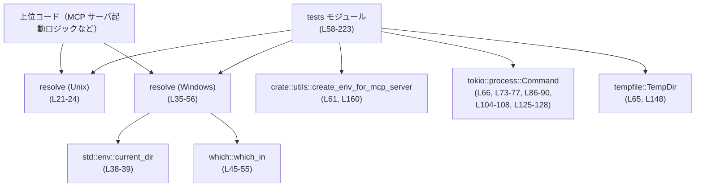
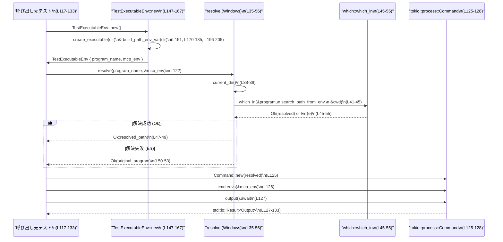

# rmcp-client/src/program_resolver.rs コード解説

## 0. ざっくり一言

MCP サーバを起動する際に使う「コマンド名 → 実行可能ファイルパス」の解決を、Unix と Windows で共通インターフェイス `resolve` で提供するモジュールです（`cfg` により OS ごとに実装が分岐）（`rmcp-client/src/program_resolver.rs:L16-24`, `L26-56`）。

---

## 1. このモジュールの役割

### 1.1 概要

- このモジュールは **「MCP サーバを起動する外部プログラムの実行ファイルを、OS 差異を吸収しつつ解決する」** ために存在します。
- Unix では OS に任せるためプログラム名をそのまま返し、Windows では `which` クレートを利用して `PATH` / `PATHEXT` を考慮したフルパスを解決します（`L16-24`, `L26-35`, `L41-45`）。
- これにより、`npx` / `pnpm` / `yarn` などのスクリプトベースのツールを、設定側で拡張子を意識せずに利用できるようにしています（`L33-34`）。

### 1.2 アーキテクチャ内での位置づけ

このファイルから読み取れる範囲での依存関係を示します。



- 本番コードからは `resolve` が唯一の公開 API として利用されることが想定されます（`pub fn resolve`、`L22`, `L36`）。
- テストコードでは、`create_env_for_mcp_server` と `TempDir` を利用して一時的な実行環境を構築し、その上で `resolve` と `tokio::process::Command` を組み合わせて動作検証を行っています（`L61-66`, `L147-167`, `L118-127`）。

### 1.3 設計上のポイント

- **OS ごとの実装分割**  
  - `#[cfg(unix)]` / `#[cfg(windows)]` によって、同名 `resolve` 関数を OS ごとに実装しています（`L21`, `L35`）。
- **ステートレスな設計**  
  - モジュールスコープに状態を持たず、`resolve` は引数のみから結果を導く関数として実装されています（`L22-24`, `L36-56`）。
- **エラーハンドリング方針**
  - Unix 版は常に `Ok(program)` を返し、失敗しません（`L22-24`）。
  - Windows 版はカレントディレクトリ取得失敗時のみ `Err` を返し（`L38-39`）、`which::which_in` 失敗時はログを出したうえで元のプログラム名をそのまま返します（`L45-55`）。
- **観測性**  
  - Windows 版では `tracing::debug!` ログで解決成功・失敗を出力します（`L47`, `L51`）。
- **並行性**
  - `resolve` 自体は共有ミュータブル状態を持たず、純粋関数に近い形になっています。
  - Windows 版のみ、プロセス全体のカレントディレクトリ（`std::env::current_dir`）に依存するため、他スレッドから `set_current_dir` が行われると結果に影響を受ける可能性があります（一般論としての `current_dir` の性質、ここでは事実として `current_dir` を呼んでいることのみ確認できます: `L38`）。

---

## 2. 主要な機能一覧

### 2.1 コンポーネント一覧（関数・構造体）

| 名前 | 種別 | 公開範囲 | 役割 / 用途 | 定義位置 |
|------|------|----------|-------------|----------|
| `resolve` (Unix) | 関数 | `pub` | Unix で、プログラム名をそのまま返すパス解決関数 | `rmcp-client/src/program_resolver.rs:L21-24` |
| `resolve` (Windows) | 関数 | `pub` | Windows で、`which` により拡張子込みの実行ファイルパスを解決する関数 | `L35-56` |
| `tests` | モジュール | crate 内（`cfg(test)`） | 上記 `resolve` と OS の挙動を統合的に検証するテスト群 | `L58-223` |
| `TestExecutableEnv` | 構造体 | テストモジュール内 | 一時ディレクトリと PATH/PATHEXT を設定したテスト用実行環境を保持 | `L136-142` |
| `TestExecutableEnv::new` | メソッド | テストモジュール内 | 一時ディレクトリを作成し、スクリプト生成と環境変数設定を行うコンストラクタ | `L144-167` |
| `TestExecutableEnv::create_executable` | メソッド | テストモジュール内 | OS ごとに簡単な終了コード 0 のスクリプト（またはバッチ）を作成 | `L169-185` |
| `TestExecutableEnv::set_executable` (Unix) | メソッド | テストモジュール内 | Unix でスクリプトに実行権限を付与 | `L187-194` |
| `TestExecutableEnv::build_path_env_var` | メソッド | テストモジュール内 | 一時ディレクトリを先頭に追加した PATH 文字列を構築 | `L196-205` |
| `TestExecutableEnv::ensure_cmd_extension` (Windows) | メソッド | テストモジュール内 | PATHEXT に `.CMD` を含めるための補助関数 | `L208-221` |
| `test_unix_executes_script_without_extension` | テスト関数 | テストのみ | Unix で拡張子なしスクリプトが直接実行できることの検証 | `L69-79` |
| `test_windows_fails_without_extension` | テスト関数 | テストのみ | Windows で拡張子なしスクリプトがエラーになることの検証 | `L82-95` |
| `test_windows_succeeds_with_extension` | テスト関数 | テストのみ | Windows で拡張子付きスクリプトが成功することの検証 | `L98-113` |
| `test_resolved_program_executes_successfully` | テスト関数 | テストのみ | `resolve` を通したプログラムが全プラットフォームで成功することの検証 | `L115-134` |

### 2.2 機能一覧（役割ベース）

- プログラムパス解決（Unix）: プログラム名をそのまま返し、PATH 解決や shebang 実行を OS に任せる。
- プログラムパス解決（Windows）: `which::which_in` を使って PATH/PATHEXT を考慮した実行ファイルフルパスを解決し、失敗時は元のプログラム名にフォールバックする。
- テスト用一時環境構築: 一時ディレクトリ・テスト用スクリプト・PATH/PATHEXT をセットアップし、`Command` に渡す環境を組み立てる。

---

## 3. 公開 API と詳細解説

### 3.1 型一覧（構造体・列挙体など）

公開 API という観点では、このファイルに外部へ公開される型はありません。`TestExecutableEnv` は `tests` モジュール内に定義され、テスト専用です（`L136-142`）。

| 名前 | 種別 | 役割 / 用途 | 備考 |
|------|------|-------------|------|
| `TestExecutableEnv` | 構造体 | 一時ディレクトリ、テスト用プログラム名、MCP 用環境変数を保持するテストフィクスチャ | `cfg(test)` かつモジュール内 private（`L136-142`） |

### 3.2 重要関数の詳細（最大 7 件）

#### `resolve (Unix版)(program: OsString, _env: &HashMap<OsString, OsString>) -> std::io::Result<OsString>`

**概要**

- Unix 環境で、プログラム名（またはパス）をそのまま呼び出し元に返す関数です（`L21-24`）。
- PATH 解決やスクリプト実行は OS の shebang 機構に任せる前提になっています（ドキュコメント `L16-20`）。

**引数**

| 引数名 | 型 | 説明 |
|--------|----|------|
| `program` | `OsString` | 実行したいプログラム名またはパス。Unicode 非依存の OS ネイティブ文字列（`L22`）。 |
| `_env` | `&HashMap<OsString, OsString>` | 環境変数マップ。Unix 実装では使用されず、プレースホルダとして存在します（`L22`）。 |

**戻り値**

- `std::io::Result<OsString>`  
  常に `Ok(program)` を返し、`Err` にはなりません（`L23`）。

**内部処理の流れ**

1. 受け取った `program` をそのまま `Ok(program)` で返却します（`L23`）。

**Examples（使用例）**

```rust
use std::collections::HashMap;
use std::ffi::OsString;
use rmcp_client::program_resolver::resolve; // 実際のパスは crate の公開状況に依存

fn main() -> std::io::Result<()> {
    let program = OsString::from("test_mcp_server");        // 実行したいプログラム名
    let env = HashMap::new();                               // Unix では resolve 内で使われない

    let resolved = resolve(program, &env)?;                 // Unix ではそのまま返ってくる
    // 例: tokio::process::Command などで使用
    // Command::new(resolved).spawn()?;

    Ok(())
}
```

**Errors / Panics**

- この関数から `Err` が返る経路はなく、`panic!` 呼び出しも存在しません（`L22-24`）。

**Edge cases（エッジケース）**

- `program` が空文字列であっても、そのまま返されます。実際に実行可能かどうかは OS に委ねられます（コード上で検査がないため: `L22-24`）。
- `_env` がどのような値でも処理には影響しません（未使用: `L22`）。

**使用上の注意点**

- 実際の PATH 解決・実行可否は OS に依存するため、存在しないコマンド名を渡した場合は `Command::new` 側でエラーになります。
- テストでは `create_env_for_mcp_server` により PATH を制御しているものの（`L147-167`）、`resolve` 自体はプロセス環境を一切参照しません。

---

#### `resolve (Windows版)(program: OsString, env: &HashMap<OsString, OsString>) -> std::io::Result<OsString>`

**概要**

- Windows 環境で、スクリプトやバッチファイルを含むプログラム名から、実際に実行可能なフルパス（拡張子込み）を解決します（`L26-35`）。
- `which::which_in` を利用して、指定された環境変数 `PATH`（および Windows では `PATHEXT`）を使い検索します（`L41-45`）。

**引数**

| 引数名 | 型 | 説明 |
|--------|----|------|
| `program` | `OsString` | 実行したいプログラム名またはパス。拡張子なしスクリプト名も想定（`L36`）。 |
| `env` | `&HashMap<OsString, OsString>` | 呼び出し側が構築した環境変数マップ。ここから `PATH` を取り出して検索対象ディレクトリを決定します（`L41-42`）。 |

**戻り値**

- `std::io::Result<OsString>`  
  - `Ok(resolved_path)`：  
    - パス解決に成功した場合は、`which::which_in` が返したパスを `OsString` に変換して返します（`L45-49`）。
    - `which::which_in` が失敗した場合でも、元の `program` をそのまま `Ok(program)` として返します（`L50-55`）。
  - `Err(e)`：  
    - `std::env::current_dir()` が失敗した場合のみ発生します（`L38-39`）。

**内部処理の流れ**

1. カレントディレクトリを取得し、失敗した場合は `std::io::Error::other` でラップして即座に `Err` を返す（`L38-39`）。
2. 渡された `env` から `"PATH"` をキーに検索し、`search_path` として取り出す（`L41-42`）。
3. `which::which_in(&program, search_path, &cwd)` を呼び、`program` を `search_path` と `cwd` を基点に探索する（`L45`）。
4. `Ok(resolved)` の場合:
   - `tracing::debug!` で解決経路をログ出力し（`L47`）、`resolved.into_os_string()` を `Ok` で返す（`L47-49`）。
5. `Err(e)` の場合:
   - 解決に失敗したことをデバッグログで出力したうえで（`L51`）、`Ok(program)` として元の引数を返す（`L51-53`）。

**Examples（使用例）**

テストに近い形での利用例です。

```rust
use std::collections::HashMap;
use std::ffi::OsString;
use tokio::process::Command;
use rmcp_client::program_resolver::resolve;

#[tokio::main]
async fn main() -> std::io::Result<()> {
    let mut env = HashMap::new();                                      // 環境変数マップ
    // 実運用では create_env_for_mcp_server 等で構築される（テストではそうなっている: L147-167）
    env.insert(OsString::from("PATH"), OsString::from(r"C:\tools"));

    let program = OsString::from("test_mcp_server");                   // 拡張子なし
    let resolved = resolve(program, &env)?;                            // Windows では which で解決される

    let mut cmd = Command::new(resolved);                              // 解決結果をそのまま Command に渡す
    cmd.envs(&env);                                                    // 同じ env をプロセス環境として設定
    let output = cmd.output().await;                                   // 非同期で実行

    // 実際のエラー処理は output の Ok/Err, ステータスコード等に応じて行う
    println!("output result = {:?}", output);
    Ok(())
}
```

**Errors / Panics**

- **`Err` になる条件**
  - `std::env::current_dir()` が失敗した場合のみ `Err(std::io::Error)` が返ります（`L38-39`）。
- **`which::which_in` のエラー**
  - エラーは `Err(e)` として一度受け取りますが（`L45`）、ログ出力後に元の `program` を `Ok` で返すため、呼び出し側には `Err` としては伝播しません（`L50-53`）。
- `panic!` 呼び出しは存在しません（ファイル全体に `panic!` がないことから確認できます）。

**Edge cases（エッジケース）**

- `env` に `"PATH"` が含まれない場合  
  - `env.get(OsStr::new("PATH"))` は `None` になり、そのまま `which::which_in` に渡されます（`L41-45`）。  
  - `None` を受け取った `which::which_in` がどう振る舞うかはこのファイルからは分かりません（外部クレートの実装のため）。
- `program` が既にフルパスを含む場合  
  - 特別な扱いはなく、そのまま `which::which_in` に渡されます（`L45`）。  
  - 解決に成功すればそのパスが返り、失敗すれば元の値が返ります（`L45-55`）。
- `which::which_in` が見つからなかった場合やエラーを返した場合  
  - デバッグログを出したうえで、元の `program` を `Ok` で返します（`L50-53`）。  
  - その後 `Command::new` などで実行できなければ、その時点でエラーになります。

**使用上の注意点**

- **事前条件**
  - `env` は、最終的に `Command::envs` に渡す環境と一致させると挙動が分かりやすくなります（テストではこの形になっています: `L122-127`）。
- **エラー伝播の注意**
  - `which` による解決失敗は `Err` としては伝播せず、元の `program` が返ってくるため、呼び出し側で「解決に失敗したかどうか」を `Result` から直接判定することはできません。
- **並行性**
  - `std::env::current_dir()` はプロセス全体のカレントディレクトリに依存するため、他のスレッドが同時に `set_current_dir` を行うようなコードが存在する場合、結果が変わる可能性があります（`L38`）。
- **セキュリティ観点**
  - 実際に実行されるのは、`env` で与えた `PATH` 上にある最初にマッチしたプログラムです。  
    `PATH` を外部から制御される構造になっている場合、意図しないバイナリが選択される可能性があります（`L41-45`）。  
    これは一般的な PATH ベースのコマンド実行と同種の性質です。

---

#### `TestExecutableEnv::new() -> Result<Self>`

**概要**

- テスト専用のヘルパーで、一時ディレクトリ・テスト用実行ファイル・MCP 用環境変数をまとめて構築します（`L147-167`）。

**引数**

- 引数はありません。

**戻り値**

- `anyhow::Result<TestExecutableEnv>`（`use anyhow::Result; L62`。`Self` の戻り型として `Result<Self>` を返しています: `L147`）。
- 成功時には、一時ディレクトリや環境変数を保持する `TestExecutableEnv` を返します（`L162-166`）。

**内部処理の流れ**

1. `TempDir::new()` で一時ディレクトリを作成し（`L148`）、そのパスを取得する（`L149`）。
2. `Self::create_executable(dir_path)?` で、そのディレクトリにテスト用実行スクリプトを作成する（`L151`）。
3. `extra_env` という `HashMap` を用意し（`L154`）、`PATH` に `build_path_env_var(dir_path)` の結果を設定（`L155`）。
4. Windows の場合のみ `PATHEXT` に `ensure_cmd_extension()` の結果を追加する（`L157-158`）。
5. `create_env_for_mcp_server(Some(extra_env), &[])` を呼び出して MCP サーバ用の環境変数セット `mcp_env` を構築（`L160`）。
6. `_temp_dir` / `program_name` / `mcp_env` をフィールドに持つ `TestExecutableEnv` を生成し `Ok(Self { ... })` で返す（`L162-166`）。

**Errors / Panics**

- `TempDir::new()` や `create_executable`、`create_env_for_mcp_server` が `Err` を返した場合、そのまま `?` で呼び出し元に伝播します（`L147-151`, `L160`）。
- `panic!` は使用していません。

**Edge cases**

- `create_env_for_mcp_server` の挙動（例えば既存の PATH/PATHEXT とのマージ方法）はこのファイルからは分かりませんが、テストでは `Some(extra_env)` を渡しているため、少なくとも追加の環境が利用されることが意図されています（`L160`）。

**使用上の注意点**

- テスト専用であり、本番コードから利用されることは想定されていません（`mod tests` 内ローカル定義: `L58-59`, `L136-144`）。

---

#### `TestExecutableEnv::create_executable(dir: &Path) -> Result<()>`

**概要**

- 一時ディレクトリ内にプラットフォームごとの簡易実行スクリプトを作成します（`L169-185`）。
  - Windows: `.cmd` バッチファイル。
  - Unix: shebang を持つシェルスクリプト＋実行権限付与。

**引数**

| 引数名 | 型 | 説明 |
|--------|----|------|
| `dir` | `&Path` | スクリプトを作成するディレクトリのパス（`L170`）。 |

**戻り値**

- 成功時 `Ok(())`、失敗時 `anyhow::Error` を含む `Result<()>`（`L170`, `L184-185`）。

**内部処理の流れ**

1. Windows の場合 (`#[cfg(windows)]` ブロック):
   - `dir.join(format!("{}.cmd", Self::TEST_PROGRAM))` で `.cmd` ファイルのパスを構築（`L171-173`）。
   - `fs::write(&file, "@echo off\nexit 0")?;` で正常終了する最小限のバッチファイルを書き出す（`L174`）。
2. Unix の場合 (`#[cfg(unix)]` ブロック):
   - `dir.join(Self::TEST_PROGRAM)` で拡張子なしファイルパスを構築（`L177-179`）。
   - `fs::write(&file, "#!/bin/sh\nexit 0")?;` でシェルスクリプトを書き出す（`L180`）。
   - `Self::set_executable(&file)?;` で実行権限を付与（`L181`）。
3. 最後に `Ok(())` を返す（`L184-185`）。

**Errors / Panics**

- `fs::write` や `set_executable` が失敗した場合は `Err` がそのまま伝播します（`L174`, `L180-181`）。
- `panic!` はありません。

**Edge cases**

- `dir` が存在しない、書き込み不可などの場合は `fs::write` が失敗し、テスト全体が失敗します。
- Windows/Unix どちらの `cfg` も満たさないプラットフォームは想定されていません（そのようなターゲットではこの関数自体がコンパイルされない可能性が高いです）。

---

#### `TestExecutableEnv::set_executable(path: &Path) -> Result<()>` （Unix のみ）

**概要**

- Unix で作成したスクリプトファイルに `0o755` の実行権限を付与します（`L187-194`）。

**引数**

| 引数名 | 型 | 説明 |
|--------|----|------|
| `path` | `&Path` | 実行権限を付与するファイルのパス（`L188`）。 |

**戻り値**

- 成功時 `Ok(())`、失敗時 `Err`（`L193-194`）。

**内部処理の流れ**

1. `fs::metadata(path)?.permissions()` で現在のパーミッションを取得（`L190`）。
2. `perms.set_mode(0o755)` で実行権限付きに変更（`L191`）。
3. `fs::set_permissions(path, perms)?` でファイルに適用（`L192`）。
4. `Ok(())` を返却（`L193-194`）。

**Errors / Panics**

- 権限取得/設定に失敗した場合は `Err` が呼び出し元に伝播します。

---

#### `TestExecutableEnv::build_path_env_var(dir: &Path) -> OsString`

**概要**

- 渡されたディレクトリを PATH の先頭に追加したパス文字列を構築します（`L196-205`）。
- テスト環境で、テスト用スクリプトを優先的に探索させるために使用されます（`L155`）。

**引数**

| 引数名 | 型 | 説明 |
|--------|----|------|
| `dir` | `&Path` | PATH の先頭に追加するディレクトリ（`L197`）。 |

**戻り値**

- `OsString`  
  - `<dir><sep><既存 PATH>` の形の文字列。`sep` は Windows では `;`，それ以外では `:`（`L198-203`）。

**内部処理の流れ**

1. `OsString::from(dir.as_os_str())` で初期 PATH 値を `dir` に設定（`L197-198`）。
2. `std::env::var_os("PATH")` で現在の PATH を取得（`L199`）。
3. 取得できた場合:
   - `cfg!(windows)` に応じてセパレータ `";"` または `":"` を決める（`L200`）。
   - `path.push(sep); path.push(current);` で `<dir><sep><current PATH>` に連結（`L201-202`）。
4. 最終的な `path` を返す（`L204-205`）。

**Edge cases**

- 環境変数 `PATH` が未定義の場合:
  - `var_os("PATH")` が `None` となり、`dir` のみの PATH が返ります（`L199-204`）。

---

#### `TestExecutableEnv::ensure_cmd_extension() -> OsString` （Windows のみ）

**概要**

- Windows の `PATHEXT` 環境変数に `.CMD` が含まれていることを保証するためのテスト用ヘルパーです（`L207-221`）。

**戻り値**

- `OsString`  
  - `.CMD` を必ず含む `PATHEXT` の値。

**内部処理の流れ**

1. `std::env::var_os("PATHEXT").unwrap_or_default()` で現在の `PATHEXT` を取得。未定義の場合は空文字列（`L210`）。
2. `current.to_string_lossy().to_ascii_uppercase().contains(".CMD")` で大文字・小文字を無視して `.CMD` の有無をチェック（`L211-214`）。
3. 含まれている場合: 現在の `current` をそのまま返す（`L215-216`）。
4. 含まれていない場合:
   - `.CMD;` を先頭につけた `OsString` を作成し（`L218`）、`current` を後ろに連結して返す（`L219-221`）。

**使用上の注意点**

- テスト内でのみ使用され、実運用コードに影響はありません（`L157-158`）。
- `PATHEXT` の扱いは Windows 固有であり、他プラットフォームでこの関数はコンパイルされません。

---

### 3.3 その他の関数（テスト）

テスト関数は主に OS ごとの実行可能性と `resolve` の統合動作を確認します。

| 関数名 | 役割（1 行） | 定義位置 |
|--------|--------------|----------|
| `test_unix_executes_script_without_extension` | Unix で拡張子なしスクリプトを `Command::new` で直接実行できることを確認 | `L69-79` |
| `test_windows_fails_without_extension` | Windows で拡張子なしのプログラム名では `Command::output` が `Err` になることを確認 | `L82-95` |
| `test_windows_succeeds_with_extension` | Windows で `.cmd` 拡張子を明示すると成功することを確認 | `L98-113` |
| `test_resolved_program_executes_successfully` | `resolve` を通したプログラムが全プラットフォームで成功することを確認 | `L115-134` |

---

## 4. データフロー

ここでは、「Windows 環境で `resolve` を使って MCP サーバ用プログラムを実行する」シナリオのデータフローを示します。

- テスト `test_resolved_program_executes_successfully` をベースにした典型的な流れです（`L115-134`）。
- `resolve` は OS ごとに実装が異なりますが、呼び出し側からは同じインターフェイスで利用されます（`L22`, `L36`）。



要点:

- テストでは `mcp_env` が `create_env_for_mcp_server` によって構築され、その中に PATH/PATHEXT が含まれています（`L147-160`）。
- Windows では `which::which_in` が拡張子を含む実行可能パスを返すことで、`Command::new` に直接渡せる形になります（`L45-49`, `L125`）。
- 解決に失敗した場合でも `resolve` は `Ok(original_program)` を返すため、その後の `Command::output().await` でエラーになるかどうかは OS のコマンド起動の挙動に依存します（`L50-55`, `L127`）。

---

## 5. 使い方（How to Use）

### 5.1 基本的な使用方法

このモジュールの実運用での典型的なフローは次のように整理できます。

```rust
use std::collections::HashMap;
use std::ffi::OsString;
use tokio::process::Command;
use rmcp_client::program_resolver::resolve;

#[tokio::main]
async fn main() -> anyhow::Result<()> {
    // 1. MCP サーバを起動したいプログラム名を決める
    let program_name = OsString::from("test_mcp_server");         // 例: 拡張子なし

    // 2. MCP 用の環境変数を用意する
    let mut env = HashMap::new();
    // 実際には crate::utils::create_env_for_mcp_server などで構築される（テスト参照: L160）
    env.insert(OsString::from("PATH"), OsString::from("/path/to/mcp/bin"));

    // 3. OS 固有の解決ロジックを抽象化した resolve を呼び出す
    let resolved_program = resolve(program_name, &env)?;          // Unix: そのまま, Windows: which 解決

    // 4. resolved_program を使って外部コマンドを非同期実行
    let mut cmd = Command::new(resolved_program);
    cmd.envs(&env);                                               // 同じ環境をプロセスに付与

    let output = cmd.output().await?;                             // 非同期で実行し、結果を取得

    // 5. 戻り値のステータスや標準出力・標準エラーを確認する
    if output.status.success() {
        println!("MCP server exited successfully");
    } else {
        eprintln!("MCP server failed: {:?}", output.status);
    }

    Ok(())
}
```

- Unix では `resolve` がほぼノーオペレーションであり（`L22-24`）、Windows では `which` での解決が挟まります（`L45-49`）。

### 5.2 よくある使用パターン

1. **テストと同一の PATH を使うパターン**

   - テストでは、`TestExecutableEnv::new` が PATH/PATHEXT を構成し、それを `resolve` と `Command` の両方に渡しています（`L147-167`, `L122-127`）。
   - 実運用でも「`resolve` に渡した環境」と「`Command::envs` に渡す環境」を一致させると、想定どおりのパス解決になりやすくなります。

2. **Unix / Windows で同じ設定ファイルを使うパターン**

   - 設定ファイルには単に `"npx"` や `"pnpm"` のような拡張子なしのプログラム名を書き（これはコードから直接は読み取れませんが、ドキュコメントからその意図が読み取れます: `L33-34`）、実際の実行時に `resolve` を通すことで、Windows でも適切な `.cmd` / `.bat` が選ばれるようになります。

### 5.3 よくある間違い

コードから推測できる、起こりやすそうな誤用例と正しい使い方です。

```rust
use std::ffi::OsString;
use tokio::process::Command;

// 間違い例: resolve を通さずに Windows で拡張子なしスクリプトを実行しようとする
async fn wrong(env: &std::collections::HashMap<OsString, OsString>) {
    let program_name = OsString::from("test_mcp_server");

    let mut cmd = Command::new(&program_name); // Windows ではエラーになりうる（テスト: L82-95）
    cmd.envs(env);
    let output = cmd.output().await;
    assert!(output.is_err());                 // テストではこのような前提（L89-93）
}

// 正しい例: resolve を通してから Command::new に渡す
async fn correct(env: &std::collections::HashMap<OsString, OsString>) -> std::io::Result<()> {
    use rmcp_client::program_resolver::resolve;

    let program_name = OsString::from("test_mcp_server");
    let resolved = resolve(program_name, env)?;   // OS に応じた解決

    let mut cmd = Command::new(resolved);
    cmd.envs(env);
    let output = cmd.output().await;
    // 出力の Ok/Err / ステータスを見る
    println!("output = {:?}", output);
    Ok(())
}
```

### 5.4 使用上の注意点（まとめ）

- **OS 依存の挙動**
  - Unix では `resolve` は純粋に値を返すだけで、エラーにもならず、PATH やスクリプトの実行可否は OS に委ねられています（`L22-24`）。
  - Windows では `resolve` が PATH/PATHEXT を参照し、`which` での解決を試みます（`L41-45`）。
- **エラー処理**
  - Windows 版 `resolve` からの `Err` はほぼ「カレントディレクトリ取得失敗」のみであり、パスが見つからない場合は `Ok(program)` が返ります（`L38-39`, `L50-53`）。  
    呼び出し側で「解決成功かどうか」を Result ではなく実行結果（`Command::output` の結果や終了コード）から判断する設計になっています。
- **並行性**
  - `resolve` 自体には内部状態がないため、複数スレッドから同時に呼び出してもデータ競合は発生しません。  
    ただし Windows 版は `current_dir()` と環境変数を利用するため、プロセス全体の状態に依存します（`L38`, `L41-42`）。
- **セキュリティ**
  - PATH をベースにしたプログラム探索であるため、PATH に攻撃者が制御できるディレクトリが含まれている場合、意図しないバイナリが実行される可能性があります（PATH を利用しているという事実: `L41-45`）。  
    これは通常の PATH ベースの実行と同等の注意点です。

---

## 6. 変更の仕方（How to Modify）

### 6.1 新しい機能を追加する場合

このファイルから読み取れる範囲で、「プログラム解決ロジックを拡張したい」場合の入口を整理します。

- **Windows 側の解決ロジックを拡張する**
  1. `#[cfg(windows)] pub fn resolve(...)` の本体（`L36-56`）を編集します。
  2. PATH 以外の環境変数や、別の検索パスを追加したい場合は、`env.get(...)` の扱いを拡張します（`L41-42`）。
  3. 解決に失敗した時の扱い（現在は「ログを出して元の program を返す」: `L50-53`）を変更することで、呼び出し側へのエラー伝達方針を変えることができます。
- **Unix 側で何らかの前処理/バリデーションを追加する**
  - `#[cfg(unix)] pub fn resolve(...)` の中に、`Ok(program)` を返す前で簡単な検査や変換を行うことが可能です（`L22-24`）。

### 6.2 既存の機能を変更する場合

- **影響範囲の確認**
  - すべてのパス解決は `resolve` を通る前提になっているため、`resolve` の振る舞いを変えると、本番コードとテスト両方に影響します。
  - テストでは `test_resolved_program_executes_successfully` が `resolve` の挙動に依存しているため（`L118-123`）、変更後もこのテストが通るか、あるいは適切に更新する必要があります。
- **契約（前提条件・返り値の意味）**
  - 現状の契約:
    - Unix: `resolve` は必ず `Ok(program)` を返し、エラーにはなりません（`L22-24`）。
    - Windows: `current_dir` 以外の失敗要因は `Err` ではなく `Ok(original_program)` で返ります（`L38-39`, `L50-53`）。
  - この契約を変える場合は、呼び出し元のエラー処理（特に `?` 演算子を使っている箇所）がどう振る舞うかを確認する必要があります。
- **テストの更新**
  - OS ごとのテスト（`L69-113`）と統合テスト（`L115-134`）が、仕様変更前提で書かれているため、仕様変更に合わせて期待値を見直す必要があります。

---

## 7. 関連ファイル

このファイルから明示的に参照されている他ファイル・モジュールは次のとおりです。

| パス / モジュール | 役割 / 関係 |
|------------------|------------|
| `crate::utils::create_env_for_mcp_server` | MCP サーバ実行用の環境変数セットを構築するユーティリティ。テストで `TestExecutableEnv::new` から呼び出され、PATH/PATHEXT を含む環境を生成しています（`L61`, `L160`）。具体的な実装はこのチャンクには現れません。 |
| `tempfile::TempDir` | 一時ディレクトリを扱う外部クレート。テスト用スクリプトの配置場所として利用されます（`L65`, `L148`）。 |
| `tokio::process::Command` | 非同期に外部プロセスを起動するための型。テストで `resolve` の結果を実際に実行可能かどうか検証するために使用されています（`L66`, `L73-77`, `L86-90`, `L104-108`, `L125-128`）。 |
| `which` クレート | Windows の `resolve` で、PATH/PATHEXT に基づく実行ファイル検索を行うために利用されます（`L45`）。実装詳細はこのチャンクには現れません。 |

---

### Bugs / Security / Edge cases の補足（このチャンクから読み取れる範囲）

- **潜在的なバグ要因（挙動の前提）**
  - `test_windows_fails_without_extension` は「Windows で拡張子なしのプログラム名を `Command::new` に渡すと `output().await` が Err になる」という挙動を前提にしています（`L89-93`）。  
    実際の OS/ランタイムの挙動がこれと異なる場合、このテストが失敗する可能性があります。これはテストコードの前提条件として読み取れます。
- **セキュリティ面**
  - PATH ベースの解決であるため、攻撃者が PATH を制御できる環境では、意図しないプログラムが実行される可能性があります（`L41-45`）。  
    ただし、これは一般的な外部コマンド実行と同様の性質であり、このモジュール固有の特殊なリスクではありません。
- **エッジケース**
  - Unix 版 `resolve` は、空文字列や存在しないコマンド名に対してもチェックを行わず、そのまま返します（`L22-24`）。
  - Windows 版 `resolve` は、PATH が空または未設定の場合でも `which::which_in` を呼び、その結果にかかわらず（失敗時は）元の `program` を返します（`L41-45`, `L50-53`）。

以上が、このファイル単体から読み取れる範囲での、公開 API・コアロジック・データフロー・エッジケース・安全性に関する整理です。
