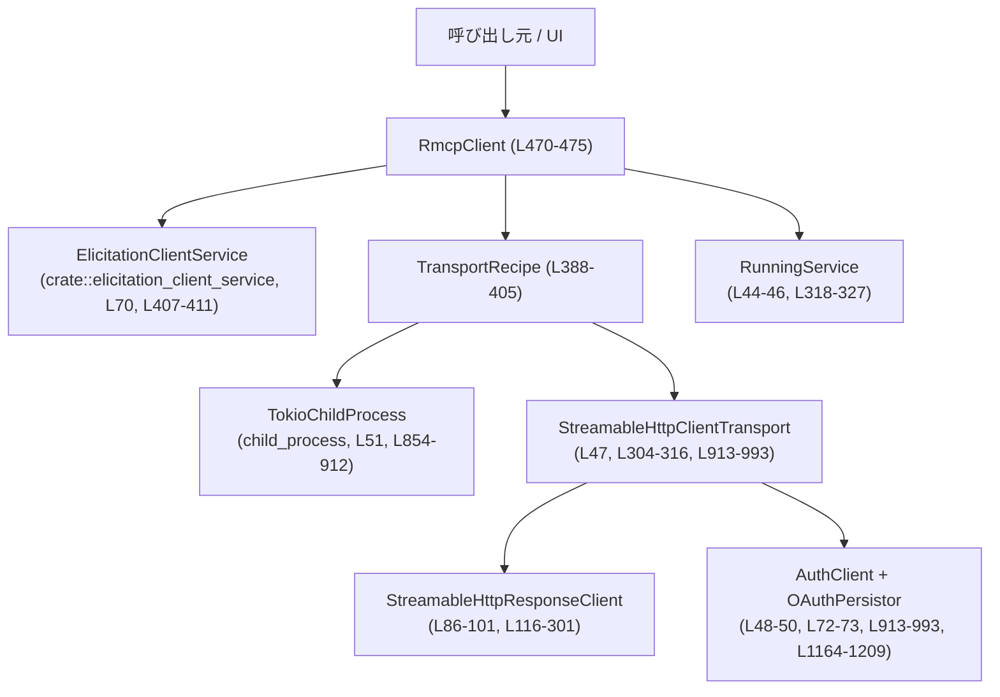
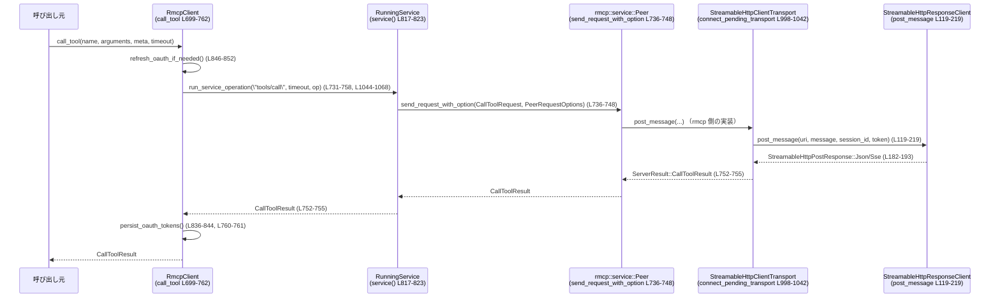

rmcp-client/src/rmcp_client.rs

---

## 0. ざっくり一言

MCP（Model Context Protocol）サーバーに対して、  

- 標準入出力（子プロセス）  
- HTTP(S) + Server-Sent Events（SSE）／OAuth 認証  

のどちらかで接続し、`rmcp` SDK 上で動作するクライアントをラップするモジュールです。  
主な公開 API は `RmcpClient` と一部の補助的な型です（`ElicitationResponse` など）。  
（rmcp_client.rs:L468-475, L590-815）

---

## 1. このモジュールの役割

### 1.1 概要

- MCP サーバーとの接続方法（子プロセス経由 or HTTP/SSE）を抽象化し、同一のクライアント API で操作できるようにしています。（`TransportRecipe`, `PendingTransport`, `RmcpClient`）（L388-405, L304-316, L470-475）
- `rmcp::service::RunningService` に基づく RPC クライアントのライフサイクル管理（初期化、タイムアウト付き呼び出し、セッション切れの検出と再接続）を行います。（L318-327, L536-588, L1044-1068, L1112-1161）
- OAuth トークンの読み込み・再認証・永続化を `OAuthPersistor` と連携して扱い、HTTP での認証を自動化します。（L72-73, L913-993, L1164-1209）
- 「Elicitation」（追質問などの UI への問いかけ）を扱う `ElicitationClientService` を組み込んだ UI 連携用クライアントとして動作します。（L70, L407-411, L536-542）

### 1.2 アーキテクチャ内での位置づけ

このモジュールは外部からは `RmcpClient` として見え、内部では `rmcp::service::RunningService` とトランスポート層（子プロセス or Streamable HTTP）を組み合わせています。



- `UI`（アプリ側コード）は `RmcpClient` の公開メソッド（`initialize`, `list_tools`, `call_tool` など）だけを意識します。（L536-588, L590-604, L699-762）
- `RmcpClient` は `ClientState` により「接続中 / 利用可能」を管理しつつ、`RunningService` へ処理を委譲します。（L318-327, L817-823）
- HTTP 経由の場合は `StreamableHttpResponseClient` が `StreamableHttpClientTransport` の HTTP クライアントとして動作し、SSE/JSON レスポンスを解釈します。（L86-101, L116-301）
- OAuth を利用する場合は `AuthClient` + `OAuthPersistor` によるトークン管理を挟みます。（L304-316, L913-993, L1164-1209）

### 1.3 設計上のポイント

- **トランスポート抽象化**  
  - `TransportRecipe` と `PendingTransport` により、「まだ接続していない構成情報」と「接続準備済みだが初期化前のトランスポート」を表現しています。（L304-316, L388-405, L854-996）
- **状態管理**  
  - `ClientState` は `Connecting`（まだ `initialize` 前）と `Ready`（初期化済み）の 2 状態で、`Mutex<ClientState>` により非同期に安全に更新されます。（L318-327, L470-475, L817-823）
- **セッション切れの自動回復**  
  - HTTP セッションが 404 応答で失効した場合を検知し、同じトランスポートレシピで再度接続・再初期化するロジックを持ちます。（`is_session_expired_404`, `reinitialize_after_session_expiry`）（L1092-1110, L1112-1161）
- **タイムアウト制御**  
  - 各操作に任意の `Duration` を渡せるようになっており、`tokio::time::timeout` で包むことで、サービス呼び出し全体のタイムアウトを実現しています。（L413-419, L1070-1090）
- **OAuth 連携**  
  - 事前に保存されたトークンの自動読み込み・再認可・永続化を一元管理しており、HTTP 認証方式に OAuth が使える場合は透過的に利用します。（L913-993, L836-852, L1164-1209）
- **並行性**  
  - `Mutex<ClientState>` の他に、セッション回復専用の `session_recovery_lock: Mutex<()>` を持ち、同時に複数の再初期化処理が走らないようにしています（L470-475, L1116）。  
  - `ProcessGroupGuard` は Unix 上で子プロセスのプロセスグループを確実に終了させるために `Drop` + 別スレッドでの kill を行います。（L329-331, L340-385）

---

## 2. 主要な機能一覧（コンポーネントインベントリー概要）

### 2.1 主要コンポーネント（型）概要

- `StreamableHttpResponseClient`: `reqwest::Client` をラップし、SSE/JSON/エラーを `StreamableHttpClient` トレイトで扱える形に変換する HTTP クライアント実装です。（L86-101, L116-301）
- `PendingTransport`: 子プロセス／HTTP／HTTP+OAuth のいずれかのトランスポートを表す enum です。（L304-316）
- `ClientState`: `RmcpClient` の状態（接続準備中 or 初期化済み）を表す enum です。（L318-327）
- `ProcessGroupGuard`: Unix 上で MCP 子プロセスのプロセスグループを安全に終了させるためのガード型です。（L329-338, L340-385）
- `TransportRecipe`: トランスポートを作るための構成（子プロセス用のパス・引数・環境変数 or HTTP の URL / ヘッダー・OAuth 設定）を表す enum です。（L388-405）
- `InitializeContext`: 再初期化に必要な情報（タイムアウト・`ElicitationClientService`）を保持する構造体です。（L407-411）
- `ClientOperationError`: サービス呼び出し時のエラー（`ServiceError` or タイムアウト）を表す enum です。（L413-419）
- `Elicitation`（type alias）: `CreateElicitationRequestParams` の別名で、UI とのエリシテーション要求内容を表します。（L421）
- `ElicitationResponse`: UI から返るエリシテーション結果（アクション・任意コンテンツ・メタ情報）を表す構造体です。（L423-430）
- `SendElicitation`: `Elicitation` を UI に送信し `ElicitationResponse` を非同期に受け取るコールバックの型です。（L451-454）
- `ToolWithConnectorId` / `ListToolsWithConnectorIdResult`: ツールにコネクタ ID/名前/説明などを付加した一覧用の構造体です。（L456-466）
- `RmcpClient`: 本モジュールのメインクライアント型で、状態・トランスポートレシピ・初期化コンテキスト・セッション回復ロックを保持します。（L468-475）

### 2.2 主な公開メソッド（機能）一覧

- `RmcpClient::new_stdio_client`: MCP サーバーを子プロセスとして起動し、STDIO ベースのクライアントを生成します。（L478-504）
- `RmcpClient::new_streamable_http_client`: Streamable HTTP（SSE/JSON）ベースのクライアントを生成します（必要に応じて OAuth を利用）。（L506-532）
- `RmcpClient::initialize`: MCP プロトコルの初期化ハンドシェイクを実行し、クライアントを `Ready` 状態にします。（L534-588）
- `RmcpClient::list_tools`: ツール一覧を取得します。（L590-604）
- `RmcpClient::list_tools_with_connector_ids`: ツール一覧を取得し、メタ情報からコネクタ ID / 名称などを抽出して返します。（L606-641, L643-649）
- `RmcpClient::list_resources`: リソース一覧を取得します。（L651-665）
- `RmcpClient::list_resource_templates`: リソーステンプレート一覧を取得します。（L667-681）
- `RmcpClient::read_resource`: 指定リソースの内容を取得します。（L683-697）
- `RmcpClient::call_tool`: 指定ツールを JSON 引数付きで呼び出します。（L699-762）
- `RmcpClient::send_custom_notification`: 任意メソッド名／パラメータでカスタム通知を送信します。（L764-792）
- `RmcpClient::send_custom_request`: 任意メソッド名／パラメータでカスタム RPC リクエストを送信し、`ServerResult` を受け取ります。（L794-815）

この他に、内部 helper 関数が多数あり（`create_pending_transport`, `run_service_operation`, `reinitialize_after_session_expiry` など）、公開 API の振る舞いを支えています。（L854-996, L1044-1090, L1112-1161）

---

## 3. 公開 API と詳細解説

### 3.1 型一覧（構造体・列挙体など）

| 名前 | 種別 | 公開? | 行範囲 | 役割 / 用途 |
|------|------|-------|--------|-------------|
| `StreamableHttpResponseClient` | 構造体 | 非公開 | L86-101, L116-301 | `reqwest::Client` をラップし、`StreamableHttpClient` トレイトを実装する HTTP クライアント |
| `StreamableHttpResponseClientError` | enum | 非公開 | L108-114 | HTTP レスポンスの 404 セッション失効や reqwest エラーを表現 |
| `PendingTransport` | enum | 非公開 | L304-316 | 子プロセス／HTTP／HTTP+OAuth のいずれかのトランスポートを保持 |
| `ClientState` | enum | 非公開 | L318-327 | `Connecting` or `Ready` を表すクライアント状態 |
| `ProcessGroupGuard` | 構造体 | 非公開 | L329-338, L340-385 | Unix で MCP 子プロセスのプロセスグループ終了を保証するガード |
| `TransportRecipe` | enum | 非公開 | L388-405 | 接続方法のレシピ（Stdio / StreamableHttp） |
| `InitializeContext` | 構造体 | 非公開 | L407-411 | 再初期化に必要な timeout と `ElicitationClientService` を保持 |
| `ClientOperationError` | enum | 非公開 | L413-419 | サービス呼び出しのエラー or タイムアウト |
| `Elicitation` | type alias | 公開 | L421 | `CreateElicitationRequestParams` の別名 |
| `ElicitationResponse` | 構造体 | 公開 | L423-430 | エリシテーションへの応答（アクション・コンテンツ・メタ） |
| `SendElicitation` | type alias | 公開 | L451-454 | UI にエリシテーションを送るための非同期コールバック型 |
| `ToolWithConnectorId` | 構造体 | 公開 | L456-461 | `Tool` にコネクタ ID/名称/説明を付加したラッパー |
| `ListToolsWithConnectorIdResult` | 構造体 | 公開 | L463-466 | `ToolWithConnectorId` のページング可能な結果 |
| `RmcpClient` | 構造体 | 公開 | L468-475 | MCP クライアント本体。状態・トランスポートレシピ・初期化情報などを保持 |

※ `ElicitationClientService`, `OAuthPersistor`, `StoredOAuthTokens`, `program_resolver` などの詳細実装は他ファイルにあり、このチャンクには現れません。

### 3.2 重要な関数・メソッドの詳細（最大 7 件）

#### 1. `RmcpClient::new_stdio_client(...) -> io::Result<Self>`（L478-504）

**概要**

- MCP サーバーを子プロセスとして起動し、標準入出力経由で通信する `RmcpClient` を生成します。
- 生成直後の状態は `ClientState::Connecting` で、`initialize` を呼び出すまで実際のプロトコル初期化は行われません。（L496-503）

**引数**

| 引数名 | 型 | 説明 |
|--------|----|------|
| `program` | `OsString` | 起動する MCP サーバーの実行ファイル名またはパス（L478-481） |
| `args` | `Vec<OsString>` | MCP サーバーに渡すコマンドライン引数（L479-481） |
| `env` | `Option<HashMap<OsString, OsString>>` | 追加／上書きする環境変数のマップ（L481-483） |
| `env_vars` | `&[String]` | MCP サーバー用に環境から引き継ぐ変数名のリスト（`create_env_for_mcp_server` に渡される）（L482-483, L865-867） |
| `cwd` | `Option<PathBuf>` | 子プロセスのカレントディレクトリ（L483-484, L879-881） |

**戻り値**

- `io::Result<RmcpClient>`  
  - 成功時: `ClientState::Connecting` な `RmcpClient` インスタンス。（L496-503）  
  - 失敗時: トランスポート準備中（子プロセス起動など）の IO エラーを `io::Error::other` に包んだ値（L492-495, L854-912）。

**内部処理の流れ**

1. `TransportRecipe::Stdio` を組み立てます。（L485-491）
2. `create_pending_transport` を呼び出し、子プロセス起動と `TokioChildProcess` トランスポートの準備を行います。（L492-495, L854-912）
3. 準備された `PendingTransport::ChildProcess` を `ClientState::Connecting { transport: Some(...) }` に格納した `RmcpClient` を返します。（L496-503）

**使用例**

```rust
use rmcp_client::rmcp_client::{RmcpClient, Elicitation, ElicitationResponse, SendElicitation};
use std::collections::HashMap;
use std::ffi::OsString;
use std::path::PathBuf;
use futures::future::BoxFuture;
use anyhow::Result;

// UI へのエリシテーションを何もしないダミー実装               // SendElicitation は Box<dyn Fn(...) -> BoxFuture<...>>
fn dummy_send_elicitation() -> SendElicitation {            // ダミーの SendElicitation を作成
    Box::new(|_, _| Box::pin(async {                        // RequestId, Elicitation を受け取り、即座にエラーを返す
        Err(anyhow::anyhow!("elicitation not implemented")) // UI 連携をまだ実装していない場合のプレースホルダ
    }))
}

#[tokio::main]
async fn main() -> Result<()> {
    let client = RmcpClient::new_stdio_client(
        OsString::from("mcp-server-binary"), // MCP サーバーの実行ファイル
        vec![],                              // 引数なし
        None,                                // 追加環境なし
        &[],                                 // 継承環境変数なし
        Some(PathBuf::from(".")),           // カレントディレクトリ
    ).await?;                                // 非同期でクライアント生成

    // InitializeRequestParams の構築は rmcp::model 側の仕様に依存（このチャンクには現れない）
    // let params = ...;
    // client.initialize(params, None, dummy_send_elicitation()).await?;

    Ok(())
}
```

**Errors / Panics**

- 子プロセス起動に失敗した場合（存在しないコマンドなど）、`create_pending_transport` からのエラーが `io::Error::other` として返ります。（L492-495, L854-912）
- パニックを発生させるコードは含まれていません（`expect` や `unwrap` などは使用していない）。

**Edge cases**

- `cwd` が存在しないディレクトリの場合、`Command::current_dir` または `spawn` でエラーになり、`io::Error` として返ります（詳細は `tokio::process::Command` 実装に依存します）（L879-885）。
- `env` と `env_vars` の内容が競合する場合の優先順位は `create_env_for_mcp_server` の実装次第であり、このチャンクには現れません。（L75-77, L865-867）

**使用上の注意点**

- 戻り値の `RmcpClient` はまだ MCP プロトコル上の初期化が済んでおらず、`initialize` を成功させるまで多くの操作が利用できません（`service()` がエラーを返します）（L817-823）。
- 子プロセスは `kill_on_drop(true)` により `RmcpClient` がドロップされるタイミングで終了処理が走ります（Unix ではプロセスグループ単位で終了）（L870-872, L380-385）。

---

#### 2. `RmcpClient::new_streamable_http_client(...) -> Result<Self>`（L506-532）

**概要**

- HTTP(S) + SSE を利用する MCP サーバーに接続する `RmcpClient` を生成します。
- 必要に応じて保存済み OAuth トークンをロードし、OAuth 認証付きのトランスポートを構成します。（L913-993, L1164-1209）

**引数**

| 引数名 | 型 | 説明 |
|--------|----|------|
| `server_name` | `&str` | 設定やトークンストア上でのサーバー識別名（L508-509, L913-926） |
| `url` | `&str` | MCP HTTP エンドポイントの URL（L509-510, L968-969, L981-982） |
| `bearer_token` | `Option<String>` | 明示的に指定された Bearer トークン（Authorization ヘッダ）（L510-511, L925-935, L981-984） |
| `http_headers` | `Option<HashMap<String, String>>` | 追加 HTTP ヘッダ（定数ヘッダ）（L511-512, L921-923） |
| `env_http_headers` | `Option<HashMap<String, String>>` | 環境変数から取得する HTTP ヘッダ（L512-513, L921-923） |
| `store_mode` | `OAuthCredentialsStoreMode` | OAuth トークンの保存方法（ファイル／OS キーチェーンなど）を指定（L513-514, L913-920） |

**戻り値**

- `anyhow::Result<RmcpClient>`  
  - 成功: HTTP ベースのトランスポートを備えた `ClientState::Connecting` なクライアント。（L523-531）  
  - 失敗: トークン読み込み・HTTP クライアント初期化・OAuth 構成などのいずれかで失敗した場合のエラー。

**内部処理の流れ**

1. `TransportRecipe::StreamableHttp` を構築。（L515-522）
2. `create_pending_transport` で HTTP トランスポートを作成。  
   - Bearer トークンが指定されていなければ、保存済み OAuth トークンの読み込みも試みます。（L913-935）
   - OAuth が利用可能な場合は `StreamableHttpClientTransport<AuthClient<...>>` を構成、利用不可の場合は Bearer トークンにフォールバックします。（L937-976）
3. `ClientState::Connecting { transport: Some(...) }` を持つ `RmcpClient` を返す。（L523-531）

**Errors / Panics**

- HTTP クライアントの作成（`build_http_client`）や OAuth 初期化（`OAuthState::new`／`set_credentials`）に失敗すると `anyhow::Error` が返ります。（L103-106, L1164-1183）
- OAuth メタデータディスカバリがサポートされない場合は `AuthError::NoAuthorizationSupport` を検出し、警告ログを出した上で Bearer トークン方式にフォールバックしてエラーにはしません。（L953-976）

**Edge cases**

- `bearer_token` も `AUTHORIZATION` ヘッダも無く、トークンストアからの読み込みも失敗した場合は、認証無しの HTTP クライアントとして接続します。（L913-935）
- URL が不正な場合、`StreamableHttpClientTransportConfig::with_uri` 内部でエラーが出る可能性がありますが、その詳細はこのチャンクには現れません。（L968-969, L981-982）

**使用上の注意点**

- `server_name` と `url` は OAuth トークン保存／読み込みのキーとしても使われるため、一貫した値を渡す必要があります。（L913-931, L1200-1206）
- ここではまだ MCP プロトコル初期化は完了していないため、`initialize` 呼び出しが必要です。（L523-531, L536-588）

---

#### 3. `RmcpClient::initialize(...) -> Result<InitializeResult>`（L536-588）

**概要**

- MCP サーバーとの初期化ハンドシェイクを行い、`RmcpClient` を `Ready` 状態に移行させます。（L554-579）
- 初期化時に `ElicitationClientService` を組み立て、以降の RPC 呼び出しで UI とのエリシテーション連携が可能になります。（L542-542）

**引数**

| 引数名 | 型 | 説明 |
|--------|----|------|
| `params` | `InitializeRequestParams` | MCP の `initialize` リクエストに相当する初期化パラメータ（L538-539） |
| `timeout` | `Option<Duration>` | 接続完了までのタイムアウト。`None` の場合は無制限（L539-540, L998-1041） |
| `send_elicitation` | `SendElicitation` | UI にエリシテーションを送る非同期コールバック。`ElicitationClientService::new` に渡されます。（L540-542, L407-411） |

**戻り値**

- `anyhow::Result<InitializeResult>`  
  - 成功時: `rmcp` SDK の `peer_info` から得た `InitializeResult`（サーバー情報含む）。（L558-563）  
  - 失敗時: 既に初期化中／初期化済み、ハンドシェイク失敗、`peer_info` が得られない等のエラー。

**内部処理の流れ**

1. `ElicitationClientService::new(params.clone(), send_elicitation)` を生成。（L542）
2. `state` ロックを取得し、`ClientState::Connecting` から `PendingTransport` を `take` します。  
   - `transport` が `None` なら「既に初期化中」とみなしてエラー。（L544-551）  
   - `ClientState::Ready` なら「既に初期化済み」としてエラー。（L550-551）
3. `connect_pending_transport` を呼び出し、`RunningService` と OAuth ランタイム、`ProcessGroupGuard` を取得。（L554-556, L998-1042）
4. `service.peer().peer_info()` からサーバー情報を取得。`None` ならエラー。（L558-561）
5. `initialize_context` に `InitializeContext { timeout, client_service }` を保存（再初期化用）。（L565-570）
6. `state` を `ClientState::Ready { _process_group_guard, service, oauth }` に更新。（L573-578）
7. OAuth ランタイムがある場合は `persist_if_needed` を呼び、初期トークンを永続化します（失敗は警告ログのみ）。（L581-585）
8. `InitializeResult` を返却。（L587）

**Errors / Panics**

- 既に初期化中 or 初期化済み: `"client already initializing"`, `"client already initialized"` をメッセージに持つ `anyhow::Error`。（L548-551）
- ハンドシェイクタイムアウト or 失敗: `connect_pending_transport` 内で `"timed out handshaking..."` または `"handshaking with MCP server failed: ..."` のメッセージ。（L1031-1039）
- `peer_info()` が `None` の場合: `"handshake succeeded but server info was missing"` としてエラー。（L558-562）

**Edge cases**

- `timeout` に極端に短い値を指定すると、`connect_pending_transport` がタイムアウトし、初期化に失敗します（`tokio::time::timeout` 依存）。（L1031-1035）
- OAuth ランタイムの永続化が失敗しても、初期化自体は成功として扱われます（警告ログのみ）。（L581-585）

**使用上の注意点**

- `initialize` は一度しか成功できず、再度呼び出すとエラーになります（セッション失効後の再初期化は内部の `reinitialize_after_session_expiry` が行います）。（L548-551, L1112-1161）
- `SendElicitation` の実装は UI と MCP の対話に重要ですが、その詳細（どのようなアクションを返すか）はこのファイルからは分かりません。

---

#### 4. `RmcpClient::call_tool(...) -> Result<CallToolResult>`（L699-762）

**概要**

- MCP サーバー上のツールを JSON 引数付きで呼び出し、その結果 `CallToolResult` を取得します。
- 引数や `_meta` の JSON フォーマットを検証し、`rmcp` の `ClientRequest::CallToolRequest` を低レベルで組み立てて送信しています。（L725-747）

**引数**

| 引数名 | 型 | 説明 |
|--------|----|------|
| `name` | `String` | 呼び出すツール名（L700-702, L725-728） |
| `arguments` | `Option<Value>` | ツールに渡す JSON 引数。`Object` である必要あり（L702-715） |
| `meta` | `Option<Value>` | リクエストメタ情報。`Object` である必要あり（L703-724） |
| `timeout` | `Option<Duration>` | ツール呼び出し全体のタイムアウト（L704-705, L1044-1068） |

**戻り値**

- `anyhow::Result<CallToolResult>`  
  - 成功: ツール実行結果（`ServerResult::CallToolResult`）。（L752-755, L759-761）  
  - 失敗: 引数フォーマット不正、RPC 送信エラー、レスポンス種別不一致など。

**内部処理の流れ**

1. OAuth トークンのリフレッシュを試行。（`refresh_oauth_if_needed`）（L706-707, L846-852）
2. `arguments` が `Some(Value::Object)` かどうか検証し、それ以外ならエラー。（L707-715）
3. `meta` も同様に `Object` か検証し、`rmcp::model::Meta` にラップ。その他はエラー。（L716-724）
4. `CallToolRequestParams` を作成。（L725-730）
5. `run_service_operation("tools/call", timeout, ...)` を呼び、`service` 上で以下の処理を行う。（L731-758, L1044-1068）  
   - `service.peer().send_request_with_option(...)` で `CallToolRequest` を送信。（L736-748）  
   - 返ってきたレスポンス future に対して `await_response().await?`。（L749-751）  
   - `ServerResult::CallToolResult(result)` の場合に限り `Ok(result)`、それ以外は `ServiceError::UnexpectedResponse`。（L752-755）
6. 再度 OAuth トークン永続化を試行。（`persist_oauth_tokens`）（L760-761, L836-844）
7. 結果を返す。（L761）

**Errors / Panics**

- `arguments` がオブジェクト以外: `"MCP tool arguments must be a JSON object, got {other}"` という `anyhow::Error`。（L707-713）
- `_meta` がオブジェクト以外: `"MCP tool request _meta must be a JSON object, got {other}"`。（L716-722）
- セッション切れ（404）などで HTTP トランスポートが `StreamableHttpError::Client(SessionExpired404)` を返すと、`run_service_operation` 内で再初期化が走り、2 回目の呼び出し結果が返されます。（L1044-1068, L1092-1110, L1112-1161）
- RPC レスポンスが `CallToolResult` 以外（プロトコル不一致）の場合、`ServiceError::UnexpectedResponse` になります。（L752-755）

**Edge cases**

- `timeout` を指定すると、ツール実行全体がその時間で打ち切られ `ClientOperationError::Timeout` になり得ます（`run_service_operation_once` 参照）。（L1070-1089）
- セッション再初期化後の再試行も同じ timeout でラップされるため、合計時間はおおよそ `timeout * 2` まで伸びる可能性があります（再初期化と 2 回目呼び出しの両方に timeout をかけているため）。（L1044-1068）

**使用上の注意点**

- `arguments` と `_meta` は JSON オブジェクトでなければならないため、文字列や配列を直接渡すとエラーになります。（L707-724）
- `timeout` は `PeerRequestOptions` の `timeout` には設定されておらず、`run_service_operation` の外側で全体を包む形になっています（`PeerRequestOptions { timeout: None, ... }`）（L744-747）。`rmcp` 側の内部 timeout とは独立したものです。
- OAuth 関連のリフレッシュ／永続化に失敗しても、ツール呼び出し自体は処理されます（失敗はログに出るのみ）。（L836-844）

---

#### 5. `RmcpClient::list_tools_with_connector_ids(...) -> Result<ListToolsWithConnectorIdResult>`（L606-641）

**概要**

- MCP サーバーからツール一覧を取得し、各ツールのメタ情報（`Meta`）からコネクタ ID/名称/説明を抽出して付加します。（L618-635, L643-649）

**引数**

| 引数名 | 型 | 説明 |
|--------|----|------|
| `params` | `Option<PaginatedRequestParams>` | ページング条件。`None` ならデフォルト。（L607-609, L613-616） |
| `timeout` | `Option<Duration>` | リスト取得処理のタイムアウト。（L609-610, L1044-1068） |

**戻り値**

- `anyhow::Result<ListToolsWithConnectorIdResult>`  
  - `next_cursor`: 次ページ取得用カーソル。  
  - `tools`: `ToolWithConnectorId` のリスト（元の `Tool` に追加フィールドを付加）。

**内部処理の流れ**

1. OAuth リフレッシュ。（L611-612, L846-852）
2. `run_service_operation("tools/list", timeout, ...)` で `service.list_tools(params)` を呼ぶ。（L612-617）
3. 取得した `ListToolsResult.tools` を `into_iter()` し、各ツールの `meta` から以下のキーを抽出して新しい構造体を作る。（L618-633, L643-649）  
   - `connector_id`  
   - `connector_name` または `connector_display_name`  
   - `connector_description` または `connectorDescription`
4. `collect::<Result<Vec<_>>>()?` で `Result<Vec<ToolWithConnectorId>>` に変換（ここでは `meta_string` が常に `Option<String>` を返すだけなので、`Err` は生じません）。（L618-635, L643-649）
5. OAuth 永続化。（L636-637, L836-844）
6. `ListToolsWithConnectorIdResult` を返す。（L637-640）

**Errors / Panics**

- `list_tools` 呼び出しと同様、ネットワークエラーやセッション切れなどは `run_service_operation` 経由で `anyhow::Error` として返ります。（L612-617, L1044-1068）
- `meta` のパース自体は `Value::as_str` を使用しているため、不正な型の場合は単に `None` になります（エラーにはなりません）。（L643-648）

**Edge cases**

- メタ情報が存在しない、または空文字列の場合は、対応するフィールドは `None` になります。（L643-648）
- `connector_name` と `connector_display_name` の両方がある場合、`connector_name` が優先されます（先に検索）。（L623-625）

**使用上の注意点**

- ここで定義されるキー名（`"connector_id"`, `"connector_name"`, `"connector_display_name"`, `"connector_description"`, `"connectorDescription"`）は約束ごとであり、サーバー側の実装次第では存在しない可能性があります。その場合もエラーにはならず、フィールドが `None` となります。（L623-627, L643-648）

---

#### 6. `RmcpClient::send_custom_request(...) -> Result<ServerResult>`（L794-815）

**概要**

- 任意のメソッド名と JSON パラメータでカスタム RPC リクエストを送り、生の `ServerResult` を受信します。
- MCP の仕様に存在しない拡張メソッドを使いたい場合などに利用できます。（CustomRequest）（L801-807）

**引数**

| 引数名 | 型 | 説明 |
|--------|----|------|
| `method` | `&str` | カスタム RPC メソッド名。（L795-797, L804-807） |
| `params` | `Option<Value>` | 任意の JSON パラメータ。（L796-798, L802-807） |

**戻り値**

- `anyhow::Result<ServerResult>`  
  - 成功時: サーバーから返る `ServerResult`（レスポンスの種類は呼び出し側で解釈）。  
  - 失敗時: 通信エラーやセッション切れなど。

**内部処理の流れ**

1. OAuth リフレッシュ。（L799-800, L846-852）
2. `run_service_operation("requests/custom", None, ...)` を呼び、タイムアウト無しで service 操作を行う。（L800-812）
3. `CustomRequest::new(method, params)` でリクエストを構築し、`service.send_request` で送信。（L804-807）
4. `run_service_operation` の戻り値が `response` として返る。（L800-813）
5. OAuth 永続化。（L813-814, L836-844）

**Errors / Panics**

- タイムアウトを指定していないため、通信がハングすると待ち続ける可能性があります（上位で別途 timeout をかける必要がある場合があります）。
- その他のエラーは `list_tools` などと同様です。

**Edge cases**

- `method` 名はサーバー側の実装次第であり、不明なメソッドを呼び出した場合の挙動はこのチャンクには現れません。
- `params` が `None` の場合、どのような JSON が送信されるかは `CustomRequest::new` の実装に依存します（このチャンクには現れません）。（L804-807）

**使用上の注意点**

- 戻り値は `ServerResult` であり、具体的な variant は呼び出し元で `match` して解釈する必要があります。
- 型安全なラッパーが必要な場合は、この関数を内部で使う別ラッパー関数を追加するのが自然です（変更方法は 6 章参照）。

---

#### 7. `RmcpClient::run_service_operation(...) -> Result<T>`（L1044-1068）

**概要**

- 任意のサービス操作を、一度実行し、必要に応じてセッション再初期化後に再試行する共通ラッパー関数です。
- タイムアウトとセッション 404 エラー検出による再接続ロジックをカプセル化しています。（L1044-1068, L1092-1110, L1112-1161）

**引数**

| 引数名 | 型 | 説明 |
|--------|----|------|
| `label` | `&str` | ログや `Timeout` エラーに使うラベル（例: `"tools/list"`）（L1045-1047, L1083-1085） |
| `timeout` | `Option<Duration>` | 操作全体のタイムアウト（L1047-1048, L1070-1089） |
| `operation` | `F` | `Arc<RunningService<...>>` を受け取り、`Result<T, ServiceError>` を返す future を構築する関数。（L1051-1052） |

**戻り値**

- `anyhow::Result<T>`  
  - 成功時: 操作の戻り値 `T`。  
  - 失敗時: `ClientOperationError` を `anyhow::Error` に変換したもの。

**内部処理の流れ**

1. `self.service()` で `RunningService` を取得（未初期化ならエラー）。）（L1054, L817-823）
2. `run_service_operation_once` を呼び出して一度操作を実行。（L1055-1057, L1070-1090）
3. 結果が `Ok` ならそのまま返す。（L1058）
4. 結果が `Err` で、`is_session_expired_404(&error)` が `true` の場合は以下を実行。（L1059-1066）  
   - `reinitialize_after_session_expiry(&service)` で再初期化（セッション回復）（L1060-1061, L1112-1161）。  
   - 新しい `service` を取得し、再度 `run_service_operation_once` を実行。（L1061-1063）
5. 上記以外のエラーはそのまま `anyhow::Error` に変換して返す。（L1066-1067）

**Errors / Panics**

- タイムアウト時には `ClientOperationError::Timeout { label, duration }` が生成され、そのまま `anyhow::Error` になります。（L1070-1089）
- `is_session_expired_404` で見ているのは `ServiceError::TransportSend` に埋め込まれた `StreamableHttpError::Client(SessionExpired404)` の場合のみです。（L1092-1110）

**Edge cases**

- セッション再初期化中に別のタスクが同じクライアントを使う場合、`session_recovery_lock` により直列化されますが、再初期化前に取得した `service` を使い続けているタスクは、一度失敗してから再試行されます。（L470-475, L1116, L1118-1123）
- 再初期化自体が失敗した場合（例えばサーバーがダウンしている）には、2 回目の操作は行われず、そのエラーが返ります。（L1112-1161）

**使用上の注意点**

- 公開 API の多く（`list_tools`, `list_resources`, `call_tool` 等）は、この関数を経由して実行されます。新しい RPC を追加する場合も、この関数を利用することでタイムアウト／セッション再接続ロジックを自動的に享受できます。（L590-604, L651-665, L699-762）
- `label` はデバッグ時に重要な情報になるため、エンドポイント名など識別しやすい文字列を指定するのが有用です。

---

### 3.3 その他の関数・メソッド一覧（インベントリー）

以下は詳細解説を省略する補助関数・内部処理です。

| 関数 / メソッド名 | 行範囲 | 役割（1 行） |
|-------------------|--------|--------------|
| `StreamableHttpResponseClient::new` | L92-94 | `reqwest::Client` をラップするコンストラクタ |
| `StreamableHttpResponseClient::reqwest_error` | L96-100 | `reqwest::Error` を `StreamableHttpError<ClientError>` に変換 |
| `build_http_client` | L103-106 | デフォルトヘッダ付きの `reqwest::Client` を構築 |
| `StreamableHttpResponseClient::post_message` | L119-219 | HTTP POST を送り、SSE/JSON/エラーを分類 |
| `StreamableHttpResponseClient::delete_session` | L221-245 | セッション削除用 HTTP DELETE を送信 |
| `StreamableHttpResponseClient::get_stream` | L247-301 | SSE/JSON ストリームを取得 |
| `ProcessGroupGuard::new` | L341-351 | プロセスグループガードを初期化（非 Unix ではダミー） |
| `ProcessGroupGuard::maybe_terminate_process_group` | L353-374 | Unix でプロセスグループを SIGTERM → 必要なら SIGKILL |
| `Drop for ProcessGroupGuard::drop` | L380-385 | ガード破棄時に `maybe_terminate_process_group` を呼ぶ |
| `meta_string` | L643-649 | `Meta` からキーに対応する文字列値を抽出・トリミング |
| `list_tools` | L590-604 | ツール一覧取得（コネクタ情報無し版） |
| `list_resources` | L651-665 | リソース一覧取得 |
| `list_resource_templates` | L667-681 | リソーステンプレート一覧取得 |
| `read_resource` | L683-697 | リソース読み取り |
| `send_custom_notification` | L764-792 | カスタム通知送信 |
| `service` | L817-823 | `ClientState` から `RunningService` を取得（未初期化ならエラー） |
| `oauth_persistor` | L825-833 | `ClientState` から `OAuthPersistor` を取得（存在する場合のみ） |
| `persist_oauth_tokens` | L836-844 | `OAuthPersistor::persist_if_needed` をラップし、失敗を警告ログにする |
| `refresh_oauth_if_needed` | L846-852 | `OAuthPersistor::refresh_if_needed` をラップ |
| `create_pending_transport` | L854-996 | `TransportRecipe` から `PendingTransport` を構築（Stdio / HTTP / HTTP+OAuth） |
| `connect_pending_transport` | L998-1042 | `PendingTransport` から `RunningService` を起動し、timeout を適用 |
| `run_service_operation_once` | L1070-1090 | 一回分のサービス操作を実行し、timeout を付ける |
| `is_session_expired_404` | L1092-1110 | `ClientOperationError` がセッション 404 かどうか判定 |
| `reinitialize_after_session_expiry` | L1112-1161 | セッション切れ時にトランスポート再構築 + 再初期化 |
| `create_oauth_transport_and_runtime` | L1164-1209 | OAuth 対応 HTTP トランスポートと OAuthPersistor を構築 |

---

## 4. データフロー

### 4.1 代表シナリオ: `call_tool` 実行フロー

`call_tool` が HTTP ベースの MCP サーバーにツール呼び出しを行う場合のデータフローです。



**要点**

- 呼び出しごとに `refresh_oauth_if_needed` → `run_service_operation` → `persist_oauth_tokens` という OAuth 処理が挟まります。（L706-707, L760-761, L836-852）
- 実際の HTTP 通信は `StreamableHttpResponseClient` が担い、SSE/JSON/エラーに応じて `StreamableHttpPostResponse` に変換されます。（L119-219）
- セッションが 404 により失効した場合は `run_service_operation` 内で再初期化と再試行が自動的に行われます。（L1044-1068, L1092-1110, L1112-1161）

---

## 5. 使い方（How to Use）

### 5.1 基本的な使用方法（HTTP クライアント）

以下は HTTP ベースの `RmcpClient` を使い、初期化 → ツール一覧取得 → ツール呼び出し を行う例です。

```rust
use rmcp_client::rmcp_client::{
    RmcpClient, SendElicitation, Elicitation, ElicitationResponse,
};
use anyhow::Result;
use futures::future::BoxFuture;

// エリシテーションのダミー実装                                   // UI 連携をまだ実装していない場合の例
fn dummy_send_elicitation() -> SendElicitation {                 // SendElicitation 型の値を返す関数
    Box::new(|_, _| Box::pin(async {                             // RequestId と Elicitation を受け取るクロージャ
        Err(anyhow::anyhow!("elicitation not implemented"))      // 常にエラーを返す
    }))
}

#[tokio::main]
async fn main() -> Result<()> {
    // 1. HTTP クライアント生成                                   // new_streamable_http_client で HTTP クライアントを作成
    let client = RmcpClient::new_streamable_http_client(
        "my-mcp-server",                                         // トークン保存などに使うサーバー名
        "https://example.com/mcp",                               // MCP HTTP エンドポイント
        None,                                                    // Bearer トークンなし（保存済み OAuth トークンを利用する可能性あり）
        None,                                                    // 追加ヘッダなし
        None,                                                    // 環境変数ベースのヘッダなし
        codex_config::types::OAuthCredentialsStoreMode::File,    // トークン保存方式（例）
    ).await?;                                                    // エラー時は anyhow::Error

    // 2. MCP プロトコルの initialize                             // initialize ハンドシェイクを実行
    // InitializeRequestParams の構築は rmcp::model に依存           // このチャンクには定義がないため、擬似コードとして扱う
    // let init_params = ...;
    // let init_result = client.initialize(init_params, None, dummy_send_elicitation()).await?;

    // 3. ツール一覧の取得                                         // ページングパラメータなしでツール一覧を取得
    // let tools = client.list_tools(None, None).await?;

    // 4. ツール呼び出し                                           // ツール "my_tool" を引数付きで呼び出す例
    use serde_json::json;                                        // JSON マクロを利用して引数を構築
    let args = json!({ "query": "hello" });                       // ツールに渡すオブジェクト型引数
    let result = client
        .call_tool(
            "my_tool".to_string(),                               // ツール名
            Some(args),                                          // arguments: JSON オブジェクト
            None,                                                // _meta なし
            Some(std::time::Duration::from_secs(30)),            // 30 秒のタイムアウト
        )
        .await;                                                  // 非同期で実行

    match result {
        Ok(call_result) => {
            println!("tool call ok: {:?}", call_result);         // 成功時: 結果を表示
        }
        Err(e) => {
            eprintln!("tool call failed: {:#}", e);              // 失敗時: エラー内容を表示
        }
    }

    Ok(())
}
```

### 5.2 よくある使用パターン

1. **標準入出力ベースの MCP サーバーとのやり取り**  
   - `new_stdio_client` → `initialize` → `list_tools` / `call_tool` という流れは HTTP 版と同様です。（L478-504, L536-588, L590-604, L699-762）
2. **ページング付きリスト API の利用**  
   - `list_tools` / `list_resources` / `list_resource_templates` は `PaginatedRequestParams` を受け取り、`next_cursor` を返すため、カーソルを使って繰り返し呼び出す実装が想定されます。（L590-604, L651-681）
3. **カスタムメソッド／通知の利用**  
   - 標準化されていない MCP 拡張を使う場合、`send_custom_notification` / `send_custom_request` が入口となります。（L764-792, L794-815）

### 5.3 よくある間違いと正しい使い方

```rust
# use rmcp_client::rmcp_client::RmcpClient;
# use anyhow::Result;

// 間違い例: initialize 前に list_tools を呼び出している          // まだ ClientState::Connecting のまま
async fn wrong_usage() -> Result<()> {
    let client = RmcpClient::new_streamable_http_client(
        "server", "https://example.com/mcp", None, None, None,
        codex_config::types::OAuthCredentialsStoreMode::File,
    ).await?;

    // let tools = client.list_tools(None, None).await?;          // ここで "MCP client not initialized" エラーになる可能性

    Ok(())
}

// 正しい例: initialize に成功してから list_tools を呼ぶ
async fn correct_usage() -> Result<()> {
    let client = RmcpClient::new_streamable_http_client(
        "server", "https://example.com/mcp", None, None, None,
        codex_config::types::OAuthCredentialsStoreMode::File,
    ).await?;

    // let init_params = ...;                                     // rmcp::model に依存
    // client.initialize(init_params, None, dummy_send_elicitation()).await?;

    // 初期化後に API を呼び出す                                  // ClientState::Ready になっている
    // let tools = client.list_tools(None, None).await?;

    Ok(())
}
```

**その他の典型的な誤り**

- `call_tool` に渡す `arguments` や `_meta` にオブジェクト以外（例: `"foo"` や `["a", "b"]`）を渡し、型エラーになる。（L707-724）
- `send_custom_request` を長時間ブロックする API に対して timeout なしで使い、アプリ全体が待ち続ける状態になる（この関数自身は timeout をかけていません）（L794-815）。

### 5.4 使用上の注意点（まとめ）

- **初期化順序**  
  - `new_*` → `initialize` → 他のメソッド、という順序が前提になっています。`service()` が `ClientState::Connecting` を検出すると `"MCP client not initialized"` エラーを返します。（L817-823）
- **タイムアウト**  
  - `list_*` や `call_tool` などのメソッドで渡す `timeout` は、サービス操作全体に対して `tokio::time::timeout` を適用しますが、内部で別の retry（セッション再初期化）が走る場合があるため、総時間はやや長くなり得ます。（L1044-1068, L1112-1161）
- **並行利用**  
  - `RmcpClient` 自体は `&self` を取る非同期メソッドのみ公開しており、内部状態は `tokio::sync::Mutex` と `Arc` で管理されているため、複数タスクから同時に API を呼び出すことを想定した設計になっています。（L470-475, L318-327, L817-823）
- **OAuth エラー**  
  - トークンのリフレッシュ／永続化に失敗した場合、ログに `warn!` が出力されるのみで、アプリケーションフローは継続します。このため、認証状態に依存するアプリケーションではログ監視が重要です。（L836-844, L846-852）

---

## 6. 変更の仕方（How to Modify）

### 6.1 新しい機能を追加する場合

**例: 新たな MCP エンドポイント `resources/delete` をラップするメソッドを追加する**

1. **どこに追加するか**
   - `impl RmcpClient { ... }` 内に、新しい `pub async fn delete_resource(...)` を追加するのが自然です。（L477-815 のパターンに倣う）

2. **どの関数・型に依存すべきか**
   - `run_service_operation` を利用し、タイムアウトやセッション再接続を統一的に扱う。（L1044-1068）
   - `service.list_resources` / `read_resource` など既存のパターン（`run_service_operation("resources/...", timeout, move |service| { ... })`）を参考に `service.delete_resource(...)` を呼ぶ closure を実装する。（L651-665, L683-697）

3. **追加した機能をどこから呼び出すか**
   - アプリ側コードは、他の公開メソッドと同様に `client.delete_resource(params, timeout).await?` のように呼び出せます。
   - 必要に応じて `ListToolsWithConnectorIdResult` のような専用の結果型を新設します。（L463-466, L606-641）

### 6.2 既存の機能を変更する場合

**影響範囲の確認方法**

- 例えば `create_pending_transport` の挙動を変える場合、影響を受けるのは:
  - `new_stdio_client` / `new_streamable_http_client`（初期トランスポート生成）。（L478-504, L506-532）
  - セッション再初期化時の `reinitialize_after_session_expiry`（再構築にも使用）。（L1137-1143）

**変更時に注意すべき契約**

- `run_service_operation` は「セッション 404 の場合に一度だけ再初期化して再試行する」という契約を暗黙的に持っています。  
  - `is_session_expired_404` の判定条件を変えると、この挙動が変わります。（L1092-1110）
- `initialize` は「一度だけ成功できる」契約になっています（それ以降の再初期化は内部メソッドが担当）。この前提で他コードが書かれている可能性があります。（L548-551, L1112-1161）

**関連テスト・使用箇所の再確認**

- このファイル自身にはテストコードは含まれていません（このチャンクには現れない）。  
  プロジェクト全体では別ファイルのテスト（例: `tests/` ディレクトリ）が存在する可能性がありますが、この情報は本チャンクからは分かりません。
- 変更後は、特に
  - 初期化フロー（`initialize`）
  - セッション切れ時のリカバリ（`reinitialize_after_session_expiry`）
  - OAuth 更新／保存（`refresh_oauth_if_needed`, `persist_oauth_tokens`）
  の挙動をテストすることが重要と考えられます（根拠はそれぞれのメソッドが多くの公開 API 経由で呼ばれている点です）。  

---

## 7. 関連ファイル

このモジュールと密接に関係するファイル・モジュール（コードから推測できる範囲）は以下の通りです。

| パス / モジュール | 役割 / 関係 |
|-------------------|------------|
| `crate::elicitation_client_service` | `ElicitationClientService` を提供し、エリシテーションと UI の橋渡しを行います。`InitializeContext` や `connect_pending_transport` で使用されています。（L70, L407-411, L998-1042）|
| `crate::oauth` | `OAuthPersistor`, `StoredOAuthTokens` を定義し、OAuth トークンの保存・読み込み・更新を行います。（L72-73, L913-993, L1164-1209）|
| `crate::utils` | `apply_default_headers`, `build_default_headers`, `create_env_for_mcp_server` など HTTP クライアントや子プロセス環境構築のユーティリティを提供しています。（L75-77, L103-106, L865-867, L921-923）|
| `crate::program_resolver` | 実行ファイル名から実際のパスを解決するロジックを提供します。Stdio ベースサーバー起動時に使用。（L74, L867-868）|
| `rmcp` クレート | MCP プロトコルのモデル（`CallToolRequestParams` など）とサービスレイヤ（`RunningService`, `RoleClient`, `service::serve_client`）を提供します。（L23-46, L998-1042）|
| `codex_client::build_reqwest_client_with_custom_ca` | カスタム CA 証明書などを考慮した `reqwest::Client` を構築する関数で、HTTP トランスポートに用いられます。（L12, L103-106, L1174-1175）|
| `codex_utils_pty::process_group` | Unix 上でのプロセスグループ制御（terminate/kill）を行い、`ProcessGroupGuard` で使用されています。（L357-373）|
| `sse_stream` クレート | HTTP レスポンスのバイトストリームから SSE ストリームを構築するために利用されます。（L60-61, L184-185, L299-300）|

---

### Bugs / Security / Edge cases / Observability について

- **明確な論理バグ** はこのファイルからは確認できません。挙動は `rmcp` や `AuthClient` など外部コンポーネントにも依存します。
- **Security 観点**  
  - Bearer トークンや OAuth クレデンシャルの扱いは `OAuthPersistor` や `build_reqwest_client_with_custom_ca` に委ねられており、このファイルではログとしてトークン値を出力していません。（ログメッセージはサーバー名・エラー内容など）（L929-965, L836-852）。  
  - TLS 設定などは `build_reqwest_client_with_custom_ca` の実装に依存し、本チャンクからは詳細不明です。（L12, L103-106）
- **Edge cases** は各関数のセクションで述べた通り、404 セッション失効、405 SSE 非対応、Content-Type 不正、JSON 以外のレスポンスボディなどに対して明示的にハンドリングされています。（L142-147, L163-217, L273-297）
- **Observability**  
  - ログ出力には `tracing::info` / `tracing::warn` が使われており、  
    - MCP サーバー stderr の行ごとの出力（L888-905）  
    - プロセスグループ終了失敗（L360-371）  
    - OAuth トークン読み込み・更新・保存の失敗（L929-929, L836-852）  
    などが記録されます。  
  - メトリクスや構造化ログのフォーマットは `tracing` の設定次第であり、このファイルには現れません。

このレポートは、本チャンクに現れるコードのみを根拠として記述しています。他ファイルの実装や外部クレートの詳細な挙動は、このチャンクからは分かりません。
