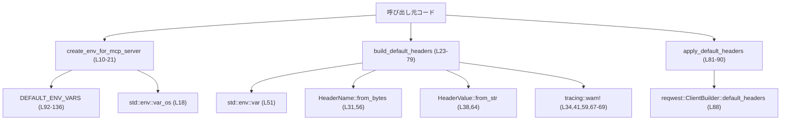
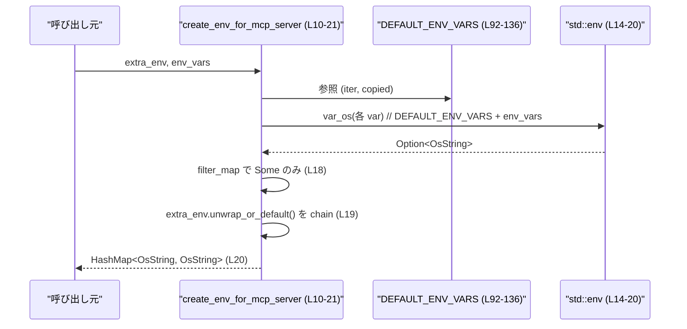
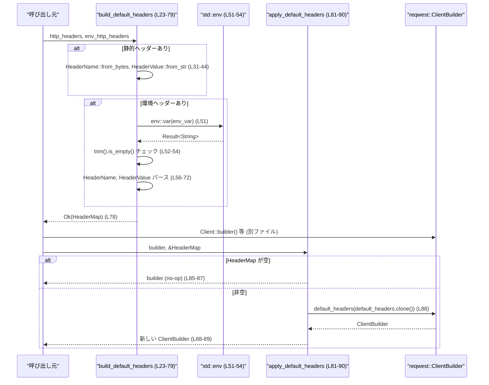

# rmcp-client/src/utils.rs

## 0. ざっくり一言

MCP サーバープロセス向けの環境変数マップを構築するユーティリティと、`reqwest` HTTP クライアントに設定するデフォルト HTTP ヘッダーを組み立てるユーティリティを提供しているモジュールです（`utils.rs:L10-21`, `utils.rs:L23-90`）。

---

## 1. このモジュールの役割

### 1.1 概要

- MCP サーバー起動時に引き継ぐべき環境変数を安全に収集し、`HashMap<OsString, OsString>` としてまとめます（`utils.rs:L10-21`）。
- 静的に指定された HTTP ヘッダーと、環境変数に書かれた値から HTTP ヘッダーを組み立て、`reqwest::ClientBuilder` に適用する補助関数を提供します（`utils.rs:L23-90`）。

### 1.2 アーキテクチャ内での位置づけ

このモジュールは主に以下の外部コンポーネントに依存します。

- OS の環境変数 API（`std::env`）による環境読み取り（`utils.rs:L14-20`, `utils.rs:L51-52`）
- `reqwest` の HTTP クライアント構築 API（`ClientBuilder` / `HeaderMap` / `HeaderName` / `HeaderValue`）（`utils.rs:L2-5`, `utils.rs:L23-79`, `utils.rs:L81-90`）
- ロギング用の `tracing::warn!` マクロ（`utils.rs:L34`, `utils.rs:L41`, `utils.rs:L59`, `utils.rs:L67-69`）

モジュール内部の依存関係と外部 API の関係を示すと次のようになります。



※ 呼び出し元コード（`Caller`）がこのモジュールの関数を組み合わせて使うことが想定されますが、実際の呼び出し関係はこのチャンクには現れません。

### 1.3 設計上のポイント（根拠付き）

- **環境変数のホワイトリスト方式**  
  - ベースとなる環境変数名は `DEFAULT_ENV_VARS` 定数により OS ごとに明示されています（Unix: `utils.rs:L92-105`, Windows: `utils.rs:L107-136`）。
  - 追加で渡された `env_vars` のみがベースリストに追加されます（`utils.rs:L17`）。
- **UTF-8 非依存の環境取得**  
  - MCP サーバー向け環境収集では `env::var_os` を利用し、非 UTF-8 の値も損なわずに保持します（`utils.rs:L18`）。
- **オーバーライド順序の明確化**  
  - `create_env_for_mcp_server` では `DEFAULT_ENV_VARS`/`env_vars` から読み取った値の後に `extra_env` を連結しており、同じキーがある場合は `extra_env` 側が優先されます（`utils.rs:L14-20`）。
  - `build_default_headers` では静的ヘッダー（`http_headers`）を設定した後に環境変数ベースのヘッダー（`env_http_headers`）を設定するため、同じヘッダー名の場合は後者が上書きします（`utils.rs:L29-47`, `utils.rs:L49-75`）。
- **失敗は Result ではなくログで扱う方針**  
  - 無効なヘッダー名・値があっても `Err` は返さず、`tracing::warn!` で警告ログを出してスキップする設計です（`utils.rs:L34-35`, `utils.rs:L41-42`, `utils.rs:L59-60`, `utils.rs:L67-71`）。
  - `build_default_headers` の戻り値は `Result<HeaderMap>` ですが、実装上は `Ok` のみが返されています（`utils.rs:L78`）。
- **並行性への配慮（テスト側）**  
  - テストでは環境変数を書き換えるため、`serial_test::serial` によってテストを直列実行することで、他テストとの競合を避けています（`utils.rs:L189-191`, `utils.rs:L200-203`）。
  - `EnvVarGuard` により環境変数変更をテスト終了時に元に戻すようになっています（`utils.rs:L146-175`）。

---

## 2. 主要な機能一覧（コンポーネントインベントリー）

### 2.1 機能の概要

- MCP サーバー向け環境変数マップの構築（UTF-8 非依存＆オーバーライド対応）
- 静的設定および環境変数からの HTTP ヘッダー生成
- `reqwest::ClientBuilder` へのデフォルトヘッダー適用

### 2.2 シンボル一覧（関数・定数・テスト補助）

| 名前 | 種別 | 役割 / 用途 | 定義箇所 |
|------|------|-------------|----------|
| `create_env_for_mcp_server` | 関数 | MCP サーバー用の環境変数マップを生成する | `utils.rs:L10-21` |
| `build_default_headers` | 関数 | 設定と環境変数から HTTP ヘッダーを構築する | `utils.rs:L23-79` |
| `apply_default_headers` | 関数 | `ClientBuilder` にデフォルトヘッダーを適用する | `utils.rs:L81-90` |
| `DEFAULT_ENV_VARS` (unix) | 定数 | Unix 環境で引き継ぐ環境変数名のホワイトリスト | `utils.rs:L92-105` |
| `DEFAULT_ENV_VARS` (windows) | 定数 | Windows 環境で引き継ぐ環境変数名のホワイトリスト | `utils.rs:L107-136` |
| `EnvVarGuard` | 構造体（テスト専用） | テスト中の環境変数変更を元に戻すガード | `utils.rs:L146-149` |
| `EnvVarGuard::set` | 関数（テスト専用） | 環境変数を設定し、元の値を保持するコンストラクタ | `utils.rs:L151-161` |
| `Drop for EnvVarGuard` | Drop 実装 | ガードがドロップされた際に環境変数を元に戻す | `utils.rs:L164-175` |
| `create_env_honors_overrides` | テスト | `extra_env` が OS 環境値を上書きすることを検証 | `utils.rs:L178-187` |
| `create_env_includes_additional_whitelisted_variables` | テスト | `env_vars` 経由で追加ホワイトリストが機能することを検証 | `utils.rs:L189-197` |
| `create_env_preserves_path_when_it_is_not_utf8` | テスト (unix) | 非 UTF-8 な PATH が損なわれないことを検証 | `utils.rs:L200-212` |

---

## 3. 公開 API と詳細解説

### 3.1 型・定数一覧

| 名前 | 種別 | 役割 / 用途 | 定義箇所 |
|------|------|-------------|----------|
| `DEFAULT_ENV_VARS` (unix) | `&'static [&'static str]` | MCP サーバーへ引き継ぐ標準的な Unix 環境変数の一覧 | `utils.rs:L92-105` |
| `DEFAULT_ENV_VARS` (windows) | `&'static [&'static str]` | MCP サーバーへ引き継ぐ標準的な Windows 環境変数の一覧 | `utils.rs:L107-136` |
| `EnvVarGuard`（テスト用） | 構造体 | テスト中に一時的に環境変数を変更し、終了後に元に戻す | `utils.rs:L146-149` |

`EnvVarGuard` およびそのメソッドは `#[cfg(test)]` ブロック内にあり、本番コードからは参照されません（`utils.rs:L138-214`）。

### 3.2 関数詳細

#### `create_env_for_mcp_server(extra_env: Option<HashMap<OsString, OsString>>, env_vars: &[String]) -> HashMap<OsString, OsString>`

**概要**

- MCP サーバー向けに渡す環境変数を収集して `HashMap<OsString, OsString>` にまとめます（`utils.rs:L10-21`）。
- ベースとなるホワイトリスト（`DEFAULT_ENV_VARS`）と追加の環境変数名（`env_vars`）、および手動で指定された追加／上書き環境（`extra_env`）をマージします。

**引数**

| 引数名 | 型 | 説明 |
|--------|----|------|
| `extra_env` | `Option<HashMap<OsString, OsString>>` | 追加／上書き用の環境変数マップ。`Some` の場合、その内容がベース環境にマージされ、同じキーがあればこちらが優先されます（`utils.rs:L19`）。|
| `env_vars` | `&[String]` | `DEFAULT_ENV_VARS` に追加で読み取る環境変数名のリスト。ここに含まれる名前についても OS の環境変数から取得を試みます（`utils.rs:L17`）。 |

**戻り値**

- `HashMap<OsString, OsString>`  
  - キーと値は `OsString` で表現され、非 UTF-8 の値も含めて OS の環境変数値がそのまま格納されます（`utils.rs:L18`）。

**内部処理の流れ**

1. `DEFAULT_ENV_VARS` をイテレートし（`iter()`）、コピーして `&str` のイテレータを取得します（`utils.rs:L14-16`）。
2. `env_vars` の各 `String` を `as_str` で `&str` に変換してチェーンし、読み取る環境変数名のリストを作ります（`utils.rs:L17`）。
3. 各変数名について `env::var_os(var)` を呼び、値が存在するものだけ `(OsString::from(var), value)` に変換します（`filter_map` の中、`utils.rs:L18`）。
4. `extra_env.unwrap_or_default()` により、`extra_env` が `Some` の場合はその `HashMap` を、`None` の場合は空の `HashMap` をイテレータとして連結します（`utils.rs:L19`）。
5. すべての `(キー, 値)` ペアを `collect()` で `HashMap<OsString, OsString>` に変換します（`utils.rs:L20`）。同じキーが複数回現れた場合は、最後に現れた値が残ります。

**Examples（使用例）**

MCP サーバープロセスに渡す環境マップを構築する例です。

```rust
use std::collections::HashMap;
use std::ffi::{OsStr, OsString};

fn build_mcp_env() -> HashMap<OsString, OsString> {
    // 追加／上書きしたい環境変数を手動指定する                      // extra_env: TZ を "UTC" に上書きする例
    let extra_env = HashMap::from([
        (OsString::from("TZ"), OsString::from("UTC")),     // 既存の TZ があってもこちらで上書きされる
    ]);

    // 追加でホワイトリストに含めたい環境変数名                      // env_vars: EXTRA_RMCP_ENV を追加ホワイトリストに
    let extra_vars = vec!["EXTRA_RMCP_ENV".to_string()];

    // MCP サーバー用の環境マップを構築する                          // DEFAULT_ENV_VARS + extra_vars + extra_env をマージ
    let env = create_env_for_mcp_server(Some(extra_env), &extra_vars);

    // 例: 値を参照する                                               // OsStr 経由でキーを参照
    if let Some(tz) = env.get(OsStr::new("TZ")) {
        println!("MCP TZ = {:?}", tz);
    }

    env
}
```

**Errors / Panics**

- この関数自体は `Result` を返さず、パニックも明示的には発生させません。
- 潜在的な失敗要因は、`HashMap` や `OsString` の割り当てに失敗した場合のメモリ不足など標準ライブラリ由来のものに限られます。
- 環境変数が存在しない場合は単にマップに含まれないだけであり、エラーにはなりません（`filter_map` を用いているため、`utils.rs:L18`）。

**Edge cases（エッジケース）**

- `env_vars` が空スライスの場合  
  - `DEFAULT_ENV_VARS` のみが対象となります（`utils.rs:L14-17`）。
- `extra_env` が `None` の場合  
  - `unwrap_or_default()` により空の `HashMap` として扱われ、何も上書きされません（`utils.rs:L19`）。
- 対象の環境変数が未定義の場合  
  - `env::var_os` が `None` を返し、そのキーは結果マップに含まれません（`utils.rs:L18`）。
- 環境変数値が非 UTF-8 の場合  
  - `OsString` としてそのまま格納されます（`utils.rs:L18`）。テスト `create_env_preserves_path_when_it_is_not_utf8` がこの挙動を検証しています（`utils.rs:L200-212`）。
- 同じキーが `DEFAULT_ENV_VARS`/`env_vars` 由来と `extra_env` の両方に存在する場合  
  - `extra_env` の値が最終的に残ります（`utils.rs:L14-20` のイテレータ順序）。

**使用上の注意点（安全性・並行性・セキュリティ）**

- **並行性**:  
  - この関数は環境変数を読み取るだけで書き込みは行いませんが、環境変数自体はプロセス全体の共有状態です。他スレッドが同時に `std::env::set_var` 等を呼ぶと、読み取るタイミングによって結果が変わる可能性があります。
- **セキュリティ**:  
  - OS の環境変数値は外部から注入されうるため、信頼できない環境で実行する場合には、結果のマップをそのまま外部システムに渡す際に注意が必要です。
- **依存するホワイトリスト**:  
  - 引き継ぎたい環境変数名が `DEFAULT_ENV_VARS` に含まれていない場合、`env_vars` 経由で追加する必要があります（`utils.rs:L14-17`）。

---

#### `build_default_headers(http_headers: Option<HashMap<String, String>>, env_http_headers: Option<HashMap<String, String>>) -> Result<HeaderMap>`

**概要**

- 静的に指定された HTTP ヘッダー (`http_headers`) と、環境変数に格納された値からの HTTP ヘッダー (`env_http_headers`) を統合して `HeaderMap` を構築します（`utils.rs:L23-79`）。
- 無効なヘッダー名やヘッダー値は警告ログを出した上で無視し、関数は常に `Ok(HeaderMap)` を返します。

**引数**

| 引数名 | 型 | 説明 |
|--------|----|------|
| `http_headers` | `Option<HashMap<String, String>>` | 設定ファイルやコードで静的に指定されたヘッダー名と値のペア（`utils.rs:L24-25`, `utils.rs:L29-46`）。|
| `env_http_headers` | `Option<HashMap<String, String>>` | キーがヘッダー名、値が参照する環境変数名というマップ。環境変数からヘッダー値を読み取ります（`utils.rs:L24-25`, `utils.rs:L49-75`）。 |

**戻り値**

- `Result<HeaderMap>`  
  - 実装上は常に `Ok(headers)` が返され、`Err` は発生しません（`utils.rs:L78`）。
  - 戻り値の `HeaderMap` は、静的ヘッダーと環境変数由来ヘッダーの両方を含みます。

**内部処理の流れ**

1. 空の `HeaderMap` を作成します（`utils.rs:L27`）。
2. `http_headers` が `Some` であればループします（`utils.rs:L29-30`）。
   1. キー `name` を `HeaderName::from_bytes(name.as_bytes())` でパースし、失敗した場合は警告ログを出してスキップします（`utils.rs:L31-37`）。
   2. 値 `value` を `HeaderValue::from_str(value.as_str())` でパースし、失敗時は警告ログを出してスキップします（`utils.rs:L38-44`）。
   3. 成功した場合、`headers.insert(header_name, header_value)` で追加します（`utils.rs:L45`）。
3. `env_http_headers` が `Some` であればループします（`utils.rs:L49-50`）。
   1. マップの各要素は `(name, env_var)` であり、`env::var(&env_var)` で環境変数値の取得を試みます（`utils.rs:L51`）。
   2. 取得に成功し、かつ `value.trim().is_empty()` でない（空白のみでない）値のみを対象とし、それ以外はスキップします（`utils.rs:L51-54`）。
   3. ヘッダー名 `name` と値 `value` を静的ヘッダーの時と同様にパースします（`utils.rs:L56-62`, `utils.rs:L64-72`）。
   4. ヘッダー値のパースに失敗した場合は、どの環境変数から読み取ったかも含めて警告ログを出します（`utils.rs:L67-69`）。
   5. 成功した場合、`headers.insert(header_name, header_value)` で追加します（`utils.rs:L73`）。
4. 最後に `Ok(headers)` を返します（`utils.rs:L78`）。

**Examples（使用例）**

静的ヘッダーと環境変数ベースのヘッダーを組み合わせて `reqwest` クライアントに適用する例です。

```rust
use std::collections::HashMap;
use anyhow::Result;
use reqwest::Client;
use rmcp_client::utils::{build_default_headers, apply_default_headers}; // モジュールパスは例

fn build_client() -> Result<Client> {
    // 静的ヘッダー: User-Agent を固定する                           // HTTP ヘッダー名と値を文字列で指定
    let static_headers = HashMap::from([
        ("User-Agent".to_string(), "rmcp-client/1.0".to_string()),
    ]);

    // 環境変数ベースのヘッダー: Authorization を RMCP_AUTH から読む // name=ヘッダー名, value=環境変数名
    let env_headers = HashMap::from([
        ("Authorization".to_string(), "RMCP_AUTH".to_string()),
    ]);

    // ヘッダー集合を構築する                                         // 無効なヘッダーは警告ログと共にスキップされる
    let default_headers = build_default_headers(
        Some(static_headers),
        Some(env_headers),
    )?;

    // クライアントビルダーに適用                                   // default_headers が空なら builder はそのまま
    let builder = Client::builder();
    let builder = apply_default_headers(builder, &default_headers);

    // 最終的なクライアントを構築                                   // builder.build() は reqwest 側の Result
    let client = builder.build()?;

    Ok(client)
}
```

**Errors / Panics**

- 実装上、`Err` を返す分岐はありません。`Ok(headers)` のみです（`utils.rs:L78`）。
- 無効なヘッダー名・値は `tracing::warn!` に記録された上で無視されます（`utils.rs:L34-35`, `utils.rs:L41-42`, `utils.rs:L59-60`, `utils.rs:L67-71`）。
- 環境変数の取得に失敗した場合（未定義・非 UTF-8 等）は、そのヘッダーは単に追加されません。エラーや警告ログも発生しません（`utils.rs:L51` の `if let Ok(value)` で囲まれているため）。
- パニックを引き起こすコード（`unwrap` 等）は含まれていません。

**Edge cases（エッジケース）**

- `http_headers` / `env_http_headers` が両方とも `None` の場合  
  - 空の `HeaderMap` が返ります（`utils.rs:L27-78`）。
- `env_http_headers` に指定された環境変数が存在しない場合  
  - `env::var(&env_var)` が `Err` を返し、その要素は結果に含まれませんが、ログも出ません（`utils.rs:L51-54`）。
- 環境変数値が空白のみの場合  
  - `value.trim().is_empty()` が `true` となり、その要素はスキップされます（`utils.rs:L51-54`）。
- ヘッダー名が RFC に反するなどで `HeaderName::from_bytes` に失敗した場合  
  - `tracing::warn!` で警告を出し、該当ヘッダーは追加されません（`utils.rs:L31-37`, `utils.rs:L56-62`）。
- ヘッダー値が不正で `HeaderValue::from_str` に失敗した場合  
  - 静的ヘッダーについては `invalid HTTP header value for`{name}`: {err}`、環境変数ヘッダーについては `invalid HTTP header value read from {env_var} for`{name}`: {err}` という警告ログが出ます（`utils.rs:L38-44`, `utils.rs:L64-71`）。
- 同一ヘッダー名が複数回挿入される場合  
  - `HeaderMap::insert` の仕様により、後から挿入された値で上書きされます。したがって環境変数ベースのヘッダーは静的ヘッダーを上書きします（`utils.rs:L45`, `utils.rs:L73`, `utils.rs:L29-75`）。

**使用上の注意点（安全性・並行性・セキュリティ）**

- **セキュリティ**:
  - 環境変数からヘッダー値を取り込むため、環境変数が信頼できない場合は、特に `Authorization` などの認証系ヘッダーで値の検証が必要です。
- **エラー検出**:
  - 無効なヘッダーがあっても `Err` は返らず、ログにのみ現れるため、異常検知は `tracing` の出力に依存します。運用時は適切にログを収集する必要があります。
- **並行性**:
  - 環境変数の読み取りのみを行い、書き込みはありません。環境変数の内容が他スレッドから変更される可能性がある場合、呼び出しタイミングに依存して結果が変わる点には留意が必要です。

---

#### `apply_default_headers(builder: ClientBuilder, default_headers: &HeaderMap) -> ClientBuilder`

**概要**

- `reqwest::ClientBuilder` に対して、空でない `HeaderMap` をデフォルトヘッダーとして設定する薄いラッパー関数です（`utils.rs:L81-90`）。
- `HeaderMap` が空の場合は、`builder` を変更せずそのまま返します。

**引数**

| 引数名 | 型 | 説明 |
|--------|----|------|
| `builder` | `ClientBuilder` | これから HTTP クライアントを組み立てるための `reqwest` ビルダーインスタンス（値渡し）（`utils.rs:L82`）。 |
| `default_headers` | `&HeaderMap` | クライアントに設定したいデフォルトヘッダーの集合。空の場合は何も設定しません（`utils.rs:L83-86`）。 |

**戻り値**

- `ClientBuilder`  
  - `default_headers` が空なら元の `builder` と同じ状態のビルダー（`utils.rs:L85-87`）。
  - 空でなければ `builder.default_headers(default_headers.clone())` を適用した新しいビルダー（`utils.rs:L88-89`）。

**内部処理の流れ**

1. `default_headers.is_empty()` をチェックします（`utils.rs:L85`）。
2. 空であれば `builder` をそのまま返します（`utils.rs:L86`）。
3. 空でなければ `default_headers.clone()` を用いてヘッダーを複製し、`builder.default_headers(...)` に渡して新しい `ClientBuilder` を返します（`utils.rs:L88-89`）。

**Examples（使用例）**

```rust
use anyhow::Result;
use reqwest::Client;
use reqwest::header::HeaderMap;
use rmcp_client::utils::apply_default_headers; // モジュールパスは例

fn build_client_with_headers(default_headers: HeaderMap) -> Result<Client> {
    let builder = Client::builder();                      // reqwest のクライアントビルダーを作成
    let builder = apply_default_headers(builder, &default_headers); // 空なら no-op、非空ならデフォルトヘッダーを設定
    let client = builder.build()?;                        // 実際のクライアントを構築
    Ok(client)
}
```

**Errors / Panics**

- この関数自体は `Result` を返さず、パニックも発生させません。
- `HeaderMap::clone` と `ClientBuilder::default_headers` は通常のメモリアロケーションを伴うのみで、明示的なエラーケースはありません（`utils.rs:L88`）。

**Edge cases（エッジケース）**

- `default_headers` が空のとき  
  - `ClientBuilder` に対して何の変更も加えず、オリジナルの `builder` を返します（`utils.rs:L85-87`）。  
  - このため「ヘッダーが空である」ことが呼び出し側で自然に無視されます。
- `default_headers` に多数のヘッダーが含まれる場合  
  - `clone()` によりヘッダー全体が複製されるため、コピーコストが増えます（`utils.rs:L88`）。

**使用上の注意点**

- **パフォーマンス**:
  - 何度も同じ `HeaderMap` を用いて `apply_default_headers` を呼ぶ場合、そのたびに `HeaderMap` のクローンが発生します。大きなヘッダー集合を繰り返し適用する場合は、キャッシュや構築頻度の制御を検討する価値があります。
- **所有権**:
  - `builder` はムーブされるため、この関数呼び出し後に元の変数名では利用できません。これは Rust の所有権ルールに従った自然な挙動です。

---

### 3.3 その他の関数・テスト補助

| 関数名 / メソッド名 | 役割（1 行） | 定義箇所 |
|---------------------|--------------|----------|
| `EnvVarGuard::set` | 指定したキーの環境変数を新しい値に設定し、元の値を保持するテスト用ヘルパー | `utils.rs:L151-161` |
| `Drop for EnvVarGuard::drop` | ガードがスコープを抜ける際に環境変数を元の状態に戻す | `utils.rs:L164-175` |
| `create_env_honors_overrides` | `extra_env` によるオーバーライドを検証するテスト（非同期） | `utils.rs:L178-187` |
| `create_env_includes_additional_whitelisted_variables` | `env_vars` による追加ホワイトリストを検証するテスト | `utils.rs:L189-197` |
| `create_env_preserves_path_when_it_is_not_utf8` | 非 UTF-8 の PATH が変換されずに保持されることを検証する Unix 向けテスト | `utils.rs:L200-212` |

---

## 4. データフロー

このセクションでは、このモジュール内の代表的なデータフローを示します。

### 4.1 MCP サーバー環境マップ生成のフロー

`create_env_for_mcp_server (L10-21)` を用いた環境変数の収集フローをシーケンス図で示します。



要点（根拠付き）:

- まず `DEFAULT_ENV_VARS` と `env_vars` を連結し、対象となる環境変数名を列挙します（`utils.rs:L14-17`）。
- 各環境変数について `env::var_os` で値の取得を試み、存在するものだけ `(キー, 値)` ペアとして残します（`utils.rs:L18`）。
- `extra_env` の内容をその後に連結し、重複キーがあっても後から来た `extra_env` 側が優先されるようにしています（`utils.rs:L19-20`）。

### 4.2 HTTP ヘッダー構築と適用のフロー

`build_default_headers (L23-79)` と `apply_default_headers (L81-90)` の典型的な組み合わせフローを示します。



このフローのうち、`Client::builder()` など呼び出し元と `reqwest` 側の関係はこのチャンクには現れませんが、`apply_default_headers` が `ClientBuilder::default_headers` を呼び出していることはコードから読み取れます（`utils.rs:L88`）。

---

## 5. 使い方（How to Use）

### 5.1 基本的な使用方法

MCP サーバーのプロセスを起動する前に環境を整え、HTTP クライアントに共通ヘッダーを設定する、といった典型的なフローの一例です（呼び出し元のコードはこのチャンクにはありませんので、あくまで利用例です）。

```rust
use std::collections::HashMap;
use std::ffi::OsString;
use anyhow::Result;
use reqwest::Client;
use rmcp_client::utils::{
    create_env_for_mcp_server,
    build_default_headers,
    apply_default_headers,
}; // 実際のパスはプロジェクト構成による

fn setup_mcp_and_client() -> Result<(HashMap<OsString, OsString>, Client)> {
    // 1. MCP サーバー用の環境を構築する                           // DEFAULT_ENV_VARS + env_vars + extra_env
    let extra_env = HashMap::from([
        (OsString::from("TZ"), OsString::from("UTC")),
    ]);
    let extra_vars = vec!["EXTRA_RMCP_ENV".to_string()];

    let mcp_env = create_env_for_mcp_server(Some(extra_env), &extra_vars);

    // 2. HTTP ヘッダーを構築する                                   // 静的ヘッダーと環境ヘッダーを統合
    let static_headers = HashMap::from([
        ("User-Agent".to_string(), "rmcp-client/1.0".to_string()),
    ]);
    let env_headers = HashMap::from([
        ("Authorization".to_string(), "RMCP_AUTH".to_string()),
    ]);

    let default_headers = build_default_headers(
        Some(static_headers),
        Some(env_headers),
    )?;

    // 3. HTTP クライアントにデフォルトヘッダーを適用する          // 空ヘッダーなら apply_default_headers は no-op
    let builder = Client::builder();
    let builder = apply_default_headers(builder, &default_headers);
    let client = builder.build()?;                               // Client を構築

    Ok((mcp_env, client))
}
```

### 5.2 よくある使用パターン

1. **環境変数による認証トークンの注入**

   - `env_http_headers` に `("Authorization", "RMCP_AUTH")` のようなマッピングを与え、環境変数から認証トークンを読み取ってヘッダーに反映させる（`utils.rs:L49-75`）。

2. **環境の微調整**

   - デフォルトのホワイトリストに加えて、特定のカスタム環境変数を `env_vars` に追加し、MCP サーバーにのみ渡す。

3. **オーバーライドによるテスト**

   - テストや開発環境では `extra_env` を使って `PATH` や `TZ` を上書きし、挙動を制御する（`create_env_honors_overrides` テストのパターン, `utils.rs:L178-187`）。

### 5.3 よくある間違い

```rust
use std::collections::HashMap;
use std::ffi::OsString;

// 間違い例: env_vars に値ではなく "KEY=VALUE" 形式を渡してしまう
let env_vars = vec!["EXTRA_RMCP_ENV=foo".to_string()];   // "名前" ではなく "名前=値" を渡している
let env_map = create_env_for_mcp_server(None, &env_vars);
// env::var_os("EXTRA_RMCP_ENV=foo") を探しにいくため、期待した変数は見つからない

// 正しい例: env_vars には「環境変数名のみ」を渡す
let env_vars = vec!["EXTRA_RMCP_ENV".to_string()];       // 変数名だけを指定
let env_map = create_env_for_mcp_server(None, &env_vars);
```

```rust
use std::collections::HashMap;

// 間違い例: env_http_headers に「ヘッダー名→ヘッダー値」を渡してしまう
let env_headers = HashMap::from([
    ("Authorization".to_string(), "Bearer token".to_string()), // value が直接ヘッダー値になっている
]);
// build_default_headers は value を「環境変数名」として扱うので、env::var("Bearer token") を探しに行ってしまう

// 正しい例: env_http_headers の value は「環境変数名」
let env_headers = HashMap::from([
    ("Authorization".to_string(), "RMCP_AUTH".to_string()),    // "RMCP_AUTH" 環境変数から値を読む
]);
```

### 5.4 使用上の注意点（まとめ）

- **環境変数名／ヘッダー名の解釈**:
  - `env_vars` および `env_http_headers` の value は「環境変数名」であり、「`KEY=VALUE` 形式の文字列」や「ヘッダー値そのもの」ではありません。
- **並行性**:
  - このモジュールは環境変数を読み取るのみですが、環境自体はグローバルな可変状態のため、他スレッドでの変更が結果に影響しうる点には注意が必要です。
  - テストでは `serial_test` と `EnvVarGuard` により変更をシリアライズし、元に戻すよう実装されています（`utils.rs:L146-175`, `utils.rs:L189-203`）。
- **ロギングと監視**:
  - 無効なヘッダー名・値は返り値ではなく `tracing::warn!` によって検知されます。運用環境でこれらの警告を監視することで設定ミスを早期に発見できます（`utils.rs:L34-35`, `utils.rs:L41-42`, `utils.rs:L59-60`, `utils.rs:L67-71`）。
- **セキュリティ**:
  - 環境変数を HTTP ヘッダーに直接反映する場合、環境変数の値が外部から制御されうる環境ではヘッダーインジェクションや漏えいに注意が必要です。

---

## 6. 変更の仕方（How to Modify）

### 6.1 新しい機能を追加する場合

1. **新しい環境変数を常に引き継ぎたい場合**  
   - 対象 OS に応じて `DEFAULT_ENV_VARS` に名前を追加します（Unix: `utils.rs:L92-105`, Windows: `utils.rs:L107-136`）。
   - これにより、`create_env_for_mcp_server` 呼び出し時に自動的に収集されます（`utils.rs:L14-18`）。

2. **追加のヘッダーソースをサポートしたい場合**  
   - たとえば「設定ファイルの別セクション」などからヘッダーを読み込みたい場合は、`build_default_headers` の引数に新しい `Option<HashMap<_, _>>` を加えるか、呼び出し元で `http_headers` にマージしてから渡す構成が考えられます。
   - 本ファイル内には `build_default_headers` を呼んでいるコードが存在しないため、変更時は呼び出し側のコンパイルエラーを確認しつつインターフェース設計を行う必要があります。

3. **Result のエラー扱いを拡張したい場合**  
   - 現在は常に `Ok` を返していますが、たとえば「ヘッダー名のパースに失敗したら `Err` を返す」といった仕様に変えたい場合は、`tracing::warn!` の代わりに `anyhow::bail!` 等に変更することになります（`utils.rs:L31-37`, `utils.rs:L38-44`, `utils.rs:L56-62`, `utils.rs:L64-72`）。

### 6.2 既存の機能を変更する場合の注意点

- **`create_env_for_mcp_server` の契約**:
  - `extra_env` が OS 環境より優先されることはテストで検証されており（`create_env_honors_overrides`, `utils.rs:L178-187`）、この動作を変える場合はテストを更新する必要があります。
  - 環境値の非 UTF-8 を保持することもテストにより保証されています（`utils.rs:L200-212`）。`env::var_os` を `env::var` に変更するなどは、この契約を壊す点に注意が必要です。
- **`build_default_headers` の挙動**:
  - 無効なヘッダーを「ログだけ出してスキップする」という仕様が前提になっている可能性があります。ここをエラー扱いに変更すると、呼び出し側でのエラーハンドリングが必要になります。
  - 環境変数が未定義の場合にヘッダーを生成しない挙動（`if let Ok(value) = env::var(&env_var)`）を変える場合は、`env_http_headers` を渡している上位ロジックの期待値を確認する必要があります。
- **テストと並行性**:
  - テストで環境変数をいじる部分（`EnvVarGuard` と `serial_test` の利用）は、他のテストとの競合を避けるための仕組みです。ここを変更する場合は、テストが並列実行されても安全であることを確認する必要があります。

---

## 7. 関連ファイル

このチャンクには他ファイルへのパスやモジュール参照は直接現れていません（`use super::*;` 以外は外部クレートと標準ライブラリのみ, `utils.rs:L140-145`）。したがって、モジュール間の具体的な関係はこの情報だけでは特定できません。

参考までに、このファイルが依存している外部コンポーネントを列挙します。

| パス / クレート | 役割 / 関係 |
|----------------|------------|
| `anyhow::Result` | `build_default_headers` の戻り値型として利用（`utils.rs:L1`, `utils.rs:L23-26`）。 |
| `reqwest::ClientBuilder` | HTTP クライアント構築用ビルダー。`apply_default_headers` で使用（`utils.rs:L2`, `utils.rs:L81-90`）。 |
| `reqwest::header::{HeaderMap, HeaderName, HeaderValue}` | HTTP ヘッダー管理とパースに利用（`utils.rs:L3-5`, `utils.rs:L23-79`）。 |
| `std::env` | 環境変数の取得（`env::var_os`, `env::var`）に利用（`utils.rs:L14-18`, `utils.rs:L51`）。 |
| `tracing` | 無効なヘッダー名・値の警告ログ出力に利用（`utils.rs:L34`, `utils.rs:L41`, `utils.rs:L59`, `utils.rs:L67-69`）。 |
| `serial_test`（テスト） | 環境変数を書き換えるテストを直列化するために利用（`utils.rs:L143`, `utils.rs:L189-191`, `utils.rs:L200-203`）。 |

このモジュールの関数が実際にどのような箇所から呼ばれているかは、このチャンクからは分かりません。そのため、より広いデータフローやエラー伝播の把握には、上位モジュールのコードを併せて確認する必要があります。
