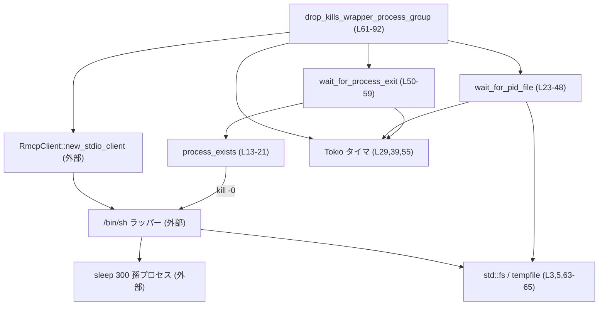
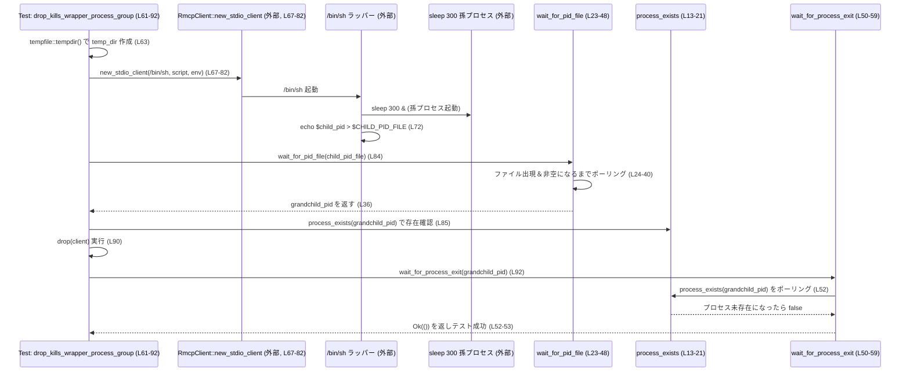

# rmcp-client/tests/process_group_cleanup.rs コード解説

## 0. ざっくり一言

Unix 環境で `RmcpClient` を `drop` したときに、その配下で動いているシェルと孫プロセス（`sleep 300`）まで含めて **プロセスグループがきちんと終了するか** を検証するテストと、そのための補助関数を定義したファイルです（`process_group_cleanup.rs:L1-93`）。

---

## 1. このモジュールの役割

### 1.1 概要

- このテストモジュールは、`codex_rmcp_client::RmcpClient` が外部コマンドをラップして実行する際に、**クライアント破棄（`drop`）によって子プロセスグループも終了させられる**ことを検証する目的で存在します（`process_group_cleanup.rs:L61-92`）。
- 具体的には、`RmcpClient::new_stdio_client` で `/bin/sh` を起動し、そのシェルからさらに `sleep 300` を孫プロセスとして起動し、その PID をファイル経由で取得して監視します（`L67-78`）。
- 補助関数として、PID の存在確認、PID ファイルのポーリング読み取り、プロセス終了待ちを行う非同期関数を定義しています（`L13-59`）。

### 1.2 アーキテクチャ内での位置づけ

このファイルは **テストコード** であり、ライブラリ本体ではなく、`RmcpClient` のプロセス管理挙動を OS レベルで検証するための周辺モジュールです。

- 上位: Cargo のテストランナー（`cargo test`）＋ Tokio ランタイム
- 本ファイル: Tokio の `#[tokio::test]` を用いた非同期テスト
- 外部依存:
  - `codex_rmcp_client::RmcpClient`（ライブラリ側）
  - OS の `/bin/sh` とその子プロセス `sleep 300`
  - OS の `kill -0`（プロセス存在チェックに使用）

主要な依存関係を Mermaid で示します（行番号付きラベル）:



※ `RmcpClient::new_stdio_client` や `/bin/sh` 自体の実装はこのチャンクには現れません。

### 1.3 設計上のポイント

- **Unix 限定のテスト**  
  - `#![cfg(unix)]` により Unix 系 OS でのみコンパイル・実行されます（`L1`）。
- **プロセス存在確認の実装**  
  - `kill -0 <pid>` を利用した POSIX 的な存在チェックを行います（`L13-20`）。
- **非同期ポーリング**  
  - PID ファイル出現とプロセス終了を、ともに 100ms 間隔・最大 50 回（約 5 秒）でポーリングする実装になっています（`L24-40`, `L51-56`）。
- **エラーハンドリング**  
  - `anyhow::Result` と `Context` を使い、失敗時にはメッセージを付加したエラーを返します（`L9-10`, `L33-36`, `L41-43`, `L47`, `L58`）。
- **並行性モデル**  
  - テストは Tokio の `multi_thread` フレーバーですが、`worker_threads = 1` に制限しており、シングルスレッドでの非同期実行となっています（`L61`）。

---

## 2. 主要な機能一覧（コンポーネントインベントリー）

このファイル内で定義される主な関数・テストの一覧です。

| 名称 | 種別 | 位置 | 役割 / 用途 |
|------|------|------|-------------|
| `process_exists` | 関数（同期） | `L13-21` | `kill -0` を使って指定 PID のプロセスが存在するかを判定する |
| `wait_for_pid_file` | 関数（`async`） | `L23-48` | PID を書いたファイルが現れるまでポーリングし、中身を `u32` としてパースして返す |
| `wait_for_process_exit` | 関数（`async`） | `L50-59` | 指定 PID のプロセスが終了するまで `process_exists` を使ってポーリングする |
| `drop_kills_wrapper_process_group` | Tokio テスト（`async`） | `L61-92` | `RmcpClient` を `drop` したときに孫プロセス（`sleep 300`）が終了することを検証する |

外部コンポーネント（このチャンクには定義がないが、重要なもの）:

| 名称 | 種別 | 位置（利用箇所） | 備考 |
|------|------|------------------|------|
| `codex_rmcp_client::RmcpClient` | 構造体（外部 crate） | `L11`, `L67-82` | 外部コマンドを標準入出力経由で扱うクライアント。詳細実装はこのチャンクには現れません。 |
| `/bin/sh` | 外部コマンド | `L68-73` | `sleep 300` を孫プロセスとして起動し、PID をファイルに書き出すためのラッパー。 |

---

## 3. 公開 API と詳細解説

このファイルはテストモジュールであり、`pub` な API は定義していませんが、**テストのコアロジックを支える 3 つのヘルパー関数と 1 つのテスト関数**を詳細に解説します。

### 3.1 型一覧（構造体・列挙体など）

このファイル内で新しく定義される構造体・列挙体はありません（`process_group_cleanup.rs:L1-93`）。

利用している主な型（外部／標準ライブラリ）:

| 名前 | 種別 | 役割 / 用途 | 根拠 |
|------|------|-------------|------|
| `RmcpClient` | 構造体（外部 crate） | 外部プロセスを管理するクライアントとして使用 | `L11`, `L67-82` |
| `anyhow::Result` | 型エイリアス | テスト関数・ヘルパー関数の戻り値として汎用エラー型を返す | `L10`, `L23`, `L50`, `L62` |
| `Path` | 構造体 | PID ファイルのパスを表現する | `L6`, `L23` |
| `HashMap<OsString, OsString>` | コレクション | 環境変数（`CHILD_PID_FILE`）を設定するために使用 | `L3`, `L75-78` |

### 3.2 関数詳細

#### `process_exists(pid: u32) -> bool`

**概要**

- 指定したプロセス ID (`pid`) のプロセスが現在存在するかどうかを、`kill -0` システムコールを利用して判定する関数です（`L13-20`）。

**引数**

| 引数名 | 型 | 説明 |
|--------|----|------|
| `pid` | `u32` | 存在確認を行いたいプロセスの PID |

**戻り値**

- `bool`:  
  - `true` … `kill -0` が成功した（プロセスが存在すると解釈している）  
  - `false` … コマンド失敗、もしくはエラー（プロセスが存在しない、または権限不足などで `kill` が失敗）

**内部処理の流れ**

1. `std::process::Command::new("kill")` で `kill` コマンドを起動します（`L14`）。
2. 引数として `"-0"` と `pid` を文字列化したものを指定します（`L15-16`）。
3. 標準エラー出力を `/dev/null` に捨てるように設定します（`L17`）。
4. `status()` でコマンドを実行し、終了ステータスの `success()` を取得します（`L18-19`）。
5. その結果が `Ok` なら `status.success()` の値を返し、`Err`（コマンド実行失敗）の場合は `false` を返します（`L19-20`）。

**Examples（使用例）**

```rust
// ある PID が存在しているかを確認する例
let pid: u32 = 12345;
if process_exists(pid) {                      // プロセスが存在すれば true
    println!("process {} is running", pid);
} else {
    println!("process {} is not running", pid);
}
```

※ 実際にはこのファイル内では `wait_for_process_exit` とテストアサーションの中で使用されています（`L52`, `L85-87`）。

**Errors / Panics**

- 関数自体は `Result` ではなく `bool` を返すため、**エラーを呼び出し側に伝播しません**。
  - `Command::status()` が `Err` を返した場合も `unwrap_or(false)` により `false` として扱われます（`L19-20`）。
- この関数内部で `panic!` が発生する可能性はコード上はありません。

**Edge cases（エッジケース）**

- **権限不足（Permission denied）**  
  - `kill -0` は、プロセスが存在しても権限がない場合に失敗します。  
    この実装ではその場合も `false` を返すため、「存在しない」と同様に扱われます。
- **無効な PID / 既に終了した PID**  
  - その場合も `kill -0` が失敗し、`false` を返します。
- **`kill` コマンド自体の不在**  
  - 非 Unix 環境ではこのファイル自体がコンパイルされませんが、Unix でも `kill` コマンドが存在しない特殊環境では `Command::new("kill")` が失敗し `false` となります。

**使用上の注意点**

- `false` が返ってきた場合、「プロセスが必ず存在しない」とは限らず、**権限不足などのエラーも同じく `false` になる**点に注意が必要です。
- セキュリティ上、テストでのみ利用する前提と思われますが（コードからは明示されていません）、本番での利用時にはエラー種別を区別したいケースがあります。
- 根拠: `process_group_cleanup.rs:L13-21`

---

#### `wait_for_pid_file(path: &Path) -> Result<u32>`

**概要**

- 指定されたパスのファイルが現れ、かつ内容が非空になってから、その内容を PID（`u32`）として読み取って返す非同期関数です（`L23-47`）。
- 約 5 秒間（50 回 × 100ms）ポーリングし、それでも適切な PID を読めなかった場合はタイムアウトエラーを返します。

**引数**

| 引数名 | 型 | 説明 |
|--------|----|------|
| `path` | `&Path` | 孫プロセスの PID が書き込まれることを期待する PID ファイルのパス |

**戻り値**

- `Result<u32>`:
  - `Ok(pid)` … ファイルから正常に PID を読み取り、`u32` にパースできた場合。
  - `Err(anyhow::Error)` … ファイル読み込みやパースが失敗した場合、またはタイムアウトした場合。

**内部処理の流れ**

1. `for _ in 0..50` で最大 50 回ループします（`L24`）。
2. `fs::read_to_string(path)` でファイルを読み込みます（`L25`）。
   - `Ok(content)`:
     1. `content.trim()` で前後の空白を取り除きます（`L27`）。
     2. 空文字列であれば 100ms スリープして次のループに進みます（`L28-31`）。
     3. 非空であれば `trimmed.parse::<u32>()` で `u32` にパースします（`L33-35`）。
        - 失敗した場合は `with_context` で「failed to parse pid …」というメッセージを付けてエラーにします（`L35`）。
        - 成功した場合はすぐに `Ok(pid)` で返します（`L36`）。
   - `Err(error)`:
     - `error.kind() == std::io::ErrorKind::NotFound` の場合:
       - ファイルがまだ存在していないとみなし、100ms スリープして次のループへ（`L38-40`）。
     - それ以外のエラーの場合:
       - `with_context` で「failed to read …」というメッセージを付けて `Err` を返し、関数を終了します（`L41-43`）。
3. 50 回のループをすべて終えても成功しなかった場合、`anyhow::bail!` でタイムアウトエラーを返します（`L47`）。

**Examples（使用例）**

```rust
// PID ファイル `child.pid` から PID を読み取る例
use std::path::Path;

let path = Path::new("child.pid");
let pid = wait_for_pid_file(path).await?;       // PID ファイルができ、数字が書かれるまで待つ
println!("child process pid = {}", pid);
```

このファイル内では、`drop_kills_wrapper_process_group` の中で孫プロセスの PID を取得するために呼び出されています（`L84`）。

**Errors / Panics**

- ファイル読み込みエラー:
  - `NotFound` 以外の `std::io::Error` の場合、`Err(error).with_context(..)` で即座にエラーを返します（`L41-43`）。
- パースエラー:
  - PID が数値でない場合、`trimmed.parse::<u32>()` が失敗し、「failed to parse pid from …」というメッセージ付きで `Err` になります（`L33-36`）。
- タイムアウト:
  - 50 回のループで成功しない場合、「timed out waiting for child pid file at …」というメッセージで `bail!` します（`L47`）。
- panic:
  - `bail!` は内部的にエラーを返すため、この関数内で `panic!` は発生しません。

**Edge cases（エッジケース）**

- **ファイルが存在するが常に空文字列**  
  - `trimmed.is_empty()` が `true` のまま 50 回続くと、タイムアウトになります（`L27-31`, `L47`）。
- **ファイルの内容が途中で不正な文字列になる**  
  - 不正な内容を読んだ時点でパース時に `Err` が返ります（`L33-36`）。
- **ファイルが一時的に消える／再作成される**  
  - `NotFound` は単にスリープしてリトライするため、一時的な消失にも対応できます（`L38-40`）。

**使用上の注意点**

- この関数は **ポーリング** 実装のため、最長で約 5 秒間待機します。短いタイムアウトが必要な場合はループ回数やスリープ時間を変更する必要があります。
- ファイルの内容に対して排他制御は行っていないため、**他プロセスが書き込み中のタイミング**で読んだ場合に不完全な内容を見る可能性があります。ここでは空文字列チェックとパースエラーである程度吸収しています。
- 根拠: `process_group_cleanup.rs:L23-48`

---

#### `wait_for_process_exit(pid: u32) -> Result<()>`

**概要**

- 指定した PID のプロセスが終了するまで、`process_exists` を用いてポーリングし、終了を確認する非同期関数です（`L50-58`）。
- 約 5 秒間（50 回 × 100ms）の間にプロセスが終了しない場合はエラーを返します。

**引数**

| 引数名 | 型 | 説明 |
|--------|----|------|
| `pid` | `u32` | 終了を待つ対象のプロセス ID |

**戻り値**

- `Result<()>`:
  - `Ok(())` … プロセスが終了した（`process_exists` が `false` を返した）と判断できた場合。
  - `Err(anyhow::Error)` … 50 回のポーリングでもプロセスがまだ存在していると判断された場合（タイムアウト）。

**内部処理の流れ**

1. `for _ in 0..50` で最大 50 回ループします（`L51`）。
2. 毎回 `process_exists(pid)` を呼び出し、プロセスの存在を確認します（`L52`）。
   - `false` が返ってきた場合、プロセスは終了したとみなし、`Ok(())` を返します（`L52-53`）。
3. まだ存在する場合は、100ms スリープして次のループへ進みます（`L55`）。
4. 50 回繰り返しても `process_exists` が `true` のままなら、「still running after timeout」というメッセージで `bail!` します（`L58`）。

**Examples（使用例）**

```rust
// ある PID のプロセスが終了するのを待つ例
let pid: u32 = 12345;
wait_for_process_exit(pid).await?;          // 最長約5秒待って終了を確認
println!("process {} has exited", pid);
```

このファイルでは、`drop_kills_wrapper_process_group` の最後で、孫プロセス `sleep 300` が `drop` 後に終了することを確認するために使用されています（`L92`）。

**Errors / Panics**

- タイムアウト時:
  - 「process {pid} still running after timeout」というメッセージで `anyhow::bail!` が呼ばれ、`Err` を返します（`L58`）。
- `process_exists` 内部のエラー（`kill` 実行失敗など）は `false` になるため、実質的に「終了した」として扱われる可能性があります（`L13-21`, `L52`）。
- panic:
  - `panic!` を呼ぶコードはなく、`bail!` は `Err` の返却に変換されるため、この関数自身は panic しません。

**Edge cases（エッジケース）**

- **`process_exists` が権限不足などで `false` を返した場合**  
  - 実際にはプロセスが動作していても、終了したと誤認する可能性があります。
- **終了直前に PID が再利用されるケース**  
  - OS によっては PID が再利用されるため、非常に短時間に PID が再利用されると別プロセスの終了を監視することになりますが、このレベルの扱いはテストコードとして許容されていると考えられます（コードからは明示されていません）。

**使用上の注意点**

- 正確な終了確認が重要な本番コードでは、単に `kill -0` に依存するのではなく、プロセスの所有者やコマンドラインのチェックなど追加の確認が必要になる場合があります。
- このテストでは **プロセスが「存在しない」状態になればよい** という前提の確認に使われている点に留意します。
- 根拠: `process_group_cleanup.rs:L50-59`

---

#### `drop_kills_wrapper_process_group() -> Result<()>`

**概要**

- Tokio の非同期テストとして定義されており、`RmcpClient::new_stdio_client` で `/bin/sh` をラップして起動し、そのシェルから孫プロセス `sleep 300` を起動させます（`L61-73`）。
- `RmcpClient` インスタンスを `drop` した後に、その孫プロセスが終了していることを `wait_for_process_exit` で検証します（`L90-92`）。

**引数**

- なし（テスト関数のため）。

**戻り値**

- `Result<()>`:
  - `Ok(())` … テスト成功。
  - `Err(anyhow::Error)` … テスト中のいずれかの操作（tempdir作成、クライアント生成、PID 読み取り、終了待ち）が失敗した場合。

**内部処理の流れ**

1. `tempfile::tempdir()` で一時ディレクトリを作成する（`L63`）。
2. そのディレクトリ配下に `child.pid` という PID ファイルのパスを用意する（`L64`）。
3. パスを `String` に変換し、環境変数 `CHILD_PID_FILE` に渡す準備をする（`L65`, `L75-78`）。
4. `RmcpClient::new_stdio_client` を呼び出し、以下の設定で `/bin/sh` を起動する（`L67-82`）:
   - コマンド: `/bin/sh`（`L68`）
   - 引数: `-c`, `"sleep 300 & child_pid=$!; echo \"$child_pid\" > \"$CHILD_PID_FILE\"; cat >/dev/null"`（`L69-73`）
     - `sleep 300 &` で背景で孫プロセスを起動
     - `child_pid=$!` で孫プロセスの PID を保存
     - `echo "$child_pid" > "$CHILD_PID_FILE"` で PID ファイルに書き出し
     - `cat >/dev/null` でシェルプロセス自身は標準入力を読み続けてブロック
   - 環境変数: `CHILD_PID_FILE` に PID ファイルのパス文字列を設定（`L75-78`）
   - 追加の引数や `cwd` は指定なし（`L79-80`）
5. `wait_for_pid_file(&child_pid_file).await?` を呼び出し、孫プロセスの PID をファイルから取得する（`L84`）。
6. `assert!(process_exists(grandchild_pid), ..)` で、`drop` 前には孫プロセスが実行中であることを確認する（`L85-87`）。
7. `drop(client);` で `RmcpClient` インスタンスを破棄し、クライアントが管理しているプロセスグループが終了することを期待する（`L90`）。
8. 最後に `wait_for_process_exit(grandchild_pid).await` を呼び出し、孫プロセスが終了するのを確認する（`L92`）。

**Examples（使用例）**

この関数自体はテストとして自動実行されることを想定しているため、外部から呼び出されません。  
同様のテストを書く場合のパターンを簡略化した例は次の通りです。

```rust
#[tokio::test(flavor = "multi_thread", worker_threads = 1)]
async fn verify_client_kills_children() -> anyhow::Result<()> {
    // 準備: 一時ディレクトリと PID ファイル
    let temp_dir = tempfile::tempdir()?;
    let pid_file = temp_dir.path().join("child.pid");

    // ここで RmcpClient を用いて、PID を pid_file に書き出すようなコマンドを起動する
    // ...

    // PID を取得
    let pid = wait_for_pid_file(&pid_file).await?;

    // クライアントを drop してプロセス終了を確認
    // drop(client);
    wait_for_process_exit(pid).await?;

    Ok(())
}
```

**Errors / Panics**

- `?` 演算子の使用箇所:
  - `tempfile::tempdir()` が失敗した場合（ディスクエラー等）に `Err` を返します（`L63`）。
  - `RmcpClient::new_stdio_client(...).await?` が失敗した場合（外部コマンド起動の失敗など）に `Err` を返します（`L67-82`）。
  - `wait_for_pid_file` / `wait_for_process_exit` が失敗した場合にも `Err` を返します（`L84`, `L92`）。
- `assert!`:
  - 孫プロセスが `drop` 前に存在しない場合、`assert!` が `panic!` を発生させ、テストは失敗します（`L85-87`）。

**Edge cases（エッジケース）**

- `/bin/sh` が存在しない、もしくは起動に失敗した場合:
  - `new_stdio_client` の内部でエラーとなり、このテストは `Err` で終了すると推測されます（詳細な挙動はこのチャンクからは不明です）。
- スクリプト内部で `CHILD_PID_FILE` が正しく設定されていない場合:
  - `wait_for_pid_file` がタイムアウトし、エラーになります（`L47`）。
- 孫プロセスを起動する前にシェルが異常終了した場合:
  - PID ファイルが作成されず、同様にタイムアウトになります。

**使用上の注意点**

- Tokio の属性:
  - `#[tokio::test(flavor = "multi_thread", worker_threads = 1)]` により、シングルスレッドのマルチスレッドランタイムで実行されるため、テスト中にブロッキングする処理があると全体が止まる可能性があります（`L61`）。
- テストの実行時間:
  - PID ファイル待ちとプロセス終了待ちで、それぞれ最長約 5 秒かかるため、テストが失敗する場合は最大で約 10 秒近くかかる可能性があります。
- 根拠: `process_group_cleanup.rs:L61-92`

---

### 3.3 その他の関数

このファイル内には上記 4 つ以外の関数はありません。

---

## 4. データフロー

代表的な処理シナリオとして、テスト `drop_kills_wrapper_process_group` 全体のフローを示します。

1. 一時ディレクトリ作成 → PID ファイルパス決定。
2. `RmcpClient::new_stdio_client` で `/bin/sh` を起動し、シェルが `sleep 300` を孫プロセスとして起動、PID をファイルに書き込む。
3. テスト側は `wait_for_pid_file` で PID ファイルを待ち受け、孫プロセスの PID を取得。
4. `process_exists` で孫プロセスが動作中であることを確認。
5. `drop(client)` によりクライアントを破棄し、プロセスグループの終了を期待。
6. `wait_for_process_exit` で孫プロセスが終了するまでポーリング。

これを Mermaid のシーケンス図で表します（関数名と行番号をラベルに含めています）。



このフローにより、「`RmcpClient` の破棄によって孫プロセスまで含めて終了しているか」をファイル I/O と OS レベルのプロセス存在チェックを組み合わせて検証しています。

---

## 5. 使い方（How to Use）

### 5.1 基本的な使用方法

このファイルはテスト用ですが、ヘルパー関数は他のテストでも再利用できる形になっています。  
典型的な利用の流れは次の通りです。

```rust
use std::path::Path;
// 1. 子（孫）プロセスの PID をファイルに書き出すようなコマンドを起動する
//    （ここでは RmcpClient など外部手段を用いる）

// 2. PID ファイルのパスを得る
let pid_file = Path::new("child.pid");

// 3. PID ファイルから PID を取得
let pid = wait_for_pid_file(pid_file).await?;

// 4. 必要に応じて起動中であることを確認
assert!(process_exists(pid));

// 5. プロセスを停止させる操作を行う（例: クライアントの drop や kill など）

// 6. プロセス終了を確認
wait_for_process_exit(pid).await?;
```

### 5.2 よくある使用パターン

- **外部クライアントが正しく子プロセスを管理しているかの検証**
  - `wait_for_pid_file` で子プロセスの PID を取得。
  - クライアントを `drop` または終了させる。
  - `wait_for_process_exit` で子プロセスが終了することを確認。

- **テスト時のプロセスリーク検知**
  - テストで複数の外部プロセスを起動する場合、終了前に全 PID について `wait_for_process_exit` を呼び出すことで、リークを検出できます。

### 5.3 よくある間違い

```rust
// 間違い例: PID ファイルが作成される前に wait_for_pid_file を呼んでいるが
//          タイムアウト時間が足りない、あるいは書き込み側の遅延を考慮していない
let pid = wait_for_pid_file(&pid_file).await?;  // 書き込みが非常に遅いとタイムアウト

// 正しい例: 書き込み側の仕様（どのタイミングで PID を書くか）を把握し、
//           `wait_for_pid_file` のタイムアウト（ループ回数・スリープ時間）が
//           十分かを検討する必要があります。
```

```rust
// 間違い例: process_exists の false を「プロセスが確実に終了した」とみなす
if !process_exists(pid) {
    // 実際には権限不足などのエラーの場合も false になる
}

// 正しい例: テスト用途では許容できるが、
//           本番用途ではエラーかどうか区別したい場合があることに注意する。
```

### 5.4 使用上の注意点（まとめ）

- プロセス存在確認は `kill -0` だけに依存しているため、**権限不足やコマンド不在が「存在しない」と見なされる**点に注意が必要です。
- ポーリング間隔・回数は固定値（100ms × 50 回）になっており、環境によってはこれでは足りない／長すぎる場合があります。
- テストは Unix に限定されており、Windows など非 Unix 環境ではコンパイルされません。

---

## 6. 変更の仕方（How to Modify）

### 6.1 新しい機能を追加する場合

- **別のクライアント挙動を検証するテストを追加する場合**
  1. 本ファイルと同様に Tokio テスト関数を追加する（`#[tokio::test]` を付与）。
  2. 外部プロセスが PID をファイルに書き出すようなコマンド・スクリプトを用意する。
  3. 既存の `wait_for_pid_file` / `wait_for_process_exit` を再利用して、起動と終了を確認する。

- **タイムアウト秒数を可変にしたい場合**
  - `wait_for_pid_file` / `wait_for_process_exit` のループ回数やスリープ時間を引数化する新しい関数を追加するのが自然です。
  - 例: `async fn wait_for_pid_file_with_timeout(path: &Path, timeout: Duration) -> Result<u32>` など（実装はこのチャンクにはありません）。

### 6.2 既存の機能を変更する場合

- 変更時の確認ポイント:
  - `wait_for_pid_file` / `wait_for_process_exit` のループ条件やエラー文言を変更すると、**テストの失敗メッセージ** が変わるため、他のテストやログ解析への影響を確認する必要があります。
  - `process_exists` の実装を変える（例: `/proc` を読む方式に変更）場合、**権限やプラットフォーム依存性**が変化するため、Unix 全体で動作するか検証が必要です。
- 契約（前提条件）:
  - `wait_for_pid_file` は「最終的に PID ファイルに `u32` で解釈できる文字列が書かれる」ことを前提にしており、この前提が成り立たない場合はテストを書き換える必要があります。
  - `wait_for_process_exit` は「`process_exists == false` を終了と見なす」という契約を持っており、ここを変更する場合はすべての呼び出し側で意味を再確認する必要があります。

---

## 7. 関連ファイル

このチャンクから直接参照できる関連ファイル・モジュールは次の通りです。

| パス / モジュール名 | 役割 / 関係 |
|---------------------|------------|
| `codex_rmcp_client::RmcpClient` | `new_stdio_client` を通じて `/bin/sh` を起動し、そのプロセスグループを管理するクライアント。実装ファイルの場所はこのチャンクには現れません。 |
| `tempfile` crate | 一時ディレクトリ作成に使用されています（`process_group_cleanup.rs:L63`）。 |
| `tokio` crate | 非同期ランタイムとタイマ（`tokio::time::sleep`）、およびテストマクロ（`#[tokio::test]`）を提供します（`L29,39,55,61`）。 |

その他のテストファイルやライブラリ本体 (`src` ディレクトリなど) との具体的な関係は、このチャンクには現れないため不明です。
