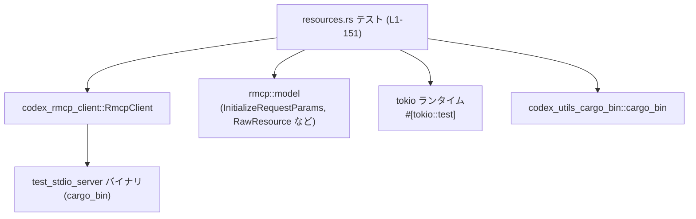
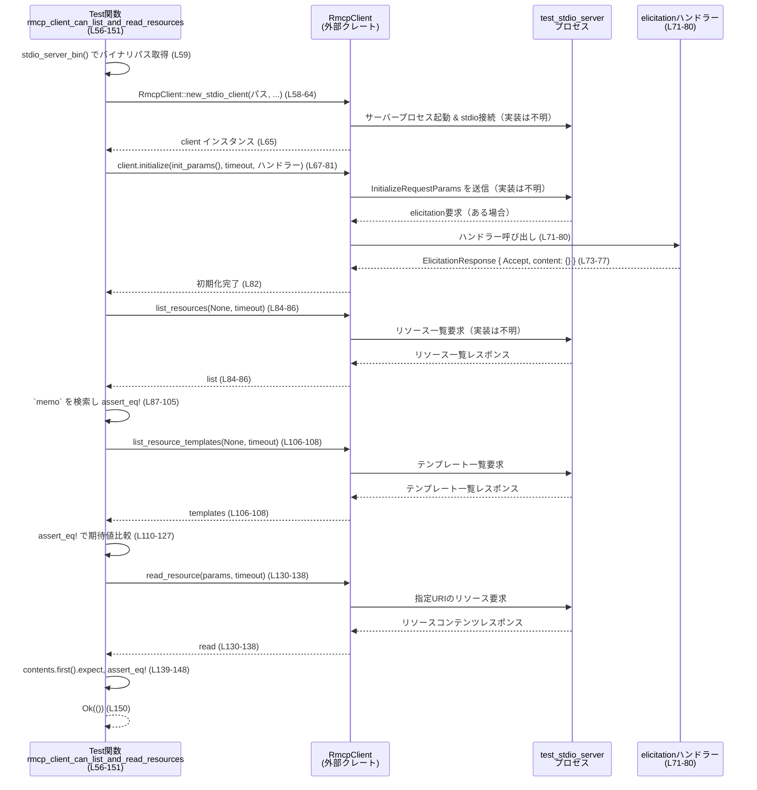
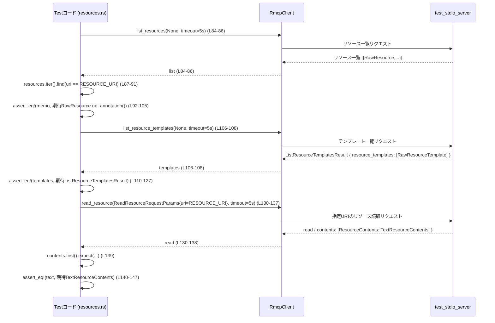

# rmcp-client/tests/resources.rs コード解説

## 0. ざっくり一言

このファイルは、`RmcpClient` が標準入出力経由のテストサーバーと通信し、**リソース一覧取得・テンプレート一覧取得・リソース本文取得** が正しく行えることを検証する統合テストです（resources.rs:L22, L56-151）。

---

## 1. このモジュールの役割

### 1.1 概要

- このモジュールは、`codex_rmcp_client::RmcpClient` を使ってテスト用 MCP サーバー（`test_stdio_server` バイナリ）に接続し、以下を検証します（resources.rs:L24-26, L58-65）。
  - 指定 URI のリソースが一覧に含まれていること（resources.rs:L84-91）。
  - リソーステンプレート一覧が期待どおり 1 件のテンプレートを返すこと（resources.rs:L106-108, L110-127）。
  - リソースを読み出すと、期待どおりのテキストコンテンツが返ること（resources.rs:L130-138, L140-148）。
- これにより、**標準入出力ベースの RMCP クライアントとサーバー間の基本的なやり取り**が正常に動作するかを保証します。

### 1.2 アーキテクチャ内での位置づけ

このテストは以下のコンポーネントに依存しています。

- `RmcpClient`: 標準入出力経由で外部バイナリと通信するクライアント（resources.rs:L7, L58-65）。
- `test_stdio_server` バイナリ: 実際の MCP リソースを提供するテスト用サーバー（resources.rs:L24-26, L58-59）。
- `rmcp::model` の各種型: プロトコルでやり取りされるメッセージの型（resources.rs:L10-19, L28-53, L94-105, L110-127, L132-147）。
- Tokio ランタイム: 非同期テストを実行するランタイム（resources.rs:L56-57）。

依存関係を簡略化した図です（ファイル全体: resources.rs L1-151）。



### 1.3 設計上のポイント

コードから読み取れる設計上の特徴は次のとおりです。

- **ヘルパー関数による共通処理の分離**
  - テストサーバーバイナリのパス取得 `stdio_server_bin`（resources.rs:L24-26）。
  - 初期化パラメータ組み立て `init_params`（resources.rs:L28-54）。
- **明示的なタイムアウト指定**
  - `initialize`, `list_resources`, `list_resource_templates`, `read_resource` すべてで 5 秒のタイムアウトを指定（resources.rs:L70, L85, L107, L136）。
- **非同期・並行性**
  - `#[tokio::test(flavor = "multi_thread", worker_threads = 1)]` により Tokio のマルチスレッドランタイム上で非同期テストを実行（resources.rs:L56-57）。
  - サーバーとのやり取り自体は `await` により逐次的に行われています（resources.rs:L65, L82, L86, L108, L138）。
- **エラーハンドリング**
  - `anyhow::Result<()>` をテストの戻り値に用い、`?` 演算子で外部 API からのエラーをそのまま伝播（resources.rs:L57-65, L67-82, L84-86, L106-108, L130-138）。
  - 期待値不一致・データ欠如は `assert_eq!` と `expect(...)` により panic として検出（resources.rs:L91-105, L110-127, L139-148）。
- **プロトコル機能の指定**
  - `InitializeRequestParams` 内で elicitation（聞き取り）機能を有効化し、プロトコルバージョン `V_2025_06_18` を明示（resources.rs:L31-42, L52）。

---

## 2. 主要な機能一覧

このファイルが提供する主な機能（テスト用）は次のとおりです。

- `stdio_server_bin`: テスト用標準入出力サーバーバイナリ `test_stdio_server` のパスを取得するヘルパー（resources.rs:L24-26）。
- `init_params`: `RmcpClient::initialize` に渡す初期化パラメータを構築する（resources.rs:L28-54）。
- `rmcp_client_can_list_and_read_resources`: サーバーに接続し、リソース一覧取得・テンプレート一覧取得・リソース読取が期待どおりに動くことを検証する非同期テスト（resources.rs:L56-151）。

---

## 3. 公開 API と詳細解説

このファイル自体はテスト用であり、ライブラリとして公開される API は定義していません。ただし、**テストコードとして `RmcpClient` の利用例となる関数**を解説します。

### 3.1 コンポーネント一覧

#### 3.1.1 このファイルで定義される要素

| 名前 | 種別 | 役割 / 用途 | 定義位置 |
|------|------|-------------|----------|
| `RESOURCE_URI` | 定数 `&'static str` | テスト対象となるメモリソースの URI (`"memo://codex/example-note"`)（resources.rs:L22） | resources.rs:L22 |
| `stdio_server_bin` | 関数 `fn() -> Result<PathBuf, CargoBinError>` | `cargo_bin("test_stdio_server")` を呼び出し、テスト用サーバーバイナリのパスを取得（resources.rs:L24-26） | resources.rs:L24-26 |
| `init_params` | 関数 `fn() -> InitializeRequestParams` | クライアント情報とクライアント能力（特に elicitation 関連）を設定した初期化パラメータ構築（resources.rs:L28-54） | resources.rs:L28-54 |
| `rmcp_client_can_list_and_read_resources` | 非同期テスト関数 `async fn() -> anyhow::Result<()>` | サーバーとの接続、初期化、リソース一覧取得、テンプレート一覧取得、リソース読取を一連で検証（resources.rs:L56-151） | resources.rs:L56-151 |

#### 3.1.2 このファイルで利用している主な外部型

| 名前 | 所属 / 種別 | 役割 / 用途 | 使用位置 |
|------|------------|-------------|----------|
| `RmcpClient` | `codex_rmcp_client` 構造体 | 標準入出力経由でサーバープロセスと通信するクライアント（resources.rs:L7, L58-65, L67-82, L84-86, L106-108, L130-138） | resources.rs:L7, L58-65, L67-82, L84-86, L106-108, L130-138 |
| `InitializeRequestParams` | `rmcp::model` 構造体 | クライアントの能力・情報・プロトコルバージョンをサーバーへ通知する初期化リクエスト（resources.rs:L15, L28-53, L69） | resources.rs:L15, L28-53, L69 |
| `ClientCapabilities` | `rmcp::model` 構造体 | クライアントがサポートする機能セット（elicitation など）を表現（resources.rs:L11, L31-43） | resources.rs:L11, L31-43 |
| `ElicitationCapability` / `FormElicitationCapability` | `rmcp::model` 構造体 | フォームによる聞き取り機能の有効化設定（resources.rs:L12-13, L36-41） | resources.rs:L12-13, L36-41 |
| `Implementation` | `rmcp::model` 構造体 | クライアント実装の名前・バージョンなどのメタ情報（resources.rs:L14, L44-51） | resources.rs:L14, L44-51 |
| `ProtocolVersion` | `rmcp::model` 列挙体 | 利用するプロトコルバージョンの指定（`V_2025_06_18`）（resources.rs:L17, L52） | resources.rs:L17, L52 |
| `ListResourceTemplatesResult` | `rmcp::model` 構造体 | `list_resource_templates` の戻り値となるテンプレート一覧（resources.rs:L16, L110-127） | resources.rs:L16, L110-127 |
| `ReadResourceRequestParams` | `rmcp::model` 構造体 | `read_resource` に渡す URI 指定付きリクエスト（resources.rs:L18, L132-135） | resources.rs:L18, L132-135 |
| `ResourceContents` | `rmcp::model` 列挙体 | 読み出したリソースの中身を表現する enum。`TextResourceContents` バリアントを使用（resources.rs:L19, L142-147） | resources.rs:L19, L142-147 |
| `AnnotateAble` | `rmcp::model` トレイト | `.no_annotation()` により、生のモデルからアノテーションなしの値を生成するために利用（resources.rs:L10, L104-104, L125-125） | resources.rs:L10, L104-104, L125-125 |
| `RawResource` / `RawResourceTemplate` | `rmcp::model` 構造体 | サーバーから返されるリソース・テンプレートの生データ（resources.rs:L94-103, L115-124） | resources.rs:L94-103, L115-124 |
| `ElicitationAction` / `ElicitationResponse` | `codex_rmcp_client` 型 | サーバーからの elicitation に対する応答を表現。ここでは無条件に Accept（resources.rs:L5-6, L73-76） | resources.rs:L5-6, L73-76 |

---

### 3.2 関数詳細: `rmcp_client_can_list_and_read_resources()`

#### シグネチャ

```rust
#[tokio::test(flavor = "multi_thread", worker_threads = 1)]
async fn rmcp_client_can_list_and_read_resources() -> anyhow::Result<()> {
    // ...
}
```

（resources.rs:L56-57）

#### 概要

- Tokio の非同期テストとして、標準入出力ベースの `RmcpClient` を用いてテストサーバーに接続し、以下を検証する関数です（resources.rs:L56-151）。
  - クライアント初期化 (`initialize`) が成功する。
  - `list_resources` で既知の URI のリソースが取得できる。
  - `list_resource_templates` で既知のテンプレートが取得できる。
  - `read_resource` で期待したテキストコンテンツが得られる。

#### 引数

- このテスト関数は引数を取りません（resources.rs:L56-57）。

#### 戻り値

- 型: `anyhow::Result<()>`（resources.rs:L57）
  - すべての非同期操作とアサーションが成功した場合は `Ok(())` を返します（resources.rs:L150）。
  - `RmcpClient` の各メソッドやヘルパー関数からエラーが返された場合は `Err(e)` が返り、テストは失敗します（`?` 演算子により伝播; resources.rs:L58-65, L67-82, L84-86, L106-108, L130-138）。

#### 内部処理の流れ（アルゴリズム）

1. **クライアントの生成**（resources.rs:L58-65）
   - `stdio_server_bin()` で `test_stdio_server` バイナリのパスを取得（resources.rs:L59）。
   - 追加引数・環境変数・カレントディレクトリはすべてデフォルト（空/None）を指定（resources.rs:L60-63）。
   - `RmcpClient::new_stdio_client(..).await?` により、テストサーバープロセスを起動し、それと接続された `RmcpClient` インスタンスを得ます。

2. **クライアントの初期化**（resources.rs:L67-82）
   - `init_params()` で初期化パラメータを生成（resources.rs:L69）。
   - タイムアウトとして `Some(Duration::from_secs(5))` を指定（resources.rs:L70）。
   - 第 3 引数として、elicitation ハンドラーを `Box::new(|_, _| { ... })` で渡しています（resources.rs:L71-80）。
     - このクロージャは 2 つの引数を取り（型はこのチャンクには現れません）、`async { ... }.boxed()` により、即座に `Future` を返す非同期ハンドラーを生成します（resources.rs:L72-79）。
     - 非同期ブロック内では、`ElicitationResponse { action: Accept, content: Some(json!({})), meta: None }` を `Ok` で包んで返します（resources.rs:L73-77）。
     - つまり、**どの elicitation に対しても無条件に「Accept」で応答し、空の JSON オブジェクトをコンテンツとして返す**実装です。
   - `.await?` により初期化完了を待機し、エラーなら早期リターンします（resources.rs:L82）。

3. **リソース一覧の取得と検証**（resources.rs:L84-105）
   - `client.list_resources(None, Some(Duration::from_secs(5))).await?` でリソース一覧を取得（resources.rs:L84-86）。
   - 返された `list.resources` のイテレータから、`resource.uri == RESOURCE_URI` に一致する要素を検索し、`expect("memo resource present")` で必ず見つかることを前提にしています（resources.rs:L87-91）。
   - 見つかった `memo` と、期待される `rmcp::model::RawResource { ... }.no_annotation()` を `assert_eq!` で比較し、一致しなければテスト失敗となります（resources.rs:L92-105）。

4. **リソーステンプレート一覧の取得と検証**（resources.rs:L106-128）
   - `client.list_resource_templates(None, Some(Duration::from_secs(5))).await?` でテンプレート一覧を取得（resources.rs:L106-108）。
   - 結果全体 `templates` が、`ListResourceTemplatesResult { ... }` と完全一致することを `assert_eq!` で確認しています（resources.rs:L110-127）。
     - 中には `rmcp::model::RawResourceTemplate { ... }.no_annotation()` を 1 要素だけ持つ `resource_templates` ベクタが含まれます（resources.rs:L114-126）。

5. **リソース本文の取得と検証**（resources.rs:L130-148）
   - `ReadResourceRequestParams { meta: None, uri: RESOURCE_URI.to_string() }` を構築し（resources.rs:L132-135）、`client.read_resource(..).await?` を呼び出します（resources.rs:L130-138）。
   - 戻り値 `read.contents` の先頭要素を `.first().expect("resource contents present")` で取り出します（resources.rs:L139）。
   - その内容が `ResourceContents::TextResourceContents { ... }` であり、URI・MIME タイプ・テキスト・meta が期待どおりであることを `assert_eq!` で確認します（resources.rs:L140-147）。

6. **正常終了**（resources.rs:L150）
   - すべてのステップを通過すると `Ok(())` を返し、テスト成功となります。

Mermaid のシーケンス図で処理の流れを表すと次のようになります（対象: `rmcp_client_can_list_and_read_resources` resources.rs L56-151）。



#### Examples（使用例）

このテスト関数自体が `RmcpClient` の基本的な使い方の例になっています。特に **initialize の呼び出しと elicitation ハンドラーの設定**は、そのままアプリケーションコードで利用できるパターンです。

`initialize` 呼び出し部分だけを抜き出した例です（resources.rs:L67-82）。

```rust
// client: RmcpClient が既に作成されているとする
client
    .initialize(
        init_params(),                          // 初期化パラメータ（resources.rs:L28-54）
        Some(Duration::from_secs(5)),           // 操作全体のタイムアウト（5秒）（resources.rs:L70）
        Box::new(|_, _| {                       // elicitationハンドラー（resources.rs:L71）
            async {
                // サーバーからの elicitation に対して常に Accept で応答（resources.rs:L73-76）
                Ok(ElicitationResponse {
                    action: ElicitationAction::Accept,
                    content: Some(json!({})),   // 空のJSONオブジェクトを返す（resources.rs:L75）
                    meta: None,
                })
            }
            .boxed()                            // Future をヒープ確保された型に変換（resources.rs:L79）
        }),
    )
    .await?;                                    // エラーがあれば呼び出し元に伝播（resources.rs:L82）
```

#### Errors / Panics

**Errors**

- この関数は `?` 演算子により、以下の呼び出しから返されるエラーをそのまま `anyhow::Result` 経由でテストランナーに伝播します（resources.rs:L58-65, L67-82, L84-86, L106-108, L130-138）。
  - `stdio_server_bin()`（`cargo_bin("test_stdio_server")` の失敗など; resources.rs:L24-26, L59）。
  - `RmcpClient::new_stdio_client(...)`（プロセス起動や接続のエラー）。
  - `client.initialize(...)`。
  - `client.list_resources(...)`。
  - `client.list_resource_templates(...)`。
  - `client.read_resource(...)`。
- 各メソッドが具体的にどのようなエラー型や条件を持つかは、本ファイルには定義されていません（`RmcpClient` や `rmcp::model` の実装はこのチャンクには現れません）。

**Panics**

- `expect("memo resource present")`:
  - リソース一覧 `list.resources` に `RESOURCE_URI` が存在しない場合に panic します（resources.rs:L87-91）。
- `assert_eq!(memo, &RawResource { ... }.no_annotation())`:
  - 見つかったリソースの内容が期待値と異なる場合に panic します（resources.rs:L92-105）。
- `assert_eq!(templates, ListResourceTemplatesResult { ... })`:
  - テンプレート一覧が期待値と異なる場合に panic（resources.rs:L110-127）。
- `expect("resource contents present")`:
  - `read.contents` が空配列の場合に panic（resources.rs:L139）。
- `assert_eq!(text, &ResourceContents::TextResourceContents { ... })`:
  - コンテンツが期待した形式・値でない場合に panic（resources.rs:L140-147）。

いずれの panic も、テストの失敗として扱われます。

#### Edge cases（エッジケース）

この関数で顕在化する代表的なエッジケースと挙動は次のとおりです。

- **サーバーバイナリが見つからない / 起動に失敗する**
  - `cargo_bin("test_stdio_server")` が失敗した場合、`stdio_server_bin()` からの `Err` が `?` によりテスト関数の戻り値となり、テストはエラー終了します（resources.rs:L24-26, L59, L65）。
- **初期化時の elicitation が想定外**
  - ハンドラーは `ElicitationResponse` を常に `Accept` で返すため、サーバーがこの応答を前提どおりに解釈できない場合は `initialize` がエラーになる可能性がありますが、その詳細な挙動は本ファイルからは分かりません（resources.rs:L71-80）。
- **リソース一覧が空 / 対象 URI が存在しない**
  - `list.resources` に目的の URI がない場合、`.find(...).expect("memo resource present")` が panic します（resources.rs:L87-91）。
- **テンプレート一覧が空 / 期待値と異なる**
  - `assert_eq!` が失敗し panic します（resources.rs:L110-127）。
- **リソースコンテンツが空 / 形式違い**
  - `read.contents.first()` が `None` の場合は `expect("resource contents present")` で panic（resources.rs:L139）。
  - 先頭要素が `TextResourceContents` でない、あるいは内容が異なる場合も `assert_eq!` で panic（resources.rs:L140-147）。

#### 使用上の注意点

- **初期化の順序**
  - このテストでは `RmcpClient` 生成後に必ず `initialize` を呼び、その後で `list_resources` / `list_resource_templates` / `read_resource` を実行しています（resources.rs:L58-82, L84-86, L106-108, L130-138）。
  - `RmcpClient` の仕様自体は本ファイルだけでは分かりませんが、少なくともこのテストは「初期化後に API を使う」前提で書かれています。
- **非同期コンテキスト**
  - 関数は `async fn` であり、`#[tokio::test]` により Tokio ランタイム上で実行されます（resources.rs:L56-57）。
  - 通常の `main` 関数から同様のコードを利用する場合は、Tokio ランタイムなどの非同期実行環境が必要です。
- **タイムアウト設定**
  - 各操作に 5 秒のタイムアウトを設定しているため、サーバーが応答しない場合でもテストが無期限にハングしない設計になっています（resources.rs:L70, L85, L107, L136）。
  - 一方で、環境によっては 5 秒では短すぎる可能性もありますが、本ファイルから適切な値を判断することはできません。
- **外部プロセス実行に関する安全性**
  - `new_stdio_client` は外部バイナリ `test_stdio_server` を起動することが関数名から推測できますが、その具体的な動作やセキュリティ上の考慮事項は本ファイルには示されていません（resources.rs:L58-59）。
  - テスト環境以外で類似コードを利用する場合は、実行するバイナリの信頼性や実行権限に注意が必要です。

---

### 3.3 その他の関数

| 関数名 | 役割（1 行） | 定義位置 |
|--------|--------------|----------|
| `stdio_server_bin() -> Result<PathBuf, CargoBinError>` | `codex_utils_cargo_bin::cargo_bin("test_stdio_server")` を呼び出し、テストサーバーバイナリへのパスを取得する（resources.rs:L24-26）。 | resources.rs:L24-26 |
| `init_params() -> InitializeRequestParams` | `ClientCapabilities` と `Implementation`、`ProtocolVersion` を設定した初期化パラメータを構築する（resources.rs:L28-54）。 | resources.rs:L28-54 |

---

## 4. データフロー

このファイルにおける代表的なデータフローは、「リソース一覧取得からリソース本文読取までの一連の流れ」です（resources.rs:L84-105, L106-127, L130-148）。

1. `list_resources` 呼び出しにより、サーバーから `RawResource` のリストが返されます（resources.rs:L84-86）。
2. 一覧から `RESOURCE_URI` と等しい `uri` を持つ `RawResource` を選び出し、期待値と比較します（resources.rs:L87-105）。
3. `list_resource_templates` により、`RawResourceTemplate` を含む `ListResourceTemplatesResult` が返されます（resources.rs:L106-108, L110-127）。
4. `read_resource` により、指定 URI のリソースコンテンツ（`ResourceContents::TextResourceContents`）が返されます（resources.rs:L130-138, L140-147）。

このデータフローをシーケンス図で表すと次のようになります（resources.rs L84-148）。



---

## 5. 使い方（How to Use）

このファイルはテストですが、`RmcpClient` を用いた **典型的な利用フローのサンプル**として扱うことができます。

### 5.1 基本的な使用方法

`RmcpClient` を使ってサーバーに接続し、初期化後にリソース一覧と内容を取得する最小限の例を、テストコードに基づいてまとめると次のようになります。

```rust
use std::ffi::OsString;                     // OsString型の利用（resources.rs:L1）
use std::time::Duration;                    // Duration型の利用（resources.rs:L3）
use codex_rmcp_client::{RmcpClient, ElicitationAction, ElicitationResponse}; // クライアントとelicitation関連（resources.rs:L5-7）
use serde_json::json;                       // JSONマクロ（resources.rs:L20）
use futures::FutureExt as _;                // .boxed() のためのトレイト（resources.rs:L9）

// 初期化パラメータ構築関数（resources.rs:L28-54 と同様の実装）
fn init_params() -> rmcp::model::InitializeRequestParams {
    // ... resources.rs:L28-53 を参照 ...
    unimplemented!()
}

#[tokio::main]                              // Tokioランタイムでmainを実行
async fn main() -> anyhow::Result<()> {     // anyhow::Resultでエラー伝播（resources.rs:L57）
    // テストサーバーバイナリへのパスを取得（resources.rs:L24-26, L59）
    let server_path = codex_utils_cargo_bin::cargo_bin("test_stdio_server")?;

    // 標準入出力クライアントを生成（resources.rs:L58-65）
    let client = RmcpClient::new_stdio_client(
        server_path.into(),                 // PathBufに変換（resources.rs:L59）
        Vec::<OsString>::new(),             // コマンドライン引数なし（resources.rs:L60）
        None,                               // 環境変数を追加しない（resources.rs:L61）
        &[],                                // 追加のファイルディスクリプタなし（resources.rs:L62）
        None,                               // カレントディレクトリを変更しない（resources.rs:L63）
    )
    .await?;                                // エラー時はErrとしてmainの呼び出し元へ（resources.rs:L65）

    // elicitationハンドラー付きで初期化（resources.rs:L67-82）
    client
        .initialize(
            init_params(),                  // 初期化パラメータ（resources.rs:L69）
            Some(Duration::from_secs(5)),   // タイムアウト（resources.rs:L70）
            Box::new(|_, _| {
                async {
                    Ok(ElicitationResponse {
                        action: ElicitationAction::Accept,
                        content: Some(json!({})), // 空のJSON（resources.rs:L75）
                        meta: None,
                    })
                }
                .boxed()
            }),
        )
        .await?;                            // エラー時はここでreturn Err（resources.rs:L82）

    // リソース一覧から特定URIを探す（resources.rs:L84-91）
    let list = client
        .list_resources(None, Some(Duration::from_secs(5)))
        .await?;
    let uri = "memo://codex/example-note".to_string();
    let memo = list
        .resources
        .iter()
        .find(|r| r.uri == uri)
        .expect("resource not found");

    println!("Found resource: {} ({:?})", memo.uri, memo.mime_type);
    Ok(())
}
```

この例は、テストコードと同じ順序で `RmcpClient` を利用しています。

### 5.2 よくある使用パターン

このファイルから読み取れるパターンは主に 2 つです。

1. **一覧を取得してフィルタするパターン**（resources.rs:L84-91）

   ```rust
   let list = client
       .list_resources(None, Some(Duration::from_secs(5)))
       .await?;
   let memo = list
       .resources
       .iter()
       .find(|resource| resource.uri == RESOURCE_URI)
       .expect("memo resource present");
   ```

   - 一覧 API で全件取得し、クライアント側で条件（URI）に一致するものを絞り込むパターンです。

2. **既知の URI で直接読取るパターン**（resources.rs:L130-138）

   ```rust
   let read = client
       .read_resource(
           ReadResourceRequestParams {
               meta: None,
               uri: RESOURCE_URI.to_string(),
           },
           Some(Duration::from_secs(5)),
       )
       .await?;
   let text = read.contents.first().expect("resource contents present");
   ```

   - URI が既に分かっている場合は、このように直接 `read_resource` を呼び出して内容を取得しています。

### 5.3 よくある間違い（推測される注意点）

このファイル単体から「よくある間違い」を断定することはできませんが、テストコードの書き方から次の点が重要であると読み取れます。

```rust
// 誤りになりうる書き方の例（イメージ）

// クライアントを作っただけで initialize せずに API を呼ぶ
let client = RmcpClient::new_stdio_client(/* ... */).await?;
// ↓ initialize を呼ばずに list_resources する
let list = client.list_resources(None, None).await?;
```

- このようなコードが有効かどうかは `RmcpClient` の仕様次第であり、このチャンクからは分かりません。
- しかし、このテストでは **必ず initialize を行ってからその他の API を呼び出している** ため（resources.rs:L67-82 の後に L84-86, L106-108, L130-138）、その順序を守ることが期待されている可能性があります。

また、エラーを無視するのも避けるべきパターンです。

```rust
// 誤りになりやすい例: エラーを無視してしまう
let _ = client.list_resources(None, Some(Duration::from_secs(5))).await;
// エラーが起きても気づけない
```

テストでは `?` を使い、エラーを必ずテスト失敗として扱っています（resources.rs:L58-65, L84-86, L106-108, L130-138）。

### 5.4 使用上の注意点（まとめ）

- **非同期ランタイム必須**
  - `RmcpClient` の利用はすべて `async` 関数内で行われており、Tokio などのランタイムが必要です（resources.rs:L56-57, L58-65）。
- **タイムアウトの扱い**
  - 本テストは 5 秒という固定値を利用していますが、実環境で利用する際は、サーバーの応答時間やネットワーク状況に応じた値に調整する必要があります（resources.rs:L70, L85, L107, L136）。
- **外部プロセスの信頼性**
  - `test_stdio_server` のような外部バイナリとの通信は、そのバイナリの動作に依存します。本テストではそのソースコードは表示されておらず、安全性やエラーハンドリングの詳細はこのチャンクからは分かりません（resources.rs:L24-26, L58-59）。
- **アサーション依存**
  - テストは `assert_eq!` や `expect(...)` に強く依存しており、期待値を変更する際はそれらの値をすべて整合させる必要があります（resources.rs:L92-105, L110-127, L139-147）。

---

## 6. 変更の仕方（How to Modify）

### 6.1 新しい機能（テストケース）を追加する場合

このファイルに新しいテストを追加して別のリソースや振る舞いを検証する場合の大まかな手順です。

1. **対象リソース URI の追加**
   - 新しい定数を定義する、またはテスト内ローカル変数として URI を用意します。
   - 例: `const ANOTHER_RESOURCE_URI: &str = "...";`（`RESOURCE_URI` と同様; resources.rs:L22）。

2. **初期化パラメータがそのまま使えるか確認**
   - `init_params()` で設定している機能（特に `elicitation` や `protocol_version`）で新しいテストケースも問題なく動くかを確認します（resources.rs:L31-42, L52）。
   - 別のプロトコルバージョンや機能を試したい場合は `init_params` 内の該当フィールドを変更します。

3. **新しい `#[tokio::test]` 関数を追加**
   - `rmcp_client_can_list_and_read_resources` と同様に、`RmcpClient` の生成 → `initialize` → 必要な API 呼び出し → アサーション、という流れでテストを書きます（resources.rs:L56-151 を参考）。

4. **アサーションの期待値を追加**
   - 追加したリソースやテンプレートがどのような値を持つべきかを `RawResource` / `RawResourceTemplate` / `ResourceContents` で明示し、`assert_eq!` で比較します（resources.rs:L94-103, L115-124, L142-147）。

### 6.2 既存の機能（このテスト）を変更する場合

- **プロトコルバージョンを変更する**
  - `init_params()` 内の `protocol_version` を変更します（resources.rs:L52）。
  - 変更によりサーバー側の挙動が変わる可能性があるため、`initialize` や各 API の期待結果も合わせて見直す必要があります。

- **クライアント能力（capabilities）を変更する**
  - `ClientCapabilities` のフィールド（`elicitation`, `experimental`, `extensions` 等）を更新します（resources.rs:L31-43）。
  - 特に `elicitation` を無効化・変更した場合、`initialize` 時の挙動が変わる可能性がありますが、その具体的影響は `rmcp::model` / サーバー実装側に依存します。

- **URI やリソース内容の期待値を変更する**
  - `RESOURCE_URI`（resources.rs:L22）と、それに連動する `RawResource` / `RawResourceTemplate` / `TextResourceContents` の期待値（resources.rs:L94-103, L115-124, L142-147）を一貫して更新する必要があります。
  - 1 つだけ変更すると `assert_eq!` が失敗します。

- **タイムアウト値を変更する**
  - `Duration::from_secs(5)` を別の値に変更します（resources.rs:L70, L85, L107, L136）。
  - テストが環境に対して敏感になる可能性があるため、変更後は CI や開発環境での安定性を確認する必要があります。

---

## 7. 関連ファイル

このモジュールと密接に関係する外部コンポーネントは次のとおりです。

| パス / クレート | 役割 / 関係 |
|----------------|------------|
| `codex_rmcp_client` クレート | `RmcpClient`, `ElicitationAction`, `ElicitationResponse` を提供し、本テストの主要な対象となるクライアント実装です（resources.rs:L5-7, L58-65, L67-82, L73-76, L84-86, L106-108, L130-138）。 |
| `rmcp` クレートの `model` モジュール | プロトコルのメッセージ型（`InitializeRequestParams`, `ClientCapabilities`, `RawResource`, `RawResourceTemplate`, `ListResourceTemplatesResult`, `ReadResourceRequestParams`, `ResourceContents`, `AnnotateAble` など）を提供します（resources.rs:L10-19, L28-53, L94-105, L110-127, L132-147）。 |
| `codex_utils_cargo_bin` クレート | `cargo_bin` 関数を通じて `test_stdio_server` バイナリのパス解決を行い、テストサーバーの起動を支援します（resources.rs:L8, L24-26, L59）。 |
| `test_stdio_server` バイナリ | 実際に MCP リソースを提供するテスト用サーバーです。バイナリ名は `"test_stdio_server"` として指定されていますが、そのソースパスはこのチャンクには現れません（resources.rs:L24-26, L58-59）。 |

このファイル単体では、`RmcpClient` やサーバー実装の詳細は分かりませんが、**クライアントとサーバー間の正常系のやり取り**を確認するための重要な統合テストであることが分かります。
