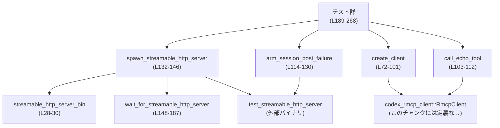

# rmcp-client/tests/streamable_http_recovery.rs コード解説

## 0. ざっくり一言

このテストファイルは、`RmcpClient` の **streamable HTTP トランスポートにおけるセッション失効や HTTP エラー時のリカバリ挙動** を、専用のテストサーバープロセスを起動して検証するためのものです。

---

## 1. このモジュールの役割

### 1.1 概要

- このモジュールは、`codex_rmcp_client::RmcpClient` の **streamable HTTP クライアント** が、
  - セッション POST が 404 になるケースで自動的にセッションを張り直して再試行するか
  - 401 / 500 など他の HTTP エラーではリカバリしないか
- を外部テストサーバー（`test_streamable_http_server` バイナリ）を使って検証します。

テスト用の HTTP サーバープロセスの起動・待機、クライアントの初期化、エコーツール呼び出し、エラーパターンの制御と検証が主な責務です。

### 1.2 アーキテクチャ内での位置づけ

このファイル内での主な依存関係を簡略化すると次のようになります。



- テスト関数群はヘルパー関数（`spawn_streamable_http_server`, `create_client`, `call_echo_tool`, `arm_session_post_failure`）に依存します。
- クライアントの具体的な実装 (`RmcpClient`) やテストサーバー (`test_streamable_http_server`) の実装はこのチャンクには現れません。

### 1.3 設計上のポイント

コードから読み取れる特徴は次のとおりです。

- **責務分割**
  - テスト共通の初期化処理はヘルパー関数に切り出されています。
    - サーバープロセス起動: `spawn_streamable_http_server`（L132-146）
    - サーバー起動完了待ち: `wait_for_streamable_http_server`（L148-187）
    - クライアント初期化: `create_client`（L72-101）
    - エコーツール呼び出し: `call_echo_tool`（L103-112）
    - サーバー側の「セッション POST 失敗」シナリオ設定: `arm_session_post_failure`（L114-130）
- **状態管理**
  - このファイル自身は状態を持つ構造体を定義していません。状態は
    - 外部プロセス（テストサーバー）
    - `RmcpClient` インスタンス
    - サーバーの制御エンドポイント `/test/control/session-post-failure`
    によって管理されます。
- **エラーハンドリング**
  - テストヘルパーはすべて `anyhow::Result` を返し、`?` 演算子でエラーを早期リターンしています（例: `create_client` L72-101）。
  - 期待する失敗パスについては `unwrap_err` や `assert!` によって **明示的にエラー発生を検証** しています（例: L215-221, L236-242, L260-266）。
  - タイムアウトやプロセス異常終了に対しては、詳細なエラーメッセージを生成しています（`wait_for_streamable_http_server` L153-186）。
- **並行性**
  - すべてのテストは `#[tokio::test(flavor = "multi_thread", worker_threads = 1)]` で定義されており、Tokio のマルチスレッドランタイムを **1 ワーカースレッド** で用いています（L189, L205, L226, L251）。
  - ネットワーク I/O は `tokio::net::TcpStream` と `tokio::time::timeout` により非同期に扱われています（L169-181）。
  - 外部プロセスの起動には `tokio::process::Command` が使われ、`kill_on_drop(true)` によりテスト終了時にプロセスが確実に終了するようになっています（L139-142）。

---

## 2. 主要な機能一覧（コンポーネントインベントリー）

このファイル内の関数・定数の一覧です。行番号は `rmcp-client/tests/streamable_http_recovery.rs:L開始-終了` 形式で示します。

| 名称 | 種別 | 役割 / 用途 | 定義位置 |
|------|------|-------------|----------|
| `SESSION_POST_FAILURE_CONTROL_PATH` | 定数 | テストサーバーに対してセッション POST 失敗シナリオを設定する HTTP パスを表す | `rmcp-client/tests/streamable_http_recovery.rs:L26` |
| `streamable_http_server_bin` | 関数 | テスト用 HTTP サーバーバイナリ `test_streamable_http_server` のパスを解決する | `rmcp-client/tests/streamable_http_recovery.rs:L28-30` |
| `init_params` | 関数 | `RmcpClient::initialize` に渡す初期化パラメータ (`InitializeRequestParams`) を構築する | `rmcp-client/tests/streamable_http_recovery.rs:L32-58` |
| `expected_echo_result` | 関数 | echo ツールの期待される `CallToolResult` を生成する | `rmcp-client/tests/streamable_http_recovery.rs:L60-70` |
| `create_client` | 非同期関数 | streamable HTTP 用の `RmcpClient` を作成し、初期化 (`initialize`) を行う | `rmcp-client/tests/streamable_http_recovery.rs:L72-101` |
| `call_echo_tool` | 非同期関数 | `RmcpClient` を使って `echo` ツールを呼び出す | `rmcp-client/tests/streamable_http_recovery.rs:L103-112` |
| `arm_session_post_failure` | 非同期関数 | テストサーバーの制御エンドポイントに POST し、指定ステータスでのセッション POST 失敗シナリオを設定する | `rmcp-client/tests/streamable_http_recovery.rs:L114-130` |
| `spawn_streamable_http_server` | 非同期関数 | 空きポートを見つけ、テスト HTTP サーバープロセスを起動し、起動完了を待つ | `rmcp-client/tests/streamable_http_recovery.rs:L132-146` |
| `wait_for_streamable_http_server` | 非同期関数 | 指定アドレスでテストサーバーが接続可能になるまで、タイムアウト付きでポーリングする | `rmcp-client/tests/streamable_http_recovery.rs:L148-187` |
| `streamable_http_404_session_expiry_recovers_and_retries_once` | 非同期テスト関数 | セッション POST が 404 のとき、クライアントが 1 回だけリトライして回復することを検証する | `rmcp-client/tests/streamable_http_recovery.rs:L189-203` |
| `streamable_http_401_does_not_trigger_recovery` | 非同期テスト関数 | 401 応答では自動リカバリが行われないことを検証する | `rmcp-client/tests/streamable_http_recovery.rs:L205-224` |
| `streamable_http_404_recovery_only_retries_once` | 非同期テスト関数 | 404 のセッション失敗が 2 回続く場合、リカバリが 1 回だけ試行され、それ以上繰り返さないことを検証する | `rmcp-client/tests/streamable_http_recovery.rs:L226-248` |
| `streamable_http_non_session_failure_does_not_trigger_recovery` | 非同期テスト関数 | セッション以外の失敗 (500) ではリカバリが行われないことを検証する | `rmcp-client/tests/streamable_http_recovery.rs:L251-268` |

---

## 3. 公開 API と詳細解説

このファイル自体はライブラリの公開 API を定義していませんが、テストにおける「コアロジック」として特に重要な関数を 7 つ選び、詳細に説明します。

### 3.1 型一覧（構造体・列挙体など）

このファイル内で **新たに定義される型** はありません。

ここで使用されている主な外部型のみ列挙します（いずれもこのチャンクには定義が現れません）。

| 名前 | 種別 | 役割 / 用途 | 出典 |
|------|------|-------------|------|
| `RmcpClient` | 構造体（と推測される型） | MCP プロトコルのクライアントを表す。`new_streamable_http_client`, `initialize`, `call_tool` がメソッドとして使用されている | `codex_rmcp_client` クレート（定義はこのチャンクには現れない） |
| `InitializeRequestParams` | 構造体 | クライアント初期化に使用するパラメータを表す | `rmcp::model` モジュール |
| `ClientCapabilities` | 構造体 | クライアントの対応機能を表す | 同上 |
| `ElicitationCapability` / `FormElicitationCapability` | 構造体 | 入力補助（Elicitation）機能の設定を表す | 同上 |
| `Implementation` | 構造体 | クライアント実装のメタ情報を表す | 同上 |
| `ProtocolVersion` | 列挙体 | 使用する MCP プロトコルバージョンを表す | 同上 |
| `CallToolResult` | 構造体 | ツール呼び出しの結果（コンテンツやエラー情報）を表す | 同上 |
| `Child` | 構造体 | 外部プロセスのハンドルを表す | `tokio::process::Child` |
| `Duration`, `Instant` | 構造体 | 経過時間・タイムアウト計測に使用する | `std::time` |

※ `RmcpClient` の内部構造や `new_streamable_http_client` の具体的実装は、このチャンクには現れません。

---

### 3.2 関数詳細（7 件）

#### 1. `create_client(base_url: &str) -> anyhow::Result<RmcpClient>`（L72-101）

**定義位置**

- `rmcp-client/tests/streamable_http_recovery.rs:L72-101`

**概要**

- 指定された `base_url` に対して streamable HTTP トランスポートを使う `RmcpClient` を生成し、`initialize` でサーバーとハンドシェイクを行います。
- Elicitation（入力補助）に対しては、常に `Accept` で空オブジェクトを返すハンドラを設定しています。

**引数**

| 引数名 | 型 | 説明 |
|--------|----|------|
| `base_url` | `&str` | テストサーバーのベース URL。例えば `"http://127.0.0.1:12345"` の形式（L137-138 参照）。 |

**戻り値**

- `anyhow::Result<RmcpClient>`  
  - 成功時: 初期化済みの `RmcpClient` インスタンス。
  - 失敗時: `anyhow::Error`（具体的なエラー種別は、このチャンクからは不明です）。

**内部処理の流れ**

1. `RmcpClient::new_streamable_http_client` を呼び出し、streamable HTTP クライアントを生成します（L73-81）。
   - 引数にはクライアント名、`{base_url}/mcp` のエンドポイント、Bearer トークン `"test-bearer"`、HTTP ヘッダ設定（`None`）、OAuth の保存モード（`File`）を渡しています（L73-80）。
   - `await?` により、失敗時にはエラーを呼び出し元に伝播します（L81）。
2. 生成された `client` に対して `initialize` を呼び出し、サーバーと初期化プロトコルを実行します（L83-98）。
   - 初期化パラメータは `init_params()` で構築します（L85）。
   - タイムアウトに `Duration::from_secs(5)` を指定しています（L86）。
   - 第 3 引数として Elicitation ハンドラを `Box<dyn Fn>` で渡します（L87-96）。
     - このハンドラは `async` ブロックで `ElicitationResponse { action: Accept, content: Some(json!({})), meta: None }` を返します（L88-93）。
     - `.boxed()` によって `Future` をヒープ確保し、トレイトオブジェクトとして扱える形に変換しています（L95）。
3. `initialize` の完了を `await?` し、成功すれば `Ok(client)` を返して終了します（L98-101）。

**Examples（使用例）**

テスト内での典型的な使い方は以下のようになります（L191-192 など）。

```rust
// テストサーバーを起動して base_url を取得する（L191）
let (_server, base_url) = spawn_streamable_http_server().await?;

// 起動したサーバーに接続するクライアントを作成し、初期化まで実行する（L192）
let client = create_client(&base_url).await?;
```

**Errors / Panics**

- `RmcpClient::new_streamable_http_client` がエラーを返した場合、`?` により `create_client` も `Err` を返します（L73-81）。
- `initialize` がエラーを返した場合も同様に `Err` を返します（L83-98）。
- この関数内では `panic!` や `assert!` は使用していません。

エラーの具体的な種類（ネットワークエラー、プロトコルエラーなど）は、このチャンクでは分かりません。

**Edge cases（エッジケース）**

- `base_url` が不正な URL の場合:
  - `format!("{base_url}/mcp")` 自体は常に文字列生成に成功しますが、その後の接続に失敗する可能性があります（L73-76）。
- サーバーが起動していない、または応答しない場合:
  - `new_streamable_http_client` か `initialize` が失敗し、エラーが返されます（L73-81, L83-98）。
- Elicitation 要求が大量に来るケース:
  - ハンドラは常に `Accept` かつ空 JSON を返します（L88-93）。性能・意味的妥当性については、このチャンクからは評価できません。

**使用上の注意点**

- このヘルパーは **テスト用** の設定を固定的に埋め込んでいます。
  - OAuth の保存モードは `File` に固定されており（L79）、本番用設定とは異なる可能性があります。
  - Bearer トークンは `"test-bearer"` に固定です（L76）。
- Elicitation ハンドラは常に空オブジェクトを返すため、サーバーが特定のフィールドを必須とするような設定の場合はテストが失敗する可能性があります。
- 任意用途での再利用時には、ハードコードされたヘッダ・トークン・Elicitation ハンドラを適宜差し替える必要があります。

---

#### 2. `call_echo_tool(client: &RmcpClient, message: &str) -> anyhow::Result<CallToolResult>`（L103-112）

**定義位置**

- `rmcp-client/tests/streamable_http_recovery.rs:L103-112`

**概要**

- `RmcpClient` を用いてツール `"echo"` を呼び出し、`{"message": <message>}` を入力として送信します。
- 呼び出しのタイムアウトを 5 秒に設定しています。

**引数**

| 引数名 | 型 | 説明 |
|--------|----|------|
| `client` | `&RmcpClient` | 既に初期化済みの MCP クライアントへの参照。 |
| `message` | `&str` | `echo` ツールに渡す文字列メッセージ。 |

**戻り値**

- `anyhow::Result<CallToolResult>`  
  - 成功時: ツール呼び出し結果（構造体 `CallToolResult`）。
  - 失敗時: `anyhow::Error`。

**内部処理の流れ**

1. `client.call_tool` を呼び出します（L104-110）。
   - ツール名 `"echo"` を `String` として渡します（L106）。
   - 引数は `Some(json!({ "message": message }))` として JSON オブジェクト化しています（L107）。
   - `meta` 引数は `None`（L108）。
   - タイムアウトには `Some(Duration::from_secs(5))` を指定しています（L109）。
2. `await` の結果（`CallToolResult` かエラー）をそのまま呼び出し元に返します（L111-112）。

**Examples（使用例）**

テストでの使用例（L194-195 など）:

```rust
// "warmup" メッセージで echo ツールを呼び出す（L194）
let warmup = call_echo_tool(&client, "warmup").await?;

// 期待される echo 結果と一致することを確認する（L195）
assert_eq!(warmup, expected_echo_result("warmup"));
```

**Errors / Panics**

- `client.call_tool` がエラーを返した場合、それが `anyhow::Error` として呼び出し元に返されます（L104-112）。
- この関数内に `panic!` や `assert!` はありません。

**Edge cases（エッジケース）**

- `message` が空文字列 `""` の場合:
  - JSON には `"message": ""` として渡されます（L107）。サーバー側の挙動はこのチャンクには現れません。
- ネットワーク不通やサーバーエラーの場合:
  - `call_tool` がエラーを返し、そのまま `Err` になります（L104-112）。

**使用上の注意点**

- タイムアウトは 5 秒に固定されており、テストでの利用を想定した値です（L109）。
- `call_echo_tool` を流用して他のツール名やパラメータを使用する場合は、この関数の実装を変更する必要があります。
- この関数は `client` がすでに `initialize` 済みであることを前提としています。未初期化クライアントに対する呼び出しの挙動は、このチャンクからは不明です。

---

#### 3. `arm_session_post_failure(base_url: &str, status: u16, remaining: usize) -> anyhow::Result<()>`（L114-130）

**定義位置**

- `rmcp-client/tests/streamable_http_recovery.rs:L114-130`

**概要**

- テストサーバーの制御エンドポイント `/test/control/session-post-failure` に対して HTTP POST リクエストを送り、
  - 次に発生する（または残り回数分の）セッション POST リクエストを指定の HTTP ステータスで失敗させるよう指示します。
- 成功時には `204 NO_CONTENT` が返ることをアサートします。

**引数**

| 引数名 | 型 | 説明 |
|--------|----|------|
| `base_url` | `&str` | テストサーバーのベース URL。 |
| `status` | `u16` | セッション POST を失敗させるときにサーバーが返す HTTP ステータスコード。例: 404, 401, 500 など（L197, L213, L234, L258）。 |
| `remaining` | `usize` | このエラー応答を何回分残すかを示す値。テストでは 1 または 2 が使用されています（L197, L213, L234, L258）。 |

**戻り値**

- `anyhow::Result<()>`  
  - 成功時: `Ok(())`。
  - 失敗時: `anyhow::Error`（HTTP クライアントエラーなど）。

**内部処理の流れ**

1. `reqwest::Client::new()` で HTTP クライアントを生成します（L119）。
2. `base_url` と制御パス `SESSION_POST_FAILURE_CONTROL_PATH` を連結して POST リクエストを構築します（L120）。
3. ボディとして JSON オブジェクト `{"status": status, "remaining": remaining}` を設定します（L121-124）。
4. `send().await?` でリクエストを送信し、レスポンスを取得します（L125-126）。
5. レスポンスステータスが `204 NO_CONTENT` であることを `assert_eq!` で確認します（L128）。
   - そうでない場合はテストが `panic!` して失敗します。
6. `Ok(())` を返します（L129-130）。

**Examples（使用例）**

404 を 1 回だけ発生させる設定（L197）:

```rust
// 次の 1 回だけ、セッション POST を 404 にするようサーバーに指示する（L197）
arm_session_post_failure(&base_url, /*status*/ 404, /*remaining*/ 1).await?;
```

**Errors / Panics**

- ネットワークエラーや JSON シリアライズエラーなどが発生すると `send().await?` で `Err` が返されます（L125-126）。
- レスポンスステータスが `NO_CONTENT` 以外の場合、
  - `assert_eq!(response.status(), reqwest::StatusCode::NO_CONTENT);` によってテストスレッドが `panic!` し、テストが失敗します（L128）。

**Edge cases（エッジケース）**

- `status` に存在しない HTTP ステータスコードを指定した場合:
  - テストサーバーがどう解釈するかはこのチャンクからは不明です。`reqwest` による送信自体は行われます。
- `remaining = 0` の場合:
  - テストコード内では使用されていません（L197, L213, L234, L258 のいずれも 1 または 2）。
  - サーバー側の挙動は不明です。

**使用上の注意点**

- テストサーバーが `SESSION_POST_FAILURE_CONTROL_PATH` をサポートしていることが前提です（L26, L120）。
- 複数のテストが同じサーバーインスタンスを共有する場合、この設定が **グローバルな状態** を変更する可能性がありますが、ここでは各テストがサーバーを起動しているため（L191, L207, L228, L252）、状態の衝突は起きにくい構成です。
- この関数はテスト用ユーティリティであり、本番環境での利用を想定していません。

---

#### 4. `spawn_streamable_http_server() -> anyhow::Result<(Child, String)>`（L132-146）

**定義位置**

- `rmcp-client/tests/streamable_http_recovery.rs:L132-146`

**概要**

- ローカルホスト上の空きポートを取得し、そのポートで `test_streamable_http_server` バイナリを起動します。
- サーバーが接続可能になるまで待機したうえで、プロセスハンドル (`Child`) とベース URL を返します。

**引数**

- なし。

**戻り値**

- `anyhow::Result<(Child, String)>`  
  - 成功時: `(child, base_url)` のタプル。
    - `child`: 起動したサーバープロセスのハンドル。
    - `base_url`: `"http://127.0.0.1:<port>"` の形式の URL 文字列（L137-138）。
  - 失敗時: `anyhow::Error`。

**内部処理の流れ**

1. `TcpListener::bind("127.0.0.1:0")?` で任意の空きポートにバインドします（L133）。
2. `listener.local_addr()?.port()` で割り当てられたポート番号を取得し（L134）、リスナーをドロップしてポートを解放します（L135）。
3. `bind_addr` と `base_url` を文字列として構築します（L137-138）。
4. `streamable_http_server_bin()?` を使ってテストサーバーバイナリのパスを取得し（L139）、`Command::new` でプロセスを起動します。
   - `kill_on_drop(true)` により、`Child` がドロップされるとプロセスが自動終了します（L140）。
   - 環境変数 `MCP_STREAMABLE_HTTP_BIND_ADDR` に `bind_addr` を設定します（L141）。
   - `.spawn()?` でプロセス生成し、`child` に格納します（L142）。
5. `wait_for_streamable_http_server(&mut child, &bind_addr, Duration::from_secs(5)).await?` を呼び出し、サーバーが接続可能になるまで待機します（L144）。
6. 問題なく起動した場合、`Ok((child, base_url))` を返します（L145-146）。

**Examples（使用例）**

```rust
// テストサーバーを起動し、プロセスハンドルと base_url を取得する（L191, L207, L228, L252）
let (server, base_url) = spawn_streamable_http_server().await?;

// server は Drop 時に kill_on_drop により自動で終了する（L139-142）
```

**Errors / Panics**

- ポートバインドに失敗した場合（例: アドレス使用中）、`TcpListener::bind` がエラーとなり `?` で伝播します（L133）。
- テストサーバーバイナリが見つからない／実行できない場合、`streamable_http_server_bin()?` または `.spawn()?` がエラーになります（L139-142）。
- `wait_for_streamable_http_server` がタイムアウトや早期終了エラーを返した場合、同様に `Err` となります（L144）。

**Edge cases（エッジケース）**

- `TcpListener` を閉じたあと、実際にサーバーが bind する前に別プロセスが同じポートを占有する競合の可能性があります（L133-137）。
  - これは「一度ローカルでポートを確保 → 解放 → 別プロセスで同じポートを再度確保」という一般的なパターンに伴う競合リスクです。
  - 実際に問題になるかどうかはテスト環境の状況次第であり、このチャンクからは断定できません。
- `wait_for_streamable_http_server` のタイムアウト 5 秒（L144）は固定値であり、起動が遅い環境では足りない可能性があります。

**使用上の注意点**

- この関数は **テスト専用** であり、外部バイナリ `test_streamable_http_server` の存在を前提とします（L28-30, L139）。
- `Child` を返しているため、呼び出し側がスコープを抜けるときに `Child` がドロップされ、`kill_on_drop(true)` によってプロセスが終了します。テスト全体でプロセスを共有したい場合には別のライフタイム管理が必要です。
- テストが同時並行で多数動く環境では、ポート競合や起動タイミングの問題が起きる可能性があります。

---

#### 5. `wait_for_streamable_http_server(server_child: &mut Child, address: &str, timeout: Duration) -> anyhow::Result<()>`（L148-187）

**定義位置**

- `rmcp-client/tests/streamable_http_recovery.rs:L148-187`

**概要**

- 起動したテストサーバープロセスが、指定アドレス `address` で TCP 接続可能になるまで待機します。
- 一定時間内（`timeout`）にサーバーが立ち上がらない場合や、プロセスが異常終了した場合にはエラーを返します。

**引数**

| 引数名 | 型 | 説明 |
|--------|----|------|
| `server_child` | `&mut Child` | 起動中のテストサーバープロセス。`try_wait` で早期終了検出に使用。 |
| `address` | `&str` | `TcpStream::connect` で接続を試みる `host:port` 形式のアドレス。 |
| `timeout` | `Duration` | 待機のタイムアウト全体（例: `Duration::from_secs(5)`、L144）。 |

**戻り値**

- `anyhow::Result<()>`  
  - 成功時: `Ok(())`。
  - 失敗時:
    - サーバープロセスが早期終了した場合や、接続できないままタイムアウトした場合に `anyhow::Error` を返します。

**内部処理の流れ**

1. `deadline` として、現在時刻 `Instant::now()` に `timeout` を加えたものを計算します（L153）。
2. `loop` で以下を繰り返します（L155-186）。
   1. `server_child.try_wait()?` でプロセスが終了していないか確認し、終了していた場合は `"exited early with status ..."` というエラーメッセージで `Err` を返します（L156-159）。
   2. 残り時間 `remaining` を `deadline.saturating_duration_since(Instant::now())` で計算します（L162）。
      - `saturating_duration_since` により、現在時刻が `deadline` を過ぎていても `panic!` せず `0` を返します。
   3. `remaining.is_zero()` でタイムアウトを判定し、ゼロであれば `"deadline reached"` エラーで `Err` を返します（L163-166）。
   4. `tokio::time::timeout(remaining, TcpStream::connect(address)).await` で、残り時間内に TCP 接続を試みます（L169）。
      - 成功 (`Ok(Ok(_))`) した場合は `Ok(())` を返します（L170）。
      - 接続エラー (`Ok(Err(error))`) の場合:
        - 再度 `Instant::now()` を確認し、`deadline` を過ぎていれば `"timed out ... {error}"` で `Err` を返します（L172-175）。
        - まだ時間が残っていればループを継続します。
      - `timeout` 自体がタイムアウトした場合 (`Err(_)`) は `"connect call timed out"` で `Err` を返します（L178-181）。
   5. 最後に `sleep(Duration::from_millis(50)).await` で 50ms 待機し、ループを続けます（L185）。

**Examples（使用例）**

`spawn_streamable_http_server` 内での使用例（L144）:

```rust
// サーバーが 5 秒以内に接続可能になるまで待機する（L144）
wait_for_streamable_http_server(&mut child, &bind_addr, Duration::from_secs(5)).await?;
```

**Errors / Panics**

- `server_child.try_wait()` の呼び出しで OS 依存のエラーが発生する可能性がありますが、その場合は `?` により `Err` が返されます（L156）。
- プロセスが早期に終了していた場合:
  - `"streamable HTTP server exited early with status {status}"` というエラー文字列で `Err` が返されます（L157-159）。
- タイムアウト条件は 3 パターンあります。
  1. 全体の `deadline` を超えた（L163-166）。
  2. 接続試行でエラーが続き、`Instant::now() >= deadline` になった（L172-175）。
  3. `tokio::time::timeout` 自体のタイムアウト（L178-181）。
- この関数内に `panic!` や `assert!` はありません。

**Edge cases（エッジケース）**

- `timeout` に非常に短い Duration（例: 0）を渡した場合:
  - 最初の `remaining` 計算で `is_zero()` が `true` になり、即座に `"deadline reached"` エラーで終了します（L162-166）。
- サーバーが一時的に接続拒否を返すが、後に起動するケース:
  - 最初は `Ok(Err(error))` に入り、`deadline` 前であればリトライされます（L171-176）。
- `address` が不正な形式の場合:
  - `TcpStream::connect` のエラー種別に依存し、適宜 `Err` で返されます。

**使用上の注意点**

- この関数は「サーバープロセスが実際に受信できる状態になっているか」を接続試行で検証するため、**ブロッキングなチェックではなく非同期にポーリング** する構成になっています（L169-185）。
- タイムアウト値を短くしすぎると、起動が遅い環境で頻繁にテストが失敗する可能性があります。
- `server_child` は `&mut Child` で受け取り、`try_wait` を呼び出しているため、呼び出し側は同時に別の場所から同じ `Child` を操作しないことが前提となっています。

---

#### 6. `streamable_http_404_session_expiry_recovers_and_retries_once() -> anyhow::Result<()>`（L189-203）

**定義位置**

- `rmcp-client/tests/streamable_http_recovery.rs:L189-203`

**概要**

- セッション POST が 404 で失敗する状況を **1 回だけ** 発生させた場合に、`RmcpClient` が内部でリカバリを行い、その後のリクエストが成功することを検証するテストです。

**内部処理の流れ**

1. テストサーバーを起動し、`base_url` を取得します（L191）。
2. `create_client` を使用してクライアントを初期化します（L192）。
3. `"warmup"` メッセージで `call_echo_tool` を呼び出し、正常に動作していることを確認します（L194-195）。
4. `arm_session_post_failure` を使って、次のセッション POST が 404 になるように設定します（L197）。
5. `"recovered"` メッセージで `call_echo_tool` を呼び出し、再び正常な `CallToolResult` が得られることを検証します（L199-200）。

**検証している契約（Contract）**

- 404 によるセッション失効後、クライアントは
  - 内部でセッションを再確立し
  - ツール呼び出しを **1 回だけ再試行する**
- という挙動をすると想定していると解釈できます。ただし **具体的な再試行ロジックは `RmcpClient` 側の実装であり、このチャンクには現れません**。

**Errors / Panics**

- 各ステップで `?` を使っているため、サーバー起動やクライアント初期化に失敗した場合にはテストが `Err` を返します（L191-192）。
- `assert_eq!` が失敗した場合は `panic!` し、テストが失敗します（L195, L200）。

---

#### 7. `streamable_http_404_recovery_only_retries_once() -> anyhow::Result<()>`（L226-248）

**定義位置**

- `rmcp-client/tests/streamable_http_recovery.rs:L226-248`

**概要**

- 404 によるセッション失敗が **連続して 2 回** 発生するよう設定した場合に、
  - 最初のリクエストが（リカバリ試行後も）失敗すること
  - 次のリクエストでは回復して成功すること
- を検証するテストです。

**内部処理の流れ**

1. サーバー起動とクライアント初期化を行う（L228-229）。
2. `"warmup"` 呼び出しで正常動作を確認（L231-232）。
3. `arm_session_post_failure(&base_url, 404, 2)` により、404 エラーを 2 回発生させるよう設定（L234）。
4. `"double-404"` 呼び出しでエラーを発生させ、`unwrap_err` によりエラーであることを確認（L236）。
5. エラー文字列が
   - `"handshaking with MCP server failed"`
   - または `"Transport channel closed"`
   のどちらかを含んでいることを `assert!` で確認（L237-242）。
6. `"after-double-404"` で再度呼び出し、今度は正常な `CallToolResult` が返ることを確認（L244-245）。

**検証している契約（Contract）**

- クライアントは 404 によるセッション失敗に対して **1 回だけ** リカバリを試み、失敗が続く場合にはエラーを返すこと。
- その後の呼び出しでは再度セッションを確立し、正常に動作できること。

**Errors / Panics**

- `call_echo_tool(...).await.unwrap_err()` で、
  - もし呼び出しが `Ok` を返した場合は `unwrap_err` が `panic!` してテスト失敗となります（L236）。
- エラーメッセージの内容が期待値に合致しない場合も `assert!` により `panic!` します（L237-242）。

**Edge cases**

- エラーメッセージが期待した文字列を含まない場合:
  - イミュータブルな文字列マッチに依存しているため、`RmcpClient` 側のエラーメッセージが変更されるとテストが壊れる可能性があります。

---

### 3.3 その他の関数

上記以外の関数・テストの一覧です。

| 関数名 | 種別 | 役割（1 行） | 定義位置 |
|--------|------|--------------|----------|
| `streamable_http_server_bin` | 関数 | テストサーバーバイナリ `test_streamable_http_server` のパスを `codex_utils_cargo_bin::cargo_bin` で解決する | `rmcp-client/tests/streamable_http_recovery.rs:L28-30` |
| `init_params` | 関数 | `InitializeRequestParams` を組み立て、Elicitation 機能などのクライアント能力を宣言する | `rmcp-client/tests/streamable_http_recovery.rs:L32-58` |
| `expected_echo_result` | 関数 | `"ECHOING: {message}"` というフォーマットの `CallToolResult` を生成する | `rmcp-client/tests/streamable_http_recovery.rs:L60-70` |
| `streamable_http_401_does_not_trigger_recovery` | テスト関数 | 401 応答が返る場合に自動リカバリが行われず、連続して 401 が返ることを検証する | `rmcp-client/tests/streamable_http_recovery.rs:L205-224` |
| `streamable_http_non_session_failure_does_not_trigger_recovery` | テスト関数 | 500 などセッション以外のエラーではリカバリが行われないことを検証する | `rmcp-client/tests/streamable_http_recovery.rs:L251-268` |

---

## 4. データフロー

ここでは、代表的なテストシナリオとして  
`streamable_http_404_session_expiry_recovers_and_retries_once`（L189-203）のデータフローを示します。

### 4.1 処理の要点

- テストは次の順で処理を行います。
  1. テストサーバープロセスを起動し、接続可能になるまで待機。
  2. `RmcpClient` を初期化して接続を確立。
  3. 正常な echo 呼び出しで動作確認。
  4. サーバーに対して「次のセッション POST を 404 にする」よう指示。
  5. 再度 echo を呼び出し、クライアントがリカバリ後に正常に応答できることを確認。

### 4.2 シーケンス図

```mermaid
sequenceDiagram
    %% streamable_http_404_session_expiry_recovers_and_retries_once (L189-203)

    participant Test as "テスト関数\nstreamable_http_404_...(L189-203)"
    participant Spawn as "spawn_streamable_http_server\n(L132-146)"
    participant Wait as "wait_for_streamable_http_server\n(L148-187)"
    participant Server as "test_streamable_http_server\n(外部バイナリ)"
    participant Client as "RmcpClient\n(定義はこのチャンク外)"
    participant Ctrl as "HTTP /test/control/session-post-failure\n(L114-130)"

    Test->>Spawn: spawn_streamable_http_server().await (L191)
    Spawn->>Server: 起動 & MCP_STREAMABLE_HTTP_BIND_ADDR 設定 (L139-142)
    Spawn->>Wait: wait_for_streamable_http_server(...).await (L144)
    Wait->>Server: TcpStream::connect(address) をリトライ (L169-185)
    Wait-->>Spawn: Ok(())
    Spawn-->>Test: (Child, base_url) を返す (L145-146)

    Test->>Client: create_client(&base_url).await (L192)
    Client->>Server: new_streamable_http_client + initialize (L73-101)
    Client-->>Test: RmcpClient インスタンス (L100-101)

    Test->>Client: call_echo_tool(&client, "warmup").await (L194)
    Client->>Server: /mcp call_tool "echo" (推測; このチャンクには詳細なし)
    Client-->>Test: CallToolResult "ECHOING: warmup" (L60-70)

    Test->>Ctrl: POST /test/control/session-post-failure {"status":404,"remaining":1} (L114-125)
    Ctrl-->>Test: 204 NO_CONTENT (L128)

    Test->>Client: call_echo_tool(&client, "recovered").await (L199)
    Client->>Server: セッション POST → 404 (サーバー制御により)
    Client->>Server: セッション再確立 & 再試行 (挙動は推測; 実装はこのチャンク外)
    Client-->>Test: CallToolResult "ECHOING: recovered" (L60-70)
```

※ `RmcpClient` とサーバー間の詳細なメッセージ交換は、このチャンクには現れないため、図中の一部は推測を含みます。その旨を明示しています。

---

## 5. 使い方（How to Use）

このファイル自体はテストコードですが、テストヘルパーの使い方や、新規テスト追加の基本パターンを示します。

### 5.1 基本的な使用方法

新しいリカバリシナリオをテストする際の典型的なフローです。

```rust
// 1. テストサーバーの起動（L132-146, L191）
let (server, base_url) = spawn_streamable_http_server().await?; // 空きポートを選び、サーバープロセスを起動

// 2. クライアントの初期化（L72-101, L192）
let client = create_client(&base_url).await?;                  // streamable HTTP クライアントを作成して initialize

// 3. ウォームアップ呼び出し（L103-112, L194-195）
let warmup = call_echo_tool(&client, "warmup").await?;         // echo ツールを呼び出し
assert_eq!(warmup, expected_echo_result("warmup"));            // 正常応答を確認

// 4. サーバー側のエラーパターン設定（L114-130）
arm_session_post_failure(&base_url, 404, 1).await?;            // 次回のセッション POST を 404 にする

// 5. 想定シナリオの本番呼び出し
let result = call_echo_tool(&client, "test-message").await?;   // エラー／回復の挙動を検証
```

### 5.2 よくある使用パターン

1. **「このステータスではリカバリする」テスト**

   - 手順:
     1. `arm_session_post_failure(&base_url, 404, 1)` で 404 を 1 回発生させる。
     2. `call_echo_tool` でツールを呼び出し、`Ok` が返ることを確認する。
   - 例: L189-203 のテスト。

2. **「このステータスではリカバリしない」テスト**

   - 手順:
     1. `arm_session_post_failure(&base_url, status, remaining)` で 401 や 500 を設定。
     2. `call_echo_tool(...).await.unwrap_err()` を使って、エラーになることを確認。
     3. 2 回以上連続で同じエラーになることを確認。
   - 例: L205-224（401）、L251-268（500）。

3. **「再試行回数の上限」テスト**

   - 手順:
     1. `arm_session_post_failure(&base_url, 404, 2)` のように複数回分の 404 を設定。
     2. 最初の呼び出しで `unwrap_err` し、エラーメッセージの内容をチェック。
     3. その後、再度呼び出して正常に戻ることを確認。
   - 例: L226-248 のテスト。

### 5.3 よくある間違い

```rust
// 間違い例: サーバーを起動せずにクライアントを作成しようとしている
// let client = create_client("http://127.0.0.1:0").await?; // サーバーがいないので接続に失敗する可能性が高い

// 正しい例: まずテストサーバーを起動してからクライアントを作成する
let (_server, base_url) = spawn_streamable_http_server().await?;
let client = create_client(&base_url).await?;
```

```rust
// 間違い例: エラーを期待しているのにそのまま ? で伝播してしまう
// let result = call_echo_tool(&client, "unauthorized").await?; // 401 を想定している場合、ここでテストが失敗

// 正しい例: エラーであることを明示的に確認する
let error = call_echo_tool(&client, "unauthorized").await.unwrap_err();
assert!(error.to_string().contains("401"));
```

### 5.4 使用上の注意点（まとめ）

- **前提条件**
  - `spawn_streamable_http_server` を通じてサーバーを起動し、`base_url` を取得してから `create_client` を呼び出す必要があります（L191-192）。
  - 各テストは独自にサーバーを起動しているため、状態の衝突を避ける前提になっています（L191, L207, L228, L252）。

- **エラー処理**
  - ヘルパー関数は `anyhow::Result` を返すため、`?` 演算子によりテストを簡潔に書けますが、**エラーが仕様上期待される場面では `unwrap_err` と明示的なアサートを使う**必要があります（L215-221, L236-242, L260-266）。

- **並行性**
  - すべてのテストは `tokio::test` のマルチスレッドランタイム（ワーカースレッド 1）上で動作しています（L189, L205, L226, L251）。
  - 複数のテストが同時並行で動くかどうかは Rust のテストランナーの設定に依存し、このチャンクだけからは判断できません。

- **パフォーマンス**
  - テスト内のタイムアウト値は 5 秒に固定されており（L86, L109, L144）、ネットワーク環境やマシンスペックによっては長い・短いと感じられる場合があります。
  - `wait_for_streamable_http_server` は 50ms 間隔でポーリングするため（L185）、起動完了までの待ち時間の粒度は 50ms です。

---

## 6. 変更の仕方（How to Modify）

### 6.1 新しい機能（テストケース）を追加する場合

**目的の例:** 新たな HTTP ステータスや、異なる回数のリトライシナリオを検証したい場合。

1. **テスト関数を追加**
   - `#[tokio::test(flavor = "multi_thread", worker_threads = 1)]` 属性を付与し、`async fn ...() -> anyhow::Result<()>` で関数を定義します（L189, L205, L226, L251 を参考）。

2. **共通初期化**
   - 冒頭で

     ```rust
     let (_server, base_url) = spawn_streamable_http_server().await?;
     let client = create_client(&base_url).await?;
     ```

     を呼び出して、サーバーとクライアントの準備を行います。

3. **ウォームアップ**
   - 任意ですが、`call_echo_tool` と `expected_echo_result` を用いて正常系を 1 回確認しておくと、テストの意図が明確になります（L194-195, L210-211 等）。

4. **エラーパターンの設定**
   - `arm_session_post_failure(&base_url, status, remaining).await?;` で制御エンドポイントに POST し、サーバーの挙動を設定します（L197, L213, L234, L258）。

5. **検証ロジックの記述**
   - 成功を期待する場合は `call_echo_tool(...).await?` と `assert_eq!(..., expected_echo_result(...))` を使用します。
   - エラーを期待する場合は `call_echo_tool(...).await.unwrap_err()` と `assert!(error.to_string().contains("..."))` の組み合わせを使用します。

### 6.2 既存の機能を変更する場合

- **`create_client` / `init_params` を変更する場合**
  - これらはすべてのテストで共有されているため（L192, L208, L229, L253）、クライアントの初期化内容を変更すると **全テストの前提条件が変わります**。
  - 特に `protocol_version`（L56）、`client_info`（L48-55）、`capabilities`（L35-47）を変更する場合は、サーバー側の期待とも照らし合わせる必要があります。サーバーの仕様はこのチャンクには現れません。

- **`spawn_streamable_http_server` / `wait_for_streamable_http_server` を変更する場合**
  - 起動ロジックやタイムアウト値を変更すると、テストの安定性に影響します。
  - タイムアウトを短くする場合は、CI 環境など遅いマシンで flakiness（時々失敗するテスト）が起きないか注意が必要です。

- **エラーメッセージに依存するアサーション**
  - `streamable_http_404_recovery_only_retries_once` ではエラーメッセージ文字列に依存した判定を行っています（L237-242）。
  - `RmcpClient` 側のエラーメッセージが変更された場合、このテストは false negative になる可能性があるため、メッセージ仕様を変更する際はテストの更新も必要です。

---

## 7. 関連ファイル

このテストモジュールと密接に関係する外部コンポーネント（※定義はこのチャンクには現れません）を挙げます。

| パス / シンボル | 役割 / 関係 |
|----------------|------------|
| `codex_rmcp_client::RmcpClient` | MCP クライアントの実装本体。`new_streamable_http_client`, `initialize`, `call_tool` などを提供し、本テストから呼び出されています（L72-81, L83-98, L104-111）。詳細実装はこのチャンクには現れません。 |
| `test_streamable_http_server`（バイナリ名） | `streamable_http_server_bin` で取得されるテストサーバーバイナリ（L28-30）。`spawn_streamable_http_server` からプロセスとして起動されます（L139-142）。 |
| `codex_utils_cargo_bin::cargo_bin` | テスト用バイナリのパスを解決するユーティリティ。`streamable_http_server_bin` 内で使用されています（L28-30）。 |
| `rmcp::model::*` | MCP プロトコルの各種モデル（`InitializeRequestParams`, `ClientCapabilities`, `CallToolResult` など）。`init_params` や `expected_echo_result` で使用されています（L32-58, L60-70）。 |
| `reqwest::Client` | HTTP クライアント。`arm_session_post_failure` でサーバー制御エンドポイントへの POST に使用されています（L119-126）。 |

これらの実装詳細はこのチャンクには現れないため、このドキュメントでは **インターフェースとして使用されている範囲の情報のみ** を記載しています。
