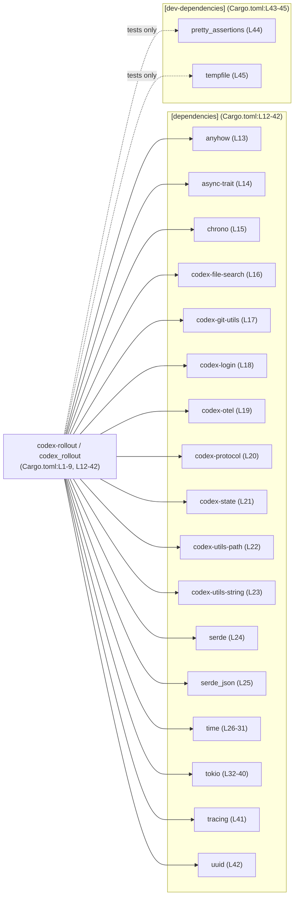
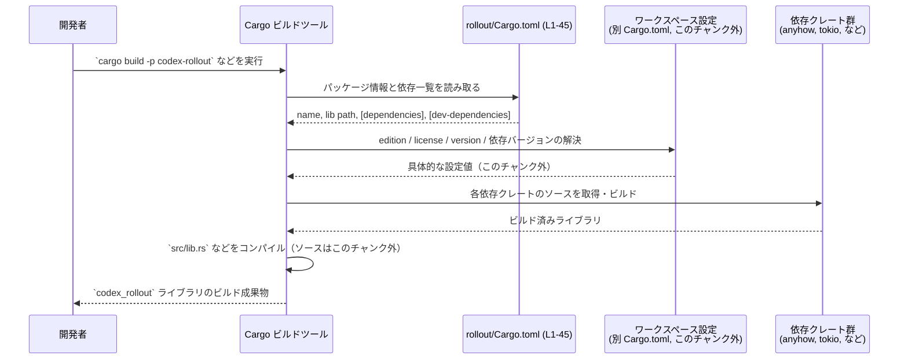

# rollout/Cargo.toml コード解説

## 0. ざっくり一言

`rollout/Cargo.toml` は、ワークスペース内のライブラリクレート `codex_rollout`（パッケージ名は `codex-rollout`）のメタデータと依存クレートを定義する Cargo マニフェストファイルです（Cargo.toml:L1-9, L12-45）。

---

## 1. このモジュールの役割

### 1.1 概要

- このファイルは Rust パッケージ `codex-rollout` の設定を行い、ライブラリターゲット `codex_rollout` を `src/lib.rs` に対応付けています（Cargo.toml:L4, L6-9）。
- edition / license / version などのメタデータは、ワークスペース共通設定から継承する形になっています（Cargo.toml:L2-3, L5）。
- 本クレートが利用可能な依存クレート（`anyhow`, `tokio`, `serde` など）と、テスト時のみ利用する dev-dependencies（`pretty_assertions`, `tempfile`）を列挙しています（Cargo.toml:L12-25, L26-42, L43-45）。

このファイル自体には関数や構造体などのロジックは含まれていません。

### 1.2 アーキテクチャ内での位置づけ

このチャンクから分かるのは、「`codex-rollout` クレートがどのクレートに依存しているか」という静的な依存関係のみです（Cargo.toml:L12-25, L26-42）。

以下の Mermaid 図は、`codex-rollout` とその依存クレートの関係を示したものです。



上流（どのクレートが `codex-rollout` を利用しているか）は、このチャンクには現れません。

### 1.3 設計上のポイント（このファイルから読み取れる範囲）

- **ワークスペース前提の設定**  
  - `edition`, `license`, `version` をすべて `*.workspace = true` で指定しており（Cargo.toml:L2-3, L5）、これらはワークスペースルート側で一括管理される設計です。
- **ライブラリクレートとしての構成**  
  - `[lib]` セクションのみが定義されており（Cargo.toml:L6-9）、バイナリターゲット（`[[bin]]`）は定義されていません。このため、本クレートはライブラリ専用クレートとして振る舞います。
- **ドキュメントテストの無効化**  
  - `doctest = false` が設定されており（Cargo.toml:L7）、`src/lib.rs` などにあるドキュメントコメントからの doctest 実行は行われません。
- **依存関係の集中管理**  
  - すべての依存は `{ workspace = true }` として宣言されており（Cargo.toml:L13-25, L26-42, L44-45）、バージョンやソースはワークスペース共通設定に委ねる構成です。
- **非同期・時間・シリアライズ・トレーシング関連の依存**  
  - `tokio` に複数の機能（`fs`, `io-util`, `macros`, `process`, `rt`, `sync`, `time`）を付与して依存指定し（Cargo.toml:L32-40）、時間関連クレート `chrono`, `time` やシリアライズ関連クレート `serde`, `serde_json`（Cargo.toml:L15, L24-25, L26-31）、トレーシング関連の `tracing`, `codex-otel`（Cargo.toml:L19, L41）などが依存として列挙されています。  
    ただし、これらを実際にどのように利用しているかは、このチャンクには現れません。

---

## 2. 主要な機能一覧（このファイルが担う役割）

このファイル自体はロジックではなく設定ファイルですが、次のような「設定上の機能」を持っています。

- パッケージメタデータの定義とワークスペースからの継承（Cargo.toml:L1-5）
- ライブラリターゲット `codex_rollout` の定義とエントリポイント `src/lib.rs` の指定（Cargo.toml:L6-9）
- コンパイラリント設定をワークスペースから継承（Cargo.toml:L10-11）
- 本番コードで利用可能な依存クレートの一覧指定（Cargo.toml:L12-25, L26-42）
- テスト・検証用にのみ利用される dev-dependencies の指定（Cargo.toml:L43-45）

### 2.1 コンポーネントインベントリー（このチャンクから分かるもの）

関数や構造体の定義はありませんが、「クレートレベルのコンポーネント」として整理します。

| コンポーネント | 種別 | 説明 | 根拠 |
|----------------|------|------|------|
| `codex-rollout` | パッケージ名 | ワークスペース内でのパッケージ名。名前のみが設定され、version 等はワークスペース側で一括管理されます。 | Cargo.toml:L1-5 |
| `codex_rollout` | ライブラリターゲット名 | Rust クレート名。ソースは `src/lib.rs` に存在することが指定されています。 | Cargo.toml:L6-9 |
| `src/lib.rs` | ライブラリエントリポイント | ライブラリクレートの実装ファイル。実際の公開 API やロジックはこのファイル側にありますが、このチャンクにはその中身は現れません。 | Cargo.toml:L8-9 |
| `[dependencies]` 群 | 依存クレート群 | 本クレートから利用可能な外部・内部クレート。`anyhow` など複数が workspace 依存として宣言されています。 | Cargo.toml:L12-25, L26-42 |
| `[dev-dependencies]` 群 | テスト用依存クレート群 | テストや検証用にのみ利用されるクレート群（`pretty_assertions`, `tempfile`）。 | Cargo.toml:L43-45 |

> 関数・構造体などコードレベルのコンポーネントについては、このファイルには一切現れません。

---

## 3. 公開 API と詳細解説

### 3.1 型一覧（構造体・列挙体など）

このファイルは Cargo のマニフェストであり、型（構造体・列挙体など）は定義されていません。

実際の公開 API は `path = "src/lib.rs"` で指定されているライブラリクレート内に存在しますが（Cargo.toml:L8-9）、このチャンクにはその内容が含まれていないため、型一覧を挙げることはできません。

| 名前 | 種別 | 役割 / 用途 | 備考 |
|------|------|-------------|------|
| なし | - | - | 型定義は Cargo.toml ではなく `src/lib.rs` 側に存在します（Cargo.toml:L8-9）。 |

### 3.2 関数詳細（最大 7 件）

Cargo.toml には関数定義は含まれません。そのため、このセクションで詳細解説できる関数はありません。

- 実際の関数・メソッドは `src/lib.rs` 以下に定義されていると考えられますが（Cargo.toml:L8-9）、このチャンクには現れないため、引数・戻り値・エラー型などの情報は「不明」です。

### 3.3 その他の関数

同様に、補助的な関数やラッパー関数の情報も、このファイルからは取得できません。

| 関数名 | 役割（1 行） | 備考 |
|--------|--------------|------|
| なし | - | Cargo.toml はビルド設定のみを扱い、関数は定義しません。 |

---

## 4. データフロー

このチャンクから分かるのは、「ビルド時に Cargo がこのファイルをどう扱うか」というフローです。  
実行時のロジック（どの関数がどのデータを処理するか）は `src/lib.rs` に依存するため、このチャンクからは把握できません。

以下は、ビルド時の典型的なデータフローを示したシーケンス図です。



- この図はビルド時のフローであり、「実行時の関数呼び出し関係」については、このチャンクからは一切分かりません。
- ただし、`[dev-dependencies]` は通常テスト／ベンチマーク実行時にのみ使われるため、本番バイナリには含まれないことが多い、という一般的な前提があります（Cargo.toml:L43-45）。

---

## 5. 使い方（How to Use）

### 5.1 基本的な使用方法（このファイルの役割）

- 開発者は `cargo build`, `cargo test` などのコマンドを実行するだけで、Cargo が自動的に `rollout/Cargo.toml` を読み取り、適切に依存解決・コンパイルを行います。
- このファイルに対して直接コードからアクセスしたり、実行時に読み取るような使い方は通常行いません（Cargo の仕様上、これはビルド設定専用ファイルです）。

### 5.2 よくある使用パターン（依存関係の追加など）

このファイルを編集して何かを「使う」ケースとしては、主に依存クレートを追加・変更する場合があります。

#### 例: 新たな依存クレートを追加する（一般的なパターン）

```toml
[dependencies]
anyhow = { workspace = true }
# 既存の依存（Cargo.toml:L13 など）

# 新しい依存クレートを追加する例（仮）
# my-crate = "1.2"
```

- 実際にどのクレート名・バージョンを追加するかは、このプロジェクトの設計とワークスペース設定に依存します。このチャンクからは具体的な候補は分かりません。
- 既存の依存はすべて `{ workspace = true }` になっているため（Cargo.toml:L13-25, L26-42）、新しい依存も同様にワークスペース管理に揃えるかどうかは、ワークスペースの方針に従う必要があります。

### 5.3 よくある間違い

Cargo.toml 編集時に起こりがちな誤りと、このファイルの構成上注意したい点を挙げます。

```toml
# 間違い例: ワークスペース管理の項目を上書きしてしまう
[package]
edition = "2021"           # ← このプロジェクトでは edition.workspace = true (L2) のため、
                           #    ここで edition を直接指定するとワークスペース方針と齟齬を起こす可能性があります。

# 正しい例（このファイルの方針に合わせる）
[package]
edition.workspace = true   # Cargo.toml:L2 と同様、ワークスペース側に一元化
```

```toml
# 間違い例: 新しい依存を [dependencies] の外に書いてしまう
my-crate = "1.0"           # ← どのテーブルにも属さないため無効

# 正しい例:
[dependencies]
my-crate = "1.0"
```

### 5.4 使用上の注意点（まとめ）

- **ワークスペース管理項目の一貫性**  
  - `edition.workspace`, `license.workspace`, `version.workspace` を直接値に置き換えると、ワークスペース全体との整合性が崩れる可能性があります（Cargo.toml:L2-3, L5）。変更が必要な場合は、通常はワークスペースルートの設定側で行う必要があります。
- **依存クレートのバージョン管理**  
  - すべて `{ workspace = true }` で宣言されているため（Cargo.toml:L13-25, L26-42, L44-45）、個別クレートだけバージョンを変えたい場合には、ワークスペース設定との整合に注意が必要です。
- **doctest 無効化の影響**  
  - `doctest = false` により、ドキュメントコメント中のコードブロックはテストされません（Cargo.toml:L7）。ドキュメント中のサンプルコードの正当性は、別途通常のテストなどで担保する必要があります。
- **安全性・エラー・並行性に関する情報の制限**  
  - `anyhow`, `tokio`, `async-trait` などの依存が存在しますが（Cargo.toml:L13-15, L32-40）、これらをどのようなパターンで用いているか（エラー処理方針、非同期タスクの扱いなど）は、このチャンクからは分かりません。安全性やエッジケースの詳細を把握するには、`src/lib.rs` など実装コードの確認が必要です。

---

## 6. 変更の仕方（How to Modify）

### 6.1 新しい機能を追加する場合（このファイル視点）

新しい機能を実装するにあたり、このファイルに対して行うことは主に「依存関係の追加」です。

1. **実装側で必要なクレートを洗い出す**  
   - 必要なライブラリが既にワークスペース共通依存として登録されているかどうかは、このチャンクからは分かりません。通常はワークスペースルートの Cargo.toml を確認します。
2. **`[dependencies]` にエントリを追加**  
   - 一般的には既存のスタイル（`{ workspace = true }`）にならい、同じクレートを複数のメンバーが共有できるようにします（Cargo.toml:L13-25, L26-42）。
3. **必要なら `tokio` / `time` などの feature を調整**  
   - `tokio` や `time` はすでに複数の feature が有効化されています（Cargo.toml:L26-31, L32-40）。追加機能で新たな機能フラグが必要になった場合、このリストに加えることになります。

### 6.2 既存の機能を変更する場合（このファイル視点）

- **クレート名やパスの変更**  
  - `name = "codex_rollout"` や `path = "src/lib.rs"` を変更すると（Cargo.toml:L8-9）、他クレートからの参照方法やビルドターゲットが変わるため、ワークスペース内での影響範囲が大きくなります。
- **依存クレートの削除・差し替え**  
  - 依存を削除する場合、実装コードでそのクレートが使われていないことを確認する必要がありますが、実装コードはこのチャンクには無いため、別ファイルの検索が必要です。
- **テスト関連の変更**  
  - `pretty_assertions`, `tempfile` など dev-dependencies を外す・追加する際には（Cargo.toml:L44-45）、テストコード側での利用状況を確認する必要があります。

> いずれの場合も、このファイルだけを見て変更の安全性を判断することはできず、`src/lib.rs` とワークスペースルートの Cargo.toml を併せて確認する必要があります。

---

## 7. 関連ファイル

このチャンクから直接または間接的に関係が読み取れるファイルを挙げます。

| パス | 役割 / 関係 | 根拠 |
|------|------------|------|
| `rollout/src/lib.rs` | ライブラリクレート `codex_rollout` のエントリポイント。公開 API やコアロジックはここに実装されると指定されています。 | Cargo.toml:L8-9 |
| （ワークスペースルートの）`Cargo.toml` | `edition.workspace`, `license.workspace`, `version.workspace`、および各 `{ workspace = true }` 依存の具体的な設定値を提供するファイル。このチャンクから具体的なパスは分かりませんが、存在が前提になっています。 | Cargo.toml:L2-3, L5, L13-25, L26-42, L44-45 |
| その他のワークスペースメンバーの `Cargo.toml` | `codex-rollout` を依存として利用している可能性があるクレートの設定ファイル。ただし、このチャンクからはどのクレートが依存しているかは分かりません。 | `codex-rollout` がライブラリクレートとして定義されている事実（Cargo.toml:L6-9）から推測される一般的関係であり、具体的な依存関係はこのチャンクには現れません。 |

---

### このチャンクから分からないことの明示

- `codex_rollout` クレートの具体的な公開 API（関数・型・モジュール構成など）
- エラー処理ポリシー（`anyhow` の使い方など）、並行性モデル（`tokio`, `async-trait` の具体的利用方法）
- 実行時のデータフロー／関数呼び出し関係
- テストコードの配置や内容

これらはいずれも `src/lib.rs` やテストコード側に依存しており、この Cargo.toml チャンクだけからは判断できません。
