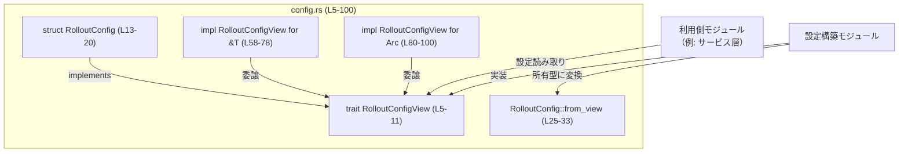
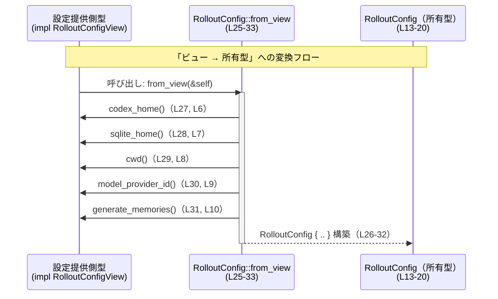

# rollout/src/config.rs コード解説

## 0. ざっくり一言

- 設定情報への読み取り専用インターフェース `RolloutConfigView` と、その具体実装 `RolloutConfig` を定義し、`&T` や `Arc<T>` 経由でも同じインターフェースで扱えるようにするモジュールです（rollout/src/config.rs:L5-11, L13-20, L58-100）。

---

## 1. このモジュールの役割

### 1.1 概要

- このモジュールは「ロールアウト処理で共通して必要になる設定値を、どこからでも同じ形で読み取れるようにする」ためのインターフェースを提供します。
- 具体的には、設定値へのビューを表すトレイト `RolloutConfigView`（L5-11）と、その所有型 `RolloutConfig` 構造体（L13-20）、および両者を接続するコンストラクタ `from_view`（L25-33）を定義しています。
- さらに `&T` や `Arc<T>` に対しても `RolloutConfigView` を実装し、参照・共有ポインタ経由でも同じメソッド群を利用できるようにしています（L58-100）。

### 1.2 アーキテクチャ内での位置づけ

このモジュールは「設定値を提供する側」と「設定値を消費する側」の間の境界インターフェースを担っている構造になっています。

- 設定を **読む側** は `RolloutConfigView` トレイトに依存することで、具体的な設定の構築方法に依存せずに利用できます（L5-11）。
- 設定を **構築する側** は、任意の型に `RolloutConfigView` を実装するか、または `RolloutConfig::from_view` で所有型に変換することで、統一された形で設定を渡せます（L24-34）。
- `&T`・`Arc<T>` 向けのブランケット実装により、「参照」「共有ポインタ」をそのまま `RolloutConfigView` として扱えるようになっています（L58-100）。

> 他モジュールの具体名はこのチャンクには現れないため、以下の図では抽象的な「利用側モジュール」として表現しています。



### 1.3 設計上のポイント

- **読み取り専用インターフェース**  
  - トレイト `RolloutConfigView` には setter が無く、すべて getter であり、設定値は読み取り専用として扱われます（L6-10, L37-55）。
- **所有型とビューの分離**  
  - 実データを所有する構造体 `RolloutConfig`（L13-20）と、それを見るためのトレイト `RolloutConfigView`（L5-11）を分離することで、構築方法と利用方法を切り離しています。
- **参照・共有ポインタの透過的な扱い**  
  - `&T` と `Arc<T>` に対するブランケット実装（L58-78, L80-100）により、「参照で持つか」「`Arc` で共有するか」を意識せずに同じインターフェースで扱えるようになっています。
- **エラーハンドリング・バリデーションなし**  
  - このモジュール内にはエラー型・`Result`・`Option`・`panic!` 等は登場せず、値の取得・コピーだけを行う構造です（全体）。
- **並行性への配慮の余地**  
  - `Arc<T>` 向けの実装を用意しており、設定を共有ポインタ経由で扱える設計になっていますが、実際にスレッド間共有するかどうかはこのファイルだけからは分かりません（L80-100）。

---

## 2. 主要な機能一覧

- `RolloutConfigView` トレイト: 設定値への読み取りインターフェースを定義する（L5-11）。
- `RolloutConfig` 構造体: `PathBuf` や `String` を所有する具体的な設定オブジェクト（L13-20）。
- `Config` 型エイリアス: `RolloutConfig` の別名として公開し、呼び出し側にとっての分かりやすさを向上（L22）。
- `RolloutConfig::from_view`: 任意の `RolloutConfigView` 実装から所有型 `RolloutConfig` を構築する（L25-33）。
- `impl RolloutConfigView for RolloutConfig`: 所有型からビューインターフェースを提供する（L36-56）。
- `impl RolloutConfigView for &T`: `&T`（トレイト実装への参照）をそのままビューとして扱うための委譲実装（L58-78）。
- `impl RolloutConfigView for Arc<T>`: `Arc<T>`（共有ポインタ）をビューとして扱うための委譲実装（L80-100）。

---

## 3. 公開 API と詳細解説

### 3.1 型一覧（構造体・列挙体など）

| 名前 | 種別 | 公開性 | 定義位置 | 役割 / 用途 |
|------|------|--------|----------|-------------|
| `RolloutConfigView` | トレイト | `pub` | `rollout/src/config.rs:L5-11` | 設定値への読み取り専用ビューを表すインターフェース。5つの getter を定義。 |
| `RolloutConfig` | 構造体 | `pub` | `rollout/src/config.rs:L13-20` | 設定値（パスや文字列・フラグ）を所有する具体的な設定オブジェクト。 |
| `Config` | 型エイリアス | `pub` | `rollout/src/config.rs:L22-22` | `RolloutConfig` の別名。利用側のコードで汎用的な名前として使えるようにするためのエイリアス。 |

`RolloutConfig` のフィールド構成:

| フィールド名 | 型 | 定義位置 | 説明 |
|-------------|----|----------|------|
| `codex_home` | `PathBuf` | `rollout/src/config.rs:L15` | 「codex」に関するホームディレクトリを示すパス（用途の詳細はこのファイルからは不明）。 |
| `sqlite_home` | `PathBuf` | `rollout/src/config.rs:L16` | SQLite 関連ファイルを置くディレクトリを示すと解釈できるパス（用途は名前からの推測）。 |
| `cwd` | `PathBuf` | `rollout/src/config.rs:L17` | カレントディレクトリを表すパス。 |
| `model_provider_id` | `String` | `rollout/src/config.rs:L18` | モデルプロバイダの ID などを表す文字列と解釈できるフィールド（実際の意味はこのファイルだけでは不明）。 |
| `generate_memories` | `bool` | `rollout/src/config.rs:L19` | 何らかの「memories」を生成するかどうかのフラグ。 |

### 3.2 関数詳細（最大 7 件）

ここではトレイトのメソッド群とコンストラクタ `from_view` を詳細に説明します。

---

#### `RolloutConfig::from_view(view: &impl RolloutConfigView) -> RolloutConfig`

**定義位置**

- `rollout/src/config.rs:L25-33`

**概要**

- 任意の `RolloutConfigView` 実装から、その内容をコピーして新しい `RolloutConfig`（所有型）を構築します。
- 値は `PathBuf` / `String` / `bool` などにコピーされるため、`view` のライフタイムに依存しない独立した設定オブジェクトになります。

**引数**

| 引数名 | 型 | 説明 |
|--------|----|------|
| `view` | `&impl RolloutConfigView` | 設定値を提供する任意のビュー。参照で受け取り、トレイトが定義する getter を通して値を取得します。 |

**戻り値**

- `RolloutConfig`  
  - `view` から取得した値をそれぞれ `PathBuf` と `String` と `bool` として所有する新しいインスタンスです（L27-31）。

**内部処理の流れ（アルゴリズム）**

1. `view.codex_home()` を呼び出して `&Path` を取得し、それを `to_path_buf()` で `PathBuf` にコピーします（L27）。
2. 同様に `view.sqlite_home()`・`view.cwd()` を呼び出し、各 `&Path` を `PathBuf` にコピーします（L28-29）。
3. `view.model_provider_id()` から `&str` を取得し、`to_string()` で `String` にコピーします（L30）。
4. `view.generate_memories()` を呼び出し、`bool` をそのままコピーします（L31）。
5. 上記のフィールドを持つ `RolloutConfig` 構造体リテラルを作成し、返却します（L26-32）。

**Examples（使用例）**

任意の `RolloutConfigView` 実装（ここでは `RolloutConfig` 自身）から、所有型を構築する例です。

```rust
use std::path::PathBuf;                            // PathBuf を使うためのインポート
use crate::config::{RolloutConfig, RolloutConfigView}; // このファイルが crate::config であると仮定

// 既存の RolloutConfig を構築する                                  // 元となる設定
let base = RolloutConfig {                          // RolloutConfig 構造体リテラルで初期化
    codex_home: PathBuf::from("/opt/codex"),        // codex_home フィールド
    sqlite_home: PathBuf::from("/var/lib/app"),     // sqlite_home フィールド
    cwd: PathBuf::from("/tmp"),                     // cwd フィールド
    model_provider_id: "local".to_string(),         // model_provider_id フィールド
    generate_memories: true,                        // generate_memories フィールド
};

// base は RolloutConfigView を実装しているので from_view の引数にできる       // impl RolloutConfigView for RolloutConfig があるため
let copied = RolloutConfig::from_view(&base);       // from_view で base から値をコピーして新インスタンスを作成

assert_eq!(base, copied);                           // フィールド値は同じ
```

**Errors / Panics**

- `from_view` 自体はエラーや `panic!` を発生させる処理を含んでいません（L25-33）。
- ただし、`view` の各メソッドが `panic!` する可能性は、このファイルからは分かりません。通常の getter 実装であれば `panic!` は発生しない前提で設計されていると解釈できます。

**Edge cases（エッジケース）**

- `view` が返すパスが存在しない・相対パス・空文字列などであっても、そのままコピーされます。バリデーションは行われません（L27-29）。
- `model_provider_id` が空文字列でも、そのまま `String` としてコピーされます（L30）。
- `generate_memories` の値が `true/false` のどちらであっても、そのままコピーされ、特別な処理はありません（L31）。

**使用上の注意点**

- `view` が短いライフタイム（例: 一時的な設定オブジェクト）を持つ場合でも、`from_view` によって得られる `RolloutConfig` は自前で値を所有するため、`view` より長く生存させることができます。
- 逆に、すでに所有型を持っていて単に読むだけでよい場合には、必ずしも `from_view` を使う必要はなく、`RolloutConfigView` トレイトを通じて直接 getter を呼ぶこともできます。

---

#### `RolloutConfigView::codex_home(&self) -> &Path`

**定義位置**

- トレイト定義: `rollout/src/config.rs:L6`  
- `RolloutConfig` 実装: `L37-39`  
- `&T` 実装: `L59-61`  
- `Arc<T>` 実装: `L81-83`

**概要**

- `codex_home` に対応するディレクトリパスを参照で返します。
- `RolloutConfig` の場合は `codex_home` フィールドの内容を指し、`&T` / `Arc<T>` 実装では内部オブジェクトに委譲して同じ値を返します。

**引数**

| 引数名 | 型 | 説明 |
|--------|----|------|
| `self` | `&Self` | ビューを表すオブジェクト。所有型・参照・`Arc` いずれでもかまいません。 |

**戻り値**

- `&Path`  
  - `codex_home` に相当するパスへの参照です。所有権は呼び出し側には移動しません。

**内部処理（代表的な実装）**

- `RolloutConfig` 実装では `self.codex_home.as_path()` を返します（L37-39）。
- `&T` 実装では `(*self).codex_home()` を呼び出し、元の `T` の実装に委譲します（L59-61）。
- `Arc<T>` 実装では `self.as_ref().codex_home()` を呼び出し、内部の `T` に委譲します（L81-83）。

**Examples（使用例）**

```rust
use std::path::PathBuf;
use std::sync::Arc;
use crate::config::{RolloutConfig, RolloutConfigView};

// 所有型のインスタンスを作成                                   
let cfg = RolloutConfig {
    codex_home: PathBuf::from("/opt/codex"),
    sqlite_home: PathBuf::from("/var/lib/app"),
    cwd: PathBuf::from("/tmp"),
    model_provider_id: "local".into(),
    generate_memories: true,
};

// &RolloutConfig からパスを取得（&T 実装が使われる）            
let view: &dyn RolloutConfigView = &cfg;
let path = view.codex_home();                           // &Path が返る
assert_eq!(path, std::path::Path::new("/opt/codex"));

// Arc<RolloutConfig> からパスを取得（Arc<T> 実装が使われる）      
let shared = Arc::new(cfg);
let path2 = shared.codex_home();                        // Arc<T> が RolloutConfigView を実装している
assert_eq!(path2, std::path::Path::new("/opt/codex"));
```

**Errors / Panics**

- 実装コードにはエラー処理や `panic!` は含まれていません（L37-39, L59-61, L81-83）。

**Edge cases**

- パスが空文字列や相対パスであっても、そのまま返されます。パスの妥当性チェックは行われません。
- `RolloutConfig` が保持している `PathBuf` 自体が空である場合、`Path` の長さが 0 の値が返ります。

**使用上の注意点**

- 返り値は `&Path` であり、`PathBuf` ではないため、所有したい場合は呼び出し側で `to_path_buf()` などでコピーする必要があります。
- `Arc<T>` の場合でも、`codex_home()` は内部の `T` への借用を返すだけであり、`Arc` の参照カウント以外のコストはほとんどありません。

---

同様のパターンで、他のトレイトメソッドもほぼ対称な挙動です。以下では重複を避けるため、特有の点のみを記載します。

#### `RolloutConfigView::sqlite_home(&self) -> &Path`

- **定義位置**: トレイト `L7`、`RolloutConfig` 実装 `L41-43`、`&T` 実装 `L63-65`、`Arc<T>` 実装 `L85-87`。
- **概要**: SQLite 関連ファイルのホームディレクトリに相当するパスを返します（用途は名前からの推測）。
- **内部処理**: `RolloutConfig` では `self.sqlite_home.as_path()` を返し、`&T` / `Arc<T>` 実装はそれぞれ `(*self).sqlite_home()`・`self.as_ref().sqlite_home()` へ委譲します。
- **注意点**: バリデーションは行われないため、存在しないディレクトリを指していてもそのまま返ります。

#### `RolloutConfigView::cwd(&self) -> &Path`

- **定義位置**: トレイト `L8`、`RolloutConfig` 実装 `L45-47`、`&T` 実装 `L67-69`、`Arc<T>` 実装 `L89-91`。
- **概要**: カレントディレクトリに相当するパスを返します。
- **内部処理**: `RolloutConfig` では `self.cwd.as_path()` を返し、他の実装は委譲のみです。
- **注意点**: 実際のプロセスのカレントディレクトリと一致しているかどうかは、この構造体の作り方次第であり、このファイルからは分かりません。

#### `RolloutConfigView::model_provider_id(&self) -> &str`

- **定義位置**: トレイト `L9`、`RolloutConfig` 実装 `L49-51`、`&T` 実装 `L71-73`、`Arc<T>` 実装 `L93-95`。
- **概要**: モデルプロバイダを識別する ID などを表す文字列の参照を返します。
- **内部処理**: `RolloutConfig` では `self.model_provider_id.as_str()` を返し、他の実装は委譲します。
- **注意点**: UTF-8 構造などは `String` が保証する範囲内で正しい前提です。空文字列でも特別扱いはありません。

#### `RolloutConfigView::generate_memories(&self) -> bool`

- **定義位置**: トレイト `L10`、`RolloutConfig` 実装 `L53-55`、`&T` 実装 `L75-77`、`Arc<T>` 実装 `L97-99`。
- **概要**: 何らかの「memories」を生成する機能を有効にするかどうかを表すブール値を返します。
- **内部処理**: `RolloutConfig` 実装では単に `self.generate_memories` を返し、`&T` / `Arc<T>` は委譲のみです。
- **注意点**: 呼び出し側のコードでこのフラグの意味を解釈して条件分岐する想定ですが、その具体的な利用箇所はこのチャンクには現れません。

---

### 3.3 その他の関数（委譲実装の一覧）

トレイトの各メソッドに対する具体的な実装（所有型・参照・`Arc`）をまとめます。

| 関数名 / メソッド | 所属 impl | 定義位置 | 役割（1 行） |
|------------------|-----------|----------|--------------|
| `codex_home(&self) -> &Path` | `impl RolloutConfigView for RolloutConfig` | `L37-39` | `self.codex_home.as_path()` でフィールドへの参照を返す。 |
| `sqlite_home(&self) -> &Path` | 同上 | `L41-43` | `self.sqlite_home.as_path()` を返す。 |
| `cwd(&self) -> &Path` | 同上 | `L45-47` | `self.cwd.as_path()` を返す。 |
| `model_provider_id(&self) -> &str` | 同上 | `L49-51` | `self.model_provider_id.as_str()` を返す。 |
| `generate_memories(&self) -> bool` | 同上 | `L53-55` | `self.generate_memories` を返す。 |
| `codex_home(&self) -> &Path` | `impl<T> RolloutConfigView for &T` | `L59-61` | `(*self).codex_home()` に委譲する。 |
| `sqlite_home(&self) -> &Path` | 同上 | `L63-65` | `(*self).sqlite_home()` に委譲する。 |
| `cwd(&self) -> &Path` | 同上 | `L67-69` | `(*self).cwd()` に委譲する。 |
| `model_provider_id(&self) -> &str` | 同上 | `L71-73` | `(*self).model_provider_id()` に委譲する。 |
| `generate_memories(&self) -> bool` | 同上 | `L75-77` | `(*self).generate_memories()` に委譲する。 |
| `codex_home(&self) -> &Path` | `impl<T> RolloutConfigView for Arc<T>` | `L81-83` | `self.as_ref().codex_home()` に委譲する。 |
| `sqlite_home(&self) -> &Path` | 同上 | `L85-87` | `self.as_ref().sqlite_home()` に委譲する。 |
| `cwd(&self) -> &Path` | 同上 | `L89-91` | `self.as_ref().cwd()` に委譲する。 |
| `model_provider_id(&self) -> &str` | 同上 | `L93-95` | `self.as_ref().model_provider_id()` に委譲する。 |
| `generate_memories(&self) -> bool` | 同上 | `L97-99` | `self.as_ref().generate_memories()` に委譲する。 |

---

### 安全性・バグ・セキュリティに関する補足

- **unsafe 使用**: このファイルには `unsafe` ブロックは存在しません。
- **潜在的なバグ**: いずれのメソッドも単純なフィールドアクセスまたは委譲だけであり、論理的なバグが入り込む余地は比較的小さい構造です。
- **セキュリティ**:  
  - 取り扱うのはパスと文字列とブール値のみであり、外部入力の検証や権限チェックなどはこの層では行っていません。
  - パスや ID の意味づけ、およびセキュリティ上の制約は、この設定を使う側のコードで扱う必要があります。

---

## 4. データフロー

### 4.1 代表的なシナリオ: ビューから所有型への変換

設定構築側が `RolloutConfigView` を実装し、利用側で `RolloutConfig::from_view` を通じて所有型に変換して使う流れを表します。



要点:

- `from_view` は `RolloutConfigView` トレイトに定義されたメソッドのみを通じて値を取得し、`RolloutConfig` を構築します（L25-33）。
- `Provider` が `RolloutConfig` 自身である場合でも、外部から見ると「ビュー → 所有型へのコピー」という統一されたフローになります。
- `&T` や `Arc<T>` を使う場合は、Rust のメソッド解決により `impl RolloutConfigView for &T` / `for Arc<T>` が経由され、最終的には `T` の実装に委譲される形で同様のフローになります（L58-78, L80-100）。

---

## 5. 使い方（How to Use）

### 5.1 基本的な使用方法

典型的には、`RolloutConfig` をそのまま使うか、または何らかの設定源（環境変数・設定ファイル等）をラップした型に `RolloutConfigView` を実装してから `from_view` で所有型を作る、という使い方が想定されます。

```rust
use std::path::PathBuf;
use crate::config::{RolloutConfig, RolloutConfigView, Config};

// RolloutConfig を直接構築する                              // もっとも単純なパターン
let config = RolloutConfig {
    codex_home: PathBuf::from("/opt/codex"),            // 必要なパスや ID を埋める
    sqlite_home: PathBuf::from("/var/lib/app"),
    cwd: PathBuf::from("/tmp"),
    model_provider_id: "local".into(),
    generate_memories: false,
};

// RolloutConfigView トレイトを通じて値にアクセスする        // 利用側はトレイトに依存
fn use_config(view: &impl RolloutConfigView) {           // 具体型ではなくトレイト境界で受け取る
    println!("codex_home = {:?}", view.codex_home());   // &Path を取得
    println!("sqlite_home = {:?}", view.sqlite_home());
    println!("cwd = {:?}", view.cwd());
    println!("provider = {}", view.model_provider_id());
    println!("generate_memories = {}", view.generate_memories());
}

use_config(&config);                                    // &RolloutConfig は RolloutConfigView を実装している
let typed: Config = config.clone();                     // 型エイリアス Config を通じても同じ
use_config(&typed);                                     // &Config も同じ扱い
```

### 5.2 よくある使用パターン

#### パターン1: 一時的なビューから所有型を作る

`RolloutConfigView` を実装した一時オブジェクトから、永続的に使う `RolloutConfig` を作成するパターンです。

```rust
use std::path::PathBuf;
use crate::config::{RolloutConfig, RolloutConfigView};

// 簡単なビュー型の例（この型の定義は別ファイルになる想定）             // ここでは仮の型を想定
struct CliConfig {
    codex_home: PathBuf,
    sqlite_home: PathBuf,
    cwd: PathBuf,
    model_provider_id: String,
    generate_memories: bool,
}

// RolloutConfigView を CliConfig に実装する                               // 各フィールドをそのまま返すだけでよい
impl RolloutConfigView for CliConfig {
    fn codex_home(&self) -> &std::path::Path { self.codex_home.as_path() }
    fn sqlite_home(&self) -> &std::path::Path { self.sqlite_home.as_path() }
    fn cwd(&self) -> &std::path::Path { self.cwd.as_path() }
    fn model_provider_id(&self) -> &str { self.model_provider_id.as_str() }
    fn generate_memories(&self) -> bool { self.generate_memories }
}

fn build_config_from_cli(cli: CliConfig) -> RolloutConfig {
    // cli はここで move されるが、from_view は &impl RolloutConfigView なので参照で渡せる
    RolloutConfig::from_view(&cli)                                     // view から所有型を生成
}
```

#### パターン2: `Arc<RolloutConfig>` を共有する

設定を複数のコンポーネントで共有したい場合に `Arc` を使うパターンです。

```rust
use std::sync::Arc;
use crate::config::{RolloutConfig, RolloutConfigView};

fn use_shared_config(cfg: Arc<RolloutConfig>) {         // Arc<RolloutConfig> を受け取る
    // Arc<RolloutConfig> は RolloutConfigView を実装している                 // impl RolloutConfigView for Arc<T> があるため
    println!("cwd = {:?}", cfg.cwd());                  // &Path を取得
}
```

### 5.3 よくある間違い

```rust
use crate::config::{RolloutConfig, RolloutConfigView};

// 間違い例: View のライフタイムが短いのに参照を保持してしまう
fn store_view_for_later<'a>(view: &'a impl RolloutConfigView) -> &'a impl RolloutConfigView {
    // ここでは単に返すだけなので安全だが、実際には view を長期保管すると問題になりうる
    view
}

// 正しい例: 後で使いたい場合は所有型にして持つ
fn store_config_for_later(view: &impl RolloutConfigView) -> RolloutConfig {
    RolloutConfig::from_view(view)                      // 所有型にコピーしてしまえば、view のライフタイムに依存しない
}
```

ポイント:

- 短命なビュー（例: 一時的なパーサの戻り値）の参照をそのまま保存するとライフタイムの制約でコンパイルエラーになりやすくなります。
- 所有型 `RolloutConfig` に変換して持つことで、その制約を避けることができます。

### 5.4 使用上の注意点（まとめ）

- **前提条件**
  - `RolloutConfigView` を実装する型は、メソッドが常に有効な参照を返すように設計する必要があります（ヌルや解放済みメモリは Rust の型システム的に起こりませんが、ロジック上の矛盾には注意が必要です）。
- **禁止事項 / 注意事項**
  - バリデーションやパスの解決はこの層では行われないため、信頼できない入力を直接 `RolloutConfig` に流し込む場合は、上位層で検証する必要があります。
- **並行性**
  - `Arc<T>` 実装により設定の共有は容易ですが、`T` が `Send` / `Sync` かどうかはこのファイルでは定義されていません。スレッド間で共有する場合は、`T` の定義側で `Send` / `Sync` を満たすように設計する必要があります。
- **パフォーマンス**
  - `from_view` は各フィールドをコピーするため、大きなパスリストや長大な文字列を持つように拡張した場合は、コピーコストを考慮する必要があります。ただし、現在の 4 フィールド + 1 ブール値程度ではオーバーヘッドは小さいと考えられます。

---

## 6. 変更の仕方（How to Modify）

### 6.1 新しい機能（設定項目）を追加する場合

1. **トレイトの拡張**  
   - `RolloutConfigView` に新しい getter メソッドを追加します（例: `fn timeout(&self) -> Duration;` など）（L5-11 の近く）。
2. **構造体の拡張**  
   - `RolloutConfig` に対応するフィールドを追加します（L13-20）。
3. **コンストラクタの更新**  
   - `RolloutConfig::from_view` 内で、新メソッドを呼び出してフィールドに詰める処理を追加します（L25-33）。
4. **各 impl の更新**
   - `impl RolloutConfigView for RolloutConfig` に新しいメソッドの実装を追加します（L36-56）。
   - `impl<T> RolloutConfigView for &T` と `impl<T> RolloutConfigView for Arc<T>` にも、新メソッドを委譲する実装を追加する必要があります（L58-78, L80-100）。これを忘れるとコンパイルエラーになります。
5. **その他の実装型の更新**
   - 他ファイルで `RolloutConfigView` を実装している型がある場合、それらも同様に新メソッドを実装する必要があります（このチャンクには現れませんが、トレイトを拡張すると必須）。

### 6.2 既存の機能を変更する場合

- **フィールドの意味や制約を変更する場合**
  - 例: `codex_home` を絶対パスに限定するなどのルールを導入する場合、バリデーションやエラー処理はこの層ではなく、`RolloutConfig` を構築する上位層に追加するのが自然です。このファイル内では単純な保存・返却だけを担わせる構造になっています。
- **トレイトシグネチャを変更する場合**
  - 戻り値の型やメソッド名を変更すると、すべての `RolloutConfigView` 実装（このファイル内の 3 つの impl と他ファイルの実装）に影響します。
  - 特に `&T` / `Arc<T>` のブランケット実装は、トレイトのメソッドセットと 1:1 に対応しているため、変更漏れがあるとコンパイルできなくなります。
- **`from_view` の挙動を変更する場合**
  - 例えばデフォルト値の補完やパスの正規化をここに追加することは可能ですが、その場合は「このレイヤが単純なコピーのみを行う」という現在の前提が変わるため、利用側コードの期待と整合しているかを確認する必要があります。

---

## 7. 関連ファイル

このチャンクに現れる直接の依存関係は標準ライブラリのみです。

| パス / クレート | 役割 / 関係 |
|----------------|------------|
| `std::path::Path` | トレイトメソッドの戻り値として使用されるパスの参照型（L1, L6-8）。 |
| `std::path::PathBuf` | `RolloutConfig` が所有するパス型（L2, L15-17）。 |
| `std::sync::Arc` | 設定オブジェクトの共有ポインタとして使用され、`RolloutConfigView` の実装対象にもなっている（L3, L80-100）。 |

- このファイルからは、自前モジュール（例: 実際に `RolloutConfigView` を実装している他の型や、設定を利用するサービス層のモジュール）は参照されていません。そのため、それらとの具体的な関係はこのチャンクだけでは不明です。
- テストコード（単体テスト・統合テスト）はこのファイル内には含まれていません（`#[cfg(test)]` などが存在しないため）。

以上が、`rollout/src/config.rs` の構造と振る舞い、および実務での利用を意識した解説です。
