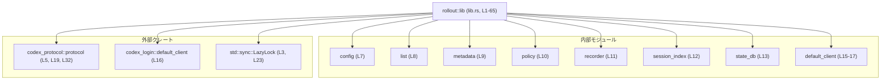

# rollout/src/lib.rs コード解説

## 0. ざっくり一言

このファイルは、Codex セッションファイルの「ロールアウト（永続化・発見）」機能をまとめるクレートのルートモジュールで、サブモジュールの公開 API を集約し、セッション関連の定数・グローバル値を定義するハブとして機能しています（`//!` のモジュールコメントより、rollout/src/lib.rs:L1）。

---

## 1. このモジュールの役割

### 1.1 概要

- Codex セッションファイルの永続化・一覧取得・メタデータ管理・ポリシー判定などを行うサブモジュール群を束ねるルートモジュールです（rollout/src/lib.rs:L7-13, L32-62）。
- セッション保存ディレクトリ名の定数や、インタラクティブなセッションソース一覧のグローバル値を定義し、他コードからの利用を簡単にします（rollout/src/lib.rs:L21-23）。
- `codex_protocol` や `codex_login` といった外部クレート由来の型・関数を、内部・外部から参照しやすい形で再エクスポートしています（rollout/src/lib.rs:L5, L19, L32, L15-17）。

### 1.2 アーキテクチャ内での位置づけ

このファイルはクレートルートとして、各サブモジュールへのエントリポイントと、外部クレートとの接点をまとめています。



- ルートモジュール `lib.rs` から、`config`, `list`, `metadata`, `policy`, `recorder`, `session_index`, `state_db` モジュールが公開またはクレート内公開されています（rollout/src/lib.rs:L7-13）。
- `default_client` サブモジュールは `codex_login::default_client::*` をクレート内向けに再エクスポートします（rollout/src/lib.rs:L15-17）。
- `SessionSource`, `SessionMeta` などは `codex_protocol::protocol` から取り込まれています（rollout/src/lib.rs:L5, L19, L32）。

### 1.3 設計上のポイント

- **ハブとしての再エクスポート**  
  - 多数の型・関数をサブモジュールから `pub use` で再エクスポートし、このクレートを利用する側は `rollout::...` で完結するように設計されています（rollout/src/lib.rs:L32-62）。
- **グローバル定数によるディレクトリ名の一元管理**  
  - セッション保存用サブディレクトリ名を `SESSIONS_SUBDIR`, `ARCHIVED_SESSIONS_SUBDIR` として定数化し、他コードが文字列リテラルを重複定義しないようにしています（rollout/src/lib.rs:L21-22）。
- **スレッド安全な遅延初期化**  
  - `INTERACTIVE_SESSION_SOURCES` は `std::sync::LazyLock` により、スレッド安全に一度だけ初期化される `Vec<SessionSource>` として定義されています（rollout/src/lib.rs:L3, L23-30）。  
  - Rust の型システムと `LazyLock` により、並行アクセス時もデータ競合が起きない形で設計されています。
- **外部プロトコルへの依存の明示**  
  - `SessionSource`, `SessionMeta`, `protocol` モジュールなど、プロトコル定義を外部クレートに委ね、ここではそれを利用するだけに留めています（rollout/src/lib.rs:L5, L19, L32）。
- **テスト専用モジュールの分離**  
  - `#[cfg(test)] mod tests;` により、テストコードはビルド時にのみコンパイルされ、本番バイナリには含まれません（rollout/src/lib.rs:L64-65）。

---

## 2. 主要な機能一覧

このモジュール（クレートルート）が提供する主な機能は次のとおりです。

- セッションディレクトリのパス名定数の提供  
  - `SESSIONS_SUBDIR`, `ARCHIVED_SESSIONS_SUBDIR`（rollout/src/lib.rs:L21-22）
- インタラクティブなセッションソース一覧のグローバル提供  
  - `INTERACTIVE_SESSION_SOURCES: LazyLock<Vec<SessionSource>>`（rollout/src/lib.rs:L23-30）
- コンフィグ関連 API の公開  
  - `Config`, `RolloutConfig`, `RolloutConfigView`（rollout/src/lib.rs:L33-35）
- スレッド一覧・ページング関連 API の公開  
  - `Cursor`, `ThreadItem`, `ThreadListConfig`, `ThreadListLayout`, `ThreadSortKey`, `ThreadsPage` および各種スレッド検索・取得関数（rollout/src/lib.rs:L36-51）
- メタデータとインデックス操作 API の公開  
  - `builder_from_items`, `append_thread_name`, `find_thread_meta_by_name_str`, `find_thread_name_by_id`, `find_thread_names_by_ids`（rollout/src/lib.rs:L52, L58-61）
- ポリシー・永続化制御 API の公開  
  - `EventPersistenceMode`, `should_persist_response_item_for_memories`（rollout/src/lib.rs:L53-54）
- ロールアウトレコーダ・状態 DB ハンドルの公開  
  - `RolloutRecorder`, `RolloutRecorderParams`, `append_rollout_item_to_path`, `StateDbHandle`（rollout/src/lib.rs:L55-57, L62）
- テスト用モジュールの宣言  
  - `mod tests;`（中身はこのチャンクには含まれません）（rollout/src/lib.rs:L64-65）

### 2.1 コンポーネント一覧（インベントリー）

| 名前 | 種別 | 公開範囲 | 定義元 / 備考 | 根拠 |
|------|------|----------|---------------|------|
| `config` | モジュール | `pub(crate)` | 設定関連機能を持つと推測されるサブモジュール。実装は別ファイルで、このチャンクには現れません。 | rollout/src/lib.rs:L7 |
| `list` | モジュール | `pub(crate)` | スレッド一覧・検索機能を持つと推測されるサブモジュール。 | rollout/src/lib.rs:L8 |
| `metadata` | モジュール | `pub(crate)` | メタデータ処理用サブモジュールと推測。 | rollout/src/lib.rs:L9 |
| `policy` | モジュール | `pub(crate)` | 永続化ポリシー等を扱うと推測。 | rollout/src/lib.rs:L10 |
| `recorder` | モジュール | `pub(crate)` | セッションイベントの記録処理と推測。 | rollout/src/lib.rs:L11 |
| `session_index` | モジュール | `pub(crate)` | セッション名・IDのインデックス操作と推測。 | rollout/src/lib.rs:L12 |
| `state_db` | モジュール | `pub` | 状態 DB 操作用のモジュール。 | rollout/src/lib.rs:L13 |
| `default_client` | モジュール | `pub(crate)` | `codex_login::default_client::*` の再エクスポート（クレート内専用） | rollout/src/lib.rs:L15-17 |
| `SESSIONS_SUBDIR` | `const &str` | `pub` | セッション保存用サブディレクトリ名 `"sessions"` | rollout/src/lib.rs:L21 |
| `ARCHIVED_SESSIONS_SUBDIR` | `const &str` | `pub` | アーカイブ済みセッション用サブディレクトリ名 `"archived_sessions"` | rollout/src/lib.rs:L22 |
| `INTERACTIVE_SESSION_SOURCES` | `static LazyLock<Vec<SessionSource>>` | `pub` | インタラクティブセッションのソース候補一覧 | rollout/src/lib.rs:L23-30 |
| `SessionSource` | 列挙体（推測） | `pub(crate)` 経由で利用 | `codex_protocol::protocol` 由来。少なくとも `Cli`, `VSCode`, `Custom(String)` バリアントが存在。定義は別クレート。 | rollout/src/lib.rs:L5, L23-29 |
| `SessionMeta` | 型（構造体等） | `pub` | セッションメタデータ型。定義は `codex_protocol::protocol` クレート側。 | rollout/src/lib.rs:L32 |
| `Config` | 型 | `pub` | ロールアウト設定全体を表すと推測。定義は `config` モジュール。 | rollout/src/lib.rs:L33 |
| `RolloutConfig` | 型 | `pub` | ロールアウト固有の設定ビューと推測。 | rollout/src/lib.rs:L34 |
| `RolloutConfigView` | 型 | `pub` | 設定の読み取り専用ビュー等と推測。 | rollout/src/lib.rs:L35 |
| `Cursor` | 型 | `pub` | スレッド一覧のカーソル（ページング）を表すと推測。 | rollout/src/lib.rs:L36 |
| `ThreadItem` | 型 | `pub` | 一つのスレッド情報を表すと推測。 | rollout/src/lib.rs:L37 |
| `ThreadListConfig` | 型 | `pub` | スレッド一覧取得の設定（ソート順など）と推測。 | rollout/src/lib.rs:L38 |
| `ThreadListLayout` | 型 | `pub` | 一覧の表示・構造レイアウト設定と推測。 | rollout/src/lib.rs:L39 |
| `ThreadSortKey` | 型 | `pub` | ソートキー（日時、名前など）を表すと推測。 | rollout/src/lib.rs:L40 |
| `ThreadsPage` | 型 | `pub` | ページングされたスレッド一覧を表すと推測。 | rollout/src/lib.rs:L41 |
| `EventPersistenceMode` | 型（列挙体と推測） | `pub` | イベントをどう永続化するかのモード。定義は `policy` モジュール。 | rollout/src/lib.rs:L53 |
| `RolloutRecorder` | 型 | `pub` | イベント記録オブジェクト。定義は `recorder` モジュール。 | rollout/src/lib.rs:L55 |
| `RolloutRecorderParams` | 型 | `pub` | `RolloutRecorder` の構成パラメータ。 | rollout/src/lib.rs:L56 |
| `StateDbHandle` | 型 | `pub` | 状態 DB へのハンドル。定義は `state_db`。 | rollout/src/lib.rs:L62 |
| `tests` | モジュール | `cfg(test)` | テストコードを含むが、このチャンクには中身がない。 | rollout/src/lib.rs:L64-65 |

> 備考: 型の「役割 / 用途」は、名前と再エクスポートの位置から推測しています。実際のフィールド・メソッドなどは、本チャンクには定義がありません。

---

## 3. 公開 API と詳細解説

### 3.1 型一覧（構造体・列挙体など）

主要な公開型（`pub use` されているもの）を整理します。

| 名前 | 種別（推測を含む） | 定義元 | 役割 / 用途 | 根拠 |
|------|------------------|--------|-------------|------|
| `SessionMeta` | 構造体等 | `codex_protocol::protocol` | セッションに紐づくメタデータ。リスト処理などで利用されると考えられます。定義は外部クレート。 | rollout/src/lib.rs:L32 |
| `Config` | 構造体 | `config` モジュール | ロールアウト全体の設定。セッション保存先などを保持すると推測。 | rollout/src/lib.rs:L33 |
| `RolloutConfig` | 構造体 | `config` モジュール | コアロールアウト設定のサブセット/ビューと推測。 | rollout/src/lib.rs:L34 |
| `RolloutConfigView` | 構造体またはトレイトオブジェクト | `config` モジュール | 設定の読み取りビュー等と推測。 | rollout/src/lib.rs:L35 |
| `Cursor` | 構造体 | `list` モジュール | スレッド一覧取得のカーソル。ページングに使用されると推測。 | rollout/src/lib.rs:L36 |
| `ThreadItem` | 構造体 | `list` モジュール | 個々のスレッド（セッション）項目。ID, タイトルなどを持つと推測。 | rollout/src/lib.rs:L37 |
| `ThreadListConfig` | 構造体 | `list` モジュール | 一覧取得に関するフィルタ・ソートの設定。 | rollout/src/lib.rs:L38 |
| `ThreadListLayout` | 構造体/列挙体 | `list` モジュール | 一覧のレイアウト（時系列・グルーピングなど）を表すと推測。 | rollout/src/lib.rs:L39 |
| `ThreadSortKey` | 列挙体 | `list` モジュール | スレッドソートのキー種別。 | rollout/src/lib.rs:L40 |
| `ThreadsPage` | 構造体 | `list` モジュール | ページ単位のスレッド集合。 | rollout/src/lib.rs:L41 |
| `EventPersistenceMode` | 列挙体（推測） | `policy` モジュール | 応答イベントをどのように永続化するかのモード。 | rollout/src/lib.rs:L53 |
| `RolloutRecorder` | 構造体 | `recorder` モジュール | イベントをファイルなどに記録するためのオブジェクト。 | rollout/src/lib.rs:L55 |
| `RolloutRecorderParams` | 構造体 | `recorder` モジュール | `RolloutRecorder` の初期化パラメータ。 | rollout/src/lib.rs:L56 |
| `StateDbHandle` | 構造体 | `state_db` モジュール | 状態 DB へのハンドル（接続・トランザクション管理など）と推測。 | rollout/src/lib.rs:L62 |

> これらの型の定義（フィールド・メソッド・トレイト実装）はすべて別ファイルにあり、このチャンクには含まれていません。

### 3.2 関数詳細（代表的な 4 件）

このファイル自体には関数定義はありませんが、重要そうな関数を再エクスポートしています（rollout/src/lib.rs:L42-61）。ここでは代表的な 4 件について、わかる範囲でテンプレートに沿って整理します。  
シグネチャ・内部処理はこのチャンクには存在しないため、**詳細は元モジュールの定義を参照する必要があります**。

#### `get_threads(...)`（シグネチャ不明）

**概要**

- スレッド（セッション）一覧を取得する関数であると推測されます（名前と `ThreadsPage` 型の再エクスポートからの推測）（rollout/src/lib.rs:L36-41, L46）。
- ルートモジュールから `pub use list::get_threads;` されており、このクレートの主要な読み取り API の一つと考えられます（rollout/src/lib.rs:L46）。

**引数**

このチャンクに関数定義がないため、引数名・型は分かりません。

| 引数名 | 型 | 説明 |
|--------|----|------|
| （不明） | （不明） | 定義は `list::get_threads` の実装ファイルを参照する必要があります。 |

**戻り値**

- 戻り値の型もこのチャンクからは分かりません。`ThreadsPage` を返す可能性がありますが、コードから直接は確認できません。

**内部処理の流れ（アルゴリズム）**

- 実装が別ファイルにあるため、このチャンクからは内部処理は分かりません。
- 関数名からは、内部で `ThreadListConfig` や `ThreadSortKey` などを用いてスレッド一覧を構築している可能性が想定されますが、推測に留まります（rollout/src/lib.rs:L38-40）。

**Examples（使用例）**

引数型が不明なため、あくまで形だけの例です。

```rust
use rollout::get_threads; // rolluot/src/lib.rs:L46 で再エクスポートされている

fn list_threads() {
    // 実際の引数・戻り値の型は list モジュールの定義を参照する必要があります。
    // ここでは疑似コードとして呼び出しのみを示します。
    let _result = get_threads(/* ここに ThreadListConfig などの実際の引数が入る想定 */);
}
```

**Errors / Panics**

- このチャンクには `get_threads` の戻り値型（`Result` かどうかなど）やエラー処理が記載されていません。
- エラー条件は `list::get_threads` 実装側で確認する必要があります。

**Edge cases（エッジケース）**

- 空ディレクトリやスレッドが存在しない場合の挙動などは不明です。
- ファイル I/O エラーやパーミッションエラーへの対応も、このチャンクからは読み取れません。

**使用上の注意点**

- `get_threads` を利用するコードでは、戻り値型とエラー処理契約を必ず `list` モジュール側の定義から確認する必要があります。
- 大量のスレッドを扱う場合のパフォーマンス特性も、このチャンクからは不明です。

---

#### `find_thread_path_by_id_str(...)`（シグネチャ不明）

**概要**

- 文字列 ID を使ってスレッドのパス（ファイルシステム上のパス）を検索する関数と推測されます（関数名と、`find_conversation_path_by_id_str` という旧名称の存在から）（rollout/src/lib.rs:L43-45）。
- `pub use list::find_thread_path_by_id_str;` により、他クレートから利用可能です（rollout/src/lib.rs:L43）。

**引数**

- このチャンクには定義がないため、不明です。
- 名前から、少なくとも「スレッド ID を表す文字列」を受け取る可能性が高いですが、確定はできません。

| 引数名 | 型 | 説明 |
|--------|----|------|
| （不明） | （不明） | スレッド ID の文字列である可能性がありますが、定義を確認する必要があります。 |

**戻り値**

- 戻り値型は不明です。`Option<PathBuf>` や `Result<PathBuf, _>` のような戻り値を返すことがよくありますが、ここでは推測に留まり、断定できません。

**内部処理の流れ**

- 実装が別ファイルのため不明です。

**Examples（使用例）**

```rust
use rollout::find_thread_path_by_id_str; // rollout/src/lib.rs:L43

fn example() {
    // 実際の引数・戻り値の型は不明なため、疑似コードとしてのみ示します。
    let _path = find_thread_path_by_id_str(/* "thread-id-string" など */);
}
```

**Deprecated エイリアスとの関係**

- `find_conversation_path_by_id_str` は `find_thread_path_by_id_str` の非推奨エイリアスとして定義されています（rollout/src/lib.rs:L44-45）。
  - `#[deprecated(note = "use find_thread_path_by_id_str")]` によって、新規コードでは `find_thread_path_by_id_str` の使用が推奨されていることが分かります。

**使用上の注意点**

- 新規コードでは `find_conversation_path_by_id_str` ではなく `find_thread_path_by_id_str` を用いる必要があります（rollout/src/lib.rs:L44-45）。
- 戻り値が存在しない ID の場合にどう扱われるか（エラーか `None` か）は実装要確認です。

---

#### `append_rollout_item_to_path(...)`（シグネチャ不明）

**概要**

- ロールアウト対象の「アイテム」を、指定されたパスに追記（append）する関数と推測されます（関数名と `recorder` モジュール由来であることから）（rollout/src/lib.rs:L57）。
- 永続化ロジックのコアとなる可能性が高い関数です。

**引数**

- このチャンクにはシグネチャがないため、不明です。
- 名前からは「ファイルパス」と「ロールアウトアイテム（イベント）」を受け取ると推測できますが、確定できません。

| 引数名 | 型 | 説明 |
|--------|----|------|
| （不明） | （不明） | 少なくとも出力先パスと、書き込むアイテムの情報を受け取ると推測されますが、実装要確認です。 |

**戻り値**

- 戻り値型は不明です。I/O を伴うため `Result` を返す可能性がありますが、このチャンクからは確認できません。

**内部処理の流れ**

- 別ファイル (`recorder` モジュール) に実装されており、このチャンクには記載がありません。
- 通常はファイルを開き、追記し、クローズする、という流れが想定されますが、推測に留まります。

**Examples（使用例）**

```rust
use rollout::append_rollout_item_to_path; // rollout/src/lib.rs:L57

fn record_item_example() {
    // 実際の型やエラー処理は recorder モジュールの定義を確認する必要があります。
    let _ = append_rollout_item_to_path(/* path, item, ... */);
}
```

**Errors / Panics**

- ファイル I/O エラーやパスの不正などのエラー条件は、実装側確認が必要です。
- このファイル内には `panic!` や `unwrap` などは登場していません（rollout/src/lib.rs:全体）。

**使用上の注意点**

- ファイルパスとして `SESSIONS_SUBDIR` や `ARCHIVED_SESSIONS_SUBDIR` を組み合わせることが多いと考えられますが、具体的なルールは実装側を参照する必要があります（rollout/src/lib.rs:L21-22）。

---

#### `should_persist_response_item_for_memories(...)`（シグネチャ不明）

**概要**

- ある「レスポンスアイテム」を長期記憶（memories）用に永続化すべきかどうかを判定する、ポリシー関数と推測されます（関数名と `policy` モジュールからの再エクスポートであることから）（rollout/src/lib.rs:L54）。
- 応答のうち、どれを後でリコール可能なメモリとして保存するかのフィルタリングに使われる可能性があります。

**引数**

- このチャンクにはシグネチャが存在しないため、不明です。
- 少なくとも「レスポンスアイテム（メッセージなど）」と「ポリシー設定」が引数になっている可能性がありますが、推測に過ぎません。

| 引数名 | 型 | 説明 |
|--------|----|------|
| （不明） | （不明） | 判定対象のレスポンス情報を受け取ると推測されます。 |

**戻り値**

- 関数名から、`bool` を返す可能性が高いですが、このチャンクからは確認できません。

**内部処理の流れ**

- 実装は `policy` モジュールにあり、このチャンクには含まれていません。
- 関数名からは、レスポンスの内容・メタデータ・イベントモード (`EventPersistenceMode`) などを基に判定していると推測されます（rollout/src/lib.rs:L53-54）。

**Examples（使用例）**

```rust
use rollout::should_persist_response_item_for_memories; // rollout/src/lib.rs:L54

fn policy_example() {
    // 実際の引数や戻り値型は不明なため、疑似コードレベルの例です。
    let _should = should_persist_response_item_for_memories(/* response_item, policy, ... */);
}
```

**使用上の注意点**

- 本関数の結果を無視すると、保存すべきでないものを保存してしまう、あるいは保存すべきものを失う可能性があるため、呼び出し側の責務を実装側ドキュメントで確認する必要があります。
- 「memories」に関するプライバシー・セキュリティの要件も、実際のポリシー実装に依存します。このチャンクからは詳細は分かりません。

---

### 3.3 その他の関数

以下は `pub use` されているが、上記で詳細解説していない関数です。いずれも定義は別モジュールにあり、このチャンクにはシグネチャが含まれていません。

| 関数名 | 定義元 | 役割（名前からの推測） | 根拠 |
|--------|--------|------------------------|------|
| `find_archived_thread_path_by_id_str` | `list` | アーカイブ済みスレッドのパスを ID 文字列から検索する。 | rollout/src/lib.rs:L42 |
| `find_conversation_path_by_id_str` | `list` | `find_thread_path_by_id_str` の旧名称エイリアス。`#[deprecated]` により非推奨（新規コードでは使用しない）。 | rollout/src/lib.rs:L44-45 |
| `get_threads_in_root` | `list` | ルートディレクトリ直下のスレッド一覧取得。 | rollout/src/lib.rs:L47 |
| `parse_cursor` | `list` | カーソル文字列のパース。ページング用の `Cursor` を生成する可能性。 | rollout/src/lib.rs:L48 |
| `read_head_for_summary` | `list` | スレッドファイルの先頭部分を読み込み、一覧表示用のサマリを得る処理と推測。 | rollout/src/lib.rs:L49 |
| `read_session_meta_line` | `list` | セッションメタデータ行を読み込む処理と推測。 | rollout/src/lib.rs:L50 |
| `rollout_date_parts` | `list` | 日付をロールアウト用のフォーマットに分解する処理と推測。 | rollout/src/lib.rs:L51 |
| `builder_from_items` | `metadata` | メタデータビルダをアイテム集合から構築する関数と推測。 | rollout/src/lib.rs:L52 |
| `append_thread_name` | `session_index` | スレッド名をインデックスに追加する処理と推測。 | rollout/src/lib.rs:L58 |
| `find_thread_meta_by_name_str` | `session_index` | 名前文字列からスレッドメタを検索する関数と推測。 | rollout/src/lib.rs:L59 |
| `find_thread_name_by_id` | `session_index` | ID からスレッド名を取得する関数と推測。 | rollout/src/lib.rs:L60 |
| `find_thread_names_by_ids` | `session_index` | 複数 ID から名前を一括で取得する関数と推測。 | rollout/src/lib.rs:L61 |

> いずれの関数も、**正確な引数・戻り値・エラー条件は、このチャンクからは分かりません。** 必要に応じて元モジュールの実装を参照する必要があります。

---

## 4. データフロー

このファイル自体にはロジックがほとんどなく、「呼び出しの中継点」として動作します。代表的なフローを 2 つ示します。

### 4.1 スレッド一覧取得のフロー

呼び出し元が `rollout::get_threads` を呼ぶ場合の、モジュール間の流れです。

```mermaid
sequenceDiagram
    %% スレッド一覧取得フロー（rollout/src/lib.rs:L36-47）
    participant Caller as 呼び出し元
    participant Rollout as rollout::lib（L32-47）
    participant ListMod as list モジュール（別ファイル）

    Caller->>Rollout: get_threads(...)
    Note right of Rollout: pub use list::get_threads;（L46）
    Rollout->>ListMod: list::get_threads(...)
    ListMod-->>Rollout: 結果（型はこのチャンクには明示されない）
    Rollout-->>Caller: 結果
```

- ルートモジュールは単に `get_threads` を `list` モジュールから再エクスポートしているだけであり、呼び出しはそのまま `list::get_threads` に委譲される形になります（rollout/src/lib.rs:L8, L46）。
- 実際のデータの読み込み・フィルタリング・ページングなどは `list` モジュールの内部処理です。このチャンクからはその詳細は分かりません。

### 4.2 インタラクティブセッションソースの利用フロー

`INTERACTIVE_SESSION_SOURCES` の初期化と利用のイメージです。

```mermaid
sequenceDiagram
    %% INTERACTIVE_SESSION_SOURCES の利用フロー（rollout/src/lib.rs:L3, L23-30）
    participant Caller as 呼び出し元
    participant Rollout as rollout::lib
    participant Lazy as std::sync::LazyLock

    Caller->>Rollout: &*INTERACTIVE_SESSION_SOURCES
    Note right of Rollout: static LazyLock<Vec<SessionSource>> = LazyLock::new(|| vec![...]);（L23-30）
    Rollout->>Lazy: 初回アクセス時にクロージャを実行
    Lazy-->>Lazy: Vec<SessionSource> を構築（Cli, VSCode, Custom("atlas"), Custom("chatgpt")）
    Lazy-->>Rollout: &Vec<SessionSource>
    Rollout-->>Caller: &Vec<SessionSource>
```

- `INTERACTIVE_SESSION_SOURCES` は `LazyLock` により、**初回アクセス時にのみ** クロージャが実行され、`Vec<SessionSource>` が作成されます（rollout/src/lib.rs:L23-30）。
- 以降のアクセスは、初期化済みの `Vec` への参照を取得するだけで、スレッドセーフかつ低コストです。  
  この挙動は `std::sync::LazyLock` の仕様に基づくものであり、本チャンクに `unsafe` 使用や独自同期処理は含まれていません（rollout/src/lib.rs:L3, L23-30）。

---

## 5. 使い方（How to Use）

### 5.1 基本的な使用方法（定数・グローバル値の利用）

ここでは、このファイル内で定義されていることが明らかな API（定数・`INTERACTIVE_SESSION_SOURCES`）の使用例を示します。

```rust
// Cargo.toml でこのクレート名が "rollout" であると仮定した例です。
// 実際のクレート名はプロジェクト設定を確認する必要があります。

use rollout::{
    SESSIONS_SUBDIR,                // "sessions"（L21）
    ARCHIVED_SESSIONS_SUBDIR,       // "archived_sessions"（L22）
    INTERACTIVE_SESSION_SOURCES,    // LazyLock<Vec<SessionSource>>（L23-30）
};

fn main() {
    // セッション保存ディレクトリ名の利用
    println!("sessions dir: {}", SESSIONS_SUBDIR);             // "sessions"
    println!("archived sessions dir: {}", ARCHIVED_SESSIONS_SUBDIR); // "archived_sessions"

    // インタラクティブセッションソースの列挙
    // INTERACTIVE_SESSION_SOURCES は LazyLock<Vec<SessionSource>> なので、
    // &*INTERACTIVE_SESSION_SOURCES で &Vec<SessionSource> が取得できます（L23-30）。
    for source in &*INTERACTIVE_SESSION_SOURCES {
        // ここでは具体的な処理は書きませんが、match などでソース種別に応じた分岐が可能です。
        // 少なくとも Cli, VSCode, Custom(String) バリアントが存在します（L25-28）。
        match source {
            // これらのバリアントは、このファイルで実際に生成されているため存在が確認できます。
            codex_protocol::protocol::SessionSource::Cli => {
                println!("source: CLI");
            }
            codex_protocol::protocol::SessionSource::VSCode => {
                println!("source: VSCode extension");
            }
            codex_protocol::protocol::SessionSource::Custom(name) => {
                println!("custom source: {}", name);
            }
            // 他にバリアントが存在する可能性がありますが、
            // このチャンクには登場しないため不明です。
            //_ => {}
        }
    }
}
```

> 注意: `SessionSource` 型の完全修飾パスは `codex_protocol::protocol::SessionSource` ですが、クレート内では `use codex_protocol::protocol::SessionSource;` が使われています（rollout/src/lib.rs:L5）。  
> 上記の例では説明のため完全修飾パスを使用しています。

### 5.2 よくある使用パターン（推測ベース）

このチャンクには具体的な呼び出し例はありませんが、API 名から次のような使用パターンが想定されます（いずれも「推測」です）。

- スレッド一覧の取得  
  - `get_threads` または `get_threads_in_root` を呼んで `ThreadsPage` のような一覧を取得し、それを UI や CLI に表示する（rollout/src/lib.rs:L41, L46-47）。
- スレッドパスの探索  
  - `find_thread_path_by_id_str` や `find_archived_thread_path_by_id_str` を使って、特定 ID のセッションファイルのパスを取得し、さらに内容を読み込む（rollout/src/lib.rs:L42-43）。
- レスポンスの永続化判断  
  - `should_persist_response_item_for_memories` で保存対象かどうかを判定し、真の場合のみ `append_rollout_item_to_path` などで永続化する（rollout/src/lib.rs:L54, L57）。

これらのパターンの正確なコード例は、対応するモジュールの定義（`list`, `policy`, `recorder` 等）を参照する必要があります。

### 5.3 よくある間違い（起こりうる例）

**非推奨エイリアスの使用**

```rust
use rollout::find_conversation_path_by_id_str; // rollout/src/lib.rs:L45

fn wrong() {
    // 非推奨の関数名を使っているため、コンパイル時に deprecation 警告が出る可能性があります。
    let _ = find_conversation_path_by_id_str(/* ... */);
}
```

正しくは、非推奨でない関数名を用いる必要があります。

```rust
use rollout::find_thread_path_by_id_str; // 推奨。L43

fn correct() {
    let _ = find_thread_path_by_id_str(/* ... */);
}
```

この挙動は `#[deprecated(note = "use find_thread_path_by_id_str")]` から読み取れます（rollout/src/lib.rs:L44-45）。

### 5.4 使用上の注意点（まとめ）

- **グローバルベクタの変更可能性**  
  - `INTERACTIVE_SESSION_SOURCES` の中身は `Vec<SessionSource>` であり、理論上は可変参照を取得すれば要素の追加・削除が可能です（rollout/src/lib.rs:L23-30）。  
    実際にそのような API が用意されているかは、このチャンクからは分かりませんが、**グローバル状態を変更する場合は影響範囲に注意する必要があります。**
- **ディレクトリ名の一貫性**  
  - セッションファイルやアーカイブを扱うコードは、`"sessions"`, `"archived_sessions"` などの文字列を直接書かず、このモジュールの定数を利用することで、一貫性と保守性を確保できます（rollout/src/lib.rs:L21-22）。
- **エラー処理の所在**  
  - このファイルには `Result` / `Option` を返すロジックや `unwrap` 等は一切含まれておらず、エラー処理はすべてサブモジュール側にあります（rollout/src/lib.rs:全体）。  
    したがって、関数のエラー契約を理解するには、必ず元モジュールの実装を確認する必要があります。
- **並行性**  
  - グローバルな遅延初期化には `std::sync::LazyLock` が用いられており、スレッドセーフに一度だけ初期化されます（rollout/src/lib.rs:L3, L23-30）。  
    このファイルには `unsafe` や独自ロック機構は登場せず、Rust 標準ライブラリのスレッドセーフな仕組みに依存しています。

---

## 6. 変更の仕方（How to Modify）

このファイルは主に「公開 API の集約ポイント」として機能しているため、新機能の追加や既存機能の変更も **このファイルでの作業は薄く**、多くはサブモジュール側で行われます。

### 6.1 新しい機能を追加する場合

1. **適切なサブモジュールを選ぶ / 新設する**  
   - 設定関連なら `config`、一覧・検索なら `list`、インデックス更新なら `session_index` など、関連の近いモジュールを選びます（rollout/src/lib.rs:L7-12）。
   - 新しい関心事であれば、新規モジュール（例: `analytics`）を追加し、`pub(crate) mod analytics;` のように `lib.rs` にも宣言します。

2. **サブモジュール側に関数・型を定義する**  
   - 実際のロジック（I/O、エラー処理、並行処理など）はサブモジュールに実装します。

3. **公開 API にしたい場合は `lib.rs` で `pub use` する**  
   - 例: 新たに `list::delete_thread` を作った場合、`lib.rs` に `pub use list::delete_thread;` を追加することで、利用者は `rollout::delete_thread` としてアクセスできます（既存の `pub use list::get_threads;` などと同様、rollout/src/lib.rs:L46）。

4. **テストの追加**  
   - モジュール固有のテストは各モジュール内で、クレート全体に関わるテストは `mod tests;` でインクルードされるテストモジュール側に追加します（rollout/src/lib.rs:L64-65）。

### 6.2 既存の機能を変更する場合

- **影響範囲の確認**
  - `lib.rs` は単に `pub use` を行っているだけなので、シグネチャの変更は呼び出し元の全体に影響します（rollout/src/lib.rs:L32-62）。
  - 例: `list::get_threads` の引数を変えると、`rollout::get_threads` を呼ぶすべてのコードが影響を受けます。

- **契約（前提条件・戻り値の意味）の確認**
  - 関数の契約は元モジュールの定義とそのドキュメントにあります。このチャンクにはその情報がないため、必ず実装ファイル側で確認する必要があります。

- **Deprecated エイリアスの扱い**
  - `find_conversation_path_by_id_str` のような非推奨エイリアスを削除する場合、まだそれを使っている呼び出しコードの有無を検索し、移行を完了させてから削除する必要があります（rollout/src/lib.rs:L44-45）。

- **テストの再実行**
  - `mod tests;` の中身はこのチャンクにありませんが、既存テストが機能契約を前提にしている可能性があります。変更後は必ずテストを実行し、振る舞いの変化を確認する必要があります（rollout/src/lib.rs:L64-65）。

---

## 7. 関連ファイル

このモジュールと密接に関係するサブモジュール・外部クレートを一覧にします。ファイル名はパスとモジュール宣言から推測されます。

| パス | 役割 / 関係 | 根拠 |
|------|------------|------|
| `rollout/src/config.rs` | `Config`, `RolloutConfig`, `RolloutConfigView` の定義を含み、ロールアウトの設定管理を担うと推測されます。 | モジュール宣言と再エクスポート（rollout/src/lib.rs:L7, L33-35） |
| `rollout/src/list.rs` | スレッド一覧・検索・カーソル処理・メタ読み出しを担うと推測されます。`Cursor`, `ThreadItem` など多数の型・関数がここから再エクスポートされています。 | rollout/src/lib.rs:L8, L36-51 |
| `rollout/src/metadata.rs` | `builder_from_items` を定義し、メタデータビルダ関連の処理を提供すると推測されます。 | rollout/src/lib.rs:L9, L52 |
| `rollout/src/policy.rs` | `EventPersistenceMode`, `should_persist_response_item_for_memories` を定義し、永続化ポリシーを扱うと推測されます。 | rollout/src/lib.rs:L10, L53-54 |
| `rollout/src/recorder.rs` | `RolloutRecorder`, `RolloutRecorderParams`, `append_rollout_item_to_path` を定義し、イベントの永続化ロジックを提供すると推測されます。 | rollout/src/lib.rs:L11, L55-57 |
| `rollout/src/session_index.rs` | `append_thread_name`, `find_thread_meta_by_name_str`, `find_thread_name_by_id(s)` を定義し、名前・ID ベースのインデックス操作を提供すると推測されます。 | rollout/src/lib.rs:L12, L58-61 |
| `rollout/src/state_db.rs` | `StateDbHandle` の定義を含み、ロールアウト関連の状態を管理する DB へのアクセスを提供すると推測されます。 | rollout/src/lib.rs:L13, L62 |
| `rollout/src/default_client.rs`（モジュールブロック内） | `codex_login::default_client::*` の再エクスポートを行い、クレート内でログインクライアントを利用するための窓口になっていると推測されます。 | rollout/src/lib.rs:L15-17 |
| `rollout/src/tests.rs` など（推測） | `mod tests;` によってインクルードされるテストコード。実際のパスはこのチャンクからは分かりません。 | rollout/src/lib.rs:L64-65 |
| `codex_protocol` クレート | `SessionSource`, `SessionMeta`, `protocol` モジュールを提供する外部クレート。セッションのプロトコル定義を担うと推測されます。 | rollout/src/lib.rs:L5, L19, L32 |
| `codex_login` クレート | `default_client` モジュールを提供する外部クレート。ログインまわりのクライアント機能を担うと推測されます。 | rollout/src/lib.rs:L16 |

---

### Bugs / Security / Contracts について（このファイルに限定した所見）

- **Bugs（バグの可能性）**
  - このファイルは主にモジュール宣言と再エクスポート、定数定義のみで構成されており、制御フローや条件分岐を含むロジックはほぼありません（rollout/src/lib.rs:全体）。
  - `INTERACTIVE_SESSION_SOURCES` の初期化クロージャも単純な `vec![...]` であり、明示的なバグが読み取れる箇所はありません（rollout/src/lib.rs:L23-30）。

- **Security（セキュリティ観点）**
  - ファイル I/O やネットワーク I/O、シリアライズなど、直接的にセキュリティに関連するコードはこのチャンクには含まれません。
  - `default_client` モジュールを通じて `codex_login::default_client::*` がクレート内で利用され得ますが、その挙動・認証処理・エラー処理などは `codex_login` クレートの実装次第であり、このチャンクからは評価できません（rollout/src/lib.rs:L15-17）。

- **Contracts / Edge Cases**
  - 関数・型の契約（前提条件、戻り値の保証、エラー時の振る舞い）はすべてサブモジュール側にあり、このファイルからは読み取れません。
  - 唯一明示されている契約に近い情報は、`find_conversation_path_by_id_str` が非推奨であり、代わりに `find_thread_path_by_id_str` を使うべきという点です（rollout/src/lib.rs:L44-45）。

- **並行性**
  - グローバル値 `INTERACTIVE_SESSION_SOURCES` は `LazyLock` を利用してスレッドセーフに初期化されます（rollout/src/lib.rs:L3, L23-30）。
  - このファイルには `unsafe` ブロックが一切なく、並行アクセスに対する安全性は Rust 標準ライブラリの仕組みに依存しています。

以上のように、`rollout/src/lib.rs` 自体は、主に API の集約と定数・グローバル値の定義を行う「薄い」モジュールであり、実際のビジネスロジック・エラー処理・パフォーマンス特性は、関連サブモジュール側を読むことで初めて把握できる構造になっています。
