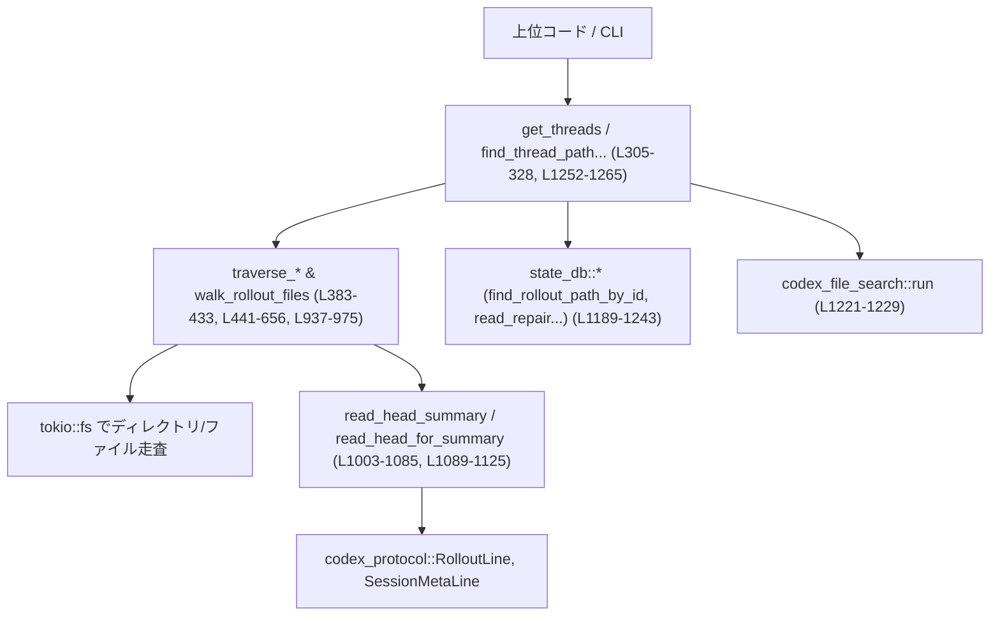
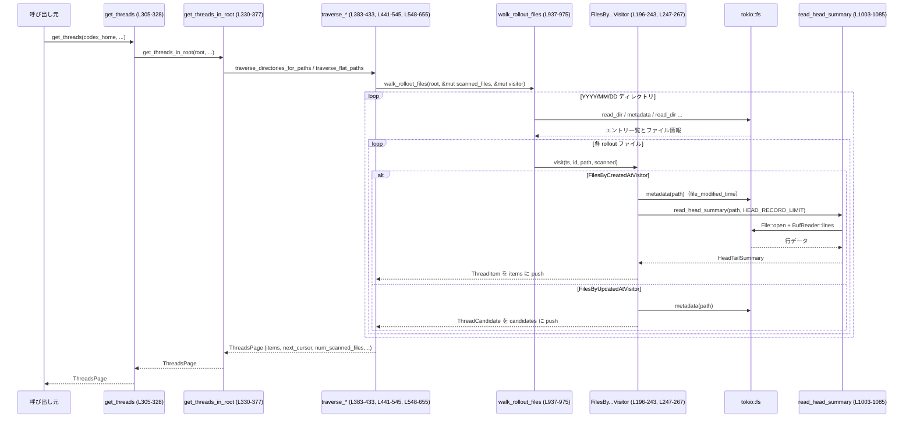

# rollout/src/list.rs コード解説

## 0. ざっくり一言

`rollout/src/list.rs` は、ローカルディスク上の「rollout-*.jsonl」ファイル群から**スレッド一覧をページネーション付きで取得**したり、**スレッドIDから対応するファイルパスを検索**したりするモジュールです。  
ファイルのメタデータとログ先頭部分を読み出して `ThreadItem` サマリを構築し、`created_at` / `updated_at` でソートされたページング API を提供します（`rollout/src/list.rs:L30-41`, `L305-328`）。

---

## 1. このモジュールの役割

### 1.1 概要

このモジュールは、**ロールアウトファイル（セッションログ）をスキャン・フィルタリング・整形して外部に提供する**役割を持ちます（`rollout/src/list.rs:L30-76`）。

- 問題: 大量のセッションファイルから、ユーザーに見せる「スレッド一覧」を作る必要がある。
- 機能:
  - ディレクトリツリー（`YYYY/MM/DD/rollout-...jsonl`）を逆年代順に走査し、`ThreadItem` のページを返す。
  - `created_at` または `updated_at` によるソートとページングカーソル (`Cursor`) を提供。
  - モデルプロバイダやセッションソースによるフィルタリング。
  - ログファイル先頭部分からメタデータ・最初のユーザーメッセージを抽出。
  - スレッドID文字列から rollout ファイルパスを効率的に検索（DB→ファイル検索）。

### 1.2 アーキテクチャ内での位置づけ

主な依存関係とデータフローの位置づけは次の通りです。

- 上位の呼び出し元（CLI/UI 等）が `get_threads` や `find_thread_path_by_id_str` を呼ぶ。
- このモジュールは
  - ファイルシステム（`tokio::fs`）を通じて rollout ファイルを走査・読み込み。
  - `codex_protocol` の `RolloutLine`, `SessionMetaLine`, `SessionSource`, `ThreadId` を使ってログ内容やメタを解釈。
  - `state_db` モジュールを使って、ID→パスのデータベース検索と read-repair を行う。
  - `codex_file_search` を使ってテキスト検索によるフォールバック探索を行う。

依存関係の概略図:



※ 行番号は `rollout/src/list.rs` 中の定義位置を示します。

### 1.3 設計上のポイント

- **責務分割**（`L196-205`, `L247-249`, `L937-975`）
  - 走査処理は `walk_rollout_files` + `RolloutFileVisitor`（Visitorパターン）に抽象化。
  - ソートキー別（created / updated）やレイアウト別（ネスト / フラット）の違いは Visitor と補助関数に切り出し。
- **状態管理とページング**（`L141-178`, `L128-139`, `L679-691`）
  - `Cursor` + `AnchorState` で「前ページ最後の `(ts, uuid)` より新しいものをスキップする」という安定したページングを実現。
- **I/O とエラーハンドリング**（`L804-840`, `L1003-1085`, `L1152-1162`, `L1172-1247`）
  - すべて非同期 I/O (`tokio::fs`) を利用し、`io::Result` で OS エラーを明示。
  - JSON 解析失敗や一部メタデータ欠損は `Option` や `unwrap_or_default` でソフトに扱い、一覧生成を継続。
- **スキャン上限と安定性**（`L104-107`, `L441-478`, `L488-545`, `L804-840`）
  - `MAX_SCAN_FILES` を用いて 1 リクエストあたりの最大ファイル数を制限し、`reached_scan_cap` フラグで呼び出し側に通知。
  - タイムスタンプを秒精度でトリムし（`truncate_to_seconds`）、カーソルとの比較が安定するように調整。
- **フィルタリング**（`L693-755`, `L977-1000`）
  - セッションソース（`SessionSource`）とモデルプロバイダ（`ProviderMatcher`）によるフィルタリングをビルド時に適用し、不要なスレッドを早期に除外。

---

## 2. 主要な機能一覧（コンポーネントインベントリー）

### 2.1 型とトレイトの一覧

| 名前 | 種別 | 公開範囲 | 役割 / 用途 | 定義位置 |
|------|------|----------|-------------|----------|
| `ThreadsPage` | 構造体 | `pub` | スレッド一覧ページの戻り値。アイテム、次カーソル、スキャン実績を含む。 | `list.rs:L30-41` |
| `ThreadItem` | 構造体 | `pub` | 1 つの rollout ファイル（スレッド）のサマリ情報。 | `list.rs:L43-76` |
| `ConversationItem` | 型エイリアス | `pub` (deprecated) | `ThreadItem` への旧名称。 | `list.rs:L78-80` |
| `ConversationsPage` | 型エイリアス | `pub` (deprecated) | `ThreadsPage` への旧名称。 | `list.rs:L81-83` |
| `HeadTailSummary` | 構造体 | private | ファイル先頭を走査した結果の内部サマリ。 | `list.rs:L85-102` |
| `ThreadSortKey` | enum | `pub` | ソートキー種別（`CreatedAt` / `UpdatedAt`）。 | `list.rs:L109-113` |
| `ThreadListLayout` | enum | `pub` | ディレクトリレイアウト種別（ネスト/フラット）。 | `list.rs:L115-119` |
| `ThreadListConfig<'a>` | 構造体 | `pub` | `get_threads_in_root` 用のフィルタ・レイアウト設定。 | `list.rs:L121-126` |
| `Cursor` | 構造体 | `pub` | ページネーションクリソル。時刻＋UUID。 | `list.rs:L128-133` |
| `AnchorState` | 構造体 | private | カーソルからの「開始地点」を管理する内部状態。 | `list.rs:L145-149` |
| `RolloutFileVisitor` | トレイト | private | ファイル走査中に各ファイルごとに呼び出される Visitor インターフェース。 | `list.rs:L185-194` |
| `FilesByCreatedAtVisitor<'a>` | 構造体 | private | `created_at` 順の一覧構築用 Visitor。 | `list.rs:L196-205` |
| `FilesByUpdatedAtVisitor<'a>` | 構造体 | private | `updated_at` 順の候補収集用 Visitor。 | `list.rs:L245-249` |
| `ThreadCandidate` | 構造体 | private | `updated_at` ベース一覧構築用の中間候補（path + id + mtime）。 | `list.rs:L875-879` |
| `ProviderMatcher<'a>` | 構造体 | private | モデルプロバイダ名でセッションをフィルタする補助。 | `list.rs:L977-980` |

### 2.2 関数・メソッドの主要機能一覧

公開 API とコアロジックを中心に列挙します。

- `get_threads`：指定ホームディレクトリ配下からスレッド一覧を取得する高レベル API。 (`L305-328`)
- `get_threads_in_root`：任意のルートディレクトリに対してスレッド一覧を取得。レイアウト指定可能。 (`L330-377`)
- `parse_cursor`：文字列トークンから `Cursor` を復元。複数フォーマットに対応。 (`L661-677`)
- `read_head_for_summary`：rollout ファイル先頭から `SessionMeta` と最初のレスポンスを JSON 値として抽出。 (`L1089-1125`)
- `read_session_meta_line`：rollout ファイルの先頭部分から `SessionMetaLine` を抽出。 (`L1134-1150`)
- `find_thread_path_by_id_str`：セッションID文字列から通常セッションの rollout パスを探す。 (`L1252-1257`)
- `find_archived_thread_path_by_id_str`：同上（アーカイブセッション用）。 (`L1259-1265`)
- `rollout_date_parts`：rollout ファイル名から `YYYY/MM/DD` 文字列を抽出。 (`L1267-1274`)

内部コアロジック（代表）:

- `traverse_directories_for_paths` / `_created` / `_updated`：ディレクトリツリーを走査して `ThreadItem` のページを構築。 (`L383-412`, `L441-478`, `L488-545`)
- `traverse_flat_paths` / `_created` / `_updated`：フラットディレクトリレイアウト版。 (`L415-433`, `L548-595`, `L598-655`)
- `walk_rollout_files`：`YYYY/MM/DD` ディレクトリ構造を辿り、Visitor にイベントを投げる。 (`L937-975`)
- `read_head_summary`：ファイル先頭〜途中までを読み、`HeadTailSummary` を作る。 (`L1003-1085`)
- `build_thread_item`：`HeadTailSummary` からフィルタを適用しつつ `ThreadItem` を構築。 (`L693-755`)
- `find_thread_path_by_id_str_in_subdir`：DB→ファイル検索を使った ID→パスマッピング。 (`L1172-1247`)

---

## 3. 公開 API と詳細解説

### 3.1 型一覧（公開型）

| 名前 | 種別 | 役割 / 用途 | 主なフィールド | 定義位置 |
|------|------|-------------|----------------|----------|
| `ThreadsPage` | 構造体 | スレッド一覧の 1 ページ分と、ページング情報を保持。 | `items: Vec<ThreadItem>`, `next_cursor: Option<Cursor>`, `num_scanned_files`, `reached_scan_cap` | `L30-41` |
| `ThreadItem` | 構造体 | 1 スレッド（1 rollout ファイル）に関するサマリ情報。 | `path`, `thread_id`, `first_user_message`, `cwd`, Git関連, `source`, `agent_*`, `model_provider`, `cli_version`, `created_at`, `updated_at` | `L43-75` |
| `ThreadSortKey` | enum | 並び替えキー。 | `CreatedAt`, `UpdatedAt` | `L109-113` |
| `ThreadListLayout` | enum | ファイルレイアウト。 | `NestedByDate`, `Flat` | `L115-119` |
| `ThreadListConfig<'a>` | 構造体 | `get_threads_in_root` の設定。 | `allowed_sources`, `model_providers`, `default_provider`, `layout` | `L121-126` |
| `Cursor` | 構造体 | ページネーションカーソル。 | `ts: OffsetDateTime`, `id: Uuid` | `L128-133` |
| `ConversationItem` | type alias | 互換用。 | `type ConversationItem = ThreadItem` | `L78-80` |
| `ConversationsPage` | type alias | 互換用。 | `type ConversationsPage = ThreadsPage` | `L81-83` |

`Cursor` は `serde::Serialize` / `Deserialize` を実装しており、`"<RFC3339>|<uuid>"` 形式の文字列としてシリアライズされます（`L270-291`）。

---

### 3.2 重要関数 詳細（7 件）

#### 1) `pub async fn get_threads(...) -> io::Result<ThreadsPage>` （`list.rs:L305-328`）

```rust
pub async fn get_threads(
    codex_home: &Path,
    page_size: usize,
    cursor: Option<&Cursor>,
    sort_key: ThreadSortKey,
    allowed_sources: &[SessionSource],
    model_providers: Option<&[String]>,
    default_provider: &str,
) -> io::Result<ThreadsPage>
```

**概要**

`codex_home` 配下のセッションディレクトリ（`SESSIONS_SUBDIR`）を対象に、指定された条件でスレッドの 1 ページ分を取得します。  
内部的には `get_threads_in_root` を `ThreadListLayout::NestedByDate` で呼び出します。

**引数**

| 引数名 | 型 | 説明 |
|--------|----|------|
| `codex_home` | `&Path` | `.codex` ディレクトリのホームパス。 |
| `page_size` | `usize` | 1 ページに返す `ThreadItem` の最大件数。 |
| `cursor` | `Option<&Cursor>` | 前ページの `next_cursor`。`None` なら最初から。 |
| `sort_key` | `ThreadSortKey` | `CreatedAt` または `UpdatedAt` でのソート。 |
| `allowed_sources` | `&[SessionSource]` | 許可する `SessionSource` のリスト。空なら制限なし。 |
| `model_providers` | `Option<&[String]>` | 許可する model provider 名。`None` または空なら制限なし。 |
| `default_provider` | `&str` | `SessionMeta` に provider が無い場合に「一致」とみなす既定プロバイダ名。 |

**戻り値**

- 成功時: `Ok(ThreadsPage)`  
  - `items`: 条件を満たす `ThreadItem` を新しい順に並べたリスト。
  - `next_cursor`: ページング継続用カーソル（更に続きがあれば `Some`）。
- 失敗時: `Err(io::Error)`（ディレクトリやファイル読み取り失敗など）

**内部処理フロー**

1. `root = codex_home.join(SESSIONS_SUBDIR)` を構築（`L314-315`）。
2. `ThreadListConfig` を構築（`allowed_sources`, `model_providers`, `default_provider`, `layout=NestedByDate`） (`L320-325`)。
3. `get_threads_in_root(root, page_size, cursor, sort_key, config).await` をそのまま返す (`L315-328`)。

**使用例**

```rust
use std::path::Path;
use rollout::list::{get_threads, ThreadSortKey, Cursor};
use codex_protocol::protocol::SessionSource;

#[tokio::main]
async fn main() -> std::io::Result<()> {
    let codex_home = Path::new("/home/user/.codex");
    let allowed_sources = &[]; // 制限なし
    let page = get_threads(
        codex_home,
        20,
        None,
        ThreadSortKey::CreatedAt,
        allowed_sources,
        None,
        "openai", // default provider 名
    ).await?;

    for item in &page.items {
        println!("{}: {:?}", item.created_at.as_deref().unwrap_or("?"), item.path);
    }

    if let Some(cursor) = page.next_cursor {
        println!("Next cursor = {:?}", cursor);
    }
    Ok(())
}
```

**Errors / Panics**

- `tokio::fs::read_dir` 等の I/O が失敗した場合、`get_threads_in_root` 経由で `Err(io::Error)` が返ります。
- パニックを起こしうる `unwrap()` はこの関数内にはありません。

**Edge cases**

- 指定パス以下に `SESSIONS_SUBDIR` が存在しない場合、空の `ThreadsPage` が返る（`get_threads_in_root` 内、`L337-344`）。
- `page_size == 0` の場合も特別扱いはなく、そのまま 0 件の `items` になります。

**使用上の注意点**

- 非同期関数なので、Tokio などのランタイム上で `.await` する必要があります。
- `model_providers` と `default_provider` の組合せによっては、provider 情報の無いセッションが「一致」または「不一致」になります（`ProviderMatcher::matches` 参照, `L995-1000`）。

---

#### 2) `pub async fn get_threads_in_root(...) -> io::Result<ThreadsPage>` （`L330-377`）

**概要**

任意の `root` パスを起点にスレッド一覧を取得する汎用関数です。  
ネストされた `YYYY/MM/DD` レイアウトと、フラットレイアウトの両方に対応します。

**引数**

| 引数名 | 型 | 説明 |
|--------|----|------|
| `root` | `PathBuf` | スキャン対象ルートディレクトリ。 |
| その他 | `get_threads` と同様 | – |

**戻り値**

- `Ok(ThreadsPage)` または `Err(io::Error)`。

**内部処理フロー**

1. `if !root.exists()` なら空ページを返して早期終了（同期 `Path::exists` 呼び出し, `L337-344`）。
2. `cursor.cloned()` でオプションカーソルを `Option<Cursor>` に変換（`L346`）。
3. `ProviderMatcher::new` で model provider 用フィルタを構築（`L348-350`）。
4. `config.layout` に応じて
   - `ThreadListLayout::NestedByDate` → `traverse_directories_for_paths` (`L354-362`)。
   - `ThreadListLayout::Flat` → `traverse_flat_paths` (`L365-373`)。
5. 得られた `ThreadsPage` をそのまま返す（`L375-376`）。

**Errors / Panics**

- `root.exists()` は同期 I/O ですが、ただのメタデータアクセスであり、パニックは通常想定されません。
- ディレクトリ読み込みやファイルメタ取得の失敗は `Err(io::Error)` に包まれて返ります。

**Edge cases**

- `root` が存在しないときは I/O には触れずに空ページを返すため、エラーではありません（`L337-344`）。
- `ThreadListLayout::Flat` を指定した場合、`collect_flat_rollout_files` 系のフローに分岐し、`YYYY/MM/DD` での分類は行われません。

**使用上の注意点**

- `root` 直下がどのレイアウトか（ネスト or フラット）は呼び出し側で把握したうえで `layout` を選択する必要があります。
- 非同期関数なので、必ず `.await` して利用します。

---

#### 3) `async fn traverse_directories_for_paths_created(...)` （`L441-478`）

**概要**

`~/.codex/sessions/YYYY/MM/DD/` のような日付ネストディレクトリを逆年代順に走査し、`created_at` ベースのページを構築します。

**引数**

| 引数名 | 型 | 説明 |
|--------|----|------|
| `root` | `PathBuf` | 年ディレクトリ（YYYY）群がぶら下がるルート。 |
| `page_size` | `usize` | ページサイズ。 |
| `anchor` | `Option<Cursor>` | 前ページ最後の `Cursor`。 |
| `allowed_sources` | `&[SessionSource]` | ソースフィルタ。 |
| `provider_matcher` | `Option<&ProviderMatcher<'_>>` | プロバイダフィルタ。 |

**戻り値**

- `Ok(ThreadsPage)`。`ThreadSortKey::CreatedAt` 用に構築されています。

**内部処理フロー**

1. `items` ベクタと `scanned_files`, `more_matches_available` を初期化（`L448-450`）。
2. `FilesByCreatedAtVisitor` を作成（`L451-458`）。
   - Visitor には `AnchorState::new(anchor)` が組み込まれ、カーソル後の要素だけが取り込まれる。
3. `walk_rollout_files` に Visitor を渡して走査（`L459`）。
   - 新しい順に日付ディレクトリとファイル名を処理。
   - Visitor 内で `build_thread_item` によりフィルタ・サマリ構築。
4. `visitor.more_matches_available` を読み出し（`L460`）。
5. `scanned_files >= MAX_SCAN_FILES` かつ `items` 非空のとき、まだ続きがあるフラグとして `more_matches_available = true`（`L462-465`）。
6. `more_matches_available` なら `build_next_cursor` で `next_cursor` を構築（`L467-471`）。

**Errors / Panics**

- `walk_rollout_files` 内での I/O 失敗は `io::Result` によってバブルアップします。
- 明示的な `unwrap()` / `expect()` は使用されていません。

**Edge cases**

- `MAX_SCAN_FILES` に達した時点で、そのページに 1 つでも `items` があれば `next_cursor` がセットされます（`L462-471`）。
- `build_thread_item` によってフィルタされた結果、`items` が空のままでも `scanned_files` は増加しうる点に注意が必要です。

**使用上の注意点**

- ファイルシステム構造が想定と異なる（数字でないディレクトリ名など）場合、それらは単に無視されます（`collect_dirs_desc` 内, `L759-779`）。
- 大量のファイルがある場合、`MAX_SCAN_FILES` による制限が結果に影響します。

---

#### 4) `async fn traverse_directories_for_paths_updated(...)` （`L488-545`）

**概要**

`updated_at`（ファイルの mtime）に基づいてスレッドをソートするために、まず全候補ファイルを収集してからソート・ページングを適用します。

**引数 / 戻り値**

- 引数は `_created` 版と同様。
- 戻り値も `ThreadsPage`。

**内部処理フロー**

1. `items`, `scanned_files`, `anchor_state`, `more_matches_available` を初期化（`L495-498`）。
2. `collect_files_by_updated_at` を呼び出し、`ThreadCandidate { path, id, updated_at }` のベクタを構築（`L500-501`）。
3. `candidates.sort_by_key(|c| (Reverse(ts), Reverse(id)))` で `updated_at` & `id` の降順ソート（`L502-505`）。
   - `updated_at` が `None` の場合は `UNIX_EPOCH` とみなす（`L503`）。
4. ソート済み `candidates` に対して:
   - `anchor_state.should_skip(ts, id)` でカーソル前部分をスキップ（`L508-511`）。
   - `items.len() == page_size` で終了（`L512-515`）。
   - `build_thread_item` によりフィルタ・サマリ構築（`L517-525`）。
5. `reached_scan_cap` 判定と `next_cursor` の構築は `_created` 版と同様（`L530-545`）。

**Errors / Panics**

- `collect_files_by_updated_at` 内の I/O エラーが `Err(io::Error)` として返されます。
- `updated_at` が `None` のファイルは `UNIX_EPOCH` として扱われるだけで、エラーにはなりません。

**Edge cases**

- `updated_at` が取得できないファイルは、`UNIX_EPOCH` として扱われるため並び順上「最も古い」位置に置かれます（`L503`, `L508`）。
- `build_thread_item` フィルタにより `items` が少なくても、`scanned_files` は `MAX_SCAN_FILES` に達し得ます。

**使用上の注意点**

- すべてのファイルを一度 `ThreadCandidate` として収集してからソートするため、メモリ使用量は `_created` 版より大きくなりやすいです。
- 将来の最適化ポイントとしてコメントされている通り、`updated_at` のキャッシュを導入する設計余地があります（`L486-487`）。

---

#### 5) `async fn build_thread_item(...) -> Option<ThreadItem>` （`L693-755`）

**概要**

指定された rollout ファイルからヘッダ部分を読み込み、各種フィルタ（`allowed_sources`, `ProviderMatcher`）を適用した上で `ThreadItem` を構築します。

**引数**

| 引数名 | 型 | 説明 |
|--------|----|------|
| `path` | `PathBuf` | rollout ファイルパス。 |
| `allowed_sources` | `&[SessionSource]` | 許可するセッションソース。空なら制限なし。 |
| `provider_matcher` | `Option<&ProviderMatcher<'_>>` | モデルプロバイダ用フィルタ。 |
| `updated_at` | `Option<String>` | 外側で取得した `updated_at`（RFC3339 文字列）。なければヘッダ情報から補う。 |

**戻り値**

- `Some(ThreadItem)`：フィルタ条件を満たし、必要メタ情報を取得できた場合。
- `None`：フィルタ不一致または必要な情報不足（メタ/ユーザーメッセージ無し）の場合。

**内部処理フロー**

1. `read_head_summary(&path, HEAD_RECORD_LIMIT).await.unwrap_or_default()` を呼び、`HeadTailSummary` を取得（`L699-702`）。
2. `allowed_sources` が非空で、`summary.source` がその中に含まれない場合 → `None`（`L703-709`）。
3. `provider_matcher` がある場合、`matcher.matches(summary.model_provider.as_deref())` に失敗すれば `None`（`L711-715`）。
4. `summary.saw_session_meta && summary.saw_user_event` であることを前提に `HeadTailSummary` を分解し、各フィールドをローカル変数に取り出す（`L717-733`）。
5. `summary_updated_at` が `None` の場合、`updated_at`（引数）または `created_at` から補完（`L734-735`）。
6. `ThreadItem { ... }` を構築して `Some` で返却（`L737-752`）。条件を満たさなければ最後に `None`（`L754-755`）。

**Errors / Panics**

- `read_head_summary` の `io::Error` は `unwrap_or_default` によって飲み込まれ、`HeadTailSummary::default()` にフォールバックします（`L699-702`）。  
  → I/O 失敗があっても `None` が返るだけで、呼び出し元にはエラーとして伝播しません。
- パニックを起こしうる呼び出しはありません。

**Edge cases**

- メタ情報が見つからない、あるいはユーザーメッセージが一度も出現しないファイルは一覧から除外されます（`L717`, `L753-755`）。
- `updated_at` がどこからも得られない場合（引数なし、ヘッダにも無い）、`ThreadItem.updated_at` は `None` になります（`L734-735`, `L750-751`）。

**使用上の注意点**

- 「一覧に出てほしくないログ（メタ無し、テスト用ログなど）」はこの関数のフィルタ条件によって自然に除外されます。
- 一方で、I/O エラーや JSON パースエラーも「単に除外される」挙動になるため、問題の検出には上位でのログやメトリクスが重要です。

---

#### 6) `async fn read_head_summary(path: &Path, head_limit: usize) -> io::Result<HeadTailSummary>` （`L1003-1085`）

**概要**

rollout ファイルの先頭から `head_limit` 行、必要に応じてさらに `USER_EVENT_SCAN_LIMIT` まで読み進め、`SessionMeta` と最初のユーザーメッセージを検出します。

**引数**

| 引数名 | 型 | 説明 |
|--------|----|------|
| `path` | `&Path` | 対象ファイルパス。 |
| `head_limit` | `usize` | 基本的な読み取り行数上限。 |

**戻り値**

- `Ok(HeadTailSummary)`：メタ情報・ユーザーメッセージの有無に関するフラグと各種フィールドをセット。
- `Err(io::Error)`：ファイルオープン/読み取り時のエラー。

**内部処理フロー**

1. `tokio::fs::File::open(path)` → `BufReader` → `lines()` で非同期行イテレータを準備（`L1006-1008`）。
2. `lines_scanned` をカウントしながら `while` ループ（`L1012-1016`）。
   - `lines_scanned < head_limit` の間は無条件に読む。
   - それを超えた後でも、「メタは見つかっているがユーザーメッセージがまだ」の間だけ `USER_EVENT_SCAN_LIMIT` まで追加で読む（`L1012-1016`）。
3. 各行を `serde_json::from_str::<RolloutLine>` でパース（`L1025-1026`）。
4. `rollout_line.item` の enum に応じて `summary` を更新（`L1028-1076`）。
   - `SessionMeta`：`source`, `cwd`, `git_*`, `cli_version`, `created_at` などを初回のみセット（`L1029-1051`）。
   - `ResponseItem`：`created_at` が空な場合にレスポンスタイムスタンプで補完（`L1054-1059`）。
   - `EventMsg::UserMessage`：最初のユーザーメッセージ本文から `first_user_message` をセット（`L1066-1074`）。
5. メタとユーザーメッセージが両方揃った時点で早期終了（`L1079-1081`）。

**Errors / Panics**

- `tokio::fs::File::open` と `lines.next_line().await` は `io::Error` を返しうるが、そのまま `Err` として返却。
- JSON 解析失敗は `continue` で無視されます（`L1025-1026`）。

**Edge cases**

- 先頭が空行・無関係な JSON の場合でも、`head_limit` まで読み続けます。
- `USER_MESSAGE_BEGIN` のプレフィックスを含むユーザーメッセージは `strip_user_message_prefix` でトリミングされます（`L1069-1073`, `L1127-1132`）。

**使用上の注意点**

- `HeadTailSummary` はあくまで「先頭付近の情報」であり、ファイル全体の厳密な統計ではありません。
- ユーザーメッセージが非常に遅く出現するログの場合、`USER_EVENT_SCAN_LIMIT` を超えると検出されず、`saw_user_event = false` のままになります。

---

#### 7) `async fn find_thread_path_by_id_str_in_subdir(...) -> io::Result<Option<PathBuf>>` （`L1172-1247`）

**概要**

指定サブディレクトリ（通常 or アーカイブ）の下で、セッションID文字列に対応する rollout ファイルパスを探します。  
まず state DB を用い、見つからなければファイル検索でフォールバックしつつ、DB を read-repair します。

**引数**

| 引数名 | 型 | 説明 |
|--------|----|------|
| `codex_home` | `&Path` | `.codex` ホームディレクトリ。 |
| `subdir` | `&str` | `SESSIONS_SUBDIR` または `ARCHIVED_SESSIONS_SUBDIR`。 |
| `id_str` | `&str` | スレッドID（UUID文字列の想定）。 |

**戻り値**

- `Ok(Some(PathBuf))`：該当 rollout ファイルが見つかった場合。
- `Ok(None)`：`id_str` が UUID として不正、DB/検索で見つからない、`subdir` が存在しない等。
- `Err(io::Error)`：`file_search::run` などの I/O での失敗。

**内部処理フロー**

1. 先に `Uuid::parse_str(id_str)` を試し、失敗したら `Ok(None)`（`L1177-1180`）。
2. `archived_only` を `subdir` に応じて `Some(true/false)` または `None` に設定（`L1184-1188`）。
3. `ThreadId::from_string(id_str)` を試し、state DB を `open_if_present` で開く（`L1189-1190`）。
4. state DB があり、かつ `thread_id` が取れた場合、`state_db::find_rollout_path_by_id(...)` を呼ぶ（`L1191-1199`）。
   - 結果パスが存在するならそれを返す（`L1201-1203`）。
   - 存在しない（stale）なら `tracing::error!` / `warn!` でログ（`L1204-1210`）。
5. DB で見つからなかった場合:
   - `root = codex_home / subdir` を構成し、存在しなければ `Ok(None)`（`L1213-1217`）。
   - `FileSearchOptions { limit=1, compute_indices=false, respect_gitignore=false, ..Default }` を構築（`L1218-1225`）。
   - `file_search::run(id_str, vec![root], options, None)` で検索し、最初のマッチパスを取得（`L1228-1231`）。
6. マッチがあれば:
   - `tracing::debug!` / `warn!` で state DB 欠落をログし（`L1232-1236`）、`state_db::read_repair_rollout_path(...)` で DB を補修（`L1237-1243`）。
7. `Ok(found)` を返却（`L1246`）。

**Errors / Panics**

- `file_search::run` がエラーを返した場合、`io::Error::other` でラップされて `Err`（`L1228-1229`）。
- `NonZero::new(1).unwrap()` は 1 が 0 でないことがコンパイル時に明らかなので実質的にパニックしません（`L1219-1220`）。

**Edge cases**

- `subdir` が `SESSIONS_SUBDIR` / `ARCHIVED_SESSIONS_SUBDIR` 以外の場合、`archived_only = None` となり、DBクエリ側の挙動はこのチャンクからは分かりません（`L1184-1188`）。
- `state_db::open_if_present` が `None` を返した場合、DB は使われずに直接ファイル検索に移行します（`L1191-1199`）。
- ファイル検索は `respect_gitignore = false` なので、`.gitignore` に影響されません。

**使用上の注意点**

- `id_str` が UUID 形式でない場合は即 `Ok(None)` で終了するため、「存在しない」と区別しません。
- この関数は主に内部利用を想定した `*_in_subdir` ですが、`pub` なラッパー（`find_thread_path_by_id_str`, `find_archived_thread_path_by_id_str`）経由で使うのが通常です。

---

### 3.3 その他の関数（概要一覧）

| 関数名 | 公開 | 役割（1 行） | 定義位置 |
|--------|------|--------------|----------|
| `traverse_directories_for_paths` | private async | ネストレイアウトで `CreatedAt` / `UpdatedAt` を切り替え。 | `L383-412` |
| `traverse_flat_paths` | private async | フラットレイアウトで `CreatedAt` / `UpdatedAt` を切り替え。 | `L415-433` |
| `traverse_flat_paths_created` | private async | フラットレイアウト + `created_at` ソートのページ構築。 | `L548-595` |
| `traverse_flat_paths_updated` | private async | フラットレイアウト + `updated_at` ソートのページ構築。 | `L598-655` |
| `parse_cursor` | `pub` | 文字列トークンから `Cursor` をパース。 | `L661-677` |
| `build_next_cursor` | private | `items` の最後の要素から `Cursor` を構築。 | `L679-691` |
| `collect_dirs_desc` | private async | 子ディレクトリをパースして降順に並べるユーティリティ。 | `L757-779` |
| `collect_files` | private async | ディレクトリ内ファイルを任意のパーサで収集。 | `L783-801` |
| `collect_flat_rollout_files` | private async | ルート直下の `rollout-*.jsonl` を収集し、降順ソート。 | `L804-840` |
| `collect_rollout_day_files` | private async | 1 日ディレクトリ中の `rollout-*.jsonl` を収集、降順ソート。 | `L842-855` |
| `parse_timestamp_uuid_from_filename` | `pub(crate)` | `rollout-YYYY...-<uuid>.jsonl` から `(ts, uuid)` を抽出。 | `L858-872` |
| `collect_files_by_updated_at` | private async | Visitor を使って `ThreadCandidate` を収集。 | `L881-891` |
| `collect_flat_files_by_updated_at` | private async | フラットルート直下で `ThreadCandidate` を収集。 | `L894-934` |
| `walk_rollout_files` | private async | `YYYY/MM/DD` ツリーを走査して Visitor を呼ぶ。 | `L937-975` |
| `read_head_for_summary` | `pub` async | 先頭 `HEAD_RECORD_LIMIT` 件の `SessionMeta` / `ResponseItem` を JSON 値として収集。 | `L1087-1125` |
| `strip_user_message_prefix` | private | `USER_MESSAGE_BEGIN` 以降の本文だけを取得。 | `L1127-1132` |
| `file_modified_time` | private async | ファイルの mtime を取得し秒精度にトリム。 | `L1152-1161` |
| `format_rfc3339` | private | `OffsetDateTime` を RFC3339 文字列に整形。 | `L1164-1166` |
| `truncate_to_seconds` | private | ナノ秒を 0 にして秒精度に丸める。 | `L1168-1169` |
| `find_thread_path_by_id_str` | `pub` async | 通常セッション ID からファイルパスを検索（サブディレクトリ固定版）。 | `L1252-1257` |
| `find_archived_thread_path_by_id_str` | `pub` async | アーカイブセッション ID からファイルパスを検索。 | `L1259-1265` |
| `rollout_date_parts` | `pub` | rollout ファイル名から `YYYY/MM/DD` 文字列を抽出。 | `L1267-1274` |

---

## 4. データフロー

### 4.1 スレッド一覧取得のフロー

典型的な `get_threads` 呼び出しから `ThreadItem` 構築までの流れを示します。



このフローから分かるポイント:

- すべてのディレクトリ/ファイル操作は同期ではなく `tokio::fs` を用いた非同期 I/O です（`L764`, `L787`, `L808`, `L842`, `L1153`）。
- `FilesByCreatedAtVisitor` では、訪問中に `build_thread_item` が呼ばれ、ヘッダ解析・フィルタが行われます（`L227-241`, `L693-755`）。
- `FilesByUpdatedAtVisitor` では、いったん `ThreadCandidate` を溜めてからソート/フィルタします（`L251-267`, `L488-545`）。

---

## 5. 使い方（How to Use）

### 5.1 基本的な使用方法（スレッド一覧）

`get_threads` を用いて、`created_at` の新しい順にスレッド一覧を取得する例です。

```rust
use std::path::Path;
use rollout::list::{get_threads, ThreadSortKey, Cursor, ThreadsPage};
use codex_protocol::protocol::SessionSource;

#[tokio::main]
async fn main() -> std::io::Result<()> {
    let codex_home = Path::new("/home/user/.codex");

    // SessionSource のフィルタ（空なら全て許可）
    let allowed_sources: &[SessionSource] = &[];

    // 1ページ目を取得
    let mut cursor: Option<Cursor> = None;

    loop {
        let page: ThreadsPage = get_threads(
            codex_home,
            20,                         // page_size
            cursor.as_ref(),            // &Cursor を Option で渡す
            ThreadSortKey::CreatedAt,   // CreatedAt でソート
            allowed_sources,
            None,                       // モデルプロバイダのフィルタなし
            "openai",                   // default_provider
        ).await?;

        for item in &page.items {
            println!(
                "thread {:?} at {} (first user: {:?})",
                item.thread_id,
                item.path.display(),
                item.first_user_message.as_deref()
            );
        }

        if let Some(next) = page.next_cursor {
            cursor = Some(next);
        } else {
            break; // これ以上ページがない
        }
    }

    Ok(())
}
```

### 5.2 その他の使用パターン

1. **`updated_at` でソートする**

```rust
let page = get_threads(
    codex_home,
    50,
    None,
    ThreadSortKey::UpdatedAt, // mtime ベース
    &[],
    None,
    "openai",
).await?;
```

1. **特定のモデルプロバイダのみを一覧**

```rust
let allowed_sources: &[SessionSource] = &[];
let providers = vec!["openai".to_string(), "azure".to_string()];
let page = get_threads(
    codex_home,
    20,
    None,
    ThreadSortKey::CreatedAt,
    allowed_sources,
    Some(&providers),
    "openai",
).await?;
```

1. **スレッド ID からファイルパスを取得し、`SessionMetaLine` を読む**

```rust
use rollout::list::{find_thread_path_by_id_str, read_session_meta_line};

async fn inspect_thread(codex_home: &Path, id: &str) -> std::io::Result<()> {
    if let Some(path) = find_thread_path_by_id_str(codex_home, id).await? {
        let meta = read_session_meta_line(&path).await?;
        println!("cwd = {:?}", meta.meta.cwd);
    } else {
        println!("thread id {} not found", id);
    }
    Ok(())
}
```

### 5.3 よくある間違い

```rust
// 間違い例: 非 async コンテキストで await しようとしている
fn main() {
    let codex_home = Path::new("/home/user/.codex");
    let page = get_threads(codex_home, 20, None, ThreadSortKey::CreatedAt, &[], None, "openai");
    //         ^^^^^^^^^^^^ async fn なので直接呼べない
}

// 正しい例: tokio ランタイム上で .await する
#[tokio::main]
async fn main() -> std::io::Result<()> {
    let codex_home = Path::new("/home/user/.codex");
    let page = get_threads(codex_home, 20, None, ThreadSortKey::CreatedAt, &[], None, "openai").await?;
    println!("items = {}", page.items.len());
    Ok(())
}
```

```rust
// 間違い例: cursor を所有権ごと move してしまい、次ループで使えない
let mut cursor: Option<Cursor> = None;
let page = get_threads(codex_home, 20, cursor, ...).await?;
//                                 ^^^^^^ Option<&Cursor> ではないので型も違う

// 正しい例: Option<&Cursor> に変換して渡す
let mut cursor: Option<Cursor> = None;
let page = get_threads(codex_home, 20, cursor.as_ref(), ...).await?;
```

### 5.4 使用上の注意点（まとめ）

- **非同期 I/O**
  - すべての走査・読み取りは `tokio::fs` ベースの非同期 I/O になっているため、必ず非同期ランタイム上で実行する必要があります（`L764`, `L787`, `L808`, `L842`, `L1153`）。
- **スキャン上限**
  - `MAX_SCAN_FILES`（現在 10,000）を超えると、それ以上のファイルは無視され、`reached_scan_cap = true` になります（`L104-107`, `L462-476`）。
  - 大量のログがある環境では、`next_cursor` を用いた複数回呼び出しが前提となります。
- **フィルタと欠落データ**
  - 一部のファイルが壊れている・メタ情報が欠けている場合、`build_thread_item` が `None` を返し、そのファイルは一覧に現れません（`L703-715`, `L717-755`）。
  - この挙動は API 利用者には見えないため、欠落スレッドの原因調査にはログや外部モニタリングが有用です。
- **DB とファイルの不整合**
  - `find_thread_path_by_id_str_in_subdir` は state DB の stale なパスを検出すると `tracing::error!` / `warn!` を出し、読み取り修復を試みます（`L1204-1210`, `L1232-1243`）。

---

## 6. 変更の仕方（How to Modify）

### 6.1 新しい機能を追加する場合

1. **新しいフィルタ条件を追加したい場合**
   - 入口: `build_thread_item` で `HeadTailSummary` から `ThreadItem` を生成する箇所（`L693-755`）。
   - 手順:
     1. `HeadTailSummary` に必要なフィールドを追加し（`L85-102`）、`read_head_summary` で埋める（`L1003-1085`）。
     2. `build_thread_item` でそのフィールドを取得し、条件に応じて `return None` を追加する。
     3. 必要なら `ThreadItem` にもフィールドを追加して外部に公開する（`L43-76`）。

2. **新しいソートキーを追加したい場合**
   - 入口: `ThreadSortKey` enum（`L109-113`）と `traverse_*` 系関数（`L383-433`, `L441-545`, `L548-655`）。
   - 手順:
     1. `ThreadSortKey` にバリアントを追加。
     2. `traverse_directories_for_paths` / `traverse_flat_paths` の `match` に分岐を追加。
     3. 新しいソート方式用の `traverse_*` 実装または Visitor を追加。

3. **レイアウトタイプを増やしたい場合**
   - 入口: `ThreadListLayout`（`L115-119`）と `get_threads_in_root` の `match config.layout`（`L352-375`）。
   - 手順:
     1. 新しいレイアウトバリアントを enum に追加。
     2. それに対応する `traverse_*` 関数を追加し、`get_threads_in_root` から呼び出す。

### 6.2 既存の機能を変更する場合の注意点

- **ページングの契約**
  - `Cursor` は「(timestamp desc, uuid desc)」の順序を前提に設計されています（`L658-660`, `L679-691`）。
  - ソート順やファイル名フォーマットを変更する場合、`parse_timestamp_uuid_from_filename` と `build_next_cursor` の整合性を確認する必要があります（`L858-872`, `L679-691`）。
- **スキャン上限**
  - `MAX_SCAN_FILES` を変更すると、1 リクエストあたりの I/O 負荷と `reached_scan_cap` の発生頻度が変わります（`L104-107`）。
  - テストでは「大量ファイル環境」での挙動（`next_cursor`, `num_scanned_files`, `reached_scan_cap`）を確認するのが重要です。
- **ファイル名パターン**
  - `collect_*` 関数と `parse_timestamp_uuid_from_filename` は `"rollout-" で始まり ".jsonl" で終わる` ファイルのみを対象にします（`L826-828`, `L846-847`, `L858-872`）。
  - パターンを変更する場合、全ての該当箇所を揃える必要があります。

---

## 7. 関連ファイル

このモジュールと密接に関係する他ファイル（このチャンクから参照されるもの）は以下の通りです。

| パス | 役割 / 関係 |
|------|------------|
| `rollout/src/mod.rs`（推定） | `SESSIONS_SUBDIR`, `ARCHIVED_SESSIONS_SUBDIR` を定義している可能性があります（`L18-19`）。このチャンクには定義は現れません。 |
| `crate::protocol` | `EventMsg`, `USER_MESSAGE_BEGIN` など、ログフォーマット関連型を提供（`L20`, `L28`）。 |
| `codex_protocol::protocol` | `RolloutItem`, `RolloutLine`, `SessionMetaLine`, `SessionSource`, `ThreadId` などログ・メタデータの型を提供（`L23-27`）。 |
| `crate::state_db` | スレッドID→rolloutパスの DB 検索と read-repair を行うモジュール（`L21`, `L1189-1243`）。 |
| `codex_file_search` | テキスト検索ベースで ID 文字列を含むファイルを探すユーティリティ（`L22`, `L1221-1229`）。 |

### テストについて

- このチャンクにはテストコードは含まれていません。
- 信頼性向上のためには、少なくとも次のようなテストが有用です（提案レベル・コードからの推測）:
  - 小さなディレクトリ構造上での `get_threads` / `get_threads_in_root` の並び順・カーソル挙動検証。
  - 不正 JSON 行やメタ無しファイルが存在する場合の `build_thread_item` / `read_head_summary` の挙動。
  - stale な DB パスが返された場合の `find_thread_path_by_id_str_in_subdir` の挙動（ログ出力と read-repair 呼び出し）。

---

### 言語固有の安全性・エラー・並行性まとめ

- **安全性**
  - `unsafe` ブロックは存在せず、すべて安全な Rust で実装されています。
  - パニックを起こしうる `unwrap` は `NonZero::new(1).unwrap()` のみで、値がコンパイル時に 0 でないため実質安全です（`L1219-1220`）。
- **エラーハンドリング**
  - OS I/O エラーは `io::Result` 経由で呼び出し元に伝播（`read_head_summary`, `collect_*`, `walk_rollout_files` など）。
  - JSON パースエラーは一覧生成を中断せず、該当行を無視する方式です（`L1025-1026`, `L1105-1121`）。
- **並行性**
  - すべての I/O 関数は `async` であり、Tokio ランタイムと協調的にスケジューリングされます（`tokio::fs`, `AsyncBufReadExt` 利用）。
  - 内部でスレッド生成や共有可変状態は登場せず、並列実行よりもシーケンシャルなスキャンを重視した設計になっています（`L937-975`）。
  
この情報を前提に、モジュールの API を安全に利用・拡張できるよう設計されています。
