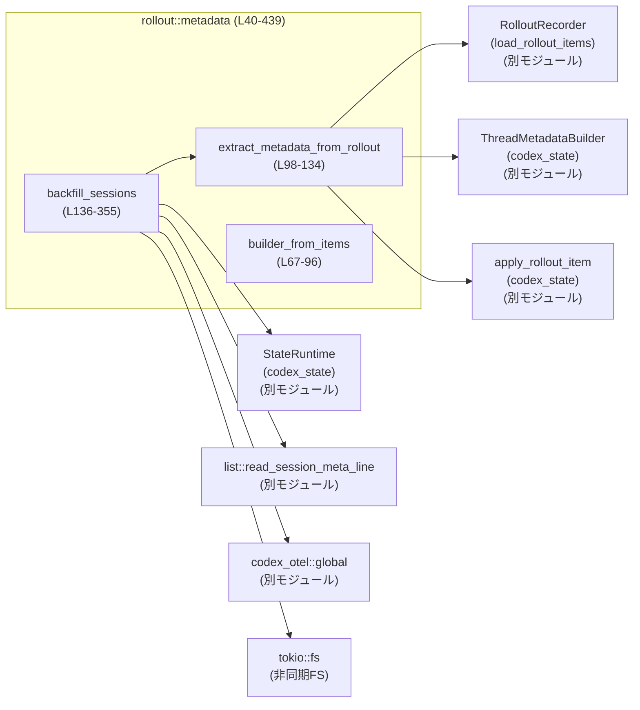
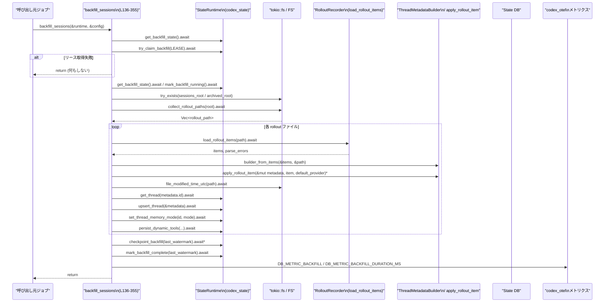

# rollout/src/metadata.rs

## 0. ざっくり一言

`rollout/src/metadata.rs` は、ローカルに保存された「rollout-*.jsonl」セッションファイルからスレッドメタデータを抽出し、状態 DB にバックフィル（後追い登録）するためのモジュールです。主にメタデータの構築・更新と、それを一括で DB に反映する非同期バックグラウンド処理を実装しています（`rollout/src/metadata.rs:L40-355`）。

---

## 1. このモジュールの役割

### 1.1 概要

このモジュールは **セッションファイルからスレッドメタデータを復元し、状態 DB を同期させる問題** を解決するために存在し、次の機能を提供します。

- JSONL 形式の rollout セッションファイルから `ThreadMetadataBuilder` を構築する（`builder_from_session_meta`, `builder_from_items`）（`rollout/src/metadata.rs:L40-96`）。
- セッションファイル 1 本から `ExtractionOutcome`（メタデータ＋解析結果）を抽出する（`extract_metadata_from_rollout`）（`L98-134`）。
- セッションディレクトリ全体を走査し、状態 DB にメタデータをバックフィルする非同期ジョブを実行する（`backfill_sessions`）（`L136-355`）。

※ このファイルは 1 チャンク（1/1）で、モジュール全体をここに含んでいます。

### 1.2 アーキテクチャ内での位置づけ

このモジュールは「ファイルベースのセッションログ」と「状態 DB（`codex_state`）」の間に位置するアダプタ的な役割を持ちます。



- セッションファイルの読み込みは `RolloutRecorder::load_rollout_items` に委譲しています（`L102-103`）。
- 抽出されたメタデータは `codex_state::ThreadMetadataBuilder` と `apply_rollout_item` によって構築・更新されます（`L45-49`, `L116-119`）。
- DB への永続化や backfill の制御は `codex_state::StateRuntime` に依存しています（`L136-321`）。
- 非同期ファイル IO には `tokio::fs` が使われています（`L202-203`, `L371-373`, `L389-405`）。
- メトリクス送信は `codex_otel::global()` を経由して行われます（`L140-143`, `L333-344`, `L345-353`）。

これらの依存先の内部実装はこのチャンクには現れないため、詳細は不明です。

### 1.3 設計上のポイント

コードから読み取れる設計上の特徴は次のとおりです。

- **メタデータ構築パスの二段構え**  
  - まず `RolloutItem::SessionMeta` から直接メタデータを構築し（`builder_from_session_meta`）（`L71-79`）、  
  - 見つからない場合はファイル名（`rollout-<timestamp>-<uuid>.jsonl`）からタイムスタンプと ID を復元するフォールバックがあります（`L82-95`）。
- **非同期・IO バウンド指向**  
  - セッションの読み込みやファイルシステム走査、DB 操作はすべて `async` 関数で行われ、`tokio::fs` や `StateRuntime` の非同期メソッドに委譲しています（`L98-134`, `L136-355`, `L389-438`）。
- **バックフィルの排他制御**  
  - `try_claim_backfill(BACKFILL_LEASE_SECONDS)` で「リース」を取得し、並列に複数のバックフィルワーカーが走らないようにしています（`L157-172`）。
- **状態管理と進捗チェックポイント**  
  - `BackfillState` で backfill のステータスと最後のウォーターマークを管理し、完了済み／部分的に完了した範囲をスキップします（`L144-155`, `L174-195`, `L221-224`, `L231-232`, `L305-317`, `L319-327`）。
  - ウォーターマークには `codex_home` からの相対パス文字列が利用され、辞書順ソートで処理順を決定しています（`L198-224`, `L357-362`, `L364-369`）。
- **安全性とエラーハンドリング**  
  - すべての関数は `Option` / `Result` を通じてエラーや不在値を表現し、`unwrap` などによるパニックは使用していません（唯一 `.unwrap_or` でデフォルトへフォールバック）（`L82-89`, `L98-115`, `L136-355`, `L389-438`）。
  - カウンタなどの統計値の加算には `saturating_add` が使われ、オーバーフロー時にもパニックしません（`L234-235`, `L259-260`, `L266-267`, `L273-274`, `L296-297`）。
- **観測性（Observability）**  
  - 進捗や失敗は `tracing::info` / `warn` ログ経由で記録されます（`L146-151`, `L160-163`, `L168-171`, ほか多数）。
  - OTEL メトリクス（DB_METRIC_BACKFILL など）とタイマーを使用し、backfill の成功・失敗と所要時間を計測します（`L140-143`, `L237-245`, `L333-344`, `L345-353`）。

---

## 2. 主要な機能一覧

このモジュールが提供する代表的な機能を、高レベルのタスク単位でまとめます。

- Rollout メタデータビルダの生成:
  - `builder_from_session_meta`: `SessionMetaLine` から `ThreadMetadataBuilder` を構築します（`L40-65`）。
  - `builder_from_items`: `RolloutItem` の列からメタデータビルダを推論・構築します（`L67-96`）。
- 単一ファイルからのメタデータ抽出:
  - `extract_metadata_from_rollout`: 1 本の rollout ファイルからスレッドメタデータと解析結果を抽出します（`L98-134`）。
- セッション全体のバックフィル:
  - `backfill_sessions`: セッションディレクトリを走査し、状態 DB にメタデータを一括でバックフィルします（`L136-355`）。
- ファイルシステム走査ユーティリティ:
  - `collect_rollout_paths`: `rollout-*.jsonl` ファイルのパス一覧を再帰的に集めます（`L389-438`）。
- 時刻・パスユーティリティ:
  - `parse_timestamp_to_utc`: 文字列表現のタイムスタンプを `DateTime<Utc>` に変換します（`L377-387`）。
  - `file_modified_time_utc`: ファイルの最終更新時刻を UTC で取得します（`L371-375`）。
  - `backfill_watermark_for_path`: backfill 用にソート可能なウォーターマーク文字列を生成します（`L364-369`）。

---

## 3. 公開 API と詳細解説

### 3.1 型一覧（構造体）

このモジュール内で定義される主要な構造体は 1 つです。

| 名前 | 種別 | 役割 / 用途 | 可視性 | 定義位置 |
|------|------|-------------|--------|----------|
| `BackfillRolloutPath` | 構造体 | 1 つの rollout ファイルに関するバックフィル用メタ情報（ウォーターマーク・パス・アーカイブフラグ）を保持します | モジュール内限定（`struct`） | `rollout/src/metadata.rs:L357-362` |

`BackfillRolloutPath` のフィールド:

- `watermark: String` — ソートやチェックポイントに使用するキー。`codex_home` からの相対パス（`/` 区切り）を文字列化したものを設定します（`L207-211`, `L364-369`）。
- `path: PathBuf` — 実際の rollout ファイルへのパスです（`L207-211`）。
- `archived: bool` — アーカイブ済みセッションディレクトリに属するかどうか（`L201-211`）。

### 3.2 関数詳細（7 件）

以下では特に重要な 7 関数について詳しく説明します。

---

#### `builder_from_items(items: &[RolloutItem], rollout_path: &Path) -> Option<ThreadMetadataBuilder>`

**概要**

- Rollout ファイル内の `RolloutItem` 列から、スレッドメタデータのビルダ (`ThreadMetadataBuilder`) を組み立てます（`L67-96`）。
- まず `RolloutItem::SessionMeta` を優先的に利用し、それが見つからない場合、ファイル名からタイムスタンプと Thread ID を推測します。

**引数**

| 引数名 | 型 | 説明 |
|--------|----|------|
| `items` | `&[RolloutItem]` | `RolloutRecorder` から読み込んだ rollout アイテムのスライスです（`L71-77`）。 |
| `rollout_path` | `&Path` | 対象となる rollout ファイルのパスです（`L68-69`）。 |

**戻り値**

- `Option<ThreadMetadataBuilder>`  
  - ビルダ構築に成功した場合は `Some(builder)` を返します。  
  - 必要な情報が取得できなかった場合は `None` を返します（`L82-95`）。

**内部処理の流れ**

1. `items` から最初の `RolloutItem::SessionMeta` を探します（`L71-77`）。
2. 見つかった場合は `builder_from_session_meta` を呼び出し、ビルダを構築します。成功したらそのビルダを返します（`L71-79`）。
3. セッションメタが見つからなかった場合は、`rollout_path.file_name()` を取得し、UTF-8 文字列に変換します（`L82-82`）。
4. ファイル名が `"rollout-"` で始まり、`.jsonl` で終わるかをチェックし、条件を満たさない場合は `None`（`L83-85`）。
5. `parse_timestamp_uuid_from_filename(file_name)` で `(created_ts, uuid)` を抽出します（`L86-86`）。
6. `created_ts.unix_timestamp()` を `DateTime::<Utc>::from_timestamp` で `DateTime<Utc>` に変換し、ナノ秒以下を 0 に揃えます（`L87-88`）。
7. `ThreadId::from_string(&uuid.to_string())` からスレッド ID を構築します（`L89-89`）。
8. 上記がすべて成功した場合、`ThreadMetadataBuilder::new` に ID・パス・作成時刻・`SessionSource::default()` を渡してビルダを生成し `Some(...)` を返します（`L90-95`）。

**Examples（使用例）**

```rust
use std::path::Path;
use rollout::metadata::builder_from_items;
use crate::recorder::RolloutRecorder; // 実際には同クレート内のモジュール

#[tokio::main]
async fn main() -> anyhow::Result<()> {
    let path = Path::new("sessions/rollout-2024-04-01T12-00-00-uuid.jsonl"); // 対象ファイル
    let (items, _thread_id, _parse_errors) = RolloutRecorder::load_rollout_items(path).await?; // アイテム読み込み

    if let Some(builder) = builder_from_items(&items, path) { // ビルダ構築を試みる
        let default_provider = "openai:gpt-4o";
        let metadata = builder.build(default_provider);       // ThreadMetadata を構築
        println!("thread id = {:?}", metadata.id);
    } else {
        eprintln!("metadata builder could not be constructed");
    }

    Ok(())
}
```

**Errors / Panics**

- この関数自体は `Option` を返すため、`Result` ベースのエラーは返しません。
- `None` になる主な条件（契約）:
  - `items` に `RolloutItem::SessionMeta` が存在せず、かつファイル名が期待する形式でない（`L71-85`）。
  - `parse_timestamp_uuid_from_filename` がエラーを返した場合（`L86-86`）。
  - `DateTime::<Utc>::from_timestamp(...)` が `None` を返した場合（タイムスタンプが範囲外）（`L87-88`）。
  - `ThreadId::from_string(&uuid.to_string()).ok()?` が `Err` となった場合（`L89-89`）。
- パニックを起こすような `unwrap` / `expect` は使用されておらず、安全に `None` で失敗を表現します。

**Edge cases（エッジケース）**

- `items` が空:
  - `find_map` は単に `None` を返し、その後ファイル名フォールバックへ進みます（`L71-79`, `L82-85`）。
- ファイル名が UTF-8 でない:
  - `file_name.to_str()?` が `None` を返し、関数は `None` を返します（`L82-82`）。
- ファイル名は正しいが、タイムスタンプ/UUID がパースできない:
  - `parse_timestamp_uuid_from_filename(file_name)?` により `None` を返し、呼び出し側でエラーとして扱われます（`L86-86`）。
- タイムゾーンやナノ秒:
  - `from_timestamp(..., 0)` と `with_nanosecond(0)` によってサブ秒精度は切り捨てられます（`L87-88`）。

**使用上の注意点**

- 呼び出し側は `None` の可能性を必ず処理する必要があります。`extract_metadata_from_rollout` は `ok_or_else` で `anyhow::Error` に変換し、失敗を「メタデータ不足」として扱っています（`L110-115`）。
- ファイル名フォーマットに依存するため、`rollout-<timestamp>-<uuid>.jsonl` 形式を変える場合は、この関数と `parse_timestamp_uuid_from_filename` の両方の更新が必要です。

---

#### `extract_metadata_from_rollout(rollout_path: &Path, default_provider: &str) -> anyhow::Result<ExtractionOutcome>`

**概要**

- 1 本の rollout ファイルからスレッドメタデータを抽出し、`ExtractionOutcome` として返します（`L98-134`）。
- メタデータビルダの構築、各 `RolloutItem` の適用、ファイル更新時刻の設定、メモリモードの復元などを行います。

**引数**

| 引数名 | 型 | 説明 |
|--------|----|------|
| `rollout_path` | `&Path` | 対象となる rollout ファイルのパスです（`L99-99`）。 |
| `default_provider` | `&str` | モデルプロバイダ ID のデフォルト値。メタデータの構築時に利用されます（`L100-100`, `L116-119`）。 |

**戻り値**

- `anyhow::Result<ExtractionOutcome>`  
  - 成功時は `ExtractionOutcome`（`metadata`, `memory_mode`, `parse_errors`）を返します（`L123-133`）。
  - 失敗時は `anyhow::Error` として原因メッセージを持つエラーを返します。

**内部処理の流れ**

1. `RolloutRecorder::load_rollout_items(rollout_path).await?` で rollout アイテム列とパースエラー数を読み込みます（`L102-103`）。
2. `items.is_empty()` の場合は `"empty session file"` エラーとして早期リターンします（`L104-108`）。
3. `builder_from_items(items.as_slice(), rollout_path)` を呼び出してメタデータビルダを構築し、`None` の場合 `"rollout missing metadata builder"` エラーを返します（`L110-115`）。
4. `builder.build(default_provider)` で初期メタデータを生成します（`L116-116`）。
5. `for item in &items` ループで `apply_rollout_item(&mut metadata, item, default_provider)` を呼び出し、レスポンスなどをメタデータに反映します（`L117-119`）。
6. `file_modified_time_utc(rollout_path).await` が `Some(updated_at)` を返した場合、`metadata.updated_at` を上書きします（`L120-121`）。
7. 最終的に `ExtractionOutcome { metadata, memory_mode, parse_errors }` を構築して返します。`memory_mode` は `items` を逆順に走査し、最後に現れた `RolloutItem::SessionMeta` の `meta.memory_mode` を拾います（`L123-132`）。

**Examples（使用例）**

```rust
use std::path::Path;
use rollout::metadata::extract_metadata_from_rollout;

#[tokio::main]
async fn main() -> anyhow::Result<()> {
    let path = Path::new("sessions/rollout-2024-04-01T12-00-00-uuid.jsonl");
    let default_provider = "openai:gpt-4o";

    let outcome = extract_metadata_from_rollout(path, default_provider).await?; // メタデータ抽出
    println!("thread id: {:?}", outcome.metadata.id);
    println!("memory_mode: {:?}", outcome.memory_mode.as_deref().unwrap_or("none"));
    println!("parse_errors: {}", outcome.parse_errors);

    Ok(())
}
```

**Errors / Panics**

- `Err(anyhow!("empty session file: ..."))` になる条件:
  - `RolloutRecorder::load_rollout_items` が成功したが、`items` が空だった場合（`L104-108`）。
- `Err(anyhow!("rollout missing metadata builder: ..."))` になる条件:
  - `builder_from_items` が `None` を返し、メタデータビルダを構築できなかった場合（`L110-115`）。
- それ以外にも、`RolloutRecorder::load_rollout_items` や `file_modified_time_utc` 内で発生した IO エラーなどは `?` により `anyhow::Error` として伝播します（`L102-103`, `L120-120`）。
- パニックを発生させるコードはこの関数内にはありません。

**Edge cases（エッジケース）**

- ファイルが存在しない/読み取れない:
  - `RolloutRecorder::load_rollout_items` が `Err` を返し、そのまま `anyhow::Error` として伝播します（`L102-103`）。メッセージの詳細はこのチャンクには現れません。
- セッションメタが欠落しており、ファイル名からも ID が復元できない:
  - `builder_from_items` が `None` となり、「missing metadata builder」エラーになります（`L110-115`）。
- `memory_mode` が一度も設定されていない:
  - `items.iter().rev().find_map(...)` の結果が `None` となり、`ExtractionOutcome.memory_mode` も `None` になります（`L125-131`）。
- ファイルの最終更新時刻が取得できない:
  - `file_modified_time_utc` が `None` を返すため、`metadata.updated_at` はビルダからのデフォルト値のままになります（`L120-121`, `L371-375`）。

**使用上の注意点**

- 非同期関数なので、`tokio` などの非同期ランタイム上で `.await` して利用する必要があります。
- エラー時には原因ごとに異なるメッセージが付与されますが、エラー型は `anyhow::Error` にまとめられています。呼び出し側で詳細な分類が必要な場合は、内部エラーの文字列などを解析する必要があります。
- `default_provider` はメタデータの初期値として使われるため、DB 側でも同じ表現を使う前提になっている可能性があります（詳細はこのチャンクには現れません）。

---

#### `backfill_sessions(runtime: &codex_state::StateRuntime, config: &impl RolloutConfigView)`

**概要**

- 状態 DB に対する rollout メタデータのバックフィル処理を実行する非同期タスクです（`L136-355`）。
- 1 ワーカーのみが実行されるように排他制御を行い、セッションとアーカイブディレクトリを走査して、各 rollout ファイルからメタデータを抽出・ upsert します。

**引数**

| 引数名 | 型 | 説明 |
|--------|----|------|
| `runtime` | `&codex_state::StateRuntime` | 状態 DB へのアクセス・backfill 状態管理・スレッドメタデータの upsert を提供するランタイムです（`L136-138`）。 |
| `config` | `&impl RolloutConfigView` | `codex_home()`（セッションディレクトリのルート）や `model_provider_id()` などの設定ビューを提供します（`L138-138`, `L198-199`, `L235-235`）。 |

**戻り値**

- 戻り値は `()`（ユニット）であり、エラーはすべて内部でログ出力され、呼び出し元には伝播しません（`L136-355`）。

**内部処理の流れ（概要）**

1. **メトリクス・タイマーの準備**  
   - `codex_otel::global()` からメトリクスクライアントを取得し、backfill 所要時間を計測するタイマーを開始します（`L140-143`）。

2. **backfill 状態の読み取りと完了判定**  
   - `runtime.get_backfill_state().await` で状態を取得し、失敗した場合は警告ログを出して `BackfillState::default()` を使用します（`L144-152`）。
   - `status == BackfillStatus::Complete` の場合は何もせず return します（`L154-155`）。

3. **ワーカーのリース取得（排他制御）**  
   - `runtime.try_claim_backfill(BACKFILL_LEASE_SECONDS).await` により backfill ワーカーのリースを取得します（`L157-166`）。
   - エラー時には warn ログを出し、return します（`L159-165`）。
   - すでに他のワーカーがリースを持っている場合（`claimed == false`）も info ログを出して return します（`L167-172`）。

4. **backfill 状態の再取得とステータス更新**  
   - リース取得後に再度 `get_backfill_state` を呼び出し、失敗時は `Running` 状態のデフォルトを使用します（`L174-185`）。
   - 状態が `Running` でなければ `mark_backfill_running().await` を呼び出し、成功時には状態を `Running` に更新します（`L187-195`）。

5. **rollout ファイルの収集**  
   - `sessions_root = codex_home()/SESSIONS_SUBDIR` と `archived_root = codex_home()/ARCHIVED_SESSIONS_SUBDIR` を構築します（`L198-199`）。
   - それぞれのルートに対して `tokio::fs::try_exists` で存在確認し（エラー時は `false` 扱い）、存在する場合に `collect_rollout_paths` を呼び出します（`L201-205`）。
   - 得られたパスごとに `BackfillRolloutPath { watermark, path, archived }` を生成し、ベクタに蓄積します（`L205-211`）。
   - エラー時は warn ログを出してスキップします（`L213-218`）。

6. **ウォーターマークソートと再開位置の決定**  
   - `watermark` キーで `rollout_paths` をソートします（`L221-221`）。
   - `backfill_state.last_watermark` があれば、それより大きいウォーターマークのみ残すようフィルタします（`L222-224`）。

7. **バッチ処理による backfill 本体**  
   - `BackfillStats { scanned, upserted, failed }` を初期化し、`rollout_paths.chunks(BACKFILL_BATCH_SIZE)` で 200 件単位のバッチ処理を行います（`L226-232`）。
   - 各 `rollout` について:
     - `stats.scanned` を `saturating_add(1)` で増加させます（`L234-234`）。
     - `extract_metadata_from_rollout(&rollout.path, config.model_provider_id()).await` を呼び、メタデータ抽出を行います（`L235-235`）。
     - 成功時:
       - `parse_errors > 0` の場合は `DB_ERROR_METRIC` カウンタに記録します（`L236-245`）。
       - `metadata.cwd` を `normalize_cwd_for_state_db` で正規化します（`L246-247`）。
       - メモリモードを `outcome.memory_mode.unwrap_or_else(|| "enabled".to_string())` で決定します（`L248-248`）。
       - 既存スレッドメタデータがあれば `prefer_existing_git_info` で Git 情報を引き継ぎます（`L249-251`）。
       - アーカイブファイルかつ `metadata.archived_at` が未設定なら、`file_modified_time_utc` などでアーカイブ時刻を設定します（`L252-257`）。
       - `runtime.upsert_thread(&metadata).await` でメタデータを DB に upsert します（`L258-260`）。
       - その後 `set_thread_memory_mode` でメモリモードを復元し、動的ツール情報も `persist_dynamic_tools` で保存します（`L262-281`）。
       - upsert 全体が成功した場合 `stats.upserted` を増加させます（`L273-273`）。
     - 失敗時（抽出エラーや upsert エラー、メモリモード復元の失敗など）には適宜 `stats.failed` を増加し、`warn!` ログを出します（`L259-260`, `L266-271`, `L296-300`）。

8. **バッチごとのチェックポイント**  
   - 各バッチの最後のエントリについて `checkpoint_backfill(last_entry.watermark.as_str())` を呼び、ウォーターマークを保存します（`L305-317`）。

9. **完了マークと統計・メトリクス**  
   - 最後に `mark_backfill_complete(last_watermark.as_deref()).await` を呼び、backfill の完了状態を記録します（`L319-327`）。
   - `info!` ログで `scanned`, `upserted`, `failed` の統計を出力します（`L329-332`）。
   - `DB_METRIC_BACKFILL` カウンタで upsert / failed 件数をメトリクスに送信します（`L333-343`）。
   - タイマーのステータスラベルとして `"success"`, `"failed"`, `"partial_failure"` のいずれかを記録します（`L345-353`）。

**Examples（使用例）**

```rust
use rollout::metadata::backfill_sessions;
use crate::config::AppConfig;             // RolloutConfigView を実装していると仮定
use codex_state::StateRuntime;

#[tokio::main]
async fn main() -> anyhow::Result<()> {
    let runtime = StateRuntime::connect("sqlite:///state.db").await?; // 仮の初期化
    let config = AppConfig::load()?;                                  // codex_home などを含む設定

    // バックグラウンドメンテナンスタスクとして backfill を実行
    backfill_sessions(&runtime, &config).await;

    Ok(())
}
```

**Errors / Panics**

- 関数の戻り値には `Result` を使わず、内部でエラーをすべて `warn!` ログとして記録しつつ処理継続または早期 return します。
  - たとえば `get_backfill_state` や `try_claim_backfill` のエラーはログのみで呼び出し元に伝播しません（`L144-152`, `L157-166`）。
  - `collect_rollout_paths`, `extract_metadata_from_rollout`, `upsert_thread`, `set_thread_memory_mode`, `persist_dynamic_tools`, `checkpoint_backfill`, `mark_backfill_complete` の失敗も同様です（`L205-218`, `L235-245`, `L258-260`, `L266-271`, `L274-292`, `L305-317`, `L319-327`）。
- パニックを明示的に発生させるコードはありません。
- `saturating_add` の使用により、カウンタの整数オーバーフローが起きてもパニックしない設計になっています（`L234-235`, `L259-260`, `L266-267`, `L273-274`, `L296-297`）。

**Edge cases（エッジケース）**

- **複数ワーカー起動**:
  - 呼び出しプロセスが複数あっても、`try_claim_backfill` のリース取得により、2 つ目以降のワーカーは `"already running"` ログを出して即時 return します（`L157-172`）。
- **バックフィル途中での失敗**:
  - 途中のバッチで失敗しても、それまでのチェックポイントまでの進捗は維持されます。次回起動時には `last_watermark` より大きいパスのみを処理します（`L221-224`, `L305-317`）。
- **ファイルシステムエラー**:
  - セッションルートが存在しない、または `read_dir` や `metadata` が失敗した場合でも、ログを出しつつ処理を継続し得ます（`L201-205`, `L205-218`, `L371-375`, `L393-405`）。
- **メモリモード復元の失敗**:
  - `set_thread_memory_mode` に失敗した場合は `stats.failed` を増加させて `continue` しており、`stats.upserted` は増えません（`L262-273`）。

**使用上の注意点**

- 非同期関数であり、`tokio` 等のランタイム上で起動する必要があります。
- 関数はエラーを返さないため、呼び出し側は終了コードなどから backfill 成功/失敗を直接判断できません。ログとメトリクスを監視することが前提の設計になっています。
- DB やファイルシステムの障害が継続すると、警告ログが大量に出力される可能性があります。`collect_rollout_paths` の内部で `next_entry()` のエラーに対して `continue` を行っているため、実装次第では同じディレクトリで繰り返しエラーが発生しうる点に注意が必要です（`L401-409`）。

---

#### `builder_from_session_meta(session_meta: &SessionMetaLine, rollout_path: &Path) -> Option<ThreadMetadataBuilder>`

**概要**

- 1 行分の `SessionMetaLine` から `ThreadMetadataBuilder` を直接構築します（`L40-65`）。
- タイムスタンプ文字列を UTC に変換し、Git 情報やエージェント情報など、セッションメタのフィールドをすべてビルダにコピーします。

**引数**

| 引数名 | 型 | 説明 |
|--------|----|------|
| `session_meta` | `&SessionMetaLine` | セッションのメタ情報を含むプロトコルオブジェクトです（`L40-42`, `L44-63`）。 |
| `rollout_path` | `&Path` | 対応する rollout ファイルのパスです（`L41-42`, `L47-48`）。 |

**戻り値**

- `Option<ThreadMetadataBuilder>`  
  - タイムスタンプのパースに成功した場合は `Some(builder)` を返します。
  - タイムスタンプが認識できないフォーマットの場合は `None` を返します（`L44-44`）。

**内部処理の流れ**

1. `session_meta.meta.timestamp.as_str()` を `parse_timestamp_to_utc` に渡し、UTC 時刻に変換します。失敗した場合は `None` を返します（`L44-44`, `L377-387`）。
2. `ThreadMetadataBuilder::new` に `id`, `rollout_path.to_path_buf()`, `created_at`, `source` を渡し、ビルダを生成します（`L45-50`）。
3. `model_provider`, `agent_nickname`, `agent_role`, `agent_path`, `cwd`, `cli_version` をセッションメタからコピーします（`L51-56`）。
4. `sandbox_policy` と `approval_mode` を固定値（読み取り専用ポリシー、`AskForApproval::OnRequest`）で設定します（`L57-58`）。
5. Git 情報 (`commit_hash`, `branch`, `repository_url`) が存在する場合は、それぞれビルダに設定します（`L59-62`）。
6. 最後に `Some(builder)` を返します（`L64-64`）。

**Examples（使用例）**

```rust
use std::path::Path;
use codex_protocol::protocol::SessionMetaLine;
use rollout::metadata::builder_from_session_meta;

fn build_from_meta(meta_line: &SessionMetaLine, path: &Path) {
    if let Some(builder) = builder_from_session_meta(meta_line, path) {
        let metadata = builder.build("openai:gpt-4o");
        println!("thread created_at = {}", metadata.created_at);
    } else {
        eprintln!("invalid timestamp in session_meta");
    }
}
```

**Errors / Panics**

- `parse_timestamp_to_utc` が `None` を返した場合、この関数も `None` で失敗を表現します（`L44-44`）。
- その他のコピー処理は単純なフィールド代入であり、パニックを引き起こすコードはありません。
- Git 情報の有無に応じて `git_sha` は `Option` として安全に設定されています（`L59-62`）。

**Edge cases（エッジケース）**

- タイムスタンプ文字列がファイル名形式（`%Y-%m-%dT%H-%M-%S`）でも RFC3339 形式でもない場合、`parse_timestamp_to_utc` が `None` を返し、ビルダ構築に失敗します（`L377-387`, `L44-44`）。
- `cli_version` は `Some(...)` でラップされており、NULL 不可の設計になっています（`L56-56`）。

**使用上の注意点**

- `builder_from_items` や `extract_metadata_from_rollout` を通して間接的に利用されることが多く、単体で呼び出す場合はタイムスタンプフォーマットの前提に注意する必要があります。

---

#### `collect_rollout_paths(root: &Path) -> std::io::Result<Vec<PathBuf>>`

**概要**

- 指定ディレクトリ配下を再帰的に走査し、`rollout-*.jsonl` という名前パターンに一致するファイルパスを収集します（`L389-438`）。
- 非同期の `tokio::fs::read_dir` と `next_entry` を利用した深さ優先探索を行います。

**引数**

| 引数名 | 型 | 説明 |
|--------|----|------|
| `root` | `&Path` | 走査を開始するルートディレクトリです（`L389-389`）。 |

**戻り値**

- `std::io::Result<Vec<PathBuf>>`  
  - 成功時は発見したすべての rollout ファイルパスを含むベクタを返します（`L438-438`）。
  - ルートディレクトリの `read_dir` 呼び出し時など、一部のステップで致命的な IO エラーが発生した場合 `Err(std::io::Error)` を返します（`L393-399`）。

**内部処理の流れ**

1. `stack` に `root.to_path_buf()` を積んで初期化し、`paths` を空ベクタで初期化します（`L390-391`）。
2. `while let Some(dir) = stack.pop()` で LIFO 方式の深さ優先探索を行います（`L392-392`）。
3. `tokio::fs::read_dir(&dir).await` を試み、失敗した場合は `warn!` ログを出しつつ次のディレクトリに進みます（`L393-399`）。
4. 得られた `read_dir` ハンドルに対して `loop` で `next_entry().await` を呼び続けます（`L400-400`）。
5. `next_entry` が `Err(err)` なら warn ログを出しつつ `continue`（同じディレクトリの次のエントリ取得を再試行）します（`L401-409`）。
6. `next_entry` が `Ok(None)` ならディレクトリの終端としてループを抜けます（`L411-412`）。
7. `entry.file_type().await` によりファイル種別を取得し、エラー時には warn を出してスキップします（`L415-421`）。
8. ディレクトリの場合は `stack` に push して次へ（`L422-424`）。
9. ファイルでもない場合は何もせずスキップ（`L426-427`）。
10. ファイル名が UTF-8 に変換でき、名前が `ROLLOUT_PREFIX` で始まり `ROLLOUT_SUFFIX` で終わる場合に `paths.push(path)` で追加します（`L429-435`）。
11. すべてのディレクトリ処理が終わったら `Ok(paths)` を返します（`L438-438`）。

**Examples（使用例）**

```rust
use std::path::Path;
use rollout::metadata::collect_rollout_paths;

#[tokio::main]
async fn main() -> std::io::Result<()> {
    let root = Path::new("/home/user/.codex/sessions");
    let paths = collect_rollout_paths(root).await?; // rollout-*.jsonl を収集

    for path in paths {
        println!("found session: {}", path.display());
    }

    Ok(())
}
```

**Errors / Panics**

- `read_dir(&dir).await` が失敗した場合、対象ディレクトリはスキップされ、処理継続します（`L393-399`）。この場合でも関数全体は `Ok(paths)` を返します。
- `next_entry().await` が `Err` の場合も同様に warn ログを出して `continue` し、関数自体の戻り値には反映されません（`L401-409`）。
- 致命的なエラーとして `Err` を返すのは、最初の `read_dir(&dir)` 呼び出しで `?` を使っていないため、このコードからは明確には分かりませんが、少なくとも `Ok(paths)` が返る経路が優先されていることが読み取れます（`L393-399`, `L438-438`）。
- パニックを引き起こす `unwrap` はありません。

**Edge cases（エッジケース）**

- シンボリックリンクの扱い:
  - `file_type.is_dir()` / `is_file()` に基づいて分岐していますが、シンボリックリンクの扱いはこのチャンクからは不明です（`L415-421`）。
- `next_entry` でエラーが繰り返し発生するケース:
  - `continue` により何度も `next_entry` を再試行するため、実装・OS によっては同じエラーを繰り返す可能性があります（`L401-409`）。
- 非 UTF-8 ファイル名:
  - `file_name.to_str()` が `None` を返した場合はスキップされます（`L429-431`）。

**使用上の注意点**

- 非同期関数のため `await` が必須です。
- 一部のエラー（サブディレクトリの読み取り失敗など）は戻り値に反映されず、ログのみで記録されます。そのため「返ってきたパス一覧が完全である」ことは保証されません。

---

#### `parse_timestamp_to_utc(ts: &str) -> Option<DateTime<Utc>>`

**概要**

- 文字列形式のタイムスタンプを `DateTime<Utc>` に変換するユーティリティ関数です（`L377-387`）。
- ファイル名向けのカスタムフォーマットと RFC3339 の両方に対応します。

**引数**

| 引数名 | 型 | 説明 |
|--------|----|------|
| `ts` | `&str` | タイムスタンプ文字列。`SessionMetaLine` 内の `meta.timestamp` などから取得されます（`L44-44`, `L377-379`）。 |

**戻り値**

- `Option<DateTime<Utc>>`  
  - パースに成功した場合は UTC の `DateTime` を返します。
  - どちらのフォーマットにも当てはまらない場合は `None` を返します（`L386-386`）。

**内部処理の流れ**

1. `const FILENAME_TS_FORMAT: &str = "%Y-%m-%dT%H-%M-%S";` を定義します（`L378-378`）。
2. まず `NaiveDateTime::parse_from_str(ts, FILENAME_TS_FORMAT)` を試みます（`L379-379`）。
3. 成功した場合は `DateTime::<Utc>::from_naive_utc_and_offset(naive, Utc)` で UTC 日時に変換し、`with_nanosecond(0)` でナノ秒を 0 にして返します（`L380-381`）。
4. 失敗した場合は `DateTime::parse_from_rfc3339(ts)` を試み、成功時は `with_timezone(&Utc).with_nanosecond(0)` で UTC に変換して返します（`L383-384`）。
5. 両方とも失敗した場合は `None` を返します（`L386-386`）。

**Examples（使用例）**

```rust
use chrono::Utc;
use rollout::metadata::parse_timestamp_to_utc;

fn main() {
    let ts1 = "2024-01-02T03-04-05"; // ファイル名形式
    let ts2 = "2024-01-02T03:04:05Z"; // RFC3339 形式

    let dt1 = parse_timestamp_to_utc(ts1).expect("valid file-name timestamp");
    let dt2 = parse_timestamp_to_utc(ts2).expect("valid RFC3339 timestamp");

    assert_eq!(dt1, dt2); // 同じ時刻を指す可能性が高い
    println!("parsed: {} and {}", dt1, dt2);
}
```

**Errors / Panics**

- エラーはすべて `Option::None` で表現され、パニックは発生しません。
- 対応していないフォーマットの場合は単に失敗するだけです。

**Edge cases（エッジケース）**

- サブ秒精度が含まれる RFC3339 文字列（例: `"2024-01-02T03:04:05.123Z"`）もパースされますが、`with_nanosecond(0)` によりサブ秒は切り捨てられます（`L383-384`）。
- タイムゾーンオフセット付き RFC3339（例: `+09:00`）も `with_timezone(&Utc)` によって UTC に変換されます（`L383-384`）。

**使用上の注意点**

- `builder_from_session_meta` から使用されており、ここで `None` になった場合はビルダ自体の構築にも失敗します（`L44-44`）。
- 入力フォーマットがこの関数の期待する形式と異なる場合、上位レイヤーでのフォールバック（ファイル名からの推測など）に依存することになります。

---

#### `file_modified_time_utc(path: &Path) -> Option<DateTime<Utc>>`

**概要**

- ファイルの最終更新時刻を UTC の `DateTime` として取得します（`L371-375`）。
- OS から取得した時刻をナノ秒未満切り捨てで正規化します。

**引数**

| 引数名 | 型 | 説明 |
|--------|----|------|
| `path` | `&Path` | 対象ファイルのパスです（`L371-371`）。 |

**戻り値**

- `Option<DateTime<Utc>>`  
  - 成功時は UTC の更新時刻を返します。
  - メタデータ取得や `modified()` 呼び出しが失敗した場合は `None` を返します（`L371-373`）。

**内部処理の流れ**

1. `tokio::fs::metadata(path).await.ok()?` でメタデータを取得し、IO エラー時には `None` を返します（`L372-372`）。
2. `modified().ok()?` で OS の更新時刻を取得します。失敗した場合も `None` を返します（`L372-372`）。
3. `let updated_at: DateTime<Utc> = modified.into();` で UTC に変換します（`L373-373`）。
4. `updated_at.with_nanosecond(0)` でナノ秒を 0 に設定し、その `Option<DateTime<Utc>>` をそのまま返します（`L374-374`）。

**Examples（使用例）**

```rust
use std::path::Path;
use rollout::metadata::file_modified_time_utc;

#[tokio::main]
async fn main() {
    let path = Path::new("sessions/rollout-2024-04-01T12-00-00-uuid.jsonl");
    if let Some(dt) = file_modified_time_utc(path).await {
        println!("last modified at {}", dt);
    } else {
        eprintln!("could not get modified time");
    }
}
```

**Errors / Panics**

- IO エラーおよび `modified()` 非対応環境では `None` を返します。
- パニックは発生しません。

**Edge cases（エッジケース）**

- ファイルが存在しない場合やアクセス権がない場合は `None` となります。
- 一部のプラットフォームでは `modified()` が未実装で `Err` を返すケースがあり、その場合も `None` です。

**使用上の注意点**

- `extract_metadata_from_rollout` と `backfill_sessions` で `updated_at` や `archived_at` の補完に使用されますが、`None` の場合はそれぞれビルダや既存値にフォールバックします（`L120-121`, `L252-257`）。

---

### 3.3 その他の関数・コンポーネント一覧

補助的な関数や単純なラッパー関数を一覧にまとめます。

#### 関数一覧

| 関数名 | 役割（1 行） | 可視性 | 定義位置 |
|--------|--------------|--------|----------|
| `backfill_watermark_for_path(codex_home: &Path, path: &Path) -> String` | `codex_home` からの相対パスを取得し、`"\"` を `/` に置き換えた文字列を返す。backfill 用ウォーターマークとして使用されます。 | モジュール内限定 | `rollout/src/metadata.rs:L364-369` |

#### 定数一覧（参考）

| 定数名 | 型 | 値 / 意味 | 定義位置 |
|--------|----|-----------|----------|
| `ROLLOUT_PREFIX` | `&str` | `"rollout-"`。rollout ファイル名のプレフィックス（`L32-32`）。 | `L32-32` |
| `ROLLOUT_SUFFIX` | `&str` | `".jsonl"`。rollout ファイル名のサフィックス（`L33-33`）。 | `L33-33` |
| `BACKFILL_BATCH_SIZE` | `usize` | `200`。backfill 時の 1 バッチあたりの処理件数（`L34-34`）。 | `L34-34` |
| `BACKFILL_LEASE_SECONDS` | `i64` | 非テスト時 900 秒、テスト時 1 秒。backfill リースの有効期間（`L35-38`）。 | `L35-38` |

---

## 4. データフロー

ここでは、`backfill_sessions` を中心とする代表的な処理シナリオのデータフローを説明します。

### 4.1 backfill_sessions による DB バックフィルのフロー

`backfill_sessions` が 1 回呼ばれたときの高レベルな流れです（`rollout/src/metadata.rs:L136-355`）。



- 各 rollout ファイルごとに `extract_metadata_from_rollout` → `upsert_thread` → `set_thread_memory_mode` → `persist_dynamic_tools` という流れで DB が更新されます（`L235-281`）。
- `checkpoint_backfill` によりバッチ単位で進捗が保存されるため、途中で失敗しても次回は直近のウォーターマークから再開できます（`L305-317`）。
- メトリクス（件数と所要時間）は OTEL 経由で外部に送信されます（`L140-143`, `L333-344`, `L345-353`）。

---

## 5. 使い方（How to Use）

### 5.1 基本的な使用方法

典型的には、状態 DB を持つアプリケーションがバックグラウンドメンテナンスタスクとして `backfill_sessions` を呼び出します。また、個別のファイルからメタデータを取得したい場合は `extract_metadata_from_rollout` を直接使います。

```rust
use std::path::Path;
use codex_state::StateRuntime;
use rollout::metadata::{backfill_sessions, extract_metadata_from_rollout};
use crate::config::AppConfig; // RolloutConfigView を実装

#[tokio::main]
async fn main() -> anyhow::Result<()> {
    // 1. 設定・ランタイムの初期化
    let config = AppConfig::load()?;                      // codex_home などを含む
    let runtime = StateRuntime::connect("sqlite:///state.db").await?;

    // 2. DB 全体の backfill を実行
    backfill_sessions(&runtime, &config).await;

    // 3. 特定ファイルのメタデータだけ欲しい場合
    let path = Path::new("sessions/rollout-2024-04-01T12-00-00-uuid.jsonl");
    let outcome = extract_metadata_from_rollout(path, config.model_provider_id()).await?;
    println!("thread id: {:?}", outcome.metadata.id);

    Ok(())
}
```

### 5.2 よくある使用パターン

1. **起動時の一度きりバックフィル**
   - アプリケーション起動時に `backfill_sessions` を呼び出し、セッションファイルと DB の同期を取るパターンです。
   - `BackfillStatus::Complete` になっていれば、以降の呼び出しは即時 return します（`L144-155`）。

2. **定期的なバックフィル**
   - cron やスケジューラから一定間隔で `backfill_sessions` を呼び出すパターンです。
   - `try_claim_backfill` により同時実行が抑制されるため、多重起動に比較的強い設計になっています（`L157-172`）。

3. **オンデマンド解析**
   - トラブルシュートなどで特定の rollout ファイルを解析し、メタデータを確認したい場合に `extract_metadata_from_rollout` を単独利用します（`L98-134`）。

### 5.3 よくある間違い

```rust
// 間違い例: 非同期ランタイム外で .await を呼ぼうとしている
// let outcome = extract_metadata_from_rollout(path, "openai:gpt-4o").await;

// 正しい例: tokio ランタイム内で await する
#[tokio::main]
async fn main() {
    let outcome = extract_metadata_from_rollout(path, "openai:gpt-4o").await.unwrap();
}

// 間違い例: builder_from_items の None を無視して unwrap する
// let builder = builder_from_items(&items, path).unwrap(); // パニックの可能性

// 正しい例: None ケースをハンドリングする
if let Some(builder) = builder_from_items(&items, path) {
    let metadata = builder.build("openai:gpt-4o");
    // ...
} else {
    eprintln!("metadata builder could not be constructed");
}
```

### 5.4 使用上の注意点（まとめ）

- **事前条件 / 契約**
  - セッションファイルには、可能な限り `RolloutItem::SessionMeta` が含まれていることが前提です。含まれていない場合はファイル名フォーマットに強く依存します（`L71-79`, `L82-85`）。
  - ファイル名フォーマットは `"rollout-<timestamp>-<uuid>.jsonl"` を想定しており、変更する場合は解析ロジックの更新が必要です（`L32-33`, `L83-86`）。
- **エラーの扱い**
  - `backfill_sessions` はエラーを返さずログに記録する設計であるため、成功/失敗の確認にはログとメトリクスを利用する必要があります（`L144-152`, `L159-165`, `L213-218`, `L259-261`, `L266-271`, `L296-300`, `L333-344`, `L345-353`）。
  - `extract_metadata_from_rollout` は `anyhow::Result` を返し、エラー原因をメッセージとして含みます（`L98-115`）。
- **並行性**
  - `try_claim_backfill` により、多重起動時の backfill ワーカー競合を抑制しますが、その実装詳細 (`StateRuntime`) はこのチャンクには現れません（`L157-172`）。
  - `StateRuntime` への参照は `&`（共有参照）のみで渡されており、Rust の所有権モデルによりメモリ安全性が保証されています。
- **パフォーマンス**
  - ファイル IO と DB 操作はすべて非同期で実行されますが、多数のファイルをスキャンするため、`collect_rollout_paths` のコストが支配的になりえます（`L389-438`）。
  - バッチサイズは 200 固定であり、大量のセッションがある環境ではバッチ数が多くなります（`L34-34`, `L232-232`）。
- **観測性**
  - `tracing::info` / `warn` によるログ出力が豊富にあり、障害解析の手がかりになります（例: `L146-151`, `L160-163`, `L213-218`, `L259-261`, `L283-285`, `L289-291`, `L311-313`, `L323-326`, `L329-332`, `L393-399`, `L401-409`, `L418-419`）。
  - OTEL メトリクス（カウンタ・タイマー）が導入されており、ダッシュボードなどで backfill の状態を監視できる設計になっています（`L140-143`, `L237-245`, `L333-344`, `L345-353`）。

---

## 6. 変更の仕方（How to Modify）

### 6.1 新しい機能を追加する場合

1. **メタデータ項目を増やしたい場合**
   - 新しい項目が `SessionMetaLine` に追加された場合:
     - `builder_from_session_meta` 内で該当フィールドを `ThreadMetadataBuilder` にコピーする処理を追加します（`L51-56`, `L59-62`）。
     - もし `apply_rollout_item` のふるまいも変えたい場合は、`codex_state` 側の実装を確認する必要があります（このチャンクには現れません）。
   - ファイル名から追加情報を抽出したい場合:
     - `parse_timestamp_uuid_from_filename` の仕様を変更し（別モジュール）、それに合わせて `builder_from_items` の後半を拡張します（`L86-95`）。

2. **新しいディレクトリ階層を backfill 対象にしたい場合**
   - `backfill_sessions` の `for (root, archived)` ループに新しいルートを追加します（`L201-201`）。
   - ウォーターマークの形式にも影響する場合は `backfill_watermark_for_path` の実装を確認します（`L364-369`）。

3. **追加メトリクスやログの導入**
   - 特定の失敗ケースに対してメトリクスを増やしたい場合は、該当する `match` のエラー分岐にカウンタ更新を追加します（`L237-245`, `L259-261`, `L266-271`, `L296-300`）。
   - ログメッセージの整形や追加は `warn!` / `info!` 呼び出し箇所に対して行います。

### 6.2 既存の機能を変更する場合

- **backfill の契約を変えるときの注意点**
  - `BackfillState` の `status` や `last_watermark` の意味を変える場合、次の箇所の影響範囲を確認する必要があります。
    - 初期状態の読み込みと完了判定（`L144-155`）。
    - リース取得後の再読み込みとステータス更新（`L174-195`）。
    - ウォーターマークのフィルタとチェックポイント（`L221-224`, `L305-317`, `L319-327`）。
- **パフォーマンス調整**
  - バッチサイズ (`BACKFILL_BATCH_SIZE`) を変える場合、メモリ使用量と DB 負荷のトレードオフを考慮します（`L34-34`, `L232-232`）。
- **エラーの扱いを Result ベースにしたい場合**
  - 現在は `backfill_sessions` が `()` を返しているため、これを `Result<(), Error>` などに変更するには、すべての `warn!` ベースのエラー処理を見直す必要があります（`L144-152`, `L159-165`, `L213-218`, `L258-261`, `L266-271`, `L283-285`, `L289-291`, `L311-313`, `L323-326`, `L393-399`, `L401-409`, `L418-419`）。

---

## 7. 関連ファイル

このモジュールと密接に関係するファイル・コンポーネントをまとめます。

| パス / モジュール | 役割 / 関係 |
|-------------------|------------|
| `crate::recorder::RolloutRecorder` | `load_rollout_items` により、rollout ファイルから `Vec<RolloutItem>` とパースエラー数を読み出します（`L102-103`）。実装はこのチャンクには現れません。 |
| `crate::config::RolloutConfigView` | `codex_home()` と `model_provider_id()` を提供する設定ビューです。backfill ルートディレクトリやデフォルトプロバイダを決定します（`L136-138`, `L198-199`, `L235-235`）。 |
| `crate::list` / `list::read_session_meta_line` | rollout ファイルから `SessionMetaLine` を読み出し、動的ツール情報の backfill に利用します（`L4-4`, `L274-281`）。 |
| `crate::state_db::normalize_cwd_for_state_db` | メタデータ内の `cwd` パスを状態 DB に保存可能な形式に正規化します（`L7-7`, `L246-247`）。 |
| `codex_state` モジュール群 | `ThreadMetadataBuilder`, `StateRuntime`, `BackfillState`, `BackfillStats`, `BackfillStatus`, `ExtractionOutcome`, `apply_rollout_item` などを提供します（`L18-26`）。backfill の中心となるドメインオブジェクト群ですが、実装はこのチャンクには現れません。 |
| `codex_protocol::protocol` | `RolloutItem`, `SessionMetaLine`, `SandboxPolicy`, `AskForApproval`, `SessionSource` などのプロトコル型を提供します（`L13-17`）。 |
| `codex_otel` | `codex_otel::global()` を通じてメトリクス送信インターフェイスを提供します（`L140-143`, `L333-344`, `L345-353`）。 |
| `rollout/src/metadata_tests.rs` | このモジュールのテストコード。`#[path = "metadata_tests.rs"] mod tests;` により参照されています（`L441-443`）。どの関数がテストされているかはこのチャンクには現れません。 |

テストについては、`metadata_tests.rs` が別ファイルとして存在することのみが分かりますが、その内容やカバレッジはこのチャンクからは不明です（`rollout/src/metadata.rs:L441-443`）。
