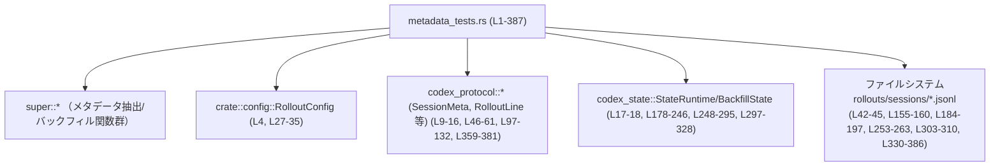
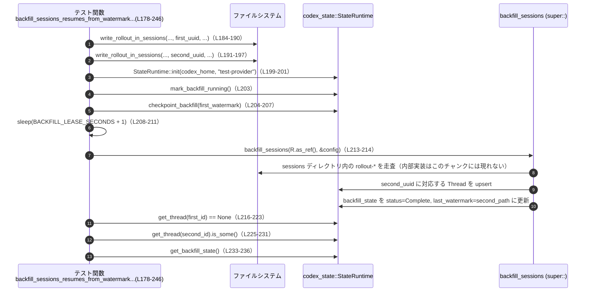

# rollout\src\metadata_tests.rs

## 0. ざっくり一言

`metadata_tests.rs` は、ロールアウト JSONL ファイルからスレッドメタデータを抽出・バックフィルする処理の **挙動保証用テスト** と、そのテストを支える小さなヘルパー関数を集めたモジュールです（metadata_tests.rs:L27-386）。

---

## 1. このモジュールの役割

### 1.1 概要

- このモジュールは、ロールアウトファイル（`rollout-<timestamp>-<uuid>.jsonl`）からメタデータを抽出する処理と、`codex_state` のステート DB にセッションをバックフィルする処理が、期待どおり動作することを検証します。
- 具体的には、以下の性質をテストしています。
  - `SessionMeta` ベースのメタデータ組み立て（metadata_tests.rs:L37-86）
  - 複数の `SessionMeta` 行に渡る `memory_mode` の選択ルール（L88-148）
  - `SessionMeta` が無い場合のファイル名からの情報抽出（L150-176）
  - バックフィル処理のウォーターマーク再開・完了状態・Git 情報のマージ・`cwd` 正規化（L178-328）

このモジュール自身は公開 API を定義せず、**親モジュール（`super::*`）が提供する関数群の契約をテストベースで明らかにする**役割を持ちます（L3）。

### 1.2 アーキテクチャ内での位置づけ

テストモジュールが、親モジュールや外部クレートとどのように関係しているかを簡単な依存関係図で示します。



この図は、**テストコードが利用しているコンポーネントの関係**を表しています。親モジュールの実装詳細はこのチャンクには現れませんが、テストからその振る舞いが観察されています。

### 1.3 設計上のポイント

コードから読み取れる設計上の特徴は次のとおりです。

- **現実に近い I/O を使うテスト**  
  - `tempdir` と `std::fs::File` により、実際のファイルシステム上に JSONL ロールアウトファイルを生成しています（L39-45, L70-72, L133-141, L155-160, L184-197, L253-263, L303-310, L383-385）。
- **async / Tokio ベースの非同期テスト**  
  - メインの処理は Tokio ランタイム上で動作する前提で、`#[tokio::test]` を付けた非同期テストとして定義されています（L37, L88, L178, L248, L297）。
- **状態管理との統合テスト**  
  - `codex_state::StateRuntime` を実際に初期化し、スレッドメタデータの `get_thread` / `upsert_thread` やバックフィル状態 (`get_backfill_state`) を介して、バックフィル処理の副作用を検証しています（L199-207, L216-245, L265-279, L284-295, L312-323）。
- **テスト専用ヘルパーで共通ロジックを集約**  
  - ロールアウトファイル生成用の `write_rollout_in_sessions` / `write_rollout_in_sessions_with_cwd`（L330-386）や `test_config`（L27-35）により、テストごとの重複を抑えています。

---

## 2. 主要な機能一覧

このファイルに定義される主要な機能（テスト＋ヘルパー）を一覧します。

- `test_config`: テスト用の `RolloutConfig` を構築するヘルパー（L27-35）。
- `extract_metadata_from_rollout_uses_session_meta`: `extract_metadata_from_rollout` が `SessionMeta` を元にメタデータを構築し、ファイルの更新時刻を `updated_at` に反映することを確認するテスト（L37-86）。
- `extract_metadata_from_rollout_returns_latest_memory_mode`: 複数 `SessionMeta` 行のうち最新の `memory_mode` が結果に反映されることを確認するテスト（L88-148）。
- `builder_from_items_falls_back_to_filename`: `SessionMeta` が存在しない場合に、ファイル名のタイムスタンプと UUID から `ThreadMetadataBuilder` を構築することを確認するテスト（L150-176）。
- `backfill_sessions_resumes_from_watermark_and_marks_complete`: バックフィル処理がウォーターマークより後のセッションのみを処理し、完了状態と最終ウォーターマークを更新することを確認するテスト（L178-246）。
- `backfill_sessions_preserves_existing_git_branch_and_fills_missing_git_fields`: 既存の Git ブランチを保持しつつ、足りない Git 情報をロールアウトから補完するバックフィルの動作を確認するテスト（L248-295）。
- `backfill_sessions_normalizes_cwd_before_upsert`: バックフィル時に `cwd` が `normalize_cwd_for_state_db` で正規化されてから保存されることを確認するテスト（L297-328）。
- `write_rollout_in_sessions`: テスト用に `<codex_home>/sessions/rollout-<ts>-<uuid>.jsonl` を生成するヘルパー（L330-345）。
- `write_rollout_in_sessions_with_cwd`: 任意の `cwd` を含む `SessionMeta` を 1 行だけ持つロールアウトファイルを生成するヘルパー（L347-386）。

---

## 3. 公開 API と詳細解説

このファイル自体は公開 API を定義しませんが、**テストを通じて親モジュール（`super::*`）や外部クレートの API 契約が読み取れる**ため、それらを中心に整理します。

### 3.1 型一覧（構造体・列挙体など）

テストから役割が把握できる主要な型を表にまとめます。

| 名前 | 種別 | 役割 / 用途 | 根拠 |
|------|------|-------------|------|
| `RolloutConfig` | 構造体 | ロールアウト処理用の設定。`sqlite_home` / `cwd` / `codex_home` / `model_provider_id` / `generate_memories` を持つ（テスト内で設定）（L27-34）。 | metadata_tests.rs:L4, L27-35 |
| `ThreadId` | 構造体 | スレッド（セッション）の識別子。`Uuid` 文字列から生成されます（L41, L92, L169, L184-188, L191-197, L252-258, L301-308, L355）。 | metadata_tests.rs:L9, L41, L92, L169, L184-189, L191-197, L252-258, L301-308, L355 |
| `SessionMeta` | 構造体 | セッション単位のメタデータ。`id`, `forked_from_id`, `timestamp`, `cwd`, `originator`, `cli_version`, `source`, `agent_*`, `model_provider`, `base_instructions`, `dynamic_tools`, `memory_mode` などを持ちます（L46-61, L97-112, L359-373）。 | metadata_tests.rs:L14, L46-61, L97-112, L359-373 |
| `SessionMetaLine` | 構造体 | ロールアウト 1 行分の `meta` と `git` 情報をまとめたラッパー（L62-65, L120-123, L127-130, L375-377）。 | metadata_tests.rs:L15, L62-65, L120-123, L127-130, L375-377 |
| `RolloutItem` | 列挙体 | ロールアウト行の種別。`SessionMeta` や `Compacted` などのバリアントが存在します（L12, L67-69, L118-132, L157-160, L379-381）。 | metadata_tests.rs:L12, L67-69, L118-132, L157-160, L379-381 |
| `RolloutLine` | 構造体 | `timestamp` と `item: RolloutItem` を持つ 1 行分のロールアウトレコード（L66-69, L118-132, L379-381）。 | metadata_tests.rs:L13, L66-69, L118-132, L379-381 |
| `CompactedItem` | 構造体 | コンパクト化されたメッセージ（`message`, `replacement_history`）を表すロールアウト項目（L157-160）。 | metadata_tests.rs:L10, L157-160 |
| `GitInfo` | 構造体 | ロールアウト起点の Git 情報。`commit_hash`, `branch`, `repository_url` を持つ（L258-262）。 | metadata_tests.rs:L11, L258-262 |
| `ThreadMetadataBuilder` | 構造体 | スレッドメタデータを段階的に構築するビルダ。`new` で `ThreadId`, パス, 作成時刻, `SessionSource` を受け取ります（L168-173）。 | metadata_tests.rs:L18, L168-173 |
| `BackfillStatus` | 列挙体 | バックフィル状態を表現。少なくとも `Complete` バリアントが存在します（L237）。 | metadata_tests.rs:L17, L237 |
| `StateRuntime`（型名は推測） | 構造体 | `codex_state::StateRuntime::init` が返すランタイム。スレッドメタデータとバックフィル状態の読み書きを担います（L199-207, L216-245, L265-279, L284-295, L312-323）。型名自体はこのファイルには書かれていませんが、モジュールパスから `StateRuntime` であると読み取れます。 | metadata_tests.rs:L199-207, L216-245, L265-279, L284-295, L312-323 |

> 補足: ここでの役割は **テストから観測できる範囲**に限定しています。型の全フィールドやすべてのバリアントは、このチャンクからは分かりません。

### 3.2 関数詳細（最大 7 件）

ここでは、**テストを通じて契約が分かる主要な関数**を取り上げます。多くは `super::*` で親モジュールからインポートされるもので、実装はこのファイルには存在しません。

#### `extract_metadata_from_rollout(path, model_provider_id)` （親モジュール側、非公開/公開は不明）

**概要**

- ロールアウト JSONL ファイルからメタデータを抽出し、メタデータ本体・`memory_mode`・パースエラー数を含む構造体を返す非同期関数です（L74-76, L143-145, L269-272, L83-85, L147）。
- テストから、`SessionMeta` 情報とファイルの更新時刻を用いてメタデータを構築していることが確認できます（L46-61, L78-81, L83）。

**引数（テストから分かる範囲）**

| 引数名 | 型（概念的） | 説明 | 根拠 |
|--------|--------------|------|------|
| `path` | ロールアウトファイルのパス（テストでは `&PathBuf` を渡している） | 読み込む `rollout-*.jsonl` ファイルの場所を指定します。 | metadata_tests.rs:L42-45, L74-76, L93-96, L143-145, L253-263, L269-272 |
| `model_provider_id` | 文字列（`&str`/`String`） | モデルプロバイダ ID。テストでは `"openai"` や `"test-provider"` を渡します。 | metadata_tests.rs:L74-76, L143-145, L269-272 |

**戻り値**

- 非同期コンテキストで `await` され、`expect("extract")` を呼んでいることから、`Result<Outcome, E>` のような型を返していると考えられます（L74-76, L143-145, L269-272）。
- `Ok` 側の値（ここでは `outcome`）は少なくとも以下のフィールドを持ちます（L83-85, L147）。

  - `metadata`: スレッドメタデータ（`ThreadMetadata` 型のようなものと推測されます）。
  - `memory_mode: Option<String>` 相当（L84, L147）。
  - `parse_errors: u64` などのカウンタ型（L85）。

**内部処理の流れ（テストから分かること）**

テストから直接分かる性質のみを列挙します。

- ロールアウトファイルを読み込み、各行を `RolloutLine` としてパースしていると考えられます（テスト側で `serde_json::to_string(&RolloutLine)` した行をそのまま渡しているため）（L66-72, L117-132, L379-385）。
- `SessionMeta` を含むロールアウトに対して、`builder_from_session_meta` と `apply_rollout_item` を用いて構築したメタデータと同一になることがテストされています（L78-81, L83）。

  > つまり、「`SessionMetaLine` → ビルダ生成 → 各 `RolloutItem` でビルダ更新 → `build(model_provider_id)` → `updated_at` をファイルの mtime で更新」というロジックと等価な結果を返しています。

- `updated_at` フィールドは `file_modified_time_utc(&path)` の結果と一致します（L81, L83）。
- 複数の `SessionMeta` 行がある場合、`outcome.memory_mode` には最後の `SessionMeta` 行に含まれる `memory_mode` が格納されます（L113-115, L117-132, L143-147）。

**Examples（使用例）**

テストコードは、そのまま利用例として参考になります。

```rust
// ロールアウトファイルのパスを用意（metadata_tests.rs:L42-45）
let path = dir
    .path()
    .join(format!("rollout-2026-01-27T12-34-56-{uuid}.jsonl"));

// メタデータを抽出し、Result をアンラップ（L74-76）
let outcome = extract_metadata_from_rollout(&path, "openai")
    .await
    .expect("extract");

// 結果のフィールドを利用（L83-85）
let metadata = outcome.metadata;
let memory_mode = outcome.memory_mode;
let parse_errors = outcome.parse_errors;
```

**Errors / Panics**

- テストでは常に `.expect("extract")` を呼んでいるため、`Err` が返るケースは検証されていません（L74-76, L143-145, L269-272）。
- どのような条件で `Err` になるか、またそのエラー型は、このチャンクからは不明です。

**Edge cases（エッジケース）**

- **複数 `SessionMeta` 行**  
  - テストから、複数行存在する場合は「最後の `SessionMeta` の `memory_mode` が `outcome.memory_mode` に反映される」ことが分かります（L113-115, L117-132, L143-147）。
- **`SessionMeta` 行が 1 行のみ**  
  - そのメタから構築したメタデータと等しい `outcome.metadata` が返ることが確認されています（L46-61, L78-83）。
- **`SessionMeta` の存在しないロールアウト**  
  - このケースの挙動はこのテストファイルだけからは直接は分かりませんが、`builder_from_items` のテスト（L150-176）から、何らかのフォールバックが存在することが示唆されます。`extract_metadata_from_rollout` 自体がそのフォールバックを利用しているかどうかは、このチャンクだけでは分かりません。

**使用上の注意点**

- テストではファイル内の各行が単一の JSON オブジェクトであることを前提としています（L70-72, L133-141, L383-385）。異なる形式のファイルを渡した場合の挙動は不明です。
- `model_provider_id` は `SessionMeta::model_provider` とも関連しうる値ですが、両者の整合性チェックをしているかはテストからは分かりません（L57, L108）。

---

#### `builder_from_items(items, rollout_path)` （親モジュール側）

**概要**

- `RolloutItem` のスライスとロールアウトファイルのパスから、`ThreadMetadataBuilder` を構築する関数です（L157-160, L162）。
- `SessionMeta` が含まれない場合、ファイル名からタイムスタンプと UUID を抽出してビルダを初期化することがテストされています（L150-176）。

**引数（概念）**

| 引数名 | 型（概念） | 説明 | 根拠 |
|--------|------------|------|------|
| `items` | `&[RolloutItem]` | ロールアウトファイル内のアイテム列。テストでは `Compacted` のみを渡しています（L157-160, L162）。 | metadata_tests.rs:L157-162 |
| `rollout_path` | ファイルパス | ファイル名からタイムスタンプと UUID を抽出するためのパス（L154-156, L162）。 | metadata_tests.rs:L154-156, L162 |

**戻り値**

- `Result<ThreadMetadataBuilder, E>` のような型が推測されますが、テストでは `.expect("builder")` しているため、`Ok` の値が `ThreadMetadataBuilder` であることだけが分かります（L162）。
- 得られたビルダは `ThreadMetadataBuilder::new` で生成したものと `==` で比較されています（L168-175）。

**内部処理の流れ（テストから分かること）**

- ファイルパス `rollout-2026-01-27T12-34-56-<uuid>.jsonl` から、少なくとも次の情報を抽出していると考えられます（L154-156, L163-171）。

  - `created_at`: `"2026-01-27T12-34-56"` を `%Y-%m-%dT%H-%M-%S` としてパースし、ナノ秒 0 の `DateTime<Utc>` に変換（L163-167）。
  - `thread_id`: ファイル名末尾の `<uuid>` 部分を `ThreadId` に変換（L153-154, L169-170）。
  - `rollout_path`: 引数として渡された `path` がそのまま使用されます（L154-156, L169-171）。

- `SessionSource::default()` が source として利用されます（L172-173）。

**Examples（使用例）**

テストの利用パターン:

```rust
// Compacted のみを含む RolloutItem の配列を作成（L157-160）
let items = vec![RolloutItem::Compacted(CompactedItem {
    message: "noop".to_string(),
    replacement_history: None,
})];

// ファイルパスと items からビルダを生成（L154-156, L162）
let builder = builder_from_items(items.as_slice(), path.as_path())
    .expect("builder");

// builder がファイル名由来の ThreadId / created_at を持つことを検証（L163-175）
```

**Errors / Panics**

- テストでは正常系しか扱っていないため、ファイル名の形式が想定と異なる場合などにエラーを返すかどうかは、このチャンクからは分かりません。

**Edge cases**

- **ファイル名が期待フォーマットでない場合**  
  - テストは `"rollout-2026-01-27T12-34-56-<uuid>.jsonl"` 形式のみを扱っているため、その他の形式の扱いは不明です（L154-156）。
- **`items` が空の場合**  
  - このケースはテストされておらず、挙動は不明です。

**使用上の注意点**

- ファイル名のパターンに依存しているため、`builder_from_items` を利用する前提として、**ファイル命名規則を守ることが重要**であると考えられます（根拠: テストがこの前提で書かれている）（L154-156, L163-171）。

---

#### `backfill_sessions(state_runtime, config)` （親モジュール側）

**概要**

- `codex_state::StateRuntime` と `RolloutConfig` を用いて、`codex_home/sessions` ディレクトリにあるロールアウトファイルからスレッドメタデータをバックフィルする非同期関数です（L178-246, L248-295, L297-328, L213-214, L281-282, L316-317）。
- テストから、ウォーターマークによる再開、バックフィル完了状態の更新、Git 情報のマージ、`cwd` の正規化などの動作が確認できます。

**引数（概念）**

| 引数名 | 型（概念） | 説明 | 根拠 |
|--------|------------|------|------|
| `state_runtime` | `&StateRuntime` 的なランタイム参照 | スレッドメタデータやバックフィル状態を永続化するためのランタイム（L199-207, L216-245, L265-279, L284-295, L312-323）。 | metadata_tests.rs:L199-207, L216-245, L265-279, L284-295, L312-323 |
| `config` | `&RolloutConfig` | `codex_home` / `sqlite_home` などを持つ設定。セッションディレクトリやモデルプロバイダ ID を決める（L27-34, L213-214, L281-282, L316-317）。 | metadata_tests.rs:L27-35, L213-214, L281-282, L316-317 |

**戻り値**

- テストでは `backfill_sessions(runtime.as_ref(), &config).await;` の戻り値を利用していないため、`()` か `Result<(), E>` である可能性がありますが、正確な型はこのチャンクからは分かりません（L213-214, L281-282, L316-317）。

**内部処理の流れ（テストから観測できる性質）**

テスト 3 本から観測できる性質を整理します。

1. **ウォーターマークに基づく再開**（L178-246）

   - `backfill_watermark_for_path(codex_home, first_path)` で `first_path` に対応するウォーターマークを計算（L202）。
   - `runtime.checkpoint_backfill(first_watermark.as_str())` によって、そのウォーターマークがバックフィル状態に保存されます（L204-207）。
   - `BACKFILL_LEASE_SECONDS + 1` 秒待機後（リース失効を待つ）（L208-211）、`backfill_sessions` を実行すると、**`first_path` のスレッドは作成されず（`get_thread(first_id) == None`）、`second_path` のスレッドのみ作成される**ことが確認されています（L216-231）。
   - 実行後の `get_backfill_state()` の結果として、`status == BackfillStatus::Complete` となり、`last_watermark` が `second_path` に基づくウォーターマークに更新されます（L233-245）。

2. **Git 情報のマージ**（L248-295）

   - 事前に以下の状態を作成しています（L269-276）。

     - ロールアウトファイルから抽出したメタデータ（`extract_metadata_from_rollout`）を取得。
     - そのメタデータの `git_sha` と `git_origin_url` を `None` に変更。
     - `git_branch` は `"sqlite-branch"` に設定。

   - これを `upsert_thread` で DB に保存したあと `backfill_sessions` を呼ぶと、DB から取り出したメタデータは以下の状態になっています（L284-293）。

     - `git_sha` はロールアウト側の `"rollout-sha"` に埋め戻される（L258-260, L289-290）。
     - `git_origin_url` は `"git@example.com:openai/codex.git"` に埋め戻される（L261-262, L291-293）。
     - 既存の `git_branch` は `"sqlite-branch"` のまま保持される（L274-275, L289-290）。

3. **`cwd` の正規化**（L297-328）

   - ロールアウトに含まれる `SessionMeta` の `cwd` を `codex_home.join(".")` のような形で保存（L301-303, L359-364）。
   - `backfill_sessions` 実行後、DB に保存されたスレッドメタデータの `cwd` は `normalize_cwd_for_state_db(&session_cwd)` の結果と一致することが確認されています（L319-327）。
   - `rollout_path` はロールアウトファイルのパスがそのまま保存されています（L303-310, L326-327）。

**Examples（使用例）**

テストの使用パターンは、アプリケーション側での典型的な利用とほぼ同じです。

```rust
// codex_home を決定し、StateRuntime を初期化（L180-181, L199-201）
let codex_home = dir.path().to_path_buf();
let runtime = codex_state::StateRuntime::init(codex_home.clone(), "test-provider".to_string())
    .await
    .expect("initialize runtime");

// RolloutConfig を構築（L27-35, L213-214）
let config = test_config(codex_home.clone());

// バックフィルを実行（L213-214）
backfill_sessions(runtime.as_ref(), &config).await;

// 実行後、runtime 経由でスレッドやバックフィル状態を参照（L216-245）
```

**Errors / Panics**

- テストでは `backfill_sessions` の戻り値に対するエラーハンドリングは行っていません（L213-214, L281-282, L316-317）。
- 失敗時に `Result::Err` を返すのか、あるいは内部でログのみ出して継続するのかは、このチャンクからは分かりません。

**Edge cases**

- **ウォーターマークが設定されていない場合**  
  - テストでは常に `checkpoint_backfill` でウォーターマークを設定したケース（L204-207）と、既存スレッドがあるケース（L269-279）を扱っており、「完全な初回バックフィル」の挙動はこのファイルだけでは分かりません。
- **リース時間内に backfill_sessions が呼ばれた場合**  
  - テストではリース失効を明示的に待ってから呼び出しているため（L208-211）、リース時間内の呼び出し挙動は不明です。
- **大量のセッションファイル**  
  - テストは 1〜2 ファイルのみを扱っているため、スケーラビリティに関する情報は得られません。

**使用上の注意点**

- テストから、バックフィルは **ウォーターマークとリース時間の概念に依存**していることが分かります（L199-207, L202, L208-211）。複数プロセスからの同時バックフィルなど、並行実行シナリオにおいて重要な契約である可能性があります。
- Git 情報は「既存の値を尊重しつつ欠損部分だけを補完する」形でマージされる挙動が確認されています（L269-276, L284-293）。既存の DB レコードを上書きしたくない場合に意味のある性質です。
- `cwd` の保存形式はそのままではなく `normalize_cwd_for_state_db` を通るため（L319-327）、呼び出し側が `cwd` の見た目だけでロールアウトファイルとマッチさせることはできない可能性があります。

---

#### `write_rollout_in_sessions_with_cwd(codex_home, filename_ts, event_ts, thread_uuid, cwd, git)` （テストヘルパー）

**概要**

- `<codex_home>/sessions` 配下に、単一の `SessionMeta` を持つロールアウト JSONL ファイルを作成するテスト用ヘルパー関数です（L347-386）。
- `cwd` と `GitInfo` を引数で指定でき、`SessionMeta` の `timestamp` は `event_ts` 文字列からそのまま設定されます（L359-373）。

**引数**

| 引数名 | 型（推測） | 説明 | 根拠 |
|--------|-----------|------|------|
| `codex_home` | `&Path` | セッションディレクトリ (`codex_home/sessions`) のベースパス（L348, L356-358）。 | metadata_tests.rs:L348, L356-358 |
| `filename_ts` | `&str` | ファイル名用のタイムスタンプ（例 `"2026-01-27T12-34-56"`）（L349-350, L358）。 | metadata_tests.rs:L349-350, L358 |
| `event_ts` | `&str` | `SessionMeta.timestamp` と `RolloutLine.timestamp` に使う ISO 形式のタイムスタンプ文字列（例 `"2026-01-27T12:34:56Z"`）（L350-351, L362-363, L380）。 | metadata_tests.rs:L350-351, L362-363, L380 |
| `thread_uuid` | `Uuid` | スレッド識別用 UUID。`ThreadId` に変換されます（L351-352, L355）。 | metadata_tests.rs:L351-352, L355 |
| `cwd` | `PathBuf` | `SessionMeta.cwd` に保存するカレントディレクトリ（L352-353, L363-364）。 | metadata_tests.rs:L352-353, L363-364 |
| `git` | `Option<GitInfo>` | `SessionMetaLine.git` に保存される Git 情報（L353-354, L375-377）。 | metadata_tests.rs:L353-354, L375-377 |

**戻り値**

- `PathBuf`: 作成したロールアウトファイルのパス（L358-359, L386）。

**内部処理の流れ**

1. `ThreadId` を UUID 文字列から生成します（L355）。
2. `<codex_home>/sessions` を作成します（`create_dir_all`）（L356-357）。
3. `sessions` 以下に `rollout-{filename_ts}-{thread_uuid}.jsonl` という名前のファイルパスを作成します（L358）。
4. `SessionMeta` を構築し、`id`, `timestamp`, `cwd`, `originator`, `cli_version`, `source`, `model_provider` などを設定します（L359-373）。
5. `SessionMetaLine { meta, git }` を構築します（L375-377）。
6. `RolloutLine { timestamp: event_ts, item: RolloutItem::SessionMeta(session_meta_line) }` を構築します（L379-381）。
7. `serde_json::to_string` で JSON にシリアライズし、ファイルへ 1 行書き込みます（L383-385）。
8. 作成した `path` を返します（L386）。

**Examples（使用例）**

テストからの呼び出し例（L303-310）:

```rust
let rollout_path = write_rollout_in_sessions_with_cwd(
    codex_home.as_path(),            // codex_home（L304）
    "2026-01-27T12-34-56",           // filename_ts（L305）
    "2026-01-27T12:34:56Z",          // event_ts（L306）
    thread_uuid,                     // thread_uuid（L307）
    session_cwd.clone(),             // cwd（L308）
    /*git*/ None,                    // git（L309-310）
);
```

**Errors / Panics**

- ファイル操作やディレクトリ作成に `expect` を使っているため、I/O エラー時には panic します（L356-357, L383-385）。
- これはテスト用ヘルパーであり、本番コードではありません。

**Edge cases**

- `codex_home` が存在しない場合でも `create_dir_all` を使うため、`sessions` ディレクトリは作成されます（L356-357）。
- `git` が `None` の場合、`SessionMetaLine.git` も `None` になります（L375-377）。

**使用上の注意点**

- この関数は **テスト専用**として書かれており、エラーを `Result` で返さず即座に panic します（L356-357, L383-385）。本番コードから直接利用することは想定されていません。

---

#### `test_config(codex_home: PathBuf) -> RolloutConfig` （テストヘルパー）

**概要**

- テスト用に `RolloutConfig` を初期化するヘルパー関数です（L27-35）。
- `sqlite_home` / `cwd` / `codex_home` をすべて同じディレクトリに設定し、`model_provider_id` に `"test-provider"` を指定します（L29-33）。

**引数**

| 引数名 | 型 | 説明 |
|--------|----|------|
| `codex_home` | `PathBuf` | コードやセッションファイルのベースディレクトリ。 |

**戻り値**

- `RolloutConfig` インスタンス（L27-34）。

**内部処理の流れ**

1. 引数 `codex_home` を複製して `sqlite_home` と `cwd` に設定（L29-30）。
2. 元の `codex_home` を `codex_home` フィールドに設定（L31）。
3. `model_provider_id` を `"test-provider"` に設定し、`generate_memories` を `true` にします（L32-33）。

**使用上の注意点**

- テストでは `RolloutConfig` の全フィールドを覆い尽くすわけではなく、その他のフィールドが存在する場合の扱いはこのファイルからは分かりません。

---

### 3.3 その他の関数

テスト関数と簡単なヘルパーを一覧にまとめます。

| 関数名 | 役割（1 行） | 根拠 |
|--------|--------------|------|
| `extract_metadata_from_rollout_uses_session_meta` | 単一の `SessionMeta` を含むロールアウトからメタデータを抽出し、`builder_from_session_meta`＋`apply_rollout_item` 相当の結果になることと、`updated_at` がファイルの mtime であることを検証します。 | metadata_tests.rs:L37-86 |
| `extract_metadata_from_rollout_returns_latest_memory_mode` | 複数の `SessionMeta` 行がある場合に、最後の `memory_mode` が結果の `memory_mode` として採用されることを検証します。 | metadata_tests.rs:L88-148 |
| `builder_from_items_falls_back_to_filename` | `SessionMeta` が無いロールアウトに対し、ファイル名のタイムスタンプと UUID から `ThreadMetadataBuilder` を構築するフォールバック動作を検証します。 | metadata_tests.rs:L150-176 |
| `backfill_sessions_resumes_from_watermark_and_marks_complete` | バックフィル処理がウォーターマーク以降のセッションのみを処理し、完了状態と `last_watermark` / `last_success_at` を更新することを検証します。 | metadata_tests.rs:L178-246 |
| `backfill_sessions_preserves_existing_git_branch_and_fills_missing_git_fields` | 既存の `git_branch` を保持しつつ、`git_sha` と `git_origin_url` をロールアウトから補完するバックフィルの挙動を検証します。 | metadata_tests.rs:L248-295 |
| `backfill_sessions_normalizes_cwd_before_upsert` | ロールアウト内の `cwd` が、そのままではなく `normalize_cwd_for_state_db` によって正規化されてから DB に保存されることを検証します。 | metadata_tests.rs:L297-328 |
| `write_rollout_in_sessions` | `cwd` を `codex_home` に固定したうえで `write_rollout_in_sessions_with_cwd` を呼び出すラッパーです。 | metadata_tests.rs:L330-345 |

---

## 4. データフロー

ここでは、**バックフィル再開テスト**における典型的なデータフローを示します。

### シナリオ: ウォーターマークからのバックフィル再開（`backfill_sessions_resumes_from_watermark_and_marks_complete` L178-246）

このテストでは、2 つのロールアウトファイルが存在し、ウォーターマークが最初のファイルを指している状態からバックフィルを再開する流れを検証しています。

1. テストコードで `<codex_home>/sessions` に 2 つのロールアウトファイルが書き込まれる（L184-197, L330-386）。
2. `StateRuntime::init` が呼ばれ、バックフィル状態管理を含むランタイムが初期化される（L199-201）。
3. `backfill_watermark_for_path(codex_home, first_path)` により、`first_path` に対応するウォーターマーク文字列が生成される（L202）。
4. `runtime.mark_backfill_running()` と `runtime.checkpoint_backfill(first_watermark.as_str())` により、バックフィルが実行中であり、ウォーターマークが `first_path` を指している状態が保存される（L203-207）。
5. リース時間（`BACKFILL_LEASE_SECONDS`）経過後、`backfill_sessions(runtime.as_ref(), &config)` が実行される（L208-214）。
6. 実行後、`first_path` に対応するスレッドは存在せず、`second_path` のスレッドのみが DB に存在することが確認される（L216-231）。
7. `get_backfill_state()` により、`status == BackfillStatus::Complete` と `last_watermark == watermark(second_path)`、`last_success_at.is_some()` が検証される（L233-245）。

この流れをシーケンス図で表すと次のようになります。



> 注: `backfill_sessions` 内部のロールアウトファイル走査ロジックはこのチャンクには現れませんが、テストの結果から高レベルなフローが推測できます。

---

## 5. 使い方（How to Use）

このファイルはテストコードですが、**親モジュールの関数をどのように使うか**の実例にもなっています。

### 5.1 基本的な使用方法

#### 単一ロールアウトファイルからメタデータを抽出する

テスト `extract_metadata_from_rollout_uses_session_meta` に基づく基本フローです（L37-86）。

```rust
// 1. 一時ディレクトリとファイルパスを用意（L39-45）
let dir = tempdir().expect("tempdir");
let uuid = Uuid::new_v4();
let path = dir
    .path()
    .join(format!("rollout-2026-01-27T12-34-56-{uuid}.jsonl"));

// 2. SessionMeta を含む RolloutLine を作成し JSONL として書き込み（L46-72）
let session_meta = SessionMeta { /* フィールドはテスト同様に設定 */ };
let session_meta_line = SessionMetaLine { meta: session_meta, git: None };
let rollout_line = RolloutLine {
    timestamp: "2026-01-27T12:34:56Z".to_string(),
    item: RolloutItem::SessionMeta(session_meta_line),
};
let json = serde_json::to_string(&rollout_line).expect("rollout json");
let mut file = File::create(&path).expect("create rollout");
writeln!(file, "{json}").expect("write rollout");

// 3. メタデータを抽出（L74-76）
let outcome = extract_metadata_from_rollout(&path, "openai")
    .await
    .expect("extract");

// 4. 抽出結果を利用（L83-85）
let metadata = outcome.metadata;
println!("memory_mode: {:?}", outcome.memory_mode);
println!("parse_errors: {}", outcome.parse_errors);
```

#### セッションバックフィルを行う

テスト `backfill_sessions_resumes_from_watermark_and_marks_complete` を基にした利用例です（L178-246）。

```rust
// codex_home を決め、StateRuntime を初期化（L180-181, L199-201）
let codex_home = tempdir().expect("tempdir").into_path();
let runtime = codex_state::StateRuntime::init(codex_home.clone(), "test-provider".to_string())
    .await
    .expect("initialize runtime");

// RolloutConfig を準備（L27-35, L213-214）
let config = test_config(codex_home.clone());

// 必要に応じて sessions ディレクトリに rollout-*.jsonl を作成
// （テストでは write_rollout_in_sessions_* を利用）（L184-197, L330-386）

// バックフィルを起動（L213-214）
backfill_sessions(runtime.as_ref(), &config).await;

// バックフィル後のスレッドや状態を runtime 経由で参照（L216-245）
```

### 5.2 よくある使用パターン

このファイルのテストから、次の 2 パターンが見えます。

1. **1 ファイル単位のメタデータ抽出**（L37-148, L150-176）

   - 単体ファイルの内容を検証したいとき、`extract_metadata_from_rollout` と `builder_from_session_meta` / `builder_from_items` を組み合わせて期待結果を比較しています。

2. **一括バックフィル＋ステート確認**（L178-246, L248-295, L297-328）

   - `backfill_sessions` 実行後に `StateRuntime::get_thread` や `get_backfill_state` を用いて結果を検証しています。
   - Git 情報や `cwd` といった「永続化されるフィールド」のマージ・正規化ロジックの確認に使われています。

### 5.3 よくある間違い（テストから推測できる前提）

テストから読み取れる前提条件を「誤用の例」として整理します。

```rust
// （誤用になりうる例）codex_home と sessions の位置が一致していない
//   - このファイルでは常に codex_home/sessions にロールアウトを作ります（L356-358）。
//   - もし別の場所にセッションファイルを置いた場合、backfill_sessions がそれらを見つけられない可能性があります。

// （テストでの前提）codex_home 配下の sessions にファイルを作成
let sessions_dir = codex_home.join("sessions");          // L356-358
std::fs::create_dir_all(sessions_dir.as_path()).expect("create sessions dir");
```

テストでは一貫して「`StateRuntime::init` に渡す `codex_home` と、`write_rollout_in_sessions(_with_cwd)` で使う `codex_home` が同じである」前提で書かれており（L180-181, L184-197, L199-201, L253-263, L303-310, L312-314）、これが満たされない場合の挙動は不明です。

### 5.4 使用上の注意点（まとめ）

- **非同期ランタイム**  
  - `extract_metadata_from_rollout` や `backfill_sessions` はいずれも `async fn` であり、テストでは Tokio ランタイム上で実行されています（`#[tokio::test]`）（L37, L88, L178, L248, L297）。非テスト環境では適切なランタイム（Tokio 等）の中で `.await` する必要があります。
- **ファイル命名の契約**  
  - `builder_from_items` のテストから、ファイル名形式 `"rollout-<ts>-<uuid>.jsonl"` が重要な契約であることがうかがえます（L154-156, L163-171）。
- **バックフィルのウォーターマークとリース**  
  - バックフィル処理は `backfill_watermark_for_path` と `BACKFILL_LEASE_SECONDS` に依存しており（L202, L208-211）、複数プロセスからの実行やスケジューリングを行う場合、この契約を守る必要がある可能性があります。
- **Git 情報と `cwd` のマージ・正規化**  
  - 既存レコードとのマージロジックや `cwd` の正規化は、バックフィル処理の一部として自動的に行われることがテストから分かります（L269-276, L284-293, L319-327）。

---

## 6. 変更の仕方（How to Modify）

このファイル自体はテストコードなので、**本番コードの変更に伴ってどのようにテストを拡張・修正するか**という観点で記述します。

### 6.1 新しい機能を追加する場合

例: ロールアウトに新しいメタデータフィールドを追加し、バックフィルでそれを扱う機能を導入する場合。

1. **ロールアウト生成ヘルパーの拡張**

   - `write_rollout_in_sessions_with_cwd` に新しいフィールドを設定する処理が必要であれば、ここに追加します（L359-373）。
   - Git など別構造のフィールドであれば、`GitInfo` のように `SessionMetaLine.git` に含めるパターンが参考になります（L258-262, L375-377）。

2. **新機能に対応したテストケースを追加**

   - `extract_metadata_from_rollout_*` 系テストにならい、1 ファイル内の複数行の組み合わせで期待される集約結果を表現します（L37-86, L88-148）。
   - バックフィルに関係する場合は、`backfill_sessions_*` 系テストのように `StateRuntime` を通じて永続化結果を検証します（L178-246, L248-295, L297-328）。

3. **ウォーターマークやリース時間に依存するロジック**

   - バックフィルに新しい状態遷移を導入する場合は、`get_backfill_state` の期待値を拡張するテストも追加することができます（L233-245）。

### 6.2 既存の機能を変更する場合

既存契約を変更する際には、**どのテストがどの契約を検証しているか**を把握しておくと安全です。

- **`SessionMeta` からのメタデータ組み立てロジック**

  - 関連テスト: `extract_metadata_from_rollout_uses_session_meta`（L37-86）  
    - 検証している契約:
      - `outcome.metadata` が `SessionMeta` から構築されるメタデータと一致すること（L78-83）。
      - `updated_at` がファイルの mtime であること（L81-83）。
      - `parse_errors == 0` であること（L85）。

- **`memory_mode` の集約ルール**

  - 関連テスト: `extract_metadata_from_rollout_returns_latest_memory_mode`（L88-148）  
    - 検証している契約:
      - 複数 `SessionMeta` 行のうち最後の `memory_mode` が `outcome.memory_mode` に反映されること（L113-115, L117-132, L143-147）。

- **ファイル名からのフォールバック**

  - 関連テスト: `builder_from_items_falls_back_to_filename`（L150-176）  
    - 検証している契約:
      - `SessionMeta` が無く `Compacted` のみでも、ファイル名由来の `ThreadId`, `created_at`, `SessionSource::default()` でビルダが構築されること（L163-173）。

- **バックフィルのウォーターマークと完了状態**

  - 関連テスト: `backfill_sessions_resumes_from_watermark_and_marks_complete`（L178-246）  
    - 検証している契約:
      - ウォーターマークより前のセッションはスキップされること（L216-223）。
      - `BackfillStatus::Complete` と `last_watermark` / `last_success_at` が更新されること（L233-245）。

- **Git 情報のマージ / `cwd` の正規化**

  - 関連テスト: `backfill_sessions_preserves_existing_git_branch_and_fills_missing_git_fields`（L248-295）  
    - 既存 `git_branch` を保持しつつ `git_sha` / `git_origin_url` を補完（L269-276, L284-293）。
  - 関連テスト: `backfill_sessions_normalizes_cwd_before_upsert`（L297-328）  
    - DB 保存時に `normalize_cwd_for_state_db` が適用されること（L319-327）。

これらのテストは **契約の一部を明示的に文書化している**とも捉えられるため、挙動を変更する場合は、該当テストケースの意図に注意を払う必要があります。

---

## 7. 関連ファイル

このテストモジュールと密接に関係するモジュールやディレクトリです。ファイルパスはこのチャンクには現れないものもあるため、モジュール名レベルで記載します。

| パス / モジュール | 役割 / 関係 |
|-------------------|------------|
| `super::*`（親モジュール） | `extract_metadata_from_rollout`, `builder_from_session_meta`, `builder_from_items`, `apply_rollout_item`, `file_modified_time_utc`, `backfill_sessions`, `backfill_watermark_for_path`, `normalize_cwd_for_state_db` などの実装を提供します（呼び出しは L74-81, L78-81, L162, L199-207, L213-214, L281-282, L316-317, L202, L240-243, L327）。 |
| `crate::config::RolloutConfig` | ロールアウト処理の設定型。`test_config` でテスト用インスタンスが構築されます（L4, L27-35）。 |
| `codex_protocol::protocol::*` | `SessionMeta`, `SessionMetaLine`, `RolloutLine`, `RolloutItem`, `CompactedItem`, `GitInfo`, `SessionSource` など、ロールアウトファイルのシリアライズ形式を定義する型群です（L10-16, L46-61, L97-112, L117-132, L157-160, L258-262, L359-373, L375-381）。 |
| `codex_state::StateRuntime`（モジュール） | スレッドメタデータとバックフィル状態の永続化を担うランタイムを提供します。テストでは `init`, `mark_backfill_running`, `checkpoint_backfill`, `get_thread`, `upsert_thread`, `get_backfill_state` が利用されています（L199-207, L216-245, L265-279, L284-295, L312-323）。 |
| `<codex_home>/sessions/` ディレクトリ | ロールアウト JSONL ファイルが保存されるディレクトリ。`write_rollout_in_sessions_*` ヘルパーで作成され、バックフィル対象となります（L356-358, L184-197, L253-263, L303-310）。 |
| `codex_git_utils::GitSha` | Git のコミット SHA を表現する型。`GitInfo.commit_hash` のラッパーとして使用されています（L258-260）。 |

> 親モジュールや `codex_state` の具体的なソースファイルパスは、このチャンクには現れません。そのため、ここではモジュール名での記載にとどめています。

---

### Bugs / Security / Contracts / Edge Cases に関する補足

- **Bugs（このチャンクから確認できる範囲）**  
  - テストコード自体に明確なバグは見当たりません。各テストは一時ディレクトリとランタイムを独立して初期化しており、相互干渉はなさそうです（L39-45, L90-96, L152-156, L180-197, L250-263, L299-310）。
  - 実装側の潜在的な問題（例: JSON パース失敗時の挙動など）は、このファイルだけでは判断できません。

- **Security**  
  - テストは一時ディレクトリ配下でのみファイルを操作しており、固定パスやユーザ入力を直接扱っていません（L39-45, L152-156, L180-197, L250-263, L299-310）。
  - ロールアウトファイルの内容はテストが生成した JSON のみであり、信頼できない入力を想定したテストはありません。実運用時の入力検証や安全性は別の観点が必要です。

- **Contracts / Edge Cases**  
  - 契約のうちテストで明確に検証されているものは、3.2 および 6.2 に整理したとおりです。
  - 未カバーのエッジケース（例: パース不能な JSON 行、`SessionMeta` が全く存在しないファイル、壊れたファイル名など）は、このチャンクではテストされていません。

- **並行性**  
  - `BACKFILL_LEASE_SECONDS` を用いたリース機構が存在することから、バックフィル処理は複数インスタンスからの同時実行を想定している可能性があります（テストではリース期限を明示的に待ってから実行）（L208-211）。
  - ただし、実際に複数タスク・複数プロセスから呼ばれた際の挙動は、このテストではカバーされていません。
