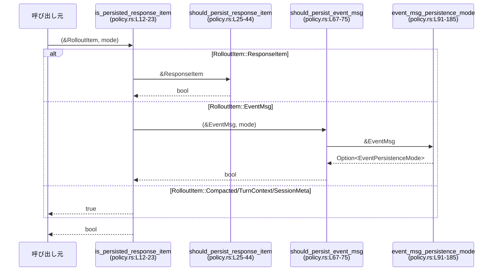

# rollout/src/policy.rs

## 0. ざっくり一言

ロールアウト（セッション履歴）に **どのレスポンス／イベントを保存するか** を決めるポリシーを集約したモジュールです（`policy.rs:L5-185`）。  
「通常保存（Limited）」と「拡張保存（Extended）」の 2 段階でイベントを分類します（`policy.rs:L5-10`）。

---

## 1. このモジュールの役割

### 1.1 概要

- ロールアウト用の `RolloutItem`（レスポンス or イベント）について、「保存する／しない」を判定する関数を提供します（`policy.rs:L12-23`）。
- Codex プロトコル側の `ResponseItem` / `EventMsg` を、保存ポリシーに従って Limited / Extended / 非保存 に振り分けます（`policy.rs:L25-65`, `L67-185`）。
- メモリ機能（長期記憶）用に、レスポンスのうちどれを「記憶として保持するか」を別ポリシーで定義します（`policy.rs:L46-65`）。

### 1.2 アーキテクチャ内での位置づけ

このモジュールは「プロトコル層の生データ」と「ロールアウトファイル／メモリストア」の間で、**フィルタリングロジック**だけを担当しています。

```mermaid
graph TD
    subgraph Protocol層
        RP["RolloutItem\n(crate::protocol)"]
        EV["EventMsg\n(crate::protocol)"]
        RI["ResponseItem\n(codex_protocol::models)"]
    end

    subgraph このモジュール (policy.rs)
        EPM["EventPersistenceMode\n(L5-10)"]
        IP["is_persisted_response_item\n(L12-23)"]
        SPR["should_persist_response_item\n(L25-44)"]
        SPRM["should_persist_response_item_for_memories\n(L46-65)"]
        SPEM["should_persist_event_msg\n(L67-75)"]
        EMPM["event_msg_persistence_mode\n(L91-185)"]
    end

    Caller["ロールアウト保存処理"] --> IP
    RP --> IP
    RI --> SPR
    EV --> SPEM
    SPEM --> EMPM
    EPM --> SPEM
    RI --> SPRM
```

- `RolloutItem` → `is_persisted_response_item` で「ロールアウトファイルに保存するか」を決定します（`policy.rs:L12-23`）。
- `ResponseItem` → `should_persist_response_item_for_memories` で「メモリ保存対象か」を判定します（`policy.rs:L46-65`）。
- `EventMsg` → `event_msg_persistence_mode` → `should_persist_event_msg` で Limited/Extended/非保存 を決定します（`policy.rs:L67-75`, `L91-185`）。

### 1.3 設計上のポイント

- **二段階の持続モード**  
  - `EventPersistenceMode::{Limited, Extended}` によって保存粒度を切り替えます（`policy.rs:L5-10`）。
  - 各 `EventMsg` を「最小限どのモードから保存されるか」で分類し、Limited / Extended の両モードで共通のロジックを共有しています（`policy.rs:L91-185`, `L77-89`）。

- **純粋関数・ステートレス**  
  - すべての関数は引数だけから真偽値を返す純粋関数であり、副作用や内部状態は持ちません（`policy.rs:L12-185`）。
  - そのため、複数スレッドから同時に呼び出しても競合状態は発生しません。

- **パターンマッチによる網羅性**  
  - `ResponseItem` や `EventMsg` の各バリアントは `match` 式で列挙されており、新しいバリアント追加時はコンパイル時に非網羅エラーで気づけます（`policy.rs:L27-43`, `L93-183`）。
  - 「保存しない」場合も `None` / `false` を返すだけで、パニックやエラーは発生しません（`policy.rs:L91-185`）。

- **メモリ用ポリシーの分離**  
  - 通常のロールアウト保存と、メモリ保存で別ポリシーを持つことで、たとえば「開発者メッセージはメモリに残さない」といった要件を表現しています（`policy.rs:L46-63`）。

---

## 2. 主要な機能一覧とコンポーネントインベントリー

### 2.1 主要機能（概要）

- ロールアウト項目ごとの保存判定: `is_persisted_response_item`（`policy.rs:L12-23`）
- `ResponseItem` のロールアウト保存判定: `should_persist_response_item`（`policy.rs:L25-44`）
- `ResponseItem` のメモリ保存判定: `should_persist_response_item_for_memories`（`policy.rs:L46-65`）
- `EventMsg` の保存判定（モード別）: `should_persist_event_msg`（`policy.rs:L67-75`）
- `EventMsg` の最小保持モード決定: `event_msg_persistence_mode`（`policy.rs:L91-185`）

### 2.2 型一覧

| 名前 | 種別 | 公開範囲 | 役割 / 用途 | 定義箇所 |
|------|------|----------|------------|----------|
| `EventPersistenceMode` | enum | `pub` | イベントをどの保存モードから保持するかを表す。`Limited` は最小限、`Extended` は詳細保存を意味します。 | `policy.rs:L5-10` |

> ※ `RolloutItem`, `EventMsg`, `ResponseItem` は外部モジュールで定義されており、このチャンクには定義がありません（`policy.rs:L1-3`）。役割は以下の通りと解釈できますが、詳細なフィールド構造は不明です。
>
> - `RolloutItem`: ロールアウトファイル内で扱う項目。レスポンス、イベント、メタ情報などのバリアントを持つ enum と推測されます（`policy.rs:L14-21`）。
> - `EventMsg`: ランタイム中に発生する各種イベントを表す enum です（`policy.rs:L1`, `L93-183`）。
> - `ResponseItem`: モデルからのレスポンスやツール呼び出しなどを表す enum です（`policy.rs:L3`, `L27-43`, `L48-63`）。

### 2.3 関数・モジュール一覧

| 名前 | 種別 | 公開範囲 | 役割 / 用途 | 定義箇所 |
|------|------|----------|------------|----------|
| `is_persisted_response_item` | 関数 | `pub` | `RolloutItem` がロールアウトファイルに保存されるべきか判定します。 | `policy.rs:L12-23` |
| `should_persist_response_item` | 関数 | `pub` | 各種 `ResponseItem` をロールアウトファイルに保存するか判定します。 | `policy.rs:L25-44` |
| `should_persist_response_item_for_memories` | 関数 | `pub` | メモリ機構向けに、どの `ResponseItem` を保存するかを判定します。 | `policy.rs:L46-65` |
| `should_persist_event_msg` | 関数 | `pub` | `EventMsg` を、指定された `EventPersistenceMode` に基づき保存すべきか判定します。 | `policy.rs:L67-75` |
| `should_persist_event_msg_limited` | 関数 | private | Limited モード用に、`EventMsg` の保存可否を判定します。内部で `event_msg_persistence_mode` を利用します。 | `policy.rs:L77-82` |
| `should_persist_event_msg_extended` | 関数 | private | Extended モード用に、`EventMsg` の保存可否を判定します。内部で `event_msg_persistence_mode` を利用します。 | `policy.rs:L84-89` |
| `event_msg_persistence_mode` | 関数 | private | 各 `EventMsg` が Limited から保存されるか、Extended から保存されるか、保存しないか（`None`）を返します。 | `policy.rs:L91-185` |
| `tests` モジュール | モジュール | `#[cfg(test)]` | イメージ生成終了・スレッド名更新イベントが Limited モードで保存対象になることを検証します。 | `policy.rs:L187-223` |

---

## 3. 公開 API と詳細解説

### 3.1 型 `EventPersistenceMode`

| 名前 | バリアント | 説明 | 定義箇所 |
|------|------------|------|----------|
| `EventPersistenceMode` | `Limited` | 最小限のロールアウト情報を保存するモード。ユーザ／エージェントのメッセージや主要な状態変化のみを保存します。 | `policy.rs:L5-9`, `L95-109` |
|  | `Extended` | 詳細な実行トレース（ツール呼び出し終了など）も含めて保存するモード。Limited の superset として扱われます。 | `policy.rs:L5-9`, `L120-133` |

Rust の `enum` であり、`Debug`, `Clone`, `Copy`, `Default`, `PartialEq`, `Eq` を実装しています（`policy.rs:L5`）。`Default` は `Limited` になります（`policy.rs:L7-8`）。

---

### 3.2 関数詳細

#### `is_persisted_response_item(item: &RolloutItem, mode: EventPersistenceMode) -> bool`

**概要**

ロールアウト項目 `item` が、指定された保存モード `mode` においてロールアウトファイルへ保存されるべきかどうかを判定します（`policy.rs:L12-23`）。

**引数**

| 引数名 | 型 | 説明 |
|--------|----|------|
| `item` | `&RolloutItem` | 保存対象か判定したいロールアウト項目。`ResponseItem` / `EventMsg` / メタ情報などのバリアントを持つ enum（定義はこのチャンク外）です（`policy.rs:L14-21`）。 |
| `mode` | `EventPersistenceMode` | 現在の保存モード。Limited / Extended。`EventMsg` の保存判定に影響します（`policy.rs:L14-18`）。 |

**戻り値**

- `bool`: `true` の場合はロールアウトファイルに保存すべき、`false` の場合はスキップすべきであることを表します（`policy.rs:L14-21`）。

**内部処理の流れ**

`policy.rs:L14-21` に基づく処理:

1. `match item` で `RolloutItem` のバリアントを判別します（`policy.rs:L15-21`）。
2. `RolloutItem::ResponseItem(item)` の場合  
   → `should_persist_response_item(item)` を呼び、`ResponseItem` 用のポリシーに従って判定します（`policy.rs:L16`, `L25-44`）。
3. `RolloutItem::EventMsg(ev)` の場合  
   → `should_persist_event_msg(ev, mode)` を呼び、`EventPersistenceMode` を考慮したイベント保存ポリシーを適用します（`policy.rs:L17`, `L67-75`）。
4. `RolloutItem::Compacted(_)` / `TurnContext(_)` / `SessionMeta(_)` の場合  
   → 常に `true` を返し、必ずロールアウトに保存します（`policy.rs:L18-21`）。

**Examples（使用例・概念的）**

```rust
use crate::policy::{is_persisted_response_item, EventPersistenceMode};
use crate::protocol::RolloutItem;

// ResponseItem を含むロールアウト項目（フィールド構造はこのチャンクからは不明）
let rollout_item = RolloutItem::ResponseItem(/* ResponseItem 値 */);

let should_save = is_persisted_response_item(&rollout_item, EventPersistenceMode::Limited);

if should_save {
    // ロールアウトファイルに書き出す
}
```

> `RolloutItem` / `ResponseItem` の具体的な構築方法は、このファイルには定義がないため不明です。

**Errors / Panics**

- 関数内ではパニックを発生させるような操作（`unwrap`、添字アクセスなど）は行っていません（`policy.rs:L14-21`）。
- 返り値は常に `true` / `false` であり、`Result` などのエラー型は利用していません。

**Edge cases（エッジケース）**

- `RolloutItem::Compacted(_)` / `TurnContext(_)` / `SessionMeta(_)` は、`mode` に関わらず常に保存されます（`policy.rs:L18-21`）。  
  → 「ロールアウト圧縮」や「ターンコンテキスト」「セッションメタ情報」などのマーカーは解析上常に必要である、という前提が読み取れます（コメント参照: `policy.rs:L18-19`）。
- `RolloutItem` に新しいバリアントが追加された場合、`match` の網羅性が崩れるためコンパイルエラーになります。未対応のバリアントが黙って落ちることはありません（`policy.rs:L15-21`）。

**使用上の注意点**

- `mode` に `Extended` を渡した場合、`EventMsg` は Limited より多く保存されますが、`ResponseItem` やメタ情報の扱いは変わりません（`policy.rs:L16-20`, `L70-74`）。
- 「ファイル保存」と「メモリ保存」は別ポリシーで管理されているため、メモリ用には `should_persist_response_item_for_memories` を利用する必要があります（`policy.rs:L46-65`）。

---

#### `should_persist_response_item(item: &ResponseItem) -> bool`

**概要**

Codex プロトコルの `ResponseItem` が、ロールアウトファイルに保存されるべきかどうかを判定します（`policy.rs:L25-44`）。  
レスポンス履歴の再現に必要なものは保存し、それ以外の汎用的な `Other` は保存しません。

**引数**

| 引数名 | 型 | 説明 |
|--------|----|------|
| `item` | `&ResponseItem` | 対象となるレスポンス項目。Codex プロトコルで定義された enum です（`policy.rs:L27-43`）。 |

**戻り値**

- `bool`: `true` の場合はロールアウトファイルへ保存、`false` の場合は保存しません（`policy.rs:L41-43`）。

**内部処理の流れ**

`policy.rs:L27-43` に基づく処理:

1. `match item` で `ResponseItem` のバリアントに応じて分岐します。
2. 以下のバリアントはすべて `true`（保存対象）です（`policy.rs:L29-41`）:
   - `Message { .. }`
   - `Reasoning { .. }`
   - `LocalShellCall { .. }`
   - `FunctionCall { .. }`
   - `ToolSearchCall { .. }`
   - `FunctionCallOutput { .. }`
   - `ToolSearchOutput { .. }`
   - `CustomToolCall { .. }`
   - `CustomToolCallOutput { .. }`
   - `WebSearchCall { .. }`
   - `ImageGenerationCall { .. }`
   - `GhostSnapshot { .. }`
   - `Compaction { .. }`
3. `ResponseItem::Other` のみ `false` を返します（`policy.rs:L42`）。

**Examples（使用例・概念的）**

```rust
use codex_protocol::models::ResponseItem;
use crate::policy::should_persist_response_item;

// 非保存例: Other は保存しない
let other = ResponseItem::Other;
assert_eq!(should_persist_response_item(&other), false);

// 保存例（概念的）: 実際のフィールドはこのチャンクにはないため省略
let msg = ResponseItem::Message { /* フィールドは実装に依存 */ };
let _ = should_persist_response_item(&msg); // true になることが期待される
```

**Errors / Panics**

- パニックを起こすような操作はありません（`policy.rs:L27-43`）。
- 全バリアントを網羅した `match` であり、未定義の分岐には到達しません。

**Edge cases**

- `ResponseItem::Other` は常に非保存（`false`）です（`policy.rs:L42`）。  
  → レスポンス履歴の再現に不要な情報をまとめて `Other` に入れている場合、それらはロールアウトに残りません。
- 新しく `ResponseItem` のバリアントが追加された場合、`match` が非網羅となりコンパイルエラーになります。  
  → 新バリアントの保存方針を明示的に決める必要があります。

**使用上の注意点**

- この関数はロールアウトファイル（完全履歴）向けであり、メモリ機構（長期記憶）向けのポリシーは別関数で管理されています（`policy.rs:L46-65`）。
- ほぼすべての実質的なレスポンスが `true` になる設計のため、容量削減が必要な場合は、この関数のロジックを変更するか、呼び出し側で追加フィルタを設ける必要があります。

---

#### `should_persist_response_item_for_memories(item: &ResponseItem) -> bool`

**概要**

メモリ機構（ユーザとの対話履歴などを長期保存）のために、`ResponseItem` を保存するかどうかを判定します（`policy.rs:L46-65`）。  
ロールアウト保存よりも絞り込まれたポリシーになっています。

**引数**

| 引数名 | 型 | 説明 |
|--------|----|------|
| `item` | `&ResponseItem` | メモリへの保存候補となるレスポンス項目です（`policy.rs:L48-63`）。 |

**戻り値**

- `bool`: メモリへ保存すべきなら `true`、そうでなければ `false`（`policy.rs:L48-63`）。

**内部処理の流れ**

`policy.rs:L48-63` に基づく処理:

1. `ResponseItem::Message { role, .. }` の場合  
   → `role != "developer"` なら `true`、`"developer"` なら `false`（`policy.rs:L50`）。  
   → 開発者向けメッセージはメモリに残さないポリシーです。
2. 以下のバリアントは `true`（メモリ保存対象）（`policy.rs:L51-58`）:
   - `LocalShellCall { .. }`
   - `FunctionCall { .. }`
   - `ToolSearchCall { .. }`
   - `FunctionCallOutput { .. }`
   - `ToolSearchOutput { .. }`
   - `CustomToolCall { .. }`
   - `CustomToolCallOutput { .. }`
   - `WebSearchCall { .. }`
3. 以下のバリアントは `false`（メモリ保存対象外）（`policy.rs:L59-63`）:
   - `Reasoning { .. }`
   - `ImageGenerationCall { .. }`
   - `GhostSnapshot { .. }`
   - `Compaction { .. }`
   - `Other`

**Examples（使用例・概念的）**

```rust
use codex_protocol::models::ResponseItem;
use crate::policy::should_persist_response_item_for_memories;

// developer ロールのメッセージはメモリ保存しない
let dev_msg = ResponseItem::Message { role: "developer".into(), /* 他のフィールドは省略 */ };
assert_eq!(
    should_persist_response_item_for_memories(&dev_msg),
    false
);

// ツール呼び出しはメモリ保存対象（フィールド構造は省略）
let tool_call = ResponseItem::FunctionCall { /* フィールドは実装に依存 */ };
let _ = should_persist_response_item_for_memories(&tool_call); // true になることが期待される
```

> `Message` / `FunctionCall` の実際のフィールド名や型は、このチャンクからは分かりません。上記は概念的な例です。

**Errors / Panics**

- 文字列比較（`role != "developer"`）のみであり、パニックを起こすような操作はありません（`policy.rs:L50`）。

**Edge cases**

- `role` が `"developer"` 以外（たとえば `"system"` や `"assistant"`）であれば保存されます（`policy.rs:L50`）。  
  → ロールの表記ゆれ（大小文字、別名）があると意図しない保存／非保存になる可能性があります。
- 理解用の中間表現とみられる `Reasoning` や `GhostSnapshot` はメモリ保存対象外です（`policy.rs:L59-62`）。

**使用上の注意点**

- 「メモリに何を残すか」という契約は、この関数のロジックに依存するため、  
  - 新しい `ResponseItem` バリアントを追加したとき  
  - ロールの文字列仕様を変えるとき  
 には、この関数の見直しが必須です（`policy.rs:L48-63`）。
- メモリとロールアウトファイルでポリシーが異なるため、両者を混同しないよう、用途に応じて関数を選択する必要があります。

---

#### `should_persist_event_msg(ev: &EventMsg, mode: EventPersistenceMode) -> bool`

**概要**

イベントメッセージ `EventMsg` が、指定された保存モード `mode` でロールアウトに保存されるべきかどうかを判定します（`policy.rs:L67-75`）。  
内部的には `event_msg_persistence_mode` に定義された最小モードと `mode` を比較しています。

**引数**

| 引数名 | 型 | 説明 |
|--------|----|------|
| `ev` | `&EventMsg` | 対象のイベント。ユーザメッセージからツール実行イベントまで多くのバリアントを持つ enum です（`policy.rs:L93-183`）。 |
| `mode` | `EventPersistenceMode` | 現在の保存モード。Limited または Extended（`policy.rs:L70-74`）。 |

**戻り値**

- `bool`: `true` なら保存対象、`false` ならスキップ（`policy.rs:L70-74`）。

**内部処理の流れ**

`policy.rs:L70-74` に基づく処理:

1. `match mode` により、モードに応じた関数を呼び分けます（`policy.rs:L71-73`）:
   - `EventPersistenceMode::Limited`  
     → `should_persist_event_msg_limited(ev)`
   - `EventPersistenceMode::Extended`  
     → `should_persist_event_msg_extended(ev)`
2. `should_persist_event_msg_limited` は、`event_msg_persistence_mode(ev)` が `Some(Limited)` のときのみ `true` を返します（`policy.rs:L77-82`）。
3. `should_persist_event_msg_extended` は、`Some(Limited)` または `Some(Extended)` のとき `true` を返します（`policy.rs:L84-89`）。
   - つまり Extended モードでは Limited 対象もすべて保存されます。

**Examples（使用例）**

テストコードをもとにした例です（`policy.rs:L196-223`）。

```rust
use codex_protocol::protocol::{EventMsg, ImageGenerationEndEvent, ThreadNameUpdatedEvent};
use codex_protocol::ThreadId;
use crate::policy::{should_persist_event_msg, EventPersistenceMode};

// ImageGenerationEnd は Limited モードでも保存対象
let img_event = EventMsg::ImageGenerationEnd(ImageGenerationEndEvent {
    call_id: "ig_123".into(),
    status: "completed".into(),
    revised_prompt: Some("final prompt".into()),
    result: "Zm9v".into(),
    saved_path: None,
});
assert!(should_persist_event_msg(&img_event, EventPersistenceMode::Limited));

// ThreadNameUpdated も Limited モードで保存対象
let name_event = EventMsg::ThreadNameUpdated(ThreadNameUpdatedEvent {
    thread_id: ThreadId::new(),
    thread_name: Some("saved-session".to_string()),
});
assert!(should_persist_event_msg(&name_event, EventPersistenceMode::Limited));
```

**Errors / Panics**

- `event_msg_persistence_mode` は `Option` を返し、`matches!` マクロでパターンマッチしているだけなので、パニックしません（`policy.rs:L77-82`, `L84-89`, `L93-185`）。

**Edge cases**

- `event_msg_persistence_mode(ev)` が `None` のイベントは、Limited/Extended いずれのモードでも `false`（非保存）になります（`policy.rs:L77-82`, `L84-89`）。
- Limited モードと Extended モードの違いは、「Extended のみ保存」のイベント群（WebSearchEnd, ExecCommandEnd など）が含まれるかどうかです（`policy.rs:L120-133`）。

**使用上の注意点**

- 呼び出し側がモードを切り替えることで、ロールアウトファイルのサイズや詳細度を制御できます。
- 新しい `EventMsg` バリアントを追加する場合は、必ず `event_msg_persistence_mode` を更新する必要があります（`policy.rs:L93-183`）。

---

#### `event_msg_persistence_mode(ev: &EventMsg) -> Option<EventPersistenceMode>`

**概要**

各 `EventMsg` バリアントについて、「どのモードから保存を開始するか」を表す最小の `EventPersistenceMode` を返します（`policy.rs:L91-185`）。  
`None` の場合は「どのモードでも保存しない」ことを意味します。

**引数**

| 引数名 | 型 | 説明 |
|--------|----|------|
| `ev` | `&EventMsg` | 対象イベント（`policy.rs:L93-183`）。 |

**戻り値**

- `Option<EventPersistenceMode>`:
  - `Some(EventPersistenceMode::Limited)`  
    → Limited / Extended 両方のモードで保存されます。
  - `Some(EventPersistenceMode::Extended)`  
    → Extended モードでのみ保存されます。
  - `None`  
    → いかなるモードでも保存しません。

**内部処理の流れ**

`policy.rs:L93-183` で `match ev` により、バリアントごとに値を返します。

1. **Limited から保存されるイベント**（`Some(Limited)`）（`policy.rs:L95-109`）
   - `UserMessage(_)`
   - `AgentMessage(_)`
   - `AgentReasoning(_)`
   - `AgentReasoningRawContent(_)`
   - `TokenCount(_)`
   - `ThreadNameUpdated(_)`
   - `ContextCompacted(_)`
   - `EnteredReviewMode(_)`
   - `ExitedReviewMode(_)`
   - `ThreadRolledBack(_)`
   - `UndoCompleted(_)`
   - `TurnAborted(_)`
   - `TurnStarted(_)`
   - `TurnComplete(_)`
   - `ImageGenerationEnd(_)`
2. **ItemCompleted（Plan のみ Limited）**（`policy.rs:L110-119`）
   - `EventMsg::ItemCompleted(event)` の場合  
     - `event.item` が `codex_protocol::items::TurnItem::Plan(_)` なら `Some(Limited)`（`policy.rs:L114-115`）。
     - それ以外の `item` なら `None`（非保存）（`policy.rs:L116-118`）。
3. **Extended から保存されるイベント**（`Some(Extended)`）（`policy.rs:L120-133`）
   - `Error(_)`
   - `GuardianAssessment(_)`
   - `WebSearchEnd(_)`
   - `ExecCommandEnd(_)`
   - `PatchApplyEnd(_)`
   - `McpToolCallEnd(_)`
   - `ViewImageToolCall(_)`
   - `CollabAgentSpawnEnd(_)`
   - `CollabAgentInteractionEnd(_)`
   - `CollabWaitingEnd(_)`
   - `CollabCloseEnd(_)`
   - `CollabResumeEnd(_)`
   - `DynamicToolCallRequest(_)`
   - `DynamicToolCallResponse(_)`
4. **保存しないイベント**（`None`）（`policy.rs:L134-183`）
   - `Warning(_)`
   - リアルタイム会話の開始/SDP/ストリーム/終了 (`RealtimeConversation*`)
   - `ModelReroute(_)`
   - 各種 Delta・RawContentDelta 系イベント (`AgentMessageDelta`, `AgentReasoningDelta`, ほか多く)
   - `RawResponseItem(_)`
   - セッション設定・MCPツール開始・Web検索開始・コマンド開始などの多数のイベント
   - `ShutdownComplete`
   - `DeprecationNotice(_)`
   - `ItemStarted(_)`, `HookStarted(_)`, `HookCompleted(_)`
   - `SkillsUpdateAvailable`
   - コラボレーション・イメージ生成開始などの begin/started 系イベント

**Examples（使用例・概念的）**

```rust
use crate::policy::{event_msg_persistence_mode, EventPersistenceMode};
use crate::protocol::EventMsg;

fn is_at_least_limited(ev: &EventMsg) -> bool {
    matches!(
        event_msg_persistence_mode(ev),
        Some(EventPersistenceMode::Limited) | Some(EventPersistenceMode::Extended)
    )
}
```

**Errors / Panics**

- 全バリアントを網羅的に列挙しているため、`match` から漏れたバリアントは存在しません（`policy.rs:L95-183`）。
- `Option` を返すだけで、`unwrap` などは使用していません（`policy.rs:L93-185`）。

**Edge cases**

- `ItemCompleted` については、Plan の完了のみを保存し、他種の完了イベントは保存しません（`policy.rs:L110-119`）。  
  コメントから、「Plan はストリーミングタグから導出されるため、ライフサイクル全体ではなく完了のみ保存する」という意図が読み取れます（`policy.rs:L111-113`）。
- `ShutdownComplete` や `StreamError` など、一見重要そうなイベントも `None`（非保存）となっています（`policy.rs:L156-168`）。  
  → ロールアウトの再生に不要と判断されていると解釈できますが、詳細な理由はこのチャンクからは分かりません。

**使用上の注意点**

- 新しい `EventMsg` バリアントが追加された場合、ここに追加しないとコンパイルエラーになります。  
  → 逆に言えば、ポリシー漏れが静的に検出されます（`policy.rs:L93-183`）。
- Limited / Extended モードの意味や、どのイベントをどのモードで保存するかは、ここが唯一のソースです。  
  → 他の場所に重複ロジックを作ると不整合の原因になります。

---

### 3.3 その他の関数

| 関数名 | 役割（1 行） | 定義箇所 |
|--------|--------------|----------|
| `should_persist_event_msg_limited(ev: &EventMsg) -> bool` | `event_msg_persistence_mode` が `Some(Limited)` のイベントのみを保存対象とする Limited モード用のヘルパーです。 | `policy.rs:L77-82` |
| `should_persist_event_msg_extended(ev: &EventMsg) -> bool` | `event_msg_persistence_mode` が `Some(Limited)` または `Some(Extended)` のイベントを保存対象とする Extended モード用のヘルパーです。 | `policy.rs:L84-89` |

---

## 4. データフロー

### 4.1 RolloutItem の保存判定フロー

ロールアウト保存処理から見たときのフローは次のようになります。



- 呼び出し元は `RolloutItem` と `EventPersistenceMode` を渡し、保存すべきかどうかの真偽値を受け取ります（`policy.rs:L12-23`）。
- `ResponseItem` の場合はレスポンス用ポリシー（`should_persist_response_item`）だけに従います（`policy.rs:L16`）。
- `EventMsg` の場合は `EventPersistenceMode` を踏まえて `event_msg_persistence_mode` によるモード判定を行います（`policy.rs:L17`, `L70-74`, `L93-185`）。
- 圧縮・コンテキスト・セッションメタ情報は常に保存されます（`policy.rs:L18-21`）。

---

## 5. 使い方（How to Use）

### 5.1 基本的な使用方法

ロールアウトファイルに書き込む前に、このモジュールの関数でフィルタリングするパターンが想定されます。

```rust
use crate::policy::{is_persisted_response_item, EventPersistenceMode};
use crate::protocol::RolloutItem;

// 保存モードを決定（外部の設定などに応じて）
let mode = EventPersistenceMode::Limited; // または Extended

fn write_rollout_item(item: RolloutItem, mode: EventPersistenceMode) {
    if is_persisted_response_item(&item, mode) {
        // ここでロールアウトファイルに item を保存する
        // 実際の I/O 処理はこのモジュールの外で行う
    }
}
```

### 5.2 メモリ保存との組み合わせ

メモリ機構用に `ResponseItem` を別途フィルタリングする場合:

```rust
use crate::policy::should_persist_response_item_for_memories;
use codex_protocol::models::ResponseItem;

fn maybe_store_in_memory(item: &ResponseItem) {
    if should_persist_response_item_for_memories(item) {
        // メモリストアに書き込む
    }
}
```

- ロールアウト保存とメモリ保存で別々の関数を利用する点が重要です（`policy.rs:L25-65`）。

### 5.3 よくある誤用パターン

```rust
use crate::policy::should_persist_response_item_for_memories;
use codex_protocol::models::ResponseItem;

// 誤り例: ロールアウト保存にメモリ用関数を使っている
fn write_rollout(item: &ResponseItem) {
    if should_persist_response_item_for_memories(item) {
        // ロールアウトファイルに保存
    }
}

// 正しい例: ロールアウト保存には should_persist_response_item を使う
use crate::policy::should_persist_response_item;

fn write_rollout_correct(item: &ResponseItem) {
    if should_persist_response_item(item) {
        // ロールアウトファイルに保存
    }
}
```

- メモリ用ポリシーはロールアウト用より厳しいため、誤用するとロールアウトに必要な情報が欠落します（`policy.rs:L25-44`, `L46-65`）。

### 5.4 使用上の注意点（まとめ）

- **スレッド安全性**  
  - すべての関数は引数のみを読み取り、共有状態を持たないため、スレッド間で安全に共有して呼び出せます（`policy.rs:L12-185`）。
- **保存モードの契約**  
  - `EventPersistenceMode::Extended` は Limited の superset であるように実装されています（`policy.rs:L77-89`）。  
    ロジック変更時もこの関係を維持するかどうかを明確にする必要があります。
- **文字列ロール依存**  
  - メモリ保存ポリシーは `role != "developer"` という生文字列に依存しています（`policy.rs:L50`）。  
    ロール名の変更や表記ゆれがあると、意図しない保存／非保存になる可能性があります。
- **容量とパフォーマンス**  
  - Extended モードではより多くのイベントが保存されるため、ロールアウトファイルが大きくなり、読み書きコストが増加しうる点に注意が必要です（`policy.rs:L120-133`）。

---

## 6. 変更の仕方（How to Modify）

### 6.1 新しい機能（イベント／レスポンス種類）を追加する場合

1. **プロトコル側にバリアント追加**  
   - `ResponseItem` や `EventMsg` に新しいバリアントを追加すると、このファイルの `match` が非網羅になりコンパイルエラーになります（`policy.rs:L27-43`, `L93-183`）。
2. **ロールアウト保存ポリシーの更新**  
   - `ResponseItem` の新バリアントの場合  
     - `should_persist_response_item` に追加し、保存するかどうかを決めます（`policy.rs:L27-43`）。
     - メモリ保存対象とするかどうかは `should_persist_response_item_for_memories` で決めます（`policy.rs:L48-63`）。
   - `EventMsg` の新バリアントの場合  
     - `event_msg_persistence_mode` に新しい分岐を追加し、`Some(Limited)` / `Some(Extended)` / `None` のいずれかを選びます（`policy.rs:L93-183`）。
3. **テスト追加**  
   - 新バリアントが意図したモードで保存されるかを、既存テストにならって検証します（`policy.rs:L196-223`）。

### 6.2 既存の機能を変更する場合

- **影響範囲の確認**
  - `EventPersistenceMode` の意味を変える場合、`should_persist_event_msg_*` と `event_msg_persistence_mode` の両方が影響を受けます（`policy.rs:L5-10`, `L70-89`, `L93-185`）。
  - `ResponseItem` / `EventMsg` の保存方針は、ロールアウト再生・ログ解析・メモリ機構に影響するため、関連コンポーネントの仕様も確認が必要です（このチャンクにはそのコードはありません）。

- **契約（前提条件）の維持**
  - Extended が Limited の superset であるという暗黙の契約を変更する場合は、呼び出し側の期待と齟齬がないか検討する必要があります（`policy.rs:L77-89`）。
  - 「開発者メッセージはメモリに残さない」というポリシーを変更すると、メモリからの復元時の挙動が変わる可能性があります（`policy.rs:L50`）。

- **テスト・使用箇所の再確認**
  - 既存テスト（ImageGenerationEnd, ThreadNameUpdated）に加え、新たに変更したバリアントに対するテストを追加することが推奨されます（`policy.rs:L196-223`）。

---

## 7. 関連ファイル

このモジュールと密接に関係する型・モジュールは以下の通りです。

| パス / シンボル | 役割 / 関係 | 根拠 |
|----------------|------------|------|
| `crate::protocol::RolloutItem` | ロールアウトファイルに記録される項目を表す enum。`is_persisted_response_item` の入力となります。 | `policy.rs:L2`, `L14-21` |
| `crate::protocol::EventMsg` | 実行時イベントを表す enum。`should_persist_event_msg` や `event_msg_persistence_mode` の対象です。 | `policy.rs:L1`, `L70-75`, `L93-183` |
| `codex_protocol::models::ResponseItem` | モデル応答・ツール呼び出しなどのレスポンスを表す enum。レスポンス保存・メモリ保存ポリシーの対象です。 | `policy.rs:L3`, `L27-43`, `L48-63` |
| `codex_protocol::protocol::EventMsg` | テストコードで使用されている EventMsg 型。`crate::protocol::EventMsg` との関係（再エクスポートかどうか）はこのチャンクからは不明です。 | `policy.rs:L192` |
| `codex_protocol::protocol::ImageGenerationEndEvent` | `EventMsg::ImageGenerationEnd` 用のイベントペイロード型。Limited モードで保存されることをテストしています。 | `policy.rs:L193`, `L198-204` |
| `codex_protocol::protocol::ThreadNameUpdatedEvent` | `EventMsg::ThreadNameUpdated` 用のイベントペイロード型。スレッド名更新イベントの保存をテストしています。 | `policy.rs:L194`, `L214-217` |
| `codex_protocol::ThreadId` | スレッド ID を表す型。テストで `ThreadNameUpdatedEvent` の構築に使用されています。 | `policy.rs:L191`, `L215` |

---

### Bugs / Security に関する補足（このチャンクから読み取れる範囲）

- **バグの可能性**
  - パターンマッチはすべて網羅的であり、未定義バリアントが黙って落ちるような状態ではありません（`policy.rs:L27-43`, `L93-183`）。
  - ロジック上の誤りがあるかどうか（どのイベントを保存すべきか）は仕様次第であり、このチャンク単体からは判断できません。

- **セキュリティ上の観点**
  - メモリ保存から `developer` ロールのメッセージが除外されていますが、その意図（機密情報保護など）はコードからは明示されていません（`policy.rs:L50`）。
  - 保存対象になったイベント／レスポンスはロールアウトファイル等に長期保存されると想定されるため、その保存先のアクセス制御や暗号化などは、このモジュールの外側で適切に行う必要があります（このチャンクには保存処理はありません）。

以上が `rollout/src/policy.rs` の解説です。
