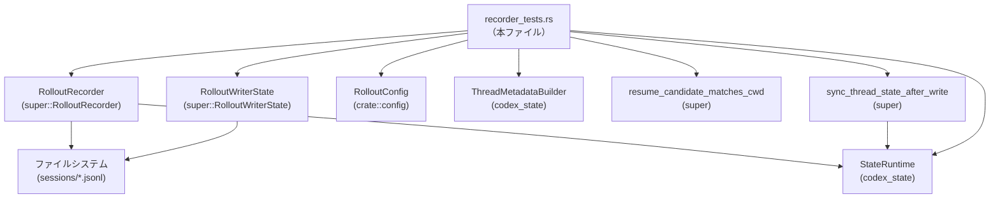
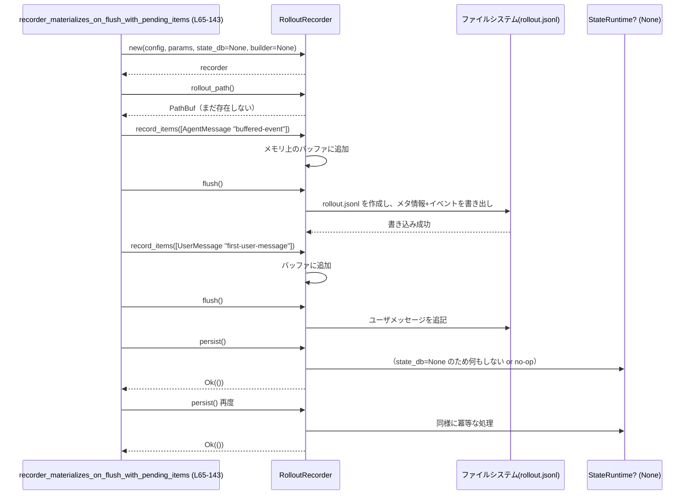

# rollout/src/recorder_tests.rs コード解説

## 0. ざっくり一言

このファイルは、会話セッションのロールアウトログを扱う **`RolloutRecorder` / `RolloutWriterState` / スレッド状態DB まわりの振る舞いを検証する非同期テスト群**です（`#[tokio::test]` を多数定義）。主にファイルシステム障害、再試行ロジック、メタデータ更新、スレッド一覧取得、再開候補判定などの契約をテストしています（`recorder_tests.rs:L65-571`）。

---

## 1. このモジュールの役割

### 1.1 概要

このテストモジュールは、次のような問題を検証するために存在します。

- セッションログ（JSONL ロールアウトファイル）の **生成タイミング・順序・永続化の契約**  
- 一時的なファイルシステムエラー後の **再試行とバッファ保持**  
- スレッドメタデータDB（`StateRuntime`）との連携における **`updated_at` 更新やパス整合性の保証**  
- スレッド一覧取得（`list_threads`）時の **ページング／DB有無／パス修復** の挙動  
- ログを読み直して **CWD が現在の環境と一致する「再開候補」かどうか** を判定するロジック  

これにより、実際の CLI/エージェント実行時にセッション履歴が安全かつ一貫した形で扱われることを保証しようとしています。

### 1.2 アーキテクチャ内での位置づけ

このファイル自体はテストモジュールですが、テスト対象コンポーネントとの関係は概ね次のようになります。



- `use super::*;` により、`RolloutRecorder`, `RolloutWriterState`, `RolloutItem`, `RolloutLine`, `ThreadId`, `ThreadSortKey` などがインポートされています（`recorder_tests.rs:L3`）。
- 設定は `crate::config::RolloutConfig` を通じて渡されます（`recorder_tests.rs:L4, L23-31`）。
- スレッドメタデータDBは `StateRuntime`（`super::*` 経由および `codex_state::StateRuntime`）として利用されています（`recorder_tests.rs:L240-246, L412-419, L474-481`）。
- 実ファイルは JSON Lines (`*.jsonl`) として `sessions/YYYY/MM/DD/rollout-....jsonl` の形で作成されます（`recorder_tests.rs:L33-37, L406-410, L468-472`）。
- `resume_candidate_matches_cwd` は既存のロールアウトファイルを読み直して再開候補かどうかを判定します（`recorder_tests.rs:L561-569`）。

### 1.3 設計上のポイント（テストから読み取れる範囲）

- **副作用の分離**
  - 各テストは `tempfile::TempDir` で専用のディレクトリを用意し、他テストとファイルシステムが干渉しないようにしています（`recorder_tests.rs:L67, L147, L202, L237, L318, L362, L403, L464, L528`）。
- **非同期 I/O とエラーハンドリング**
  - ほぼ全てのテスト関数が `async fn` + `#[tokio::test]` となっており、`RolloutRecorder` や `StateRuntime` の非同期 API を `await` しています（`recorder_tests.rs:L65, L145, L200, L235, L315, L360, L401, L462, L526`）。
  - I/O エラーが期待通りに報告／再試行されるかを `expect_err` や `assert_ne!(err.kind(), ...)` で明示的に検証しています（`recorder_tests.rs:L178-183`）。
- **契約駆動のテスト**
  - `persist()` が **冪等** であること（2回呼んでも内容が変わらない）を検証（`recorder_tests.rs:L118-120, L138-139`）。
  - DB バックフィル完了後に、実在しない/パスが古いロールアウトファイルへの参照が **ドロップまたは修復** されることを検証（`recorder_tests.rs:L441-459, L503-522`）。
  - 「メタデータに影響しないイベント」が `updated_at` のみを更新し、`title` / `first_user_message` を変えない契約を検証（`recorder_tests.rs:L276-283, L298-309`）。
- **ページング／再開機能など「エッジ」機能のテスト**
  - ページングされたスレッド一覧で要素がスキップされないこと（`recorder_tests.rs:L370-398`）。
  - `resume_candidate_matches_cwd` が、ログ中の最新 `TurnContext` を用いて CWD 一致を判定すること（`recorder_tests.rs:L536-559, L561-569`）。

---

## 2. 主要な機能一覧

このモジュール内の主な機能（＝テストケースとヘルパー）は次の通りです。

- テスト用設定生成: `test_config` – `RolloutConfig` の簡易な初期化（`recorder_tests.rs:L23-31`）
- テスト用セッションファイル生成: `write_session_file` – JSONL 形式のロールアウトファイルを作成（`recorder_tests.rs:L33-63`）
- ロールアウトのマテリアライズタイミング: `recorder_materializes_on_flush_with_pending_items` – バッファにアイテムがある状態での `flush` と `persist` の契約を検証（`recorder_tests.rs:L65-143`）
- 永続化時のファイルシステムエラー処理: `persist_reports_filesystem_error_and_retries_buffered_items` – `persist` 失敗後の再試行とバッファ保持を検証（`recorder_tests.rs:L145-198`）
- ライタ状態の再試行ロジック: `writer_state_retries_write_error_before_reporting_flush_success` – 書き込みエラー発生後にファイルを開き直してから `flush` 成功とすることを検証（`recorder_tests.rs:L200-233`）
- スレッドメタデータの `updated_at` 更新: `metadata_irrelevant_events_touch_state_db_updated_at` – メタデータ非依存イベントでも `updated_at` が更新される契約を検証（`recorder_tests.rs:L235-313`）
- メタデータ同期のフォールバック: `metadata_irrelevant_events_fall_back_to_upsert_when_thread_missing` – スレッドがDBに存在しない場合の upsert フォールバックを検証（`recorder_tests.rs:L315-358`）
- DB 無効時のスレッド一覧ページング: `list_threads_db_disabled_does_not_skip_paginated_items` – ページングでアイテムを取りこぼさないことを検証（`recorder_tests.rs:L360-399`）
- DB 有効時の欠損パス処理: `list_threads_db_enabled_drops_missing_rollout_paths` – 存在しないロールアウトパスを一覧から除外し、DB側も修正することを検証（`recorder_tests.rs:L401-460`）
- DB 有効時の古いパス修復: `list_threads_db_enabled_repairs_stale_rollout_paths` – 古いパスを実在するパスに自動修復することを検証（`recorder_tests.rs:L462-523`）
- 再開候補の CWD 判定: `resume_candidate_matches_cwd_reads_latest_turn_context` – 最新の `TurnContext` を見て CWD 一致判定することを検証（`recorder_tests.rs:L526-571`）

### 2.1 関数・テストのインベントリー

| 名前 | 種別 | 行範囲 | 役割 |
|------|------|--------|------|
| `test_config` | ヘルパー関数 | `recorder_tests.rs:L23-31` | 一時ディレクトリをベースに `RolloutConfig` を構築する |
| `write_session_file` | ヘルパー関数 | `recorder_tests.rs:L33-63` | 単一セッションの JSONL ロールアウトファイルを作成する |
| `recorder_materializes_on_flush_with_pending_items` | `#[tokio::test]` | `recorder_tests.rs:L65-143` | `flush` によりロールアウトファイルが初めて生成されることと、`persist` の冪等性を検証する |
| `persist_reports_filesystem_error_and_retries_buffered_items` | `#[tokio::test]` | `recorder_tests.rs:L145-198` | セッションディレクトリ作成エラー時の `persist` の失敗と、その後の `flush` による再試行を検証する |
| `writer_state_retries_write_error_before_reporting_flush_success` | `#[tokio::test]` | `recorder_tests.rs:L200-233` | 読み取り専用ファイルを渡した場合でも `flush` がエラーを検知し、開き直してから書き込みに成功することを検証する |
| `metadata_irrelevant_events_touch_state_db_updated_at` | `#[tokio::test]` | `recorder_tests.rs:L235-313` | エージェントメッセージなどメタデータに影響しないイベントで `updated_at` のみが更新されることを検証する |
| `metadata_irrelevant_events_fall_back_to_upsert_when_thread_missing` | `#[tokio::test]` | `recorder_tests.rs:L315-358` | スレッドが DB に無い場合に `sync_thread_state_after_write` が upsert でスレッドを作成することを検証する |
| `list_threads_db_disabled_does_not_skip_paginated_items` | `#[tokio::test]` | `recorder_tests.rs:L360-399` | DB 無効状態での `list_threads` ページングがアイテムをスキップしないことを検証する |
| `list_threads_db_enabled_drops_missing_rollout_paths` | `#[tokio::test]` | `recorder_tests.rs:L401-460` | 実在しないロールアウトパスを持つスレッドが一覧から除外され、DB側のパスもクリアされることを検証する |
| `list_threads_db_enabled_repairs_stale_rollout_paths` | `#[tokio::test]` | `recorder_tests.rs:L462-523` | 古いロールアウトパスが存在する場合に、実際のファイルパスへ修復されることを検証する |
| `resume_candidate_matches_cwd_reads_latest_turn_context` | `#[tokio::test]` | `recorder_tests.rs:L526-571` | ログ末尾の `TurnContext` を用いて CWD が現在と一致するか判定する `resume_candidate_matches_cwd` の挙動を検証する |

### 2.2 主な外部コンポーネント（このファイルでの使用）

| 名前 | 種別 | 使用行範囲 | 役割 / このファイルでの使われ方 |
|------|------|------------|--------------------------------|
| `RolloutConfig` | 構造体 | `recorder_tests.rs:L4, L23-31, L68, L148, L203, L238-239, L319-320, L363-364, L404-405, L465-466` | ロールアウト録画のための設定。`codex_home` / `sqlite_home` / `cwd` / `model_provider_id` / `generate_memories` を保持 |
| `RolloutRecorder` | 構造体 | `recorder_tests.rs:L70-83, L85-143, L150-163, L166-197, L249-263, L264-275, L287-297, L370-398, L442-452, L504-514` | セッションイベントの記録・ログファイル作成・スレッド一覧取得などを行うメインコンポーネント |
| `RolloutWriterState` | 構造体 | `recorder_tests.rs:L207-224, L226-231` | ロールアウトファイルへの書き込み状態（オープン中ファイルとバッファなど）を管理する低レベルコンポーネント |
| `StateRuntime` / `codex_state::StateRuntime` | 構造体 | `recorder_tests.rs:L240-246, L321-323, L412-419, L474-481` | スレッドメタデータやロールアウトパスを保存する SQLite ベースの状態DBランタイム |
| `ThreadMetadataBuilder` / `codex_state::ThreadMetadataBuilder` | 構造体 | `recorder_tests.rs:L326-331, L426-431, L488-493` | スレッドメタデータ（タイトル、モデルプロバイダ、CWDなど）を組み立てるビルダ |
| `ThreadId` | 構造体 | `recorder_tests.rs:L69, L149, L248, L324-325, L407-408, L467-468` | スレッドを一意に識別する ID 型 |
| `RolloutItem` | 列挙体 | `recorder_tests.rs:L92-98, L107-114, L167-173, L218-224, L265-272, L332-338, L538-557` | ロールアウトに記録される1行分のイベント（`EventMsg` や `TurnContext` など）を表す |
| `EventMsg` | 列挙体 | `recorder_tests.rs:L92, L107, L167, L218, L265, L332` | プロトコル上のイベント（ユーザメッセージ／エージェントメッセージなど）を表す |
| `RolloutLine` | 構造体 | `recorder_tests.rs:L536-558` | ロールアウトファイル1行分を表す（`timestamp` と `RolloutItem` を持つ） |
| `ThreadSortKey` | 列挙体 | `recorder_tests.rs:L374, L389, L446, L508` | スレッド一覧のソートキー。ここでは `CreatedAt` を指定して利用 |
| `sync_thread_state_after_write` | 関数 | `recorder_tests.rs:L340-348` | ロールアウト書き込み後に DB 上のスレッド状態を同期する関数 |
| `resume_candidate_matches_cwd` | 関数 | `recorder_tests.rs:L561-569` | ロールアウトファイルが現在の CWD に対する「再開候補」とみなせるか判定する非同期関数 |

（これらの型・関数の定義自体はこのファイルには含まれておらず、`super` モジュールまたは `codex_state` / `codex_protocol` クレート側にあります。）

---

## 3. 公開 API と詳細解説（テストから見える振る舞い）

このファイルでは新たな公開 API は定義されていませんが、**テストヘルパーと主要なテストケース**を通じて、外部コンポーネントの契約が明示されています。ここでは、特に重要な 7 関数を詳細に整理します。

### 3.1 型一覧（このファイルで中心的に使われる型）

本ファイルは型定義を持たないため、「利用している主要型」を整理します。

| 名前 | 種別 | 役割 / 用途 | 根拠 |
|------|------|-------------|------|
| `RolloutConfig` | 構造体 | テスト用のロールアウト設定。`codex_home`/`sqlite_home`/`cwd` を一時ディレクトリに向け、`model_provider_id` と `generate_memories` を設定する | `recorder_tests.rs:L23-31` |
| `RolloutRecorder` | 構造体 | ロールアウトファイルの生成・書き込み・永続化・スレッド一覧取得・シャットダウンなどを行う高レベルAPI | `recorder_tests.rs:L70-83, L85-143, L150-163, L264-275, L287-297, L370-398, L442-452, L504-514` |
| `RolloutWriterState` | 構造体 | 既存のロールアウトファイル（`tokio::fs::File`）とバッファ済みアイテムを保持し、`flush` による書き込みを行う内部コンポーネント | `recorder_tests.rs:L207-224, L226-231` |
| `StateRuntime` / `codex_state::StateRuntime` | 構造体 | スレッドメタ情報やロールアウトパスを保存する DB ランタイム。`init`, `mark_backfill_complete`, `get_thread`, `upsert_thread`, `find_rollout_path_by_id` などを持つ | `recorder_tests.rs:L240-246, L321-323, L412-419, L436-439, L474-481, L498-501, L454-458, L518-522` |
| `ThreadMetadataBuilder` | 構造体 | スレッドメタデータの組み立てを行う。`model_provider`, `cwd` を設定し、`build` で `metadata` を生成 | `recorder_tests.rs:L326-331, L432-435, L488-497` |
| `RolloutItem`, `EventMsg`, `UserMessageEvent`, `AgentMessageEvent`, `TurnContextItem` | 列挙体/構造体 | ロールアウトに記録されるイベント。ユーザ／エージェントメッセージ、ターンコンテキストを表現 | `recorder_tests.rs:L92-98, L107-114, L167-173, L218-224, L265-272, L332-338, L538-557` |

### 3.2 関数詳細

#### `test_config(codex_home: &Path) -> RolloutConfig`

**概要**

指定されたディレクトリをベースに、テスト用の `RolloutConfig` インスタンスを構築するヘルパー関数です（`recorder_tests.rs:L23-31`）。

**引数**

| 引数名 | 型 | 説明 |
|--------|----|------|
| `codex_home` | `&Path` | テストで使用するホームディレクトリ（`TempDir` などのパス） |

**戻り値**

- `RolloutConfig`  
  - `codex_home`, `sqlite_home`, `cwd` に `codex_home` を設定し（`recorder_tests.rs:L25-27`）、`model_provider_id = "test-provider"`, `generate_memories = true` を持つ設定を返します（`recorder_tests.rs:L28-29`）。

**内部処理の流れ**

1. `codex_home` を 3 回 `to_path_buf()` して `codex_home` / `sqlite_home` / `cwd` に設定（`recorder_tests.rs:L25-27`）。
2. `model_provider_id` に `"test-provider".to_string()` を設定（`recorder_tests.rs:L28`）。
3. `generate_memories` に `true` を設定（`recorder_tests.rs:L29`）。
4. それらをフィールドに持つ `RolloutConfig` を返却（`recorder_tests.rs:L24-30`）。

**Examples（使用例）**

```rust
let home = TempDir::new().expect("temp dir");             // 一時ディレクトリ
let config = test_config(home.path());                    // テスト用設定を構築
let recorder = RolloutRecorder::new(                      // 設定を使って recorder を作る
    &config,
    /* RolloutRecorderParams ... */,
    None,
    None,
).await?;
```

（`recorder_tests.rs:L67-83, L147-163` を簡略化）

**Errors / Panics**

- この関数自体はエラーを返しません。
- 型 `RolloutConfig` のフィールド制約に依存するエラーはコードからは読み取れません。

**Edge cases**

- `codex_home` が存在しない場合でも単に `PathBuf` に変換するだけであり、この関数内でのエラーは発生しません（存在確認を行っていません）。

**使用上の注意点**

- テスト用ヘルパーであり、本番コードでは別途設定読み込みロジックを使う可能性があります（本ファイルからは不明）。
- `model_provider_id` が `"test-provider"` 固定なので、別のプロバイダをテストしたい場合は修正が必要です。

---

#### `write_session_file(root: &Path, ts: &str, uuid: Uuid) -> std::io::Result<PathBuf>`

**概要**

指定したルートディレクトリ配下に、1 セッション分の JSONL ロールアウトファイルを生成するユーティリティです（`recorder_tests.rs:L33-63`）。  
ファイルには `session_meta` 行と、1 つのユーザメッセージイベント行が書き込まれます。

**引数**

| 引数名 | 型 | 説明 |
|--------|----|------|
| `root` | `&Path` | セッションディレクトリを作成するルートディレクトリ |
| `ts` | `&str` | タイムスタンプ文字列（例: `"2025-01-03T12-00-00"`） |
| `uuid` | `Uuid` | セッション ID として埋め込む UUID |

**戻り値**

- `std::io::Result<PathBuf>`  
  - 成功時: 作成した JSONL ファイルのパス。  
  - 失敗時: ディレクトリ作成・ファイル作成・書き込みのいずれかで発生した I/O エラー。

**内部処理の流れ**

1. `root.join("sessions/2025/01/03")` で固定パスの「日付ディレクトリ」を作成（`recorder_tests.rs:L34`）。
2. `fs::create_dir_all(&day_dir)?` でディレクトリを再帰的に作成（`recorder_tests.rs:L35`）。
3. `rollout-{ts}-{uuid}.jsonl` というファイル名でファイルパスを構成し、`File::create` で作成（`recorder_tests.rs:L36-37`）。
4. `serde_json::json!` で `session_meta` 行となる JSON オブジェクトを構築し、`writeln!` で 1 行出力（`recorder_tests.rs:L38-51`）。
5. 同様に `user_message` イベント行を JSON として作成し、2 行目に書き込む（`recorder_tests.rs:L52-61`）。
6. ファイルパスを `Ok(path)` で返す（`recorder_tests.rs:L62`）。

**Examples（使用例）**

この関数はスレッド一覧テストなどで使用されています。

```rust
let home = TempDir::new().expect("temp dir");
let newest = write_session_file(
    home.path(), 
    "2025-01-03T12-00-00", 
    Uuid::from_u128(9001),
)?; // newest へのパスが返る

let page1 = RolloutRecorder::list_threads(
    &config,
    1,
    None,
    ThreadSortKey::CreatedAt,
    &[],
    None,
    default_provider.as_str(),
    None,
).await?;
assert_eq!(page1.items[0].path, newest);
```

（`recorder_tests.rs:L360-383`）

**Errors / Panics**

- `fs::create_dir_all` / `File::create` / `writeln!` / `serde_json` シリアライズが返す I/O エラーや `std::io::Error` がそのまま `Err` として返されます（`?` 演算子を使用、`recorder_tests.rs:L35, L37, L51, L61`）。
- `serde_json::json!` マクロ自体はここではエラーを返しません。

**Edge cases**

- `root` 以下にすでにファイル `sessions` が存在するなどで `create_dir_all` が失敗した場合、エラーになります。
- `ts` のフォーマットは文字列としてそのまま埋め込まれるだけで、妥当性チェックは行っていません。
- `uuid` も同様に文字列化されるだけです。

**使用上の注意点**

- 日付ディレクトリ `"sessions/2025/01/03"` が固定で、`ts` に依存していません（`recorder_tests.rs:L34`）。テスト目的であれば問題ありませんが、実運用とは異なる可能性があります。
- 本関数はテスト用であり、本番のセッションファイル生成ロジックは別に存在すると考えられます（コードからは不明）。

---

#### `recorder_materializes_on_flush_with_pending_items() -> std::io::Result<()>`

**概要**

`RolloutRecorder` が **最初の記録対象アイテムがバッファにある状態で `flush` されたときに初めてロールアウトファイルを「物理的に」生成する** こと、および `persist()` がファイル内容を変えず冪等であることを検証する非同期テストです（`recorder_tests.rs:L65-143`）。

**引数**

- テスト関数であり、引数はありません。

**戻り値**

- `std::io::Result<()>`  
  - テスト内で `?` を使用している I/O 操作（`TempDir` 内ファイルアクセスなど）が失敗した場合にエラーを返すための型です。

**内部処理の流れ（テストシナリオ）**

1. 一時ディレクトリ `home` と `config` を作成（`recorder_tests.rs:L67-68`）。
2. `ThreadId::new()` で新しいスレッドIDを生成（`recorder_tests.rs:L69`）。
3. `RolloutRecorder::new` を、DB・`state_builder` なしで生成（`recorder_tests.rs:L70-83`）。
4. `recorder.rollout_path()` を取得し、まだファイルが存在しないことを `assert!(!rollout_path.exists())` で確認（`recorder_tests.rs:L85-89`）。
5. エージェントメッセージ `buffered-event` を `record_items` でバッファに積む（`recorder_tests.rs:L91-99`）。
6. `recorder.flush().await?` を呼び、ファイルが作成されたことを `assert!(rollout_path.exists())` で確認（`recorder_tests.rs:L100-104`）。
7. 続いてユーザメッセージ `first-user-message` を `record_items` → `flush` で書き込む（`recorder_tests.rs:L106-116`）。
8. `persist()` を 2 回呼び、2 回目が冪等であることを確認（`recorder_tests.rs:L118-120`）。
9. ファイル内容を読み出し:
   - `"\"type\":\"session_meta\""` が含まれていること（メタ行が存在）を確認（`recorder_tests.rs:L123-127`）。
   - `buffered-event` と `first-user-message` の出現順が、エージェントメッセージ→ユーザメッセージの順になっていることをインデックス比較で確認（`recorder_tests.rs:L128-137`）。
10. 2 回目の `persist` 後のファイル内容が 1 回目と完全に同一であることを `assert_eq!` で確認（`recorder_tests.rs:L138-139`）。
11. 最後に `recorder.shutdown().await?` を呼び、クリーンアップする（`recorder_tests.rs:L141`）。

**Errors / Panics**

- `RolloutRecorder::new`, `record_items`, `flush`, `persist`, `shutdown` が `Result` を返しており、`?` によって I/O や内部エラーがテストに伝播します（`recorder_tests.rs:L83, L99-101, L115-116, L118-120, L141`）。
- `assert!` / `assert_eq!` / `expect` によって契約違反時には panic します（テストとして当然の動作です）。

**Edge cases（このテストがカバーする契約上のポイント）**

- **ファイル未生成状態**: `RolloutRecorder::new` 直後は、ロールアウトファイルが存在しないこと（`recorder_tests.rs:L85-89`）。
- **バッファ先行**: アイテムを `record_items` でバッファしてから `flush` を呼ぶとファイルが初めて作成されること（`recorder_tests.rs:L91-104`）。
- **順序保持**: 先にバッファされたエージェントメッセージが、後のユーザメッセージより前にファイルに出現すること（`recorder_tests.rs:L128-137`）。
- **`persist` 冪等性**: 2 回目の `persist` がファイル内容を変えないこと（`recorder_tests.rs:L118-120, L138-139`）。

**使用上の注意点（RolloutRecorder の契約として読み取れるもの）**

- `RolloutRecorder::new` を呼んだだけではファイルは作成されず、**何らかの記録可能なアイテム + `flush`** で初めてディスクにマテリアライズされます。
- `persist()` は主にメタデータDBとの同期などを担当しており、同じ状態で複数回呼んでも内容が変わらないことが前提になっています。

---

#### `persist_reports_filesystem_error_and_retries_buffered_items() -> std::io::Result<()>`

**概要**

セッションディレクトリの作成に失敗した場合に `persist` がエラーを報告し、その後ディレクトリが修正された状態で `flush` を呼ぶと **エラー前にバッファされていたアイテムが失われずに書き込まれる** ことを検証するテストです（`recorder_tests.rs:L145-198`）。

**内部処理の流れ**

1. `TempDir`, `config`, `ThreadId`, `RolloutRecorder` を作成（`recorder_tests.rs:L147-163`）。
2. エージェントメッセージ `"buffered-before-persist"` を `record_items` でバッファ（`recorder_tests.rs:L166-174`）。
3. `home.path().join("sessions")` のパスに **ファイル** を作成し、ディレクトリ名と同名のファイルでディレクトリ作成をブロックする（`recorder_tests.rs:L175-176`）。
4. この状態で `recorder.persist().await` を呼び、エラーが返ることを `expect_err` で確認し、`ErrorKind::Interrupted` ではないことを `assert_ne!` で確認（`recorder_tests.rs:L178-183`）。
5. `rollout_path` が依然として存在しないことを確認（永続化に失敗したので defer されている）（`recorder_tests.rs:L184-186`）。
6. ブロッキングファイル `sessions_blocker_path` を削除し、ディレクトリ作成が可能な状態に戻す（`recorder_tests.rs:L188`）。
7. `recorder.flush().await?` を呼び、ファイルを作成して書き込む（`recorder_tests.rs:L189`）。
8. ファイル内容を読み出し、`"buffered-before-persist"` が含まれていることを確認（再試行でアイテムが失われていない）（`recorder_tests.rs:L190-194`）。
9. `recorder.shutdown().await?` で終了（`recorder_tests.rs:L196`）。

**Errors / Panics**

- `persist()` はファイルシステムエラーを `Result` で返し、ここでは `expect_err` で必ずエラーになることを前提にしています（`recorder_tests.rs:L178-181`）。
- 想定されるエラーが `Interrupted` になっていないことも検証対象です（`recorder_tests.rs:L182-183`）。

**Edge cases**

- セッションディレクトリ名と同名の **ファイル** が存在することでディレクトリ作成が妨害される、という特殊なファイルシステム状態（`recorder_tests.rs:L175-176`）。
- この状態で `persist` が失敗したあとでも、バッファ済みアイテムは破棄されず、後の `flush` で再試行されること。

**使用上の注意点（RolloutRecorder の契約として）**

- `persist` 失敗は **致命的ではなく**、呼び出し側で原因を解消した後に `flush` などを再実行することでロールアウト作成をリトライできる、という設計になっています。
- エラーの `ErrorKind` を適切に分類していることがテストで暗に要求されています（少なくとも `Interrupted` ではない）。

---

#### `writer_state_retries_write_error_before_reporting_flush_success() -> std::io::Result<()>`

**概要**

すでに存在するロールアウトファイルを **読み取り専用** で開いた状態から `RolloutWriterState` を初期化し、`flush` を呼び出したときに、最初の書き込みエラーを検知してファイルを開き直し、バッファ済みアイテムを書き込んだ上で `flush` を成功とみなすことを検証するテストです（`recorder_tests.rs:L200-233`）。

**内部処理の流れ**

1. `TempDir`, `config`, `rollout_path` を用意し、空ファイル `rollout.jsonl` を作成（`recorder_tests.rs:L202-205`）。
2. `std::fs::OpenOptions::new().read(true).open(&rollout_path)` で読み取り専用の `std::fs::File` を開く（`recorder_tests.rs:L206`）。
3. それを `tokio::fs::File::from_std(read_only_file)` に変換し、`RolloutWriterState::new` に渡す（`recorder_tests.rs:L207-217`）。
4. エージェントメッセージ `"queued-after-writer-error"` を `add_items` でバッファに追加（`recorder_tests.rs:L218-224`）。
5. `state.flush().await?` を呼ぶ（`recorder_tests.rs:L226`）。内部では:
   - 読み取り専用ファイルへの書き込みでエラーが起きるはず
   - その後、適切なモードでファイルを開き直し
   - バッファ済みのアイテムを書き出し
   - 呼び出し元には成功として返す
6. ファイル内容を読み出し、`"queued-after-writer-error"` が含まれていることを確認（`recorder_tests.rs:L227-231`）。

**Errors / Panics**

- `flush()` の呼び出しは `?` でエラーを伝播させますが、期待としては内部でリトライし、最終的に成功するため `Ok(())` が返る前提です（`recorder_tests.rs:L226`）。
- 不適切なリトライ実装であればテストが失敗（panic）します。

**Edge cases**

- ファイルディスクリプタが読み取り専用であるため、初回書き込みが必ず失敗するケース。
- このような状態からでも、`RolloutWriterState` が自力で回復し正常な書き込みを行えることを保証しています。

**使用上の注意点**

- 実際のコードでは、すでに開かれている `tokio::fs::File` が書き込み不能な状態になっている場合でも、`flush` を呼ぶことで再オープンして回復できることが期待されます。
- とはいえ、継続的なエラー（パーミッションなし等）の場合の挙動は、このテストからは判断できません。

---

#### `metadata_irrelevant_events_touch_state_db_updated_at() -> std::io::Result<()>`

**概要**

スレッドメタデータDB (`StateRuntime`) を有効にした状態で、**ユーザメッセージで作成されたスレッドに対して、その後のエージェントメッセージ（メタデータに影響しないイベント）が `updated_at` のみを更新し、`title` と `first_user_message` は変更しない** ことを検証するテストです（`recorder_tests.rs:L235-313`）。

**内部処理の流れ**

1. 一時ディレクトリと `config` を作成（`recorder_tests.rs:L237-239`）。
2. `StateRuntime::init` を呼び出し、DB を初期化（`recorder_tests.rs:L240-242`）。
3. `mark_backfill_complete(None)` を呼んでバックフィル完了状態にする（`recorder_tests.rs:L243-246`）。
4. 新しい `ThreadId` を作成し、`RolloutRecorder::new` を **`Some(state_db.clone())`** を渡して生成（`recorder_tests.rs:L248-262`）。
5. 最初の `record_items` でユーザメッセージ `"first-user-message"` を記録し、`persist`, `flush` によってロールアウトとメタデータを確定させる（`recorder_tests.rs:L264-275`）。
6. `state_db.get_thread(thread_id)` でスレッドメタデータを取得し、`updated_at`, `title`, `first_user_message` を保存（`recorder_tests.rs:L276-283`）。
7. `tokio::time::sleep(Duration::from_secs(1))` で少し時間をおく（`recorder_tests.rs:L285`）。
8. 同じスレッドに対してエージェントメッセージ `"assistant text"` を記録し、`flush` のみを行う（`recorder_tests.rs:L287-297`）。
9. 再度 `get_thread` でメタデータを取得し:
   - `updated_thread.updated_at > initial_updated_at` であること（更新されている）を確認（`recorder_tests.rs:L304`）。
   - `title` と `first_user_message` が初期値と等しいことを確認（`recorder_tests.rs:L305-309`）。
10. 最後に `recorder.shutdown().await?` を呼ぶ（`recorder_tests.rs:L311`）。

**Contracts / Edge cases**

- **Contract: メタデータ非依存イベントも `updated_at` を触る**  
  エージェントメッセージのように会話の内容が変わるイベントは、スレッドの「最終更新時刻」として `updated_at` を更新します（`recorder_tests.rs:L287-297, L304`）。
- **Contract: タイトルや最初のユーザメッセージは保持**  
  初期ユーザメッセージで決まった `title` / `first_user_message` は、その後のエージェントメッセージでは書き換えられません（`recorder_tests.rs:L305-309`）。
- **Edge**: バックフィル済みフラグが立っている状態での挙動をテストしている点に注意（`recorder_tests.rs:L243-246`）。

**使用上の注意点**

- UI などが「最近更新されたスレッド」を `updated_at` でソートするとき、この契約を前提に動くことが想定されます。
- タイトルや最初のユーザメッセージの変更は、別の明示的なイベントによってのみ行われるはずです（このファイルにはそのイベントは登場しません）。

---

#### `metadata_irrelevant_events_fall_back_to_upsert_when_thread_missing() -> std::io::Result<()>`

**概要**

`sync_thread_state_after_write` が、対象スレッドが DB に存在しない場合でも **フォールバックとして upsert（挿入 or 更新）を行い、スレッドを作成する** ことを検証するテストです（`recorder_tests.rs:L315-358`）。

**内部処理の流れ**

1. 一時ディレクトリと `config` を作成（`recorder_tests.rs:L318-320`）。
2. `StateRuntime::init` で DB を初期化（`recorder_tests.rs:L321-323`）。
3. 新しい `ThreadId` を生成（`recorder_tests.rs:L324`）。
4. `rollout_path = home.path().join("rollout.jsonl")` を作成（ファイル自体を作成しているかはここでは不明、`File::create` はしていない）（`recorder_tests.rs:L325`）。
5. `ThreadMetadataBuilder::new` でビルダーを作成し、`Utc::now()` などからメタデータの初期値を設定（`recorder_tests.rs:L326-331`）。
6. エージェントメッセージ `"assistant text"` を 1 件含む `items` ベクタを構築（`recorder_tests.rs:L332-338`）。
7. `sync_thread_state_after_write` を呼び、`Some(state_db.as_ref())`, `Some(&builder)`, `items.as_slice()`, `config.model_provider_id.as_str()`, `None` を渡してスレッド状態同期を実行（`recorder_tests.rs:L340-347`）。
8. その後 `state_db.get_thread(thread_id)` でスレッドを取得し、存在していること (`expect("thread should be inserted after fallback")`) と `thread.id == thread_id` を確認（`recorder_tests.rs:L350-355`）。

**Contracts / Edge cases**

- **Contract: スレッド未存在時の upsert**  
  `sync_thread_state_after_write` は、DB にスレッド行が存在しない場合にフォールバックとして upsert を行います（`recorder_tests.rs:L340-348, L350-355`）。
- **Edge**: `items` に含まれるのはメタデータ非依存イベント（エージェントメッセージ）のみですが、それでもスレッドが作成されることが期待されています。

**使用上の注意点**

- ロールアウト書き込み後に `sync_thread_state_after_write` を必ず呼び出すことで、DB 側とファイル側の整合性が保たれることが前提になっていると解釈できます（ただし実装詳細はこのファイルにはありません）。

---

#### `list_threads_db_disabled_does_not_skip_paginated_items() -> std::io::Result<()>`

**概要**

状態DBが無効（`RolloutRecorder::list_threads` に DB への参照を渡さない状況）でも、**ページングされたスレッド一覧でアイテムがスキップされない** ことを検証するテストです（`recorder_tests.rs:L360-399`）。

**内部処理の流れ**

1. `TempDir` と `config` を作成（`recorder_tests.rs:L362-364`）。
2. `write_session_file` を使って 3 つのセッションファイルを作成:
   - `newest`（2025-01-03T12-00-00, uuid=9001）
   - `middle`（2025-01-02T12-00-00, uuid=9002）
   - `_oldest`（2025-01-01T12-00-00, uuid=9003）  
   （`recorder_tests.rs:L365-367`）
3. `default_provider = config.model_provider_id.clone()` を取得（`recorder_tests.rs:L369`）。
4. `RolloutRecorder::list_threads` を次の引数で呼ぶ:
   - `page_size = 1`
   - `cursor = None`
   - `ThreadSortKey::CreatedAt`
   - `filters = &[]`
   - `model_providers = None`
   - `default_provider.as_str()`
   - `search_term = None`  
   （`recorder_tests.rs:L370-379`）
5. `page1` のアイテム数が 1 であり、パスが `newest` であることを確認（`recorder_tests.rs:L381-382`）。
6. `cursor = page1.next_cursor` を取得し（`recorder_tests.rs:L383`）、再度 `list_threads` を同じ条件で呼ぶが、今度は `Some(&cursor)` を渡す（`recorder_tests.rs:L385-394`）。
7. `page2` のアイテム数が 1 であり、パスが `middle` であることを確認（`recorder_tests.rs:L396-397`）。

**Contract / Edge cases**

- **Contract: ページングでのスキップなし**  
  `page_size=1` で順に取得したとき、1 ページ目が `newest`、2 ページ目が `middle` となり、3 件中 2 件が順番に取得できることを保証しています（`recorder_tests.rs:L381-397`）。
- **DB 無効状態**: このテストでは `StateRuntime` を初期化せず、ファイルシステム上のロールアウトのみで一覧が構成されているとみなせます（テストコードから DB は関与していません）。

**使用上の注意点**

- 呼び出し側は `next_cursor` を必ず保存し、ページングの続きを取得するときに `Some(&cursor)` で渡す必要があることが示唆されています（`recorder_tests.rs:L383, L385-388`）。

---

#### `list_threads_db_enabled_drops_missing_rollout_paths() -> std::io::Result<()>`

**概要**

状態DBが有効かつバックフィル完了済みの状態で、DB に登録されたロールアウトパスが **実際には存在しない** 場合に、`list_threads` がそのスレッドを一覧から除外し、さらに `find_rollout_path_by_id` で見たときに `None` になるように **DB 側のパスもクリアされる** ことを検証するテストです（`recorder_tests.rs:L401-460`）。

**内部処理の流れ（要約）**

1. 一時ディレクトリと `config` を用意（`recorder_tests.rs:L403-405`）。
2. `uuid` と `thread_id` を決め、存在しない `stale_path` を組み立てる（未来日付 2099 年のパス）（`recorder_tests.rs:L406-410`）。
3. `codex_state::StateRuntime::init` で DB を初期化し、`mark_backfill_complete(None)` を呼ぶ（`recorder_tests.rs:L412-421`）。
4. `ThreadMetadataBuilder` でメタデータを構築し、`model_provider` と `cwd` を設定、`first_user_message` を `Some("Hello from user")` に設定（`recorder_tests.rs:L422-436`）。
5. `runtime.upsert_thread(&metadata)` で DB にスレッドを挿入（`recorder_tests.rs:L437-439`）。
6. `RolloutRecorder::list_threads` を DB 有効なスタイルで呼び出し（`page_size=10`）、返ってきた `page.items.len() == 0` を確認（`recorder_tests.rs:L441-453`）。
7. `runtime.find_rollout_path_by_id(thread_id, Some(false))` を呼び、戻り値が `None` であることを確認（`recorder_tests.rs:L454-458`）。

**Contract / Edge cases**

- **Contract: 欠損ロールアウトパスの除外と修正**  
  DB にはスレッドが存在しているが、実際のロールアウトファイルが存在しない（stale path）場合、`list_threads` はそのスレッドを一覧に含めず、同時に DB 側の `rollout_path` も `None` に修正する、という動作がテストされています。
- **Edge**: バックフィル済みフラグが立っていることが前提であり、その状態における「欠損ロールアウト」の取り扱いです（`recorder_tests.rs:L419-421`）。

**使用上の注意点**

- `find_rollout_path_by_id` を `Some(false)` （第二引数の意味はこのファイルからは不明）で呼び出すと、更新後のパスが取得される前提です（`recorder_tests.rs:L454-458`）。
- この契約により、「DB にはあるがファイルは消えている」という **ゴーストスレッド** を UI から隠しつつ、DB をクリーンアップすることができます。

---

### 3.3 その他の関数（テストケース）

以下のテストは上記で詳細説明したもの以外の契約を補完的に検証します。

| 関数名 | 役割（1 行） | 根拠 |
|--------|--------------|------|
| `list_threads_db_enabled_repairs_stale_rollout_paths` | 実在するロールアウトファイルがあるにもかかわらず DB が古いパスを指している場合に、`list_threads` が正しいパスを見つけて一覧と DB を修復することを検証 | `recorder_tests.rs:L462-523` |
| `resume_candidate_matches_cwd_reads_latest_turn_context` | ロールアウトファイル末尾の `TurnContext` の CWD が現在の CWD と一致すれば、候補として渡された CWD が古くても `resume_candidate_matches_cwd` が `true` を返すことを検証 | `recorder_tests.rs:L526-571` |

---

## 4. データフロー

ここでは代表的なシナリオとして、**ロールアウトファイルのマテリアライズと永続化** を行う `recorder_materializes_on_flush_with_pending_items` のデータフローを示します。

### 4.1 ロールアウト作成フロー（`recorder_materializes_on_flush_with_pending_items`）

テストの主な流れ（`recorder_tests.rs:L65-143`）:

1. `RolloutRecorder::new` に `RolloutRecorderParams` と `RolloutConfig` を渡し、非同期に `recorder` を生成。
2. `recorder.rollout_path()` でロールアウトファイルの想定パスを取得（まだ存在しない）。
3. `record_items` でエージェントメッセージをバッファに追加。
4. `flush` を呼ぶことで、バッファ内容がディスク上の JSONL ファイルとしてマテリアライズされる。
5. 続いてユーザメッセージを追加し `flush` で追記。
6. `persist` を呼ぶことで、必要なメタデータ更新などを行う（2回目は冪等）。

これをシーケンス図で表すと以下のようになります。



- このシナリオから、「**ファイル生成（マテリアライズ）は `flush` によって行われる**」「`persist` はファイル内容の変更を伴わない（少なくともこのケースでは）」ということが読み取れます。

---

## 5. 使い方（How to Use）

このファイル自体はテストですが、テストコードをもとに **`RolloutRecorder`・`RolloutWriterState`・スレッドDB関連APIの典型的な使い方** を整理します。

### 5.1 `RolloutRecorder` の基本的な使用方法

テスト `recorder_materializes_on_flush_with_pending_items`（`recorder_tests.rs:L65-143`）や `metadata_irrelevant_events_touch_state_db_updated_at`（`recorder_tests.rs:L235-313`）から、基本フローは次のようになります。

```rust
// 1. 設定や状態DBの準備
let home = TempDir::new().expect("temp dir");                     // 一時ディレクトリ
let config = test_config(home.path());                            // テスト用 RolloutConfig
let state_db = StateRuntime::init(home.path().to_path_buf(),      // 任意: 状態DB有効
    config.model_provider_id.clone(),
).await?;

// バックフィルが必要な設計なら、完了フラグを立てる
state_db.mark_backfill_complete(None).await?;

// 2. Recorder の初期化
let thread_id = ThreadId::new();                                  // 新しいスレッドID
let recorder = RolloutRecorder::new(
    &config,
    RolloutRecorderParams::new(
        thread_id,
        None,                                                     // forked_from_id
        SessionSource::Cli,                                       // or Exec
        BaseInstructions::default(),
        Vec::new(),                                               // tags など
        EventPersistenceMode::Limited,
    ),
    Some(state_db.clone()),                                       // or None でDB無効
    None,                                                         // state_builder
).await?;

// 3. イベントの記録
recorder.record_items(&[
    RolloutItem::EventMsg(EventMsg::UserMessage(UserMessageEvent {
        message: "hello".to_string(),
        images: None,
        local_images: Vec::new(),
        text_elements: Vec::new(),
    })),
]).await?;

// 4. ディスクへの書き出し
recorder.flush().await?;

// 5. DB との永続化（必要に応じて）
recorder.persist().await?;

// 6. 終了処理
recorder.shutdown().await?;
```

（上記は複数テストのパターンを統合した例であり、実際の API シグネチャは `super` モジュールの定義に依存します。）

### 5.2 スレッド一覧 (`list_threads`) の使用パターン

DB 無効時のページング（`recorder_tests.rs:L360-399`）と、DB 有効時のパス修復（`recorder_tests.rs:L401-460, L462-523`）から、`RolloutRecorder::list_threads` の呼び方は次のように整理できます。

```rust
let default_provider = config.model_provider_id.clone();

// 1ページ目を取得
let page1 = RolloutRecorder::list_threads(
    &config,
    10,                                        // page_size
    None,                                      // cursor なしで最初のページ
    ThreadSortKey::CreatedAt,                 // 作成日時順
    &[],                                       // フィルタなし
    None,                                      // model_providers: DB有効時は内部で利用
    default_provider.as_str(),                 // デフォルトプロバイダ
    None,                                      // search_term なし
).await?;

// 続きがある場合は next_cursor を使って2ページ目以降を取得
if let Some(cursor) = page1.next_cursor.as_ref() {
    let page2 = RolloutRecorder::list_threads(
        &config,
        10,
        Some(cursor),
        ThreadSortKey::CreatedAt,
        &[],
        None,
        default_provider.as_str(),
        None,
    ).await?;
}
```

- DB 有効時には、`list_threads` 実行中に **欠損パスの除外やパス修復** が行われることがあります（`recorder_tests.rs:L441-459, L503-522`）。

### 5.3 再開候補判定 (`resume_candidate_matches_cwd`) の使用パターン

テスト `resume_candidate_matches_cwd_reads_latest_turn_context` から、`resume_candidate_matches_cwd` の使用例を抽出すると次のようになります（`recorder_tests.rs:L561-569`）。

```rust
let path: &Path = /* 既存ロールアウトファイルへのパス */;
let candidate_cwd: Option<&Path> = Some(stale_cwd.as_path());     // 候補の CWD（古い可能性あり）
let current_cwd: &Path = latest_cwd.as_path();                    // 現在プロセスの CWD
let default_provider = "test-provider";

let is_match = resume_candidate_matches_cwd(
    path,
    candidate_cwd,
    current_cwd,
    default_provider,
).await;

if is_match {
    // このロールアウトは現在のCWDのセッション再開候補になる
}
```

テストでは、**ファイル中の最新 `TurnContext` の `cwd` が `current_cwd` と一致すれば true** になることが確認されています（`recorder_tests.rs:L536-557, L561-569`）。

### 5.4 よくある誤用パターンと対比

テストから推測できる、誤用になりそうなパターンと正しいパターンを整理します。

```rust
// 誤りの可能性がある例: I/Oエラーを無視している
let _ = recorder.persist().await;          // エラーを捨ててしまう

// 正しい例: エラーを検査して再試行を行う
if let Err(err) = recorder.persist().await {
    eprintln!("persist failed: {err}");
    // ファイルシステム状態を修正した後、flush/persistを再実行する
    recorder.flush().await?;
}
```

- `persist_reports_filesystem_error_and_retries_buffered_items` が **エラーの検査と再試行** を前提としていることから、このような扱いが想定されます（`recorder_tests.rs:L178-189`）。

```rust
// 誤りの可能性がある例: recorder を生成しただけでファイルが存在すると想定
let path = recorder.rollout_path();
assert!(path.exists());  // 実際にはこの時点では存在しない

// 正しい例: record_items + flush 後にファイル存在を確認
let path = recorder.rollout_path().to_path_buf();
assert!(!path.exists());

recorder.record_items(&[/* ... */]).await?;
recorder.flush().await?;
assert!(path.exists());
```

（`recorder_tests.rs:L85-104` に対応）

### 5.5 使用上の注意点（まとめ）

- **非同期コンテキストが必須**  
  すべての主要API (`RolloutRecorder::new`, `record_items`, `flush`, `persist`, `shutdown`, `list_threads`, `resume_candidate_matches_cwd`, `StateRuntime::init` など) は `async fn` であり、Tokio などの非同期ランタイム上で `await` する必要があります（`recorder_tests.rs:L65, L145, L200, L235, L315, L360, L401, L462, L526`）。
- **I/O エラーの扱い**  
  `Result` を返すメソッドは、必ずエラーを確認し、必要に応じて再試行するべきです。テストは `expect_err`, `assert_ne!(err.kind(), ...)` などでエラーの形を厳密にチェックしています（`recorder_tests.rs:L178-183`）。
- **DB バックフィルフラグ**  
  DB を使うテストでは `mark_backfill_complete(None)` を必ず呼んでおり、このフラグが `list_threads` やメタデータ更新の挙動に影響する可能性があります（`recorder_tests.rs:L243-246, L419-421, L481-483`）。
- **パス整合性の自動修復**  
  `list_threads` 実行時に、欠損・古いロールアウトパスが自動的に除外・修復されるため、呼び出し側は DB とファイルの不整合を直接扱う必要は基本的にありません（`recorder_tests.rs:L441-459, L503-522`）。

---

## 6. 変更の仕方（How to Modify）

### 6.1 新しい機能を追加する場合（テスト観点）

このモジュールに新しいテストを追加する場合、次のステップが自然です。

1. **対象コンポーネント・契約の特定**
   - 例: `RolloutRecorder::delete_thread` のような新APIが追加された場合、その望ましい挙動（ファイル削除、DB更新など）を明文化します。
2. **テスト用環境の構築**
   - `TempDir` + `test_config` で隔離された環境を作る（`recorder_tests.rs:L67-68, L147-148, L202-203`）。
   - 必要なら `StateRuntime::init` と `mark_backfill_complete` を呼ぶ（`recorder_tests.rs:L240-246, L412-421`）。
3. **事前状態の準備**
   - `write_session_file` や `RolloutRecorder` を使って、ロールアウトファイルや DB メタデータを所望の状態にする（`recorder_tests.rs:L365-367, L422-439`）。
4. **操作の実行**
   - 新 API を呼び出し、`await` で完了を待つ。
5. **結果検証**
   - ファイルシステム状態（ファイルの有無・内容）を `read_to_string` などで検証（`recorder_tests.rs:L123-139, L190-194, L227-231`）。
   - DB 状態を `get_thread`, `find_rollout_path_by_id` などで検証（`recorder_tests.rs:L276-283, L298-309, L350-355, L454-458, L518-522`）。

### 6.2 既存の機能を変更する場合（契約への影響）

例えば `list_threads` の実装を変更する場合は、以下に注意する必要があります。

- **影響範囲の確認**
  - このファイルのテストのうち、`list_threads_db_disabled_does_not_skip_paginated_items`, `list_threads_db_enabled_drops_missing_rollout_paths`, `list_threads_db_enabled_repairs_stale_rollout_paths` の3つが影響を受けます（`recorder_tests.rs:L360-399, L401-460, L462-523`）。
- **契約の維持**
  - ページングでスキップしないこと（`page1` → `page2` の流れ）。
  - 欠損パスを一覧から除外し、DB をクリーンに保つこと。
  - 古いパスを実在するパスに修復すること。
- **テストの更新**
  - 挙動の変更が意図的なものであれば、新契約に合わせて assertion を変更する必要があります。
  - 新たなエッジケース（例: 複数モデルプロバイダのフィルタリング）を追加した場合は、追加テストを作成するのが望ましいです。

---

## 7. 関連ファイル

このモジュールと密接に関係すると思われるファイル・モジュール（推測を含む）を整理します。

| パス（推定を含む） | 役割 / 関係 |
|--------------------|------------|
| `rollout/src/recorder.rs`（推定） | `use super::*;` から、このテストの対象である `RolloutRecorder`, `RolloutWriterState`, `RolloutItem`, `RolloutLine`, `ThreadId`, `ThreadSortKey`, `sync_thread_state_after_write`, `resume_candidate_matches_cwd` などが定義されているモジュールと考えられます（`recorder_tests.rs:L3, L70-83, L207-224, L340-348, L561-569`）。正確なファイル名はこのチャンクからは断定できません。 |
| `src/config.rs` または `crate::config` | `RolloutConfig` の定義。`codex_home`, `sqlite_home`, `cwd`, `model_provider_id`, `generate_memories` などのフィールドを持つことが本ファイルから分かります（`recorder_tests.rs:L4, L23-31`）。 |
| `codex_state` クレート内の `StateRuntime` と `ThreadMetadataBuilder` 実装ファイル | スレッドメタデータDBとメタデータビルダの実装。`init`, `mark_backfill_complete`, `get_thread`, `upsert_thread`, `find_rollout_path_by_id`, `build` などのメソッドが存在することが読み取れます（`recorder_tests.rs:L240-246, L321-323, L412-421, L436-439, L474-501, L454-458, L518-522`）。 |
| `codex_protocol` クレート | `AgentMessageEvent`, `UserMessageEvent`, `TurnContextItem`, `AskForApproval`, `SandboxPolicy`, `ReasoningSummaryConfig` など、ロールアウトに記録されるプロトコルイベント型の定義（`recorder_tests.rs:L6-12, L92-98, L107-114, L167-173, L218-224, L265-272, L538-557`）。 |

---

## 補足: Bugs / セキュリティ・パフォーマンス観点（テストから読み取れる範囲）

※ 評価ではなく、**テストがどのような問題クラスを防ごうとしているか** を整理します。

- **データ損失防止**
  - 「`persist` 失敗後もバッファが保持され、後から `flush` で再試行できる」ことをテストすることで、一時的な FS エラーによるデータ損失を防ぐ設計になっています（`recorder_tests.rs:L166-194`）。
  - `RolloutWriterState` の書き込みエラー再試行ロジックも同様に、ファイルハンドル状態の不整合によるデータ損失を避ける意図があります（`recorder_tests.rs:L207-231`）。
- **メタデータの整合性**
  - 欠損・古いロールアウトパスに対して一覧からの除外・DB 修復を行うことで、UI などにゴーストスレッドが表示され続ける問題を防いでいます（`recorder_tests.rs:L441-459, L503-522`）。
- **セキュリティ**
  - このファイル内には権限チェックや暗号化などのセキュリティ機能は登場せず、テストはすべて一時ディレクトリ内で完結しています。  
    ログに含まれるユーザメッセージ（`"Hello from user"` など）が個人情報である可能性はありますが、それに対する保護はこのチャンクからは読み取れません。
- **パフォーマンス**
  - `list_threads` にページング (`page_size`, `cursor`) があること自体が、大量のスレッドを扱う前提で設計されていることを示唆します（`recorder_tests.rs:L370-398, L441-452, L504-514`）。
  - テストでは小さな `page_size`（1, 10）で動作を検証しており、大量データ時のパフォーマンス特性はこのファイルからは分かりません。

以上が、このテストモジュールから読み取れるコンポーネント一覧・データフロー・契約・エッジケースの整理です。
