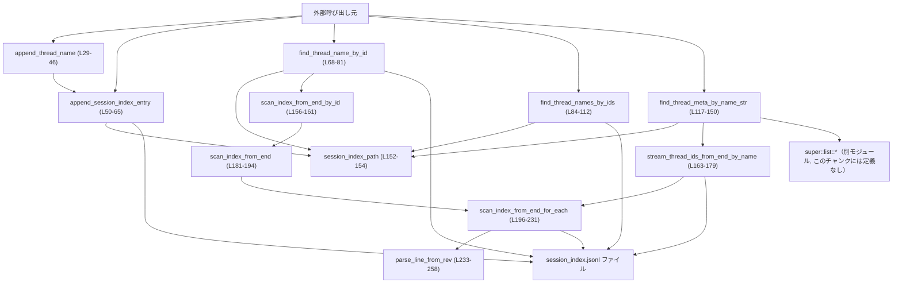
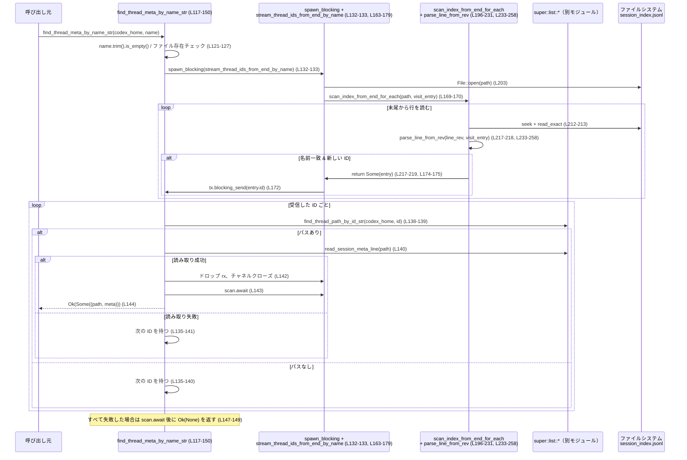

# rollout/src/session_index.rs

## 0. ざっくり一言

`session_index.jsonl` という JSON Lines ファイルを **append-only なセッション索引** として扱い、  
スレッド ID とスレッド名の対応付けや、スレッド名からロールアウトファイルのメタ情報を引き当てるモジュールです（`SessionIndexEntry` と各種検索・追記関数で構成、`session_index.rs:L17-25, L29-150`）。

---

## 1. このモジュールの役割

### 1.1 概要

- このモジュールは、**スレッド ID ↔ スレッド名** の対応関係を保持し、最新の状態を効率的に取得するための「セッションインデックス」を扱います。
- インデックスは `session_index.jsonl` に 1 行 1 エントリの JSON で追記されるだけで、**削除・上書きは行わない append-only ログ** になっています（`SESSION_INDEX_FILE` 定数とコメント, `session_index.rs:L17, L27-29, L48-49`）。
- 追加された行を元に、
  - ID から最新のスレッド名を引く
  - 複数 ID の最新スレッド名をまとめて引く
  - スレッド名から実際のロールアウトファイルとそのメタ情報を引く  
  といった機能を提供します（`session_index.rs:L67-81, L83-113, L115-150`）。

### 1.2 アーキテクチャ内での位置づけ

- このモジュールは、`codex_home` ディレクトリ配下の `session_index.jsonl` を読み書きする **ストレージ層の一部** です（`session_index_path`, `session_index.rs:L152-154`）。
- 実際のロールアウトファイル（セッションの本体）は `super::list` モジュール経由でアクセスされます。
  - `find_thread_meta_by_name_str` から `super::list::find_thread_path_by_id_str` と `super::list::read_session_meta_line` を呼び出しており（`session_index.rs:L135-140`）、  
    インデックスとロールアウトファイルの橋渡しをしています。
- 重いインデックススキャン処理は `std::fs::File` と同期 I/O で実装されており（`scan_index_from_end_for_each`, `session_index.rs:L196-231`）、  
  Tokio ランタイムをブロックしないよう `tokio::task::spawn_blocking` で実行されます（`session_index.rs:L77-79, L132-133`）。

代表的な依存関係を図示すると次のようになります。



### 1.3 設計上のポイント

- **append-only ログ設計**  
  - インデックスファイルは追記専用で、**最新行が正とみなされる** 前提です（コメント, `session_index.rs:L27-29, L48-49`）。
  - 更新（名前変更）も新しい行を追加するだけで表現します。
- **最新データの取り扱い**
  - 単一 ID に対する検索は、ファイル末尾から逆向きにスキャンし、最初にヒットした行を採用します（`scan_index_from_end_*`, `session_index.rs:L156-161, L181-194, L196-231`）。
  - 複数 ID に対する検索は先頭から順に読み込み、同一 ID に対する複数のエントリを `HashMap::insert` による上書きで「最後に見たもの＝最新」にします（`session_index.rs:L98-110`）。
- **非同期 I/O と同期 I/O の混在**
  - 追記や前から順の走査は Tokio の非同期ファイル API を使用（`append_session_index_entry`, `find_thread_names_by_ids`, `session_index.rs:L50-65, L93-110`）。
  - 末尾からの逆順スキャンは `std::fs::File` と同期 I/O を使い、Tokio のブロッキングスレッドプール上で実行されます（`scan_index_from_end_for_each`, `spawn_blocking`, `session_index.rs:L77-79, L132-133, L196-231`）。
- **安全性**
  - このファイル内に `unsafe` ブロックは存在せず、すべて Safe Rust で実装されています（`session_index.rs:L1-263`）。
  - JSON パースに失敗した行や、UTF-8 でない行、空行は **静かにスキップ** されるため、部分的なファイル破損に耐性があります（`parse_line_from_rev`, `session_index.rs:L240-257`）。
- **並行性**
  - 共有するのはファイルシステム上の `session_index.jsonl` のみで、グローバルな可変状態は持っていません。
  - 複数タスクからの `append_session_index_entry` 呼び出しに対して、コード上の排他制御はありません（`session_index.rs:L50-65`）。  
    OS の `append` モードに依存した挙動になる点が注意点です。

---

## 2. 主要な機能一覧

- セッションインデックスエントリ型 `SessionIndexEntry` の定義（ID・スレッド名・更新時刻）（`session_index.rs:L21-25`）
- スレッド名更新の追加（現在時刻を付与してインデックスに追記）: `append_thread_name`（`session_index.rs:L29-46`）
- 任意のインデックスエントリの追記: `append_session_index_entry`（`session_index.rs:L50-65`）
- スレッド ID から最新のスレッド名を取得: `find_thread_name_by_id`（`session_index.rs:L68-81`）
- 複数のスレッド ID から、それぞれの最新スレッド名を一括取得: `find_thread_names_by_ids`（`session_index.rs:L84-112`）
- スレッド名から、最新のロールアウトファイルパスとメタ行を取得: `find_thread_meta_by_name_str`（`session_index.rs:L117-150`）
- インデックスファイルパスの構築: `session_index_path`（`session_index.rs:L152-154`）
- インデックスをファイル末尾から逆順に走査する内部ユーティリティ群:
  - `scan_index_from_end_by_id` / `scan_index_from_end` / `scan_index_from_end_for_each` / `parse_line_from_rev`（`session_index.rs:L156-161, L181-194, L196-231, L233-258`）
  - スレッド名で末尾から ID をストリームする `stream_thread_ids_from_end_by_name`（`session_index.rs:L163-179`）

---

## 3. 公開 API と詳細解説

### 3.1 型・定数・関数インベントリー

#### 型・定数

| 名前 | 種別 | 公開範囲 | 行範囲 | 役割 / 用途 |
|------|------|----------|--------|-------------|
| `SessionIndexEntry` | 構造体 | `pub` | `session_index.rs:L21-25` | 1 行分のインデックスレコード。スレッド ID (`id`)、スレッド名 (`thread_name`)、更新時刻 (`updated_at`) を保持。`Serialize` / `Deserialize` 実装により JSON との相互変換が可能。 |
| `SESSION_INDEX_FILE` | 定数 `&'static str` | モジュール内 | `session_index.rs:L17` | インデックスファイル名 `"session_index.jsonl"`。`session_index_path` 等で使用。 |
| `READ_CHUNK_SIZE` | 定数 `usize` | モジュール内 | `session_index.rs:L18` | ファイルを末尾から読み込む際のチャンクサイズ（8192 バイト）。`scan_index_from_end_for_each` で使用。 |

#### 関数・モジュール

| 名前 | 種別 | 非同期 | 公開範囲 | 行範囲 | 役割 / 用途 |
|------|------|--------|----------|--------|-------------|
| `append_thread_name` | 関数 | `async` | `pub` | `session_index.rs:L29-46` | スレッド ID と名前、および現在時刻を含む `SessionIndexEntry` を生成し、インデックスに追記する。 |
| `append_session_index_entry` | 関数 | `async` | `pub` | `session_index.rs:L50-65` | 任意の `SessionIndexEntry` を JSON 行として `session_index.jsonl` に追記する低レベル API。 |
| `find_thread_name_by_id` | 関数 | `async` | `pub` | `session_index.rs:L68-81` | 単一のスレッド ID について、インデックスの末尾から逆順にスキャンし、最新のスレッド名を返す。 |
| `find_thread_names_by_ids` | 関数 | `async` | `pub` | `session_index.rs:L84-112` | 複数のスレッド ID について、ファイル先頭から走査して最新のスレッド名をマップとして返す。 |
| `find_thread_meta_by_name_str` | 関数 | `async` | `pub` | `session_index.rs:L117-150` | スレッド名から、末尾から ID を探索しつつロールアウトファイルパスとセッションメタ行を返す高レベル API。 |
| `session_index_path` | 関数 | 同期 | モジュール内 | `session_index.rs:L152-154` | `codex_home` からインデックスファイルのパス (`PathBuf`) を生成。 |
| `scan_index_from_end_by_id` | 関数 | 同期 | モジュール内 | `session_index.rs:L156-161` | 指定 ID と一致するエントリを末尾から探索するヘルパー。 |
| `stream_thread_ids_from_end_by_name` | 関数 | 同期 | モジュール内 | `session_index.rs:L163-179` | 指定スレッド名に対応する ID を、末尾から新しい順に `mpsc::Sender` 経由でストリームする。 |
| `scan_index_from_end` | 関数 | 同期 | モジュール内 | `session_index.rs:L181-194` | 条件関数に合致するエントリを末尾から探索し、最初に見つかったものを返す汎用ヘルパー。 |
| `scan_index_from_end_for_each` | 関数 | 同期 | モジュール内 | `session_index.rs:L196-231` | 末尾から 1 行ずつパースしながらコールバックに渡し、コールバックが `Some` を返したところで探索を終了するコアロジック。 |
| `parse_line_from_rev` | 関数 | 同期 | モジュール内 | `session_index.rs:L233-258` | 逆順に蓄積された 1 行分のバッファを正順に戻し、UTF-8 + JSON パースした上でコールバックに渡すヘルパー。 |
| `tests` | モジュール | - | `cfg(test)` | `session_index.rs:L261-263` | テストモジュール。実体は `session_index_tests.rs` にあり、このチャンクには内容は現れません。 |

---

### 3.2 重要な関数の詳細（最大 7 件）

#### `append_thread_name(codex_home: &Path, thread_id: ThreadId, name: &str) -> std::io::Result<()>`

**概要**

- スレッド名の更新をインデックスに追記する高レベル関数です。
- 現在の UTC 時刻を RFC3339 形式文字列に整形して `updated_at` に格納し、その情報を持つ `SessionIndexEntry` を `append_session_index_entry` に渡して書き込みます（`session_index.rs:L34-45`）。

**引数**

| 引数名 | 型 | 説明 |
|--------|----|------|
| `codex_home` | `&Path` | Codex のホームディレクトリパス。インデックスファイルはこの下の `session_index.jsonl` に作成されます。 |
| `thread_id` | `ThreadId` | 更新対象スレッドの ID。`ThreadId` はコピー可能であることがコードから分かります（`let id = *thread_id`, `session_index.rs:L76`）。 |
| `name` | `&str` | 設定したいスレッド名。ここではトリミングなどは行われず、そのまま保存されます（`session_index.rs:L42`）。 |

**戻り値**

- 成功時: `Ok(())`
- 失敗時: `Err(std::io::Error)`（後述のとおり JSON シリアライズエラーなども `io::Error` にラップされます）

**内部処理の流れ**

1. `time::OffsetDateTime::now_utc()` で現在の UTC 時刻を取得し（`session_index.rs:L34-37`）、`Rfc3339` 形式でフォーマットします（`session_index.rs:L38`）。
2. フォーマットに失敗した場合は `"unknown"` という文字列を `updated_at` に使います（`unwrap_or_else`, `session_index.rs:L38-39`）。
3. `SessionIndexEntry` を構築し、`id`, `thread_name`, `updated_at` を設定します（`session_index.rs:L40-44`）。
4. `append_session_index_entry(codex_home, &entry).await` を呼び出して、実際の書き込みを行います（`session_index.rs:L45`）。

**Examples（使用例）**

基本的な呼び出し例です。

```rust
use std::path::Path;                             // Path 型を使用する
use codex_protocol::ThreadId;                    // ThreadId 型（詳細はこのチャンクには現れません）
use rollout::session_index::append_thread_name;  // 本関数をインポートする（モジュールパスは例）

#[tokio::main]                                   // Tokio ランタイムを起動
async fn main() -> std::io::Result<()> {
    let codex_home = Path::new("/path/to/codex");    // Codex ホームディレクトリ
    let thread_id: ThreadId = /* どこかで取得 */;   // 既存スレッドの ID を用意する

    // スレッド名を "my-thread" に更新し、インデックスに追記する
    append_thread_name(codex_home, thread_id, "my-thread").await?;

    Ok(())                                          // エラーがなければ成功
}
```

**Errors / Panics**

- `append_session_index_entry` からのエラーをそのまま返します。
  - ファイルオープン・書き込み・flush の I/O エラー（`session_index.rs:L55-64`）
  - `serde_json::to_string(entry)` のエラーが `std::io::Error::other` でラップされたもの（`session_index.rs:L60`）
- 時刻フォーマット失敗時は `"unknown"` にフォールバックするため、ここではエラーにもパニックにもなりません（`session_index.rs:L37-39`）。

**Edge cases（エッジケース）**

- `name` が空文字や空白のみでも、そのまま保存されます。  
  後段の検索関数のうち、`find_thread_names_by_ids` は名前を `trim()` して空であれば無視しますが（`session_index.rs:L106-107`）、  
  `find_thread_meta_by_name_str` は保存された文字列をそのまま比較に使うため、空白の違いなどに注意が必要です（`session_index.rs:L129-130, L172`）。
- `codex_home` が存在しないディレクトリでも、`OpenOptions::create(true)` によりファイル自体は新規作成されますが、  
  親ディレクトリが存在しない場合は I/O エラーになります（`session_index.rs:L55-59`）。

**使用上の注意点**

- 非同期関数なので、Tokio などの非同期ランタイム上で呼び出す必要があります。
- スレッド名の正規化（トリミングや重複チェック）は行わないため、  
  一貫した命名ポリシーが必要であれば呼び出し側で処理する必要があります。

---

#### `append_session_index_entry(codex_home: &Path, entry: &SessionIndexEntry) -> std::io::Result<()>`

**概要**

- 実際に `session_index.jsonl` に 1 行を追記する低レベル関数です（`session_index.rs:L50-65`）。
- JSON シリアライズと追記・flush までを行います。

**引数**

| 引数名 | 型 | 説明 |
|--------|----|------|
| `codex_home` | `&Path` | インデックスファイルを配置するディレクトリ。 |
| `entry` | `&SessionIndexEntry` | 追記したいエントリ。呼び出し側で完全に構築して渡します。 |

**戻り値**

- 成功時: `Ok(())`
- 失敗時: `Err(std::io::Error)`

**内部処理の流れ**

1. `session_index_path(codex_home)` でパスを構成します（`session_index.rs:L54`）。
2. Tokio の `OpenOptions` を `.create(true).append(true)` で設定してファイルを開きます（`session_index.rs:L55-59`）。
3. `serde_json::to_string(entry)` で JSON 文字列へシリアライズし、`io::Error::other` でラップします（`session_index.rs:L60`）。
4. 改行を付加して `write_all` で追記し、`flush` でディスクへの書き込みを確定させます（`session_index.rs:L61-63`）。

**Examples（使用例）**

```rust
use std::path::Path;
use codex_protocol::ThreadId;
use rollout::session_index::{SessionIndexEntry, append_session_index_entry};

#[tokio::main]
async fn main() -> std::io::Result<()> {
    let codex_home = Path::new("/path/to/codex");

    // 直接 SessionIndexEntry を構築して追記する例
    let entry = SessionIndexEntry {
        id: /* 既存 ThreadId */,
        thread_name: "manual-entry".to_string(),
        updated_at: "2024-01-01T00:00:00Z".to_string(),
    };

    append_session_index_entry(codex_home, &entry).await?;

    Ok(())
}
```

**Errors / Panics**

- `tokio::fs::OpenOptions::open`、`write_all`、`flush` からの I/O エラーをそのまま返します（`session_index.rs:L55-59, L62-63`）。
- `serde_json::to_string` のエラーは `std::io::Error::other` に変換され、`ErrorKind::Other` として扱われます（`session_index.rs:L60`）。
- パニック要素はありません。

**Edge cases**

- エントリの JSON シリアライズに失敗した場合（たとえばフィールドがサポートされない型を持つなど）は、I/O エラーとして扱われます。
- 別タスク・別プロセスからも同じファイルに `append` している場合の挙動は、OS の保証に依存します。  
  コード側で明示的なロックは行っていません（`session_index.rs:L55-63`）。

**使用上の注意点**

- ログのように永続的に蓄積されるため、フィールドを追加・変更する場合には、過去行との互換性（JSON スキーマの後方互換）を考慮する必要があります。

---

#### `find_thread_name_by_id(codex_home: &Path, thread_id: &ThreadId) -> std::io::Result<Option<String>>`

**概要**

- 単一のスレッド ID に対する最新スレッド名を取得します（`session_index.rs:L67-81`）。
- インデックスファイルを **末尾から逆順に** スキャンし、最初に見つかった ID の行の `thread_name` を返します。

**引数**

| 引数名 | 型 | 説明 |
|--------|----|------|
| `codex_home` | `&Path` | Codex ホームディレクトリ。 |
| `thread_id` | `&ThreadId` | 検索対象のスレッド ID への参照。 |

**戻り値**

- `Ok(Some(name))`: インデックス内で当該 ID が見つかり、その最新エントリの `thread_name` が `name` に入る。
- `Ok(None)`: インデックスファイルが存在しないか、ID が見つからない場合。
- `Err(e)`: ファイル読み込みやスレッド join に失敗した場合の I/O エラー。

**内部処理の流れ**

1. `session_index_path(codex_home)` でパスを生成し、`path.exists()` でインデックスファイルの存在を確認します（`session_index.rs:L72-75`）。無ければ `Ok(None)`。
2. `let id = *thread_id;` で `ThreadId` のコピーを取得します（`session_index.rs:L76`）。
3. `spawn_blocking(move || scan_index_from_end_by_id(&path, &id))` を実行し、ブロッキングな逆順スキャンを別スレッドで実行します（`session_index.rs:L77`）。
4. `spawn_blocking` の結果と内部の `std::io::Result` を二重の `?` で伝播し（`map_err(std::io::Error::other)??`, `session_index.rs:L78-79`）、最終的に `Option<SessionIndexEntry>` を得ます。
5. あれば `entry.thread_name` を `String` として取り出し `Ok(Some(name))` を返します（`session_index.rs:L80`）。

**Examples（使用例）**

```rust
use std::path::Path;
use codex_protocol::ThreadId;
use rollout::session_index::find_thread_name_by_id;

async fn print_thread_name(codex_home: &Path, thread_id: &ThreadId) -> std::io::Result<()> {
    // 最新のスレッド名をインデックスから取得する
    if let Some(name) = find_thread_name_by_id(codex_home, thread_id).await? {
        println!("スレッド {:?} の最新名: {}", thread_id, name); // 見つかった場合
    } else {
        println!("スレッド {:?} の名前はインデックスに存在しません", thread_id); // 見つからなかった場合
    }
    Ok(())
}
```

**Errors / Panics**

- インデックスファイルが存在しない場合はエラーではなく `Ok(None)` になります（`session_index.rs:L72-75`）。
- 逆順スキャン中の I/O エラーや `spawn_blocking` の join エラーは、`std::io::Error::other` に変換されて返ります（`session_index.rs:L77-79`）。
- パニック要素はありません（`scan_index_from_end_by_id` 側も `?` ベースのエラーハンドリングです）。

**Edge cases**

- ファイルの途中の行が壊れていたり UTF-8 でなかった場合でも、その行は単純にスキップされるだけで、他の行の探索は続きます（`parse_line_from_rev`, `session_index.rs:L245-247, L255-257`）。
- ID に対応する複数行がある場合でも、末尾からスキャンされるため **最も新しいエントリが返されます**（`scan_index_from_end`, `session_index.rs:L181-194`）。

**使用上の注意点**

- 結果は `Option<String>` なので、`unwrap()` などで直接取り出すと `None` のケースでパニックします。`if let` や `match` で安全に扱うことが推奨されます。
- `spawn_blocking` を利用しているため、大量に並列に呼び出すとブロッキングスレッドプールの枯渇に注意が必要です（Tokio の仕様）。

---

#### `find_thread_names_by_ids(codex_home: &Path, thread_ids: &HashSet<ThreadId>) -> std::io::Result<HashMap<ThreadId, String>>`

**概要**

- 複数のスレッド ID について、最新のスレッド名を一括で取得する関数です（`session_index.rs:L83-113`）。
- インデックスファイルを **先頭から末尾まで順に** 読み込み、最後に見たエントリを最新として `HashMap` に格納します。

**引数**

| 引数名 | 型 | 説明 |
|--------|----|------|
| `codex_home` | `&Path` | Codex ホームディレクトリ。 |
| `thread_ids` | `&HashSet<ThreadId>` | 検索したいスレッド ID の集合。空集合の場合はすぐに空の結果を返します（`session_index.rs:L89-90`）。 |

**戻り値**

- 成功時: `Ok(HashMap<ThreadId, String>)`。存在した ID に対してのみ名前が含まれます。
- 失敗時: `Err(std::io::Error)`。

**内部処理の流れ**

1. `session_index_path` でパスを生成し、`thread_ids` が空またはファイルが存在しない場合は空のマップを返します（`session_index.rs:L88-91`）。
2. `tokio::fs::File::open` で非同期にファイルを開き、`tokio::io::BufReader` と `lines()` で 1 行ずつ非同期に読み込みます（`session_index.rs:L93-95`）。
3. 各行について:
   - `trim()` により空行をスキップ（`session_index.rs:L99-102`）。
   - `serde_json::from_str::<SessionIndexEntry>` でパースし、失敗行はスキップ（`session_index.rs:L103-105`）。
   - `thread_name.trim()` で名前をトリミングし、空でなければ対象 ID かどうかをチェック（`session_index.rs:L106-107`）。
   - `thread_ids` に含まれていれば `names.insert(entry.id, name.to_string())` で登録（`session_index.rs:L107-109`）。
4. すべての行を処理し終えたら `Ok(names)` を返します（`session_index.rs:L112`）。

**Examples（使用例）**

```rust
use std::collections::{HashMap, HashSet};
use std::path::Path;
use codex_protocol::ThreadId;
use rollout::session_index::find_thread_names_by_ids;

async fn load_names(codex_home: &Path, ids: HashSet<ThreadId>)
    -> std::io::Result<HashMap<ThreadId, String>>
{
    // 指定した ID 群の最新スレッド名をまとめて取得する
    let names = find_thread_names_by_ids(codex_home, &ids).await?;

    // ここで names を UI 表示やロギングなどに使用できる
    Ok(names)
}
```

**Errors / Panics**

- ファイルオープンや読み込み中の I/O エラーが `Err` として返されます（`session_index.rs:L93-95, L98`）。
- JSON パース失敗や空行は単にスキップされ、エラーにはなりません（`session_index.rs:L99-105`）。
- パニック要素はありません。

**Edge cases**

- ID 集合に含まれない行は無視されます。インデックスのサイズが大きくても、実際にマップに入るのは対象 ID のみです（`session_index.rs:L107-109`）。
- 同じ ID に対する複数行が存在する場合、先頭から順番に `insert` を行うため、「最後に見た名前」がマップに残り、**最新の名前** が取得されます（`session_index.rs:L98-110`）。
- ファイルサイズに比例して読み込み時間が増加します。対象 ID の数が少なくてもファイル全体を走査する点がパフォーマンス上の注意点です。

**使用上の注意点**

- 同期 I/O ではなく Tokio の非同期 I/O を使用しているため、`spawn_blocking` は不要ですが、大きなファイルに対して頻繁に呼び出すと全体の処理時間に影響する可能性があります。
- 結果マップには、インデックスに存在しない ID は含まれないため、呼び出し側で存在チェックを行う必要があります。

---

#### `find_thread_meta_by_name_str(codex_home: &Path, name: &str) -> std::io::Result<Option<(PathBuf, SessionMetaLine)>>`

**概要**

- スレッド名から、その名前に対応する最新のセッションロールアウトファイルとそのメタ情報を取得する高レベル関数です（`session_index.rs:L115-150`）。
- 名前のインデックスだけでなく、実際にロールアウトファイルが「読める状態か」を確認し、  
  未保存／壊れたセッション名が古いセッションを隠してしまうことを避けています（コメント, `session_index.rs:L130-137`）。

**引数**

| 引数名 | 型 | 説明 |
|--------|----|------|
| `codex_home` | `&Path` | Codex ホームディレクトリ。 |
| `name` | `&str` | 検索したいスレッド名。空白のみの場合はすぐに `None` を返します（`session_index.rs:L121-123`）。 |

**戻り値**

- `Ok(Some((path, meta)))`: 指定名のエントリが見つかり、かつ対応するロールアウトファイルとメタ情報の読込に成功した場合。
- `Ok(None)`: 名称に一致する有効なロールアウトが見つからない場合（インデックス無し／ファイル無し／メタ読込失敗など）。
- `Err(e)`: インデックススキャンや `super::list` 呼び出しで I/O エラーなどが発生した場合。

**内部処理の流れ**

1. `name.trim().is_empty()` をチェックし、空なら `Ok(None)`（`session_index.rs:L121-123`）。
2. インデックスファイルの存在を確認し、なければ `Ok(None)`（`session_index.rs:L124-127`）。
3. `tokio::sync::mpsc::channel(1)` を作成し、ID を受け取るレシーバ `rx` を用意（`session_index.rs:L128`）。
4. `name` を `String` にコピーし、`spawn_blocking(move || stream_thread_ids_from_end_by_name(&path, &name, tx))` を起動（`session_index.rs:L129-133`）。
   - このブロッキングタスクは末尾からスキャンし、指定名にマッチする ID を新しい順に `tx.blocking_send` で送信します（`session_index.rs:L163-179`）。
5. 非同期側では `while let Some(thread_id) = rx.recv().await` で ID を順に受信（`session_index.rs:L135`）。
   - 各 ID に対して `super::list::find_thread_path_by_id_str(codex_home, &thread_id.to_string())` でロールアウトファイルパスを探索し（`session_index.rs:L138-139`）、  
     見つかれば `super::list::read_session_meta_line(&path).await` でセッションメタ行を読み取ります（`session_index.rs:L140`）。
   - パスが見つかり、メタの読み取りも `Ok` であれば、`rx` を `drop` して sender に対しチャネルを閉じ（`session_index.rs:L142`）、  
     `scan.await`（ブロッキングタスクの終了待ち）後に結果を返します（`session_index.rs:L143-144`）。
6. どの ID に対しても有効なロールアウトが見つからなかった場合、スキャンタスクの終了を待ってから `Ok(None)` を返します（`session_index.rs:L147-149`）。

**Examples（使用例）**

```rust
use std::path::Path;
use rollout::session_index::find_thread_meta_by_name_str;

async fn open_by_name(codex_home: &Path, name: &str) -> std::io::Result<()> {
    // スレッド名からロールアウトのパスとメタ情報を取得する
    if let Some((path, meta)) = find_thread_meta_by_name_str(codex_home, name).await? {
        println!("{} のロールアウト: {:?}", name, path); // パスを表示
        println!("メタ情報: {:?}", meta);               // SessionMetaLine（詳細は別モジュール）
    } else {
        println!("スレッド名 '{}' に対応するロールアウトは見つかりません", name);
    }
    Ok(())
}
```

**Errors / Panics**

- インデックスファイルが存在しない・名前にマッチするエントリが無い・ロールアウトファイルが見つからない・メタ読込が失敗する、などの多くの場合は **エラーではなく `Ok(None)`** として扱われます（`session_index.rs:L121-127, L135-146`）。
- 逆順スキャン中の I/O エラーや `spawn_blocking` の join エラーは、`std::io::Error::other` として伝播します（`session_index.rs:L132-133, L143, L147`）。
- `super::list::*` 呼び出しの戻り値の具体的なエラー型はこのチャンクには現れませんが、`?` により `std::io::Result` へ変換される想定です（`session_index.rs:L139-140`）。
- パニック要素はありません。

**Edge cases**

- 指定名と完全一致するエントリのみが対象です。インデックスへの保存時にトリミングされないため、  
  大文字小文字や前後スペースの違いは別名として扱われます（`session_index.rs:L129-130, L172`）。
- インデックスの最新行がロールアウトファイル未保存のセッションを指している場合、その ID はスキップされ、  
  次に新しい一致 ID を試す挙動になります（コメント, `session_index.rs:L130-137`）。
- チャンネルのバッファサイズは 1 のため、ブロッキングスレッド側の `blocking_send` は受信側が読み取るまでブロックする可能性があります（`session_index.rs:L128, L172`）。  
  ただし受信は Tokio の非同期タスクで行われるため、デッドロックにはなりません。

**使用上の注意点**

- 名前からの検索は O(ファイルサイズ) の逆順スキャンになるため、インデックスが非常に大きい場合は時間がかかる可能性があります。
- 返り値は `Option<(PathBuf, SessionMetaLine)>` なので、`None` の扱いを明示してください。  
  CLI であれば「見つからなかった」というメッセージを出すなどの実装が必要です。
- `super::list` モジュールの振る舞い（ファイル名の規約やメタ情報の形式）はこのチャンクには現れないため、  
  その仕様変更があればこの関数の意味も変わる可能性があります。

---

#### `scan_index_from_end_for_each<F>(path: &Path, visit_entry: F) -> std::io::Result<Option<SessionIndexEntry>>`

**概要**

- `session_index.jsonl` を **末尾から先頭方向に** チャンク単位で読み込み、1 行ずつ `SessionIndexEntry` にパースしながらコールバック `visit_entry` に渡すコア関数です（`session_index.rs:L196-231`）。
- `visit_entry` が `Ok(Some(entry))` を返した時点で探索を打ち切り、そのエントリを返します。

**引数**

| 引数名 | 型 | 説明 |
|--------|----|------|
| `path` | `&Path` | インデックスファイルのパス。 |
| `visit_entry` | `F` | 各エントリ処理用コールバック。`FnMut(&SessionIndexEntry) -> std::io::Result<Option<SessionIndexEntry>>`。 |

**戻り値**

- `Ok(Some(entry))`: コールバックが `Some` を返した最初のエントリ。
- `Ok(None)`: 条件に合うエントリが無かった場合。
- `Err(e)`: ファイルオープン・読み込み・シークなどの I/O エラー。

**内部処理の流れ**

1. `File::open(path)` と `metadata().len()` でファイルサイズを取得（`session_index.rs:L203-205`）。
2. `remaining` に残りバイト数を保持しつつ、max `READ_CHUNK_SIZE` バイトずつ後ろから読み込む（`session_index.rs:L204, L208-213`）。
   - `usize::try_from` によるサイズ変換失敗は `io::Error::other` で扱う（`session_index.rs:L209-210`）。
3. 読み込んだチャンクを後ろから前へループし（`buf[..read_size].iter().rev()`, `session_index.rs:L215`）、バイト列を `line_rev` に蓄積。
   - 改行 (`b'\n'`) を検出したら `parse_line_from_rev` を呼び出し、1 行分を処理（`session_index.rs:L215-221`）。
   - `parse_line_from_rev` が `Ok(Some(entry))` を返せば、そのまま `Ok(Some(entry))` を返して探索終了（`session_index.rs:L217-219`）。
4. ファイル先頭まで読み終えた後、最後に残った `line_rev` に対しても `parse_line_from_rev` を呼び、結果があれば返す（`session_index.rs:L225-228`）。
5. 何も条件に合わなければ `Ok(None)`（`session_index.rs:L230`）。

**Examples（使用例）**

この関数は内部用ですが、概念的な使用例を示します。

```rust
use std::path::Path;
use rollout::session_index::{scan_index_from_end_for_each, SessionIndexEntry};

fn find_latest_matching<F>(path: &Path, mut pred: F) -> std::io::Result<Option<SessionIndexEntry>>
where
    F: FnMut(&SessionIndexEntry) -> bool,
{
    scan_index_from_end_for_each(path, |entry| {
        if pred(entry) {                      // 条件に合致したら
            Ok(Some(entry.clone()))          // そのエントリを返して探索終了
        } else {
            Ok(None)                         // それ以外は継続
        }
    })
}
```

**Errors / Panics**

- `File::open`, `metadata`, `seek`, `read_exact` などの I/O エラーをそのまま返します（`session_index.rs:L203-213`）。
- 行の UTF-8 パースや JSON パースは `parse_line_from_rev` 内で `Ok(None)` にフォールバックするため、これらによるエラーは発生しません（`session_index.rs:L245-247, L255-257`）。
- パニック要素はありません。

**Edge cases**

- ファイル末尾が改行で終わっていない場合でも、最後の `line_rev` を処理することで先頭の行まで正しく扱います（`session_index.rs:L225-228`）。
- 非 UTF-8 行や壊れた JSON 行は無視されるため、ファイルが部分的に壊れていても探索は継続します（`parse_line_from_rev`, `session_index.rs:L245-247, L255-257`）。
- 1 行が `READ_CHUNK_SIZE` より長い場合でも、複数チャンクをまたいで `line_rev` に蓄積されるため、論理的には行全体が処理されます（`line_rev` のライフタイム, `session_index.rs:L205, L215-223`）。

**使用上の注意点**

- 同期関数であり、ブロッキング I/O を行うため、Tokio コンテキストから直接呼ぶのではなく `spawn_blocking` 経由で使用する前提です（実際にそのようにラップされているのは `find_thread_name_by_id`, `find_thread_meta_by_name_str`, `session_index.rs:L77-79, L132-133`）。

---

#### `parse_line_from_rev<F>(line_rev: &mut Vec<u8>, visit_entry: &mut F) -> std::io::Result<Option<SessionIndexEntry>>`

**概要**

- 逆順に貯められた 1 行ぶんのバイト列を正順の `String` に戻し、CRLF 対応・空行チェック・JSON パースを行った上で `visit_entry` に渡します（`session_index.rs:L233-258`）。
- JSON パースに成功した行だけを `SessionIndexEntry` として扱います。

**引数**

| 引数名 | 型 | 説明 |
|--------|----|------|
| `line_rev` | `&mut Vec<u8>` | 逆順（末尾→先頭）で溜めた 1 行分のバイト列バッファ。処理後はクリアされます。 |
| `visit_entry` | `&mut F` | エントリ処理用コールバック。`FnMut(&SessionIndexEntry) -> std::io::Result<Option<SessionIndexEntry>>`。 |

**戻り値**

- `Ok(Some(entry))`: コールバックが `Some` を返した場合。
- `Ok(None)`: 空行・非 UTF-8・非 JSON 行、またはコールバックが `None` を返した場合。
- `Err(e)`: コールバック内部からの I/O エラー。

**内部処理の流れ**

1. `line_rev` が空であれば何もせず `Ok(None)` を返す（`session_index.rs:L240-242`）。
2. `line_rev.reverse()` でバイト列を正順に戻し、`std::mem::take(line_rev)` で所有権を奪ってバッファをクリア（`session_index.rs:L243-244`）。
3. `String::from_utf8(line)` を試み、失敗した場合は `Ok(None)`（非 UTF-8 行をスキップ, `session_index.rs:L245-247`）。
4. CRLF 対応のため、末尾が `\r` なら取り除く（`session_index.rs:L248-249`）。
5. `trim()` して空文字列なら `Ok(None)`（`session_index.rs:L251-253`）。
6. `serde_json::from_str::<SessionIndexEntry>(trimmed)` を試み、失敗すれば `Ok(None)`（`session_index.rs:L255-257`）。
7. 成功した `entry` を `visit_entry` に渡し、その戻り値を返す（`session_index.rs:L258`）。

**使用上の注意点**

- 内部ユーティリティであり、`scan_index_from_end_for_each` 経由でのみ使用されることを前提としています。
- JSON パースエラーや UTF-8 エラーをログ出力せず静かに無視する設計のため、  
  ファイル破損の検出は別途行う必要があります。

---

### 3.3 その他の関数

| 関数名 | 行範囲 | 役割（1 行） |
|--------|--------|--------------|
| `session_index_path(codex_home: &Path) -> PathBuf` | `session_index.rs:L152-154` | `codex_home` とファイル名定数を結合し、インデックスファイルパスを生成する。 |
| `scan_index_from_end_by_id(path: &Path, thread_id: &ThreadId) -> std::io::Result<Option<SessionIndexEntry>>` | `session_index.rs:L156-161` | 指定 ID と一致するエントリを末尾から探索するラッパー。`scan_index_from_end` にプレディケートを渡す。 |
| `stream_thread_ids_from_end_by_name(path: &Path, name: &str, tx: mpsc::Sender<ThreadId>) -> std::io::Result<()>` | `session_index.rs:L163-179` | 指定名に一致する最新 ID を末尾から新しい順に `blocking_send` でストリームする。既に見た ID は `seen` セットで除外。 |
| `scan_index_from_end<F>(path: &Path, predicate: F) -> std::io::Result<Option<SessionIndexEntry>>` | `session_index.rs:L181-194` | 条件関数 `predicate` を用いて、末尾から最初に条件を満たしたエントリを返す汎用関数。内部で `scan_index_from_end_for_each` を使用。 |

---

## 4. データフロー

ここでは、**スレッド名からロールアウトファイルとメタ情報を取得する** 処理のデータフローを説明します。

1. 呼び出し側が `find_thread_meta_by_name_str(codex_home, name)` を実行（`session_index.rs:L117-120`）。
2. 関数内でインデックスファイルの存在確認後、`spawn_blocking` により `stream_thread_ids_from_end_by_name` をブロッキングタスクとして起動（`session_index.rs:L124-133`）。
3. ブロッキングタスクは `scan_index_from_end_for_each` と `parse_line_from_rev` を用いて末尾から行を読み、指定名の最新 ID を `mpsc::Sender` で `tokio` 側へ送信（`session_index.rs:L163-179, L196-231, L233-258`）。
4. 非同期側は `rx.recv().await` で ID を受信し、各 ID について `super::list::find_thread_path_by_id_str` と `read_session_meta_line` を呼び出してロールアウトファイルの存在とメタ情報を確認（`session_index.rs:L135-141`）。
5. 有効なロールアウトが見つかればその時点でブロッキングタスクを停止させ（チャネルクローズ + `scan.await`）、 `(PathBuf, SessionMetaLine)` を呼び出し元へ返します（`session_index.rs:L142-145`）。

この流れをシーケンス図で表すと次のようになります。



---

## 5. 使い方（How to Use）

### 5.1 基本的な使用方法

例として、スレッド作成・名前変更後にインデックスへ追記し、  
後から ID や名前から情報を引き直す基本フローを示します。

```rust
use std::collections::HashSet;                        // HashSet 用
use std::path::Path;                                  // Path 型
use codex_protocol::ThreadId;                         // ThreadId 型（詳細はこのチャンクには現れません）
use codex_protocol::protocol::SessionMetaLine;        // SessionMetaLine 型
use rollout::session_index::{
    append_thread_name,
    find_thread_name_by_id,
    find_thread_names_by_ids,
    find_thread_meta_by_name_str,
};

#[tokio::main]                                        // Tokio ランタイムを起動
async fn main() -> std::io::Result<()> {
    let codex_home = Path::new("/path/to/codex");     // Codex ホームディレクトリ

    let thread_id: ThreadId = /* セッション作成時に得た ID */;

    // 1. スレッド名を登録（または変更）してインデックスに追記する
    append_thread_name(codex_home, thread_id, "my-session").await?;

    // 2. ID から最新名を取得する
    if let Some(name) = find_thread_name_by_id(codex_home, &thread_id).await? {
        println!("ID {:?} の最新名: {}", thread_id, name);
    }

    // 3. 複数 ID の最新名をまとめて取得する
    let mut ids = HashSet::new();
    ids.insert(thread_id);
    let names = find_thread_names_by_ids(codex_home, &ids).await?;
    println!("名前マップ: {:?}", names);

    // 4. 名前からロールアウトパスとメタ情報を取得する
    if let Some((path, meta)) = find_thread_meta_by_name_str(codex_home, "my-session").await? {
        println!("ロールアウトパス: {:?}, メタ: {:?}", path, meta);
    }

    Ok(())
}
```

### 5.2 よくある使用パターン

1. **UI 用の名前解決キャッシュ**

   - フロントエンドで複数スレッドを一覧表示したい場合、ID 一覧から名前を解決するのに `find_thread_names_by_ids` が有用です（`session_index.rs:L84-112`）。
   - 事前に `HashSet<ThreadId>` を組み立て、一括で名前を取得してから描画に利用できます。

2. **CLI からの名前指定アクセス**

   - ユーザがスレッド名だけを指定して CLI コマンドを実行する場合、内部では `find_thread_meta_by_name_str` を使うと、  
     「名前 → ロールアウトパス → メタ情報」という流れで目的のセッションを特定できます（`session_index.rs:L117-150`）。

3. **名前変更時の連続呼び出し**

   - 名前変更を履歴として残したい場合、変更のたびに `append_thread_name` を呼ぶことで過去の名前もインデックスに残ります（`session_index.rs:L27-29, L29-46`）。  
     検索時は常に最新行が採用されます。

### 5.3 よくある間違い

```rust
use std::path::Path;
use codex_protocol::ThreadId;
use rollout::session_index::find_thread_name_by_id;

async fn wrong_usage(codex_home: &Path, id: &ThreadId) -> std::io::Result<()> {
    // 間違い例: Option を無視して unwrap してしまう
    let name = find_thread_name_by_id(codex_home, id).await?.unwrap(); // ID が無いとパニック
    println!("名前: {}", name);
    Ok(())
}

async fn correct_usage(codex_home: &Path, id: &ThreadId) -> std::io::Result<()> {
    // 正しい例: None を考慮して分岐する
    match find_thread_name_by_id(codex_home, id).await? {
        Some(name) => println!("名前: {}", name),           // 見つかった
        None => println!("インデックスに名前がありません"), // 見つからないケース
    }
    Ok(())
}
```

- また、`find_thread_meta_by_name_str` に空文字や空白のみの名前を渡すと、常に `Ok(None)` になります（`session_index.rs:L121-123`）。
  - CLI などでユーザ入力を受け取る際は、事前に検証するか、`None` を適切に扱う必要があります。

### 5.4 使用上の注意点（まとめ）

- **非同期ランタイム前提**  
  全ての公開関数が `async` のため、Tokio などの非同期ランタイム上で呼び出す必要があります（`session_index.rs:L29, L50, L68, L84, L117`）。
- **append-only 前提**  
  インデックスファイルは追記のみを想定しており、削除や上書きとの組み合わせは想定されていません（`session_index.rs:L27-29, L48-49`）。
- **文字列比較の厳密さ**  
  名前検索 (`find_thread_meta_by_name_str`) は保存された文字列との完全一致で行われます（`session_index.rs:L129-130, L172`）。  
  トリミングや正規化は呼び出し側で行う必要があります。
- **並行書き込み**  
  同一ファイルへの複数タスクからの書き込みに対して、コード側で排他制御は行っていません（`session_index.rs:L55-63`）。  
  典型的な OS では `append` モードで行単位の破損は起こりにくいと考えられますが、行の一貫性が絶対に必要な場合は上位層でロックなどを検討する必要があります。

---

## 6. 変更の仕方（How to Modify）

### 6.1 新しい機能を追加する場合

例: `SessionIndexEntry` に新しいフィールド（例えばタグやユーザ ID）を追加したい場合。

1. **構造体の拡張**

   - `SessionIndexEntry` にフィールドを追加します（`session_index.rs:L21-25`）。
   - `Serialize` / `Deserialize` を derive しているため、単純なフィールド追加なら既存の JSON 行も問題なく読み込めるケースが多いです（新フィールドは `Default` 値になるなど）。

2. **追記側の更新**

   - `append_thread_name` などで新フィールドに値を設定するように変更します（`session_index.rs:L40-44`）。
   - 新フィールドの既定値がある場合は、呼び出し側に変更を強要しない設計も可能です。

3. **検索ロジックの更新**

   - 新フィールドを検索条件にしたい場合は、`scan_index_from_end_for_each` のコールバック内で条件を追加します（`session_index.rs:L188-193, L169-176`）。
   - 名前 + 新フィールドの組み合わせなど、複合条件の検索関数を新設することもできます。

4. **テスト追加**

   - 既存の `tests` モジュール（`session_index_tests.rs`）にテストケースを追加します（`session_index.rs:L261-263`）。  
     このチャンクにはテスト内容が現れないため、テストコード側での調整が必要です。

### 6.2 既存の機能を変更する場合

- **探索順序や「最新」の定義を変える場合**

  - `scan_index_from_end_*` 系関数に依存するすべての公開 API（`find_thread_name_by_id`, `find_thread_meta_by_name_str`）への影響を確認する必要があります（`session_index.rs:L68-81, L117-150, L156-161, L181-231`）。
  - 仕様として「最新の行が正」となっているため（コメント, `session_index.rs:L27-29, L48-49`）、  
    これを変更すると上位層の期待と食い違う可能性があります。

- **エラーハンドリングの方針変更**

  - 現在は JSON パース失敗や UTF-8 エラーを静かに無視しています（`parse_line_from_rev`, `session_index.rs:L245-247, L255-257`）。  
    これをログに出す／エラーとして返すなどに変える場合は、呼び出し側が新しいエラーを扱えるか確認する必要があります。

- **パフォーマンス改善**

  - 例えば、`find_thread_names_by_ids` で対象 ID の数が少ない場合に早期終了したい場合、  
    `names.len() == thread_ids.len()` を満たしたタイミングで `break` するなどの改善が考えられます（`session_index.rs:L96-110`）。  
    ただし、挙動としては変わらないため後方互換性は保たれます。

- 変更時には、`session_index.jsonl` の既存データとの互換性、`super::list` モジュールとのインターフェース、  
  そしてテストの更新を忘れないことが重要です。

---

## 7. 関連ファイル

| パス / モジュール | 役割 / 関係 |
|-------------------|------------|
| `rollout/src/session_index_tests.rs` | `#[cfg(test)]` で参照されるテストコード。インデックス追記・検索の挙動を検証する想定ですが、このチャンクには内容は現れません（`session_index.rs:L261-263`）。 |
| `rollout/src/list.rs` もしくは `rollout::list` モジュール（推測） | `super::list::find_thread_path_by_id_str` および `super::list::read_session_meta_line` を提供するモジュール。ロールアウトファイルの探索とメタ行の読み取りを担当しますが、このチャンクには実装は現れません（`session_index.rs:L138-140`）。 |
| `codex_protocol::ThreadId` | セッション ID を表す型。コピー可能であることがコードから分かりますが、詳細な構造はこのチャンクには現れません（`session_index.rs:L10, L76`）。 |
| `codex_protocol::protocol::SessionMetaLine` | ロールアウトファイルのメタ情報を 1 行として表す型。`find_thread_meta_by_name_str` の戻り値に含まれますが、詳細はこのチャンクには現れません（`session_index.rs:L11, L117-120`）。 |

このモジュールは、上記の関連モジュールと協調して「セッションの一覧性」と「名前／ID からの検索性」を提供する位置づけになっています。
